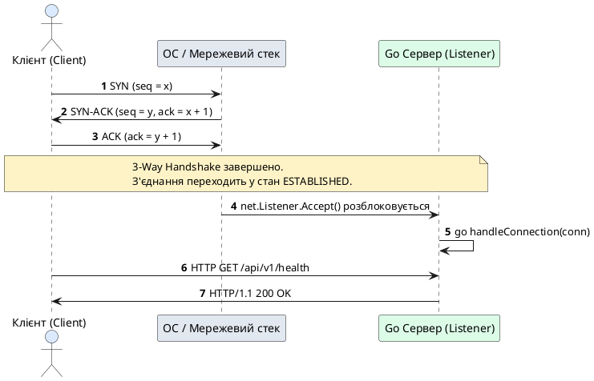
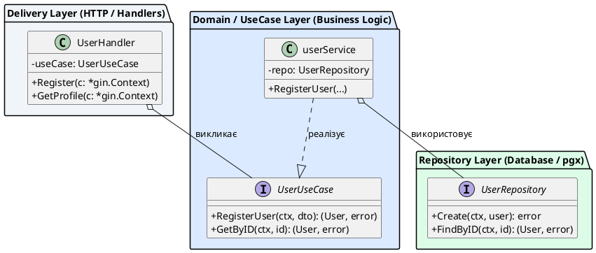

# Скіл: Створення лекцій для коледжу (College Lectures Creator)

Цей скіл призначений для написання структурованих, глибоких та методично вивірених лекційних матеріалів у стилі фундаментального підручника для студентів коледжів (рівень: фаховий молодший бакалавр / бакалавр за спеціальностями 121 «Інженерія програмного забезпечення», 122 «Комп'ютерні науки» тощо).

---

## 1. Фундаментальні мовні та стилістичні стандарти

### 1.1. Мова та термінологія
- **Виключно українська мова** для всього навчального матеріалу, пояснень, заголовків, коментарів до коду та підписів діаграм.
- **Перше згадування англійських термінів:** обов'язково вказуйте оригінальний англійський термін у круглих дужках при першому введенні поняття.
  - *Приклади:* покажчики (*pointers*), аналіз втечі (*escape analysis*), зрізи (*slices*), качина типізація (*duck typing*), конвеєр обробки (*middleware pipeline*), взаємна автентифікація (*mutual TLS / mTLS*).
- **Пріоритет індустріальних англіцизмів:** уникайте штучних або застарілих кальок, які не вживаються в реальній інженерній практиці.
  - ✅ **Правильно:** фреймворк, роутер / маршрутизатор, хендлер / обробник, мідлвар, патерн, пул з'єднань, десеріалізація, вебсокет, репозиторій.
  - ❌ **Неправильно:** каркас (замість фреймворку), павутиння (замість веб), перехоплювач (де стандартно вживається middleware/interceptor).
- **Термінологія ООП:** Використовувати термін **«наслідування»** (_inheritance_), а не «спадкування».

### 1.2. Тон викладення та академічний стиль
- **Стиль університетського підручника:** академічна точність, структурна логічність, виваженість формулювань.
- **Повні речення та закінчені думки:** категорично уникайте уривчастих тез, телеграфного стилю чи беззмістовних списків без розгорнутого коментаря. Кожен пункт списку має бути повноцінним реченням із поясненням «чому» і «як».
- **Без штучного пафосу та надмірного канцеляризму:** пояснюйте складні явища простою та точною інженерною мовою. Уникайте надутих псевдонаукових фраз (наприклад: *«іманентна дихотомія парадигмальних паттернів»* замінюйте на *«фундаментальна відмінність між підходами»*).
- **Формальний, але доброзичливий стиль:** звернення від автора/викладача до студентської аудиторії у безособовій формі або у формі спільної дії («розглянемо механізм», «зверніть увагу», «проаналізуємо поведінку системи»).

---

## 2. Педагогічні та методичні принципи

### 2.1. Текст — основа статті, код — лише ілюстрація
Лекція — це не шпаргалка з кодом і короткими коментарями. Це **розгорнуте концептуальне пояснення**.
- Код ніколи не подається «голим». Кожен лістинг коду має спиратися на попередній текст, який пояснює архітектурну задачу, та супроводжуватися наступним покроковим аналізом рядків.
- Код покликаний підкріпити сформульовану теоретичну тезу, а не замінити її.

### 2.2. Правило розгорнутих пояснень
Кожне ключове поняття чи механізм повинні містити щонайменше 2–3 ґрунтовні абзаци.

### 2.3. Плавні концептуальні мости (Bridge Building)
Матеріал має вибудовуватися як неперервний ланцюг:
- Починайте новий підрозділ із короткого зв'язку з тим, що студент вже знає: *«На попередньому етапі ми розглянули блокуючі TCP-сокети, де один потік обслуговував одного клієнта. Проте при зростанні навантаження до тисяч з'єднань витрати пам'яті на стек потоків стають критичними. Саме тому мова Go пропонує альтернативу...»*.

### 2.4. Передбачення запитань («А що, якщо...?»)
Випереджайте типові запитання та помилки студентів до того, як вони сформулюються в їхній уяві:
- *«А що станеться, якщо клієнт раптово розірве TCP-з'єднання під час запису в сокет?»*
- *«Чому ми повертаємо покажчик на структуру, а не копію значення?»*
- *«Чи виникне Deadlock, якщо обидві горутини спробують захопити м'ютекси у різному порядку?»*
Виділяйте такі відповіді через компоненти `::note`, `::warning` або `::accordion`.

---

## 3. Стандарти візуалізації: Діаграми PlantUML на світлому фоні

> 🚫 **СУВОРА ЗАБОРОНА ПСЕВДОГРАФІКИ (ASCII Art):**
> Категорично заборонено використовувати текстову ASCII-псевдографіку (рамки `┌───┐`, `│...│`, стрілочки `───►` тощо у блоках коду).
> Будь-які архітектурні схеми, процеси, структури даних чи взаємодії **повинні бути реалізовані виключно через діаграми PlantUML** (`::plant-uml`) або Mermaid (`::mermaid`).

Візуалізація архітектури та мережевих протоколів є обов'язковою для кожної лекції. Діаграми мають бути легкочитними та виконаними на **світлому фоні** із застосуванням чистого стилю.

### 3.1. Вимоги до PlantUML
- Обов'язково використовуйте директиву `skinparam style plain` або чітку світлу палітру (`skinparam backgroundColor #FFFFFF`, чіткі темні лінії `#1E293B`, м'які кольори заливки `#E2E8F0`, `#DBEAFE`, `#FEF3C7`).
- Огортайте діаграми в компонент Docus `::plant-uml`.

#### Приклад діаграми послідовності (Sequence Diagram):
````markdown
::plant-uml{alt="TCP Handshake та передача даних"}



::
````

#### Приклад діаграми структури/класів (Clean Architecture Layers):
````markdown
::plant-uml{alt="Шари Clean Architecture"}



::
````

---

## 4. Використання Docus MDC компонентів (Суворий синтаксис)

> ⚠️ **КРИТИЧНЕ ПРАВИЛО ФОРМАТУВАННЯ DOCUS:**
> 1. Закриваючий тег `::` завжди має починатися з початку нового рядка без жодних пробілів.
> 2. Перед кожним закриваючим `::` **обов'язково повинен бути порожній рядок** (особливо після списків або блоків коду), щоб автоформатери не зміщували теги!

### 4.1. Картки та групи карток (`::card-group`, `::card`)
Використовуються для вступних цілей лекції, ключових концепцій та підсумкового закріплення матеріалу.

```markdown
::card-group

::card{title="🎯 Мета лекції" icon="i-lucide-target"}

- Опанувати принципи роботи Berkeley Sockets API у середовищі Go.
- Зрозуміти різницю між блокуючим введенням/виведенням та подійно-орієнтованим планувальником Netpoller.
- Навчитися проєктувати надійні прикладні протоколи поверх потоку байтів TCP.

::

::card{title="🔑 Ключові терміни" icon="i-lucide-key"}

- **Socket Descriptor:** числовий ідентифікатор відкритого сокета в ОС.
- **TCP Stream:** неперервний потік байтів без збереження меж повідомлень.
- **Framing:** механізм структурування даних у прикладні пакети.

::

::
```

### 4.2. Акценти та примітки (`::note`, `::tip`, `::warning`, `::caution`)

```markdown
::note
У середовищі Go функція `net.Listen` створює неблокуючий сокет на рівні ОС, інтегрований із внутрішнім мережевим полінгом середовища виконання (*runtime netpoller*).
::

::tip
Завжди передавайте `context.Context` першим аргументом у мережеві виклики та методи доступу до даних. Це гарантує своєчасне звільнення ресурсів у разі обриву з'єднання.
::

::warning
Протокол TCP не гарантує, що один виклик `Write()` на клієнті відповідатиме одному виклику `Read()` на сервері. Байтовий потік може фрагментуватися або склеюватися (ефект *packet framing*).
::

::caution
Ніколи не зберігайте відкриті паролі або приватні ключі у відкритому вигляді у коді або конфігураційних файлах. Використовуйте змінні оточення та хешування за допомогою `bcrypt`.
::
```

### 4.3. Багатомовні команди та встановлення пакетів (`::tabs`, `::tabs-item`)
*Відповідно до інструкцій робочого простору, якщо у лекції наводяться інструкції запуску/встановлення Python або CLI-утиліт, показуйте їх через вкладки `pip`, `uv`, `poetry` або `go get` / `docker`:*

```markdown
::tabs
::tabs-item{label="Go Modules"}
```bash
go get -u github.com/gin-gonic/gin
go get -u github.com/jackc/pgx/v5
```
::
::tabs-item{label="Docker Compose"}
```bash
docker compose up -d postgres
```
::
::
```

### 4.4. Порівняння підходів та альтернатив (`::code-group`)

````markdown
::code-group

```go [Чистий net/http]
http.HandleFunc("/api/v1/user", func(w http.ResponseWriter, r *http.Request) {
    if r.Method != http.MethodGet {
        http.Error(w, "Method Not Allowed", http.StatusMethodNotAllowed)
        return
    }
    w.Header().Set("Content-Type", "application/json")
    json.NewEncoder(w).Encode(user)
})
```

```go [Маршрутизатор Chi]
r := chi.NewRouter()
r.Get("/api/v1/user", func(w http.ResponseWriter, r *http.Request) {
    render.JSON(w, r, user)
})
```

```go [Фреймворк Gin]
r := gin.Default()
r.GET("/api/v1/user", func(c *gin.Context) {
    c.JSON(http.StatusOK, user)
})
```

::
````

### 4.5. Структура проєкту (`::code-tree`)

````markdown
::code-tree

```go [cmd/server/main.go]
package main

func main() {
    // Точка входу в застосунок
}
```

```go [internal/domain/user.go]
package domain

type User struct {
    ID    string `json:"id"`
    Email string `json:"email"`
}
```

```go [internal/delivery/http/handler.go]
package http

type Handler struct {
    // Обробники HTTP запитів
}
```

::
````

### 4.6. Термінальні результати та логи (`::terminal-preview`)

```markdown
::terminal-preview{title="go run cmd/server/main.go" :cursor="true"}

<div class="line"><span class="opacity-40">$</span> <strong class="font-bold">go run cmd/server/main.go</strong></div>
<div class="line"><span class="text-blue-400 font-bold">INFO</span> [2026-08-28 15:30:00] Server listening on address <span class="text-green-400 font-bold">:8080</span></div>
<div class="line"><span class="text-blue-400 font-bold">INFO</span> [2026-08-28 15:30:04] Incoming connection accepted <span class="opacity-40">remote_addr=127.0.0.1:54320</span></div>
<div class="line"><span class="text-green-400 font-bold">SUCCESS</span> Handshake completed. Spawned worker goroutine <span class="text-blue-400 font-bold">#42</span></div>
::
```

### 4.7. Візуалізація пам'яті та налагодження (`::memory-view`, `::debugger-view`)
Використовуйте для пояснення тем роботи з покажчиками, адресації, структур пам'яті стеку/купи та аналізу втечі (Escape Analysis):

```markdown
::debugger-view{title="Goroutine Local Frame" :variables='[{"name": "conn", "type": "net.Conn", "value": "0x00c0000a4020"}, {"name": "buffer", "type": "[]byte (len=1024, cap=1024)", "value": "[0x47, 0x45, 0x54, ...]"}]'}
::
```

### 4.8. Покрокові інструкції (`::steps`)

```markdown
::steps

### Крок 1. Створення сокета слухача (Listening Socket)
Сервер зв'язується з обраним портом за допомогою системного виклику `bind` та переходить у режим очікування через `listen`.

### Крок 2. Прийом з'єднання у циклі (Accept Loop)
Основний потік блокується на виклику `Accept()` до моменту надходження нового запиту від клієнта.

### Крок 3. Делегування обробки горутині (Goroutine Spawning)
Для кожного успішного підключення створюється легковага горутина `go handleClient(conn)`, що звільняє головний цикл для нових з'єднань.

::
```

### 4.9. Інтерактивні запитання для самоконтролю (`::accordion`, `::accordion-item`)

```markdown
::accordion

::accordion-item{label="❓ Чому не можна ігнорувати помилку, яку повертає conn.Close()?" icon="i-lucide-help-circle"}

Хоча виклик `Close()` сигналізує про завершення роботи із сокетом, помилка при закритті може свідчити про скидання невідправлених буферів операційної системи (TCP RST) або збій дескриптора файлу. Логування цієї помилки є критичним для діагностики витоків дескрипторів сокетів (*file descriptor leaks*).

::

::accordion-item{label="❓ Чому буферизований канал може запобігти блокуванню горутини-відправника?" icon="i-lucide-help-circle"}

Буферизований канал володіє фіксованою ємністю внутрішнього кільцевого буфера. Відправник блокується лише тоді, коли буфер повністю заповнений, що дозволяє згладжувати короткочасні сплески трафіку без зупинки генератора подій.

::

### 4.10. Математичні та формальні формули (`::math-formula`)

> ⚠️ **ВАЖЛИВО:** Сирий синтаксис формул `$$...$$` чи `$...$` не підтримується автоматично. Будь-які математичні вирази, формули та формальні позначення мають оформлюватися виключно через компонент `::math-formula`:

**Блоковий режим:**
```markdown
::math-formula
\text{Connection} = \{\text{Protocol}, \text{Source IP}, \text{Source Port}, \text{Destination IP}, \text{Destination Port}\}
::
```

**Вбудований (inline) режим:**
```markdown
Формула :math-formula{tex="E = mc^2" inline} у середині тексту.
```

---

> 🚫 **ЗАБОРОНА ЧИСЛОВОЇ НУМЕРАЦІЇ В ЗАГОЛОВКАХ:**
> Ніколи не використовуйте штучні числові префікси в заголовках (`## 1. `, `### 1.1. `, `### 1.2. ` тощо).
> Заголовки (H2 `##`, H3 `###`) мають бути природними, змістовними та описовими (наприклад: `## Архітектурний контекст та еволюція систем`, `### Проблема монолітів минулого`).

---
