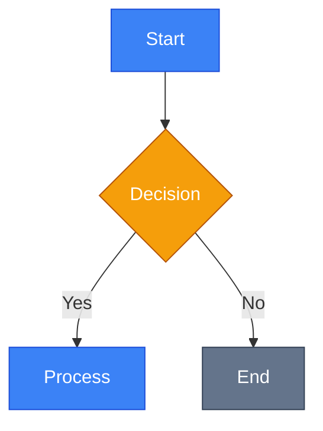

# Docus Components Reference (v4)

Повний довідник компонентів Docus для MDC (Markdown Dynamic Components) синтаксису. Ця документація призначена для точного написання компонентів — без вигадок, тільки робочий синтаксис.

---

## Зміст

1. [Callouts (Акценти)](#callouts-акценти)
2. [Cards (Картки)](#cards-картки)
3. [Code Components (Код)](#code-components-код)
4. [Accordion (Акордеон)](#accordion-акордеон)
5. [Tabs (Вкладки)](#tabs-вкладки)
6. [Steps (Кроки)](#steps-кроки)
7. [Field (Поля)](#field-поля)
8. [Collapsible (Згортання)](#collapsible-згортання)
9. [Badge (Бейджі)](#badge-бейджі)
10. [Icon (Іконки)](#icon-іконки)
11. [Kbd (Клавіші)](#kbd-клавіші)
12. [Custom: Mermaid](#custom-mermaid)
13. [Custom: PlantUML](#custom-plantuml)
14. [Code Block Features (MDC Magic)](#code-block-features-mdc-magic)

---

## ⚠️ Важливо: Автоформатування

При використанні автоформатерів (Prettier, тощо) закриваючі теги `::` можуть отримувати зайві пробіли на початку (2-4 пробіли). Це ламає синтаксис MDC. Як правило, воно відбувається при списках.

```markdown
::tip
**Переваги extraArgument:**

- Легше тестувати (можна передати mock api)
- Централізована конфігурація API (headers, базовий URL)
- Можна передати кілька сервісів: `thunk.withExtraArgument({ api, analytics, logger })`
  ::← Форматер додав пробіли! це завжди так, перед списками!
```

**Проблема:**

```markdown
::card-group

::card{title="Заголовок"}
Контент
:: ← Форматер додав пробіли!

:: ← Форматер додав пробіли!
```

**Рішення:** Додавайте порожній рядок **перед** закриваючим тегом:

```markdown
::card-group

::card{title="Заголовок"}
Контент

::

::
```

> **Правило:** Закриваючий `::` завжди має починатися з початку рядка, без будь-яких пробілів.

---

## Callouts (Акценти)

Компоненти для виділення важливої інформації. Доступні типи: `note`, `tip`, `warning`, `caution`, `callout`.

### ::note

Додатковий контекст або нейтральна інформація.

```markdown
::note
Тут розміщується додаткова інформація або примітка.
::
```

### ::tip

Корисні поради, best practices.

```markdown
::tip
Використовуйте `readonly` для незмінних полів, які ініціалізуються лише один раз.
::
```

### ::warning

Застереження, потенційні проблеми.

```markdown
::warning
Будьте обережні з цією дією — вона може мати непередбачувані наслідки.
::
```

### ::caution

Критичні застереження, небезпечні дії.

```markdown
::caution
Цю дію неможливо скасувати.
::
```

### ::callout (розширений)

Загальний компонент із підтримкою кастомних іконок та кольорів.

```markdown
::callout{icon="i-lucide-info" color="primary"}
Lorem velit voluptate ex reprehenderit ullamco et culpa.
::
```

**Атрибути:**

| Атрибут | Тип    | Опис                                        |
| ------- | ------ | ------------------------------------------- |
| `icon`  | string | Іконка (iconify формат: `i-lucide-*`)       |
| `color` | string | Колір: `primary`, `neutral`, `error`, тощо. |

---

## Cards (Картки)

### ::card-group + ::card

Картки для навігації, групування концепцій або резюме.

**✅ Рекомендований синтаксис (Frontmatter у YAML):**

```markdown
::card-group

::card{title="✅ Заголовок 1" icon="i-heroicons-magnifying-glass"}

- Пункт 1
- Пункт 2

::

::card{title="🔒 Заголовок 2" icon="i-heroicons-shield-check"}

- Пункт A
- Пункт B

::

::
```

**Атрибути ::card:**

| Атрибут  | Тип    | Опис                               |
| -------- | ------ | ---------------------------------- |
| `title`  | string | Заголовок картки                   |
| `icon`   | string | Іконка (iconify формат)            |
| `to`     | string | URL для посилання                  |
| `target` | string | Target атрибут (`_blank`, `_self`) |
| `color`  | string | Колір картки                       |

---

## Code Components (Код)

### ::code-group

Групування блоків коду у вкладки. Ідеально для порівняння синтаксису або показу команд для різних платформ.

````markdown
::code-group

```bash [pnpm]
pnpm add @nuxt/ui-pro@next
```
````

```bash [yarn]
yarn add @nuxt/ui-pro@next
```

```bash [npm]
npm install @nuxt/ui-pro@next
```

::

````

### ::code-tree

Візуалізація структури файлів та директорій з можливістю перегляду вмісту файлів.

```markdown
::code-tree

    ```csharp [GlobalUsings.cs]
    global using System;
    global using System.Linq;
    ```

    ```csharp [Services/UserService.cs]
    namespace MyApp.Services;
    public class UserService { }
    ```

::
````

**Особливості:**

- Шлях файлу у `[папка/файл.ext]` формує дерево директорій автоматично.
- Підтримка синтаксису підсвічування для будь-якої мови.

### ::code-collapse

Довгий код, який за замовчуванням згорнутий.

````markdown
::code-collapse

```css [main.css]
@import 'tailwindcss';
@theme {
    --font-sans: 'Public Sans', sans-serif;
    --color-green-50: #effdf5;
}
```
````

::

````

### ::code-preview

Демонстрація результату виконання коду (живий приклад). Лише для HTML/Vue компонентів.

```markdown
::code-preview
<button class="btn">Click me</button>
::
````

---

## Accordion (Акордеон)

Інтерактивний компонент для FAQ, деталей, що розгортаються.

```markdown
::accordion
::accordion-item{label="Що таке Docus?" icon="i-lucide-circle-help"}
Docus — це тема документації для Nuxt, побудована на Nuxt UI Pro.
::
::accordion-item{label="Як почати?" icon="i-lucide-circle-help"}
Створіть папку `content/` і почніть писати Markdown файли.
::
::
```

**Атрибути ::accordion-item:**

| Атрибут | Тип    | Опис               |
| ------- | ------ | ------------------ |
| `label` | string | Заголовок елемента |
| `icon`  | string | Іконка (iconify)   |

---

## Tabs (Вкладки)

Для групування контенту за вкладками (різні підходи, платформи).

```markdown
::tabs
::tabs-item{label="Windows"}
Встановіть через Chocolatey: `choco install dotnet`
::
::tabs-item{label="macOS"}
Встановіть через Homebrew: `brew install dotnet`
::
::tabs-item{label="Linux"}
Встановіть через APT: `sudo apt install dotnet-sdk-8.0`
::
::
```

**Атрибути ::tabs-item:**

| Атрибут | Тип    | Опис             |
| ------- | ------ | ---------------- |
| `label` | string | Назва вкладки    |
| `icon`  | string | Іконка (iconify) |

**З іконками:**

```markdown
::tabs{.w-full}
::tabs-item{icon="i-lucide-code" label="Code"}
Тут код
::
::tabs-item{icon="i-lucide-eye" label="Preview"}
Тут результат
::
::
```

---

## Steps (Кроки)

Для алгоритмів, інструкцій або логічних послідовностей.

```markdown
::steps

### Крок 1: Встановлення

Виконайте команду встановлення.

### Крок 2: Налаштування

Створіть файл конфігурації.

### Крок 3: Запуск

Запустіть проєкт.
::
```

> **Важливо:** Кожен крок починається з `###` заголовка.

---

## Field (Поля)

Для документації параметрів, властивостей API або конфігурацій.

```markdown
::field-group
::field{name="analytics" type="boolean"}
Default to `false` — Enables analytics for your project.
::
::field{name="database" type="boolean"}
Default to `false` — Enables SQL database.
::
::
```

**Атрибути ::field:**

| Атрибут    | Тип    | Опис                            |
| ---------- | ------ | ------------------------------- |
| `name`     | string | Назва параметра                 |
| `type`     | string | Тип (`boolean`, `string`, тощо) |
| `required` | bool   | Чи обов'язковий                 |
| `default`  | string | Значення за замовчуванням       |

---

## Collapsible (Згортання)

Для великих шматків коду або додаткової інформації, яку можна згорнути.

````markdown
::collapsible{title="Показати повний код"}

```typescript
// Довгий код тут
interface ComplexInterface {
    // багато властивостей
}
```
````

::

````

**Атрибути:**

| Атрибут | Тип    | Опис              |
| ------- | ------ | ----------------- |
| `title` | string | Заголовок кнопки  |
| `open`  | bool   | Відкрито за замовчуванням |

---

## Badge (Бейджі)

Для версій, тегів або статусів.

```markdown
::badge{color="green"}
v1.0.0
::
````

**Inline синтаксис:**

```markdown
Стаття :badge[Draft]{color="amber"}
```

**Атрибути:**

| Атрибут | Тип    | Опис                                       |
| ------- | ------ | ------------------------------------------ |
| `color` | string | `green`, `amber`, `red`, `blue`, `neutral` |

---

## Icon (Іконки)

Вбудовані іконки з Iconify.

```markdown
:icon{name="i-heroicons-check-circle" class="text-green-500"}
```

**Атрибути:**

| Атрибут | Тип    | Опис                   |
| ------- | ------ | ---------------------- |
| `name`  | string | Назва іконки (iconify) |
| `class` | string | CSS класи              |

**Формат назви іконок:**

- Heroicons: `i-heroicons-*`
- Lucide: `i-lucide-*`
- Simple Icons: `i-simple-icons-*`

---

## Kbd (Клавіші)

Відображення клавіатурних скорочень.

```markdown
Натисніть :kbd[Ctrl] + :kbd[C] для копіювання.
```

---

## Custom: Mermaid

Кастомний компонент для діаграм Mermaid. Рендериться клієнтською бібліотекою mermaid.js з темною темою.

**Синтаксис:**

````markdown
::mermaid


````

::

````

**Підтримувані типи діаграм:**

| Тип               | Використання                   |
| ----------------- | ------------------------------ |
| `graph`/`flowchart` | Блок-схеми, потоки даних     |
| `sequenceDiagram` | Взаємодія між актором         |
| `classDiagram`    | UML класи                      |
| `stateDiagram-v2` | Стани та переходи              |
| `erDiagram`       | Entity Relationship            |
| `gantt`           | Діаграми Ганта                 |
| `pie`             | Кругові діаграми               |
| `timeline`        | Часові лінії                   |
| `mindmap`         | Ментальні карти                |
| `gitGraph`        | Git-гілки                      |

**Рекомендована кольорова схема:**

-   Primary: `#3b82f6` (Blue)
-   Secondary: `#64748b` (Slate)
-   Accent: `#f59e0b` (Amber) — для важливих нодів
-   Text: `#ffffff` (White)

---

## Custom: PlantUML

Кастомний компонент для PlantUML діаграм. Використовує PlantUML сервер для рендерингу.

**Синтаксис (рекомендовано plain стиль):**

```markdown
::plant-uml

```plantuml
@startuml
skinparam style plain

class User {
    - id: Long
    - name: String
    + getId(): Long
    + getName(): String
}

class Order {
    - orderId: Long
    - total: BigDecimal
}

User "1" -- "*" Order : places

@enduml
````

::

````

**Атрибути:**

| Атрибут  | Тип    | За замовчуванням            | Опис                    |
| -------- | ------ | --------------------------- | ----------------------- |
| `server` | string | `https://www.plantuml.com/plantuml` | PlantUML сервер  |
| `format` | string | `svg`                       | `svg`, `png`, `txt`     |
| `alt`    | string | `PlantUML Diagram`          | Alt текст зображення    |

**Підтримувані типи діаграм:**

| Тип                | Використання                     |
| ------------------ | -------------------------------- |
| `@startuml`        | UML діаграми (class, sequence)   |
| `@startmindmap`    | Ментальні карти                  |
| `@startwbs`        | Work Breakdown Structure         |
| `@startgantt`      | Діаграми Ганта                   |
| `@startsalt`       | Wireframes                       |
| `@startjson`       | JSON візуалізація                |
| `@startyaml`       | YAML візуалізація                |

**Plain стиль (обов'язково для консистентності):**

```plantuml
@startuml
skinparam style plain
skinparam defaultFontName Segoe UI

' Ваша діаграма тут

@enduml
````

---

## Mermaid vs PlantUML: Коли що використовувати

```


┌─────────────────────────────┬───────────────────────────────────────────────┐
│         MERMAID             │              PLANTUML                         │
├─────────────────────────────┼───────────────────────────────────────────────┤
│ ✅ Flowcharts               │ ✅ Complex Class Diagrams                     │
│ ✅ Sequence (simple)        │ ✅ Detailed Sequence Diagrams                 │
│ ✅ Quick sketches           │ ✅ Database ER Diagrams                       │
│ ✅ State machines           │ ✅ Component/Deployment Diagrams              │
│ ✅ Git graphs               │ ✅ Wireframes (Salt)                          │
│ ✅ Browser-native           │ ✅ Enterprise-grade UML                       │
│                             │ ✅ Mind maps with complex layouts             │
├─────────────────────────────┼───────────────────────────────────────────────┤
│ ❌ Limited UML support      │ ❌ Requires server                            │
│ ❌ Less layout control      │ ❌ More verbose syntax                        │
│ ❌ Basic styling            │ ❌ Slower rendering                           │
└─────────────────────────────┴───────────────────────────────────────────────┘
```

### Рекомендації:

| Сценарій                        | Вибір    |
| ------------------------------- | -------- |
| Швидка блок-схема алгоритму     | Mermaid  |
| Детальна UML-діаграма класів    | PlantUML |
| Sequence diagram (до 5 акторів) | Mermaid  |
| Sequence diagram (5+ акторів)   | PlantUML |
| ER-діаграма бази даних          | PlantUML |
| Стан-машина (state diagram)     | Обидва   |
| Mind map з групуванням          | PlantUML |
| Простий таймлайн                | Mermaid  |
| Діаграма компонентів системи    | PlantUML |
| Git flow візуалізація           | Mermaid  |

---

## Code Block Features (MDC Magic)

### Line Numbers

Додавання нумерації рядків:

````markdown
```typescript showLineNumbers
const x = 1
const y = 2
```
````

````

### Highlighting (підсвічування рядків)

**Через атрибут:**

```markdown
```typescript {1,3-5}
const highlighted = true;
const normal = false;
const alsoHighlighted = true;
````

````

**Через коментар:**

```typescript
const normal = false;
const highlighted = true; // [!code highlight]
````

### Diffs (показ змін)

```typescript
const old = true; // [!code --]
const new = false; // [!code ++]
```

### Focus (фокус уваги)

```typescript
const normal = 1
const focused = 2 // [!code focus]
const normal2 = 3
```

### Filename (назва файлу)

````markdown
```typescript [app.config.ts]
export default defineAppConfig({})
```
````

````

---

## Загальний синтаксис MDC

### Inline компоненти

```markdown
:component-name[слот]{атрибут="значення"}
````

Приклади:

```markdown
:badge[v1.0]{color="green"}
:icon{name="i-heroicons-star"}
:kbd[Ctrl]
```

### Block компоненти

```markdown
::component-name{атрибут="значення"}
Контент (default slot)
::
```

### Вкладені компоненти (кількість `:` має збільшуватись)

```markdown
::parent
:::child
Content
:::
::
```

### YAML Frontmatter атрибути

```markdown
## ::component

title: Заголовок
icon: i-heroicons-star
to: /link

---

Контент
::
```

---

## Перелік усіх компонентів

| Компонент        | Тип    | Призначення                        |
| ---------------- | ------ | ---------------------------------- |
| `accordion`      | block  | Розгортаємий FAQ                   |
| `accordion-item` | nested | Елемент акордеону                  |
| `badge`          | inline | Версії, теги, статуси              |
| `callout`        | block  | Загальний callout з налаштуваннями |
| `card`           | block  | Картка контенту                    |
| `card-group`     | block  | Група карток                       |
| `caution`        | block  | Критичне застереження              |
| `code-collapse`  | block  | Згорнутий блок коду                |
| `code-group`     | block  | Вкладки з кодом                    |
| `code-icon`      | inline | Іконка поруч з кодом               |
| `code-preview`   | block  | Preview результату                 |
| `code-tree`      | block  | Дерево файлів з кодом              |
| `collapsible`    | block  | Згортаємий контент                 |
| `field`          | block  | Документація параметра             |
| `field-group`    | block  | Група полів                        |
| `icon`           | inline | Іконка Iconify                     |
| `kbd`            | inline | Клавіатурна клавіша                |
| `note`           | block  | Примітка                           |
| `steps`          | block  | Покрокова інструкція               |
| `tabs`           | block  | Вкладки контенту                   |
| `tabs-item`      | nested | Елемент вкладки                    |
| `tip`            | block  | Корисна порада                     |
| `warning`        | block  | Застереження                       |
| `mermaid`        | custom | Mermaid діаграми                   |
| `plant-uml`      | custom | PlantUML діаграми                  |

---

> **Останнє оновлення:** Лютий 2026
