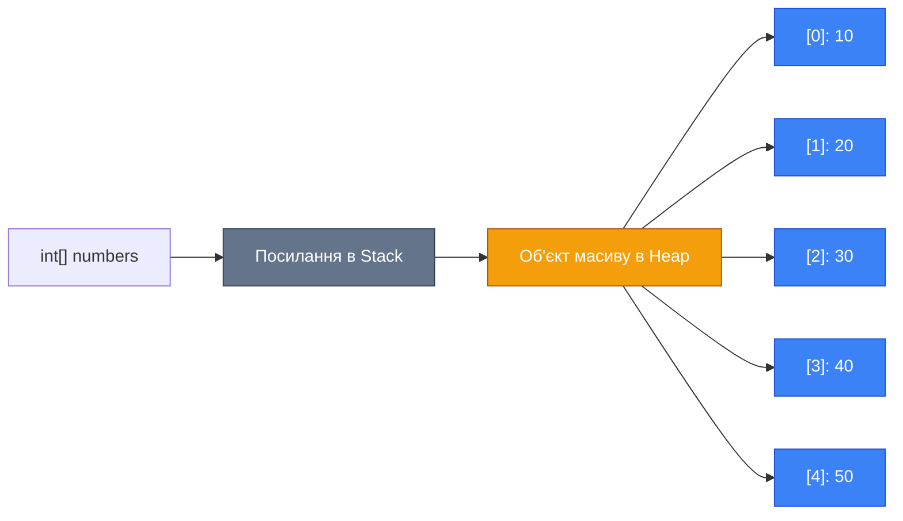
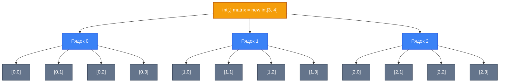
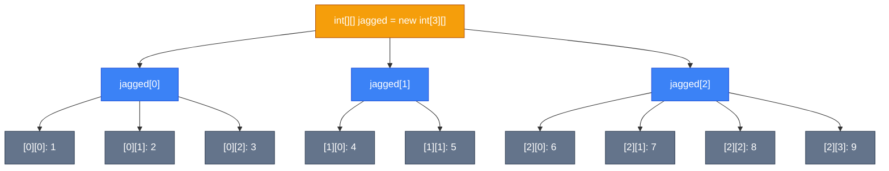
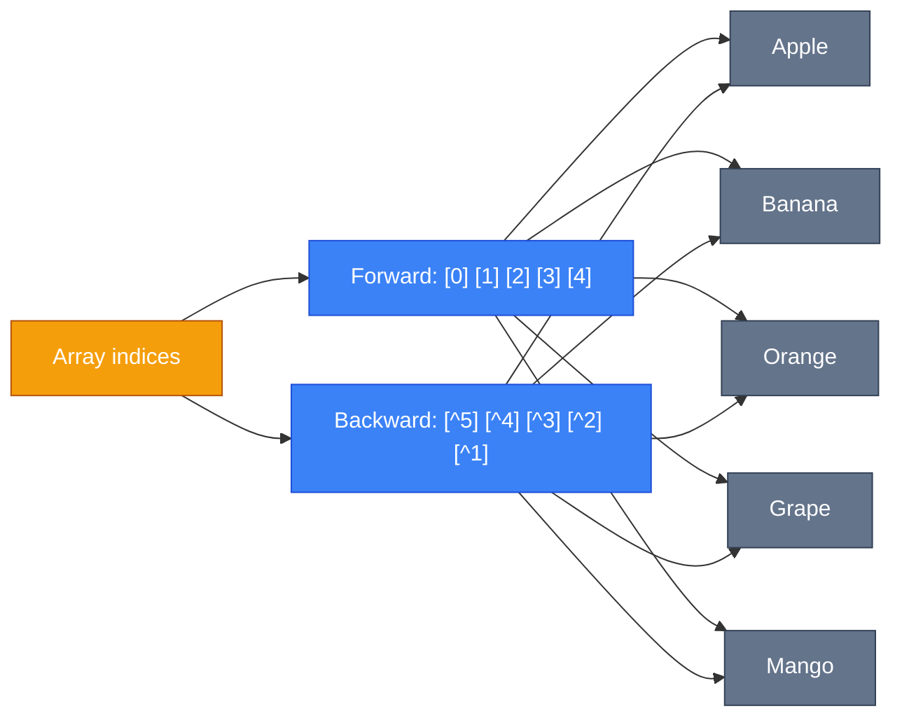

# Масиви

## Вступ та Контекст

Уявіть, що вам потрібно зберегти оцінки 30 студентів у курсі. Створювати 30 окремих змінних (`grade1`, `grade2`, ..., `grade30`) — це не тільки незручно, а й майже неможливо підтримувати. Саме для таких ситуацій існують [**масиви** (Arrays)](https://learn.microsoft.com/en-us/dotnet/csharp/language-reference/builtin-types/arrays).

Масиви — це фундаментальна структура даних, яка дозволяє зберігати декілька значень одного типу під одним ім'ям. Вони є будівельними блоками для більш складних колекцій та структур даних у C#.

::tip
**Цікавий факт**: Масиви в C# зберігаються в керованій купі ([Managed Heap](https://learn.microsoft.com/en-us/dotnet/standard/garbage-collection/fundamentals)), навіть якщо вони містять типи значень. Це означає, що сам масив є [**reference type**](https://learn.microsoft.com/en-us/dotnet/csharp/language-reference/keywords/reference-types), хоча він може зберігати value types.
::

### Що ви дізнаєтесь

У цьому розділі ви опануєте:

-   Різні типи масивів (одновимірні, багатовимірні, зубчасті)
-   Способи створення та ініціалізації масивів
-   Операції з масивами та методи класу [`Array`](https://learn.microsoft.com/en-us/dotnet/api/system.array)
-   Сучасні можливості роботи з індексами та діапазонами (C# 8+)
-   Типові проблеми та їх вирішення

### Передумови

Перед початком вивчення цієї теми рекомендується:

-   Розуміння змінних та типів даних
-   Знання про value types vs reference types
-   Базове розуміння циклів (`for`, `foreach`)

## Фундаментальні Концепції

### Що таке масив?

**Масив** (Array) — це структура даних фіксованого розміру, яка зберігає послідовність елементів **одного типу** під одним ім'ям. Кожен елемент доступний через числовий **індекс** (index).

::mermaid



::

**Ключові характеристики масивів:**

| Характеристика            | Опис                                                           |
| :------------------------ | :------------------------------------------------------------- |
| **Фіксований розмір**     | Після створення розмір масиву не може бути змінений            |
| **Гомогенність**          | Всі елементи мають один і той самий тип                        |
| **0-based indexing**      | Індексація починається з 0 (перший елемент має індекс 0)       |
| **Reference type**        | Сам масив зберігається в Heap, навіть якщо містить value types |
| **Послідовне розміщення** | Елементи зберігаються в пам'яті послідовно (cache-friendly)    |

::note
**Чому індексація з 0?** Історично індекс — це **зміщення** (offset) від початку масиву. Перший елемент має зміщення 0 байтів, другий — 1×(розмір елемента) байтів, тощо.
::

## Типи Масивів

C# підтримує три типи масивів, кожен з яких призначений для різних сценаріїв.

### Одновимірні масиви

[**Одновимірний масив** (Single-dimensional array)](https://learn.microsoft.com/en-us/dotnet/csharp/language-reference/builtin-types/arrays#single-dimensional-arrays) — це найпростіший тип масиву, який представляє лінійну послідовність елементів.

#### Оголошення та ініціалізація

::code-group

```csharp [Спосіб 1: Розмір + Присвоювання]
// Створення масиву на 5 елементів
int[] numbers = new int[5];

// Присвоювання значень
numbers[0] = 10;
numbers[1] = 20;
numbers[2] = 30;
numbers[3] = 40;
numbers[4] = 50;

Console.WriteLine(numbers[0]); // 10
```

```csharp [Спосіб 2: Array Initializer]
// Ініціалізація з явним типом та розміром
int[] numbers = new int[] { 10, 20, 30, 40, 50 };

// Скорочений синтаксис (тип виводиться автоматично)
int[] numbers2 = { 10, 20, 30, 40, 50 };

Console.WriteLine(numbers.Length); // 5
```

```csharp [Спосіб 3: Collection Expression (C# 12+)]
// Найсучасніший синтаксис
int[] numbers = [10, 20, 30, 40, 50];

// Порожній масив
int[] empty = [];

// Інші типи
string[] names = ["Alice", "Bob", "Charlie"];
```

::

#### Доступ до елементів

```csharp showLineNumbers
string[] fruits = ["Apple", "Banana", "Orange", "Grape"];

// Читання елементів
Console.WriteLine(fruits[0]);  // Apple
Console.WriteLine(fruits[2]);  // Orange

// Зміна елементів
fruits[1] = "Mango";
Console.WriteLine(fruits[1]);  // Mango

// Останній елемент
Console.WriteLine(fruits[fruits.Length - 1]); // Grape

// Index from end operator (^ - C# 8+)
Console.WriteLine(fruits[^1]); // Grape (останній)
Console.WriteLine(fruits[^2]); // Orange (передостанній)
```

::warning
**Увага**: Спроба доступу до неіснуючого індексу призведе до [`IndexOutOfRangeException`](https://learn.microsoft.com/en-us/dotnet/api/system.indexoutofrangeexception):

```csharp
int[] nums = [1, 2, 3];
int value = nums[10]; // ❌ IndexOutOfRangeException
```

::

### Багатовимірні масиви

[**Багатовимірний масив** (Multidimensional array)](https://learn.microsoft.com/en-us/dotnet/csharp/language-reference/builtin-types/arrays#multidimensional-arrays) — це масив з двома або більше вимірами. Найпоширеніші — **2D масиви** (матриці).

#### 2D Масиви (Прямокутні масиви)

```csharp showLineNumbers
// Оголошення 2D масиву 3×4 (3 рядки, 4 стовпці)
int[,] matrix = new int[3, 4];

// Ініціалізація з значеннями
int[,] numbers = {
    { 1, 2, 3, 4 },
    { 5, 6, 7, 8 },
    { 9, 10, 11, 12 }
};

// Доступ до елементів
Console.WriteLine(numbers[0, 0]);  // 1
Console.WriteLine(numbers[1, 2]);  // 7
Console.WriteLine(numbers[2, 3]);  // 12

// Зміна елемента
numbers[1, 1] = 99;
Console.WriteLine(numbers[1, 1]);  // 99
```

::mermaid



::

#### 3D Масиви та вище

```csharp showLineNumbers
// 3D масив: 2×3×4 (2 "шари", 3 рядки, 4 стовпці)
int[,,] cube = new int[2, 3, 4];

// Ініціалізація
int[,,] data = {
    {
        { 1, 2, 3, 4 },
        { 5, 6, 7, 8 },
        { 9, 10, 11, 12 }
    },
    {
        { 13, 14, 15, 16 },
        { 17, 18, 19, 20 },
        { 21, 22, 23, 24 }
    }
};

// Доступ: [шар, рядок, стовпець]
Console.WriteLine(data[0, 1, 2]); // 7
Console.WriteLine(data[1, 2, 3]); // 24
```

#### Властивості багатовимірних масивів

```csharp showLineNumbers
int[,] matrix = new int[3, 4];

// Загальна кількість елементів
Console.WriteLine($"Length: {matrix.Length}"); // 12 (3×4)

// Кількість вимірів
Console.WriteLine($"Rank: {matrix.Rank}"); // 2

// Розмір конкретного виміру
Console.WriteLine($"Dimension 0: {matrix.GetLength(0)}"); // 3 (рядки)
Console.WriteLine($"Dimension 1: {matrix.GetLength(1)}"); // 4 (стовпці)
```

### Зубчасті масиви

[**Зубчастий масив** (Jagged array)](https://learn.microsoft.com/en-us/dotnet/csharp/language-reference/builtin-types/arrays#jagged-arrays) — це **масив масивів**, де кожен внутрішній масив може мати різну довжину.

::code-group

```csharp [Створення]
// Оголошення зубчастого масиву з 3 рядків
int[][] jaggedArray = new int[3][];

// Ініціалізація кожного внутрішнього масиву окремо
jaggedArray[0] = new int[] { 1, 2, 3 };       // 3 елементи
jaggedArray[1] = new int[] { 4, 5 };          // 2 елементи
jaggedArray[2] = new int[] { 6, 7, 8, 9 };    // 4 елементи

// Доступ
Console.WriteLine(jaggedArray[0][0]); // 1
Console.WriteLine(jaggedArray[1][1]); // 5
Console.WriteLine(jaggedArray[2][3]); // 9
```

```csharp [Ініціалізація]
// Повна ініціалізація при створенні
int[][] numbers =
{
    new int[] { 1, 2, 3 },
    new int[] { 4, 5 },
    new int[] { 6, 7, 8, 9 }
};

// Скорочений синтаксис (C# 12+)
int[][] data =
[
    [1, 2, 3],
    [4, 5],
    [6, 7, 8, 9]
];
```

::

::mermaid



::

#### Коли використовувати зубчасті масиви?

| Сценарій                           | Приклад                                                              |
| :--------------------------------- | :------------------------------------------------------------------- |
| **Трикутна матриця**               | Кожен рядок має різну кількість елементів                            |
| **Дані з нерегулярною структурою** | Список студентів, де кожен має різну кількість оцінок                |
| **Економія пам'яті**               | Коли не всі комірки прямокутної матриці використовуються             |
| **Кращу продуктивність**           | Jagged arrays швидші за multidimensional (менше arithmetic overhead) |

::tip
**Performance**: Зубчасті масиви зазвичай швидші за багатовимірні, оскільки кожен внутрішній масив — це окремий об'єкт з послідовним розміщенням в пам'яті.
::

#### Порівняння: Багатовимірні vs Зубчасті

| Критерій                 | Багатовимірний `int[,]` | Зубчастий `int[][]`                            |
| :----------------------- | :---------------------- | :--------------------------------------------- |
| **Структура**            | Прямокутна матриця      | Масив масивів                                  |
| **Розмір рядків**        | Всі однакові            | Можуть бути різні                              |
| **Синтаксис доступу**    | `array[i, j]`           | `array[i][j]`                                  |
| **Продуктивність**       | Повільніше              | Швидше                                         |
| **Використання пам'яті** | Менше overhead          | Більше overhead (кожен рядок — окремий об'єкт) |
| **Випадок використання** | Матриці, таблиці        | Нерегулярні структури                          |

## Операції з Масивами

### Перебір елементів

::code-group

```csharp [for loop]
int[] numbers = [10, 20, 30, 40, 50];

// Перебір з індексом
for (int i = 0; i < numbers.Length; i++)
{
    Console.WriteLine($"Index {i}: {numbers[i]}");
}

// Зворотний перебір
for (int i = numbers.Length - 1; i >= 0; i--)
{
    Console.WriteLine(numbers[i]);
}
```

```csharp [foreach loop]
string[] fruits = ["Apple", "Banana", "Orange"];

// Простий перебір (read-only)
foreach (string fruit in fruits)
{
    Console.WriteLine(fruit);
}

// ❌ Не можна змінювати елементи через foreach
// foreach (string fruit in fruits)
// {
//     fruit = "New"; // Помилка компіляції
// }
```

```csharp [2D Array]
int[,] matrix = {
    { 1, 2, 3 },
    { 4, 5, 6 },
    { 7, 8, 9 }
};

// Вкладені цикли
for (int row = 0; row < matrix.GetLength(0); row++)
{
    for (int col = 0; col < matrix.GetLength(1); col++)
    {
        Console.Write($"{matrix[row, col]} ");
    }
    Console.WriteLine();
}

// Output:
// 1 2 3
// 4 5 6
// 7 8 9
```

```csharp [Jagged Array]
int[][] jagged =
[
    [1, 2, 3],
    [4, 5],
    [6, 7, 8, 9]
];

// Перебір з вкладеними циклами
for (int i = 0; i < jagged.Length; i++)
{
    Console.Write($"Row {i}: ");
    for (int j = 0; j < jagged[i].Length; j++)
    {
        Console.Write($"{jagged[i][j]} ");
    }
    Console.WriteLine();
}

// Output:
// Row 0: 1 2 3
// Row 1: 4 5
// Row 2: 6 7 8 9
```

::

### Копіювання масивів

```csharp showLineNumbers
int[] original = [1, 2, 3, 4, 5];

// ❌ ПОМИЛКА: Копіювання посилання (shallow copy)
int[] reference = original;
reference[0] = 999;
Console.WriteLine(original[0]); // 999 (змінився оригінал!)

// ✅ Спосіб 1: Array.Copy
int[] copy1 = new int[5];
Array.Copy(original, copy1, original.Length);

// ✅ Спосіб 2: Clone (повертає object, потрібне приведення)
int[] copy2 = (int[])original.Clone();

// ✅ Спосіб 3: CopyTo
int[] copy3 = new int[5];
original.CopyTo(copy3, 0);

// ✅ Спосіб 4: Новий масив з Range (C# 8+)
int[] copy4 = original[..]; // Копіює весь масив

// Перевірка
copy1[0] = 100;
Console.WriteLine(original[0]); // 1 (оригінал не змінився)
```

::warning
**Важливо**: Всі наведені способи створюють **shallow copy** (поверхневу копію). Якщо масив містить reference types, копіюються лише посилання, а не самі об'єкти.

```csharp
string[] original = ["Hello", "World"];
string[] copy = (string[])original.Clone();

// Рядки незмінні, тому це безпечно
// Але для власних класів це може бути проблемою!
```

::

## Клас Array

Всі масиви в C# успадковуються від класу [`System.Array`](https://learn.microsoft.com/en-us/dotnet/api/system.array), який надає багато корисних методів.

### Властивості

```csharp showLineNumbers
int[] numbers = [10, 20, 30, 40, 50];
int[,] matrix = new int[3, 4];

// Length - загальна кількість елементів
Console.WriteLine(numbers.Length);    // 5
Console.WriteLine(matrix.Length);     // 12

// Rank - кількість вимірів
Console.WriteLine(numbers.Rank);      // 1
Console.WriteLine(matrix.Rank);       // 2

// GetLength(dimension) - розмір конкретного виміру
Console.WriteLine(matrix.GetLength(0)); // 3 (рядки)
Console.WriteLine(matrix.GetLength(1)); // 4 (стовпці)

// GetLowerBound / GetUpperBound
Console.WriteLine(numbers.GetLowerBound(0)); // 0
Console.WriteLine(numbers.GetUpperBound(0)); // 4 (останній індекс)
```

### Методи сортування та реверсу

```csharp showLineNumbers
// Sort - сортування за зростанням
int[] numbers = [5, 2, 8, 1, 9];
Array.Sort(numbers);
Console.WriteLine(string.Join(", ", numbers));
// Output: 1, 2, 5, 8, 9

// Reverse - зворотний порядок
Array.Reverse(numbers);
Console.WriteLine(string.Join(", ", numbers));
// Output: 9, 8, 5, 2, 1

// Сортування рядків (alphabetically)
string[] names = ["Zoryana", "Anna", "Bohdan"];
Array.Sort(names);
Console.WriteLine(string.Join(", ", names));
// Output: Anna, Bohdan, Zoryana
```

::tip
**Складність**: `Array.Sort()` використовує **IntroSort** (гібрид QuickSort, HeapSort та InsertionSort) з часовою складністю O(n log n) у середньому випадку.
::

### Методи пошуку

::code-group

```csharp [IndexOf / LastIndexOf]
string[] fruits = ["Apple", "Banana", "Orange", "Banana"];

// IndexOf - перше входження
int index1 = Array.IndexOf(fruits, "Banana");
Console.WriteLine(index1); // 1

// LastIndexOf - останнє входження
int index2 = Array.LastIndexOf(fruits, "Banana");
Console.WriteLine(index2); // 3

// Якщо не знайдено - повертає -1
int index3 = Array.IndexOf(fruits, "Grape");
Console.WriteLine(index3); // -1
```

```csharp [Find / FindAll]
int[] numbers = [1, 5, 10, 15, 20, 25];

// Find - перший елемент, що відповідає умові
int first = Array.Find(numbers, x => x > 10);
Console.WriteLine(first); // 15

// FindAll - всі елементи, що відповідають умові
int[] filtered = Array.FindAll(numbers, x => x > 10);
Console.WriteLine(string.Join(", ", filtered));
// Output: 15, 20, 25

// FindIndex - індекс першого елемента
int index = Array.FindIndex(numbers, x => x > 10);
Console.WriteLine(index); // 3
```

```csharp [Exists / TrueForAll]
int[] numbers = [2, 4, 6, 8, 10];

// Exists - чи є хоча б один елемент, що відповідає умові
bool hasOdd = Array.Exists(numbers, x => x % 2 != 0);
Console.WriteLine(hasOdd); // false

// TrueForAll - чи всі елементи відповідають умові
bool allEven = Array.TrueForAll(numbers, x => x % 2 == 0);
Console.WriteLine(allEven); // true
```

::

### Інші корисні методи

```csharp showLineNumbers
int[] numbers = [1, 2, 3, 4, 5];

// Clear - обнулення діапазону елементів
Array.Clear(numbers, 1, 3); // Обнулити 3 елементи, починаючи з індексу 1
Console.WriteLine(string.Join(", ", numbers));
// Output: 1, 0, 0, 0, 5

// Fill - заповнення значенням (C# 10+)
int[] data = new int[5];
Array.Fill(data, 42);
Console.WriteLine(string.Join(", ", data));
// Output: 42, 42, 42, 42, 42

// Resize - зміна розміру (створює НОВИЙ масив!)
int[] original = [1, 2, 3];
Array.Resize(ref original, 5);
Console.WriteLine(string.Join(", ", original));
// Output: 1, 2, 3, 0, 0
```

::warning
**Важливо про `Array.Resize`**: Цей метод **НЕ** змінює існуючий масив. Він створює новий масив та оновлює посилання. Якщо є інші посилання на старий масив, вони залишаться незмінними.

```csharp
int[] arr1 = [1, 2, 3];
int[] arr2 = arr1; // Додаткове посилання

Array.Resize(ref arr1, 5);

Console.WriteLine(arr1.Length); // 5 (новий масив)
Console.WriteLine(arr2.Length); // 3 (старий масив)
```

::

## Індекси та Діапазони (C# 8+)

C# 8 додав потужні можливості для роботи з масивами: [**Index**](https://learn.microsoft.com/en-us/dotnet/api/system.index) (`^`) та [**Range**](https://learn.microsoft.com/en-us/dotnet/api/system.range) (`..`).

### Index from End (`^`)

```csharp showLineNumbers
string[] fruits = ["Apple", "Banana", "Orange", "Grape", "Mango"];

// Зворотна індексація
Console.WriteLine(fruits[^1]); // Mango (останній)
Console.WriteLine(fruits[^2]); // Grape (передостанній)
Console.WriteLine(fruits[^5]); // Apple (перший, якщо рахувати з кінця)

// Еквівалент старому способу
Console.WriteLine(fruits[fruits.Length - 1]); // Mango
Console.WriteLine(fruits[fruits.Length - 2]); // Grape

// Можна використовувати в змінних
Index lastIndex = ^1;
Console.WriteLine(fruits[lastIndex]); // Mango
```

::mermaid



::

### Range Operator (`..`)

```csharp showLineNumbers
int[] numbers = [0, 1, 2, 3, 4, 5, 6, 7, 8, 9];

// Range: [start..end] (end не включається)
int[] slice1 = numbers[2..5];   // [2, 3, 4]
int[] slice2 = numbers[0..3];   // [0, 1, 2]
int[] slice3 = numbers[5..];    // [5, 6, 7, 8, 9] (до кінця)
int[] slice4 = numbers[..4];    // [0, 1, 2, 3] (з початку)
int[] slice5 = numbers[..];     // [0, 1, 2, 3, 4, 5, 6, 7, 8, 9] (весь масив)

// Комбінація з Index from End
int[] slice6 = numbers[^5..^1]; // [5, 6, 7, 8]
int[] slice7 = numbers[2..^2];  // [2, 3, 4, 5, 6, 7]

// Зберігання range у змінній
Range middle = 3..7;
int[] slice8 = numbers[middle]; // [3, 4, 5, 6]

Console.WriteLine(string.Join(", ", slice1)); // 2, 3, 4
Console.WriteLine(string.Join(", ", slice6)); // 5, 6, 7, 8
```

::tip
**Візуалізація Range**:

```
numbers = [0, 1, 2, 3, 4, 5, 6, 7, 8, 9]
                 ↑     ↑
       [2..5] виділяє індекси 2, 3, 4 (5 не включається)
```

::

## Практична Реалізація

### Типові сценарії використання

::code-group

```csharp [Обчислення статистики]
int[] scores = [85, 92, 78, 95, 88, 76];

// Сума
int sum = 0;
foreach (int score in scores)
{
    sum += score;
}
Console.WriteLine($"Sum: {sum}"); // 514

// Середнє значення
double average = (double)sum / scores.Length;
Console.WriteLine($"Average: {average:F2}"); // 85.67

// Максимум та мінімум
int max = scores[0];
int min = scores[0];
foreach (int score in scores)
{
    if (score > max) max = score;
    if (score < min) min = score;
}
Console.WriteLine($"Max: {max}, Min: {min}"); // Max: 95, Min: 76
```

```csharp [Пошук елемента]
string[] students = ["Anna", "Bohdan", "Olena", "Dmytro"];
string searchName = "Olena";

// Лінійний пошук
int foundIndex = -1;
for (int i = 0; i < students.Length; i++)
{
    if (students[i] == searchName)
    {
        foundIndex = i;
        break;
    }
}

if (foundIndex != -1)
{
    Console.WriteLine($"Found at index: {foundIndex}");
}
else
{
    Console.WriteLine("Not found");
}

// Використання Array.IndexOf
int index = Array.IndexOf(students, searchName);
Console.WriteLine(index != -1 ? $"Found at {index}" : "Not found");
```

```csharp [Фільтрація даних]
int[] numbers = [12, 5, 23, 8, 15, 30, 7];

// Фільтр: тільки парні числа більші за 10
int count = 0;
foreach (int num in numbers)
{
    if (num > 10 && num % 2 == 0)
        count++;
}

int[] filtered = new int[count];
int index = 0;
foreach (int num in numbers)
{
    if (num > 10 && num % 2 == 0)
        filtered[index++] = num;
}

Console.WriteLine(string.Join(", ", filtered));
// Output: 12, 30
```

```csharp [Множення матриць]
int[,] matrixA = {
    { 1, 2 },
    { 3, 4 }
};

int[,] matrixB = {
    { 5, 6 },
    { 7, 8 }
};

int rows = matrixA.GetLength(0);
int cols = matrixB.GetLength(1);
int[,] result = new int[rows, cols];

for (int i = 0; i < rows; i++)
{
    for (int j = 0; j < cols; j++)
    {
        result[i, j] = 0;
        for (int k = 0; k < matrixA.GetLength(1); k++)
        {
            result[i, j] += matrixA[i, k] * matrixB[k, j];
        }
    }
}

// Виведення результату
for (int i = 0; i < rows; i++)
{
    for (int j = 0; j < cols; j++)
    {
        Console.Write($"{result[i, j]} ");
    }
    Console.WriteLine();
}
// Output:
// 19 22
// 43 50
```

::

### Передача масивів у методи

```csharp showLineNumbers
// Метод для виведення масиву
static void DisplayArray(int[] arr)
{
    Console.WriteLine($"[{string.Join(", ", arr)}]");
}

// Метод для зміни елементів
static void MultiplyByTwo(int[] arr)
{
    for (int i = 0; i < arr.Length; i++)
    {
        arr[i] *= 2;
    }
}

// Використання
int[] numbers = [1, 2, 3, 4, 5];

DisplayArray(numbers); // [1, 2, 3, 4, 5]

MultiplyByTwo(numbers); // Змінює оригінальний масив!

DisplayArray(numbers); // [2, 4, 6, 8, 10]
```

::note
**Важливо**: Масиви завжди передаються **за посиланням** (навіть без ключового слова `ref`). Зміни всередині методу відображаються на оригінальному масиві.
::

## Troubleshooting

### Типові помилки та їх вирішення

#### IndexOutOfRangeException

::code-group

```csharp [❌ Проблема]
int[] numbers = [1, 2, 3, 4, 5];

// Помилка: індекс виходить за межі
for (int i = 0; i <= numbers.Length; i++) // <=  замість <
{
    Console.WriteLine(numbers[i]);
    // ❌ Exception при i = 5
}
```

```csharp [✅ Рішення 1]
int[] numbers = [1, 2, 3, 4, 5];

// Правильна умова
for (int i = 0; i < numbers.Length; i++)
{
    Console.WriteLine(numbers[i]);
}
```

```csharp [✅ Рішення 2]
int[] numbers = [1, 2, 3, 4, 5];

// Безпечний доступ з перевіркою
int index = 10;
if (index >= 0 && index < numbers.Length)
{
    Console.WriteLine(numbers[index]);
}
else
{
    Console.WriteLine("Invalid index");
}
```

::

#### NullReferenceException

::code-group

```csharp [❌ Проблема]
int[] numbers = null;

// ❌ NullReferenceException
Console.WriteLine(numbers.Length);
```

```csharp [✅ Рішення]
int[]? numbers = null;

// Перевірка на null перед доступом
if (numbers != null)
{
    Console.WriteLine(numbers. Length);
}
else
{
    Console.WriteLine("Array is null");
}

// Або з null-conditional operator
Console.WriteLine(numbers?.Length ?? 0);
```

::

#### Проблема з багатовимірними масивами

::code-group

```csharp [❌ Помилка]
int[,] matrix = new int[3, 4];

// ❌ Неправильно: використання Length
for (int i = 0; i < matrix.Length; i++) // Length = 12!
{
    // matrix[i] - синтаксична помилка
}
```

```csharp [✅ Рішення]
int[,] matrix = new int[3, 4];

// ✅ Правильно: GetLength для кожного виміру
for (int i = 0; i < matrix.GetLength(0); i++)
{
    for (int j = 0; j < matrix.GetLength(1); j++)
    {
        Console.Write($"{matrix[i, j]} ");
    }
    Console.WriteLine();
}
```

::

#### Зміна розміру масиву

```csharp showLineNumbers
// ❌ Неможливо змінити розмір існуючого масиву
int[] numbers = [1, 2, 3];
// numbers.Length = 5; // Помилка: Length is read-only

// ✅ Створення нового масиву більшого розміру
int[] oldArray = [1, 2, 3];
int[] newArray = new int[5];
Array.Copy(oldArray, newArray, oldArray.Length);
// newArray: [1, 2, 3, 0, 0]

// ✅ Або використання Array.Resize
int[] data = [1, 2, 3];
Array.Resize(ref data, 5);
// data: [1, 2, 3, 0, 0]
```

::warning
**Best Practice**: Якщо вам часто потрібно змінювати розмір колекції, використовуйте `List<T>` замість масиву (це буде розглянуто в наступних розділах).
::

## Практичні Завдання

### Рівень 1: Базові операції

::steps

#### Завдання 1.1: Сума парних чисел

Створіть масив з 10 цілих чисел. Обчисліть суму всіх парних чисел у масиві.

**Підказка**: Використовуйте оператор `%` для перевірки парності.

::collapsible{label="Показати рішення"}

```csharp showLineNumbers
int[] numbers = [12, 7, 23, 8, 15, 30, 5, 18, 11, 20];

int sumEven = 0;
foreach (int num in numbers)
{
    if (num % 2 == 0)
    {
        sumEven += num;
    }
}

Console.WriteLine($"Sum of even numbers: {sumEven}");
// Output: Sum of even numbers: 88 (12+8+30+18+20)
```

::

#### Завдання 1.2: Реверс масиву

Напишіть код, який реверсує масив **без використання `Array.Reverse()`**.

::collapsible{label="Показати рішення"}

```csharp showLineNumbers
int[] numbers = [1, 2, 3, 4, 5];

// Реверс через swap елементів
for (int i = 0; i < numbers.Length / 2; i++)
{
    int temp = numbers[i];
    numbers[i] = numbers[numbers.Length - 1 - i];
    numbers[numbers.Length - 1 - i] = temp;
}

Console.WriteLine(string.Join(", ", numbers));
// Output: 5, 4, 3, 2, 1
```

::

#### Завдання 1.3: Пошук максимального елемента

Знайдіть максимальний елемент у масиві та його індекс.

::collapsible{label="Показати рішення"}

```csharp showLineNumbers
int[] numbers = [12, 45, 23, 89, 56, 34];

int max = numbers[0];
int maxIndex = 0;

for (int i = 1; i < numbers.Length; i++)
{
    if (numbers[i] > max)
    {
        max = numbers[i];
        maxIndex = i;
    }
}

Console.WriteLine($"Max value: {max} at index {maxIndex}");
// Output: Max value: 89 at index 3
```

::

::

### Рівень 2: Робота з багатовимірними масивами

::steps

#### Завдання 2.1: Транспонування матриці

Створіть функцію, яка транспонує матрицю (міняє рядки та стовпці місцями).

::collapsible{label="Показати рішення"}

```csharp showLineNumbers
static int[,] Transpose(int[,] matrix)
{
    int rows = matrix.GetLength(0);
    int cols = matrix.GetLength(1);

    int[,] result = new int[cols, rows];

    for (int i = 0; i < rows; i++)
    {
        for (int j = 0; j < cols; j++)
        {
            result[j, i] = matrix[i, j];
        }
    }

    return result;
}

// Використання
int[,] original = {
    { 1, 2, 3 },
    { 4, 5, 6 }
};

int[,] transposed = Transpose(original);

// Виведення (2×3 → 3×2)
for (int i = 0; i < transposed.GetLength(0); i++)
{
    for (int j = 0; j < transposed.GetLength(1); j++)
    {
        Console.Write($"{transposed[i, j]} ");
    }
    Console.WriteLine();
}
// Output:
// 1 4
// 2 5
// 3 6
```

::

#### Завдання 2.2: Діагональна сума

Обчисліть суму елементів на головній діагоналі квадратної матриці.

::collapsible{label="Показати рішення"}

```csharp showLineNumbers
int[,] matrix = {
    { 1, 2, 3 },
    { 4, 5, 6 },
    { 7, 8, 9 }
};

int diagonalSum = 0;
int size = matrix.GetLength(0);

for (int i = 0; i < size; i++)
{
    diagonalSum += matrix[i, i];
}

Console.WriteLine($"Diagonal sum: {diagonalSum}");
// Output: Diagonal sum: 15 (1+5+9)
```

::

::

### Рівень 3: Складні алгоритми

::steps

#### Завдання 3.1: Bubble Sort

Реалізуйте алгоритм сортування бульбашкою (Bubble Sort).

::collapsible{label="Показати рішення"}

```csharp showLineNumbers
static void BubbleSort(int[] arr)
{
    int n = arr.Length;
    bool swapped;

    for (int i = 0; i < n - 1; i++)
    {
        swapped = false;

        for (int j = 0; j < n - i - 1; j++)
        {
            if (arr[j] > arr[j + 1])
            {
                // Swap
                int temp = arr[j];
                arr[j] = arr[j + 1];
                arr[j + 1] = temp;
                swapped = true;
            }
        }

        // Оптимізація: якщо не було обмінів, масив відсортований
        if (!swapped)
            break;
    }
}

// Використання
int[] numbers = [64, 34, 25, 12, 22, 11, 90];
BubbleSort(numbers);
Console.WriteLine(string.Join(", ", numbers));
// Output: 11, 12, 22, 25, 34, 64, 90
```

::

#### Завдання 3.2: Зубчастий масив студентів

Створіть зубчастий масив, де кожен рядок представляє оцінки одного студента (кількість оцінок різна). Обчисліть середній бал кожного студента.

::collapsible{label="Показати рішення"}

```csharp showLineNumbers
// Оцінки студентів (у кожного різна кількість)
int[][] grades =
[
    [85, 90, 92],           // Студент 1: 3 оцінки
    [78, 88],               // Студент 2: 2 оцінки
    [95, 89, 91, 87],       // Студент 3: 4 оцінки
    [76, 82, 79, 85, 88]    // Студент 4: 5 оцінок
];

Console.WriteLine("Student Averages:");

for (int i = 0; i < grades.Length; i++)
{
    int sum = 0;
    for (int j = 0; j < grades[i].Length; j++)
    {
        sum += grades[i][j];
    }

    double average = (double)sum / grades[i].Length;
    Console.WriteLine($"Student {i + 1}: {average:F2}");
}

// Output:
// Student 1: 89.00
// Student 2: 83.00
// Student 3: 90.50
// Student 4: 82.00
```

::

#### Завдання 3.3: Спіраль матриці

Виведіть елементи матриці у спіральному порядку (зовні до центру).

::collapsible{label="Показати рішення"}

```csharp showLineNumbers
static void PrintSpiral(int[,] matrix)
{
    int rows = matrix.GetLength(0);
    int cols = matrix.GetLength(1);

    int top = 0, bottom = rows - 1;
    int left = 0, right = cols - 1;

    while (top <= bottom && left <= right)
    {
        // Рух вправо
        for (int i = left; i <= right; i++)
            Console.Write($"{matrix[top, i]} ");
        top++;

        // Рух вниз
        for (int i = top; i <= bottom; i++)
            Console.Write($"{matrix[i, right]} ");
        right--;

        // Рух вліво
        if (top <= bottom)
        {
            for (int i = right; i >= left; i--)
                Console.Write($"{matrix[bottom, i]} ");
            bottom--;
        }

        // Рух вгору
        if (left <= right)
        {
            for (int i = bottom; i >= top; i--)
                Console.Write($"{matrix[i, left]} ");
            left++;
        }
    }
}

// Використання
int[,] matrix = {
    { 1,  2,  3,  4 },
    { 5,  6,  7,  8 },
    { 9, 10, 11, 12 },
    {13, 14, 15, 16 }
};

PrintSpiral(matrix);
// Output: 1 2 3 4 8 12 16 15 14 13 9 5 6 7 11 10
```

::

::

## Резюме

У цьому розділі ви дізналися про:

-   **Три типи масивів**: одновимірні, багатовимірні та зубчасті
-   **Операції з масивами**: ініціалізація, доступ, перебір, копіювання
-   **Клас Array**: потужні методи для сортування, пошуку та маніпуляції
-   **Сучасний синтаксис**: індекси `^` та діапазони `..` (C# 8+)
-   **Практичні сценарії**: від простої статистики до складних алгоритмів

::tip
**Наступний крок**: Масиви — це основа для розуміння колекцій. У наступних розділах ви дізнаєтеся про `List<T>`, `Dictionary<TKey, TValue>` та інші динамічні структури даних, які базуються на концепціях, вивчених тут.
::


<!-- Search Query: C# array types visualization diagram showing single-dimensional, multidimensional, and jagged arrays -->
