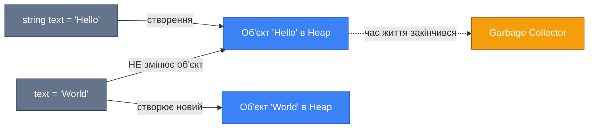
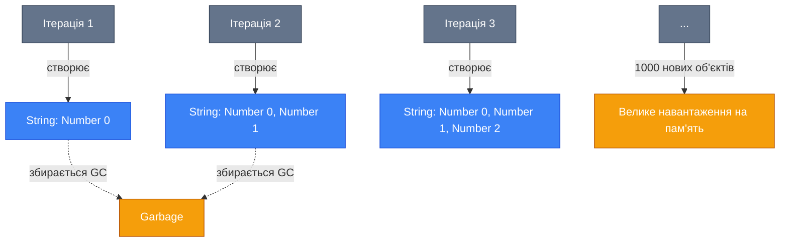
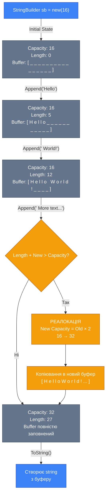

# Strings & Text Handling

## Вступ та Контекст

Робота з текстовими даними — це один з найпоширеніших сценаріїв у розробці застосунків. Від обробки користувацького вводу до парсингу файлів конфігурації, від генерації звітів до валідації даних — рядки ([strings](https://learn.microsoft.com/en-us/dotnet/csharp/language-reference/builtin-types/reference-types#the-string-type)) є фундаментальним типом даних у будь-якій мові програмування.

::tip
**Цікавий факт**: У C# рядки є **незмінними** (immutable). Це означає, що кожна операція, яка здається модифікацією рядка, насправді створює новий об'єкт у пам'яті. Розуміння цього принципу критично важливе для написання ефективного коду.
::

### Що ви дізнаєтесь

У цьому розділі ви опануєте:

-   Концепцію незмінності рядків та її наслідки для продуктивності
-   Різні способи створення та форматування рядків
-   Ефективні техніки роботи з великими обсягами текстових даних
-   Базові прийоми валідації тексту за допомогою регулярних виразів

### Передумови

Перед початком вивчення цієї теми рекомендується:

-   Розуміння базових типів даних C# (змінні, константи)
-   Знання про value types vs reference types
-   Базове розуміння роботи з пам'яттю (Stack vs Heap)

## Фундаментальні Концепції

### String Basics: Immutability (Незмінність)

Рядки в C# є **референсними типами** (reference types), але водночас **незмінними** (immutable). Це означає, що після створення об'єкта рядка його вміст не може бути змінений.

::mermaid



::

**Приклад незмінності**:

```csharp showLineNumbers
string original = "Hello";
string modified = original.ToUpper(); // Створює НОВИЙ рядок

Console.WriteLine($"Original: {original}");   // Output: Hello
Console.WriteLine($"Modified: {modified}");   // Output: HELLO
```

::warning
**Наслідки для продуктивності**: Якщо ви виконуєте багато операцій конкатенації в циклі, кожна ітерація створюватиме новий об'єкт у пам'яті. Для таких сценаріїв використовуйте [`StringBuilder`](https://learn.microsoft.com/en-us/dotnet/api/system.text.stringbuilder).
::

**Чому рядки незмінні?**

| Переваги                                   | Пояснення                                                                                                |
| :----------------------------------------- | :------------------------------------------------------------------------------------------------------- |
| **Безпека потоків** (Thread Safety)        | Незмінні об'єкти можна безпечно використовувати в багатопоточному середовищі без синхронізації           |
| **Оптимізація пам'яті** (String Interning) | CLR може зберігати лише одну копію ідентичних літералів                                                  |
| **Безпека** (Security)                     | Рядки часто використовуються для зберігання паролів, шляхів файлів — незмінність захищає від модифікації |
| **Hashability**                            | Незмінні об'єкти можуть бути ефективно використані як ключі в `Dictionary<TKey, TValue>`                 |

## Архітектура та Механіка

### [String Literals (Літерали Рядків)](https://learn.microsoft.com/en-us/dotnet/csharp/programming-guide/strings/#string-literals)

C# пропонує кілька способів оголошення рядкових літералів, кожен з яких призначений для специфічних сценаріїв.

::tabs
::tabs-item{label="Regular Strings"}
Звичайні рядки з екрануванням (escape sequences):

```csharp showLineNumbers
string path = "C:\\Users\\Documents\\file.txt";
string multiLine = "Перший рядок\nДругий рядок";
string quote = "Він сказав: \"Привіт!\"";

Console.WriteLine(path);
Console.WriteLine(multiLine);
Console.WriteLine(quote);
```

::

::tabs-item{label="Verbatim Strings"}
[Verbatim-рядки](https://learn.microsoft.com/en-us/dotnet/csharp/language-reference/tokens/verbatim) (дослівні рядки) з префіксом `@` — не потребують екранування:

```csharp showLineNumbers
// Зручно для шляхів файлів
string path = @"C:\Users\Documents\file.txt";

// Багаторядкові рядки зберігають форматування
string sql = @"
    SELECT *
    FROM Users
    WHERE Age > 18
    ORDER BY Name";

// Лапки екрануються подвоєнням
string quote = @"Він сказав: ""Привіт!""";

Console.WriteLine(path);
Console.WriteLine(sql);
```

::

::tabs-item{label="Raw String Literals"}
[Raw string literals](https://learn.microsoft.com/en-us/dotnet/csharp/language-reference/tokens/raw-string) (C# 11+) з потрійними лапками `"""` — найпотужніший спосіб:

```csharp showLineNumbers
// Не потрібно екранувати НІЧОГО
string json = """
    {
        "name": "John",
        "age": 30,
        "path": "C:\Users\Documents"
    }
    """;

// Можна використовувати лапки без екранування
string multiQuote = """
    Текст з "подвійними" та 'одинарними' лапками
    Навіть так: ""приклад""
    """;

Console.WriteLine(json);
```

::tip
Відступи визначаються найлівішою закриваючою `"""`. Весь текст буде вирівняний відносно неї.
::
::
::

**Порівняльна таблиця літералів**:

| Тип літералу | Синтаксис    | Екранування            | Багаторядковість | Випадок використання        |
| :----------- | :----------- | :--------------------- | :--------------- | :-------------------------- |
| Regular      | `"text"`     | Так (`\\`, `\n`, `\"`) | Ні (через `\n`)  | Прості коротки рядки        |
| Verbatim     | `@"text"`    | Подвоєння `""`         | Так (природне)   | Шляхи файлів, SQL-запити    |
| Raw          | `"""text"""` | Ні                     | Так (природне)   | JSON, XML, регулярні вирази |

### String Operations (Основні Операції)

C# надає багатий набір методів для маніпуляції рядками.

::steps

### Concatenation (Конкатенація)

Об'єднання рядків можна виконати кількома способами:

```csharp showLineNumbers
string firstName = "John";
string lastName = "Doe";

// Спосіб 1: Оператор +
string fullName1 = firstName + " " + lastName;

// Спосіб 2: String.Concat
string fullName2 = String.Concat(firstName, " ", lastName);

// Спосіб 3: String.Join (зручно для масивів)
string[] parts = { firstName, lastName };
string fullName3 = String.Join(" ", parts);

Console.WriteLine(fullName1); // Output: John Doe
```

::caution
**Увага**: Конкатенація через `+` у циклі — антипаттерн! Використовуйте `StringBuilder` для таких сценаріїв.
::

### Split (Розділення)

[Розділення рядка](https://learn.microsoft.com/en-us/dotnet/api/system.string.split) на частини за роздільниками:

```csharp showLineNumbers
string csv = "John,Doe,30,Developer";

// Розділення за одним символом
string[] parts = csv.Split(',');

foreach (string part in parts)
{
    Console.WriteLine(part);
}
// Output:
// John
// Doe
// 30
// Developer

// Розділення за кількома роздільниками
string data = "apple;banana,orange|grape";
string[] fruits = data.Split(new char[] { ';', ',', '|' });

// Видалення порожніх елементів
string text = "word1  word2   word3"; // подвійні пробіли
string[] words = text.Split(new char[] { ' ' }, StringSplitOptions.RemoveEmptyEntries);
```

### Join (Об'єднання)

Зворотна операція до Split — [об'єднання колекції](https://learn.microsoft.com/en-us/dotnet/api/system.string.join) в один рядок:

```csharp showLineNumbers
string[] words = { "C#", "is", "awesome" };
string sentence = String.Join(" ", words);
Console.WriteLine(sentence); // Output: C# is awesome

// Зручно для створення CSV
int[] numbers = { 1, 2, 3, 4, 5 };
string csv = String.Join(",", numbers);
Console.WriteLine(csv); // Output: 1,2,3,4,5
```

### Replace (Заміна)

[Заміна підрядків](https://learn.microsoft.com/en-us/dotnet/api/system.string.replace) або символів:

```csharp showLineNumbers
string text = "Hello World";

// Заміна підрядка
string newText = text.Replace("World", "C#");
Console.WriteLine(newText); // Output: Hello C#

// Заміна символу
string cleaned = "a-b-c-d".Replace('-', '_');
Console.WriteLine(cleaned); // Output: a_b_c_d

// Видалення символів (заміна на порожній рядок)
string noSpaces = "Hello World".Replace(" ", "");
Console.WriteLine(noSpaces); // Output: HelloWorld
```

### [Substring](https://learn.microsoft.com/en-us/dotnet/api/system.string.substring) (Вирізання Підрядка)

Витягування частини рядка:

```csharp showLineNumbers
string text = "Hello, World!";

// Substring(startIndex, length)
string sub1 = text.Substring(0, 5);  // "Hello"
string sub2 = text.Substring(7, 5);  // "World"

// З певного індексу до кінця
string sub3 = text.Substring(7);     // "World!"

Console.WriteLine(sub1);
Console.WriteLine(sub2);
Console.WriteLine(sub3);

// Сучасний спосіб (C# 8+): Range operator
string modern1 = text[0..5];    // "Hello"
string modern2 = text[7..12];   // "World"
string modern3 = text[7..];     // "World!"
```

::tip
**Сучасний підхід**: Оператор діапазону `[start..end]` набагато читабельніший та інтуїтивніший.
::
::

### Additional String Methods

C# надає багато корисних методів для роботи з рядками. Розглянемо найпоширеніші.

::code-group

```csharp [Contains & Searching]
string text = "Hello, World!";

// Contains - перевірка наявності підрядка
bool hasWorld = text.Contains("World");      // true
bool hasworld = text.Contains("world");      // false (case-sensitive)

// StartsWith / EndsWith
bool startsWithHello = text.StartsWith("Hello");  // true
bool endsWithMark = text.EndsWith("!");           // true
bool startsWithWorld = text.StartsWith("World");  // false

// Case-insensitive варіант (C# 5.0+)
bool containsWorld = text.Contains("world", StringComparison.OrdinalIgnoreCase);  // true

Console.WriteLine($"Contains 'World': {hasWorld}");
Console.WriteLine($"Starts with 'Hello': {startsWithHello}");
Console.WriteLine($"Ends with '!': {endsWithMark}");
```

```csharp [Case Conversion]
string text = "Hello, World!";

// ToUpper / ToLower
string upper = text.ToUpper();  // "HELLO, WORLD!"
string lower = text.ToLower();  // "hello, world!"

// Корисно для порівняння без урахування регістру
string input1 = "HELLO";
string input2 = "hello";

bool areEqual = input1.ToLower() == input2.ToLower();  // true

// Культурно-специфічне перетворення
string turkish = "title";
string upperTurkish = turkish.ToUpper(new System.Globalization.CultureInfo("tr-TR"));

Console.WriteLine($"Upper: {upper}");
Console.WriteLine($"Lower: {lower}");
```

```csharp [Trim Methods]
string text = "   Hello, World!   ";
string textWithTabs = "\t\tHello\t\t";

// Trim - видаляє пробіли з обох кінців
string trimmed = text.Trim();           // "Hello, World!"

// TrimStart / TrimEnd - видаляє з початку/кінця
string trimStart = text.TrimStart();    // "Hello, World!   "
string trimEnd = text.TrimEnd();        // "   Hello, World!"

// Видалення специфічних символів
string path = "///path/to/file///";
string cleanPath = path.Trim('/');      // "path/to/file"

// Видалення кількох символів
string data = "###Hello###";
string clean = data.Trim('#', ' ');     // "Hello"

Console.WriteLine($"Trimmed: '{trimmed}'");
Console.WriteLine($"Clean path: '{cleanPath}'");
```

```csharp [IndexOf & LastIndexOf]
string text = "Hello, World! Hello again!";

// IndexOf - перша позиція підрядка
int firstHello = text.IndexOf("Hello");        // 0
int firstO = text.IndexOf('o');                // 4
int worldPos = text.IndexOf("World");          // 7

// LastIndexOf - остання позиція
int lastHello = text.LastIndexOf("Hello");     // 14
int lastO = text.LastIndexOf('o');             // 16

// Пошук з певної позиції
int secondHello = text.IndexOf("Hello", 1);    // 14

// Якщо не знайдено - повертає -1
int notFound = text.IndexOf("xyz");            // -1

// Практичне використання
if (text.IndexOf("World") != -1)
{
    Console.WriteLine("Знайдено 'World'!");
}

Console.WriteLine($"First 'Hello' at: {firstHello}");
Console.WriteLine($"Last 'Hello' at: {lastHello}");
```

```csharp [Null & Empty Checks]
string text1 = "Hello";
string text2 = "";
string text3 = "   ";
string text4 = null;

// IsNullOrEmpty - перевірка на null або порожній рядок
bool check1 = String.IsNullOrEmpty(text1);  // false
bool check2 = String.IsNullOrEmpty(text2);  // true
bool check3 = String.IsNullOrEmpty(text3);  // false (містить пробіли!)
bool check4 = String.IsNullOrEmpty(text4);  // true

// IsNullOrWhiteSpace - перевірка на null, порожній або лише пробіли
bool check5 = String.IsNullOrWhiteSpace(text1);  // false
bool check6 = String.IsNullOrWhiteSpace(text2);  // true
bool check7 = String.IsNullOrWhiteSpace(text3);  // true (тільки пробіли!)
bool check8 = String.IsNullOrWhiteSpace(text4);  // true

// Практичне використання
void ProcessInput(string input)
{
    if (String.IsNullOrWhiteSpace(input))
    {
        Console.WriteLine("Помилка: введіть текст!");
        return;
    }

    Console.WriteLine($"Обробка: {input}");
}
```

```csharp [PadLeft & PadRight]
string num = "42";
string name = "Alice";

// PadLeft - додає символи зліва до заданої довжини
string padded1 = num.PadLeft(5);        // "   42"
string padded2 = num.PadLeft(5, '0');   // "00042"

// PadRight - додає символи справа
string padded3 = name.PadRight(10);     // "Alice     "
string padded4 = name.PadRight(10, '-'); // "Alice-----"

// Вирівнювання в таблиці
Console.WriteLine($"|{num.PadLeft(5)}|{name.PadRight(10)}|");
// Output: |   42|Alice     |

// Форматування номерів
string invoice = "123";
string formattedInvoice = $"INV-{invoice.PadLeft(6, '0')}";
Console.WriteLine(formattedInvoice);  // INV-000123
```

::

## Практична Реалізація

### [String Interpolation (Інтерполяція Рядків)](https://learn.microsoft.com/en-us/dotnet/csharp/language-reference/tokens/interpolated)

Інтерполяція — це сучасний та зручний спосіб вставки значень у рядки за допомогою префікса `$`.

::code-group

```csharp [Basic Interpolation]
string name = "Alice";
int age = 25;

// Старий спосіб (String.Format)
string oldWay = String.Format("Name: {0}, Age: {1}", name, age);

// Сучасний спосіб (String Interpolation)
string modernWay = $"Name: {name}, Age: {age}";

Console.WriteLine(modernWay); // Output: Name: Alice, Age: 25
```

```csharp [With Expressions]
int x = 10;
int y = 20;

// Можна використовувати вирази
string result = $"Sum: {x + y}, Product: {x * y}";
Console.WriteLine(result); // Output: Sum: 30, Product: 200

// Виклик методів
string upper = $"Uppercase: {name.ToUpper()}";
Console.WriteLine(upper); // Output: Uppercase: ALICE
```

```csharp [Formatting]
decimal price = 123.456m;
DateTime now = DateTime.Now;

// Форматування чисел
string formatted1 = $"Price: {price:C2}";        // Currency: $123.46
string formatted2 = $"Price: {price:F1}";        // Fixed-point: 123.5
string formatted3 = $"Price: {price:N0}";        // Number: 123

// Форматування дат
string date1 = $"Date: {now:yyyy-MM-dd}";        // 2024-03-15
string date2 = $"Time: {now:HH:mm:ss}";          // 14:30:45
string date3 = $"Full: {now:yyyy-MM-dd HH:mm}";  // 2024-03-15 14:30

Console.WriteLine(formatted1);
Console.WriteLine(date1);
```

::

**Alignment та Width (Вирівнювання)**:

```csharp showLineNumbers
var products = new[]
{
    (Name: "Apple", Quantity: 5, Price: 0.50m),
    (Name: "Banana", Quantity: 12, Price: 0.30m),
    (Name: "Orange", Quantity: 8, Price: 0.75m)
};

// Syntax: {expression,width:format}
// width > 0: right-aligned, width < 0: left-aligned
Console.WriteLine($"|{"Product",-10}|{"Qty",5}|{"Price",8}|");
Console.WriteLine(new string('-', 27));

foreach (var product in products)
{
    Console.WriteLine($"|{product.Name,-10}|{product.Quantity,5}|{product.Price,8:C2}|");
}

// Output:
// |Product    |  Qty|   Price|
// |---------------------------|
// |Apple      |    5|   $0.50|
// |Banana     |   12|   $0.30|
// |Orange     |    8|   $0.75|
```

**Interpolated Raw Strings (C# 11+)**:

Комбінація raw string literals з інтерполяцією — ідеально для JSON, XML:

```csharp showLineNumbers
string name = "John";
int age = 30;

// Один $ — звичайна інтерполяція
string json1 = $"""
    {{
        "name": "{name}",
        "age": {age}
    }}
    """;

// Багато $ дозволяє використовувати { та } як звичайні символи
string json2 = $$"""
    {
        "name": "{{name}}",
        "age": {{age}},
        "metadata": {
            "created": "2024-03-15"
        }
    }
    """;

Console.WriteLine(json2);
```

::note
Кількість символів `$` визначає, скільки фігурних дужок потрібно для інтерполяції. `$$` означає `{{variable}}`, `$$$` означає `{{{variable}}}`.
::

### [StringBuilder](https://learn.microsoft.com/en-us/dotnet/api/system.text.stringbuilder): Ефективна Побудова Рядків

Для сценаріїв з великою кількістю операцій конкатенації використовуйте `StringBuilder`.

**Проблема з конкатенацією**:

```csharp showLineNumbers
// ❌ ПОГАНО: кожна ітерація створює новий об'єкт string
string result = "";
for (int i = 0; i < 1000; i++)
{
    result += $"Number {i}, "; // 1000 нових об'єктів!
}
```

::mermaid



::

**Рішення: StringBuilder**:

```csharp showLineNumbers
using System.Text;

// ✅ ДОБРЕ: один об'єкт StringBuilder модифікується
var sb = new StringBuilder();
for (int i = 0; i < 1000; i++)
{
    sb.Append($"Number {i}, ");
}
string result = sb.ToString();
```

#### Як StringBuilder працює під капотом

StringBuilder використовує **змінюваний символьний масив** (mutable character array) для зберігання даних. На відміну від незмінного `string`, `StringBuilder` модифікує існуючий буфер замість створення нових об'єктів.

**Внутрішня структура**:

| Властивість     | Опис                                | Тип      |
| :-------------- | :---------------------------------- | :------- |
| `m_ChunkChars`  | Внутрішній масив символів (буфер)   | `char[]` |
| `m_ChunkLength` | Поточна кількість символів у буфері | `int`    |
| `m_MaxCapacity` | Максимально дозволений розмір       | `int`    |
| Capacity        | Поточний розмір виділеної пам'яті   | `int`    |
| Length          | Реальна кількість символів у рядку  | `int`    |

**Механізм роботи з пам'яттю**:

::mermaid



::

**Алгоритм збільшення ємності (Capacity)**:

```csharp showLineNumbers
// Псевдокод реального алгоритму StringBuilder
void EnsureCapacity(int requiredCapacity)
{
    if (requiredCapacity <= m_ChunkChars.Length)
        return; // Достатньо місця

    // Подвоєння ємності (або більше, якщо потрібно)
    int newCapacity = Math.Max(
        m_ChunkChars.Length * 2,  // Подвоєння
        requiredCapacity          // Або більше, якщо додається багато
    );

    // Перевірка максимуму
    if (newCapacity > m_MaxCapacity)
        throw new ArgumentOutOfRangeException();

    // Створення нового масиву та копіювання
    char[] newChars = new char[newCapacity];
    Array.Copy(m_ChunkChars, newChars, m_ChunkLength);
    m_ChunkChars = newChars;
}
```

**Візуалізація росту**:

| Операція                   | Length | Capacity | Дія                          |
| :------------------------- | :----- | :------- | :--------------------------- |
| `new StringBuilder()`      | 0      | 16       | Початковий буфер 16 символів |
| `Append("Hello")`          | 5      | 16       | Додавання без реалокації     |
| `Append(" World")`         | 11     | 16       | Ще вміщається                |
| `Append(" and more text")` | 25     | **32**   | ⚠️ Реалокація: 16 → 32       |
| `Append(" even more...")`  | 38     | **64**   | ⚠️ Реалокація: 32 → 64       |

::warning
**Ключовий момент**: Кожна реалокація коштує `O(n)` часу через копіювання. Якщо знаєте приблизний розмір фінального рядка, вкажіть `capacity` у конструкторі, щоб уникнути реалокацій.
::

**Порівняння продуктивності**:

```csharp showLineNumbers
using System.Diagnostics;
using System.Text;

void ComparePerformance(int iterations)
{
    // ❌ String concatenation
    var sw1 = Stopwatch.StartNew();
    string result1 = "";
    for (int i = 0; i < iterations; i++)
        result1 += "x";
    sw1.Stop();

    // ✅ StringBuilder без capacity
    var sw2 = Stopwatch.StartNew();
    var sb1 = new StringBuilder();
    for (int i = 0; i < iterations; i++)
        sb1.Append("x");
    string result2 = sb1.ToString();
    sw2.Stop();

    // ✅✅ StringBuilder з capacity
    var sw3 = Stopwatch.StartNew();
    var sb2 = new StringBuilder(iterations);
    for (int i = 0; i < iterations; i++)
        sb2.Append("x");
    string result3 = sb2.ToString();
    sw3.Stop();

    Console.WriteLine($"String concat:          {sw1.ElapsedMilliseconds}ms");
    Console.WriteLine($"StringBuilder:          {sw2.ElapsedMilliseconds}ms");
    Console.WriteLine($"StringBuilder+Capacity: {sw3.ElapsedMilliseconds}ms");
}

ComparePerformance(10000);
// Приблизні результати:
// String concat:          850ms  ← O(n²)
// StringBuilder:          2ms    ← O(n) з реалокаціями
// StringBuilder+Capacity: 1ms    ← O(n) без реалокацій
```

::tip
**Оптимальна стратегія**: Якщо ви знаєте, що фінальний рядок буде ~5000 символів, створіть `new StringBuilder(5000)`. Це виключить усі реалокації та дасть максимальну продуктивність.
::

**Основні методи StringBuilder**:

::code-group

```csharp [Append Methods]
var sb = new StringBuilder();

// Додавання різних типів
sb.Append("Hello ");
sb.Append(42);
sb.Append(' ');
sb.Append(true);

// AppendLine додає рядок з \n
sb.AppendLine("First line");
sb.AppendLine("Second line");

// AppendFormat (як String.Format)
sb.AppendFormat("Name: {0}, Age: {1}", "Alice", 25);

string result = sb.ToString();
```

```csharp [Insert & Replace]
var sb = new StringBuilder("Hello World");

// Insert(index, value)
sb.Insert(6, "Beautiful ");
// Результат: "Hello Beautiful World"

// Replace(oldValue, newValue)
sb.Replace("World", "C#");
// Результат: "Hello Beautiful C#"

// Replace з діапазоном
sb.Replace('l', 'L', 0, 5);
// Заміна тільки в перших 5 символах
```

```csharp [Remove & Clear]
var sb = new StringBuilder("Hello World");

// Remove(startIndex, length)
sb.Remove(5, 6);
// Результат: "Hello"

// Clear — видалити весь вміст
sb.Clear();

// Перевірка
Console.WriteLine($"Length: {sb.Length}");    // 0
Console.WriteLine($"Capacity: {sb.Capacity}"); // збережена ємність
```

::

**Оптимізація: Initial Capacity**:

```csharp showLineNumbers
// Без початкової ємності — множинні реалокації
var sb1 = new StringBuilder();
for (int i = 0; i < 10000; i++)
{
    sb1.Append("x"); // реалокації: 16 -> 32 -> 64 -> 128...
}

// З початковою ємністю — одна алокація
var sb2 = new StringBuilder(10000);
for (int i = 0; i < 10000; i++)
{
    sb2.Append("x"); // без реалокацій!
}
```

::tip
**Best Practice**: Якщо ви знаєте приблизний розмір фінального рядка, завжди вказуйте `capacity` у конструкторі `StringBuilder`.
::

**Коли використовувати StringBuilder?**

| Сценарій                         | Рекомендація                          |
| :------------------------------- | :------------------------------------ |
| 2-3 конкатенації                 | Використовуйте `+` або інтерполяцію   |
| Конкатенація в циклі             | Завжди використовуйте `StringBuilder` |
| Динамічна побудова HTML/XML/JSON | `Використовуйте` StringBuilder        |
| Складне форматування з умовами   | `StringBuilder`                       |

### Regex Basics: Валідація та Паттерни

Регулярні вирази (Regular Expressions) — це потужний інструмент для пошуку, валідації та трансформації текстових даних.

**Основи синтаксису**:

::field-group
::field{name="\\d" type="Digit"}
Цифра `[0-9]`: `\\d{3}` = три цифри
::

::field{name="\\w" type="Word Character"}
Буква, цифра або `_`: `\\w+` = одне або більше слів
::

::field{name="\\s" type="Whitespace"}
Пробіл, таб, новий рядок: `\\s+` = один або більше пробілів
::

::field{name="." type="Any Character"}
Будь-який символ (крім `\n`): `.+` = будь-яка послідовність
::

::field{name="^" type="Start of String"}
Початок рядка: `^Hello` = рядок починається з "Hello"
::

::field{name="$" type="End of String"}
Кінець рядка: `world$` = рядок закінчується на "world"
::

::field{name="[ ]" type="Character Class"}
Набір символів: `[abc]` = a або b або c
::

::field{name="_" type="0 or More"}
0 або більше повторень: `a_` = 0 або більше 'a'
::

::field{name="+" type="1 or More"}
1 або більше повторень: `a+` = 1 або більше 'a'
::

::field{name="?" type="0 or 1"}
0 або 1 повторення: `colou?r` = color або colour
::

::field{name="{n,m}" type="Range"}
Від n до m повторень: `\\d{3,5}` = від 3 до 5 цифр
::
::

**Приклад: Валідація Email**:

```csharp showLineNumbers
using System.Text.RegularExpressions;

string[] emails = {
    "user@example.com",      // ✅ валідний
    "invalid.email",         // ❌ немає @
    "user@domain",           // ❌ немає домену верхнього рівня
    "user@domain.co.uk"      // ✅ валідний
};

// Простий паттерн для email
string pattern = @"^[\w\.-]+@[\w\.-]+\.\w{2,}$";

foreach (string email in emails)
{
    bool isValid = Regex.IsMatch(email, pattern);
    Console.WriteLine($"{email,-25} {(isValid ? "✅" : "❌")}");
}
```

**Розшифровка паттерна**:

```
^[\w\.-]+@[\w\.-]+\.\w{2,}$
│ │      │ │      │ │
│ │      │ │      │ └─ мінімум 2 літери (.com, .ua)
│ │      │ │      └─── крапка (екранована)
│ │      │ └────────── домен (літери, цифри, крапки, дефіси)
│ │      └─────────── символ @
│ └────────────────── ім'я користувача (літери, цифри, крапки, дефіси)
└───────────────────── початок рядка
```

**Приклад: Валідація Телефону**:

::code-group

```csharp [Phone Validation]
string[] phones = {
    "123-456-7890",       // ✅
    "(123) 456-7890",     // ✅
    "123.456.7890",       // ✅
    "1234567890",         // ✅
    "123-456-789",        // ❌ неповний номер
};

// Гнучкий паттерн для різних форматів
string pattern = @"^\(?\d{3}\)?[-.\s]?\d{3}[-.\s]?\d{4}$";

foreach (string phone in phones)
{
    bool isValid = Regex.IsMatch(phone, pattern);
    Console.WriteLine($"{phone,-20} {(isValid ? "✅" : "❌")}");
}
```

```csharp [Extract Matches]
string text = "Контакти: 123-456-7890, (098) 765-4321, invalid";
string pattern = @"\(?\d{3}\)?[-.\s]?\d{3}[-.\s]?\d{4}";

MatchCollection matches = Regex.Matches(text, pattern);

Console.WriteLine($"Знайдено номерів: {matches.Count}");
foreach (Match match in matches)
{
    Console.WriteLine($"  - {match.Value}");
}

// Output:
// Знайдено номерів: 2
//   - 123-456-7890
//   - (098) 765-4321
```

```csharp [Replace with Regex]
string text = "Мій email: user@example.com та backup@test.org";
string pattern = @"[\w\.-]+@[\w\.-]+\.\w+";

// Заміна всіх email на [REDACTED]
string censored = Regex.Replace(text, pattern, "[REDACTED]");
Console.WriteLine(censored);
// Output: Мій email: [REDACTED] та [REDACTED]

// Трансформація (групи захоплення)
string phone = "123-456-7890";
string formatted = Regex.Replace(
    phone,
    @"(\d{3})-(\d{3})-(\d{4})",
    "($1) $2-$3"
);
Console.WriteLine(formatted); // Output: (123) 456-7890
```

::

**Опції Regex**:

```csharp showLineNumbers
string text = "Hello WORLD";

// RegexOptions.IgnoreCase — ігнорує регістр
bool match1 = Regex.IsMatch(text, "world");                           // ❌ false
bool match2 = Regex.IsMatch(text, "world", RegexOptions.IgnoreCase);  // ✅ true

// RegexOptions.Multiline — ^ та $ працюють для кожного рядка
string multiline = "Line 1\nLine 2\nLine 3";
var matches = Regex.Matches(multiline, "^Line", RegexOptions.Multiline);
Console.WriteLine($"Знайдено: {matches.Count}"); // 3
```

::warning
**Продуктивність**: Регулярні вирази можуть бути повільними для великих текстів. Для критичних за продуктивністю сценаріїв розгляньте варіанти:

-   Використання compiled regex: `new Regex(pattern, RegexOptions.Compiled)`
-   Source Generators (C# 11+): `[GeneratedRegex]` attribute

::

**Source Generator Regex (C# 11+)**:

```csharp showLineNumbers
using System.Text.RegularExpressions;

partial class EmailValidator
{
    [GeneratedRegex(@"^[\w\.-]+@[\w\.-]+\.\w{2,}$", RegexOptions.IgnoreCase)]
    private static partial Regex EmailPattern();

    public static bool IsValidEmail(string email)
    {
        return EmailPattern().IsMatch(email);
    }
}

// Використання
bool valid = EmailValidator.IsValidEmail("user@example.com");
```

::tip
Source-generated regex компілюється під час збірки, що дає максимальну продуктивність без runtime overhead.
::

## Typical Use Cases

### Сценарій 1: Парсинг CSV-файлу

```csharp showLineNumbers
string csvLine = "John,Doe,30,Developer,\"New York, NY\"";

// Проблема: простий Split не працює через кому всередині лапок
// Рішення: regex для парсингу
string pattern = ",(?=(?:[^\"]*\"[^\"]*\")*[^\"]*$)";
string[] fields = Regex.Split(csvLine, pattern);

foreach (string field in fields)
{
    Console.WriteLine(field.Trim('"'));
}
```

### Сценарій 2: Генерація SQL-запиту

```csharp showLineNumbers
var users = new[] { "Alice", "Bob", "Charlie" };

var sb = new StringBuilder();
sb.AppendLine("SELECT * FROM Users");
sb.AppendLine("WHERE Name IN (");

for (int i = 0; i < users.Length; i++)
{
    sb.Append($"  '{users[i]}'");
    if (i < users.Length - 1)
        sb.Append(',');
    sb.AppendLine();
}

sb.AppendLine(");");

Console.WriteLine(sb.ToString());
```

### Сценарій 3: Валідація українського телефону

```csharp showLineNumbers
string ukrainePhonePattern = @"^\+380\d{9}$";

string[] phones = {
    "+380501234567",    // ✅
    "+380671234567",    // ✅
    "0501234567",       // ❌ немає +380
    "+38050123456"      // ❌ недостатньо цифр
};

foreach (string phone in phones)
{
    bool isValid = Regex.IsMatch(phone, ukrainePhonePattern);
    Console.WriteLine($"{phone,-20} {(isValid ? "✅" : "❌")}");
}
```

## Практика та Резюме

### Завдання для Самостійної Роботи

::steps

### Рівень 1: Базовий

Створіть програму, яка:

1. Приймає ПІБ користувача (через `Console.ReadLine`)
2. Розділяє його на ім'я, прізвище та по-батькові
3. Виводить привітання у форматі: "Вітаємо, [Ім'я] [Прізвище]!"

### Рівень 2: Середній

Напишіть функцію `string CreateSlug(string title)`, яка:

1. Перетворює назву статті на URL-slug
2. Приклад: "Введення в C# програмування!" → "vvedennia-v-csharp-prohramuvannia"
3. Видаляє спеціальні символи, замінює пробіли на дефіси, робить lowercase

### Рівень 3: Просунутий

Створіть клас `PasswordValidator`, який перевіряє пароль на:

1. Мінімум 8 символів
2. Наявність великої літери
3. Наявність цифри
4. Наявність спеціального символу
5. Використовуйте regex для валідації

::

### Ключові Висновки

::card-group
::card{title="Незмінність рядків" icon="i-heroicons-lock-closed"}
Розуміння immutability критично для написання ефективного коду
::

::card{title="StringBuilder для циклів" icon="i-heroicons-arrow-path"}
Використовуйте StringBuilder для багаторазових конкатенацій
::

::card{title="Raw strings для складного тексту" icon="i-heroicons-document-text"}
Потрійні лапки `"""` спрощують роботу з JSON, XML, SQL
::

::card{title="Regex для валідації" icon="i-heroicons-shield-check"}
Регулярні вирази — потужний інструмент для перевірки форматів
::
::

### Що далі?

Після опанування роботи з рядками ви готові до:

-   **Dates & Time**: Робота з датами, часовими зонами, форматування
-   **Control Flow**: Умовні конструкції та цикли для обробки текстових даних
-   **Collections**: Зберігання та маніпуляція масивами рядків

::note
**Додаткові ресурси**:

-   [Офіційна документація Microsoft: Strings](https://learn.microsoft.com/en-us/dotnet/csharp/programming-guide/strings/)
-   [Regex101](https://regex101.com/) — інтерактивний тестер регулярних виразів
-   [String Performance](https://learn.microsoft.com/en-us/dotnet/api/system.text.stringbuilder) — детальний аналіз продуктивності

::
