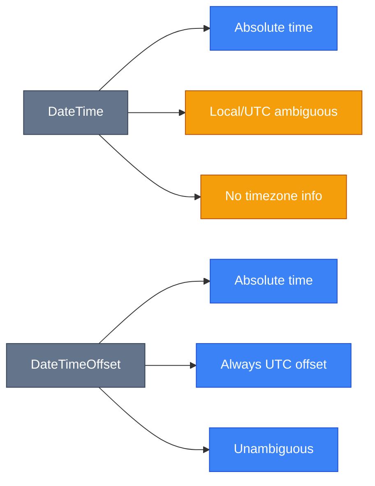

# Дати і Час

## Вступ та Контекст

Уявіть, що ви розробляєте веб-додаток для міжнародної компанії. Користувач з Києва бронює зустріч на 14:00 за своїм часом з колегою з Нью-Йорка. Як правильно зберегти цей час? Як відобразити його кожному учаснику в їхньому локальному часі? Неправильна робота з датами та часовими зонами може призвести до пропущених зустрічей, помилок у фінансових транзакціях або некоректних звітів.

У C# існує кілька типів для роботи з часом, кожен з яких вирішує специфічні задачі. Розуміння їхніх відмінностей — ключ до написання надійного коду.

::tip
**Золоте правило**: Для веб-додатків та розподілених систем завжди використовуйте `DateTimeOffset` або зберігайте час у UTC. Тип `DateTime` може призвести до неоднозначності часових зон.
::

### Передумови

Перед вивченням цієї теми ви маєте розуміти:

-   Змінні та типи даних C#
-   Основи роботи з рядками (strings)
-   Поняття методів та властивостей

## Фундаментальні Концепції

### DateTime vs DateTimeOffset

[**DateTime**](https://learn.microsoft.com/en-us/dotnet/api/system.datetime) — це структура, яка представляє момент часу як дату та час доби. Проблема в тому, що `DateTime` не зберігає інформацію про часову зону явно.

[**DateTimeOffset**](https://learn.microsoft.com/en-us/dotnet/api/system.datetimeoffset) — це структура, яка зберігає дату, час **та зміщення (offset)** відносно UTC. Це робить її однозначною для будь-якого моменту в часі.

| Критерій                        | DateTime                                   | DateTimeOffset                    |
| :------------------------------ | :----------------------------------------- | :-------------------------------- |
| **Зберігає часову зону**        | Ні (має властивість `Kind`)                | Так (як зміщення від UTC)         |
| **Однозначність**               | Низька (залежить від контексту)            | Висока (завжди прив'язано до UTC) |
| **Використання у веб-додатках** | Не рекомендується                          | **Рекомендується**                |
| **Розмір у пам'яті**            | 8 байтів                                   | 16 байтів                         |
| **Підтримка часових зон**       | Обмежена (`Kind`: Local, UTC, Unspecified) | Повна (через зміщення)            |

::warning
**Проблема `DateTime.Kind.Unspecified`**: Якщо `DateTime` створено без явного вказівки `Kind`, його значення `Unspecified`. Це означає, що неможливо достовірно визначити, який це час — локальний чи UTC.
::

### Приклад: Неоднозначність DateTime

```csharp showLineNumbers
DateTime dt = new DateTime(2024, 11, 28, 14, 0, 0);
Console.WriteLine($"Kind: {dt.Kind}"); // Unspecified

// Це 14:00 за яким часом? Київським? UTC? Нью-Йоркським?
// Неможливо визначити без додаткового контексту!
```

### Приклад: Однозначність DateTimeOffset

```csharp showLineNumbers
// 14:00 за київським часом (UTC+2)
DateTimeOffset kyivTime = new DateTimeOffset(2024, 11, 28, 14, 0, 0, TimeSpan.FromHours(2));

// 14:00 за UTC
DateTimeOffset utcTime = new DateTimeOffset(2024, 11, 28, 14, 0, 0, TimeSpan.Zero);

Console.WriteLine($"Kyiv: {kyivTime}"); // 11/28/2024 2:00:00 PM +02:00
Console.WriteLine($"UTC: {utcTime}");   // 11/28/2024 2:00:00 PM +00:00
```

## Сучасні Типи: DateOnly та TimeOnly

Починаючи з **.NET 6**, з'явилися два нові типи, які дозволяють представляти **лише дату** або **лише час** без зайвої інформації.

### [DateOnly](https://learn.microsoft.com/en-us/dotnet/api/system.dateonly) — Тільки Дата

Використовуйте `DateOnly`, коли вам потрібна лише дата без часу: дні народження, терміни дії, календарні події.

```csharp showLineNumbers
DateOnly birthday = new DateOnly(1990, 5, 15);
DateOnly today = DateOnly.FromDateTime(DateTime.Now);

Console.WriteLine($"Народився: {birthday}");
Console.WriteLine($"Сьогодні: {today}");

// Арифметика з датами
int daysOld = today.DayNumber - birthday.DayNumber;
Console.WriteLine($"Днів з дня народження: {daysOld}");
```

### [TimeOnly](https://learn.microsoft.com/en-us/dotnet/api/system.timeonly) — Тільки Час

Використовуйте `TimeOnly` для представлення часу доби: графіки роботи, розклади, нагадування.

```csharp showLineNumbers
TimeOnly openingTime = new TimeOnly(9, 0);  // 09:00
TimeOnly closingTime = new TimeOnly(18, 30); // 18:30
TimeOnly currentTime = TimeOnly.FromDateTime(DateTime.Now);

Console.WriteLine($"Магазин працює: {openingTime} - {closingTime}");

if (currentTime >= openingTime && currentTime < closingTime)
{
    Console.WriteLine("Магазин відкритий!");
}
else
{
    Console.WriteLine("Магазин зачинений.");
}
```

::note
**Серіалізація**: `DateOnly` та `TimeOnly` підтримуються [`System.Text.Json`](https://learn.microsoft.com/en-us/dotnet/standard/serialization/system-text-json-overview) починаючи з .NET 6. При серіалізації вони представляються у форматі ISO 8601.
::

### Конвертація між типами

::code-group

```csharp [DateTime → DateOnly/TimeOnly] showLineNumbers
DateTime now = DateTime.Now;

// Витягуємо лише дату
DateOnly date = DateOnly.FromDateTime(now);

// Витягуємо лише час
TimeOnly time = TimeOnly.FromDateTime(now);

Console.WriteLine($"Дата: {date}, Час: {time}");
```

```csharp [DateOnly/TimeOnly → DateTime] showLineNumbers
DateOnly date = new DateOnly(2024, 11, 28);
TimeOnly time = new TimeOnly(14, 30, 0);

// Комбінуємо дату та час
DateTime combined = date.ToDateTime(time);

Console.WriteLine($"Комбінований DateTime: {combined}");
```

::

## [TimeSpan](https://learn.microsoft.com/en-us/dotnet/api/system.timespan) — Інтервали Часу

`TimeSpan` представляє **різницю між двома моментами часу** або **тривалість**. Це не конкретний момент, а проміжок часу.

### Створення TimeSpan

::code-group

```csharp [Через конструктор] showLineNumbers
// TimeSpan(години, хвилини, секунди)
TimeSpan duration1 = new TimeSpan(2, 30, 0); // 2 години 30 хвилин

// TimeSpan(дні, години, хвилини, секунди)
TimeSpan duration2 = new TimeSpan(5, 2, 30, 0); // 5 днів, 2:30:00

Console.WriteLine($"Тривалість 1: {duration1}");
Console.WriteLine($"Тривалість 2: {duration2}");
```

```csharp [Через фабричні методи] showLineNumbers
TimeSpan hours = TimeSpan.FromHours(3.5);       // 3 години 30 хвилин
TimeSpan minutes = TimeSpan.FromMinutes(90);    // 1 година 30 хвилин
TimeSpan seconds = TimeSpan.FromSeconds(3600);  // 1 година
TimeSpan days = TimeSpan.FromDays(1.5);         // 1 день 12 годин

Console.WriteLine($"Години: {hours}");
Console.WriteLine($"Хвилини: {minutes}");
```

```csharp [Різниця між датами] showLineNumbers
DateTime start = new DateTime(2024, 11, 1, 9, 0, 0);
DateTime end = new DateTime(2024, 11, 28, 17, 30, 0);

TimeSpan difference = end - start;

Console.WriteLine($"Різниця: {difference}");
Console.WriteLine($"Днів: {difference.TotalDays:F2}");
Console.WriteLine($"Годин: {difference.TotalHours:F2}");
```

::

### Властивості TimeSpan

```csharp showLineNumbers
TimeSpan span = new TimeSpan(2, 15, 45, 30); // 2 дні, 15:45:30

// Компоненти
Console.WriteLine($"Дні: {span.Days}");           // 2
Console.WriteLine($"Години: {span.Hours}");       // 15
Console.WriteLine($"Хвилини: {span.Minutes}");    // 45
Console.WriteLine($"Секунди: {span.Seconds}");    // 30

// Повна тривалість
Console.WriteLine($"Всього годин: {span.TotalHours:F2}");     // 63.76
Console.WriteLine($"Всього хвилин: {span.TotalMinutes:F2}");  // 3825.50
```

::tip
**Різниця**: Властивість `Hours` повертає лише компонент годин (0-23), а `TotalHours` — повну тривалість у годинах, включаючи дні.
::

## Операції з Датами та Часом

### Parsing — Розбір Рядків

::code-group

```csharp [DateTime.Parse] showLineNumbers
// Розбір рядка у DateTime
string dateString = "2024-11-28 14:30:00";
DateTime parsed = DateTime.Parse(dateString);

Console.WriteLine($"Розібраний DateTime: {parsed}");
```

```csharp [DateTimeOffset.Parse] showLineNumbers
// Розбір з часовою зоною
string offsetString = "2024-11-28 14:30:00 +02:00";
DateTimeOffset parsedOffset = DateTimeOffset.Parse(offsetString);

Console.WriteLine($"Розібраний DateTimeOffset: {parsedOffset}");
Console.WriteLine($"UTC час: {parsedOffset.UtcDateTime}");
```

```csharp [TryParse (безпечний)] showLineNumbers
string input = "invalid date";

if (DateTime.TryParse(input, out DateTime result))
{
    Console.WriteLine($"Успішно: {result}");
}
else
{
    Console.WriteLine("Невалідний формат дати!");
}
```

::

::warning
**Культурні відмінності**: `Parse` використовує поточну культуру системи. Для гарантованого результату використовуйте `ParseExact` з явним форматом або `InvariantCulture`.
::

### Formatting — Форматування

```csharp showLineNumbers
DateTime now = DateTime.Now;

// Стандартні формати
Console.WriteLine(now.ToString("d"));       // Коротка дата: 11/28/2024
Console.WriteLine(now.ToString("D"));       // Довга дата: Thursday, November 28, 2024
Console.WriteLine(now.ToString("t"));       // Короткий час: 2:30 PM
Console.WriteLine(now.ToString("T"));      // Довгий час: 2:30:00 PM
Console.WriteLine(now.ToString("f"));       // Повний короткий: Thursday, November 28, 2024 2:30 PM
Console.WriteLine(now.ToString("F"));       // Повний довгий: Thursday, November 28, 2024 2:30:00 PM

// Користувацькі формати
Console.WriteLine(now.ToString("yyyy-MM-dd"));           // 2024-11-28
Console.WriteLine(now.ToString("dd MMMM yyyy, HH:mm"));  // 28 November 2024, 14:30
Console.WriteLine(now.ToString("dddd, hh:mm tt"));       // Thursday, 02:30 PM
```

::tip
**ISO 8601**: Для міжнародного обміну даними використовуйте формат `"o"` або `"s"`:

```csharp
DateTime.Now.ToString("o"); // 2024-11-28T14:30:00.1234567+02:00
```

::

### Arithmetic — Арифметичні Операції

```csharp showLineNumbers
DateTime today = DateTime.Today;

// Додавання
DateTime tomorrow = today.AddDays(1);
DateTime nextWeek = today.AddDays(7);
DateTime nextMonth = today.AddMonths(1);
DateTime nextYear = today.AddYears(1);

// Віднімання
DateTime yesterday = today.AddDays(-1);
DateTime lastWeek = today.AddDays(-7);

// Комбінування
DateTime future = today.AddMonths(3).AddDays(15).AddHours(12);

Console.WriteLine($"Сьогодні: {today:d}");
Console.WriteLine($"Через 3 місяці та 15.5 днів: {future:f}");
```

::note
**AddMonths і AddYears**: Ці методи враховують різну кількість днів у місяцях. Наприклад, якщо додати 1 місяць до 31 січня, результат буде 28 (або 29) лютого.
::

## Часові Зони та [TimeZoneInfo](https://learn.microsoft.com/en-us/dotnet/api/system.timezoneinfo)

### UTC vs Local Time

**UTC (Coordinated Universal Time)** — це стандарт часу, який не залежить від часових зон. **Local Time** — це час у конкретній часовій зоні.

::mermaid



::

### Best Practices для Веб-Додатків

::steps

#### Зберігайте у UTC

Завжди зберігайте дати та час у базі даних у форматі UTC. Це усуває неоднозначність та спрощує роботу з різними часовими зонами.

```csharp showLineNumbers
// При збереженні
DateTimeOffset userInput = DateTimeOffset.Now;
DateTime utcTime = userInput.UtcDateTime; // Конвертуємо у UTC

// Зберігаємо utcTime у базу даних
```

#### Конвертуйте при відображенні

Перетворюйте UTC час у локальний час користувача лише при відображенні на UI.

```csharp showLineNumbers
// При читанні з бази даних
DateTime storedUtc = DateTime.SpecifyKind(dbValue, DateTimeKind.Utc);

// Конвертуємо у часову зону користувача
TimeZoneInfo userTimeZone = TimeZoneInfo.FindSystemTimeZoneById("FLE Standard Time"); // Київ
DateTime userLocalTime = TimeZoneInfo.ConvertTimeFromUtc(storedUtc, userTimeZone);

Console.WriteLine($"Для користувача: {userLocalTime}");
```

#### Використовуйте DateTimeOffset для API

Для REST API та обміну даними використовуйте `DateTimeOffset` — це усуває плутанину.

```csharp showLineNumbers
public class EventDto
{
    public string Name { get; set; }
    public DateTimeOffset StartTime { get; set; } // Включає offset!
}
```

::

### Робота з TimeZoneInfo

```csharp showLineNumbers
// Отримати поточну часову зону системи
TimeZoneInfo localZone = TimeZoneInfo.Local;
Console.WriteLine($"Локальна зона: {localZone.DisplayName}");

// Отримати UTC
TimeZoneInfo utcZone = TimeZoneInfo.Utc;
Console.WriteLine($"UTC: {utcZone.DisplayName}");

// Знайти конкретну часову зону
TimeZoneInfo kyivZone = TimeZoneInfo.FindSystemTimeZoneById("FLE Standard Time");
TimeZoneInfo newYorkZone = TimeZoneInfo.FindSystemTimeZoneById("Eastern Standard Time");

// Конвертація між зонами
DateTime utcNow = DateTime.UtcNow;
DateTime kyivTime = TimeZoneInfo.ConvertTimeFromUtc(utcNow, kyivZone);
DateTime nyTime = TimeZoneInfo.ConvertTimeFromUtc(utcNow, newYorkZone);

Console.WriteLine($"UTC: {utcNow:HH:mm}");
Console.WriteLine($"Київ: {kyivTime:HH:mm}");
Console.WriteLine($"Нью-Йорк: {nyTime:HH:mm}");
```

::warning
**ID часових зон**: ID часових зон різняться між Windows та Linux/macOS. Для кросплатформеності використовуйте бібліотеку [**NodaTime**](https://nodatime.org/) або перевіряйте платформу.

**Windows**: `"FLE Standard Time"` (Київ)  
**Linux/macOS**: `"Europe/Kiev"`
::

### Отримати всі доступні часові зони

```csharp showLineNumbers
var allTimeZones = TimeZoneInfo.GetSystemTimeZones();

foreach (var tz in allTimeZones.Take(5))
{
    Console.WriteLine($"{tz.Id}: {tz.DisplayName}");
}

// Вивід:
// Dateline Standard Time: (UTC-12:00) International Date Line West
// UTC-11: (UTC-11:00) Coordinated Universal Time-11
// ...
```

## Практичні Приклади

### Приклад 1: Калькулятор Віку

```csharp showLineNumbers
DateOnly birthDate = new DateOnly(1990, 5, 15);
DateOnly today = DateOnly.Today;

int age = today.Year - birthDate.Year;

// Перевіряємо, чи вже минув день народження цього року
if (today < birthDate.AddYears(age))
{
    age--;
}

Console.WriteLine($"Вік: {age} років");
```

### Приклад 2: Робочі Години з Часовими Зонами

```csharp showLineNumbers
public class BusinessHours
{
    public TimeOnly OpenTime { get; set; } = new TimeOnly(9, 0);   // 09:00
    public TimeOnly CloseTime { get; set; } = new TimeOnly(18, 0); // 18:00
    public TimeZoneInfo TimeZone { get; set; } = TimeZoneInfo.Local;

    public bool IsOpenNow()
    {
        DateTime utcNow = DateTime.UtcNow;
        DateTime localTime = TimeZoneInfo.ConvertTimeFromUtc(utcNow, TimeZone);
        TimeOnly currentTime = TimeOnly.FromDateTime(localTime);

        return currentTime >= OpenTime && currentTime < CloseTime;
    }

    public bool IsOpenAt(TimeOnly time)
    {
        return time >= OpenTime && time < CloseTime;
    }
}

// Використання
var kyivOffice = new BusinessHours
{
    TimeZone = TimeZoneInfo.FindSystemTimeZoneById("FLE Standard Time")
};

Console.WriteLine($"Офіс у Києві зараз {(kyivOffice.IsOpenNow() ? "відкритий" : "зачинений")}");
```

### Приклад 3: Конвертація між Часовими Зонами

```csharp showLineNumbers
// Користувач бронює зустріч на 14:00 за київським часом
DateTimeOffset kyivMeeting = new DateTimeOffset(
    2024, 11, 28, 14, 0, 0,
    TimeSpan.FromHours(2) // UTC+2
);

// Конвертуємо у різні часові зони
TimeZoneInfo nyZone = TimeZoneInfo.FindSystemTimeZoneById("Eastern Standard Time");
TimeZoneInfo tokyoZone = TimeZoneInfo.FindSystemTimeZoneById("Tokyo Standard Time");

DateTimeOffset nyTime = TimeZoneInfo.ConvertTime(kyivMeeting, nyZone);
DateTimeOffset tokyoTime = TimeZoneInfo.ConvertTime(kyivMeeting, tokyoZone);

Console.WriteLine($"Київ:     {kyivMeeting:HH:mm zzz}");
Console.WriteLine($"Нью-Йорк: {nyTime:HH:mm zzz}");
Console.WriteLine($"Токіо:    {tokyoTime:HH:mm zzz}");
```

## Типові Проблеми та Вирішення

### Проблема 1: Втрата часової зони при серіалізації

**Проблема**: При серіалізації `DateTime` у JSON втрачається інформація про часову зону.

**Рішення**: Використовуйте `DateTimeOffset` замість `DateTime`.

::code-group

```csharp [❌ Погано] showLineNumbers
public class Event
{
    public DateTime StartTime { get; set; } // Втрачено контекст!
}
```

```csharp [✅ Добре] showLineNumbers
public class Event
{
    public DateTimeOffset StartTime { get; set; } // Зберігає offset!
}
```

::

### Проблема 2: Переведення годинника (Daylight Saving Time)

**Проблема**: При переведенні годинника деякі часи можуть повторюватись або не існувати.

**Рішення**: Використовуйте `TimeZoneInfo.IsAmbiguousTime` та `TimeZoneInfo.IsInvalidTime`.

```csharp showLineNumbers
TimeZoneInfo kyivZone = TimeZoneInfo.FindSystemTimeZoneById("FLE Standard Time");
DateTime ambiguousTime = new DateTime(2024, 10, 27, 3, 30, 0); // Під час переводу годинника

if (kyivZone.IsAmbiguousTime(ambiguousTime))
{
    Console.WriteLine("Цей час неоднозначний (повторюється)!");

    // Отримуємо можливі offset'и
    var offsets = kyivZone.GetAmbiguousTimeOffsets(ambiguousTime);
    Console.WriteLine($"Можливі зміщення: {offsets[0]}, {offsets[1]}");
}
```

### Проблема 3: Parsing з неправильним форматом

**Проблема**: `Parse` викидає виняток при невалідному вводі.

**Рішення**: Використовуйте `TryParse` або `ParseExact`.

::code-group

```csharp [TryParse] showLineNumbers
string userInput = "28-11-2024";

if (DateTime.TryParse(userInput, out DateTime result))
{
    Console.WriteLine($"Успішно: {result}");
}
else
{
    Console.WriteLine("Невалідний формат!");
}
```

```csharp [ParseExact] showLineNumbers
string userInput = "28-11-2024";
string format = "dd-MM-yyyy";

try
{
    DateTime result = DateTime.ParseExact(
        userInput,
        format,
        System.Globalization.CultureInfo.InvariantCulture
    );
    Console.WriteLine($"Розібрано: {result}");
}
catch (FormatException)
{
    Console.WriteLine("Формат не відповідає очікуваному!");
}
```

::

## Практичні Завдання

### Рівень 1: Основи

::steps

#### Завдання 1.1: Калькулятор Днів

Напишіть програму, яка приймає дві дати (день народження та поточну дату) і виводить кількість днів між ними.

**Підказка**: Використовуйте `DateOnly` та віднімання дат.

#### Завдання 1.2: Форматування Дати

Створіть програму, яка виводить поточну дату у 5 різних форматах (короткий, довгий, ISO 8601, тощо).

**Підказка**: Використовуйте метод `ToString` з різними специфікаторами формату.

#### Завдання 1.3: Таймер Відліку

Напишіть таймер, який показує, скільки часу залишилось до Нового Року.

**Підказка**: Використовуйте `DateTime` для цільової дати та `TimeSpan` для різниці.
::

### Рівень 2: Середній

::steps

#### Завдання 2.1: Перевірка Робочих Годин

Створіть клас `Store`, який має властивості `OpenTime` та `CloseTime` (тип `TimeOnly`). Додайте метод `IsOpen()`, який перевіряє, чи зараз магазин відкритий.

**Підказка**: Порівнюйте поточний `TimeOnly.Now` з часами відкриття/закриття.

#### Завдання 2.2: Конвертер Часових Зон

Напишіть програму, яка конвертує поточний час у 3 різні часові зони (Київ, Нью-Йорк, Токіо) та виводить результати.

**Підказка**: Використовуйте `TimeZoneInfo.FindSystemTimeZoneById` та `TimeZoneInfo.ConvertTime`.

#### Завдання 2.3: Різниця між Датами

Створіть функцію, яка приймає дві дати і повертає текстовий опис різниці: "2 роки, 3 місяці, 15 днів".

**Підказка**: Використовуйте `DateOnly` та ручний розрахунок компонентів.
::

### Рівень 3: Складний

::steps

#### Завдання 3.1: Система Бронювання

Створіть систему бронювання зустрічей, яка:

-   Приймає час зустрічі у часовій зоні користувача
-   Зберігає у UTC
-   Відображає у локальній зоні різних учасників

**Вимоги**:

-   Використовуйте `DateTimeOffset`
-   Реалізуйте конвертацію між зонами
-   Перевіряйте перетин зустрічей

#### Завдання 3.2: Робочі Дні Калькулятор

Напишіть функцію, яка обчислює кількість робочих днів (понеділок-п'ятниця) між двома датами, виключаючи державні свята.

**Підказка**:

-   Використовуйте `DateOnly`
-   Перевіряйте `DayOfWeek`
-   Зберігайте список свят у колекції

#### Завдання 3.3: Recurring Events

Створіть систему повторюваних подій (щоденно, щотижня, щомісяця). Реалізуйте метод, який повертає наступні N дат події.

**Вимоги**:

-   Підтримка різних інтервалів повторення
-   Обробка винятків (пропущені дати)
-   Врахування часових зон

::

## Резюме

У цьому розділі ви вивчили:

-   **DateTime vs DateTimeOffset**: Різниця та коли використовувати кожен тип. Для веб-додатків завжди обирайте `DateTimeOffset`.
-   **DateOnly та TimeOnly**: Сучасні типи .NET 6+ для представлення лише дати або лише часу.
-   **TimeSpan**: Робота з інтервалами часу та різницею між датами.
-   **Операції**: Parsing, formatting, арифметичні операції з датами.
-   **TimeZoneInfo**: Робота з часовими зонами, конвертація між UTC та локальним часом.
-   **Best Practices**: Зберігайте у UTC, конвертуйте при відображенні, використовуйте `DateTimeOffset` для API.

::tip
**Наступні кроки**: Для складних сценаріїв роботи з часом (повторювані події, складні правила часових зон) розгляньте використання бібліотеки **NodaTime** — потужної альтернативи вбудованим типам .NET.
::


<!-- Search Query: "timezone conversion diagram UTC local time visualization" -->
