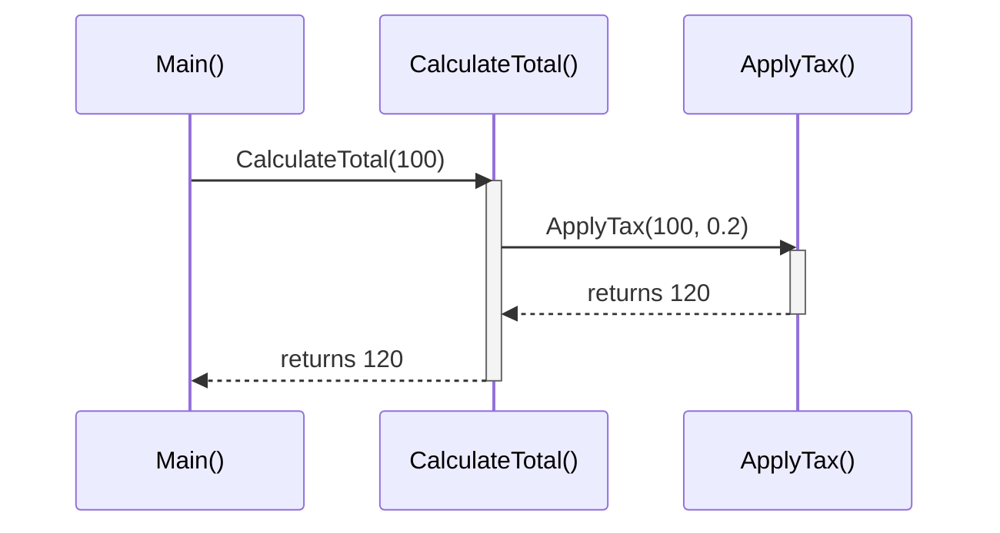
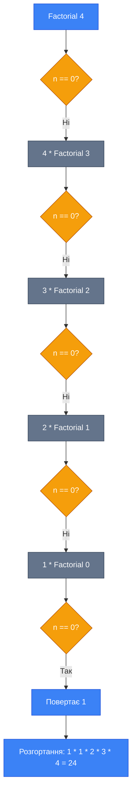

# Методи в C#

## Вступ

Уявіть, що ви пишете програму для онлайн-магазину. Вам потрібно обчислювати знижки, перевіряти наявність товарів, формувати замовлення. Без методів (methods) ваш код перетворився б на безкінечні повторення однакових фрагментів. Методи — це фундаментальний механізм, який дозволяє організувати код у логічні, багаторазово використовувані блоки.

У цьому розділі ви опануєте:

-   Оголошення та виклик методів
-   Передачу параметрів з різними модифікаторами (`ref`, `out`, `in`)
-   Перевантаження методів (overloading)
-   Локальні функції (local functions)
-   Рекурсивні алгоритми (recursion)

::note
**Передумови**: Рекомендується ознайомитися з розділами [Змінні та Типи Даних](/csharp/fundamentals/variables-data-types) та [Керування Потоком Виконання](/csharp/fundamentals/control-flow) перед вивченням цього матеріалу.
::

## Фундаментальні Концепції

### Що таке метод?

[**Метод** (method)](https://learn.microsoft.com/en-us/dotnet/csharp/methods) — це іменований блок коду, який виконує певну задачу і може бути викликаний із різних частин програми. Методи є основою принципів модульності (modularity), повторного використання коду (reusability) та абстракції (abstraction).

**Академічне визначення**: Метод є членом класу або структури, який інкапсулює послідовність інструкцій з визначеною сигнатурою та, опціонально, типом повернення.

### Мета методів

| Принцип         | Опис                                                      | Приклад                                          |
| :-------------- | :-------------------------------------------------------- | :----------------------------------------------- |
| **Reusability** | Код пишеться один раз, використовується багато разів      | Метод `CalculateDiscount()` для всіх товарів     |
| **Modularity**  | Розбиття складної логіки на невеликі компоненти           | Окремі методи для валідації, обробки, збереження |
| **Abstraction** | Приховування деталей реалізації за зрозумілим інтерфейсом | `SendEmail()` замість деталей SMTP-протоколу     |

### Анатомія методу

Розглянемо базову структуру методу в C#:

```csharp showLineNumbers
// Модифікатор доступу | Тип повернення | Ім'я | Параметри
public                  int              Add   (int a, int b)
{
    // Тіло методу (method body)
    return a + b;
}
```

**Компоненти сигнатури методу**:

-   **Модифікатор доступу** (access modifier): `public`, `private`, `protected`, `internal`
-   **Тип повернення** (return type): тип даних, який метод повертає, або `void`
-   **Ім'я методу** (method name): має відповідати PascalCase конвенції
-   **Параметри** (parameters): вхідні дані у круглих дужках

## Оголошення та Виклик Методів

### Типи повернення

Метод може повертати значення або не повертати нічого (`void`):

::code-group

```csharp [void - Без повернення] showLineNumbers
public void DisplayMessage(string message)
{
    Console.WriteLine(message);
    // Немає return statement
}

// Виклик
DisplayMessage("Привіт, світе!");
```

```csharp [Value Type - Повернення значення] showLineNumbers
public int Multiply(int x, int y)
{
    return x * y;
}

// Виклик та збереження результату
int result = Multiply(5, 3); // result = 15
```

```csharp [Reference Type - Повернення об'єкта] showLineNumbers
public string GenerateGreeting(string name)
{
    return $"Вітаємо, {name}!";
}

// Виклик
string greeting = GenerateGreeting("Олексій");
Console.WriteLine(greeting); // Вітаємо, Олексій!
```

::

### Виклик методів та порядок виконання

Коли ви викликаєте метод, виконання програми переходить до коду цього методу, а після завершення повертається до місця виклику. Цей процес відбувається через **call stack** (стек викликів).

::mermaid



::

::tip
**Найкраща практика**: Кожен метод повинен виконувати одну чітко визначену задачу (Single Responsibility Principle). Якщо метод робить багато речей, розбийте його на декілька менших методів.
::

### Параметри методів

Розглянемо різні способи передачі параметрів:

```csharp showLineNumbers
// Без параметрів
public void SayHello()
{
    Console.WriteLine("Привіт!");
}

// З одним параметром
public void Greet(string name)
{
    Console.WriteLine($"Привіт, {name}!");
}

// З декількома параметрами
public double CalculateArea(double width, double height)
{
    return width * height;
}

// Виклики
SayHello();                           // Привіт!
Greet("Марія");                       // Привіт, Марія!
double area = CalculateArea(5.0, 3.0); // 15.0
```

## Parameter Modifiers (Модифікатори Параметрів)

C# надає чотири способи передачі параметрів у методи, кожен з яких впливає на те, як дані передаються та модифікуються.

### Порівняльна таблиця

| Modifier                                                                                                    | Direction | Ініціалізація до виклику | Модифікація всередині | Основне призначення                    |
| :---------------------------------------------------------------------------------------------------------- | :-------- | :----------------------- | :-------------------- | :------------------------------------- |
| (за замовчуванням)                                                                                          | In        | Так                      | Так (копія)           | Стандартна передача значення           |
| [`ref`](https://learn.microsoft.com/en-us/dotnet/csharp/language-reference/keywords/ref)                    | In/Out    | **Так**                  | Так                   | Модифікація змінної викликача          |
| [`out`](https://learn.microsoft.com/en-us/dotnet/csharp/language-reference/keywords/out-parameter-modifier) | Out       | Ні                       | **Так (обов'язково)** | Повернення декількох значень           |
| [`in`](https://learn.microsoft.com/en-us/dotnet/csharp/language-reference/keywords/in-parameter-modifier)   | In        | Так                      | **Ні**                | Великі структури, уникнення копіювання |

### By Value (За замовчуванням)

При передачі за значенням створюється **копія** змінної. Зміни всередині методу не впливають на оригінальну змінну.

```csharp showLineNumbers
public void IncrementValue(int num)
{
    num++; // Модифікується лише локальна копія
    Console.WriteLine($"Всередині методу: {num}");
}

int counter = 5;
Console.WriteLine($"До виклику: {counter}");     // До виклику: 5
IncrementValue(counter);                         // Всередині методу: 6
Console.WriteLine($"Після виклику: {counter}");  // Після виклику: 5 (не змінилось!)
```

### `ref` Modifier — Передача за Посиланням

Модифікатор `ref` передає **посилання** на змінну, а не копію. Зміни всередині методу впливають на оригінальну змінну.

::warning
**Важливо**: Змінна **має бути ініціалізована** до передачі з `ref`.
::

```csharp showLineNumbers
public void IncrementValue(ref int num)
{
    num++; // Модифікує оригінальну змінну
    Console.WriteLine($"Всередині методу: {num}");
}

int counter = 5;
Console.WriteLine($"До виклику: {counter}");        // До виклику: 5
IncrementValue(ref counter);                        // Всередині методу: 6
Console.WriteLine($"Після виклику: {counter}");     // Після виклику: 6 (змінилось!)
```

**Практичний приклад**: Обмін значень двох змінних

```csharp showLineNumbers
public void Swap(ref int a, ref int b)
{
    int temp = a;
    a = b;
    b = temp;
}

int x = 10, y = 20;
Console.WriteLine($"До обміну: x={x}, y={y}");   // До обміну: x=10, y=20
Swap(ref x, ref y);
Console.WriteLine($"Після обміну: x={x}, y={y}"); // Після обміну: x=20, y=10
```

### `out` Modifier — Вихідні Параметри

Модифікатор `out` використовується для **повернення декількох значень** із методу. Змінна **не обов'язково** має бути ініціалізована перед викликом, але **має бути присвоєна** всередині методу.

```csharp showLineNumbers
public bool TryDivide(int dividend, int divisor, out double result)
{
    if (divisor == 0)
    {
        result = 0; // Обов'язково присвоїти значення
        return false;
    }

    result = (double)dividend / divisor;
    return true;
}

// Виклик методу
double quotient;
if (TryDivide(10, 2, out quotient))
{
    Console.WriteLine($"Результат: {quotient}"); // Результат: 5
}
else
{
    Console.WriteLine("Ділення неможливе");
}
```

**C# 7.0+ — Inline declaration**:

```csharp showLineNumbers
// Декларація змінної безпосередньо у виклику методу
if (TryDivide(10, 0, out double result))
{
    Console.WriteLine($"Результат: {result}");
}
else
{
    Console.WriteLine("Ділення неможливе"); // Це виконається
}
```

**Приклад з декількома вихідними параметрами**:

```csharp showLineNumbers
public void GetMinMax(int[] numbers, out int min, out int max)
{
    if (numbers.Length == 0)
    {
        min = 0;
        max = 0;
        return;
    }

    min = numbers[0];
    max = numbers[0];

    foreach (int num in numbers)
    {
        if (num < min) min = num;
        if (num > max) max = num;
    }
}

// Виклик
int[] data = { 5, 2, 9, 1, 7 };
GetMinMax(data, out int minimum, out int maximum);
Console.WriteLine($"Min: {minimum}, Max: {maximum}"); // Min: 1, Max: 9
```

### `in` Modifier — Readonly Reference (C# 7.2+)

Модифікатор `in` передає параметр **за посиланням**, але забороняє його модифікацію всередині методу. Це корисно для великих структур (struct), щоб уникнути копіювання.

```csharp showLineNumbers
public readonly struct LargeStruct
{
    public readonly double X, Y, Z;

    public LargeStruct(double x, double y, double z)
    {
        X = x;
        Y = y;
        Z = z;
    }
}

public double CalculateDistance(in LargeStruct point)
{
    // point.X = 5; // ПОМИЛКА КОМПІЛЯЦІЇ: не можна модифікувати 'in' параметр
    return Math.Sqrt(point.X * point.X + point.Y * point.Y + point.Z * point.Z);
}

// Виклик
LargeStruct p = new LargeStruct(3, 4, 5);
double distance = CalculateDistance(in p); // Передача за посиланням без копіювання
Console.WriteLine($"Відстань: {distance}");
```

::tip
**Використовуйте `in`** для великих readonly структур, щоб покращити продуктивність, уникаючи копіювання даних.
::

## Method Overloading (Перевантаження Методів)

[**Method Overloading**](https://learn.microsoft.com/en-us/dotnet/csharp/programming-guide/classes-and-structs/methods#method-overloading) — це можливість визначити декілька методів з однаковим іменем, але з **різними сигнатурами** (кількість або типи параметрів).

### Правила Overloading

Два методи вважаються різними, якщо вони мають:

1. **Різну кількість параметрів**
2. **Різні типи параметрів**
3. **Різні parameter modifiers** (`ref`, `out`, `in`)

::warning
**Неможливо** перевантажити метод лише за **типом повернення** (return type). Компілятор не враховує тип повернення при виборі методу.
::

### Приклади перевантаження

::code-group

```csharp [За кількістю параметрів] showLineNumbers
public class Calculator
{
    public int Add(int a, int b)
    {
        return a + b;
    }

    public int Add(int a, int b, int c)
    {
        return a + b + c;
    }

    public int Add(int a, int b, int c, int d)
    {
        return a + b + c + d;
    }
}

// Виклик
var calc = new Calculator();
Console.WriteLine(calc.Add(5, 3));           // 8
Console.WriteLine(calc.Add(5, 3, 2));        // 10
Console.WriteLine(calc.Add(5, 3, 2, 1));     // 11
```

```csharp [За типами параметрів] showLineNumbers
public class Printer
{
    public void Print(int value)
    {
        Console.WriteLine($"Integer: {value}");
    }

    public void Print(double value)
    {
        Console.WriteLine($"Double: {value:F2}");
    }

    public void Print(string value)
    {
        Console.WriteLine($"String: {value}");
    }
}

// Виклик
var printer = new Printer();
printer.Print(42);        // Integer: 42
printer.Print(3.14);      // Double: 3.14
printer.Print("Hello");   // String: Hello
```

```csharp [За модифікаторами] showLineNumbers
public class Example
{
    public void Method(int value)
    {
        Console.WriteLine("Passed by value");
    }

    public void Method(ref int value)
    {
        Console.WriteLine("Passed by reference");
    }
}

// Виклик
var ex = new Example();
int num = 5;
ex.Method(num);      // Passed by value
ex.Method(ref num);  // Passed by reference
```

::

### Overload Resolution

Коли ви викликаєте перевантажений метод, компілятор вибирає найбільш **підходящу** версію на основі типів аргументів.

```csharp showLineNumbers
public void Process(int x)
{
    Console.WriteLine("Process(int)");
}

public void Process(double x)
{
    Console.WriteLine("Process(double)");
}

Process(5);      // Process(int) - точний збіг
Process(5.0);    // Process(double) - точний збіг
Process(5L);     // ПОМИЛКА: неоднозначність (long може бути int або double)
```

::note
**Overload Resolution**: Компілятор вибирає метод на основі найкращого збігу типів. Якщо потрібне неявне перетворення (implicit conversion), воно буде виконано автоматично.
::

## Local Functions (Локальні Функції)

[**Локальні функції** (local functions)](https://learn.microsoft.com/en-us/dotnet/csharp/programming-guide/classes-and-structs/local-functions) — це функції, визначені всередині іншого методу. Вони доступні лише в межах цього методу і можуть використовувати змінні зовнішнього контексту.

### Переваги локальних функцій

| Аспект             | Local Function                                | Lambda Expression                   |
| :----------------- | :-------------------------------------------- | :---------------------------------- |
| **Читабельність**  | Ясна назва і підпис                           | Менш явна сигнатура                 |
| **Рекурсія**       | Підтримується природньо                       | Потребує явного визначення делегата |
| **Продуктивність** | Немає виділення пам'яті (у багатьох випадках) | Може створювати делегат             |
| **IDE підтримка**  | Краща рекомендація (IDE0039)                  | Менша пріоритетність                |

::tip
**IDE0039**: Visual Studio та Rider рекомендують використовувати локальні функції замість lambda, коли це можливо.
::

### Приклади використання

**Базовий приклад — Factorial**:

```csharp showLineNumbers
public int CalculateFactorial(int n)
{
    // Валідація вхідних даних
    if (n < 0)
        throw new ArgumentOutOfRangeException(nameof(n), "Input must be non-negative.");

    return LocalFactorial(n);

    // Локальна функція
    int LocalFactorial(int num)
    {
        if (num == 0) return 1;
        return num * LocalFactorial(num - 1);
    }
}

// Виклик
Console.WriteLine(CalculateFactorial(5)); // 120
```

**Використання змінних зовнішнього контексту**:

```csharp showLineNumbers
public void ProcessNumbers(int[] numbers)
{
    int multiplier = 2; // Зовнішня змінна

    // Локальна функція захоплює 'multiplier'
    void PrintMultiplied(int num)
    {
        Console.WriteLine(num * multiplier);
    }

    foreach (int num in numbers)
    {
        PrintMultiplied(num);
    }
}

// Виклик
ProcessNumbers(new[] { 1, 2, 3, 4, 5 }); // 2, 4, 6, 8, 10
```

**Iterator з валідацією**:

Локальні функції дозволяють виконати валідацію **до** створення ітератора:

```csharp showLineNumbers
public IEnumerable<int> GetEvenNumbers(int limit)
{
    // Валідація виконується негайно при виклику GetEvenNumbers
    if (limit > 100)
    {
        throw new ArgumentOutOfRangeException(nameof(limit), "Limit cannot exceed 100.");
    }

    return Iterator();

    // Локальна функція-ітератор
    IEnumerable<int> Iterator()
    {
        for (int i = 0; i <= limit; i += 2)
        {
            yield return i;
        }
    }
}

// Виклик
try
{
    foreach (var num in GetEvenNumbers(150)) // Виняток викидається тут!
    {
        Console.WriteLine(num);
    }
}
catch (ArgumentOutOfRangeException ex)
{
    Console.WriteLine($"Помилка: {ex.Message}");
}
```

::warning
**Без локальної функції** валідація в ітераторі не виконується до першого виклику `MoveNext()`, що може призвести до пізнього виявлення помилок.
::

## Recursion (Рекурсія)

**Рекурсія** (recursion) — це техніка, при якій метод викликає сам себе для вирішення задачі шляхом розбиття її на менші подзадачі.

### Анатомія рекурсивного методу

Кожна рекурсивна функція має два обов'язкові компоненти:

1. **Base Case** (базовий випадок) — умова зупинки рекурсії
2. **Recursive Case** (рекурсивний випадок) — виклик методу із зміненими параметрами

::mermaid



::

### Класичні приклади

::code-group

```csharp [Factorial] showLineNumbers
public int Factorial(int n)
{
    // Base case
    if (n == 0 || n == 1)
        return 1;

    // Recursive case
    return n * Factorial(n - 1);
}

// Виконання: Factorial(4)
// 4 * Factorial(3)
// 4 * (3 * Factorial(2))
// 4 * (3 * (2 * Factorial(1)))
// 4 * (3 * (2 * 1)) = 24
```

```csharp [Fibonacci] showLineNumbers
public int Fibonacci(int n)
{
    // Base cases
    if (n <= 1)
        return n;

    // Recursive case
    return Fibonacci(n - 1) + Fibonacci(n - 2);
}

// Fibonacci(5) = 5
// 0, 1, 1, 2, 3, 5, 8, 13...
```

```csharp [Power (Піднесення до степеня)] showLineNumbers
public double Power(double baseNum, int exponent)
{
    // Base case
    if (exponent == 0)
        return 1;

    // Recursive case
    if (exponent > 0)
        return baseNum * Power(baseNum, exponent - 1);
    else
        return 1 / Power(baseNum, -exponent);
}

// Power(2, 3) = 2 * 2 * 2 = 8
```

::

### Рекурсія vs Ітерація

| Критерій           | Рекурсія                                     | Ітерація                        |
| :----------------- | :------------------------------------------- | :------------------------------ |
| **Читабельність**  | Елегантна для деяких задач (дерева, графи)   | Простіша для лінійних обчислень |
| **Продуктивність** | Повільніша (виклики методів, call stack)     | Швидша (прямий цикл)            |
| **Пам'ять**        | Використовує стек викликів (обмежений)       | Використовує локальні змінні    |
| **Ризик**          | StackOverflowException при глибокій рекурсії | Безпечніша для великих обсягів  |

::warning
[**StackOverflowException**](https://learn.microsoft.com/en-us/dotnet/api/system.stackoverflowexception): Виникає при надто глибокій рекурсії (зазвичай понад 10,000+ викликів у .NET). Переконайтеся, що base case завжди досягається!
::

**Порівняння реалізацій Factorial**:

::code-group

```csharp [Рекурсивна версія] showLineNumbers
public int FactorialRecursive(int n)
{
    if (n <= 1) return 1;
    return n * FactorialRecursive(n - 1);
}
```

```csharp [Ітеративна версія] showLineNumbers
public int FactorialIterative(int n)
{
    int result = 1;
    for (int i = 2; i <= n; i++)
    {
        result *= i;
    }
    return result;
}
```

::

### Tail Recursion (Хвостова рекурсія)

**Tail recursion** — це особливий випадок рекурсії, коли рекурсивний виклик є останньою операцією в методі. Деякі компілятори можуть оптимізувати таку рекурсію в цикл.

```csharp showLineNumbers
// Звичайна рекурсія (НЕ tail recursion)
public int FactorialNormal(int n)
{
    if (n <= 1) return 1;
    return n * FactorialNormal(n - 1); // Після виклику ще є операція множення
}

// Tail recursion з акумулятором
public int FactorialTail(int n, int accumulator = 1)
{
    if (n <= 1) return accumulator;
    return FactorialTail(n - 1, n * accumulator); // Останній виклик - це рекурсія
}
```

::note
**C# та tail call optimization**: На відміну від функціональних мов (F#, Scheme), C# компілятор **не гарантує** оптимізацію хвостової рекурсії. Для великих обсягів даних краще використовувати ітерацію.
::

## Troubleshooting (Усунення проблем)

### Помилка CS0029 — Cannot implicitly convert type

**Симптом**:

```
error CS0029: Cannot implicitly convert type 'double' to 'int'
```

**Причина**: Спроба присвоїти значення несумісного типу без явного перетворення.

**Рішення**:

::code-group

```csharp [❌ Неправильно] showLineNumbers
public int Divide(int a, int b)
{
    return a / b; // Якщо результат — дробове число, буде втрата даних
}
```

```csharp [✅ Правильно] showLineNumbers
public double Divide(int a, int b)
{
    return (double)a / b; // Явне приведення типу
}
```

::

### Помилка CS1620 — Argument must be passed with 'ref' or 'out'

**Симптом**:

```
error CS1620: Argument 2 must be passed with the 'ref' keyword
```

**Причина**: Метод очікує параметр з модифікатором `ref` або `out`, але він не вказаний при виклику.

**Рішення**:

::code-group

```csharp [❌ Неправильно] showLineNumbers
public void Swap(ref int a, ref int b)
{
    int temp = a;
    a = b;
    b = temp;
}

int x = 5, y = 10;
Swap(x, y); // ПОМИЛКА: відсутні 'ref' keywords
```

```csharp [✅ Правильно] showLineNumbers
public void Swap(ref int a, ref int b)
{
    int temp = a;
    a = b;
    b = temp;
}

int x = 5, y = 10;
Swap(ref x, ref y); // Коректно
```

::

### StackOverflowException при рекурсії

**Симптом**: Програма аварійно завершується з повідомленням:

```
Process is terminated due to StackOverflowException
```

**Причина**: Відсутній або недосяжний base case у рекурсивному методі.

**Рішення**:

::code-group

```csharp [❌ Неправильно] showLineNumbers
public int BadFactorial(int n)
{
    // Відсутній base case!
    return n * BadFactorial(n - 1); // Нескінченна рекурсія
}
```

```csharp [✅ Правильно] showLineNumbers
public int GoodFactorial(int n)
{
    // Base case завжди має бути першим
    if (n <= 1) return 1;

    return n * GoodFactorial(n - 1);
}
```

::

::tip
**Перевірте base case**: Завжди переконуйтеся, що рекурсивний метод має чітку умову зупинки, яка **гарантовано** буде досягнута.
::

### Помилка CS0136 — Variable shadowing у local functions

**Симптом**:

```
error CS0136: A local or parameter named 'x' cannot be declared in this scope
```

**Причина**: Спроба оголосити змінну в локальній функції з таким же іменем, як у зовнішньому методі.

**Рішення**:

::code-group

```csharp [❌ Неправильно] showLineNumbers
public void Example()
{
    int x = 10;

    void LocalFunction()
    {
        int x = 20; // ПОМИЛКА: конфлікт імен
        Console.WriteLine(x);
    }

    LocalFunction();
}
```

```csharp [✅ Правильно - Використати зовнішню змінну] showLineNumbers
public void Example()
{
    int x = 10;

    void LocalFunction()
    {
        // Використовуємо зовнішню змінну
        Console.WriteLine(x); // 10
    }

    LocalFunction();
}
```

```csharp [✅ Правильно - Інше ім'я] showLineNumbers
public void Example()
{
    int x = 10;

    void LocalFunction()
    {
        int y = 20; // Інше ім'я
        Console.WriteLine($"x={x}, y={y}");
    }

    LocalFunction();
}
```

::

## Практичні Завдання

### Level 1: Базовий рівень

::steps

#### Завдання 1.1: Обчислення площі

Створіть метод `CalculateRectangleArea`, який приймає два параметри (`width` і `height`) і повертає площу прямокутника.

```csharp showLineNumbers
// Ваш код тут
public double CalculateRectangleArea(double width, double height)
{
    // TODO: реалізувати
}

// Тест
Console.WriteLine(CalculateRectangleArea(5.0, 3.0)); // Очікується: 15.0
```

::collapsible{title="💡 Підказка"}
Площа прямокутника обчислюється за формулою: `площа = ширина × висота`
::

::collapsible{title="✅ Розв'язок"}

```csharp showLineNumbers
public double CalculateRectangleArea(double width, double height)
{
    return width * height;
}
```

::

#### Завдання 1.2: Повернення декількох значень через `out`

Створіть метод `CalculateCircle`, який приймає радіус кола і повертає через `out` параметри площу та довжину кола.

Формули:

-   Площа: π × r²
-   Довжина: 2 × π × r

```csharp showLineNumbers
// Ваш код тут
public void CalculateCircle(double radius, out double area, out double circumference)
{
    // TODO: реалізувати
}

// Тест
CalculateCircle(5.0, out double area, out double circ);
Console.WriteLine($"Площа: {area:F2}, Довжина: {circ:F2}");
// Очікується: Площа: 78.54, Довжина: 31.42
```

::collapsible{title="✅ Розв'язок"}

```csharp showLineNumbers
public void CalculateCircle(double radius, out double area, out double circumference)
{
    const double PI = 3.14159265359;
    area = PI * radius * radius;
    circumference = 2 * PI * radius;
}
```

::

::

### Level 2: Середній рівень

::steps

#### Завдання 2.1: Swap з `ref`

Реалізуйте generic метод `Swap<T>`, який обмінює значення двох змінних будь-якого типу.

```csharp showLineNumbers
public void Swap<T>(ref T a, ref T b)
{
    // TODO: реалізувати
}

// Тест
int x = 10, y = 20;
Swap(ref x, ref y);
Console.WriteLine($"x={x}, y={y}"); // Очікується: x=20, y=10

string s1 = "Hello", s2 = "World";
Swap(ref s1, ref s2);
Console.WriteLine($"s1={s1}, s2={s2}"); // Очікується: s1=World, s2=Hello
```

::collapsible{title="✅ Розв'язок"}

```csharp showLineNumbers
public void Swap<T>(ref T a, ref T b)
{
    T temp = a;
    a = b;
    b = temp;
}
```

::

#### Завдання 2.2: Overloading для різних типів

Створіть перевантажені методи `Max`, які повертають максимальне значення з двох або трьох чисел для типів `int` і `double`.

```csharp showLineNumbers
public class MathHelper
{
    // TODO: реалізувати 4 методи Max
    // Max(int, int)
    // Max(int, int, int)
    // Max(double, double)
    // Max(double, double, double)
}

// Тест
var helper = new MathHelper();
Console.WriteLine(helper.Max(5, 10));           // 10
Console.WriteLine(helper.Max(5, 10, 3));        // 10
Console.WriteLine(helper.Max(5.5, 10.2));       // 10.2
Console.WriteLine(helper.Max(5.5, 10.2, 3.7));  // 10.2
```

::collapsible{title="✅ Розв'язок"}

```csharp showLineNumbers
public class MathHelper
{
    public int Max(int a, int b)
    {
        return a > b ? a : b;
    }

    public int Max(int a, int b, int c)
    {
        return Max(Max(a, b), c);
    }

    public double Max(double a, double b)
    {
        return a > b ? a : b;
    }

    public double Max(double a, double b, double c)
    {
        return Max(Max(a, b), c);
    }
}
```

::

#### Завдання 2.3: Локальна функція для валідації

Створіть метод `ProcessAge`, який використовує локальну функцію для валідації віку (0-120 років).

```csharp showLineNumbers
public void ProcessAge(int age)
{
    // TODO: локальна функція Validate(int age)
    // Викидає ArgumentOutOfRangeException якщо вік некоректний

    Console.WriteLine($"Вік {age} валідний.");
}

// Тест
ProcessAge(25);    // Вік 25 валідний.
ProcessAge(-5);    // ArgumentOutOfRangeException
ProcessAge(150);   // ArgumentOutOfRangeException
```

::collapsible{title="✅ Розв'язок"}

```csharp showLineNumbers
public void ProcessAge(int age)
{
    Validate(age);
    Console.WriteLine($"Вік {age} валідний.");

    void Validate(int ageValue)
    {
        if (ageValue < 0 || ageValue > 120)
        {
            throw new ArgumentOutOfRangeException(nameof(ageValue),
                "Вік має бути в діапазоні 0-120 років.");
        }
    }
}
```

::

::

### Level 3: Просунутий рівень

::steps

#### Завдання 3.1: Рекурсивний обхід дерева файлів

Створіть метод, який рекурсивно виводить всі файли в директорії та піддиректоріях.

```csharp showLineNumbers
public void ListFiles(string path, int indent = 0)
{
    // TODO: реалізувати рекурсивний обхід
    // Використовуйте Directory.GetFiles() та Directory.GetDirectories()
}

// Тест
ListFiles("/path/to/directory");
```

::collapsible{title="💡 Підказка"}

1. Виведіть файли в поточній директорії
2. Отримайте список піддиректорій
3. Рекурсивно викличте метод для кожної піддиректорії з збільшеним відступом

::

::collapsible{title="✅ Розв'язок"}

```csharp showLineNumbers
public void ListFiles(string path, int indent = 0)
{
    try
    {
        // Виведення файлів у поточній директорії
        foreach (string file in Directory.GetFiles(path))
        {
            Console.WriteLine($"{new string(' ', indent)}📄 {Path.GetFileName(file)}");
        }

        // Рекурсивний обхід піддиректорій
        foreach (string directory in Directory.GetDirectories(path))
        {
            Console.WriteLine($"{new string(' ', indent)}📁 {Path.GetFileName(directory)}");
            ListFiles(directory, indent + 2); // Рекурсивний виклик
        }
    }
    catch (UnauthorizedAccessException)
    {
        Console.WriteLine($"{new string(' ', indent)}❌ Доступ заборонено");
    }
}
```

::

#### Завдання 3.2: Ackermann Function (комбінація рекурсії та локальної функції)

Реалізуйте функцію Акермана — одну з найшвидше зростаючих рекурсивних функцій.

Формула:

```
A(m, n) =
  n + 1,                якщо m = 0
  A(m - 1, 1),          якщо m > 0 і n = 0
  A(m - 1, A(m, n - 1)), якщо m > 0 і n > 0
```

```csharp showLineNumbers
public int Ackermann(int m, int n)
{
    // TODO: реалізувати через локальну рекурсивну функцію
}

// Тест (ОБЕРЕЖНО: значення швидко зростають!)
Console.WriteLine(Ackermann(0, 5));  // 6
Console.WriteLine(Ackermann(1, 3));  // 5
Console.WriteLine(Ackermann(2, 2));  // 7
Console.WriteLine(Ackermann(3, 2));  // 29
// НЕ викликайте з великими значеннями! Ackermann(4, 2) вже містить тисячі рекурсивних викликів
```

::collapsible{title="✅ Розв'язок"}

```csharp showLineNumbers
public int Ackermann(int m, int n)
{
    if (m < 0 || n < 0)
        throw new ArgumentOutOfRangeException("m і n мають бути невід'ємними");

    return Compute(m, n);

    int Compute(int mVal, int nVal)
    {
        if (mVal == 0)
            return nVal + 1;

        if (nVal == 0)
            return Compute(mVal - 1, 1);

        return Compute(mVal - 1, Compute(mVal, nVal - 1));
    }
}
```

::

::warning
**Функція Акермана** росте надзвичайно швидко! `A(4, 2)` містить понад 10^19728 обчислень. Це демонстраційний приклад складності рекурсії.
::

::

## Резюме

У цьому розділі ви опанували фундаментальні концепції методів у C#:

::card-group
::card{title="Оголошення методів" icon="i-heroicons-code-bracket"}
Сигнатура методу, типи повернення, параметри та виклик методів.
::

::card{title="Parameter Modifiers" icon="i-heroicons-arrow-path"}
Передача параметрів за значенням, `ref`, `out`, `in` — кожен для свого сценарію.
::

::card{title="Method Overloading" icon="i-heroicons-squares-plus"}
Декілька методів з однаковим іменем, але різними сигнатурами для гнучкості API.
::

::card{title="Local Functions" icon="i-heroicons-cube"}
Інкапсуляція допоміжної логіки всередині методу з доступом до зовнішнього контексту.
::

::card{title="Recursion" icon="i-heroicons-arrow-path-rounded-square"}
Елегантне вирішення задач через самовиклик з обов'язковим base case.
::
::

**Ключові поради**:

-   ✅ Використовуйте `out` для повернення декількох значень
-   ✅ `ref` — коли потрібно модифікувати змінну викликача
-   ✅ `in` — для великих readonly структур (оптимізація)
-   ✅ Локальні функції краще lambda для рекурсії та читабельності
-   ⚠️ Рекурсія елегантна, але має ризик StackOverflowException
-   ⚠️ Завжди забезпечте досяжний base case у рекурсії

**Наступний крок**: Перейдіть до розділу [Arrays & Collections](/csharp/fundamentals/arrays-collections) для вивчення роботи з колекціями даних, де методи стають ще потужнішим інструментом.
