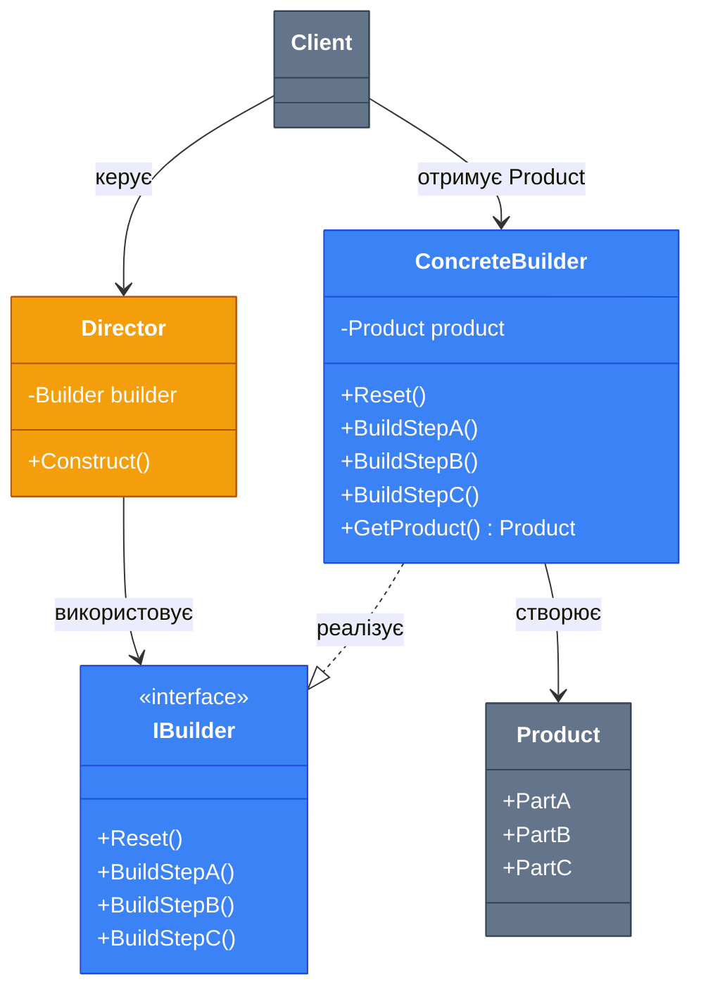

# Builder (Будівельник)

## Вступ та Контекст

Уявіть, що ви розробляєте систему для створення HTTP запитів. Простий `GET` запит може виглядати так:

```csharp
var request = new HttpRequest("https://api.example.com/users");
```

Але що, якщо вам потрібен складніший запит з **заголовками, параметрами запиту, тілом, таймаутом, автентифікацією**?

```csharp
// ❌ ПРОБЛЕМА: Телескопічний конструктор (Telescoping Constructor)
var request = new HttpRequest(
    "https://api.exception.com/users",
    "POST",
    new Dictionary<string, string> { ["Authorization"] = "Bearer token" },
    new Dictionary<string, string> { ["userId"] = "123" },
    "{\"name\": \"John\"}",
    TimeSpan.FromSeconds(30),
    true
);

// Незрозуміло, що означає кожен параметр!
// А якщо деякі параметри опціональні?
```

**Builder (Будівельник)** — це породжуючий патерн проектування, який дозволяє **створювати складні об'єкти крок за кроком**, надаючи **зрозумілий та гнучкий інтерфейс** для конфігурації.

::tip
Builder вирішує три ключові проблеми:

1. **Телескопічні конструктори** з десятками параметрів
2. **Незрозумілі виклики** з багатьма `null` та `default` значеннями
3. **Обов'язкова послідовність** створення складних об'єктів

::

### Коли використовувати

| Сценарій                           | Обґрунтування                                              |
| :--------------------------------- | :--------------------------------------------------------- |
| **Складні об'єкти**                | Клас з більш ніж 3-4 параметрами конструктора              |
| **Багато опціональних параметрів** | Уникнення конструкторів з десятками `null`                 |
| **Крокова конструкція**            | Об'єкт створюється поетапно (наприклад, SQL запит)         |
| **Різні представлення**            | Один процес створення, різні результати (Car vs CarManual) |
| **Fluent Interface**               | Потрібен зручний та читабельний API (method chaining)      |

---

## Фундаментальні Концепції

### Академічне визначення

> **Builder (Будівельник)** — це породжуючий патерн проектування, який дозволяє створювати складні об'єкти покроково. Патерн дозволяє використовувати один і той самий код конструювання для отримання різних типів та представлень об'єктів.

### Ключова ідея

Проблема складних конструкторів виникає, коли в класі забагато параметрів. Традиційні підходи:

1. **Телескопічні конструктори** — створення множини перевантажених конструкторів
2. **Великий конструктор** — один конструктор з десятками параметрів
3. **Сеттери** — створення об'єкта з частково ініціалізованим станом

**Builder** вирішує це через:

-   Винесення логіки створення в окремий клас (Builder)
-   Покрокове налаштування об'єкта через методи Builder
-   Фінальний метод `Build()`, який повертає готовий об'єкт

::note
**Чому Builder краще за сеттери?**  
Сеттери дозволяють створити об'єкт у **несумісному стані** (частково ініціалізований). Builder гарантує, що об'єкт буде **повністю валідним** після виклику `Build()`. Крім того, Builder дозволяє створювати **незмінні об'єкти (immutable)**, тоді як сеттери вимагають змінюваних властивостей.
::

### Аналогія з реального світу

**Будівництво будинку** — ідеальна аналогія Builder:

-   **Архітектурний план** (Director) визначає, що потрібно побудувати
-   **Будівельна бригада** (Builder) виконує кроки: фундамент → стіни → дах → інтер'єр
-   **Результат** може бути різним: **котедж, хмарочос, або креслення** (різні продукти з одного процесу)

Так само Builder в програмуванні створює об'єкти крок за кроком, дозволяючи налаштовувати кожен крок незалежно.

---

## Архітектура та Механіка

### UML діаграма класів

::mermaid



::

### Діаграма послідовності

::mermaid

```mermaid
sequenceDiagram
    participant Client
    participant Director
    participant Builder
    participant Product

    Client->>+Builder: new ConcreteBuilder()
    Client->>+Director: new Director(builder)

    Client->>Director: Construct()
    activate Director
    Director->>Builder: Reset()
    Director->>Builder: BuildStepA()
    Director->>Builder: BuildStepB()
    Director->>Builder: BuildStepC()
    deactivate Director

    Client->>Builder: GetProduct()
    Builder->>Product: create Product
    Builder-->>Client: return Product

    Note over Client,Product: Продукт створений покроково

    style Director fill:#f59e0b,stroke:#b45309,color:#ffffff
    style Builder fill:#3b82f6,stroke:#1d4ed8,color:#ffffff
    style Product fill:#64748b,stroke:#334155,color:#ffffff
    style Client fill:#64748b,stroke:#334155,color:#ffffff
```

::

### Учасники та їх ролі

| Учасник                    | Роль                    | Відповідальність                      |
| :------------------------- | :---------------------- | :------------------------------------ |
| **Builder (інтерфейс)**    | Абстрактний будівельник | Визначає кроки створення продукту     |
| **ConcreteBuilder**        | Конкретний будівельник  | Реалізує кроки та зберігає результат  |
| **Product**                | Продукт                 | Складний об'єкт, який створюється     |
| **Director** (опціонально) | Директор                | Визначає порядок кроків конструювання |
| **Client**                 | Клієнт                  | Ініціює процес та отримує результат   |

---

## Практична Реалізація

### Варіація 1: Classic Builder (з інтерфейсом)

Класичний підхід GoF з явним інтерфейсом Builder.

```csharp [ICarBuilder.cs] showLineNumbers
namespace DesignPatterns.Creational.Builder;

/// <summary>
/// Інтерфейс Builder визначає кроки створення продукту
/// </summary>
public interface ICarBuilder
{
    void Reset();
    void SetSeats(int number);
    void SetEngine(string engineType);
    void SetTripComputer(bool hasTripComputer);
    void SetGPS(bool hasGPS);
}
```

```csharp [Car.cs] showLineNumbers
namespace DesignPatterns.Creational.Builder;

/// <summary>
/// Продукт - складний об'єкт з багатьма частинами
/// </summary>
public class Car
{
    public int Seats { get; set; }
    public string Engine { get; set; } = string.Empty;
    public bool HasTripComputer { get; set; }
    public bool HasGPS { get; set; }

    public override string ToString()
    {
        return $"Car: {Seats} seats, {Engine} engine, " +
               $"TripComputer: {HasTripComputer}, GPS: {HasGPS}";
    }
}
```

```csharp [CarBuilder.cs] showLineNumbers
namespace DesignPatterns.Creational.Builder;

/// <summary>
/// Конкретний Builder для створення Car
/// </summary>
public class CarBuilder : ICarBuilder
{
    private Car _car = new();

    public void Reset()
    {
        _car = new Car();
    }

    public void SetSeats(int number)
    {
        _car.Seats = number;
    }

    public void SetEngine(string engineType)
    {
        _car.Engine = engineType;
    }

    public void SetTripComputer(bool hasTripComputer)
    {
        _car.HasTripComputer = hasTripComputer;
    }

    public void SetGPS(bool hasGPS)
    {
        _car.HasGPS = hasGPS;
    }

    /// <summary>
    /// Повертає готовий продукт та скидає builder для наступного використання
    /// </summary>
    public Car GetProduct()
    {
        Car result = _car;
        Reset(); // Підготовка до створення нового об'єкту
        return result;
    }
}
```

```csharp [CarManualBuilder.cs] showLineNumbers
namespace DesignPatterns.Creational.Builder;

/// <summary>
/// Інший Builder створює РІЗНИЙ продукт (Manual замість Car)
/// використовуючи ТІ Ж САМІ кроки
/// </summary>
public class CarManualBuilder : ICarBuilder
{
    private Manual _manual = new();

    public void Reset()
    {
        _manual = new Manual();
    }

    public void SetSeats(int number)
    {
        _manual.AddSection($"Інструкція по використанню {number} сидінь.");
    }

    public void SetEngine(string engineType)
    {
        _manual.AddSection($"Обслуговування двигуна типу: {engineType}.");
    }

    public void SetTripComputer(bool hasTripComputer)
    {
        if (hasTripComputer)
            _manual.AddSection("Інструкція по використанню бортового комп'ютера.");
    }

    public void SetGPS(bool hasGPS)
    {
        if (hasGPS)
            _manual.AddSection("Налаштування GPS навігації.");
    }

    public Manual GetProduct()
    {
        Manual result = _manual;
        Reset();
        return result;
    }
}

public class Manual
{
    private readonly List<string> _sections = new();

    public void AddSection(string section)
    {
        _sections.Add(section);
    }

    public override string ToString()
    {
        return $"Manual:\n  - {string.Join("\n  - ", _sections)}";
    }
}
```

**Використання (без Director):**

```csharp [Program.cs] showLineNumbers
using DesignPatterns.Creational.Builder;

// Клієнт самостійно конфігурує Builder
var carBuilder = new CarBuilder();

carBuilder.SetSeats(4);
carBuilder.SetEngine("V8");
carBuilder.SetTripComputer(true);
carBuilder.SetGPS(true);

Car car = carBuilder.GetProduct();
Console.WriteLine(car);

// Той самий builder можна використати повторно
carBuilder.SetSeats(2);
carBuilder.SetEngine("V6");
Car sportsCar = carBuilder.GetProduct();
Console.WriteLine(sportsCar);
```

---

### Варіація 2: Fluent Builder (Method Chaining)

**Найпопулярніша варіація в C#** — використання **Fluent Interface** з method chaining.

```csharp [HttpRequest.cs] showLineNumbers
namespace DesignPatterns.Creational.Builder;

/// <summary>
/// Продукт - HTTP запит
/// </summary>
public class HttpRequest
{
    public string Url { get; init; } = string.Empty;
    public string Method { get; init; } = "GET";
    public Dictionary<string, string> Headers { get; init; } = new();
    public Dictionary<string, string> QueryParams { get; init; } = new();
    public string? Body { get; init; }
    public TimeSpan Timeout { get; init; } = TimeSpan.FromSeconds(30);

    public override string ToString()
    {
        var headers = string.Join(", ", Headers.Select(kv => $"{kv.Key}: {kv.Value}"));
        var queryParams = string.Join("&", QueryParams.Select(kv => $"{kv.Key}={kv.Value}"));
        var url = string.IsNullOrEmpty(queryParams) ? Url : $"{Url}?{queryParams}";

        return $"{Method} {url}\nHeaders: {headers}\nBody: {Body ?? "None"}\nTimeout: {Timeout.TotalSeconds}s";
    }
}
```

```csharp [HttpRequestBuilder.cs] showLineNumbers
namespace DesignPatterns.Creational.Builder;

/// <summary>
/// Fluent Builder з method chaining
/// </summary>
public class HttpRequestBuilder
{
    private string _url = string.Empty;
    private string _method = "GET";
    private readonly Dictionary<string, string> _headers = new();
    private readonly Dictionary<string, string> _queryParams = new();
    private string? _body;
    private TimeSpan _timeout = TimeSpan.FromSeconds(30);

    /// <summary>
    /// Встановлює URL. Повертає this для method chaining.
    /// </summary>
    public HttpRequestBuilder WithUrl(string url)
    {
        _url = url;
        return this; // ✅ Ключ до Fluent Interface
    }

    public HttpRequestBuilder WithMethod(string method)
    {
        _method = method.ToUpper();
        return this;
    }

    public HttpRequestBuilder WithHeader(string key, string value)
    {
        _headers[key] = value;
        return this;
    }

    public HttpRequestBuilder WithQueryParam(string key, string value)
    {
        _queryParams[key] = value;
        return this;
    }

    public HttpRequestBuilder WithBody(string body)
    {
        _body = body;
        return this;
    }

    public HttpRequestBuilder WithTimeout(TimeSpan timeout)
    {
        _timeout = timeout;
        return this;
    }

    /// <summary>
    /// Фінальний метод, який створює та повертає продукт
    /// </summary>
    public HttpRequest Build()
    {
        if (string.IsNullOrWhiteSpace(_url))
            throw new InvalidOperationException("URL є обов'язковим параметром");

        return new HttpRequest
        {
            Url = _url,
            Method = _method,
            Headers = new Dictionary<string, string>(_headers),
            QueryParams = new Dictionary<string, string>(_queryParams),
            Body = _body,
            Timeout = _timeout
        };
    }
}
```

**Використання:**

```csharp [Program.cs] showLineNumbers
using DesignPatterns.Creational.Builder;

// ✅ Читабельний та зрозумілий API
var request = new HttpRequestBuilder()
    .WithUrl("https://api.example.com/users")
    .WithMethod("POST")
    .WithHeader("Authorization", "Bearer token123")
    .WithHeader("Content-Type", "application/json")
    .WithQueryParam("page", "1")
    .WithQueryParam("limit", "10")
    .WithBody("{\"name\": \"John Doe\", \"email\": \"john@example.com\"}")
    .WithTimeout(TimeSpan.FromSeconds(60))
    .Build();

Console.WriteLine(request);

// Output:
// POST https://api.example.com/users?page=1&limit=10
// Headers: Authorization: Bearer token123, Content-Type: application/json
// Body: {"name": "John Doe", "email": "john@example.com"}
// Timeout: 60s
```

::tip
**Переваги Fluent Builder**

-   **Читабельність**: Код читається як англійське речення
-   **Гнучкість**: Можна пропустити опціональні параметри
-   **Автозавершення IDE**: IntelliSense підказує доступні методи
-   **Immutability**: Продукт можна зробити незмінним через `{ get; init; }`

::

---

### Варіація 3: Director для стандартних конфігурацій

**Director** інкапсулює **типові конфігурації**, дозволяючи створювати популярні варіанти одним викликом.

```csharp [CarDirector.cs] showLineNumbers
namespace DesignPatterns.Creational.Builder;

/// <summary>
/// Director знає, як створювати популярні конфігурації автомобілів
/// </summary>
public class CarDirector
{
    private readonly ICarBuilder _builder;

    public CarDirector(ICarBuilder builder)
    {
        _builder = builder;
    }

    /// <summary>
    /// Створює спортивний автомобіль
    /// </summary>
    public void ConstructSportsCar()
    {
        _builder.Reset();
        _builder.SetSeats(2);
        _builder.SetEngine("V8 Twin-Turbo");
        _builder.SetTripComputer(true);
        _builder.SetGPS(true);
    }

    /// <summary>
    /// Створює міський автомобіль
    /// </summary>
    public void ConstructCityCar()
    {
        _builder.Reset();
        _builder.SetSeats(4);
        _builder.SetEngine("Inline-4");
        _builder.SetTripComputer(false);
        _builder.SetGPS(true);
    }

    /// <summary>
    /// Створює позашляховик (SUV)
    /// </summary>
    public void ConstructSUV()
    {
        _builder.Reset();
        _builder.SetSeats(7);
        _builder.SetEngine("V6");
        _builder.SetTripComputer(true);
        _builder.SetGPS(true);
    }
}
```

**Використання з Director:**

```csharp [Program.cs] showLineNumbers
using DesignPatterns.Creational.Builder;

var carBuilder = new CarBuilder();
var director = new CarDirector(carBuilder);

// Створюємо спортивний автомобіль
director.ConstructSportsCar();
Car sportsCar = carBuilder.GetProduct();
Console.WriteLine("Sports Car: " + sportsCar);

// Створюємо міський автомобіль
director.ConstructCityCar();
Car cityCar = carBuilder.GetProduct();
Console.WriteLine("City Car: " + cityCar);

// Створюємо інструкцію для SUV
var manualBuilder = new CarManualBuilder();
director = new CarDirector(manualBuilder);
director.ConstructSUV();
Manual suvManual = manualBuilder.GetProduct();
Console.WriteLine(suvManual);
```

::note
**Коли використовувати Director?**

-   Коли є **стандартні конфігурації** (наприклад, "Basic", "Premium", "Deluxe")
-   Коли потрібно **приховати складність** створення від клієнта
-   Коли один і той же процес створює **різні продукти** (Car vs Manual)

**Коли НЕ потрібен Director?**

-   При використанні Fluent Builder (метод `Build()` заміняє Director)
-   Коли клієнт бажає **повного контролю** над кроками

::

---

### Варіація 4: Builder з валідацією та вимогами

Покращений Fluent Builder з **обов'язковими полями** та валідацією.

```csharp [UserBuilder.cs] showLineNumbers
namespace DesignPatterns.Creational.Builder;

public class User
{
    public required string Username { get; init; }
    public required string Email { get; init; }
    public string? FirstName { get; init; }
    public string? LastName { get; init; }
    public int Age { get; init; }
    public string[] Roles { get; init; } = Array.Empty<string>();

    public override string ToString()
    {
        return $"User: {Username}, Email: {Email}, Name: {FirstName} {LastName}, " +
               $"Age: {Age}, Roles: [{string.Join(", ", Roles)}]";
    }
}

public class UserBuilder
{
    private string? _username;
    private string? _email;
    private string? _firstName;
    private string? _lastName;
    private int _age;
    private readonly List<string> _roles = new();

    public UserBuilder WithUsername(string username)
    {
        if (string.IsNullOrWhiteSpace(username))
            throw new ArgumentException("Username не може бути порожнім", nameof(username));

        _username = username;
        return this;
    }

    public UserBuilder WithEmail(string email)
    {
        if (!email.Contains('@'))
            throw new ArgumentException("Невалідний email", nameof(email));

        _email = email;
        return this;
    }

    public UserBuilder WithName(string firstName, string lastName)
    {
        _firstName = firstName;
        _lastName = lastName;
        return this;
    }

    public UserBuilder WithAge(int age)
    {
        if (age < 0 || age > 150)
            throw new ArgumentException("Невалідний вік", nameof(age));

        _age = age;
        return this;
    }

    public UserBuilder AddRole(string role)
    {
        if (!_roles.Contains(role))
            _roles.Add(role);
        return this;
    }

    public User Build()
    {
        // Валідація обов'язкових полів
        if (string.IsNullOrWhiteSpace(_username))
            throw new InvalidOperationException("Username є обов'язковим");

        if (string.IsNullOrWhiteSpace(_email))
            throw new InvalidOperationException("Email є обов'язковим");

        return new User
        {
            Username = _username,
            Email = _email,
            FirstName = _firstName,
            LastName = _lastName,
            Age = _age,
            Roles = _roles.ToArray()
        };
    }
}
```

**Використання:**

```csharp [Program.cs] showLineNumbers
using DesignPatterns.Creational.Builder;

try
{
    var user = new UserBuilder()
        .WithUsername("john_doe")
        .WithEmail("john@example.com")
        .WithName("John", "Doe")
        .WithAge(30)
        .AddRole("Admin")
        .AddRole("User")
        .Build();

    Console.WriteLine(user);
}
catch (Exception ex)
{
    Console.WriteLine($"Помилка: {ex.Message}");
}

// Спроба створити невалідного користувача
try
{
    var invalidUser = new UserBuilder()
        .WithEmail("invalid-email") // Помилка валідації
        .Build();
}
catch (ArgumentException ex)
{
    Console.WriteLine($"Помилка валідації: {ex.Message}");
}
```

---

## Реальні приклади з .NET

### Приклад 1: StringBuilder (вбудований Builder в .NET)

`StringBuilder` — **класичний приклад** Builder патерну в .NET.

```csharp [StringBuilderExample.cs] showLineNumbers
using System.Text;

// StringBuilder використовує Builder патерн для ефективного створення строк
var builder = new StringBuilder();

builder
    .Append("Hello, ")
    .Append("World!")
    .AppendLine()
    .Append("Builder pattern ")
    .Append("in action.");

string result = builder.ToString(); // Фінальний метод Build()
Console.WriteLine(result);

// Output:
// Hello, World!
// Builder pattern in action.
```

### Приклад 2: UriBuilder

```csharp [UriBuilderExample.cs] showLineNumbers
// UriBuilder - ще один вбудований Builder в .NET
var uriBuilder = new UriBuilder
{
    Scheme = "https",
    Host = "api.example.com",
    Port = 443,
    Path = "/v1/users",
    Query = "page=1&limit=10"
};

Uri uri = uriBuilder.Uri;
Console.WriteLine(uri); // https://api.example.com/v1/users?page=1&limit=10
```

### Приклад 3: EF Core Query Builder (Fluent API)

Entity Framework Core використовує Fluent Builder для побудови запитів до БД.

```csharp [EFCoreExample.cs] showLineNumbers
using Microsoft.EntityFrameworkCore;

// Fluent API в EF Core - це Builder патерн
protected override void OnModelCreating(ModelBuilder modelBuilder)
{
    modelBuilder.Entity<User>()
        .HasKey(u => u.Id);

    modelBuilder.Entity<User>()
        .Property(u => u.Username)
        .IsRequired()
        .HasMaxLength(50);

    modelBuilder.Entity<User>()
        .HasMany(u => u.Orders)
        .WithOne(o => o.User)
        .HasForeignKey(o => o.UserId);
}
```

### Приклад 4: ASP.NET Core WebApplicationBuilder

```csharp [Program.cs] showLineNumbers
using Microsoft.AspNetCore.Builder;

// WebApplicationBuilder - Builder патерн для конфігурації ASP.NET Core додатку
var builder = WebApplication.CreateBuilder(args);

// Покрокова конфігурація
builder.Services.AddControllers();
builder.Services.AddEndpointsApiExplorer();
builder.Services.AddSwaggerGen();

var app = builder.Build(); // ✅ Фінальний Build()

app.UseSwagger();
app.UseSwaggerUI();
app.UseAuthorization();
app.MapControllers();

app.Run();
```

---

## Patterns & Anti-patterns

### ✅ Best Practices

::steps

### Крок 1: Використовуйте Fluent Interface для зручності

Повертайте `this` з кожного методу Builder для method chaining.

```csharp
public QueryBuilder Where(string condition)
{
    _conditions.Add(condition);
    return this; // ✅ Дозволяє .Where().OrderBy().Limit()
}
```

### Крок 2: Робіть продукт незмінним (immutable)

Використовуйте `{ get; init; }` для властивостей продукту.

```csharp
public class Product
{
    public string Name { get; init; } = string.Empty;
    public decimal Price { get; init; }
}
```

### Крок 3: Валідуйте дані в методі Build()

Перевіряйте обов'язкові параметри перед створенням продукту.

```csharp
public Product Build()
{
    if (string.IsNullOrEmpty(_name))
        throw new InvalidOperationException("Name є обов'язковим");

    // Створення продукту
}
```

### Крок 4: Використовуйте Reset() для повторного використання

Дозвольте створювати кілька об'єктів одним Builder.

```csharp
public void Reset()
{
    _product = new Product();
}
```

::

### ❌ Антипатерни та підводні камені

::warning

#### 1. Надмірне ускладнення

**Проблема:**  
Використання Builder для простих об'єктів з 2-3 параметрами.

```csharp
// ❌ АНТИПАТЕРН: Builder для простого об'єкту
var point = new PointBuilder()
    .WithX(10)
    .WithY(20)
    .Build();

// ✅ ПРАВИЛЬНО: Простий конструктор або record
var point = new Point(10, 20);
// або
var point = new Point { X = 10, Y = 20 };
```

**Правило:**  
Builder виправданий лише для об'єктів з **4+ параметрами** або складною логікою створення.

---

#### 2. Змінюваний (mutable) продукт

**Проблема:**  
Продукт з публічними сеттерами дозволяє змінювати стан після створення.

```csharp
// ❌ АНТИПАТЕРН: Змінюваний продукт
public class User
{
    public string Username { get; set; } // Можна змінити після створення!
    public string Email { get; set; }
}

var user = builder.Build();
user.Username = "hacker"; // Небезпечно!
```

**Рішення:**  
Використовуйте `{ get; init; }` або `readonly`.

```csharp
// ✅ ПРАВИЛЬНО: Незмінний продукт
public class User
{
    public string Username { get; init; } = string.Empty;
    public string Email { get; init; } = string.Empty;
}
```

---

#### 3. Відсутність валідації

**Проблема:**  
Builder створює невалідний об'єкт.

```csharp
// ❌ АНТИПАТЕРН: Без валідації
public HttpRequest Build()
{
    return new HttpRequest { Url = _url }; // _url може бути null!
}
```

**Рішення:**  
Валідуйте в `Build()`.

```csharp
// ✅ ПРАВИЛЬНО: Валідація обов'язкових полів
public HttpRequest Build()
{
    if (string.IsNullOrWhiteSpace(_url))
        throw new InvalidOperationException("URL є обов'язковим");

    return new HttpRequest { Url = _url };
}
```

::

---

## Troubleshooting

### Проблема 1: NullReferenceException в Build()

**Симптоми:**

```
System.NullReferenceException: Object reference not set to an instance of an object.
```

**Причина:**  
Обов'язкове поле не було встановлене.

**Рішення:**  
Додайте перевірку в методі `Build()`.

```csharp
public User Build()
{
    if (_username == null)
        throw new InvalidOperationException("Username обов'язковий. Використайте WithUsername().");

    return new User { Username = _username, ... };
}
```

---

### Проблема 2: Builder створює один об'єкт замість багатьох

**Симптоми:**

```csharp
var builder = new CarBuilder();
builder.SetSeats(2);
var car1 = builder.GetProduct();

builder.SetSeats(4);
var car2 = builder.GetProduct();

Console.WriteLine(car1.Seats); // 4 (очікували 2!)
```

**Причина:**  
Builder не викликає `Reset()` після `GetProduct()`.

**Рішення:**  
Автоматично скидайте в `GetProduct()`.

```csharp
public Car GetProduct()
{
    Car result = _car;
    Reset(); // ✅ Скидаємо для наступного використання
    return result;
}
```

---

### Проблема 3: Проблеми з наслідуванням Builder

**Симптоми:**  
При спробі створити базовий Builder для успадкування, method chaining не працює.

```csharp
public class BaseBuilder
{
    public BaseBuilder WithId(int id) { ... return this; }
}

public class DerivedBuilder : BaseBuilder
{
    public DerivedBuilder WithName(string name) { ... return this; }
}

// ❌ Не компілюється:
new DerivedBuilder()
    .WithId(1)      // Повертає BaseBuilder
    .WithName("X"); // Помилка: BaseBuilder не має WithName()
```

**Рішення:**  
Використовуйте **generic base class** з `self` типом.

```csharp
public class BaseBuilder<TSelf> where TSelf : BaseBuilder<TSelf>
{
    public TSelf WithId(int id)
    {
        // ...
        return (TSelf)this;
    }
}

public class DerivedBuilder : BaseBuilder<DerivedBuilder>
{
    public DerivedBuilder WithName(string name)
    {
        // ...
        return this;
    }
}

// ✅ Тепер працює
new DerivedBuilder()
    .WithId(1)
    .WithName("X");
```

---

## Практичні Завдання

### Рівень 1: Базовий

::collapsible{title="Завдання: Створити Pizza Builder"}

**Опис:**  
Реалізуйте Fluent Builder для класу `Pizza`, який дозволяє налаштувати:

-   Розмір піци (`Small`, `Medium`, `Large`)
-   Тип тіста (`Thin`, `Thick`)
-   Соус (`Tomato`, `BBQ`, `Garlic`)
-   Топінги (список, наприклад: `Cheese`, `Pepperoni`, `Mushrooms`, `Olives`)

**Очікуваний результат:**

```csharp
var pizza = new PizzaBuilder()
    .WithSize("Large")
    .WithCrust("Thin")
    .WithSauce("Tomato")
    .AddTopping("Cheese")
    .AddTopping("Pepperoni")
    .AddTopping("Mushrooms")
    .Build();

Console.WriteLine(pizza);
// Output: Large pizza, Thin crust, Tomato sauce, Toppings: Cheese, Pepperoni, Mushrooms
```

---

**Рішення:**

```csharp [Pizza.cs] showLineNumbers
namespace DesignPatterns.Practice;

public class Pizza
{
    public string Size { get; init; } = "Medium";
    public string Crust { get; init; } = "Thick";
    public string Sauce { get; init; } = "Tomato";
    public string[] Toppings { get; init; } = Array.Empty<string>();

    public override string ToString()
    {
        var toppings = Toppings.Length > 0 ? string.Join(", ", Toppings) : "No toppings";
        return $"{Size} pizza, {Crust} crust, {Sauce} sauce, Toppings: {toppings}";
    }
}

public class PizzaBuilder
{
    private string _size = "Medium";
    private string _crust = "Thick";
    private string _sauce = "Tomato";
    private readonly List<string> _toppings = new();

    public PizzaBuilder WithSize(string size)
    {
        _size = size;
        return this;
    }

    public PizzaBuilder WithCrust(string crust)
    {
        _crust = crust;
        return this;
    }

    public PizzaBuilder WithSauce(string sauce)
    {
        _sauce = sauce;
        return this;
    }

    public PizzaBuilder AddTopping(string topping)
    {
        if (!_toppings.Contains(topping))
            _toppings.Add(topping);
        return this;
    }

    public Pizza Build()
    {
        return new Pizza
        {
            Size = _size,
            Crust = _crust,
            Sauce = _sauce,
            Toppings = _toppings.ToArray()
        };
    }
}
```

```csharp [Program.cs] showLineNumbers
using DesignPatterns.Practice;

var pizza = new PizzaBuilder()
    .WithSize("Large")
    .WithCrust("Thin")
    .WithSauce("Tomato")
    .AddTopping("Cheese")
    .AddTopping("Pepperoni")
    .AddTopping("Mushrooms")
    .Build();

Console.WriteLine(pizza);

// Створюємо просту піцу з дефолтними значеннями
var simplePizza = new PizzaBuilder()
    .AddTopping("Cheese")
    .Build();

Console.WriteLine(simplePizza);
```

::

---

### Рівень 2: Середній

::collapsible{title="Завдання: SQL Query Builder"}

**Опис:**  
Створіть Fluent Builder для побудови SQL запитів:

-   `Select(params string[] columns)`
-   `From(string table)`
-   `Where(string condition)`
-   `OrderBy(string column, bool ascending = true)`
-   `Limit(int count)`
-   `Build()` — повертає готовий SQL запит як строку

Додайте валідацію: `FROM` є обов'язковим!

**Очікуваний результат:**

```csharp
var sql = new SqlQueryBuilder()
    .Select("Id", "Name", "Email")
    .From("Users")
    .Where("Age > 18")
    .Where("IsActive = 1")
    .OrderBy("Name", ascending: true)
    .Limit(10)
    .Build();

Console.WriteLine(sql);
// Output:
// SELECT Id, Name, Email
// FROM Users
// WHERE Age > 18 AND IsActive = 1
// ORDER BY Name ASC
// LIMIT 10
```

---

**Рішення:**

```csharp [SqlQueryBuilder.cs] showLineNumbers
namespace DesignPatterns.Practice;

public class SqlQueryBuilder
{
    private readonly List<string> _selectColumns = new();
    private string? _fromTable;
    private readonly List<string> _whereConditions = new();
    private string? _orderByColumn;
    private bool _orderByAscending = true;
    private int? _limit;

    public SqlQueryBuilder Select(params string[] columns)
    {
        _selectColumns.AddRange(columns);
        return this;
    }

    public SqlQueryBuilder From(string table)
    {
        _fromTable = table;
        return this;
    }

    public SqlQueryBuilder Where(string condition)
    {
        _whereConditions.Add(condition);
        return this;
    }

    public SqlQueryBuilder OrderBy(string column, bool ascending = true)
    {
        _orderByColumn = column;
        _orderByAscending = ascending;
        return this;
    }

    public SqlQueryBuilder Limit(int count)
    {
        if (count <= 0)
            throw new ArgumentException("Limit має бути більше 0", nameof(count));

        _limit = count;
        return this;
    }

    public string Build()
    {
        if (string.IsNullOrWhiteSpace(_fromTable))
            throw new InvalidOperationException("FROM є обов'язковим. Використайте From().");

        var query = new StringBuilder();

        // SELECT
        if (_selectColumns.Count > 0)
            query.Append($"SELECT {string.Join(", ", _selectColumns)}");
        else
            query.Append("SELECT *");

        query.AppendLine();

        // FROM
        query.AppendLine($"FROM {_fromTable}");

        // WHERE
        if (_whereConditions.Count > 0)
        {
            query.AppendLine($"WHERE {string.Join(" AND ", _whereConditions)}");
        }

        // ORDER BY
        if (!string.IsNullOrWhiteSpace(_orderByColumn))
        {
            var direction = _orderByAscending ? "ASC" : "DESC";
            query.AppendLine($"ORDER BY {_orderByColumn} {direction}");
        }

        // LIMIT
        if (_limit.HasValue)
        {
            query.AppendLine($"LIMIT {_limit.Value}");
        }

        return query.ToString().TrimEnd();
    }
}
```

```csharp [Program.cs] showLineNumbers
using DesignPatterns.Practice;

var sql = new SqlQueryBuilder()
    .Select("Id", "Name", "Email")
    .From("Users")
    .Where("Age > 18")
    .Where("IsActive = 1")
    .OrderBy("Name", ascending: true)
    .Limit(10)
    .Build();

Console.WriteLine(sql);
Console.WriteLine();

// Простий SELECT *
var simpleSql = new SqlQueryBuilder()
    .From("Products")
    .Build();

Console.WriteLine(simpleSql);

// Спроба створити запит без FROM
try
{
    var invalidSql = new SqlQueryBuilder()
        .Select("Id")
        .Build();
}
catch (InvalidOperationException ex)
{
    Console.WriteLine($"\nПомилка: {ex.Message}");
}
```

::

---

### Рівень 3: Експертний

::collapsible{title="Завдання: Email Builder з HTML Template"}

**Опис:**  
СтворітьBuilder для email повідомлень з HTML шаблоном:

-   `To(string email)` та `Cc(string email)` — можна викликати кілька разів
-   `Subject(string subject)` — обов'язковий
-   `WithTemplate(EmailTemplate template)` — вибір шаблону (enum)
-   `AddBodyPlaceholder(string key, string value)` — змінні в шаблоні
-   `Attach(string filePath)` — вкладення файлів
-   `Build()` — створює `Email` об'єкт з готовим HTML

Шаблони:

-   `Welcome` — вітальний лист
-   `PasswordReset` — скидання паролю
-   `Newsletter` — розсилка

**Очікуваний результат:**

```csharp
var email = new EmailBuilder()
    .To("user@example.com")
    .Cc("admin@example.com")
    .Subject("Вітаємо в нашому сервісі!")
    .WithTemplate(EmailTemplate.Welcome)
    .AddBodyPlaceholder("UserName", "Іван")
    .AddBodyPlaceholder("ActivationLink", "https://example.com/activate?token=abc")
    .Attach("welcome-guide.pdf")
    .Build();

Console.WriteLine(email);
```

---

**Рішення:**

```csharp [Email.cs] showLineNumbers
using System.Text;

namespace DesignPatterns.Practice;

public enum EmailTemplate
{
    Welcome,
    PasswordReset,
    Newsletter
}

public class Email
{
    public required string[] To { get; init; }
    public string[] Cc { get; init; } = Array.Empty<string>();
    public required string Subject { get; init; }
    public required string HtmlBody { get; init; }
    public string[] Attachments { get; init; } = Array.Empty<string>();

    public override string ToString()
    {
        var sb = new StringBuilder();
        sb.AppendLine($"To: {string.Join(", ", To)}");

        if (Cc.Length > 0)
            sb.AppendLine($"Cc: {string.Join(", ", Cc)}");

        sb.AppendLine($"Subject: {Subject}");
        sb.AppendLine($"Attachments: {(Attachments.Length > 0 ? string.Join(", ", Attachments) : "None")}");
        sb.AppendLine("---");
        sb.AppendLine(HtmlBody);

        return sb.ToString();
    }
}

public class EmailBuilder
{
    private readonly List<string> _to = new();
    private readonly List<string> _cc = new();
    private string? _subject;
    private EmailTemplate? _template;
    private readonly Dictionary<string, string> _placeholders = new();
    private readonly List<string> _attachments = new();

    // Шаблони HTML
    private static readonly Dictionary<EmailTemplate, string> _templates = new()
    {
        [EmailTemplate.Welcome] = @"
            <html>
                <body>
                    <h1>Вітаємо, {UserName}!</h1>
                    <p>Дякуємо за реєстрацію в нашому сервісі.</p>
                    <p>Натисніть на посилання для активації: <a href=""{ActivationLink}"">Активувати</a></p>
                </body>
            </html>",

        [EmailTemplate.PasswordReset] = @"
            <html>
                <body>
                    <h1>Скидання паролю</h1>
                    <p>Ви запитали скидання паролю.</p>
                    <p><a href=""{ResetLink}"">Скинути пароль</a></p>
                </body>
            </html>",

        [EmailTemplate.Newsletter] = @"
            <html>
                <body>
                    <h1>{NewsletterTitle}</h1>
                    <p>{NewsletterContent}</p>
                    <p>З повагою, команда {CompanyName}</p>
                </body>
            </html>"
    };

    public EmailBuilder To(string email)
    {
        if (!email.Contains('@'))
            throw new ArgumentException("Невалідний email", nameof(email));

        _to.Add(email);
        return this;
    }

    public EmailBuilder Cc(string email)
    {
        if (!email.Contains('@'))
            throw new ArgumentException("Невалідний email", nameof(email));

        _cc.Add(email);
        return this;
    }

    public EmailBuilder Subject(string subject)
    {
        _subject = subject;
        return this;
    }

    public EmailBuilder WithTemplate(EmailTemplate template)
    {
        _template = template;
        return this;
    }

    public EmailBuilder AddBodyPlaceholder(string key, string value)
    {
        _placeholders[key] = value;
        return this;
    }

    public EmailBuilder Attach(string filePath)
    {
        _attachments.Add(filePath);
        return this;
    }

    public Email Build()
    {
        // Валідація
        if (_to.Count == 0)
            throw new InvalidOperationException("Потрібен хоча б один отримувач. Використайте To().");

        if (string.IsNullOrWhiteSpace(_subject))
            throw new InvalidOperationException("Subject є обов'язковим. Використайте Subject().");

        if (!_template.HasValue)
            throw new InvalidOperationException("Шаблон є обов'язковим. Використайте WithTemplate().");

        // Генеруємо HTML з підстановкою плейсхолдерів
        string htmlBody = _templates[_template.Value];

        foreach (var placeholder in _placeholders)
        {
            htmlBody = htmlBody.Replace($"{{{placeholder.Key}}}", placeholder.Value);
        }

        return new Email
        {
            To = _to.ToArray(),
            Cc = _cc.ToArray(),
            Subject = _subject,
            HtmlBody = htmlBody,
            Attachments = _attachments.ToArray()
        };
    }
}
```

```csharp [Program.cs] showLineNumbers
using DesignPatterns.Practice;

// Welcome email
var welcomeEmail = new EmailBuilder()
    .To("user@example.com")
    .Cc("admin@example.com")
    .Subject("Вітаємо в нашому сервісі!")
    .WithTemplate(EmailTemplate.Welcome)
    .AddBodyPlaceholder("UserName", "Іван")
    .AddBodyPlaceholder("ActivationLink", "https://example.com/activate?token=abc123")
    .Attach("welcome-guide.pdf")
    .Build();

Console.WriteLine("=== Welcome Email ===");
Console.WriteLine(welcomeEmail);
Console.WriteLine();

// Password Reset email
var resetEmail = new EmailBuilder()
    .To("user@example.com")
    .Subject("Скидання паролю")
    .WithTemplate(EmailTemplate.PasswordReset)
    .AddBodyPlaceholder("ResetLink", "https://example.com/reset?token=xyz789")
    .Build();

Console.WriteLine("=== Password Reset Email ===");
Console.WriteLine(resetEmail);
Console.WriteLine();

// Newsletter
var newsletter = new EmailBuilder()
    .To("subscriber1@example.com")
    .To("subscriber2@example.com")
    .Subject("Нові функції нашого сервісу")
    .WithTemplate(EmailTemplate.Newsletter)
    .AddBodyPlaceholder("NewsletterTitle", "Оновлення сервісу 2.0")
    .AddBodyPlaceholder("NewsletterContent", "Ми додали нові фічі: темний режим, експорт даних, API.")
    .AddBodyPlaceholder("CompanyName", "TechCorp")
    .Build();

Console.WriteLine("=== Newsletter ===");
Console.WriteLine(newsletter);
```

**Пояснення рішення:**

1. **Шаблони HTML**: Зберігаються в `Dictionary<EmailTemplate, string>` з плейсхолдерами `{Key}`.
2. **Підстановка змінних**: `Replace("{UserName}", "Іван")` замінює плейсхолдери.
3. **Валідація email**: Перевірка наявності `@` в адресі.
4. **Fluent API**: Всі методи повертають `this`.

::

---

## Підсумок

### Ключові висновки

::card-group
::card{title="Що таке Builder?" icon="i-heroicons-light-bulb"}
Породжуючий патерн для **поетапного створення складних об'єктів** з **зрозумілим API**.
::

::card{title="Коли використовувати?" icon="i-heroicons-check-circle"}
Складні об'єкти з 4+ параметрами, телескопічні конструктори, SQL/HTTP запити.
::

::card{title="Fluent Interface" icon="i-heroicons-code-bracket"}
Повертайте `this` з кожного методу для **method chaining**.
::

::card{title="Director" icon="i-heroicons-users"}
Опціональний. Використовуйте для **стандартних конфігурацій**.
::
::

### Порівняння Builder з альтернативами

| Підхід              | Переваги                               | Недоліки                                        |
| :------------------ | :------------------------------------- | :---------------------------------------------- |
| **Конструктор**     | Простота, immutability                 | Багато параметрів незрозумілі                   |
| **Сеттери**         | Гнучкість                              | Змінюваний стан, можливість невалідного об'єкта |
| **Builder**         | Читабельність, валідація, immutability | Більше коду                                     |
| **Init Properties** | Проста immutability                    | Немає валідації при створенні                   |

### Посилання на наступні патерни

-   [**Factory Method**](./3.factory-method.md) — делегування створення об'єктів підкласам
-   [**Abstract Factory**](./4.abstract-factory.md) — створення сімейств пов'язаних об'єктів
-   [**Prototype**](./5.prototype.md) — клонування існуючих об'єктів

---

### Додаткові ресурси

-   [Microsoft Learn: Builder Pattern](https://learn.microsoft.com/en-us/dotnet/architecture/microservices/microservice-ddd-cqrs-patterns/infrastructure-persistence-layer-design)
-   [Refactoring.Guru: Builder](https://refactoring.guru/design-patterns/builder)
-   [Fluent Interface in C#](https://martinfowler.com/bliki/FluentInterface.html)
