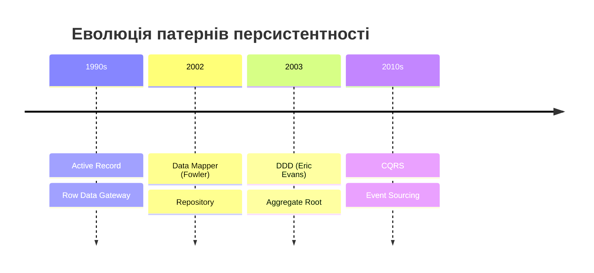
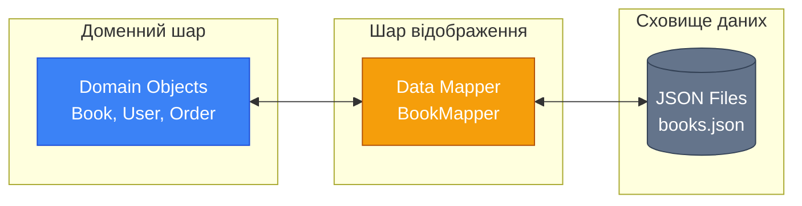
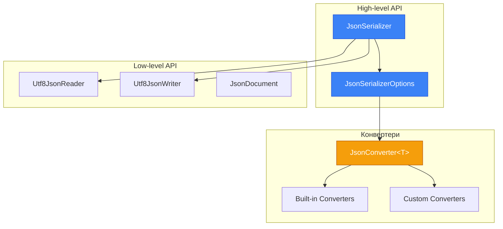
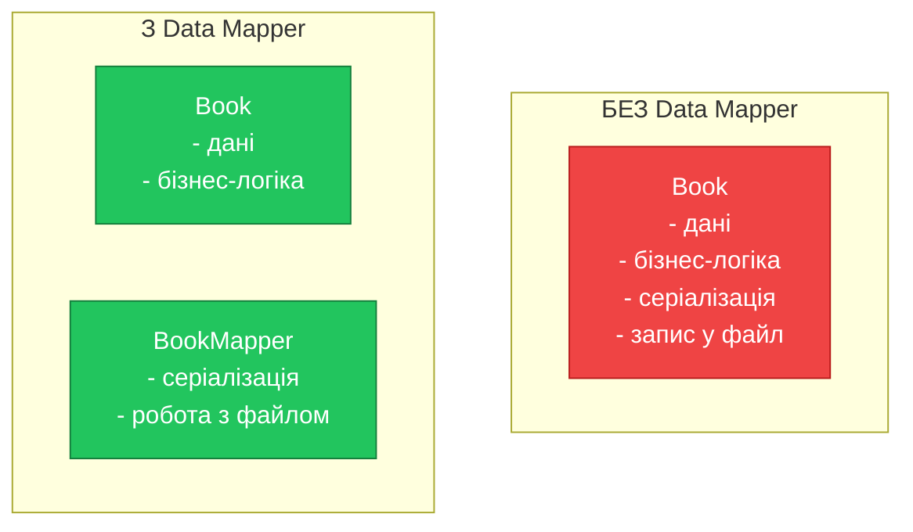
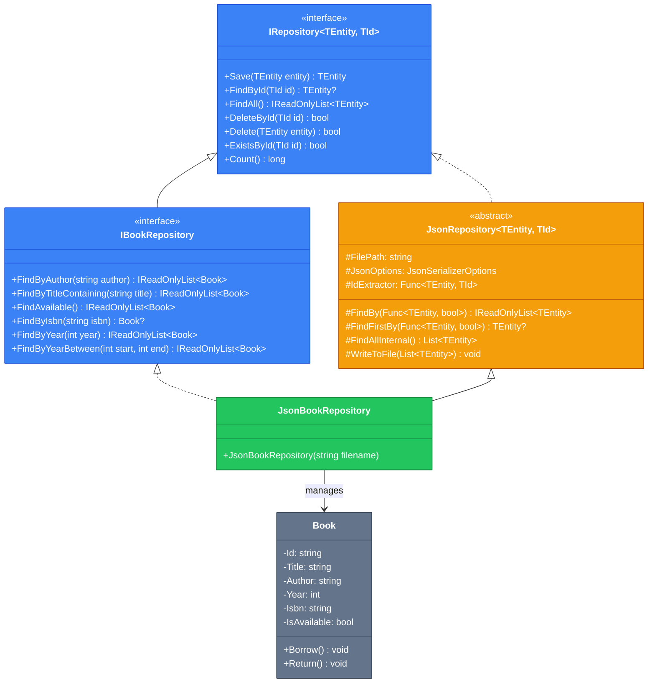

# Data Mapper: Repository та DAO патерни (Частина 1)

## Вступ: Проблема змішування відповідальностей

Уявіть, що ви розробляєте систему управління бібліотекою. У вас є клас `Book`, і вам потрібно зберігати книги у JSON-файл та читати їх звідти. Найпростіший підхід — додати методи `Save()` та `Load()` прямо в клас `Book`:

```csharp showLineNumbers
public class Book
{
    public string Id { get; set; }
    public string Title { get; set; }
    public string Author { get; set; }

    public void SaveToFile(string filename)
    {
        // Логіка серіалізації в JSON
        // Запис у файл
    }

    public static Book LoadFromFile(string filename, string id)
    {
        // Читання з файлу
        // Десеріалізація з JSON
        return book;
    }
}
```

На перший погляд, це зручно. Але що відбувається, коли система росте?

::warning
**Проблеми такого підходу:**

- Клас `Book` знає занадто багато: і про свою бізнес-логіку, і про формат зберігання, і про файлову систему
- Неможливо змінити формат зберігання (наприклад, з JSON на XML) без зміни класу `Book`
- Неможливо тестувати бізнес-логіку окремо від логіки персистентності
- Порушення принципу єдиної відповідальності (Single Responsibility Principle)

::

Саме для вирішення цих проблем Мартін Фаулер у своїй книзі **"Patterns of Enterprise Application Architecture" (2002)** описав патерн **Data Mapper** — один із ключових архітектурних патернів для розділення доменної моделі від логіки персистентності.

> "A layer of Mappers that moves data between objects and a database while keeping them independent of each other and the mapper itself."
> — Martin Fowler, [P of EAA](https://martinfowler.com/eaaCatalog/dataMapper.html)

## Теоретичні основи: Архітектурні патерни персистентності

Перш ніж заглибитися в реалізацію, розглянемо теоретичний контекст. У світі об'єктно-орієнтованого програмування існує фундаментальна проблема, відома як **Object-Relational Impedance Mismatch** (невідповідність об'єктно-реляційних моделей). Хоча ми працюємо з JSON-файлами, а не з реляційною базою даних, концептуально проблема залишається тією ж: **як зберігати об'єкти таким чином, щоб доменна модель не знала про деталі зберігання?**

### Еволюція патернів персистентності

::mermaid



::

Існує кілька фундаментальних підходів до роботи з персистентністю:

| Патерн | Опис | Переваги | Недоліки |
| :--- | :--- | :--- | :--- |
| **Active Record** | Об'єкт сам знає, як себе зберігати | Простота для CRUD | Порушує SRP, важко тестувати |
| **Table Data Gateway** | Один об'єкт для всіх операцій з таблицею | Централізована логіка | Не об'єктно-орієнтований |
| **Row Data Gateway** | Об'єкт-обгортка для одного рядка | Інкапсуляція даних | Не має бізнес-логіки |
| **Data Mapper** | Окремий шар для перетворень | Повне розділення | Більше коду |
| **Repository** | Колекція доменних об'єктів | Доменна мова | Потребує UoW |

### Що таке Data Mapper?

**Data Mapper** (Відображувач даних) — це архітектурний патерн, який створює прошарок між доменними об'єктами (Domain Objects) та сховищем даних. Цей прошарок відповідає за:

1. **Перетворення** (Mapping) — конвертація об'єктів у формат, придатний для зберігання, і навпаки
2. **Ізоляція** (Isolation) — доменна модель не знає про існування сховища
3. **Інкапсуляція** (Encapsulation) — деталі серіалізації приховані від решти системи

::mermaid



::

::note
**Чому це важливо?** Data Mapper є фундаментом для реалізації принципу **Persistence Ignorance** (невідання про персистентність) — коли доменна модель не має жодних залежностей від інфраструктурних компонентів.
::

### Repository vs DAO: Історичний контекст та глибоке порівняння

Два патерни часто плутають, але вони мають різне походження та філософію:

**DAO (Data Access Object)** з'явився у 2001 році як частина **Core J2EE Patterns** від Sun Microsystems. Його мета — абстрагувати доступ до джерела даних, приховуючи технічні деталі (SQL-запити, JDBC-підключення тощо).

**Repository** був описаний Еріком Евансом у 2003 році в книзі **"Domain-Driven Design: Tackling Complexity in the Heart of Software"**. Його мета — представити колекцію доменних об'єктів як in-memory collection.

| Аспект | DAO (Data Access Object) | Repository |
| :--- | :--- | :--- |
| **Походження** | Core J2EE Patterns (Sun, 2001) | Domain-Driven Design (Eric Evans, 2003) |
| **Рівень абстракції** | Низький — близький до сховища | Високий — близький до домену |
| **Мова інтерфейсу** | CRUD-операції: `Insert`, `Update`, `Delete` | Доменна мова: `FindActiveUsers`, `GetOverdueBooks` |
| **Фокус** | Технічний доступ до даних | Колекція доменних об'єктів |
| **Семантика** | "Записую/читаю дані зі сховища" | "Додаю/отримую об'єкти з колекції" |
| **DDD-сумісність** | Не є частиною DDD | Ключовий патерн DDD |

::tip
У сучасній розробці ці терміни часто використовуються як синоніми. Головне — розуміти принцип: **відокремлення доменної логіки від логіки персистентності**.
::

### Чому JSON та плоскі файли?

Використання JSON-файлів як сховища даних — це чудовий спосіб:

1. **Вивчити патерни** без накладних витрат на налаштування бази даних
2. **Зрозуміти суть** відображення об'єктів на дані
3. **Створити прототип** перед переходом на повноцінну БД
4. **Розробити десктопні застосунки**, де JSON — природний формат зберігання

::note
У цьому матеріалі ми використовуємо вбудований **System.Text.Json** — нативний серіалізатор .NET, який є частиною .NET Core 3.0+ та .NET 5+. Він забезпечує високу продуктивність, безпеку типів та не потребує встановлення сторонніх пакетів.
::

## System.Text.Json: Теоретичні основи

Перш ніж переходити до практики, розглянемо ключові концепції `System.Text.Json`:

### Архітектура серіалізатора

`System.Text.Json` має два рівні API:

1. **High-level API** (`JsonSerializer`) — для простої серіалізації/десеріалізації
2. **Low-level API** (`Utf8JsonReader`, `Utf8JsonWriter`) — для потокової обробки

::mermaid



::

### Ключові опції `JsonSerializerOptions`

| Опція | Опис | Типове значення |
| :--- | :--- | :--- |
| `PropertyNamingPolicy` | Політика іменування властивостей | `null` (PascalCase) |
| `PropertyNameCaseInsensitive` | Ігнорування регістру при десеріалізації | `false` |
| `WriteIndented` | Форматування з відступами | `false` |
| `DefaultIgnoreCondition` | Коли ігнорувати властивості | `Never` |
| `ReferenceHandler` | Обробка циклічних посилань | `null` |
| `NumberHandling` | Обробка чисел як рядків | `Strict` |

## Практична реалізація: від простого до складного

### Крок 1: Доменна модель

Почнемо з простої доменної моделі. Створимо клас `Book`, який **нічого не знає** про те, як і де він буде зберігатися. Це ключовий принцип — **Persistence Ignorance**:

```csharp showLineNumbers
namespace Library.Domain;

/// <summary>
/// Доменна модель книги.
/// Цей клас повністю ізольований від логіки персистентності.
/// </summary>
public class Book
{
    public string Id { get; private set; }
    public string Title { get; set; }
    public string Author { get; set; }
    public int Year { get; set; }
    public string Isbn { get; set; }
    public bool IsAvailable { get; private set; }

    // Конструктор для створення нової книги
    public Book(string title, string author, int year, string isbn)
    {
        Id = Guid.NewGuid().ToString();
        Title = title;
        Author = author;
        Year = year;
        Isbn = isbn;
        IsAvailable = true;
    }

    // Конструктор для відновлення з персистентного сховища (для десеріалізації)
    public Book(string id, string title, string author, int year, string isbn, bool isAvailable)
    {
        Id = id;
        Title = title;
        Author = author;
        Year = year;
        Isbn = isbn;
        IsAvailable = isAvailable;
    }

    // Приватний конструктор для JSON-десеріалізації
    private Book() { }

    // Бізнес-логіка
    public void Borrow()
    {
        if (!IsAvailable)
        {
            throw new InvalidOperationException("Книга вже видана");
        }
        IsAvailable = false;
    }

    public void Return()
    {
        if (IsAvailable)
        {
            throw new InvalidOperationException("Книга не була видана");
        }
        IsAvailable = true;
    }

    public override bool Equals(object? obj)
    {
        if (obj is not Book other) return false;
        return Id == other.Id;
    }

    public override int GetHashCode() => Id.GetHashCode();

    public override string ToString()
    {
        return $"Book {{ Id = {Id}, Title = {Title}, Author = {Author}, Year = {Year}, Available = {IsAvailable} }}";
    }
}
```

**Зверніть увагу на ключові моменти:**

- **Рядок 9**: `Id` має `private set` — ідентифікатор незмінний після створення ззовні
- **Рядки 17-26**: Конструктор для нових об'єктів генерує `Guid` автоматично
- **Рядки 28-37**: Окремий конструктор для відновлення об'єкта зі сховища
- **Рядок 40**: Приватний параметровий конструктор для `System.Text.Json`
- **Рядки 43-57**: Бізнес-логіка інкапсульована в методах `Borrow()` та `Return()`
- Клас не має жодних залежностей від бібліотек персистентності

::tip
**Rich Domain Model vs Anemic Domain Model**: Наш клас `Book` є прикладом **Rich Domain Model** — він містить не лише дані, але й бізнес-поведінку. Альтернативний підхід — **Anemic Domain Model** — коли об'єкти містять лише дані, а логіка винесена в сервіси. Rich Domain Model краще відповідає принципам ООП та DDD.
::

### Крок 2: Найпростіший Data Mapper

Тепер створимо Data Mapper, який відповідатиме за збереження та читання книг з JSON-файлу:

```csharp showLineNumbers
using System.Text.Json;
using Library.Domain;

namespace Library.Persistence;

/// <summary>
/// Простий Data Mapper для роботи з книгами.
/// Відповідає за перетворення між доменними об'єктами та JSON.
/// </summary>
public class BookMapper
{
    private readonly string _filePath;
    private readonly JsonSerializerOptions _jsonOptions;

    public BookMapper(string filename)
    {
        _filePath = filename;
        _jsonOptions = new JsonSerializerOptions
        {
            WriteIndented = true,
            PropertyNamingPolicy = JsonNamingPolicy.CamelCase,
            PropertyNameCaseInsensitive = true
        };
        
        EnsureDirectoryExists();
    }

    private void EnsureDirectoryExists()
    {
        var directory = Path.GetDirectoryName(_filePath);
        if (!string.IsNullOrEmpty(directory) && !Directory.Exists(directory))
        {
            Directory.CreateDirectory(directory);
        }
    }

    /// <summary>
    /// Зберігає книгу у файл.
    /// Якщо книга з таким Id вже існує — оновлює її.
    /// </summary>
    public void Save(Book book)
    {
        var books = FindAll();

        // Шукаємо існуючу книгу за Id
        var existingIndex = books.FindIndex(b => b.Id == book.Id);
        
        if (existingIndex >= 0)
        {
            books[existingIndex] = book;
        }
        else
        {
            books.Add(book);
        }

        WriteToFile(books);
    }

    /// <summary>
    /// Знаходить книгу за її ідентифікатором.
    /// </summary>
    public Book? FindById(string id)
    {
        return FindAll().FirstOrDefault(book => book.Id == id);
    }

    /// <summary>
    /// Повертає всі книги зі сховища.
    /// </summary>
    public List<Book> FindAll()
    {
        if (!File.Exists(_filePath))
        {
            return new List<Book>();
        }

        var json = File.ReadAllText(_filePath);
        
        if (string.IsNullOrWhiteSpace(json))
        {
            return new List<Book>();
        }
        
        return JsonSerializer.Deserialize<List<Book>>(json, _jsonOptions) 
               ?? new List<Book>();
    }

    /// <summary>
    /// Видаляє книгу за ідентифікатором.
    /// </summary>
    public bool Delete(string id)
    {
        var books = FindAll();
        var removed = books.RemoveAll(book => book.Id == id) > 0;
        
        if (removed)
        {
            WriteToFile(books);
        }
        
        return removed;
    }

    /// <summary>
    /// Записує список книг у файл.
    /// </summary>
    private void WriteToFile(List<Book> books)
    {
        var json = JsonSerializer.Serialize(books, _jsonOptions);
        File.WriteAllText(_filePath, json);
    }
}
```

**Декомпозиція коду:**

- **Рядки 18-23**: Ініціалізація `JsonSerializerOptions` з форматуванням для читабельності та camelCase для JSON
- **Рядок 43**: `FindAll()` завантажує поточний стан файлу перед збереженням
- **Рядки 46-55**: Пошук існуючої книги для оновлення (upsert-логіка)
- **Рядок 63**: Nullable reference type `Book?` — сучасний підхід для обробки можливої відсутності результату
- **Рядок 84**: `JsonSerializer.Deserialize<T>` — типізована десеріалізація

### Крок 3: Використання Data Mapper

Подивимося, як використовувати наш маппер:

```csharp showLineNumbers
using Library.Domain;
using Library.Persistence;

// Створюємо маппер з вказівкою файлу для зберігання
var bookMapper = new BookMapper("data/books.json");

// Створюємо нові книги (доменні об'єкти)
var book1 = new Book(
    "Чистий код",
    "Роберт Мартін",
    2008,
    "978-0132350884"
);

var book2 = new Book(
    "Патерни проєктування",
    "Банда чотирьох",
    1994,
    "978-0201633610"
);

// Зберігаємо книги через маппер
bookMapper.Save(book1);
bookMapper.Save(book2);
Console.WriteLine("Книги збережено!");

// Читаємо всі книги
var allBooks = bookMapper.FindAll();
Console.WriteLine("\nВсі книги:");
foreach (var book in allBooks)
{
    Console.WriteLine(book);
}

// Знаходимо конкретну книгу
var foundBook = bookMapper.FindById(book1.Id);
if (foundBook != null)
{
    Console.WriteLine($"\nЗнайдена книга: {foundBook.Title}");

    // Виконуємо бізнес-логіку
    foundBook.Borrow();
    Console.WriteLine($"Книга видана, доступність: {foundBook.IsAvailable}");

    // Зберігаємо оновлений стан
    bookMapper.Save(foundBook);
}

// Перевіряємо оновлення
Console.WriteLine("\nПісля оновлення:");
foreach (var book in bookMapper.FindAll())
{
    Console.WriteLine(book);
}
```

Результат виконання створить файл `data/books.json`:

```json [data/books.json]
[
    {
        "id": "a1b2c3d4-e5f6-7890-abcd-ef1234567890",
        "title": "Чистий код",
        "author": "Роберт Мартін",
        "year": 2008,
        "isbn": "978-0132350884",
        "isAvailable": false
    },
    {
        "id": "b2c3d4e5-f6a7-8901-bcde-f12345678901",
        "title": "Патерни проєктування",
        "author": "Банда чотирьох",
        "year": 1994,
        "isbn": "978-0201633610",
        "isAvailable": true
    }
]
```

## Архітектурний аналіз: переваги Data Mapper

Розглянемо детальніше, які переваги ми отримали:

### 1. Розділення відповідальностей (Separation of Concerns)

::mermaid



::

### 2. Тестованість

Тепер ми можемо тестувати бізнес-логіку `Book` окремо від персистентності:

```csharp showLineNumbers
using Library.Domain;

namespace Library.Tests;

public class BookTests
{
    [Fact]
    public void Borrow_ShouldChangeAvailability_WhenBookIsAvailable()
    {
        // Arrange
        var book = new Book("Test Book", "Author", 2024, "ISBN");
        Assert.True(book.IsAvailable);

        // Act
        book.Borrow();

        // Assert
        Assert.False(book.IsAvailable);
    }

    [Fact]
    public void Borrow_ShouldThrowException_WhenBookIsAlreadyBorrowed()
    {
        // Arrange
        var book = new Book("Test Book", "Author", 2024, "ISBN");
        book.Borrow(); // Перша видача

        // Act & Assert
        Assert.Throws<InvalidOperationException>(() => book.Borrow());
    }

    [Fact]
    public void Return_ShouldRestoreAvailability_WhenBookIsBorrowed()
    {
        // Arrange
        var book = new Book("Test Book", "Author", 2024, "ISBN");
        book.Borrow();

        // Act
        book.Return();

        // Assert
        Assert.True(book.IsAvailable);
    }
}
```

### 3. Гнучкість зміни сховища

Завтра ви можете замінити JSON на XML, YAML або навіть базу даних — і доменна модель залишиться незмінною:

```csharp showLineNumbers
// Поточна реалізація
var jsonMapper = new BookMapper("books.json");

// Можлива майбутня реалізація (без зміни Book)
// var xmlMapper = new BookXmlMapper("books.xml");
// var dbMapper = new BookDatabaseMapper(connection);
```

## Еволюція до Repository Pattern

Data Mapper — це добре, але він має обмеження:

- Прив'язка до конкретної реалізації (`BookMapper`)
- Неможливість легкої заміни реалізації
- Тісне зв'язування клієнтського коду з маппером

**Repository Pattern** вирішує ці проблеми через **абстракцію**. Давайте еволюціонуємо наш код.

### Теоретичне обґрунтування Repository Pattern

ЕріК Еванс у книзі "Domain-Driven Design" описує Repository як механізм інкапсуляції логіки збереження та отримання об'єктів:

> "A Repository represents all objects of a certain type as a conceptual set (usually emulated). It acts like a collection, except with more elaborate querying capability."
> — Eric Evans, Domain-Driven Design

Ключова ідея — клієнтський код працює з Repository так, ніби це звичайна колекція в пам'яті:

```csharp
// Так само, як працюємо з List<T>
books.Add(newBook);           // repository.Save(newBook);
var book = books[id];         // repository.FindById(id);
books.Remove(oldBook);        // repository.Delete(oldBook);
```

### Базовий інтерфейс Repository

Створимо загальний інтерфейс, який визначає контракт для будь-якого репозиторію:

```csharp showLineNumbers
namespace Library.Repository;

/// <summary>
/// Базовий інтерфейс Repository.
/// Визначає стандартні CRUD-операції для будь-якої сутності.
/// </summary>
/// <typeparam name="TEntity">Тип сутності</typeparam>
/// <typeparam name="TId">Тип ідентифікатора</typeparam>
public interface IRepository<TEntity, TId> where TEntity : class
{
    /// <summary>
    /// Зберігає сутність.
    /// Якщо сутність нова — створює, якщо існує — оновлює.
    /// </summary>
    /// <param name="entity">Сутність для збереження</param>
    /// <returns>Збережена сутність</returns>
    TEntity Save(TEntity entity);

    /// <summary>
    /// Знаходить сутність за ідентифікатором.
    /// </summary>
    /// <param name="id">Ідентифікатор</param>
    /// <returns>Сутність або null</returns>
    TEntity? FindById(TId id);

    /// <summary>
    /// Повертає всі сутності.
    /// </summary>
    /// <returns>Перелік всіх сутностей</returns>
    IReadOnlyList<TEntity> FindAll();

    /// <summary>
    /// Видаляє сутність за ідентифікатором.
    /// </summary>
    /// <param name="id">Ідентифікатор</param>
    /// <returns>true, якщо сутність було видалено</returns>
    bool DeleteById(TId id);

    /// <summary>
    /// Видаляє конкретну сутність.
    /// </summary>
    /// <param name="entity">Сутність для видалення</param>
    /// <returns>true, якщо сутність було видалено</returns>
    bool Delete(TEntity entity);

    /// <summary>
    /// Перевіряє існування сутності за ідентифікатором.
    /// </summary>
    /// <param name="id">Ідентифікатор</param>
    /// <returns>true, якщо сутність існує</returns>
    bool ExistsById(TId id);

    /// <summary>
    /// Повертає кількість сутностей у сховищі.
    /// </summary>
    /// <returns>Кількість сутностей</returns>
    long Count();
}
```

### Спеціалізований інтерфейс IBookRepository

Тепер створимо інтерфейс, специфічний для книг, з доменними методами:

```csharp showLineNumbers
using Library.Domain;

namespace Library.Repository;

/// <summary>
/// Репозиторій для роботи з книгами.
/// Розширює базовий IRepository та додає методи, специфічні для домену.
/// </summary>
public interface IBookRepository : IRepository<Book, string>
{
    /// <summary>
    /// Знаходить книги за автором.
    /// </summary>
    /// <param name="author">Ім'я автора</param>
    /// <returns>Список книг автора</returns>
    IReadOnlyList<Book> FindByAuthor(string author);

    /// <summary>
    /// Знаходить книги за назвою (часткове співпадіння).
    /// </summary>
    /// <param name="title">Частина назви</param>
    /// <returns>Список знайдених книг</returns>
    IReadOnlyList<Book> FindByTitleContaining(string title);

    /// <summary>
    /// Знаходить всі доступні книги.
    /// </summary>
    /// <returns>Список доступних книг</returns>
    IReadOnlyList<Book> FindAvailable();

    /// <summary>
    /// Знаходить книгу за ISBN.
    /// </summary>
    /// <param name="isbn">ISBN книги</param>
    /// <returns>Книга або null</returns>
    Book? FindByIsbn(string isbn);

    /// <summary>
    /// Знаходить книги, видані в певному році.
    /// </summary>
    /// <param name="year">Рік видання</param>
    /// <returns>Список книг</returns>
    IReadOnlyList<Book> FindByYear(int year);

    /// <summary>
    /// Знаходить книги, видані в діапазоні років.
    /// </summary>
    /// <param name="startYear">Початковий рік</param>
    /// <param name="endYear">Кінцевий рік</param>
    /// <returns>Список книг</returns>
    IReadOnlyList<Book> FindByYearBetween(int startYear, int endYear);
}
```

**Чому це важливо?**

Зверніть увагу на мову інтерфейсу. Методи називаються `FindByAuthor`, `FindAvailable`, `FindByTitleContaining` — це **доменна мова (Ubiquitous Language)**, зрозуміла бізнес-аналітикам та розробникам. Порівняйте з низькорівневим:

```csharp
// DAO-стиль (технічний)
IList<Book> Select(string whereClause);

// Repository-стиль (доменний)
IReadOnlyList<Book> FindAvailable();
IReadOnlyList<Book> FindByAuthor(string author);
```

### Абстрактна реалізація JsonRepository

Тепер створимо абстрактний клас, який реалізує спільну логіку для всіх JSON-репозиторіїв:

```csharp showLineNumbers
using System.Text.Json;
using Library.Repository.Exceptions;

namespace Library.Repository.Json;

/// <summary>
/// Абстрактна базова реалізація Repository для JSON-сховища.
/// Містить всю логіку роботи з файлами та System.Text.Json.
/// Конкретні репозиторії наслідують цей клас.
/// </summary>
/// <typeparam name="TEntity">Тип сутності</typeparam>
/// <typeparam name="TId">Тип ідентифікатора</typeparam>
public abstract class JsonRepository<TEntity, TId> : IRepository<TEntity, TId> 
    where TEntity : class
{
    protected readonly string FilePath;
    protected readonly JsonSerializerOptions JsonOptions;
    
    /// <summary>
    /// Функція для отримання ідентифікатора з сутності.
    /// Кожен конкретний репозиторій повинен надати свою реалізацію.
    /// </summary>
    protected readonly Func<TEntity, TId> IdExtractor;

    /// <summary>
    /// Конструктор базового репозиторію.
    /// </summary>
    /// <param name="filename">Шлях до JSON-файлу</param>
    /// <param name="idExtractor">Функція витягування Id з сутності</param>
    protected JsonRepository(string filename, Func<TEntity, TId> idExtractor)
    {
        FilePath = filename;
        IdExtractor = idExtractor;
        JsonOptions = new JsonSerializerOptions
        {
            WriteIndented = true,
            PropertyNamingPolicy = JsonNamingPolicy.CamelCase,
            PropertyNameCaseInsensitive = true
        };
        
        EnsureDirectoryExists();
    }

    /// <summary>
    /// Створює директорію для файлу, якщо вона не існує.
    /// </summary>
    private void EnsureDirectoryExists()
    {
        var directory = Path.GetDirectoryName(FilePath);
        if (!string.IsNullOrEmpty(directory) && !Directory.Exists(directory))
        {
            try
            {
                Directory.CreateDirectory(directory);
            }
            catch (IOException ex)
            {
                throw new RepositoryException($"Не вдалося створити директорію: {directory}", ex);
            }
        }
    }

    public virtual TEntity Save(TEntity entity)
    {
        var entities = FindAllInternal();
        var id = IdExtractor(entity);

        // Шукаємо існуючу сутність
        var existingIndex = entities.FindIndex(e => 
            EqualityComparer<TId>.Default.Equals(IdExtractor(e), id));

        if (existingIndex >= 0)
        {
            entities[existingIndex] = entity;
        }
        else
        {
            entities.Add(entity);
        }

        WriteToFile(entities);
        return entity;
    }

    public virtual TEntity? FindById(TId id)
    {
        return FindAllInternal()
            .FirstOrDefault(entity => 
                EqualityComparer<TId>.Default.Equals(IdExtractor(entity), id));
    }

    public virtual IReadOnlyList<TEntity> FindAll()
    {
        return FindAllInternal().AsReadOnly();
    }

    public virtual bool DeleteById(TId id)
    {
        var entities = FindAllInternal();
        var removed = entities.RemoveAll(entity => 
            EqualityComparer<TId>.Default.Equals(IdExtractor(entity), id)) > 0;

        if (removed)
        {
            WriteToFile(entities);
        }
        
        return removed;
    }

    public virtual bool Delete(TEntity entity)
    {
        return DeleteById(IdExtractor(entity));
    }

    public virtual bool ExistsById(TId id)
    {
        return FindById(id) != null;
    }

    public virtual long Count()
    {
        return FindAllInternal().Count;
    }

    /// <summary>
    /// Внутрішній метод для пошуку за предикатом.
    /// Використовується конкретними репозиторіями для реалізації
    /// специфічних методів пошуку.
    /// </summary>
    /// <param name="predicate">Умова фільтрації</param>
    /// <returns>Відфільтрований список</returns>
    protected IReadOnlyList<TEntity> FindBy(Func<TEntity, bool> predicate)
    {
        return FindAllInternal()
            .Where(predicate)
            .ToList()
            .AsReadOnly();
    }

    /// <summary>
    /// Внутрішній метод для знаходження першого елемента за предикатом.
    /// </summary>
    /// <param name="predicate">Умова пошуку</param>
    /// <returns>Перший знайдений елемент або null</returns>
    protected TEntity? FindFirstBy(Func<TEntity, bool> predicate)
    {
        return FindAllInternal().FirstOrDefault(predicate);
    }

    /// <summary>
    /// Читає всі сутності з файлу.
    /// </summary>
    protected List<TEntity> FindAllInternal()
    {
        if (!File.Exists(FilePath))
        {
            return new List<TEntity>();
        }

        try
        {
            var json = File.ReadAllText(FilePath);
            
            if (string.IsNullOrWhiteSpace(json))
            {
                return new List<TEntity>();
            }
            
            return JsonSerializer.Deserialize<List<TEntity>>(json, JsonOptions) 
                   ?? new List<TEntity>();
        }
        catch (JsonException ex)
        {
            throw new RepositoryException($"Помилка десеріалізації файлу: {FilePath}", ex);
        }
        catch (IOException ex)
        {
            throw new RepositoryException($"Помилка читання з файлу: {FilePath}", ex);
        }
    }

    /// <summary>
    /// Записує всі сутності у файл.
    /// </summary>
    protected void WriteToFile(List<TEntity> entities)
    {
        try
        {
            var json = JsonSerializer.Serialize(entities, JsonOptions);
            File.WriteAllText(FilePath, json);
        }
        catch (IOException ex)
        {
            throw new RepositoryException($"Помилка запису у файл: {FilePath}", ex);
        }
    }
}
```

**Ключові елементи реалізації:**

- **Рядок 23**: `Func<TEntity, TId> IdExtractor` — делегат для отримання Id з будь-якої сутності
- **Рядки 63-80**: Логіка upsert (update or insert) — спільна для всіх репозиторіїв
- **Рядки 123-133**: Захищені методи `FindBy` та `FindFirstBy` для використання в нащадках

### Кастомний Exception

Створимо власний виняток для помилок репозиторію:

```csharp showLineNumbers
namespace Library.Repository.Exceptions;

/// <summary>
/// Виняток, що виникає при помилках роботи з репозиторієм.
/// </summary>
public class RepositoryException : Exception
{
    public RepositoryException(string message) : base(message)
    {
    }

    public RepositoryException(string message, Exception innerException) 
        : base(message, innerException)
    {
    }
}
```

### Конкретна реалізація JsonBookRepository

Тепер реалізуємо `IBookRepository` на основі нашого абстрактного класу:

```csharp showLineNumbers
using Library.Domain;

namespace Library.Repository.Json;

/// <summary>
/// JSON-реалізація репозиторію книг.
/// Зберігає книги у JSON-файл та надає методи для роботи з ними.
/// </summary>
public class JsonBookRepository : JsonRepository<Book, string>, IBookRepository
{
    /// <summary>
    /// Створює репозиторій з вказаним шляхом до файлу.
    /// </summary>
    /// <param name="filename">Шлях до JSON-файлу</param>
    public JsonBookRepository(string filename) 
        : base(filename, book => book.Id)  // Lambda для витягування Id
    {
    }

    public IReadOnlyList<Book> FindByAuthor(string author)
    {
        return FindBy(book => 
            book.Author.Contains(author, StringComparison.OrdinalIgnoreCase));
    }

    public IReadOnlyList<Book> FindByTitleContaining(string title)
    {
        return FindBy(book => 
            book.Title.Contains(title, StringComparison.OrdinalIgnoreCase));
    }

    public IReadOnlyList<Book> FindAvailable()
    {
        return FindBy(book => book.IsAvailable);
    }

    public Book? FindByIsbn(string isbn)
    {
        return FindFirstBy(book => book.Isbn == isbn);
    }

    public IReadOnlyList<Book> FindByYear(int year)
    {
        return FindBy(book => book.Year == year);
    }

    public IReadOnlyList<Book> FindByYearBetween(int startYear, int endYear)
    {
        return FindBy(book => book.Year >= startYear && book.Year <= endYear);
    }
}
```

**Зверніть увагу:**

- **Рядок 16**: `book => book.Id` — елегантна lambda-функція для функції витягування Id
- **Рядки 20-24**: Реалізація `FindByAuthor` використовує захищений метод `FindBy` з базового класу
- **Рядок 34**: `book.IsAvailable` — використання властивості як предикат

## Архітектура рішення

::mermaid



::

## Практичне використання

Тепер подивимося, як використовувати наш репозиторій у клієнтському коді:

```csharp showLineNumbers
using Library.Domain;
using Library.Repository;
using Library.Repository.Json;

namespace Library.Application;

public class LibraryApplication
{
    // Залежність від інтерфейсу, не від реалізації!
    private readonly IBookRepository _bookRepository;

    public LibraryApplication(IBookRepository bookRepository)
    {
        _bookRepository = bookRepository;
    }

    public void Run()
    {
        // Створюємо тестові дані
        CreateSampleBooks();

        // Демонструємо можливості репозиторію
        DemonstrateRepositoryCapabilities();
    }

    private void CreateSampleBooks()
    {
        Console.WriteLine("=== Створення книг ===\n");

        var books = new List<Book>
        {
            new("Чистий код", "Роберт Мартін", 2008, "978-0132350884"),
            new("Чиста архітектура", "Роберт Мартін", 2017, "978-0134494166"),
            new("Патерни проєктування", "Банда чотирьох", 1994, "978-0201633610"),
            new("Рефакторинг", "Мартін Фаулер", 1999, "978-0201485677"),
            new("Domain-Driven Design", "Ерік Еванс", 2003, "978-0321125217"),
            new("Effective C#", "Білл Вагнер", 2017, "978-0672337871")
        };

        foreach (var book in books)
        {
            _bookRepository.Save(book);
            Console.WriteLine($"Збережено: {book.Title}");
        }

        Console.WriteLine($"\nВсього книг: {_bookRepository.Count()}");
    }

    private void DemonstrateRepositoryCapabilities()
    {
        Console.WriteLine("\n=== Демонстрація можливостей ===\n");

        // Пошук за автором
        Console.WriteLine("Книги Роберта Мартіна:");
        foreach (var book in _bookRepository.FindByAuthor("Мартін"))
        {
            Console.WriteLine($"  - {book.Title}");
        }

        // Пошук за частиною назви
        Console.WriteLine("\nКниги з 'Чист' у назві:");
        foreach (var book in _bookRepository.FindByTitleContaining("Чист"))
        {
            Console.WriteLine($"  - {book.Title}");
        }

        // Пошук за роками
        Console.WriteLine("\nКниги 2000-2010:");
        foreach (var book in _bookRepository.FindByYearBetween(2000, 2010))
        {
            Console.WriteLine($"  - {book.Title} ({book.Year})");
        }

        // Видача книги
        Console.WriteLine("\n=== Операція видачі книги ===");
        var foundBook = _bookRepository.FindByIsbn("978-0132350884");
        if (foundBook != null)
        {
            Console.WriteLine($"Видаємо: {foundBook.Title}");
            foundBook.Borrow();
            _bookRepository.Save(foundBook);
            Console.WriteLine($"Статус: {(foundBook.IsAvailable ? "доступна" : "видана")}");
        }

        // Доступні книги
        Console.WriteLine("\nДоступні книги:");
        foreach (var book in _bookRepository.FindAvailable())
        {
            Console.WriteLine($"  - {book.Title}");
        }
    }
}

// Точка входу
public static class Program
{
    public static void Main()
    {
        // Ін'єкція залежності — передаємо конкретну реалізацію
        IBookRepository repository = new JsonBookRepository("data/library/books.json");
        var app = new LibraryApplication(repository);
        app.Run();
    }
}
```

**Важливі моменти:**

- **Рядок 10**: Залежність від інтерфейсу `IBookRepository`, не від конкретного `JsonBookRepository`
- **Рядок 12**: Конструктор приймає інтерфейс — це Dependency Injection
- **Рядок 97**: Конкретна реалізація створюється в одному місці (точка входу)

Якщо завтра ми вирішимо зберігати книги в БД, потрібно лише:

1. Створити `DatabaseBookRepository : IBookRepository`
2. Замінити рядок 97 на `new DatabaseBookRepository(connection)`

Жодних інших змін у коді не потрібно!

## Підсумки першої частини

У цій частині ми розглянули:

::card-group
::card{title="Data Mapper Pattern"}
Патерн розділення доменних об'єктів та логіки персистентності, описаний Мартіном Фаулером у книзі "Patterns of Enterprise Application Architecture".
::

::card{title="Repository Pattern"}
Абстракція колекції доменних об'єктів з доменною мовою інтерфейсу. Дозволяє замінювати реалізації без зміни клієнтського коду.
::

::card{title="Ієрархія репозиторіїв"}
Базовий інтерфейс `IRepository<T, TId>` → специфічний `IBookRepository` → абстрактна реалізація `JsonRepository` → конкретна `JsonBookRepository`.
::

::card{title="System.Text.Json для персистентності"}
Використання вбудованого серіалізатора .NET для серіалізації/десеріалізації об'єктів у JSON без залежності від сторонніх пакетів.
::

::

У [другій частині](./07.data-mapper-part2.md) ми розглянемо:

- Identity Map патерн для кешування
- Unit of Work патерн для відстеження змін
- Specification Pattern для гнучкого пошуку
- Обробка помилок та ієрархія виключень
- Тестування репозиторіїв

## Корисні посилання

- [Martin Fowler — Data Mapper](https://martinfowler.com/eaaCatalog/dataMapper.html) — оригінальний опис патерну
- [Martin Fowler — Repository](https://martinfowler.com/eaaCatalog/repository.html) — опис патерну Repository
- [System.Text.Json Overview](https://learn.microsoft.com/en-us/dotnet/standard/serialization/system-text-json/overview) — офіційна документація Microsoft
- [Patterns of Enterprise Application Architecture](https://martinfowler.com/books/eaa.html) — книга Мартіна Фаулера
- [Domain-Driven Design](https://www.domainlanguage.com/ddd/) — книга Еріка Еванса

## Завдання для самоперевірки

::collapsible{title="Завдання 1: Створіть UserRepository"}
Реалізуйте повний цикл для сутності `User`:

1. Доменна модель `User` з полями: `Id`, `Email`, `Username`, `CreatedAt`
2. Інтерфейс `IUserRepository` з методами `FindByEmail`, `FindByUsername`
3. Реалізація `JsonUserRepository`

**Підказка**: Використовуйте `DateTime` для дати створення. Зверніть увагу на серіалізацію дат у `System.Text.Json`.
::

::collapsible{title="Завдання 2: Додайте пагінацію"}
Додайте до базового інтерфейсу `IRepository` метод:

```csharp
IReadOnlyList<TEntity> FindAll(int page, int pageSize);
```

Реалізуйте його в `JsonRepository` з використанням LINQ-методів `Skip()` та `Take()`.
::

::collapsible{title="Завдання 3: Batch-операції"}
Додайте методи для масових операцій:

```csharp
IReadOnlyList<TEntity> SaveAll(IEnumerable<TEntity> entities);
void DeleteAll();
void DeleteAll(IEnumerable<TEntity> entities);
```

Оптимізуйте їх, щоб читання та запис файлу відбувалися лише один раз.
::
