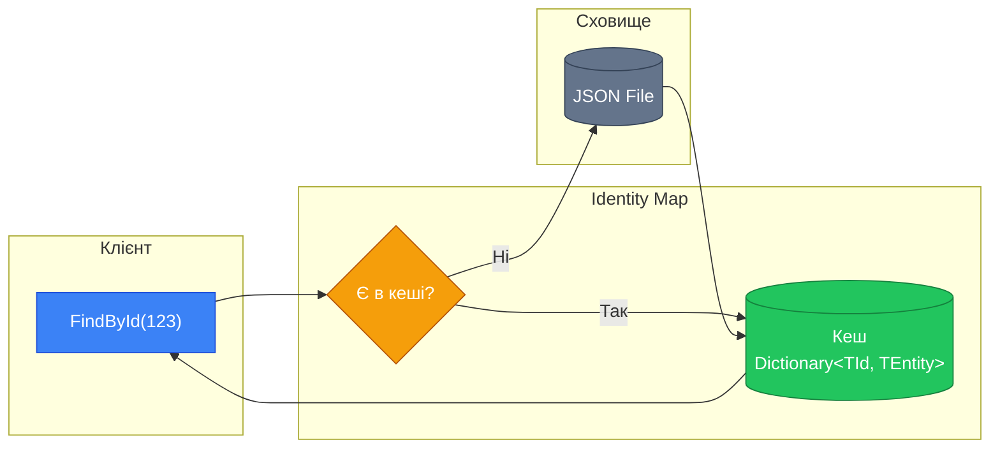
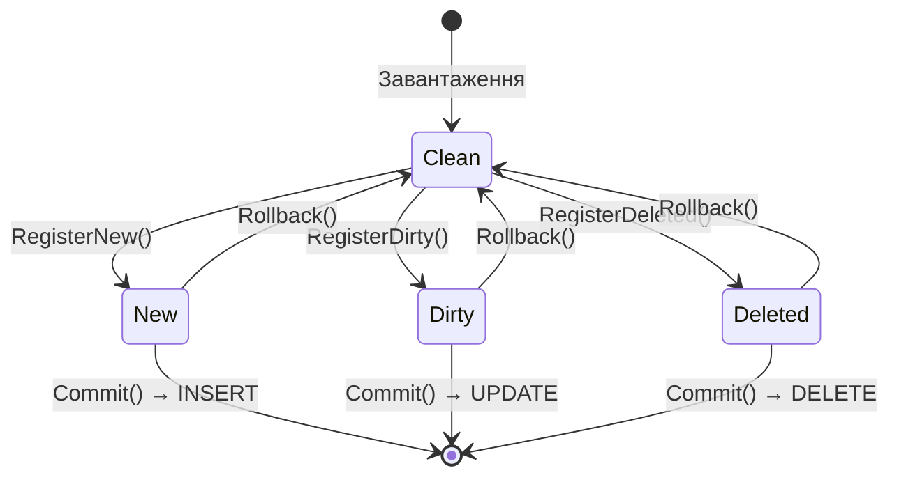
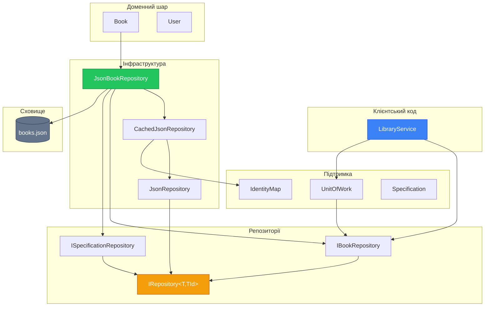

# Data Mapper: Repository та DAO патерни (Частина 2)

## Вступ до другої частини

У [першій частині](./06.data-mapper-part1.md) ми побудували фундамент:

- Розділили доменну модель від логіки персистентності
- Створили ієрархію інтерфейсів Repository
- Реалізували базовий JSON-репозиторій з System.Text.Json

Тепер ми підемо глибше та розглянемо додаткові патерни, які роблять нашу архітектуру ще потужнішою.

## Identity Map: Кешування сутностей

### Теоретичні основи

**Identity Map** — це патерн, описаний Мартіном Фаулером у книзі "Patterns of Enterprise Application Architecture". Його основна мета — забезпечити, щоб кожен об'єкт завантажувався зі сховища лише один раз протягом однієї "одиниці роботи" (Unit of Work).

> "Ensures that each object gets loaded only once by keeping every loaded object in a map. Looks up objects using the map when referring to them."
> — Martin Fowler, [P of EAA](https://martinfowler.com/eaaCatalog/identityMap.html)

### Проблема повторного завантаження

Розглянемо типовий сценарій:

```csharp showLineNumbers
var repository = new JsonBookRepository("books.json");

// Перше завантаження
var book1 = repository.FindById("123");

// Друге завантаження тієї ж книги
var book2 = repository.FindById("123");

// Питання: book1 == book2?
Console.WriteLine(ReferenceEquals(book1, book2)); // false!
```

Кожен виклик `FindById` читає файл заново і створює новий об'єкт. Це призводить до:

1. **Зайвих операцій I/O** — читання файлу кожного разу
2. **Неконсистентності** — зміни в `book1` не відобразяться в `book2`
3. **Витрат пам'яті** — дублікати об'єктів
4. **Порушення ідентичності** — один і той самий доменний об'єкт представлений різними інстансами

::warning
**Проблема ідентичності об'єктів** — це фундаментальна проблема в системах з персистентністю. Якщо два об'єкти представляють одну й ту саму сутність у сховищі, вони повинні бути одним об'єктом у пам'яті.
::

### Концепція Identity Map

::mermaid



::

### Реалізація Identity Map

```csharp showLineNumbers
namespace Library.Repository;

/// <summary>
/// Реалізація патерну Identity Map.
/// Кешує завантажені сутності за їх ідентифікаторами.
/// Забезпечує, що кожна сутність існує в пам'яті лише в одному екземплярі.
/// </summary>
/// <typeparam name="TId">Тип ідентифікатора</typeparam>
/// <typeparam name="TEntity">Тип сутності</typeparam>
public class IdentityMap<TId, TEntity> where TId : notnull
{
    private readonly Dictionary<TId, TEntity> _cache = new();

    /// <summary>
    /// Отримує сутність з кешу.
    /// </summary>
    /// <param name="id">Ідентифікатор</param>
    /// <returns>Сутність або null, якщо не знайдено</returns>
    public TEntity? Get(TId id)
    {
        return _cache.TryGetValue(id, out var entity) ? entity : default;
    }

    /// <summary>
    /// Намагається отримати сутність з кешу.
    /// </summary>
    /// <param name="id">Ідентифікатор</param>
    /// <param name="entity">Знайдена сутність</param>
    /// <returns>true, якщо сутність знайдено</returns>
    public bool TryGet(TId id, out TEntity? entity)
    {
        return _cache.TryGetValue(id, out entity);
    }

    /// <summary>
    /// Додає сутність до кешу.
    /// </summary>
    /// <param name="id">Ідентифікатор</param>
    /// <param name="entity">Сутність</param>
    public void Put(TId id, TEntity entity)
    {
        _cache[id] = entity;
    }

    /// <summary>
    /// Видаляє сутність з кешу.
    /// </summary>
    /// <param name="id">Ідентифікатор</param>
    public void Remove(TId id)
    {
        _cache.Remove(id);
    }

    /// <summary>
    /// Очищає весь кеш.
    /// </summary>
    public void Clear()
    {
        _cache.Clear();
    }

    /// <summary>
    /// Перевіряє наявність сутності в кеші.
    /// </summary>
    /// <param name="id">Ідентифікатор</param>
    /// <returns>true, якщо сутність є в кеші</returns>
    public bool Contains(TId id)
    {
        return _cache.ContainsKey(id);
    }

    /// <summary>
    /// Повертає кількість закешованих сутностей.
    /// </summary>
    public int Count => _cache.Count;
}
```

### Інтеграція Identity Map у Repository

Додамо підтримку Identity Map до нашого базового репозиторію:

```csharp showLineNumbers
using System.Text.Json;
using Library.Repository.Exceptions;

namespace Library.Repository.Json;

/// <summary>
/// Покращена версія JsonRepository з підтримкою Identity Map.
/// Кешує завантажені сутності для оптимізації продуктивності.
/// </summary>
public abstract class CachedJsonRepository<TEntity, TId> : IRepository<TEntity, TId>
    where TEntity : class
    where TId : notnull
{
    protected readonly string FilePath;
    protected readonly JsonSerializerOptions JsonOptions;
    protected readonly Func<TEntity, TId> IdExtractor;

    // Identity Map для кешування окремих сутностей
    protected readonly IdentityMap<TId, TEntity> IdentityMap = new();

    // Кеш усього списку для оптимізації FindAll()
    private bool _cacheValid;
    private List<TEntity>? _cachedList;

    protected CachedJsonRepository(string filename, Func<TEntity, TId> idExtractor)
    {
        FilePath = filename;
        IdExtractor = idExtractor;
        JsonOptions = new JsonSerializerOptions
        {
            WriteIndented = true,
            PropertyNamingPolicy = JsonNamingPolicy.CamelCase,
            PropertyNameCaseInsensitive = true
        };
        
        EnsureDirectoryExists();
    }

    private void EnsureDirectoryExists()
    {
        var directory = Path.GetDirectoryName(FilePath);
        if (!string.IsNullOrEmpty(directory) && !Directory.Exists(directory))
        {
            try
            {
                Directory.CreateDirectory(directory);
            }
            catch (IOException ex)
            {
                throw new RepositoryException($"Не вдалося створити директорію: {directory}", ex);
            }
        }
    }

    public virtual TEntity Save(TEntity entity)
    {
        var id = IdExtractor(entity);

        // Оновлюємо Identity Map
        IdentityMap.Put(id, entity);

        // Інвалідуємо кеш списку
        InvalidateCache();

        // Зберігаємо у файл
        var entities = LoadFromFile();

        var existingIndex = entities.FindIndex(e =>
            EqualityComparer<TId>.Default.Equals(IdExtractor(e), id));

        if (existingIndex >= 0)
        {
            entities[existingIndex] = entity;
        }
        else
        {
            entities.Add(entity);
        }

        WriteToFile(entities);
        return entity;
    }

    public virtual TEntity? FindById(TId id)
    {
        // Спочатку перевіряємо Identity Map
        if (IdentityMap.TryGet(id, out var cached) && cached != null)
        {
            return cached;
        }

        // Якщо немає в кеші — шукаємо у файлі
        var found = FindAllInternal()
            .FirstOrDefault(entity =>
                EqualityComparer<TId>.Default.Equals(IdExtractor(entity), id));

        // Додаємо знайдене в Identity Map
        if (found != null)
        {
            IdentityMap.Put(id, found);
        }

        return found;
    }

    public virtual IReadOnlyList<TEntity> FindAll()
    {
        return FindAllInternal().AsReadOnly();
    }

    public virtual bool DeleteById(TId id)
    {
        // Видаляємо з Identity Map
        IdentityMap.Remove(id);
        InvalidateCache();

        var entities = LoadFromFile();
        var removed = entities.RemoveAll(entity =>
            EqualityComparer<TId>.Default.Equals(IdExtractor(entity), id)) > 0;

        if (removed)
        {
            WriteToFile(entities);
        }

        return removed;
    }

    public virtual bool Delete(TEntity entity)
    {
        return DeleteById(IdExtractor(entity));
    }

    public virtual bool ExistsById(TId id)
    {
        return IdentityMap.Contains(id) || FindById(id) != null;
    }

    public virtual long Count()
    {
        return FindAllInternal().Count;
    }

    /// <summary>
    /// Інвалідує кеш. Викликається при модифікації даних.
    /// </summary>
    protected void InvalidateCache()
    {
        _cacheValid = false;
        _cachedList = null;
    }

    /// <summary>
    /// Очищає Identity Map та кеш. Корисно для тестування.
    /// </summary>
    public void ClearCache()
    {
        IdentityMap.Clear();
        InvalidateCache();
    }

    protected IReadOnlyList<TEntity> FindBy(Func<TEntity, bool> predicate)
    {
        return FindAllInternal()
            .Where(predicate)
            .ToList()
            .AsReadOnly();
    }

    protected TEntity? FindFirstBy(Func<TEntity, bool> predicate)
    {
        return FindAllInternal().FirstOrDefault(predicate);
    }

    /// <summary>
    /// Повертає всі сутності з кешу або файлу.
    /// Використовує lazy loading з кешуванням.
    /// </summary>
    protected List<TEntity> FindAllInternal()
    {
        if (_cacheValid && _cachedList != null)
        {
            return _cachedList;
        }

        _cachedList = LoadFromFile();
        _cacheValid = true;

        // Заповнюємо Identity Map
        foreach (var entity in _cachedList)
        {
            var id = IdExtractor(entity);
            if (!IdentityMap.Contains(id))
            {
                IdentityMap.Put(id, entity);
            }
        }

        return _cachedList;
    }

    private List<TEntity> LoadFromFile()
    {
        if (!File.Exists(FilePath))
        {
            return new List<TEntity>();
        }

        try
        {
            var json = File.ReadAllText(FilePath);

            if (string.IsNullOrWhiteSpace(json))
            {
                return new List<TEntity>();
            }

            return JsonSerializer.Deserialize<List<TEntity>>(json, JsonOptions)
                   ?? new List<TEntity>();
        }
        catch (JsonException ex)
        {
            throw new RepositoryException($"Помилка десеріалізації: {FilePath}", ex);
        }
        catch (IOException ex)
        {
            throw new RepositoryException($"Помилка читання: {FilePath}", ex);
        }
    }

    protected void WriteToFile(List<TEntity> entities)
    {
        try
        {
            var json = JsonSerializer.Serialize(entities, JsonOptions);
            File.WriteAllText(FilePath, json);
        }
        catch (IOException ex)
        {
            throw new RepositoryException($"Помилка запису: {FilePath}", ex);
        }
    }
}
```

**Ключові покращення:**

- **Рядок 19**: Identity Map для кешування окремих сутностей
- **Рядки 22-23**: Кеш усього списку для оптимізації `FindAll()`
- **Рядки 82-97**: `FindById` спочатку перевіряє кеш
- **Рядки 169-185**: Ліниве завантаження з кешуванням та заповненням Identity Map

## Unit of Work: Відстеження змін

### Теоретичні основи

**Unit of Work** — це ще один патерн від Мартіна Фаулера, який координує запис змінених об'єктів у сховище.

> "Maintains a list of objects affected by a business transaction and coordinates the writing out of changes."
> — Martin Fowler, [P of EAA](https://martinfowler.com/eaaCatalog/unitOfWork.html)

Ключова ідея полягає в тому, що замість негайного збереження кожної зміни, ми накопичуємо всі зміни протягом бізнес-транзакції і зберігаємо їх одним "коммітом".

### Проблема численних записів

Поточна реалізація записує файл при кожному виклику `Save()`:

```csharp showLineNumbers
// Кожен Save() викликає запис файлу
repository.Save(book1);  // -> write file
repository.Save(book2);  // -> write file
repository.Save(book3);  // -> write file
// 3 операції запису!
```

Для файлової системи це може бути прийнятно, але для бази даних це катастрофа (кожен запис = окрема транзакція). **Unit of Work** вирішує цю проблему.

### Життєвий цикл об'єктів у Unit of Work

::mermaid



::

### Стани об'єктів

| Стан | Опис | Дія при Commit |
| :--- | :--- | :--- |
| **Clean** | Об'єкт не змінювався | Нічого |
| **New** | Новий об'єкт, ще не в сховищі | INSERT |
| **Dirty** | Існуючий об'єкт, був змінений | UPDATE |
| **Deleted** | Об'єкт позначений для видалення | DELETE |

### Реалізація Unit of Work

```csharp showLineNumbers
namespace Library.Repository;

/// <summary>
/// Реалізація патерну Unit of Work.
/// Відстежує зміни в сутностях та координує їх збереження.
/// Дозволяє групувати кілька операцій в одну транзакцію.
/// </summary>
/// <typeparam name="TEntity">Тип сутності</typeparam>
/// <typeparam name="TId">Тип ідентифікатора</typeparam>
public class UnitOfWork<TEntity, TId> where TId : notnull
{
    private readonly HashSet<TEntity> _newEntities = new();
    private readonly HashSet<TEntity> _dirtyEntities = new();
    private readonly HashSet<TId> _deletedIds = new();

    private readonly Func<TEntity, TId> _idExtractor;
    private readonly IRepository<TEntity, TId> _repository;

    public UnitOfWork(IRepository<TEntity, TId> repository, Func<TEntity, TId> idExtractor)
    {
        _repository = repository;
        _idExtractor = idExtractor;
    }

    /// <summary>
    /// Реєструє нову сутність для вставки.
    /// </summary>
    public void RegisterNew(TEntity entity)
    {
        var id = _idExtractor(entity);
        _deletedIds.Remove(id);
        _dirtyEntities.Remove(entity);
        _newEntities.Add(entity);
    }

    /// <summary>
    /// Реєструє змінену сутність для оновлення.
    /// </summary>
    public void RegisterDirty(TEntity entity)
    {
        var id = _idExtractor(entity);
        if (!_newEntities.Contains(entity) && !_deletedIds.Contains(id))
        {
            _dirtyEntities.Add(entity);
        }
    }

    /// <summary>
    /// Реєструє сутність для видалення.
    /// </summary>
    public void RegisterDeleted(TEntity entity)
    {
        var id = _idExtractor(entity);
        if (_newEntities.Remove(entity))
        {
            return; // Нова сутність — просто видаляємо з черги
        }
        _dirtyEntities.Remove(entity);
        _deletedIds.Add(id);
    }

    /// <summary>
    /// Фіксує всі зміни в репозиторії.
    /// Виконує всі операції в правильному порядку.
    /// </summary>
    public void Commit()
    {
        // Спочатку вставляємо нові
        foreach (var entity in _newEntities)
        {
            _repository.Save(entity);
        }

        // Потім оновлюємо змінені
        foreach (var entity in _dirtyEntities)
        {
            _repository.Save(entity);
        }

        // Нарешті видаляємо
        foreach (var id in _deletedIds)
        {
            _repository.DeleteById(id);
        }

        // Очищаємо черги
        Clear();
    }

    /// <summary>
    /// Відкочує всі незбережені зміни.
    /// </summary>
    public void Rollback()
    {
        Clear();
    }

    /// <summary>
    /// Очищає всі черги змін.
    /// </summary>
    public void Clear()
    {
        _newEntities.Clear();
        _dirtyEntities.Clear();
        _deletedIds.Clear();
    }

    /// <summary>
    /// Перевіряє, чи є незбережені зміни.
    /// </summary>
    public bool HasChanges =>
        _newEntities.Count > 0 ||
        _dirtyEntities.Count > 0 ||
        _deletedIds.Count > 0;

    /// <summary>
    /// Повертає статистику змін.
    /// </summary>
    public string GetChangesSummary()
    {
        return $"New: {_newEntities.Count}, Dirty: {_dirtyEntities.Count}, Deleted: {_deletedIds.Count}";
    }

    /// <summary>
    /// Кількість нових сутностей.
    /// </summary>
    public int NewCount => _newEntities.Count;

    /// <summary>
    /// Кількість змінених сутностей.
    /// </summary>
    public int DirtyCount => _dirtyEntities.Count;

    /// <summary>
    /// Кількість видалених сутностей.
    /// </summary>
    public int DeletedCount => _deletedIds.Count;
}
```

### Використання Unit of Work

```csharp showLineNumbers
using Library.Domain;
using Library.Repository;
using Library.Repository.Json;

var repository = new JsonBookRepository("data/books.json");
var unitOfWork = new UnitOfWork<Book, string>(repository, book => book.Id);

// Створюємо кілька книг
var book1 = new Book("Книга 1", "Автор 1", 2024, "ISBN-1");
var book2 = new Book("Книга 2", "Автор 2", 2024, "ISBN-2");
var book3 = new Book("Книга 3", "Автор 3", 2024, "ISBN-3");

// Реєструємо як нові
unitOfWork.RegisterNew(book1);
unitOfWork.RegisterNew(book2);
unitOfWork.RegisterNew(book3);

Console.WriteLine($"Зміни: {unitOfWork.GetChangesSummary()}");
// Output: New: 3, Dirty: 0, Deleted: 0

// Зміни ще не в файлі!
Console.WriteLine($"Книг у файлі: {repository.Count()}"); // 0

// Фіксуємо всі зміни однією операцією
unitOfWork.Commit();

Console.WriteLine($"Після commit: {repository.Count()}"); // 3

// Модифікуємо та видаляємо
var existingBook = repository.FindById(book1.Id);
if (existingBook != null)
{
    existingBook.Borrow();
    unitOfWork.RegisterDirty(existingBook);
}

unitOfWork.RegisterDeleted(book3);

Console.WriteLine($"Зміни: {unitOfWork.GetChangesSummary()}");
// Output: New: 0, Dirty: 1, Deleted: 1

unitOfWork.Commit();
Console.WriteLine($"Після commit: {repository.Count()}"); // 2
```

## Specification Pattern: Гнучкий пошук

### Теоретичні основи

**Specification Pattern** — це патерн, описаний Еріком Евансом у книзі "Domain-Driven Design". Його мета — інкапсулювати бізнес-правила в окремі об'єкти, які можна комбінувати.

> "A Specification is a predicate that determines if an object does or does not satisfy some criteria."
> — Eric Evans, Domain-Driven Design

### Проблема вибухового росту методів

Подивіться на наш `IBookRepository`:

```csharp
IReadOnlyList<Book> FindByAuthor(string author);
IReadOnlyList<Book> FindByYear(int year);
IReadOnlyList<Book> FindByTitleContaining(string title);
IReadOnlyList<Book> FindAvailable();
```

А що, якщо потрібно:

- Знайти доступні книги конкретного автора?
- Знайти книги 2020-2024 років з "C#" у назві?
- Знайти недоступні книги, видані до 2000 року?

Комбінаторний вибух методів неминучий!

| Критерії | Кількість методів |
| :--- | :--- |
| 2 критерії | 2¹ = 2 |
| 4 критерії | 2⁴ = 16 |
| 6 критеріїв | 2⁶ = 64 |
| 8 критеріїв | 2⁸ = 256 |

### Рішення: Specification Pattern

**Specification** — патерн, що дозволяє комбінувати умови пошуку як об'єкти:

```csharp showLineNumbers
namespace Library.Repository.Specification;

/// <summary>
/// Базовий інтерфейс специфікації.
/// Специфікація — це об'єкт, що представляє умову пошуку.
/// Може комбінуватися з іншими специфікаціями через логічні операції.
/// </summary>
/// <typeparam name="T">Тип сутності</typeparam>
public interface ISpecification<T>
{
    /// <summary>
    /// Перевіряє, чи задовольняє сутність цю специфікацію.
    /// </summary>
    bool IsSatisfiedBy(T entity);
}

/// <summary>
/// Базова абстрактна реалізація специфікації з підтримкою комбінування.
/// </summary>
public abstract class Specification<T> : ISpecification<T>
{
    public abstract bool IsSatisfiedBy(T entity);

    /// <summary>
    /// Комбінує специфікації через AND.
    /// </summary>
    public Specification<T> And(ISpecification<T> other)
    {
        return new AndSpecification<T>(this, other);
    }

    /// <summary>
    /// Комбінує специфікації через OR.
    /// </summary>
    public Specification<T> Or(ISpecification<T> other)
    {
        return new OrSpecification<T>(this, other);
    }

    /// <summary>
    /// Інвертує специфікацію (NOT).
    /// </summary>
    public Specification<T> Not()
    {
        return new NotSpecification<T>(this);
    }

    /// <summary>
    /// Конвертує в Func для використання з LINQ.
    /// </summary>
    public Func<T, bool> ToFunc()
    {
        return IsSatisfiedBy;
    }
}

/// <summary>
/// Специфікація AND — обидві умови повинні виконуватися.
/// </summary>
internal class AndSpecification<T> : Specification<T>
{
    private readonly ISpecification<T> _left;
    private readonly ISpecification<T> _right;

    public AndSpecification(ISpecification<T> left, ISpecification<T> right)
    {
        _left = left;
        _right = right;
    }

    public override bool IsSatisfiedBy(T entity)
    {
        return _left.IsSatisfiedBy(entity) && _right.IsSatisfiedBy(entity);
    }
}

/// <summary>
/// Специфікація OR — хоча б одна умова повинна виконуватися.
/// </summary>
internal class OrSpecification<T> : Specification<T>
{
    private readonly ISpecification<T> _left;
    private readonly ISpecification<T> _right;

    public OrSpecification(ISpecification<T> left, ISpecification<T> right)
    {
        _left = left;
        _right = right;
    }

    public override bool IsSatisfiedBy(T entity)
    {
        return _left.IsSatisfiedBy(entity) || _right.IsSatisfiedBy(entity);
    }
}

/// <summary>
/// Специфікація NOT — інвертує результат.
/// </summary>
internal class NotSpecification<T> : Specification<T>
{
    private readonly ISpecification<T> _specification;

    public NotSpecification(ISpecification<T> specification)
    {
        _specification = specification;
    }

    public override bool IsSatisfiedBy(T entity)
    {
        return !_specification.IsSatisfiedBy(entity);
    }
}
```

### Конкретні специфікації для Book

```csharp showLineNumbers
using Library.Domain;

namespace Library.Repository.Specification;

/// <summary>
/// Фабрика специфікацій для книг.
/// Надає статичні методи для створення типових умов пошуку.
/// </summary>
public static class BookSpecifications
{
    /// <summary>
    /// Книги конкретного автора (часткове співпадіння, без урахування регістру).
    /// </summary>
    public static Specification<Book> HasAuthor(string author)
    {
        return new AuthorSpecification(author);
    }

    /// <summary>
    /// Книги з назвою, що містить текст.
    /// </summary>
    public static Specification<Book> TitleContains(string text)
    {
        return new TitleContainsSpecification(text);
    }

    /// <summary>
    /// Книги певного року.
    /// </summary>
    public static Specification<Book> PublishedIn(int year)
    {
        return new YearSpecification(year);
    }

    /// <summary>
    /// Книги в діапазоні років.
    /// </summary>
    public static Specification<Book> PublishedBetween(int startYear, int endYear)
    {
        return new YearRangeSpecification(startYear, endYear);
    }

    /// <summary>
    /// Доступні книги.
    /// </summary>
    public static Specification<Book> IsAvailable()
    {
        return new AvailableSpecification();
    }

    /// <summary>
    /// Видані (недоступні) книги.
    /// </summary>
    public static Specification<Book> IsBorrowed()
    {
        return IsAvailable().Not();
    }

    /// <summary>
    /// Книги з конкретним ISBN.
    /// </summary>
    public static Specification<Book> HasIsbn(string isbn)
    {
        return new IsbnSpecification(isbn);
    }

    /// <summary>
    /// Всі книги (завжди true).
    /// </summary>
    public static Specification<Book> All()
    {
        return new AllSpecification<Book>();
    }

    /// <summary>
    /// Жодної книги (завжди false).
    /// </summary>
    public static Specification<Book> None()
    {
        return new NoneSpecification<Book>();
    }
}

// Конкретні реалізації специфікацій

internal class AuthorSpecification : Specification<Book>
{
    private readonly string _author;

    public AuthorSpecification(string author) => _author = author;

    public override bool IsSatisfiedBy(Book book)
    {
        return book.Author.Contains(_author, StringComparison.OrdinalIgnoreCase);
    }
}

internal class TitleContainsSpecification : Specification<Book>
{
    private readonly string _text;

    public TitleContainsSpecification(string text) => _text = text;

    public override bool IsSatisfiedBy(Book book)
    {
        return book.Title.Contains(_text, StringComparison.OrdinalIgnoreCase);
    }
}

internal class YearSpecification : Specification<Book>
{
    private readonly int _year;

    public YearSpecification(int year) => _year = year;

    public override bool IsSatisfiedBy(Book book) => book.Year == _year;
}

internal class YearRangeSpecification : Specification<Book>
{
    private readonly int _startYear;
    private readonly int _endYear;

    public YearRangeSpecification(int startYear, int endYear)
    {
        _startYear = startYear;
        _endYear = endYear;
    }

    public override bool IsSatisfiedBy(Book book)
    {
        return book.Year >= _startYear && book.Year <= _endYear;
    }
}

internal class AvailableSpecification : Specification<Book>
{
    public override bool IsSatisfiedBy(Book book) => book.IsAvailable;
}

internal class IsbnSpecification : Specification<Book>
{
    private readonly string _isbn;

    public IsbnSpecification(string isbn) => _isbn = isbn;

    public override bool IsSatisfiedBy(Book book) => book.Isbn == _isbn;
}

internal class AllSpecification<T> : Specification<T>
{
    public override bool IsSatisfiedBy(T entity) => true;
}

internal class NoneSpecification<T> : Specification<T>
{
    public override bool IsSatisfiedBy(T entity) => false;
}
```

### Розширення Repository для підтримки специфікацій

```csharp showLineNumbers
using Library.Repository.Specification;

namespace Library.Repository;

/// <summary>
/// Розширений інтерфейс Repository з підтримкою специфікацій.
/// </summary>
public interface ISpecificationRepository<TEntity, TId> : IRepository<TEntity, TId>
    where TEntity : class
{
    /// <summary>
    /// Знаходить всі сутності, що задовольняють специфікацію.
    /// </summary>
    IReadOnlyList<TEntity> FindAll(ISpecification<TEntity> spec);

    /// <summary>
    /// Знаходить першу сутність, що задовольняє специфікацію.
    /// </summary>
    TEntity? FindOne(ISpecification<TEntity> spec);

    /// <summary>
    /// Підраховує сутності, що задовольняють специфікацію.
    /// </summary>
    long Count(ISpecification<TEntity> spec);

    /// <summary>
    /// Перевіряє існування сутностей за специфікацією.
    /// </summary>
    bool Exists(ISpecification<TEntity> spec);
}
```

### Реалізація у CachedJsonRepository

```csharp showLineNumbers
// Додаємо до CachedJsonRepository:

public IReadOnlyList<TEntity> FindAll(ISpecification<TEntity> spec)
{
    return FindAllInternal()
        .Where(spec.IsSatisfiedBy)
        .ToList()
        .AsReadOnly();
}

public TEntity? FindOne(ISpecification<TEntity> spec)
{
    return FindAllInternal().FirstOrDefault(spec.IsSatisfiedBy);
}

public long Count(ISpecification<TEntity> spec)
{
    return FindAllInternal().Count(spec.IsSatisfiedBy);
}

public bool Exists(ISpecification<TEntity> spec)
{
    return FindAllInternal().Any(spec.IsSatisfiedBy);
}
```

### Використання специфікацій

```csharp showLineNumbers
using static Library.Repository.Specification.BookSpecifications;

// Прості запити
var csharpBooks = repository.FindAll(TitleContains("C#"));
var available = repository.FindAll(IsAvailable());

// Комбіновані запити
var complexSpec = HasAuthor("Мартін")
    .And(PublishedBetween(2000, 2020))
    .And(IsAvailable());

var result = repository.FindAll(complexSpec);

// Ще складніший приклад
var eitherSpec = TitleContains("Clean")
    .Or(TitleContains("Чистий"))
    .And(IsAvailable())
    .And(PublishedIn(2008).Not()); // НЕ 2008 року

var filtered = repository.FindAll(eitherSpec);

// Перевірка існування
bool hasAvailableBooks = repository.Exists(IsAvailable());

// Підрахунок
long borrowedCount = repository.Count(IsBorrowed());
```

**Переваги Specification Pattern:**

- Немає комбінаторного вибуху методів
- Умови можна комбінувати динамічно
- Легко додавати нові специфікації
- Читабельний код: `HasAuthor("X").And(IsAvailable())`
- Специфікації можна тестувати окремо

## Generic DAO: Альтернативний підхід

Хоча Repository — сучасний стандарт, варто розглянути класичний DAO для порівняння.

### Інтерфейс IGenericDao

```csharp showLineNumbers
namespace Library.Dao;

/// <summary>
/// Generic Data Access Object.
/// Низькорівневий інтерфейс для CRUD-операцій.
/// </summary>
/// <typeparam name="TEntity">Тип сутності</typeparam>
/// <typeparam name="TId">Тип ідентифікатора</typeparam>
public interface IGenericDao<TEntity, TId>
{
    /// <summary>
    /// Вставляє нову сутність.
    /// </summary>
    void Insert(TEntity entity);

    /// <summary>
    /// Оновлює існуючу сутність.
    /// </summary>
    void Update(TEntity entity);

    /// <summary>
    /// Видаляє сутність.
    /// </summary>
    void Delete(TEntity entity);

    /// <summary>
    /// Знаходить за первинним ключем.
    /// </summary>
    TEntity? FindByPrimaryKey(TId id);

    /// <summary>
    /// Повертає всі записи.
    /// </summary>
    IReadOnlyList<TEntity> FindAll();
}
```

### Порівняння Repository vs DAO

| Характеристика | DAO | Repository |
| :--- | :--- | :--- |
| **Мова** | Технічна: `Insert`, `Select` | Доменна: `Save`, `Find` |
| **Абстракція** | Близько до сховища | Близько до домену |
| **Комбінування** | Важко | Легко (Specification) |
| **Семантика** | "Запис у базу" | "Колекція об'єктів" |
| **DDD** | Не відповідає | Відповідає |

::tip
У сучасній розробці рекомендується використовувати Repository Pattern. DAO залишається актуальним для legacy-систем та простих CRUD-застосунків.
::

## Обробка помилок та виключень

### Ієрархія виключень

```csharp showLineNumbers
namespace Library.Repository.Exceptions;

/// <summary>
/// Базовий виняток для всіх помилок репозиторію.
/// </summary>
public class RepositoryException : Exception
{
    public RepositoryException(string message) : base(message)
    {
    }

    public RepositoryException(string message, Exception innerException)
        : base(message, innerException)
    {
    }
}

/// <summary>
/// Виняток при спробі зберегти сутність з дублікатом унікального поля.
/// </summary>
public class DuplicateEntityException : RepositoryException
{
    public string Field { get; }
    public object? Value { get; }

    public DuplicateEntityException(string field, object? value)
        : base($"Сутність з {field}='{value}' вже існує")
    {
        Field = field;
        Value = value;
    }
}

/// <summary>
/// Виняток, коли сутність не знайдено.
/// </summary>
public class EntityNotFoundException : RepositoryException
{
    public object? Id { get; }

    public EntityNotFoundException(object? id)
        : base($"Сутність з Id='{id}' не знайдена")
    {
        Id = id;
    }
}

/// <summary>
/// Виняток при проблемах з файловою системою.
/// </summary>
public class StorageException : RepositoryException
{
    public StorageException(string message, Exception innerException)
        : base(message, innerException)
    {
    }
}
```

### Валідація перед збереженням

```csharp showLineNumbers
using Library.Domain;
using Library.Repository.Exceptions;
using Library.Repository.Json;

namespace Library.Repository.Validation;

/// <summary>
/// Репозиторій книг з валідацією унікальності ISBN.
/// Демонструє декоратор-патерн для додавання валідації.
/// </summary>
public class ValidatingJsonBookRepository : JsonBookRepository
{
    public ValidatingJsonBookRepository(string filename)
        : base(filename)
    {
    }

    public override Book Save(Book book)
    {
        // Перевірка на дублікат ISBN
        var existing = FindByIsbn(book.Isbn);
        if (existing != null && existing.Id != book.Id)
        {
            throw new DuplicateEntityException("Isbn", book.Isbn);
        }

        return base.Save(book);
    }
}
```

## Тестування репозиторіїв

### Модульні тести з тимчасовими файлами

```csharp showLineNumbers
using Library.Domain;
using Library.Repository.Json;

namespace Library.Tests;

public class JsonBookRepositoryTests : IDisposable
{
    private readonly string _testFilePath;
    private readonly JsonBookRepository _repository;

    public JsonBookRepositoryTests()
    {
        _testFilePath = Path.Combine(Path.GetTempPath(), $"test-books-{Guid.NewGuid()}.json");
        _repository = new JsonBookRepository(_testFilePath);
    }

    public void Dispose()
    {
        if (File.Exists(_testFilePath))
        {
            File.Delete(_testFilePath);
        }
    }

    [Fact]
    public void Save_ShouldSaveNewBook()
    {
        // Arrange
        var book = new Book("Test Book", "Author", 2024, "ISBN-123");

        // Act
        _repository.Save(book);

        // Assert
        Assert.Equal(1, _repository.Count());
        Assert.True(_repository.ExistsById(book.Id));
    }

    [Fact]
    public void Save_ShouldUpdateExistingBook()
    {
        // Arrange
        var book = new Book("Original Title", "Author", 2024, "ISBN-123");
        _repository.Save(book);

        // Act
        book.Title = "Updated Title";
        _repository.Save(book);

        // Assert
        Assert.Equal(1, _repository.Count());
        var found = _repository.FindById(book.Id);
        Assert.NotNull(found);
        Assert.Equal("Updated Title", found.Title);
    }

    [Fact]
    public void FindById_ShouldReturnNull_ForNonexistentId()
    {
        // Act
        var result = _repository.FindById("nonexistent-id");

        // Assert
        Assert.Null(result);
    }

    [Fact]
    public void FindByAuthor_ShouldFindBooksByPartialAuthorName()
    {
        // Arrange
        _repository.Save(new Book("Book 1", "Роберт Мартін", 2008, "ISBN-1"));
        _repository.Save(new Book("Book 2", "Мартін Фаулер", 1999, "ISBN-2"));
        _repository.Save(new Book("Book 3", "Інший Автор", 2020, "ISBN-3"));

        // Act
        var result = _repository.FindByAuthor("Мартін");

        // Assert
        Assert.Equal(2, result.Count);
    }

    [Fact]
    public void DeleteById_ShouldRemoveBook()
    {
        // Arrange
        var book = new Book("To Delete", "Author", 2024, "ISBN-123");
        _repository.Save(book);

        // Act
        var deleted = _repository.DeleteById(book.Id);

        // Assert
        Assert.True(deleted);
        Assert.Equal(0, _repository.Count());
    }

    [Fact]
    public void FindAvailable_ShouldReturnOnlyAvailableBooks()
    {
        // Arrange
        var available = new Book("Available", "Author", 2024, "ISBN-1");
        var borrowed = new Book("Borrowed", "Author", 2024, "ISBN-2");
        borrowed.Borrow();

        _repository.Save(available);
        _repository.Save(borrowed);

        // Act
        var result = _repository.FindAvailable();

        // Assert
        Assert.Single(result);
        Assert.Equal("Available", result[0].Title);
    }
}
```

### Тестування специфікацій

```csharp showLineNumbers
using Library.Domain;
using Library.Repository.Specification;
using static Library.Repository.Specification.BookSpecifications;

namespace Library.Tests;

public class BookSpecificationsTests
{
    [Fact]
    public void HasAuthor_ShouldMatchPartialAuthorName()
    {
        var book = new Book("Title", "Роберт Мартін", 2024, "ISBN");

        Assert.True(HasAuthor("Мартін").IsSatisfiedBy(book));
        Assert.True(HasAuthor("роберт").IsSatisfiedBy(book));
        Assert.False(HasAuthor("Фаулер").IsSatisfiedBy(book));
    }

    [Fact]
    public void CombinedSpecification_ShouldWork()
    {
        var book = new Book("Clean Code", "Robert Martin", 2008, "ISBN");

        var spec = TitleContains("Clean")
            .And(PublishedIn(2008))
            .And(IsAvailable());

        Assert.True(spec.IsSatisfiedBy(book));

        book.Borrow();
        Assert.False(spec.IsSatisfiedBy(book)); // Вже не доступна
    }

    [Fact]
    public void NotSpecification_ShouldInvertResult()
    {
        var book = new Book("Title", "Author", 2024, "ISBN");

        Assert.True(IsAvailable().IsSatisfiedBy(book));
        Assert.False(IsAvailable().Not().IsSatisfiedBy(book));
    }

    [Fact]
    public void OrSpecification_ShouldMatchEitherCondition()
    {
        var book1 = new Book("Clean Code", "Author", 2024, "ISBN-1");
        var book2 = new Book("Чистий код", "Author", 2024, "ISBN-2");
        var book3 = new Book("Other Book", "Author", 2024, "ISBN-3");

        var spec = TitleContains("Clean").Or(TitleContains("Чистий"));

        Assert.True(spec.IsSatisfiedBy(book1));
        Assert.True(spec.IsSatisfiedBy(book2));
        Assert.False(spec.IsSatisfiedBy(book3));
    }
}
```

## Підсумки

У цьому двочастинному матеріалі ми розглянули:

::steps

### Data Mapper Pattern

Розділення доменних об'єктів від логіки персистентності. Забезпечує Persistence Ignorance.

### Repository Pattern

Абстракція колекції доменних об'єктів з доменною мовою. Ключовий патерн DDD.

### Ієрархія репозиторіїв

`IRepository<T, TId>` → `IBookRepository` → `JsonRepository` → `JsonBookRepository`

### Identity Map

Кешування сутностей для уникнення дублікатів та забезпечення ідентичності об'єктів.

### Unit of Work

Відстеження та групування змін для оптимізації персистентності.

### Specification Pattern

Гнучкий та комбінований пошук без комбінаторного вибуху методів.

### Обробка помилок

Ієрархія виключень для репозиторіїв: `RepositoryException`, `DuplicateEntityException`, `EntityNotFoundException`.

### Тестування

Unit-тести з тимчасовими файлами та ізольованим тестуванням специфікацій.

::

## Архітектурна діаграма повного рішення

::mermaid



::

## Корисні посилання

- [Martin Fowler — Identity Map](https://martinfowler.com/eaaCatalog/identityMap.html)
- [Martin Fowler — Unit of Work](https://martinfowler.com/eaaCatalog/unitOfWork.html)
- [Eric Evans — Domain-Driven Design](https://www.domainlanguage.com/ddd/)
- [System.Text.Json Documentation](https://learn.microsoft.com/en-us/dotnet/standard/serialization/system-text-json/overview)

## Завдання для закріплення

::collapsible{title="Завдання 1: Реалізуйте повну систему бібліотеки"}
Створіть повноцінну систему з:

- `User` (Id, Name, Email, BorrowedBookIds)
- `IUserRepository` з методами `FindByEmail`, `FindWithOverdueBooks`
- Зв'язок між `User` та `Book` через список Id книг
- `LibraryService` для бізнес-логіки видачі/повернення

::

::collapsible{title="Завдання 2: Додайте пагінацію та сортування"}
Розширте `ISpecificationRepository`:

```csharp
IReadOnlyList<T> FindAll(ISpecification<T> spec, Sort sort);
PagedResult<T> FindAll(ISpecification<T> spec, PageRequest pageRequest);
```

Реалізуйте `Sort`, `PageRequest` та `PagedResult<T>`.
::

::collapsible{title="Завдання 3: Транзакційність з бекапом"}
Модифікуйте `UnitOfWork`, щоб підтримувати:

- Backup файлу перед commit
- Відновлення з backup при помилці
- Атомарність — або всі зміни застосовуються, або жодна

**Підказка**: Використовуйте `File.Copy()` для створення бекапу та `File.Move()` для відновлення.
::

::collapsible{title="Завдання 4: Асинхронний Repository"}
Створіть асинхронний варіант репозиторію:

```csharp
public interface IAsyncRepository<TEntity, TId>
{
    Task<TEntity> SaveAsync(TEntity entity, CancellationToken ct = default);
    Task<TEntity?> FindByIdAsync(TId id, CancellationToken ct = default);
    Task<IReadOnlyList<TEntity>> FindAllAsync(CancellationToken ct = default);
    // ...
}
```

Використовуйте `File.ReadAllTextAsync()` та `File.WriteAllTextAsync()`.
::
