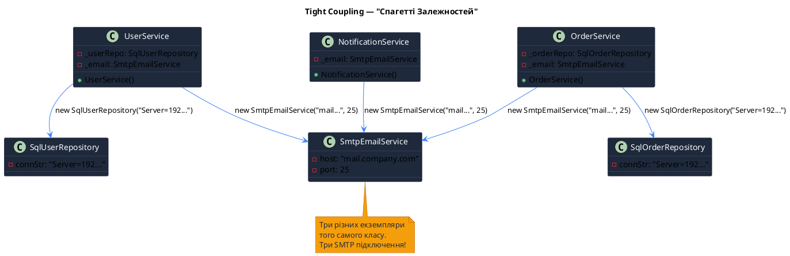
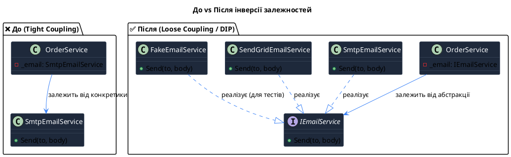
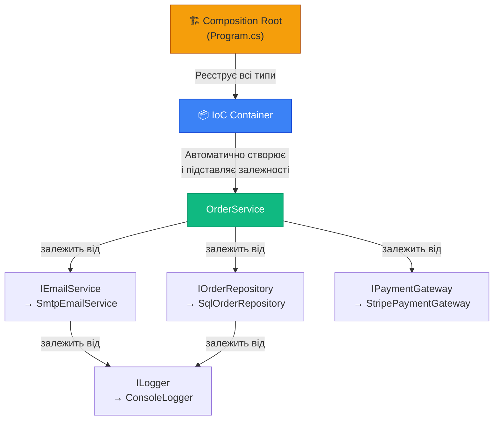

# Проблема залежностей та Інверсія Контролю

## Вступ: Електрик, що прийшов зі своїм генератором

Уявіть ситуацію. Ви наймаєте електрика для ремонту розеток у квартирі. Він приходить, дістає з сумки... портативний бензиновий генератор, вмикає його, і тільки тоді підключає свій дриль.

Ви злегка здивовані. "А навіщо генератор? У нас є розетки у квартирі!"

Електрик відповідає: "Ну, я так звик. Я завжди сам забезпечую себе електрикою, щоб не залежати від вас."

Це, звичайно, абсурд. Але **саме так пишуть код більшість початківців** — і навіть деякі досвідчені розробники.

```csharp
// Цей клас — як та "електрик з генератором"
public class OrderService
{
    private readonly EmailService _emailService;

    public OrderService()
    {
        // Клас сам "приносить свій генератор" — створює залежність
        _emailService = new EmailService("smtp.gmail.com", 587);
    }

    public void PlaceOrder(Order order)
    {
        // Обробка замовлення...
        _emailService.Send(order.CustomerEmail, "Ваше замовлення прийнято!");
    }
}
```

`OrderService` сам створює `EmailService`. Він не просить його ззовні — він сам "приносить свій генератор". І це **величезна проблема**, яку ми детально розглянемо у цій статті.

::note
**Мета цієї статті** — дати глибоке розуміння того, **чому** виникли паттерни управління залежностями. Без розуміння проблеми неможливо оцінити елегантність рішення. Тому ми підемо від самого початку.
::

### Що таке залежність?

У програмуванні **залежність (Dependency)** — це будь-який зовнішній об'єкт, сервіс або ресурс, який потрібен класу для виконання своєї роботи.

Якщо клас `A` використовує клас `B`, то кажуть що "A залежить від B", або "B є залежністю A".

```csharp
public class ReportGenerator  // Клас A
{
    private readonly DatabaseConnection _db;   // Залежність 1
    private readonly PdfRenderer _pdf;         // Залежність 2
    private readonly EmailSender _email;       // Залежність 3

    public ReportGenerator()
    {
        _db    = new DatabaseConnection("Server=...");  // Створює залежність 1
        _pdf   = new PdfRenderer();                     // Створює залежність 2
        _email = new EmailSender("smtp.company.com");   // Створює залежність 3
    }
}
```

Залежності — це не зло. Кожна програма, яка робить щось корисне, неминуче матиме залежності. Зло — це **спосіб, у який ці залежності організовані**.

---

## Частина 1: Анатомія Проблеми

### 1.1. Coupling (Зв'язаність): Від Чого Все Починається

**Coupling (зв'язаність)** — це міра того, наскільки сильно один модуль або клас покладається на деталі реалізації іншого.

Imagine two dancers performing together. There are two types of dance pairs:

- **Tight coupling (сильна зв'язаність)**: Танцівники зав'язані мотузкою. Кожен рух одного миттєво змушує рухатися іншого. Вони не можуть виступати окремо, і якщо один спотикається — обидва падають.
- **Loose coupling (слабка зв'язаність)**: Танцівники просто слідують одному ритму. Вони можуть танцювати по-різному, один може відійти, його може замінити інший — шоу продовжується.

У коді це виглядає так:

::tabs

::tabs-item{label="❌ Tight Coupling"}
```csharp
// Сервіс замовлень жорстко зав'язаний на конкретних класах
public class OrderService
{
    // Залежність від КОНКРЕТНОГО класу, а не абстракції
    private readonly GmailEmailSender _emailSender;
    private readonly MySqlOrderRepository _repository;
    private readonly StripePaymentGateway _payment;

    public OrderService()
    {
        // Ці рядки — "мотузка" між танцівниками
        _emailSender = new GmailEmailSender("user@gmail.com", "password");
        _repository = new MySqlOrderRepository("Server=localhost;Database=orders;");
        _payment = new StripePaymentGateway("sk_live_...");
    }

    public void PlaceOrder(Order order)
    {
        _Repository.Save(order);
        _payment.Charge(order.Total);
        _emailSender.Send(order.Email, "Замовлення прийнято!");
    }
}
```
::

::tabs-item{label="✅ Loose Coupling"}
```csharp
// Сервіс залежить від АБСТРАКЦІЙ (інтерфейсів)
public class OrderService
{
    private readonly IEmailSender _emailSender;
    private readonly IOrderRepository _repository;
    private readonly IPaymentGateway _payment;

    // Залежності передаються ззовні (через конструктор)
    public OrderService(
        IEmailSender emailSender,
        IOrderRepository repository,
        IPaymentGateway payment)
    {
        _emailSender = emailSender;
        _repository = repository;
        _payment = payment;
    }

    public void PlaceOrder(Order order)
    {
        _repository.Save(order);
        _payment.Charge(order.Total);
        _emailSender.Send(order.Email, "Замовлення прийнято!");
    }
}
```
::

::

У другому варіанті `OrderService` знає лише про **контракт** (інтерфейс), але не знає про **конкретну реалізацію**. Це дає нам неймовірну гнучкість.

### 1.2. Cohesion (Зв'язність): Напарник Coupling

Поряд з поняттям Coupling часто згадують його "напарника" — **Cohesion (зв'язність)**.

- **High Cohesion (висока зв'язність)** — це ДОБРЕ. Всі частини класу/модуля тісно пов'язані між собою за функціональністю. Клас робить одну річ і робить її добре.
- **Low Cohesion (низька зв'язність)** — це ПОГАНО. Клас містить не пов'язані між собою обов'язки.

Мета правильної архітектури — **висока зв'язність (High Cohesion) та слабке зчеплення (Low Coupling)**.

```csharp
// ❌ Low Cohesion - клас робить все підряд
public class UserManager
{
    public void CreateUser(string name) { /* ... */ }
    public void SendWelcomeEmail(string email) { /* ... */ }   // ← Чому email тут?
    public void GenerateReport() { /* ... */ }                 // ← Чому звіт тут?
    public void BackupDatabase() { /* ... */ }                 // ← Чому бекап тут?
    public void OptimizeImages() { /* ... */ }                 // ← Повний безлад!
}

// ✅ High Cohesion - кожен клас має свою відповідальність
public class UserService          { public void CreateUser(string name) { /* ... */ } }
public class EmailService         { public void SendWelcomeEmail(string email) { /* ... */ } }
public class ReportService        { public void GenerateReport() { /* ... */ } }
public class DatabaseBackupService { public void BackupDatabase() { /* ... */ } }
```

### 1.3. Чому Tight Coupling — це так погано?

Давайте розглянемо конкретну систему і проаналізуємо всі проблеми, які породжує сильна зв'язаність.

Ось типовий "спагетті-код" у невеликому стартапі, де кожен клас сам створює свої залежності:

```csharp showLineNumbers
// Уявіть, що це реальний код в продакшені...

public class UserService
{
    private readonly SqlUserRepository _userRepo;
    private readonly SmtpEmailService _emailService;

    public UserService()
    {
        // Hard-coded рядок підключення — де конфіг?
        _userRepo = new SqlUserRepository("Server=192.168.1.100;Database=UsersDB;User=sa;Password=1234;");
        // Hard-coded SMTP — що коли зміниться поштовий провайдер?
        _emailService = new SmtpEmailService("mail.company.com", 25, false);
    }
}

public class OrderService
{
    private readonly SqlOrderRepository _orderRepo;
    private readonly SmtpEmailService _emailService;  // ← Ще один екземпляр!

    public OrderService()
    {
        // Той самий рядок підключення — дублювання!
        _orderRepo = new SqlOrderRepository("Server=192.168.1.100;Database=OrdersDB;User=sa;Password=1234;");
        _emailService = new SmtpEmailService("mail.company.com", 25, false); // ← Ще один!
    }
}

public class NotificationService
{
    private readonly SmtpEmailService _emailService; // ← І ще один!

    public NotificationService()
    {
        _emailService = new SmtpEmailService("mail.company.com", 25, false); // ← Скільки можна?
    }
}
```

Порахуємо проблеми:

**Проблема 1: Неможливо замінити імплементацію без зміни коду**

Компанія вирішила перейти з власного SMTP сервера на SendGrid. Тепер нам потрібно знайти **кожен** клас, який використовує `SmtpEmailService`, і вручну замінити його на `SendGridEmailService`. У великій системі це може зайняти дні, і ймовірність помилки — висока.

**Проблема 2: Неможливо нормально протестувати**

```csharp
// Як написати Unit тест для OrderService?
[Test]
public void PlaceOrder_ShouldSendEmail_WhenOrderIsPlaced()
{
    var service = new OrderService();
    // ПРОБЛЕМА: OrderService у конструкторі РЕАЛЬНО підключиться до БД
    // і РЕАЛЬНО спробує надіслати email через SMTP!
    // Тест буде залежати від зовнішніх систем і буде нестабільним.

    service.PlaceOrder(new Order { Email = "test@example.com" });

    // Як перевірити, що email БУЛО надіслано? Ніяк, не перехопити!
}
```

Для тестування нам треба замінити `SmtpEmailService` на "фейковий" сервіс (Mock), який просто запам'ятовує виклики. Але при tight coupling ми не можемо цього зробити.

**Проблема 3: Дублювання конфігурації**

Рядок підключення до бази даних, налаштування SMTP — все це розкидано по конструкторах десятків класів. Зміна одного параметра (наприклад, IP адреси сервера) вимагає правок у багатьох місцях.

**Проблема 4: Порушення Single Responsibility Principle**

Клас `OrderService` тепер відповідальний не лише за логіку замовлень, але й за **знання про те, як створювати email-сервіс** (який сервер, який порт, чи використовувати SSL). Це порушення SRP.

**Проблема 5: Lifecycle Management**

Хто відповідальний за знищення об'єктів? `SmtpEmailService` може тримати відкрите TCP-з'єднання. Якщо `OrderService` буде Garbage Collected, але не викличе `Dispose()` на `_emailService` — отримаємо витік ресурсів.

::plant-uml



::

---

## Частина 2: Еволюція до Loosely Coupled Коду

Проблеми, описані вище, були відомі задовго до появи IoC контейнерів. Розробники шукали рішення поступово, і ця еволюція допоможе нам зрозуміти, **чому** виник Dependency Injection.

### 2.1. Крок 1: Виносимо конфігурацію (але проблема залишається)

Перший очевидний крок — прибрати hard-coded значення:

```csharp
// Кращe, але все ще tight coupling
public class OrderService
{
    private readonly SqlOrderRepository _orderRepo;
    private readonly SmtpEmailService _emailService;

    public OrderService()
    {
        // Тепер читаємо з конфіга — хоч якийсь прогрес
        var connStr = ConfigurationManager.ConnectionStrings["OrdersDB"].ConnectionString;
        var smtpHost = ConfigurationManager.AppSettings["SmtpHost"];

        _orderRepo = new SqlOrderRepository(connStr);
        _emailService = new SmtpEmailService(smtpHost, 587);
    }
}
```

Це краще — конфігурація централізована, але **проблема тестованості залишилась**. Ми все ще не можемо замінити `SqlOrderRepository` на in-memory реалізацію для тестів.

### 2.2. Крок 2: Фабричний метод (Factory Method)

Наступний крок — виносимо логіку створення об'єктів у фабрику:

```csharp
// Статична фабрика для створення сервісів
public static class ServiceFactory
{
    public static IEmailService CreateEmailService()
    {
        if (Environment.GetEnvironmentVariable("ASPNETCORE_ENVIRONMENT") == "Testing")
            return new FakeEmailService(); // Для тестів
        else
            return new SmtpEmailService("mail.company.com", 587);
    }

    public static IOrderRepository CreateOrderRepository()
    {
        if (Environment.GetEnvironmentVariable("ASPNETCORE_ENVIRONMENT") == "Testing")
            return new InMemoryOrderRepository(); // Для тестів
        else
            return new SqlOrderRepository(GetConnectionString());
    }
}

// Тепер OrderService використовує фабрику
public class OrderService
{
    private readonly IEmailService _emailService;
    private readonly IOrderRepository _orderRepo;

    public OrderService()
    {
        _emailService = ServiceFactory.CreateEmailService(); // Все ще залежить від фабрики!
        _orderRepo = ServiceFactory.CreateOrderRepository();
    }
}
```

Прогрес є — ми вже використовуємо інтерфейси `IEmailService` та `IOrderRepository`. Тепер можна підміняти реалізацію. Але є нова проблема: `OrderService` тепер залежить від статичної `ServiceFactory`. Це **Service Locator** — паттерн, який ми детально розглянемо в [наступних статтях](./03.service-locator-pattern).

### 2.3. Крок 3: Передаємо залежності через конструктор (DI!)

А що, якщо ми просто **попросимо** той, хто створює `OrderService`, надати нам готові залежності?

```csharp
// 🎉 Dependency Injection у чистому вигляді
public class OrderService
{
    private readonly IEmailService _emailService;
    private readonly IOrderRepository _orderRepo;

    // Конструктор "оголошує контракт": надайте мені ці два об'єкти,
    // і я зможу виконувати свою роботу
    public OrderService(IEmailService emailService, IOrderRepository orderRepo)
    {
        _emailService = emailService;
        _orderRepo = orderRepo;
    }

    public void PlaceOrder(Order order)
    {
        _orderRepo.Save(order);
        _emailService.Send(order.Email, "Замовлення прийнято!");
    }
}
```

Тепер `OrderService` абсолютно "чистий". Він нічого не знає про те:

- Де живе база даних (SQL? MongoDB? In-Memory?)
- Який email провайдер (SMTP? SendGrid? Fake для тестів?)
- Як ці об'єкти створюються та знищуються

**Але виникає нове питання: хто тоді збирає все разом?**

```csharp
// Хтось ззовні має зібрати граф залежностей вручну
var orderRepo = new SqlOrderRepository(connectionString);
var emailService = new SmtpEmailService("mail.company.com", 587);
var orderService = new OrderService(emailService, orderRepo); // Передаємо залежності!
```

Поки у нас 2-3 залежності — це виглядає просто. Але у реальних системах один клас може залежати від інших, які теж мають свої залежності:

```csharp
// Реальний приклад складного графу залежностей
var logger = new Logger(logConfig);
var dbConnection = new SqlConnection(connStr);
var unitOfWork = new UnitOfWork(dbConnection, logger);
var userRepo = new SqlUserRepository(unitOfWork, logger);
var orderRepo = new SqlOrderRepository(unitOfWork, logger);
var inventoryService = new InventoryService(orderRepo, logger);
var paymentGateway = new StripePaymentGateway(stripeApiKey, logger);
var emailService = new SmtpEmailService(smtpConfig, logger);
var notificationService = new NotificationService(emailService, userRepo, logger);
var orderService = new OrderService(orderRepo, inventoryService, paymentGateway, notificationService, logger);
// ... і ще 50 таких рядків
```

Ручне збирання графу залежностей для великої системи — це **тонни boilerplate коду**, який важко підтримувати. Саме тут на сцену виходить **IoC Container**.

---

## Частина 3: Принцип Інверсії Контролю

### 3.1. Що означає "Inversion of Control"?

**Inversion of Control (IoC)** — це загальний принцип програмування, який стверджує, що **контроль над потоком виконання програми передається від прикладного коду до фреймворку або контейнера**.

Назва "Інверсія Контролю" надовго заплутала багатьох розробників (в тому числі і Мартін Фаулер визнав, що назва не дуже вдала). Щоб краще зрозуміти принцип, використаємо кілька аналогій.

**Аналогія 1: Ресторан vs Їдальня самообслуговування**

У "традиційному" підході (без IoC) ваш код схожий на їдальню самообслуговування:
- Ви самі берете підніс
- Самі підходите до кожної стойки
- Самі накладаєте їжу
- Самі несете все до столика

А з IoC ваш код схожий на ресторан:
- Ви просто сідаєте за стіл (оголошуєте потреби в конструкторі)
- Офіціант (контейнер) сам приносить все необхідне
- Ви не знаєте і не переймаєтеся, де готують і хто постачає продукти

**Аналогія 2: Hollywood Principle — "Don't Call Us, We'll Call You"**

IoC часто називають **"Hollywood Principle"** ("Голлівудський принцип"): "Не телефонуйте нам — ми зателефонуємо вам".

В Голлівуді актор не ходить по студіях і не шукає роль сам — він просто наявний та відомий. Коли режисер потребує певного типу актора — він знайде і запросить його.

Аналогічно: ваш клас не шукає залежності сам (`new SomeService()`). Він лише **оголошує, що йому потрібно** (через конструктор), і **контейнер** знаходить і доставляє потрібне.

### 3.2. IoC — це принцип, а не технологія

__Важливо розуміти__, що IoC — це широкий принцип, який реалізується різними паттернами:

::card-group

::card{title="Dependency Injection" icon="i-heroicons-arrow-path"}
Залежності передаються ззовні (через конструктор, властивості або методи). **Найпоширеніший спосіб IoC.**
::

::card{title="Template Method Pattern" icon="i-heroicons-document-text"}
Базовий клас визначає алгоритм, а підкласи реалізують конкретні кроки. Фреймворк викликає ваш код.
::

::card{title="Event-Driven / Observer" icon="i-heroicons-bell"}
Ваш код підписується на події та реагує на них. Хто відправляє події — контролює потік.
::

::card{title="Service Locator" icon="i-heroicons-magnifying-glass"}
Код запитує залежності у централізованого реєстру (вважається анти-паттерном, але реалізує IoC).
::

::

Коли люди кажуть "DI" та "IoC" — вони часто мають на увазі одне й те ж, але технічно **DI є конкретною формою реалізації IoC**.

### 3.3. IoC та SOLID: Принцип Інверсії Залежностей (DIP)

Dependency Injection безпосередньо реалізує **принцип SOLID "D" — Dependency Inversion Principle (DIP)**.

DIP стверджує:

1. **Модулі вищого рівня не повинні залежати від модулів нижчого рівня.** Обидва повинні залежати від абстракцій.
2. **Абстракції не повинні залежати від деталей.** Деталі повинні залежати від абстракцій.

::tip
Якщо ви не знайомі з SOLID, рекомендуємо прочитати [статтю про принципи проектування](../01.software-design-principles) перед продовженням.
::

```csharp
// ❌ ПОРУШЕННЯ DIP
// OrderService (висший рівень) залежить від SmtpEmailService (нижчий рівень — деталь)
public class OrderService
{
    private SmtpEmailService _email; // ← Залежність від конкретики!

    public OrderService()
    {
        _email = new SmtpEmailService(); // ← OrderService знає як створити email сервіс
    }
}

// ✅ ДОТРИМАННЯ DIP
// Обидва модулі залежать від абстракції IEmailService
public interface IEmailService          // ← Абстракція
{
    void Send(string to, string body);
}

public class SmtpEmailService : IEmailService  // Деталь залежить від абстракції
{
    public void Send(string to, string body) { /* SMTP логіка */ }
}

public class OrderService                      // Висший рівень залежить від абстракції
{
    private readonly IEmailService _email;     // ← Залежність від абстракції!

    public OrderService(IEmailService email)   // ← Деталь передається ззовні
    {
        _email = email;
    }
}
```

Ось яскрава діаграма, що показує "інверсію" залежності:

::plant-uml



::

Зверніть увагу на стрілку залежності: у варіанті "після" `SmtpEmailService` тепер **залежить від** `IEmailService` (реалізує його), а не навпаки. Залежність "інвертована"!

### 3.4. "Нова" залежність як контракт

Ще одна важлива концепція: **конструктор з параметрами — це публічний контракт класу**. Він явно говорить "для роботи мені потрібні ці речі".

Порівняйте два конструктори:

```csharp
// Конструктор без параметрів — "закритий ящик"
// Споживач класу не знає, які ресурси він використовує
public class OrderService()
{
    // Магія всередині... клас сам знаходить те, що йому потрібно
}

// Конструктор з параметрами — "відкритий контракт"
// Споживач чітко бачить: "цьому класу потрібен репозиторій і email сервіс"
public class OrderService(IOrderRepository repository, IEmailService emailService)
{
    // Нічого зайвого
}
```

**Явний контракт дає нам:**
- Зрозумілість: одного погляду на конструктор достатньо, щоб знати всі залежності класу
- Тестованість: у тесті ми явно передаємо моки
- Компілятивну безпеку: якщо залежність не передана — програма просто не скомпілюється
- Документацію: конструктор — це жива документація залежностей

---

## Частина 4: Від Ручного DI до IoC Контейнера

### 4.1. Pure DI: Коли Контейнер Не Потрібен

Цікавий факт: **Dependency Injection не вимагає DI-контейнера**. Можна практикувати DI повністю вручну — це називається **Pure DI** або **Manual DI**.

```csharp
// Program.cs — "Composition Root" (місце, де всe збирається)
// Тут ми вручну будуємо граф залежностей

static void Main(string[] args)
{
    // Ручна побудова графу залежностей (Pure DI)
    var logger = new ConsoleLogger(LogLevel.Information);
    var connStr = "Server=localhost;Database=ShopDB;";
    var dbContext = new AppDbContext(connStr);

    var userRepository = new SqlUserRepository(dbContext, logger);
    var orderRepository = new SqlOrderRepository(dbContext, logger);

    var emailConfig = new EmailConfig { Host = "smtp.company.com", Port = 587 };
    var emailService = new SmtpEmailService(emailConfig, logger);

    var paymentGateway = new StripePaymentGateway("sk_live_...", logger);
    var inventoryService = new InventoryService(orderRepository, logger);

    var notificationService = new NotificationService(emailService, userRepository, logger);

    var orderService = new OrderService(
        orderRepository,
        inventoryService,
        paymentGateway,
        notificationService,
        logger
    );

    var app = new Application(orderService, userRepository, logger);
    app.Run();
}
```

**Переваги Pure DI:**
- Повний контроль над графом залежностей
- Немає залежності від стороннього фреймворку
- Компілятивна безпека (немає runtime errors при resolve)

**Недоліки Pure DI:**
- Величезний обсяг boilerplate коду для великих проєктів
- Ручне управління lifecycle (хто викликає Dispose?)
- Важко підтримувати при змінах (зміна одного класу → правки в багатьох місцях)

### 4.2. IoC Container: Автоматизація DI

**IoC Container** (він же **DI Container**) — це бібліотека, яка **автоматично** виконує те, що ми робили вручну у "Composition Root":

1. **Реєстрація (Registration)**: Ви кажете контейнеру "коли хтось просить `IOrderRepository` — дай йому `SqlOrderRepository`"
2. **Resolve**: Коли хтось просить `OrderService`, контейнер автоматично:
   - Дивиться на конструктор `OrderService`
   - Бачить, що потрібен `IOrderRepository`
   - Знаходить реєстрацію для `IOrderRepository` → `SqlOrderRepository`
   - Дивиться на конструктор `SqlOrderRepository`
   - Бачить, що потрібен `IDbContext`
   - ...і так рекурсивно до кінця графу залежностей
3. **Lifecycle Management**: Контейнер знає, коли створювати новий об'єкт, коли повертати кешований, і коли викликати Dispose()

```csharp
// З мікроскопічним власним контейнером (ми побудуємо такий у наступній статті!)
var container = new SimpleContainer();

// Реєстрація (один раз на старті)
container.Register<ILogger, ConsoleLogger>();
container.Register<IOrderRepository, SqlOrderRepository>();
container.Register<IEmailService, SmtpEmailService>();
container.Register<IPaymentGateway, StripePaymentGateway>();
container.Register<OrderService, OrderService>();

// Resolve (контейнер будує весь граф автоматично)
var orderService = container.Resolve<OrderService>();
// За лаштунками: контейнер сам знайшов всі залежності OrderService,
// залежності залежностей, і зібрав весь граф!

orderService.PlaceOrder(new Order { /* ... */ });
```

Порівняємо обсяг коду:

| Підхід | Рядків коду для 20 класів |
|--------|--------------------------|
| Tight Coupling (`new` у класах) | ~100 рядків у класах + 0 в Composition Root |
| Pure DI (вручну) | 0 в класах + ~100 рядків у Composition Root |
| IoC Container | 0 в класах + ~20 рядків реєстрацій |

### 4.3. Composition Root — де все збирається

**Composition Root** — це єдине місце в застосунку, де збирається граф залежностей. У .NET додатках це зазвичай `Program.cs` або `Startup.cs`.

::note
**Правило Composition Root**: Граф залежностей повинен будуватися в єдиному місці якомога ближче до точки входу у програму. Ніде більше в коді не має бути виклику контейнера для Resolve!
::

```csharp
// Program.cs — ЄДИНЕ місце, де будується граф залежностей
var builder = WebApplication.CreateBuilder(args);

// Composition Root: реєструємо всі залежності
builder.Services.AddSingleton<ILogger, ConsoleLogger>();
builder.Services.AddScoped<IOrderRepository, SqlOrderRepository>();
builder.Services.AddScoped<IEmailService, SmtpEmailService>();
builder.Services.AddScoped<IPaymentGateway, StripePaymentGateway>();
builder.Services.AddScoped<OrderService>();

var app = builder.Build();
app.Run();

// Все інше — БІЗНЕС ЛОГІКА, яка НІЧОГО не знає про контейнер!
```

::mermaid



::

---

## Підсумок

Ми пройшли довгий шлях — від розуміння природи залежностей до усвідомлення необхідності IoC Container. Давайте підсумуємо ключові ідеї:

::card-group

::card{title="Coupling — ворог гнучкості" icon="i-heroicons-link"}
Сильна зв'язаність між класами робить код крихким. Кожна зміна однієї деталі — це ризик зламати десятки інших місць.
::

::card{title="DIP — фундаментальний принцип" icon="i-heroicons-building-office"}
Залежте від абстракцій (інтерфейсів), а не від конкретних реалізацій. Це відкриває двері для гнучкості та тестованості.
::

::card{title="DI — це передача залежностей ззовні" icon="i-heroicons-arrow-down-tray"}
Оголосіть потреби в конструкторі — дайте середовищу (контейнеру) їх задовольнити. Ваш клас залишається "чистим".
::

::card{title="IoC Container — автоматизація DI" icon="i-heroicons-cog"}
Контейнер знає про всі "рецепти" створення об'єктів і автоматично збирає граф залежностей за вас.
::

::

### Що далі?

Тепер, коли ви розумієте **проблему** і **принцип** — час побачити **рішення зсередини**. У наступній статті ми побудуємо **власний IoC контейнер з нуля**, щоб зрозуміти магію без містики.

::card-group

::card{title="Будуємо власний контейнер →" icon="i-heroicons-wrench-screwdriver" to="./02.build-your-own-container"}
Крок за кроком реалізуємо мінімальний але функціональний IoC Container на C# з використанням рефлексії.
::

::card{title="Service Locator паттерн →" icon="i-heroicons-magnifying-glass" to="./03.service-locator-pattern"}
Альтернативний підхід до управління залежностями — коли він виправданий і чому його вважають анти-паттерном.
::

::

---

## 📝 Завдання

### Завдання 1: Аналіз (Easy)

Знайдіть у наведеному нижче коді всі проблеми тісної зв'язаності та назвіть, яке правило SOLID вони порушують:

```csharp
public class PaymentController
{
    public IActionResult ProcessPayment(decimal amount)
    {
        var db = new NpgsqlConnection("Host=db.internal;Database=payments;Username=admin;Password=secret");
        db.Open();
        var cmd = new NpgsqlCommand($"INSERT INTO payments VALUES ({amount})", db);
        cmd.ExecuteNonQuery();

        var client = new HttpClient();
        var response = client.PostAsync("https://stripe.com/api/charge",
            new StringContent($"amount={amount}&currency=usd")).Result;

        var smtp = new SmtpClient("smtp.gmail.com");
        smtp.Send("noreply@company.com", "customer@example.com",
            "Payment received", $"Amount: {amount}");

        return Ok("Payment processed");
    }
}
```

### Завдання 2: Рефакторинг (Medium)

Проведіть рефакторинг наведеного вище коду, застосувавши принципи DIP та DI. Виконайте:
1. Виділіть інтерфейси `IPaymentRepository`, `IPaymentGateway`, `IEmailService`
2. Реалізуйте конкретні класи для кожного інтерфейсу
3. Відрефакторіть `PaymentController` так, щоб він отримував залежності через конструктор
4. Напишіть Unit тест для `PaymentController`, використовуючи прості реалізації (стаби) інтерфейсів

### Завдання 3: Дослідження (Hard)

У вашому або чужому проєкті (або на GitHub) знайдіть 3 приклади tight coupling. Для кожного:
1. Опишіть проблему
2. Поясніть, чому це шкідливо в контексті тестування
3. Запропонуйте рефакторинг з використанням інтерфейсів та DI

---

## Перевірка знань

::tally-embed{id="wMeRbV" title="Тест: Проблема залежностей та IoC"}
::

::note
**Примітка**: Якщо тест не відображається, перейдіть за [прямим посиланням](https://tally.so/r/wMeRbV).
::
