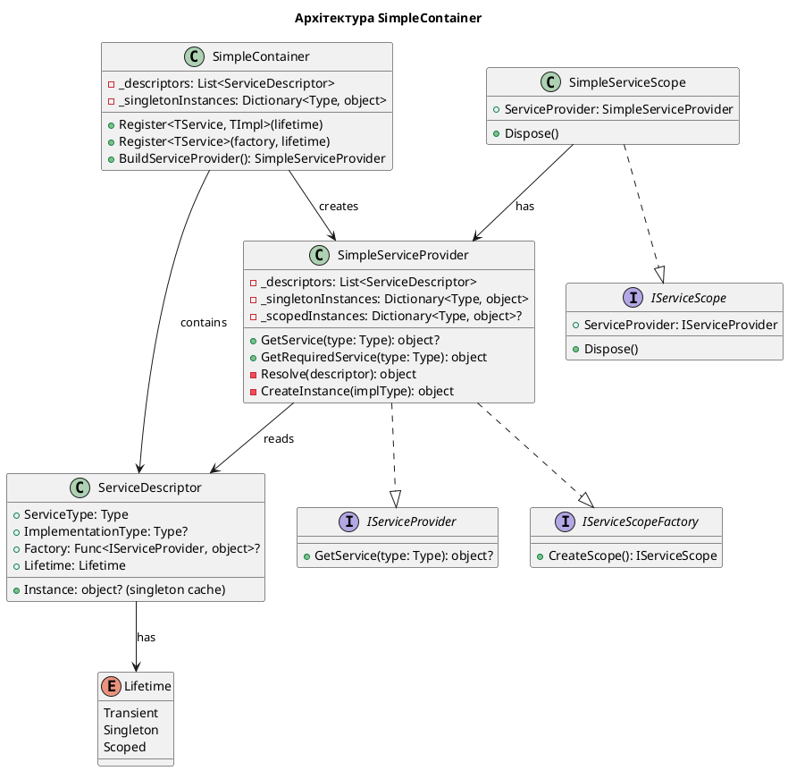

# Будуємо власний Service Container

## Вступ: "Магія" — це просто рефлексія

Коли починаючий розробник вперше бачить код DI-контейнера:

```csharp
var builder = WebApplication.CreateBuilder(args);
builder.Services.AddScoped<IOrderRepository, SqlOrderRepository>();
builder.Services.AddScoped<OrderService>();

var app = builder.Build();
// ... і OrderService якимось чином САМ отримав всі свої залежності!
```

...в нього виникає цілком природне запитання: **"Як це працює?"** Відчуття магії. Але як і будь-яка "магія" у програмуванні — це просто добре написаний код.

У цій статті ми **побудуємо власний IoC контейнер з нуля**, крок за кроком, розбираючи кожен механізм. Після цього ви подивитесь на `IServiceCollection` та `IServiceProvider` зовсім іншими очима — очима людини, яка розуміє, що і чому відбувається.

::note
**Навіщо будувати власний, якщо є готовий?**

Це класичний педагогічний підхід: перш ніж їздити на автомобілі, механік повинен розібрати двигун. Власний контейнер буде спрощеним порівняно з Microsoft DI (відсутність деяких оптимізацій, перевірок тощо), але він відображатиме **ту ж архітектурну ідею**.
::

### Що ми побудуємо?

До кінця цієї статті у нас буде `SimpleContainer` — мінімальний, але повністю функціональний IoC контейнер, який підтримує:

- ✅ Реєстрацію типів (Interface → Implementation)
- ✅ Автоматичний Resolve залежностей через рефлексію
- ✅ Transient lifestyle (новий об'єкт на кожен запит)
- ✅ Singleton lifestyle (єдиний об'єкт на весь час роботи)
- ✅ Scoped lifestyle (єдиний об'єкт у межах scope)
- ✅ Реєстрацію через factory-функцію
- ✅ Базовий `IDisposable` support

### Архітектура нашого контейнера

::plant-uml



::

---

## Крок 1: Базові структури даних

### 1.1. Enum Lifetime

Перш за все, нам потрібен перелік можливих "термінів служби" об'єктів:

```csharp showLineNumbers
// Lifetime.cs
namespace SimpleIoC;

/// <summary>
/// Визначає, як довго живе екземпляр зареєстрованого сервісу.
/// </summary>
public enum Lifetime
{
    /// <summary>
    /// Новий екземпляр при кожному запиті.
    /// Аналогія: одноразовий стаканчик — використав та викинув.
    /// </summary>
    Transient,

    /// <summary>
    /// Єдиний екземпляр на весь час роботи контейнера.
    /// Аналогія: принтер в офісі — один на всіх.
    /// </summary>
    Singleton,

    /// <summary>
    /// Єдиний екземпляр у межах поточного scope.
    /// Аналогія: ваш особистий стілець на роботі — ваш на весь день,
    /// але новий день — це новий "scope" і потенційно інший стілець.
    /// </summary>
    Scoped
}
```

### 1.2. ServiceDescriptor — серце реєстрації

**`ServiceDescriptor`** — це запис у "книзі рецептів" контейнера. Він зберігає відповідь на питання "коли хтось просить `IEmailService` — що саме дати і як це створити?":

```csharp showLineNumbers
// ServiceDescriptor.cs
namespace SimpleIoC;

/// <summary>
/// Опис зареєстрованого сервісу — "рецепт" для контейнера.
/// </summary>
public class ServiceDescriptor
{
    /// <summary>
    /// Тип, який "запитують" (зазвичай інтерфейс).
    /// Наприклад: IEmailService
    /// </summary>
    public Type ServiceType { get; }

    /// <summary>
    /// Конкретний тип, що реалізує ServiceType.
    /// Наприклад: SmtpEmailService
    /// Може бути null, якщо використовується Factory.
    /// </summary>
    public Type? ImplementationType { get; }

    /// <summary>
    /// Фабрична функція для створення екземпляра.
    /// Альтернатива ImplementationType — коли потрібна складна логіка ініціалізації.
    /// </summary>
    public Func<IServiceProvider, object>? Factory { get; }

    /// <summary>
    /// Термін служби сервісу.
    /// </summary>
    public Lifetime Lifetime { get; }

    /// <summary>
    /// Кешований Singleton-екземпляр (заповнюється при першому resolve).
    /// </summary>
    internal object? SingletonInstance { get; set; }

    // --- Конструктори ---

    /// <summary>
    /// Реєстрація через типи (Interface + Implementation).
    /// </summary>
    public ServiceDescriptor(Type serviceType, Type implementationType, Lifetime lifetime)
    {
        ServiceType = serviceType;
        ImplementationType = implementationType;
        Lifetime = lifetime;
    }

    /// <summary>
    /// Реєстрація через factory-функцію.
    /// </summary>
    public ServiceDescriptor(Type serviceType, Func<IServiceProvider, object> factory, Lifetime lifetime)
    {
        ServiceType = serviceType;
        Factory = factory;
        Lifetime = lifetime;
    }

    /// <summary>
    /// Реєстрація готового Singleton-екземпляра.
    /// </summary>
    public ServiceDescriptor(Type serviceType, object instance)
    {
        ServiceType = serviceType;
        SingletonInstance = instance;
        Lifetime = Lifetime.Singleton;
    }

    public override string ToString()
        => $"{Lifetime}: {ServiceType.Name} → {ImplementationType?.Name ?? "Factory"}";
}
```

**Розбір ключових частин:**

- `ServiceType` — це "ключ" у нашому реєстрі. За цим типом будуть шукати сервіс.
- `ImplementationType` — "значення" — конкретний клас, який треба створити через `new` (але через Reflection).
- `Factory` — альтернатива ImplementationType. Коли нам потрібен кастомний код ініціалізації.
- `SingletonInstance` — кеш для Singleton: після першого створення — зберігаємо тут.

---

## Крок 2: SimpleContainer — збирач рецептів

**`SimpleContainer`** — це місце, де ви "реєструєте рецепти". Він не створює об'єктів сам — він лише зберігає `ServiceDescriptor`-и та вміє з них будувати `ServiceProvider`.

```csharp showLineNumbers
// SimpleContainer.cs
namespace SimpleIoC;

/// <summary>
/// Будівник IoC контейнера. Аналог IServiceCollection з Microsoft DI.
/// Збирає реєстрації та будує IServiceProvider.
/// </summary>
public class SimpleContainer
{
    // Список усіх зареєстрованих "рецептів"
    private readonly List<ServiceDescriptor> _descriptors = new();

    // -------------------------------------------------------------------------
    // Методи реєстрації
    // -------------------------------------------------------------------------

    /// <summary>
    /// Реєструє сервіс через типи: "коли хтось хоче TService — дай TImplementation"
    /// </summary>
    public SimpleContainer Register<TService, TImplementation>(Lifetime lifetime = Lifetime.Transient)
        where TImplementation : TService
    {
        _descriptors.Add(new ServiceDescriptor(
            typeof(TService),
            typeof(TImplementation),
            lifetime
        ));
        return this; // Fluent API
    }

    /// <summary>
    /// Реєструє сервіс через factory-функцію.
    /// Корисно, коли потрібна складна логіка ініціалізації.
    /// </summary>
    public SimpleContainer Register<TService>(
        Func<IServiceProvider, TService> factory,
        Lifetime lifetime = Lifetime.Transient)
        where TService : class
    {
        _descriptors.Add(new ServiceDescriptor(
            typeof(TService),
            sp => factory(sp)!,
            lifetime
        ));
        return this;
    }

    /// <summary>
    /// Реєструє готовий Singleton-екземпляр.
    /// </summary>
    public SimpleContainer RegisterSingleton<TService>(TService instance)
        where TService : class
    {
        var descriptor = new ServiceDescriptor(typeof(TService), instance);
        _descriptors.Add(descriptor);
        return this;
    }

    // -------------------------------------------------------------------------
    // Shortcut методи (як AddTransient, AddScoped, AddSingleton у Microsoft DI)
    // -------------------------------------------------------------------------

    public SimpleContainer AddTransient<TService, TImplementation>()
        where TImplementation : TService
        => Register<TService, TImplementation>(Lifetime.Transient);

    public SimpleContainer AddScoped<TService, TImplementation>()
        where TImplementation : TService
        => Register<TService, TImplementation>(Lifetime.Scoped);

    public SimpleContainer AddSingleton<TService, TImplementation>()
        where TImplementation : TService
        => Register<TService, TImplementation>(Lifetime.Singleton);

    // -------------------------------------------------------------------------
    // Побудова ServiceProvider
    // -------------------------------------------------------------------------

    /// <summary>
    /// Фіналізує конфігурацію і будує ServiceProvider.
    /// Після виклику цього методу список реєстрацій стає незмінним.
    /// </summary>
    public SimpleServiceProvider BuildServiceProvider()
    {
        // Передаємо копію списку, щоб подальші зміни контейнера не впливали на provider
        return new SimpleServiceProvider(_descriptors.AsReadOnly());
    }
}
```

**Зверніть увагу на Fluent API** — кожен метод повертає `this`, що дозволяє ланцюжкові виклики:

```csharp
var container = new SimpleContainer()
    .AddSingleton<ILogger, ConsoleLogger>()
    .AddScoped<IOrderRepository, SqlOrderRepository>()
    .AddTransient<IEmailService, SmtpEmailService>()
    .AddScoped<OrderService, OrderService>();

var provider = container.BuildServiceProvider();
```

---

## Крок 3: SimpleServiceProvider — серце контейнера

Це найцікавіша та найважливіша частина. **`SimpleServiceProvider`** — це та сама "магія", яка автоматично знаходить та створує залежності.

### 3.1. Базова структура

```csharp showLineNumbers
// SimpleServiceProvider.cs
namespace SimpleIoC;

using System.Collections.ObjectModel;
using System.Reflection;

/// <summary>
/// Провайдер сервісів — об'єкт, що вирішує (resolve) залежності.
/// Аналог IServiceProvider з Microsoft DI.
/// </summary>
public class SimpleServiceProvider : IServiceProvider, IServiceScopeFactory, IDisposable
{
    private readonly ReadOnlyCollection<ServiceDescriptor> _descriptors;

    // Кеш Singleton-екземплярів (SHARED між усіма scope*!)
    // (*У нашому спрощеному варіанті singleton зберігається у root provider)
    private readonly Dictionary<Type, object> _singletonCache = new();

    // Кеш Scoped-екземплярів (УНІКАЛЬНИЙ для кожного scope)
    // null = це root provider (не scope)
    private readonly Dictionary<Type, object>? _scopedCache;

    // Прапорець, що вказує чи це "scoped" провайдер (дочірній scope)
    private readonly bool _isScope;

    // Список IDisposable об'єктів, які цей provider повинен знищити при dispose
    private readonly List<IDisposable> _disposables = new();

    private bool _disposed;

    // Конструктор для root provider
    public SimpleServiceProvider(ReadOnlyCollection<ServiceDescriptor> descriptors)
    {
        _descriptors = descriptors;
        _isScope = false;
    }

    // Конструктор для дочірнього scope
    private SimpleServiceProvider(
        ReadOnlyCollection<ServiceDescriptor> descriptors,
        Dictionary<Type, object> singletonCache)
    {
        _descriptors = descriptors;
        _singletonCache = singletonCache;
        _scopedCache = new Dictionary<Type, object>(); // Окремий кеш для scoped
        _isScope = true;
    }

    // --- IServiceScopeFactory ---
    public IServiceScope CreateScope()
    {
        var scopedProvider = new SimpleServiceProvider(_descriptors, _singletonCache);
        return new SimpleServiceScope(scopedProvider);
    }
}
```

### 3.2. GetService — головний метод

Ось де починається справжня "магія":

```csharp showLineNumbers
// (продовження SimpleServiceProvider.cs)

/// <summary>
/// Вирішує (resolve) залежність для заданого типу.
/// Якщо тип не зареєстровано — повертає null.
/// </summary>
public object? GetService(Type serviceType)
{
    if (_disposed)
        throw new ObjectDisposedException(nameof(SimpleServiceProvider));

    // Особливий випадок: хтось хоче отримати сам IServiceProvider або IServiceScopeFactory
    if (serviceType == typeof(IServiceProvider))
        return this;
    if (serviceType == typeof(IServiceScopeFactory))
        return this;

    // Шукаємо дескриптор для запитуваного типу
    // Якщо зареєстровано кілька — беремо ОСТАННІЙ (як у Microsoft DI)
    var descriptor = _descriptors.LastOrDefault(d => d.ServiceType == serviceType);

    if (descriptor == null)
        return null; // Сервіс не зареєстрований

    return Resolve(descriptor);
}

/// <summary>
/// Аналог GetRequiredService — кидає exception якщо сервіс не знайдено.
/// </summary>
public object GetRequiredService(Type serviceType)
{
    var service = GetService(serviceType);
    if (service == null)
        throw new InvalidOperationException(
            $"❌ Сервіс типу '{serviceType.FullName}' не зареєстровано в контейнері. " +
            $"Переконайтесь, що ви додали реєстрацію: container.Register<{serviceType.Name}, ...>()");

    return service;
}

// Generic версія для зручності
public T GetRequiredService<T>() => (T)GetRequiredService(typeof(T));
public T? GetService<T>() => (T?)GetService(typeof(T));
```

### 3.3. Resolve — логіка lifecycle

```csharp showLineNumbers
// (продовження SimpleServiceProvider.cs)

/// <summary>
/// Фактично створює або повертає кешований екземпляр сервісу,
/// відповідно до його Lifetime.
/// </summary>
private object Resolve(ServiceDescriptor descriptor)
{
    switch (descriptor.Lifetime)
    {
        case Lifetime.Singleton:
            return ResolveSingleton(descriptor);

        case Lifetime.Scoped:
            return ResolveScoped(descriptor);

        case Lifetime.Transient:
        default:
            // Transient: завжди новий екземпляр — без кешування
            var instance = CreateInstance(descriptor);
            TrackDisposable(instance); // Відстежуємо для Dispose
            return instance;
    }
}

private object ResolveSingleton(ServiceDescriptor descriptor)
{
    // Перевіряємо кеш Singleton (він спільний для всіх scope)
    if (_singletonCache.TryGetValue(descriptor.ServiceType, out var cached))
        return cached;

    // Якщо в кеші немає — перевіряємо поле SingletonInstance (pre-created instance)
    if (descriptor.SingletonInstance != null)
    {
        _singletonCache[descriptor.ServiceType] = descriptor.SingletonInstance;
        return descriptor.SingletonInstance;
    }

    // Створюємо новий та кешуємо
    var instance = CreateInstance(descriptor);
    _singletonCache[descriptor.ServiceType] = instance;

    // ВАЖЛИВО: Singleton Disposables знищуються ТІЛЬКИ при знищенні root provider!
    if (instance is IDisposable disposable)
        _disposables.Add(disposable);

    return instance;
}

private object ResolveScoped(ServiceDescriptor descriptor)
{
    // Якщо це root provider (не scope) — створюємо як Transient
    // (або кидаємо exception — залежить від стратегії)
    if (_scopedCache == null)
    {
        // В Microsoft DI є перевірка ValidateScopes, яка кидає exception тут
        // Ми для простоти також кинемо:
        throw new InvalidOperationException(
            $"⚠️ Спроба отримати Scoped-сервіс '{descriptor.ServiceType.Name}' " +
            $"поза межами Scope. Використовуйте IServiceScopeFactory.CreateScope().");
    }

    // Перевіряємо scoped кеш
    if (_scopedCache.TryGetValue(descriptor.ServiceType, out var cached))
        return cached;

    // Створюємо та кешуємо в scoped кеш
    var instance = CreateInstance(descriptor);
    _scopedCache[descriptor.ServiceType] = instance;
    TrackDisposable(instance);

    return instance;
}

private void TrackDisposable(object instance)
{
    if (instance is IDisposable disposable)
        _disposables.Add(disposable);
}
```

### 3.4. CreateInstance — рефлексія в дії

**Це найважливіша частина!** Саме тут відбувається справжня магія — рефлексія автоматично вирішує граф залежностей:

```csharp showLineNumbers
// (продовження SimpleServiceProvider.cs)

/// <summary>
/// Створює екземпляр сервісу:
/// - Через Factory (якщо задано)
/// - Через рефлексію (інакше)
/// </summary>
private object CreateInstance(ServiceDescriptor descriptor)
{
    // Якщо задано factory — використовуємо її
    if (descriptor.Factory != null)
        return descriptor.Factory(this);

    // Інакше — через рефлексію
    if (descriptor.ImplementationType == null)
        throw new InvalidOperationException(
            $"Не вдалося створити екземпляр для '{descriptor.ServiceType.Name}': " +
            "не задано ні ImplementationType, ні Factory.");

    return CreateInstanceViaReflection(descriptor.ImplementationType);
}

/// <summary>
/// Магія рефлексії: автоматично знаходить і передає всі залежності
/// у конструктор нашого класу.
///
/// Алгоритм:
/// 1. Беремо перший (найбільший) конструктор
/// 2. Дивимось на всі параметри конструктора
/// 3. Для кожного параметра — рекурсивно resolve його тип
/// 4. Викликаємо конструктор з отриманими залежностями
/// </summary>
private object CreateInstanceViaReflection(Type implementationType)
{
    // На стеку може бути circular dependency — добре б це перевіряти,
    // але для простоти ми цього не робимо тут (Microsoft DI перевіряє це)

    // Отримуємо всі публічні конструктори
    var constructors = implementationType.GetConstructors(BindingFlags.Public | BindingFlags.Instance);

    if (constructors.Length == 0)
        throw new InvalidOperationException(
            $"Клас '{implementationType.Name}' не має публічних конструкторів. " +
            "IoC контейнер не може створити його екземпляр.");

    // Вибираємо конструктор з найбільшою кількістю параметрів
    // (Microsoft DI використовує ту саму стратегію)
    var constructor = constructors.OrderByDescending(c => c.GetParameters().Length).First();

    // Отримуємо параметри конструктора
    var parameters = constructor.GetParameters();

    // Рекурсивно resolve кожен параметр
    var arguments = new object[parameters.Length];
    for (int i = 0; i < parameters.Length; i++)
    {
        var paramType = parameters[i].ParameterType;

        // Спробуємо знайти сервіс для цього типу параметра
        var service = GetService(paramType);

        if (service == null)
        {
            // Якщо параметр має значення за замовчуванням — використовуємо його
            if (parameters[i].HasDefaultValue)
            {
                arguments[i] = parameters[i].DefaultValue!;
            }
            else
            {
                throw new InvalidOperationException(
                    $"❌ Не вдалося resolve залежності '{paramType.Name}' " +
                    $"для класу '{implementationType.Name}'. " +
                    $"Переконайтесь, що '{paramType.Name}' зареєстровано в контейнері.");
            }
        }
        else
        {
            arguments[i] = service;
        }
    }

    // Викликаємо конструктор з усіма знайденими залежностями
    return constructor.Invoke(arguments);
}
```

**Ось як це працює крок за кроком:**

Уявімо такий граф залежностей:

```
OrderService(IOrderRepository repo, IEmailService email, ILogger logger)
                ↕                        ↕                  ↕
     SqlOrderRepository            SmtpEmailService    ConsoleLogger
     (IDbContext context)           (ISmtpConfig cfg)    (no deps)
                ↕                        ↕
          AppDbContext              SmtpConfig
          (no deps)                 (no deps)
```

При виклику `provider.GetRequiredService<OrderService>()`:

::steps

### 1. Знаходимо конструктор OrderService

Знаходимо: `OrderService(IOrderRepository, IEmailService, ILogger)`

### 2. Resolve першого параметра: IOrderRepository

Знаходимо `SqlOrderRepository`. Він залежить від `IDbContext`.

### 3. Рекурсивно resolve IDbContext

Знаходимо `AppDbContext`. Він залежностей не має. **Створюємо!**

### 4. Повертаємося вгору: створюємо SqlOrderRepository

Маємо `AppDbContext` — передаємо в конструктор. **Створюємо SqlOrderRepository!**

### 5. Resolve другого параметра: IEmailService

Аналогічно знаходимо SmtpEmailService(ISmtpConfig) → SmtpConfig(no deps). Рекурсія!

### 6. Resolve третього параметра: ILogger

ConsoleLogger не має залежностей. **Створюємо!**

### 7. Створюємо OrderService

Маємо всі залежності. **Викликаємо конструктор!**

::

---

## Крок 4: Scope — ізольований простір

Scoped lifetime вимагає концепції **Scope** — ізольованого простору, в якому scoped сервіси живуть і помирають разом.

```csharp showLineNumbers
// SimpleServiceScope.cs
namespace SimpleIoC;

/// <summary>
/// Scope — ізольований простір виконання.
/// В ASP.NET Core один HTTP-запит = один scope.
/// При завершенні scope знищуються всі Scoped-сервіси.
/// </summary>
public class SimpleServiceScope : IServiceScope, IDisposable
{
    public IServiceProvider ServiceProvider { get; }

    private bool _disposed;

    public SimpleServiceScope(SimpleServiceProvider scopedProvider)
    {
        ServiceProvider = scopedProvider;
    }

    public void Dispose()
    {
        if (_disposed) return;
        _disposed = true;

        // При завершенні scope — знищуємо scoped provider,
        // що в свою чергу знищить всі Scoped та Transient IDisposable сервіси
        if (ServiceProvider is IDisposable disposable)
            disposable.Dispose();
    }
}
```

### IDispose у SimpleServiceProvider

```csharp showLineNumbers
// (продовження SimpleServiceProvider.cs)

public void Dispose()
{
    if (_disposed) return;
    _disposed = true;

    // Знищуємо всі відстежені IDisposable об'єкти у правильному порядку
    // (зворотній до порядку створення — як і в Microsoft DI)
    for (int i = _disposables.Count - 1; i >= 0; i--)
    {
        _disposables[i].Dispose();
    }

    _disposables.Clear();

    // Якщо це root provider — також очищаємо singleton кеш
    if (!_isScope)
    {
        foreach (var singleton in _singletonCache.Values)
        {
            if (singleton is IDisposable d)
                d.Dispose();
        }
        _singletonCache.Clear();
    }
}
```

---

## Крок 5: Збираємо все разом

Подивимось на повний приклад використання нашого контейнера:

```csharp showLineNumbers
// Приклад використання SimpleContainer

// --- Визначення інтерфейсів та класів ---

public interface ILogger
{
    void Log(string message);
}

public interface IOrderRepository
{
    void Save(string order);
}

public interface IEmailService
{
    void Send(string to, string body);
}

// Реалізації
public class ConsoleLogger : ILogger, IDisposable
{
    private readonly string _prefix;

    public ConsoleLogger()
    {
        _prefix = "[LOG]";
        Console.WriteLine("ConsoleLogger created");
    }

    public void Log(string message) => Console.WriteLine($"{_prefix} {message}");

    public void Dispose()
    {
        Console.WriteLine("ConsoleLogger disposed");
    }
}

public class InMemoryOrderRepository : IOrderRepository
{
    private readonly ILogger _logger;
    private readonly List<string> _orders = new();

    public InMemoryOrderRepository(ILogger logger)
    {
        _logger = logger;
        _logger.Log("InMemoryOrderRepository created");
    }

    public void Save(string order)
    {
        _orders.Add(order);
        _logger.Log($"Order saved: {order}. Total orders: {_orders.Count}");
    }
}

public class SmtpEmailService : IEmailService
{
    private readonly ILogger _logger;

    public SmtpEmailService(ILogger logger)
    {
        _logger = logger;
        _logger.Log("SmtpEmailService created");
    }

    public void Send(string to, string body)
    {
        _logger.Log($"Email sent to {to}: {body}");
    }
}

public class OrderService
{
    private readonly IOrderRepository _repository;
    private readonly IEmailService _emailService;
    private readonly ILogger _logger;

    public OrderService(IOrderRepository repository, IEmailService emailService, ILogger logger)
    {
        _repository = repository;
        _emailService = emailService;
        _logger = logger;
        _logger.Log("OrderService created");
    }

    public void PlaceOrder(string customerEmail, string orderDetails)
    {
        _repository.Save(orderDetails);
        _emailService.Send(customerEmail, $"Замовлення прийнято: {orderDetails}");
        _logger.Log($"Order placed for {customerEmail}");
    }
}

// --- Використання контейнера ---

Console.WriteLine("=== Будуємо контейнер ===");
var container = new SimpleContainer()
    .AddSingleton<ILogger, ConsoleLogger>()      // Один для всіх!
    .AddScoped<IOrderRepository, InMemoryOrderRepository>()
    .AddScoped<IEmailService, SmtpEmailService>()
    .AddScoped<OrderService, OrderService>();

var rootProvider = container.BuildServiceProvider();

Console.WriteLine("\n=== Scope 1 (HTTP Request 1) ===");
using (var scope1 = rootProvider.CreateScope())
{
    var orderService1 = scope1.ServiceProvider.GetRequiredService<OrderService>();
    orderService1.PlaceOrder("alice@example.com", "MacBook Pro");

    // Отримуємо ще раз — той самий екземпляр (Scoped!)
    var orderService1Again = scope1.ServiceProvider.GetRequiredService<OrderService>();
    Console.WriteLine($"Той самий OrderService? {ReferenceEquals(orderService1, orderService1Again)}"); // True!
} // Scope закривається — Scoped сервіси знищуються

Console.WriteLine("\n=== Scope 2 (HTTP Request 2) ===");
using (var scope2 = rootProvider.CreateScope())
{
    var orderService2 = scope2.ServiceProvider.GetRequiredService<OrderService>();
    orderService2.PlaceOrder("bob@example.com", "iPhone 16");
    // Новий OrderService! Але Logger — той самий Singleton
}

Console.WriteLine("\n=== Знищуємо root provider ===");
rootProvider.Dispose(); // ConsoleLogger (singleton) знищується тут
```

**Очікуваний вивід:**

```
=== Будуємо контейнер ===

=== Scope 1 (HTTP Request 1) ===
ConsoleLogger created          ← Singleton: створено при першому виклику
InMemoryOrderRepository created
SmtpEmailService created
OrderService created
Order saved: MacBook Pro. Total orders: 1
Email sent to alice@example.com: Замовлення прийнято: MacBook Pro
Order placed for alice@example.com
Той самий OrderService? True

=== Scope 2 (HTTP Request 2) ===
InMemoryOrderRepository created  ← Новий scope! Нові Scoped сервіси
SmtpEmailService created
OrderService created
Order saved: iPhone 16. Total orders: 1   ← Новий репозиторій = лічильник з 0!
Email sent to bob@example.com: Замовлення прийнято: iPhone 16
Order placed for bob@example.com

=== Знищуємо root provider ===
ConsoleLogger disposed             ← Singleton знищується з root provider
```

---

## Крок 6: Порівняння з Microsoft DI

Тепер подивимось, як наш контейнер відповідає реальному `Microsoft.Extensions.DependencyInjection`:

| Наш контейнер | Microsoft DI | Пояснення |
|---|---|---|
| `SimpleContainer` | `IServiceCollection` | Реєстратор (колекція ServiceDescriptor) |
| `SimpleServiceProvider` | `ServiceProvider` | Provider (resolver) |
| `SimpleServiceScope` | `IServiceScope` | Scope |
| `.Register<TS, TI>()` | `.AddScoped<TS, TI>()` | Реєстрація сервісу |
| `.BuildServiceProvider()` | `.BuildServiceProvider()` | Той же метод! |
| `GetService<T>()` | `GetService<T>()` | Той же метод! |
| `GetRequiredService<T>()` | `GetRequiredService<T>()` | Той же метод! |
| `CreateScope()` | `CreateScope()` | Той же метод! |

**Що є в Microsoft DI, чого немає в нашому:**

- **Производительність**: Microsoft використовує скомпільовані expression trees замість рефлексії (у 10-50x швидше)
- **ValidateOnBuild**: Перевірка циклічних залежностей та Captive Dependency при старті
- **ValidateScopes**: Виявлення спроб отримати Scoped-сервіс з Singleton
- **Декоратори**: підтримка через Scrutor та інші розширення
- **Умовна реєстрація**: `TryAdd*` методи
- **Множинна реєстрація**: `GetServices<T>()` повертає всі реалізації

::tip
Повну версію коду нашого `SimpleContainer` можна знайти на GitHub [тут](https://github.com/example/simple-ioc-container). Рекомендуємо запустити та погратися з прикладами!
::

---

## Крок 7: Розширюємо — Factory та Open Generics

### 7.1. Factory-реєстрація для складних випадків

```csharp showLineNumbers
// Іноді нам потрібно складніше ніж просто "new"
var container = new SimpleContainer()
    .AddSingleton<ILogger, ConsoleLogger>()

    // Factory: потрібен доступ до інших сервісів при ініціалізації
    .Register<IEmailService>(sp =>
    {
        var logger = sp.GetRequiredService<ILogger>();
        var smtpHost = Environment.GetEnvironmentVariable("SMTP_HOST") ?? "localhost";
        var smtpPort = int.Parse(Environment.GetEnvironmentVariable("SMTP_PORT") ?? "587");

        logger.Log($"Creating SmtpEmailService with host: {smtpHost}:{smtpPort}");
        return new SmtpEmailService(smtpHost, smtpPort, logger);
    }, Lifetime.Scoped);
```

### 7.2. Open Generics (спрощена реалізація)

Microsoft DI підтримує реєстрацію open generic types:

```csharp
// Microsoft DI
services.AddScoped(typeof(IRepository<>), typeof(EfRepository<>));
// Тепер IRepository<User>, IRepository<Order>, тощо — всі вирішуються автоматично!
```

Наш спрощений контейнер можна розширити для підтримки open generics:

```csharp showLineNumbers
// Розширення GetService для підтримки open generics
public object? GetService(Type serviceType)
{
    // ... попередній код ...

    // Спроба знайти open generic реєстрацію
    if (serviceType.IsGenericType)
    {
        var genericDef = serviceType.GetGenericTypeDefinition();
        var openGenericDescriptor = _descriptors
            .LastOrDefault(d => d.ServiceType == genericDef);

        if (openGenericDescriptor != null)
        {
            // Визначаємо конкретний тип з generic аргументів
            var typeArgs = serviceType.GetGenericArguments();
            var concreteType = openGenericDescriptor.ImplementationType!
                .MakeGenericType(typeArgs);

            var closedDescriptor = new ServiceDescriptor(
                serviceType,
                concreteType,
                openGenericDescriptor.Lifetime);

            return Resolve(closedDescriptor);
        }
    }

    return null;
}
```

---

## Повна структура файлів проєкту

::code-tree

```csharp [SimpleIoC/Lifetime.cs]
namespace SimpleIoC;

public enum Lifetime { Transient, Singleton, Scoped }
```

```csharp [SimpleIoC/ServiceDescriptor.cs]
namespace SimpleIoC;

public class ServiceDescriptor
{
    public Type ServiceType { get; }
    public Type? ImplementationType { get; }
    public Func<IServiceProvider, object>? Factory { get; }
    public Lifetime Lifetime { get; }
    internal object? SingletonInstance { get; set; }

    public ServiceDescriptor(Type svcType, Type implType, Lifetime lifetime)
    {
        ServiceType = svcType;
        ImplementationType = implType;
        Lifetime = lifetime;
    }

    public ServiceDescriptor(Type svcType, Func<IServiceProvider, object> factory, Lifetime lifetime)
    {
        ServiceType = svcType;
        Factory = factory;
        Lifetime = lifetime;
    }

    public ServiceDescriptor(Type svcType, object instance)
    {
        ServiceType = svcType;
        SingletonInstance = instance;
        Lifetime = Lifetime.Singleton;
    }
}
```

```csharp [SimpleIoC/SimpleContainer.cs]
namespace SimpleIoC;

public class SimpleContainer
{
    private readonly List<ServiceDescriptor> _descriptors = new();

    public SimpleContainer Register<TService, TImpl>(Lifetime lifetime = Lifetime.Transient)
        where TImpl : TService
    {
        _descriptors.Add(new ServiceDescriptor(typeof(TService), typeof(TImpl), lifetime));
        return this;
    }

    public SimpleContainer AddTransient<TS, TI>() where TI : TS
        => Register<TS, TI>(Lifetime.Transient);

    public SimpleContainer AddScoped<TS, TI>() where TI : TS
        => Register<TS, TI>(Lifetime.Scoped);

    public SimpleContainer AddSingleton<TS, TI>() where TI : TS
        => Register<TS, TI>(Lifetime.Singleton);

    public SimpleServiceProvider BuildServiceProvider()
        => new SimpleServiceProvider(_descriptors.AsReadOnly());
}
```

```csharp [SimpleIoC/SimpleServiceScope.cs]
namespace SimpleIoC;

public class SimpleServiceScope : IServiceScope, IDisposable
{
    public IServiceProvider ServiceProvider { get; }
    private bool _disposed;

    public SimpleServiceScope(SimpleServiceProvider provider)
    {
        ServiceProvider = provider;
    }

    public void Dispose()
    {
        if (_disposed) return;
        _disposed = true;
        (ServiceProvider as IDisposable)?.Dispose();
    }
}
```

::

---

## Підсумок

Ми побудували повноцінний IoC контейнер! Ключові речі, які ви тепер знаєте:

1. **ServiceDescriptor** — це запис у реєстрі. Він описує "рецепт" для кожного типу.
2. **Рефлексія** дозволяє автоматично знаходити конструктори та їх параметри — це і є "магія" resolve.
3. **Lifetime** визначає стратегію кешування: Transient = без кешу, Singleton = глобальний кеш, Scoped = кеш у межах scope.
4. **Scope** — це ізольований контейнер із власним кешем scoped-сервісів.
5. **Composition Root** — єдине місце, де відбувається реєстрація та `BuildServiceProvider()`.

Тепер ви готові глибоко зрозуміти та ефективно використовувати реальний Microsoft DI!

::card-group

::card{title="Service Locator паттерн →" icon="i-heroicons-magnifying-glass" to="./03.service-locator-pattern"}
Дізнайтеся про альтернативний підхід — коли він виправданий і чому він вважається анти-паттерном.
::

::card{title="DI паттерни введення →" icon="i-heroicons-arrow-down-tray" to="./04.dependency-injection-patterns"}
Три способи впровадження залежностей: Constructor, Property та Method Injection.
::

::

---

## 📝 Завдання

### Завдання 1: Розширення (Medium)

Додайте до `SimpleContainer` наступні можливості:

1. **`TryAddSingleton<TS, TI>()`** — реєструє сервіс, лише якщо він ще не зареєстрований (аналог `services.TryAddSingleton<>()` у Microsoft DI).
2. **`GetServices<T>()`** — повертає всі зареєстровані реалізації для типу `T` (аналог `GetServices<>()` у Microsoft DI).

### Завдання 2: Виявлення циклічних залежностей (Hard)

Модифікуйте `CreateInstanceViaReflection`, щоб він виявляв **циклічні залежності** (A→B→A) і кидав зрозумілий виняток, а не переповнення стека (`StackOverflowException`).

**Підказка**: Використовуйте `HashSet<Type>` для відстеження типів у поточному стеку resolve.

### Завдання 3: Порівняння продуктивності (Hard)

Напишіть benchmark з **BenchmarkDotNet**, що порівнює:

1. Ручне `new OrderService(new SqlOrderRepository(new AppDbContext()), new SmtpEmailService(new ConsoleLogger()), new ConsoleLogger())`
2. Ваш `SimpleContainer` з рефлексією
3. `Microsoft.Extensions.DependencyInjection`

Зробіть висновок: наскільки рефлексія повільніша за `new`?
