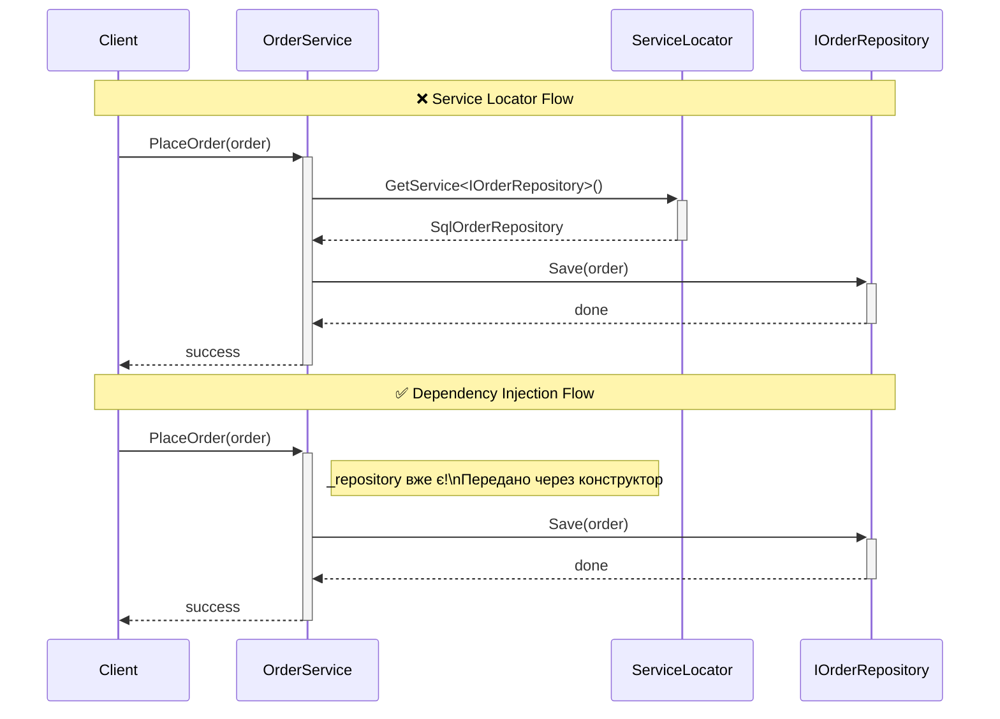

# Service Locator: Паттерн та Анти-паттерн

## Вступ: Ринок vs Доставка додому

Уявіть два способи отримати свіжі овочі:

**Спосіб 1 — Ринок (Service Locator):** Ви самі йдете на ринок, самі знаходите потрібний лоток, самі запитуєте що є і самі несете додому. Ринок (локатор) знає де знайти все. Але це **ваш клопіт**: піти, знайти, перевірити наявність.

**Спосіб 2 — Доставка (Dependency Injection):** Ви кажете кур'єру: "Принеси 1 кг помідорів і 500 г моркви". Кур'єр сам знаходить, купує і привозить. Ви просто описали потребу — все інше зробили за вас.

У програмуванні це ключова різниця між Service Locator та Dependency Injection. Обидва вирішують одну проблему — **управління залежностями** — але принципово по-різному.

---

## Частина 1: Що таке Service Locator?

### 1.1. Визначення та Контекст

**Service Locator** — це паттерн, при якому класи отримують залежності, **запросивши їх у централізованому реєстрі**, замість отримання їх ззовні.

Паттерн популяризував Мартін Фаулер у 2004 р. — і одночасно пояснив, чому Dependency Injection є кращою альтернативою. Хронологічно Service Locator з'явився **раніше** DI-контейнерів і був реальним покращенням порівняно з `new SomeService()` у кожному класі.

### 1.2. Реалізація класичного Service Locator

```csharp showLineNumbers
// ServiceLocator.cs
public class ServiceLocator
{
    private static ServiceLocator? _instance;
    private static readonly object _lock = new();

    private readonly Dictionary<Type, Func<object>> _registrations = new();
    private readonly Dictionary<Type, object> _singletonCache = new();

    /// <summary>
    /// Глобальна точка доступу. Ця "зручність" і є корінням проблем!
    /// </summary>
    public static ServiceLocator Current
    {
        get
        {
            if (_instance == null)
                lock (_lock) { _instance ??= new ServiceLocator(); }
            return _instance!;
        }
    }

    private ServiceLocator() { }

    public void Register<TService>(Func<TService> factory) where TService : class
        => _registrations[typeof(TService)] = () => factory();

    public void RegisterSingleton<TService>(Func<TService> factory) where TService : class
    {
        _registrations[typeof(TService)] = () =>
        {
            var type = typeof(TService);
            if (!_singletonCache.TryGetValue(type, out var cached))
            {
                cached = factory()!;
                _singletonCache[type] = cached;
            }
            return cached;
        };
    }

    public void RegisterInstance<TService>(TService instance) where TService : class
    {
        _singletonCache[typeof(TService)] = instance;
        _registrations[typeof(TService)] = () => instance;
    }

    public TService GetService<TService>() where TService : class
    {
        if (_registrations.TryGetValue(typeof(TService), out var factory))
            return (TService)factory();

        throw new InvalidOperationException(
            $"Сервіс '{typeof(TService).Name}' не зареєстровано у ServiceLocator.");
    }

    public TService? TryGetService<TService>() where TService : class
    {
        if (_registrations.TryGetValue(typeof(TService), out var factory))
            return (TService?)factory();
        return null;
    }

    public static void Reset() { lock (_lock) { _instance = null; } }
}
```

### 1.3. Використання Service Locator

```csharp showLineNumbers
// Bootstrap: ініціалізація реєстрів
var locator = ServiceLocator.Current;
locator.RegisterSingleton<ILogger>(() => new ConsoleLogger());
locator.Register<IOrderRepository>(() => new SqlOrderRepository(connectionString));
locator.Register<IEmailService>(() => new SmtpEmailService(smtpHost));

// OrderService — звертається до локатора самостійно
public class OrderService
{
    // ❗ Конструктор ПОРОЖНІЙ — але клас насправді залежить від 3+ речей!
    public OrderService() { }

    public void PlaceOrder(Order order)
    {
        // Клас сам "іде на ринок" за залежностями
        var repository = ServiceLocator.Current.GetService<IOrderRepository>();
        var emailService = ServiceLocator.Current.GetService<IEmailService>();
        var logger = ServiceLocator.Current.GetService<ILogger>();

        logger.Log($"Placing order {order.Id}");
        repository.Save(order);
        emailService.Send(order.CustomerEmail, "Замовлення прийнято!");
    }
}
```

---

## Частина 2: Проблеми Service Locator

### 2.1. Приховані залежності (Головна проблема)

Коли клас використовує DI — його залежності **явні та видимі** у конструкторі. Коли використовує Service Locator — **приховані всередині методів**:

```csharp
// ❌ Service Locator: залежності ПРИХОВАНІ
public class OrderService
{
    public OrderService() { } // Здається, що залежностей немає — це БРЕХНЯ!

    public void PlaceOrder(Order order)
    {
        var repository = ServiceLocator.Current.GetService<IOrderRepository>(); // Залежність 1
        var emailService = ServiceLocator.Current.GetService<IEmailService>();  // Залежність 2
        var logger = ServiceLocator.Current.GetService<ILogger>();              // Залежність 3
        // А може бути ще в інших методах!
    }

    public void CancelOrder(Order order)
    {
        var paymentGateway = ServiceLocator.Current.GetService<IPaymentGateway>(); // Залежність 4
        var notifications = ServiceLocator.Current.GetService<INotificationService>(); // 5...
    }
}

// ✅ DI: залежності ЯВНІ
public class OrderService
{
    public OrderService(            // Одного погляду достатньо!
        IOrderRepository repository,
        IEmailService emailService,
        ILogger logger)
    { /* ... */ }
}
```

**Наслідки прихованих залежностей:**
- Неможливо зрозуміти потреби класу, лише дивлячись на конструктор
- Незрозуміло, які сервіси треба зареєструвати в локаторі
- Документація API стає неповною

::caution
**Порушення "Мінімального здивування"**: Програміст, що бачить `new OrderService()`, думає, що клас не має зовнішніх залежностей. Він буде здивований, коли програма впаде з помилкою "сервіс не зареєстровано" вже **після** старту.
::

### 2.2. Ускладнення тестування

```csharp showLineNumbers
// ❌ Тест з Service Locator — маємо глобальний стан!
[TestClass]
public class OrderServiceTests
{
    [TestInitialize]
    public void Setup()
    {
        // КОЖЕН тест повинен налаштувати весь ServiceLocator!
        ServiceLocator.Reset();
        var locator = ServiceLocator.Current;
        locator.Register<IOrderRepository>(() => new FakeOrderRepository());
        locator.Register<IEmailService>(() => new FakeEmailService());
        locator.Register<ILogger>(() => new FakeLogger());
        // Якщо забудемо щось — дізнаємось тільки при запуску!
    }

    [TestCleanup]
    public void Cleanup()
    {
        ServiceLocator.Reset(); // Без цього ізоляція між тестами порушена!
    }

    [TestMethod]
    public void PlaceOrder_ShouldSaveOrder()
    {
        var service = new OrderService();
        service.PlaceOrder(new Order { Id = 1 });

        // Як дістати FakeOrderRepository? Через той самий локатор — незручно!
        var fakeRepo = (FakeOrderRepository)ServiceLocator.Current.GetService<IOrderRepository>();
        Assert.AreEqual(1, fakeRepo.SavedOrders.Count);
    }
}

// ✅ Тест з DI — ізольований і чистий
[TestClass]
public class OrderServiceTests
{
    [TestMethod]
    public void PlaceOrder_ShouldSaveOrder()
    {
        // Arrange: явно і зрозуміло
        var fakeRepo = new FakeOrderRepository();
        var service = new OrderService(fakeRepo, new FakeEmailService(), new FakeLogger());

        // Act
        service.PlaceOrder(new Order { Id = 1 });

        // Assert
        Assert.AreEqual(1, fakeRepo.SavedOrders.Count);
    }
    // Ніякого Setup/Cleanup!
}
```

### 2.3. Глобальний змінний стан

Класичний Service Locator — це **Singleton з глобальним станом**:
- Порушує ізоляцію між тестами
- Ускладнює паралельне виконання
- Приховує справжні залежності
- Помилки залежать від порядку викликів

### 2.4. Помилки виявляються під час виконання

```csharp
public void ProcessOrder(Order order)
{
    // Ця помилка виявиться ТІЛЬКИ коли метод буде викликаний
    var inventory = ServiceLocator.Current.GetService<IInventoryService>();
    // ← Якщо IInventoryService не зареєстровано — Exception в runtime!
}
```

З DI проблему видно ще при **старті** застосунку (якщо увімкнено `ValidateOnBuild`).

---

## Частина 3: Порівняльна таблиця

| Критерій | Dependency Injection | Service Locator |
|---|---|---|
| **Явність залежностей** | ✅ Конструктор | ❌ Приховані у методах |
| **Тестованість** | ✅ Легко — моки у конструктор | ⚠️ Складно — глобальний стан |
| **Виявлення помилок** | ✅ Compile-time або startup | ❌ Runtime |
| **Глобальний стан** | ✅ Відсутній | ❌ Singleton |
| **Ізоляція тестів** | ✅ Є | ❌ Потребує Reset |
| **Дотримання SOLID** | ✅ Повне | ⚠️ Часткове |
| **Legacy support** | ⚠️ Потребує планування | ✅ Легше додати поступово |

::mermaid



::

---

## Частина 4: Коли Service Locator ВИПРАВДАНИЙ

Незважаючи на критику, є ситуації де він прийнятний:

### 4.1. Legacy код (Strangler Fig Pattern)

У великому legacy-проєкті перехід на DI може зайняти місяці. Service Locator дозволяє рефакторити **поступово**:

```csharp
// Крок 1: Знімаємо hard-coded new через локатор
// Крок 2: Поступово переходимо на DI в нових класах

// "Перехідний" клас
public class OrderService
{
    public void PlaceOrder(Order order)
    {
        // Було: var repo = new SqlOrderRepository("...");
        var repo = ServiceLocator.Current.GetService<IOrderRepository>(); // Зараз
        // Стане: отримуємо через конструктор (у наступній ітерації)
        repo.Save(order);
    }
}
```

### 4.2. Framework та Middleware рівень

Деякі фреймворки вимагають використати ServiceProvider як локатор. Це виправдано на **інфраструктурному рівні**, не в бізнес-логіці:

```csharp
// Middleware — тут Service Locator виправданий
public class MyMiddleware
{
    private readonly RequestDelegate _next;
    public MyMiddleware(RequestDelegate next) { _next = next; }

    public async Task InvokeAsync(HttpContext context)
    {
        // context.RequestServices — фактично Service Locator, але це middleware!
        var dbContext = context.RequestServices.GetRequiredService<AppDbContext>();
        await _next(context);
    }
}
```

### 4.3. Динамічний вибір сервісу під час виконання

```csharp
// Вибір стратегії залежить від runtime-даних
public class PaymentProcessor
{
    private readonly IServiceProvider _serviceProvider;
    public PaymentProcessor(IServiceProvider sp) { _serviceProvider = sp; }

    public void Process(PaymentMethod method, decimal amount)
    {
        // Динамічний вибір — тут Service Locator допустимий
        IPaymentGateway gateway = method switch
        {
            PaymentMethod.Stripe => _serviceProvider.GetRequiredService<IStripeGateway>(),
            PaymentMethod.PayPal => _serviceProvider.GetRequiredService<IPayPalGateway>(),
            _ => throw new ArgumentException($"Unknown: {method}")
        };
        gateway.Charge(amount);
    }
}
```

::note
**Ale краща альтернатива** тут — паттерн **Factory**, де фабрика отримує всі варіанти через DI і вибирає потрібний. Це зберігає явність залежностей.
::

---

## Частина 5: IServiceProvider у Microsoft DI

Технічно `IServiceProvider` у Microsoft DI є Service Locator. Але є важлива відмінність:

```csharp
// ❌ АНТИПАТТЕРН: IServiceProvider у бізнес-логіці
public class OrderService
{
    private readonly IServiceProvider _sp;
    public OrderService(IServiceProvider sp) { _sp = sp; }

    public void PlaceOrder(Order order)
    {
        var repo = _sp.GetRequiredService<IOrderRepository>(); // Це Service Locator!
        repo.Save(order);
    }
}

// ✅ ПРАВИЛЬНО: IServiceProvider тільки у Composition Root
static void Main(string[] args)
{
    var services = new ServiceCollection();
    services.AddScoped<IOrderRepository, SqlOrderRepository>();
    services.AddScoped<OrderService>();

    var provider = services.BuildServiceProvider();

    // Тут — виправдано, це Composition Root
    using var scope = provider.CreateScope();
    var orderService = scope.ServiceProvider.GetRequiredService<OrderService>();
    orderService.PlaceOrder(new Order { /* ... */ });
}
```

**Правило**: `IServiceProvider` у Composition Root — нормально. `IServiceProvider` у бізнес-класах — Service Locator анти-паттерн.

---

## Підсумок

::card-group

::card{title="✅ Service Locator ПІДХОДИТЬ" icon="i-heroicons-check-circle"}
- Composition Root (точка входу)
- Legacy-системи під час поступового рефакторингу  
- Middleware та Framework рівень
- Динамічне визначення типу в runtime
- Бібліотеки без контролю над DI-контейнером
::

::card{title="❌ Service Locator НЕ ПІДХОДИТЬ" icon="i-heroicons-x-circle"}
- Бізнес-логіка (Service, Repository, Handler)
- Коли є можливість використати Constructor Injection
- Нові проєкти без legacy обмежень
- Коли важлива тестованість та явність архітектури
::

::

**Золоте правило**: якщо є вибір між Service Locator та DI — **обирайте DI**. Service Locator — рішення для ситуацій, де DI недоступний або поки що надто складний для впровадження.

---

## 📝 Завдання

### Завдання 1: Рефакторинг (Medium)

Клас використовує Service Locator. Проведіть рефакторинг до Constructor Injection та напишіть Unit тест:

```csharp
public class ReportService
{
    public void GenerateMonthlyReport()
    {
        var db = ServiceLocator.Current.GetService<IReportRepository>();
        var excel = ServiceLocator.Current.GetService<IExcelBuilder>();
        var email = ServiceLocator.Current.GetService<IEmailService>();
        var logger = ServiceLocator.Current.GetService<ILogger>();

        logger.Log("Generating report...");
        var data = db.GetMonthlyData();
        var report = excel.Build(data);
        email.Send("director@company.com", "Monthly Report", report);
    }
}
```

### Завдання 2: Дискусія (Soft)

Сформулюйте контраргументи проти:

> "Service Locator кращий ніж DI, бо не треба прокидати залежності через 5 рівнів конструкторів. Просто `ServiceLocator.Current.GetService<T>()` де потрібно."

Коли цей аргумент про boilerplate у DI справедливий і як з ним боротися правильно (підказка: Extension Methods, Composition Root)?

### Завдання 3: Аудит коду (Hard)

Знайдіть у відомому open-source ASP.NET Core проєкті (GitHub) всі місця де використовується `IServiceProvider` у бізнес-класах. Визначте: це правомірне використання чи анти-паттерн Service Locator? Обґрунтуйте відповідь.
