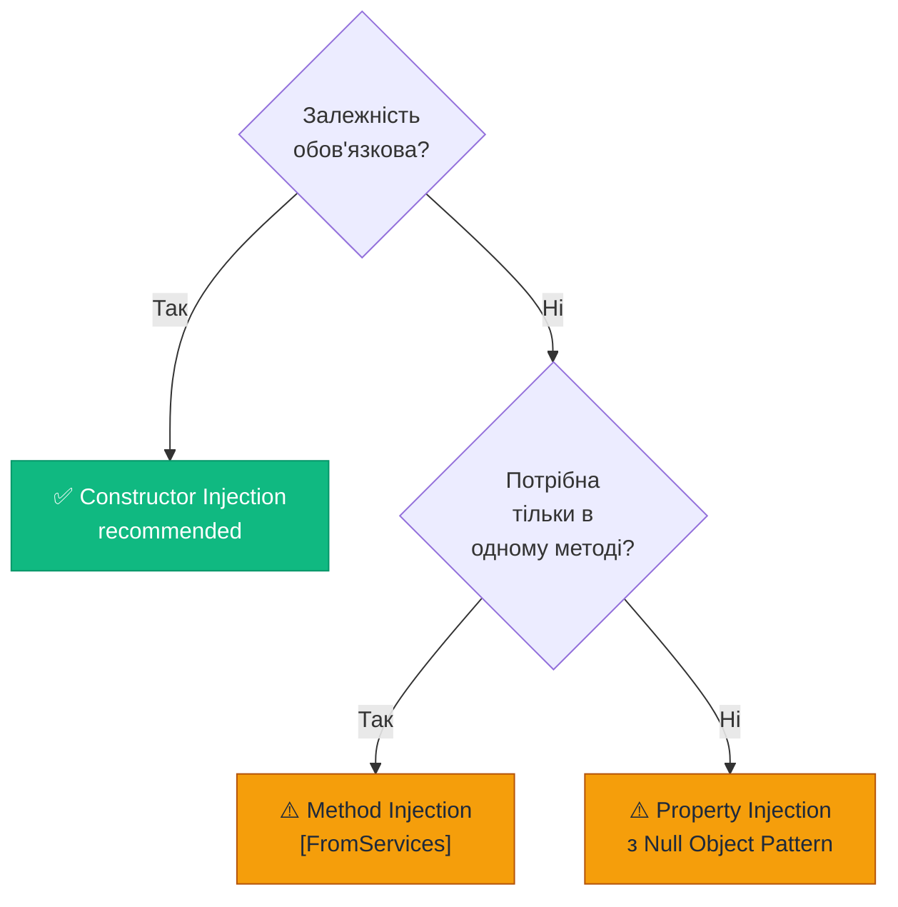

# Паттерни Dependency Injection

## Вступ: Три Способи Передати Залежність

Раніше ми зрозуміли, що залежності треба передавати ззовні (Dependency Injection). Але є **три різних способи** це зробити. Кожен має свою аналогію:

**Constructor Injection** — "Офіційний контракт при прийомі на роботу"  
Ти підписуєш угоду, де чітко прописано: тобі потрібен стіл, комп'ютер і доступ до системи. Все це надане при вступі. Без цього клас не може **існувати**.

**Property Injection** — "Додаткове обладнання яке можна встановити пізніше"  
Клас можна створити і без нього, але якщо потрібен принтер — його підключають після. Залежність **не обов'язкова**.

**Method Injection** — "Тимчасовий інструмент для конкретного завдання"  
Будівельник має власний дрель, але для конкретної роботи йому позичають спеціалізований перфоратор. Залежність потрібна **лише для одного виклику**.

---

## Частина 1: Constructor Injection

### 1.1. Що це таке і навіщо

**Constructor Injection** — це найпоширеніший та найрекомендованіший спосіб DI. Залежності передаються через конструктор класу і стають доступними **одразу після створення** об'єкта.

Ключова ідея: об'єкт не може **існувати** у неповному стані. Якщо залежність не надана — об'єкт не може бути створений взагалі.

### 1.2. Базовий приклад

```csharp showLineNumbers
// Інтерфейси — "контракти" між класами
public interface ILogger { void Log(string message); }
public interface IOrderRepository { void Save(Order order); }
public interface IEmailService { void Send(string to, string body); }

// OrderService з Constructor Injection
public class OrderService
{
    // Приватні поля, що зберігають залежності.
    // Readonly — гарантує, що після конструктора їх не можна замінити.
    private readonly IOrderRepository _repository;
    private readonly IEmailService _emailService;
    private readonly ILogger _logger;

    // Конструктор є "публічним контрактом": оголошує чого потребує клас.
    // Це єдине місце, де залежності "вводяться" (inject) у клас.
    public OrderService(
        IOrderRepository repository,
        IEmailService emailService,
        ILogger logger)
    {
        // Guard clauses — захист від null
        _repository = repository ?? throw new ArgumentNullException(nameof(repository));
        _emailService = emailService ?? throw new ArgumentNullException(nameof(emailService));
        _logger = logger ?? throw new ArgumentNullException(nameof(logger));
    }

    // Методи використовують залежності але не знають про їх конкретний тип
    public void PlaceOrder(Order order)
    {
        _logger.Log($"Placing order {order.Id}...");
        _repository.Save(order);
        _emailService.Send(order.CustomerEmail, $"Замовлення #{order.Id} прийнято!");
        _logger.Log($"Order {order.Id} placed successfully.");
    }
}
```

### 1.3. Переваги Constructor Injection

**1. Явність залежностей**  
Достатньо поглянути на конструктор — і зразу зрозуміло, що потрібно класу. Це жива документація.

**2. Гарантований повний стан**  
Об'єкт або створений з усіма залежностями, або не створений взагалі. Немає проміжного "напівготового" стану.

**3. Незмінність (Immutability)**  
Завдяки `readonly` залежності встановлюються один раз. Thread-safe за своєю природою.

**4. Легкість тестування**  
У тестах ми просто передаємо моки у конструктор:

```csharp showLineNumbers
[TestMethod]
public void PlaceOrder_ShouldSaveAndSendEmail()
{
    // Arrange: явно і зрозуміло
    var mockRepo = new Mock<IOrderRepository>();
    var mockEmail = new Mock<IEmailService>();
    var mockLogger = new Mock<ILogger>();

    // Передаємо моки — клас їх не "помітить"!
    var service = new OrderService(
        mockRepo.Object,
        mockEmail.Object,
        mockLogger.Object);

    var order = new Order { Id = 1, CustomerEmail = "test@test.com" };

    // Act
    service.PlaceOrder(order);

    // Assert
    mockRepo.Verify(r => r.Save(order), Times.Once);
    mockEmail.Verify(e => e.Send("test@test.com", It.IsAny<string>()), Times.Once);
}
```

### 1.4. Проблема "Constructor Over-injection"

Коли конструктор має занадто багато параметрів — це **запах коду** (code smell):

```csharp
// ❌ Конструктор з 8+ параметрами — сигнал про проблему!
public class ComplexOrderService
{
    public ComplexOrderService(
        IOrderRepository repository,
        IEmailService emailService,
        ILogger logger,
        IInventoryService inventory,
        IPaymentGateway payment,
        INotificationService notifications,
        IShippingService shipping,
        IAuditService audit)   // 8 параметрів!
    { /* ... */ }
}
```

**Сигнал**: Клас порушує Single Responsibility Principle. Він відповідає за занадто багато речей. Рішення — виділити менші класи або згрупувати пов'язані залежності у "доменний сервіс".

```csharp
// ✅ Краще: згрупуємо пов'язані залежності
public record OrderProcessingContext(
    IInventoryService Inventory,
    IPaymentGateway Payment,
    IShippingService Shipping);

public class OrderService
{
    public OrderService(
        IOrderRepository repository,
        IEmailService emailService,
        ILogger logger,
        OrderProcessingContext processingCtx)  // Тепер 4 параметри
    { /* ... */ }
}
```

---

## Частина 2: Property Injection

### 2.1. Що це таке і коли використовувати

**Property Injection** (також Setter Injection) — залежності встановлюються через **публічні властивості** після створення об'єкта.

Це підходить для **необов'язкових залежностей** — тих, де клас може функціонувати без них (хоча, можливо, і з обмеженою функціональністю).

### 2.2. Приклад: Logger як необов'язкова залежність

```csharp showLineNumbers
// Property Injection — для необов'язкових залежностей
public class OrderProcessor
{
    // ОБОВ'ЯЗКОВІ залежності — через конструктор
    private readonly IOrderRepository _repository;
    private readonly IPaymentGateway _payment;

    public OrderProcessor(IOrderRepository repository, IPaymentGateway payment)
    {
        _repository = repository;
        _payment = payment;
    }

    // НЕОБОВ'ЯЗКОВА залежність — через властивість.
    // Клас може існувати і без логера (буде просто без логування).
    // Null Object Pattern: NullLogger нічого не робить, але не кидає null exception.
    public ILogger Logger { get; set; } = NullLogger.Instance;

    public void ProcessOrder(Order order)
    {
        Logger.Log($"Processing order {order.Id}");  // Безпечно навіть без реального логера
        _payment.Charge(order.Total);
        _repository.Save(order);
        Logger.Log($"Order {order.Id} processed");
    }
}

// Null Object Pattern для Logger
public class NullLogger : ILogger
{
    public static readonly NullLogger Instance = new();
    public void Log(string message) { }  // Нічого не робить
}
```

### 2.3. Використання в коді та тестах

```csharp showLineNumbers
// Використання без логера
var processor = new OrderProcessor(repository, payment);
// Logger = NullLogger автоматично — не кидає exception!

// Додаємо логер за потреби
processor.Logger = new ConsoleLogger();

// У тесті: встановлюємо мок після створення
var processor = new OrderProcessor(mockRepo, mockPayment);
processor.Logger = mockLogger; // Необов'язково для роботи!

// У DI контейнері Microsoft DI не підтримує Property Injection нативно.
// Але можна через factory:
services.AddScoped<OrderProcessor>(sp =>
{
    var processor = new OrderProcessor(
        sp.GetRequiredService<IOrderRepository>(),
        sp.GetRequiredService<IPaymentGateway>());
    processor.Logger = sp.GetService<ILogger>() ?? NullLogger.Instance; // Property injection!
    return processor;
});
```

### 2.4. Недоліки Property Injection

```csharp
// ❌ Проблема 1: Неповний стан об'єкта
var processor = new OrderProcessor(repository, payment);
// processor.Logger не встановлено — але об'єкт "живе" без проблем

// ❌ Проблема 2: Залежності можуть бути змінені після створення
processor.Logger = new ConsoleLogger();
// ... якийсь код ...
processor.Logger = null; // ← Хтось обнулив! NullReferenceException!

// ❌ Проблема 3: Незрозуміло, яке мінімальне вимога до класу
// (що обов'язкове, що необов'язкове — доводиться читати всю документацію)
```

::warning
Microsoft DI (IServiceCollection) **не підтримує** Property Injection "з коробки". Якщо вам потрібен Property Injection — використовуйте factory-реєстрацію або сторонні контейнери (Autofac, Castle Windsor).
::

---

## Частина 3: Method Injection

### 3.1. Що це таке і коли використовувати

**Method Injection** — залежність передається як **параметр конкретного методу**, а не всього класу. Використовується, коли залежність потрібна **тільки в одному методі**, і немає сенсу тримати її весь час.

### 3.2. Класичний приклад

```csharp showLineNumbers
public class DataProcessor
{
    // Немає залежності від ILogger у полях класу!
    // Основна логіка не потребує логування.

    public void ProcessData(DataSet data)
    {
        // Бізнес логіка без логування
        foreach (var row in data.Rows)
            TransformRow(row);
    }

    // !!! Method Injection — логер передається тільки сюди
    // Цей метод потребує налагодження в конкретних сценаріях
    public void ProcessDataWithLogging(DataSet data, ILogger logger)
    {
        logger.Log("Processing started");

        foreach (var row in data.Rows)
        {
            logger.Log($"Processing row {row.Id}");
            TransformRow(row);
        }

        logger.Log("Processing complete");
    }

    private void TransformRow(DataRow row) { /* ... */ }
}
```

### 3.3. Method Injection у ASP.NET Core: IFromServices

ASP.NET Core нативно підтримує Method Injection для Controller actions:

```csharp showLineNumbers
[ApiController]
[Route("api/[controller]")]
public class ReportController : ControllerBase
{
    // Загальні залежності — через конструктор (завжди потрібні)
    private readonly ILogger<ReportController> _logger;

    public ReportController(ILogger<ReportController> logger)
    {
        _logger = logger;
    }

    // [FromServices] injection — залежність тільки для цього ендпоінту
    // Не потрібно "тягнути" IReportGenerator у конструктор якщо він рідко використовується!
    [HttpGet("monthly")]
    public async Task<IActionResult> GetMonthlyReport(
        [FromServices] IReportGenerator reportGenerator,  // Method Injection!
        [FromQuery] int month,
        [FromQuery] int year)
    {
        _logger.LogInformation("Generating {Month}/{Year} report", month, year);
        var report = await reportGenerator.GenerateMonthlyAsync(month, year);
        return Ok(report);
    }

    [HttpGet("annual")]
    public async Task<IActionResult> GetAnnualReport(
        [FromServices] IAnnualReportGenerator annualGenerator,  // Інша залежність!
        [FromQuery] int year)
    {
        var report = await annualGenerator.GenerateAsync(year);
        return Ok(report);
    }
}
```

### 3.4. Коли Method Injection виправданий?

**Доречно:**
- Залежність потрібна тільки в одному методі і не використовується ніде більше
- Expensive-to-create залежність яку хочемо "лінити" (але краще Lazy<T>)
- ASP.NET Core `[FromServices]` для рідко використовуваних сервісів у контролерах

**Не доречно:**
- Якщо залежність потрібна в 2+ методах — краще через Constructor Injection
- Якщо забруднює сигнатуру методу бізнес-логіки

---

## Частина 4: Порівняльна таблиця

| Критерій | Constructor | Property | Method |
|---|---|---|---|
| **Рекомендація** | ✅ Завжди preferred | ⚠️ Необов'язкові | ⚠️ Специфічні випадки |
| **Обов'язковість** | Обов'язкова | Необов'язкова | Специфічна для методу |
| **Стан об'єкта** | Завжди повний | Може бути неповним | — |
| **Immutability** | ✅ (readonly) | ❌ (може змінитись) | ✅ (per-call) |
| **Testability** | ✅ Легко | ⚠️ Треба встановлювати | ✅ Передається у виклику |
| **Microsoft DI** | ✅ Нативно | ❌ Тільки через factory | ✅ [FromServices] |
| **Явність** | ✅ Конструктор | ⚠️ Властивості | ⚠️ Параметри методу |

::mermaid



::

---

## Частина 5: Паттерн Factory у контексті DI

### 5.1. Чому Factory потрібна?

DI контейнер вирішує залежності **один раз при запуску** (для Singleton) або **на початку scope** (для Scoped). Але що якщо нам потрібно **динамічно** у runtime вирішити, який тип створити?

```csharp
// ❌ Проблема: не можна передати параметри при Resolve через DI
services.AddScoped<IEmailService, SmtpEmailService>();
// SmtpEmailService потребує конкретний email одержувача — але звідки його взяти?

var emailService = provider.GetRequiredService<IEmailService>();
// До кого надсилати? Контейнер не знає контекст виконання!
```

### 5.2. Factory Pattern вирішення

```csharp showLineNumbers
// Варіант 1: Factory інтерфейс
public interface IEmailServiceFactory
{
    IEmailService CreateForRecipient(string recipientEmail);
}

public class EmailServiceFactory : IEmailServiceFactory
{
    private readonly ILogger _logger;
    private readonly SmtpConfig _config;

    // Factory сама отримує залежності через DI!
    public EmailServiceFactory(ILogger logger, SmtpConfig config)
    {
        _logger = logger;
        _config = config;
    }

    public IEmailService CreateForRecipient(string recipientEmail)
    {
        _logger.Log($"Creating email service for {recipientEmail}");
        return new SmtpEmailService(_config, recipientEmail);
    }
}

// Реєстрація
services.AddSingleton<IEmailServiceFactory, EmailServiceFactory>();

// Використання
public class OrderService
{
    private readonly IEmailServiceFactory _emailFactory;

    public OrderService(IEmailServiceFactory emailFactory)
    {
        _emailFactory = emailFactory;
    }

    public void PlaceOrder(Order order)
    {
        // Динамічно створюємо сервіс з потрібним одержувачем
        var emailService = _emailFactory.CreateForRecipient(order.CustomerEmail);
        emailService.Send("Ваше замовлення прийнято!");
    }
}
```

### 5.3. Func<T> як Factory

У Microsoft DI можна використати `Func<T>` як вбудовану Factory:

```csharp showLineNumbers
// Реєстрація: Func як factory
services.AddTransient<IEmailService, SmtpEmailService>();
services.AddSingleton<Func<IEmailService>>(sp =>
    () => sp.GetRequiredService<IEmailService>());

// Використання — Func<T> inject як залежність!
public class NotificationService
{
    private readonly Func<IEmailService> _emailFactory;

    public NotificationService(Func<IEmailService> emailFactory)
    {
        _emailFactory = emailFactory;
    }

    public void Notify(string to, string message)
    {
        // Кожного разу отримуємо новий Transient email сервіс
        var email = _emailFactory();
        email.Send(to, message);
    }
}
```

---

## Частина 6: Паттерн Decorator у контексті DI

**Decorator** дозволяє додати поведінку до сервісу (логування, кешування, retry) **без зміни** його коду. У контексті DI — decorator "огортає" зареєстрований сервіс.

```csharp showLineNumbers
// Базовий сервіс
public class SqlOrderRepository : IOrderRepository
{
    public void Save(Order order) { /* SQL INSERT */ }
    public Order Get(int id) { /* SQL SELECT */ return null!; }
}

// Decorator: додає логування без зміни SqlOrderRepository!
public class LoggingOrderRepository : IOrderRepository
{
    private readonly IOrderRepository _inner;  // Реальний репозиторій
    private readonly ILogger _logger;

    // Приймає "внутрішній" сервіс через конструктор — це теж DI!
    public LoggingOrderRepository(IOrderRepository inner, ILogger logger)
    {
        _inner = inner;
        _logger = logger;
    }

    public void Save(Order order)
    {
        _logger.Log($"[BEFORE] Saving order {order.Id}");
        _inner.Save(order);  // Делегуємо реальній реалізації
        _logger.Log($"[AFTER] Order {order.Id} saved");
    }

    public Order Get(int id)
    {
        _logger.Log($"[BEFORE] Getting order {id}");
        var result = _inner.Get(id);
        _logger.Log($"[AFTER] Got order {id}: {result?.Status}");
        return result;
    }
}

// Реєстрація з Decorator через Scrutor (бібліотека розширення для Microsoft DI)
// PM> Install-Package Scrutor
services.AddScoped<IOrderRepository, SqlOrderRepository>();
services.Decorate<IOrderRepository, LoggingOrderRepository>();  // Огортаємо!

// Або вручну через factory
services.AddScoped<SqlOrderRepository>();
services.AddScoped<IOrderRepository>(sp =>
{
    var inner = sp.GetRequiredService<SqlOrderRepository>();
    var logger = sp.GetRequiredService<ILogger>();
    return new LoggingOrderRepository(inner, logger);  // Decorator вручну
});
```

**Логіка ланцюга Decorator:**

```
OrderService → LoggingOrderRepository → CachingOrderRepository → SqlOrderRepository
                  (decorator)              (decorator)              (реальна БД)
```

Кожен decorator огортає попередній і додає свій шар функціональності.

---

## Підсумок

Три методи DI вирішують різні задачі. Правило вибору просте:

::card-group

::card{title="Constructor Injection" icon="i-heroicons-building-office-2"}
**Завжди за замовчуванням**. Обов'язкові залежності, яких клас не може існувати без них. Максимальна явність, testability та immutability.
::

::card{title="Property Injection" icon="i-heroicons-adjustments-horizontal"}
**Тільки для необов'язкових залежностей**. Використовуйте Null Object Pattern як значення за замовчуванням. Рідко потрібен у правильно спроектованому коді.
::

::card{title="Method Injection" icon="i-heroicons-beaker"}
**Для специфічного методу**. Якщо залежність потрібна тільки в одному місці, немає сенсу "тягнути" її у весь клас. ASP.NET Core `[FromServices]` — зручне рішення.
::

::

---

## 📝 Завдання

### Завдання 1: Вибір методу (Easy)

Для кожної ситуації оберіть правильний метод DI та поясніть чому:

1. `UserService` завжди потребує `IUserRepository` для всіх своїх методів
2. `DataProcessor` має метод `ExportToExcel(IExcelWriter writer)` — writer потрібен лише тут
3. `HttpClient` у класі може використовуватися, але якщо не встановлений — клас усе одно коректно працює (повертає empty results)
4. ASP.NET Core Controller має endpoint `/api/reports/pdf` що використовує `IPdfGenerator`

### Завдання 2: Реалізація Decorator (Medium)

Реалізуйте `CachingOrderRepository` — decorator для `IOrderRepository`, що кешує результати `Get(int id)` в `Dictionary<int, Order>` на 5 хвилин. Зареєструйте ланцюг: `SqlOrderRepository` → `LoggingOrderRepository` → `CachingOrderRepository`.

### Завдання 3: Factory для динамічного вибору (Hard)

Реалізуйте систему сповіщень з кількома каналами:
- `INotificationChannel` — інтерфейс
- `EmailChannel`, `SmsChannel`, `PushChannel` — реалізації
- `INotificationChannelFactory` — фабрика, що повертає потрібний канал за `NotificationType` enum

Зареєструйте всі у Microsoft DI та використайте factory у `NotificationService.SendAsync(notification)`.
