# Service Lifetimes та Scopes

## Вступ: Чому Lifetime — це архітектурне рішення

Вибір lifetime для сервісу — це не просто технічна деталь. Це **архітектурне рішення**, що впливає на:

- Коректність роботи (чи поділяємо ми стан між запитами?)
- Продуктивність (чи витрачаємо ресурси на непотрібні new?)
- Безпеку (чи не "протікають" дані між HTTP-запитами?)
- Утилізацію ресурсів (IDisposable об'єкти — chи знищуємо їх вчасно?)

**Аналогія з готелем:**

- **Transient** — одноразові рушники. Кожен гість отримує новий і викидає після першого використання.
- **Scoped** — постільна білизна. Ваша на весь час проживання (scope = перебування), але після виписки — прання або заміна.
- **Singleton** — ліфт або стійка рецепції. Один на весь готель, доступний будь-кому і будь-коли.

---

## Частина 1: Transient Lifetime

### 1.1. Як це працює

**Transient** — новий екземпляр **при кожному зверненні** до контейнера. Жодного кешування, жодного спільного стану.

```csharp showLineNumbers
services.AddTransient<IEmailService, SmtpEmailService>();

// Кожен GetService → новий об'єкт!
var email1 = provider.GetService<IEmailService>();
var email2 = provider.GetService<IEmailService>();

Console.WriteLine(ReferenceEquals(email1, email2)); // False — різні об'єкти!
```

### 1.2. Коли використовувати

Transient підходить для:
- **Lightweight, stateless сервісів** — де створення дешеве і стан не важливий.
- **Email/SMS відправники** — кожен виклик незалежний.
- **Helpers та Utilities** — без стану, без ресурсів.
- **Formatter, Mapper** — трансформація даних без збереження стану.

```csharp
// ✅ Transient — добре для stateless сервісів
services.AddTransient<IPasswordHasher, BcryptPasswordHasher>();
services.AddTransient<IEmailValidator, EmailValidator>();
services.AddTransient<IJsonSerializer, NewtonsoftJsonSerializer>();

// ❌ Transient — погано для expensive-to-create сервісів
// services.AddTransient<AppDbContext>(); // DbContext — expensive! Краще Scoped.
// services.AddTransient<HttpClient>();   // HttpClient — дуже expensive! Singleton або IHttpClientFactory.
```

### 1.3. Transient та IDisposable

Важлива деталь: Transient-сервіси з `IDisposable` **відстежуються контейнером** і знищуються разом із scope (або root provider):

```csharp showLineNumbers
public class ExpensiveTransientService : IDisposable
{
    private readonly Guid _id = Guid.NewGuid();

    public ExpensiveTransientService()
        => Console.WriteLine($"Created: {_id}");

    public void DoWork() => Console.WriteLine($"Working: {_id}");

    public void Dispose()
        => Console.WriteLine($"Disposed: {_id}");
}

services.AddTransient<ExpensiveTransientService>();

using (var scope = provider.CreateScope())
{
    var s1 = scope.ServiceProvider.GetRequiredService<ExpensiveTransientService>();
    var s2 = scope.ServiceProvider.GetRequiredService<ExpensiveTransientService>();
    s1.DoWork();
    s2.DoWork();
    // Created: abc...
    // Created: def...
    // Working: abc...
    // Working: def...
} // ← Scope закривається: Dispose викликається для s1 і s2!
// Disposed: def...
// Disposed: abc...  (зворотній порядок!)
```

::note
**Висновок**: Навіть Transient IDisposable-сервіси **НЕ знищуються відразу** після використання. Вони живуть до закриття scope. Це означає, що якщо у вас дуже короткий метод що використовує `IDisposable` Transient — ресурс тримається довше ніж потрібно. Врахуйте це при проектуванні.
::

---

## Частина 2: Scoped Lifetime

### 2.1. Що таке Scope?

**Scope** — це контекст виконання з ізольованим кешем. У межах одного scope всі запити одного Scoped-сервісу повертають **той самий екземпляр**. В іншому scope — новий екземпляр.

```csharp showLineNumbers
services.AddScoped<IOrderRepository, SqlOrderRepository>();

using var scope1 = provider.CreateScope();
using var scope2 = provider.CreateScope();

var repo1a = scope1.ServiceProvider.GetRequiredService<IOrderRepository>();
var repo1b = scope1.ServiceProvider.GetRequiredService<IOrderRepository>();
var repo2  = scope2.ServiceProvider.GetRequiredService<IOrderRepository>();

Console.WriteLine(ReferenceEquals(repo1a, repo1b)); // True  — той самий у scope1!
Console.WriteLine(ReferenceEquals(repo1a, repo2));  // False — різний у scope2!
```

### 2.2. Scope в ASP.NET Core = HTTP-запит

ASP.NET Core автоматично створює scope для кожного HTTP-запиту:

```
HTTP Request 1 ─→ [Scope A] ─→ DbContext_A, Repository_A, OrderService_A
HTTP Request 2 ─→ [Scope B] ─→ DbContext_B, Repository_B, OrderService_B
HTTP Request 3 ─→ [Scope C] ─→ DbContext_C, Repository_C, OrderService_C
```

Це означає:
- Кожен запит має **свій** DbContext (ізольована Unit of Work!)
- Зміни в одному запиті не "протікають" в інший
- DbContext знищується після відповіді → з'єднання повертається в пул

```csharp showLineNumbers
// DbContext — класичний приклад для Scoped
services.AddDbContext<AppDbContext>(options =>
    options.UseSqlServer(connectionString));
// AddDbContext автоматично реєструє як Scoped!

// OrderService використовує той самий DbContext що і Repository у цьому запиті
public class OrderService
{
    private readonly AppDbContext _dbContext;
    private readonly IOrderRepository _repository;

    public OrderService(AppDbContext dbContext, IOrderRepository repository)
    {
        _dbContext = dbContext;  // ← той самий екземпляр що і в repository!
        _repository = repository;
    }

    public async Task<bool> PlaceOrderAsync(CreateOrderRequest request)
    {
        using var transaction = await _dbContext.BeginTransactionAsync();
        try
        {
            var order = new Order(request);
            _repository.Add(order);  // Використовує той самий _dbContext!
            await _dbContext.SaveChangesAsync();
            await transaction.CommitAsync();
            return true;
        }
        catch
        {
            await transaction.RollbackAsync();
            return false;
        }
    }
}
```

### 2.3. Ручне створення Scope (Worker Services)

У BackgroundService або Console App scope треба створювати вручну через `IServiceScopeFactory`:

```csharp showLineNumbers
public class DataSyncWorker : BackgroundService
{
    private readonly IServiceScopeFactory _scopeFactory;
    private readonly ILogger<DataSyncWorker> _logger;

    // BackgroundService є Singleton — тому inject IServiceScopeFactory а не Scoped сервіси!
    public DataSyncWorker(IServiceScopeFactory scopeFactory, ILogger<DataSyncWorker> logger)
    {
        _scopeFactory = scopeFactory;
        _logger = logger;
    }

    protected override async Task ExecuteAsync(CancellationToken stoppingToken)
    {
        while (!stoppingToken.IsCancellationRequested)
        {
            _logger.LogInformation("Starting sync cycle at {Time}", DateTimeOffset.UtcNow);

            // Кожна ітерація — новий scope!
            // Це аналог "нового HTTP-запиту" у Worker Services.
            await using var scope = _scopeFactory.CreateAsyncScope();

            var syncService = scope.ServiceProvider.GetRequiredService<IDataSyncService>();
            await syncService.SyncAsync(stoppingToken);

            // Scope знищується тут ← syncService та його залежності Dispose'd

            await Task.Delay(TimeSpan.FromMinutes(5), stoppingToken);
        }
    }
}
```

---

## Частина 3: Singleton Lifetime

### 3.1. Як це працює

**Singleton** — єдиний екземпляр на **весь час роботи** застосунку. Створюється при першому зверненні і знищується лише при shutdown.

```csharp showLineNumbers
services.AddSingleton<ICacheService, MemoryCacheService>();

// Завжди той самий об'єкт незалежно від scope!
using var scope1 = provider.CreateScope();
using var scope2 = provider.CreateScope();

var cache1 = scope1.ServiceProvider.GetRequiredService<ICacheService>();
var cache2 = scope2.ServiceProvider.GetRequiredService<ICacheService>();

Console.WriteLine(ReferenceEquals(cache1, cache2)); // True — один об'єкт на всіх!
```

### 3.2. Коли використовувати

```csharp
// ✅ Singleton — добре для:
services.AddSingleton<IConfiguration>(configuration);      // Конфігурація
services.AddSingleton<ICacheService, MemoryCacheService>(); // In-memory кеш
services.AddSingleton<IHttpClientFactory>();                // HTTP-клієнти
services.AddSingleton<ILogger<T>>();                       // Logger (автоматично)
services.AddSingleton<SmtpConfig>(smtpConfig);             // Immutable конфігураційні об'єкти

// ❌ Singleton — НЕ підходить для:
// services.AddSingleton<AppDbContext>(); // DbContext не thread-safe!
// services.AddSingleton<IOrderRepository>(); // Якщо тримає DbContext — проблема!
```

### 3.3. Thread Safety у Singleton

Оскільки Singleton доступний з кількох потоків одночасно — він **повинен бути thread-safe**:

```csharp showLineNumbers
// ❌ НЕ thread-safe Singleton — НЕБЕЗПЕЧНО!
public class UnsafeCacheService : ICacheService
{
    // Dictionary в C# НЕ thread-safe!
    private readonly Dictionary<string, object> _cache = new();

    public void Set(string key, object value)
        => _cache[key] = value; // Race condition при паралельних запитах!

    public object? Get(string key)
        => _cache.TryGetValue(key, out var v) ? v : null;
}

// ✅ Thread-safe Singleton — правильно!
public class SafeCacheService : ICacheService
{
    // ConcurrentDictionary — thread-safe!
    private readonly ConcurrentDictionary<string, object> _cache = new();

    public void Set(string key, object value)
        => _cache[key] = value; // Безпечно!

    public object? Get(string key)
        => _cache.TryGetValue(key, out var v) ? v : null;
}
```

---

## Частина 4: Captive Dependency — критичний анти-паттерн

### 4.1. Що таке Captive Dependency?

**Captive Dependency** (залежь-бранець) — ситуація, коли **сервіс з більшим lifetime використовує сервіс з меншим lifetime**. Результат: "бранець" (той з меншим lifetime) живе **довше, ніж повинен**.

```
Singleton ────────────────────────────────────────────── ♾️ (весь час роботи)
  └─> Scoped ─────────────── trapped! ────────────────── ♾️ замість одного scope
         └─> Transient ─────────────────────────────────  теж trapped!
```

**Конкретний приклад:**

```csharp showLineNumbers
// Реєстрація
services.AddSingleton<OrderProcessingService>(); // Singleton!
services.AddScoped<IOrderRepository, SqlOrderRepository>(); // Scoped
services.AddScoped<AppDbContext>(); // Scoped DbContext

// Клас з Captive Dependency
public class OrderProcessingService  // Singleton!
{
    private readonly IOrderRepository _repository; // Scoped — ПРОБЛЕМА!

    public OrderProcessingService(IOrderRepository repository)
    {
        // Цей repository буде захоплений НАЗАВЖДИ!
        // Він ніколи не буде знищений після першого scope.
        _repository = repository;
    }

    public void ProcessPending()
    {
        // Завжди використовуємо той самий repository з першого scope!
        // DbContext вже закритий після першого запиту, але ми всe одно тримаємо посилання.
        var orders = _repository.GetPending(); // Може кинути exception!
    }
}
```

::caution
**Наслідки Captive Dependency:**
1. **DbContext після закриття scope** — `ObjectDisposedException` при спробі використати
2. **Витік пам'яті** — Scoped об'єкти не знищуються бо Singleton тримає посилання
3. **Спільний стан між запитами** — один DbContext для всіх HTTP-запитів → дані "протікають"
4. **Важко відтворювані баги** — проявляється тільки пыд навантаженням
::

### 4.2. ValidateScopes — виявлення Captive Dependency

Microsoft DI може **автоматично виявляти** Captive Dependency при старті:

```csharp showLineNumbers
var provider = services.BuildServiceProvider(new ServiceProviderOptions
{
    ValidateScopes = true,  // Увімкнути перевірку!
    ValidateOnBuild = true
});

// При спробі resolve OrderProcessingService:
// InvalidOperationException:
// "Cannot consume scoped service 'IOrderRepository'
// from singleton 'OrderProcessingService'."
// ← Чудово! Помилку виявлено при старті!
```

У ASP.NET Core у режимі `Development` — `ValidateScopes` **увімкнено автоматично**.

### 4.3. Як правильно вирішити Captive Dependency

**Варіант 1: Змінити lifetime Singleton на Scoped**

```csharp
// Якщо OrderProcessingService не має справжнього стану для Singleton
services.AddScoped<OrderProcessingService>(); // Scoped — підходить!
```

**Варіант 2: Використати IServiceScopeFactory у Singleton**

```csharp showLineNumbers
// OrderProcessingService залишається Singleton, але правильно отримує Scoped
public class OrderProcessingService  // Singleton
{
    private readonly IServiceScopeFactory _scopeFactory;

    public OrderProcessingService(IServiceScopeFactory scopeFactory)
    {
        // IServiceScopeFactory — це Singleton, тому inject можна!
        _scopeFactory = scopeFactory;
    }

    public void ProcessPending()
    {
        // Кожного разу — новий scope!
        using var scope = _scopeFactory.CreateScope();
        var repository = scope.ServiceProvider.GetRequiredService<IOrderRepository>();
        var orders = repository.GetPending();
        // ...
        // При виході зі scope — repository та DbContext знищуються!
    }
}
```

**Варіант 3: Зробити Singleton по-справжньому Singleton**

```csharp showLineNumbers
// Якщо OrderProcessingService справді потребує бути Singleton —
// можливо, воно не повинно тримати IOrderRepository напряму.
// Виділіть обробку в окремий Scoped UseCase.

public class OrderProcessingOrchestrator // Singleton — orchestrates only
{
    private readonly IServiceScopeFactory _scopeFactory;
    private readonly ILogger _logger;

    public OrderProcessingOrchestrator(IServiceScopeFactory scopeFactory, ILogger<OrderProcessingOrchestrator> logger)
    {
        _scopeFactory = scopeFactory;
        _logger = logger;
    }

    public async Task RunAsync()
    {
        await using var scope = _scopeFactory.CreateAsyncScope();
        var handler = scope.ServiceProvider.GetRequiredService<ProcessPendingOrdersHandler>();
        await handler.HandleAsync();
    }
}

public class ProcessPendingOrdersHandler // Scoped — має доступ до Scoped сервісів
{
    private readonly IOrderRepository _repository;
    private readonly IEmailService _emailService;

    public ProcessPendingOrdersHandler(IOrderRepository repository, IEmailService emailService)
    {
        _repository = repository;
        _emailService = emailService;
    }

    public async Task HandleAsync()
    {
        var orders = await _repository.GetPendingAsync();
        foreach (var order in orders)
            await _emailService.SendAsync(order.CustomerEmail, "...");
    }
}
```

---

## Частина 5: Lifecycle Diagrams

::mermaid

```mermaid
gantt
    title Порівняння Lifetimes під час роботи застосунку
    dateFormat X
    axisFormat %s

    section Singleton
    ConsoleLogger (Singleton)    : 0, 100

    section HTTP Request 1
    DbContext (Scoped)          : 10, 30
    OrderRepository (Scoped)    : 10, 30
    EmailSvc (Transient #1)     : 15, 25
    EmailSvc (Transient #2)     : 20, 30

    section HTTP Request 2
    DbContext (Scoped)          : 40, 60
    OrderRepository (Scoped)    : 40, 60
    EmailSvc (Transient #3)     : 45, 55

    section HTTP Request 3
    DbContext (Scoped)          : 70, 90
    OrderRepository (Scoped)    : 70, 90
```



::

---

## Підсумок: Як вибирати Lifetime?

::steps

### Питання 1: Чи має сервіс стан?

Якщо **так і стан повинен бути спільним** → Singleton.  
Якщо **так але стан ізольований до запиту** → Scoped.  
Якщо **ні (stateless)** → Transient.

### Питання 2: Чи дорого створювати сервіс?

Якщо **дорого і thread-safe** → Singleton.  
Якщо **дорого і не thread-safe** → Scoped.  
Якщо **дешево** → Transient.

### Питання 3: Чи реалізує IDisposable?

Якщо **так** → краще Scoped або Transient із правильним scope. Singleton Disposable знищується тільки при shutdown.

### Питання 4: Перевірка Captive Dependency

Singleton → може використовувати тільки Singleton.  
Scoped → може використовувати Singleton та Scoped.  
Transient → може використовувати будь-що.

::

---

## 📝 Завдання

### Завдання 1: Визначення Lifetime (Easy)

Визначте правильний lifetime для кожного сервісу та поясніть чому:

| Сервіс | Характеристика | Lifetime? |
|---|---|---|
| `IConfiguration` | Читає appsettings.json, immutable | ? |
| `AppDbContext` | Entity Framework, Unit of Work | ? |
| `IPasswordHasher` | Stateless, алгоритм bcrypt | ? |
| `IMemoryCache` | In-memory кеш, спільний для всіх | ? |
| `IHttpContextAccessor` | Доступ до поточного HTTP-контексту | ? |
| `IEmailSender` | Відправляє email, немає стану | ? |
| `IShoppingCart` | Кошик покупок поточного користувача | ? |

### Завдання 2: Знайди Captive Dependency (Medium)

```csharp
services.AddSingleton<INotificationService, NotificationService>();
services.AddScoped<IEmailService, SmtpEmailService>();
services.AddScoped<ISmsService, TwilioSmsService>();
services.AddTransient<ILogger, ConsoleLogger>();

public class NotificationService : INotificationService
{
    private readonly IEmailService _email;
    private readonly ISmsService _sms;
    private readonly ILogger _logger;

    public NotificationService(IEmailService email, ISmsService sms, ILogger logger)
    {
        _email = email;
        _sms = sms;
        _logger = logger;
    }
}
```

Знайдіть Captive Dependency. Запропонуйте 2 варіанти виправлення.

### Завдання 3: Scope Simulation (Hard)

Напишіть Unit тест, що демонструє поведінку всіх трьох lifetimes:

1. Transient: два виклики `GetRequiredService<T>()` повертають **різні** екземпляри
2. Scoped: два виклики в одному scope повертають **той самий**, у різних scope — **різні**
3. Singleton: виклики в різних scope повертають **той самий**

Використайте `ServiceCollection`, `BuildServiceProvider()` та `CreateScope()`.
