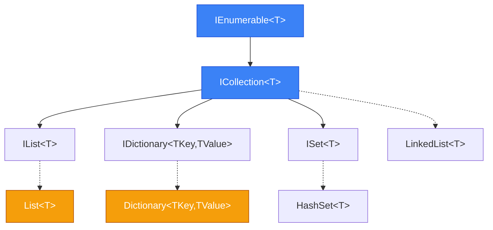
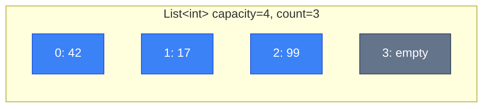
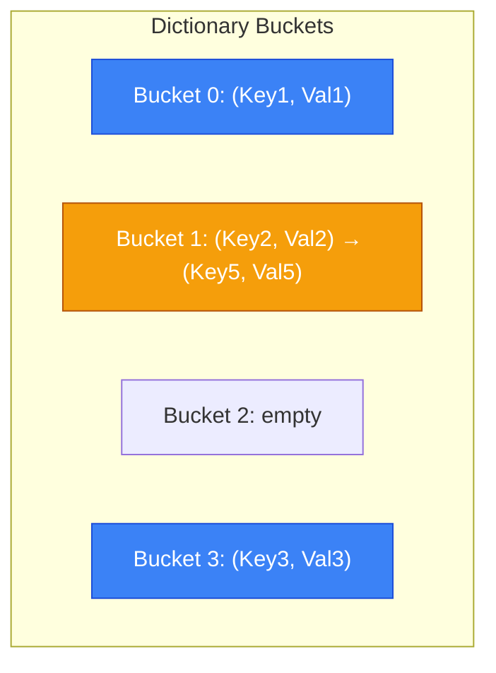

# Collections (Колекції)

## Вступ та Контекст

Уявіть, що ви розробляєте систему управління завданнями. Вам потрібно зберігати список задач, швидко знаходити завдання за ідентифікатором, відстежувати історію змін і забезпечити безпечний доступ з різних потоків. Спроба вирішити це за допомогою звичайного масиву (`T[]`) швидко виявить його обмеження:

-   **Фіксований розмір**: Масиви створюються з визначеною довжиною, яку неможливо змінити. Якщо вам потрібно додати більше елементів, ніж було заплановано, єдиний вихід — створити новий, більший масив і скопіювати в нього всі старі елементи. Це вкрай неефективно.
-   **Відсутність вбудованих операцій**: Масиви не пропонують готових методів для пошуку, вставки чи видалення елементів. Пошук елемента вимагає ручного перебору в циклі (складність O(n)), а вставка в середину — складного зсуву елементів вручну.
-   **Не потокобезпечність (Not Thread-Safe)**: Якщо декілька потоків одночасно намагаються читати й записувати в масив, можуть виникнути **стани гонитви (race conditions)**. Наприклад, один потік може перезаписати значення, яке інший потік ще не встиг прочитати, що призведе до пошкодження даних або непередбачуваної поведінки програми.

Саме для вирішення цих та багатьох інших проблем .NET надає багатий набір **колекцій** (Collections) — спеціалізованих структур даних, кожна з яких оптимізована під конкретні завдання. Це не просто "динамічні масиви", а складні інструменти, що реалізують класичні алгоритми та структури даних (хеш-таблиці, дерева, зв'язні списки), надаючи розробнику простий та ефективний API. Від динамічних списків до потокобезпечних словників, від незмінних колекцій до асинхронних каналів — кожна колекція має своє чітке призначення та компроміси у продуктивності.

### Еволюція колекцій у .NET

::steps

### Доба .NET Framework 1.x (2002)

Non-generic колекції, такі як `ArrayList`, `Hashtable`, `Queue`, `Stack`. Вони працювали з типом `object`, що створювало дві ключові проблеми:

1.  **Boxing/Unboxing**: При зберіганні типів-значень (value types, наприклад, `int`, `double`, `struct`) у такій колекції відбувався процес "упаковки" (**boxing**) — створення об'єкта-обгортки в керованій купі (managed heap). При отриманні значення назад відбувався зворотний процес — "розпакування" (**unboxing**). Ці операції були повільними та створювали значний тиск на збирач сміття (Garbage Collector, GC), що погіршувало продуктивність.
2.  **Відсутність безпеки типів (Type Safety)**: Оскільки колекція зберігала все як `object`, можна було помилково додати до `ArrayList`, призначеного для чисел, рядок або інший об'єкт. Помилка виявлялася лише під час виконання програми при спробі приведення типів (`InvalidCastException`), а не на етапі компіляції.

### .NET Framework 2.0 (2005)

Революція: з'явилися **узагальнені колекції (Generic Collections)** у просторі імен `System.Collections.Generic`. `List<T>`, `Dictionary<TKey, TValue>`, `HashSet<T>` та інші вирішили обидві проблеми попередників:

-   **Type-Safety**: Тип колекції `T` визначається під час компіляції. Спроба додати елемент несумісного типу призведе до помилки компіляції, що робить код набагато надійнішим.
-   **Продуктивність**: Оскільки тип `T` відомий, для value-типів не відбувається boxing/unboxing. Це значно підвищує продуктивність і зменшує навантаження на GC.

### .NET Framework 4.0 (2010)

**Concurrent Collections** (`System.Collections.Concurrent`) для багатопоточних застосунків. Класи як `ConcurrentDictionary<TKey, TValue>` та `BlockingCollection<T>` надають потокобезпечні операції без необхідності ручного блокування (`lock`). Це спрощує розробку паралельних програм і зменшує ризик виникнення взаємних блокувань (deadlocks).

### .NET Core / .NET 5+ (2016-теперішній час)

-   **Immutable Collections** (`System.Collections.Immutable`) для реалізації ідей функціонального програмування. Кожна операція модифікації повертає _нову_ версію колекції, залишаючи стару недоторканою. Це гарантує потокобезпечність для читання і спрощує відстеження стану.
-   **System.Threading.Channels** — високопродуктивна альтернатива для `BlockingCollection<T>` з повною підтримкою асинхронних операцій (`async/await`), ідеальна для реалізації патерну "виробник-споживач" (producer-consumer).
-   **Collection Expressions** (C# 12) — новий лаконічний синтаксис `[...]` для створення масивів, списків та інших колекцій, що робить код чистішим і більш читабельним.

::

### Навіщо потрібні різні колекції?

Вибір правильної колекції напряму впливає на продуктивність вашого застосунку. Ключовим критерієм вибору є **асимптотична складність операцій**, яку описують за допомогою **нотації Big O**. Вона показує, як час виконання операції (або використання пам'яті) зростає зі збільшенням кількості елементів (`n`) у колекції.

Розглянемо основні сценарії:

| Складність     | Назва                | Пояснення                                                                             | Приклад                                |
| :------------- | :------------------- | :------------------------------------------------------------------------------------ | :------------------------------------- |
| **O(1)**       | Константна           | Час виконання не залежить від розміру колекції. Це ідеал.                             | Доступ до елемента масиву за індексом. |
| **O(log n)**   | Логарифмічна         | Час виконання зростає дуже повільно. При подвоєнні `n` час збільшується на константу. | Пошук у бінарному дереві.              |
| **O(n)**       | Лінійна              | Час виконання зростає прямо пропорційно до кількості елементів.                       | Пошук елемента у списку (`List<T>`).   |
| **O(n log n)** | Лінійно-логарифмічна | Ефективні алгоритми сортування.                                                       | `List<T>.Sort()`.                      |
| **O(n²)**      | Квадратична          | Час виконання зростає експоненційно. Слід уникати для великих `n`.                    | Сортування бульбашкою (bubble sort).   |

Ось порівняльна таблиця для найпоширеніших колекцій:

| Операція           | `List<T>`         | `Dictionary<TKey,TValue>` | `HashSet<T>` | `LinkedList<T>`       |
| :----------------- | :---------------- | :------------------------ | :----------- | :-------------------- |
| Додавання в кінець | O(1) амортизована | O(1) середня              | O(1) середня | O(1)                  |
| Вставка в середину | O(n)              | N/A                       | N/A          | O(1) якщо є вказівник |
| Пошук за значенням | O(n)              | N/A                       | O(1) середня | O(n)                  |
| Пошук за ключем    | N/A               | O(1) середня              | N/A          | N/A                   |
| Видалення          | O(n)              | O(1) середня              | O(1) середня | O(1) якщо є вказівник |

-   **Амортизована складність (Amortized)**: `List<T>` має амортизовану складність O(1) для додавання в кінець. Більшість додавань справді виконуються за O(1), але час від часу відбувається дорога операція розширення масиву (O(n)). Однак, оскільки розширення трапляються рідко, середня вартість операції, "розмазана" по великій кількості додавань, наближається до O(1).
-   **Середня складність (Average)**: `Dictionary` та `HashSet` мають середню складність O(1) для операцій додавання, пошуку та видалення. Це означає, що за умови якісної хеш-функції та рівномірного розподілу елементів, операція виконується за константний час. У найгіршому випадку (коли всі ключі потрапляють в один "бакет" через колізії), складність може деградувати до O(n).

::tip

-   Якщо потрібен **швидкий пошук за унікальним ідентифікатором (ключем)** → `Dictionary<TKey, TValue>`.
-   Якщо потрібно зберігати **тільки унікальні значення** і швидко перевіряти їх наявність → `HashSet<T>`.
-   Якщо потрібні **часті вставки/видалення в середину списку** і у вас є прямий доступ до вузла (`LinkedListNode<T>`) → `LinkedList<T>`.
-   Для **більшості інших сценаріїв**, коли потрібен індексований доступ і просте додавання в кінець → `List<T>`. Це універсальний і найпоширеніший вибір.

::

---

## Фундаментальні Концепції

### Ієрархія інтерфейсів

::mermaid



::

В основі всіх колекцій .NET лежить продумана ієрархія інтерфейсів. Розуміння цієї ієрархії дозволяє писати більш гнучкий та абстрактний код. Наприклад, якщо ваш метод лише перебирає елементи, він повинен приймати `IEnumerable<T>`, а не конкретний `List<T>`. Це дозволить передавати в нього будь-яку колекцію, включаючи масиви.

**Ключові інтерфейси:**

-   **`IEnumerable<T>`**: Це найпростіший і найфундаментальніший інтерфейс. Його єдина мета — надати можливість послідовного перебору елементів колекції, наприклад, у циклі `foreach`. Він визначає лише один метод — `GetEnumerator()`, який повертає ітератор. Цей інтерфейс реалізують абсолютно всі колекції в .NET.
-   **`ICollection<T>`**: Розширює `IEnumerable<T>`, додаючи базові операції для модифікації колекції та отримання її розміру. Він включає такі члени, як `Add(T)`, `Remove(T)`, `Clear()`, `Contains(T)` та властивість `Count`. Цей інтерфейс підходить, коли вам потрібно не тільки перебирати елементи, а й керувати їх складом.
-   **`IList<T>`**: Розширює `ICollection<T>` і представляє колекцію, до елементів якої можна отримати доступ за **індексом** (порядковим номером). Він додає такі члени, як індексатор `this[int]`, `Insert(int, T)` та `RemoveAt(int)`. `List<T>` є основною реалізацією цього інтерфейсу.
-   **`IDictionary<TKey,TValue>`**: Розширює `ICollection<KeyValuePair<TKey, TValue>>`. Представляє колекцію пар "ключ-значення". Ключі мають бути унікальними. Надає швидкий доступ до значень за ключем через індексатор `this[TKey]`. Реалізується `Dictionary<TKey, TValue>`.
-   **`ISet<T>`**: Розширює `ICollection<T>` і представляє колекцію, що містить тільки **унікальні** елементи. Надає методи для виконання стандартних математичних операцій над множинами, таких як `UnionWith` (об'єднання), `IntersectWith` (перетин) та `ExceptWith` (різниця). Реалізується `HashSet<T>`.

---

## Generic Collections

### List&lt;T&gt;

Це найпопулярніша і найуніверсальніша колекція в .NET. Вона надає функціональність **динамічного масиву (dynamic array)**, що означає, що її розмір може збільшуватися за потребою, на відміну від звичайних масивів. `List<T>` ідеально підходить для сценаріїв, де потрібен швидкий доступ до елементів за індексом та часте додавання або видалення елементів у кінці списку.

Внутрішньо `List<T>` є обгорткою над звичайним масивом (`T[]`). Ця внутрішня структура і визначає її характеристики продуктивності.

#### Внутрішня структура

::mermaid



::

Розуміння різниці між `Count` та `Capacity` є ключовим для ефективного використання `List<T>`:

-   **`Count`** — це публічна властивість, що показує, скільки елементів **фактично** міститься в списку. Це те, з чим ви зазвичай працюєте.
-   **`Capacity`** — це внутрішня характеристика, що вказує на розмір **внутрішнього масиву**, який `List<T>` використовує для зберігання елементів. `Capacity` завжди більше або дорівнює `Count`.

Різниця між цими двома значеннями — це резерв вільних місць, який дозволяє додавати нові елементи без необхідності негайного розширення масиву.

#### Стратегія зростання

Коли `Count` стає рівним `Capacity` і ви намагаєтеся додати новий елемент, `List<T>` виконує таку операцію:

1.  Створює **новий масив** удвічі більшого розміру (поведінка за замовчуванням, може відрізнятися в деталях реалізації різних версій .NET).
2.  **Копіює** всі елементи зі старого масиву в новий.
3.  Старий масив позначається для збирання сміття (GC).
4.  Внутрішнє посилання оновлюється, щоб вказувати на новий, більший масив.

Цей процес ілюструє приклад:

```csharp [ListCapacityDemo.cs] showLineNumbers
var list = new List<int>(2); // Початкова capacity = 2
Console.WriteLine($"Capacity: {list.Capacity}, Count: {list.Count}"); // 2, 0

list.Add(10); // Додаємо 1-й елемент
list.Add(20); // Додаємо 2-й, capacity ще достатньо
Console.WriteLine($"Capacity: {list.Capacity}, Count: {list.Count}"); // 2, 2

list.Add(30); // Потрібно розширити! 2 * 2 = 4
Console.WriteLine($"Capacity: {list.Capacity}, Count: {list.Count}"); // 4, 3

list.Add(40);
list.Add(50); // Знову розширення: 4 * 2 = 8
Console.WriteLine($"Capacity: {list.Capacity}, Count: {list.Count}"); // 8, 5
```

::warning
Хоча амортизована складність додавання до `List<T>` становить O(1), важливо пам'ятати, що операція розширення сама по собі має складність **O(n)**, де `n` — поточна кількість елементів. Це може призводити до короткочасних, але помітних "зависань" у чутливих до продуктивності частинах коду, особливо при роботі з великими списками.

**Головне правило**: якщо ви заздалегідь знаєте (хоча б приблизно) кількість елементів, яку плануєте зберігати, **завжди** використовуйте конструктор `new List<T>(initialCapacity)`. Це дозволить уникнути зайвих алокацій пам'яті та операцій копіювання, що зробить ваш код значно ефективнішим.
::

#### Основні методи

::code-group

```csharp [Додавання] showLineNumbers
List<string> tasks = new();

// Додавання в кінець - O(1) амортизована
tasks.Add("Fix bug #123");

// Додавання діапазону
tasks.AddRange(new[] { "Code review", "Write docs" });

// Вставка в позицію - O(n), бо зсув елементів
tasks.Insert(0, "URGENT: Deploy hotfix");

Console.WriteLine(string.Join(", ", tasks));
// URGENT: Deploy hotfix, Fix bug #123, Code review, Write docs
```

```csharp [Пошук] showLineNumbers
List<int> numbers = [5, 12, 3, 19, 7, 12];

// Пошук за значенням - O(n)
bool exists = numbers.Contains(12); // true
int index = numbers.IndexOf(12);   // 1 (перший збіг)
int lastIdx = numbers.LastIndexOf(12); // 5

// Пошук за умовою
int? firstBig = numbers.Find(x => x > 10); // 12
List<int> allBig = numbers.FindAll(x => x > 10); // [12, 19, 12]
int idx = numbers.FindIndex(x => x > 10); // 1
```

```csharp [Видалення] showLineNumbers
List<string> items = ["apple", "banana", "cherry", "banana"];

// Видалення першого збігу - O(n)
items.Remove("banana"); // ["apple", "cherry", "banana"]

// Видалення за індексом - O(n)
items.RemoveAt(0); // ["cherry", "banana"]

// Видалення за умовою
items.RemoveAll(x => x.StartsWith("b")); // ["cherry"]

// Очищення
items.Clear(); // []
```

::

#### Сортування

```csharp [Sorting.cs] showLineNumbers
List<int> nums = [42, 3, 17, 99, 5];

// In-place сортування (QuickSort) - O(n log n)
nums.Sort();
Console.WriteLine(string.Join(", ", nums)); // 3, 5, 17, 42, 99

// Reverse sort
nums.Sort((a, b) => b.CompareTo(a));
Console.WriteLine(string.Join(", ", nums)); // 99, 42, 17, 5, 3

// Custom sorting
List<Person> people = [
    new("Alice", 30),
    new("Bob", 25),
    new("Charlie", 30)
];

people.Sort((p1, p2) => {
    int ageComp = p1.Age.CompareTo(p2.Age);
    return ageComp != 0 ? ageComp : p1.Name.CompareTo(p2.Name);
});
// Bob(25), Alice(30), Charlie(30)

record Person(string Name, int Age);
```

::tip
**Продуктивність**: Якщо потрібен відсортований список з частими додаваннями, розгляньте [`SortedSet<T>`](https://learn.microsoft.com/en-us/dotnet/api/system.collections.generic.sortedset-1) (Red-Black Tree, O(log n) insert).
::

---

### Dictionary&lt;TKey, TValue&gt;

Це одна з найважливіших та найефективніших колекцій, що реалізує структуру даних **хеш-таблиця (hash table)**. Її головне призначення — надзвичайно швидке зберігання та пошук даних за **ключем**. Середня асимптотична складність для операцій додавання, пошуку та видалення становить **O(1)**, що робить її ідеальною для кешування, індексації даних та будь-яких сценаріїв, де швидкість пошуку є критичною.

#### Принцип роботи Hash Table

Магія швидкості `Dictionary` полягає в тому, як вона організовує дані. Замість послідовного перебору, вона миттєво обчислює "адресу" елемента на основі його ключа.

::steps

### Крок 1: Обчислення хеш-коду (Hash Code)

Для кожного ключа, що додається, `Dictionary` викликає його метод `key.GetHashCode()`. Цей метод повертає 32-бітове ціле число (`int`), яке є "відбитком" стану об'єкта. Важливо, щоб для однакових ключів `GetHashCode()` завжди повертав однакове значення.

### Крок 2: Визначення кошика (Bucket)

`Dictionary` всередині має масив "кошиків" (buckets). Щоб визначити, в який кошик помістити пару "ключ-значення", вона бере отриманий хеш-код і обчислює індекс за допомогою операції за модулем: `bucketIndex = Math.Abs(hashCode % buckets.Length)`. Це дозволяє рівномірно "розкидати" елементи по внутрішньому масиву.

### Крок 3: Розв'язання колізій (Collision Resolution)

**Колізія** виникає, коли два різні ключі після обчислення індексу претендують на один і той самий кошик. Це неминуча ситуація, оскільки кількість можливих хеш-кодів набагато більша за кількість кошиків. `Dictionary` в .NET використовує метод **ланцюжків (chaining)** для вирішення колізій. Кожен кошик є, по суті, вказівником на зв'язаний список (linked list) елементів, що потрапили в нього. Коли виникає колізія, новий елемент просто додається в кінець цього списку.

Під час пошуку `Dictionary` спочатку обчислює індекс кошика (O(1)), а потім проходить по короткому зв'язаному списку всередині нього, порівнюючи ключі за допомогою методу `Equals()`. Якщо хеш-функція якісна, ці списки залишаються дуже короткими, і пошук наближається до O(1).

::

::mermaid



::

На схемі вище показано, що `Key2` і `Key5` мали хеш-коди, які після обчислення індексу вказали на `Bucket 1`. Відбулася **колізія**, і `Dictionary` сформував у цьому кошику зв'язаний список, де `(Key2, Val2)` стоїть першим, а `(Key5, Val5)` — наступним. При пошуку, наприклад, `Key5`, `Dictionary` спочатку перевірить `Key2`, і, не знайшовши збігу, перейде до наступного елемента у списку.

#### Використання

::code-group

```csharp [Базові операції] showLineNumbers
Dictionary<string, int> scores = new();

// Додавання - O(1) середня
scores.Add("Alice", 95);
scores["Bob"] = 87; // Індексатор (додає або оновлює)

// Спроба додати існуючий ключ
try {
    scores.Add("Alice", 100); // ArgumentException!
} catch (ArgumentException) {
    Console.WriteLine("Key already exists");
}

// Безпечне додавання (.NET 5+)
bool added = scores.TryAdd("Charlie", 92); // true
added = scores.TryAdd("Alice", 100); // false
```

```csharp [Читання] showLineNumbers
Dictionary<string, int> scores = new() {
    ["Alice"] = 95,
    ["Bob"] = 87
};

// Небезпечний спосіб
int aliceScore = scores["Alice"]; // 95
// int eveScore = scores["Eve"]; // KeyNotFoundException!

// Безпечний спосіб
if (scores.TryGetValue("Eve", out int eveScore)) {
    Console.WriteLine($"Eve: {eveScore}");
} else {
    Console.WriteLine("Eve not found");
}

// Отримання з fallback (.NET 6+)
int defaultScore = scores.GetValueOrDefault("Eve", 0); // 0
```

```csharp [Перевірка та видалення] showLineNumbers
Dictionary<string, int> scores = new() {
    ["Alice"] = 95,
    ["Bob"] = 87
};

// Перевірка існування ключа
bool hasAlice = scores.ContainsKey("Alice"); // true
bool hasValue87 = scores.ContainsValue(87); // true (повільно, O(n)!)

// Видалення
bool removed = scores.Remove("Bob"); // true, повертає success
removed = scores.Remove("Eve"); // false

// Clear
scores.Clear();
```

::

#### Якість Hash Function

::warning
Продуктивність `Dictionary<TKey, TValue>` (і `HashSet<T>`) повністю залежить від правильної реалізації методів `GetHashCode()` та `Equals()` для типу ключа `TKey`.

**Контракт між `GetHashCode()` та `Equals()`:**

1.  **Якщо `a.Equals(b)` повертає `true`, то `a.GetHashCode()` ПОВИНЕН дорівнювати `b.GetHashCode()`**. Це найважливіше правило. Якщо два об'єкти вважаються однаковими, їхні хеш-коди зобов'язані збігатися. Порушення цього правила призведе до того, що ви не зможете знайти об'єкт у словнику.
2.  **Якщо `a.GetHashCode()` не дорівнює `b.GetHashCode()`, то `a.Equals(b)` ГАРАНТОВАНО поверне `false`**. `Dictionary` використовує це як оптимізацію, щоб навіть не викликати дорожчий метод `Equals()`, якщо хеші не збігаються.
3.  **Якщо `a.GetHashCode()` дорівнює `b.GetHashCode()`, то `a.Equals(b)` НЕ ОБОВ'ЯЗКОВО `true`**. Це і є ситуація колізії.

Погана реалізація `GetHashCode()` (наприклад, повернення константи) призводить до того, що всі елементи потрапляють в один кошик. `Dictionary` в такому випадку вироджується у звичайний зв'язаний список, і всі операції (додавання, пошук, видалення) деградують до лінійної складності **O(n)**.
::

```csharp [GoodVsBadHash.cs] showLineNumbers
// ❌ ПОГАНА hash function (всі об'єкти в одному bucket)
public class BadPerson {
    public string Name { get; init; }
    public int Age { get; init; }

    public override int GetHashCode() => 42; // Завжди однаковий!
}

// ✅ ХОРОША hash function
public class GoodPerson {
    public string Name { get; init; }
    public int Age { get; init; }

    public override int GetHashCode() => HashCode.Combine(Name, Age);

    public override bool Equals(object? obj)
    {
        // Перевіряємо, чи об'єкт не null і чи є він екземпляром GoodPerson
        if (obj is not GoodPerson p)
        {
            return false;
        }
        // Порівнюємо ключові поля
        return Name == p.Name && Age == p.Age;
    }
}
```

::tip
Завжди використовуйте статичний метод [`HashCode.Combine()`](https://learn.microsoft.com/en-us/dotnet/api/system.hashcode.combine) для генерації якісних хеш-кодів з кількох полів. Він реалізує перевірені алгоритми для мінімізації колізій. Якщо ви перевизначаєте `GetHashCode()`, ви **зобов'язані** також перевизначити `Equals()` для дотримання контракту. Для `record` типів компілятор автоматично генерує правильні реалізації обох методів.
::

---

### HashSet&lt;T&gt;

`HashSet<T>` — це колекція, що гарантує зберігання тільки **унікальних** елементів. Вона реалізована на основі тієї ж хеш-таблиці, що й `Dictionary<TKey, TValue>`, але зберігає лише ключі (без значень).

Завдяки цьому `HashSet<T>` забезпечує надзвичайно високу продуктивність (в середньому **O(1)**) для операцій додавання, видалення та перевірки наявності елемента. Це робить її ідеальним інструментом для:

-   **Дедуплікації**: швидкого видалення повторюваних елементів з іншої колекції.
-   **Перевірки унікальності**: ефективного відстеження елементів, які ви вже обробили.
-   **Математичних операцій над множинами**: об'єднання, перетину, різниці тощо.

#### Операції над множинами (Set Operations)

Сила `HashSet<T>` полягає в ефективній реалізації класичних операцій над множинами. Усі ці операції виконуються дуже швидко, зазвичай за час, пропорційний сумі розмірів колекцій.

```csharp [SetOperations.cs] showLineNumbers
HashSet<int> setA = [1, 2, 3, 4, 5];
HashSet<int> setB = [4, 5, 6, 7, 8];

// Union (об'єднання): A ∪ B
HashSet<int> union = new(setA);
union.UnionWith(setB);
Console.WriteLine(string.Join(", ", union)); // 1, 2, 3, 4, 5, 6, 7, 8

// Intersect (перетин): A ∩ B
HashSet<int> intersect = new(setA);
intersect.IntersectWith(setB);
Console.WriteLine(string.Join(", ", intersect)); // 4, 5

// Except (різниця): A \ B
HashSet<int> except = new(setA);
except.ExceptWith(setB);
Console.WriteLine(string.Join(", ", except)); // 1, 2, 3

// Symmetric Except (симетрична різниця): (A \ B) ∪ (B \ A)
HashSet<int> symExcept = new(setA);
symExcept.SymmetricExceptWith(setB);
Console.WriteLine(string.Join(", ", symExcept)); // 1, 2, 3, 6, 7, 8
```

#### Практичний приклад: Дедуплікація

```csharp [Deduplication.cs] showLineNumbers
List<string> duplicates = ["apple", "banana", "apple", "cherry", "banana", "apple"];

// Спосіб 1: Через HashSet
HashSet<string> unique = new(duplicates);
Console.WriteLine(string.Join(", ", unique)); // apple, banana, cherry

// Спосіб 2: LINQ Distinct (під капотом використовує HashSet)
var uniqueLinq = duplicates.Distinct();

// Порівняння продуктивності для 1,000,000 елементів:
// HashSet: ~50ms, Distinct(): ~55ms (overhead від LINQ)
```

---

### Queue&lt;T&gt; та Stack&lt;T&gt;

#### Queue&lt;T&gt; — FIFO (First In, First Out)

```csharp [QueueExample.cs] showLineNumbers
Queue<string> taskQueue = new();

// Enqueue - додавання в кінець
taskQueue.Enqueue("Task 1");
taskQueue.Enqueue("Task 2");
taskQueue.Enqueue("Task 3");

// Peek - подивитися перший без видалення
string next = taskQueue.Peek(); // "Task 1"

// Dequeue - забрати та видалити перший
string task = taskQueue.Dequeue(); // "Task 1"
Console.WriteLine($"Processing: {task}");

// TryDequeue - безпечний варіант (.NET 5+)
if (taskQueue.TryDequeue(out string? item)) {
    Console.WriteLine($"Got: {item}"); // "Task 2"
}

taskQueue.Clear();
```

**Use Cases:**

-   Черги завдань (job queues)
-   BFS (Breadth-First Search) алгоритми
-   Message queues

#### Stack&lt;T&gt; — LIFO (Last In, First Out)

```csharp [StackExample.cs] showLineNumbers
Stack<string> undoStack = new();

// Push - додавання на вершину
undoStack.Push("Action 1");
undoStack.Push("Action 2");
undoStack.Push("Action 3");

// Peek - подивитися вершину
string last = undoStack.Peek(); // "Action 3"

// Pop - забрати вершину
string undo = undoStack.Pop(); // "Action 3"
Console.WriteLine($"Undo: {undo}");

// TryPop - безпечний варіант (.NET 5+)
if (undoStack.TryPop(out string? item)) {
    Console.WriteLine($"Undo: {item}"); // "Action 2"
}
```

**Use Cases:**

-   Undo/Redo механізми
-   DFS (Depth-First Search) алгоритми
-   Expression evaluation (постфіксні вирази)
-   Call stack emulation

---

### LinkedList&lt;T&gt;

**Doubly linked list** (двозв'язний список). Кожен вузол має посилання на наступний та попередній.

::mermaid


::

```csharp [LinkedListExample.cs] showLineNumbers
LinkedList<int> list = new();

// Додавання в кінець/початок - O(1)
list.AddLast(20);
list.AddFirst(10);
list.AddLast(30);
// 10 ↔ 20 ↔ 30

// Отримання вузла
LinkedListNode<int>? node20 = list.Find(20);

if (node20 != null) {
    // Вставка після вузла - O(1)!
    list.AddAfter(node20, 25);
    // 10 ↔ 20 ↔ 25 ↔ 30

    // Вставка перед вузлом
    list.AddBefore(node20, 15);
    // 10 ↔ 15 ↔ 20 ↔ 25 ↔ 30

    // Видалення вузла - O(1)
    list.Remove(node20);
    // 10 ↔ 15 ↔ 25 ↔ 30
}
```

::warning
**Коли НЕ використовувати LinkedList:**

-   Потрібен доступ за індексом (`list[5]`) → O(n)!
-   Пошук за значенням → O(n)
-   У 95% випадків `List<T>` швидший через cache locality (процесор кешує масив, а не розкидані по пам'яті вузли)

::

::tip
**Коли використовувати:**

-   Часті вставки/видалення в середину при наявності `LinkedListNode<T>` (наприклад, LRU Cache)
-   Потрібна стабільність ітераторів (вставка не інвалідує інші вузли)

::

---

## Concurrent Collections

Для **багатопоточного** програмування звичайні колекції небезпечні (race conditions). Concurrent collections надають thread-safe методи.

### ConcurrentDictionary&lt;TKey, TValue&gt;

```csharp [ConcurrentDictionaryExample.cs] showLineNumbers
using System.Collections.Concurrent;

ConcurrentDictionary<string, int> cache = new();

// Thread-safe додавання
cache.TryAdd("key1", 100);

// Atomic update: отримати або додати
int value = cache.GetOrAdd("key2", k => {
    Console.WriteLine($"Generating value for {k}");
    return 200; // Викликається тільки якщо ключа немає
});

// Atomic update: оновити або додати
cache.AddOrUpdate(
    key: "key1",
    addValue: 999,  // Значення для додавання
    updateValueFactory: (k, oldValue) => oldValue + 10 // 100 + 10 = 110
);

// Умовне оновлення
bool updated = cache.TryUpdate("key1", newValue: 150, comparisonValue: 110);
// true якщо поточне значення == 110

Console.WriteLine(cache["key1"]); // 150
```

::tip
`GetOrAdd` та `AddOrUpdate` використовують **optimistic concurrency** — спочатку читають без локу, потім атомарно оновлюють через `Interlocked.CompareExchange`.
::

---

### BlockingCollection&lt;T&gt;

Producer-Consumer pattern для передачі даних між потоками.

```csharp [ProducerConsumer.cs] showLineNumbers
using System.Collections.Concurrent;

BlockingCollection<int> queue = new(boundedCapacity: 10);

// Producer thread
Task producer = Task.Run(() => {
    for (int i = 0; i < 20; i++) {
        queue.Add(i); // Блокується якщо queue повна (10 елементів)
        Console.WriteLine($"Produced: {i}");
        Thread.Sleep(100);
    }
    queue.CompleteAdding(); // Сигнал що більше не буде елементів
});

// Consumer thread
Task consumer = Task.Run(() => {
    foreach (int item in queue.GetConsumingEnumerable()) {
        Console.WriteLine($"\tConsumed: {item}");
        Thread.Sleep(200);
    }
});

await Task.WhenAll(producer, consumer);
```

---

### System.Threading.Channels

**Сучасна альтернатива** BlockingCollection з async/await підтримкою.

::code-group

```csharp [Unbounded Channel] showLineNumbers
using System.Threading.Channels;

Channel<int> channel = Channel.CreateUnbounded<int>();

// Producer
Task producer = Task.Run(async () => {
    for (int i = 0; i < 10; i++) {
        await channel.Writer.WriteAsync(i);
        Console.WriteLine($"Produced: {i}");
    }
    channel.Writer.Complete();
});

// Consumer
Task consumer = Task.Run(async () => {
    await foreach (int item in channel.Reader.ReadAllAsync()) {
        Console.WriteLine($"\tConsumed: {item}");
    }
});

await Task.WhenAll(producer, consumer);
```

```csharp [Bounded Channel] showLineNumbers
using System.Threading.Channels;

var options = new BoundedChannelOptions(capacity: 5) {
    FullMode = BoundedChannelFullMode.Wait // Блокувати при переповненні
};

Channel<string> channel = Channel.CreateBounded<string>(options);

// Producer (швидкий)
Task producer = Task.Run(async () => {
    for (int i = 0; i < 20; i++) {
        await channel.Writer.WriteAsync($"Message {i}");
        Console.WriteLine($"[{DateTime.Now:HH:mm:ss.fff}] Produced: {i}");
        await Task.Delay(50);
    }
    channel.Writer.Complete();
});

// Consumer (повільний)
Task consumer = Task.Run(async () => {
    await foreach (var msg in channel.Reader.ReadAllAsync()) {
        Console.WriteLine($"[{DateTime.Now:HH:mm:ss.fff}]\t\tConsumed: {msg}");
        await Task.Delay(200);
    }
});

await Task.WhenAll(producer, consumer);
```

::

::tip
**Channels vs BlockingCollection:**

-   Channels: async-first, кращий throughput, підтримка backpressure
-   BlockingCollection: legacy, sync API, простіший для міграції старого коду

::

---

## Immutable Collections

**Immutable collections** створюють нову версію при кожній зміні (structural sharing для ефективності).

```csharp [ImmutableCollections.cs] showLineNumbers
using System.Collections.Immutable;

// Створення immutable list
ImmutableList<int> list1 = ImmutableList.Create(1, 2, 3);

// "Додавання" створює нову версію
ImmutableList<int> list2 = list1.Add(4);

Console.WriteLine(string.Join(", ", list1)); // 1, 2, 3 (незмінний!)
Console.WriteLine(string.Join(", ", list2)); // 1, 2, 3, 4

// Builder для багатьох змін
ImmutableList<int>.Builder builder = ImmutableList.CreateBuilder<int>();
for (int i = 0; i < 1000; i++) {
    builder.Add(i); // Mutable операції
}
ImmutableList<int> final = builder.ToImmutable();
```

**Use Cases:**

-   Functional programming patterns
-   Event sourcing (історія змін)
-   Thread-safe reads без локів
-   Undo/Redo з efficient storage

---

## IEnumerable&lt;T&gt; та Yield Return

### Lazy Evaluation

```csharp [YieldExample.cs] showLineNumbers
IEnumerable<int> GetNumbers() {
    Console.WriteLine("Start");
    yield return 1;
    Console.WriteLine("After 1");
    yield return 2;
    Console.WriteLine("After 2");
    yield return 3;
    Console.WriteLine("End");
}

// Виклик НЕ виконує метод!
IEnumerable<int> numbers = GetNumbers();
Console.WriteLine("Enumerable created");

// Виконання починається при ітерації
foreach (int num in numbers) {
    Console.WriteLine($"Got: {num}");
}

// Вивід:
// Enumerable created
// Start
// Got: 1
// After 1
// Got: 2
// After 2
// Got: 3
// End
```

### State Machine

Компілятор генерує **state machine** для `yield return`:

```csharp [StateMachineExample.cs] showLineNumbers
// Що пише розробник:
IEnumerable<int> Count(int max) {
    for (int i = 0; i < max; i++) {
        yield return i;
    }
}

// Що генерує компілятор (спрощено):
class CountEnumerator : IEnumerator<int> {
    private int state = 0;
    private int current;
    private int max;
    private int i;

    public bool MoveNext() {
        switch (state) {
            case 0:
                i = 0;
                goto case 1;
            case 1:
                if (i < max) {
                    current = i;
                    state = 1;
                    i++;
                    return true;
                }
                return false;
            default:
                return false;
        }
    }

    public int Current => current;
}
```

---

## Arrays та Collection Expressions

### Multidimensional vs Jagged Arrays

::code-group

```csharp [Multidimensional] showLineNumbers
// Rectangular array (багатовимірний)
int[,] matrix = new int[3, 4]; // 3 рядки, 4 стовпці
matrix[0, 0] = 1;
matrix[2, 3] = 99;

// Ініціалізація
int[,] grid = {
    { 1, 2, 3 },
    { 4, 5, 6 },
    { 7, 8, 9 }
};

// Ітерація
for (int i = 0; i < grid.GetLength(0); i++) {
    for (int j = 0; j < grid.GetLength(1); j++) {
        Console.Write($"{grid[i, j]} ");
    }
    Console.WriteLine();
}
```

```csharp [Jagged Arrays] showLineNumbers
// Jagged array (зубчастий) - масив масивів
int[][] jagged = new int[3][];
jagged[0] = new int[] { 1, 2 };
jagged[1] = new int[] { 3, 4, 5, 6 };
jagged[2] = new int[] { 7 };

// Ініціалізація
int[][] triangle = [
    [1],
    [2, 3],
    [4, 5, 6]
];

// Ітерація
for (int i = 0; i < triangle.Length; i++) {
    for (int j = 0; j < triangle[i].Length; j++) {
        Console.Write($"{triangle[i][j]} ");
    }
    Console.WriteLine();
}
```

::

::warning
**Пам'ять**: Multidimensional array — один блок. Jagged array — окремі масиви → більше overhead, але гнучкість (різна довжина рядків).
::

### Collection Expressions (C# 12)

Новий синтаксис `[]` для ініціалізації колекцій:

```csharp [CollectionExpressions.cs] showLineNumbers
// Масиви
int[] array = [1, 2, 3, 4, 5];

// List
List<string> list = ["apple", "banana", "cherry"];

// Span
Span<int> span = [10, 20, 30];

// HashSet (потрібен explicit type)
HashSet<int> set = [1, 2, 3, 2, 1]; // {1, 2, 3}

// Spread operator ..
int[] first = [1, 2, 3];
int[] second = [7, 8, 9];
int[] combined = [0, ..first, 4, 5, 6, ..second, 10];
// [0, 1, 2, 3, 4, 5, 6, 7, 8, 9, 10]

// Empty collection
List<int> empty = [];
```

::tip
Collection expressions мають **оптимізації** від компілятора: при ініціалізації `List<T>` capacity встановлюється точно, без resizing.
::

---

## Best Practices

### 1. Pre-allocate Capacity

```csharp
// ❌ Погано: багато resizing
var list = new List<int>();
for (int i = 0; i < 10000; i++) {
    list.Add(i);
}

// ✅ Добре
var list = new List<int>(capacity: 10000);
for (int i = 0; i < 10000; i++) {
    list.Add(i);
}
```

### 2. TryGetValue замість ContainsKey + indexer

```csharp
// ❌ Погано: два lookup
if (dict.ContainsKey("key")) {
    int value = dict["key"];
}

// ✅ Добре: один lookup
if (dict.TryGetValue("key", out int value)) {
    // використовуємо value
}
```

### 3. Не модифікуйте колекцію під час ітерації

```csharp
var list = new List<int> { 1, 2, 3, 4, 5 };

// ❌ InvalidOperationException!
foreach (int num in list) {
    if (num % 2 == 0) {
        list.Remove(num);
    }
}

// ✅ Варіант 1: ToList()
foreach (int num in list.ToList()) {
    if (num % 2 == 0) {
        list.Remove(num);
    }
}

// ✅ Варіант 2: RemoveAll
list.RemoveAll(x => x % 2 == 0);
```

---

## Troubleshooting

### InvalidOperationException: Collection was modified

**Причина**: Модифікація колекції під час `foreach`.

**Рішення**:

-   Використовуйте `ToList()` для копії
-   `RemoveAll()`, `Where()` замість ручного Remove
-   Ітеруйте в зворотному порядку через `for` (для видалення)

### KeyNotFoundException

**Причина**: Доступ до несправжнього ключа через `dict[key]`.

**Рішення**:

```csharp
// Замість:
int value = dict[key];

// Використовуйте:
if (dict.TryGetValue(key, out int value)) { ... }
// або
int value = dict.GetValueOrDefault(key, defaultValue: -1);
```

### OutOfMemoryException

**Причина**: Колекція занадто велика (List capacity doubling при 2GB масиві).

**Рішення**:

-   Використовуйте streaming (`IEnumerable` + `yield`)
-   Розбийте на chunks
-   Memory-mapped files для величезних даних

---

## Practice Tasks

### Junior: LRU Cache

Реалізуйте [LRU (Least Recently Used)](https://learn.microsoft.com/en-us/dotnet/standard/collections/thread-safe/) cache використовуючи `Dictionary<TKey, LinkedListNode<T>>` та `LinkedList<T>`.

**Вимоги:**

-   `Get(key)`: повертає значення, переміщує елемент в кінець (most recent)
-   `Put(key, value)`: додає або оновлює, при переповненні видаляє найстаріший (перший у LinkedList)
-   O(1) для обох операцій

### Middle: Thread-Safe Producer-Consumer

Створіть систему обробки логів з `System.Threading.Channels`:

-   3 producer threads генерують лог-повідомлення
-   2 consumer threads записують у файл
-   Channel capacity: 100
-   Graceful shutdown

### Senior: Custom Hash Table

Реалізуйте власну hash table з **open addressing** (linear probing):

-   Dynamic resizing при load factor > 0.7
-   Tombstones для видалення
-   Generic `CustomHashTable<TKey, TValue>`
-   Benchmark проти `Dictionary<TKey, TValue>`

---

## Резюме

::note
**Ключові висновки:**

-   **`List<T>`** — універсальна динамічна колекція (90% use cases)
-   **`Dictionary<TKey,TValue>`** — O(1) lookup, критична якість hash function
-   **`HashSet<T>`** — унікальність + set operations
-   **`Queue<T>`/`Stack<T>`** — FIFO/LIFO специфічні сценарії
-   **Concurrent Collections** — thread-safety без ручних lock-ів
-   **Immutable Collections** — safe sharing, functional patterns
-   **Collection Expressions `[]`** — сучасний синтаксис з оптимізаціями

::

**Наступна тема**: [High Performance Types](../5.standard-library/2.high-performance-types.md) (`Span<T>`, `Memory<T>`, stackalloc)
