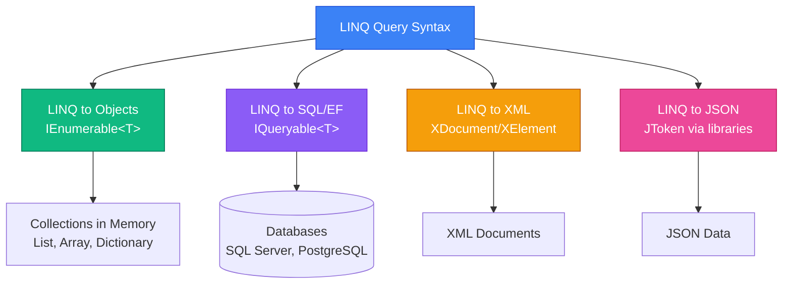
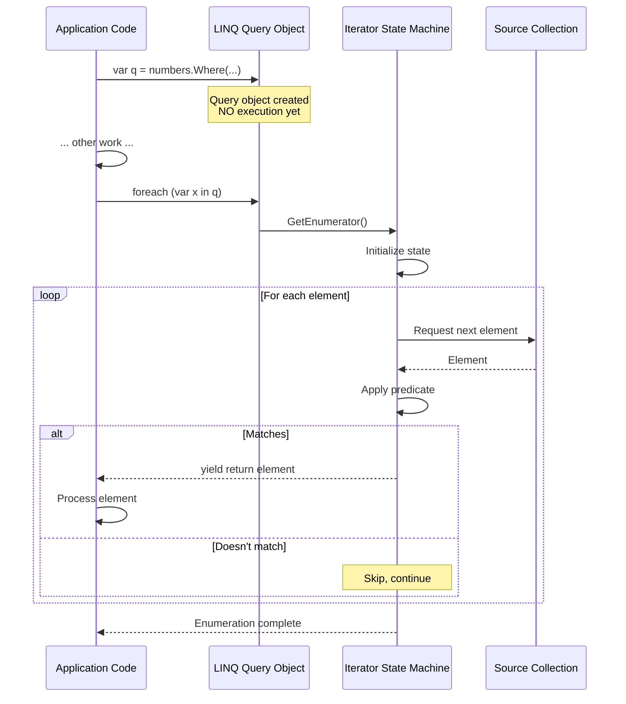
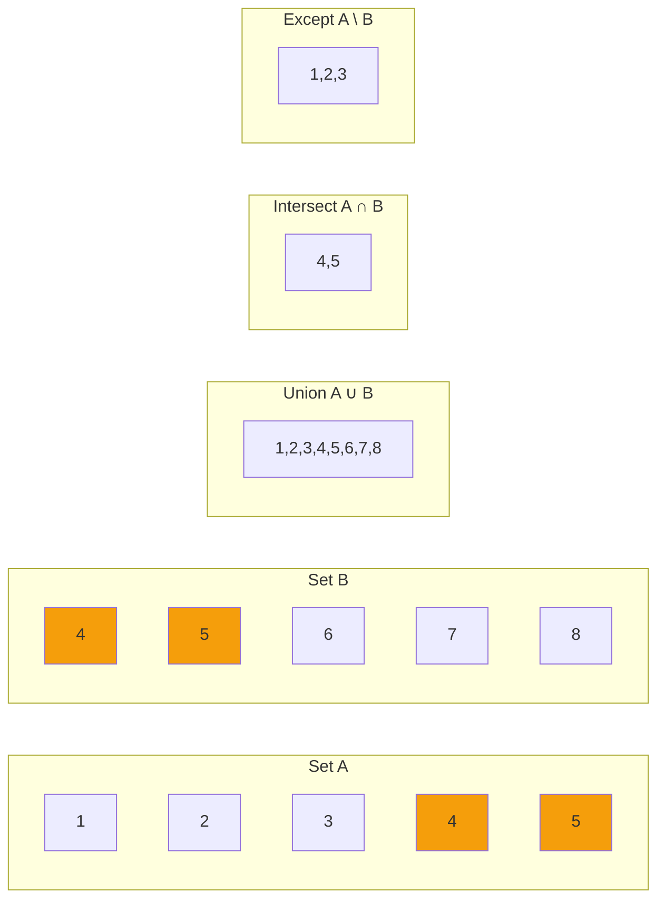

# LINQ (Language Integrated Query)

## Вступ та Контекст

### Проблематика: Імперативний Код vs Декларативні Запити

Уявіть, що ви розробляєте систему аналітики для інтернет-магазину. Потрібно знайти всі замовлення за останній місяць, згрупувати їх за категоріями товарів, відсортувати за загальною сумою та порахувати середній чек для кожної категорії.

**Традиційний імперативний підхід** виглядає так:

```csharp {showLineNumbers}
class Order
{
    public DateTime Date { get; set; }
    public string Category { get; set; } = string.Empty;
    public decimal Amount { get; set; }
}

class CategoryStats
{
    public string Category { get; set; } = string.Empty;
    public decimal TotalAmount { get; set; }
    public decimal AverageCheck { get; set; }
    public int OrderCount { get; set; }
}

static List<Order> GetAllOrders()
{
    return
    [
        new Order { Date = DateTime.Now.AddDays(-5), Category = "Electronics", Amount = 299.99m },
        new Order { Date = DateTime.Now.AddDays(-10), Category = "Books", Amount = 45.50m },
        new Order { Date = DateTime.Now.AddDays(-2), Category = "Electronics", Amount = 1200m },
        new Order { Date = DateTime.Now.AddDays(-20), Category = "Clothing", Amount = 89.99m },
        new Order { Date = DateTime.Now.AddDays(-8), Category = "Books", Amount = 23.00m },
        new Order { Date = DateTime.Now.AddDays(-15), Category = "Electronics", Amount = 599.99m },
    ];
}

List<Order> allOrders = GetAllOrders();

// Крок 1: Фільтрація за останній місяць
List<Order> lastMonthOrders = new List<Order>();
DateTime oneMonthAgo = DateTime.Now.AddMonths(-1);

foreach (var order in allOrders)
{
    if (order.Date >= oneMonthAgo)
    {
        lastMonthOrders.Add(order);
    }
}

// Крок 2: Групування за категоріями
Dictionary<string, List<Order>> groupedByCategory = new Dictionary<string, List<Order>>();

foreach (var order in lastMonthOrders)
{
    if (!groupedByCategory.ContainsKey(order.Category))
    {
        groupedByCategory[order.Category] = new List<Order>();
    }
    groupedByCategory[order.Category].Add(order);
}

// Крок 3: Обчислення статистики
List<CategoryStats> stats = new List<CategoryStats>();

foreach (var kvp in groupedByCategory)
{
    decimal total = 0;
    int count = 0;

    foreach (var order in kvp.Value)
    {
        total += order.Amount;
        count++;
    }

    stats.Add(new CategoryStats
    {
        Category = kvp.Key,
        TotalAmount = total,
        AverageCheck = total / count,
        OrderCount = count
    });
}

// Крок 4: Сортування за загальною сумою
stats.Sort((a, b) => b.TotalAmount.CompareTo(a.TotalAmount));
```

**Проблеми цього підходу:**

-   📝 **50+ рядків коду** для відносно простої операції
-   🔄 **Множинні loops** та тимчасові змінні
-   🐛 **Схильність до помилок** (забули ініціалізувати dictionary, помилка в обчисленнях)
-   📖 **Важко читати** - потрібен час щоб зрозуміти "що" код робить
-   🔧 **Важко підтримувати** - зміна логіки вимагає редагування багатьох місць

---

**LINQ (Language Integrated Query)** революціонізує цей підхід:

```csharp {1,2,11-16} showLineNumbers
List<Order> allOrders = GetAllOrders();

// Весь попередній код замінюється на:
var categoryStats = allOrders
    .Where(o => o.Date >= DateTime.Now.AddMonths(-1))
    .GroupBy(o => o.Category)
    .Select(g => new CategoryStats
    {
        Category = g.Key,
        TotalAmount = g.Sum(o => o.Amount),
        AverageCheck = g.Average(o => o.Amount),
        OrderCount = g.Count()
    })
    .OrderByDescending(s => s.TotalAmount);
```

**10 рядків замість 50+!** Код став:

-   ✅ **Читабельним** - одразу зрозуміло ЩО робимо
-   ✅ **Декларативним** - описуємо результат, а не процес
-   ✅ **Безпечним** - менше місць для помилок
-   ✅ **Підтримуваним** - зміни локальні та очевидні

---

### Що таке LINQ?

**LINQ (Language Integrated Query)** - це набір технологій у .NET, які надають **уніфікований синтаксис запитів** для роботи з даними незалежно від джерела.

::mermaid



::

**Основні провайдери LINQ:**

::field-group
::field{name="LINQ to Objects" type="IEnumerable<T>"}
Запити до **колекцій у пам'яті**: `List<T>`, масиви, `HashSet<T>`, `Dictionary<TKey, TValue>`. Виконується **client-side** безпосередньо в C# runtime.
::

::field{name="LINQ to SQL / Entity Framework" type="IQueryable<T>"}
Запити до **баз даних**. Expression trees (дерева виразів) перетворюються на SQL запити та виконуються **server-side** на database engine.
::

::field{name="LINQ to XML" type="XDocument, XElement"}
Запити до **XML документів**. Спрощує навігацію, фільтрацію та трансформацію XML через LINQ operators.
::

::field{name="LINQ to JSON" type="через бібліотеки"}
Робота з **JSON даними** (наприклад, Newtonsoft.Json `JToken`, System.Text.Json). Парсинг та querying JSON structures.
::
::

**У цьому матеріалі фокус на LINQ to Objects** - найпоширенішому та фундаментальному сценарії.

---

### Чому LINQ Революційний?

**1. Language Integration (Інтеграція з Мовою)**

LINQ - не зовнішня бібліотека, а **частина C# синтаксису**:

-   Compile-time type checking
-   IntelliSense підтримка
-   Refactoring безпечність

**2. Уніфікація Підходів**

До LINQ кожне джерело даних мало свій API:

-   Collections: `foreach`, `List.Sort()`, custom loops
-   Databases: SQL строки, ADO.NET
-   XML: `XmlDocument` DOM navigation

LINQ надає **єдиний синтаксис** для всіх.

**3. Composability (Композиційність)**

Операції easily chain-яться:

```csharp
var result = data
    .Where(filters)
    .Select(transformation)
    .OrderBy(sorting)
    .GroupBy(grouping)
    .Take(pagination);
```

**4. Deferred Execution (Відкладене Виконання)**

Queries виконуються **лише при потребі** → ефективність та lazy evaluation.

---

### Що Ви Вивчите

У цьому матеріалі ви глибоко освоїте:

::steps

### Query Syntax vs Method Syntax

Два способи написання LINQ запитів - SQL-подібний та fluent API. Коли використовувати який.

### Deferred vs Immediate Execution

Як працює відкладене виконання, iterator pattern, performance implications, caching strategies.

### Filtering & Projection

`Where`, `OfType`, `Select`, `SelectMany` - фільтрація та трансформація даних.

### Sorting & Grouping

`OrderBy`, `ThenBy`, `GroupBy` - складне сортування та групування з агрегаціями.

### Joins

Inner join, group join, left outer join patterns для комбінування даних.

### Aggregation

`Sum`, `Count`, `Average`, `Max`, `Min`, `MaxBy`, `MinBy`, `Aggregate` - обчислення over collections.

### Set Operations

`Distinct`, `Union`, `Intersect`, `Except` - операції над множинами.

### Element Operations

`First`, `Single`, `ElementAt`, `Any`, `All` - витягування та перевірка елементів.

### Performance & Best Practices

Оптимізація queries, уникнення пасток, коли використовувати `ToList()`.
::

---

### Prerequisites

Для повного розуміння матеріалу необхідно знати:

-   ✅ **Generic Collections**: `List<T>`, `Dictionary<TKey, TValue>`, `IEnumerable<T>`
-   ✅ **Delegates та Lambda Expressions**: `Func<T>`, `Action<T>`, `x => x.Property`
-   ✅ **Anonymous Types**: `new { Name = "John", Age = 30 }`
-   ✅ **Extension Methods**: розуміння як працюють `this` parameter methods
-   ✅ **Базове ООП**: classes, properties, interfaces

::tip
Якщо щось з prerequisites незрозуміло - поверніться до відповідних розділів roadmap перед продовженням.
::

---

## Query Syntax vs Method Syntax

LINQ надає **два еквівалентні способи** написання запитів. Розберемо обидва детально.

### Query Syntax (Comprehension Syntax)

**Query syntax** нагадує SQL та використовує спеціальні ключові слова C#:

```csharp {showLineNumbers}
List<int> numbers = [1, 2, 3, 4, 5, 6, 7, 8, 9, 10];

// Query syntax - SQL-подібний
IEnumerable<int> evenNumbers =
    from num in numbers
    where num % 2 == 0
    orderby num
    select num;

foreach (int n in evenNumbers)
{
    Console.Write($"{n} ");
}
// Output: 2 4 6 8 10
```

**Структура query syntax:**

```csharp
from [identifier] in [source]
[where условие]
[orderby поле [ascending|descending]]
[group ... by ... into ...]
[join ... in ... on ... equals ...]
select [projection]
```

**Ключові ключові слова:**

-   `from` - визначає джерело даних та range variable
-   `where` - фільтрує елементи
-   `orderby` - сортує результати
-   `select` - проектує (трансформує) результати
-   `group by` - групує елементи
-   `join` - з'єднує два джерела

---

### Method Syntax (Fluent API)

**Method syntax** використовує extension methods на `IEnumerable<T>`:

```csharp {showLineNumbers}
List<int> numbers = [1, 2, 3, 4, 5, 6, 7, 8, 9, 10];

// Method syntax - fluent API
IEnumerable<int> evenNumbers = numbers
    .Where(num => num % 2 == 0)
    .OrderBy(num => num);

foreach (int n in evenNumbers)
{
    Console.Write($"{n} ");
}
// Output: 2 4 6 8 10
```

**Extension methods chain:**

-   Кожен метод приймає `IEnumerable<T>`
-   Повертає `IEnumerable<TResult>`
-   Дозволяє **fluent chaining**

**Lambda expressions:**

```csharp
num => num % 2 == 0
// ↑      ↑
// параметр  тіло (вираз або блок)
```

---

### Що Відбувається "Під Капотом"?

**Query syntax - це syntactic sugar!** Компілятор C# **перетворює** його на method syntax.

::code-group

```csharp [Ви Пишете (Query)]
int[] numbers = [1, 2, 3, 4, 5, 6, 7, 8, 9, 10];

var query = from n in numbers
            where n > 5
            select n * 2;
```

```csharp [Компілятор Генерує (Method)]
int[] numbers = [1, 2, 3, 4, 5, 6, 7, 8, 9, 10];

var query = numbers
    .Where(n => n > 5)
    .Select(n => n * 2);
```

::

**Verification через IL:**

```csharp
class Student { public string Name { get; set; } = ""; public int Age { get; set; } }
var students = new List<Student> { new() { Name = "Alice", Age = 20 }, new() { Name = "Bob", Age = 17 } };

// Original query syntax
var result = from s in students
             where s.Age >= 18
             select s.Name;
```

**IL Code (simplified):**

```il
.method private hidebysig instance void Main()
{
    // ...
    call class [System.Linq]System.Linq.Enumerable::Where<...>(...)
    call class [System.Linq]System.Linq.Enumerable::Select<...>(...)
    // ...
}
```

→ Query syntax компілюється у виклики `Enumerable.Where()` та `Enumerable.Select()`!

---

### Детальне Порівняння

::code-group

```csharp [Query Syntax] {1-20} showLineNumbers
class Student
{
    public string Name { get; set; } = string.Empty;
    public int Grade { get; set; }
    public bool IsActive { get; set; }
    public int Age { get; set; }
    public string Department { get; set; } = string.Empty;
}

static List<Student> GetStudents()
{
    return
    [
        new Student { Name = "Alice", Grade = 95, IsActive = true, Age = 22, Department = "Engineering" },
        new Student { Name = "Bob", Grade = 88, IsActive = true, Age = 23, Department = "Marketing" },
        new Student { Name = "Charlie", Grade = 92, IsActive = false, Age = 21, Department = "Engineering" },
        new Student { Name = "Diana", Grade = 87, IsActive = true, Age = 20, Department = "Arts" },
    ];
}

List<Student> students = GetStudents();

var topStudents =
    from s in students
    where s.Grade >= 90 && s.IsActive
    orderby s.Name
    select new { s.Name, s.Grade };

foreach (var student in topStudents)
{
    Console.WriteLine($"{student.Name}: {student.Grade}");
}
```

```csharp [Method Syntax] {1,3-6} showLineNumbers
List<Student> students = GetStudents(); // Using the same GetStudents() from above

var topStudents = students
    .Where(s => s.Grade >= 90 && s.IsActive)
    .OrderBy(s => s.Name)
    .Select(s => new { s.Name, s.Grade });

foreach (var student in topStudents)
{
    Console.WriteLine($"{student.Name}: {student.Grade}");
}
```

::

**Обидва варіанти:**

-   ✅ Типо-безпечні
-   ✅ Compile-time перевірка
-   ✅ Однакова performance (identical IL)
-   ✅ Deferred execution

---

### Порівняльна Таблиця

| Аспект                     | Query Syntax                                           | Method Syntax                           |
| :------------------------- | :----------------------------------------------------- | :-------------------------------------- |
| **Читабельність**          | SQL-familiar, природний для queries                    | C# idiomatic, fluent                    |
| **Доступність операторів** | Обмежено ключовими словами (`from`, `where`, `select`) | Всі `IEnumerable<T>` extension methods  |
| **Join Syntax**            | ✅ Простіший та читабельніший                          | Більш verbose                           |
| **GroupBy**                | ✅ `group ... by ... into ...` інтуїтивний             | Потребує розуміння `IGrouping<TKey, T>` |
| **Pagination**             | ❌ Немає `Take`, `Skip`                                | ✅ Всі operators доступні               |
| **Custom Extensions**      | ❌ Не підтримується                                    | ✅ Легко додати власні methods          |
| **Debugging**              | Складніше (один вираз)                                 | ✅ Легше breakpoint-ити кожен метод     |
| **Міксування**             | Можна поєднувати з method syntax                       | Повністю самодостатній                  |

---

### Коли Використовувати Що?

::tip
**Method Syntax** - **рекомендується для більшості випадків**:

-   ✅ Універсальний (всі operators)
-   ✅ Легше chain-ити та тестувати
-   ✅ Звичний для сучасного C# коду
-   ✅ Підтримує custom extensions

**Query Syntax** - корисний для:

-   ✅ Складних **joins** (більш читабельний)
-   ✅ **GroupBy** з множинними операціями
-   ✅ SQL-background developers (швидше освоєння)

::

**Практичний приклад (Join):**

::code-group

```csharp [Query - Читабельніший Join]
class Customer { public int Id { get; set; } public string Name { get; set; } = ""; }
class Order { public int CustomerId { get; set; } public DateTime Date { get; set; } }
var customers = new List<Customer> { new() { Id = 1, Name = "John" } };
var orders = new List<Order> { new() { CustomerId = 1, Date = DateTime.Now } };

var customerOrders =
    from c in customers
    join o in orders on c.Id equals o.CustomerId
    select new { Customer = c.Name, Order = o.Date };
```

```csharp [Method - Менш читабельний]
// Using the same customers and orders from above
var customerOrders = customers.Join(
    orders,
    c => c.Id,
    o => o.CustomerId,
    (c, o) => new { Customer = c.Name, Order = o.Date }
);
```

::

**Практичний приклад (Pagination):**

```csharp
class Product { public string Category { get; set; } = ""; }
var products = new List<Product> { new() { Category = "Electronics" } };

// Query syntax НЕ підтримує Take/Skip напряму
var page2 = (from p in products
             where p.Category == "Electronics"
             select p)
            .Skip(20)  // Потрібно перемикатись на method syntax!
            .Take(10);

// Method syntax - природно
var page2 = products
    .Where(p => p.Category == "Electronics")
    .Skip(20)
    .Take(10);
```

---

### Можна Міксувати!

```csharp {5-6} showLineNumbers
// Query syntax з method syntax extension
var result =
    (from p in products
     where p.InStock
     select p)
    .OrderByDescending(p => p.Price)  // Method syntax
    .Take(5);                         // Method syntax
```

::note
**Best Practice**: Починайте з method syntax. Якщо join або group by стають незрозумілими - переключайтесь на query syntax для тієї частини.
::

---

## Deferred Execution (Відкладене Виконання)

Це **найважливіша концепція** LINQ, яку необхідно глибоко розуміти для ефективного використання.

### Lazy Evaluation - Як Це Працює?

Коли ви пишете LINQ query, **він НЕ виконується негайно**. Натомість створюється **query definition** (визначення запиту), який виконається лише коли ви почнете **ітерувати** результати.

```csharp {4-8,12} showLineNumbers
List<int> numbers = [1, 2, 3, 4, 5];

Console.WriteLine("=== До створення query ===");

// Запит створено, але НЕ виконано!
var query = numbers.Where(n => {
    Console.WriteLine($"  Filtering: {n}");
    return n % 2 == 0;
});

Console.WriteLine("=== Після створення, до ітерації ===");

// ТІЛЬКИ ТЕПЕР виконується!
foreach (int n in query)
{
    Console.WriteLine($"Result: {n}");
}
```

**Output:**

```
=== До створення query ===
=== Після створення, до ітерації ===
  Filtering: 1
  Filtering: 2
Result: 2
  Filtering: 3
  Filtering: 4
Result: 4
  Filtering: 5
```

**Що відбулось:**

1. Рядок 6-8: Query **створено**, but `Where` predicate НЕ викликається!
2. Рядок 14: `foreach` починає enumeration → **ТЕПЕР** query виконується
3. Фільтрація відбувається **елемент за елементом** під час ітерації

---

### "Under the Hood": Iterator Pattern

LINQ використовує **iterator pattern** (через `yield return`):

```csharp {showLineNumbers}
// Спрощена реалізація Where
public static IEnumerable<T> Where<T>(
    this IEnumerable<T> source,
    Func<T, bool> predicate)
{
    foreach (T item in source)
    {
        if (predicate(item))
        {
            yield return item;  // Повернути element при запиті
        }
    }
}

// Коли ви пишете:
var query = numbers.Where(n => n > 5);

// Створюється ітератор (state machine), який:
// 1. Зберігає source (numbers) та predicate (n => n > 5)
// 2. Чекає на enumeration
//  3. При foreach - виконує логіку блоку за блоком
```

::mermaid



::

---

### Multiple Enumeration Problem

**Кожна ітерація повторно виконує** весь query!

```csharp {6-9,12-13} showLineNumbers
var query = numbers.Where(n => {
    Console.WriteLine($"Checking {n}");
    return n > 3;
});

// Перша ітерація
Console.WriteLine("=== First Enumeration ===");
foreach (var n in query)
    Console.Write($"{n} ");

// Друга ітерація - QUERY ВИКОНУЄТЬСЯ ЗНОВУ!
Console.WriteLine("\n=== Second Enumeration ===");
foreach (var n in query)
    Console.Write($"{n} ");
```

**Output:**

```
=== First Enumeration ===
Checking 1
Checking 2
Checking 3
Checking 4
4 Checking 5
5
=== Second Enumeration ===
Checking 1  ← Знову виконується!
Checking 2
Checking 3
Checking 4
4 Checking 5
5
```

::warning
**Performance Trap**: Якщо query **дорогий** (читає файли, робить HTTP запити, виконує складні обчислення), повторна enumeration може бути **катастрофічною** для performance!

**Приклад проблеми:**

```csharp
// Дорогий query (читає з database або API)
var expensiveQuery = GetUsersFromDatabase()
    .Where(u => u.IsActive)
    .Select(u => TransformUser(u));  // Дорога операція

// Перша ітерація - виконано
int count = expensiveQuery.Count();  // Database query #1

// Друга ітерація - ЗНОВУ database query!
var first10 = expensiveQuery.Take(10).ToList();  // Database query #2

// Це виконало ДВА повних database queries!
```

::

---

### Immediate Execution

Щоб **виконати query одразу** і закешувати results, використовуйте **materializing operators**:

**Оператори з immediate execution:**

::field-group
::field{name="ToList()" type="List<T>"}
Виконує query та зберігає результати у `List<T>`. Найчастіший вибір для caching.
::

::field{name="ToArray()" type="T[]"}
Виконує query та повертає масив. Корисно для fixed-size collections.
::

::field{name="ToDictionary()" type="Dictionary<TKey, TValue>"}
Створює dictionary з key selector. Immediate execution + fast lookup.
::

::field{name="Count()" type="int"}
Підраховує елементи. Виконує весь query для підрахунку.
::

::field{name="Sum(), Average(), Max(), Min()" type="numeric"}
Aggregation operators - завжди immediate execution.
::

::field{name="First(), FirstOrDefault(), Single()" type="T"}
Витягують element(s) - immediate execution для того елемента.
::
::

**Приклад з кешуванням:**

```csharp {6,9,14,17} showLineNumbers
List<int> numbers = [1, 2, 3, 4, 5];

// Deferred - query definition
IEnumerable<int> deferredQuery = numbers.Where(n => n > 2);

// Immediate - виконано ОДРАЗУ, результат у List
List<int> cachedQuery = numbers.Where(n => n > 2).ToList();

// Модифікуємо джерело
numbers.Add(6);

// Deferred query побачить зміни (виконується знову)
Console.WriteLine(string.Join(", ", deferredQuery));
// Output: 3, 4, 5, 6  ← Бачить 6!

// Cached query НЕ побачить змін (вже виконано раніше)
Console.WriteLine(string.Join(", ", cachedQuery));
// Output: 3, 4, 5  ← НЕ бачить 6

// Proof: повторна enumeration deferred
Console.WriteLine(string.Join(", ", deferredQuery));
// Output: 3, 4, 5, 6  ← Знову виконується, бачить 6
```

::tip
**Коли використовувати `ToList()`:**

-   ✅ Потрібно **кілька разів** ітерувати результати
-   ✅ Query **дорогий** (database, file I/O, network)
-   ✅ Хочете **snapshot** даних у певний moment
-   ✅ Потрібна **модифікація** collection (Add/Remove)

**Коли залишити deferred:**

-   ✅ Одноразова ітерація
-   ✅ Пайплайн transformations (chain кілька operations)
-   ✅ Потрібна **актуальність** даних (завжди fresh data)

::

---

## Filtering (Фільтрація)

### Where - Основний Фільтр

**Сигнатура:**

```csharp
IEnumerable<T> Where<T>(this IEnumerable<T> source, Func<T, bool> predicate)
IEnumerable<T> Where<T>(this IEnumerable<T> source, Func<T, int, bool> predicate)
```

**Базове використання:**

```csharp {showLineNumbers}
class Product
{
    public string Name { get; set; } = string.Empty;
    public decimal Price { get; set; }
    public string Category { get; set; } = string.Empty;
    public bool InStock { get; set; }
    public bool IsActive { get; set; }
    public bool IsOnSale { get; set; }
    public double Rating { get; set; }
}

static List<Product> GetProducts()
{
    return
    [
        new Product { Name = "Laptop", Price = 1200m, Category = "Electronics", InStock = true, IsActive = true, IsOnSale = false, Rating = 4.5 },
        new Product { Name = "Mouse", Price = 25m, Category = "Electronics", InStock = true, IsActive = true, IsOnSale = true, Rating = 4.2 },
        new Product { Name = "Keyboard", Price = 75m, Category = "Electronics", InStock = false, IsActive = true, IsOnSale = false, Rating = 4.7 },
        new Product { Name = "C# Guide", Price = 45m, Category = "Books", InStock = true, IsActive = true, IsOnSale = false, Rating = 4.8 },
        new Product { Name = "LINQ Mastery", Price = 38m, Category = "Books", InStock = true, IsActive = true, IsOnSale = true, Rating = 4.9 },
        new Product { Name = "Monitor", Price = 350m, Category = "Electronics", InStock = true, IsActive = true, IsOnSale = false, Rating = 4.6 },
        new Product { Name = "Desk Chair", Price = 199m, Category = "Furniture", InStock = true, IsActive = true, IsOnSale = true, Rating = 4.3 },
    ];
}

List<Product> products = GetProducts();

// Прості умови
var expensiveProducts = products.Where(p => p.Price > 100);

// Множинні умови з &&
var specificProducts = products.Where(p =>
    p.Price >= 50 &&
    p.Price <= 200 &&
    p.Category == "Electronics" &&
    p.InStock
);

// З predicate method
bool IsActiveAndCheap(Product p) => p.IsActive && p.Price < 50;
var cheapActive = products.Where(IsActiveAndCheap);
```

**Index overload:**

```csharp {showLineNumbers}
// З індексом (index overload)
var evenIndexProducts = products.Where((p, index) => index % 2 == 0);

// Взяти кожен 3-й елемент
var everyThird = products.Where((p, i) => i % 3 == 0);

// Перші 10 відфільтровані
var firstTenExpensive = products
    .Where((p, i) => p.Price > 100 && i < 10);
```

---

### OfType\<T\> - Фільтр За Типом

Витягує елементи конкретного типу з heterogeneous collection:

```csharp {showLineNumbers}
object[] mixed = [1, "text", 3.14, "hello", 42, null, true];

// Тільки int
IEnumerable<int> numbers = mixed.OfType<int>();
Console.WriteLine(string.Join(", ", numbers));
// Output: 1, 42

// Тільки string
IEnumerable<string> strings = mixed.OfType<string>();
Console.WriteLine(string.Join(", ", strings));
// Output: text, hello

// З inheritance
class Animal
{
    public string Name { get; set; } = string.Empty;
}

class Dog : Animal
{
    public Dog(string name) { Name = name; }
    public void Bark() => Console.WriteLine($"{Name} says: Woof!");
}

class Cat : Animal
{
    public Cat(string name) { Name = name; }
    public void Meow() => Console.WriteLine($"{Name} says: Meow!");
}

class Bird : Animal
{
    public Bird(string name) { Name = name; }
    public void Chirp() => Console.WriteLine($"{Name} says: Chirp!");
}

List<Animal> animals = [
    new Dog("Rex"),
    new Cat("Whiskers"),
    new Dog("Buddy"),
    new Bird("Tweety")
];

// Тільки Dogs
IEnumerable<Dog> dogs = animals.OfType<Dog>();
foreach (var dog in dogs)
{
    dog.Bark();  // Type-safe!
}
```

**Різниця від `Where`:**

```csharp
// Where потребує manual casting та null check
var dogsWhere = animals
    .Where(a => a is Dog)
    .Select(a => (Dog)a);  // Manual cast!

// OfType - type-safety built-in
var dogsOfType = animals.OfType<Dog>();  // Чисто та безпечно
```

---

## Projection (Проекція)

### Select - Трансформація Елементів

**Сигнатура:**

```csharp
IEnumerable<TResult> Select<T, TResult>(
    this IEnumerable<T> source,
    Func<T, TResult> selector)
```

**Прості трансформації:**

```csharp {showLineNumbers}
List<Product> products = GetProducts();

// Extraction одного поля
IEnumerable<string> names = products.Select(p => p.Name);

// Обчислення
IEnumerable<decimal> pricesWithTax = products
    .Select(p => p.Price * 1.2m);

// Anonymous type
var summary = products.Select(p => new {
    p.Name,
    p.Price,
    TaxIncluded = p.Price * 1.2m,
    Discount = p.IsOnSale ? p.Price * 0.1m : 0
});

foreach (var item in summary)
{
    Console.WriteLine($"{item.Name}: ${item.TaxIncluded} (discount: ${item.Discount})");
}
```

**Index overload:**

```csharp {showLineNumbers}
var indexedNames = products.Select((p, index) =>
    $"{index + 1}. {p.Name}"
);

// Output:
// 1. Laptop
// 2. Mouse
// 3. Keyboard
```

---

### SelectMany - Flattening Collections

**Проблема**: Маємо collection of collections, потрібна flat collection.

```csharp {showLineNumbers}
class Employee
{
    public string Name { get; set; } = string.Empty;
    public Employee(string name) { Name = name; }
}

class Department
{
    public string Name { get; set; } = string.Empty;
    public List<Employee> Employees { get; set; } = new();
}

List<Department> departments = [
    new() { Name = "IT", Employees = [new("Alice"), new("Bob")] },
    new() { Name = "HR", Employees = [new("Charlie")] },
    new() { Name = "Sales", Employees = [new("Dave"), new("Eve"), new("Frank")] }
];

// Без SelectMany - вложена collection!
IEnumerable<IEnumerable<Employee>> nested = departments
    .Select(d => d.Employees);
// Type: IEnumerable<IEnumerable<Employee>> - not flat!

// З SelectMany - плоский результат
IEnumerable<Employee> allEmployees = departments
    .SelectMany(d => d.Employees);

foreach (var emp in allEmployees)
{
    Console.WriteLine(emp.Name);
}
// Output:
// Alice
// Bob
// Charlie
// Dave
// Eve
// Frank
```

**Query syntax equivalent:**

::code-group

```csharp [Method Syntax]
var allEmployees = departments
    .SelectMany(d => d.Employees);
```

```csharp [Query Syntax - Multiple from]
var allEmployees =
    from dept in departments
    from emp in dept.Employees  // Flattening!
    select emp;
```

::

**Cartesian Product (Combinations):**

```csharp {showLineNumbers}
int[] numbers = [1, 2, 3];
char[] letters = ['a', 'b'];

// Всі комбінації
var combinations = numbers.SelectMany(
    num => letters,              // Для кожного num - всі letters
    (num, letter) => $"{num}{letter}"  // Result selector
);

Console.WriteLine(string.Join(", ", combinations));
// Output: 1a, 1b, 2a, 2b, 3a, 3b
```

---

## Sorting (Сортування)

### OrderBy / OrderByDescending

```csharp {showLineNumbers}
List<Product> products = GetProducts();

// Ascending (за зростанням)
var byPriceAsc = products.OrderBy(p => p.Price);

// Descending (за спаданням)
var byPriceDesc = products.OrderByDescending(p => p.Price);

// Query syntax
var querySorted = from p in products
                  orderby p.Price descending
                  select p;

// Виведемо перші 5
foreach (var p in byPriceDesc.Take(5))
{
    Console.WriteLine($"{p.Name}: ${p.Price}");
}
```

---

### ThenBy / ThenByDescending - Вторинне Sorting

**Use case**: Коли primary keys однакові, сортувати за secondary key.

```csharp {showLineNumbers}
List<Student> students = GetStudents();

// Primary: Grade (descending), Secondary: Name (ascending)
var sorted = students
    .OrderByDescending(s => s.Grade)  // Спочатку за оцінкою
    .ThenBy(s => s.Name);              // Потім за ім'ям

// Query syntax
var querySorted = from s in students
                  orderby s.Grade descending, s.Name
                  select s;

// Множинні рівні
var complex = students
    .OrderBy(s => s.Department)         // 1-й рівень
    .ThenByDescending(s => s.Grade)     // 2-й рівень
    .ThenBy(s => s.Age)                 // 3-й рівень
    .ThenBy(s => s.Name);               // 4-й рівень
```

**Приклад output:**

```
Department: Engineering
  - Name: Alice, Grade: 95, Age: 22
  - Name: Bob, Grade: 95, Age: 23
  - Name: Charlie, Grade: 88, Age: 21

Department: Marketing
  - Name: Dave, Grade: 92, Age: 24
  ...
```

---

## Grouping (Групування)

### GroupBy - Створення Груп

**Сигнатура:**

```csharp
IEnumerable<IGrouping<TKey, TElement>> GroupBy<T, TKey>(
    this IEnumerable<T> source,
    Func<T, TKey> keySelector)
```

**`IGrouping<TKey, TElement>`** - це спеціальний інтерфейс:

```csharp
interface IGrouping<out TKey, out TElement> : IEnumerable<TElement>
{
    TKey Key { get; }  // Ключ групи
}
```

**Базове групування:**

```csharp {showLineNumbers}
List<Product> products = GetProducts();

// Групування за категорією
IEnumerable<IGrouping<string, Product>> byCategory =
    products.GroupBy(p => p.Category);

foreach (var group in byCategory)
{
    Console.WriteLine($"\nCategory: {group.Key}");

    foreach (var product in group)
    {
        Console.WriteLine($"  - {product.Name}: ${product.Price}");
    }
}

// Output:
// Category: Electronics
//   - Laptop: $1200
//   - Mouse: $25
// Category: Books
//   - C# Guide: $45
//   - LINQ Mastery: $38
```

**Групування з агрегацією:**

```csharp {showLineNumbers}
var categoryStats = products
    .GroupBy(p => p.Category)
    .Select(g => new {
        Category = g.Key,
        Count = g.Count(),
        TotalValue = g.Sum(p => p.Price),
        AveragePrice = g.Average(p => p.Price),
        MostExpensive = g.Max(p => p.Price),
        CheapestName = g.OrderBy(p => p.Price).First().Name
    });

foreach (var stat in categoryStats)
{
    Console.WriteLine($"{stat.Category}:");
    Console.WriteLine($"  Products: {stat.Count}");
    Console.WriteLine($"  Total: ${stat.TotalValue}");
    Console.WriteLine($"  Avg: ${stat.AveragePrice:F2}");
}
```

**Query syntax:**

```csharp {showLineNumbers}
var queryGrouped =
    from p in products
    group p by p.Category into g  // 'into' creates IGrouping
    select new {
        Category = g.Key,
        Products = g.ToList(),
        TotalValue = g.Sum(p => p.Price)
    };
```

**Nested queries на groups:**

```csharp {showLineNumbers}
// Топ-3 products у кожній категорії
var topPerCategory = products
    .GroupBy(p => p.Category)
    .Select(g => new {
        Category = g.Key,
        TopProducts = g.OrderByDescending(p => p.Price)
                       .Take(3)
                       .Select(p => p.Name)
                       .ToList()
    });
```

---

## Joins (З'єднання)

### Inner Join

Поєднує два sequences за shared key:

::code-group

```csharp [Method Syntax] {showLineNumbers}
class Customer
{
    public int Id { get; set; }
    public string Name { get; set; } = string.Empty;
}

class Order
{
    public int CustomerId { get; set; }
    public DateTime Date { get; set; }
    public decimal TotalAmount { get; set; }
}

static List<Customer> GetCustomers()
{
    return
    [
        new Customer { Id = 1, Name = "John Doe" },
        new Customer { Id = 2, Name = "Jane Smith" },
        new Customer { Id = 3, Name = "Bob Johnson" },
    ];
}

static List<Order> GetOrders()
{
    return
    [
        new Order { CustomerId = 1, Date = DateTime.Parse("2024-01-15"), TotalAmount = 299.99m },
        new Order { CustomerId = 1, Date = DateTime.Parse("2024-02-20"), TotalAmount = 150.00m },
        new Order { CustomerId = 2, Date = DateTime.Parse("2024-01-10"), TotalAmount = 450.50m },
        new Order { CustomerId = 3, Date = DateTime.Parse("2024-03-05"), TotalAmount = 89.99m },
    ];
}

List<Customer> customers = GetCustomers();
List<Order> orders = GetOrders();

var customerOrders = customers.Join(
    orders,                      // Inner sequence
    c => c.Id,                   // Outer key selector
    o => o.CustomerId,           // Inner key selector
    (c, o) => new {              // Result selector
        CustomerName = c.Name,
        OrderDate = o.Date,
        Amount = o.TotalAmount
    }
);

foreach (var item in customerOrders)
{
    Console.WriteLine($"{item.CustomerName}: {item.Amount} on {item.OrderDate}");
}
```

```csharp [Query Syntax] {showLineNumbers}
var customerOrders =
    from c in customers
    join o in orders on c.Id equals o.CustomerId
    select new {
        CustomerName = c.Name,
        OrderDate = o.Date,
        Amount = o.TotalAmount
    };
```

::

---

### Group Join

Зв'язує кожен outer element з **групою** matching inner elements:

```csharp {showLineNumbers}
var customersWithOrders = customers.GroupJoin(
    orders,
    c => c.Id,
    o => o.CustomerId,
    (customer, customerOrders) => new {
        Customer = customer.Name,
        OrdersCount = customerOrders.Count(),
        Orders = customerOrders.ToList()
    }
);

foreach (var item in customersWithOrders)
{
    Console.WriteLine($"{item.Customer}: {item.OrdersCount} orders");
    foreach (var order in item.Orders)
    {
        Console.WriteLine($"  - {order.Date}: ${order.TotalAmount}");
    }
}

// Query syntax
var queryGroupJoin =
    from c in customers
    join o in orders on c.Id equals o.CustomerId into customerOrders
    select new {
        Customer = c.Name,
        Orders = customerOrders.ToList()
    };
```

---

### Left Outer Join Pattern

LINQ немає вбудованого left join, але його можна емулювати через **`DefaultIfEmpty()`**:

```csharp {showLineNumbers}
// Left join: всі customers, навіть без orders
var leftJoin =
    from c in customers
    join o in orders on c.Id equals o.CustomerId into customerOrders
    from order in customerOrders.DefaultIfEmpty()  // Key part!
    select new {
        CustomerName = c.Name,
        OrderDate = order?.Date,         // Nullable!
        Amount = order?.TotalAmount ?? 0  // Handle null
    };

// Method syntax
var leftJoinMethod = customers
    .GroupJoin(orders, c => c.Id, o => o.CustomerId,
        (c, orders) => new { Customer = c, Orders = orders })
    .SelectMany(
        x => x.Orders.DefaultIfEmpty(),
        (x, order) => new {
            CustomerName = x.Customer.Name,
            OrderDate = order?.Date,
            Amount = order?.TotalAmount ?? 0
        }
    );
```

| Join Type           | Результат                         | Use Case                          |
| :------------------ | :-------------------------------- | :-------------------------------- |
| **Inner Join**      | Тільки matching pairs             | Orders з customers                |
| **Group Join**      | Outer + grouped inner             | Customers з їх orders lists       |
| **Left Outer Join** | All outer + matched inner (nulls) | All customers (навіть без orders) |

---

## Aggregation (Агрегація)

### Standard Aggregates

```csharp {showLineNumbers}
List<int> numbers = [1, 2, 3, 4, 5, 6, 7, 8, 9, 10];

// Базові aggregates
int sum = numbers.Sum();                    // 55
int count = numbers.Count();                // 10
int max = numbers.Max();                    // 10
int min = numbers.Min();                    // 1
double average = numbers.Average();         // 5.5

// З predicate
int evenCount = numbers.Count(n => n % 2 == 0);   // 5
int evenSum = numbers.Where(n => n % 2 == 0).Sum(); // 30

// LongCount для великих колекцій
long bigCount = veryLargeCollection.LongCount();

// На властивостях
List<Product> products = GetProducts();
decimal totalValue = products.Sum(p => p.Price);
decimal avgPrice = products.Average(p => p.Price);
```

---

### MaxBy / MinBy (.NET 6+)

Знаходить **елемент** з max/min значенням властивості (один прохід!):

```csharp {showLineNumbers}
List<Product> products = GetProducts();

// Старий спосіб (неефективно - два проходи)
decimal maxPrice = products.Max(p => p.Price);
var mostExpensiveOld = products.First(p => p.Price == maxPrice);

// Новий спосіб (.NET 6+, один прохід)
Product? mostExpensive = products.MaxBy(p => p.Price);
Product? cheapest = products.MinBy(p => p.Price);

Console.WriteLine($"Most expensive: {mostExpensive?.Name} (${mostExpensive?.Price})");

// З фільтрацією
var bestElectronics = products
    .Where(p => p.Category == "Electronics")
    .MaxBy(p => p.Rating);
```

---

### Aggregate - Custom Accumulator

Універсальний оператор для custom aggregation:

```csharp {showLineNumbers}
List<int> numbers = [1, 2, 3, 4, 5];

// Добуток всіх чисел
int product = numbers.Aggregate((acc, n) => acc * n);
// 1 * 2 = 2, 2 * 3 = 6, 6 * 4 = 24, 24 * 5 = 120

// З seed (початковим значенням)
int productWithSeed = numbers.Aggregate(1, (acc, n) => acc * n);

// З result selector
string concatenated = numbers.Aggregate(
    "",                              // Seed
    (acc, n) => acc + n.ToString(),  // Accumulator
    result => $"Numbers: {result}"   // Result selector
);
// Output: "Numbers: 12345"

// Практичний приклад: построція складного об'єкта
List<string> words = ["Hello", "World", "From", "LINQ"];
string sentence = words.Aggregate((acc, word) => $"{acc} {word}");
// "Hello World From LINQ"

// Складна агрегація
var stats = numbers.Aggregate(
    new { Sum = 0, Count = 0 },
    (acc, n) => new {
        Sum = acc.Sum + n,
        Count = acc.Count + 1
    },
    acc => new {
        acc.Sum,
        acc.Count,
        Average = (double)acc.Sum / acc.Count
    }
);
```

---

## Set Operations (Множинні Операції)

### Distinct / DistinctBy

```csharp {showLineNumbers}
int[] numbers = [1, 2, 2, 3, 3, 3, 4, 5, 5];

var unique = numbers.Distinct();
Console.WriteLine(string.Join(", ", unique));
// Output: 1, 2, 3, 4, 5

// На об'єктах (потребує Equals/GetHashCode override або comparer)
List<Product> products = GetProducts();

// .NET 6+: DistinctBy з key selector
var uniqueByCategory = products.DistinctBy(p => p.Category);
var uniqueByPrice = products.DistinctBy(p => p.Price);
```

---

### Union, Intersect, Except

```csharp {showLineNumbers}
int[] setA = [1, 2, 3, 4, 5];
int[] setB = [4, 5, 6, 7, 8];

// Union - об'єднання (без дублікатів)
var union = setA.Union(setB);
Console.WriteLine(string.Join(", ", union));
// Output: 1, 2, 3, 4, 5, 6, 7, 8

// Intersect - перетин (спільні елементи)
var intersect = setA.Intersect(setB);
Console.WriteLine(string.Join(", ", intersect));
// Output: 4, 5

// Except - різниця (A \ B)
var except = setA.Except(setB);
Console.WriteLine(string.Join(", ", except));
// Output: 1, 2, 3

// .NET 6+: By variants
static List<Product> GetProductsA()
{
    return
    [
        new Product { Name = "Laptop", Category = "Electronics" },
        new Product { Name = "Mouse", Category = "Electronics" },
        new Product { Name = "Book", Category = "Books" },
    ];
}

static List<Product> GetProductsB()
{
    return
    [
        new Product { Name = "Mouse", Category = "Electronics" },
        new Product { Name = "Keyboard", Category = "Electronics" },
        new Product { Name = "Novel", Category = "Books" },
    ];
}

List<Product> productsA = GetProductsA();
List<Product> productsB = GetProductsB();

var unionByName = productsA.UnionBy(productsB, p => p.Name);
var intersectByCategory = productsA.IntersectBy(
    productsB.Select(p => p.Category),
    p => p.Category
);
```

::mermaid



::

---

## Element Operations

### First / FirstOrDefault

```csharp {showLineNumbers}
List<int> numbers = [1, 2, 3, 4, 5];
List<int> empty = [];

// First - викидає exception якщо empty
int first = numbers.First();  // 1
// int bad = empty.First();   // InvalidOperationException!

// FirstOrDefault - повертає default якщо empty
int firstOrDefault = empty.FirstOrDefault();  // 0 (default для int)

// З predicate
int firstEven = numbers.First(n => n % 2 == 0);  // 2
int firstBig = numbers.FirstOrDefault(n => n > 100);  // 0 (не знайдено)

// Nullable reference types (.NET 6+)
List<string?> strings = ["a", "b", null];
string? firstString = strings.FirstOrDefault();  // "a"
```

::tip
**Best Practice**: Використовуйте `FirstOrDefault()` для безпеки, якщо не впевнені що collection не порожня. Перевіряйте результат перед використанням.

```csharp
class User { public int Id { get; set; } }
var users = new List<User> { new() { Id = 1 }, new() { Id = 2 } };
int id = 1;
void ProcessUser(User u) { Console.WriteLine($"Processing user {u.Id}"); }

// ✅ Безпечно
var user = users.FirstOrDefault(u => u.Id == id);
if (user != null)
{
    ProcessUser(user);
}

// ❌ Ризиковано
var user = users.First(u => u.Id == id);  // Може exception!
```

::

---

### Single / SingleOrDefault

Гарантує **рів но один** елемент:

```csharp {showLineNumbers}
List<int> oneElement = [42];
List<int> multiple = [1, 2, 3];
List<int> empty = [];

// Single - exception якщо 0 або >1
int single = oneElement.Single();  // 42
// int bad1 = multiple.Single();   // InvalidOperationException: More than one!
// int bad2 = empty.Single();      // InvalidOperationException: No elements!

// SingleOrDefault
int singleOrDefault = empty.SingleOrDefault();  // 0

// Use case: унікальний ключ lookup
class User { public string Username { get; set; } = ""; }
var users = new List<User> { new() { Username = "admin" }, new() { Username = "guest" } };

User? admin = users.SingleOrDefault(u => u.Username == "admin");
if (admin == null)
{
    throw new Exception("Admin user not found!");
}
```

---

### ElementAt / ElementAtOrDefault

Доступ за індексом для `IEnumerable<T>`:

```csharp {showLineNumbers}
IEnumerable<int> numbers = GetNumbers();  // Не обов'язково IList!

int third = numbers.ElementAt(2);  // Третій елемент (zero-based)
// int bad = numbers.ElementAt(100);  // ArgumentOutOfRangeException

int safe = numbers.ElementAtOrDefault(100);  // 0
```

---

### Any / All

```csharp {showLineNumbers}
List<int> numbers = [1, 3, 5, 7, 9];

// Any - чи є хоч один
bool hasElements = numbers.Any();  // true
bool hasEven = numbers.Any(n => n % 2 == 0);  // false

// All - чи всі задовольняють
bool allOdd = numbers.All(n => n % 2 != 0);  // true
bool allPositive = numbers.All(n => n > 0);  // true
bool allLessThan5 = numbers.All(n => n < 5);  // false

// Practical use
var products = GetProducts(); // Using GetProducts() defined earlier
void ShowPremiumProductsSection() { Console.WriteLine("Showing premium products"); }

if (products.Any(p => p.Price > 1000))
{
    ShowPremiumProductsSection();
}

class User { public bool IsVerified { get; set; } }
var users = new List<User> { new() { IsVerified = true }, new() { IsVerified = true } };
void ApproveTransaction() { Console.WriteLine("Transaction approved"); }

if (users.All(u => u.IsVerified))
{
    ApproveTransaction();
}
```

::tip
**Performance**: `Any()` швидший за `Count() > 0`. `Any()` зупиняється після першого matching елемента.

```csharp
// ✅ Ефективно (short-circuit)
if (expensiveQuery.Any()) { ... }

// ❌ Неефективно (підраховує всі)
if (expensiveQuery.Count() > 0) { ... }
```

::

---

## Pagination та Інші Корисні Оператори

### Take / Skip

```csharp {showLineNumbers}
List<int> numbers = Enumerable.Range(1, 100).ToList();

// Перші 10
var first10 = numbers.Take(10);

// Пропустити перші 20, взяти наступні 10 (page 3, size 10)
var page3 = numbers.Skip(20).Take(10);

// TakeLast / SkipLast (.NET Core 2.0+)
var last5 = numbers.TakeLast(5);      // [96, 97, 98, 99, 100]
var exceptLast10 = numbers.SkipLast(10);  // [1..90]

// Pagination helper pattern
int pageNumber = 2;  // 0-based: page 2 = 3rd page
int pageSize = 10;
var products = GetProducts(); // Using GetProducts() defined earlier

var pageData = products
    .OrderBy(p => p.Name)
    .Skip(pageNumber * pageSize)
    .Take(pageSize)
    .ToList();
```

---

### TakeWhile / SkipWhile

```csharp {showLineNumbers}
List<int> numbers = [1, 3, 5, 10, 12, 4, 6];

// TakeWhile - бере доки умова true
var takeWhile = numbers.TakeWhile(n => n < 10);
Console.WriteLine(string.Join(", ", takeWhile));
// Output: 1, 3, 5  (зупинився на 10)

// SkipWhile - пропускає доки умова true
var skipWhile = numbers.SkipWhile(n => n < 10);
Console.WriteLine(string.Join(", ", skipWhile));
// Output: 10, 12, 4, 6  (почав з першого false)
```

---

### Chunk (.NET 6+)

Розбиває collection на batches:

```csharp {showLineNumbers}
int[] numbers = Enumerable.Range(1, 10).ToArray();

// Розбити по 3
IEnumerable<int[]> chunks = numbers.Chunk(3);

foreach (var chunk in chunks)
{
    Console.WriteLine(string.Join(", ", chunk));
}
// Output:
// 1, 2, 3
// 4, 5, 6
// 7, 8, 9
// 10

// Practical use: batch processing
var products = GetProducts(); // Using GetProducts() defined earlier
Task ProcessBatchAsync(Product[] batch) { Console.WriteLine($"Processing {batch.Length} products"); return Task.CompletedTask; }

var productBatches = products.Chunk(100);
foreach (var batch in productBatches)
{
    await ProcessBatchAsync(batch);
}
```

---

## Best Practices

**1. Use `ToList()` для Caching**

```csharp
// Query буде виконуватись один раз
var numbers = Enumerable.Range(1, 100);
var expensiveQuery = numbers.Where(n => n % 2 == 0);
void ProcessData(List<int> data) { Console.WriteLine($"Processing {data.Count} items"); }
void DisplayData(List<int> data) { Console.WriteLine($"Displaying {data.Count} items"); }

var cached = expensiveQuery.ToList();
ProcessData(cached);
DisplayData(cached);  // Не виконується знову
```

**2. Method Syntax - Стандарт**

```csharp
// Читабельно та підтримувано
var products = GetProducts(); // Using GetProducts() defined earlier

var result = products
    .Where(p => p.InStock)
    .OrderByDescending(p => p.Price)
    .Take(10);
```

**3. `FirstOrDefault` Безпечніший**

```csharp
class User { public int Id { get; set; } }
var users = new List<User> { new() { Id = 1 } };
int id = 1;

var user = users.FirstOrDefault(u => u.Id == id);
if (user != null) { /* safe */ }
```

**4. `Any()` Замість `Count() > 0`**

```csharp
var products = GetProducts(); // Using GetProducts() defined earlier

// ✅ Short-circuit, ефективно
if (products.Any(p => p.Price > 1000)) { ... }

// ❌ Підраховує всі
if (products.Count(p => p.Price > 1000) > 0) { ... }
```

**5. Не Модифікуйте Collection під час LINQ**

```csharp
// ❌ ПОГАНО
foreach (var item in list.Where(x => x.IsOld))
{
    list.Remove(item);  // InvalidOperationException!
}

// ✅ ДОБРЕ
var toRemove = list.Where(x => x.IsOld).ToList();
foreach (var item in toRemove)
{
    list.Remove(item);
}
```

**6. Deferred vs Immediate Decision**

```text
Deferred коли:
- Одноразова ітерація
- Pipeline transformations
- Потрібні актуальні дані

Immediate (ToList()) коли:
- Множинні ітерації
- Дорогий query
- Snapshot даних
```

---

## Troubleshooting

_InvalidOperationException: Sequence contains no elements_
::collapsible
**Причина:** `First()` або `Single()` на empty sequence.

**Рішення:**

```csharp
class User { public int Id { get; set; } }
var users = new List<User>();
int id = 1;

// Замість First() → FirstOrDefault()
var user = users.FirstOrDefault(u => u.Id == id);
if (user == null)
{
    // Handle not found
}
```

::
_InvalidOperationException: Sequence contains more than one element_
::collapsible
**Причина:** `Single()` знайшов >1 matching elements.

**Рішення:**

```csharp
class User { public string Role { get; set; } = ""; }
var users = new List<User> { new() { Role = "Admin" }, new() { Role = "User" } };

// Перевірте умову або використайте First()
var admin = users.FirstOrDefault(u => u.Role == "Admin");
// або переконайтесь що тільки один admin
```

::

_NullReferenceException в projection_
::collapsible
**Причина:** Доступ до `null` властивостей.

**Рішення:**

```csharp
class Address { public string City { get; set; } = ""; }
class User { public Address? Address { get; set; } }
var users = new List<User> { new() { Address = new() { City = "Kyiv" } }, new() { Address = null } };

// Null-conditional operator
var cities = users.Select(u => u.Address?.City ?? "Unknown");
```

::

_Collection was modified; enumeration operation may not execute_
::collapsible
**Причина:** Модифікація collection під час foreach.

**Рішення:**

```csharp
var list = new List<int> { 1, 2, 3, 4, 5 };
Bool predicate(int x) => x > 2;

// Materialize перед модифікацією
var itemsToRemove = list.Where(predicate).ToList();
foreach (var item in itemsToRemove)
{
    list.Remove(item);
}
```

::

---

## Практичні Завдання

::badge
Beginner
::

### Завдання 1: Top Products

Знайдіть топ-5 найдорожчих продуктів категорії "Electronics", відсортованих за ціною (descending).

```csharp
List<Product> products = GetProducts();

// Your solution here
```

**Очік уваний результат:** `IEnumerable<Product>` з 5 елементами.

---

::badge
Intermediate
::

### Завдання 2: Pagination Extension

Створіть extension method `Paginate<T>()`:

```csharp
public static class LinqExtensions
{
    public static IEnumerable<T> Paginate<T>(
        this IEnumerable<T> source,
        int pageNumber,
        int pageSize)
    {
        // Your implementation
    }
}

// Usage:
var page2 = products.Paginate(pageNumber: 2, pageSize: 10);
```

---

::badge
Advanced
::

### Завдання 3: Custom DistinctBy

Реалізуйте `DistinctBy<T, TKey>()` самостійно (без .NET 6 API):

```csharp
public static IEnumerable<T> DistinctBy<T, TKey>(
    this IEnumerable<T> source,
    Func<T, TKey> keySelector)
{
    // Use yield return and HashSet for tracking
}

// Usage:
var uniqueByCategory = products.DistinctBy(p => p.Category);
```

---

::badge
Expert
::

### Завдання 4: Complex Analytics

Створіть query, який для кожної категорії продуктів:

-   Знаходить топ-3 за ціною
-   Рахує середню ціну
-   Визначає % від загальної вартості всіх продуктів
-   Сортує категорії за загальною вартістю

**Результат:** Nested structure з calculations.

---

## Резюме

::note
**Ключові концепції LINQ:**

✅ **Два синтаксиси**: Query (SQL-like) та Method (Fluent API)  
✅ **Deferred Execution**: Queries виконуються при enumeration, not creation  
✅ **Iterator Pattern**: `yield return` під капотом для lazy evaluation  
✅ **Materializing**: `ToList()`, `ToArray()` для immediate execution та caching

**Основні категорії операторів:**

-   **Filtering**: `Where`, `OfType`
-   **Projection**: `Select`, `SelectMany`
-   **Sorting**: `OrderBy`, `ThenBy`
-   **Grouping**: `GroupBy` з `IGrouping<TKey, T>`
-   **Joins**: Inner, Group, Left Outer patterns
-   **Aggregation**: `Sum`, `Count`, `Average`, `MaxBy`, `MinBy`, `Aggregate`
-   **Set Operations**: `Distinct`, `Union`, `Intersect`, `Except`
-   **Element**: `First`, `Single`, `Any`, `All`, `ElementAt`
-   **Pagination**: `Take`, `Skip`, `Chunk`

**Performance Tips:**

-   Use `ToList()` для multiple enumerations
-   `Any()` > `Count() > 0`
-   `FirstOrDefault()` безпечніший за `First()`
-   Method syntax універсальніший

::

**Наступні теми:**

-   📖 [Async Programming](/csharp/advanced-core/async-await) - Асинхронність з LINQ
-   📖 [Expression Trees](/csharp/advanced-core/expression-trees) - Як працює IQueryable
-   📖 [System Internals](/csharp/system-internals-concurrency/memory-management) - Performance deep dive

Ви опанували LINQ - один з найпотужніших інструментів C# для роботи з даними! 🎉
