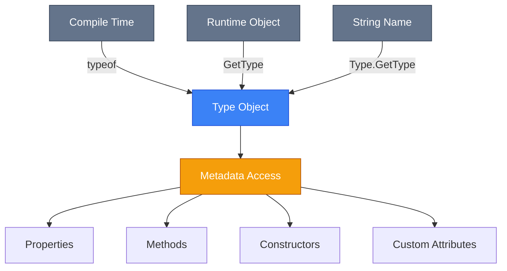
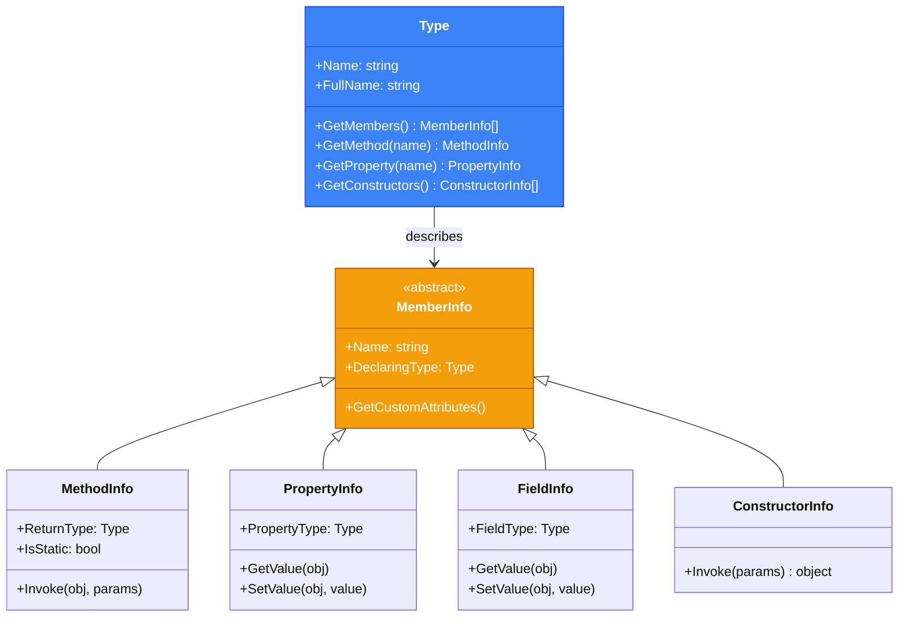

# Reflection API: System.Type та Метадані

## Вступ: Коли Код Вивчає Сам Себе

Уявіть собі програму, яка **не знає наперед**, з якими типами вона буде працювати. Це може бути:

-   **ORM (Object-Relational Mapping)**, який відображає довільні класи на таблиці бази даних.
-   **Dependency Injection контейнер**, що створює екземпляри класів, про які він дізнається лише під час виконання.
-   **Серіалізатор JSON**, який перетворює будь-який об'єкт у текст.
-   **Фреймворк для тестування**, що знаходить і викликає методи з атрибутом `[Test]`.

У традиційному статично типізованому коді ми маємо писати `new MyClass()` — компілятор знає про `MyClass` на етапі компіляції. Але що, якщо нам потрібно створити екземпляр класу, **ім'я якого зберігається в рядку**?

Саме тут виходить на сцену **Reflection (Рефлексія)** — здатність програми **інспектувати та маніпулювати своєю власною структурою** під час виконання.

::note
**Reflection** — це механізм часу виконання (runtime), який дозволяє коду отримувати інформацію про типи (metadata) та взаємодіяти з ними динамічно, без явної компіляції проти конкретного типу.
::

### Реальний Сценарій

Припустимо, ви розробляєте **плагін-систему**. Користувач кладе DLL-файл у директорію `plugins`, а ваша програма має:

1.  Завантажити цю збірку (assembly).
2.  Знайти в ній усі класи, що реалізують інтерфейс `IPlugin`.
3.  Створити їх екземпляри та викликати метод `Execute()`.

Ви не можете написати `new SomePlugin()`, бо не знаєте назву класу до моменту запуску. **Reflection робить це можливим**.

::warning
**Застереження про продуктивність**: Reflection у 10-100 разів повільніший за прямий виклик. Використовуйте його там, де гнучкість важливіша за швидкість, або кешуйте результати (наприклад, `MethodInfo`).
::

---

## Фундаментальні Концепції

### System.Type: Серце Рефлексії

Центральний клас у рефлексії — `System.Type`. Кожен тип у .NET (клас, структура, інтерфейс, enum) представлений екземпляром `Type`.

**Три способи отримати `Type`**:

::code-group

```csharp [1. Оператор typeof]
Type stringType = typeof(string);
Type listType = typeof(List<int>);
```

```csharp [2. Метод GetType()]
string text = "Hello";
Type runtimeType = text.GetType(); // System.String
```

```csharp [3. Type.GetType(string)]
Type? dynamicType = Type.GetType("System.Collections.Generic.List`1[[System.Int32]]");
// Для generic типів потрібна повна назва
```

::

**Ключові відмінності**:

| Спосіб               | Час виконання  | Використання                                     |
| :------------------- | :------------- | :----------------------------------------------- |
| `typeof(T)`          | Compile-time   | Коли тип відомий на етапі компіляції             |
| `obj.GetType()`      | Runtime        | Отримання реального типу об'єкта                 |
| `Type.GetType(name)` | Runtime (slow) | Коли ім'я типу зберігається в рядку/конфігурації |

::mermaid



::

### Type як Metadata Container

Об'єкт `Type` не містить даних екземпляра — він описує **структуру типу**. Подумайте про нього як про "інструкцію з експлуатації" класу.

```csharp showLineNumbers
Type userType = typeof(User);

// Властивості Type
Console.WriteLine(userType.Name);          // "User"
Console.WriteLine(userType.FullName);      // "MyApp.Models.User"
Console.WriteLine(userType.Namespace);     // "MyApp.Models"
Console.WriteLine(userType.IsClass);       // True
Console.WriteLine(userType.IsValueType);   // False
Console.WriteLine(userType.IsSealed);      // False
Console.WriteLine(userType.BaseType);      // System.Object
```

**Пояснення рядків**:

-   **Рядок 4**: `Name` — ім'я типу без namespace.
-   **Рядок 5**: `FullName` — повне ім'я включно з namespace (важливо для унікальності).
-   **Рядок 7**: `IsClass` vs `IsValueType` — розрізнення reference types та value types.
-   **Рядок 10**: `BaseType` — базовий клас (null для інтерфейсів).

---

## Архітектура Reflection API

###Ієрархія Класів Reflection

.NET надає окремі класи для кожного виду членів типу:

::mermaid



::

### Under the Hood: Metadata Tables

Коли ви компілюєте C# код, компілятор генерує не тільки IL (Intermediate Language), але й **metadata tables**. Ці таблі зберігаються в збірці (DLL/EXE) і містять інформацію про:

-   **TypeDef**: Визначення типів.
-   **MethodDef**: Методи з сигнатурами.
-   **FieldDef**: Поля з типами.
-   **CustomAttribute**: Атрибути.

Коли ви викликаєте `typeof(User)`, CLR читає ці таблиці й конструює об'єкт `Type`.

::note
Інструмент **ILSpy** або **dnSpy** дозволяє переглянути metadata будь-якої збірки. Спробуйте відкрити вашу DLL там — ви побачите, як CLR "бачить" ваш код.
::

---

## Інспекція Метаданих: Практичні Приклади

### 1. Отримання Списку Всіх Властивостей

```csharp showLineNumbers
using System.Reflection;

public class User
{
    public int Id { get; set; }
    public string Name { get; set; } = "";
    private string _password = "secret";
}

Type userType = typeof(User);

// Отримати всі публічні властивості
PropertyInfo[] publicProps = userType.GetProperties();

foreach (PropertyInfo prop in publicProps)
{
    Console.WriteLine($"{prop.Name} ({prop.PropertyType.Name})");
    // Output:
    // Id (Int32)
    // Name (String)
}

// Отримати приватні поля (flags: BindingFlags)
FieldInfo[] privateFields = userType.GetFields(
    BindingFlags.NonPublic | BindingFlags.Instance
);

foreach (FieldInfo field in privateFields)
{
    Console.WriteLine($"{field.Name} ({field.FieldType.Name})");
    // Output: _password (String)
}
```

**Важливо про BindingFlags**:

| Прапорець (Flag)   | Опис                                     |
| :----------------- | :--------------------------------------- |
| `Public`           | Публічні члени                           |
| `NonPublic`        | Приватні/protected                       |
| `Instance`         | Члени екземпляра                         |
| `Static`           | Статичні члени                           |
| `DeclaredOnly`     | Тільки теперішній тип (не від base)      |
| `FlattenHierarchy` | Включити статичні члени з базових класів |

::tip
Використовуйте комбінацію flags через оператор `|` (OR). За замовчуванням `GetProperties()` повертає тільки `Public | Instance`.
::

### 2. Динамічний Виклик Методу

```csharp showLineNumbers
public class Calculator
{
    public int Add(int a, int b) => a + b;
    private int Multiply(int a, int b) => a * b;
}

Calculator calc = new();
Type calcType = typeof(Calculator);

// Публічний метод
MethodInfo? addMethod = calcType.GetMethod("Add");
if (addMethod != null)
{
    object? result = addMethod.Invoke(calc, new object[] { 5, 3 });
    Console.WriteLine(result); // 8
}

// Приватний метод (потрібен BindingFlags.NonPublic)
MethodInfo? multiplyMethod = calcType.GetMethod("Multiply",
    BindingFlags.NonPublic | BindingFlags.Instance);

if (multiplyMethod != null)
{
    object? result = multiplyMethod.Invoke(calc, new object[] { 4, 7 });
    Console.WriteLine(result); // 28
}
```

**Пояснення рядка 14**:

-   `Invoke(object target, object[] parameters)`:
    -   `target` — екземпляр об'єкта (null для статичних методів).
    -   `parameters` — масив аргументів (boxing для value types).

::caution
**Boxing Penalty**: Параметри передаються як `object[]`, що призводить до boxing примітивних типів. Для критичних за продуктивністю сценаріїв використовуйте **compiled expressions** або **source generators**.
::

### 3. Читання та Запис Властивостей

```csharp showLineNumbers
User user = new() { Id = 1, Name = "Alice" };
Type userType = typeof(User);

PropertyInfo? nameProp = userType.GetProperty("Name");

if (nameProp != null)
{
    // Читання
    string? currentName = nameProp.GetValue(user) as string;
    Console.WriteLine(currentName); // "Alice"

    // Запис
    nameProp.SetValue(user, "Bob");
    Console.WriteLine(user.Name); // "Bob"
}
```

**Альтернатива з Generic**:

```csharp
string? name = nameProp?.GetValue(user) as string;
```

---

## Створення Екземплярів: Activator та ConstructorInfo

### Спосіб 1: Activator.CreateInstance

Найпростіший спосіб створити об'єкт з `Type`:

```csharp showLineNumbers
Type listType = typeof(List<int>);
object? instance = Activator.CreateInstance(listType);

if (instance is List<int> list)
{
    list.Add(42);
    Console.WriteLine(list[0]); // 42
}

// З параметрами конструктора
Type userType = typeof(User);
User? user = Activator.CreateInstance(userType, new object[] { 123, "John" }) as User;
```

::warning
`Activator.CreateInstance` повільний і не безпечний для типів (повертає `object?`). Для багаторазового створення використовуйте кешовані делегати.
::

### Спосіб 2: ConstructorInfo (більш контролю)

```csharp showLineNumbers
Type userType = typeof(User);

// Знайти конструктор з параметрами
ConstructorInfo? ctor = userType.GetConstructor(new[] { typeof(int), typeof(string) });

if (ctor != null)
{
    User user = (User)ctor.Invoke(new object[] { 99, "Alice" });
    Console.WriteLine(user.Name); // "Alice"
}
```

**Порівняння підходів**:

| Метод                      | Швидкість | Типобезпека | Використання                              |
| :------------------------- | :-------- | :---------- | :---------------------------------------- |
| `Activator.CreateInstance` | Повільний | Ні          | Одноразове створення                      |
| `ConstructorInfo.Invoke`   | Повільний | Ні          | Коли потрібен контроль параметрів         |
| **Compiled Expression**    | Швидкий   | Так         | Для повторюваних операцій (DI containers) |

---

## Робота з Generic Types

Generic типи у рефлексії мають особливий синтаксис.

### Приклад: List\<int\>

```csharp showLineNumbers
// Open generic type (без аргументів типу)
Type openListType = typeof(List<>);
Console.WriteLine(openListType.IsGenericTypeDefinition); // True

// Closed generic type (з конкретним T)
Type closedListType = typeof(List<int>);
Console.WriteLine(closedListType.IsGenericType); // True

// Отримати аргументи типу
Type[] genericArgs = closedListType.GetGenericArguments();
Console.WriteLine(genericArgs[0]); // System.Int32

// Створити закритий тип з відкритого
Type constructedType = openListType.MakeGenericType(typeof(string));
object? stringList = Activator.CreateInstance(constructedType);
// stringList тепер є List<string>
```

**Важливо**:

-   **Open generic**: `List<>` — шаблон.
-   **Closed generic**: `List<int>` — конкретна реалізація.

---

## Практичний Кейс: Cloner Об'єктів

Напишемо функцію, яка **глибоко копіює** будь-який об'єкт через рефлексію.

::code-collapse

```csharp showLineNumbers
using System.Reflection;

public static class ObjectCloner
{
    public static T? Clone<T>(T source)
    {
        if (source == null) return default;

        Type type = typeof(T);

        // Створити новий екземпляр
        T? clone = (T?)Activator.CreateInstance(type);
        if (clone == null) return default;

        // Копіювати всі публічні властивості
        foreach (PropertyInfo prop in type.GetProperties())
        {
            if (!prop.CanWrite || !prop.CanRead) continue;

            object? value = prop.GetValue(source);
            prop.SetValue(clone, value);
        }

        // Копіювати приватні поля (optional)
        foreach (FieldInfo field in type.GetFields(BindingFlags.NonPublic | BindingFlags.Instance))
        {
            object? value = field.GetValue(source);
            field.SetValue(clone, value);
        }

        return clone;
    }
}

// Використання
User original = new() { Id = 1, Name = "Alice" };
User? copy = ObjectCloner.Clone(original);
Console.WriteLine(copy?.Name); // "Alice"
```

::

**Обмеження**:

-   Не копіює вкладені об'єкти (shallow copy).
-   Не працює з об'єктами без конструктора за замовчуванням.

::tip
**Production-ready рішення**: Використовуйте бібліотеки як **AutoMapper** або **DeepCloner**, які оптимізують це через compiled expressions.
::

---

## Продуктивність Рефлексії

### Benchmarks

```csharp
using BenchmarkDotNet.Attributes;

public class ReflectionBenchmark
{
    private readonly Calculator _calc = new();
    private readonly MethodInfo _addMethod = typeof(Calculator).GetMethod("Add")!;

    [Benchmark(Baseline = true)]
    public int DirectCall() => _calc.Add(5, 3);

    [Benchmark]
    public int ReflectionCall() => (int)_addMethod.Invoke(_calc, new object[] { 5, 3 })!;
}
```

**Результати (приблизно)**:

| Метод          | Час    | Швидкість           |
| :------------- | :----- | :------------------ |
| DirectCall     | 0.5 ns | 1x                  |
| ReflectionCall | 50 ns  | **100x повільніше** |

### Оптимізації

1.  **Кешування `MethodInfo`**: Не викликайте `GetMethod` щоразу.
2.  **Compiled Expressions**:

```csharp showLineNumbers
using System.Linq.Expressions;

public static Func<Calculator, int, int, int> CreateDelegate()
{
    MethodInfo method = typeof(Calculator).GetMethod("Add")!;

    ParameterExpression instance = Expression.Parameter(typeof(Calculator));
    ParameterExpression arg1 = Expression.Parameter(typeof(int));
    ParameterExpression arg2 = Expression.Parameter(typeof(int));

    MethodCallExpression call = Expression.Call(instance, method, arg1, arg2);

    return Expression.Lambda<Func<Calculator, int, int, int>>(call, instance, arg1, arg2).Compile();
}

// Використання (швидкість майже як прямий виклик)
var addDelegate = CreateDelegate();
int result = addDelegate(new Calculator(), 5, 3); // 8
```

::note
**Compiled expressions** перетворюють рефлексію у делегат, який викликається зі швидкістю прямого виклику після одноразової компіляції.
::

---

## Assembly та Module

### Завантаження Збірок

```csharp showLineNumbers
using System.Reflection;

// Завантажити поточну збірку
Assembly currentAssembly = Assembly.GetExecutingAssembly();
Console.WriteLine(currentAssembly.FullName);

// Завантажити збірку з файлу
Assembly loadedAssembly = Assembly.LoadFrom("MyPlugin.dll");

// Отримати всі типи зі збірки
Type[] types = loadedAssembly.GetTypes();

foreach (Type type in types)
{
    if (type.IsClass && !type.IsAbstract && typeof(IPlugin).IsAssignableFrom(type))
    {
        // Знайдено клас, що реалізує IPlugin
        IPlugin? plugin = Activator.CreateInstance(type) as IPlugin;
        plugin?.Execute();
    }
}
```

**Методи Assembly**:

| Метод                    | Опис                                       |
| :----------------------- | :----------------------------------------- |
| `GetExecutingAssembly()` | Поточна збірка                             |
| `Load(string name)`      | Завантаження з GAC або поточної директорії |
| `LoadFrom(string path)`  | Завантаження з конкретного шляху           |
| `GetTypes()`             | Всі типи зі збірки                         |
| `GetType(string name)`   | Пошук типу за повним іменем                |

::warning
**AssemblyLoadContext**: У .NET Core/.NET 5+ використовуйте `AssemblyLoadContext.Default.LoadFromAssemblyPath()` для кращої ізоляції та unloading.
::

---

## Reflection Emit: Генерація Коду

**Reflection.Emit** дозволяє генерувати IL код у пам'яті під час виконання. Це основа для ORM, serializers, proxy-генераторів.

::note
Ця тема дуже просунута. Для практичного використання розгляньте **Source Generators** (.NET 5+), які генерують C# код на етапі компіляції.
::

Приклад створення типу динамічно:

```csharp showLineNumbers
using System.Reflection;
using System.Reflection.Emit;

AssemblyName assemblyName = new("DynamicAssembly");
AssemblyBuilder assemblyBuilder = AssemblyBuilder.DefineDynamicAssembly(
    assemblyName, AssemblyBuilderAccess.Run
);

ModuleBuilder moduleBuilder = assemblyBuilder.DefineDynamicModule("MainModule");

TypeBuilder typeBuilder = moduleBuilder.DefineType(
    "DynamicType",
    TypeAttributes.Public
);

// Додати поле
FieldBuilder fieldBuilder = typeBuilder.DefineField(
    "_value",
    typeof(int),
    FieldAttributes.Private
);

// Створити тип
Type? dynamicType = typeBuilder.CreateType();
object? instance = Activator.CreateInstance(dynamicType!);
```

---

## Практичні Завдання

### Рівень 1: Inspector

Напишіть програму `TypeInspector`, яка:

1.  Приймає назву типу як аргумент командного рядка.
2.  Виводить:
    -   Всі публічні властивості з типами.
    -   Всі публічні методи з параметрами та типами повернення.
    -   Базовий клас.

**Приклад виводу**:

```
Type: System.String
Base: System.Object

Properties:
  - Length: Int32

Methods:
  - ToUpper(): String
  - Substring(Int32, Int32): String
```

### Рівень 2: Generic Factory

Створіть клас `Factory<T>`, який:

1.  Приймає масив параметрів конструктора.
2.  Знаходить відповідний конструктор через рефлексію.
3.  Створює екземпляр `T`.

```csharp
Factory<User> factory = new();
User user = factory.Create(42, "Alice");
```

### Рівень 3: Mapper

Реалізуйте `AutoMapper.Map<TSource, TDest>(TSource source)`, який:

1.  Копіює значення властивостей з `TSource` у `TDest`.
2.  Підтримує різні імена властивостей через атрибут `[MapFrom("SourcePropName")]`.

```csharp
UserDto dto = AutoMapper.Map<User, UserDto>(user);
```

---

## Резюме

::card-group
::card
**System.Type**
Центральний клас рефлексії, що представляє метадані типу. Отримується через `typeof()`, `GetType()`, або `Type.GetType()`.
::

::card
**Reflection API**
Набір класів (`MethodInfo`, `PropertyInfo`, `FieldInfo`) для інспекції та виклику членів типу під час виконання.
::

::card
**BindingFlags**
Прапорці для контролю пошуку членів (Public/NonPublic, Instance/Static, DeclaredOnly).
::

::card
**Activator**
Утиліта для створення екземплярів типів динамічно. Повільна, але зручна для одноразових операцій.
::
::

::tip
**Золоте Правило**: Використовуйте рефлексію рідко. Якщо код виконується в циклі — оптимізуйте через кешування або compiled expressions.
::

---

## Додаткові Ресурси

-   [Офіційна документація Reflection](https://learn.microsoft.com/en-us/dotnet/csharp/programming-guide/concepts/reflection)
-   [CLR via C# (Jeffrey Richter)](https://www.microsoftpressstore.com/store/clr-via-c-sharp-9780735667457) — Розділ про Metadata та Reflection
-   [BenchmarkDotNet](https://benchmarkdotnet.org/) — Для вимірювання продуктивності

---

**Наступна тема**: [Attributes та Dynamic Language Runtime](./2.attributes-dynamic.md)
