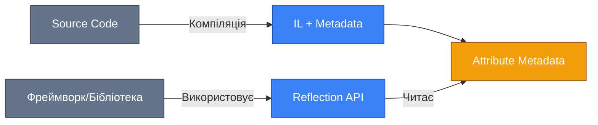
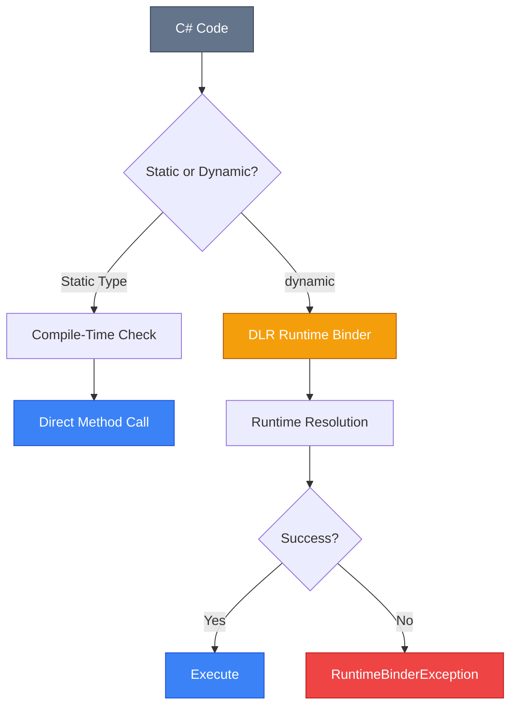

# Attributes та Dynamic Language Runtime

## Вступ: Метадані як Код

У попередньому розділі ми вивчали, як **читати** метадані типів через Reflection. Але що, якщо ми хочемо **додавати** власні метадані до нашого коду?

Уявіть, що ви пишете:

-   **Валідатор**, який має знати, що поле `Email` обов'язкове та має бути email-адресою.
-   **Серіалізатор JSON**, який має ігнорувати поле з назвою `Password`.
-   **ORM**, який має mapper властивість `UserId` на колонку `user_id` бази даних.
-   **Фреймворк для тестування**, який шукає методи з позначкою `[Test]`.

Де зберігати цю мета-інформацію, якщо вона не є частиною логіки коду? Відповідь — **Attributes (Атрибути)**.

::note
**Attribute** — це спеціальний клас, що успадковує `System.Attribute`, який можна застосовувати до типів, методів, властивостей, параметрів тощо для додавання **декларативних метаданих**.
::

А далі ми познайомимося з **Dynamic Language Runtime (DLR)** — технологією, яка дозволяє C# працювати як **динамічно типізована мова** (схоже на Python чи JavaScript) через ключове слово `dynamic`.

---

## Частина 1: Attributes (Атрибути)

### Що Таке Атрибут?

Атрибут — це **анотація коду**, яка не впливає на компіляцію, але зберігається в метаданих збірки й може бути прочитана через Reflection.

**Синтаксис застосування**:

```csharp showLineNumbers
[Obsolete("Використовуйте NewMethod натомість")]
public void OldMethod()
{
    // Compiler видасть попередження при виклику
}

[Serializable]
public class User
{
    [Required]
    [MaxLength(100)]
    public string Name { get; set; } = "";
}
```

**Пояснення**:

-   **Рядок 1**: `[Obsolete]` — вбудований атрибут, що позначає код застарілим.
-   **Рядок 7**: `[Serializable]` — вказує серіалізаторам, що цей клас можна серіалізувати.
-   **Рядки 10-11**: Множинні атрибути (стек).

::mermaid



::

### Вбудовані Атрибути .NET

Розглянемо найпоширеніші атрибути:

#### 1. Атрибути Компілятора

| Атрибут                                   | Призначення                                           |
| :---------------------------------------- | :---------------------------------------------------- |
| `[Obsolete]`                              | Позначає застарілий код (warning/error)               |
| `[Conditional("DEBUG")]`                  | Викликає метод лише якщо символ компіляції визначений |
| `[CallerMemberName]`                      | Автоматично вставляє ім'я методу-виклику              |
| `[CallerFilePath]` / `[CallerLineNumber]` | Вставляє шлях файлу / номер рядка                     |

**Приклад CallerMemberName**:

```csharp showLineNumbers
using System.Runtime.CompilerServices;

public class Logger
{
    public void Log(string message,
        [CallerMemberName] string caller = "")
    {
        Console.WriteLine($"[{caller}] {message}");
    }
}

public void MyMethod()
{
    var logger = new Logger();
    logger.Log("Something happened");
    // Output: [MyMethod] Something happened
}
```

**Рядок 6**: Параметр `caller` автоматично заповнюється назвою методу-виклику (`MyMethod`).

#### 2. Атрибути Серіалізації

```csharp
using System.Text.Json.Serialization;

public class ApiResponse
{
    [JsonPropertyName("user_id")]
    public int UserId { get; set; }

    [JsonIgnore]
    public string InternalToken { get; set; } = "";
}
```

-   **`[JsonPropertyName]`**: Mapper C# властивість на JSON ключ.
-   **`[JsonIgnore]`**: Виключає поле з серіалізації.

#### 3. Атрибути Валідації (Data Annotations)

```csharp showLineNumbers
using System.ComponentModel.DataAnnotations;

public class RegisterDto
{
    [Required(ErrorMessage = "Email обов'язковий")]
    [EmailAddress]
    public string Email { get; set; } = "";

    [StringLength(50, MinimumLength = 3)]
    public string Username { get; set; } = "";

    [Range(18, 120)]
    public int Age { get; set; }
}
```

**Як це працює під капотом**:

```csharp
var dto = new RegisterDto { Email = "", Age = 15 };
var context = new ValidationContext(dto);
var results = new List<ValidationResult>();

bool isValid = Validator.TryValidateObject(dto, context, results, true);

if (!isValid)
{
    foreach (var error in results)
    {
        Console.WriteLine(error.ErrorMessage);
        // "Email обов'язковий"
        // "The field Age must be between 18 and 120."
    }
}
```

::tip
**FluentValidation** — альтернатива Data Annotations, яка дозволяє писати валідацію імперативно замість декларативно. Рекомендується для складної бізнес-логіки.
::

---

### Створення Власних Атрибутів

#### Базовий Приклад

```csharp showLineNumbers
using System;

// 1. Визначити клас атрибута
[AttributeUsage(AttributeTargets.Class | AttributeTargets.Property)]
public class AuthorAttribute : Attribute
{
    public string Name { get; }
    public string Date { get; set; } = "";

    public AuthorAttribute(string name)
    {
        Name = name;
    }
}

// 2. Застосувати атрибут
[Author("Alice", Date = "2024-01-15")]
public class MyClass
{
    [Author("Bob")]
    public int MyProperty { get; set; }
}
```

**Пояснення**:

-   **Рядок 4**: `[AttributeUsage]` — мета-атрибут, що визначає, де можна застосовувати цей атрибут.
-   **Рядок 10**: Властивість `Name` — позиційний параметр (через конструктор).
-   **Рядок 8**: Властивість `Date` — іменований параметр (через setter).

#### Читання Атрибутів через Reflection

```csharp showLineNumbers
Type type = typeof(MyClass);

// Отримати атрибути класу
AuthorAttribute? classAttr = type.GetCustomAttribute<AuthorAttribute>();

if (classAttr != null)
{
    Console.WriteLine($"Author: {classAttr.Name}, Date: {classAttr.Date}");
    // "Author: Alice, Date: 2024-01-15"
}

// Отримати атрибути властивості
PropertyInfo prop = type.GetProperty("MyProperty")!;
AuthorAttribute? propAttr = prop.GetCustomAttribute<AuthorAttribute>();

Console.WriteLine(propAttr?.Name); // "Bob"
```

**Метод `GetCustomAttribute<T>`**:

-   Generic версія для зручності.
-   Повертає `null`, якщо атрибут не знайдено.

#### AttributeUsage: Контроль Застосування

| Прапорець (Flag) | Опис                                |
| :--------------- | :---------------------------------- |
| `Class`          | Можна застосовувати до класів       |
| `Method`         | До методів                          |
| `Property`       | До властивостей                     |
| `Field`          | До полів                            |
| `Parameter`      | До параметрів методів               |
| `Assembly`       | До всієї збірки (`[assembly: ...]`) |
| `All`            | Скрізь                              |

**Додаткові параметри**:

```csharp
[AttributeUsage(
    AttributeTargets.Method,
    AllowMultiple = true,  // Дозволити кілька екземплярів
    Inherited = false       // Не успадковувати від базових класів
)]
public class TestCaseAttribute : Attribute { }
```

---

### Практичний Кейс: Dependency Injection Аннотації

Створимо атрибут для автоматичної реєстрації сервісів у DI контейнері.

::code-collapse

```csharp showLineNumbers
// Атрибут
[AttributeUsage(AttributeTargets.Class)]
public class ServiceAttribute : Attribute
{
    public ServiceLifetime Lifetime { get; }

    public ServiceAttribute(ServiceLifetime lifetime = ServiceLifetime.Transient)
    {
        Lifetime = lifetime;
    }
}

// Застосування
[Service(ServiceLifetime.Singleton)]
public class CacheService
{
    public string Get(string key) => "cached value";
}

[Service]
public class UserRepository
{
    private readonly CacheService _cache;
    public UserRepository(CacheService cache) => _cache = cache;
}

// Автоматична реєстрація
public static class ServiceCollectionExtensions
{
    public static void AddServicesFromAssembly(this IServiceCollection services)
    {
        var assembly = Assembly.GetExecutingAssembly();
        var types = assembly.GetTypes()
            .Where(t => t.GetCustomAttribute<ServiceAttribute>() != null);

        foreach (var type in types)
        {
            var attr = type.GetCustomAttribute<ServiceAttribute>()!;
            services.Add(new ServiceDescriptor(type, type, attr.Lifetime));
        }
    }
}

// Використання в Program.cs
var builder = WebApplication.CreateBuilder(args);
builder.Services.AddServicesFromAssembly();
```

::

**Переваги**:

-   Декларативність: позначили клас — він автоматично реєструється.
-   Менше boilerplate коду в `Program.cs`.

---

## Частина 2: Dynamic Language Runtime (DLR)

### Динамічна Типізація: Філософія

C# — це **статично типізована** мова. Це означає:

```csharp
string text = "Hello";
text = 42; // ❌ Compiler error: Cannot convert int to string
```

Але інколи нам потрібна гнучкість динамічних мов (Python, JavaScript):

```python
# Python
user = {"name": "Alice", "age": 30}
print(user["name"])  # Тип визначається під час виконання
```

**Dynamic Language Runtime (DLR)** додає до C# можливість працювати з об'єктами, тип яких невідомий до моменту виконання.

::mermaid



::

### Ключове Слово `dynamic`

```csharp showLineNumbers
dynamic value = "Hello";
Console.WriteLine(value.Length); // 5 (string)

value = 42;
Console.WriteLine(value + 10); // 52 (int)

value = new List<int> { 1, 2, 3 };
Console.WriteLine(value.Count); // 3 (List<int>)
```

**Важливо**:

-   **Compile-time**: Компілятор не перевіряє, чи існує властивість `Length`.
-   **Runtime**: DLR шукає цю властивість під час виконання.
-   **Помилка**: Якщо властивості немає → `RuntimeBinderException`.

::warning
**Відсутність IntelliSense**: IDE не знає, які члени доступні на `dynamic` об'єкті. Використовуйте обережно.
::

### Коли Використовувати dynamic?

#### 1. Interop з COM (Microsoft Office)

```csharp showLineNumbers
// Без dynamic (старий спосіб)
Excel.Application excel = new Excel.Application();
Excel.Workbook workbook = (Excel.Workbook)excel.Workbooks.Add();
Excel.Worksheet sheet = (Excel.Worksheet)workbook.ActiveSheet;

// З dynamic
dynamic excel = new Excel.Application();
dynamic workbook = excel.Workbooks.Add();
dynamic sheet = workbook.ActiveSheet;
sheet.Cells[1, 1].Value = "Hello"; // Без кастингів
```

#### 2. Робота з JSON (без моделей)

```csharp showLineNumbers
using System.Text.Json;

string json = """{"name": "Alice", "age": 30}""";
dynamic user = JsonSerializer.Deserialize<dynamic>(json)!;

// ❌ Це НЕ працює напряму - JsonElement не підтримує dynamic
// Правильний підхід:
JsonElement element = JsonSerializer.Deserialize<JsonElement>(json);
string name = element.GetProperty("name").GetString()!; // "Alice"
```

::note
**System.Text.Json** не підтримує `dynamic` у стилі `user.name`. Для цього використовуйте **ExpandoObject** або бібліотеку **Newtonsoft.Json**.
::

#### 3. Duck Typing

```csharp showLineNumbers
public void PrintLength(dynamic obj)
{
    // Працює з будь-яким об'єктом, що має властивість Length
    Console.WriteLine(obj.Length);
}

PrintLength("Hello");      // 5
PrintLength(new int[5]);   // 5
PrintLength(new List<int> { 1, 2 }); // ❌ RuntimeBinderException (немає Length, є Count)
```

---

### ExpandoObject: Динамічний Словник

`ExpandoObject` — це клас з `System.Dynamic`, що дозволяє додавати властивості в runtime.

```csharp showLineNumbers
using System.Dynamic;

dynamic person = new ExpandoObject();

// Додати властивості
person.Name = "Alice";
person.Age = 30;
person.Greet = (Action)(() => Console.WriteLine($"Hi, I'm {person.Name}"));

// Використати
Console.WriteLine(person.Name); // "Alice"
person.Greet(); // "Hi, I'm Alice"

// Перетворити на словник
var dict = (IDictionary<string, object?>)person;
dict["Email"] = "alice@example.com";

Console.WriteLine(person.Email); // "alice@example.com"
```

**Пояснення**:

-   **Рядок 7**: Властивості додаються динамічно.
-   **Рядок 15**: `ExpandoObject` реалізує `IDictionary<string, object?>`.

**Use Case**: Побудова JSON-конфігурацій або mock-об'єктів у тестах.

---

### DynamicObject: Кастомна Логіка

Для більшого контролю створіть клас, що успадковує `DynamicObject`.

::code-collapse

```csharp showLineNumbers
using System.Dynamic;

public class FlexibleConfig : DynamicObject
{
    private readonly Dictionary<string, object?> _data = new();

    public override bool TryGetMember(GetMemberBinder binder, out object? result)
    {
        return _data.TryGetValue(binder.Name, out result);
    }

    public override bool TrySetMember(SetMemberBinder binder, object? value)
    {
        _data[binder.Name] = value;
        return true;
    }

    public override bool TryInvokeMember(InvokeMemberBinder binder, object?[]? args, out object? result)
    {
        // Приклад: метод Get<T>(string key)
        if (binder.Name == "Get" && args?.Length == 1)
        {
            string key = args[0]?.ToString() ?? "";
            result = _data.TryGetValue(key, out var value) ? value : null;
            return true;
        }

        result = null;
        return false;
    }
}

// Використання
dynamic config = new FlexibleConfig();
config.ApiKey = "secret123";
config.Timeout = 5000;

Console.WriteLine(config.ApiKey); // "secret123"
string? key = config.Get("ApiKey"); // "secret123"
```

::

**Переопределені методи**:

| Метод             | Викликається для                      |
| :---------------- | :------------------------------------ |
| `TryGetMember`    | Читання властивості (`obj.Prop`)      |
| `TrySetMember`    | Запису властивості (`obj.Prop = val`) |
| `TryInvokeMember` | Виклику методу (`obj.Method(args)`)   |
| `TryGetIndex`     | Індексатора (`obj[key]`)              |

---

### Продуктивність dynamic

**Benchmark**:

```csharp
public class DynamicBenchmark
{
    private dynamic _dynamic = 42;
    private int _static = 42;

    [Benchmark(Baseline = true)]
    public int StaticAdd() => _static + 10;

    [Benchmark]
    public int DynamicAdd() => _dynamic + 10;
}
```

**Результати**:

| Метод      | Час   | Швидкість          |
| :--------- | :---- | :----------------- |
| StaticAdd  | 1 ns  | 1x                 |
| DynamicAdd | 80 ns | **80x повільніше** |

::caution
**Висновок**: Не використовуйте `dynamic` у циклах або критично важливих місцях. Для часткового рішення — кешуйте `CallSite` (просунута тема).
::

---

### Interop: dynamic з JavaScript (Blazor)

У **Blazor WebAssembly** можна викликати JavaScript через `IJSRuntime`:

```csharp showLineNumbers
@inject IJSRuntime JS

private async Task ShowAlert()
{
    await JS.InvokeVoidAsync("alert", "Hello from C#!");
}

// З dynamic (отримання значення)
private async Task<string> GetLocalStorage()
{
    return await JS.InvokeAsync<string>("localStorage.getItem", "token");
}
```

**Без dynamic** (статичний підхід через JSInterop).

---

## Порівняння: Reflection vs dynamic

| Критерій                 | Reflection                             | dynamic                  |
| :----------------------- | :------------------------------------- | :----------------------- |
| **Коли використовувати** | Інспекція типів, створення екземплярів | Інтероп, Duck Typing     |
| **Типобезпека**          | Ні (повертає `object`)                 | Ні (runtime binding)     |
| **Продуктивність**       | Повільно (метадані)                    | Повільно (DLR overhead)  |
| **IntelliSense**         | Ні                                     | Ні                       |
| **Помилки**              | `TargetInvocationException`            | `RuntimeBinderException` |

::tip
**Альтернатива**: Source Generators (.NET 5+) дозволяють генерувати код на етапі компіляції, уникаючи overhead рефлексії та `dynamic`.
::

---

## Практичні Завдання

### Рівень 1: Attribute-Based Logging

Створіть атрибут `[LogExecution]`, який:

1.  Застосовується до методів.
2.  Через Reflection знаходить усі методи класу з цим атрибутом.
3.  Виводить у консоль: "Executing MethodName at [timestamp]".

**Підказка**: Використайте `MethodInfo.Invoke` для виклику методів.

### Рівень 2: ExpandoObject як Config

Напишіть клас `ConfigBuilder`, який:

1.  Читає JSON-файл у `ExpandoObject`.
2.  Дозволяє доступ до вкладених властивостей: `config.Database.ConnectionString`.

```csharp
dynamic config = ConfigBuilder.LoadFromJson("appsettings.json");
Console.WriteLine(config.Database.Host); // "localhost"
```

### Рівень 3: Dynamic Proxy

Реалізуйте `LoggingProxy<T>`, який:

1.  Використовує `DynamicObject` для перехоплення викликів методів.
2.  Логує кожен виклик (метод + параметри) перед виконанням.

```csharp
dynamic proxy = new LoggingProxy<IUserService>(new UserService());
proxy.CreateUser("Alice");
// Log: "CreateUser called with args: Alice"
```

---

## Резюме

::card-group
:::card
**Attributes**
Декларативні метадані, що зберігаються в збірці та читаються через Reflection. Використовуються для валідації, серіалізації, DI реєстрації.
:::

:::card
**Custom Attributes**
Створюються через успадкування від `System.Attribute`. Контролюються через `[AttributeUsage]`.
:::

:::card
**dynamic Keyword**
Відключає compile-time перевірку типів, перекладаючи її на runtime через DLR. Корисне для COM interop та Duck Typing.
:::

:::card
**ExpandoObject**
Динамічний словник, що дозволяє додавати властивості у runtime. Альтернатива створенню класів для простих даних.
:::
::

::warning
**Золоте Правило**: `dynamic` та Reflection — це потужні інструменти, але з великою відповідальністю. Використовуйте там, де статична типізація неможлива, а не для "зручності".
::

---

## Додаткові Ресурси

-   [Офіційна документація Attributes](https://learn.microsoft.com/en-us/dotnet/csharp/programming-guide/concepts/attributes/)
-   [Dynamic Language Runtime (DLR)](https://learn.microsoft.com/en-us/dotnet/framework/reflection-and-codedom/dynamic-language-runtime-overview)
-   [ExpandoObject Class](https://learn.microsoft.com/en-us/dotnet/api/system.dynamic.expandoobject)
-   [Performance Considerations](https://learn.microsoft.com/en-us/archive/msdn-magazine/2017/march/net-framework-the-ultimate-guide-to-improving-performance)

---

**Попередня тема**: [Reflection API: System.Type та Метадані](./1.reflection-fundamentals.md)

**Наступна тема**: [Multithreading (Low Level)](#) _(розділ 6.3)_
