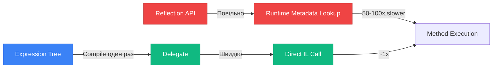
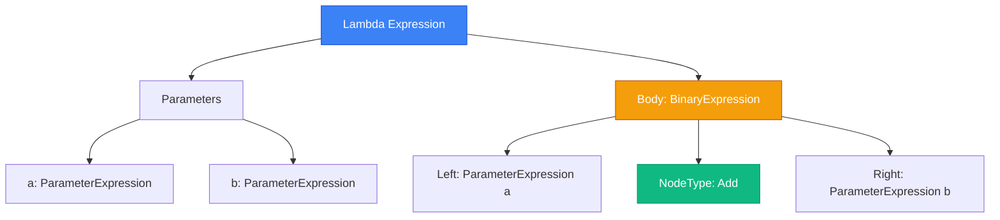
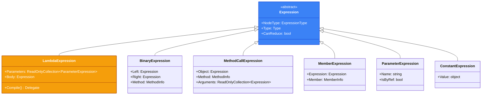

# Expression Trees: Швидка Альтернатива Рефлексії

## Вступ: Дилема Продуктивності

У попередніх розділах ми бачили, що **Reflection** надзвичайно гнучкий, але має критичний недолік:

::warning
**Reflection is Slow**: Виклик `MethodInfo.Invoke()` у **50-100 разів повільніший** за прямий виклик методу. Для циклів це катастрофа.
::

Уявіть типовий сценарій ORM:

```csharp
// Потрібно встановити 1000 властивостей User з ResultSet бази даних
for (int i = 0; i < 1000; i++)
{
    PropertyInfo prop = typeof(User).GetProperty("Name");
    prop.SetValue(users[i], resultSet[i].Name); // ❌ ПОВІЛЬНО
}
```

**Проблеми**:

1. `GetProperty` викликається 1000 разів (хоча можна кешувати)
2. `SetValue` використовує рефлексію кожного разу → boxing, metadata lookup

**Що ми хочемо**:

-   Швидкість прямого виклику (`user.Name = value`)
-   Гнучкість рефлексії (не знаємо тип заздалегідь)

**Рішення**: **Expression Trees** (Дерева Виразів) + **Compilation** (Компіляція).

::mermaid



::

---

## Що Таке Expression Tree?

**Expression Tree (Дерево Виразів)** — це структура даних, що представляє C# код як **дерево об'єктів** замість скомпільованого IL.

### Приклад: Простий Вираз

```csharp showLineNumbers
using System.Linq.Expressions;

// Звичайний делегат (компілюється в IL одразу)
Func<int, int, int> add = (a, b) => a + b;

// Expression Tree (представлення коду як даних)
Expression<Func<int, int, int>> addExpr = (a, b) => a + b;

// Можна інспектувати структуру
Console.WriteLine(addExpr.Body); // "(a + b)"
Console.WriteLine(addExpr.Body.NodeType); // Add
```

**Ключова відмінність**:

-   **`Func<T>`**: Лямбда **компілюється** в IL → виконується
-   **`Expression<Func<T>>`**: Лямбда **парситься** в дерево → можна аналізувати/модифікувати

### Структура Дерева

Для виразу `(a, b) => a + b`:

::mermaid



::

**Коли це корисно?**

1. **LINQ to SQL**: Перетворює `users.Where(u => u.Age > 18)` у SQL `WHERE Age > 18`
2. **Валідатори**: Аналізує `x => x.Email.Contains("@")` для побудови правил
3. **Серіалізатори**: Генерує оптимізований код доступу до властивостей
4. **DI Containers**: Компілює швидкі factory функції

---

## System.Linq.Expressions API

### Ієрархія Класів

::mermaid



::

### Основні Типи Виразів

| Клас                   | Призначення                  | Приклад                                  |
| :--------------------- | :--------------------------- | :--------------------------------------- |
| `ParameterExpression`  | Параметр (`x`, `a`, `b`)     | `Expression.Parameter(typeof(int), "x")` |
| `ConstantExpression`   | Константа (`42`, `"text"`)   | `Expression.Constant(42)`                |
| `BinaryExpression`     | Бінарна операція (`+`, `>`)  | `Expression.Add(left, right)`            |
| `MemberExpression`     | Доступ до члена (`obj.Prop`) | `Expression.Property(obj, "Name")`       |
| `MethodCallExpression` | Виклик методу                | `Expression.Call(obj, method, args)`     |
| `LambdaExpression`     | Лямбда (`x => ...`)          | `Expression.Lambda(body, params)`        |

---

## Побудова Виразів Програмно

### Приклад 1: Простий Getter

Створимо вираз, еквівалентний `user => user.Name`:

```csharp showLineNumbers
using System.Linq.Expressions;
using System.Reflection;

// 1. Визначити параметр
ParameterExpression userParam = Expression.Parameter(typeof(User), "user");

// 2. Доступ до властивості
PropertyInfo nameProp = typeof(User).GetProperty("Name")!;
MemberExpression nameAccess = Expression.Property(userParam, nameProp);

// 3. Створити лямбду
Expression<Func<User, string>> lambda =
    Expression.Lambda<Func<User, string>>(nameAccess, userParam);

// 4. Компілювати в делегат
Func<User, string> compiledGetter = lambda.Compile();

// 5. Використати (швидко, як прямий виклик)
User user = new() { Name = "Alice" };
string name = compiledGetter(user); // "Alice"
```

**Пояснення рядків**:

-   **Рядок 5**: `Parameter` - це "змінна" у виразі (як `user` у лямбді)
-   **Рядок 9**: `Property` - доступ до властивості (відповідає `user.Name`)
-   **Рядок 13**: `Lambda` - обгортає вираз у лямбду з параметрами
-   **Рядок 16**: **`Compile()`** - **магія тут!** Перетворює дерево в IL код

::tip
**Ключова ідея**: Ми використали рефлексію **один раз** (рядок 8), але результат `compiledGetter` працює зі швидкістю прямого доступу!
::

### Приклад 2: Setter

Створимо `(user, value) => user.Name = value`:

```csharp showLineNumbers
// Параметри
ParameterExpression userParam = Expression.Parameter(typeof(User), "user");
ParameterExpression valueParam = Expression.Parameter(typeof(string), "value");

// Доступ до властивості
MemberExpression nameProperty = Expression.Property(userParam, "Name");

// Присвоєння
BinaryExpression assignment = Expression.Assign(nameProperty, valueParam);

// Лямбда
Expression<Action<User, string>> lambda =
    Expression.Lambda<Action<User, string>>(assignment, userParam, valueParam);

// Компіляція
Action<User, string> compiledSetter = lambda.Compile();

// Використання
User user = new();
compiledSetter(user, "Bob"); // user.Name = "Bob"
Console.WriteLine(user.Name); // "Bob"
```

**Рядок 9**: `Assign` - це бінарна операція присвоєння (`=`)

---

## Практичний Кейс: Generic Property Accessor

Створимо універсальний accessor для будь-якої властивості:

::code-collapse

```csharp showLineNumbers
using System.Linq.Expressions;
using System.Reflection;

public static class PropertyAccessor
{
    // Кеш для compiled delegates
    private static readonly Dictionary<(Type, string), Delegate> _getterCache = new();
    private static readonly Dictionary<(Type, string), Delegate> _setterCache = new();

    public static Func<T, TProperty> CreateGetter<T, TProperty>(string propertyName)
    {
        Type type = typeof(T);
        var key = (type, propertyName);

        if (_getterCache.TryGetValue(key, out var cached))
            return (Func<T, TProperty>)cached;

        PropertyInfo prop = type.GetProperty(propertyName)!;
        ParameterExpression param = Expression.Parameter(type, "obj");
        MemberExpression property = Expression.Property(param, prop);

        // Convert якщо тип не співпадає точно
        Expression body = Expression.Convert(property, typeof(TProperty));

        var lambda = Expression.Lambda<Func<T, TProperty>>(body, param);
        var compiled = lambda.Compile();

        _getterCache[key] = compiled;
        return compiled;
    }

    public static Action<T, TProperty> CreateSetter<T, TProperty>(string propertyName)
    {
        Type type = typeof(T);
        var key = (type, propertyName);

        if (_setterCache.TryGetValue(key, out var cached))
            return (Action<T, TProperty>)cached;

        PropertyInfo prop = type.GetProperty(propertyName)!;
        ParameterExpression objParam = Expression.Parameter(type, "obj");
        ParameterExpression valueParam = Expression.Parameter(typeof(TProperty), "value");
        MemberExpression property = Expression.Property(objParam, prop);

        // Convert якщо потрібно
        Expression convertedValue = Expression.Convert(valueParam, prop.PropertyType);
        BinaryExpression assignment = Expression.Assign(property, convertedValue);

        var lambda = Expression.Lambda<Action<T, TProperty>>(assignment, objParam, valueParam);
        var compiled = lambda.Compile();

        _setterCache[key] = compiled;
        return compiled;
    }
}

// Використання
var getter = PropertyAccessor.CreateGetter<User, string>("Name");
var setter = PropertyAccessor.CreateSetter<User, string>("Name");

User user = new();
setter(user, "Charlie");
string name = getter(user); // "Charlie"
```

::

**Переваги**:

-   **Швидкість**: Після першого виклику працює як прямий доступ
-   **Кешування**: Компіляція відбувається лише раз
-   **Універсальність**: Працює з будь-яким типом

---

## Benchmark: Reflection vs Expression Trees

Створимо детальний benchmark:

```csharp showLineNumbers
using BenchmarkDotNet.Attributes;
using System.Linq.Expressions;
using System.Reflection;

[MemoryDiagnoser]
public class PropertyAccessBenchmark
{
    private User _user = new() { Name = "Test" };
    private PropertyInfo _propertyInfo = typeof(User).GetProperty("Name")!;
    private Func<User, string> _compiledGetter;

    public PropertyAccessBenchmark()
    {
        // Compile once
        var param = Expression.Parameter(typeof(User));
        var property = Expression.Property(param, _propertyInfo);
        var lambda = Expression.Lambda<Func<User, string>>(property, param);
        _compiledGetter = lambda.Compile();
    }

    [Benchmark(Baseline = true)]
    public string DirectAccess() => _user.Name;

    [Benchmark]
    public string ReflectionCached() => (string)_propertyInfo.GetValue(_user)!;

    [Benchmark]
    public string ReflectionUncached()
    {
        var prop = typeof(User).GetProperty("Name")!;
        return (string)prop.GetValue(_user)!;
    }

    [Benchmark]
    public string CompiledExpression() => _compiledGetter(_user);
}
```

**Результати** (приблизно):

| Method             | Mean       | Ratio    | Allocated |
| :----------------- | :--------- | :------- | :-------- |
| DirectAccess       | 0.5 ns     | 1.00     | -         |
| CompiledExpression | **0.6 ns** | **1.20** | -         |
| ReflectionCached   | 25 ns      | 50.00    | 24 B      |
| ReflectionUncached | 120 ns     | 240.00   | 64 B      |

::tip
**Висновок**: Compiled Expression лише на **20% повільніша** за прямий доступ, але у **40 разів швидша** за рефлексію!
::

---

## Складніші Вирази

### Виклик Методу

Створимо `user => user.ToString()`:

```csharp showLineNumbers
ParameterExpression userParam = Expression.Parameter(typeof(User), "user");
MethodInfo toStringMethod = typeof(object).GetMethod("ToString")!;

// Виклик методу на об'єкті
MethodCallExpression methodCall = Expression.Call(userParam, toStringMethod);

var lambda = Expression.Lambda<Func<User, string>>(methodCall, userParam);
Func<User, string> compiled = lambda.Compile();

User user = new() { Name = "Alice" };
Console.WriteLine(compiled(user)); // "User { Name = Alice }"
```

### Статичний Метод

`int.Parse("42")`:

```csharp showLineNumbers
MethodInfo parseMethod = typeof(int).GetMethod("Parse", new[] { typeof(string) })!;
ConstantExpression input = Expression.Constant("42");

// Статичний виклик (obj = null)
MethodCallExpression parseCall = Expression.Call(null, parseMethod, input);

var lambda = Expression.Lambda<Func<int>>(parseCall);
Func<int> compiled = lambda.Compile();

int result = compiled(); // 42
```

### Умовний Вираз

`x => x > 5 ? "big" : "small"`:

```csharp showLineNumbers
ParameterExpression x = Expression.Parameter(typeof(int), "x");
ConstantExpression five = Expression.Constant(5);
ConstantExpression big = Expression.Constant("big");
ConstantExpression small = Expression.Constant("small");

BinaryExpression condition = Expression.GreaterThan(x, five);
ConditionalExpression ternary = Expression.Condition(condition, big, small);

var lambda = Expression.Lambda<Func<int, string>>(ternary, x);
Func<int, string> compiled = lambda.Compile();

Console.WriteLine(compiled(10)); // "big"
Console.WriteLine(compiled(3));  // "small"
```

---

## Створення Екземплярів

Замінимо `Activator.CreateInstance`:

```csharp showLineNumbers
public static class FastActivator<T>
{
    private static readonly Func<T> _factory;

    static FastActivator()
    {
        Type type = typeof(T);
        ConstructorInfo ctor = type.GetConstructor(Type.EmptyTypes)!;

        // Expression: () => new T()
        NewExpression newExpr = Expression.New(ctor);
        var lambda = Expression.Lambda<Func<T>>(newExpr);
        _factory = lambda.Compile();
    }

    public static T Create() => _factory();
}

// Benchmark
[Benchmark(Baseline = true)]
public User ActivatorCreate() => Activator.CreateInstance<User>();

[Benchmark]
public User FastActivatorCreate() => FastActivator<User>.Create();
```

**Результати**:

| Method              | Mean     | Ratio    |
| :------------------ | :------- | :------- |
| ActivatorCreate     | 35 ns    | 1.00     |
| FastActivatorCreate | **2 ns** | **0.06** |

::caution
**Обмеження**: FastActivator працює лише з конструкторами без параметрів. Для параметризованих потрібно кешувати фабрики з різною кількістю аргументів.
::

---

## Real-World: AutoMapper Lite

Створимо спрощений маппер об'єктів:

::code-collapse

```csharp showLineNumbers
using System.Linq.Expressions;
using System.Reflection;

public static class SimpleMapper
{
    private static readonly Dictionary<(Type, Type), Delegate> _mappers = new();

    public static TDest Map<TSource, TDest>(TSource source)
        where TDest : new()
    {
        var key = (typeof(TSource), typeof(TDest));

        if (!_mappers.TryGetValue(key, out var mapper))
        {
            mapper = CreateMapper<TSource, TDest>();
            _mappers[key] = mapper;
        }

        return ((Func<TSource, TDest>)mapper)(source);
    }

    private static Func<TSource, TDest> CreateMapper<TSource, TDest>()
        where TDest : new()
    {
        ParameterExpression sourceParam = Expression.Parameter(typeof(TSource), "source");

        // Створити екземпляр destination
        NewExpression destInstance = Expression.New(typeof(TDest));

        // Список присвоєнь
        List<MemberBinding> bindings = new();

        PropertyInfo[] destProps = typeof(TDest).GetProperties(BindingFlags.Public | BindingFlags.Instance);

        foreach (PropertyInfo destProp in destProps)
        {
            if (!destProp.CanWrite) continue;

            PropertyInfo? sourceProp = typeof(TSource).GetProperty(destProp.Name);
            if (sourceProp == null || !sourceProp.CanRead) continue;

            // source.PropertyName
            MemberExpression sourceProperty = Expression.Property(sourceParam, sourceProp);

            // dest.PropertyName = source.PropertyName
            MemberBinding binding = Expression.Bind(destProp, sourceProperty);
            bindings.Add(binding);
        }

        // new TDest { Prop1 = source.Prop1, Prop2 = source.Prop2, ... }
        MemberInitExpression memberInit = Expression.MemberInit(destInstance, bindings);

        var lambda = Expression.Lambda<Func<TSource, TDest>>(memberInit, sourceParam);
        return lambda.Compile();
    }
}

// Використання
public class UserDto
{
    public int Id { get; set; }
    public string Name { get; set; } = "";
}

User user = new() { Id = 1, Name = "Alice", Email = "alice@test.com" };
UserDto dto = SimpleMapper.Map<User, UserDto>(user);
// dto.Id = 1, dto.Name = "Alice" (Email ігнорується, бо відсутній в UserDto)
```

::

**Як це працює**:

-   **Рядок 29**: Створюємо `new TDest()`
-   **Рядки 36-47**: Для кожної спільної властивості створюємо binding
-   **Рядок 50**: `MemberInit` - це C# syntax `new User { Name = "Alice" }`
-   **Результат**: Одна компіляція, потім миттєве копіювання

---

## Модифікація Виразів: Visitors

Іноді потрібно **змінити** існуючий Expression Tree. Для цього використовується **Visitor Pattern**:

```csharp showLineNumbers
using System.Linq.Expressions;

// Замінити всі константи на подвоєні значення
public class DoubleConstantsVisitor : ExpressionVisitor
{
    protected override Expression VisitConstant(ConstantExpression node)
    {
        if (node.Type == typeof(int))
        {
            int value = (int)node.Value!;
            return Expression.Constant(value * 2);
        }
        return base.VisitConstant(node);
    }
}

// Використання
Expression<Func<int, int>> original = x => x + 5;
DoubleConstantsVisitor visitor = new();
Expression modified = visitor.Visit(original);

Func<int, int> compiled = ((Expression<Func<int, int>>)modified).Compile();
Console.WriteLine(compiled(10)); // 10 + 10 = 20 (бо 5 * 2 = 10)
```

**Use Case**: LINQ providers модифікують вирази для перекладу у SQL.

---

## Обмеження Expression Trees

::warning
**Не всі C# конструкції підтримуються**:

❌ `async/await`  
❌ `yield return`  
❌ Блоки `try/catch` (частково можливо через `Expression.TryCatch`)  
❌ Присвоєння декількох змінних  
❌ `dynamic`

**Альтернатива для складних сценаріїв**: Використовуйте `Expression.Block` для послідовності операцій або Source Generators.
::

---

## Практичні Завдання

### Рівень 1: Fast Method Invoker

Створіть клас `MethodInvoker<T>`, який:

1. Приймає `MethodInfo` та компілює делегат для його виклику
2. Кешує результат
3. Підтримує методи з 0-3 параметрами

```csharp
var invoker = MethodInvoker<User>.Create("SetName");
invoker(user, "Alice");
```

### Рівень 2: Collection Mapper

Реалізуйте `CollectionMapper.Map<TSource, TDest>(IEnumerable<TSource>)`, який:

1. Використовує SimpleMapper для маппінгу кожного елемента
2. Компілює оптимізований LINQ вираз для трансформації колекції

```csharp
List<User> users = GetUsers();
List<UserDto> dtos = CollectionMapper.Map<User, UserDto>(users);
```

### Рівень 3: Predicate Builder

Створіть `PredicateBuilder<T>`, який:

1. Дозволяє динамічно комбінувати предикати через `And`/`Or`
2. Компілює результат у `Func<T, bool>`

```csharp
var builder = new PredicateBuilder<User>();
builder.And(u => u.Age > 18);
builder.Or(u => u.IsAdmin);
Func<User, bool> predicate = builder.Compile();
```

---

## Резюме

::card-group
:::card
**Expression Trees**
Структури даних, що представляють C# код як дерево об'єктів. Дозволяють аналізувати, модифікувати та компілювати код програмно.
:::

:::card
**Compilation**
Метод `Compile()` перетворює Expression Tree у IL код та повертає делегат. Одноразова операція, результат кешується.
:::

:::card
**Performance**
Compiled expressions працюють майже зі швидкістю прямого виклику (1.2x overhead) vs 50-100x для рефлексії.
:::

:::card
**Use Cases**
ORM (Entity Framework), AutoMapper, валідатори (FluentValidation), DI containers, serializers - всі використовують Expression Trees.
:::
::

::tip
**Золоте Правило**: Якщо код виконується **багато разів** (цикл, request handler), замініть рефлексію на compiled expression. Якщо **один раз** - рефлексія прийнятна.
::

---

## Додаткові Ресурси

-   [Офіційна документація Expression Trees](https://learn.microsoft.com/en-us/dotnet/csharp/advanced-topics/expression-trees/)
-   [AutoMapper Source Code](https://github.com/AutoMapper/AutoMapper) - Використання Expression Trees у production
-   [Entity Framework Core](https://github.com/dotnet/efcore) - LINQ to SQL через Expression Trees
-   [Expression Tree Visualizer](https://github.com/zspitz/ExpressionTreeVisualizer) - Debugging tool

---

**Попередня тема**: [Attributes та Dynamic Language Runtime](./2.attributes-dynamic.md)

**Наступна тема**: [Source Generators: Compile-Time Code Generation](./4.source-generators.md)
