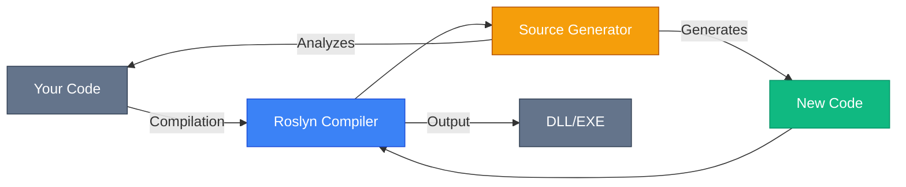
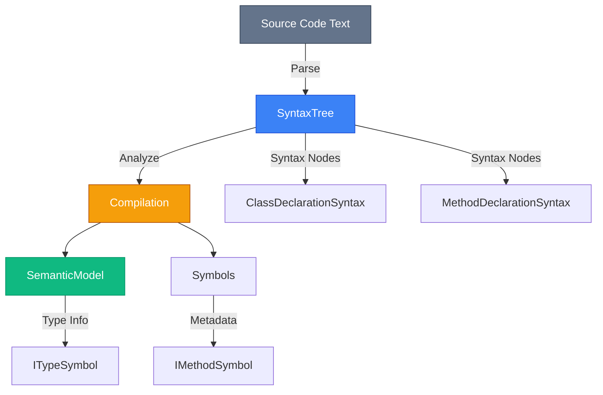
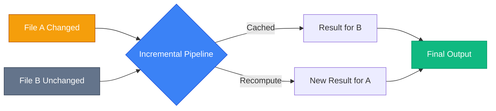

# Source Generators: Compile-Time Code Generation

## Вступ: Наступний Рівень Продуктивності

У попередньому розділі ми навчилися замінювати **рефлексію** на **compiled expressions** для отримання швидкості прямого виклику. Але що, якщо ми можемо **зовсім уникнути runtime overhead**?

**Source Generators (Генератори Вихідного Коду)** — це **compile-time** технологія, введена в **.NET 5** та C# 9, що дозволяє **генерувати C# код під час компіляції** на основі аналізу існуючого коду.

::mermaid



::

### Порівняння Підходів

| Підхід                | Коли виконується           | Overhead   | Типобезпека | IDE Support |
| :-------------------- | :------------------------- | :--------- | :---------- | :---------- |
| **Reflection**        | Runtime                    | 50-100x    | ❌          | ❌          |
| **Expression Trees**  | Runtime (компіляція 1 раз) | 1.2x після | ✅          | Partial     |
| **Source Generators** | **Compile-Time**           | **0x**     | ✅          | ✅ Full     |

::tip
**Золота Ідея**: Source Generators створюють звичайний C# код, який компілюється разом з вашим проєктом. **Жодного runtime overhead**, повний IntelliSense, debugger працює як для звичайного коду.
::

---

## Що Таке Source Generator?

**Source Generator** — це спеціальний .NET компонент (NuGet пакет), що:

1. **Аналізує** ваш код під час компіляції через Roslyn API
2. **Генерує** новий C# код (додаткові класи, методи)
3. **Додає** згенерований код до компіляції
4. **НЕ модифікує** існуючий код (тільки додає новий)

### Реальні Приклади

| Фреймворк                     | Що генерує                   | Навіщо                                     |
| :---------------------------- | :--------------------------- | :----------------------------------------- |
| **System.Text.Json**          | Серіалізатори для типів      | Швидша серіалізація без рефлексії          |
| **ASP.NET Core Minimal APIs** | Endpoint handlers            | Оптимізація request processing             |
| **Entity Framework Core**     | Compiled models              | Швидший startup без runtime model building |
| **MVVM Toolkit**              | Property/Command boilerplate | Менше рукописного коду                     |
| **Mapperly**                  | Object-to-object mappers     | AutoMapper без runtime overhead            |

::note
**ви вже використовуєте Source Generators**: Якщо ви працюєте з .NET 6+, багато фреймворків вже генерують код для вас "під капотом"!
::

---

## Roslyn API: Компілятор як Бібліотека

**Roslyn** — це компілятор C#/VB.NET, написаний на C#, який надає API для аналізу та модифікації коду.

### Основні Концепції

::mermaid



::

**Ієрархія**:

1. **SyntaxTree** — дерево синтаксису (парсинг коду як текст)
2. **Compilation** — вся інформація про проєкт (збірки, референси)
3. **SemanticModel** — семантична інформація (типи, символи)
4. **Symbols** — ITypeSymbol, IMethodSymbol (метадані про типи/методи)

**Різниця з Expression Trees**:

-   **Expression Trees**: Runtime API для виразів
-   **Roslyn**: Compile-time API для всього коду

---

## Створення Першого Source Generator

### Крок 1: Створення Проєкту

Генератор має бути окремою бібліотекою типу `netstandard2.0`:

```bash
dotnet new classlib -n MyGenerator
cd MyGenerator
dotnet add package Microsoft.CodeAnalysis.CSharp
dotnet add package Microsoft.CodeAnalysis.Analyzers
```

**Важливо**: У `.csproj` додати:

```xml showLineNumbers
<Project Sdk="Microsoft.NET.Sdk">
  <PropertyGroup>
    <TargetFramework>netstandard2.0</TargetFramework>
    <LangVersion>latest</LangVersion>
    <IsRoslynComponent>true</IsRoslynComponent>
    <EnforceExtendedAnalyzerRules>true</EnforceExtendedAnalyzerRules>
  </PropertyGroup>

  <ItemGroup>
    <PackageReference Include="Microsoft.CodeAnalysis.CSharp" Version="4.8.0" PrivateAssets="all" />
    <PackageReference Include="Microsoft.CodeAnalysis.Analyzers" Version="3.3.4" PrivateAssets="all" />
  </ItemGroup>
</Project>
```

**Пояснення**:

-   **Рядок 3**: `netstandard2.0` — вимога Roslyn
-   **Рядок 5**: Позначає це як Roslyn компонент
-   **Рядок 10**: `PrivateAssets="all"` — не передавати залежності споживачам

### Крок 2: Простий Генератор "Hello World"

```csharp showLineNumbers
using Microsoft.CodeAnalysis;
using Microsoft.CodeAnalysis.Text;
using System.Text;

namespace MyGenerator;

[Generator]
public class HelloWorldGenerator : ISourceGenerator
{
    public void Initialize(GeneratorInitializationContext context)
    {
        // Опціонально: реєстрація callbacks
    }

    public void Execute(GeneratorExecutionContext context)
    {
        // Генеруємо код
        string sourceCode = @"
namespace Generated
{
    public static class HelloWorld
    {
        public static string GetMessage() => ""Hello from Source Generator!"";
    }
}";

        context.AddSource("HelloWorld.g.cs", SourceText.From(sourceCode, Encoding.UTF8));
    }
}
```

**Пояснення**:

-   **Рядок 7**: `[Generator]` — атрибут для позначення генератора
-   **Рядок 8**: Реалізація `ISourceGenerator` (застарілий, але простіший інтерфейс)
-   **Рядок 29**: `AddSource` — додає згенерований файл до компіляції

### Крок 3: Використання в Проєкті

У вашому основному проєкті:

```xml
<ItemGroup>
  <ProjectReference Include="..\MyGenerator\MyGenerator.csproj"
                    OutputItemType="Analyzer"
                    ReferenceOutputAssembly="false" />
</ItemGroup>
```

```csharp
using Generated;

Console.WriteLine(HelloWorld.GetMessage());
// Output: "Hello from Source Generator!"
```

::tip
**Debugging**: Додайте до `Execute`:

```csharp
System.Diagnostics.Debugger.Launch(); // Attach debugger
```

::

---

## IIncrementalGenerator: Сучасний Підхід

`.NET 6+` ввів `IIncrementalGenerator` — більш ефективну та композитну альтернативу `ISourceGenerator`.

### Чому Incremental?

**Проблема**: При зміні одного файлу компілятор запускає генератор знову. Якщо генератор аналізує весь проєкт → **повільно**.

**Рішення**: Incremental generators кешують результати та перевираховують тільки змінені частини.

::mermaid



::

### Структура IIncrementalGenerator

```csharp showLineNumbers
using Microsoft.CodeAnalysis;

[Generator]
public class MyIncrementalGenerator : IIncrementalGenerator
{
    public void Initialize(IncrementalGeneratorInitializationContext context)
    {
        // 1. Створити pipeline для аналізу коду
        var classDeclarations = context.SyntaxProvider
            .CreateSyntaxProvider(
                predicate: (node, _) => node is ClassDeclarationSyntax,
                transform: (ctx, _) => (ClassDeclarationSyntax)ctx.Node
            );

        // 2. Зареєструвати generation step
        context.RegisterSourceOutput(classDeclarations, Execute);
    }

    private void Execute(SourceProductionContext context, ClassDeclarationSyntax classDecl)
    {
        // 3. Генерувати код для кожного класу
        string className = classDecl.Identifier.Text;
        string code = $"// Generated for {className}";
        context.AddSource($"{className}.g.cs", code);
    }
}
```

**Pipeline Explanation**:

1. **CreateSyntaxProvider** — фільтрує syntax nodes (тут: всі класи)
2. **RegisterSourceOutput** — викликає `Execute` для кожного відфільтрованого node
3. Incremental кешування відбувається автоматично

---

## Практичний Приклад: ToString Generator

Створимо генератор, що створює `ToString()` для класів з атрибутом `[GenerateToString]`.

### Marker Attribute

Спочатку створюємо атрибут (в основному проєкті або згенерований):

```csharp
namespace MyAttributes;

[AttributeUsage(AttributeTargets.Class)]
public class GenerateToStringAttribute : Attribute { }
```

### Generator Implementation

::code-collapse

```csharp showLineNumbers
using Microsoft.CodeAnalysis;
using Microsoft.CodeAnalysis.CSharp.Syntax;
using System.Collections.Immutable;
using System.Linq;
using System.Text;

namespace MyGenerator;

[Generator]
public class ToStringGenerator : IIncrementalGenerator
{
    public void Initialize(IncrementalGeneratorInitializationContext context)
    {
        // Фільтруємо класи з атрибутом [GenerateToString]
        var classesWithAttribute = context.SyntaxProvider
            .ForAttributeWithMetadataName(
                "MyAttributes.GenerateToStringAttribute",
                predicate: (node, _) => node is ClassDeclarationSyntax,
                transform: GetClassInfo
            )
            .Where(info => info is not null);

        context.RegisterSourceOutput(classesWithAttribute, Execute!);
    }

    private static ClassInfo? GetClassInfo(
        GeneratorAttributeSyntaxContext context,
        CancellationToken ct)
    {
        if (context.TargetNode is not ClassDeclarationSyntax classDecl)
            return null;

        var symbol = context.TargetSymbol as INamedTypeSymbol;
        if (symbol is null) return null;

        // Отримати всі публічні властивості
        var properties = symbol.GetMembers()
            .OfType<IPropertySymbol>()
            .Where(p => p.DeclaredAccessibility == Accessibility.Public)
            .Select(p => p.Name)
            .ToImmutableArray();

        return new ClassInfo(
            symbol.ContainingNamespace.ToDisplayString(),
            symbol.Name,
            properties
        );
    }

    private void Execute(SourceProductionContext context, ClassInfo classInfo)
    {
        var sb = new StringBuilder();

        sb.AppendLine("// <auto-generated/>");
        sb.AppendLine($"namespace {classInfo.Namespace}");
        sb.AppendLine("{");
        sb.AppendLine($"    partial class {classInfo.ClassName}");
        sb.AppendLine("    {");
        sb.AppendLine("        public override string ToString()");
        sb.AppendLine("        {");

        // Генерувати інтерполяцію
        sb.Append($"            return $\"{classInfo.ClassName} {{ ");

        var propStrings = classInfo.Properties
            .Select(p => $"{p} = {{{p}}}");

        sb.Append(string.Join(", ", propStrings));
        sb.AppendLine(" }\";");

        sb.AppendLine("        }");
        sb.AppendLine("    }");
        sb.AppendLine("}");

        context.AddSource($"{classInfo.ClassName}.ToString.g.cs", sb.ToString());
    }

    private record ClassInfo(
        string Namespace,
        string ClassName,
        ImmutableArray<string> Properties
    );
}
```

::

### Використання

```csharp showLineNumbers
using MyAttributes;

[GenerateToString]
public partial class User
{
    public int Id { get; set; }
    public string Name { get; set; } = "";
}

// Згенерований код (User.ToString.g.cs):
// partial class User
// {
//     public override string ToString()
//     {
//         return $"User { Id = {Id}, Name = {Name} }";
//     }
// }

User user = new() { Id = 1, Name = "Alice" };
Console.WriteLine(user); // "User { Id = 1, Name = Alice }"
```

**Ключові моменти**:

-   **Рядок 4**: `partial class` — необхідно для генераторів
-   **Генератор**: Додає метод `ToString` до існуючого класу
-   **Результат**: Compile-time генерація, IntelliSense працює

---

## Syntax Analysis: Пошук Цільових Типів

### ForAttributeWithMetadataName (Recommended)

```csharp
context.SyntaxProvider.ForAttributeWithMetadataName(
    fullyQualifiedMetadataName: "MyNamespace.MyAttribute",
    predicate: (node, _) => node is ClassDeclarationSyntax,
    transform: (ctx, ct) => /* ... */
);
```

**Переваги**:

-   Оптимізовано компілятором
-   Automatic incremental caching
-   Не потрібно вручну перевіряти атрибути

### CreateSyntaxProvider (Manual Filtering)

```csharp showLineNumbers
var targetNodes = context.SyntaxProvider.CreateSyntaxProvider(
    predicate: (node, _) =>
    {
        // Фільтр на рівні синтаксису (швидко)
        return node is ClassDeclarationSyntax cls &&
               cls.AttributeLists.Count > 0;
    },
    transform: (ctx, _) =>
    {
        // Семантичний аналіз (повільно, але кешується)
        var classDecl = (ClassDeclarationSyntax)ctx.Node;
        var symbol = ctx.SemanticModel.GetDeclaredSymbol(classDecl);

        return symbol?.GetAttributes()
            .Any(a => a.AttributeClass?.Name == "MyAttribute") == true
            ? symbol
            : null;
    }
).Where(s => s is not null);
```

**Predicate vs Transform**:

-   **Predicate**: Швидкий синтаксичний фільтр (без типів)
-   **Transform**: Повільний семантичний аналіз (з типами)

::tip
**Best Practice**: Фільтруйте максимум в `predicate`, щоб мінімізувати дорогі `transform` виклики.
::

---

## Генерація Складного Коду

### StringBuilder vs Roslyn SyntaxFactory

**Підхід 1: StringBuilder** (простіше):

```csharp
var sb = new StringBuilder();
sb.AppendLine("public class MyClass");
sb.AppendLine("{");
sb.AppendLine("    public int Id { get; set; }");
sb.AppendLine("}");
```

**Підхід 2: SyntaxFactory** (типобезпечніше):

```csharp showLineNumbers
using Microsoft.CodeAnalysis.CSharp;
using Microsoft.CodeAnalysis.CSharp.Syntax;
using static Microsoft.CodeAnalysis.CSharp.SyntaxFactory;

ClassDeclarationSyntax classDecl = ClassDeclaration("MyClass")
    .AddModifiers(Token(SyntaxKind.PublicKeyword))
    .AddMembers(
        PropertyDeclaration(
            PredefinedType(Token(SyntaxKind.IntKeyword)),
            "Id"
        )
        .AddModifiers(Token(SyntaxKind.PublicKeyword))
        .AddAccessorListAccessors(
            AccessorDeclaration(SyntaxKind.GetAccessorDeclaration)
                .WithSemicolonToken(Token(SyntaxKind.SemicolonToken)),
            AccessorDeclaration(SyntaxKind.SetAccessorDeclaration)
                .WithSemicolonToken(Token(SyntaxKind.SemicolonToken))
        )
    );

string code = classDecl.NormalizeWhitespace().ToFullString();
```

**Порівняння**:

| Метод         | Плюси                  | Мінуси                    |
| :------------ | :--------------------- | :------------------------ |
| StringBuilder | Простіше, читабельніше | Typo-prone, no validation |
| SyntaxFactory | Типобезпека, валідація | Verbosity, складніший API |

::note
**Рекомендація**: Для простих генераторів використовуйте StringBuilder з raw string literals (`"""`). Для складних — SyntaxFactory або Template Engines (Scriban, T4).
::

---

## Debugging Source Generators

### Метод 1: EmitCompilerGeneratedFiles

У `.csproj`:

```xml
<PropertyGroup>
  <EmitCompilerGeneratedFiles>true</EmitCompilerGeneratedFiles>
  <CompilerGeneratedFilesOutputPath>$(BaseIntermediateOutputPath)Generated</CompilerGeneratedFilesOutputPath>
</PropertyGroup>
```

Згенеровані файли з'являться в `obj/Generated/`.

### Метод 2: Debugger.Launch()

```csharp
public void Execute(...)
{
    if (!System.Diagnostics.Debugger.IsAttached)
    {
        System.Diagnostics.Debugger.Launch();
    }
    // ...
}
```

При компіляції відкриється вікно для attach debugger.

### Метод 3: Unit Testing

```csharp showLineNumbers
using Microsoft.CodeAnalysis;
using Microsoft.CodeAnalysis.CSharp;
using Xunit;

public class GeneratorTests
{
    [Fact]
    public void GeneratesToString_ForMarkedClass()
    {
        string source = @"
using MyAttributes;

[GenerateToString]
public partial class User
{
    public string Name { get; set; }
}";

        var compilation = CreateCompilation(source);
        var generator = new ToStringGenerator();

        GeneratorDriver driver = CSharpGeneratorDriver.Create(generator);
        driver = driver.RunGenerators(compilation);

        var result = driver.GetRunResult();

        Assert.Single(result.GeneratedTrees);
        Assert.Contains("public override string ToString()",
            result.GeneratedTrees[0].ToString());
    }

    private static Compilation CreateCompilation(string source)
    {
        var syntaxTree = CSharpSyntaxTree.ParseText(source);
        var references = AppDomain.CurrentDomain.GetAssemblies()
            .Where(a => !a.IsDynamic && !string.IsNullOrEmpty(a.Location))
            .Select(a => MetadataReference.CreateFromFile(a.Location));

        return CSharpCompilation.Create("TestAssembly",
            new[] { syntaxTree },
            references,
            new CSharpCompilationOptions(OutputKind.DynamicallyLinkedLibrary));
    }
}
```

---

## Real-World Use Cases

### 1. Minimal API Endpoint Registration

```csharp
[GenerateEndpoint("/api/users", HttpMethod.Get)]
public static IResult GetUsers(IUserService service)
{
    return Results.Ok(service.GetAll());
}

// Генератор створює:
// app.MapGet("/api/users", GetUsers);
```

### 2. AutoMapper без Runtime

```csharp
[GenerateMapper(typeof(UserDto))]
public partial class User
{
    public int Id { get; set; }
    public string Name { get; set; }

    // Генерується:
    // public UserDto ToDto() => new() { Id = this.Id, Name = this.Name };
}
```

### 3. Dependency Injection Registration

```csharp
[Service(ServiceLifetime.Scoped)]
public class UserRepository : IUserRepository
{
    // ...
}

// Генератор створює в статичному класі:
// services.AddScoped<IUserRepository, UserRepository>();
```

---

## Best Practices

::card-group
:::card{title="1. Partial Classes"}
Генеруйте код у `partial` класах, щоб користувач міг додавати власну логіку.
:::

:::card{title="2. Namespaces"}
Зберігайте namespace оригінального типу у згенерованому коді.
:::

:::card{title="3. Error Reporting"}
Використовуйте `context.ReportDiagnostic()` для інформативних помилок.
:::

:::card{title="4. Incremental"}
Завжди використовуйте `IIncrementalGenerator` для performance.
:::
::

### Error Reporting Example

```csharp showLineNumbers
private void Execute(SourceProductionContext context, ClassInfo classInfo)
{
    if (!classInfo.IsPartial)
    {
        var diagnostic = Diagnostic.Create(
            new DiagnosticDescriptor(
                id: "GEN001",
                title: "Class must be partial",
                messageFormat: "Class '{0}' must be declared as partial",
                category: "Generator",
                DiagnosticSeverity.Error,
                isEnabledByDefault: true
            ),
            Location.None,
            classInfo.ClassName
        );

        context.ReportDiagnostic(diagnostic);
        return;
    }

    // Генерувати код...
}
```

---

## Обмеження Source Generators

::warning
**Що НЕ можна**:

❌ Модифікувати існуючий код користувача  
❌ Видаляти код  
❌ Читати файли поза проєктом (обмежений доступ до файлової системи)  
❌ Виконувати async операції  
❌ Мати залежності від NuGet пакетів (тільки netstandard2.0 compatible)

**Що можна**:

✅ Додавати нові файли  
✅ Розширювати partial типи  
✅ Аналізувати syntax trees  
✅ Читати додаткові файли (AdditionalFiles)  
::

---

## Практичні Завдання

### Рівень 1: Property Changed Generator

Створіть генератор для `INotifyPropertyChanged`:

```csharp
[GenerateNotifyPropertyChanged]
public partial class ViewModel
{
    private string _name;
    // Генератор створить:
    // public string Name
    // {
    //     get => _name;
    //     set { _name = value; OnPropertyChanged(); }
    // }
}
```

### Рівень 2: Builder Pattern Generator

```csharp
[GenerateBuilder]
public partial class User
{
    public int Id { get; init; }
    public string Name { get; init; }
}

// Генерується UserBuilder:
// var user = new UserBuilder()
//     .WithId(1)
//     .WithName("Alice")
//     .Build();
```

### Рівень 3: Validation Generator

```csharp
public partial class RegisterDto
{
    [Required]
    [EmailAddress]
    public string Email { get; set; }

    // Генерується метод:
    // public IEnumerable<ValidationError> Validate() { ... }
}
```

---

## Порівняння з Іншими Підходами

| Підхід                | Compile-Time | Runtime Overhead    | IDE Support | Use Case           |
| :-------------------- | :----------- | :------------------ | :---------- | :----------------- |
| **T4 Templates**      | ✅           | None                | ❌ Poor     | Legacy projects    |
| **Reflection**        | ❌           | Very High           | Partial     | Flexibility needed |
| **Expression Trees**  | ❌           | Low (after compile) | Partial     | Runtime mapping    |
| **Source Generators** | ✅           | **None**            | ✅ Full     | Modern .NET        |

---

## Резюме

::card-group
:::card
**Source Generators**
Compile-time технологія для генерації C# коду на основі Roslyn API. Нульовий runtime overhead.
:::

:::card
**IIncrementalGenerator**
Сучасний інтерфейс з automatic caching. Перевираховує тільки змінені частини для швидшої компіляції.
:::

:::card
**Use Cases**
Серіалізація, DI реєстрація, маппінг, boilerplate reduction (INotifyPropertyChanged, ToString, Builders).
:::

:::card
**Limitations**
Тільки додавання файлів, не модифікація. Обмежені залежності. Синхронний API.
:::
::

::tip
**Коли використовувати**:

-   Boilerplate код, що повторюється (property changed, builders)
-   Performance-critical сценарії (серіалізація, маппінг)
-   Framework-level features (DI, endpoints)

**Коли НЕ використовувати**:

-   Одноразова генерація (краще T4 templates)
-   Динамічна логіка (краще рефлексія/expression trees)
-   Прості задачі (snippet expansion достатньо)

::

---

## Додаткові Ресурси

-   [Офіційна документація Source Generators](https://learn.microsoft.com/en-us/dotnet/csharp/roslyn-sdk/source-generators-overview)
-   [Source Generator Cookbook](https://github.com/dotnet/roslyn/blob/main/docs/features/source-generators.cookbook.md)
-   [Roslyn API Docs](https://learn.microsoft.com/en-us/dotnet/api/microsoft.codeanalysis)
-   [Community Toolkit MVVM Generators](https://github.com/CommunityToolkit/dotnet) - Production example
-   [Mapperly](https://github.com/riok/mapperly) - AutoMapper альтернатива на Source Generators
-   [Source Generator Playground](https://sourcegen.dev/) - Online IDE для експериментів

---

**Попередня тема**: [Expression Trees: Швидка Альтернатива Рефлексії](./3.expression-trees-compiled.md)

**Наступна тема**: [Multithreading (Low Level)](#) _(розділ 6.3)_
