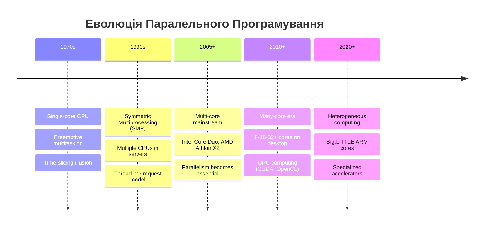
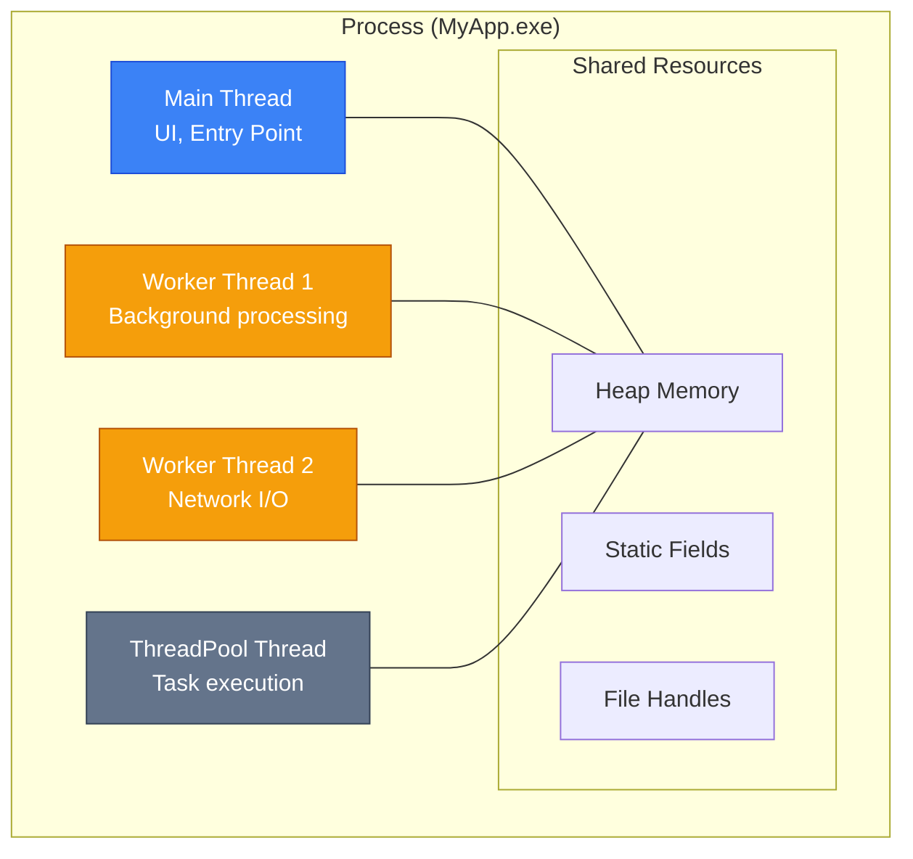
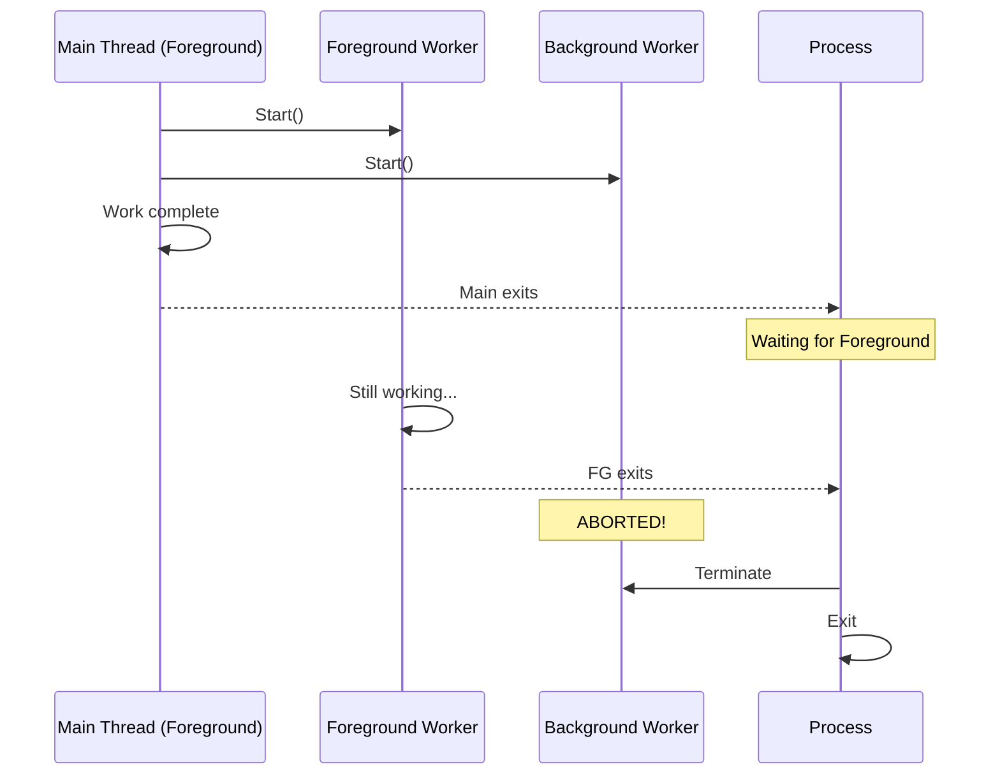
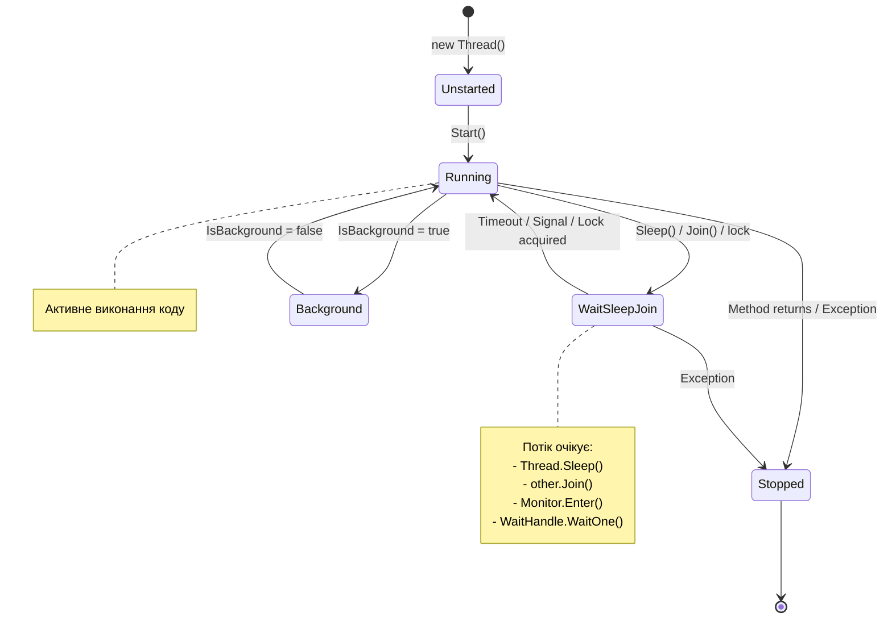
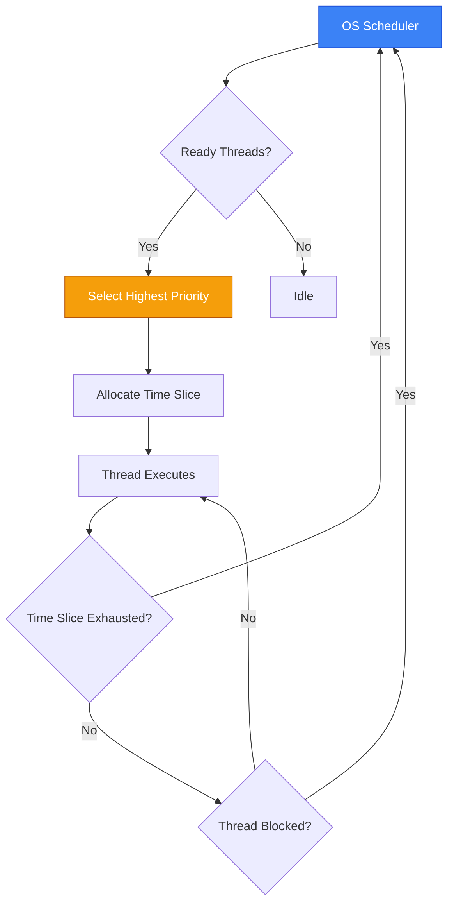

# Multithreading Fundamentals (Основи Багатопотоковості)

## Вступ та Контекст

### Проблема: Чому Нам Потрібна Багатопотоковість?

Уявіть, що ви розробляєте desktop-додаток для обробки великих файлів. Користувач натискає кнопку "Обробити", і... інтерфейс **замерзає** на 30 секунд. Навіть переміщення вікна або натискання кнопки "Скасувати" не працює. Це класичний симптом **однопотокової архітектури** (single-threaded design).

```csharp
// ❌ Поганий приклад: UI thread заблокований
private void ProcessButton_Click(object sender, EventArgs e)
{
    // Користувач натискає кнопку
    ProcessLargeFile("data.csv");  // Займає 30 секунд
    // UI повністю заморожений весь цей час!
    ShowCompletionMessage();
}

void ProcessLargeFile(string path)
{
    // Важка обчислювальна робота
    for (int i = 0; i < 10_000_000; i++)
    {
        // Обробка кожного рядка...
        Thread.Sleep(1);  // Симуляція роботи
    }
}
```

::warning
**Frozen UI (заморожений інтерфейс)** — це не просто незручність. Це критична проблема UX, яка змушує користувачів думати, що програма "зависла", і часто призводить до примусового завершення через Task Manager.
::

**Багатопотоковість** (multithreading) вирішує цю проблему, дозволяючи виконувати важкі операції у **фоновому потоці** (background thread), залишаючи головний потік (UI thread) вільним для взаємодії з користувачем.

### Еволюція: Від Однопроцесорних Систем до Multi-Core

::mermaid



::

**Чому це важливо?**

| Ера            | Підхід до продуктивності | Роль багатопотоковості                |
| :------------- | :----------------------- | :------------------------------------ |
| **До 2005**    | Підняти частоту CPU      | Опціональна (UI responsiveness)       |
| **Після 2005** | Додати ядра              | **Обов'язкова** для продуктивності    |
| **Сьогодні**   | Гетерогенні системи      | Критична для будь-якого C application |

::note
**Закон Амдала**: Максимальне прискорення програми обмежене часткою коду, яку можна виконати паралельно. Якщо 50% коду послідовні, максимальне прискорення — лише 2x, незалежно від кількості ядер.
::

### Process vs Thread vs Task

Перш ніж заглиблюватись у потоки, розберімо ключову термінологію:

| Концепція            | Визначення                          | Ресурси                                 | Створення              |
| :------------------- | :---------------------------------- | :-------------------------------------- | :--------------------- |
| **Process (Процес)** | Екземпляр запущеної програми        | Власний address space, handles, threads | Дороге (~MB пам'яті)   |
| **Thread (Потік)**   | Одиниця виконання всередині процесу | Спільний address space, власний stack   | Помірне (~1MB stack)   |
| **Task**             | Абстракція асинхронної операції     | Може переключатись між threads          | Легке (pooled threads) |

::mermaid



::

::tip
**Коли що використовувати:**

-   **Process** — ізоляція (sandbox, security boundaries)
-   **Thread** — CPU-bound parallel tasks, низькорівневий контроль
-   **Task** — I/O-bound async operations, високорівневе API (рекомендовано для 95% випадків)

::

---

## Клас Thread: Фундаментальний API

### Створення та Запуск Потоків

Клас `System.Threading.Thread` — це базовий будівельний блок багатопотоковості в .NET. Він надає прямий доступ до managed threads, що виконуються на рівні операційної системи.

#### ThreadStart: Найпростіший Спосіб

`ThreadStart` — делегат без параметрів і повернення:

```csharp showLineNumbers
using System;
using System.Threading;

class Program
{
    static void Main()
    {
        // Створюємо новий потік з методом DoWork
        Thread workerThread = new Thread(DoWork);

        // Потік створено, але ще НЕ запущено!
        Console.WriteLine($"Thread state: {workerThread.ThreadState}");  // Unstarted

        // Запускаємо потік
        workerThread.Start();

        // Головний потік продовжує виконання паралельно
        for (int i = 0; i < 5; i++)
        {
            Console.WriteLine($"Main thread: {i}");
            Thread.Sleep(100);
        }

        // Чекаємо завершення worker thread
        workerThread.Join();  // [!code highlight]
        Console.WriteLine("Worker thread завершився");
    }

    static void DoWork()
    {
        for (int i = 0; i < 5; i++)
        {
            Console.WriteLine($"Worker thread: {i}");
            Thread.Sleep(150);
        }
    }
}
```

**Декомпозиція коду:**

-   **Рядок 9**: `new Thread(DoWork)` — створюємо об'єкт Thread, передаючи делегат `ThreadStart`. Метод `DoWork` буде entry point нового потоку.
-   **Рядок 16**: `Start()` — фактично запускає потік. До цього виклику потік існує лише як об'єкт у пам'яті.
-   **Рядок 25**: `Join()` — блокує **поточний** потік (Main) до завершення `workerThread`. Без цього `Main` може завершитись раніше.

::note
**Важливо про порядок виконання**: Немає гарантії, який рядок "Main thread: 0" чи "Worker thread: 0" виведеться першим. Це залежить від планувальника ОС (scheduler).
::

#### ParameterizedThreadStart: Передача Даних

Для передачі параметрів у потік використовується `ParameterizedThreadStart`:

```csharp showLineNumbers
using System;
using System.Threading;

class Program
{
    static void Main()
    {
        // Створюємо потік з параметризованим делегатом
        Thread thread = new Thread(ProcessData);

        // Передаємо об'єкт як параметр
        thread.Start("Hello from Main!");  // [!code highlight]

        thread.Join();
    }

    // Метод приймає object? (може бути null)
    static void ProcessData(object? data)
    {
        if (data is string message)
        {
            Console.WriteLine($"Received: {message}");
        }
    }
}
```

::warning
**Обмеження `ParameterizedThreadStart`:**

1. Приймає тільки **один** параметр типу `object?`
2. Потребує **boxing** для value types
3. Потребує **cast** у методі

Для типобезпечної передачі кількох параметрів використовуйте **lambda expressions** або **closure**.
::

#### Lambda Expressions: Сучасний Підхід (Рекомендовано)

```csharp showLineNumbers
using System;
using System.Threading;

class Program
{
    static void Main()
    {
        string fileName = "data.csv";
        int maxLines = 1000;

        // Lambda захоплює локальні змінні (closure)
        Thread thread = new Thread(() =>  // [!code highlight]
        {
            ProcessFile(fileName, maxLines);
        });

        thread.Start();
        thread.Join();

        Console.WriteLine("Processing complete");
    }

    static void ProcessFile(string path, int limit)
    {
        Console.WriteLine($"Processing {path} with limit {limit}");
        // Імітація роботи
        Thread.Sleep(1000);
    }
}
```

**Переваги lambda:**

-   ✅ Типобезпечність — компілятор перевіряє типи
-   ✅ Множинні параметри — можна захопити будь-яку кількість
-   ✅ Читабельність — код поруч з логікою створення потоку

::caution
**Closure Pitfall (пастка замикання):**

```csharp
// ❌ ПОМИЛКА: всі потоки побачать i = 5!
for (int i = 0; i < 5; i++)
{
    new Thread(() => Console.WriteLine(i)).Start();
}

// ✅ ПРАВИЛЬНО: створюємо локальну копію
for (int i = 0; i < 5; i++)
{
    int localI = i;  // Копія для кожної ітерації
    new Thread(() => Console.WriteLine(localI)).Start();
}
```

Це відбувається тому, що lambda захоплює **змінну** `i`, а не її **значення** на момент створення closure.
::

---

### Отримання Результатів з Потоку

`Thread` не має вбудованого механізму повернення значення. Ось кілька підходів:

#### Підхід 1: Shared Variable (Спільна Змінна)

```csharp showLineNumbers
using System;
using System.Threading;

class Program
{
    static int _result;  // Спільна змінна для результату

    static void Main()
    {
        Thread thread = new Thread(Calculate);
        thread.Start();
        thread.Join();  // Чекаємо завершення

        Console.WriteLine($"Result: {_result}");  // Result: 42
    }

    static void Calculate()
    {
        // Важкі обчислення...
        Thread.Sleep(500);
        _result = 42;
    }
}
```

::warning
**Thread Safety**: Цей підхід безпечний тільки коли один потік пише, інший читає **після** `Join()`. При конкурентному доступі потрібна синхронізація.
::

#### Підхід 2: Object Instance (Об'єкт-контейнер)

```csharp showLineNumbers
using System;
using System.Threading;

class Calculator
{
    public int Result { get; private set; }

    public void Calculate()
    {
        Thread.Sleep(500);
        Result = 42;
    }
}

class Program
{
    static void Main()
    {
        var calculator = new Calculator();
        Thread thread = new Thread(calculator.Calculate);

        thread.Start();
        thread.Join();

        Console.WriteLine($"Result: {calculator.Result}");  // Result: 42
    }
}
```

#### Підхід 3: Task<T> (Рекомендовано)

```csharp showLineNumbers
using System;
using System.Threading.Tasks;

class Program
{
    static async Task Main()
    {
        // Task<T> надає вбудовану підтримку результатів
        Task<int> task = Task.Run(() =>
        {
            Thread.Sleep(500);
            return 42;
        });

        int result = await task;  // Або task.Result (блокуючий)
        Console.WriteLine($"Result: {result}");
    }
}
```

::tip
**Рекомендація**: Для нового коду використовуйте `Task<T>` замість `Thread` для операцій, що повертають результат. `Thread` доречний для fine-grained control або специфічних сценаріїв (наприклад, STA apartment).
::

---

## Background vs Foreground Threads

### Ключова Відмінність

.NET розрізняє два типи потоків за їх впливом на життєвий цикл процесу:

| Характеристика         | Foreground Thread       | Background Thread      |
| :--------------------- | :---------------------- | :--------------------- |
| **Завершення процесу** | Процес чекає завершення | Примусово завершується |
| **Default**            | ✅ `new Thread()`       | ❌ Потрібно встановити |
| **ThreadPool threads** | ❌ Ніколи               | ✅ Завжди              |
| **Use case**           | Критична робота         | Допоміжні операції     |

::mermaid



::

### Приклад: Вплив на Завершення Процесу

```csharp showLineNumbers
using System;
using System.Threading;

class Program
{
    static void Main()
    {
        // Foreground thread (default)
        Thread foregroundThread = new Thread(() =>
        {
            Console.WriteLine("Foreground: starting work");
            Thread.Sleep(3000);  // 3 секунди роботи
            Console.WriteLine("Foreground: work complete");
        });

        // Background thread
        Thread backgroundThread = new Thread(() =>
        {
            Console.WriteLine("Background: starting work");
            Thread.Sleep(5000);  // 5 секунд роботи
            Console.WriteLine("Background: work complete");  // НЕ ВИКОНАЄТЬСЯ!
        });
        backgroundThread.IsBackground = true;  // [!code highlight]

        foregroundThread.Start();
        backgroundThread.Start();

        Console.WriteLine("Main: exiting");
        // Після виходу Main, процес чекає foreground thread (3 сек)
        // Background thread буде примусово завершено
    }
}

/* Вивід:
Main: exiting
Foreground: starting work
Background: starting work
Foreground: work complete
(процес завершується, background aborted)
*/
```

**Декомпозиція:**

-   **Рядок 24**: `IsBackground = true` — перетворює потік на background
-   Процес завершується після `Main` + всі foreground threads
-   Background thread не встигає завершити 5-секундну роботу

::tip
**Коли використовувати Background Threads:**

-   Логування та телеметрія
-   Кешування та prefetch
-   Heartbeat та health checks
-   Будь-яка робота, яку можна безпечно перервати

::

::caution
**Коли НЕ використовувати Background:**

-   Запис у файл або базу даних (втрата даних!)
-   Мережеві транзакції
-   Будь-яка операція, що вимагає атомарності

::

---

## Життєвий Цикл Потоку (Thread Lifecycle)

### ThreadState Enum

`System.Threading.ThreadState` — це flags enum, що описує поточний стан потоку:

```csharp
[Flags]
public enum ThreadState
{
    Running = 0,           // Виконується
    StopRequested = 1,     // Запит на зупинку
    SuspendRequested = 2,  // Запит на призупинення (deprecated)
    Background = 4,        // Фоновий потік
    Unstarted = 8,         // Ще не запущений
    Stopped = 16,          // Завершений
    WaitSleepJoin = 32,    // Очікує (Sleep, Join, lock)
    Suspended = 64,        // Призупинений (deprecated)
    AbortRequested = 128,  // Запит на Abort (deprecated)
    Aborted = 256          // Перерваний (deprecated)
}
```

::warning
**Deprecated Methods**: `Thread.Suspend()`, `Thread.Resume()`, `Thread.Abort()` є **obsolete** у .NET Core/.NET 5+ через небезпечність (можуть залишити об'єкти в inconsistent state). Використовуйте `CancellationToken` для cooperative cancellation.
::

### Діаграма Переходів Станів

::mermaid



::

### Перевірка Стану Потоку

```csharp showLineNumbers
using System;
using System.Threading;

class Program
{
    static void Main()
    {
        Thread thread = new Thread(Worker);

        PrintState(thread, "After new");        // Unstarted

        thread.Start();
        Thread.Sleep(50);  // Дати час запуститись
        PrintState(thread, "After Start");      // Running або WaitSleepJoin

        thread.Join();
        PrintState(thread, "After Join");       // Stopped
    }

    static void Worker()
    {
        Thread.Sleep(100);
    }

    static void PrintState(Thread t, string label)
    {
        Console.WriteLine($"{label}: {t.ThreadState}");
    }
}
```

::note
**Composite States**: `ThreadState` є flags enum, тому потік може мати кілька станів одночасно. Наприклад, `Background, WaitSleepJoin` означає фоновий потік, що очікує.
::

---

## Thread Priorities (Пріоритети Потоків)

### ThreadPriority Enum

```csharp
public enum ThreadPriority
{
    Lowest = 0,       // Мінімальний пріоритет
    BelowNormal = 1,  // Нижче нормального
    Normal = 2,       // Стандартний (default)
    AboveNormal = 3,  // Вище нормального
    Highest = 4       // Максимальний пріоритет
}
```

### Як Працює Scheduler

Операційна система використовує **preemptive scheduling** — вона виділяє процесорний час потокам на основі пріоритетів:

::mermaid



::

**Key Points:**

1. **Пріоритет — це підказка**, не гарантія
2. Потоки з однаковим пріоритетом чергуються (round-robin)
3. Високопріоритетні потоки можуть "голодувати" (starve) низькопріоритетні
4. Пріоритет успадковується від батьківського потоку за замовчуванням

### Приклад: Вплив Пріоритету

```csharp showLineNumbers
using System;
using System.Threading;

class Program
{
    static long _lowCount = 0;
    static long _highCount = 0;
    static bool _running = true;

    static void Main()
    {
        Thread lowThread = new Thread(LowPriorityWork)
        {
            Priority = ThreadPriority.Lowest,
            IsBackground = true
        };

        Thread highThread = new Thread(HighPriorityWork)
        {
            Priority = ThreadPriority.Highest,
            IsBackground = true
        };

        lowThread.Start();
        highThread.Start();

        // Даємо потокам працювати 2 секунди
        Thread.Sleep(2000);
        _running = false;

        lowThread.Join();
        highThread.Join();

        Console.WriteLine($"Low priority iterations:  {_lowCount:N0}");
        Console.WriteLine($"High priority iterations: {_highCount:N0}");
        Console.WriteLine($"Ratio: {(double)_highCount / _lowCount:F2}x");
    }

    static void LowPriorityWork()
    {
        while (_running)
        {
            Interlocked.Increment(ref _lowCount);
        }
    }

    static void HighPriorityWork()
    {
        while (_running)
        {
            Interlocked.Increment(ref _highCount);
        }
    }
}

/* Типовий вивід (залежить від системи):
Low priority iterations:  12,345,678
High priority iterations: 98,765,432
Ratio: 8.00x
*/
```

::warning
**Priority Inversion**: Класична проблема, коли високопріоритетний потік чекає на ресурс, заблокований низькопріоритетним потоком, який не може отримати CPU через потоки середнього пріоритету. Це призвело до збою Mars Pathfinder у 1997!
::

### Best Practices для Пріоритетів

| Рекомендація                                      | Обґрунтування                      |
| :------------------------------------------------ | :--------------------------------- |
| ❌ Не використовуйте `Highest`                    | Може заблокувати інші потоки       |
| ❌ Не покладайтесь на пріоритети для логіки       | Поведінка різна на різних ОС       |
| ✅ Залишайте `Normal` для 99% випадків            | OS scheduler зазвичай оптимальний  |
| ✅ `BelowNormal` для background tasks             | Менше впливає на UI responsiveness |
| ✅ Використовуйте Thread Pool замість пріоритетів | Pool сам оптимізує розподіл        |

---

## Ключові Методи Thread

### Thread.Sleep(): Призупинення Виконання

```csharp
// Призупинити поточний потік на вказаний час
Thread.Sleep(1000);           // 1 секунда
Thread.Sleep(TimeSpan.FromSeconds(1.5));  // 1.5 секунди

// Спеціальні значення:
Thread.Sleep(0);      // Yield: віддати timeslice, але залишитись ready
Thread.Sleep(-1);     // Infinite: еквівалент Timeout.Infinite
```

::note
**Thread.Sleep(0) vs Thread.Yield():**

-   `Sleep(0)` — поступається іншим потокам **будь-якого пріоритету**
-   `Yield()` — поступається тільки потокам **рівного або вищого пріоритету** на тому ж процесорі

::

### Thread.Join(): Очікування Завершення

```csharp showLineNumbers
using System;
using System.Threading;

class Program
{
    static void Main()
    {
        Thread thread = new Thread(() =>
        {
            Console.WriteLine("Worker: starting");
            Thread.Sleep(2000);
            Console.WriteLine("Worker: complete");
        });

        thread.Start();

        // Варіант 1: Чекати безмежно
        thread.Join();

        // Варіант 2: Чекати з timeout
        bool completed = thread.Join(1000);  // Чекати макс. 1 сек
        if (!completed)
        {
            Console.WriteLine("Thread не завершився за 1 секунду");
        }

        // Варіант 3: TimeSpan timeout
        thread.Join(TimeSpan.FromSeconds(5));
    }
}
```

::warning
**Deadlock Risk**: Якщо потік A викликає `threadB.Join()`, а потік B викликає `threadA.Join()`, обидва заблокуються назавжди — це **deadlock**.
::

### Thread.Interrupt(): Переривання Очікування

```csharp showLineNumbers
using System;
using System.Threading;

class Program
{
    static void Main()
    {
        Thread thread = new Thread(() =>
        {
            try
            {
                Console.WriteLine("Worker: going to sleep...");
                Thread.Sleep(10000);  // 10 секунд
                Console.WriteLine("Worker: woke up normally");
            }
            catch (ThreadInterruptedException)  // [!code highlight]
            {
                Console.WriteLine("Worker: was interrupted!");
            }
        });

        thread.Start();
        Thread.Sleep(1000);  // Чекаємо 1 секунду

        thread.Interrupt();  // Перериваємо Sleep  // [!code highlight]
        thread.Join();
    }
}

/* Вивід:
Worker: going to sleep...
Worker: was interrupted!
*/
```

::caution
`Interrupt()` працює тільки коли потік у стані `WaitSleepJoin`. Якщо потік активно виконується, виняток буде викинуто при **наступному** блокуючому виклику.
::

---

## Thread-Local Storage (Локальне Сховище Потоку)

Іноді потрібні дані, унікальні для кожного потоку. .NET надає кілька механізмів:

### [ThreadStatic] Attribute

```csharp showLineNumbers
using System;
using System.Threading;

class Program
{
    [ThreadStatic]  // [!code highlight]
    static int _threadId;  // Унікальне значення для кожного потоку

    static void Main()
    {
        Thread t1 = new Thread(() => { _threadId = 1; PrintId("T1"); });
        Thread t2 = new Thread(() => { _threadId = 2; PrintId("T2"); });

        t1.Start();
        t2.Start();

        t1.Join();
        t2.Join();
    }

    static void PrintId(string name)
    {
        Thread.Sleep(100);  // Дати іншому потоку час
        Console.WriteLine($"{name}: _threadId = {_threadId}");
    }
}

/* Вивід:
T1: _threadId = 1
T2: _threadId = 2
*/
```

::warning
**Обмеження [ThreadStatic]:**

-   Не можна ініціалізувати в оголошенні (`static int _id = 1;` — кожен потік побачить 0!)
-   Не працює з instance fields
-   Немає підтримки async/await контексту

::

### ThreadLocal<T>: Сучасна Альтернатива

```csharp showLineNumbers
using System;
using System.Threading;

class Program
{
    // Ініціалізатор викликається для кожного потоку окремо
    static ThreadLocal<int> _threadId = new ThreadLocal<int>(() =>  // [!code highlight]
    {
        return Thread.CurrentThread.ManagedThreadId;
    });

    static void Main()
    {
        Thread t1 = new Thread(() => Console.WriteLine($"T1: {_threadId.Value}"));
        Thread t2 = new Thread(() => Console.WriteLine($"T2: {_threadId.Value}"));

        t1.Start();
        t2.Start();

        t1.Join();
        t2.Join();

        // Важливо: звільнити ресурси
        _threadId.Dispose();
    }
}
```

**Переваги `ThreadLocal<T>`:**

-   ✅ Підтримує lazy initialization
-   ✅ Можна ініціалізувати в оголошенні
-   ✅ Реалізує `IDisposable`
-   ✅ Має властивість `Values` для доступу до всіх потоків

### AsyncLocal<T>: Для Async/Await

```csharp showLineNumbers
using System;
using System.Threading;
using System.Threading.Tasks;

class Program
{
    // Значення "перетікає" через await boundaries
    static AsyncLocal<string> _correlationId = new AsyncLocal<string>();  // [!code highlight]

    static async Task Main()
    {
        _correlationId.Value = "REQ-123";
        Console.WriteLine($"Before await: {_correlationId.Value}");

        await Task.Delay(100);  // Може виконатись в іншому потоці!
        Console.WriteLine($"After await: {_correlationId.Value}");  // Все ще "REQ-123"

        await ProcessAsync();
    }

    static async Task ProcessAsync()
    {
        Console.WriteLine($"In ProcessAsync: {_correlationId.Value}");  // "REQ-123"
    }
}
```

::tip
**Use Case для AsyncLocal**: Correlation IDs для distributed tracing, culture settings для localization, ambient transaction context.
::

---

## Порівняння та Рекомендації

### Thread vs Task: Коли Що Використовувати

| Сценарій                | Рекомендація                                                          | Обґрунтування                        |
| :---------------------- | :-------------------------------------------------------------------- | :----------------------------------- |
| CPU-bound robota        | `Task.Run()`                                                          | Використовує ThreadPool, ефективніше |
| I/O-bound операції      | `async/await`                                                         | Не блокує потоки                     |
| Fine-grained control    | `Thread`                                                              | Пріоритети, apartment state          |
| STA COM objects         | `Thread`                                                              | Потрібен STA apartment               |
| Long-running background | `Thread` або `Task.Factory.StartNew(TaskCreationOptions.LongRunning)` | Не виснажує ThreadPool               |
| Legacy code interop     | `Thread`                                                              | Сумісність з старим кодом            |

### Антипаттерни

::code-group

```csharp [❌ Busy Waiting]
// ПОГАНО: витрачає CPU на нічого
while (!dataReady)
{
    // Spinning - навантажує процесор
}

// ПРАВИЛЬНО: використовуйте signaling
AutoResetEvent signal = new AutoResetEvent(false);
signal.WaitOne();  // Потік засинає до сигналу
```

```csharp [❌ Thread.Abort]
// ПОГАНО: deprecated, небезпечно
thread.Abort();  // Може залишити об'єкти в corrupt state

// ПРАВИЛЬНО: cooperative cancellation
CancellationTokenSource cts = new CancellationTokenSource();
Thread thread = new Thread(() =>
{
    while (!cts.Token.IsCancellationRequested)
    {
        // Робота...
    }
});
cts.Cancel();  // Сигналізуємо про скасування
```

```csharp [❌ Ignoring Exceptions]
// ПОГАНО: виняток у потоці вбиває весь процес!
Thread thread = new Thread(() =>
{
    throw new Exception("Oops");  // Unhandled - process crash
});

// ПРАВИЛЬНО: обробляйте винятки
Thread thread = new Thread(() =>
{
    try
    {
        // Робота...
    }
    catch (Exception ex)
    {
        Logger.Error(ex);
    }
});
```

::

---

## Практичні Завдання

### Рівень 1: Початковий

::collapsible{title="Завдання 1.1: Паралельний Підрахунок"}
Створіть програму, яка:

1. Запускає 3 потоки
2. Кожен потік рахує від 1 до 10, друкуючи свій номер та поточне число
3. Головний потік чекає завершення всіх трьох

**Очікуваний вивід (порядок може відрізнятись):**

```
Thread 1: 1
Thread 2: 1
Thread 3: 1
Thread 1: 2
...
Main: All threads complete
```

::

::collapsible{title="Завдання 1.2: Background Thread Behavior"}
Напишіть програму, що демонструє різницю між foreground та background threads:

1. Створіть два потоки, кожен працює 5 секунд
2. Один — foreground, інший — background
3. Main thread завершується через 2 секунди

Поясніть у коментарях, що станеться з кожним потоком.
::

### Рівень 2: Середній

::collapsible{title="Завдання 2.1: Thread-Safe Counter"}
Реалізуйте клас `ThreadSafeCounter` з методами:

-   `Increment()` — атомарно збільшує лічильник
-   `Decrement()` — атомарно зменшує лічильник
-   `Value` — повертає поточне значення

Протестуйте з 10 потоками, кожен робить 10000 increment та 10000 decrement операцій. Фінальне значення має бути 0.
::

::collapsible{title="Завдання 2.2: Thread Pool Monitor"}
Створіть програму, яка:

1. Виводить початковий стан ThreadPool (min/max threads)
2. Запускає 100 tasks, кожна спить 1 секунду
3. Кожну секунду виводить кількість активних thread pool threads
4. Чекає завершення всіх tasks

Використовуйте `ThreadPool.GetAvailableThreads()` та `ThreadPool.GetMinThreads()`.
::

### Рівень 3: Просунутий

::collapsible{title="Завдання 3.1: Producer-Consumer з Thread"}
Реалізуйте класичний паттерн Producer-Consumer:

1. Один producer thread додає числа до черги
2. Два consumer threads читають та обробляють числа
3. Використовуйте `Thread`, НЕ `BlockingCollection`
4. Реалізуйте правильне завершення (graceful shutdown)

Підказка: використовуйте `Monitor.Wait()`/`Monitor.Pulse()` для сигналізації.
::

---

## Підсумки

У цьому розділі ми розглянули фундаментальні концепції низькорівневого багатопотокового програмування:

-   **Thread** — базовий примітив для створення потоків
-   **Foreground vs Background** — вплив на життєвий цикл процесу
-   **ThreadState** — стани потоку та переходи між ними
-   **ThreadPriority** — підказки для OS scheduler
-   **Thread-local storage** — дані, унікальні для кожного потоку

::tip
**Наступний крок**: У наступному розділі ми розглянемо [Synchronization Primitives](./7.synchronization-primitives.md) — механізми захисту спільних ресурсів від race conditions.
::

## Корисні Посилання

-   [System.Threading.Thread Documentation](https://learn.microsoft.com/en-us/dotnet/api/system.threading.thread)
-   [Managed Threading Best Practices](https://learn.microsoft.com/en-us/dotnet/standard/threading/managed-threading-best-practices)
-   [Threading in C# by Joseph Albahari](https://www.albahari.com/threading/)
