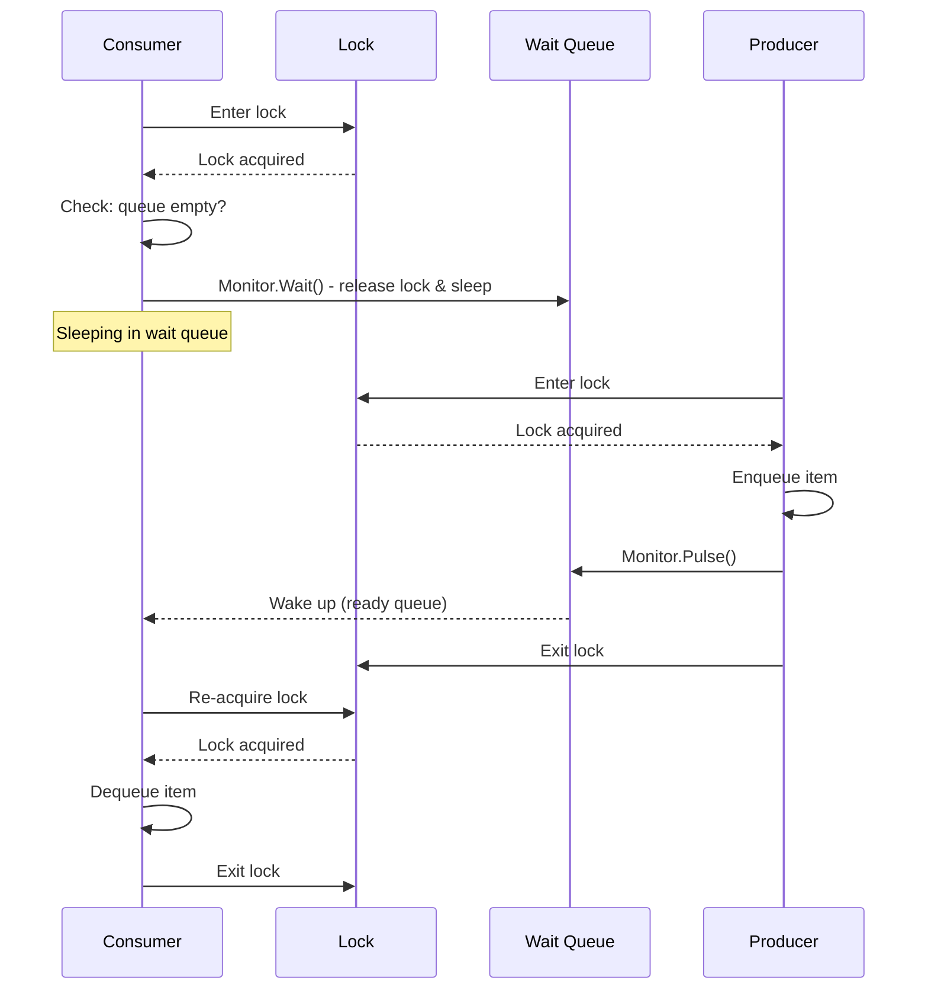
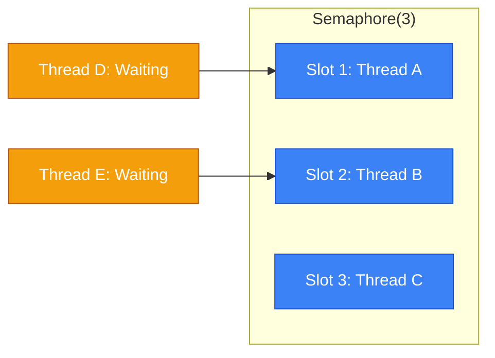
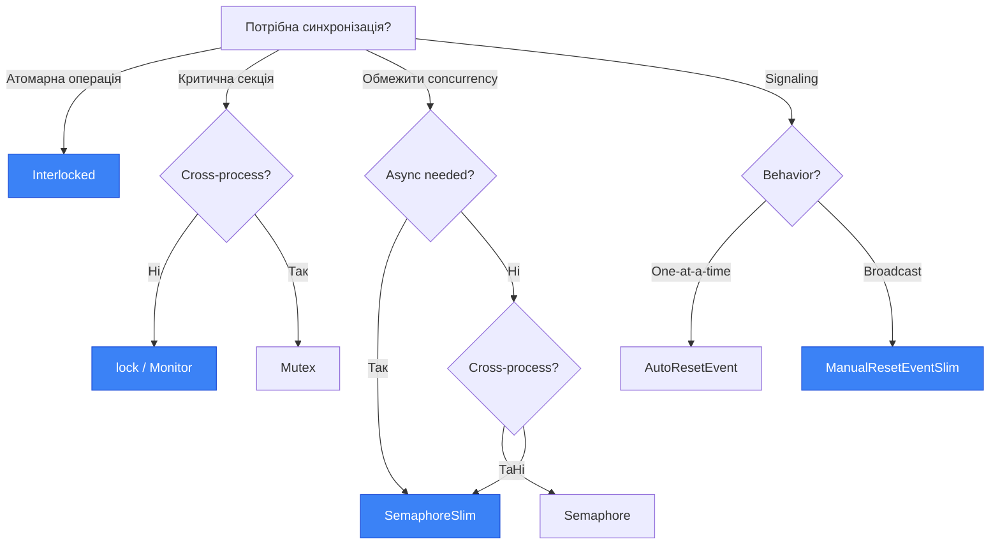

```mermaid
graph TD
    subgraph "Race Condition"
        A1[Thread A: Read X] --> A2[Thread B: Read X]
        A2 --> A3[Thread A: Write X+1]
        A3 --> A4[Thread B: Write X+1]
        A4 --> A5[Expected: X+2<br/>Actual: X+1]
    end

    subgraph "Deadlock"
        B1[Thread A: Lock Resource 1] --> B2[Thread B: Lock Resource 2]
        B2 --> B3[Thread A: Wait for Resource 2]
        B3 --> B4[Thread B: Wait for Resource 1]
        B4 --> B5[Both Blocked Forever]
    end

    style A5 fill:#ef4444,stroke:#dc2626,color:#ffffff
    style B5 fill:#ef4444,stroke:#dc2626,color:#ffffff
```

# Synchronization Primitives (Примітиви Синхронізації)

## Вступ та Контекст

### Проблема: Чому Потрібна Синхронізація?

Уявіть, що ви розробляєте банківську систему. Два потоки одночасно обробляють транзакції для одного рахунку:

```csharp
// ❌ НЕБЕЗПЕЧНИЙ КОД: Race Condition
public class BankAccount
{
    private decimal _balance = 1000;

    public void Withdraw(decimal amount)
    {
        if (_balance >= amount)           // Thread A: 1000 >= 500? Так!
        {                                  // Thread B: 1000 >= 600? Так!
            Thread.Sleep(1);               // Симуляція затримки
            _balance -= amount;            // Thread A: 1000 - 500 = 500
        }                                  // Thread B: 500 - 600 = -100 ❌
    }
}
```

**Що сталось?**

1. **Thread A** перевіряє баланс: 1000 >= 500 ✓
2. **Thread B** перевіряє баланс: 1000 >= 600 ✓ (ще не змінений!)
3. Thread A знімає 500: баланс = 500
4. Thread B знімає 600: баланс = **-100** 😱

Це класичний приклад **Race Condition (стан гонки)** — результат залежить від порядку виконання потоків, який недетермінований.

::warning
**Статистика**: За дослідженнями Microsoft, race conditions — одна з трьох найскладніших для діагностики категорій багів (разом з memory leaks та deadlocks). Вони часто з'являються лише під високим навантаженням у production.
::

### Типи Проблем Багатопотоковості

| Проблема           | Опис                               | Наслідок                           |
| :----------------- | :--------------------------------- | :--------------------------------- |
| **Race Condition** | Конкуренція за спільний ресурс     | Data corruption, inconsistency     |
| **Deadlock**       | Взаємне блокування потоків         | Program hang (100% CPU або freeze) |
| **Livelock**       | Потоки активні, але не прогресують | Нескінченний цикл без користі      |
| **Starvation**     | Потік не отримує ресурс            | Затримки, timeout failures         |

::mermaid



::

---

## Lock Statement: Найпростіший Захист

### Базовий Синтаксис

Ключове слово `lock` — це найпоширеніший спосіб захисту критичних секцій:

```csharp showLineNumbers
public class ThreadSafeCounter
{
    private int _count = 0;
    private readonly object _lock = new object();  // Об'єкт для блокування

    public void Increment()
    {
        lock (_lock)  // [!code highlight]
        {
            // Критична секція: тільки один потік одночасно
            _count++;
        }
    }

    public int GetCount()
    {
        lock (_lock)
        {
            return _count;
        }
    }
}
```

**Декомпозиція:**

-   **Рядок 3**: `_lock` — reference type об'єкт, який слугує "замком"
-   **Рядок 8**: `lock (_lock)` — потік намагається "захопити" замок
-   Якщо замок вільний → потік входить у критичну секцію
-   Якщо замок зайнятий → потік **блокується** до звільнення

### Під Капотом: Lock як Monitor

Компілятор перетворює `lock` у виклики `Monitor`:

::code-group

```csharp [Оригінальний Код]
lock (_lock)
{
    _count++;
}
```

```csharp [Після Компіляції]
bool lockTaken = false;
try
{
    Monitor.Enter(_lock, ref lockTaken);
    _count++;
}
finally
{
    if (lockTaken)
    {
        Monitor.Exit(_lock);
    }
}
```

::

::note
**Чому `try-finally`?** Гарантує звільнення lock навіть при винятку. Без цього потік міг би "забути" звільнити замок, заблокувавши інші потоки назавжди.
::

### Правила Вибору Lock Object

| Правило              | ✅ Правильно                             | ❌ Неправильно                                                         |
| :------------------- | :--------------------------------------- | :--------------------------------------------------------------------- |
| **Приватний об'єкт** | `private readonly object _lock = new();` | `lock(this)` — зовнішній код може заблокувати ваш об'єкт               |
| **Reference type**   | `object`, `class instance`               | `lock(5)` — value types не працюють                                    |
| **Readonly**         | `readonly object _lock`                  | Можливе перепризначення                                                |
| **Не string**        | `object`                                 | `lock("myLock")` — string interning може спричинити unexpected sharing |
| **Dedicated object** | Окремий об'єкт для кожного ресурсу       | Один lock для всього класу                                             |

::caution
**Типова Помилка: lock(this)**

```csharp
public class BadExample
{
    public void DoWork()
    {
        lock (this)  // ❌ ПОГАНО!
        {
            // Зовнішній код може зробити:
            // lock(badExampleInstance) { ... }
            // і заблокувати ваш метод!
        }
    }
}
```

::

---

## Monitor Class: Повний Контроль

`System.Threading.Monitor` надає більше flexibility ніж `lock`:

### Monitor.TryEnter(): Timeout для Lock

```csharp showLineNumbers
using System;
using System.Threading;

public class ResourceManager
{
    private readonly object _resourceLock = new object();

    public bool TryAccessResource(TimeSpan timeout)
    {
        bool lockTaken = false;

        try
        {
            // Спробувати захопити lock з timeout
            Monitor.TryEnter(_resourceLock, timeout, ref lockTaken);  // [!code highlight]

            if (lockTaken)
            {
                // Успішно отримали lock
                ProcessResource();
                return true;
            }
            else
            {
                // Timeout — не вдалось отримати lock
                Console.WriteLine("Не вдалось отримати доступ до ресурсу");
                return false;
            }
        }
        finally
        {
            if (lockTaken)
            {
                Monitor.Exit(_resourceLock);
            }
        }
    }

    private void ProcessResource()
    {
        Console.WriteLine("Processing resource...");
        Thread.Sleep(1000);
    }
}
```

::tip
**Use Case для TryEnter**: Коли ви не хочете блокувати потік назавжди — наприклад, у real-time системах або при обробці HTTP requests з timeout.
::

### Monitor.Wait() та Monitor.Pulse(): Сигналізація

Ці методи дозволяють потокам **комунікувати** через спільний lock:

```csharp showLineNumbers
using System;
using System.Collections.Generic;
using System.Threading;

public class BlockingQueue<T>
{
    private readonly Queue<T> _queue = new Queue<T>();
    private readonly object _lock = new object();

    public void Enqueue(T item)
    {
        lock (_lock)
        {
            _queue.Enqueue(item);
            Monitor.Pulse(_lock);  // Сигналізуємо одному очікуючому потоку  // [!code highlight]
        }
    }

    public T Dequeue()
    {
        lock (_lock)
        {
            // Чекаємо, поки черга не буде порожньою
            while (_queue.Count == 0)
            {
                Monitor.Wait(_lock);  // Звільняємо lock та засинаємо  // [!code highlight]
                // При пробудженні знову захоплюємо lock
            }

            return _queue.Dequeue();
        }
    }
}

class Program
{
    static BlockingQueue<int> _queue = new BlockingQueue<int>();

    static void Main()
    {
        // Consumer thread
        Thread consumer = new Thread(() =>
        {
            for (int i = 0; i < 5; i++)
            {
                int item = _queue.Dequeue();
                Console.WriteLine($"Consumed: {item}");
            }
        });

        // Producer thread
        Thread producer = new Thread(() =>
        {
            for (int i = 0; i < 5; i++)
            {
                Thread.Sleep(500);
                _queue.Enqueue(i);
                Console.WriteLine($"Produced: {i}");
            }
        });

        consumer.Start();
        producer.Start();

        consumer.Join();
        producer.Join();
    }
}
```

**Як працює Wait/Pulse:**

::mermaid



::

::warning
**Важливо**: Завжди перевіряйте умову у `while`, а не в `if`!

```csharp
// ❌ ПОГАНО: spurious wakeup може порушити логіку
if (_queue.Count == 0) Monitor.Wait(_lock);

// ✅ ПРАВИЛЬНО: перевірка після кожного пробудження
while (_queue.Count == 0) Monitor.Wait(_lock);
```

::

---

## System.Threading.Lock (C# 13)

### Новий Тип у .NET 9

C# 13 вводить новий тип `System.Threading.Lock`, оптимізований для синхронізації:

```csharp showLineNumbers
using System;
using System.Threading;

public class Account
{
    private readonly Lock _balanceLock = new();  // Новий тип Lock  // [!code highlight]
    private decimal _balance;

    public Account(decimal initialBalance) => _balance = initialBalance;

    public decimal Debit(decimal amount)
    {
        lock (_balanceLock)  // Компілятор розпізнає Lock тип  // [!code highlight]
        {
            if (_balance >= amount)
            {
                _balance -= amount;
                return amount;
            }
            return 0;
        }
    }

    public void Credit(decimal amount)
    {
        lock (_balanceLock)
        {
            _balance += amount;
        }
    }
}
```

### Lock.EnterScope(): Явний API

```csharp showLineNumbers
using System;
using System.Threading;

public class ResourceController
{
    private readonly Lock _lock = new();

    public void Process()
    {
        // EnterScope() повертає ref struct, що автоматично звільняється
        using (Lock.Scope scope = _lock.EnterScope())  // [!code highlight]
        {
            // Критична секція
            Console.WriteLine("Processing...");
        }
        // scope.Dispose() автоматично викликає Exit
    }
}
```

### Переваги Lock над object

| Аспект             | `object` lock             | `System.Threading.Lock`        |
| :----------------- | :------------------------ | :----------------------------- |
| **Продуктивність** | Monitor-based (older API) | Оптимізований для сучасних CPU |
| **Семантика**      | Неявна (будь-який object) | Явна (dedicated type)          |
| **API**            | Через Monitor class       | Вбудовані методи               |
| **Boxing**         | Ні                        | Ні (value-like semantics)      |
| **Code clarity**   | Менш очевидно             | Самодокументований код         |

::tip
**Рекомендація**: Для нових проєктів на .NET 9+ використовуйте `System.Threading.Lock` замість `object` для lock objects.
::

---

## Mutex: Cross-Process Synchronization

### Що таке Mutex?

**Mutex (Mutual Exclusion)** — примітив синхронізації, що може використовуватись між **різними процесами**:

| Характеристика     | lock/Monitor       | Mutex                          |
| :----------------- | :----------------- | :----------------------------- |
| **Scope**          | Один процес        | Система (kernel-level)         |
| **Продуктивність** | Швидше (user-mode) | Повільніше (kernel transition) |
| **Ownership**      | Thread             | Thread (але kernel-tracked)    |
| **Named**          | Ні                 | Так (system-wide)              |

### Local Mutex (In-Process)

```csharp showLineNumbers
using System;
using System.Threading;

class Program
{
    private static Mutex _mutex = new Mutex();  // Локальний mutex

    static void Main()
    {
        Thread t1 = new Thread(AccessResource);
        Thread t2 = new Thread(AccessResource);

        t1.Start("Thread 1");
        t2.Start("Thread 2");

        t1.Join();
        t2.Join();
    }

    static void AccessResource(object? name)
    {
        Console.WriteLine($"{name}: Waiting for mutex...");

        _mutex.WaitOne();  // Захопити mutex  // [!code highlight]
        try
        {
            Console.WriteLine($"{name}: Entered critical section");
            Thread.Sleep(2000);
        }
        finally
        {
            _mutex.ReleaseMutex();  // Звільнити mutex  // [!code highlight]
            Console.WriteLine($"{name}: Released mutex");
        }
    }
}
```

### Named Mutex: Single Instance Application

Класичний use case — забезпечити, що тільки один екземпляр програми запущений:

```csharp showLineNumbers
using System;
using System.Threading;

class Program
{
    static void Main()
    {
        // Унікальне ім'я для mutex (часто GUID)
        const string mutexName = "Global\\MyApp_SingleInstance_12345";

        // CreatedNew = true, якщо mutex створено вперше
        using Mutex mutex = new Mutex(true, mutexName, out bool createdNew);  // [!code highlight]

        if (!createdNew)
        {
            Console.WriteLine("Інший екземпляр програми вже запущений!");
            return;
        }

        Console.WriteLine("Програма запущена. Натисніть Enter для виходу...");
        Console.ReadLine();
    }
}
```

**Декомпозиція:**

-   `true` (перший аргумент) — спробувати одразу захопити mutex
-   `mutexName` — системне ім'я (Global\\ для всіх сесій, Local\\ для поточної)
-   `createdNew` — `true` якщо ми створили mutex, `false` якщо він вже існував

::warning
**Важливо**: Завжди звільняйте mutex! Якщо процес аварійно завершиться без `ReleaseMutex()`, система автоматично позначить mutex як **abandoned**, і наступний `WaitOne()` кине `AbandonedMutexException`.
::

---

## Semaphore: Обмеження Concurrency

### Концепція Семафора

**Semaphore** — дозволяє обмежену кількість потоків одночасно:

::mermaid



::

### SemaphoreSlim: Lightweight In-Process

```csharp showLineNumbers
using System;
using System.Threading;
using System.Threading.Tasks;

class ConnectionPool
{
    // Максимум 5 одночасних підключень
    private readonly SemaphoreSlim _semaphore = new SemaphoreSlim(5, 5);  // [!code highlight]

    public async Task<string> QueryDatabaseAsync(string query)
    {
        Console.WriteLine($"[{DateTime.Now:HH:mm:ss.fff}] Waiting for connection...");

        await _semaphore.WaitAsync();  // Async wait  // [!code highlight]
        try
        {
            Console.WriteLine($"[{DateTime.Now:HH:mm:ss.fff}] Got connection, executing: {query}");
            await Task.Delay(2000);  // Симуляція запиту
            return $"Result for: {query}";
        }
        finally
        {
            _semaphore.Release();  // Звільнити slot  // [!code highlight]
            Console.WriteLine($"[{DateTime.Now:HH:mm:ss.fff}] Released connection");
        }
    }
}

class Program
{
    static async Task Main()
    {
        var pool = new ConnectionPool();

        // Запускаємо 10 паралельних запитів
        var tasks = new Task<string>[10];
        for (int i = 0; i < 10; i++)
        {
            tasks[i] = pool.QueryDatabaseAsync($"SELECT * FROM Table{i}");
        }

        await Task.WhenAll(tasks);
    }
}
```

**Параметри конструктора:**

-   `initialCount` — скільки slots доступно на старті
-   `maxCount` — максимальна кількість (Release не може перевищити)

### Порівняння Semaphore та SemaphoreSlim

| Аспект            | Semaphore             | SemaphoreSlim              |
| :---------------- | :-------------------- | :------------------------- |
| **Scope**         | Cross-process (named) | In-process only            |
| **Performance**   | Kernel mode (slower)  | User mode (faster)         |
| **Async support** | Ні                    | ✅ WaitAsync()             |
| **Cancellation**  | Ні                    | ✅ CancellationToken       |
| **Use case**      | IPC, system resources | Application-level limiting |

::tip
**Rate Limiting Example:**

```csharp
// Обмеження до 100 requests/second
private readonly SemaphoreSlim _rateLimiter = new SemaphoreSlim(100, 100);

public async Task HandleRequestAsync()
{
    await _rateLimiter.WaitAsync();
    try
    {
        await ProcessRequestAsync();
    }
    finally
    {
        // Повернути slot через 1 секунду
        _ = Task.Delay(1000).ContinueWith(_ => _rateLimiter.Release());
    }
}
```

::

---

## AutoResetEvent та ManualResetEvent

### Signaling Mechanism

Events — це механізм **сигналізації** між потоками:

| Event                | Поведінка після Signal   | Аналогія                            |
| :------------------- | :----------------------- | :---------------------------------- |
| **AutoResetEvent**   | Автоматично скидається   | Турнікет (один пройшов — закрився)  |
| **ManualResetEvent** | Залишається встановленим | Ворота (відкрились — всі проходять) |

### AutoResetEvent

```csharp showLineNumbers
using System;
using System.Threading;

class Program
{
    // false = початковий стан "закритий"
    static AutoResetEvent _event = new AutoResetEvent(false);  // [!code highlight]

    static void Main()
    {
        Thread waiter = new Thread(() =>
        {
            Console.WriteLine("Waiter: Waiting for signal...");
            _event.WaitOne();  // Блокується до сигналу  // [!code highlight]
            Console.WriteLine("Waiter: Got signal!");

            // AutoReset: event автоматично скинувся
            Console.WriteLine("Waiter: Waiting again...");
            _event.WaitOne();  // Знову блокується  // [!code highlight]
            Console.WriteLine("Waiter: Got second signal!");
        });

        waiter.Start();
        Thread.Sleep(1000);

        Console.WriteLine("Main: Sending first signal");
        _event.Set();  // [!code highlight]

        Thread.Sleep(1000);

        Console.WriteLine("Main: Sending second signal");
        _event.Set();

        waiter.Join();
    }
}
```

### ManualResetEvent (та ManualResetEventSlim)

```csharp showLineNumbers
using System;
using System.Threading;

class Program
{
    static ManualResetEventSlim _gate = new ManualResetEventSlim(false);  // [!code highlight]

    static void Main()
    {
        // Запускаємо 5 потоків, що чекають на "ворота"
        for (int i = 0; i < 5; i++)
        {
            int id = i;
            new Thread(() =>
            {
                Console.WriteLine($"Thread {id}: Waiting at gate...");
                _gate.Wait();  // Всі потоки чекають  // [!code highlight]
                Console.WriteLine($"Thread {id}: Passed through gate!");
            }).Start();
        }

        Thread.Sleep(2000);
        Console.WriteLine("Main: Opening gate...");
        _gate.Set();  // Всі 5 потоків проходять одночасно!  // [!code highlight]

        Thread.Sleep(1000);
        Console.WriteLine("Main: Closing gate...");
        _gate.Reset();  // Закриваємо ворота  // [!code highlight]
    }
}
```

::note
**ManualResetEventSlim** — легша альтернатива для in-process використання. Вона використовує spin-waiting для коротких очікувань, що ефективніше за kernel transition.
::

### Use Case: Producer-Consumer з Signaling

```csharp showLineNumbers
using System;
using System.Collections.Concurrent;
using System.Threading;

class ProducerConsumer
{
    private readonly ConcurrentQueue<int> _queue = new();
    private readonly AutoResetEvent _itemAvailable = new(false);
    private volatile bool _running = true;

    public void Producer()
    {
        for (int i = 0; i < 10; i++)
        {
            Thread.Sleep(500);
            _queue.Enqueue(i);
            Console.WriteLine($"Produced: {i}");
            _itemAvailable.Set();  // Сигналізуємо consumer
        }
        _running = false;
        _itemAvailable.Set();  // Розблокувати consumer для завершення
    }

    public void Consumer()
    {
        while (_running || !_queue.IsEmpty)
        {
            _itemAvailable.WaitOne(1000);  // Timeout для перевірки _running

            while (_queue.TryDequeue(out int item))
            {
                Console.WriteLine($"Consumed: {item}");
            }
        }
    }
}
```

---

## Interlocked Operations: Lock-Free Programming

### Атомарні Операції

`System.Threading.Interlocked` надає **атомарні** операції, що не потребують lock:

```csharp showLineNumbers
using System;
using System.Threading;

class AtomicCounter
{
    private long _count = 0;

    // ❌ НЕ атомарно (read-modify-write)
    public void IncrementWrong()
    {
        _count++;  // Насправді: temp = _count; temp++; _count = temp;
    }

    // ✅ Атомарно
    public void IncrementRight()
    {
        Interlocked.Increment(ref _count);  // [!code highlight]
    }

    public long Value => Interlocked.Read(ref _count);  // Атомарне читання для long
}
```

### Основні Методи Interlocked

| Метод                                  | Опис                       | Приклад                                 |
| :------------------------------------- | :------------------------- | :-------------------------------------- |
| `Increment(ref int)`                   | +1, повертає нове значення | `Interlocked.Increment(ref x)`          |
| `Decrement(ref int)`                   | -1, повертає нове значення | `Interlocked.Decrement(ref x)`          |
| `Add(ref int, int)`                    | Додає значення             | `Interlocked.Add(ref x, 5)`             |
| `Exchange(ref int, int)`               | Заміна, повертає старе     | `old = Interlocked.Exchange(ref x, 10)` |
| `CompareExchange(ref, new, comparand)` | CAS операція               | Див. нижче                              |
| `Read(ref long)`                       | Атомарне читання 64-bit    | `Interlocked.Read(ref x)`               |

### CompareExchange: Compare-And-Swap (CAS)

CAS — фундаментальна операція для lock-free алгоритмів:

```csharp showLineNumbers
using System;
using System.Threading;

class SpinLock  // Спрощена реалізація
{
    private int _locked = 0;  // 0 = вільний, 1 = зайнятий

    public void Enter()
    {
        // Спробувати замінити 0 на 1
        while (Interlocked.CompareExchange(ref _locked, 1, 0) != 0)  // [!code highlight]
        {
            // Якщо не вдалось — хтось інший тримає lock
            Thread.SpinWait(10);  // Коротке очікування
        }
    }

    public void Exit()
    {
        Interlocked.Exchange(ref _locked, 0);
    }
}
```

**Як працює CompareExchange:**

```
CompareExchange(ref location, newValue, comparand):

1. Атомарно читає location
2. Якщо location == comparand:
   - Записує newValue в location
   - Повертає старе значення (comparand)
3. Якщо location != comparand:
   - Нічого не змінює
   - Повертає поточне значення location
```

### Lock-Free Max Update

```csharp showLineNumbers
using System;
using System.Threading;

class ThreadSafeMax
{
    private int _max = int.MinValue;

    public void UpdateIfGreater(int value)
    {
        int current;
        do
        {
            current = _max;
            if (value <= current)
                return;  // Не потрібно оновлювати

        } while (Interlocked.CompareExchange(ref _max, value, current) != current);  // [!code highlight]
        // Якщо CAS не вдався — хтось змінив _max, пробуємо знову
    }

    public int Max => _max;
}
```

::tip
**Коли використовувати Interlocked:**

-   Прості лічильники та статистика
-   Flags та стани
-   Lock-free структури даних (advanced)

**Коли НЕ використовувати:**

-   Складні операції над кількома змінними
-   Коли потрібен "all-or-nothing" transaction

::

---

## Volatile Keyword

### Memory Visibility Problem

Сучасні процесори та компілятори оптимізують код, що може порушити видимість змін між потоками:

```csharp
// ❌ МОЖЕ НЕ ПРАЦЮВАТИ без volatile
class Worker
{
    private bool _shouldStop = false;  // Не volatile

    public void DoWork()
    {
        while (!_shouldStop)  // Компілятор може закешувати _shouldStop!
        {
            // Робота...
        }
    }

    public void Stop() => _shouldStop = true;
}
```

**Що може піти не так:**

1. JIT кешує `_shouldStop` в регістр CPU
2. Інший потік змінює `_shouldStop` в пам'яті
3. Worker thread не бачить зміни — нескінченний цикл!

### Volatile: Memory Barrier

```csharp showLineNumbers
class Worker
{
    private volatile bool _shouldStop = false;  // [!code highlight]

    public void DoWork()
    {
        while (!_shouldStop)  // Завжди читає з пам'яті
        {
            // Робота...
        }
    }

    public void Stop() => _shouldStop = true;  // Негайно видима для інших потоків
}
```

**Що робить volatile:**

-   **Read**: Вставляє **acquire barrier** — читання не може бути переміщене до нього
-   **Write**: Вставляє **release barrier** — запис не може бути переміщений після нього

### Volatile Class (Альтернатива)

```csharp showLineNumbers
using System.Threading;

class Counter
{
    private int _count = 0;

    public void Increment()
    {
        // Volatile.Write гарантує видимість
        Volatile.Write(ref _count, Volatile.Read(ref _count) + 1);
    }

    public int Count => Volatile.Read(ref _count);
}
```

::warning
**Важливо**: `volatile` НЕ робить операції атомарними!

```csharp
private volatile int _count = 0;

// ❌ НЕ АТОМАРНО навіть з volatile!
_count++;  // Read + Increment + Write — три операції

// ✅ Для атомарності використовуйте Interlocked
Interlocked.Increment(ref _count);
```

::

### Коли (Не) Використовувати Volatile

| Використовуйте `volatile`        | НЕ використовуйте `volatile`   |
| :------------------------------- | :----------------------------- |
| Прості boolean flags для зупинки | Лічильники, що інкрементуються |
| Status indicators                | Складні об'єкти                |
| Одноразові присвоєння            | Операції на кількох змінних    |

::tip
**Рекомендація**: У більшості випадків замість `volatile` краще використовувати:

1. `lock` — для комплексних операцій
2. `Interlocked` — для атомарних операцій
3. `Monitor.Wait/Pulse` — для сигналізації

::

---

## Порівняльна Таблиця Примітивів

| Примітив                | Scope         | Performance      | Async | Use Case                        |
| :---------------------- | :------------ | :--------------- | :---- | :------------------------------ |
| `lock` / `Monitor`      | In-process    | ⚡⚡⚡ Fast      | ❌    | Загальна синхронізація          |
| `System.Threading.Lock` | In-process    | ⚡⚡⚡ Fast      | ❌    | .NET 9+, явний API              |
| `Mutex`                 | Cross-process | ⚡ Slow          | ❌    | Single instance, IPC            |
| `Semaphore`             | Cross-process | ⚡ Slow          | ❌    | Resource limiting               |
| `SemaphoreSlim`         | In-process    | ⚡⚡⚡ Fast      | ✅    | Connection pools, rate limiting |
| `AutoResetEvent`        | Cross-process | ⚡⚡ Medium      | ❌    | Point-to-point signaling        |
| `ManualResetEventSlim`  | In-process    | ⚡⚡⚡ Fast      | ✅    | Broadcast signaling             |
| `Interlocked`           | N/A           | ⚡⚡⚡⚡ Fastest | N/A   | Atomic operations               |
| `volatile`              | N/A           | ⚡⚡⚡⚡ Fastest | N/A   | Visibility only                 |

### Decision Flowchart

::mermaid



::

---

## Практичні Завдання

### Рівень 1: Початковий

::collapsible{title="Завдання 1.1: Thread-Safe Counter"}
Реалізуйте клас `SafeCounter` двома способами:

1. Використовуючи `lock`
2. Використовуючи `Interlocked`

Протестуйте з 10 потоками, кожен додає 1000 до лічильника. Порівняйте продуктивність обох підходів.
::

::collapsible{title="Завдання 1.2: Single Instance App"}
Створіть WPF або Console додаток, що забороняє запуск другого екземпляра, показуючи повідомлення користувачу.
::

### Рівень 2: Середній

::collapsible{title="Завдання 2.1: Bounded Buffer"}
Реалізуйте клас `BoundedBuffer<T>` з методами:

-   `Put(T item)` — блокується, якщо буфер повний (макс. 10 елементів)
-   `Take()` — блокується, якщо буфер порожній

Використовуйте `Monitor.Wait()` / `Monitor.Pulse()`.
::

::collapsible{title="Завдання 2.2: API Rate Limiter"}
Реалізуйте клас `RateLimiter` з методом:

-   `async Task<bool> TryAcquireAsync(TimeSpan timeout)`

Обмеження: максимум 10 запитів на секунду. Використовуйте `SemaphoreSlim`.
::

### Рівень 3: Просунутий

::collapsible{title="Завдання 3.1: Lock-Free Stack"}
Реалізуйте lock-free stack використовуючи тільки `Interlocked.CompareExchange`:

-   `Push(T item)`
-   `bool TryPop(out T item)`

Підказка: використовуйте linked list де голова атомарно оновлюється через CAS.
::

---

## Підсумки

У цьому розділі ми розглянули всі основні примітиви синхронізації .NET:

-   **lock / Monitor** — базова взаємовиключна синхронізація
-   **System.Threading.Lock** — новий оптимізований тип у C# 13
-   **Mutex** — cross-process взаємовиключення
-   **Semaphore / SemaphoreSlim** — обмеження кількості concurrent доступів
-   **AutoResetEvent / ManualResetEvent** — механізми сигналізації
-   **Interlocked** — атомарні lock-free операції
-   **volatile** — забезпечення memory visibility

::tip
**Наступний крок**: Для високорівневого асинхронного програмування вивчіть [Task Parallel Library (TPL)](./8.task-parallel-library.md) та async/await pattern.
::

## Корисні Посилання

-   [Threading in C# - Joseph Albahari](https://www.albahari.com/threading/)
-   [Synchronization Primitives - Microsoft Docs](https://learn.microsoft.com/en-us/dotnet/standard/threading/overview-of-synchronization-primitives)
-   [Lock Statement - C# Reference](https://learn.microsoft.com/en-us/dotnet/csharp/language-reference/statements/lock)
-   [Interlocked Class](https://learn.microsoft.com/en-us/dotnet/api/system.threading.interlocked)
