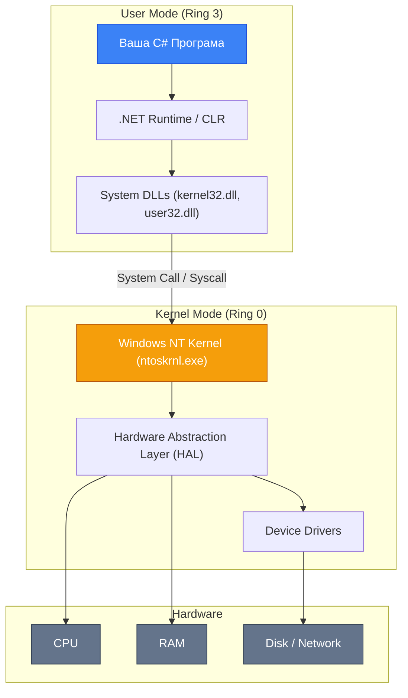
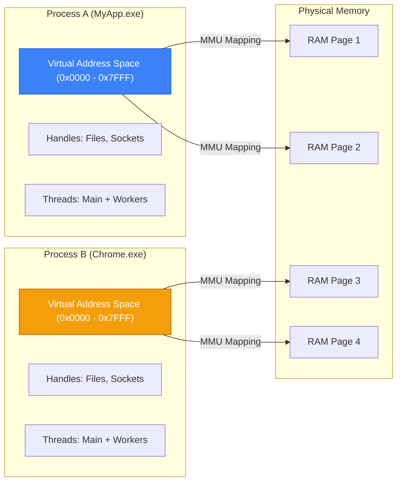
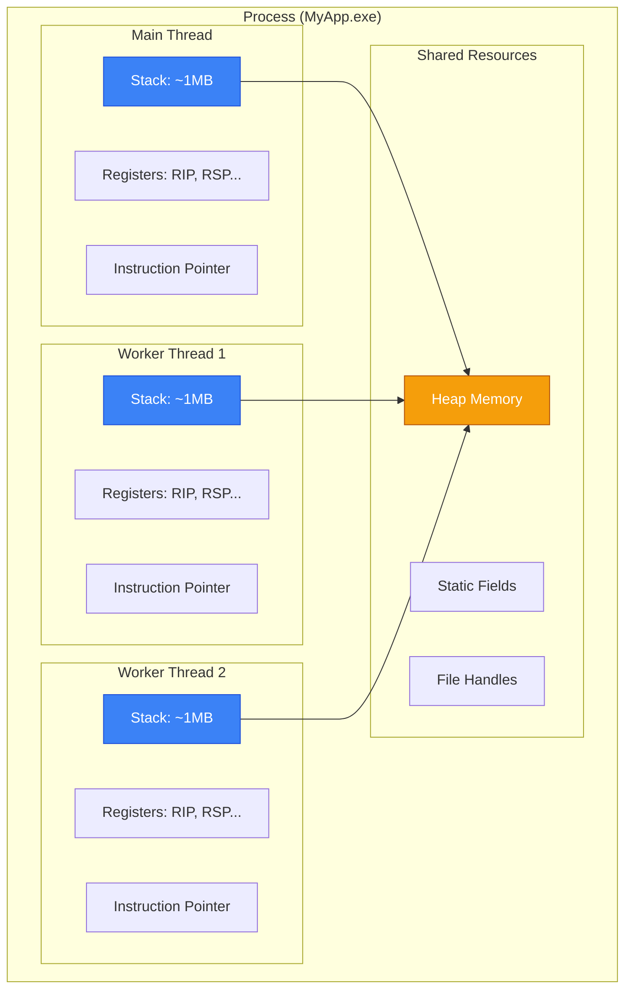
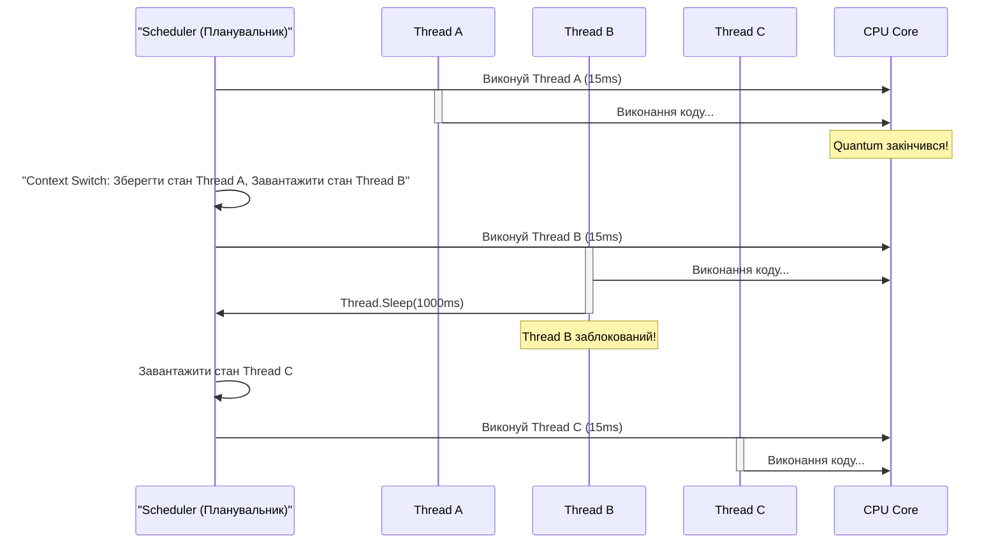

```mermaid
gantt
    title Concurrency vs Parallelism
    dateFormat X
    axisFormat %s

    section "Concurrency (1 Core)"
    Task A :active, a1, 0, 2
    Task B :b1, 2, 4
    Task A :active, a2, 4, 6
    Task B :b2, 6, 8

    section "Parallelism (2 Cores) - Core 1"
    Task A :active, p1, 0, 8

    section "Parallelism (2 Cores) - Core 2"
    Task B :p2, 0, 8
```

# Як Працює Операційна Система

## Вступ та Контекст

### Навіщо Це Знати?

Уявіть, що ви намагаєтеся пояснити, чому ваша C# програма "зависає" при виклику `Thread.Sleep(5000)`. Або чому два потоки, що читають одну і ту саму змінну, іноді отримують різні значення. Або чому `Parallel.ForEach` на 8-ядерному процесорі інколи працює повільніше за звичайний `foreach`.

Відповіді на ці запитання лежать не в синтаксисі C#, а в тому, як влаштована **операційна система (ОС)**. Без цього фундаменту вивчення багатопоточності перетворюється на механічне запам'ятовування API без розуміння того, що відбувається "під капотом".

Ця тема — підготовчий фундамент. Ми розглянемо, як ОС керує виконанням програм, що таке процес та потік на рівні операційної системи, і як CPU розподіляє свій час між конкуруючими задачами. Ця теоретична база зробить кожну наступну тему зрозумілою, а не просто "магічною".

### Що Ви Дізнаєтесь

Після вивчення цієї теми ви зможете:

- 🧠 Пояснити, що таке процес і потік на рівні ОС
- ⚙️ Розуміти, як планувальник ОС розподіляє час CPU
- 🔀 Чітко відрізняти конкурентність від паралелізму
- 📊 Грамотно оцінювати межі прискорення від паралелізму (закон Амдала)

---

## Частина 1: Операційна Система — Менеджер Ресурсів

### Що Таке ОС?

Операційна система (ОС, англ. Operating System, OS) — це програмне забезпечення, що виступає **посередником між апаратним забезпеченням (hardware) і прикладними програмами (applications)**.

Уявіть великий ресторан. Є кухня з ресурсами — плитами, продуктами, інструментами. Є клієнти — відвідувачі, що замовляють страви. Між ними стоїть **менеджер ресторану**, який вирішує:

- Яку плиту виділити якому кухарю.
- Як розподілити запаси між різними стравами.
- Хто отримає обслуговування першим.
- Як забезпечити, щоб кухарі не заважали один одному.

ОС виконує аналогічну роль для комп'ютера: розподіляє CPU, пам'ять, файли, мережеві з'єднання між програмами, стежить за безпекою та ізоляцією.

### Ядро (Kernel) та Рівні Привілеїв

Серцем будь-якої ОС є **ядро (Kernel)** — компонент, що має прямий доступ до апаратного забезпечення та виконується з максимальними привілеями. Все, що відбувається в комп'ютері, проходить через ядро.

Windows розділяє виконання на два рівні:

::mermaid



::

**User Mode (Режим Користувача)** — де виконуються ваші програми, включно з .NET Runtime. Тут є обмежений доступ до пам'яті та апаратного забезпечення. Якщо ваша програма спробує напряму звернутися до апаратного забезпечення — ОС негайно завершить її виконання.

**Kernel Mode (Режим Ядра)** — де виконується ядро ОС та драйвери. Тут є повний доступ до будь-якого ресурсу системи. Перехід між режимами відбувається через **System Call (системний виклик)** — формальний запит до ядра виконати якусь привілейовану операцію.

::note
**Практичний зв'язок**: Щоразу як C# викликає `File.ReadAllText()`, .NET Runtime здійснює системні виклики до ядра Windows. Ось чому I/O операції набагато повільніші за операції в пам'яті — кожен системний виклик потребує переходу між режимами.
::

---

## Частина 2: Процес — Ізольоване Середовище

### Що Таке Процес?

**Процес (Process)** — це запущений екземпляр програми. Коли ви запускаєте `dotnet run`, Windows створює новий процес для вашої програми.

Ключова характеристика процесу — **ізоляція**. Кожен процес живе у власній "пісочниці":

::mermaid



::

Зверніть увагу: обидва процеси мають однаковий **Virtual Address Space** (0x0000 - 0x7FFF). Це не конфлікт — кожен процес "думає", що він єдиний у пам'яті. MMU (Memory Management Unit) процесора транслює ці "уявні" адреси в реальні фізичні адреси RAM.

### Анатомія Процесу Windows

Кожен Windows-процес складається з кількох ключових компонентів:

::field-group

::field{name="Process ID (PID)" type="uint32"}
Унікальний числовий ідентифікатор процесу в системі. Саме за PID Task Manager "вбиває" процес.
::

::field{name="Virtual Address Space" type="4GB (x86) / 128TB (x64)"}
Діапазон пам'яті, що "бачить" процес. Для 64-bit процесу на Windows — перші 8 ТБ. "Private bytes" — сторінки, що фактично використовуються.
::

::field{name="Handle Table" type="kernel structure"}
Таблиця відкритих ресурсів: файли, сокети, mutex-и, події. Ядро веде їх облік та автоматично закриває при завершенні процесу.
::

::field{name="Token (Security Context)" type="kernel object"}
Токен безпеки: від імені якого користувача виконується процес, які привілеї має. Саме через нього "Run as Administrator" дає підвищені права.
::

::field{name="PEB (Process Environment Block)" type="user-mode structure"}
Блок даних про процес у user-mode: поточна директорія, змінні середовища, список завантажених DLL.
::

::field{name="Threads" type="list<Thread>"}
Один або більше потоків виконання. Щойно запущений процес має рівно один потік — головний (Main Thread).
::

::

### "Квартира" Як Аналогія

Процес — це квартира. У неї є власна площа (адресний простір), власні речі (handles), власні мешканці (потоки). Сусідній процес — це інша квартира. Він не може увійти до вашої квартири без дозволу (IPC механізми), не може бачити ваші речі (ізоляція пам'яті). Якщо в сусідній квартирі пожежа (crash) — ваша квартира залишається неушкодженою.

---

## Частина 3: Потік — Одиниця Виконання

### Що Таке Потік?

**Потік (Thread)** — це одиниця виконання всередині процесу. Якщо процес — це квартира, то потоки — це мешканці цієї квартири. Вони:

- Живуть в одному адресному просторі (спільна кухня та вітальня)
- Можуть вільно читати та писати спільні дані (але це небезпечно!)
- Кожен має власний стек (власна кімната)
- Кожен має власні регістри та instruction pointer (власні думки та плани)

::mermaid



::

### Що Є "Власним" у Потоку?

Кожен потік має свій власний **стек (Stack)** — область пам'яті LIFO, де зберігаються локальні змінні, параметри методів та адреси повернення. За замовчуванням у .NET стек одного потоку займає **~1 MB**. Саме тому нескінченна рекурсія призводить до `StackOverflowException` — стек переповнюється.

Крім стеку, кожен потік має свій **контекст виконання (Execution Context)**: набір значень регістрів процесора (RIP — instruction pointer, RSP — stack pointer, RAX, RBX та ін.). Саме ці дані зберігаються та відновлюються при **context switch** (переключенні контексту).

### Порівняння: Process vs Thread vs Task

| Характеристика | Process | Thread | Task |
| :------------- | :------ | :----- | :--- |
| **Ізоляція** | Повна (власний адресний простір) | Немає (спільна пам'ять) | Немає |
| **Вартість створення** | Висока (~MB пам'яті + ресурси) | Помірна (~1MB стеку) | Низька (з ThreadPool) |
| **Час створення** | ~10-100ms | ~1ms | ~мікросекунди |
| **Комунікація** | Складна (IPC) | Проста (спільна пам'ять) | Проста |
| **Аварійне завершення** | Не впливає на інші процеси | Може зупинити весь процес | Ізольоване |
| **Коли використовувати** | Ізоляція, security | CPU-bound задачі | I/O-bound, async |

---

## Частина 4: Планувальник та Context Switch

### Як CPU Розподіляє Час?

Сучасний комп'ютер може мати 8, 16 або навіть 64 ядра CPU, але при цьому одночасно виконувати тисячі потоків. Як це можливо?

Відповідь — **preemptive multitasking (витісняюча багатозадачність)**. ОС розбиває процесорний час на маленькі відрізки — **quantum (кванти часу, time slice)**. У Windows один quantum дорівнює приблизно **15-30 мілісекунд** (залежить від версії та налаштувань).

**Планувальник (Scheduler)** — компонент ядра, що вирішує, який потік виконувати в кожний момент:

::mermaid



::

### Context Switch: Дорога Операція

**Context Switch (переключення контексту)** — це процес збереження стану поточного потоку та завантаження стану наступного. Що саме зберігається?

::steps

### Крок 1: Збереження регістрів

Поточні значення всіх регістрів CPU (RIP, RSP, RAX, RBX, RCX, RDX, XMM0-XMM15 та ін.) зберігаються у kernel-структурі **KTHREAD** (Thread Control Block).

### Крок 2: Переключення стеку

RSP (stack pointer) перемикається на стек ядра, відбувається перехід з user mode в kernel mode.

### Крок 3: Вибір наступного потоку

Планувальник обирає наступний потік для виконання на основі пріоритетів та часу очікування.

### Крок 4: Відновлення контексту

Завантажуються регістри нового потоку, відновлюється його адресний простір (якщо потік з іншого процесу), відбувається повернення в user mode.

::

Один context switch займає **~1-10 мікросекунд**. Здається, мало. Але якщо у вас 1000 потоків і вони переключаються 100 разів на секунду — це 100,000 context switches на секунду. Саме тому "більше потоків ≠ швидше" — є оптимальна кількість.

### Пріоритети Планування

Планувальник Windows використовує **32 рівні пріоритетів** (0-31). Потоки з вищим пріоритетом виконуються частіше. Потоки з однаковим пріоритетом чергуються за принципом round-robin.

У .NET ви можете впливати на пріоритет через `Thread.Priority`, але це лише **підказка** для ОС, а не гарантія. Детально про це — в темі про [потоки](./04.thread-fundamentals.md).

---

## Частина 5: Concurrency vs Parallelism

### Найважливіша Різниця

Ці два терміни часто плутають, хоча вони описують фундаментально різні речі:

**Concurrency (Конкурентність)** — це властивість системи **справлятися з кількома задачами одночасно**, не обов'язково виконуючи їх дійсно одночасно. Задачі можуть чергуватися на одному ядрі.

**Parallelism (Паралелізм)** — це фактичне **одночасне виконання** кількох задач на різних ядрах CPU.

::mermaid



::

Аналогія: офіціант у ресторані — конкурентний, але не паралельний. Він приймає замовлення від одного столика, поки клієнти іншого столика чекають. Він справляється з кількома столами, але в будь-який момент обслуговує лише один. Два офіціанти — це вже паралелізм.

::note
**Важливо для .NET**: `async/await` забезпечує **конкурентність** без паралелізму — один потік може обслуговувати тисячі I/O операцій, почергово очікуючи на кожну. `Parallel.ForEach` забезпечує **паралелізм**: задачі виконуються на всіх доступних ядрах одночасно.
::

### Фізичний Паралелізм: Cores vs Threads

Сучасні CPU мають кілька рівнів "паралельності":

| Рівень | Технологія | Опис |
| :----- | :--------- | :--- |
| **Physical Cores** | AMD/Intel | Незалежні ядра з власними ALU, кешем L1/L2 |
| **Hyper-Threading (SMT)** | Intel HT / AMD SMT | Кожне фізичне ядро виглядає як 2 логічних |
| **NUMA Nodes** | Сервери | Групи ядер із спільною RAM; доступ до "чужої" RAM — повільніше |

На 8-ядерному CPU з Hyper-Threading (8C/16T) .NET може ефективно використовувати до 16 паралельних потоків. Більше — context switch з'їсть вигоду.

---

## Частина 6: Закон Амдала

### Межі Паралелізму

Закон Амдала (Amdahl's Law) — математична формула, що описує максимальне прискорення програми від паралелізації. Він відповідає на запитання: якщо я додам більше ядер CPU, наскільки швидшим стане мій код?

Формула: _S(n) = 1 / ((1 - p) + p/n)_, де `S(n)` — прискорення при `n` ядрах, `p` — частка коду, що **може** виконуватися паралельно (0.0 - 1.0), `n` — кількість ядер.

| Паралельна частка | 2 ядра | 4 ядра | 8 ядер | 16 ядер | ∞ ядер |
| :---------------- | :----- | :----- | :----- | :------ | :----- |
| **50%** | 1.33x | 1.60x | 1.78x | 1.88x | **2.0x** |
| **75%** | 1.60x | 2.29x | 2.91x | 3.37x | **4.0x** |
| **90%** | 1.82x | 3.08x | 4.71x | 6.40x | **10.0x** |
| **95%** | 1.90x | 3.48x | 5.93x | 9.19x | **20.0x** |

::warning
**Практичний висновок**: Якщо 20% вашого коду завжди виконується послідовно (ініціалізація, злиття результатів, виведення), максимальне прискорення — лише **5x**, незалежно від кількості ядер. Закон Амдала — головний аргумент не "додавати потоки", а "зменшувати послідовний код".
::

Саме тому алгоритми паралелізації значну увагу приділяють **зменшенню послідовних секцій**: ефективна синхронізація, lock-free структури даних, паралельне злиття результатів — все це спрямовано на збільшення `p` до значень, близьких до 1.0.

---

## Підсумок

::card-group

::card{title="Операційна Система" icon="i-lucide-server"}

- ОС — посередник між hardware та програмами
- Kernel Mode (Ring 0) vs User Mode (Ring 3)
- Системні виклики — точки переходу між режимами

::

::card{title="Процес" icon="i-lucide-box"}

- Ізольований адресний простір (власна "квартира")
- Містить: PID, Virtual Memory, Handle Table, Security Token, Threads
- Збій одного процесу не зачіпає інші

::

::card{title="Потік" icon="i-lucide-git-branch"}

- Одиниця виконання всередині процесу
- Власний стек (~1MB) та регістри CPU
- Спільний адресний простір із іншими потоками

::

::card{title="Планування та CS" icon="i-lucide-timer"}

- Quantum = ~15ms у Windows
- Context switch коштує ~1-10μs
- Пріоритети — підказка, не гарантія

::

::card{title="Concurrency vs Parallelism" icon="i-lucide-split"}

- Concurrency: справляємося з кількома задачами (async/await)
- Parallelism: виконуємо одночасно на кількох ядрах
- Не плутати!

::

::card{title="Закон Амдала" icon="i-lucide-trending-up"}

- Max speedup = 1 / serial_fraction
- 10% послідовного коду → max **10x** speedup
- Шукайте спосіб зменшити послідовний код

::

::

---

## Практичні Завдання

### Рівень 1: Базовий — Вивчення Процесів у Windows

1. Відкрийте Task Manager (:kbd{value="Ctrl"} + :kbd{value="Shift"} + :kbd{value="Esc"}) і перейдіть на вкладку **Details**. Знайдіть процес `dotnet.exe`. Запишіть PID, Working Set та кількість потоків (Threads column).

2. Відкрийте **Resource Monitor** (`resmon.exe`) і на вкладці **CPU** знайдіть, скільки потоків має Chrome або інший браузер. Поясніть, чому їх так багато.

3. Запустіть наступну C# програму та поясніть, яка інформація виводиться та звідки вона береться:

```csharp showLineNumbers
using System.Diagnostics;

var process = Process.GetCurrentProcess();
Console.WriteLine($"Process Name: {process.ProcessName}");
Console.WriteLine($"PID: {process.Id}");
Console.WriteLine($"Threads: {process.Threads.Count}");
Console.WriteLine($"Working Set: {process.WorkingSet64 / 1024 / 1024} MB");
Console.WriteLine($"Started: {process.StartTime}");
```

На рядку 3 ми отримуємо об'єкт поточного процесу через статичний метод `GetCurrentProcess()`. Властивість `Threads.Count` на рядку 5 повертає кількість системних потоків, включно зі службовими .NET Runtime потоками (GC, Finalizer, Threadpool), тому результат буде більшим за 1 навіть для "простої" програми.

### Рівень 2: Логіка — Аналіз Закону Амдала

1. У вас є алгоритм обробки даних: 30% часу займає завантаження даних (послідовно), 70% — обробка (паралельно). Розрахуйте очікуване прискорення для 2, 4 та 8 ядер за формулою Амдала. Запишіть результати.

2. Напишіть програму, яка послідовно і паралельно підраховує суму масиву з 100 мільйонів елементів, вимірює час через `Stopwatch` та порівнює з теоретичним прискоренням за законом Амдала.

### Рівень 3: Архітектура — Context Switch Benchmark

Розробіть програму для вимірювання ціни context switch:

1. Запустіть N потоків (2, 4, 8, 16, 32, 64, 128) — кожен виконує порожній цикл з `Thread.Sleep(0)` для примусового переключення.
2. Вимірюйте загальну пропускну здатність (ітерацій/секунду) для кожної кількості потоків.
3. Побудуйте таблицю результатів. Знайдіть точку, де додавання потоків починає давати негативний ефект.
4. Поясніть результати через концепцію context switch та закон Амдала.
