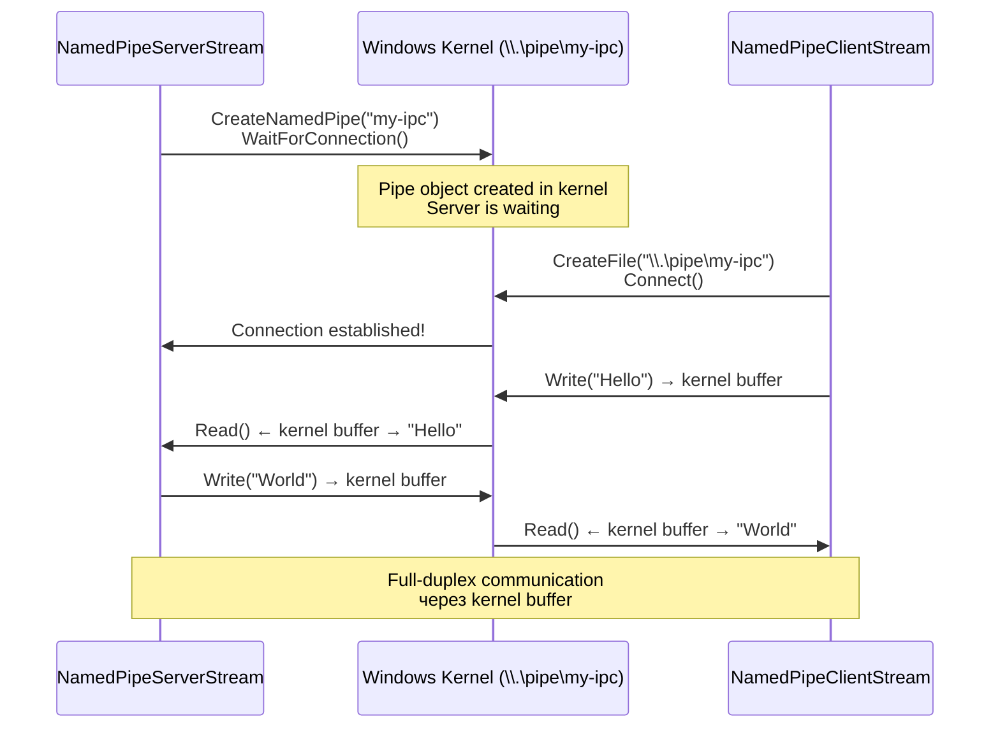
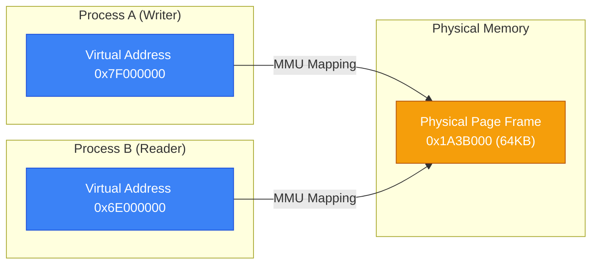

# Процеси в .NET — IPC та Міжпроцесна Комунікація

## Проблема Ізоляції Процесів

Ізоляція адресного простору — фундаментальна властивість процесів, і саме вона захищає вашу програму від краша сусіднього процесу. Але та ж властивість, що забезпечує безпеку, ускладнює комунікацію: два процеси не можуть просто "прочитати" спільну змінну.

Уявіть задачу: у вас є архітектура де головний GUI-процес делегує важкі обчислення окремому worker-процесу. Результат треба якось повернути. Або: розподілений кеш, де декілька мікросервісів на одній машині мають спільний стан. Або: плагін-система де непевний код ізольовано у власному процесі.

Усі ці сценарії вимагають **IPC — Inter-Process Communication** — механізмів обміну даними між ізольованими процесами. Windows надає кілька IPC-механізмів на різних рівнях продуктивності та складності, і .NET має вбудовану підтримку для кожного з них.

Вибір правильного механізму залежить від декількох факторів: обсягу даних, частоти обміну, необхідності двонаправленого зв'язку, persistence вимог та чи потрібна cross-machine комунікація. Ця тема детально розглядає два найпоширеніших підходи: Named Pipes та Memory-Mapped Files.

---

## Огляд IPC-Механізмів: Порівняльний Аналіз

Перш ніж занурюватись у деталі, варто сформувати системне розуміння всіх доступних варіантів:

| Механізм | Напрямок | Продуктивність | Scope | Складність |
| :--- | :--- | :--- | :--- | :--- |
| **Named Pipes** | Двонаправлений | Висока | Локальна / мережева | Середня |
| **Memory-Mapped Files** | Спільна пам'ять | Максимальна | Тільки локальна | Висока |
| **TCP/UDP Sockets** | Двонаправлений | Середня | Будь-яка | Низька |
| **Signals (Unix-style)** | Односпрямований | Мінімальна | Локальна |低 |
| **gRPC (named pipe transport)** | RPC | Висока | Локальна / мережева | Низька (із фреймворком) |
| **Windows Messages** | Очередь | Низька | GUI-процеси | Низька |
| **COM / DCOM** | RPC | Середня | Локальна / мережева | Висока |

::note
У сучасних .NET рішеннях для локального IPC рекомендується `Named Pipes` (з gRPC або власним Wire Protocol) або `Memory-Mapped Files` для high-performance shared state. TCP loopback — зайвий overhead мережевого стека, якщо обидва процеси на одній машині.
::

---

## Named Pipes: Двонаправлений Канал між Процесами

### Концептуальна Модель

**Named Pipe** — це іменований об'єкт ядра Windows, що являє собою FIFO буфер у kernel memory, до якого можуть підключатися процеси за ім'ям. На відміну від anonymous pipes (що пов'язують процеси у відносинах батько-дитина), named pipes доступні будь-якому процесу у системі, що знає ім'я.

Ім'я named pipe в Windows має формат `\\.\pipe\<назва>` (для локальної машини) або `\\<server>\pipe\<назва>` (для remote, через SMB). Точка (`.`) означає локальну машину. .NET API дозволяє вказувати лише ту частину після `pipe\` як `pipeName`.

Архітектурна модель — класична клієнт-сервер:

::mermaid



::

Сервер може мати кілька примірників Pipe (`maxNumberOfServerInstances`) для обслуговування паралельних клієнтів. Кожне підключення клієнта обслуговується окремим потоком або Task.

### NamedPipeServerStream: API та Налаштування

```csharp showLineNumbers [PipeServerConfig.cs]
using System.IO.Pipes;

// Базове створення
var server = new NamedPipeServerStream(
    pipeName: "my-ipc",                            // ім'я без \\.\pipe\
    direction: PipeDirection.InOut,                // двонаправлена (найчастіше)
    maxNumberOfServerInstances: 5,                 // max паралельних клієнтів
    transmissionMode: PipeTransmissionMode.Byte,   // Byte або Message
    options: PipeOptions.Asynchronous,             // для async/await
    inBufferSize: 65536,                           // 64KB буфер читання
    outBufferSize: 65536                           // 64KB буфер запису
);
```

**`PipeDirection`** визначає напрямок потоку даних:
- `In` — тільки читання з pipe (сервер читає, клієнт пише)
- `Out` — тільки запис у pipe (сервер пише, клієнт читає)
- `InOut` — двонаправлений, найгнучкіший

**`PipeTransmissionMode`** — важливий вибір:
- `Byte` — потоковий режим. Дані — суцільний байтовий потік без меж повідомлень. Читання може повернути частину відправленого блоку. Ідеально якщо зверху є текстовий протокол (рядки з `StreamReader`/`StreamWriter`).
- `Message` — зберігає межі повідомлень. `Read()` завжди повертає ціле повідомлення. Зручніше для бінарного протоколу без delimiter-ів, але складніше в управлінні розміром.

**`PipeOptions`**:
- `Asynchronous` — обов'язково для `await`. Без цього async методи працюватимуть синхронно.
- `WriteThrough` — обходить write-behind кешування ядра. Дані одразу надходять до читача. Знижує throughput, але зменшує latency.
- `CurrentUserOnly` (.NET 5+) — дозволяє підключення лише від того ж Windows user. Критично для безпеки!

### NamedPipeClientStream: Підключення з Таймаутом

```csharp showLineNumbers [PipeClientConfig.cs]
using System.IO.Pipes;

// Підключення до локального сервера
var client = new NamedPipeClientStream(
    serverName: ".",               // "." = локальна машина; альтернатива: hostname або IP
    pipeName: "my-ipc",
    direction: PipeDirection.InOut,
    options: PipeOptions.Asynchronous
);

// ConnectAsync з таймаутом (milliseconds)
// Кидає TimeoutException якщо сервер недоступний
await client.ConnectAsync(timeout: 5000, cancellationToken: ct);

// Перевірка стану з'єднання
Console.WriteLine($"Connected: {client.IsConnected}");
Console.WriteLine($"Server process ID: {client.GetImpersonationLevel()}");  // для ImpersonationLevel
```

### Протокол Text over Pipe

Найпростіший підхід — `StreamReader`/`StreamWriter` поверх Pipe для текстового протоколу:

```csharp showLineNumbers [TextProtocol.cs]
using System.IO.Pipes;

// ===== SERVER =====
await using var server = new NamedPipeServerStream(
    "text-protocol", PipeDirection.InOut,
    maxNumberOfServerInstances: 1,
    PipeTransmissionMode.Byte,
    PipeOptions.Asynchronous
);

Console.WriteLine("[Server] Очікуємо клієнта...");
await server.WaitForConnectionAsync();
Console.WriteLine("[Server] Клієнт підключився");

// leaveOpen: true щоб не закрити pipe при Dispose StreamWriter
await using var sw = new StreamWriter(server, leaveOpen: true) { AutoFlush = true };
using var sr = new StreamReader(server, leaveOpen: true);

while (server.IsConnected)
{
    string? request = await sr.ReadLineAsync();
    if (request is null || request == "QUIT") break;

    Console.WriteLine($"[Server] Запит: {request}");

    // Простий echo-сервер
    await sw.WriteLineAsync($"ECHO: {request}");
}

Console.WriteLine("[Server] З'єднання закрито");
```

### Протокол Binary Length-Prefix

Для бінарних даних або складних структур частіше використовують length-prefix protocol: спочатку передається 4 байти довжини повідомлення, потім саме повідомлення:

```csharp showLineNumbers [BinaryProtocol.cs]
using System.IO.Pipes;
using System.Text.Json;

static async Task WriteMessageAsync(Stream stream, object data, CancellationToken ct = default)
{
    var json = JsonSerializer.SerializeToUtf8Bytes(data);

    // Пишемо довжину (4 байти, big-endian)
    var lengthPrefix = BitConverter.GetBytes(json.Length);
    if (BitConverter.IsLittleEndian) Array.Reverse(lengthPrefix);

    await stream.WriteAsync(lengthPrefix, ct);
    await stream.WriteAsync(json, ct);
    await stream.FlushAsync(ct);
}

static async Task<T?> ReadMessageAsync<T>(Stream stream, CancellationToken ct = default)
{
    // Читаємо рівно 4 байти довжини
    var lengthBuffer = new byte[4];
    int read = await stream.ReadExactlyAsync(lengthBuffer, ct);  // .NET 7+

    if (BitConverter.IsLittleEndian) Array.Reverse(lengthBuffer);
    int messageLength = BitConverter.ToInt32(lengthBuffer);

    if (messageLength <= 0 || messageLength > 10_000_000)  // sanity check
        throw new InvalidDataException($"Невалідна довжина повідомлення: {messageLength}");

    // Читаємо ровно messageLength байт
    var messageBuffer = new byte[messageLength];
    await stream.ReadExactlyAsync(messageBuffer, ct);

    return JsonSerializer.Deserialize<T>(messageBuffer);
}
```

### CurrentUserOnly: Безпека Pipe

```csharp showLineNumbers [SecurePipe.cs]
using System.IO.Pipes;

// ⚠️ БЕЗ CurrentUserOnly будь-який процес у системі може підключитись до pipe!
// Завжди вмикайте для production
var server = new NamedPipeServerStream(
    "secure-pipe",
    PipeDirection.InOut,
    maxNumberOfServerInstances: 1,
    PipeTransmissionMode.Byte,
    PipeOptions.Asynchronous | PipeOptions.CurrentUserOnly  // тільки той самий user
);
```

---

## Memory-Mapped Files: Спільна Пам'ять без Копіювання

### Принцип Роботи на Рівні ОС

**Memory-Mapped File (MMF)** — технологія, при якій файл або анонімна ділянка пам'яті відображається у virtual address space процесу. Замість `read()` / `write()` системних викликів, доступ до даних відбувається через звичайні операції читання-запису пам'яті.

Коли два процеси відображають один і той самий іменований MMF, вони отримують вигляд на **одні й ті самі фізичні сторінки RAM**:

::mermaid



::

Обидва process A і process B можуть по-різному "бачити" цю область пам'яті (різні virtual addresses), але MMU процесора транслює їх на одну й ту саму physical page. **Немає копіювання даних**, немає kernel-to-userspace переходу для читання — тільки пряме звернення до RAM. Саме тому MMF — найшвидший IPC-механізм.

### API: MemoryMappedFile

```csharp showLineNumbers [MMFApi.cs]
using System.IO.MemoryMappedFiles;

// === Процес A: Створення іменованого MMF ===

// CreateOrOpen: атомарно створює або відкриває існуючий
// Ім'я в межах ОС: "Global\MySharedBuffer" або просто "MySharedBuffer"
using var mmf = MemoryMappedFile.CreateOrOpen(
    mapName: "SharedAppData",     // ім'я у kernel namespace
    capacity: 1_048_576,          // 1 MB
    access: MemoryMappedFileAccess.ReadWrite
);

// CreateViewAccessor: random access (як масив байтів через Write<T>/Read<T>)
using var accessor = mmf.CreateViewAccessor(
    offset: 0,                    // зміщення від початку MMF
    size: 1_048_576,              // розмір вікна (0 = до кінця)
    access: MemoryMappedFileAccess.ReadWrite
);

// CreateViewStream: sequential access (як Stream)
using var stream = mmf.CreateViewStream(offset: 0, size: 0);


// === Процес B: Відкриття існуючого MMF ===

// OpenExisting: кидає FileNotFoundException якщо MMF не існує
using var mmfClient = MemoryMappedFile.OpenExisting(
    mapName: "SharedAppData",
    desiredAccessRights: MemoryMappedFileRights.ReadWrite
);
```

### Читання і Запис через Accessor

`MemoryMappedViewAccessor` надає типізований доступ до байтів MMF:

```csharp showLineNumbers [AccessorReadWrite.cs]
using System.IO.MemoryMappedFiles;
using System.Runtime.InteropServices;

// Структура для shared state (важливо: unmanaged, без посилань)
[StructLayout(LayoutKind.Sequential)]
struct SharedState
{
    public int Counter;          // 4 байти
    public long Timestamp;       // 8 байтів (timestamp у ticks)
    public double Temperature;   // 8 байтів
    // Фіксований масив char не підтримується тут — краще окремо
}

using var mmf = MemoryMappedFile.CreateOrOpen("state-buffer", capacity: 4096);
using var accessor = mmf.CreateViewAccessor();

// Запис структури за зміщенням 0
var state = new SharedState
{
    Counter = 42,
    Timestamp = DateTime.UtcNow.Ticks,
    Temperature = 23.5
};
accessor.Write(0, ref state);  // ref struct Write — копіює байти структури

// Читання структури
accessor.Read(0, out SharedState readBack);
Console.WriteLine($"Counter: {readBack.Counter}");
Console.WriteLine($"Temp: {readBack.Temperature}°C");

// Примітиви
accessor.Write(100, 12345);      // int за offset 100
accessor.Write(104, 9876543210L); // long за offset 104

int v1 = accessor.ReadInt32(100);
long v2 = accessor.ReadInt64(104);
```

### Рядки та Масиви в MMF

Рядки і масиви потребують особливого підходу, оскільки MMF працює з байтами, не з .NET об'єктами:

```csharp showLineNumbers [MMFStrings.cs]
using System.IO.MemoryMappedFiles;
using System.Text;

static void WriteString(MemoryMappedViewAccessor accessor, long offset, string value, int maxBytes = 256)
{
    byte[] encoded = Encoding.UTF8.GetBytes(value);
    if (encoded.Length > maxBytes - 4)
        throw new ArgumentException($"Рядок перевищує {maxBytes - 4} байт у UTF8");

    // Протокол: 4 байти довжини + дані
    accessor.Write(offset, encoded.Length);
    accessor.WriteArray(offset + 4, encoded, 0, encoded.Length);
}

static string ReadString(MemoryMappedViewAccessor accessor, long offset, int maxBytes = 256)
{
    int length = accessor.ReadInt32(offset);
    if (length < 0 || length > maxBytes - 4)
        throw new InvalidDataException("Некоректна довжина рядка");

    byte[] buffer = new byte[length];
    accessor.ReadArray(offset + 4, buffer, 0, length);
    return Encoding.UTF8.GetString(buffer);
}
```

### Синхронізація між Процесами

MMF не має вбудованої синхронізації — якщо два процеси одночасно пишуть, виникне data race. Для синхронізації між процесами (не потоками!) потрібні **іменовані системні об'єкти**:

```csharp showLineNumbers [MMFWithSync.cs]
using System.IO.MemoryMappedFiles;
using System.Threading;

// Іменований Mutex — доступний між процесами
// "Global\" prefix — доступний у всіх user sessions, включаючи Session 0
using var mutex = new Mutex(initiallyOwned: false, name: @"Global\SharedAppMutex");

// Іменований EventWaitHandle для signaling: "дані оновлено"
using var dataReady = new EventWaitHandle(
    initialState: false,
    mode: EventResetMode.AutoReset,
    name: @"Global\SharedDataReady"
);

using var mmf = MemoryMappedFile.CreateOrOpen("app-state", 4096);
using var accessor = mmf.CreateViewAccessor();

// === Writer (Process A) ===
void WriteData(int value)
{
    mutex.WaitOne();  // захоплюємо виключний доступ
    try
    {
        accessor.Write(0, value);
        accessor.Write(4, DateTime.UtcNow.Ticks);
    }
    finally
    {
        mutex.ReleaseMutex();
    }
    dataReady.Set();  // сигналізуємо читачам
}

// === Reader (Process B) ===
void ReadLoop(CancellationToken ct)
{
    while (!ct.IsCancellationRequested)
    {
        // Чекаємо сигналу (або таймауту 1 секунда)
        bool signaled = dataReady.WaitOne(1000);
        if (!signaled) continue;

        mutex.WaitOne();
        try
        {
            int value = accessor.ReadInt32(0);
            long ticks = accessor.ReadInt64(4);
            Console.WriteLine($"[Reader] value={value}, updated={new DateTime(ticks):HH:mm:ss.fff}");
        }
        finally
        {
            mutex.ReleaseMutex();
        }
    }
}
```

---

## Наскрізний Приклад: IPC Chat Server та Client

Побудуємо два окремих консольних застосунки, що спілкуються через Named Pipes. Server обслуговує кількох клієнтів одночасно і транслює повідомлення між ними (broadcast).

::steps

### Крок 1: Структура рішення

```bash
# Створюємо solution з двома проєктами і спільними контрактами
dotnet new sln -n IpcChat
dotnet new console -n IpcChat.Server
dotnet new console -n IpcChat.Client
dotnet new classlib -n IpcChat.Contracts

dotnet sln add IpcChat.Server IpcChat.Client IpcChat.Contracts

# Додаємо посилання на Contracts
dotnet add IpcChat.Server reference IpcChat.Contracts
dotnet add IpcChat.Client reference IpcChat.Contracts
```

### Крок 2: Контракт — протокол повідомлень

```csharp showLineNumbers [IpcChat.Contracts/ChatMessage.cs]
using System.Text.Json;

namespace IpcChat.Contracts;

public enum MessageType
{
    Connect,     // клієнт повідомляє своє ім'я
    Chat,        // звичайне повідомлення
    Broadcast,   // сервер транслює іншим клієнтам
    Disconnect,  // клієнт від'єднується
    Error        // помилка
}

public record ChatMessage(MessageType Type, string Sender, string Content, DateTime Timestamp)
{
    public static ChatMessage Connect(string name) =>
        new(MessageType.Connect, name, "", DateTime.UtcNow);

    public static ChatMessage Chat(string sender, string text) =>
        new(MessageType.Chat, sender, text, DateTime.UtcNow);

    public static ChatMessage Broadcast(string sender, string text) =>
        new(MessageType.Broadcast, sender, text, DateTime.UtcNow);

    public static ChatMessage Disconnect(string name) =>
        new(MessageType.Disconnect, name, "", DateTime.UtcNow);
}

// Серіалізація/десеріалізація повідомлень
public static class Protocol
{
    private static readonly JsonSerializerOptions Options = new()
    {
        PropertyNamingPolicy = JsonNamingPolicy.CamelCase
    };

    public static async Task SendAsync(StreamWriter writer, ChatMessage msg, CancellationToken ct = default)
    {
        string json = JsonSerializer.Serialize(msg, Options);
        await writer.WriteLineAsync(json.AsMemory(), ct);
    }

    public static async Task<ChatMessage?> ReceiveAsync(StreamReader reader, CancellationToken ct = default)
    {
        string? line = await reader.ReadLineAsync(ct);
        if (line is null) return null;
        return JsonSerializer.Deserialize<ChatMessage>(line, Options);
    }
}
```

### Крок 3: Сервер — управління клієнтами

```csharp showLineNumbers [IpcChat.Server/ClientSession.cs]
using System.IO.Pipes;
using IpcChat.Contracts;

namespace IpcChat.Server;

/// <summary>
/// Представляє одне підключення клієнта.
/// Кожна сесія виконується у власному Task для паралельного обслуговування.
/// </summary>
class ClientSession(NamedPipeServerStream pipe, ChatServer server) : IAsyncDisposable
{
    public string Name { get; private set; } = "Unknown";

    private readonly StreamReader _reader = new(pipe, leaveOpen: true);
    private readonly StreamWriter _writer = new(pipe, leaveOpen: true) { AutoFlush = true };

    public async Task RunAsync(CancellationToken ct)
    {
        try
        {
            // Перше повідомлення — Connect з іменем клієнта
            var connectMsg = await Protocol.ReceiveAsync(_reader, ct);
            if (connectMsg?.Type != MessageType.Connect)
            {
                Console.WriteLine($"[Server] Невалідний перший пакет — відключаємо");
                return;
            }

            Name = connectMsg.Sender;
            Console.WriteLine($"[Server] Підключився: {Name}");
            await server.BroadcastAsync(ChatMessage.Broadcast("Server", $">> {Name} приєднався"), exclude: this);

            // Основний цикл обробки повідомлень
            while (!ct.IsCancellationRequested && pipe.IsConnected)
            {
                var msg = await Protocol.ReceiveAsync(_reader, ct);

                if (msg is null || msg.Type == MessageType.Disconnect) break;

                if (msg.Type == MessageType.Chat)
                {
                    Console.WriteLine($"[Chat] {Name}: {msg.Content}");
                    await server.BroadcastAsync(ChatMessage.Broadcast(Name, msg.Content), exclude: this);
                }
            }
        }
        catch (OperationCanceledException) { }
        catch (IOException) { /* клієнт відключився некоректно */ }
        finally
        {
            Console.WriteLine($"[Server] Відключився: {Name}");
            await server.BroadcastAsync(ChatMessage.Broadcast("Server", $"<< {Name} покинув чат"), exclude: this);
            server.RemoveSession(this);
        }
    }

    public async Task SendAsync(ChatMessage msg, CancellationToken ct = default)
    {
        if (pipe.IsConnected)
            await Protocol.SendAsync(_writer, msg, ct);
    }

    public async ValueTask DisposeAsync()
    {
        await _writer.DisposeAsync();
        _reader.Dispose();
        await pipe.DisposeAsync();
    }
}
```

```csharp showLineNumbers [IpcChat.Server/ChatServer.cs]
using System.Collections.Concurrent;
using System.IO.Pipes;
using IpcChat.Contracts;

namespace IpcChat.Server;

class ChatServer
{
    private const string PipeName = "ipc-chat";
    private const int MaxClients = 10;

    private readonly ConcurrentDictionary<string, ClientSession> _sessions = new();
    private readonly CancellationToken _ct;

    public ChatServer(CancellationToken ct) => _ct = ct;

    public async Task RunAsync()
    {
        Console.WriteLine($"[Server] Запущено. Pipe: \\\\.\\pipe\\{PipeName}");
        Console.WriteLine("[Server] Очікуємо підключень...\n");

        while (!_ct.IsCancellationRequested)
        {
            // Кожна ітерація: новий ServerStream для нового підключення
            var pipe = new NamedPipeServerStream(
                PipeName,
                PipeDirection.InOut,
                MaxClients,
                PipeTransmissionMode.Byte,
                PipeOptions.Asynchronous | PipeOptions.CurrentUserOnly
            );

            try
            {
                await pipe.WaitForConnectionAsync(_ct);
            }
            catch (OperationCanceledException)
            {
                await pipe.DisposeAsync();
                break;
            }

            // Не чекаємо — обслуговуємо клієнта у фоні
            _ = HandleClientAsync(pipe);
        }

        Console.WriteLine("[Server] Зупинено");
    }

    private async Task HandleClientAsync(NamedPipeServerStream pipe)
    {
        var session = new ClientSession(pipe, this);
        _sessions.TryAdd(Guid.NewGuid().ToString(), session);

        await session.RunAsync(_ct);
        await session.DisposeAsync();
    }

    public async Task BroadcastAsync(ChatMessage msg, ClientSession? exclude = null)
    {
        var tasks = _sessions.Values
            .Where(s => s != exclude)
            .Select(s => s.SendAsync(msg, _ct));

        await Task.WhenAll(tasks);
    }

    public void RemoveSession(ClientSession session)
    {
        var key = _sessions.FirstOrDefault(kv => kv.Value == session).Key;
        if (key != null) _sessions.TryRemove(key, out _);
    }
}
```

### Крок 4: Точка входу сервера

```csharp showLineNumbers [IpcChat.Server/Program.cs]
using IpcChat.Server;

Console.OutputEncoding = System.Text.Encoding.UTF8;

using var cts = new CancellationTokenSource();
Console.CancelKeyPress += (_, e) =>
{
    e.Cancel = true;
    Console.WriteLine("\n[Server] Зупиняємо...");
    cts.Cancel();
};

var server = new ChatServer(cts.Token);
await server.RunAsync();
```

### Крок 5: Клієнт

```csharp showLineNumbers [IpcChat.Client/Program.cs]
using System.IO.Pipes;
using IpcChat.Contracts;

Console.OutputEncoding = System.Text.Encoding.UTF8;

Console.Write("Введіть ваше ім'я: ");
string name = Console.ReadLine() ?? "Anonymous";

// Підключення до сервера
await using var pipe = new NamedPipeClientStream(
    serverName: ".",
    pipeName: "ipc-chat",
    direction: PipeDirection.InOut,
    options: PipeOptions.Asynchronous | PipeOptions.CurrentUserOnly
);

Console.Write("Підключаємось до сервера...");
await pipe.ConnectAsync(timeout: 5000);
Console.WriteLine(" OK!\n");

using var reader = new StreamReader(pipe, leaveOpen: true);
using var writer = new StreamWriter(pipe, leaveOpen: true) { AutoFlush = true };

using var cts = new CancellationTokenSource();

// Надсилаємо Connect
await Protocol.SendAsync(writer, ChatMessage.Connect(name), cts.Token);

// Фоновий Task для читання повідомлень від сервера
var receiveTask = Task.Run(async () =>
{
    while (!cts.Token.IsCancellationRequested)
    {
        var msg = await Protocol.ReceiveAsync(reader, cts.Token);
        if (msg is null) break;

        string prefix = msg.Sender == "Server" ? "** " : $"[{msg.Sender}] ";
        Console.ForegroundColor = msg.Sender == "Server" ? ConsoleColor.Yellow : ConsoleColor.Cyan;
        Console.WriteLine($"\r{prefix}{msg.Content}");
        Console.ResetColor();
        Console.Write("> ");  // відновлюємо prompt
    }
});

// Головний цикл: читаємо stdin і надсилаємо
Console.WriteLine("Чат розпочато. Введіть повідомлення (або /quit для виходу):\n");

while (true)
{
    Console.Write("> ");
    string? input = Console.ReadLine();
    if (input is null || input.Trim() == "/quit") break;
    if (string.IsNullOrWhiteSpace(input)) continue;

    await Protocol.SendAsync(writer, ChatMessage.Chat(name, input), cts.Token);
}

await Protocol.SendAsync(writer, ChatMessage.Disconnect(name), cts.Token);
cts.Cancel();
await receiveTask.ConfigureAwait(ConfigureAwaitOptions.SuppressThrowing);

Console.WriteLine("До побачення!");
```

### Крок 6: Запуск і тестування

```bash
# Термінал 1: запускаємо сервер
dotnet run --project IpcChat.Server

# Термінал 2: перший клієнт
dotnet run --project IpcChat.Client
# Введіть ім'я: Аліса

# Термінал 3: другий клієнт
dotnet run --project IpcChat.Client
# Введіть ім'я: Боб
```

::

::terminal-preview{title="IPC Chat — Сервер"}
<div class="line"><span class="text-gray-400">[Server] Запущено. Pipe: \\.\pipe\ipc-chat</span></div>
<div class="line"><span class="text-gray-400">[Server] Очікуємо підключень...</span></div>
<div class="line"></div>
<div class="line"><span class="text-green-400">[Server] Підключився: Аліса</span></div>
<div class="line"><span class="text-green-400">[Server] Підключився: Боб</span></div>
<div class="line"><span class="text-blue-400">[Chat] Аліса: Привіт всім!</span></div>
<div class="line"><span class="text-blue-400">[Chat] Боб: Привіт, Алісо!</span></div>
<div class="line"><span class="text-yellow-400">[Server] Відключився: Аліса</span></div>
::

---

## Підсумок

::card-group

::card{title="Вибір IPC механізму" icon="i-lucide-git-branch"}

- Named Pipes: двонаправлений, локальний + мережевий, текстові протоколи
- MMF: найшвидший, тільки локальний, бінарні дані без копіювання
- TCP: cross-platform, cross-machine, але overhead мережевого стека

::

::card{title="Named Pipes" icon="i-lucide-pipe"}

- `PipeOptions.Asynchronous` — обов'язково для async
- `PipeOptions.CurrentUserOnly` — безпека
- `Byte` mode + StreamReader/Writer — для текстових протоколів
- Завжди обробляти `IOException` (клієнт відключився)

::

::card{title="Memory-Mapped Files" icon="i-lucide-database"}

- `CreateOrOpen` / `OpenExisting` — за іменем у kernel namespace
- `ViewAccessor` для random access, `ViewStream` для sequential
- Без sync = race condition — завжди Mutex + EventWaitHandle
- `Global\` prefix для cross-session доступу (Session 0)

::

::card{title="Протоколи" icon="i-lucide-network"}

- Text: StreamReader + JSON per line — просто і читабельно
- Binary: length-prefix (4 байти довжини + дані) — ефективно
- RPC: gRPC over Named Pipes — для складних API

::

::

---

## Практичні Завдання

### Рівень 1: Pipe Echo Server

Напишіть два консольних застосунки:
1. `EchoServer` — Named Pipe сервер що повертає отримані рядки у верхньому регістрі з міткою часу
2. `EchoClient` — клієнт що зчитує рядки зі stdin і відправляє серверу, виводячи відповідь

### Рівень 2: Shared Counter з MMF

Реалізуйте систему лічильників через MMF:
1. `CounterServer` — створює MMF з 10 int лічильниками, відображає їх значення кожну секунду
2. `CounterWorker` — підключається і атомарно інкрементує заданий лічильник (через Mutex)
3. Запустіть 5 воркерів паралельно і перевірте що сума значень лічильників коректна

### Рівень 3: Multi-Client Chat з Broadcast

Розширте наскрізний приклад (IPC Chat):
1. Додайте команду `/list` — показує список підключених користувачів
2. Додайте команду `/dm <ім'я> <текст>` — приватне повідомлення конкретному клієнту
3. Додайте `/kick <ім'я>` — отримати адміна через перший підключений процес
4. Додайте history: нові клієнти отримують останні 20 повідомлень при підключенні
5. Реалізуйте graceful shutdown сервера при `Ctrl+C` — надіслати всім клієнтам повідомлення про відключення
