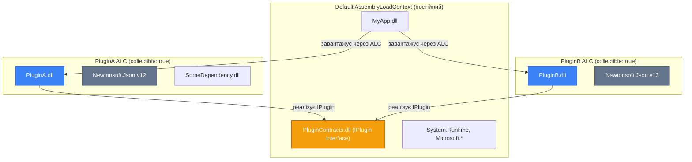

# Application Domains та Збірки — AppDomain і AssemblyLoadContext

## Контекст: Чому Ізоляція Коду Потрібна

Уявіть систему, що динамічно розширюється: IDE завантажує тисячі розширень, кожне з яких виконує код у тому ж процесі. Або систему звітів, де кожен новий звіт — це окремо скомпільований скрипт. Або засіб тестування, що завантажує тест-збірки і має їх гарантовано вивантажити після виконання тестів.

Усі ці сценарії об'єднує одна потреба: **завантажити сторонній код у runtime, ізолювати його від основного застосунку і мати можливість цей код вивантажити**. У .NET Framework цю потребу задовольняв `AppDomain`. У сучасному .NET (Core/.NET 5+) архітектура ізоляції кардинально змінилась на користь `AssemblyLoadContext`.

Без розуміння цих механізмів неможливо будувати extensible системи, плагін-архітектури або системи з hot-reload. Ця тема — поглиблений розбір з поясненням "чому" на кожному кроці.

---

## AppDomain у .NET Framework: Що Це Було

### Мотивація та Дизайн

У .NET Framework (2002-2019) `AppDomain` слугував механізмом **логічної ізоляції всередині одного OS-процесу**. Ідея полягала у наступному: замість запуску окремого OS-процесу для кожного плагіна (дорого: ~10-100ms на запуск, ~MB RAM), можна створити легкий "контейнер" у межах наявного процесу.

AppDomain надавав:
- **Ізоляцію пам'яті** — кожен AppDomain мав власну купу і збірки
- **Code Access Security** — різні набори дозволів для ненадійного коду
- **Незалежне вивантаження** — `AppDomain.Unload()` звільняв всі збірки домену
- **Конфігурацію** — окремий `App.config`, базова директорія, probe paths

Класичний use case у **ASP.NET (Classic) / IIS**: кожен веб-сайт (`*.ashx`, `*.asmx`) — окремий AppDomain у процесі `w3wp.exe`. Коли ви оновлювали `bin\` директорію, IIS перезавантажував AppDomain без перезапуску `w3wp.exe`.

```csharp
// .NET Framework — створення ізольованого AppDomain
AppDomain sandboxDomain = AppDomain.CreateDomain(
    friendlyName: "Plugin Sandbox",
    securityInfo: null,
    info: new AppDomainSetup
    {
        ApplicationBase = pluginDirectory,
        DisallowCodeDownload = true
    }
);

// Виконання коду в іншому AppDomain через Proxy
// (через межі AppDomain працював Remoting, а не пряме посилання!)
var plugin = (IPlugin)sandboxDomain.CreateInstanceAndUnwrap(
    assemblyName: "MyPlugin",
    typeName: "MyPlugin.PluginClass"
);

// Вивантаження AppDomain — звільняє всі його збірки
AppDomain.Unload(sandboxDomain);
```

### Проблема Remoting та Чому AppDomain Пішов у .NET Core

Ключова складність AppDomain: **об'єкти не можуть напряму перетинати межі між доменами**. Коли ви отримували `IPlugin` з іншого AppDomain, насправді отримували **transparent proxy** — об'єкт-посередник. Кожен виклик методу через proxy серіалізувався, перетинав межу домену, десеріалізувався і виконувався у цільовому домені.

Це означало:
- Всі аргументи та повернені значення мали бути `Serializable` або успадковувати `MarshalByRefObject`
- Виклики через proxy — значно повільніші за прямий виклик
- Складна діагностика при помилках у proxy
- Обмеження на `async/await` через межі AppDomain (Remoting не підтримував TAP)

Команда .NET Core вирішила: вартість підтримки AppDomain занадто висока, а ізоляція через OS-процеси у більшості реальних сценаріїв кращий вибір. Тому в .NET Core/.NET 5+:

::warning
`AppDomain.CreateDomain()` **викидає `PlatformNotSupportedException`** у .NET 5+. Весь .NET-процес тепер має рівно один AppDomain — `AppDomain.CurrentDomain`. Ніякої ізоляції між доменами немає.
::

### Що Залишилося від AppDomain (Корисне)

Незважаючи на втрату ізоляційних можливостей, клас `AppDomain` залишається в .NET 5+ і деякі його члени досі корисні:

```csharp showLineNumbers [AppDomainResiduals.cs]
AppDomain domain = AppDomain.CurrentDomain;

// 1. Базова директорія — де знаходяться збірки застосунку
Console.WriteLine($"BaseDirectory: {domain.BaseDirectory}");
// → C:\Projects\MyApp\

// 2. Ім'я домену — корисно для logging у бібліотеках
Console.WriteLine($"FriendlyName: {domain.FriendlyName}");
// → MyApp (або ім'я .exe файлу)

// 3. Глобальна обробка непійманих виключень
domain.UnhandledException += (sender, e) =>
{
    var ex = (Exception)e.ExceptionObject;
    bool isTerminating = e.IsTerminating;

    // Останній шанс зафіксувати fatal error перед завершенням процесу
    File.AppendAllText("crash.log",
        $"[{DateTime.UtcNow:O}] FATAL: {ex.GetType().Name}: {ex.Message}\n{ex.StackTrace}\n");
};

// 4. Спостереження за завантаженими збірками
domain.AssemblyLoad += (sender, e) =>
{
    Console.WriteLine($"Завантажено збірку: {e.LoadedAssembly.GetName().Name}");
};

// 5. Перелік завантажених збірок
foreach (var assembly in domain.GetAssemblies())
{
    var name = assembly.GetName();
    Console.WriteLine($"  {name.Name} v{name.Version}  ({(assembly.IsDynamic ? "dynamic" : assembly.Location)})");
}

// 6. Кастомний Assembly Resolver (якщо стандартний не знаходить збірку)
domain.AssemblyResolve += (sender, e) =>
{
    Console.WriteLine($"Не знайдено збірки: {e.Name}");
    // Можна повернути Assembly або null (продовжить стандартний пошук)
    var customPath = Path.Combine(AppDomain.CurrentDomain.BaseDirectory, "plugins",
        new AssemblyName(e.Name!).Name + ".dll");
    return File.Exists(customPath) ? Assembly.LoadFrom(customPath) : null;
};
```

---

## AssemblyLoadContext: Сучасна Ізоляція

### Концептуальний Стрибок

`AssemblyLoadContext` — це відповідь .NET Core на питання "як ізолювати збірки без AppDomain". Ключова ідея: замість ізоляції з'єднанням об'єктів через Remoting, ALC надає **простір імен для збірок**: один і той самий `Newtonsoft.Json` v12 і v13 можуть співіснувати в одному процесі, але в різних ALC, без конфліктів.

На відміну від AppDomain, **об'єкти можуть вільно перетинати межі між ALC**. Немає жодного Remoting, proxy чи серіалізації. Якщо `interface IPlugin` визначено в збірці, що завантажена в Default ALC, а плагін реалізує цей інтерфейс і завантажений у власний ALC, ви можете просто викликати `plugin.Execute()` напряму.

::mermaid



::

`PluginA.dll` використовує `Newtonsoft.Json v12`, `PluginB.dll` — v13. Конфлікту немає: кожен "бачить" свою версію в межах свого ALC. При цьому обидва реалізують `IPlugin` з Default ALC і взаємодіють з основним додатком **без серіалізації**.

### Архітектура AssemblyLoadContext

Клас знаходиться у `System.Runtime.Loader`. Для використання потрібна збірка `System.Runtime.Loader` або просто `using System.Runtime.Loader;`:

::field-group

::field{name="AssemblyLoadContext.Default" type="static AssemblyLoadContext"}
Єдиний ALC за замовчуванням. Усі звичайні `Assembly.Load()`, `Assembly.LoadFrom()`, та збірки, завантажені .NET Runtime автоматично, потрапляють сюди. Default ALC **не може бути вивантажений** — існує протягом всього часу process lifetime.
::

::field{name="IsCollectible" type="bool"}
Якщо `true` — ALC і всі його збірки можуть бути вивантажені з пам'яті після звільнення всіх посилань. Якщо `false` (за замовчуванням при `new AssemblyLoadContext("name")`) — збірки живуть до завершення процесу. Для plug-in систем з hot-reload — завжди `true`.
::

::field{name="Name" type="string?"}
Ім'я контексту — для debugging та diagnostics. Відображається у debugger, ETW events, та `AssemblyLoadContext.All` enumeration.
::

::field{name="All" type="static IEnumerable<WeakReference<AssemblyLoadContext>>"}
Перелік всіх живих ALC у процесі (як `WeakReference`, щоб не перешкоджати GC). Корисно для діагностики: скільки ALC існує, чи вивантажились очікувані.
::

::field{name="Load(AssemblyName)" type="virtual Assembly?"}
Ключовий метод для перевизначення. Викликається, коли ALC отримує запит на завантаження збірки (наприклад, коли завантажена збірка потребує свою залежність). Поверніть `Assembly` якщо можете завантажити, або `null` щоб делегувати в Default ALC.
::

::field{name="LoadUnmanagedDll(string)" type="virtual IntPtr"}
Аналог `Load()` для native DLL (P/Invoke). Дозволяє контролювати де шукати нативні бібліотеки плагіна.
::

::field{name="Unload()" type="void"}
Ініціює вивантаження контексту. **Фактичне вивантаження (GC збірки) відбудеться лише після того, як GC збере всі посилання** на типи, методи, делегати та об'єкти, що належать цьому ALC. Виклик `Unload()` лише маркує ALC як "потрібно вивантажити".
::

::

### Три Вбудовані ALC для Різних Сценаріїв

.NET надає кілька готових спеціалізованих ALC:

```csharp showLineNumbers [BuiltInALCs.cs]
using System.Reflection;
using System.Runtime.Loader;

// 1. Default — головний контекст застосунку
var defaultAlc = AssemblyLoadContext.Default;
Console.WriteLine($"Default ALC: {defaultAlc.Name}");
// → Default

// 2. GetLoadContext — в якому ALC знаходиться конкретна збірка?
var alc = AssemblyLoadContext.GetLoadContext(typeof(string).Assembly);
Console.WriteLine(alc?.Name);  // → "Default" (System.Runtime у Default)

// 3. Прямий non-collectible контекст (для довгоживучих плагінів)
var permanentAlc = new AssemblyLoadContext("PermanentPlugin", isCollectible: false);
var assembly1 = permanentAlc.LoadFromAssemblyPath("/path/to/StablePlugin.dll");
// Цей ALC не можна вивантажити — збірки живуть вічно

// 4. Collectible контекст (для hot-reload плагінів)
var hotReloadAlc = new AssemblyLoadContext("HotReloadPlugin", isCollectible: true);
var assembly2 = hotReloadAlc.LoadFromAssemblyPath("/path/to/Plugin.dll");
// Пізніше можна вивантажити:
hotReloadAlc.Unload();  // позначаємо для вивантаження
// Фактичне вивантаження — після GC.Collect() і відсутності посилань
```

### Завантаження Збірок у ALC

У ALC є три основних методи завантаження:

```csharp showLineNumbers [LoadingMethods.cs]
using System.Reflection;
using System.Runtime.Loader;

var alc = new AssemblyLoadContext("demo", isCollectible: true);

// 1. За шляхом до файлу (найпоширеніший для плагінів)
Assembly byPath = alc.LoadFromAssemblyPath(
    @"C:\Plugins\MyPlugin.dll");

// 2. За AssemblyName (з GAC або runtime paths)
Assembly byName = alc.LoadFromAssemblyName(
    new AssemblyName("System.Text.Json, Version=8.0.0.0"));

// 3. Зі Stream (наприклад, з вбудованого ресурсу або blob storage)
using var stream = File.OpenRead(@"C:\Plugins\AnotherPlugin.dll");
// Опціонально: другий stream для PDB (символи для debugging)
using var pdbStream = File.OpenRead(@"C:\Plugins\AnotherPlugin.pdb");
Assembly fromStream = alc.LoadFromStream(stream, pdbStream);
```

### AssemblyDependencyResolver: Автоматичний Пошук Залежностей

Якщо плагін має залежності (NuGet пакети), їх потрібно завантажувати в той самий ALC (не з Default). `AssemblyDependencyResolver` читає `.deps.json` файл поруч із DLL і автоматично знаходить шляхи до всіх залежностей:

```csharp showLineNumbers [DependencyResolver.cs]
using System.Runtime.Loader;
using System.Reflection;

class PluginLoadContext : AssemblyLoadContext
{
    private readonly AssemblyDependencyResolver _resolver;

    public PluginLoadContext(string pluginMainAssemblyPath)
        : base(name: $"Plugin:{Path.GetFileNameWithoutExtension(pluginMainAssemblyPath)}",
               isCollectible: true)
    {
        // Resolver вичитує pluginMainAssemblyPath.deps.json
        // і знає де лежать всі NuGet-залежності плагіна
        _resolver = new AssemblyDependencyResolver(pluginMainAssemblyPath);
    }

    protected override Assembly? Load(AssemblyName assemblyName)
    {
        // Запитуємо resolver: чи є ця збірка серед залежностей плагіна?
        string? assemblyPath = _resolver.ResolveAssemblyToPath(assemblyName);

        if (assemblyPath is not null)
        {
            // Завантажуємо з диску в ІЗОЛЬОВАНий контекст плагіна
            return LoadFromAssemblyPath(assemblyPath);
        }

        // Не знайшли у залежностях плагіна → повертаємо null
        // ALC pipeline піде до Default ALC (там: System.*, Microsoft.*, PluginContracts)
        return null;
    }

    protected override IntPtr LoadUnmanagedDll(string unmanagedDllName)
    {
        // Аналогічно для native DLL (libsqlite.so, sqlite3.dll тощо)
        string? libraryPath = _resolver.ResolveUnmanagedDllToPath(unmanagedDllName);
        return libraryPath is not null
            ? LoadUnmanagedDllFromPath(libraryPath)
            : IntPtr.Zero;
    }
}
```

::tip
`AssemblyDependencyResolver` є ключовим компонентом будь-якої production plug-in системи. Без нього ви будете отримувати `FileNotFoundException` для залежностей плагіна, або, що гірше, тихо підвантажувати несумісну версію з Default ALC.
::

---

## Вивантаження Збірок: Правила та Пастки

### Collectible ALC та Lifetime

Вивантаження collectible ALC — не миттєва операція. Послідовність:

1. Викликаємо `alc.Unload()` — ALC маркується як "collectible, pending unload"
2. Забуваємо всі strong references на типи, інстанси, делегати з цього ALC
3. GC при наступному повному збиранні виявляє відсутність посилань → вивантажує збірки
4. Перевіряємо: `WeakReference.IsAlive == false` — вивантаження відбулось

```csharp showLineNumbers [CollectibleLifetime.cs]
using System.Runtime.Loader;

WeakReference? alcRef = null;

// Завантаження у окремому методі — важливо!
// Щоб local змінна 'alc' точно вийшла зі scope перед GC.Collect()
[MethodImpl(MethodImplOptions.NoInlining)]  // запобігаємо inlining — інакше JIT може залишити ref
void LoadAndUse()
{
    var alc = new AssemblyLoadContext("temp", isCollectible: true);
    alcRef = new WeakReference(alc, trackResurrection: true);

    var assembly = alc.LoadFromAssemblyPath("/path/to/plugin.dll");
    var type = assembly.GetType("PluginClass");
    var instance = Activator.CreateInstance(type!);

    // Викликаємо через reflection
    type!.GetMethod("DoWork")?.Invoke(instance, null);

    // По виходу з методу: alc, assembly, type, instance виходять зі scope
    alc.Unload();
}

LoadAndUse();

// Форсуємо GC кілька разів (може знадобитися 2-3 покоління)
for (int i = 0; i < 10 && alcRef.IsAlive; i++)
{
    GC.Collect();
    GC.WaitForPendingFinalizers();
    GC.Collect();  // другий збір — для фіналізаторів
}

Console.WriteLine($"ALC вивантажено: {!alcRef.IsAlive}");
```

### Що Заважає Вивантаженню

Найпоширеніші причини, чому ALC не вивантажується після `Unload()`:

::accordion
::accordion-item{label="1. Static поля в Default ALC тримають тип плагіна" icon="i-lucide-alert-triangle"}
```csharp
// ❌ НЕБЕЗПЕЧНО: static поле у Default ALC
// Тримає тип 'PluginClass' з collectible ALC → ALC НІКОЛИ не вивантажиться
static Type? _savedPluginType = null;

void LoadPlugin()
{
    var alc = new AssemblyLoadContext("plugin", isCollectible: true);
    var asm = alc.LoadFromAssemblyPath("Plugin.dll");
    _savedPluginType = asm.GetType("PluginClass");  // 🚫 збережений у static!
    alc.Unload();
    // alcRef.IsAlive == true через 10 хвилин, через годину — назавжди
}
```
::
::accordion-item{label="2. Делегати, зареєстровані на події Default ALC" icon="i-lucide-alert-triangle"}
```csharp
// ❌ Делегат закрито над методом плагіна → посилання утримується events
AppDomain.CurrentDomain.ProcessExit += pluginInstance.OnProcessExit;
// Плагін завантажений у collectible ALC, але event тримає його живим

// ✅ Завжди відписуйтесь перед Unload()
AppDomain.CurrentDomain.ProcessExit -= pluginInstance.OnProcessExit;
alc.Unload();
```
::
::accordion-item{label="3. Активні потоки, що виконують код плагіна" icon="i-lucide-alert-triangle"}
```csharp
// ❌ Якщо потік ще виконує код плагіна при Unload() — ALC не вивантажиться
// Потрібно спочатку зупинити всі потоки, які виконують код плагіна
// Зазвичай: CancellationToken + await для завершення Task-ів плагіна
await pluginTask; // дочекатись завершення
alc.Unload();
```
::
::accordion-item{label="4. GCHandle або Pinned objects" icon="i-lucide-alert-triangle"}
```csharp
// ❌ GCHandle.Alloc утримує об'єкт і його тип
GCHandle handle = GCHandle.Alloc(pluginObject, GCHandleType.Pinned);
// ... забули викликати handle.Free()
// плагін "прилип" — ALC не може вивантажитись
```
::
::

### WeakReference для Перевірки Вивантаження

`WeakReference` не перешкоджає GC збирати об'єкт — ідеальний інструмент для моніторингу стану вивантаження:

```csharp showLineNumbers [WeakRefMonitoring.cs]
using System.Runtime.Loader;

// trackResurrection: true — відстежуємо навіть після фіналізації
var alcWeakRef = new WeakReference<AssemblyLoadContext>(alc, trackResurrection: true);

alc.Unload();
alc = null!;  // очищаємо strong reference

// Перевірка після GC
for (int attempt = 0; attempt < 10; attempt++)
{
    GC.Collect();
    GC.WaitForPendingFinalizers();
    GC.Collect();

    if (!alcWeakRef.TryGetTarget(out _))
    {
        Console.WriteLine($"✅ ALC вивантажено після {attempt + 1} спроб GC");
        break;
    }

    await Task.Delay(100);  // невелика пауза між спробами
}

if (alcWeakRef.TryGetTarget(out _))
{
    Console.WriteLine("⚠️ ALC не вивантажено — є активні посилання!");
    // Можливі причини: static поля, events, active threads, GCHandles
}
```

---

## Збірки (Assemblies): Структура та Метадані

### Що Таке Assembly

Кожна `.dll` або `.exe` збірка .NET — це не просто набір скомпільованого коду. Це цілісний пакет, що включає кілька компонентів:

**Маніфест (Manifest)** — заголовок збірки. Містить:
- Ідентичність: `Name`, `Version`, `Culture`, `PublicKeyToken`
- Список всіх файлів у складі збірки (multi-file assemblies)
- Таблицю залежностей: які зовнішні збірки потрібні (з версіями)
- Security permissions (версії .NET Framework)

**IL-код (MSIL)** — скомпільований Intermediate Language. Платформонезалежний байткод, аналог Java bytecode, JIT-оване у нативний x64/ARM при першому виклику методу.

**Метадані (Metadata)** — таблиці типів, методів, полів, параметрів, атрибутів. Все, з чим працює Reflection API. Зберігаються у PE (Portable Executable) форматі паралельно з IL.

**Embedded Resources** — вбудовані файли: `.resx` локалізації, зображення, JSON-конфігурації, JSON-схеми та ін.

### Читання Метаданих через Reflection

```csharp showLineNumbers [AssemblyMetadata.cs]
using System.Reflection;

var assembly = Assembly.GetExecutingAssembly();

// --- Ідентичність ---
AssemblyName name = assembly.GetName();
Console.WriteLine($"Name:    {name.Name}");
Console.WriteLine($"Version: {name.Version}");
Console.WriteLine($"Culture: {(name.CultureName == "" ? "neutral" : name.CultureName)}");

// PublicKeyToken — для Strong Named збірок (підписаних)
byte[]? publicKeyToken = name.GetPublicKeyToken();
if (publicKeyToken?.Length > 0)
{
    string token = string.Concat(publicKeyToken.Select(b => b.ToString("x2")));
    Console.WriteLine($"PublicKeyToken: {token}");
    Console.WriteLine("Збірка: STRONG NAMED ✅");
}
else
{
    Console.WriteLine("Збірка: НЕ strong-named (development mode)");
}

// --- Атрибути збірки ---
string? title       = assembly.GetCustomAttribute<AssemblyTitleAttribute>()?.Title;
string? description = assembly.GetCustomAttribute<AssemblyDescriptionAttribute>()?.Description;
string? company     = assembly.GetCustomAttribute<AssemblyCompanyAttribute>()?.Company;
string? copyright   = assembly.GetCustomAttribute<AssemblyCopyrightAttribute>()?.Copyright;
string? product     = assembly.GetCustomAttribute<AssemblyProductAttribute>()?.Product;

// InformationalVersion: семантична версія типу "1.2.3-preview.4+abc1234"
string? infoVersion = assembly.GetCustomAttribute<AssemblyInformationalVersionAttribute>()?.InformationalVersion;

Console.WriteLine($"\nTitle:       {title}");
Console.WriteLine($"Description: {description}");
Console.WriteLine($"Company:     {company}");
Console.WriteLine($"Version:     {name.Version}");
Console.WriteLine($"InfoVersion: {infoVersion}");
Console.WriteLine($"Copyright:   {copyright}");
Console.WriteLine($"Location:    {assembly.Location}");
Console.WriteLine($"Dynamic:     {assembly.IsDynamic}");  // true для Emit або Source Generator

// --- Залежності ---
Console.WriteLine("\nЗалежності:");
foreach (var dep in assembly.GetReferencedAssemblies().OrderBy(a => a.Name))
    Console.WriteLine($"  {dep.Name} v{dep.Version}");
```

### Перелік Типів і Reflection

```csharp showLineNumbers [TypeInspection.cs]
using System.Reflection;

Assembly assembly = Assembly.LoadFrom("MyLibrary.dll");

// GetExportedTypes() — лише public типи (без internal)
// GetTypes() — всі, включаючи internal та вкладені
foreach (Type type in assembly.GetExportedTypes().OrderBy(t => t.FullName))
{
    string typeKind = type switch
    {
        { IsInterface: true }  => "interface",
        { IsAbstract: true }   => "abstract class",
        { IsEnum: true }       => "enum",
        { IsValueType: true }  => "struct",
        _                      => "class"
    };

    // Базовий клас (якщо не object)
    string baseInfo = type.BaseType is not null && type.BaseType != typeof(object)
        ? $" : {type.BaseType.Name}"
        : "";

    // Реалізовані інтерфейси
    string interfaces = type.GetInterfaces().Length > 0
        ? $" [{string.Join(", ", type.GetInterfaces().Select(i => i.Name))}]"
        : "";

    Console.WriteLine($"{typeKind} {type.FullName}{baseInfo}{interfaces}");

    // Публічні методи (без успадкованих від object)
    foreach (var method in type.GetMethods(BindingFlags.Public | BindingFlags.Instance | BindingFlags.DeclaredOnly))
    {
        var parameters = string.Join(", ",
            method.GetParameters().Select(p => $"{p.ParameterType.Name} {p.Name}"));
        Console.WriteLine($"    {method.ReturnType.Name} {method.Name}({parameters})");
    }
}
```

---

## Підсумок

::card-group

::card{title="AppDomain (Спадщина)" icon="i-lucide-history"}

- Лише один AppDomain у .NET 5+
- `CreateDomain()` → `PlatformNotSupportedException`
- Ще корисні: `UnhandledException`, `AssemblyResolve`, `GetAssemblies()`
- Для ізоляції в .NET 5+ → AssemblyLoadContext або OS-процеси

::

::card{title="AssemblyLoadContext" icon="i-lucide-package"}

- Ізоляція збірок без Remoting — пряме посилання через інтерфейс
- `isCollectible: true` — вивантаження через GC після Unload()
- Перевизначте `Load()` для контролю пошуку залежностей
- `AssemblyDependencyResolver` — автоматичний пошук по `.deps.json`

::

::card{title="Lifetime та Вивантаження" icon="i-lucide-trash-2"}

- `WeakReference` — перевірка що ALC справді вивантажився
- Забороняємо: static типи, підписка на global events, активні потоки
- `[MethodImpl(NoInlining)]` для методів що завантажують ALC
- Кілька `GC.Collect()` + `WaitForPendingFinalizers()` для форсування

::

::card{name="Assembly Metadata" icon="i-lucide-file-code"}

- Manifest: ідентичність + залежності
- IL: Intermediate Language, JIT при першому виклику
- Metadata: типи, методи, атрибути → Reflection API
- Strong Name: цифровий підпис для GAC та versioned deployment

::

::

---

## Практичні Завдання

### Рівень 1: Assembly Inspector CLI

Напишіть консольну утиліту `AssemblyInspector <path-to-dll>` що:
1. Виводить метадані (назва, версія, company, опис, platform target)
2. Виводить дерево публічних типів з їх kind (interface/class/enum/struct), базовими класами та інтерфейсами
3. Для кожного типу — публічні методи з сигнатурами
4. Виводить всі залежності (referenced assemblies) з версіями
5. Перевіряє чи збірка strong-named і виводить PublicKeyToken
