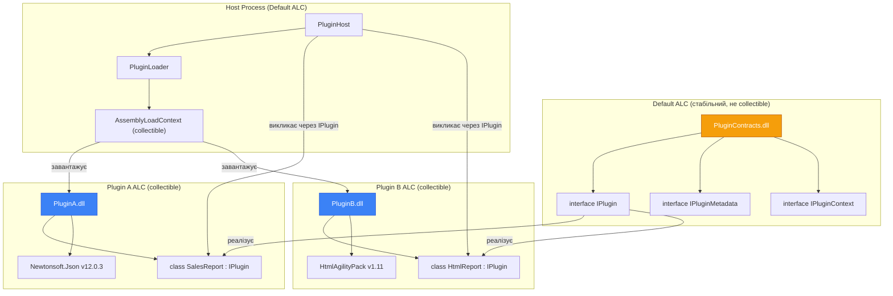

# Application Domains та Збірки — Plug-in Система з Hot-Reload

## Від Теорії до Практики

Попередня частина сформувала теоретичну базу: ми розібрали, чому AppDomain пішов у .NET Core, яку роль виконує AssemblyLoadContext, як завантажуються і вивантажуються збірки, і які посилання заважають вивантаженню.

Ця частина — повністю практична. Ми побудуємо реальну plug-in систему, де:
- Плагіни — окремі DLL проєкти з власними залежностями
- Хост завантажує їх у runtime без перезапуску
- При оновленні DLL-файлу — `FileSystemWatcher` автоматично перезавантажує плагін
- Ізоляція через ALC гарантує що плагіни не конфліктують між собою

Саме цей паттерн використовується у реальних продуктах: розширення IDE, системи звітів, рушії скриптів, CI/CD плагіни.

---

## Архітектурний Підхід: Три-Лаєрна Plug-in Модель

Перш ніж писати код — спроектуємо архітектуру. Правильний дизайн інтерфейсів критичний: помилки тут призведуть або до неможливості вивантаження, або до tight coupling між плагінами.

### Принцип Shared-Nothing крім Contracts

Ключовий принцип: плагіни знають одне про одного **тільки через абстракції з Contracts DLL**. Сам Contracts DLL завантажується у **Default ALC** (не collectible). Плагін знаходиться у власному collectible ALC.

Коли плагін реалізує інтерфейс `IPlugin` з Contracts.dll, і Contracts.dll завантажена у Default ALC, то посилання на `IPlugin` є посиланням на тип з **Default ALC** — тип, що живе вічно. А сам об'єкт плагіна (`new MyPlugin()`) — інстанс з collectible ALC, що може бути вивантажений.

Це і є ключ: **інтерфейс (контракт) — стабільний, реалізація — замінна**.

::mermaid



::

---

## Крок 1: Контракти — Фундамент Системи

Починаємо зі створення solution та проєктів:

```bash
dotnet new sln -n PluginSystem
dotnet new classlib -n PluginSystem.Contracts
dotnet new classlib -n PluginSystem.Loader
dotnet new console -n PluginSystem.Host
dotnet new classlib -n Plugins.TextTransform   # перший плагін
dotnet new classlib -n Plugins.Statistics      # другий плагін

dotnet sln add PluginSystem.Contracts PluginSystem.Loader PluginSystem.Host
dotnet sln add Plugins.TextTransform Plugins.Statistics

dotnet add PluginSystem.Loader reference PluginSystem.Contracts
dotnet add PluginSystem.Host reference PluginSystem.Loader PluginSystem.Contracts

dotnet add Plugins.TextTransform reference PluginSystem.Contracts
dotnet add Plugins.Statistics reference PluginSystem.Contracts
```

Тепер визначаємо контракти — єдину "мову" між хостом і плагінами:

```csharp showLineNumbers [PluginSystem.Contracts/IPlugin.cs]
namespace PluginSystem.Contracts;

/// <summary>
/// Основний контракт плагіна. Кожен плагін реалізує цей інтерфейс.
/// Розміщено у Default ALC — живе весь час роботи застосунку.
/// </summary>
public interface IPlugin : IAsyncDisposable
{
    /// <summary>Унікальний ідентифікатор типу плагіна</summary>
    string Id { get; }

    /// <summary>Ім'я плагіна для відображення</summary>
    string DisplayName { get; }

    /// <summary>Версія плагіна</summary>
    Version Version { get; }

    /// <summary>Категорія: "transform", "analytics", "export" тощо</summary>
    string Category { get; }

    /// <summary>
    /// Ініціалізація плагіна. Викликається після завантаження.
    /// </summary>
    Task InitializeAsync(IPluginContext context, CancellationToken ct = default);

    /// <summary>
    /// Основна точка входу — виконати роботу плагіна.
    /// </summary>
    Task<PluginResult> ExecuteAsync(PluginInput input, CancellationToken ct = default);
}

/// <summary>Контекст, наданий хостом плагіну під час ініціалізації</summary>
public interface IPluginContext
{
    /// <summary>Директорія конфігурації плагіна</summary>
    string ConfigDirectory { get; }

    /// <summary>Logger для запису подій плагіна</summary>
    IPluginLogger Logger { get; }
}

/// <summary>Абстракція логування (щоб не залежати від Microsoft.Extensions.Logging)</summary>
public interface IPluginLogger
{
    void Info(string message);
    void Warning(string message);
    void Error(string message, Exception? ex = null);
}
```

```csharp showLineNumbers [PluginSystem.Contracts/PluginModels.cs]
namespace PluginSystem.Contracts;

/// <summary>Вхідні дані для плагіна</summary>
public record PluginInput(
    string Data,
    IReadOnlyDictionary<string, string> Parameters
);

/// <summary>Результат виконання плагіна</summary>
public record PluginResult(
    bool Success,
    string Output,
    string? ErrorMessage = null,
    IReadOnlyDictionary<string, object>? Metadata = null
)
{
    public static PluginResult Ok(string output, Dictionary<string, object>? meta = null)
        => new(true, output, null, meta);

    public static PluginResult Fail(string error)
        => new(false, string.Empty, error);
}

/// <summary>Атрибут для оголошення метаданих плагіна прямо в коді</summary>
[AttributeUsage(AttributeTargets.Class)]
public class PluginAttribute(string id, string displayName, string category) : Attribute
{
    public string Id { get; } = id;
    public string DisplayName { get; } = displayName;
    public string Category { get; } = category;
}
```

---

## Крок 2: Два Плагіни з Різними Залежностями

```csharp showLineNumbers [Plugins.TextTransform/TextTransformPlugin.cs]
using PluginSystem.Contracts;
using System.Text.RegularExpressions;

namespace Plugins.TextTransform;

[Plugin("text.transform", "Text Transformer", "transform")]
public class TextTransformPlugin : IPlugin
{
    private IPluginLogger _logger = null!;

    public string Id => "text.transform";
    public string DisplayName => "Text Transformer";
    public Version Version => new(1, 0, 0);
    public string Category => "transform";

    public Task InitializeAsync(IPluginContext context, CancellationToken ct = default)
    {
        _logger = context.Logger;
        _logger.Info($"TextTransformPlugin v{Version} ініціалізовано");
        return Task.CompletedTask;
    }

    public Task<PluginResult> ExecuteAsync(PluginInput input, CancellationToken ct = default)
    {
        // operation: "upper", "lower", "reverse", "camelcase", "wordcount", "removehtml"
        string operation = input.Parameters.GetValueOrDefault("operation", "upper");

        string result = operation switch
        {
            "upper"     => input.Data.ToUpperInvariant(),
            "lower"     => input.Data.ToLowerInvariant(),
            "reverse"   => new string(input.Data.Reverse().ToArray()),
            "camelcase" => ToCamelCase(input.Data),
            "wordcount" => $"Слів: {input.Data.Split(' ', StringSplitOptions.RemoveEmptyEntries).Length}",
            "removehtml"=> Regex.Replace(input.Data, "<[^>]+>", ""),
            _ => throw new ArgumentException($"Невідома операція: {operation}")
        };

        _logger.Info($"Виконано '{operation}': вхід={input.Data.Length} байт");

        return Task.FromResult(PluginResult.Ok(result, new Dictionary<string, object>
        {
            ["operation"] = operation,
            ["inputLength"] = input.Data.Length,
            ["outputLength"] = result.Length
        }));
    }

    private static string ToCamelCase(string text)
    {
        var words = text.Split(' ', StringSplitOptions.RemoveEmptyEntries);
        return string.Concat(words.Select((w, i) =>
            i == 0 ? w.ToLower() : char.ToUpper(w[0]) + w[1..].ToLower()));
    }

    public ValueTask DisposeAsync()
    {
        _logger.Info("TextTransformPlugin вивантажується");
        return ValueTask.CompletedTask;
    }
}
```

```csharp showLineNumbers [Plugins.Statistics/StatisticsPlugin.cs]
using PluginSystem.Contracts;
using System.Text;

namespace Plugins.Statistics;

[Plugin("text.stats", "Text Statistics Analyzer", "analytics")]
public class StatisticsPlugin : IPlugin
{
    private IPluginLogger _logger = null!;

    public string Id => "text.stats";
    public string DisplayName => "Text Statistics Analyzer";
    public Version Version => new(2, 1, 0);
    public string Category => "analytics";

    public Task InitializeAsync(IPluginContext context, CancellationToken ct = default)
    {
        _logger = context.Logger;
        _logger.Info($"StatisticsPlugin v{Version} ініціалізовано");
        return Task.CompletedTask;
    }

    public Task<PluginResult> ExecuteAsync(PluginInput input, CancellationToken ct = default)
    {
        string text = input.Data;

        // Аналіз тексту
        int wordCount      = text.Split(' ', StringSplitOptions.RemoveEmptyEntries).Length;
        int charCount      = text.Length;
        int charNoSpaces   = text.Count(c => !char.IsWhiteSpace(c));
        int lineCount      = text.Split('\n').Length;
        int sentenceCount  = text.Count(c => c == '.' || c == '!' || c == '?');

        // Топ-5 слів за частотою
        var wordFreq = text.ToLower()
            .Split([' ', '\n', '\t', '.', ',', '!', '?'], StringSplitOptions.RemoveEmptyEntries)
            .GroupBy(w => w)
            .OrderByDescending(g => g.Count())
            .Take(5)
            .Select(g => $"{g.Key}({g.Count()})");

        var report = new StringBuilder();
        report.AppendLine($"Words:      {wordCount}");
        report.AppendLine($"Characters: {charCount} (no spaces: {charNoSpaces})");
        report.AppendLine($"Lines:      {lineCount}");
        report.AppendLine($"Sentences:  {sentenceCount}");
        report.AppendLine($"Top words:  {string.Join(", ", wordFreq)}");

        return Task.FromResult(PluginResult.Ok(report.ToString(), new Dictionary<string, object>
        {
            ["wordCount"] = wordCount,
            ["charCount"] = charCount
        }));
    }

    public ValueTask DisposeAsync()
    {
        _logger.Info("StatisticsPlugin вивантажується");
        return ValueTask.CompletedTask;
    }
}
```

---

## Крок 3: Loader — Серце Системи

```csharp showLineNumbers [PluginSystem.Loader/PluginLoadContext.cs]
using System.Reflection;
using System.Runtime.Loader;

namespace PluginSystem.Loader;

/// <summary>
/// Ізольований AssemblyLoadContext для одного плагіна.
/// isCollectible: true — дозволяє вивантаження після Dispose плагіна та GC.
/// </summary>
sealed class PluginLoadContext : AssemblyLoadContext
{
    private readonly AssemblyDependencyResolver _resolver;

    public PluginLoadContext(string pluginAssemblyPath)
        : base(name: $"Plugin:{Path.GetFileNameWithoutExtension(pluginAssemblyPath)}",
               isCollectible: true)
    {
        // Resolver вичитує .deps.json і знає де всі залежності плагіна
        _resolver = new AssemblyDependencyResolver(pluginAssemblyPath);
    }

    protected override Assembly? Load(AssemblyName assemblyName)
    {
        // Спочатку шукаємо в залежностях плагіна
        string? path = _resolver.ResolveAssemblyToPath(assemblyName);

        if (path is not null)
            return LoadFromAssemblyPath(path);

        // Якщо не знайшли → null = делегуємо до Default ALC
        // Так PluginContracts.dll підхоплюється з Default ALC (спільний тип IPlugin)
        return null;
    }

    protected override IntPtr LoadUnmanagedDll(string unmanagedDllName)
    {
        string? path = _resolver.ResolveUnmanagedDllToPath(unmanagedDllName);
        return path is not null ? LoadUnmanagedDllFromPath(path) : IntPtr.Zero;
    }
}
```

```csharp showLineNumbers [PluginSystem.Loader/LoadedPlugin.cs]
using PluginSystem.Contracts;
using System.Runtime.Loader;

namespace PluginSystem.Loader;

/// <summary>
/// Обгортка навколо завантаженого плагіна.
/// Тримає WeakReference на ALC для перевірки вивантаження.
/// </summary>
public sealed class LoadedPlugin(IPlugin plugin, AssemblyLoadContext alc) : IAsyncDisposable
{
    public IPlugin Plugin { get; } = plugin;
    public string PluginPath { get; init; } = "";
    public DateTime LoadedAt { get; } = DateTime.UtcNow;

    // WeakReference — не перешкоджає GC вивантажити ALC
    private readonly WeakReference<AssemblyLoadContext> _alcRef = new(alc);

    public bool IsAlcUnloaded => !_alcRef.TryGetTarget(out _);

    public async ValueTask DisposeAsync()
    {
        // 1. Chемайте плагін вивантажитись коректно
        await Plugin.DisposeAsync();

        // 2. Ініціюємо вивантаження ALC
        if (_alcRef.TryGetTarget(out var alc))
            alc.Unload();
    }
}
```

```csharp showLineNumbers [PluginSystem.Loader/PluginLoader.cs]
using System.Reflection;
using System.Runtime.CompilerServices;
using PluginSystem.Contracts;

namespace PluginSystem.Loader;

public class PluginLoader
{
    private readonly IPluginLogger _logger;

    public PluginLoader(IPluginLogger logger) => _logger = logger;

    /// <summary>
    /// Завантажує плагін з DLL файлу.
    /// Метод розмічений NoInlining щоб local змінні точно вийшли зі scope.
    /// </summary>
    [MethodImpl(MethodImplOptions.NoInlining)]
    public async Task<LoadedPlugin?> LoadAsync(
        string pluginDllPath,
        IPluginContext context,
        CancellationToken ct = default)
    {
        pluginDllPath = Path.GetFullPath(pluginDllPath);

        if (!File.Exists(pluginDllPath))
        {
            _logger.Error($"DLL не знайдено: {pluginDllPath}");
            return null;
        }

        _logger.Info($"Завантаження: {Path.GetFileName(pluginDllPath)}");

        var alc = new PluginLoadContext(pluginDllPath);

        try
        {
            var assembly = alc.LoadFromAssemblyPath(pluginDllPath);

            // Шукаємо перший тип, що реалізує IPlugin і не є абстрактним
            var pluginType = assembly
                .GetExportedTypes()
                .FirstOrDefault(t =>
                    typeof(IPlugin).IsAssignableFrom(t) &&
                    t is { IsClass: true, IsAbstract: false });

            if (pluginType is null)
            {
                _logger.Error($"IPlugin реалізація не знайдена у {Path.GetFileName(pluginDllPath)}");
                alc.Unload();
                return null;
            }

            var plugin = (IPlugin)Activator.CreateInstance(pluginType)!;

            // Ініціалізація плагіна (може читати конфіг, підключатися до БД тощо)
            await plugin.InitializeAsync(context, ct);

            _logger.Info($"✅ Завантажено: {plugin.DisplayName} v{plugin.Version}");

            return new LoadedPlugin(plugin, alc) { PluginPath = pluginDllPath };
        }
        catch (Exception ex)
        {
            _logger.Error($"Помилка завантаження {Path.GetFileName(pluginDllPath)}: {ex.Message}", ex);
            alc.Unload();
            return null;
        }
    }

    /// <summary>
    /// Очікує фактичного вивантаження ALC після Dispose.
    /// </summary>
    public static async Task WaitForUnloadAsync(LoadedPlugin plugin, int maxAttempts = 10)
    {
        for (int i = 0; i < maxAttempts && !plugin.IsAlcUnloaded; i++)
        {
            GC.Collect();
            GC.WaitForPendingFinalizers();
            GC.Collect();
            if (!plugin.IsAlcUnloaded)
                await Task.Delay(100);
        }
    }
}
```

---

## Наскрізний Приклад: Host з Hot-Reload через FileSystemWatcher

Збираємо всі компоненти в головному застосунку з автоматичним hot-reload.

```csharp showLineNumbers [PluginSystem.Host/ConsoleLogger.cs]
using PluginSystem.Contracts;

namespace PluginSystem.Host;

class ConsoleLogger(string prefix) : IPluginLogger
{
    public void Info(string msg)
    {
        Console.ForegroundColor = ConsoleColor.Cyan;
        Console.WriteLine($"[{prefix}] {msg}");
        Console.ResetColor();
    }

    public void Warning(string msg)
    {
        Console.ForegroundColor = ConsoleColor.Yellow;
        Console.WriteLine($"[{prefix}] ⚠️ {msg}");
        Console.ResetColor();
    }

    public void Error(string msg, Exception? ex = null)
    {
        Console.ForegroundColor = ConsoleColor.Red;
        Console.WriteLine($"[{prefix}] ❌ {msg}");
        if (ex is not null) Console.WriteLine($"   {ex.Message}");
        Console.ResetColor();
    }
}
```

```csharp showLineNumbers [PluginSystem.Host/PluginRegistry.cs]
using System.Collections.Concurrent;
using PluginSystem.Contracts;
using PluginSystem.Loader;

namespace PluginSystem.Host;

/// <summary>
/// Реєстр завантажених плагінів з підтримкою hot-reload.
/// Thread-safe для одночасного читання і оновлення.
/// </summary>
class PluginRegistry(IPluginLogger logger)
{
    private readonly ConcurrentDictionary<string, LoadedPlugin> _plugins = new();
    private readonly PluginLoader _loader = new(logger);
    private readonly IPluginLogger _logger = logger;

    public IReadOnlyCollection<LoadedPlugin> Plugins => _plugins.Values.ToList();

    public async Task LoadOrReloadAsync(string dllPath, IPluginContext context, CancellationToken ct = default)
    {
        string key = Path.GetFileNameWithoutExtension(dllPath);

        // Якщо вже завантажений — вивантажуємо спочатку
        if (_plugins.TryRemove(key, out var existing))
        {
            _logger.Info($"Hot-reload: вивантажуємо {key}...");
            await existing.DisposeAsync();
            await PluginLoader.WaitForUnloadAsync(existing);
        }

        // Невелика затримка щоб файл точно записався (FileSystemWatcher може спрацювати до завершення запису)
        await Task.Delay(500, ct);

        var loaded = await _loader.LoadAsync(dllPath, context, ct);
        if (loaded is not null)
            _plugins[key] = loaded;
    }

    public async Task UnloadAllAsync()
    {
        foreach (var (key, plugin) in _plugins)
        {
            _plugins.TryRemove(key, out _);
            await plugin.DisposeAsync();
        }
    }
}
```

```csharp showLineNumbers [PluginSystem.Host/Program.cs]
using PluginSystem.Contracts;
using PluginSystem.Host;

Console.OutputEncoding = System.Text.Encoding.UTF8;
Console.WriteLine("=== Plugin System with Hot-Reload ===\n");

using var cts = new CancellationTokenSource();
Console.CancelKeyPress += (_, e) => { e.Cancel = true; cts.Cancel(); };

var hostLogger = new ConsoleLogger("Host");

// Директорія плагінів — підписуємось на зміни
string pluginsDir = Path.Combine(AppContext.BaseDirectory, "plugins");
Directory.CreateDirectory(pluginsDir);

var registry = new PluginRegistry(hostLogger);

// Контекст для плагінів
IPluginContext MakeContext(string dllPath) => new SimplePluginContext(
    configDir: Path.Combine(pluginsDir, "config"),
    logger: new ConsoleLogger(Path.GetFileNameWithoutExtension(dllPath))
);

// Початкове завантаження всіх плагінів з директорії
foreach (var dll in Directory.GetFiles(pluginsDir, "*.dll"))
    await registry.LoadOrReloadAsync(dll, MakeContext(dll), cts.Token);

// FileSystemWatcher для hot-reload
using var watcher = new FileSystemWatcher(pluginsDir, "*.dll")
{
    EnableRaisingEvents = true,
    NotifyFilter = NotifyFilters.LastWrite | NotifyFilters.FileName
};

watcher.Changed += async (_, e) =>
{
    if (e.FullPath is { } path)
    {
        hostLogger.Info($"Зміна виявлено: {e.Name}");
        await registry.LoadOrReloadAsync(path, MakeContext(path), cts.Token);
    }
};

watcher.Created += async (_, e) =>
{
    if (e.FullPath is { } path && path.EndsWith(".dll"))
    {
        hostLogger.Info($"Новий плагін: {e.Name}");
        await registry.LoadOrReloadAsync(path, MakeContext(path), cts.Token);
    }
};

// REPL: інтерактивне управління
Console.WriteLine("Команди: 'list', 'run <id> <data>', 'reload', 'exit'\n");

while (!cts.Token.IsCancellationRequested)
{
    Console.Write("> ");
    string? input = Console.ReadLine();
    if (input is null) break;

    var parts = input.Trim().Split(' ', 3);
    string command = parts[0].ToLower();

    switch (command)
    {
        case "list":
            if (!registry.Plugins.Any())
            {
                Console.WriteLine("Плагіни відсутні");
                break;
            }
            foreach (var p in registry.Plugins)
            {
                Console.WriteLine($"  [{p.Plugin.Id}] {p.Plugin.DisplayName} v{p.Plugin.Version} ({p.Plugin.Category})");
                Console.WriteLine($"    Завантажено: {p.LoadedAt:HH:mm:ss}");
            }
            break;

        case "run" when parts.Length >= 3:
            string pluginId = parts[1];
            string data = parts[2];
            var target = registry.Plugins.FirstOrDefault(p => p.Plugin.Id == pluginId);
            if (target is null)
            {
                Console.WriteLine($"Плагін '{pluginId}' не знайдено. Використайте 'list'");
                break;
            }
            try
            {
                var pluginInput = new PluginInput(data, new Dictionary<string, string>
                {
                    ["operation"] = "upper"  // default operation
                });
                var result = await target.Plugin.ExecuteAsync(pluginInput, cts.Token);
                if (result.Success)
                {
                    Console.ForegroundColor = ConsoleColor.Green;
                    Console.WriteLine($"Результат:\n{result.Output}");
                    Console.ResetColor();
                }
                else
                {
                    Console.ForegroundColor = ConsoleColor.Red;
                    Console.WriteLine($"Помилка: {result.ErrorMessage}");
                    Console.ResetColor();
                }
            }
            catch (Exception ex)
            {
                Console.ForegroundColor = ConsoleColor.Red;
                Console.WriteLine($"Виключення: {ex.Message}");
                Console.ResetColor();
            }
            break;

        case "exit":
            cts.Cancel();
            break;

        default:
            Console.WriteLine("Невідома команда. Доступні: list, run <id> <data>, exit");
            break;
    }
}

await registry.UnloadAllAsync();
Console.WriteLine("Завершено. До побачення!");

// Допоміжний клас контексту
record SimplePluginContext(string ConfigDirectory, IPluginLogger Logger) : IPluginContext
{
    string IPluginContext.ConfigDirectory => ConfigDirectory;
    IPluginLogger IPluginContext.Logger => Logger;
}
```

### Збірка та Запуск

```bash
# 1. Збираємо Contracts (перший — бо від нього залежать всі)
dotnet build PluginSystem.Contracts

# 2. Збираємо плагіни і копіюємо в plugins/ директорію хосту
dotnet build Plugins.TextTransform -c Release
dotnet build Plugins.Statistics -c Release

# Копіюємо DLL (і .deps.json!) в plugins/
cp Plugins.TextTransform/bin/Release/net9.0/Plugins.TextTransform.dll PluginSystem.Host/bin/Debug/net9.0/plugins/
cp Plugins.Statistics/bin/Release/net9.0/Plugins.Statistics.dll PluginSystem.Host/bin/Debug/net9.0/plugins/

# 3. Запускаємо хост
dotnet run --project PluginSystem.Host
```

::terminal-preview{title="Plugin System Host" :cursor="true"}
<div class="line">=== Plugin System with Hot-Reload ===</div>
<div class="line"></div>
<div class="line"><span class="text-blue-400">[Host] Завантаження: Plugins.TextTransform.dll</span></div>
<div class="line"><span class="text-blue-400">[Plugins.TextTransform] TextTransformPlugin v1.0.0 ініціалізовано</span></div>
<div class="line"><span class="text-green-400">[Host] ✅ Завантажено: Text Transformer v1.0.0</span></div>
<div class="line"><span class="text-blue-400">[Host] Завантаження: Plugins.Statistics.dll</span></div>
<div class="line"><span class="text-green-400">[Host] ✅ Завантажено: Text Statistics Analyzer v2.1.0</span></div>
<div class="line">Команди: 'list', 'run &lt;id&gt; &lt;data&gt;', 'reload', 'exit'</div>
<div class="line"></div>
<div class="line"><span class="opacity-40">&gt;</span> list</div>
<div class="line">  [text.transform] Text Transformer v1.0.0 (transform)</div>
<div class="line">  [text.stats] Text Statistics Analyzer v2.1.0 (analytics)</div>
<div class="line"><span class="opacity-40">&gt;</span> run text.transform hello world</div>
<div class="line"><span class="text-green-400 font-bold">Результат: HELLO WORLD</span></div>
<div class="line"><span class="opacity-40">&gt;</span> run text.stats "The quick brown fox jumps"</div>
<div class="line"><span class="text-green-400">Words:      5</span></div>
<div class="line"><span class="text-green-400">Characters: 25 (no spaces: 21)</span></div>
<div class="line"><span class="text-green-400">Top words:  the(1), quick(1), brown(1), fox(1), jumps(1)</span></div>
::

---

## Embedded Resources: Вбудовані Ресурси

Окрема тема — вбудовані ресурси збірки. Зображення, JSON-схеми, SQL-скрипти, HTML-шаблони можна вбудувати прямо у DLL, щоб не залежати від наявності файлів на диску.

```xml [MyPlugin.csproj]
<ItemGroup>
  <!-- Вбудувати як ресурс з логічним ім'ям -->
  <EmbeddedResource Include="Resources\template.html" />
  <EmbeddedResource Include="Resources\config.json" />
  <EmbeddedResource Include="Resources\*.sql" />
</ItemGroup>
```

```csharp showLineNumbers [EmbeddedResourceReader.cs]
using System.Reflection;

class EmbeddedResourceReader
{
    private readonly Assembly _assembly;

    public EmbeddedResourceReader()
    {
        _assembly = Assembly.GetExecutingAssembly();
    }

    /// <summary>
    /// Читає embedded resource за логічним ім'ям.
    /// Повне ім'я = Namespace.Folder.FileName
    /// Наприклад: "MyPlugin.Resources.template.html"
    /// </summary>
    public string ReadText(string resourceName)
    {
        // Перелік всіх ресурсів (для debugging)
        // foreach (var name in _assembly.GetManifestResourceNames())
        //     Console.WriteLine(name);

        using var stream = _assembly.GetManifestResourceStream(resourceName)
            ?? throw new FileNotFoundException($"Ресурс не знайдено: {resourceName}");

        using var reader = new StreamReader(stream);
        return reader.ReadToEnd();
    }

    public byte[] ReadBytes(string resourceName)
    {
        using var stream = _assembly.GetManifestResourceStream(resourceName)
            ?? throw new FileNotFoundException($"Ресурс не знайдено: {resourceName}");

        using var ms = new MemoryStream();
        stream.CopyTo(ms);
        return ms.ToArray();
    }
}
```

---

## Підсумок

::card-group

::card{title="Plug-in Архітектура" icon="i-lucide-puzzle"}

- Contracts DLL у Default ALC (стабільний інтерфейс)
- Плагін реалізує контракт, завантажується у власний collectible ALC
- Пряме посилання — ніякого Remoting або серіалізації
- `PluginLoadContext : AssemblyLoadContext` з `AssemblyDependencyResolver`

::

::card{title="Hot-Reload" icon="i-lucide-refresh-cw"}

- `FileSystemWatcher` відстежує зміни DLL
- Dispose плагіна → Unload ALC → GC → знову Load
- `WeakReference` для перевірки фактичного вивантаження
- Затримка 500ms після FSW event (файл може ще записуватись)

::

::card{title="Embedded Resources" icon="i-lucide-archive"}

- `<EmbeddedResource>` у `.csproj`
- `Assembly.GetManifestResourceStream()` для читання
- Ім'я ресурсу: `Namespace.Folder.FileName`

::

::card{title="Production Checklist" icon="i-lucide-check-circle"}

- `[MethodImpl(NoInlining)]` для методів завантаження
- Не зберігати `Type` з collectible ALC у static
- Відписуватись від global events перед Unload
- Чекати завершення Task-ів плагіна перед Dispose

::

::

---

## Практичні Завдання

### Рівень 2: Hot-Reload Plugin System

Реалізуйте повноцінну plug-in систему за зразком наскрізного прикладу:
1. Визначте інтерфейс `IDataTransformer` з методами `Transform(string)`, `CanTransform(string)`, `Name`
2. Напишіть 3 плагіни: `ReverseTransformer`, `Base64Encoder`, `CaesarCipher`  
3. Хост сканує директорію `./plugins/` при старті
4. `FileSystemWatcher` автоматично перезавантажує плагін при зміні DLL
5. Хост застосовує всі трансформери ланцюжком до вхідного рядка
6. Виводить результат після кожного трансформера

### Рівень 3: Scripting Engine

Реалізуйте систему де "скрипти" — це C# класи у окремих DLL:
1. Скрипт реалізує `interface IScript { Task<string> RunAsync(string[] args); }`
2. Скрипти зберігаються у `./scripts/` директорії
3. CLI команда `run <script-name> [args...]` знаходить і виконує скрипт
4. При оновленні скрипта — перезавантажує без перезапуску
5. Скрипти можуть мати власні залежності (NuGet packages), що не конфліктують між собою
