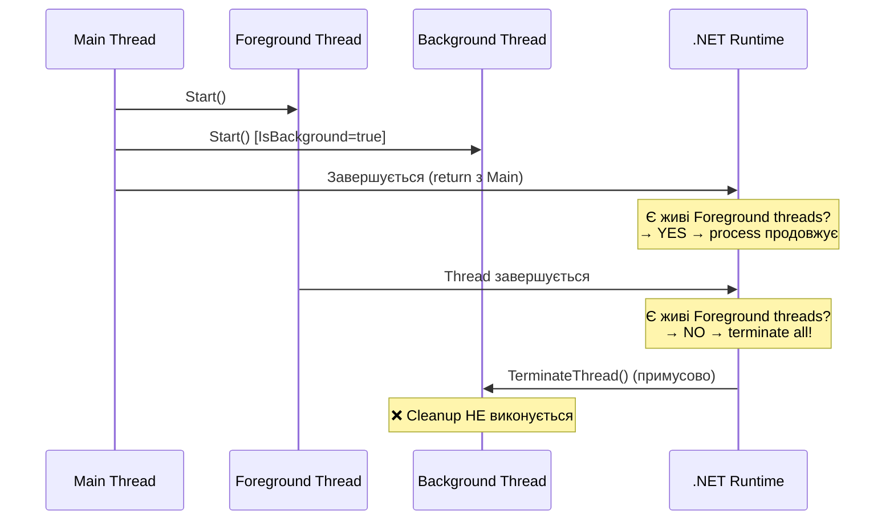

# Потоки: Основи та API Thread

## Необхідність Багатопоточності: Problem Statement

Вивчення потоків варто починати не з API, а з **проблеми**, яку вони вирішують. Без чіткого розуміння цієї проблеми механізми синхронізації, ThreadPool та async/await лишатимуться нагромадженням абстракцій без логічного зв'язку.

### Однопотоковий Вузол Горла

Запустіть наступну консольну програму і спостерігайте за поведінкою:

```csharp showLineNumbers [SingleThreadedApp.cs]
using System.Diagnostics;

static long ComputePrimes(long upTo)
{
    long count = 0;
    for (long n = 2; n <= upTo; n++)
    {
        bool isPrime = true;
        for (long d = 2; d * d <= n; d++)
        {
            if (n % d == 0) { isPrime = false; break; }
        }
        if (isPrime) count++;
    }
    return count;
}

Console.WriteLine("Починаємо підрахунок простих чисел...");
Console.WriteLine("Спробуйте ввести текст під час обчислення:");

var sw = Stopwatch.StartNew();

// ❌ Цей виклик блокує головний потік (і весь застосунок) на ~10 секунд
long result = ComputePrimes(5_000_000);

sw.Stop();
Console.WriteLine($"Результат: {result} простих чисел за {sw.ElapsedMilliseconds}ms");
```

Ключове спостереження: **жоден рядок після `ComputePrimes()` не виконується** поки обчислення не завершиться. Якщо це UI-застосунок (WinForms, WPF, MAUI) — вікно "зависне": кнопки не реагують, анімація зупиниться, ОС позначить вікно як "Не відповідає" (Not Responding). Якщо це веб-сервер — весь потік зайнятий і не може обслуговувати інші запити.

Ця ситуація — **CPU-bound bottleneck**: обчислення повністю навантажує процесор і не може бути перервано без явного рішення розробника.

### Два Типи Блокування

Перш ніж будувати рішення, важливо розрізнити два принципово різних типи блокування:

**CPU-bound**: потік заблокований тому, що **активно використовує** CPU (обчислення, шифрування, компресія, рендерінг). Єдиний спосіб не блокувати Main Thread — перенести роботу на **інший Thread або декілька Thread-ів** (справжній паралелізм).

**I/O-bound**: потік заблокований тому, що **чекає** на зовнішню подію (мережа, диск, база даних). CPU не задіяний. Рішення — `async/await`: потік звільняється і обслуговує інші запити, поки чекає на відповідь. Не потребує додаткових потоків.

Клас `Thread` — інструмент для CPU-bound паралелізму. Для I/O-bound рекомендується `async/await` (тема 12–13).

---

## Клас Thread: Архітектура та Делегати

Клас `System.Threading.Thread` — це **пряма обгортка над системним потоком** Windows. Один об'єкт `Thread` = один kernel thread. Це не абстракція Task або єдиниця роботи ThreadPool — це реальний потік операційної системи з власним стеком (~1 MB за замовчуванням), власним набором регістрів та власним instruction pointer.

### ThreadStart і ParameterizedThreadStart

В основі класу `Thread` лежать два делегати:

**`ThreadStart`** — делегат виду `void Method()`:

```csharp showLineNumbers [ThreadStartDelegate.cs]
using System.Threading;

// Варіант 1: іменований метод
static void Worker()
{
    Console.WriteLine($"ThreadStart: Thread ID = {Thread.CurrentThread.ManagedThreadId}");
}

var t1 = new Thread(new ThreadStart(Worker));
t1.Start();

// Варіант 2: анонімний метод
var t2 = new Thread(new ThreadStart(delegate
{
    Console.WriteLine("Anonymous ThreadStart");
}));
t2.Start();

// Варіант 3: lambda (найпоширеніший у сучасному коді)
var t3 = new Thread(() => Console.WriteLine("Lambda ThreadStart"));
t3.Start();

// Конструктор приймає ThreadStart — можна опустити явне створення делегату
var t4 = new Thread(Worker);  // автоматичне перетворення method group
t4.Start();
```

**`ParameterizedThreadStart`** — делегат виду `void Method(object? parameter)`:

```csharp showLineNumbers [ParameterizedDelegate.cs]
using System.Threading;

// ParameterizedThreadStart: приймає object? — потребує boxing/unboxing
static void ProcessItem(object? data)
{
    // Необхідний явний каст — ризик InvalidCastException
    var item = (WorkItem)data!;
    Console.WriteLine($"Обробляємо: {item.Id} у {Thread.CurrentThread.ManagedThreadId}");
}

record WorkItem(int Id, string Payload);

var thread = new Thread(new ParameterizedThreadStart(ProcessItem));
thread.Start(new WorkItem(42, "SomeData"));  // параметр передається у Start()
```

::note
`ParameterizedThreadStart` — архаїчний API, що виник до появи generics у C# 2.0. У сучасному коді замість нього використовують closure (lambda, що захоплює typed змінну). Це типобезпечно і не вимагає boxing/unboxing для value types.
::

### Lambda та Closure: Рекомендований Підхід

Lambda-вирази дозволяють "захопити" типізовані змінні з зовнішнього scope — без будь-якого кастингу:

```csharp showLineNumbers [LambdaClosure.cs]
using System.Threading;

// Типізовані змінні — без boxing, без каста
string userName = "Alice";
int taskId = 100;
DateTime startTime = DateTime.UtcNow;

var thread = new Thread(() =>
{
    // userName, taskId, startTime "захоплені" closure — повністю типобезпечно
    Console.WriteLine($"[Thread {Thread.CurrentThread.ManagedThreadId}] " +
                      $"User={userName}, Task={taskId}, Started={startTime:HH:mm:ss}");
});

thread.Name = $"Worker-for-task-{taskId}";  // ім'я для debugging
thread.Start();
```

### ⚠️ Closure Pitfall: Найважливіша Помилка Початківців

Closure захоплює не **значення** змінної, а **посилання** на неї. У циклі це призводить до класичної пастки:

```csharp showLineNumbers [ClosurePitfall.cs]
using System.Threading;

Console.WriteLine("=== ❌ НЕПРАВИЛЬНО: Closure Pitfall ===");
for (int i = 0; i < 5; i++)
{
    // Lambda захоплює ПОСИЛАННЯ на 'i', не поточне значення
    // На момент виконання потоку 'i' вже може бути 5
    var thread = new Thread(() => Console.Write($"{i} "));
    thread.Start();
}

Thread.Sleep(100);  // чекаємо завершення
Console.WriteLine("\nОчікували: 0 1 2 3 4");
Console.WriteLine("Отримали: 5 5 5 5 5 (або будь-яку комбінацію)");

Console.WriteLine("\n=== ✅ ПРАВИЛЬНО: Копіюємо значення ===");
for (int i = 0; i < 5; i++)
{
    int captured = i;  // нова змінна на КОЖНІЙ ітерації
    // Тепер lambda захоплює 'captured' — окрему копію для кожного i
    var thread = new Thread(() => Console.Write($"{captured} "));
    thread.Start();
}

Thread.Sleep(100);
Console.WriteLine("\nКожне значення рівно раз (порядок може відрізнятись)");
```

**Чому це працює**: на кожній ітерації `int captured = i;` створює **нову змінну** у власному scope. Lambda для ітерації `i=0` захоплює `captured=0`, lambda для `i=1` захоплює іншу змінну `captured=1` — кожна займає окрему ділянку стеку/heap. Навіть якщо `i` вже давно стало 5, `captured` вже не змінюється.

::warning
Ця помилка є однією з найчастіших у code review C# коду. Компілятор видає попередження CS1690 при роботі з полями structs у closures, але не завжди попереджає про цю конкретну проблему в циклах. З C# 5+ `foreach` виправлено (компілятор автоматично копіює змінну ітерації), але `for` з явним лічильником досі вимагає ручної копії.
::

---

## Управління Потоком після Запуску

### Отримання Результатів з Потоку

`Thread` повертає `void` — він не має вбудованого механізму повернення результатів. Існує кілька стандартних патернів:

**Паттерн 1: Shared state з Join**

Найпростіший підхід — спільна змінна і `Join()` для синхронізації:

```csharp showLineNumbers [SharedStatePattern.cs]
using System.Threading;
using System.Diagnostics;

long result = 0;
Exception? caughtException = null;

var thread = new Thread(() =>
{
    try
    {
        result = ComputePrimes(5_000_000);  // пишемо з дочірнього потоку
    }
    catch (Exception ex)
    {
        caughtException = ex;  // зберігаємо виключення для головного потоку
    }
});

thread.Start();

// Головний потік може виконувати інші дії поки потік обчислює
Console.WriteLine("Головний потік: виконуємо паралельну роботу...");
DoSomeOtherWork();

thread.Join();  // чекаємо завершення → після цього 'result' safe to read

if (caughtException is not null)
    throw new Exception("Worker failed", caughtException);

Console.WriteLine($"Результат: {result}");

// Тільки після Join() гарантовано видно зміни з іншого потоку
// (happens-before relationship встановлено через Join())
```

**Паттерн 2: Container Object**

Для кількох результатів або у разі складної взаємодії — container:

```csharp showLineNumbers [ContainerPattern.cs]
class ComputationResult
{
    public long Value { get; set; }
    public TimeSpan Duration { get; set; }
    public Exception? Error { get; set; }
    public bool IsCompleted { get; set; }
}

var container = new ComputationResult();

var thread = new Thread(() =>
{
    var sw = Stopwatch.StartNew();
    try
    {
        container.Value = ComputePrimes(5_000_000);
        container.IsCompleted = true;
    }
    catch (Exception ex)
    {
        container.Error = ex;
    }
    finally
    {
        container.Duration = sw.Elapsed;
    }
});

thread.Start();
thread.Join();

if (!container.IsCompleted)
    Console.WriteLine($"Помилка: {container.Error?.Message}");
else
    Console.WriteLine($"Результат: {container.Value} за {container.Duration.TotalSeconds:F2}s");
```

**Паттерн 3: Task\<T\> (сучасний — для нового коду)**

У реальному виробничому коді рідко використовують `Thread` напряму для отримання результатів — для цього є `Task<T>`:

```csharp
// Task<T> автоматично обробляє: результат, виключення, скасування
var task = Task.Run(() => ComputePrimes(5_000_000));
long result = await task;  // або task.GetAwaiter().GetResult() у sync методах
```

Докладно про Task — у темі 11 (TPL).

### Thread.Join: Очікування з Таймаутом

`Join()` блокує поточний потік до завершення цільового потоку. Є два варіанти:

```csharp showLineNumbers [JoinVariants.cs]
var thread = new Thread(() => Thread.Sleep(10_000));  // довгий потік
thread.Start();

// Варіант 1: Join без аргументів — чекаємо нескінченно
// ОБЕРЕЖНО: може заблокувати назавжди якщо потік зависне
thread.Join();

// Варіант 2: Join з таймаутом — повертає false якщо потік ще живий
bool completed = thread.Join(millisecondsTimeout: 3000);
if (!completed)
    Console.WriteLine("Потік досі виконується після 3 секунд");

// Варіант 3: Join з TimeSpan
bool done = thread.Join(TimeSpan.FromSeconds(5));
```

::tip
Уникайте `Join()` без таймауту в production-коді — це потенційна точка зависання. Завжди встановлюйте розумний таймаут і обробляйте ситуацію `completed == false`.
::

### Thread.Sleep та Альтернативи

```csharp showLineNumbers [SleepAndYield.cs]
// Thread.Sleep(ms) — призупиняє поточний потік
// ОС переводить потік у WaitSleepJoin стан і знімає з CPU
Thread.Sleep(500);                       // 500ms
Thread.Sleep(TimeSpan.FromSeconds(1.5)); // 1.5 секунди

// Thread.Sleep(0) — спеціальний: звільняє поточний квант
// але лише для потоків ТАКОГО Ж або ВИЩОГО пріоритету
Thread.Sleep(0);

// Thread.Yield() — звільняє квант для БУДЬ-ЯКОГО готового потоку
// більш "добровільний" варіант поступки процесорного часу
Thread.Yield();

// ВАЖЛИВО: Thread.Sleep НЕ є точним таймером!
// ОС планувальник може "прокинути" потік пізніше ніж зазначено
// через granularity (зазвичай ~15ms на Windows)
var sw = Stopwatch.StartNew();
Thread.Sleep(1);  // хочемо 1ms, отримаємо ~15ms!
Console.WriteLine($"Фактично: {sw.ElapsedMilliseconds}ms");
```

---

## Background vs Foreground: Критична Різниця

### Що Вирішує IsBackground

Кожен потік у .NET є або **foreground**, або **background**. Ця властивість безпосередньо визначає поведінку процесу при завершенні:

- **Foreground (`IsBackground = false`, за замовчуванням)**: процес **чекає завершення** всіх foreground потоків. `Main()` може вийти, але якщо є живі foreground потоки — процес НЕ завершується.
- **Background (`IsBackground = true`)**: процес **не чекає** background потоків. Якщо всі foreground потоки завершились (включаючи Main Thread) — background потоки вбиваються примусово без будь-якого cleanup.

```csharp showLineNumbers [ForegroundBackground.cs]
using System.Threading;

var foreground = new Thread(() =>
{
    Console.WriteLine("Foreground: стартував");
    Thread.Sleep(3000);
    Console.WriteLine("Foreground: завершив роботу (ВИКОНАЄТЬСЯ ЗАВЖДИ)");
});
// IsBackground за замовчуванням = false (foreground)

var background = new Thread(() =>
{
    Console.WriteLine("Background: стартував");
    Thread.Sleep(10_000);  // Спробує чекати 10 секунд
    Console.WriteLine("Background: завершив (МОЖЕ НЕ ВИКОНАТИСЬ)");
});
background.IsBackground = true;

foreground.Start();
background.Start();

Console.WriteLine("Main: завершую");
// Main thread завершується → Process продовжує жити (foreground thread живий)
// Через 3 секунди: foreground завершується → Process завершується
// Background thread вбивається після 3s, незважаючи на Sleep(10000)
```

### Послідовність Завершення Процесу

::mermaid



::

**Практичні рекомендації щодо IsBackground:**

| Use Case | Рекомендація | Обґрунтування |
| :--- | :--- | :--- |
| Головна бізнес-логіка | `IsBackground = false` | Має завершитися коректно |
| Фоновий моніторинг | `IsBackground = true` | Допоміжний, не критичний |
| Heartbeat / keepalive | `IsBackground = true` | Не повинен тримати процес |
| Обробка транзакцій | `IsBackground = false` + graceful shutdown | Критично коректне завершення |
| ThreadPool потоки | Завжди `IsBackground = true` | ThreadPool так і налаштований |

---

## Naming та Diagnostics

Іменування потоків — це не форматування, а **інструмент інженерії**:

```csharp showLineNumbers [ThreadNaming.cs]
using System.Threading;

// Іменування ДО Start()
var workerThread = new Thread(ProcessOrders)
{
    Name = "OrderProcessor",
    IsBackground = true,
    Priority = ThreadPriority.Normal
};

workerThread.Start();

// Thread ID (керований, не OS TID)
Console.WriteLine($"Managed ID: {workerThread.ManagedThreadId}");

// Головний потік
Thread.CurrentThread.Name = "MainThread";

// Виведення у debugger — ім'я буде видно у Threads Window (Ctrl+Alt+H у VS)
// Профайлери (dotnet-trace, PerfView) також показують імена

void ProcessOrders()
{
    Console.WriteLine($"[{Thread.CurrentThread.Name}] Починаємо обробку замовлень");

    for (int i = 0; i < 10; i++)
    {
        // Thread.CurrentThread доступний з будь-якого місця
        // ManagedThreadId стабільний протягом lifetime потоку
        Console.WriteLine($"[{Thread.CurrentThread.Name}#{Thread.CurrentThread.ManagedThreadId}] Замовлення {i}");
        Thread.Sleep(100);
    }
}
```

---

## Наскрізний Приклад: Паралельний Файловий Сканер

Побудуємо утиліту, що паралельно аналізує директорії — кожна subdir в окремому потоці.

::steps

### Крок 1: Модель результату та налаштування

```csharp showLineNumbers [Program.cs]
using System.Diagnostics;

record DirectoryScanResult(
    string Path,
    string ThreadName,
    int FileCount,
    long TotalSizeBytes,
    string LargestFile,
    long LargestFileSize,
    TimeSpan ScanDuration,
    Exception? Error = null
)
{
    public bool Success => Error is null;
    public string FormattedSize => FormatBytes(TotalSizeBytes);

    private static string FormatBytes(long bytes) => bytes switch
    {
        >= 1_073_741_824 => $"{bytes / 1_073_741_824.0:F2} GB",
        >= 1_048_576 => $"{bytes / 1_048_576.0:F2} MB",
        >= 1_024 => $"{bytes / 1_024.0:F2} KB",
        _ => $"{bytes} B"
    };
}
```

### Крок 2: Логіка сканування директорії

```csharp showLineNumbers [Program.cs]
static DirectoryScanResult ScanDirectory(string dirPath)
{
    var sw = Stopwatch.StartNew();
    string threadName = Thread.CurrentThread.Name
                        ?? $"Thread-{Thread.CurrentThread.ManagedThreadId}";

    try
    {
        var files = Directory.EnumerateFiles(dirPath, "*.*", SearchOption.AllDirectories)
            .Select(f => new FileInfo(f))
            .Where(fi => fi.Exists)  // може не існувати (race condition з FS)
            .ToList();

        long totalSize = files.Sum(f => f.Length);
        var largest = files.OrderByDescending(f => f.Length).FirstOrDefault();

        sw.Stop();

        return new DirectoryScanResult(
            Path: dirPath,
            ThreadName: threadName,
            FileCount: files.Count,
            TotalSizeBytes: totalSize,
            LargestFile: largest?.Name ?? "(порожньо)",
            LargestFileSize: largest?.Length ?? 0,
            ScanDuration: sw.Elapsed
        );
    }
    catch (Exception ex)
    {
        sw.Stop();
        return new DirectoryScanResult(
            Path: dirPath,
            ThreadName: threadName,
            FileCount: 0,
            TotalSizeBytes: 0,
            LargestFile: "",
            LargestFileSize: 0,
            ScanDuration: sw.Elapsed,
            Error: ex
        );
    }
}
```

### Крок 3: Паралельний запуск із Thread API

```csharp showLineNumbers [Program.cs]
static DirectoryScanResult[] ScanDirectoriesParallel(string rootPath)
{
    // Отримуємо всі безпосередні поддиректорії кореневої папки
    string[] subDirs;
    try
    {
        subDirs = Directory.GetDirectories(rootPath);
    }
    catch (Exception ex)
    {
        Console.WriteLine($"Не вдалося прочитати {rootPath}: {ex.Message}");
        return [];
    }

    if (subDirs.Length == 0)
    {
        // Немає піддиректорій — скануємо саму кореневу
        subDirs = [rootPath];
    }

    var results = new DirectoryScanResult[subDirs.Length];
    var threads = new Thread[subDirs.Length];

    Console.WriteLine($"Запускаємо {subDirs.Length} потоків для сканування...\n");

    for (int i = 0; i < subDirs.Length; i++)
    {
        int idx = i;             // ⚠️ critical: копія індексу для closure!
        string dirPath = subDirs[idx];

        threads[idx] = new Thread(() =>
        {
            results[idx] = ScanDirectory(dirPath);
        })
        {
            Name = $"Scanner-{idx + 1}",   // ім'я для debugging
            IsBackground = true            // не блокуємо завершення
        };
    }

    var totalSw = Stopwatch.StartNew();

    // Запускаємо всі потоки одночасно
    foreach (var t in threads)
        t.Start();

    // Чекаємо завершення всіх (Join кожного)
    foreach (var t in threads)
        t.Join();

    totalSw.Stop();
    Console.WriteLine($"Всі потоки завершились за {totalSw.ElapsedMilliseconds}ms\n");

    return results;
}
```

### Крок 4: Головна програма та звіт

```csharp showLineNumbers [Program.cs]
string rootPath = args.Length > 0 ? args[0] : @"C:\Windows";

Console.OutputEncoding = System.Text.Encoding.UTF8;
Console.WriteLine($"=== Parallel Directory Scanner ===");
Console.WriteLine($"Аналізуємо: {rootPath}\n");

var results = ScanDirectoriesParallel(rootPath);

// Сортуємо результати за розміром
var sorted = results
    .Where(r => r.Success)
    .OrderByDescending(r => r.TotalSizeBytes)
    .ToList();

// Виводимо таблицю
Console.WriteLine($"{"#",-3} {"Директорія",-35} {"Файлів",-8} {"Розмір",-12} {"Потік",-15} {"Час",-8}");
Console.WriteLine(new string('─', 85));

int rank = 1;
foreach (var r in sorted)
{
    Console.WriteLine(
        $"{rank++,-3} " +
        $"{TruncatePath(r.Path, 34),-35} " +
        $"{r.FileCount,-8} " +
        $"{r.FormattedSize,-12} " +
        $"{r.ThreadName,-15} " +
        $"{r.ScanDuration.TotalSeconds:F2}s");
}

// Помилки
var errors = results.Where(r => !r.Success).ToList();
if (errors.Count > 0)
{
    Console.WriteLine($"\n❌ Помилки ({errors.Count}):");
    foreach (var e in errors)
        Console.WriteLine($"  {e.Path}: {e.Error?.Message}");
}

// Підсумок
long totalFiles = sorted.Sum(r => r.FileCount);
long totalSize  = sorted.Sum(r => r.TotalSizeBytes);
Console.WriteLine(new string('─', 85));
Console.WriteLine($"Всього: {totalFiles} фалів, {FormatBytes(totalSize)}");

string TruncatePath(string path, int maxLen)
{
    var name = System.IO.Path.GetFileName(path);
    return name.Length <= maxLen ? name : "..." + name[^(maxLen - 3)..];
}

string FormatBytes(long bytes) => bytes switch
{
    >= 1_073_741_824 => $"{bytes / 1_073_741_824.0:F2} GB",
    >= 1_048_576 => $"{bytes / 1_048_576.0:F2} MB",
    >= 1_024 => $"{bytes / 1_024.0:F2} KB",
    _ => $"{bytes} B"
};
```

### Крок 5: Запуск

```bash
dotnet new console -n ParallelScanner
# Скопіюйте код у Program.cs
dotnet run -- "C:\Users"
# або
dotnet run -- "C:\Windows"
```

::

::terminal-preview{title="Parallel Directory Scanner"}
<div class="line"><span class="opacity-40">$</span> <strong class="font-bold">dotnet run -- C:\Windows</strong></div>
<div class="line">=== Parallel Directory Scanner ===</div>
<div class="line">Аналізуємо: C:\Windows</div>
<div class="line"></div>
<div class="line">Запускаємо <span class="text-blue-400 font-bold">12</span> потоків для сканування...</div>
<div class="line">Всі потоки завершились за <span class="text-green-400">2841ms</span></div>
<div class="line"></div>
<div class="line"><span class="text-gray-400">#   Директорія                          Файлів   Розмір       Потік           Час</span></div>
<div class="line"><span class="text-gray-400">─────────────────────────────────────────────────────────────────────────────────────</span></div>
<div class="line">1   System32                            <span class="text-yellow-400">38421</span>    <span class="text-yellow-400">5.82 GB</span>     Scanner-3       2.14s</div>
<div class="line">2   WinSxS                              <span class="text-yellow-400">24832</span>    <span class="text-yellow-400">3.41 GB</span>     Scanner-8       1.87s</div>
<div class="line">3   SysWOW64                            <span class="text-yellow-400">8124</span>     <span class="text-yellow-400">1.23 GB</span>     Scanner-1       0.91s</div>
<div class="line">─────────────────────────────────────────────────────────────────────────────────────</div>
<div class="line"><span class="text-green-400 font-bold">Всього: 71377 файлів, 10.46 GB</span></div>
::

---

## Підсумок

::card-group

::card{title="Делегати Thread" icon="i-lucide-code"}

- `ThreadStart` → `void Method()`
- `ParameterizedThreadStart` → `void Method(object?)`
- Lambda + closure — типобезпечна альтернатива
- `thread.Start()` — запуск, `new Thread()` — лише створення

::

::card{title="Closure Pitfall" icon="i-lucide-triangle-alert"}

- Lambda захоплює **посилання**, не значення
- `for` цикл: `int captured = i;` перед lambda
- `foreach` у C# 5+ автоматично виправлено
- Перевірка: кожне значення в результаті рівно раз?

::

::card{title="Результати з Потоку" icon="i-lucide-arrow-right"}

- Shared variable + `Join()` — простий патерн
- Container object — для кількох значень + error
- `Task<T>` — сучасний спосіб для нового коду

::

::card{title="Foreground/Background" icon="i-lucide-layers"}

- Foreground: процес чекає завершення
- Background: вбивається при виході з Main
- Іменуйте потоки: `.Name = "WorkerName"`
- `Thread.Sleep(0)` / `Thread.Yield()` — поступка часу

::

::

---

## Практичні Завдання

### Рівень 1: Parallel Countdown

Запустіть 5 іменованих потоків (`Counter-1` ... `Counter-5`). Кожен лічить від 5 до 0 з паузою 200ms. Після завершення всіх — виведіть "Всі лічильники завершили роботу!" та сумарний час виконання через `Stopwatch`.

### Рівень 2: Multi-threaded File Downloader

Напишіть утиліту, що:
1. Зчитує список URL з файлу `urls.txt` (по одній на рядок)
2. Кожен URL завантажує в окремому іменованому потоці
3. Зберігає файли у `./downloads/` з оригінальними іменами
4. Після завершення всіх виводить таблицю: URL | Статус | Розмір | Час | Потік

### Рівень 3: Simple Thread Pool (ручна реалізація)

Реалізуйте `WorkerPool` клас:
1. Конструктор: `WorkerPool(int workerCount)` — запускає N background foreground-потоків
2. `Submit(Action task)` — додає задачу в чергу (thread-safe через `lock`)
3. Потоки-воркери чекають задачі і виконують їх
4. `Shutdown(bool waitForCompletion)` — зупиняє пул (gracefully або immediately)
5. Тест: Submit 100 задач у пул з 4 потоків, перевірити що всі виконались
