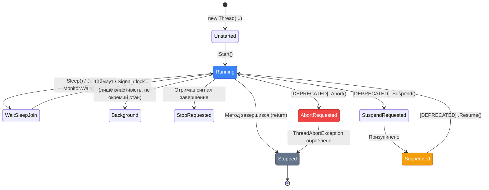

# Потоки: Lifecycle, Пріоритети та Безпечне Завершення

## Стани Потоку та ThreadState

Від моменту створення до знищення, потік проходить через чітко визначену послідовність станів. Клас `Thread` надає властивість `ThreadState` типу `System.Threading.ThreadState` (flags enum), що відображає поточний стан.

Розуміння станів потоку критичне для debugging складних багатопоточних сценаріїв: коли ви бачите у debugger або дамп-файлі потік у стані `WaitSleepJoin`, це означає, що він заблокований на `Sleep`, `Join` або синхронізаційному примітиві — і далі слід шукати, хто або що його блокує.

::mermaid



::

### Читання ThreadState

`ThreadState` — це `[Flags]` enum, тому потік може одночасно мати кілька станів:

```csharp showLineNumbers [ThreadStateDemo.cs]
using System.Threading;

var thread = new Thread(() =>
{
    Thread.Sleep(5000);  // потік зависне на 5 секунд
});

// Перед Start()
Console.WriteLine($"До Start(): {thread.ThreadState}");
// Виведе: Unstarted

thread.Start();
Thread.Sleep(100);  // Даємо потоку час почати виконуватись і зайти у Sleep

// Потік тепер у Sleep — стан WaitSleepJoin
Console.WriteLine($"Під час Sleep: {thread.ThreadState}");
// Виведе: WaitSleepJoin
// Або: Background, WaitSleepJoin (якщо IsBackground=true)

thread.Join();

Console.WriteLine($"Після Join: {thread.ThreadState}");
// Виведе: Stopped

// Порада: для перевірки чи потік завершився — використовуйте IsAlive
// замість ThreadState (більш читабельно)
Console.WriteLine($"IsAlive: {thread.IsAlive}");  // false після завершення
```

**Ключові стани, що зустрічаєте на практиці:**

::field-group

::field{name="Unstarted" type="ThreadState = 8"}
Потік створено (`new Thread(...)`), але `Start()` ще не викликано. Метод не почав виконуватись.
::

::field{name="Running" type="ThreadState = 0"}
Потік активно виконується або готовий до виконання (очікує на квант часу від планувальника). Значення `0` — за специфікою флагів, "Running" означає відсутність інших флагів.
::

::field{name="WaitSleepJoin" type="ThreadState = 4"}
Найчастіший стан при debugging. Потік заблокований на: `Thread.Sleep()`, `thread.Join()`, `Monitor.Wait()`, `lock` (очікує звільнення), `ManualResetEvent.WaitOne()` та будь-якому іншому примітиві синхронізації.
::

::field{name="Background" type="ThreadState = 4 (flag)"}
Комбінується з іншими: `Background | Running`, `Background | WaitSleepJoin`. Означає що `IsBackground = true`. Не є "справжнім" станом lifecycle, а додатковий флаг.
::

::field{name="Stopped" type="ThreadState = 16"}
Метод потоку завершився (нормально або через виключення). Потік мертвий. Повторний `Start()` викине `ThreadStateException`.
::

::field{name="AbortRequested/Aborted" type="ThreadState = 128/256"}
Застарілі стани. На .NET Core/5+ `Thread.Abort()` кидає `PlatformNotSupportedException`. На .NET Framework: `AbortRequested` — після `Abort()` але до обробки, `Aborted` — ThreadAbortException оброблено.
::

::

### IsAlive: Простіша Перевірка

Для перевірки чи потік ще виконується — `IsAlive` зручніший ніж розбір `ThreadState`:

```csharp
bool running = thread.IsAlive;
// IsAlive == true: Running, WaitSleepJoin, SuspendRequested, Suspended, AbortRequested
// IsAlive == false: Unstarted, Stopped
```

---

## Пріоритети Потоків: Ризики та Правильне Використання

### Як Планувальник Windows Розподіляє CPU

Windows Thread Scheduler — preemptive (витісняючий): він може зупинити будь-який потік у будь-який момент і передати CPU іншому. Рішення приймається на основі **priority class** процесу і **priority level** потоку всередині процесу.

Справжній пріоритет (Base Priority) = Priority Class процесу + Thread Priority Level:

| `ThreadPriority` в .NET | Windows Priority Level | Base Priority (Normal Process) |
| :--- | :--- | :--- |
| `Lowest` | `THREAD_PRIORITY_IDLE` | 2 |
| `BelowNormal` | `THREAD_PRIORITY_BELOW_NORMAL` | 6 |
| **`Normal`** | **`THREAD_PRIORITY_NORMAL`** | **8 (за замовчуванням)** |
| `AboveNormal` | `THREAD_PRIORITY_ABOVE_NORMAL` | 10 |
| `Highest` | `THREAD_PRIORITY_HIGHEST` | 12 |

Планувальник завжди вибирає готовий (Ready) потік **з найвищим пріоритетом**. Якщо є декілька готових потоків з однаковим пріоритетом — вони отримують кванти часу по черзі (Round Robin).

```csharp showLineNumbers [PriorityDemo.cs]
using System.Diagnostics;
using System.Threading;

int lowCount = 0, highCount = 0;
var sw = Stopwatch.StartNew();

// Потік з низьким пріоритетом
var lowPriority = new Thread(() =>
{
    while (sw.ElapsedMilliseconds < 3000)
        Interlocked.Increment(ref lowCount);
}) { Name = "Low", Priority = ThreadPriority.Lowest };

// Потік з високим пріоритетом
var highPriority = new Thread(() =>
{
    while (sw.ElapsedMilliseconds < 3000)
        Interlocked.Increment(ref highCount);
}) { Name = "High", Priority = ThreadPriority.Highest };

lowPriority.Start();
highPriority.Start();

lowPriority.Join();
highPriority.Join();

Console.WriteLine($"Low priority:  {lowCount:N0} iterations");
Console.WriteLine($"High priority: {highCount:N0} iterations");
Console.WriteLine($"Ratio: {(double)highCount / lowCount:F1}x більше у High");
// На завантаженій системі: high виконає у 5-20x більше ітерацій
```

### Priority Inversion: Класична Патологія

**Priority Inversion** — критична ситуація, коли **низькопріоритетний потік непрямо блокує високопріоритетний**. Класичний сценарій:

```csharp showLineNumbers [PriorityInversion.cs]
// Ілюстрація проблеми Priority Inversion
// (спрощена — реальна ситуація складніша)

var mutex = new object();

// Низькопріоритетний потік захоплює mutex
var lowPriority = new Thread(() =>
{
    lock (mutex)   // ← захопив mutex!
    {
        Thread.Sleep(5000);  // виконує довгу роботу з mutex
    }
})
{ Priority = ThreadPriority.Lowest };

// Середньопріоритетний потік "витіснив" низький (той не встигає звільнити mutex)
var mediumPriority = new Thread(() =>
{
    while (true) { /* CPU-intensive робота — не відпускає планувальник */ }
})
{ Priority = ThreadPriority.Normal };

// Високопріоритетний потік чекає mutex який тримає Low, якого витісняє Medium
var highPriority = new Thread(() =>
{
    lock (mutex)  // ← ЧЕКАЄ! Low тримає mutex, Medium не дає Low виконатися
    {
        Console.WriteLine("High виконується (ніколи не відбудеться поки є Medium!)");
    }
})
{ Priority = ThreadPriority.Highest };

// РЕЗУЛЬТАТ: High (найбільший пріоритет) не може виконатися
// через Medium (нижчий пріоритет!) — Priority Inversion
```

::caution
**Реальний прецедент — Mars Pathfinder (1997)**. Зонд на Марсі регулярно "скидався" через watchdog. Діагноз: low-priority task тримав shared mutex (bus scheduler), high-priority task чекав на нього, а medium-priority tasks (наукові дані) не давали low-priority завершитися. VxWTOS не підтримував Priority Inheritance. Баг виправили remote patch через Priority Inheritance.

У Windows і .NET немає вбудованого Priority Inheritance у Monitor/lock. Єдине практичне правило: **не змінюйте Thread.Priority без явної потреби і детального розуміння наслідків**.
::

### Starvation: Побічний Ефект Пріоритетів

**Starvation** — низькопріоритетний потік **ніколи** не отримує CPU тому що завжди є потоки вищого пріоритету:

```csharp showLineNumbers [StarvationDemo.cs]
var cts = new CancellationTokenSource(TimeSpan.FromSeconds(10));
int lowExecutions = 0;
int highExecutions = 0;

// 4 High-priority потоки завжди готові виконуватись
for (int i = 0; i < Environment.ProcessorCount; i++)
{
    new Thread(() =>
    {
        while (!cts.Token.IsCancellationRequested)
            Interlocked.Increment(ref highExecutions);
    })
    { Priority = ThreadPriority.AboveNormal }.Start();
}

// Low-priority потік — може ніколи не виконатись (starvation)
var low = new Thread(() =>
{
    while (!cts.Token.IsCancellationRequested)
        Interlocked.Increment(ref lowExecutions);
})
{ Priority = ThreadPriority.Lowest };
low.Start();

Thread.Sleep(10_000);

Console.WriteLine($"High: {highExecutions:N0}");
Console.WriteLine($"Low:  {lowExecutions:N0}");
Console.WriteLine($"Low отримав {100.0 * lowExecutions / (highExecutions + lowExecutions):F4}% CPU часу");
// На завантаженій системі low може отримати < 0.01% CPU або взагалі нічого
```

Windows намагається боротися зі starvation через **Dynamic Priority Boosting** (автоматичне підвищення пріоритету потоків, що давно чекають), але це не гарантія. Для продакшн-систем: **використовуйте `Normal` для всіх потоків**, якщо немає надзвичайно вагомої причини.

---

## Безпечне Завершення Потоків

### Чому Thread.Abort Заборонений

У .NET Framework існував метод `Thread.Abort()`, що надсилав `ThreadAbortException` у цільовий потік. Це здавалось зручним: можна зупинити будь-який потік ззовні. На практиці — джерело важко відтворюваних багів:

**Проблема 1: Нестійкий стан** — `ThreadAbortException` може виникнути між будь-якими двома інструкціями IL. Якщо потік в середині операції "оновити запис у БД" — запис може залишитися в напів-оновленому стані.

**Проблема 2: Lock leaks** — якщо потік тримає `lock` і отримує Abort — він кидає виключення, `lock` звільняється (CLR це гарантує), але операція у критичній секції могла залишити дані некоректними.

**Проблема 3: Finally blocks** — `ThreadAbortException` перехоплюється `finally` і re-throw-иться автоматично. Але `finally` може тривати дуже довго якщо там є cleanup логіка.

Через ці проблеми `Thread.Abort()` у .NET Core 1.0+ повністю видалений для Windows, а у .NET 5+ — кидає `PlatformNotSupportedException` на всіх платформах.

### CancellationToken: Правильний Підхід

Правильна архітектура — **cooperative cancellation**: потік сам перевіряє чи його просять зупинитись і коректно завершує роботу:

```csharp showLineNumbers [CancellationTokenPattern.cs]
using System.Threading;

// CancellationTokenSource — об'єкт управління скасуванням
using var cts = new CancellationTokenSource();
CancellationToken token = cts.Token;  // токен для передачі у потік

var worker = new Thread(() =>
{
    Console.WriteLine($"[{Thread.CurrentThread.Name}] Починаємо роботу");

    try
    {
        for (int i = 0; i < 100; i++)
        {
            // Варіант 1: Явна перевірка — гнучко, але вимагає ручних перевірок
            if (token.IsCancellationRequested)
            {
                Console.WriteLine($"[{Thread.CurrentThread.Name}] Скасування виявлено на ітерації {i}");
                break;
            }

            // Варіант 2: ThrowIfCancellationRequested — кидає OperationCanceledException
            // token.ThrowIfCancellationRequested();

            DoUnitOfWork(i);

            // Варіант 3: Sleep з підтримкою скасування
            // Thread.Sleep з CancellationToken — прокинеться при Cancel()
            token.WaitHandle.WaitOne(100);  // Sleep(100) з можливістю переривання
        }
    }
    catch (OperationCanceledException)
    {
        Console.WriteLine($"[{Thread.CurrentThread.Name}] Коректно завершено через скасування");
    }
    finally
    {
        Console.WriteLine($"[{Thread.CurrentThread.Name}] Cleanup завершено");
        // Finally ЗАВЖДИ виконається — файли закриті, з'єднання закриті
    }
})
{ Name = "Worker" };

worker.Start();

// Через 2 секунди — скасовуємо
Thread.Sleep(2000);
cts.Cancel();      // встановлює IsCancellationRequested = true
worker.Join();     // чекаємо коректного завершення
Console.WriteLine("Потік завершився коректно");

void DoUnitOfWork(int iteration)
{
    // Якась осмислена робота
    Thread.Sleep(50);
}
```

### CancellationTokenSource: Повний API

```csharp showLineNumbers [CancellationTokenSourceApi.cs]
using System.Threading;

// Ручне скасування
using var cts1 = new CancellationTokenSource();
cts1.Cancel();  // негайне скасування
// або
cts1.CancelAfter(TimeSpan.FromSeconds(5));  // відкладене скасування через 5s
cts1.CancelAfter(5000);                      // або у мілісекундах

// Скасування за таймаутом від початку
using var cts2 = new CancellationTokenSource(TimeSpan.FromSeconds(30));

// Ланцюгові токени: скасовується якщо будь-який з джерел скасовано
using var linkedCts = CancellationTokenSource.CreateLinkedTokenSource(
    cts1.Token, cts2.Token
);

var token = linkedCts.Token;

// Підписка на скасування (викликається у ThreadPool, не у головному потоці)
token.Register(() =>
{
    Console.WriteLine("Скасування виявлено через Register callback!");
});

// Перевірка
Console.WriteLine($"IsCancellationRequested: {token.IsCancellationRequested}");

// ThrowIfCancellationRequested — стандартна перевірка у циклах
token.ThrowIfCancellationRequested();  // кидає OperationCanceledException
```

### Thread.Interrupt: Пробудження Заблокованого Потоку

`Thread.Interrupt()` — більш м'яка альтернатива Abort для конкретної ситуації: пробудити потік, що заблокований у `WaitSleepJoin` стані:

```csharp showLineNumbers [ThreadInterrupt.cs]
var thread = new Thread(() =>
{
    try
    {
        Console.WriteLine("Потік: чекаємо 60 секунд...");
        Thread.Sleep(60_000);  // або Monitor.Wait(), Join(), etc.
        Console.WriteLine("Потік: прокинулись нормально");
    }
    catch (ThreadInterruptedException)
    {
        // Кидається коли Interrupt() перериває WaitSleepJoin
        Console.WriteLine("Потік: перерваний через Interrupt()");
        // Можна зробити cleanup і завершити
    }
});

thread.Start();
Thread.Sleep(2000);

thread.Interrupt();  // перериває Thread.Sleep → кидає ThreadInterruptedException
thread.Join();
```

::note
`Thread.Interrupt()` безпечніший за `Abort()` оскільки не може перервати довільну операцію — лише стан очікування. Якщо потік не у `WaitSleepJoin` — прапорець зберігається, і `ThreadInterruptedException` буде кинуто при наступному вході у стан очікування. Проте для нового коду рекомендується `CancellationToken`.
::

---

## ThreadLocal\<T\>: Дані Специфічні до Потоку

Іноді потрібна змінна, що має **окреме значення для кожного потоку** — без синхронізації. Класичний приклад: лічильник статистики, Random-генератор (не thread-safe).

```csharp showLineNumbers [ThreadLocalDemo.cs]
using System.Threading;

// ThreadLocal<T>: кожен потік отримує власну копію
// valueFactory: виклик для КОЖНОГО нового потоку окремо
using var localRandom = new ThreadLocal<Random>(
    valueFactory: () => new Random(Thread.CurrentThread.ManagedThreadId),
    trackAllValues: true  // дозволяє читати .Values (всі значення)
);

var threads = Enumerable.Range(0, 5).Select(i =>
{
    return new Thread(() =>
    {
        // localRandom.Value — ЦЯ копія для поточного потоку
        // Ніякої синхронізації не потрібно!
        int rng = localRandom.Value!.Next(1, 100);
        Console.WriteLine($"[Thread {Thread.CurrentThread.ManagedThreadId}] Random: {rng}");
        Thread.Sleep(rng);
    }) { Name = $"RngThread-{i}" };
}).ToList();

foreach (var t in threads) t.Start();
foreach (var t in threads) t.Join();

// Доступ до всіх значень (лише якщо trackAllValues: true)
// Console.WriteLine($"Ініціалізованих значень: {localRandom.Values.Count}");
```

**Порівняння зі `static` полем:**

| | `static T field` | `[ThreadStatic] static T` | `ThreadLocal<T>` |
| :--- | :--- | :--- | :--- |
| Ініціалізація | Одна для процесу | Тільки для першого потоку! | Factory для кожного |
| Безпека | Thread-unsafe | Кожен потік — окрема копія | Кожен потік — окрема копія |
| `Dispose` | Ні | Ні | Так, реалізує IDisposable |
| `trackAllValues` | Ні | Ні | Так, якщо потрібно |

---

## Наскрізний Приклад: Prime Sieve з Graceful Shutdown

Сьогоднішній наскрізний приклад: паралельний пошук простих чисел у діапазонах із підтримкою запиту на зупинку через `CancellationToken`.

::steps

### Крок 1: Визначаємо роботу та результат

```csharp showLineNumbers [PrimeFinder.cs]
using System;
using System.Diagnostics;
using System.Threading;
using System.Collections.Generic;

record RangeResult(
    string WorkerName,
    long RangeStart,
    long RangeEnd,
    List<long> Primes,
    TimeSpan Duration,
    bool WasCancelled
);
```

### Крок 2: Функція пошуку простих у діапазоні (з СancellationToken)

```csharp showLineNumbers [PrimeFinder.cs]
static RangeResult FindPrimesInRange(
    long start,
    long end,
    CancellationToken cancellationToken)
{
    string workerName = Thread.CurrentThread.Name
                        ?? $"Worker-{Thread.CurrentThread.ManagedThreadId}";
    var primes = new List<long>();
    var sw = Stopwatch.StartNew();
    bool cancelled = false;

    Console.WriteLine($"[{workerName}] Починаємо діапазон [{start:N0}..{end:N0}]");

    for (long n = start; n <= end; n++)
    {
        // Перевірка скасування кожні 10000 чисел (не на кожній ітерації — overhead)
        if (n % 10_000 == 0)
        {
            if (cancellationToken.IsCancellationRequested)
            {
                cancelled = true;
                Console.WriteLine($"[{workerName}] Скасовано на {n:N0}. Зібрали {primes.Count} простих.");
                break;
            }
        }

        if (IsPrime(n))
            primes.Add(n);
    }

    sw.Stop();

    if (!cancelled)
        Console.WriteLine($"[{workerName}] Завершили [{start:N0}..{end:N0}] → {primes.Count} простих за {sw.Elapsed.TotalSeconds:F2}s");

    return new RangeResult(workerName, start, end, primes, sw.Elapsed, cancelled);
}

static bool IsPrime(long n)
{
    if (n < 2) return false;
    if (n == 2) return true;
    if (n % 2 == 0) return false;
    for (long d = 3; d * d <= n; d += 2)
        if (n % d == 0) return false;
    return true;
}
```

### Крок 3: Паралельний сканер з управлінням потоками

```csharp showLineNumbers [Program.cs]
using System;
using System.Collections.Generic;
using System.Diagnostics;
using System.Threading;

static class Program
{
    static void Main(string[] args)
    {
        Console.OutputEncoding = System.Text.Encoding.UTF8;

        const long MaxNumber = 10_000_000;  // шукаємо прості до 10 млн
        int threadCount = Environment.ProcessorCount;  // потоки = кількість ядер

        Console.WriteLine($"=== Parallel Prime Finder ===");
        Console.WriteLine($"Діапазон: [2 .. {MaxNumber:N0}]");
        Console.WriteLine($"Потоків: {threadCount}");
        Console.WriteLine("Ctrl+C для дострокової зупинки...\n");

        using var cts = new CancellationTokenSource();

        // Обробник Ctrl+C — коректне скасування
        Console.CancelKeyPress += (_, e) =>
        {
            e.Cancel = true;  // не завершувати процес одразу
            Console.WriteLine("\n[Main] Отримано Ctrl+C — ініціюємо скасування...");
            cts.Cancel();
        };

        // Розподіляємо діапазон між потоками
        long chunkSize = (MaxNumber - 2) / threadCount + 1;

        var threads = new Thread[threadCount];
        var results = new RangeResult[threadCount];

        for (int i = 0; i < threadCount; i++)
        {
            int idx = i;  // ⚠️ closure pitfall fix
            long start = 2 + idx * chunkSize;
            long end   = Math.Min(start + chunkSize - 1, MaxNumber);

            threads[idx] = new Thread(() =>
            {
                results[idx] = FindPrimesInRange(start, end, cts.Token);
            })
            {
                Name = $"PrimeFinder-{idx + 1}",
                IsBackground = true,
                Priority = ThreadPriority.BelowNormal  // не заважаємо системі
            };
        }

        var totalSw = Stopwatch.StartNew();

        // Запускаємо всі потоки
        foreach (var t in threads)
            t.Start();

        // Чекаємо завершення всіх (або скасування)
        foreach (var t in threads)
            t.Join();  // Join не перервати через Cancel — Join з таймаутом

        totalSw.Stop();

        PrintResults(results, totalSw.Elapsed, cts.Token.IsCancellationRequested);
    }

    static void PrintResults(RangeResult[] results, TimeSpan totalTime, bool cancelled)
    {
        Console.WriteLine("\n" + new string('═', 70));
        Console.WriteLine(cancelled ? "⚠️  РЕЗУЛЬТАТИ (СКАСОВАНО ДОСТРОКОВО)" : "📊 ПІДСУМОК");
        Console.WriteLine(new string('─', 70));

        long totalPrimes = 0;
        foreach (var r in results.Where(x => x is not null))
        {
            string status = r.WasCancelled ? " [SCR]" : "";
            Console.WriteLine(
                $"{r.WorkerName,-18} [{r.RangeStart,10:N0} .. {r.RangeEnd,10:N0}]" +
                $"  {r.Primes.Count,6} простих  {r.Duration.TotalSeconds,5:F2}s{status}");
            totalPrimes += r.Primes.Count;
        }

        Console.WriteLine(new string('─', 70));
        Console.WriteLine($"Разом знайдено: {totalPrimes:N0} простих чисел");
        Console.WriteLine($"Загальний час:  {totalTime.TotalSeconds:F2}s");

        if (totalPrimes > 0)
        {
            var allPrimes = results.Where(x => x is not null)
                                   .SelectMany(r => r.Primes)
                                   .OrderByDescending(p => p)
                                   .Take(5);
            Console.Write("Топ-5 найбільших: ");
            Console.WriteLine(string.Join(", ", allPrimes));
        }
        Console.WriteLine(new string('═', 70));
    }
}
```

### Крок 4: Запуск

```bash
dotnet new console -n PrimeFinder
# Скопіювати код у Program.cs
dotnet run
# Для дострокової зупинки: Ctrl+C
```

::

::terminal-preview{title="Parallel Prime Finder" :expandable="true" maxHeight="320px"}
<div class="line">=== Parallel Prime Finder ===</div>
<div class="line">Діапазон: [2 .. 10,000,000]</div>
<div class="line">Потоків: 8</div>
<div class="line">Ctrl+C для дострокової зупинки...</div>
<div class="line"></div>
<div class="line"><span class="text-blue-400">[PrimeFinder-1] Починаємо діапазон [2..1,250,001]</span></div>
<div class="line"><span class="text-blue-400">[PrimeFinder-2] Починаємо діапазон [1,250,002..2,500,001]</span></div>
<div class="line"><span class="text-blue-400">... (8 потоків запущено)</span></div>
<div class="line"><span class="text-green-400">[PrimeFinder-1] Завершили [2..1,250,001] → 95,360 простих за 1.24s</span></div>
<div class="line"><span class="text-green-400">[PrimeFinder-3] Завершили [2,500,002..3,750,001] → 80,412 простих за 1.31s</span></div>
<div class="line"><span class="text-green-400">...</span></div>
<div class="line"></div>
<div class="line">══════════════════════════════════════════════════════════════════════</div>
<div class="line">📊 ПІДСУМОК</div>
<div class="line">──────────────────────────────────────────────────────────────────────</div>
<div class="line">PrimeFinder-1      [         2 ..  1,250,001]   95,360 простих   1.24s</div>
<div class="line">PrimeFinder-2      [ 1,250,002 ..  2,500,001]   83,221 простих   1.38s</div>
<div class="line"><span class="text-gray-400">... (8 потоків)</span></div>
<div class="line">──────────────────────────────────────────────────────────────────────</div>
<div class="line"><span class="text-green-400 font-bold">Разом знайдено: 664,579 простих чисел</span></div>
<div class="line"><span class="text-green-400 font-bold">Загальний час:  1.89s (замість ~14s однопоточно)</span></div>
<div class="line">Топ-5 найбільших: 9,999,991, 9,999,973, 9,999,943, 9,999,937, 9,999,929</div>
::

---

## Підсумок

::card-group

::card{title="Thread Lifecycle та ThreadState" icon="i-lucide-activity"}

- Unstarted → Running → WaitSleepJoin → Stopped
- `IsAlive` — зручніше ніж розбір ThreadState
- Background flag комбінується з іншими станами
- Debugger Threads Window показує ім'я + стан

::

::card{title="Пріоритети" icon="i-lucide-arrow-up"}

- Windows Base Priority = Process Class + Thread Level
- Priority Inversion: Low тримає mutex, блокує High
- Starvation: Low може ніколи не отримати CPU
- Практична рекомендація: завжди `Normal`

::

::card{title="Безпечне Завершення" icon="i-lucide-shield-check"}

- `Thread.Abort()` → `PlatformNotSupportedException` у .NET 5+
- `CancellationToken` — cooperative cancellation
- Перевірка `IsCancellationRequested` у циклах
- `token.WaitHandle.WaitOne(ms)` — Sleep, що переривається

::

::card{title="ThreadLocal\<T\>" icon="i-lucide-layers"}

- Окреме значення для кожного потоку
- valueFactory викликається на перший доступ кожного потоку
- Реалізує IDisposable — звільняйте після використання
- [ThreadStatic] — застарілий альтернатив без factory

::

::

---

## Практичні Завдання

### Рівень 1: ThreadState Monitoring

Напишіть програму що запускає 3 потоки і моніторить їх `ThreadState` кожні 500ms. Потоки мають різні сценарії:
1. Потік 1: виконує роботу 4 секунди
2. Потік 2: засипає на 8 секунд
3. Потік 3: чекає на `ManualResetEventSlim` що встановлюється через 5 секунд

Виводьте таблицю `ThreadName | ThreadState | IsAlive` кожні 500ms.

### Рівень 2: Cancellable Background Worker

Реалізуйте клас `BackgroundWorker<T>`:
1. Конструктор: `(Func<CancellationToken, T> work)`
2. `Start()` — запускає фоновий потік
3. `Cancel()` — надсилає скасування
4. `T GetResult(int timeoutMs)` — чекає результату або кидає `TimeoutException`
5. `bool IsCancelled` — чи було скасовано

### Рівень 3: Thread Pool (повна реалізація)

Реалізуйте `BoundedThreadPool`:
1. Фіксована кількість потоків: `minThreads`, `maxThreads`
2. Черга задач типу `BlockingCollection<Action>` або власна черга
3. Автоматичне масштабування: якщо черга зростає → додаємо потоки до `maxThreads`
4. `QueueWork(Func<CancellationToken, Task> work)` — додати задачу
5. `ShutdownAsync()` — дочекатись завершення всіх задач, зупинити потоки
6. Метрики: кількість активних потоків, розмір черги, виконано задач
