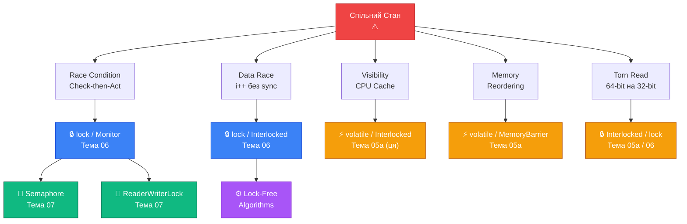

# Проблеми Спільного Стану — Memory Model та volatile

## Підсумок Попередньої Частини та Місток

У попередній частині ми з'ясували що саме може піти не так: Race Condition (порядок операцій), Data Race (одночасний доступ без захисту), Visibility Problem (CPU кеші), Memory Reordering (переставлення інструкцій) та Torn Read (часткові записи). Кожна проблема має чітку причину і симптоматику.

Тепер закономірне питання: **що робити?** Ця частина дає початкові відповіді, зосереджуючись на трьох перших рівнях захисту в порядку зростання "важкості": `volatile` (видимість), `Interlocked` (атомарні операції) та `Thread.MemoryBarrier()` (явні бар'єри). Повноцінна синхронізація через `lock`, `Monitor` та `SemaphoreSlim` — у наступній темі 06.

---

## .NET Memory Model: Що Гарантує Runtime

### Специфікація vs Практика

.NET має власну **Memory Model** — набір гарантій, що CLR дає розробникам щодо поведінки пам'яті у багатопоточному контексті. Ця модель менш сувора за Java Memory Model, але сильніша за C++ з його "relaxed" атомарними операціями за замовчуванням.

Важливо розрізняти:
- **Специфікацію** (.NET Memory Model) — те, що **гарантовано** будь-якою реалізацією .NET (включаючи .NET Framework, .NET Core, Mono, Unity IL2CPP). Якщо специфікація не гарантує щось, не можна покладатися на це у portable коді.
- **Практику на x64** — те, що насправді відбувається на Intel/AMD x86-64. Ця архітектура має досить сильну модель пам'яті (TSO — Total Store Order), і багато проблем там не відтворюються. ARM64 значно слабкіша і ближча до загальної специфікації.

**Що гарантує специфікація .NET без будь-якої синхронізації:**

1. Читання та запис **reference types** (посилань) — атомарні. Ніколи не побачите "половину" посилання.
2. Читання та запис значень розміром **≤ IntPtr.Size** (4 або 8 байт на відповідній платформі) — атомарні. `int` завжди атомарний. `long` на x64 — атомарний, на x32 — ні.
3. **Немає** гарантій порядку видимості між потоками без explicit synchronization.
4. **Немає** гарантій що запис одного потоку взагалі коли-небудь стане видимим іншому потоку без Acquire/Release семантики.

### Acquire та Release Семантика

Два фундаментальних поняття Memory Model — **Acquire** та **Release** семантика:

**Release (звільнення)** — операція записує дані і гарантує: все, що було записано до цієї операції, стане видимим будь-якому потоку, що виконає Acquire на тому самому місці синхронізації.

**Acquire (захоплення)** — операція читає дані і гарантує: після неї будуть видимі всі записи, що були зроблені будь-яким потоком до відповідної Release.

Аналогія: Release — це "запечатати конверт і відправити" (зафіксувати всі зміни і позначити що "передача відбулась"). Acquire — це "отримати конверт і відкрити" (побачити все що було у конверті на момент відправки).

```
Thread A (Publisher)                Thread B (Consumer)
═══════════════════                 ═══════════════════
data1 = Compute1();      ─────────►  (бачить data1, data2)
data2 = Compute2();      │           if (ready)          ← Acquire
ready = true;            ◄───────────    Use(data1, data2);
         ↑
      Release
```

**`lock`** надає і Release (при `Unlock`) і Acquire (при `Lock`) — саме тому lock гарантує коректну видимість. **`volatile`** надає Release-при-записі та Acquire-при-читанні — але більш обмежено.

---

## `volatile`: Специфікація та Обмеження

### Що volatile Гарантує

Ключове слово `volatile` у C# — це **не** "зроби операції атомарними". Це:

1. **Заборона кешування у регістрі**: JIT зобов'язаний читати значення безпосередньо з пам'яті при кожному зверненні (не зберігати у регістрі CPU).
2. **Release при записі**: запис у `volatile` поле генерує `.store.release` — всі попередні записи стають видимими до цього запису.
3. **Acquire при читанні**: читання з `volatile` поля генерує `.load.acquire` — всі наступні читання відбуваються після.
4. **Заборона певних видів reordering**: компілятор та JIT не можуть переміщати інші операції через volatile read/write.

```csharp showLineNumbers [VolatileCorrect.cs]
using System.Threading;

bool _stop = false;                  // ĖĖ звичайне поле
volatile bool _stopVolatile = false; // ✅ volatile поле

// Проблема: Thread B не гарантовано побачить зміну _stop
// Рішення: volatile гарантує видимість

public class StopFlag
{
    private volatile bool _stop;  // volatile keyword

    public void RequestStop() => _stop = true;  // Release semantics

    public void WorkLoop()
    {
        // Acquire semantics: гарантовано прочитає з пам'яті, не з кешу
        while (!_stop)  // кожна ітерація — нове читання з memory
        {
            DoWork();
        }
        Console.WriteLine("Зупинено коректно");
    }
}
```

### Що volatile НЕ Гарантує

Критично важливо розуміти обмеження `volatile`. Він вирішує **Visibility Problem**, але **не вирішує** Race Condition та Data Race:

```csharp showLineNumbers [VolatileLimitations.cs]
// ❌ volatile НЕ робить i++ атомарним!
volatile int _counter = 0;

// Два потоки одночасно:
_counter++;  // ← все ще Data Race!
// volatile гарантує що кожне читання — з пам'яті
// але READ-MODIFY-WRITE все ще три окремі кроки!

// ❌ volatile НЕ вирішує Race Condition у check-then-act:
volatile int _balance = 1000;

if (_balance >= 100)      // Acquire read: правильне значення прочитано
{
    // ← вікно вразливості! Інший потік може змінити _balance тут
    _balance -= 100;      // Release write: але write сам по собі не атомарний з check!
}

// ❌ volatile не можна застосувати до локальних змінних:
// volatile int local;   // ← compile error

// ❌ volatile не можна застосувати до struct полів напряму:
// Потрібно Volatile.Read(ref value) / Volatile.Write(ref value, x)
```

Підсумок: `volatile` — це **single-variable visibility guarantee**. Він гарантує що **одна змінна** завжди читається "свіжою" з точки зору усіх потоків. Але він не координує доступ між кількома змінними і не робить операцію атомарною.

### Volatile.Read і Volatile.Write: API без Ключового Слова

Для полів що не можна позначити `volatile` (наприклад, поля структури, або локальні змінні передані за посиланням), є статичний клас `Volatile`:

```csharp showLineNumbers [VolatileApi.cs]
using System.Threading;

// Volatile.Read<T> — Acquire semantic read
// Volatile.Write<T> — Release semantic write

// Для структур у масивах:
MyStruct[] _buffer = new MyStruct[100];
int _index = 0;

// Writer thread:
_buffer[_index] = new MyStruct { Value = 42 };
Volatile.Write(ref _index, _index + 1);  // Release: спочатку дані, потім індекс

// Reader thread:
int idx = Volatile.Read(ref _index);     // Acquire: спочатку індекс, потім дані
if (idx > 0)
{
    MyStruct item = _buffer[idx - 1];   // гарантовано бачимо записані дані
    Use(item.Value);
}

// Для локальних змінних або ref params:
int sharedValue = 0;
int read = Volatile.Read(ref sharedValue);
Volatile.Write(ref sharedValue, 99);
```

---

## Interlocked: Атомарні Операції

### Чому Interlocked Важливий

Клас `System.Threading.Interlocked` надає набір операцій, що є **атомарними на рівні процесора** — виконуються як єдина неподільна операція. На x86/x64 вони реалізовані через спеціальні CPU інструкції з prefixом `LOCK` (наприклад, `LOCK XADD`, `LOCK CMPXCHG`), що блокують шину пам'яті на час виконання.

**Ключовий принцип**: Interlocked операції не потребують зовнішнього `lock` — вони самі собою є "мінімальною синхронізацією". Це робить їх швидшими ніж `lock`, але й менш потужними — тільки прості алгоритмічні примітиви.

```csharp showLineNumbers [InterlockedBasics.cs]
using System.Threading;

int _counter = 0;
long _longCounter = 0L;

// ─── Базові операції ───────────────────────────────────

// Increment: атомарний еквівалент ++i, повертає НОВЕ значення
int newValue = Interlocked.Increment(ref _counter);

// Decrement: атомарний еквівалент --i, повертає НОВЕ значення
int afterDecrement = Interlocked.Decrement(ref _counter);

// Add: атомарний += value, повертає НОВЕ значення
int afterAdd = Interlocked.Add(ref _counter, 10);

// Exchange: атомарно встановлює нове значення, повертає СТАРЕ
int previousValue = Interlocked.Exchange(ref _counter, 42);

// Read: атомарне читання long/double (на 32-bit — без torn read)
long safeRead = Interlocked.Read(ref _longCounter);
```

### CompareExchange: Основа Lock-Free Алгоритмів

Найпотужніший примітив Interlocked — **CompareExchange** (CAS — Compare And Swap). Це атомарна операція "якщо поточне значення == очікуваному, то замінити на нове":

```csharp showLineNumbers [CompareExchange.cs]
using System.Threading;

// Сигнатура:
// int CompareExchange(ref int location, int value, int comparand)
//                                       ↑ нове     ↑ очікуване
// Атомарно: if (location == comparand) location = value;
// Повертає: СТАРЕ значення location (до заміни)

// ─── Приклад: атомарний максимум ──────────────────────
int _max = 0;

// "Встановити _max якщо newValue > _max" (thread-safe):
void AtomicMax(int newValue)
{
    int current;
    do {
        current = _max;                          // читаємо поточне
        if (newValue <= current) return;         // нема сенсу оновлювати
    } while (Interlocked.CompareExchange(ref _max, newValue, current) != current);
    //                                           ↑ нове    ↑ очікуване
    // ↑ якщо _max змінився між читанням і CAS — retry

    // Якщо CAS повернув NOT current — хтось встиг змінити _max між нашим читанням і спробою запису.
    // Retry: читаємо нове значення і спробуємо знову.
}

// ─── Приклад: Spinlock через CAS ───────────────────────
int _lock = 0;  // 0 = unlocked, 1 = locked

void SpinLockEnter()
{
    // Busy-wait поки не "захопимо" lock
    while (Interlocked.CompareExchange(ref _lock, 1, 0) != 0)
        Thread.SpinWait(20);  // активне очікування (краще ніж Sleep для коротких пауз)
}

void SpinLockExit()
{
    Interlocked.Exchange(ref _lock, 0);  // атомарно звільняємо
}
```

### Lazy Init через CompareExchange

Ще один класичний патерн — ліниве ініціалізування singleton без `lock`:

```csharp showLineNumbers [LazyInit.cs]
using System.Threading;

private static volatile MyService? _instance;

public static MyService GetInstance()
{
    if (_instance is not null) return _instance;  // fast path (без CAS)

    var newInstance = new MyService();  // створюємо кандидата

    // Атомарно: якщо _instance == null → встановити newInstance
    // Якщо хтось встиг раніше — повернеться їх значення, newInstance буде GC зібраний
    var result = Interlocked.CompareExchange(ref _instance, newInstance, null);

    return result ?? newInstance;
    // result == null якщо наш CAS переміг → newInstance є _instance
    // result != null якщо хтось встиг раніше → result і є реальний singleton
}
```

### Таблиця Interlocked Методів

::field-group

::field{name="Increment(ref int/long)" type="int/long"}
Атомарно збільшує на 1, повертає нове значення. Еквівалент `++i` але thread-safe. На 32-bit: `Interlocked.Increment(ref longVal)` безпечний.
::

::field{name="Decrement(ref int/long)" type="int/long"}
Атомарно зменшує на 1, повертає нове значення. Еквівалент `--i` але thread-safe.
::

::field{name="Add(ref int/long, value)" type="int/long"}
Атомарно додає `value`, повертає нове значення. Для від'ємного значення — аналог `Subtract`.
::

::field{name="Exchange(ref T, T)" type="T"}
Атомарно замінює значення, повертає **старе**. Підтримує: `int`, `long`, `float`, `double`, `object`, `IntPtr`, `T` (generic reference type).
::

::field{name="CompareExchange(ref T, T, T)" type="T"}
Якщо поточне == comparand → замінює. Повертає **старе** значення. Основа lock-free алгоритмів.
::

::field{name="Read(ref long)" type="long"}
Атомарне читання `long` без torn read. На x32: аналог `LOCK CMPXCHG8B`. На x64: просто mov (але явна Acquire семантика).
::

::field{name="And/Or/Xor (ref int/long, ...)" type="int/long"}
Атомарні бітові операції. Є у .NET 5+ як доповнення.
::

::

---

## Thread.MemoryBarrier: Явний Бар'єр

Коли потрібна більш точна контроль над reordering без накладених обмежень `volatile`, можна використати `Thread.MemoryBarrier()` (або `Interlocked.MemoryBarrier()`). Це **full memory fence** — жодна операція до бар'єру не буде переміщена після нього, і жодна після — до.

```csharp showLineNumbers [MemoryBarrier.cs]
using System.Threading;

int _data = 0;
bool _ready = false;

// Writer thread:
void Write()
{
    _data = 42;                     // запис даних
    Thread.MemoryBarrier();         // ← Full fence: _data записаний ДО _ready
    _ready = true;                  // публікуємо прапорець
}

// Reader thread:
void Read()
{
    while (!_ready) { }             // чекаємо прапорець
    Thread.MemoryBarrier();         // ← Full fence: читаємо _data ПІСЛЯ _ready
    Console.WriteLine(_data);       // гарантовано бачимо 42
}

// Еквівалентний код через volatile:
// _data = 42;          — звичайне поле (не публікується самостійно)
// _ready = true;       — volatile Release: _data видимий разом з _ready
// while (!_ready) {}   — volatile Acquire: _data видимий після
```

На практиці `Thread.MemoryBarrier()` використовується рідко — частіше `volatile` або `Interlocked` вирішують завдання елегантніше. Але для низькорівневих lock-free алгоритмів або коду з кількома незалежними полями він незамінний.

---

## Порівняння Інструментів

Перед наскрізним прикладом — зведена таблиця вибору:

| Сценарій | Інструмент | Обґрунтування |
| :--- | :--- | :--- |
| Лічильник (++/--) | `Interlocked.Increment` | Атомарний, без lock overhead |
| Прапорець зупинки | `volatile bool` | Тільки видимість, без складної логіки |
| Lazy singleton init | `Interlocked.CompareExchange` | CAS без блокування |
| Складний критичний блок | `lock (object)` | Взаємне виключення, наступна тема |
| Читання long (32-bit) | `Interlocked.Read` | Запобігання Torn Read |
| Явний fence | `Thread.MemoryBarrier()` | Низькорівневий контроль |
| Publish + читання | `volatile write/read` | Release/Acquire семантика |

---

## Наскрізний Приклад: Lock-Free Producer-Consumer зі Статистикою

Побудуємо Producer-Consumer систему, де використовуються **виключно** `volatile` та `Interlocked` — без жодного `lock`. Це демонструє можливості та межі цих примітивів.

::steps

### Крок 1: Структура проєкту та термінологія

```bash
dotnet new console -n LockFreeDemo
cd LockFreeDemo
```

**Producer-Consumer** — класичний патерн де одна сторона виробляє дані (Producer), інша — споживає (Consumer). Між ними — черга (Queue/Buffer). Задача: зробити цю взаємодію thread-safe без блокувального lock.

### Крок 2: Кільцевий Буфер (Ring Buffer) — основа lock-free черги

Кільцевий буфер (також Ring Buffer або Circular Queue) — масив фіксованого розміру де запис "загортається" по колу. Ідеальний для одного producer та одного consumer (Single-Producer Single-Consumer — SPSC):

```csharp showLineNumbers [RingBuffer.cs]
namespace LockFreeDemo;

/// <summary>
/// Lock-free кільцевий буфер для одного Producer та одного Consumer (SPSC).
/// Використовує volatile для координації та Interlocked для лічильників.
/// НЕ підходить для Multiple-Producer або Multiple-Consumer без додаткової синхронізації.
/// </summary>
public class LockFreeRingBuffer<T>
{
    private readonly T[] _buffer;
    private readonly int _capacity;

    // volatile: Producer пише _writeIndex, Consumer читає
    private volatile int _writeIndex = 0;
    // volatile: Consumer пише _readIndex, Producer читає
    private volatile int _readIndex = 0;

    // Статистика через Interlocked
    private long _totalProduced = 0;
    private long _totalConsumed = 0;
    private long _droppedItems = 0;

    public LockFreeRingBuffer(int capacity)
    {
        // Capacity має бути степенем двійки для ефективного % через бітову маску
        // (для простоти тут просто перевіряємо)
        if (capacity <= 0) throw new ArgumentException("Capacity must be > 0");
        _capacity = capacity;
        _buffer = new T[capacity];
    }

    /// <summary>
    /// Записати елемент у буфер (Thread: тільки Producer).
    /// Якщо буфер повний — повертає false і елемент втрачається.
    /// </summary>
    public bool TryEnqueue(T item)
    {
        int write = _writeIndex;
        int next  = (write + 1) % _capacity;

        // Якщо next == _readIndex — буфер повний
        if (next == _readIndex)
        {
            Interlocked.Increment(ref _droppedItems);
            return false;
        }

        _buffer[write] = item;  // записуємо дані

        // CRITICAL: спочатку записуємо дані, ПОТІМ оновлюємо _writeIndex
        // volatile write гарантує Release semantics — _writeIndex видимий після даних
        _writeIndex = next;

        Interlocked.Increment(ref _totalProduced);
        return true;
    }

    /// <summary>
    /// Прочитати елемент з буфера (Thread: тільки Consumer).
    /// Якщо буфер порожній — повертає false.
    /// </summary>
    public bool TryDequeue(out T item)
    {
        // volatile read гарантує Acquire semantics — бачимо актуальний _writeIndex
        if (_readIndex == _writeIndex)
        {
            item = default!;
            return false;
        }

        // Після перевірки _writeIndex (Acquire) — _buffer[_readIndex] вже записаний Producer-ом
        item = _buffer[_readIndex];
        _readIndex = (_readIndex + 1) % _capacity;

        Interlocked.Increment(ref _totalConsumed);
        return true;
    }

    public int Count
    {
        get
        {
            int w = _writeIndex;
            int r = _readIndex;
            return w >= r ? w - r : _capacity - r + w;
        }
    }

    public long TotalProduced => Interlocked.Read(ref _totalProduced);
    public long TotalConsumed => Interlocked.Read(ref _totalConsumed);
    public long DroppedItems  => Interlocked.Read(ref _droppedItems);
}
```

### Крок 3: Producer та Consumer

```csharp showLineNumbers [ProducerConsumer.cs]
namespace LockFreeDemo;

record WorkItem(int Id, string Payload, DateTime CreatedAt);

class Producer(LockFreeRingBuffer<WorkItem> buffer, CancellationToken ct)
{
    private volatile int _id = 0;

    public async Task RunAsync()
    {
        Console.WriteLine("[Producer] Старт");

        while (!ct.IsCancellationRequested)
        {
            int id = Interlocked.Increment(ref _id);
            var item = new WorkItem(id, $"task-{id:D6}", DateTime.UtcNow);

            bool enqueued = false;
            int retries = 0;

            // Retry: якщо буфер повний — чекаємо трохи
            while (!enqueued && retries < 5)
            {
                enqueued = buffer.TryEnqueue(item);
                if (!enqueued)
                {
                    await Task.Delay(1, ct);  // не блокуємо потік
                    retries++;
                }
            }

            // Невелика пауза між елементами (имітуємо реальну роботу)
            if (id % 10 == 0)
                await Task.Delay(1, ct);
        }

        Console.WriteLine($"[Producer] Зупинено. Вироблено: {Interlocked.Read(ref _id)}");
    }
}

class Consumer(LockFreeRingBuffer<WorkItem> buffer, string name, CancellationToken ct)
{
    private long _processed = 0;

    public async Task RunAsync()
    {
        Console.WriteLine($"[{name}] Старт");

        while (!ct.IsCancellationRequested)
        {
            if (buffer.TryDequeue(out var item))
            {
                // Обробляємо елемент
                var latency = (DateTime.UtcNow - item.CreatedAt).TotalMilliseconds;
                Interlocked.Increment(ref _processed);

                if (item.Id % 1000 == 0)  // логуємо кожен 1000-й
                    Console.WriteLine($"  [{name}] Обробили #{item.Id}, latency: {latency:F1}ms");
            }
            else
            {
                // Буфер порожній — невелика пауза щоб не молотити CPU
                await Task.Delay(1, ct);
            }
        }

        Console.WriteLine($"[{name}] Зупинено. Оброблено: {Interlocked.Read(ref _processed)}");
    }

    public long Processed => Interlocked.Read(ref _processed);
}
```

### Крок 4: Оркестратор з моніторингом

```csharp showLineNumbers [Program.cs]
using System.Diagnostics;
using LockFreeDemo;

Console.OutputEncoding = System.Text.Encoding.UTF8;
Console.WriteLine("=== Lock-Free Producer-Consumer Demo ===\n");

using var cts = new CancellationTokenSource();
Console.CancelKeyPress += (_, e) => { e.Cancel = true; cts.Cancel(); };

// Буфер на 1024 елементи (SPSC: один producer, один consumer)
var buffer = new LockFreeRingBuffer<WorkItem>(capacity: 1024);

var producer = new Producer(buffer, cts.Token);
var consumer = new Consumer(buffer, "Consumer-1", cts.Token);

var sw = Stopwatch.StartNew();

// Запускаємо всі компоненти паралельно
var prodTask = producer.RunAsync();
var consTask = consumer.RunAsync();

// Моніторинг кожну секунду
var monitorTask = Task.Run(async () =>
{
    long lastProduced = 0, lastConsumed = 0;

    while (!cts.Token.IsCancellationRequested)
    {
        await Task.Delay(1000, cts.Token).ConfigureAwait(ConfigureAwaitOptions.SuppressThrowing);
        if (cts.Token.IsCancellationRequested) break;

        long produced = buffer.TotalProduced;
        long consumed = buffer.TotalConsumed;
        long dropped  = buffer.DroppedItems;

        long prodRate = produced - lastProduced;
        long consRate = consumed - lastConsumed;
        lastProduced = produced;
        lastConsumed = consumed;

        Console.WriteLine(
            $"[Monitor] t={sw.Elapsed.TotalSeconds:F0}s | " +
            $"Produced: {produced:N0} (+{prodRate:N0}/s) | " +
            $"Consumed: {consumed:N0} (+{consRate:N0}/s) | " +
            $"Buffer: {buffer.Count} | " +
            $"Dropped: {dropped:N0}");
    }
});

// Автозупинка через 10 секунд для демонстрації
await Task.Delay(TimeSpan.FromSeconds(10), CancellationToken.None);
cts.Cancel();

await Task.WhenAll(prodTask, consTask, monitorTask);

Console.WriteLine($"\n=== Фінальна статистика ===");
Console.WriteLine($"Загалом вироблено: {buffer.TotalProduced:N0}");
Console.WriteLine($"Загалом оброблено: {buffer.TotalConsumed:N0}");
Console.WriteLine($"Загублено (buffer full): {buffer.DroppedItems:N0}");
Console.WriteLine($"Ефективність: {100.0 * buffer.TotalConsumed / buffer.TotalProduced:F2}%");
```

### Крок 5: Запуск та тестування

```bash
dotnet run
# Або щоб дочекатись Ctrl+C самостійно:
dotnet run -- no-autoclose
```

::

::terminal-preview{title="Lock-Free Producer-Consumer" :expandable="true" maxHeight="320px"}
<div class="line">=== Lock-Free Producer-Consumer Demo ===</div>
<div class="line"></div>
<div class="line"><span class="text-blue-400">[Producer] Старт</span></div>
<div class="line"><span class="text-green-400">[Consumer-1] Старт</span></div>
<div class="line">  [Consumer-1] Обробили <span class="text-yellow-400">#1000</span>, latency: 0.3ms</div>
<div class="line"><span class="text-gray-400">[Monitor] t=1s | Produced: 18,423 (+18,423/s) | Consumed: 18,001 (+18,001/s) | Buffer: 422 | Dropped: 0</span></div>
<div class="line">  [Consumer-1] Обробили <span class="text-yellow-400">#2000</span>, latency: 0.2ms</div>
<div class="line"><span class="text-gray-400">[Monitor] t=2s | Produced: 37,841 (+19,418/s) | Consumed: 37,612 (+19,611/s) | Buffer: 229 | Dropped: 0</span></div>
<div class="line">  [Consumer-1] Обробили <span class="text-yellow-400">#5000</span>, latency: 0.4ms</div>
<div class="line"><span class="text-gray-400">...</span></div>
<div class="line"></div>
<div class="line"><span class="text-blue-400">[Producer] Зупинено. Вироблено: 192,847</span></div>
<div class="line"><span class="text-green-400">[Consumer-1] Зупинено. Оброблено: 192,834</span></div>
<div class="line"></div>
<div class="line">=== Фінальна статистика ===</div>
<div class="line">Загалом вироблено: <span class="text-green-400 font-bold">192,847</span></div>
<div class="line">Загалом оброблено: <span class="text-green-400 font-bold">192,834</span></div>
<div class="line">Загублено (buffer full): <span class="text-yellow-400">13</span></div>
<div class="line">Ефективність: <span class="text-green-400 font-bold">99.99%</span></div>
::

### Чому SPSC Ring Buffer Безпечний без Lock

Може виникати питання: чому цей код безпечний, якщо не використовується `lock`? Відповідь — у суворому розподілі власності:

- `_writeIndex` **записує тільки Producer** → Consumer читає `volatile` → Acquire
- `_readIndex` **записує тільки Consumer** → Producer читає `volatile` → Acquire
- Після запису в `_buffer[write]` і **до** оновлення `_writeIndex` — Consumer ще не "знає" про нові дані (Release semantics)
- Consumer читає `_buffer[readIndex]` лише після того як побачить оновлений `_writeIndex` (Acquire semantics)

Це класичний **SPSC Disruptor pattern** — основа бібліотек з дуже низькою затримкою. Але: при **MPSC** (Multiple Producers) або **MPMC** (Multiple Producers + Consumers) цей підхід не працює без додадткових CAS або lock.

---

## Висновок: Дорожня Карта від Проблеми до Рішення

Тема 05 дала нам чітке розуміння "що може піти не так і чому". Далі — комплексні рішення:

::mermaid



::

---

## Підсумок

::card-group

::card{title=".NET Memory Model" icon="i-lucide-cpu"}

- Гарантує атомарність для полів ≤ IntPtr.Size
- Acquire/Release семантика — основа happens-before
- Без sync: жодних гарантій видимості між потоками
- x64 сильніша за специфікацію, ARM64 — відповідає

::

::card{title="volatile" icon="i-lucide-eye"}

- Гарантує видимість (Acquire при читанні, Release при записі)
- Забороняє JIT кешувати у регістрі
- НЕ робить операції атомарними (`i++` все ще Data Race)
- `Volatile.Read/Write` — API без ключового слова

::

::card{title="Interlocked" icon="i-lucide-zap"}

- Атомарні операції на рівні CPU (LOCK prefix)
- Increment, Add, Exchange, CompareExchange, Read
- CompareExchange — основа lock-free алгоритмів
- Швидше ніж lock, але обмежений у гнучкості

::

::card{title="SPSC Ring Buffer" icon="i-lucide-rotate-cw"}

- Один Producer + один Consumer: volatile достатньо
- Release semantics при публікації _writeIndex
- Acquire semantics при читанні Consumer
- Multi-P/C вимагає CAS або lock

::

::

---

## Практичні Завдання

### Рівень 1: volatile vs звичайне поле

Відтворіть Visibility Problem:
1. Запустіть потік з лічильником ітерацій та `while (!_stop)`
2. Через 1s головний потік встановлює `_stop = true`
3. Порівняйте поведінку з `bool _stop`, `volatile bool _stop`, та `Volatile.Write(ref _stop, true)`
4. Тест у Debug та Release збірках — зафіксуйте різницю

### Рівень 2: Lock-Free статистичний агрегатор

Реалізуйте `LockFreeStats` клас з `long` лічильниками:
1. `RecordLatency(long ms)` — атомарно оновлює Min, Max, Total, Count через `Interlocked.CompareExchange`
2. `double Average` — обчислює на основі Total/Count
3. 16 потоків записують випадкові значення, 1 потік читає статистику кожну секунду
4. Результат після завершення порівняти з однопотоковим підрахунком

### Рівень 3: MPMC Ring Buffer

Розширте SPSC Ring Buffer до MPMC (Multiple Producer, Multiple Consumer):
1. Використайте `Interlocked.CompareExchange` для атомарного резервування слотів
2. Підтримуйте до 4 Producer і 4 Consumer потоків одночасно
3. Перевірте коректність: `totalProduced == totalConsumed + droppedItems`
4. Порівняйте throughput SPSC vs MPMC через `Stopwatch`
