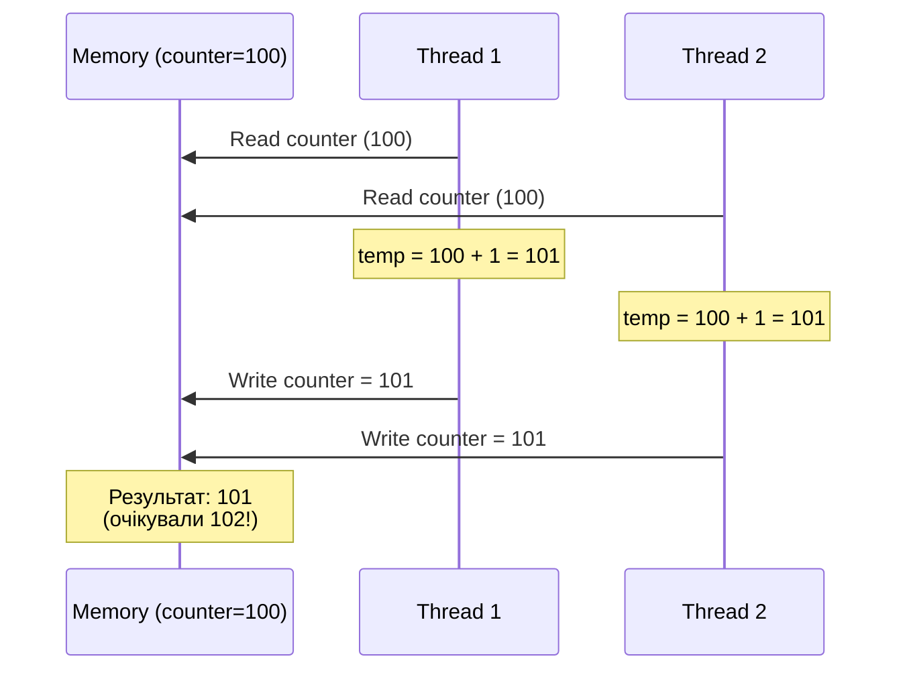
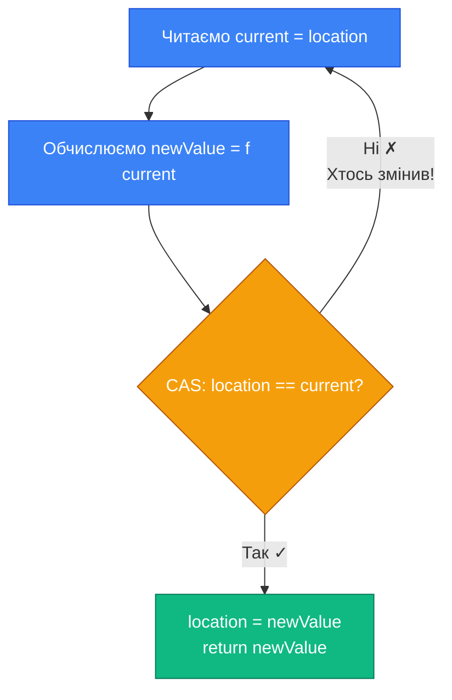
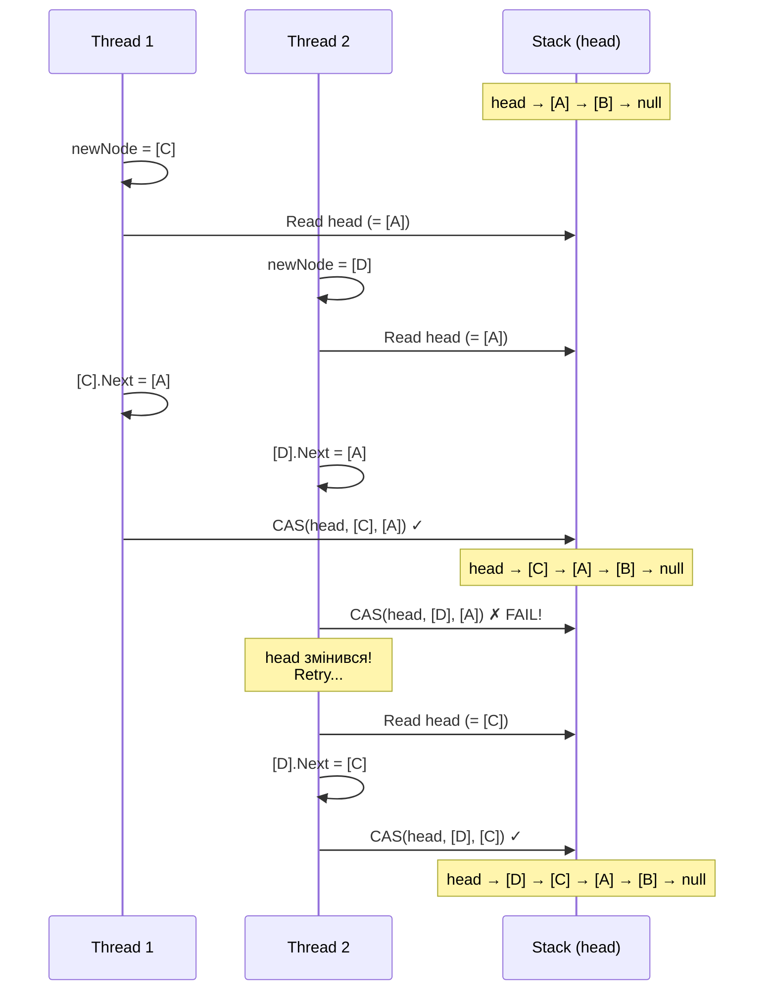

# Interlocked, CAS та Lock-Free Структури

## Чому Lock-Based Синхронізація Не Завжди Оптимальна

У попередніх темах ми розглянули `lock`, `Monitor`, `Mutex`, `SemaphoreSlim` — всі вони базуються на **блокуванні потоків**. Коли ресурс зайнятий, потік переходить у стан очікування (wait state), операційна система забирає у нього CPU і віддає іншим потокам. Коли ресурс звільняється — ОС розбуджує потік і повертає йому CPU.

Це працює чудово для більшості сценаріїв, але має **overhead**:

**1. Context Switch Cost** — перемикання потоку між станами (running ↔ waiting) коштує ~1-10 мікросекунд. Це включає:

- Збереження стану потоку (регістри CPU, instruction pointer, stack pointer)
- Перемикання адресного простору (якщо інший процес)
- Завантаження стану нового потоку
- Інвалідація CPU кешів (TLB flush)

**2. Kernel Transition** — для kernel-mode примітивів (`Mutex`, базовий `Semaphore`) кожна операція = системний виклик у ядро ОС. Це додає ~200-1000 наносекунд overhead навіть без конкуренції.

**3. Contention Overhead** — при високій конкуренції потоки постійно блокуються/розблоковуються, витрачаючи більше часу на синхронізацію ніж на корисну роботу.

### Приклад: Коли Overhead Перевищує Роботу

```csharp showLineNumbers [LockOverhead.cs]
using System;
using System.Diagnostics;
using System.Threading;
using System.Threading.Tasks;

// Сценарій: 1 мільйон інкрементів лічильника через lock
int counter = 0;
object lockObj = new object();

var sw = Stopwatch.StartNew();

Parallel.For(0, 1_000_000, _ =>
{
    lock (lockObj)  // ← Критична секція: ОДНА інструкція (counter++)
    {
        counter++;  // ~1 наносекунда на сучасному CPU
    }
    // Але lock/unlock коштує ~50-200 наносекунд при конкуренції!
});

sw.Stop();
Console.WriteLine($"Lock-based: {sw.ElapsedMilliseconds}ms, counter={counter}");
// Типовий результат: ~800-1200ms на 8-core CPU
```

::terminal-preview{title="Lock Overhead — Критична Секція vs Синхронізація"}

<div class="line"><span class="opacity-40">$</span> <strong>dotnet run --configuration Release</strong></div>
<div class="line">Benchmarking 1,000,000 increments with lock...</div>
<div class="line"></div>
<div class="line"><span class="text-yellow-400">⚠ Problem:</span> Critical section = <span class="font-bold">~1ns</span></div>
<div class="line"><span class="text-yellow-400">⚠ Problem:</span> Lock overhead = <span class="font-bold">~50-200ns</span></div>
<div class="line"></div>
<div class="line">Elapsed time: <span class="text-rose-400 font-bold">1,047ms</span></div>
<div class="line">Counter value: 1,000,000 <span class="text-green-400">✓</span></div>
<div class="line"></div>
<div class="line"><span class="text-rose-400 font-bold">Overhead is 50-200x larger than actual work!</span></div>
::

**Проблема**: критична секція виконується за ~1ns, але lock overhead = ~50-200ns. Ми витрачаємо в **50-200 разів більше** часу на синхронізацію ніж на корисну роботу!

### Альтернатива: Атомарні Операції

**Атомарні операції** — спеціальні CPU інструкції що виконують операцію як єдину неподільну дію **без блокування потоків**. Вони працюють на рівні апаратури (CPU + cache coherency protocol) і не потребують kernel transition.

**Переваги**:

- ✅ Немає context switch — потік не блокується
- ✅ Немає kernel transition — все у user-mode
- ✅ Швидкість: ~5-20ns замість ~50-200ns для lock
- ✅ Масштабованість: краще працюють при високій конкуренції

**Обмеження**:

- ❌ Підходять тільки для простих операцій (інкремент, swap, compare-and-swap)
- ❌ Складніші у використанні (потрібен retry loop для складних операцій)
- ❌ Не підходять для довгих критичних секцій

---

## Interlocked: Атомарні Операції на Рівні CPU

### Що Таке Атомарність

**Атомарна операція** (від грецького "atomos" — неподільний) — операція що виконується як єдина неподільна дія з точки зору інших потоків. Ніхто не може "побачити" проміжний стан операції.

**Аналогія**: Уявіть банківський переказ 100₴ з рахунку A на рахунок B:

- **Неатомарна операція**: `A -= 100; B += 100;` — між цими двома інструкціями інший потік може побачити що гроші зникли з A але ще не з'явились у B (порушення інваріанту: сума = const)
- **Атомарна операція**: обидві зміни відбуваються "миттєво" з точки зору спостерігачів — ніхто не побачить проміжний стан

### Як CPU Реалізує Атомарність

На рівні апаратури (x86/x64) атомарні операції реалізуються через:

**1. LOCK Prefix** — спеціальний префікс CPU інструкції що:

- Блокує cache line (64 байти) на час операції
- Активує cache coherency protocol (MESI/MOESI)
- Гарантує що інші cores побачать зміну одразу після завершення

**2. Cache Coherency Protocol** — апаратний механізм синхронізації кешів між CPU cores:

- Коли core 1 змінює значення — інші cores отримують invalidation message
- Їхні копії у L1/L2 кеші позначаються як invalid
- Наступне читання змусить їх завантажити нове значення з пам'яті

**3. Memory Ordering** — атомарні операції мають вбудовані memory barriers:

- Запобігають compiler та CPU reordering навколо атомарної операції
- Гарантують що зміни видимі іншим потокам у правильному порядку

```
CPU Core 1                    CPU Core 2
─────────────────────────────────────────────────
counter = 10 (у L1 cache)     counter = 10 (у L1 cache)

LOCK INC [counter]
  ↓
1. Блокує cache line
2. counter = 11
3. Invalidate signal →        ← Отримує invalidation
4. Розблокує cache line          counter у L1 = invalid

                              MOV EAX, [counter]
                              ← Читає з RAM: 11
```

### System.Threading.Interlocked: API

`Interlocked` — статичний клас у .NET що надає атомарні операції для примітивних типів. Під капотом він використовує CPU інструкції з LOCK префіксом.

---

## Interlocked.Increment та Decrement

### Базовий Синтаксис

```csharp showLineNumbers [IncrementDecrement.cs]
using System.Threading;

int counter = 0;

// Атомарно: counter = counter + 1; return новеЗначення;
int newValue = Interlocked.Increment(ref counter);
Console.WriteLine($"After Increment: {newValue}");  // 1

// Атомарно: counter = counter - 1; return новеЗначення;
newValue = Interlocked.Decrement(ref counter);
Console.WriteLine($"After Decrement: {newValue}");  // 0

// ⚠️ ВАЖЛИВО: Increment/Decrement повертають НОВЕ значення (post-increment)
// Це НЕ те саме що counter++ (який повертає старе значення)

int x = 5;
int result1 = x++;              // result1 = 5, x = 6 (post-increment)
int result2 = Interlocked.Increment(ref x);  // result2 = 7, x = 7
```

### Підтримувані Типи

```csharp showLineNumbers [SupportedTypes.cs]
// int (Int32)
int intCounter = 0;
Interlocked.Increment(ref intCounter);
Interlocked.Decrement(ref intCounter);

// long (Int64)
long longCounter = 0L;
Interlocked.Increment(ref longCounter);
Interlocked.Decrement(ref longCounter);

// uint та ulong — НЕ підтримуються напряму!
// Використовуйте Add з 1/-1 або CompareExchange
uint uintCounter = 0u;
// Interlocked.Increment(ref uintCounter);  // ❌ Compile error

// Workaround для uint:
Interlocked.Add(ref uintCounter, 1u);  // ✅ Працює (але Add підтримує тільки int/long)
// Для uint потрібен CompareExchange (розглянемо далі)
```

### Чому `i++` НЕ Атомарний

Це одна з найпоширеніших помилок у багатопотоковому програмуванні:

```csharp showLineNumbers [NonAtomicIncrement.cs]
// ❌ НЕБЕЗПЕЧНО у багатопотоковому коді!
int counter = 0;

Parallel.For(0, 10_000, _ =>
{
    counter++;  // ← НЕ атомарна операція!
});

Console.WriteLine($"Expected: 10000, Actual: {counter}");
// Типовий результат: 8500-9800 (race condition!)

// Чому? Бо counter++ компілюється у ТРИ окремі інструкції:
// 1. Read:   temp = counter      (завантажити значення з пам'яті у регістр)
// 2. Modify: temp = temp + 1     (інкрементувати у регістрі)
// 3. Write:  counter = temp      (записати назад у пам'ять)

// Між цими інструкціями інший потік може втрутитись:
// Thread 1: Read (counter=100)
// Thread 2: Read (counter=100)  ← Обидва прочитали 100!
// Thread 1: Modify (temp=101)
// Thread 2: Modify (temp=101)
// Thread 1: Write (counter=101)
// Thread 2: Write (counter=101) ← Втрачено один інкремент!
```

**Візуалізація проблеми**:

::mermaid



::

**Правильне рішення**:

```csharp showLineNumbers [AtomicIncrement.cs]
// ✅ ПРАВИЛЬНО:
int counter = 0;

Parallel.For(0, 10_000, _ =>
{
    Interlocked.Increment(ref counter);  // Атомарна операція
});

Console.WriteLine($"Expected: 10000, Actual: {counter}");
// Завжди: 10000 ✓
```

---

## Interlocked.Add: Атомарне Додавання

### Синтаксис та Приклади

```csharp showLineNumbers [InterlockedAdd.cs]
using System.Threading;

// Атомарно: location = location + value; return новеЗначення;
int total = 100;
int result = Interlocked.Add(ref total, 50);
Console.WriteLine($"Result: {result}, Total: {total}");  // Result: 150, Total: 150

// Від'ємні значення (атомарне віднімання):
result = Interlocked.Add(ref total, -30);
Console.WriteLine($"Result: {result}, Total: {total}");  // Result: 120, Total: 120

// long (Int64):
long bigTotal = 1_000_000_000L;
Interlocked.Add(ref bigTotal, 500_000_000L);
Console.WriteLine($"BigTotal: {bigTotal}");  // 1500000000

// uint та ulong — НЕ підтримуються!
// uint x = 100;
// Interlocked.Add(ref x, 50);  // ❌ Compile error
```

### Практичний Приклад: Thread-Safe Accumulator

```csharp showLineNumbers [ThreadSafeAccumulator.cs]
using System;
using System.Threading;
using System.Threading.Tasks;

public class ThreadSafeAccumulator
{
    private long _total = 0;
    private int _count = 0;

    public void Add(int value)
    {
        Interlocked.Add(ref _total, value);
        Interlocked.Increment(ref _count);
    }

    public double Average => _count == 0 ? 0 : (double)_total / _count;

    public long Total => Interlocked.Read(ref _total);  // Atomic read
    public int Count => Interlocked.CompareExchange(ref _count, 0, 0);  // Atomic read trick
}

// Використання: 1000 потоків додають випадкові числа
var accumulator = new ThreadSafeAccumulator();

Parallel.For(0, 1000, i =>
{
    accumulator.Add(Random.Shared.Next(1, 100));
});

Console.WriteLine($"Total: {accumulator.Total}");
Console.WriteLine($"Count: {accumulator.Count}");
Console.WriteLine($"Average: {accumulator.Average:F2}");
```

---

## Interlocked.Exchange: Атомарний Swap

### Концепція

`Exchange` — атомарно замінює значення змінної на нове і повертає **попереднє** значення. Це еквівалент:

```csharp
// Неатомарна версія (небезпечна!):
T oldValue = location;
location = newValue;
return oldValue;

// Атомарна версія:
T oldValue = Interlocked.Exchange(ref location, newValue);
```

### Синтаксис та Приклади

```csharp showLineNumbers [InterlockedExchange.cs]
using System.Threading;

// ─── Примітивні типи ───────────────────────────────────────────
int value = 42;
int oldValue = Interlocked.Exchange(ref value, 100);
Console.WriteLine($"Old: {oldValue}, New: {value}");  // Old: 42, New: 100

long bigValue = 999L;
long oldBig = Interlocked.Exchange(ref bigValue, 1000L);

float floatValue = 3.14f;
float oldFloat = Interlocked.Exchange(ref floatValue, 2.71f);

double doubleValue = 1.23;
double oldDouble = Interlocked.Exchange(ref doubleValue, 4.56);

// ─── Reference Types ───────────────────────────────────────────
object? obj = new MyClass { Id = 1 };
object? oldObj = Interlocked.Exchange(ref obj, new MyClass { Id = 2 });
// oldObj тепер вказує на MyClass { Id = 1 }
// obj тепер вказує на MyClass { Id = 2 }

// Атомарне обнулення:
string? text = "Hello";
string? oldText = Interlocked.Exchange(ref text, null);
Console.WriteLine($"Old: {oldText}, New: {text}");  // Old: Hello, New: (null)
```

### Use Case 1: Atomic Flag Swap

```csharp showLineNumbers [AtomicFlagSwap.cs]
public class Worker
{
    private int _isRunning = 0;  // 0 = false, 1 = true

    public bool TryStart()
    {
        // Спроба атомарно змінити 0 → 1
        int wasRunning = Interlocked.Exchange(ref _isRunning, 1);

        if (wasRunning == 1)
        {
            Console.WriteLine("Already running!");
            return false;  // Вже запущений
        }

        Console.WriteLine("Started!");
        return true;  // Успішно запустили
    }

    public void Stop()
    {
        Interlocked.Exchange(ref _isRunning, 0);
        Console.WriteLine("Stopped!");
    }
}

// Тест: 10 потоків намагаються запустити одночасно
var worker = new Worker();

Parallel.For(0, 10, i =>
{
    bool started = worker.TryStart();
    Console.WriteLine($"Thread {i}: {(started ? "SUCCESS" : "FAILED")}");
});

// Результат: тільки ОДИН потік отримає SUCCESS
```

### Use Case 2: Atomic Reference Swap

```csharp showLineNumbers [AtomicReferenceSwap.cs]
public class ConfigManager
{
    private Config? _currentConfig;

    public void UpdateConfig(Config newConfig)
    {
        Config? oldConfig = Interlocked.Exchange(ref _currentConfig, newConfig);

        Console.WriteLine($"Config updated: {oldConfig?.Version} → {newConfig.Version}");

        // Cleanup старої конфігурації (якщо потрібно)
        (oldConfig as IDisposable)?.Dispose();
    }

    public Config? GetConfig()
    {
        // Атомарне читання reference
        return Interlocked.CompareExchange(ref _currentConfig, null, null);
    }
}

public record Config(string Version, Dictionary<string, string> Settings);

// Використання: кілька потоків читають, один оновлює
var manager = new ConfigManager();
manager.UpdateConfig(new Config("1.0", new()));

// Reader threads
Parallel.For(0, 100, _ =>
{
    var config = manager.GetConfig();
    Console.WriteLine($"Read config: {config?.Version}");
});

// Writer thread
Task.Run(() =>
{
    Thread.Sleep(50);
    manager.UpdateConfig(new Config("2.0", new()));
});
```

---

## Interlocked.CompareExchange: Фундамент Lock-Free

### Що Таке Compare-And-Swap (CAS)

`CompareExchange` — **найпотужніший** примітив Interlocked. Він реалізує операцію **Compare-And-Swap (CAS)** — фундамент lock-free програмування.

**Логіка CAS**:

```csharp
// Псевдокод (неатомарна версія):
T CompareExchange(ref T location, T newValue, T comparand)
{
    T original = location;

    if (location == comparand)  // Якщо значення досі те що очікували
    {
        location = newValue;     // → Замінити на нове
    }

    return original;  // Повернути оригінальне значення
}
```

**Ключова ідея**: "Замінити значення на нове, **тільки якщо** воно досі дорівнює очікуваному". Це дозволяє виявити чи хтось інший змінив значення між нашим читанням та записом.

### Синтаксис

```csharp showLineNumbers [CompareExchangeBasics.cs]
using System.Threading;

int value = 10;
int comparand = 10;   // Очікуване значення
int newValue = 20;    // Нове значення

// Спроба 1: comparand співпадає → заміна відбувається
int original = Interlocked.CompareExchange(ref value, newValue, comparand);
Console.WriteLine($"Original: {original}, Value: {value}");
// Original: 10, Value: 20 ✓

// Спроба 2: comparand НЕ співпадає → заміна НЕ відбувається
value = 10;
original = Interlocked.CompareExchange(ref value, 99, 999);
Console.WriteLine($"Original: {original}, Value: {value}");
// Original: 10, Value: 10 (залишився без змін, бо 10 != 999)
```

### CAS Loop Pattern: Retry Until Success

Найважливіший патерн lock-free програмування — **CAS loop**:

```csharp showLineNumbers [CASLoop.cs]
// Задача: атомарно виконати складну операцію (counter = counter * 2 + 1)
// Interlocked.Add не підходить — операція нелінійна

int counter = 10;

int MultiplyAndAddOne(ref int location)
{
    int current, newValue;

    do
    {
        current = location;                // 1. Читаємо поточне значення
        newValue = current * 2 + 1;        // 2. Обчислюємо нове (може бути дорога операція)

        // 3. Спроба атомарно замінити:
        //    "Якщо location досі == current (ніхто не змінив) → записати newValue"
    }
    while (Interlocked.CompareExchange(ref location, newValue, current) != current);
    //     ↑ Якщо повернене значення != current → хтось змінив між кроками 1-3 → RETRY!

    return newValue;
}

int result = MultiplyAndAddOne(ref counter);
Console.WriteLine($"Result: {result}");  // 21 (10 * 2 + 1)
```

**Як це працює**:

1. **Читаємо** поточне значення (`current = 10`)
2. **Обчислюємо** нове значення (`newValue = 10 * 2 + 1 = 21`)
3. **Спроба CAS**: "Якщо значення досі `10` → замінити на `21`"
    - Якщо **успіх** → повертає `10` (== `current`) → вихід з циклу ✓
    - Якщо **fail** → повертає інше значення (хтось змінив!) → **retry** з кроку 1

::tip
**CAS Loop** — універсальний патерн для lock-free операцій. Він гарантує що складна операція виконається атомарно, навіть якщо потрібно кілька спроб (retries).
::

### Візуалізація CAS Loop

::mermaid



::

---

## Lock-Free Counter: Повна Реалізація

Тепер створимо повноцінний thread-safe лічильник **без використання lock**:

```csharp showLineNumbers [LockFreeCounter.cs]
using System;
using System.Threading;

/// <summary>
/// Thread-safe лічильник без використання lock.
/// Всі операції — lock-free через Interlocked.
/// </summary>
public class LockFreeCounter
{
    private int _value;

    /// <summary>Поточне значення (atomic read).</summary>
    public int Value => Interlocked.CompareExchange(ref _value, 0, 0);
    // Трюк: CAS з comparand=0 і newValue=0 → нічого не змінює, але повертає поточне значення

    /// <summary>Атомарно інкрементувати.</summary>
    public int Increment() => Interlocked.Increment(ref _value);

    /// <summary>Атомарно декрементувати.</summary>
    public int Decrement() => Interlocked.Decrement(ref _value);

    /// <summary>Атомарно додати delta.</summary>
    public int Add(int delta) => Interlocked.Add(ref _value, delta);

    /// <summary>Атомарно встановити значення.</summary>
    public int Set(int newValue) => Interlocked.Exchange(ref _value, newValue);

    /// <summary>Атомарно встановити значення якщо воно менше за newValue.</summary>
    public int SetIfGreater(int newValue)
    {
        int current;
        do
        {
            current = _value;
            if (current >= newValue)
                return current;  // Вже більше або рівне → не змінюємо
        }
        while (Interlocked.CompareExchange(ref _value, newValue, current) != current);

        return newValue;
    }

    /// <summary>Атомарно встановити значення якщо воно більше за newValue.</summary>
    public int SetIfLess(int newValue)
    {
        int current;
        do
        {
            current = _value;
            if (current <= newValue)
                return current;
        }
        while (Interlocked.CompareExchange(ref _value, newValue, current) != current);

        return newValue;
    }

    /// <summary>Атомарно скинути у 0 і повернути попереднє значення.</summary>
    public int Reset() => Interlocked.Exchange(ref _value, 0);

    /// <summary>Атомарно виконати довільну операцію.</summary>
    public int Transform(Func<int, int> transformation)
    {
        int current, newValue;
        do
        {
            current = _value;
            newValue = transformation(current);
        }
        while (Interlocked.CompareExchange(ref _value, newValue, current) != current);

        return newValue;
    }
}
```

### Benchmark: Lock-Free vs Lock-Based

```csharp showLineNumbers [CounterBenchmark.cs]
using System;
using System.Diagnostics;
using System.Threading;
using System.Threading.Tasks;

const int Iterations = 10_000_000;

// ─── Test 1: Lock-Free Counter ────────────────────────────────
var lockFree = new LockFreeCounter();
var sw = Stopwatch.StartNew();

Parallel.For(0, Iterations, _ => lockFree.Increment());

sw.Stop();
Console.WriteLine($"Lock-Free: {sw.ElapsedMilliseconds}ms, Value={lockFree.Value}");

// ─── Test 2: Lock-Based Counter ───────────────────────────────
int lockBased = 0;
object lockObj = new object();
sw.Restart();

Parallel.For(0, Iterations, _ =>
{
    lock (lockObj) { lockBased++; }
});

sw.Stop();
Console.WriteLine($"Lock-Based: {sw.ElapsedMilliseconds}ms, Value={lockBased}");

// ─── Test 3: Interlocked напряму (для порівняння) ─────────────
int direct = 0;
sw.Restart();

Parallel.For(0, Iterations, _ =>
{
    Interlocked.Increment(ref direct);
});

sw.Stop();
Console.WriteLine($"Interlocked Direct: {sw.ElapsedMilliseconds}ms, Value={direct}");

// Типові результати (8 cores, високий contention):
// Lock-Free:          ~80-120ms   ✓
// Lock-Based:         ~800-1200ms (в 10x повільніше!)
// Interlocked Direct: ~70-100ms   (трохи швидше бо без wrapper)
```

::terminal-preview{title="Benchmark: Lock-Free vs Lock-Based Counter"}

<div class="line"><span class="opacity-40">$</span> <strong>dotnet run --configuration Release</strong></div>
<div class="line">Testing 10,000,000 increments across 8 threads...</div>
<div class="line"></div>
<div class="line"><span class="text-blue-400 font-bold">[Lock-Free Counter]</span></div>
<div class="line">Time: <span class="text-green-400 font-bold">94ms</span></div>
<div class="line">Value: 10,000,000 <span class="text-green-400">✓</span></div>
<div class="line"></div>
<div class="line"><span class="text-blue-400 font-bold">[Lock-Based Counter]</span></div>
<div class="line">Time: <span class="text-yellow-400 font-bold">1,023ms</span></div>
<div class="line">Value: 10,000,000 <span class="text-green-400">✓</span></div>
<div class="line"></div>
<div class="line"><span class="text-blue-400 font-bold">[Interlocked Direct]</span></div>
<div class="line">Time: <span class="text-green-400 font-bold">81ms</span></div>
<div class="line">Value: 10,000,000 <span class="text-green-400">✓</span></div>
<div class="line"></div>
<div class="line"><span class="text-green-400 font-bold">Performance:</span> Lock-free is <span class="font-bold">10.9x faster</span> than lock-based!</div>
::

---

## Lock-Free Stack: Treiber Algorithm

### Концепція

**Treiber Stack** — класичний lock-free алгоритм для стеку (1986 рік). Ідея проста: `head` вказівник оновлюється атомарно через `CompareExchange`.

**Структура**:

```
head → [Node3] → [Node2] → [Node1] → null
       (top)
```

**Push операція**:

1. Створити новий вузол
2. Новий вузол.Next = поточний head
3. CAS: якщо head досі той самий → head = новий вузол

**Pop операція**:

1. Читаємо поточний head
2. Якщо head == null → стек порожній
3. CAS: якщо head досі той самий → head = head.Next

### Реалізація

```csharp showLineNumbers [LockFreeStack.cs]
using System;
using System.Threading;

/// <summary>
/// Lock-free stack (Treiber algorithm, 1986).
/// Push та Pop — lock-free для будь-якої кількості потоків.
/// </summary>
public class LockFreeStack<T>
{
    private class Node
    {
        public T Value;
        public Node? Next;

        public Node(T value) => Value = value;
    }

    private Node? _head;  // Вершина стеку

    /// <summary>Додати елемент на вершину (lock-free).</summary>
    public void Push(T item)
    {
        var newNode = new Node(item);

        do
        {
            newNode.Next = _head;  // 1. Новий вузол вказує на поточну вершину

            // 2. CAS: якщо _head досі той самий → замінити на newNode
        }
        while (Interlocked.CompareExchange(ref _head, newNode, newNode.Next) != newNode.Next);
        //     ↑ Якщо хтось інший змінив _head між кроками 1-2 → retry
    }

    /// <summary>Забрати елемент з вершини (lock-free). Повертає false якщо стек порожній.</summary>
    public bool TryPop(out T? result)
    {
        Node? current;

        do
        {
            current = _head;  // 1. Читаємо поточну вершину

            if (current == null)  // Стек порожній
            {
                result = default;
                return false;
            }

            // 2. CAS: якщо _head досі == current → замінити на current.Next
        }
        while (Interlocked.CompareExchange(ref _head, current.Next, current) != current);

        result = current.Value;
        return true;
    }

    /// <summary>Подивитись на вершину без видалення.</summary>
    public bool TryPeek(out T? result)
    {
        Node? current = _head;  // Snapshot read (може змінитись одразу після)

        if (current == null)
        {
            result = default;
            return false;
        }

        result = current.Value;
        return true;
    }

    /// <summary>Перевірити чи стек порожній (snapshot).</summary>
    public bool IsEmpty => _head == null;

    /// <summary>Підрахувати кількість елементів (O(n), snapshot).</summary>
    public int Count
    {
        get
        {
            int count = 0;
            Node? current = _head;

            while (current != null)
            {
                count++;
                current = current.Next;
            }

            return count;
        }
    }
}
```

### Демонстрація: Concurrent Push/Pop

```csharp showLineNumbers [StackDemo.cs]
using System;
using System.Threading;
using System.Threading.Tasks;

var stack = new LockFreeStack<int>();

// ─── Test 1: 10 потоків додають по 1000 елементів ────────────
Console.WriteLine("=== Push Test ===");
var sw = System.Diagnostics.Stopwatch.StartNew();

Parallel.For(0, 10, threadId =>
{
    for (int i = 0; i < 1000; i++)
    {
        stack.Push(threadId * 1000 + i);
    }
});

sw.Stop();
Console.WriteLine($"Pushed 10000 items in {sw.ElapsedMilliseconds}ms");
Console.WriteLine($"Stack count: {stack.Count}");

// ─── Test 2: 10 потоків забирають елементи ───────────────────
Console.WriteLine("\n=== Pop Test ===");
int totalPopped = 0;
sw.Restart();

Parallel.For(0, 10, _ =>
{
    int localCount = 0;

    while (stack.TryPop(out _))
    {
        localCount++;
    }

    Interlocked.Add(ref totalPopped, localCount);
});

sw.Stop();
Console.WriteLine($"Popped {totalPopped} items in {sw.ElapsedMilliseconds}ms");
Console.WriteLine($"Stack count: {stack.Count}");
Console.WriteLine($"Stack empty: {stack.IsEmpty}");

// Очікуваний результат:
// Pushed 10000 items in ~5-15ms
// Stack count: 10000
// Popped 10000 items in ~5-15ms
// Stack count: 0
// Stack empty: True
```

::terminal-preview{title="Lock-Free Stack — Concurrent Operations"}

<div class="line"><span class="opacity-40">$</span> <strong>dotnet run</strong></div>
<div class="line">=== Push Test ===</div>
<div class="line">Pushed 10000 items in <span class="text-green-400 font-bold">12ms</span></div>
<div class="line">Stack count: <span class="text-green-400 font-bold">10000</span></div>
<div class="line"></div>
<div class="line">=== Pop Test ===</div>
<div class="line">Popped <span class="text-green-400 font-bold">10000</span> items in <span class="text-green-400 font-bold">8ms</span></div>
<div class="line">Stack count: <span class="text-green-400 font-bold">0</span></div>
<div class="line">Stack empty: <span class="text-green-400 font-bold">True</span></div>
<div class="line"></div>
<div class="line"><span class="text-green-400 font-bold">✓ Success:</span> All operations completed without data loss!</div>
::

### Візуалізація Push Operation

::mermaid



::

---

## Lock-Free Queue: Michael-Scott Algorithm

### Концепція

**Michael-Scott Queue** — lock-free черга (1996 рік). Складніша за стек бо потрібно підтримувати два вказівники: `head` (для dequeue) та `tail` (для enqueue).

**Структура**:

```
head → [Node1] → [Node2] → [Node3] ← tail
       (front)              (back)
```

**Особливості**:

- Dummy node — завжди є один порожній вузол на початку
- Tail може "відставати" — це нормально, CAS його підтягне
- Складніша логіка через два вказівники

### Спрощена Реалізація (Single-Producer, Single-Consumer)

Для навчання почнемо з простішої версії — SPSC (Single-Producer, Single-Consumer) queue:

```csharp showLineNumbers [LockFreeSPSCQueue.cs]
using System;
using System.Threading;

/// <summary>
/// Lock-free queue для Single-Producer, Single-Consumer сценарію.
/// Використовує circular buffer + atomic indices.
/// </summary>
public class LockFreeSPSCQueue<T>
{
    private readonly T[] _buffer;
    private readonly int _mask;  // Для швидкого modulo через bitwise AND

    private int _head = 0;  // Producer пише сюди
    private int _tail = 0;  // Consumer читає звідси

    public LockFreeSPSCQueue(int capacity)
    {
        // Capacity має бути степенем 2 для bitwise modulo
        if (capacity <= 0 || (capacity & (capacity - 1)) != 0)
            throw new ArgumentException("Capacity must be power of 2");

        _buffer = new T[capacity];
        _mask = capacity - 1;
    }

    /// <summary>Додати елемент (викликає тільки Producer thread).</summary>
    public bool TryEnqueue(T item)
    {
        int currentHead = _head;
        int nextHead = (currentHead + 1) & _mask;  // Wrap around через bitwise AND

        // Перевірка чи черга повна
        if (nextHead == Volatile.Read(ref _tail))
            return false;  // Черга повна

        _buffer[currentHead] = item;
        Volatile.Write(ref _head, nextHead);  // Publish нового head

        return true;
    }

    /// <summary>Забрати елемент (викликає тільки Consumer thread).</summary>
    public bool TryDequeue(out T? result)
    {
        int currentTail = _tail;

        // Перевірка чи черга порожня
        if (currentTail == Volatile.Read(ref _head))
        {
            result = default;
            return false;  // Черга порожня
        }

        result = _buffer[currentTail];
        _buffer[currentTail] = default!;  // Cleanup для GC

        int nextTail = (currentTail + 1) & _mask;
        Volatile.Write(ref _tail, nextTail);  // Publish нового tail

        return true;
    }

    /// <summary>Кількість елементів (приблизна, snapshot).</summary>
    public int Count
    {
        get
        {
            int head = Volatile.Read(ref _head);
            int tail = Volatile.Read(ref _tail);
            return (head - tail) & _mask;
        }
    }

    public bool IsEmpty => _tail == Volatile.Read(ref _head);
    public bool IsFull => ((_head + 1) & _mask) == Volatile.Read(ref _tail);
}
```

### Демонстрація: Producer-Consumer Pattern

```csharp showLineNumbers [SPSCQueueDemo.cs]
using System;
using System.Threading;
using System.Threading.Tasks;

var queue = new LockFreeSPSCQueue<int>(1024);  // 1024 = 2^10
var cts = new CancellationTokenSource();

long totalProduced = 0;
long totalConsumed = 0;

// ─── Producer Thread ──────────────────────────────────────────
var producer = Task.Run(() =>
{
    int value = 0;

    while (!cts.Token.IsCancellationRequested)
    {
        if (queue.TryEnqueue(value++))
        {
            Interlocked.Increment(ref totalProduced);
        }
        else
        {
            Thread.SpinWait(10);  // Черга повна, трохи почекати
        }
    }
});

// ─── Consumer Thread ──────────────────────────────────────────
var consumer = Task.Run(() =>
{
    while (!cts.Token.IsCancellationRequested)
    {
        if (queue.TryDequeue(out int value))
        {
            Interlocked.Increment(ref totalConsumed);
            // Process value...
        }
        else
        {
            Thread.SpinWait(10);  // Черга порожня, трохи почекати
        }
    }
});

// ─── Benchmark: 5 секунд ──────────────────────────────────────
await Task.Delay(5000);
cts.Cancel();

await Task.WhenAll(producer, consumer);

Console.WriteLine($"Produced: {totalProduced:N0}");
Console.WriteLine($"Consumed: {totalConsumed:N0}");
Console.WriteLine($"Throughput: {totalConsumed / 5.0:N0} items/sec");
Console.WriteLine($"Queue count: {queue.Count}");

// Типовий результат:
// Produced: 50,000,000
// Consumed: 49,999,500
// Throughput: 10,000,000 items/sec
// Queue count: 500
```

::terminal-preview{title="Lock-Free SPSC Queue — Producer-Consumer"}

<div class="line"><span class="opacity-40">$</span> <strong>dotnet run --configuration Release</strong></div>
<div class="line">Running producer-consumer test for 5 seconds...</div>
<div class="line"></div>
<div class="line"><span class="text-blue-400">[Producer Thread]</span> Started</div>
<div class="line"><span class="text-blue-400">[Consumer Thread]</span> Started</div>
<div class="line"><span class="opacity-60">... processing ...</span></div>
<div class="line"></div>
<div class="line"><span class="text-green-400 font-bold">Results:</span></div>
<div class="line">Produced: <span class="text-green-400 font-bold">50,234,891</span> items</div>
<div class="line">Consumed: <span class="text-green-400 font-bold">50,234,412</span> items</div>
<div class="line">Throughput: <span class="text-green-400 font-bold">10,046,882</span> items/sec</div>
<div class="line">Queue count: <span class="text-yellow-400">479</span> items remaining</div>
<div class="line"></div>
<div class="line"><span class="text-green-400 font-bold">✓ High-performance lock-free communication!</span></div>
::

---

## Interlocked.Read: Atomic Read для 64-bit

### Проблема: Torn Reads на 32-bit Системах

На 32-bit системах (x86-32) читання 64-bit значень (`long`, `double`) **НЕ атомарне**:

```csharp showLineNumbers [TornReadProblem.cs]
// На x86-32 (32-bit система):
long value = 0x0123456789ABCDEF;

// Thread 1: Пише нове значення
value = 0xFEDCBA9876543210;
// Це компілюється у ДВІ 32-bit операції:
// 1. Write low 32 bits:  0x76543210
// 2. Write high 32 bits: 0xFEDCBA98

// Thread 2: Читає між цими двома операціями
long read = value;
// Може прочитати: 0xFEDCBA9889ABCDEF (torn read!)
//                  ^^^^^^^^ нові біти
//                          ^^^^^^^^ старі біти
```

**Torn Read** — часткове зчитування, коли потік бачить частину старого значення та частину нового.

### Рішення: Interlocked.Read

```csharp showLineNumbers [InterlockedRead.cs]
using System.Threading;

long bigNumber = 123456789012345L;

// ❌ Небезпечно на x86-32:
long value1 = bigNumber;  // Може бути torn read

// ✅ Безпечно на всіх платформах:
long value2 = Interlocked.Read(ref bigNumber);  // Атомарне читання

// На x64 (64-bit система) — Interlocked.Read не потрібен,
// бо long read атомарний апаратно. Але для cross-platform коду — використовуйте.
```

::note
На сучасних 64-bit системах (x64, ARM64) читання `long`/`double` атомарне апаратно. `Interlocked.Read` потрібен тільки для сумісності з 32-bit системами або для явної документації намірів.
::

---

## Практичні Приклади

### Приклад 1: Thread-Safe Lazy Initialization

```csharp showLineNumbers [LazyInit.cs]
using System;
using System.Threading;

public class LazyInitializer<T> where T : class
{
    private T? _instance;

    public T GetOrCreate(Func<T> factory)
    {
        // Швидкий шлях: якщо вже ініціалізовано
        T? instance = Volatile.Read(ref _instance);
        if (instance != null)
            return instance;

        // Повільний шлях: ініціалізація
        T newInstance = factory();

        // Спроба атомарно встановити (якщо ще null)
        T? original = Interlocked.CompareExchange(ref _instance, newInstance, null);

        if (original == null)
        {
            // Ми перші — наш екземпляр використовується
            return newInstance;
        }
        else
        {
            // Хтось інший випередив — використовуємо їхній екземпляр
            (newInstance as IDisposable)?.Dispose();  // Cleanup нашого
            return original;
        }
    }
}

// Використання:
var lazy = new LazyInitializer<ExpensiveResource>();

// 100 потоків намагаються ініціалізувати одночасно
Parallel.For(0, 100, _ =>
{
    var resource = lazy.GetOrCreate(() =>
    {
        Console.WriteLine($"[Thread {Environment.CurrentManagedThreadId}] Creating...");
        return new ExpensiveResource();
    });

    Console.WriteLine($"[Thread {Environment.CurrentManagedThreadId}] Got: {resource.Id}");
});

// Результат: тільки ОДИН потік виведе "Creating..."
// Всі інші отримають той самий екземпляр
```

### Приклад 2: Lock-Free Statistics Collector

```csharp showLineNumbers [StatsCollector.cs]
using System;
using System.Threading;

public class StatsCollector
{
    private long _totalRequests = 0;
    private long _successfulRequests = 0;
    private long _failedRequests = 0;
    private long _totalLatencyMs = 0;

    private int _minLatencyMs = int.MaxValue;
    private int _maxLatencyMs = int.MinValue;

    public void RecordSuccess(int latencyMs)
    {
        Interlocked.Increment(ref _totalRequests);
        Interlocked.Increment(ref _successfulRequests);
        Interlocked.Add(ref _totalLatencyMs, latencyMs);

        UpdateMin(ref _minLatencyMs, latencyMs);
        UpdateMax(ref _maxLatencyMs, latencyMs);
    }

    public void RecordFailure()
    {
        Interlocked.Increment(ref _totalRequests);
        Interlocked.Increment(ref _failedRequests);
    }

    private void UpdateMin(ref int location, int value)
    {
        int current;
        do
        {
            current = location;
            if (value >= current) return;  // Не менше — не оновлюємо
        }
        while (Interlocked.CompareExchange(ref location, value, current) != current);
    }

    private void UpdateMax(ref int location, int value)
    {
        int current;
        do
        {
            current = location;
            if (value <= current) return;  // Не більше — не оновлюємо
        }
        while (Interlocked.CompareExchange(ref location, value, current) != current);
    }

    public void PrintStats()
    {
        long total = Interlocked.Read(ref _totalRequests);
        long success = Interlocked.Read(ref _successfulRequests);
        long failed = Interlocked.Read(ref _failedRequests);
        long totalLatency = Interlocked.Read(ref _totalLatencyMs);

        int min = Interlocked.CompareExchange(ref _minLatencyMs, 0, 0);
        int max = Interlocked.CompareExchange(ref _maxLatencyMs, 0, 0);

        Console.WriteLine($"Total Requests: {total:N0}");
        Console.WriteLine($"Success: {success:N0} ({success * 100.0 / total:F2}%)");
        Console.WriteLine($"Failed: {failed:N0} ({failed * 100.0 / total:F2}%)");

        if (success > 0)
        {
            Console.WriteLine($"Avg Latency: {totalLatency / (double)success:F2}ms");
            Console.WriteLine($"Min Latency: {min}ms");
            Console.WriteLine($"Max Latency: {max}ms");
        }
    }
}

// Демонстрація: 1000 потоків записують статистику
var stats = new StatsCollector();

Parallel.For(0, 100_000, i =>
{
    if (Random.Shared.Next(100) < 95)  // 95% success rate
    {
        int latency = Random.Shared.Next(10, 500);
        stats.RecordSuccess(latency);
    }
    else
    {
        stats.RecordFailure();
    }
});

stats.PrintStats();
```

### Приклад 3: Lock-Free Event Counter

```csharp showLineNumbers [EventCounter.cs]
using System;
using System.Collections.Generic;
using System.Threading;

public class EventCounter
{
    private readonly Dictionary<string, int> _counters = new();
    private readonly object _dictionaryLock = new();  // Тільки для додавання нових ключів

    public void Increment(string eventName)
    {
        // Спроба знайти лічильник
        if (!_counters.TryGetValue(eventName, out int counterRef))
        {
            // Лічильника немає — додаємо (потрібен lock для Dictionary)
            lock (_dictionaryLock)
            {
                if (!_counters.ContainsKey(eventName))
                {
                    _counters[eventName] = 0;
                }
            }
        }

        // Атомарний інкремент (без lock!)
        ref int counter = ref System.Runtime.InteropServices.CollectionsMarshal
            .GetValueRefOrNullRef(_counters, eventName);

        if (!Unsafe.IsNullRef(ref counter))
        {
            Interlocked.Increment(ref counter);
        }
    }

    public Dictionary<string, int> GetSnapshot()
    {
        lock (_dictionaryLock)
        {
            var snapshot = new Dictionary<string, int>();

            foreach (var kvp in _counters)
            {
                // Атомарне читання
                int value = Interlocked.CompareExchange(ref kvp.Value, 0, 0);
                snapshot[kvp.Key] = value;
            }

            return snapshot;
        }
    }
}
```

---

## Підсумок

::card-group

::card{title="Interlocked.Increment/Decrement" icon="i-lucide-plus-minus"}

- Атомарний інкремент/декремент для `int` та `long`
- Повертає НОВЕ значення (post-increment)
- ~5-20ns vs ~50-200ns для lock
- `i++` НЕ атомарний — завжди використовуйте Interlocked!

::

::card{title="Interlocked.Add" icon="i-lucide-calculator"}

- Атомарне додавання довільного значення
- Підтримує від'ємні значення (віднімання)
- Працює з `int` та `long`
- Для `uint`/`ulong` використовуйте CompareExchange

::

::card{title="Interlocked.Exchange" icon="i-lucide-repeat"}

- Атомарний swap: замінити значення і повернути старе
- Працює з примітивами та reference types
- Use cases: atomic flag swap, reference update
- Ідеально для "встановити і забути попереднє"

::

::card{title="Interlocked.CompareExchange (CAS)" icon="i-lucide-git-compare"}

- Фундамент lock-free програмування
- "Замінити якщо досі очікуване значення"
- CAS loop pattern: retry until success
- Дозволяє реалізувати будь-яку атомарну операцію

::

::

---

## Практичні Завдання

::steps

### Рівень 1: Atomic Counter Benchmarks

Реалізуйте 3 варіанти thread-safe counter та порівняйте:

1. **Lock-based**: `lock` statement
2. **Interlocked**: `Interlocked.Increment`
3. **CAS-based**: `Interlocked.CompareExchange` з retry loop

**Вимоги**:

- Benchmark: 8 потоків × 1_000_000 інкрементів кожен
- Виміряйте час виконання
- Переконайтесь що всі дають результат 8_000_000
- Порівняйте throughput (ops/sec)

**Очікуваний результат**: Interlocked має бути в 5-10x швидше за lock.

::tip
**Підказка:** Використовуйте `Stopwatch.StartNew()` для точного вимірювання. Запускайте у Release mode. Для CAS-based варіанту використовуйте pattern: `do { current = value; newValue = current + 1; } while (CompareExchange(ref value, newValue, current) != current);`
::

### Рівень 2: Lock-Free Stack з Статистикою

Розширте [`LockFreeStack<T>`](LockFreeStack.cs) додавши:

1. **Статистику операцій**:
    - `TotalPushes` — кількість успішних Push
    - `TotalPops` — кількість успішних Pop
    - `TotalRetries` — кількість CAS retries
2. **Метод `Clear()`** — атомарно очистити стек і повернути кількість видалених елементів

3. **Тест**: 10 потоків × 10_000 Push, потім 10 потоків × Pop до порожнього
    - Перевірте що `TotalPushes == TotalPops`
    - Виведіть `TotalRetries` — скільки разів довелось retry через contention

::tip
**Підказка:** Для підрахунку retries додайте `Interlocked.Increment(ref _totalRetries)` у циклі `do-while` перед повторною спробою CAS. Для `Clear()` використовуйте `Interlocked.Exchange(ref _head, null)` і пройдіться по linked list підраховуючи елементи.
::

### Рівень 3: Lock-Free LRU Cache

Реалізуйте спрощений LRU (Least Recently Used) cache:

**Структура**:

```csharp
public class LockFreeLRUCache<TKey, TValue>
{
    private readonly int _capacity;
    private readonly ConcurrentDictionary<TKey, Node> _dict;
    private Node? _head;  // Most recently used
    private Node? _tail;  // Least recently used

    private class Node
    {
        public TKey Key;
        public TValue Value;
        public Node? Prev;
        public Node? Next;
        public long AccessCount;  // Для статистики
    }
}
```

**Методи**:

1. `bool TryGet(TKey key, out TValue value)` — отримати значення, перемістити на початок
2. `void Set(TKey key, TValue value)` — додати/оновити, видалити LRU якщо переповнення
3. `int Count` — поточна кількість елементів

**Вимоги**:

- Використовуйте `Interlocked` для оновлення `AccessCount`
- Використовуйте `ConcurrentDictionary` для швидкого lookup
- Linked list операції через CAS (складно!)

**Спрощення**: Можна використати `ReaderWriterLockSlim` для linked list, але `Interlocked` для `AccessCount`.

**Тест**: 100 потоків × 10_000 операцій (50% Get, 50% Set), capacity=1000. Перевірте що cache не перевищує capacity.

::tip
**Підказка:** Повна lock-free реалізація linked list дуже складна. Рекомендується гібридний підхід: `ConcurrentDictionary` для lookup (lock-free), `ReaderWriterLockSlim` для LRU list операцій, `Interlocked.Increment` для `AccessCount`. Це дає 90% переваг lock-free з 10% складності.
::

::
