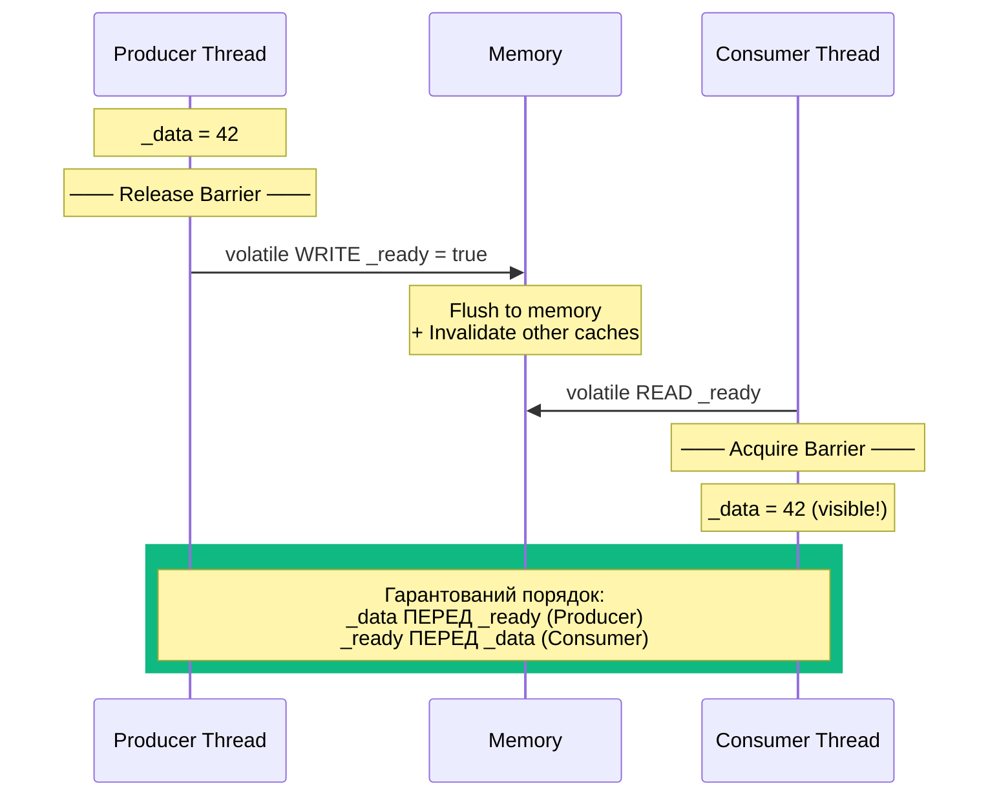
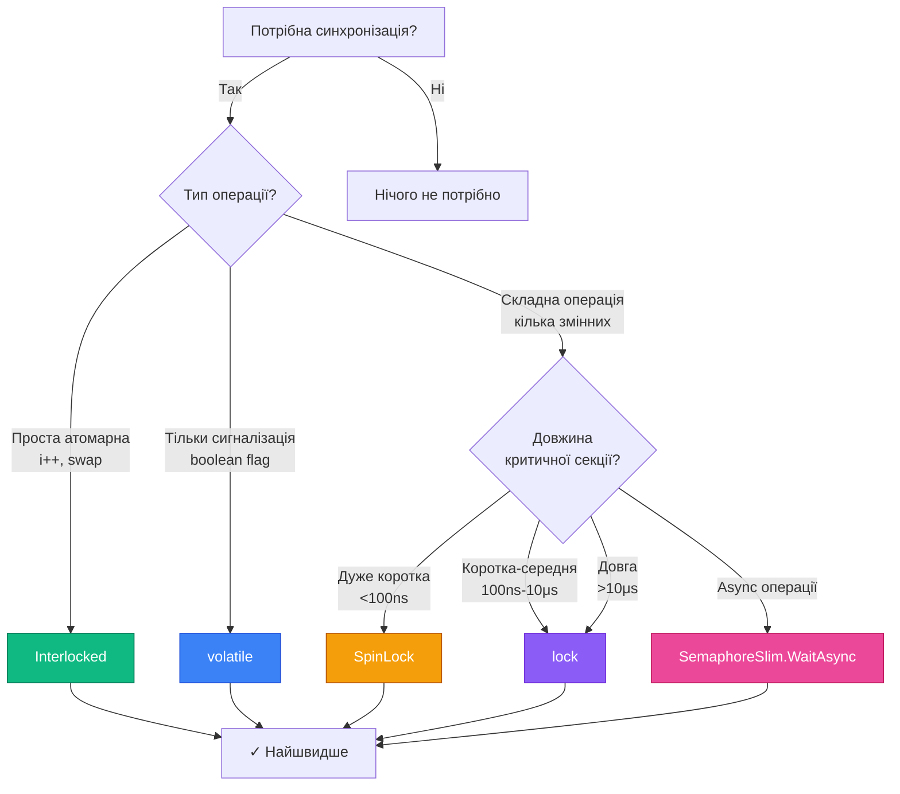

# Volatile, Memory Model та Spinning

## Проблема: Compiler та CPU Reordering

У попередній темі ми розглянули `Interlocked` — атомарні операції що гарантують що **одна** операція виконається неподільно. Але що якщо у нас **кілька** операцій і важливий їхній **порядок**?

Сучасні компілятори та CPU **переставляють інструкції** для оптимізації. Це абсолютно безпечно для однопотокового коду, але може зламати багатопотоковий:

```csharp showLineNumbers [ReorderingProblem.cs]
// ❌ БЕЗ синхронізації — може не працювати!
class DataExchange
{
    private int _data = 0;
    private bool _ready = false;

    // Thread 1 (Producer):
    public void Produce()
    {
        _data = 42;           // 1. Записуємо дані
        _ready = true;        // 2. Сигналізуємо що готово
    }

    // Thread 2 (Consumer):
    public void Consume()
    {
        while (!_ready) { }   // 3. Чекаємо сигнал
        Console.WriteLine(_data);  // 4. Читаємо дані
    }
}
```

**Що може піти не так?**

**Проблема 1: Compiler Caching** — компілятор може закешувати `_ready` у регістрі CPU:

```asm
; Consumer thread:
MOV EAX, [_ready]    ; Завантажити _ready у регістр EAX
loop:
  TEST EAX, EAX      ; Перевірити EAX (не перечитує з пам'яті!)
  JZ loop            ; Якщо 0 → loop
; ← Нескінченний цикл! Ніколи не побачить зміну _ready
```

**Проблема 2: CPU Reordering** — CPU може переставити інструкції:

```
Producer:                Consumer:
─────────────────────────────────────────
_ready = true;  (2)      while (!_ready) {}  (3)
_data = 42;     (1)      Console.WriteLine(_data);  (4)
                         ↑ Може побачити _ready=true
                           але _data=0 (старе значення!)
```

**Проблема 3: Cache Coherency Delay** — зміни у L1 cache одного core не миттєво видимі іншим cores:

```
CPU Core 1 (Producer)         CPU Core 2 (Consumer)
─────────────────────────────────────────────────────
_data = 42 (у L1 cache)
_ready = true (у L1 cache)
                              while (!_ready) {}
                              ← Читає _ready з свого L1 cache
                                 (досі false, invalidation ще не прийшла!)
```

---

## volatile Keyword: Що Він Робить

### Гарантії volatile

`volatile` keyword у C# надає **дві** ключові гарантії:

**1. Заборона Compiler Caching** — компілятор **завжди** читає/пише з/у пам'ять, не кешує у регістрах:

```csharp
private volatile bool _ready;

// Компілятор згенерує:
while (!_ready) { }
// ↓
loop:
  MOV EAX, [_ready]    ; Перечитувати з пам'яті КОЖНОЇ ітерації
  TEST EAX, EAX
  JZ loop
```

**2. Memory Ordering (Acquire/Release Semantics)**:

- **volatile READ** = **Acquire barrier**: всі операції **ПІСЛЯ** нього не можуть бути переставлені **ПЕРЕД**
- **volatile WRITE** = **Release barrier**: всі операції **ПЕРЕД** ним не можуть бути переставлені **ПІСЛЯ**

### Виправлений Приклад

```csharp showLineNumbers [VolatileFixed.cs]
class DataExchange
{
    private int _data = 0;
    private volatile bool _ready = false;  // ← volatile keyword

    // Thread 1 (Producer):
    public void Produce()
    {
        _data = 42;           // 1. Записуємо дані
        _ready = true;        // 2. volatile WRITE (release barrier)
        // ↑ Гарантує що _data записаний ДО _ready
    }

    // Thread 2 (Consumer):
    public void Consume()
    {
        while (!_ready) { }   // 3. volatile READ (acquire barrier)
        // ↑ Гарантує що _data прочитаний ПІСЛЯ _ready

        Console.WriteLine(_data);  // 4. Завжди побачить 42 ✓
    }
}
```

**Чому це працює?**

1. Producer: `_data = 42` не може бути переставлений **після** `_ready = true` (release barrier)
2. Consumer: `Console.WriteLine(_data)` не може бути переставлений **перед** `while (!_ready)` (acquire barrier)
3. Результат: Consumer **гарантовано** побачить `_data = 42` після того як побачить `_ready = true`

### Візуалізація Acquire/Release

::mermaid



::

---

## Що volatile НЕ Робить

### Поширена Помилка: volatile НЕ Дає Atomicity

::caution
**Критична помилка**: `volatile` НЕ робить операції атомарними!
::

```csharp showLineNumbers [VolatileMisuse.cs]
// ❌ НЕБЕЗПЕЧНО — volatile НЕ допомагає тут!
private volatile int _counter = 0;

Parallel.For(0, 10_000, _ =>
{
    _counter++;  // ← Досі НЕ атомарна операція!
    // Компілюється у: temp = _counter; temp++; _counter = temp;
    // volatile гарантує що читання/запис не кешуються,
    // але НЕ гарантує що вся операція виконається атомарно!
});

Console.WriteLine(_counter);  // Race condition, результат < 10000

// ✅ ПРАВИЛЬНО:
private int _counter = 0;  // volatile не потрібен з Interlocked

Parallel.For(0, 10_000, _ =>
{
    Interlocked.Increment(ref _counter);  // Атомарна операція
});
```

### Порівняння: volatile vs Interlocked vs lock

| Аспект                | volatile                    | Interlocked       | lock                      |
| --------------------- | --------------------------- | ----------------- | ------------------------- |
| **Atomicity**         | ❌ Ні                       | ✅ Так            | ✅ Так                    |
| **Memory Ordering**   | ✅ Acquire/Release          | ✅ Full barrier   | ✅ Full barrier           |
| **Compiler Caching**  | ✅ Заборонено               | ✅ Заборонено     | ✅ Заборонено             |
| **CPU Overhead**      | ~1-2ns                      | ~5-20ns           | ~50-200ns                 |
| **Use Case**          | Boolean flags, simple state | Simple atomic ops | Complex critical sections |
| **Підходить для RMW** | ❌ Ні                       | ✅ Так            | ✅ Так                    |

**RMW** = Read-Modify-Write (наприклад, `i++`, `i += 5`)

### Коли Використовувати volatile

✅ **Правильні use cases**:

```csharp
// 1. Boolean flags для сигналізації
private volatile bool _shouldStop = false;

// 2. Simple state variables (enum)
private volatile ConnectionState _state = ConnectionState.Disconnected;

// 3. Reference swap (але Interlocked.Exchange краще)
private volatile Config? _currentConfig;
```

❌ **Неправильні use cases**:

```csharp
// 1. Лічильники (потрібен Interlocked)
private volatile int _counter = 0;
_counter++;  // ❌ Race condition

// 2. Складні операції (потрібен lock)
private volatile decimal _balance = 0;
_balance += amount;  // ❌ Race condition

// 3. Кілька пов'язаних змінних (потрібен lock)
private volatile int _x = 0;
private volatile int _y = 0;
// Інваріант: _x == _y
_x = 10;  // ← Між цими двома операціями
_y = 10;  // ← інший потік може побачити _x != _y
```

---

## .NET Memory Model: Happens-Before Relationship

### Що Таке Memory Model

**Memory Model** — набір правил що визначають коли зміни зроблені одним потоком стають видимими іншим потокам. Це контракт між:

- **Програмістом**: "Я дотримуюсь цих правил"
- **Компілятором та CPU**: "Я гарантую ці видимості"

### Happens-Before Relationship

**Happens-Before** — відношення порядку між операціями:

> Якщо операція A **happens-before** операція B, то результат A **гарантовано видимий** для B.

**Приклад**:

```csharp
int x = 0;
volatile bool ready = false;

// Thread 1:
x = 42;           // A
ready = true;     // B (volatile write)

// Thread 2:
if (ready)        // C (volatile read)
{
    print(x);     // D
}
```

**Happens-Before ланцюжок**:

1. `A happens-before B` (release barrier: все перед volatile write)
2. `B happens-before C` (volatile write → volatile read)
3. `C happens-before D` (acquire barrier: все після volatile read)
4. **Транзитивність**: `A happens-before D` → Thread 2 побачить `x = 42` ✓

### Acquire та Release Semantics

**Release Semantics** (volatile write, `Interlocked.*`, `lock` exit):

- Всі операції **перед** release не можуть бути переставлені **після**
- "Публікує" всі попередні зміни іншим потокам

**Acquire Semantics** (volatile read, `Interlocked.*`, `lock` enter):

- Всі операції **після** acquire не можуть бути переставлені **перед**
- "Бачить" всі зміни опубліковані через release

**Візуалізація**:

```
Thread 1 (Producer):          Thread 2 (Consumer):
────────────────────────────────────────────────────
x = 1;
y = 2;
z = 3;
─── Release Barrier ───
ready = true; (volatile)  ──→ while (!ready) {} (volatile)
                              ─── Acquire Barrier ───
                              print(x, y, z);
                              ↑ Гарантовано побачить 1, 2, 3
```

---

## Thread.MemoryBarrier: Повний Контроль

### Що Таке Memory Barrier (Fence)

**Memory Barrier** (або **Memory Fence**) — інструкція CPU що забороняє reordering навколо себе. `Thread.MemoryBarrier()` = **full fence**:

- Всі операції **ДО** нього завершаться перш ніж почнуться операції **ПІСЛЯ**
- Flush store buffers → зміни стають видимими іншим cores
- Invalidate caches → наступні reads побачать свіжі дані

### Синтаксис та Приклад

```csharp showLineNumbers [MemoryBarrier.cs]
using System.Threading;

class DataExchange
{
    private int _data;
    private bool _ready;

    public void Writer()
    {
        _data = 42;
        Thread.MemoryBarrier();  // ← Full fence: _data записаний ДО _ready
        _ready = true;
    }

    public int Reader()
    {
        while (!_ready) { }
        Thread.MemoryBarrier();  // ← Full fence: _ready прочитаний ДО _data
        return _data;  // Гарантовано 42
    }
}
```

### Еквівалент через volatile

```csharp showLineNumbers [VolatileEquivalent.cs]
// Попередній приклад еквівалентний:
class DataExchange
{
    private int _data;
    private volatile bool _ready;  // volatile = implicit barriers

    public void Writer()
    {
        _data = 42;
        _ready = true;  // volatile write = release barrier
    }

    public int Reader()
    {
        while (!_ready) { }  // volatile read = acquire barrier
        return _data;
    }
}
```

::note
У більшості прикладного коду `Thread.MemoryBarrier()` не потрібен — `volatile`, `Interlocked`, `lock` вже мають вбудовані barriers. Використовується у низькорівневих бібліотеках та lock-free структурах.
::

### Типи Memory Barriers

У деяких платформах (не .NET) є різні типи barriers:

| Тип            | Що забороняє                                               | Use Case                 |
| -------------- | ---------------------------------------------------------- | ------------------------ |
| **LoadLoad**   | Load перед barrier не може бути після Load після barrier   | Читання залежних даних   |
| **StoreStore** | Store перед barrier не може бути після Store після barrier | Публікація даних         |
| **LoadStore**  | Load перед не може бути після Store після                  | Acquire semantics        |
| **StoreLoad**  | Store перед не може бути після Load після                  | Release semantics        |
| **Full Fence** | Забороняє всі reorderings                                  | `Thread.MemoryBarrier()` |

**.NET спрощує**: `Thread.MemoryBarrier()` = full fence, `volatile` = acquire/release.

---

## SpinLock: User-Mode Spinning

### Коли Spinning Краще За Blocking

**Spinning** — потік активно чекає у циклі (busy-wait) замість переходу у wait state. Це має сенс коли:

✅ **Коли використовувати**:

- Критична секція **дуже коротка** (<100 наносекунд)
- Очікування **дуже коротке** (lock звільниться за <1 мікросекунду)
- Є **вільні CPU cores** (інакше spinning = марна трата CPU)
- **Висока частота** операцій (мільйони ops/sec)

❌ **Коли НЕ використовувати**:

- Довга критична секція (>1 мікросекунда)
- Невідома тривалість очікування
- Обмежена кількість CPU cores
- I/O операції всередині критичної секції

**Trade-off**: Spinning витрачає CPU але уникає context switch (~1-10μs overhead).

### SpinLock: Легковаговий Lock

```csharp showLineNumbers [SpinLockBasics.cs]
using System.Threading;

// ⚠️ SpinLock — struct (не class!), передавати через ref
private SpinLock _spinLock = new SpinLock(enableThreadOwnerTracking: false);
// enableThreadOwnerTracking=true: додає перевірки (повільніше), для debugging

public void CriticalSection()
{
    bool lockTaken = false;
    try
    {
        _spinLock.Enter(ref lockTaken);  // ← Spinning поки не захопить

        // Критична секція — має бути ДУЖЕ короткою!
        _sharedCounter++;
    }
    finally
    {
        if (lockTaken)
            _spinLock.Exit();  // ← ОБОВ'ЯЗКОВО у finally
    }
}

// TryEnter з timeout:
public bool TryCriticalSection(int timeoutMs)
{
    bool lockTaken = false;
    try
    {
        _spinLock.TryEnter(timeoutMs, ref lockTaken);
        if (!lockTaken) return false;

        _sharedCounter++;
        return true;
    }
    finally
    {
        if (lockTaken) _spinLock.Exit();
    }
}
```

::warning
**SpinLock небезпечний при неправильному використанні**:

- ❌ Довга критична секція → марна трата CPU (100% usage)
- ❌ Вкладені SpinLock → deadlock (не рекурсивний)
- ❌ Забули `Exit()` → інші потоки спінять вічно
- ❌ Передали SpinLock за значенням (не `ref`) → копія, не працює!

::

### Під Капотом: Як Працює SpinLock

```csharp
// Спрощена реалізація SpinLock:
public struct SpinLock
{
    private int _owner;  // 0 = вільний, ThreadId = зайнятий

    public void Enter(ref bool lockTaken)
    {
        int threadId = Environment.CurrentManagedThreadId;

        // Спроба швидкого захоплення (без spinning)
        if (Interlocked.CompareExchange(ref _owner, threadId, 0) == 0)
        {
            lockTaken = true;
            return;
        }

        // Повільний шлях: spinning
        SpinWait spinner = new SpinWait();
        while (true)
        {
            // Adaptive spinning (детально нижче)
            spinner.SpinOnce();

            // Спроба захопити знову
            if (Interlocked.CompareExchange(ref _owner, threadId, 0) == 0)
            {
                lockTaken = true;
                return;
            }
        }
    }

    public void Exit()
    {
        Interlocked.Exchange(ref _owner, 0);  // Звільнити
    }
}
```

---

## SpinWait: Adaptive Spinning

### Концепція

`SpinWait` — "розумний" spinning що **адаптується** до ситуації:

1. **Спочатку**: швидкий tight loop (CPU-bound spin)
2. **Потім**: `Thread.Yield()` (дати шанс іншим потокам на цьому core)
3. **Нарешті**: `Thread.Sleep(0)` або `Sleep(1)` (kernel transition, дати шанс іншим cores)

Це дозволяє балансувати між **низькою латентністю** (tight loop) та **CPU efficiency** (yield/sleep).

### Синтаксис

```csharp showLineNumbers [SpinWaitPattern.cs]
using System.Threading;

// Патерн: чекати поки умова стане true
private volatile bool _condition = false;

public void WaitForCondition()
{
    var spinner = new SpinWait();

    while (!_condition)
    {
        spinner.SpinOnce();  // ← Adaptive: spin → yield → sleep
    }
}

// SpinUntil: helper для простих умов
public void WaitForConditionSimple()
{
    SpinWait.SpinUntil(() => _condition);  // Еквівалент циклу вище

    // З timeout:
    bool success = SpinWait.SpinUntil(() => _condition, TimeSpan.FromSeconds(5));
    if (!success)
        throw new TimeoutException("Condition not met within 5 seconds");
}
```

### Як Працює SpinOnce()

```csharp
// Спрощена логіка SpinWait.SpinOnce():
public struct SpinWait
{
    private int _count;

    public void SpinOnce()
    {
        if (_count < 10)
        {
            // Ітерації 0-9: Tight loop (CPU-bound spin)
            Thread.SpinWait(4 << _count);  // Exponential backoff
            // SpinWait(N) = N iterations of NOP instruction
        }
        else if (_count < 20)
        {
            // Ітерації 10-19: Thread.Yield()
            Thread.Yield();  // Дати шанс іншим потокам на цьому core
        }
        else
        {
            // Ітерації 20+: Thread.Sleep()
            Thread.Sleep(_count >= 40 ? 1 : 0);
            // Sleep(0) = yield to any thread (same or higher priority)
            // Sleep(1) = yield to any thread + minimum 1ms delay
        }

        _count++;
    }
}
```

**Exponential Backoff**: кожна ітерація чекає довше → зменшує contention.

### Benchmark: lock vs SpinLock vs Interlocked

```csharp showLineNumbers [SpinningBenchmark.cs]
using System;
using System.Diagnostics;
using System.Threading;
using System.Threading.Tasks;

const int Iterations = 10_000_000;
int counter = 0;

// ─── Test 1: lock (Monitor) ───────────────────────────────────
var lockObj = new object();
var sw = Stopwatch.StartNew();

Parallel.For(0, Iterations, _ =>
{
    lock (lockObj) { counter++; }
});

sw.Stop();
Console.WriteLine($"lock:        {sw.ElapsedMilliseconds,5}ms, counter={counter}");

// ─── Test 2: SpinLock ─────────────────────────────────────────
counter = 0;
var spinLock = new SpinLock(false);
sw.Restart();

Parallel.For(0, Iterations, _ =>
{
    bool taken = false;
    try
    {
        spinLock.Enter(ref taken);
        counter++;
    }
    finally { if (taken) spinLock.Exit(); }
});

sw.Stop();
Console.WriteLine($"SpinLock:    {sw.ElapsedMilliseconds,5}ms, counter={counter}");

// ─── Test 3: Interlocked ──────────────────────────────────────
counter = 0;
sw.Restart();

Parallel.For(0, Iterations, _ =>
{
    Interlocked.Increment(ref counter);
});

sw.Stop();
Console.WriteLine($"Interlocked: {sw.ElapsedMilliseconds,5}ms, counter={counter}");

// Типові результати (8 cores, дуже коротка критична секція):
// lock:         1200ms
// SpinLock:      600ms (в 2x швидше)
// Interlocked:    80ms (в 15x швидше — найкраще для простих операцій)
```

---

## ABA Problem: Підводний Камінь Lock-Free

### Що Таке ABA Problem

**ABA Problem** — класична проблема CAS-based структур. Виникає коли:

1. Thread A читає значення `A`
2. Thread B змінює `A → B → A` (повертає назад!)
3. Thread A робить CAS: "якщо досі `A` → замінити" → **SUCCESS** (бо значення співпало)
4. Але структура **змінилась** між кроками 1-3 → **corruption**!

### Приклад: Lock-Free Stack

```csharp showLineNumbers [ABAProblem.cs]
// Сценарій з lock-free stack:
// Initial: head → [A] → [B] → [C] → null

// Thread 1: Pop()
Node? current = _head;  // current = [A]
// ← PREEMPTED (зупинився тут)

// Thread 2: Pop(), Pop(), Push(A)
TryPop(out _);  // Pop [A], head → [B]
TryPop(out _);  // Pop [B], head → [C]
Push(A);        // Push [A], head → [A] → [C]
// Тепер: head → [A] → [C] → null (але це ІНШИЙ [A]!)

// Thread 1: продовжує
// CAS(head, current.Next, current)
// CAS(head, [B], [A]) → SUCCESS! (бо head == [A])
// head = [B]
// Результат: head → [B] → ??? (CORRUPTION! [B] вже не в стеку)
```

**Проблема**: CAS перевіряє тільки **значення**, не **ідентичність**. Якщо значення повернулось до `A` — CAS не помітить що це **інший** `A`.

### Рішення 1: Version Counter (Tagged Pointer)

Додати лічильник версій що інкрементується при кожній зміні:

```csharp showLineNumbers [VersionedNode.cs]
private class VersionedNode<T>
{
    public T Value;
    public VersionedNode<T>? Next;
    public long Version;  // ← Інкрементується при кожній зміні
}

private VersionedNode<T>? _head;
private long _version = 0;

public void Push(T item)
{
    var newNode = new VersionedNode<T>
    {
        Value = item,
        Version = Interlocked.Increment(ref _version)  // Нова версія
    };

    do
    {
        newNode.Next = _head;
    }
    while (Interlocked.CompareExchange(ref _head, newNode, newNode.Next) != newNode.Next);
}

// Тепер навіть якщо адреса співпала — версія буде інша → CAS fail ✓
```

### Рішення 2: Hazard Pointers

Складний механізм що "захищає" вказівники від reuse поки хтось їх використовує. Використовується у production lock-free бібліотеках.

### Рішення 3: Garbage Collection (C# Advantage!)

У C# ABA problem **менш критичний** бо:

- GC не дозволяє reuse адрес одразу після звільнення
- Об'єкт залишається живим поки хтось тримає reference
- Між "звільненням" та "reuse" проходить час (GC collection)

Але для **критичних систем** — використовуйте готові бібліотеки:

::tip
Для production коду використовуйте `System.Collections.Concurrent.ConcurrentStack<T>` — він вже має всі оптимізації та захист від ABA. Власні lock-free структури — тільки для навчання або специфічних потреб.
::

---

## Підсумок

::card-group

::card{title="volatile" icon="i-lucide-eye"}

- Заборона compiler caching та reordering
- Acquire/Release semantics для memory ordering
- ❌ НЕ робить операції атомарними (i++ досі небезпечний)
- Використання: boolean flags, simple state variables

::

::card{title="Memory Model" icon="i-lucide-git-branch"}

- Happens-Before relationship: порядок видимості змін
- Acquire semantics: операції після не можуть бути перед
- Release semantics: операції перед не можуть бути після
- Full fence: `Thread.MemoryBarrier()` — заборона всіх reorderings

::

::card{title="SpinLock / SpinWait" icon="i-lucide-rotate-cw"}

- User-mode spinning замість kernel blocking
- Краще за lock для ДУЖЕ коротких критичних секцій (<100ns)
- SpinWait — adaptive: spin → yield → sleep
- ⚠️ Марна трата CPU якщо очікування довге

::

::card{title="ABA Problem" icon="i-lucide-alert-triangle"}

- CAS перевіряє значення, не ідентичність
- A → B → A виглядає як "не змінилось"
- Рішення: version counter, hazard pointers, GC
- Production: використовуйте `System.Collections.Concurrent.*`

::

::

---

## Практичні Завдання

### Рівень 1: Volatile Flag Demo

Створіть демонстрацію проблеми compiler caching:

1. **Без volatile**: Producer встановлює flag, Consumer чекає у циклі
    - Запустіть у Release mode з оптимізаціями
    - Consumer має "зависнути" (нескінченний цикл)

2. **З volatile**: Додайте `volatile` keyword
    - Consumer має коректно побачити зміну

3. **Benchmark**: Виміряйте overhead volatile
    - 1 мільярд читань з/без volatile
    - Порівняйте час

### Рівень 2: SpinLock vs lock Benchmark

Створіть benchmark для різних довжин критичних секцій:

**Структура**:

```csharp
public class CriticalSectionBenchmark
{
    private int _counter = 0;
    private object _lockObj = new();
    private SpinLock _spinLock = new(false);

    public void TestLock(int operationsCount)
    {
        // Різні довжини критичних секцій:
        // 1. Дуже коротка: 1 інкремент
        // 2. Коротка: 10 операцій
        // 3. Середня: 100 операцій + array access
        // 4. Довга: 1000 операцій + Thread.SpinWait
    }
}
```

**Вимоги**:

1. Реалізуйте 4 сценарії з різною довжиною критичної секції
2. Для кожного виміряйте: lock vs SpinLock
3. Запустіть на 8 потоках × 1_000_000 ітерацій
4. Виведіть throughput (ops/sec) та CPU usage

**Очікуваний результат**:

- Дуже коротка: SpinLock швидше в 2-3x
- Коротка: SpinLock швидше в 1.5-2x
- Середня: приблизно однаково
- Довга: lock швидше (SpinLock марнує CPU)

**Висновок**: Визначте "точку перелому" — при якій довжині критичної секції lock стає кращим за SpinLock.

### Рівень 3: ABA Problem Simulator

Створіть демонстрацію ABA problem:

**Частина 1: Vulnerable Stack**

```csharp
public class VulnerableStack<T>
{
    private Node? _head;

    // Реалізуйте Push/Pop через CAS
    // Додайте штучну затримку у Pop для провокації ABA
}
```

**Частина 2: ABA Scenario**

```csharp
// Thread 1: Pop з затримкою
var thread1 = new Thread(() =>
{
    Node? current = _head;
    Thread.Sleep(100);  // ← Затримка для провокації
    // Спроба CAS...
});

// Thread 2: Pop, Pop, Push (створює ABA)
var thread2 = new Thread(() =>
{
    stack.TryPop(out _);
    stack.TryPop(out _);
    stack.Push(originalValue);  // Повертає той самий value
});
```

**Частина 3: Fixed Stack з Version Counter**

```csharp
public class VersionedStack<T>
{
    private class Node
    {
        public T Value;
        public Node? Next;
        public long Version;
    }

    // Реалізуйте з version counter
}
```

**Вимоги**:

1. Продемонструйте corruption у VulnerableStack
2. Доведіть що VersionedStack не має проблеми
3. Додайте статистику: скільки разів спрацював ABA detection
4. Benchmark: порівняйте overhead версіонування

---

## Додаткові Матеріали

### Double-Checked Locking Pattern

Класичний патерн для lazy initialization з мінімальним overhead:

```csharp showLineNumbers [DoubleCheckedLocking.cs]
public class Singleton
{
    private static volatile Singleton? _instance;
    private static readonly object _lock = new();

    public static Singleton Instance
    {
        get
        {
            // Перша перевірка (без lock) — швидкий шлях
            if (_instance == null)
            {
                lock (_lock)
                {
                    // Друга перевірка (під lock) — безпечний шлях
                    if (_instance == null)
                    {
                        _instance = new Singleton();
                    }
                }
            }

            return _instance;
        }
    }
}
```

**Чому потрібен volatile?**

- Без `volatile`: Thread 2 може побачити частково ініціалізований об'єкт
- З `volatile`: Release barrier гарантує що конструктор завершився

**Сучасна альтернатива**: `Lazy<T>` (рекомендовано)

```csharp
private static readonly Lazy<Singleton> _instance =
    new Lazy<Singleton>(() => new Singleton());

public static Singleton Instance => _instance.Value;
```

### Lock-Free vs Wait-Free

**Lock-Free** — гарантує що **хоча б один** потік прогресує (може бути starvation):

```csharp
// CAS loop — lock-free
do
{
    current = _value;
    newValue = current + 1;
}
while (Interlocked.CompareExchange(ref _value, newValue, current) != current);
// ↑ Якщо багато потоків — один може retry нескінченно (starvation)
```

**Wait-Free** — гарантує що **кожен** потік прогресує за обмежену кількість кроків:

```csharp
// Interlocked.Increment — wait-free
Interlocked.Increment(ref _value);
// ↑ Завжди завершується за O(1) кроків, незалежно від contention
```

**Порівняння**:
| Аспект | Lock-Free | Wait-Free |
|--------|-----------|-----------|
| **Прогрес** | Хоча б один потік | Кожен потік |
| **Starvation** | Можлива | Неможлива |
| **Складність** | Середня | Висока |
| **Performance** | Добра | Відмінна |
| **Приклади** | CAS loop, Treiber stack | Interlocked ops, FAA |

**FAA** = Fetch-And-Add (атомарне додавання з поверненням старого значення)

### Memory Ordering на Різних Платформах

| Платформа   | Model                   | Особливості                                   |
| ----------- | ----------------------- | --------------------------------------------- |
| **x86/x64** | TSO (Total Store Order) | Сильна модель, мало reordering                |
| **ARM**     | Weak                    | Багато reordering, потрібні explicit barriers |
| **ARM64**   | Weak                    | Acquire/Release instructions                  |
| **RISC-V**  | RVWMO                   | Слабка модель                                 |

**.NET абстрагує**: `volatile`, `Interlocked`, `lock` працюють однаково на всіх платформах.

### Debugging Lock-Free Code

**Інструменти**:

1. **ThreadSanitizer** (TSan) — детектор data races (C/C++, частково .NET)
2. **Concurrency Visualizer** (Visual Studio) — візуалізація потоків
3. **ETW Events** — низькорівневі події синхронізації
4. **WinDbg** — аналіз дампів з deadlock/corruption

**Best Practices**:

```csharp
// 1. Додайте assertions
Debug.Assert(Interlocked.CompareExchange(ref _value, 0, 0) >= 0);

// 2. Логуйте retries
int retries = 0;
do
{
    if (++retries > 1000)
        Console.WriteLine($"High contention: {retries} retries");
}
while (/* CAS */);

// 3. Stress testing
Parallel.For(0, 1_000_000, _ => /* операція */);

// 4. Використовуйте Thread.Yield() для провокації race conditions
Thread.Yield();  // Дати шанс іншим потокам "зламати" код
```

### Коли Використовувати Що

**Блок-схема вибору примітива**:

::mermaid



::

**Рекомендації**:

1. **Interlocked** — для простих атомарних операцій (лічильники, flags)
2. **volatile** — для boolean flags сигналізації (рідко потрібен)
3. **SpinLock** — для дуже коротких критичних секцій на багатоядерних системах
4. **lock** — для більшості випадків (default choice)
5. **SemaphoreSlim** — для async-сумісної синхронізації
6. **Lock-free структури** — тільки якщо profiling показав що lock = bottleneck

---

## Висновок

У цій темі ми розглянули **низькорівневі механізми** синхронізації:

**volatile** — забороняє compiler caching та надає acquire/release semantics, але **НЕ** дає atomicity. Використовуйте для boolean flags.

**Memory Model** — правила видимості змін між потоками. Happens-before relationship гарантує порядок операцій через acquire/release barriers.

**Thread.MemoryBarrier** — full fence для повного контролю над reordering. Рідко потрібен у прикладному коді.

**SpinLock/SpinWait** — user-mode spinning для дуже коротких критичних секцій. Швидше за lock але марнує CPU.

**ABA Problem** — підводний камінь lock-free структур. Рішення: version counter, hazard pointers, або використання готових бібліотек.

**Золоте правило**: Почніть з `lock`, оптимізуйте тільки якщо profiling показав bottleneck. Передчасна оптимізація — корінь усього зла.

::tip
**Для production коду**: Використовуйте `System.Collections.Concurrent.*` замість власних lock-free структур. Вони вже мають всі оптимізації, захист від ABA та протестовані на мільйонах систем.
::

---

## Корисні Посилання

**Документація**:

- [volatile (C# Reference)](https://learn.microsoft.com/en-us/dotnet/csharp/language-reference/keywords/volatile)
- [Interlocked Class](https://learn.microsoft.com/en-us/dotnet/api/system.threading.interlocked)
- [SpinLock Struct](https://learn.microsoft.com/en-us/dotnet/api/system.threading.spinlock)
- [.NET Memory Model](https://github.com/dotnet/runtime/blob/main/docs/design/specs/Memory-model.md)

**Книги**:

- "C# 12 in a Nutshell" (Joseph Albahari) — Chapter 14: Concurrency
- "Concurrent Programming on Windows" (Joe Duffy) — детальний розбір Windows threading
- "The Art of Multiprocessor Programming" (Herlihy & Shavit) — теорія lock-free

**Статті**:

- [Preshing on Programming: Memory Ordering](https://preshing.com/20120913/acquire-and-release-semantics/)
- [Herb Sutter: atomic Weapons](https://herbsutter.com/2013/02/11/atomic-weapons-the-c-memory-model-and-modern-hardware/)
- [Igor Ostrovsky: .NET Memory Model](https://igoro.com/archive/volatile-keyword-in-c-memory-model-explained/)

```

```
