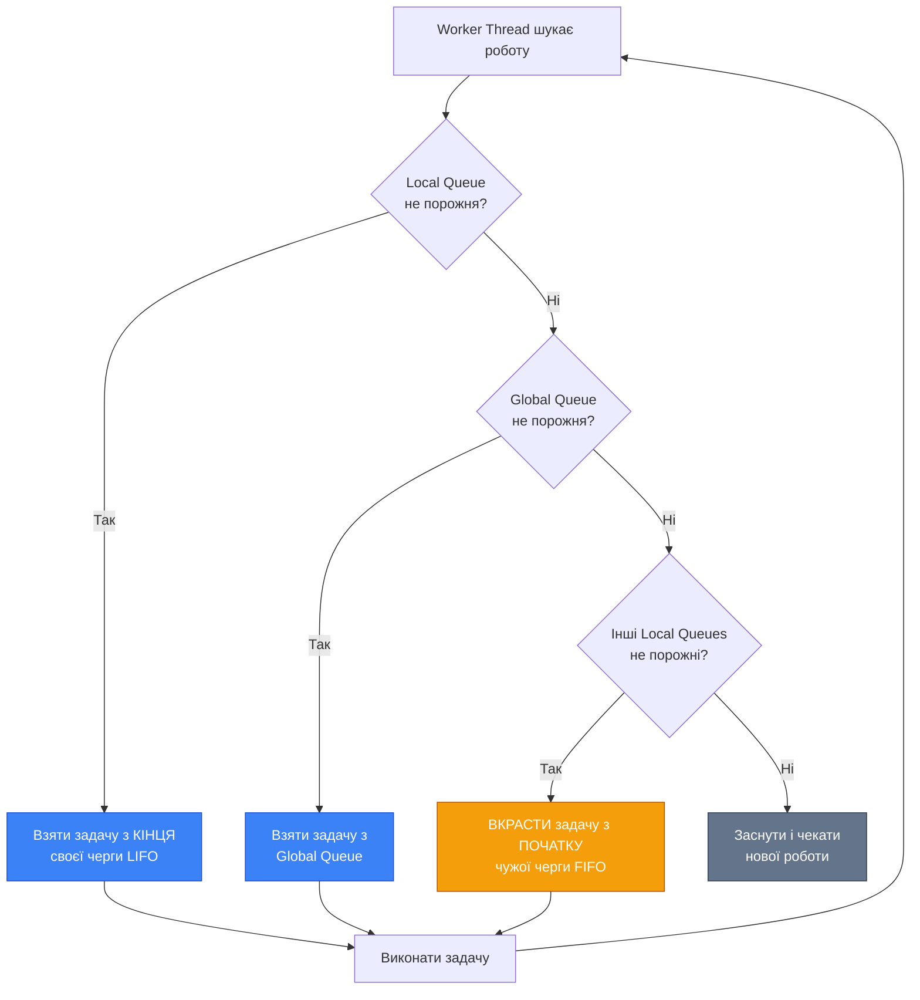

# ThreadPool — Пул Потоків

## Вступ: Чому Створювати Thread — Дорого?

Ви вже знаєте як створювати потоки через `new Thread()` і запускати їх. Здається — нічого складного: потрібен паралелізм → створюємо потік → виконуємо роботу → потік завершується. Але є фундаментальна проблема з цим підходом: **створення потоку — це дорога операція**.

### Вартість Створення Потоку

Коли ви викликаєте `new Thread()` і `Start()`, операційна система виконує наступні кроки:

1. **Виділення стеку** — за замовчуванням ~1 MB віртуальної пам'яті (на Windows x64). Це не означає що 1 MB фізичної RAM одразу займається, але адресний простір резервується.

2. **Створення kernel object** — Thread є kernel-level об'єктом. ОС створює структури даних у kernel space: Thread Control Block (TCB), який містить стан потоку, пріоритет, affinity mask, security context.

3. **Ініціалізація TEB/TLS** — Thread Environment Block (user-mode структура) та Thread Local Storage (для змінних `[ThreadStatic]`).

4. **Реєстрація у планувальнику** — потік додається до черги планувальника ОС, що також має overhead.

5. **Context switch** — перемикання на новий потік вимагає збереження стану попереднього потоку (регістри, instruction pointer) та завантаження стану нового.

Весь цей процес займає **десятки мікросекунд** (на сучасному CPU ~20-50 μs). Це може здаватися швидко, але якщо ваша задача виконується за 100 μs — половина часу йде на overhead створення потоку!

### Benchmark: Thread vs ThreadPool

Продемонструємо різницю:

```csharp showLineNumbers [ThreadCreationBenchmark.cs]
using System.Diagnostics;

const int TaskCount = 10_000;

// Benchmark 1: Створення нових потоків
var sw1 = Stopwatch.StartNew();
var threads = new Thread[TaskCount];

for (int i = 0; i < TaskCount; i++)
{
    threads[i] = new Thread(() => { /* мінімальна робота */ });
    threads[i].Start();
}

foreach (var t in threads)
    t.Join();

sw1.Stop();
Console.WriteLine($"new Thread() × {TaskCount}: {sw1.ElapsedMilliseconds}ms");

// Benchmark 2: ThreadPool
var sw2 = Stopwatch.StartNew();
var countdown = new CountdownEvent(TaskCount);

for (int i = 0; i < TaskCount; i++)
{
    ThreadPool.QueueUserWorkItem(_ =>
    {
        // мінімальна робота
        countdown.Signal();
    });
}

countdown.Wait();
sw2.Stop();
Console.WriteLine($"ThreadPool × {TaskCount}: {sw2.ElapsedMilliseconds}ms");

Console.WriteLine($"Прискорення: {sw1.ElapsedMilliseconds / (double)sw2.ElapsedMilliseconds:F1}x");
```

::terminal-preview{title="Thread Creation Benchmark"}

<div class="line"><span class="opacity-40">$</span> <strong class="font-bold">dotnet run -c Release</strong></div>
<div class="line">new Thread() × 10,000: <span class="text-red-400 font-bold">8,247ms</span></div>
<div class="line">ThreadPool × 10,000: <span class="text-green-400 font-bold">142ms</span></div>
<div class="line">Прискорення: <span class="text-blue-400 font-bold">58.1x</span></div>
<div class="line"></div>
<div class="line"><span class="text-gray-400">ThreadPool на два порядки швидший для коротких задач!</span></div>
::

### Аналогія: Таксі vs Автобус

Уявіть собі транспортну систему міста:

**`new Thread()`** — це як викликати окреме таксі для кожного пасажира. Кожен пасажир отримує власний автомобіль (потік), який їде саме туди куди потрібно. Це гнучко, але дорого: треба чекати поки таксі приїде (створення потоку), оплачувати кожну поїздку окремо, і після поїздки таксі їде назад на базу (знищення потоку).

**`ThreadPool`** — це як автобусна система. Є фіксована кількість автобусів (потоків), що постійно курсують містом. Пасажири (задачі) чекають на зупинці (черга), сідають у перший вільний автобус і їдуть. Після висадки автобус не зникає — він продовжує маршрут і бере наступних пасажирів. Набагато ефективніше для великої кількості коротких поїздок.

---

## Архітектура ThreadPool

### Два Типи Потоків у Пулі

ThreadPool у .NET насправді складається з **двох окремих пулів**:


**1. Worker Threads** — для CPU-bound роботи:

- Виконують задачі поставлені через `ThreadPool.QueueUserWorkItem()`, `Task.Run()`, `Parallel.For()` тощо
- Кількість динамічно регулюється алгоритмом Hill Climbing (детально нижче)
- За замовчуванням: мінімум = кількість CPU cores, максимум = 32767 (теоретично)

**2. I/O Completion Port (IOCP) Threads** — для I/O-bound роботи:

- Обслуговують асинхронні I/O операції (файли, мережа, pipes)
- Використовують Windows IOCP механізм — kernel-level черга завершених I/O операцій
- Не виконують CPU-bound код — лише обробляють callbacks після завершення I/O
- Кількість також динамічна, але зазвичай менша ніж worker threads

::note
Коли ви викликаєте `await File.ReadAsync()` або `await httpClient.GetAsync()` — це **не** займає worker thread. Операція делегується ОС, і коли вона завершується — IOCP thread викликає continuation. Це ключова різниця між CPU-bound (`Task.Run`) та I/O-bound (`async/await`) операціями.
::

### Global Queue та Local Queues

Всередині Worker Thread Pool є дворівнева система черг:

```csharp
// Спрощена концептуальна модель (не реальний код CLR):

class ThreadPool
{
    // Global Queue — спільна для всіх потоків (потребує lock)
    private static ConcurrentQueue<WorkItem> _globalQueue = new();

    // Local Queues — по одній на кожен worker thread (lock-free для власника)
    [ThreadStatic]
    private static WorkStealingQueue<WorkItem>? _localQueue;

    // Worker threads
    private static Thread[] _workers;
}
```

**Global Queue**:

- Використовується коли задача додається ззовні (з іншого потоку)
- `ThreadPool.QueueUserWorkItem()` → додає у global queue
- Потребує синхронізації (lock або lock-free структура)

**Local Queue (per-thread)**:

- Кожен worker thread має власну чергу
- Коли worker thread створює нову задачу (наприклад через `Task.Run` всередині іншої задачі) — вона йде у **його власну** local queue
- Власник читає з кінця (LIFO — Last In First Out) — це cache-friendly
- Інші потоки можуть "красти" задачі з початку (FIFO) — work stealing

**Work Stealing Algorithm**:

::mermaid



::

Чому LIFO для власної черги? Це покращує **locality of reference** — задачі створені недавно ймовірно працюють з тими самими даними що й батьківська задача, тому вони ще в CPU cache.

---

## Hill Climbing Algorithm: Динамічна Регуляція Потоків

Одна з найскладніших частин ThreadPool — визначити **скільки потоків** має бути активних у даний момент. Занадто мало → CPU простоює. Занадто багато → overhead на context switching.

### Проблема Оптимальної Кількості

Здавалося б очевидна відповідь: кількість потоків = кількість CPU cores. Але це працює лише для **чистого CPU-bound** коду без блокувань. У реальності:

- Задачі можуть блокуватися на `lock`, `Monitor.Wait()`, `Thread.Sleep()`
- Задачі можуть чекати на I/O (якщо хтось неправильно використав ThreadPool для I/O)
- Задачі можуть мати різну тривалість виконання

CLR використовує **Hill Climbing Algorithm** — адаптивний алгоритм що постійно експериментує з кількістю потоків і шукає оптимум.

### Як Працює Hill Climbing

Алгоритм базується на метафорі "підйому на пагорб у тумані":


1. **Метрика**: Throughput (пропускна здатність) — скільки задач виконується за одиницю часу

2. **Експеримент**: Періодично (кожні ~500ms) алгоритм **змінює** кількість потоків:
    - Додає 1 потік, або
    - Забирає 1 потік, або
    - Нічого не робить

3. **Вимір**: Після зміни вимірює новий throughput

4. **Рішення**:
    - Якщо throughput **зріс** → продовжуємо рухатись у тому ж напрямку
    - Якщо throughput **впав** → змінюємо напрямок
    - Якщо throughput **не змінився** → пробуємо інший напрямок

5. **Повтор**: Алгоритм ніколи не зупиняється — він постійно адаптується до зміни навантаження

```csharp
// Псевдокод Hill Climbing (спрощено):
int currentThreads = Environment.ProcessorCount;
double currentThroughput = MeasureThroughput();
int direction = +1;  // +1 = додавати потоки, -1 = забирати

while (true)
{
    Thread.Sleep(500);  // інтервал експерименту

    currentThreads += direction;
    SetWorkerThreadCount(currentThreads);

    double newThroughput = MeasureThroughput();

    if (newThroughput > currentThroughput)
    {
        // Throughput зріс — продовжуємо у тому ж напрямку
        currentThroughput = newThroughput;
    }
    else
    {
        // Throughput впав — змінюємо напрямок
        direction = -direction;
    }
}
```

### Обмеження Hill Climbing

Алгоритм має мінімум та максимум:

```csharp showLineNumbers [ThreadPoolLimits.cs]
// Отримання поточних лімітів
ThreadPool.GetMinThreads(out int minWorker, out int minIOCP);
ThreadPool.GetMaxThreads(out int maxWorker, out int maxIOCP);

Console.WriteLine($"Worker Threads: min={minWorker}, max={maxWorker}");
Console.WriteLine($"IOCP Threads:   min={minIOCP}, max={maxIOCP}");

// Типовий вивід на 8-core машині:
// Worker Threads: min=8, max=32767
// IOCP Threads:   min=8, max=1000
```

**Мінімум** (`MinThreads`):

- За замовчуванням = кількість CPU cores
- ThreadPool **одразу** створює цю кількість потоків при першому використанні
- Можна збільшити через `SetMinThreads()` якщо знаєте що завжди потрібно більше

**Максимум** (`MaxThreads`):

- За замовчуванням = 32767 для worker threads (теоретичний ліміт)
- На практиці ОС не дозволить створити стільки (обмеження пам'яті)
- Можна зменшити через `SetMaxThreads()` для обмеження ресурсів

::warning
**Не змінюйте** `MinThreads`/`MaxThreads` без вагомої причини! Hill Climbing оптимізований роками і працює добре для 99% сценаріїв. Зміна лімітів може погіршити performance або призвести до thread starvation.
::

---

## Використання ThreadPool: API

### ThreadPool.QueueUserWorkItem — Базовий API

Найпростіший спосіб поставити задачу у ThreadPool:

```csharp showLineNumbers [QueueUserWorkItem.cs]
using System.Threading;

// Варіант 1: без параметрів
ThreadPool.QueueUserWorkItem(_ =>
{
    Console.WriteLine($"Виконується у потоці {Thread.CurrentThread.ManagedThreadId}");
    Console.WriteLine($"IsThreadPoolThread: {Thread.CurrentThread.IsThreadPoolThread}");
});

// Варіант 2: з параметром (object? state)
ThreadPool.QueueUserWorkItem(state =>
{
    var data = (string)state!;
    Console.WriteLine($"Отримано: {data}");
}, "Hello from ThreadPool");

// Варіант 3: з typed state (C# 9+, без boxing)
ThreadPool.QueueUserWorkItem(data =>
{
    Console.WriteLine($"Typed state: {data.Id}, {data.Name}");
}, new WorkData(42, "Task"), preferLocal: true);

record WorkData(int Id, string Name);
```

**Параметри**:

- `callback` — `WaitCallback` делегат (`void Method(object? state)`)
- `state` — об'єкт що передається у callback (може бути `null`)
- `preferLocal` — якщо `true`, задача йде у local queue поточного потоку (якщо він worker thread)

**Повернене значення**: `bool` — `true` якщо задача успішно додана у чергу

### UnsafeQueueUserWorkItem — Без ExecutionContext

Існує "небезпечний" варіант що пропускає копіювання `ExecutionContext`:

```csharp showLineNumbers [UnsafeQueue.cs]
// Звичайний QueueUserWorkItem копіює ExecutionContext (AsyncLocal, SecurityContext тощо)
ThreadPool.QueueUserWorkItem(_ => DoWork());

// UnsafeQueueUserWorkItem НЕ копіює ExecutionContext — швидше, але небезпечно
ThreadPool.UnsafeQueueUserWorkItem(_ => DoWork(), null);
```

**Коли використовувати `Unsafe` варіант**:

- Ви **впевнені** що callback не потребує ExecutionContext
- Немає `AsyncLocal<T>` змінних що мають бути передані
- Немає security context що має flow
- Performance критична (економія ~100-200ns на задачу)

::caution
У 99.9% випадків використовуйте звичайний `QueueUserWorkItem`. `Unsafe` варіант — це мікрооптимізація для бібліотечного коду де кожна наносекунда має значення.
::

### RegisterWaitForSingleObject — Ефективне Очікування

ThreadPool надає спеціальний механізм для очікування на `WaitHandle` без блокування потоку:

```csharp showLineNumbers [RegisterWait.cs]
using System.Threading;

var signal = new ManualResetEvent(false);

// ❌ ПОГАНО: блокує worker thread
ThreadPool.QueueUserWorkItem(_ =>
{
    signal.WaitOne();  // потік простоює!
    Console.WriteLine("Signal received");
});

// ✅ ДОБРЕ: не блокує потік
var registration = ThreadPool.RegisterWaitForSingleObject(
    waitObject: signal,
    callbackMethod: (state, timedOut) =>
    {
        if (!timedOut)
            Console.WriteLine("Signal received efficiently!");
    },
    state: null,
    timeout: TimeSpan.FromSeconds(30),
    executeOnlyOnce: true
);

// Через 5 секунд подаємо сигнал
Thread.Sleep(5000);
signal.Set();

// Cleanup
registration.Unregister(signal);
```

**Як це працює**: ThreadPool має окремий "wait thread" що використовує `WaitForMultipleObjects` для моніторингу до 64 `WaitHandle` одночасно. Коли один з них сигналізує — callback виконується у worker thread. Це набагато ефективніше ніж блокувати worker thread на `WaitOne()`.

---

## ExecutionContext та SynchronizationContext

### Що Таке ExecutionContext

`ExecutionContext` — це контейнер для "ambient state" (оточуючого стану) що автоматично передається між потоками:

```csharp showLineNumbers [ExecutionContextDemo.cs]
using System.Threading;

// AsyncLocal<T> — thread-local змінна що flow через ExecutionContext
var requestId = new AsyncLocal<string>();
requestId.Value = "REQ-12345";

Console.WriteLine($"Main thread: {requestId.Value}");

ThreadPool.QueueUserWorkItem(_ =>
{
    // ExecutionContext скопійовано → requestId доступний!
    Console.WriteLine($"Worker thread: {requestId.Value}");

    requestId.Value = "REQ-99999";  // зміна НЕ впливає на Main thread
});

Thread.Sleep(100);
Console.WriteLine($"Main thread after: {requestId.Value}");  // досі REQ-12345
```

::terminal-preview{title="ExecutionContext Flow"}

<div class="line">Main thread: <span class="text-blue-400">REQ-12345</span></div>
<div class="line">Worker thread: <span class="text-blue-400">REQ-12345</span></div>
<div class="line">Main thread after: <span class="text-blue-400">REQ-12345</span></div>
<div class="line"></div>
<div class="line"><span class="text-gray-400">AsyncLocal передається через ExecutionContext!</span></div>
::

**Що зберігається в ExecutionContext**:

- `AsyncLocal<T>` значення
- `SecurityContext` (impersonation, principal)
- `LogicalCallContext` (legacy, для .NET Framework remoting)

**Вартість копіювання**: ~100-200 наносекунд. Здається мало, але для мільйонів задач це складається.

### SynchronizationContext — Повернення на UI Thread

`SynchronizationContext` — абстракція для "повернення на правильний потік" після асинхронної операції:

```csharp
// У WPF/WinForms:
var context = SynchronizationContext.Current;  // UI SynchronizationContext

ThreadPool.QueueUserWorkItem(_ =>
{
    // Виконується у worker thread
    var data = LoadDataFromDatabase();

    // Повертаємось на UI thread для оновлення UI
    context.Post(_ =>
    {
        textBox.Text = data;  // безпечно — ми на UI thread
    }, null);
});
```

::note
У консольних застосунках `SynchronizationContext.Current` зазвичай `null`. У ASP.NET Core також `null` (на відміну від старого ASP.NET). У WPF/WinForms/MAUI — це спеціальний context що маршалить виклики на UI thread.
::

---

## Проблеми ThreadPool

### Thread Starvation — Голодування Потоків

**Thread Starvation** виникає коли всі worker threads зайняті **блокуючими** операціями і немає вільних потоків для виконання нових задач.

```csharp showLineNumbers [ThreadStarvation.cs]
// ❌ АНТИПАТЕРН: блокування worker threads
for (int i = 0; i < 100; i++)
{
    ThreadPool.QueueUserWorkItem(_ =>
    {
        // Блокуємо потік на 10 секунд!
        Thread.Sleep(10_000);
    });
}

// Ця задача НЕ виконається одразу — всі потоки зайняті Sleep!
ThreadPool.QueueUserWorkItem(_ =>
{
    Console.WriteLine("Нарешті виконалось!");
});
```

**Симптоми**:

- Застосунок "підвисає" хоча CPU не завантажений
- `ThreadPool.PendingWorkItemCount` зростає
- Нові задачі чекають у черзі хоча є вільні CPU cores

**Причини**:

1. `Thread.Sleep()` у ThreadPool задачах
2. Синхронні I/O операції (`File.ReadAllText`, `HttpClient.GetStringAsync().Result`)
3. Блокування на `lock` з великою contention
4. Deadlock між задачами у пулі

**Рішення**:

- Використовуйте `async/await` для I/O
- Не викликайте `Thread.Sleep()` — використовуйте `await Task.Delay()`
- Для довгих CPU-bound задач — `Task.Factory.StartNew` з `TaskCreationOptions.LongRunning`

### Long-Running Tasks — Коли ThreadPool Не Підходить

ThreadPool оптимізований для **коротких** задач (мілісекунди-секунди). Для довгих задач (хвилини-години) краще створити окремий потік:

```csharp showLineNumbers [LongRunningTask.cs]
// ❌ ПОГАНО: довга задача у ThreadPool
ThreadPool.QueueUserWorkItem(_ =>
{
    while (true)  // нескінченний цикл!
    {
        ProcessMessages();
        Thread.Sleep(100);
    }
});

// ✅ ДОБРЕ: окремий потік для довгої задачі
var task = Task.Factory.StartNew(() =>
{
    while (!cancellationToken.IsCancellationRequested)
    {
        ProcessMessages();
        Thread.Sleep(100);
    }
}, TaskCreationOptions.LongRunning);  // створює окремий Thread!
```

`TaskCreationOptions.LongRunning` говорить TPL: "ця задача довга, не використовуй ThreadPool — створи окремий потік".

---

## Діагностика ThreadPool

### Моніторинг Стану Пулу

```csharp showLineNumbers [ThreadPoolMonitoring.cs]
// Поточна кількість потоків
ThreadPool.GetAvailableThreads(out int availableWorker, out int availableIOCP);
ThreadPool.GetMaxThreads(out int maxWorker, out int maxIOCP);

int busyWorker = maxWorker - availableWorker;
int busyIOCP = maxIOCP - availableIOCP;

Console.WriteLine($"Worker threads: {busyWorker}/{maxWorker} busy");
Console.WriteLine($"IOCP threads:   {busyIOCP}/{maxIOCP} busy");

// Кількість задач у черзі (C# 11+)
long pending = ThreadPool.PendingWorkItemCount;
Console.WriteLine($"Pending work items: {pending}");

// Кількість завершених задач (lifetime counter)
long completed = ThreadPool.CompletedWorkItemCount;
Console.WriteLine($"Completed work items: {completed}");
```

### ETW Events для Глибокої Діагностики

Для production діагностики використовуйте ETW (Event Tracing for Windows):

```bash
# Збір ThreadPool events через dotnet-trace
dotnet-trace collect --process-id <PID> --providers Microsoft-Windows-DotNETRuntime:0x10000:5

# Аналіз у PerfView
PerfView.exe /nogui collect /providers=*Microsoft-Windows-DotNETRuntime:0x10000:5
```

Ключові події:

- `ThreadPoolWorkerThreadStart` / `ThreadPoolWorkerThreadStop`
- `ThreadPoolWorkerThreadAdjustmentSample` — Hill Climbing рішення
- `ThreadPoolWorkerThreadWait` — потік чекає роботи
- `ThreadPoolEnqueueWorkObject` — задача додана у чергу

Ось текст для дописування у кінець файлу `09.thread-pool.md` (після рядка 571):

---

## Практичні Приклади

### Приклад 1: Parallel File Scanner

Сканування файлової системи — класичний приклад де ThreadPool ефективний:

```csharp showLineNumbers [ParallelFileScanner.cs]
using System;
using System.Collections.Concurrent;
using System.IO;
using System.Threading;

public class ParallelFileScanner
{
    private readonly ConcurrentBag<string> _results = new();
    private long _filesScanned = 0;
    private long _directoriesScanned = 0;

    public void ScanDirectory(string rootPath, string searchPattern)
    {
        var countdown = new CountdownEvent(1);  // Починаємо з 1 (root)

        ScanDirectoryRecursive(rootPath, searchPattern, countdown);

        countdown.Signal();  // Знімаємо початковий 1
        countdown.Wait();    // Чекаємо завершення всіх задач

        Console.WriteLine($"Scan complete:");
        Console.WriteLine($"  Files scanned: {_filesScanned:N0}");
        Console.WriteLine($"  Directories scanned: {_directoriesScanned:N0}");
        Console.WriteLine($"  Matches found: {_results.Count:N0}");
    }

    private void ScanDirectoryRecursive(string path, string pattern, CountdownEvent countdown)
    {
        try
        {
            // Сканування файлів у поточній директорії
            var files = Directory.GetFiles(path, pattern);
            Interlocked.Add(ref _filesScanned, files.Length);

            foreach (var file in files)
            {
                _results.Add(file);
            }

            // Рекурсивне сканування піддиректорій (паралельно!)
            var directories = Directory.GetDirectories(path);
            Interlocked.Add(ref _directoriesScanned, directories.Length);

            foreach (var dir in directories)
            {
                countdown.AddCount();  // Додаємо задачу

                // Кожна піддиректорія сканується у окремій ThreadPool задачі
                ThreadPool.QueueUserWorkItem(_ =>
                {
                    try
                    {
                        ScanDirectoryRecursive(dir, pattern, countdown);
                    }
                    finally
                    {
                        countdown.Signal();  // Завершили задачу
                    }
                });
            }
        }
        catch (UnauthorizedAccessException)
        {
            // Пропускаємо директорії без доступу
        }
    }

    public IReadOnlyCollection<string> Results => _results.ToArray();
}

// Використання:
var scanner = new ParallelFileScanner();
var sw = System.Diagnostics.Stopwatch.StartNew();

scanner.ScanDirectory(@"C:\Windows", "*.dll");

sw.Stop();
Console.WriteLine($"Time: {sw.ElapsedMilliseconds}ms");
Console.WriteLine($"\nFirst 10 matches:");
foreach (var file in scanner.Results.Take(10))
{
    Console.WriteLine($"  {file}");
}
```

**Чому ThreadPool ефективний тут**:

- Багато коротких задач (сканування однієї директорії = мілісекунди)
- I/O-bound операції (читання файлової системи)
- Динамічна кількість задач (залежить від структури директорій)
- Work stealing допомагає балансувати навантаження

### Приклад 2: Simple Connection Pool

Реалізація простого connection pool через ThreadPool:

```csharp showLineNumbers [SimpleConnectionPool.cs]
using System;
using System.Collections.Concurrent;
using System.Threading;
using System.Threading.Tasks;

public class SimpleConnectionPool<TConnection> where TConnection : class, IDisposable
{
    private readonly ConcurrentBag<TConnection> _connections = new();
    private readonly Func<TConnection> _connectionFactory;
    private readonly int _maxConnections;
    private int _currentCount = 0;

    public SimpleConnectionPool(Func<TConnection> factory, int maxConnections)
    {
        _connectionFactory = factory;
        _maxConnections = maxConnections;
    }

    public TConnection Acquire()
    {
        // Спроба взяти існуюче з'єднання
        if (_connections.TryTake(out var connection))
        {
            return connection;
        }

        // Немає вільних — створюємо нове (якщо не досягли ліміту)
        if (Interlocked.Increment(ref _currentCount) <= _maxConnections)
        {
            return _connectionFactory();
        }

        // Досягли ліміту — чекаємо поки хтось поверне з'єднання
        Interlocked.Decrement(ref _currentCount);

        SpinWait spinner = new SpinWait();
        while (!_connections.TryTake(out connection))
        {
            spinner.SpinOnce();
        }

        return connection;
    }

    public void Release(TConnection connection)
    {
        _connections.Add(connection);
    }

    public int AvailableConnections => _connections.Count;
    public int TotalConnections => _currentCount;
}

// Демонстрація: 100 потоків конкурують за 10 з'єднань
public class FakeConnection : IDisposable
{
    public int Id { get; }
    public FakeConnection(int id) => Id = id;
    public void Dispose() { }
}

var pool = new SimpleConnectionPool<FakeConnection>(
    factory: () => new FakeConnection(Random.Shared.Next(1000)),
    maxConnections: 10
);

var countdown = new CountdownEvent(100);

for (int i = 0; i < 100; i++)
{
    int taskId = i;
    ThreadPool.QueueUserWorkItem(_ =>
    {
        try
        {
            var conn = pool.Acquire();
            Console.WriteLine($"[Task {taskId}] Got connection {conn.Id}");

            // Симуляція роботи
            Thread.Sleep(Random.Shared.Next(50, 200));

            pool.Release(conn);
            Console.WriteLine($"[Task {taskId}] Released connection {conn.Id}");
        }
        finally
        {
            countdown.Signal();
        }
    });
}

countdown.Wait();
Console.WriteLine($"\nPool stats:");
Console.WriteLine($"  Total connections created: {pool.TotalConnections}");
Console.WriteLine($"  Available connections: {pool.AvailableConnections}");
```

### Приклад 3: Background Task Processor

Фонова обробка задач з чергою:

```csharp showLineNumbers [BackgroundProcessor.cs]
using System;
using System.Collections.Concurrent;
using System.Threading;

public class BackgroundTaskProcessor<T>
{
    private readonly ConcurrentQueue<T> _queue = new();
    private readonly Action<T> _processor;
    private readonly CancellationTokenSource _cts = new();
    private int _isProcessing = 0;

    public BackgroundTaskProcessor(Action<T> processor)
    {
        _processor = processor;
    }

    public void Enqueue(T item)
    {
        _queue.Enqueue(item);

        // Запускаємо обробку якщо ще не запущена
        if (Interlocked.CompareExchange(ref _isProcessing, 1, 0) == 0)
        {
            ThreadPool.QueueUserWorkItem(_ => ProcessQueue());
        }
    }

    private void ProcessQueue()
    {
        try
        {
            while (!_cts.Token.IsCancellationRequested)
            {
                if (_queue.TryDequeue(out var item))
                {
                    try
                    {
                        _processor(item);
                    }
                    catch (Exception ex)
                    {
                        Console.Error.WriteLine($"Error processing item: {ex.Message}");
                    }
                }
                else
                {
                    // Черга порожня — зупиняємо обробку
                    Interlocked.Exchange(ref _isProcessing, 0);

                    // Double-check: можливо хтось додав елемент між TryDequeue та Exchange
                    if (!_queue.IsEmpty && Interlocked.CompareExchange(ref _isProcessing, 1, 0) == 0)
                    {
                        continue;  // Продовжуємо обробку
                    }

                    break;  // Справді порожня — виходимо
                }
            }
        }
        finally
        {
            Interlocked.Exchange(ref _isProcessing, 0);
        }
    }

    public void Stop()
    {
        _cts.Cancel();
    }

    public int QueueLength => _queue.Count;
}

// Використання: фонова обробка логів
var processor = new BackgroundTaskProcessor<string>(log =>
{
    Console.WriteLine($"[{DateTime.Now:HH:mm:ss.fff}] {log}");
    Thread.Sleep(50);  // Симуляція запису у файл
});

// 1000 потоків генерують логи
Parallel.For(0, 1000, i =>
{
    processor.Enqueue($"Log message #{i} from thread {Thread.CurrentThread.ManagedThreadId}");
});

// Чекаємо поки черга спорожніє
while (processor.QueueLength > 0)
{
    Thread.Sleep(100);
}

processor.Stop();
```

---

## Best Practices: Коли Використовувати ThreadPool

### ✅ Використовуйте ThreadPool Для:

**1. Коротких CPU-bound задач** (мілісекунди-секунди):

```csharp
ThreadPool.QueueUserWorkItem(_ =>
{
    var result = ComputeHash(data);  // швидка операція
    ProcessResult(result);
});
```

**2. Паралельної обробки колекцій**:

```csharp
Parallel.ForEach(items, item =>
{
    ProcessItem(item);  // кожен item у окремій ThreadPool задачі
});
```

**3. Fire-and-forget операцій**:

```csharp
ThreadPool.QueueUserWorkItem(_ =>
{
    SendAnalytics(eventData);  // не чекаємо результату
});
```

**4. Фонових задач з низьким пріоритетом**:

```csharp
ThreadPool.QueueUserWorkItem(_ =>
{
    CleanupOldFiles();  // може виконатись пізніше
});
```

### ❌ НЕ Використовуйте ThreadPool Для:

**1. Довгих задач** (хвилини-години):

```csharp
// ❌ ПОГАНО
ThreadPool.QueueUserWorkItem(_ =>
{
    while (true) { ProcessMessages(); }  // нескінченний цикл
});

// ✅ ДОБРЕ
Task.Factory.StartNew(() =>
{
    while (!ct.IsCancellationRequested) { ProcessMessages(); }
}, TaskCreationOptions.LongRunning);
```

**2. Блокуючих операцій**:

```csharp
// ❌ ПОГАНО
ThreadPool.QueueUserWorkItem(_ =>
{
    Thread.Sleep(10_000);  // блокує worker thread!
});

// ✅ ДОБРЕ
await Task.Delay(10_000);  // не блокує потік
```

**3. Синхронних I/O операцій**:

```csharp
// ❌ ПОГАНО
ThreadPool.QueueUserWorkItem(_ =>
{
    var data = File.ReadAllText(path);  // блокує потік на I/O
});

// ✅ ДОБРЕ
var data = await File.ReadAllTextAsync(path);  // async I/O
```

**4. UI операцій** (WPF/WinForms):

```csharp
// ❌ ПОГАНО
ThreadPool.QueueUserWorkItem(_ =>
{
    textBox.Text = "Hello";  // CrossThreadException!
});

// ✅ ДОБРЕ
await Task.Run(() => LoadData())
    .ContinueWith(t => textBox.Text = t.Result,
                  TaskScheduler.FromCurrentSynchronizationContext());
```

---

## Порівняльна Таблиця: Thread vs ThreadPool vs Task

| Аспект           | `new Thread()`           | `ThreadPool`      | `Task.Run()`                  |
| ---------------- | ------------------------ | ----------------- | ----------------------------- |
| **Створення**    | ~20-50 μs                | ~0.1-1 μs (reuse) | ~0.1-1 μs (uses ThreadPool)   |
| **Стек**         | ~1 MB                    | ~1 MB (shared)    | ~1 MB (shared)                |
| **Overhead**     | Високий                  | Низький           | Низький                       |
| **Контроль**     | Повний                   | Обмежений         | Середній                      |
| **Priority**     | ✅ Можна встановити      | ❌ Завжди Normal  | ❌ Завжди Normal              |
| **Name**         | ✅ Можна встановити      | ❌ Ні             | ❌ Ні                         |
| **Cancellation** | ❌ Ручний                | ❌ Ручний         | ✅ `CancellationToken`        |
| **Result**       | ❌ Ручний                | ❌ Ручний         | ✅ `Task<T>`                  |
| **Exception**    | ❌ Unhandled crash       | ❌ Swallowed      | ✅ `AggregateException`       |
| **Async/Await**  | ❌ Ні                    | ❌ Ні             | ✅ Так                        |
| **Use Case**     | Довгі задачі з контролем | Короткі CPU-bound | Універсальний (рекомендовано) |

**Рекомендація**: У сучасному коді використовуйте `Task.Run()` замість прямого `ThreadPool.QueueUserWorkItem()`. Task API зручніший, безпечніший та інтегрується з `async/await`.

---

## Практичні Завдання

### Рівень 1: Parallel File Processor

Створіть утиліту що обробляє всі файли у директорії паралельно:

**Вимоги**:

1. Сканування директорії рекурсивно
2. Для кожного файлу: обчислити MD5 hash
3. Використовуйте ThreadPool (не `Parallel.ForEach`)
4. Виведіть статистику:
    - Кількість оброблених файлів
    - Загальний розмір
    - Час виконання
    - Throughput (MB/sec)

**Skeleton**:

```csharp
public class ParallelFileProcessor
{
    public void ProcessDirectory(string path)
    {
        // TODO: реалізувати
    }

    private void ProcessFile(string filePath)
    {
        // TODO: обчислити MD5
    }
}
```

**Тест**: Запустіть на `C:\Windows\System32` і порівняйте з послідовною обробкою.

### Рівень 2: Thread Starvation Detector

Створіть інструмент що детектує thread starvation:

**Вимоги**:

1. Моніторинг `ThreadPool.PendingWorkItemCount` кожні 100ms
2. Якщо pending > 100 протягом 5 секунд → warning
3. Логування стану ThreadPool:
    - Available/Max worker threads
    - Available/Max IOCP threads
    - Pending work items
4. Симуляція starvation: 100 задач з `Thread.Sleep(10_000)`

**Skeleton**:

```csharp
public class ThreadPoolMonitor
{
    public void StartMonitoring(CancellationToken ct)
    {
        // TODO: періодичний моніторинг
    }

    private void CheckForStarvation()
    {
        // TODO: перевірка умов starvation
    }
}
```

**Очікуваний результат**: Детектор має виявити starvation і вивести warning.

### Рівень 3: Custom Work Scheduler

Реалізуйте власний планувальник задач поверх ThreadPool:

**Вимоги**:

1. Підтримка пріоритетів: High, Normal, Low
2. High priority задачі виконуються першими
3. Обмеження concurrent задач (max N одночасно)
4. Статистика: скільки задач кожного пріоритету виконано
5. Graceful shutdown: чекати завершення всіх задач

**Skeleton**:

```csharp
public enum Priority { Low, Normal, High }

public class PriorityWorkScheduler
{
    public void Enqueue(Action work, Priority priority)
    {
        // TODO: додати у відповідну чергу
    }

    public void Start(int maxConcurrent)
    {
        // TODO: запустити worker threads
    }

    public void Stop()
    {
        // TODO: graceful shutdown
    }
}
```

**Тест**:

- Enqueue 100 Low, 100 Normal, 100 High задач
- Перевірте що High виконуються першими
- Перевірте що max concurrent не перевищується

---

## Підсумок

::card-group

::card{title="ThreadPool Архітектура" icon="i-lucide-layers"}

- Worker threads (CPU-bound) + IOCP threads (I/O-bound)
- Global queue + Local queues (per-thread)
- Work stealing algorithm для балансування
- Hill Climbing для динамічної регуляції кількості потоків

::

::card{title="Переваги ThreadPool" icon="i-lucide-zap"}

- Reuse потоків → економія на створенні (~50x швидше)
- Автоматичне управління кількістю потоків
- Оптимізований для коротких задач
- Інтеграція з Task Parallel Library

::

::card{title="Проблеми та Обмеження" icon="i-lucide-alert-triangle"}

- Thread starvation при блокуючих операціях
- Не підходить для довгих задач (години)
- Обмежений контроль (priority, name)
- ExecutionContext overhead (~100-200ns)

::

::card{title="Best Practices" icon="i-lucide-check-circle"}

- Використовуйте `Task.Run()` замість прямого ThreadPool
- Ніколи `Thread.Sleep()` у ThreadPool задачах
- Async I/O замість sync I/O
- `TaskCreationOptions.LongRunning` для довгих задач

::

::

---

## Додаткові Матеріали

### Внутрішня Реалізація ThreadPool

ThreadPool у .NET реалізований у нативному коді (C++) як частина CLR. Основні компоненти:

**1. Work Queue** — lock-free черга задач (ConcurrentQueue-подібна структура)

**2. Thread Injection** — механізм додавання нових потоків:

```cpp
// Спрощений псевдокод (не реальний CLR код)
void ThreadPoolMgr::MaybeAddWorkerThread()
{
    if (PendingWorkItemCount > 0 &&
        CurrentThreadCount < MaxThreadCount &&
        ShouldInjectThread())  // Hill Climbing рішення
    {
        CreateWorkerThread();
    }
}
```

**3. Thread Retirement** — механізм видалення зайвих потоків:

- Якщо потік не отримує роботу протягом ~20 секунд → завершується
- Мінімальна кількість потоків ніколи не видаляється

**4. IOCP Integration** — інтеграція з Windows I/O Completion Ports:

```cpp
// Worker thread для IOCP
while (true)
{
    OVERLAPPED* overlapped;
    GetQueuedCompletionStatus(iocpHandle, &overlapped, INFINITE);

    // Викликати callback для завершеної I/O операції
    InvokeIOCallback(overlapped);
}
```

### Історична Довідка

**ThreadPool у .NET Framework 1.0-2.0**:

- Проста реалізація з фіксованою кількістю потоків
- Погана масштабованість на багатоядерних системах
- Немає work stealing

**ThreadPool у .NET Framework 3.5-4.0**:

- Введення Hill Climbing Algorithm
- Work stealing queues
- Покращена інтеграція з Task Parallel Library

**ThreadPool у .NET Core/.NET 5+**:

- Повне переписування на C#
- Кращий performance на Linux/macOS
- Інтеграція з `System.Threading.Channels`
- Підтримка `IThreadPoolWorkItem` для zero-allocation scenarios

### Альтернативи ThreadPool

**1. Dedicated Thread Pool** (бібліотеки):

```csharp
// SmartThreadPool (NuGet)
var pool = new SmartThreadPool();
pool.QueueWorkItem(() => DoWork());
```

**2. Custom Thread Pool**:

```csharp
// Власна реалізація для специфічних потреб
public class CustomThreadPool
{
    private readonly BlockingCollection<Action> _queue = new();
    private readonly Thread[] _workers;

    public CustomThreadPool(int threadCount)
    {
        _workers = Enumerable.Range(0, threadCount)
            .Select(_ => new Thread(WorkerLoop) { IsBackground = true })
            .ToArray();

        foreach (var worker in _workers)
            worker.Start();
    }

    private void WorkerLoop()
    {
        foreach (var work in _queue.GetConsumingEnumerable())
        {
            work();
        }
    }

    public void Enqueue(Action work) => _queue.Add(work);
}
```

**3. Actor Model** (Akka.NET, Orleans):

- Кожен actor = логічна одиниця роботи
- Mailbox = черга повідомлень
- Автоматичне управління потоками

---

## Корисні Посилання

**Документація**:

- [ThreadPool Class](https://learn.microsoft.com/en-us/dotnet/api/system.threading.threadpool)
- [Thread Pool Architecture](https://learn.microsoft.com/en-us/dotnet/standard/threading/the-managed-thread-pool)
- [Hill Climbing Algorithm](https://mattwarren.org/2017/04/13/The-CLR-Thread-Pool-Thread-Injection-Algorithm/)

**Статті**:

- [Stephen Toub: ThreadPool Internals](https://devblogs.microsoft.com/dotnet/how-async-await-really-works/)
- [Matt Warren: CLR ThreadPool Deep Dive](https://mattwarren.org/2017/04/13/The-CLR-Thread-Pool-Thread-Injection-Algorithm/)
- [Igor Ostrovsky: ThreadPool Starvation](https://igoro.com/archive/threadpool-starvation-and-how-to-avoid-it/)

**Книги**:

- "CLR via C#" (Jeffrey Richter) — Chapter 26: Thread Basics, Chapter 27: Compute-Bound Async Operations
- "Concurrent Programming on Windows" (Joe Duffy) — детальний розбір ThreadPool implementation
