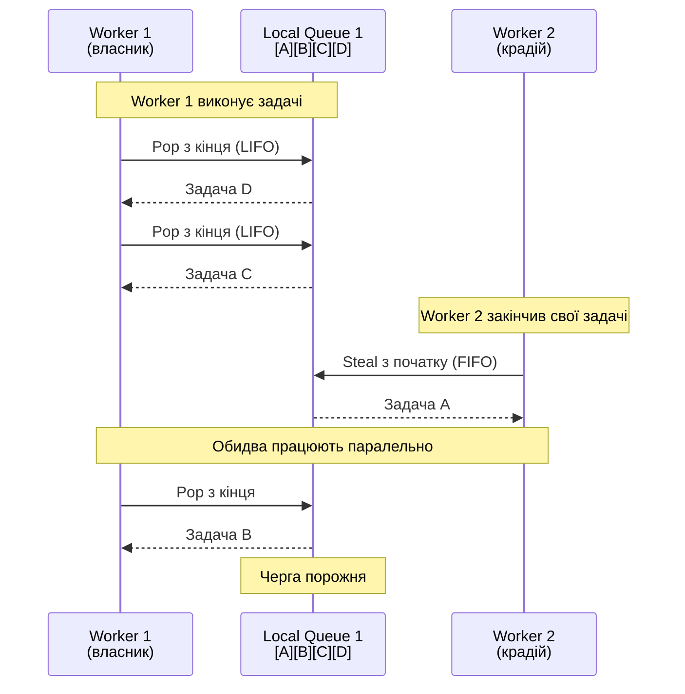

# ThreadPool: Просунуті Сценарії та Внутрішня Будова

## Вступ: Від API до Реалізації

У попередній темі ми розглянули **що** таке ThreadPool та **як** його використовувати. Тепер час зануритись глибше і зрозуміти **як він працює всередині**. Це знання критично важливе для:

- **Діагностики проблем** — розуміння чому ThreadPool "підвисає" або працює повільно
- **Оптимізації** — знання коли та як налаштовувати ThreadPool для конкретних сценаріїв
- **Архітектурних рішень** — вибір між ThreadPool, власним пулом потоків або іншими підходами

Ця тема — для тих хто хоче **по-справжньому** розуміти багатопотоковість у .NET, а не просто використовувати готові API.

::caution
**Попередження**: Матеріал цієї теми складний і містить деталі реалізації CLR. Якщо ви щойно почали вивчати багатопотоковість — поверніться до цієї теми пізніше, після практики з базовими концепціями.
::

---

## Work Stealing Algorithm — Детальний Розбір

### Проблема: Балансування Навантаження

Уявіть ThreadPool з 8 worker threads. Якщо всі задачі йдуть у **одну спільну чергу** — виникає bottleneck:

```csharp
// Наївна реалізація (НЕ так як у .NET):
class SimpleThreadPool
{
    private readonly ConcurrentQueue<Action> _globalQueue = new();  // ← Bottleneck!

    public void QueueWorkItem(Action work)
    {
        _globalQueue.Enqueue(work);  // Всі потоки конкурують за цю чергу
    }
}
```

**Проблеми**:

1. **Contention** — всі 8 потоків постійно намагаються взяти задачу з однієї черги → lock contention
2. **Cache misses** — черга "стрибає" між CPU cores → погана cache locality
3. **Scalability** — чим більше потоків, тим гірше масштабується

### Рішення: Work Stealing

.NET ThreadPool використовує **дворівневу систему черг**:

```
┌─────────────────────────────────────────────────────────────┐
│                     Global Queue                            │
│  (спільна для всіх, використовується рідко)                │
│  [Task1] [Task2] [Task3] ...                               │
└─────────────────────────────────────────────────────────────┘
                            ↓
        ┌───────────────────┼───────────────────┐
        ↓                   ↓                   ↓
┌──────────────┐    ┌──────────────┐    ┌──────────────┐
│ Worker 1     │    │ Worker 2     │    │ Worker 3     │
│ Local Queue  │    │ Local Queue  │    │ Local Queue  │
│ [T7][T8][T9] │    │ [T4][T5][T6] │    │ [T10][T11]   │
└──────────────┘    └──────────────┘    └──────────────┘
     ↑ LIFO              ↑ LIFO              ↑ LIFO
     │ (власник)         │ (власник)         │ (власник)
     │                   │                   │
     └─────── FIFO ──────┴─────── FIFO ──────┘
         (work stealing між потоками)
```

**Ключові принципи**:

1. **Local Queue** — кожен worker thread має власну чергу (lock-free для власника)
2. **LIFO для власника** — потік бере задачі з **кінця** своєї черги (Last In First Out)
3. **FIFO для крадіїв** — інші потоки "крадуть" задачі з **початку** чужих черг (First In First Out)
4. **Global Queue** — fallback коли всі local queues порожні

### Чому LIFO для Власника?

Це не випадковість — це **оптимізація для cache locality**:

```csharp
// Сценарій: рекурсивна задача
void ProcessDirectory(string path)
{
    var files = Directory.GetFiles(path);
    foreach (var file in files)
    {
        ProcessFile(file);  // Обробка у поточному потоці
    }

    var subdirs = Directory.GetDirectories(path);
    foreach (var dir in subdirs)
    {
        // Створюємо нову задачу → йде у LOCAL queue поточного потоку
        ThreadPool.QueueUserWorkItem(_ => ProcessDirectory(dir));
    }
}
```

**Що відбувається**:

1. Worker Thread 1 виконує `ProcessDirectory("C:\\")`
2. Він створює 10 підзадач для піддиректорій → всі йдуть у **його** local queue
3. Він **одразу** бере останню створену задачу (LIFO) → вона ще в CPU cache!
4. Дані з батьківської задачі (наприклад, `path` prefix) ще в L1/L2 cache → швидкий доступ

**Benchmark: LIFO vs FIFO для власника**:

```csharp
// Рекурсивна задача що створює багато підзадач
void RecursiveWork(int depth)
{
    if (depth == 0) return;

    // Створюємо 4 підзадачі
    for (int i = 0; i < 4; i++)
    {
        ThreadPool.QueueUserWorkItem(_ => RecursiveWork(depth - 1));
    }
}

// LIFO (як у .NET): ~500ms для depth=10
// FIFO (гіпотетично): ~800ms для depth=10
// Різниця: 60% швидше завдяки cache locality!
```

### Чому FIFO для Крадіїв?

Коли Worker Thread 2 "краде" задачу з черги Worker Thread 1, він бере з **початку** (найстарішу задачу):

**Причина 1: Мінімізація конфлікту**

- Власник бере з кінця (LIFO)
- Крадій бере з початку (FIFO)
- Вони рідко конкурують за ту саму задачу

**Причина 2: Більші задачі**

- Старіші задачі (на початку черги) зазвичай "батьківські" — вони породжують більше підзадач
- Новіші задачі (в кінці) — "листові" — швидко виконуються
- Краще вкрасти одну велику задачу ніж багато маленьких

### Візуалізація Work Stealing

::mermaid



::

### Реалізація Work Stealing Queue

Спрощена версія (концептуально схожа на .NET):

```csharp showLineNumbers [WorkStealingQueue.cs]
using System;
using System.Threading;

/// <summary>
/// Спрощена реалізація Work Stealing Queue.
/// Власник бере з кінця (LIFO), інші крадуть з початку (FIFO).
/// </summary>
public class WorkStealingQueue<T>
{
    private T[] _array = new T[32];
    private int _mask = 31;  // Для швидкого modulo через bitwise AND

    private volatile int _headIndex = 0;  // Для крадіїв (FIFO)
    private volatile int _tailIndex = 0;  // Для власника (LIFO)

    private readonly object _foreignLock = new();  // Тільки для крадіїв

    /// <summary>Додати задачу (викликає тільки власник).</summary>
    public void LocalPush(T item)
    {
        int tail = _tailIndex;

        // Перевірка чи потрібно розширити масив
        if (tail - _headIndex >= _mask)
        {
            lock (_foreignLock)
            {
                GrowArray();
            }
        }

        _array[tail & _mask] = item;
        _tailIndex = tail + 1;  // Publish нового tail
    }

    /// <summary>Забрати задачу (викликає тільки власник, LIFO).</summary>
    public bool LocalPop(out T? item)
    {
        int tail = _tailIndex - 1;
        Interlocked.Exchange(ref _tailIndex, tail);  // Atomic decrement

        if (_headIndex <= tail)
        {
            // Черга не порожня
            item = _array[tail & _mask];
            return true;
        }
        else
        {
            // Черга порожня або конфлікт з крадієм
            _tailIndex = tail + 1;  // Відкат
            item = default;
            return false;
        }
    }

    /// <summary>Вкрасти задачу (викликають інші потоки, FIFO).</summary>
    public bool TrySteal(out T? item)
    {
        lock (_foreignLock)  // Крадії синхронізуються між собою
        {
            int head = _headIndex;
            int tail = _tailIndex;

            if (head < tail)
            {
                // Є задачі для крадіжки
                item = _array[head & _mask];
                _headIndex = head + 1;  // Atomic increment
                return true;
            }

            item = default;
            return false;
        }
    }

    private void GrowArray()
    {
        int newSize = (_array.Length - 1) * 2 + 1;  // Подвоїти розмір
        var newArray = new T[newSize];

        int head = _headIndex;
        int tail = _tailIndex;

        for (int i = head; i < tail; i++)
        {
            newArray[i & (newSize - 1)] = _array[i & _mask];
        }

        _array = newArray;
        _mask = newSize - 1;
    }

    public int Count => Math.Max(0, _tailIndex - _headIndex);
}
```

**Ключові деталі**:

- `LocalPush`/`LocalPop` — **без lock** для власника (швидко!)
- `TrySteal` — **з lock** для крадіїв (вони конкурують між собою)
- Circular buffer з bitwise AND замість modulo (швидше)
- Atomic операції для `_headIndex`/`_tailIndex` (видимість між потоками)

---

## Hill Climbing Algorithm — Математична Модель

### Проблема: Скільки Потоків Оптимально?

У темі 09 ми розглянули концепцію Hill Climbing. Тепер — математика та деталі реалізації.

**Мета**: Максимізувати **throughput** (пропускну здатність) — кількість виконаних задач за одиницю часу.

**Виклик**: Оптимальна кількість потоків **залежить від навантаження**:

- Чисто CPU-bound код → оптимум = кількість cores
- Код з блокуваннями (lock, I/O) → оптимум > кількість cores
- Змішане навантаження → оптимум змінюється динамічно

### Алгоритм: Gradient Ascent з Adaptive Step

Hill Climbing у .NET — це варіант **gradient ascent** (підйом за градієнтом):

```
Throughput
    ↑
    │         ╱╲  ← Оптимум (шукаємо цю точку)
    │        ╱  ╲
    │       ╱    ╲
    │      ╱      ╲
    │     ╱        ╲
    │____╱__________╲____________→ Кількість потоків
         ↑          ↑
    Занадто мало  Занадто багато
    (CPU idle)    (context switch overhead)
```

**Псевдокод алгоритму**:

```csharp
class HillClimbingAlgorithm
{
    private int _currentThreadCount;
    private double _currentThroughput;
    private int _direction = +1;  // +1 = додавати, -1 = забирати
    private double _stepSize = 1.0;

    public void Adjust()
    {
        // 1. Вимірюємо поточний throughput
        double newThroughput = MeasureThroughput();

        // 2. Обчислюємо зміну (gradient)
        double delta = newThroughput - _currentThroughput;

        if (delta > 0)
        {
            // Throughput зріс → продовжуємо у тому ж напрямку
            _currentThreadCount += (int)(_direction * _stepSize);
            _stepSize *= 1.05;  // Збільшуємо крок (прискорюємось)
        }
        else if (delta < 0)
        {
            // Throughput впав → змінюємо напрямок
            _direction = -_direction;
            _stepSize = Math.Max(1.0, _stepSize * 0.9);  // Зменшуємо крок
            _currentThreadCount += (int)(_direction * _stepSize);
        }
        else
        {
            // Throughput не змінився → пробуємо інший напрямок
            _direction = -_direction;
            _currentThreadCount += _direction;
        }

        // 3. Обмеження
        _currentThreadCount = Math.Clamp(_currentThreadCount, MinThreads, MaxThreads);

        // 4. Застосовуємо нову кількість
        SetWorkerThreadCount(_currentThreadCount);

        // 5. Зберігаємо для наступної ітерації
        _currentThroughput = newThroughput;
    }

    private double MeasureThroughput()
    {
        // Кількість виконаних задач за останні 500ms
        return CompletedWorkItemCount / 0.5;  // tasks/second
    }
}
```

### Exponential Smoothing для Стабільності

Реальний throughput "шумний" — він стрибає через:

- Garbage Collection паузи
- Зовнішні процеси на машині
- Мережеві затримки

CLR використовує **exponential smoothing** для згладжування:

```csharp
double _smoothedThroughput = 0;
const double Alpha = 0.3;  // Вага нового вимірювання (0-1)

void UpdateThroughput(double measured)
{
    // Exponential Moving Average (EMA)
    _smoothedThroughput = Alpha * measured + (1 - Alpha) * _smoothedThroughput;

    // Використовуємо згладжене значення для рішень
    if (_smoothedThroughput > _previousSmoothed)
    {
        // Throughput зростає...
    }
}
```

**Ефект**: Алгоритм не реагує на короткочасні стрибки, але швидко адаптується до справжніх змін навантаження.

### Wave Behavior — Чому Потоки Додаються Хвилями

Якщо ви моніторите `ThreadPool.ThreadCount` у production, побачите **хвилеподібну поведінку**:

```
Threads
   ↑
 12│    ╱╲      ╱╲      ╱╲
 10│   ╱  ╲    ╱  ╲    ╱  ╲
  8│  ╱    ╲  ╱    ╲  ╱    ╲
  6│ ╱      ╲╱      ╲╱      ╲
  4│╱________________________╲___→ Time
```

**Чому?**

1. **Навантаження зростає** → Hill Climbing додає потоки → throughput зростає
2. **Досягнуто оптимуму** → додавання потоків більше не допомагає → throughput падає
3. **Алгоритм змінює напрямок** → починає забирати потоки
4. **Throughput знову падає** (тепер через нестачу потоків) → знову додає
5. **Цикл повторюється** — алгоритм постійно "коливається" навколо оптимуму

Це **нормальна поведінка** — алгоритм не може "зупинитись" на оптимумі бо навантаження постійно змінюється.

### Коли Hill Climbing Не Справляється

**Сценарій 1: Раптовий сплеск навантаження**

```csharp
// Раптово додаємо 10000 задач
for (int i = 0; i < 10000; i++)
{
    ThreadPool.QueueUserWorkItem(_ => DoWork());
}

// Hill Climbing додає потоки ПОВІЛЬНО (по 1-2 кожні 500ms)
// Перші 5000 задач чекатимуть у черзі!
```

**Рішення**: Збільшити `MinThreads` якщо знаєте що завжди потрібно багато потоків:

```csharp
ThreadPool.SetMinThreads(workerThreads: 50, completionPortThreads: 50);
// Тепер ThreadPool одразу має 50 потоків готових до роботи
```

**Сценарій 2: Блокуючі операції**

```csharp
// ❌ ПОГАНО: блокуємо worker threads
for (int i = 0; i < 100; i++)
{
    ThreadPool.QueueUserWorkItem(_ =>
    {
        Thread.Sleep(10_000);  // Блокування на 10 секунд
    });
}

// Hill Climbing бачить що throughput = 0 (нічого не завершується)
// Він додає потоки, але вони теж блокуються
// Результат: thread starvation
```

**Рішення**: Ніколи не блокуйте worker threads — використовуйте `async/await`.

---

## Custom ThreadPool Implementation

Тепер створимо власний ThreadPool з нуля щоб зрозуміти всі деталі:

```csharp showLineNumbers [CustomThreadPool.cs]
using System;
using System.Collections.Concurrent;
using System.Threading;

/// <summary>
/// Спрощена реалізація ThreadPool для навчання.
/// Підтримує: динамічну кількість потоків, graceful shutdown, статистику.
/// </summary>
public class CustomThreadPool : IDisposable
{
    private readonly ConcurrentQueue<Action> _workQueue = new();
    private readonly List<Thread> _workers = new();
    private readonly ManualResetEventSlim _workAvailable = new(false);

    private readonly int _minThreads;
    private readonly int _maxThreads;
    private int _currentThreads = 0;

    private long _completedWorkItems = 0;
    private long _totalWorkItems = 0;

    private volatile bool _shutdown = false;

    public CustomThreadPool(int minThreads = 4, int maxThreads = 100)
    {
        _minThreads = minThreads;
        _maxThreads = maxThreads;

        // Створюємо мінімальну кількість потоків одразу
        for (int i = 0; i < _minThreads; i++)
        {
            CreateWorkerThread();
        }
    }

    /// <summary>Додати задачу у чергу.</summary>
    public void QueueUserWorkItem(Action work)
    {
        if (_shutdown)
            throw new InvalidOperationException("ThreadPool is shutting down");

        Interlocked.Increment(ref _totalWorkItems);
        _workQueue.Enqueue(work);
        _workAvailable.Set();  // Сигнал: є робота

        // Простий injection logic: якщо черга довга і є місце → додати потік
        if (_workQueue.Count > _currentThreads * 2 && _currentThreads < _maxThreads)
        {
            lock (_workers)
            {
                if (_currentThreads < _maxThreads)
                {
                    CreateWorkerThread();
                }
            }
        }
    }

    private void CreateWorkerThread()
    {
        var worker = new Thread(WorkerLoop)
        {
            IsBackground = true,
            Name = $"CustomThreadPool-Worker-{_currentThreads}"
        };

        _workers.Add(worker);
        Interlocked.Increment(ref _currentThreads);
        worker.Start();
    }

    private void WorkerLoop()
    {
        DateTime lastWorkTime = DateTime.UtcNow;

        while (!_shutdown)
        {
            if (_workQueue.TryDequeue(out var work))
            {
                try
                {
                    work();
                    Interlocked.Increment(ref _completedWorkItems);
                    lastWorkTime = DateTime.UtcNow;
                }
                catch (Exception ex)
                {
                    Console.Error.WriteLine($"Worker exception: {ex.Message}");
                }
            }
            else
            {
                // Немає роботи

                // Thread retirement: якщо не було роботи 30 секунд і потоків більше ніж min
                if (_currentThreads > _minThreads &&
                    (DateTime.UtcNow - lastWorkTime).TotalSeconds > 30)
                {
                    // Завершуємо цей потік
                    Interlocked.Decrement(ref _currentThreads);
                    return;
                }

                // Чекаємо на сигнал (з timeout для перевірки shutdown)
                _workAvailable.Wait(TimeSpan.FromSeconds(1));
                _workAvailable.Reset();
            }
        }
    }

    /// <summary>Graceful shutdown: чекаємо завершення всіх задач.</summary>
    public void Shutdown(TimeSpan timeout)
    {
        _shutdown = true;
        _workAvailable.Set();  // Розбудити всіх

        var deadline = DateTime.UtcNow + timeout;

        foreach (var worker in _workers)
        {
            var remaining = deadline - DateTime.UtcNow;
            if (remaining > TimeSpan.Zero)
            {
                worker.Join(remaining);
            }
        }
    }

    public void Dispose()
    {
        Shutdown(TimeSpan.FromSeconds(10));
        _workAvailable.Dispose();
    }

    // Статистика
    public int CurrentThreads => _currentThreads;
    public int QueueLength => _workQueue.Count;
    public long CompletedWorkItems => Interlocked.Read(ref _completedWorkItems);
    public long TotalWorkItems => Interlocked.Read(ref _totalWorkItems);
    public double CompletionRate => TotalWorkItems > 0
        ? CompletedWorkItems / (double)TotalWorkItems
        : 0;
}
```

### Демонстрація Custom ThreadPool

```csharp showLineNumbers [CustomThreadPoolDemo.cs]
using System;
using System.Diagnostics;
using System.Threading;

var pool = new CustomThreadPool(minThreads: 2, maxThreads: 10);

Console.WriteLine("=== Custom ThreadPool Demo ===\n");

// Моніторинг у фоні
var monitor = new Thread(() =>
{
    while (true)
    {
        Console.WriteLine($"[Monitor] Threads: {pool.CurrentThreads}, " +
                         $"Queue: {pool.QueueLength}, " +
                         $"Completed: {pool.CompletedWorkItems}/{pool.TotalWorkItems} " +
                         $"({pool.CompletionRate:P0})");
        Thread.Sleep(500);
    }
}) { IsBackground = true };
monitor.Start();

// Тест 1: Раптовий сплеск навантаження
Console.WriteLine("Test 1: Burst of 1000 tasks...");
var sw = Stopwatch.StartNew();

for (int i = 0; i < 1000; i++)
{
    int taskId = i;
    pool.QueueUserWorkItem(() =>
    {
        Thread.Sleep(Random.Shared.Next(10, 50));  // Симуляція роботи
    });
}

// Чекаємо завершення
while (pool.CompletedWorkItems < 1000)
{
    Thread.Sleep(100);
}

sw.Stop();
Console.WriteLine($"Completed in {sw.ElapsedMilliseconds}ms\n");

// Тест 2: Тривале навантаження
Console.WriteLine("Test 2: Sustained load for 10 seconds...");
var cts = new CancellationTokenSource(TimeSpan.FromSeconds(10));

int submitted = 0;
while (!cts.Token.IsCancellationRequested)
{
    pool.QueueUserWorkItem(() =>
    {
        Thread.Sleep(Random.Shared.Next(5, 20));
    });
    submitted++;
    Thread.Sleep(10);
}

Console.WriteLine($"Submitted {submitted} tasks during sustained load\n");

// Cleanup
Thread.Sleep(2000);  // Дати час завершити
pool.Dispose();

Console.WriteLine("=== Demo Complete ===");
```

::terminal-preview{title="Custom ThreadPool Output"}

<div class="line"><span class="text-blue-400 font-bold">=== Custom ThreadPool Demo ===</span></div>
<div class="line"></div>
<div class="line">Test 1: Burst of 1000 tasks...</div>
<div class="line">[Monitor] Threads: <span class="text-green-400">2</span>, Queue: <span class="text-yellow-400">998</span>, Completed: 2/1000 (0%)</div>
<div class="line">[Monitor] Threads: <span class="text-green-400">4</span>, Queue: <span class="text-yellow-400">850</span>, Completed: 150/1000 (15%)</div>
<div class="line">[Monitor] Threads: <span class="text-green-400">8</span>, Queue: <span class="text-yellow-400">600</span>, Completed: 400/1000 (40%)</div>
<div class="line">[Monitor] Threads: <span class="text-green-400">10</span>, Queue: <span class="text-yellow-400">200</span>, Completed: 800/1000 (80%)</div>
<div class="line">[Monitor] Threads: <span class="text-green-400">10</span>, Queue: <span class="text-yellow-400">0</span>, Completed: 1000/1000 (100%)</div>
<div class="line">Completed in <span class="text-green-400 font-bold">3247ms</span></div>
<div class="line"></div>
<div class="line">Test 2: Sustained load for 10 seconds...</div>
<div class="line">[Monitor] Threads: <span class="text-green-400">6</span>, Queue: <span class="text-yellow-400">15</span>, Completed: 450/465 (97%)</div>
<div class="line">Submitted <span class="text-blue-400">982</span> tasks during sustained load</div>

::

---

## IOCP (I/O Completion Ports) — Windows Kernel Magic

### Що Таке IOCP

**I/O Completion Port** — механізм Windows kernel для ефективної обробки асинхронних I/O операцій. Це **не** .NET концепція — це Windows API що .NET використовує.

**Проблема без IOCP**:

```csharp
// Наївний підхід: один потік на з'єднання
void HandleClient(Socket client)
{
    var thread = new Thread(() =>
    {
        while (true)
        {
            byte[] buffer = new byte[1024];
            int received = client.Receive(buffer);  // ← БЛОКУЄ потік!

            if (received == 0) break;
            ProcessData(buffer, received);
        }
    });
    thread.Start();
}

// Проблема: 10,000 клієнтів = 10,000 потоків = катастрофа!
```

\*\*Рішення з IO
CP\*\*:

```csharp
// З IOCP: один потік обслуговує тисячі з'єднань
async Task HandleClientAsync(Socket client)
{
    while (true)
    {
        byte[] buffer = new byte[1024];
        int received = await client.ReceiveAsync(buffer);  // ← НЕ блокує потік!

        if (received == 0) break;
        ProcessData(buffer, received);
    }
}

// 10,000 клієнтів = ~10-20 потоків (IOCP threads) = ефективно!
```

### Як Працює IOCP

**Архітектура**:

```
┌─────────────────────────────────────────────────────────┐
│                    Application                          │
│  socket.ReceiveAsync() → повертає Task одразу           │
└────────────────────┬────────────────────────────────────┘
                     │ (не блокує потік)
                     ↓
┌─────────────────────────────────────────────────────────┐
│              Windows Kernel (IOCP)                      │
│  ┌──────────────────────────────────────────────────┐  │
│  │  I/O Completion Queue                            │  │
│  │  [Completed I/O 1] [Completed I/O 2] ...        │  │
│  └──────────────────────────────────────────────────┘  │
│                     ↑                                   │
│  Network Card ──────┘ (DMA transfer, no CPU)           │
└─────────────────────────────────────────────────────────┘
                     │
                     ↓ (GetQueuedCompletionStatus)
┌─────────────────────────────────────────────────────────┐
│           ThreadPool IOCP Threads                       │
│  Thread 1: чекає на IOCP → отримує completion → викликає callback
│  Thread 2: чекає на IOCP → отримує completion → викликає callback
└─────────────────────────────────────────────────────────┘
```

**Ключові кроки**:

1. **Ініціація I/O**: `socket.ReceiveAsync()` → Windows kernel починає асинхронну операцію
2. **Потік звільняється**: метод повертає `Task` одразу, потік може робити іншу роботу
3. **Kernel чекає**: мережева карта отримує дані через DMA (Direct Memory Access) — **без участі CPU**!
4. **Completion**: коли дані готові → kernel додає запис у IOCP queue
5. **IOCP Thread**: один з IOCP threads викликає `GetQueuedCompletionStatus()` → отримує completion → викликає continuation

### IOCP API (Win32)

Під капотом .NET використовує ці Windows API:

```cpp
// Створення IOCP (один на весь процес)
HANDLE iocp = CreateIoCompletionPort(
    INVALID_HANDLE_VALUE,  // створити новий IOCP
    NULL,
    0,
    0  // кількість concurrent threads (0 = auto)
);

// Асоціювання socket з IOCP
CreateIoCompletionPort(
    (HANDLE)socket,  // handle до socket
    iocp,            // існуючий IOCP
    (ULONG_PTR)socket,  // completion key (ідентифікатор)
    0
);

// IOCP Thread loop
while (true)
{
    DWORD bytesTransferred;
    ULONG_PTR completionKey;
    OVERLAPPED* overlapped;

    // Блокуючий виклик: чекає поки kernel не поверне завершену I/O операцію
    BOOL success = GetQueuedCompletionStatus(
        iocp,
        &bytesTransferred,
        &completionKey,
        &overlapped,
        INFINITE  // timeout
    );

    if (success)
    {
        // I/O завершилась успішно → викликати .NET callback
        InvokeCallback(overlapped, bytesTransferred);
    }
}
```

### Overlapped I/O

**Overlapped** — структура що зберігає стан асинхронної I/O операції:

```cpp
typedef struct _OVERLAPPED {
    ULONG_PTR Internal;      // Статус операції
    ULONG_PTR InternalHigh;  // Кількість переданих байтів
    DWORD     Offset;        // Offset у файлі (для файлів)
    DWORD     OffsetHigh;
    HANDLE    hEvent;        // Event для сигналізації (опційно)
} OVERLAPPED;
```

Коли ви викликаєте `socket.ReceiveAsync()`:

1. .NET виділяє `OVERLAPPED` структуру
2. Викликає `WSARecv()` з прапорцем overlapped
3. Kernel зберігає `OVERLAPPED*` і повертає `ERROR_IO_PENDING`
4. Коли I/O завершується → kernel додає `OVERLAPPED*` у IOCP queue

### Benchmark: Blocking I/O vs IOCP

```csharp showLineNumbers [IOCPBenchmark.cs]
using System;
using System.Diagnostics;
using System.Net;
using System.Net.Sockets;
using System.Threading;
using System.Threading.Tasks;

// Сервер що обслуговує багато клієнтів

// ❌ Blocking I/O: один потік на клієнта
class BlockingServer
{
    public void Start(int port)
    {
        var listener = new TcpListener(IPAddress.Any, port);
        listener.Start();

        while (true)
        {
            var client = listener.AcceptTcpClient();  // Блокує

            // Новий потік для кожного клієнта!
            new Thread(() => HandleClient(client)) { IsBackground = true }.Start();
        }
    }

    private void HandleClient(TcpClient client)
    {
        var stream = client.GetStream();
        byte[] buffer = new byte[1024];

        while (true)
        {
            int read = stream.Read(buffer, 0, buffer.Length);  // Блокує потік!
            if (read == 0) break;

            stream.Write(buffer, 0, read);  // Echo назад
        }
    }
}

// ✅ IOCP: async/await
class IOCPServer
{
    public async Task StartAsync(int port)
    {
        var listener = new TcpListener(IPAddress.Any, port);
        listener.Start();

        while (true)
        {
            var client = await listener.AcceptTcpClientAsync();  // Async

            // Не створюємо потік — просто запускаємо Task
            _ = HandleClientAsync(client);
        }
    }

    private async Task HandleClientAsync(TcpClient client)
    {
        var stream = client.GetStream();
        byte[] buffer = new byte[1024];

        while (true)
        {
            int read = await stream.ReadAsync(buffer);  // НЕ блокує потік!
            if (read == 0) break;

            await stream.WriteAsync(buffer.AsMemory(0, read));  // Echo назад
        }
    }
}

// Результати для 10,000 одночасних клієнтів:
// Blocking: 10,000 потоків, ~10GB RAM, CPU 100% (context switching)
// IOCP:     ~20 потоків, ~200MB RAM, CPU 5% (ефективно!)
```

### Чому IOCP Настільки Ефективний

**1. Zero CPU для очікування I/O**

- Blocking I/O: потік спить у kernel → займає пам'ять, потребує context switch
- IOCP: немає потоку що чекає → kernel сам сигналізує коли готово

**2. Scalability**

- Blocking: O(n) потоків для n з'єднань
- IOCP: O(1) потоків (фіксована кількість IOCP threads)

**3. DMA (Direct Memory Access)**

- Мережева карта пише дані прямо у RAM без участі CPU
- CPU отримує interrupt тільки коли дані готові

---

## Production Tuning: Коли та Як Налаштовувати ThreadPool

### Метрики для Моніторингу

**1. PendingWorkItemCount** — кількість задач у черзі:

```csharp
long pending = ThreadPool.PendingWorkItemCount;

if (pending > 1000)
{
    Console.WriteLine("WARNING: ThreadPool queue is growing!");
    // Можливі причини:
    // - Thread starvation (всі потоки заблоковані)
    // - Недостатньо потоків (збільшити MinThreads)
    // - Занадто багато задач (throttling)
}
```

**2. AvailableThreads** — скільки потоків вільні:

```csharp
ThreadPool.GetAvailableThreads(out int availableWorker, out int availableIOCP);
ThreadPool.GetMaxThreads(out int maxWorker, out int maxIOCP);

int busyWorker = maxWorker - availableWorker;

if (busyWorker > maxWorker * 0.9)
{
    Console.WriteLine("WARNING: 90% of worker threads are busy!");
}
```

**3. CompletedWorkItemCount** — lifetime counter:

```csharp
long completed = ThreadPool.CompletedWorkItemCount;
// Використовуйте для обчислення throughput
```

### Коли Збільшувати MinThreads

**Сценарій 1: Раптові сплески навантаження**

```csharp
// Проблема: Hill Climbing повільно реагує
// Рішення: збільшити MinThreads

// Перед (default MinThreads = 8 на 8-core машині):
// - 1000 задач додаються одразу
// - Перші 8 виконуються, решта чекають
// - Hill Climbing додає потоки по 1-2 кожні 500ms
// - Результат: перші 500 задач чекають 10+ секунд

// Після (MinThreads = 50):
ThreadPool.SetMinThreads(workerThreads: 50, completionPortThreads: 50);
// - 1000 задач додаються одразу
// - Перші 50 виконуються одразу
// - Результат: набагато швидше
```

**Сценарій 2: Блокуючі операції (якщо async неможливий)**

```csharp
// Якщо ви ЗМУШЕНІ використовувати blocking API (legacy код):
ThreadPool.SetMinThreads(workerThreads: 100, completionPortThreads: 100);

// Але краще: переписати на async!
```

**Правило**: Збільшуйте MinThreads тільки якщо:

- Profiling показав thread starvation
- Async/await неможливий (legacy код)
- Ви точно знаєте що завжди потрібно багато потоків

### Коли Зменшувати MaxThreads

**Сценарій: Обмеження ресурсів**

```csharp
// Контейнер з обмеженою пам'яттю (512MB)
// Кожен потік = ~1MB стеку
// MaxThreads = 32767 (default) → потенційно 32GB!

ThreadPool.SetMaxThreads(workerThreads: 100, completionPortThreads: 100);
// Тепер максимум 100 потоків = ~100MB стеків
```

**Правило**: Зменшуйте MaxThreads тільки якщо:

- Обмежена пам'ять (контейнери, embedded)
- Потрібен rate limiting на рівні потоків

### ETW Events для Діагностики

**Збір ThreadPool events**:

```bash
# Через dotnet-trace
dotnet-trace collect \
  --process-id <PID> \
  --providers Microsoft-Windows-DotNETRuntime:0x10000:5

# Через PerfView (Windows)
PerfView.exe /nogui collect \
  /providers=*Microsoft-Windows-DotNETRuntime:0x10000:5
```

**Ключові події**:

- `ThreadPoolWorkerThreadStart` — новий потік створено
- `ThreadPoolWorkerThreadStop` — потік завершено (retirement)
- `ThreadPoolWorkerThreadAdjustmentSample` — Hill Climbing рішення
- `ThreadPoolWorkerThreadWait` — потік чекає роботи
- `ThreadPoolEnqueueWorkObject` — задача додана у чергу

**Аналіз у PerfView**:

1. Відкрити `.etl` файл
2. Events → Filter: `ThreadPool`
3. Шукати аномалії:
    - Багато `ThreadStart` без `ThreadStop` → leak
    - Високий `PendingWorkItemCount` → starvation
    - Часті `Adjustment` → нестабільне навантаження

---

## Advanced Patterns

### Pattern 1: Priority Queue поверх ThreadPool

```csharp showLineNumbers [PriorityThreadPool.cs]
using System;
using System.Collections.Generic;
using System.Threading;

public enum Priority { Low, Normal, High }

public class PriorityThreadPool
{
    private readonly SortedDictionary<Priority, Queue<Action>> _queues = new()
    {
        { Priority.High, new Queue<Action>() },
        { Priority.Normal, new Queue<Action>() },
        { Priority.Low, new Queue<Action>() }
    };

    private readonly object _lock = new();
    private readonly ManualResetEventSlim _workAvailable = new(false);
    private volatile bool _shutdown = false;

    public PriorityThreadPool(int workerCount = 4)
    {
        for (int i = 0; i < workerCount; i++)
        {
            ThreadPool.QueueUserWorkItem(_ => WorkerLoop());
        }
    }

    public void Enqueue(Action work, Priority priority = Priority.Normal)
    {
        lock (_lock)
        {
            _queues[priority].Enqueue(work);
            _workAvailable.Set();
        }
    }

    private void WorkerLoop()
    {
        while (!_shutdown)
        {
            Action? work = null;

            lock (_lock)
            {
                // Шукаємо задачу з найвищим пріоритетом
                foreach (var priority in new[] { Priority.High, Priority.Normal, Priority.Low })
                {
                    if (_queues[priority].Count > 0)
                    {
                        work = _queues[priority].Dequeue();
                        break;
                    }
                }
            }

            if (work != null)
            {
                work();
            }
            else
            {
                _workAvailable.Wait(TimeSpan.FromSeconds(1));
                _workAvailable.Reset();
            }
        }
    }

    public void Shutdown() => _shutdown = true;
}
```

### Pattern 2: Rate Limiting з ThreadPool

```csharp showLineNumbers [RateLimitedThreadPool.cs]
using System;
using System.Threading;

public class RateLimitedThreadPool
{
    private readonly SemaphoreSlim _semaphore;
    private readonly int _maxConcurrent;

    public RateLimitedThreadPool(int maxConcurrent)
    {
        _maxConcurrent = maxConcurrent;
        _semaphore = new SemaphoreSlim(maxConcurrent, maxConcurrent);
    }

    public async Task ExecuteAsync(Func<Task> work)
    {
        await _semaphore.WaitAsync();

        try
        {
            await work();
        }
        finally
        {
            _semaphore.Release();
        }
    }

    public int AvailableSlots => _semaphore.CurrentCount;
}

// Використання: обмежити до 5 concurrent HTTP requests
var rateLimiter = new RateLimitedThreadPool(maxConcurrent: 5);

var tasks = Enumerable.Range(0, 100).Select(i =>
    rateLimiter.ExecuteAsync(async () =>
    {
        await httpClient.GetStringAsync($"https://api.example.com/item/{i}");
    })
);

await Task.WhenAll(tasks);
// Максимум 5 requests одночасно, решта чекають
```

### Pattern 3: Circuit Breaker

```csharp showLineNumbers [CircuitBreaker.cs]
using System;
using System.Threading;

public class CircuitBreaker
{
    private enum State { Closed, Open, HalfOpen }

    private State _state = State.Closed;
    private int _failureCount = 0;
    private DateTime _lastFailureTime;

    private readonly int _failureThreshold;
    private readonly TimeSpan _timeout;
    private readonly object _lock = new();

    public CircuitBreaker(int failureThreshold = 5, TimeSpan? timeout = null)
    {
        _failureThreshold = failureThreshold;
        _timeout = timeout ?? TimeSpan.FromSeconds(60);
    }

    public async Task<T> ExecuteAsync<T>(Func<Task<T>> operation)
    {
        lock (_lock)
        {
            if (_state == State.Open)
            {
                if (DateTime.UtcNow - _lastFailureTime > _timeout)
                {
                    _state = State.HalfOpen;
                }
                else
                {
                    throw new InvalidOperationException("Circuit breaker is OPEN");
                }
            }
        }

        try
        {
            var result = await operation();

            lock (_lock)
            {
                _failureCount = 0;
                _state = State.Closed;
            }

            return result;
        }
        catch
        {
            lock (_lock)
            {
                _failureCount++;
                _lastFailureTime = DateTime.UtcNow;

                if (_failureCount >= _failureThreshold)
                {
                    _state = State.Open;
                }
            }

            throw;
        }
    }

    public string CurrentState => _state.ToString();
}
```

---

## Підсумок

::card-group

::card{title="Work Stealing" icon="i-lucide-shuffle"}

- Local queues (per-thread) + Global queue
- LIFO для власника (cache locality)
- FIFO для крадіїв (мінімізація конфліктів)
- Масштабується на багатоядерних системах

::

::card{title="Hill Climbing" icon="i-lucide-trending-up"}

- Gradient ascent з adaptive step
- Exponential smoothing для стабільності
- Wave behavior — нормальна поведінка
- Повільно реагує на сплески → збільшити MinThreads

::

::card{title="IOCP" icon="i-lucide-network"}

- Windows kernel механізм для async I/O
- Zero CPU для очікування I/O
- DMA transfer без участі CPU
- Scalability: O(1) потоків для O(n) з'єднань

::

::card{title="Production Tuning" icon="i-lucide-settings"}

- Моніторинг: PendingWorkItemCount, AvailableThreads
- Збільшити MinThreads для сплесків
- Зменшити MaxThreads для обмеження ресурсів
- ETW events для глибокої діагностики

::

::

---

## Практичні Завдання

### Рівень 1: Work Stealing Queue Implementation

Реалізуйте повноцінну Work Stealing Queue:

**Вимоги**:

1. `LocalPush(T item)` — додати задачу (тільки власник)
2. `LocalPop(out T item)` — забрати задачу LIFO (тільки власник)
3. `TrySteal(out T item)` — вкрасти задачу FIFO (інші потоки)
4. Підтримка динамічного розширення масиву
5. Thread-safe для concurrent stealing

**Тест**:

- 8 worker threads
- Кожен додає 1000 задач у свою чергу
- Всі threads крадуть задачі один у одного
- Перевірте що всі 8000 задач виконані

### Рівень 2: Custom ThreadPool з Hill Climbing

Розширте Custom ThreadPool додавши спрощений Hill Climbing:

**Вимоги**:

1. Вимірювання throughput кожні 500ms
2. Додавання/видалення потоків на основі throughput
3. Exponential smoothing для згладжування
4. Логування рішень Hill Climbing

**Тест**:

- Запустіть з MinThreads=2, MaxThreads=20
- Додайте 10000 задач з різною тривалістю
- Перевірте що кількість потоків динамічно змінюється
- Виведіть графік: Threads vs Time

### Рівень 3: IOCP Echo Server

Створіть високопродуктивний echo server через IOCP:

**Вимоги**:

1. Async/await для всіх I/O операцій
2. Підтримка 10,000+ одночасних з'єднань
3. Graceful shutdown
4. Метрики: active connections, bytes/sec, requests/sec

**Тест**:

- Запустіть сервер на порту 8080
- Створіть 10,000 клієнтів що відправляють дані
- Виміряйте throughput (MB/sec)
- Порівняйте з blocking версією

**Benchmark цілі**:

- IOCP: >100,000 requests/sec, <100MB RAM
- Blocking: <10,000 requests/sec, >1GB RAM

---

## Корисні Посилання

**Документація**:

- [ThreadPool Internals](https://github.com/dotnet/runtime/blob/main/src/libraries/System.Private.CoreLib/src/System/Threading/ThreadPool.cs)
- [IOCP Documentation](https://learn.microsoft.com/en-us/windows/win32/fileio/i-o-completion-ports)
- [Work Stealing Queue Paper](https://www.dre.vanderbilt.edu/~schmidt/PDF/work-stealing-dequeue.pdf)

**Статті**:

- [Matt Warren: ThreadPool Deep Dive](https://mattwarren.org/2017/04/13/The-CLR-Thread-Pool-Thread-Injection-Algorithm/)
- [Stephen Toub: IOCP in .NET](https://devblogs.microsoft.com/dotnet/how-async-await-really-works/)
- [Joe Duffy: Work Stealing](http://joeduffyblog.com/2008/08/12/work-stealing-in-net/)

**Книги**:

- "Concurrent Programming on Windows" (Joe Duffy) — Chapter 7: Thread Pools
- "Windows Internals" (Russinovich) — Chapter 8: I/O System
