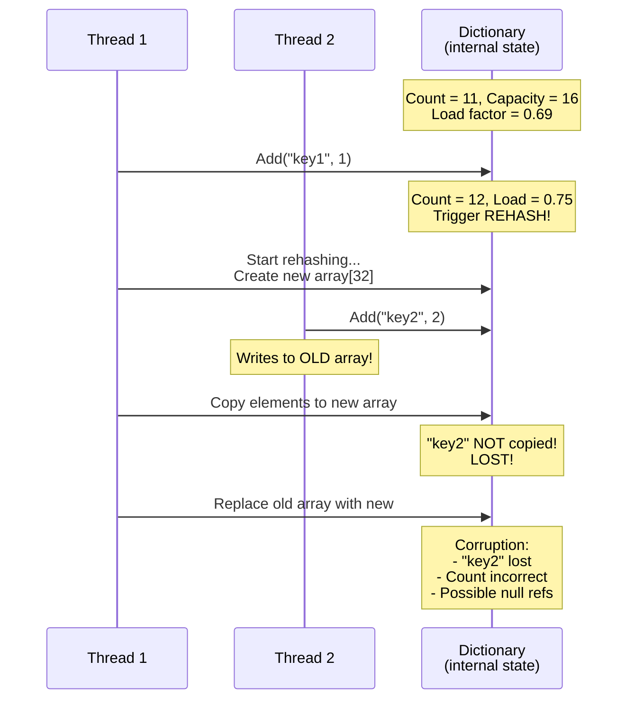
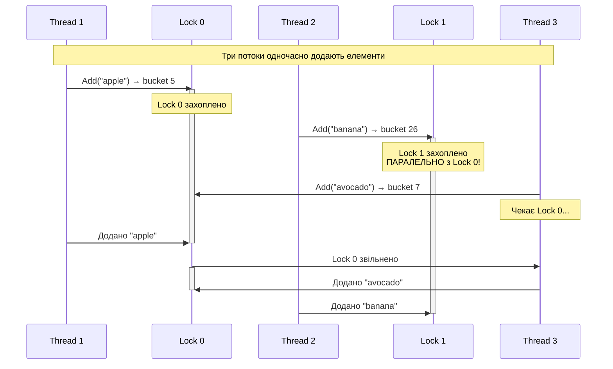
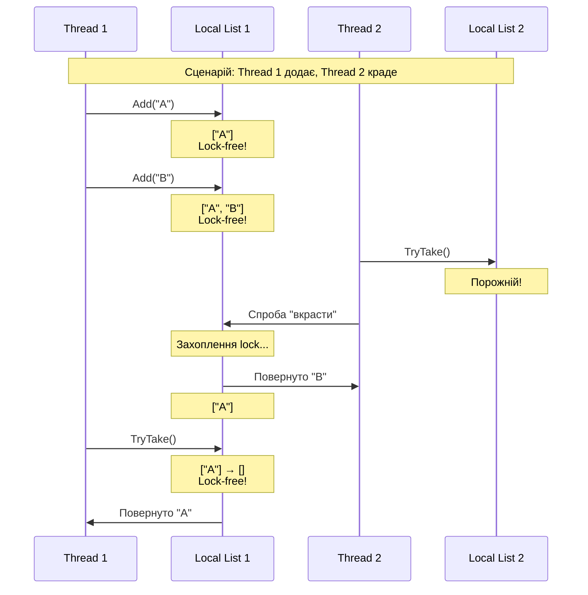
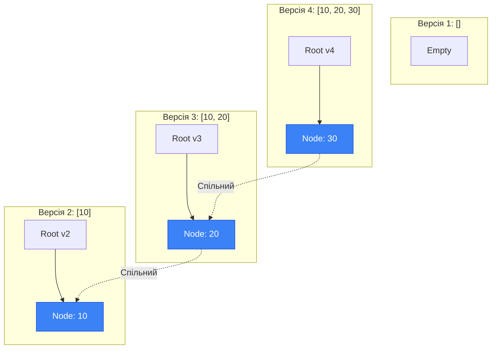

# Concurrent та Immutable Collections

## Вступ: Проблема Thread-Safety у Колекціях

Ви вже знаєте як синхронізувати доступ до простих змінних через `lock`, `Interlocked` та інші примітиви. Але що робити з **колекціями** — `List<T>`, `Dictionary<K,V>`, `Queue<T>`? Чи можна просто обгорнути їх у `lock` і забути про проблеми?

Відповідь: **можна, але це неефективно**. .NET надає спеціалізовані **concurrent collections** що оптимізовані для багатопотокового доступу і працюють набагато швидше ніж "колекція + lock".

У цій темі ми розглянемо:

- Чому звичайні колекції небезпечні у багатопотоковому коді
- Як працюють concurrent collections під капотом
- Коли використовувати concurrent vs immutable collections
- Практичні patterns для producer-consumer сценаріїв

---

## Чому Звичайні Колекції Не Thread-Safe?

### Демонстрація: List<T> Corruption

Почнемо з простого експерименту:

```csharp showLineNumbers [ListCorruption.cs]
using System;
using System.Collections.Generic;
using System.Threading.Tasks;

var list = new List<int>();

// 10 потоків одночасно додають по 1000 елементів
Parallel.For(0, 10, i =>
{
    for (int j = 0; j < 1000; j++)
    {
        list.Add(i * 1000 + j);  // ← НЕ thread-safe!
    }
});

Console.WriteLine($"Expected: 10000, Actual: {list.Count}");
// Типовий результат: 8500-9800 (втрачено елементи!)

// Ще гірше: можлива IndexOutOfRangeException або навіть crash!
```

**Що пішло не так?**

`List<T>.Add()` виконує наступні кроки:

```csharp
// Спрощений псевдокод List<T>.Add():
public void Add(T item)
{
    if (_size == _items.Length)  // 1. Перевірка чи потрібно розширити масив
    {
        EnsureCapacity(_size + 1);  // 2. Розширення (створення нового масиву)
    }

    _items[_size] = item;  // 3. Запис елемента
    _size++;               // 4. Інкремент розміру
}
```

**Race condition сценарій**:

```
Thread 1                          Thread 2
────────────────────────────────────────────────────────
Read _size = 100
                                  Read _size = 100
Write _items[100] = "A"
                                  Write _items[100] = "B"  ← Перезаписує "A"!
_size = 101
                                  _size = 101  ← Той самий індекс!
```

**Результат**: Елемент "A" втрачено, `_size` некоректний, можлива corruption внутрішнього масиву.

### Демонстрація: Dictionary<K,V> Exception

```csharp showLineNumbers [DictionaryException.cs]
using System;
using System.Collections.Generic;
using System.Threading.Tasks;

var dict = new Dictionary<string, int>();

try
{
    // 10 потоків одночасно додають елементи
    Parallel.For(0, 10, i =>
    {
        for (int j = 0; j < 1000; j++)
        {
            string key = $"key-{i}-{j}";
            dict[key] = i * 1000 + j;  // ← НЕ thread-safe!
        }
    });
}
catch (Exception ex)
{
    Console.WriteLine($"Exception: {ex.GetType().Name}");
    Console.WriteLine($"Message: {ex.Message}");
}

// Типовий результат:
// Exception: InvalidOperationException
// Message: Collection was modified; enumeration operation may not execute.
// АБО: IndexOutOfRangeException, NullReferenceException
```

**Чому Dictionary ще небезпечніший?**

`Dictionary<K,V>` використовує **hash table** з **buckets** (корзинами). При додаванні елемента:

1. Обчислюється hash code ключа
2. Визначається bucket (індекс у масиві)
3. Елемент додається у linked list всередині bucket
4. При досягненні load factor (0.75) — **rehashing** (створення нового масиву, переміщення всіх елементів)

**Rehashing у багатопотоковому коді** = катастрофа:

- Thread 1 починає rehashing → створює новий масив
- Thread 2 намагається читати зі старого масиву → може отримати null reference
- Thread 3 додає елемент у старий масив → елемент втрачено після rehashing

### Візуалізація Dictionary Corruption

::mermaid



::

### Наївне Рішення: Lock Навколо Колекції

```csharp showLineNumbers [NaiveLocking.cs]
var dict = new Dictionary<string, int>();
var lockObj = new object();

// ✅ Thread-safe, але ПОВІЛЬНО
Parallel.For(0, 10, i =>
{
    for (int j = 0; j < 1000; j++)
    {
        string key = $"key-{i}-{j}";

        lock (lockObj)  // ← Всі потоки конкурують за ОДИН lock
        {
            dict[key] = i * 1000 + j;
        }
    }
});

// Проблеми:
// 1. Lock contention — всі 10 потоків чекають на один lock
// 2. Serialization — фактично виконується послідовно
// 3. Погана scalability — чим більше потоків, тим гірше
```

**Benchmark: Dictionary + lock vs ConcurrentDictionary**:

```
10 потоків × 10,000 операцій кожен:
Dictionary + lock:        ~800ms
ConcurrentDictionary:     ~150ms  (в 5x швидше!)
```

---

## ConcurrentDictionary<TKey, TValue>

### Архітектура: Striped Locking

`ConcurrentDictionary` використовує **striped locking** (смугасте блокування) — замість одного lock на всю колекцію, є **кілька locks** для різних частин:

```
┌─────────────────────────────────────────────────────┐
│         ConcurrentDictionary<K, V>                  │
├─────────────────────────────────────────────────────┤
│  Bucket 0-15   │ Lock 0  │  [entries...]           │
│  Bucket 16-31  │ Lock 1  │  [entries...]           │
│  Bucket 32-47  │ Lock 2  │  [entries...]           │
│  Bucket 48-63  │ Lock 3  │  [entries...]           │
│  ...           │ ...     │  ...                    │
└─────────────────────────────────────────────────────┘

Thread 1 працює з Bucket 5  (Lock 0) ─┐
Thread 2 працює з Bucket 20 (Lock 1) ─┼─ Паралельно!
Thread 3 працює з Bucket 35 (Lock 2) ─┘
```

**Переваги**:

- Кілька потоків можуть працювати **одночасно** якщо вони звертаються до різних buckets
- Lock contention зменшується пропорційно кількості locks
- За замовчуванням: кількість locks = кількість CPU cores × 4

**Trade-off**:

- Більше пам'яті (кожен lock = об'єкт)
- Складніша реалізація
- Деякі операції (наприклад, `Count`) потребують захоплення всіх locks

### Як Працює Striped Locking: Детальний Розбір

Давайте розберемо як саме `ConcurrentDictionary` досягає високої продуктивності через striped locking.

**Крок 1: Визначення bucket**

Коли ви додаєте елемент з ключем, спочатку обчислюється **hash code** ключа:

```csharp
int hashCode = key.GetHashCode();
```

Потім hash code використовується для визначення **bucket** (корзини) куди потрапить елемент:

```csharp
int bucketIndex = hashCode % totalBuckets;
```

**Крок 2: Визначення lock**

Кожен bucket належить до певного **lock segment**. Наприклад, якщо є 64 buckets та 4 locks:

```
Buckets 0-15   → Lock 0
Buckets 16-31  → Lock 1
Buckets 32-47  → Lock 2
Buckets 48-63  → Lock 3
```

**Крок 3: Захоплення lock та модифікація**

Тільки потоки що працюють з **тим самим lock segment** конкурують між собою. Потоки що працюють з різними segments — працюють **паралельно**.

**Приклад сценарію**:

```
Thread 1: Add("apple", 10)
  → hashCode = 12345
  → bucket = 12345 % 64 = 5
  → Lock 0 (buckets 0-15)
  → Захоплює Lock 0, додає елемент

Thread 2: Add("banana", 20)
  → hashCode = 67890
  → bucket = 67890 % 64 = 26
  → Lock 1 (buckets 16-31)
  → Захоплює Lock 1, додає елемент ПАРАЛЕЛЬНО з Thread 1!

Thread 3: Add("avocado", 30)
  → hashCode = 11111
  → bucket = 11111 % 64 = 7
  → Lock 0 (buckets 0-15)
  → ЧЕКАЄ поки Thread 1 звільнить Lock 0
```

**Чому це швидше ніж один lock?**

З одним lock на всю колекцію, Thread 2 мав би чекати Thread 1, навіть якщо вони працюють з **різними** частинами колекції. Striped locking дозволяє їм працювати паралельно, що значно підвищує throughput на багатоядерних системах.

**Візуалізація через Mermaid**:

::mermaid



::

**Ключовий висновок**: Striped locking перетворює "один вузьке місце" (single lock) на "кілька менших вузьких місць" (multiple locks), що дозволяє більшій кількості потоків працювати одночасно.

### Основні Методи

#### TryAdd — Додати Якщо Немає

```csharp showLineNumbers [TryAdd.cs]
var dict = new ConcurrentDictionary<string, int>();

// Спроба додати елемент
bool added = dict.TryAdd("key1", 100);
Console.WriteLine($"Added: {added}");  // true

// Повторна спроба — не вдасться (ключ вже є)
added = dict.TryAdd("key1", 200);
Console.WriteLine($"Added: {added}");  // false

Console.WriteLine($"Value: {dict["key1"]}");  // 100 (не змінилось)
```

**Коли використовувати**: Коли потрібно додати елемент **тільки якщо його ще немає**, і ви хочете знати чи операція вдалась.

#### TryGetValue — Безпечне Читання

```csharp showLineNumbers [TryGetValue.cs]
var dict = new ConcurrentDictionary<string, int>();
dict.TryAdd("key1", 100);

// ✅ Безпечний спосіб читання
if (dict.TryGetValue("key1", out int value))
{
    Console.WriteLine($"Found: {value}");
}
else
{
    Console.WriteLine("Not found");
}

// ❌ Небезпечний спосіб (може кинути KeyNotFoundException)
// int value = dict["key1"];
```

**Чому TryGetValue краще за indexer**:

- Не кидає exception якщо ключа немає
- Одна операція замість двох (`ContainsKey` + indexer)
- Thread-safe гарантія що значення не зміниться між перевіркою та читанням

#### GetOrAdd — Отримати або Додати

```csharp showLineNumbers [GetOrAdd.cs]
var dict = new ConcurrentDictionary<string, int>();

// Варіант 1: з готовим значенням
int value1 = dict.GetOrAdd("key1", 100);
Console.WriteLine(value1);  // 100 (додано)

int value2 = dict.GetOrAdd("key1", 200);
Console.WriteLine(value2);  // 100 (вже було, не змінилось)

// Варіант 2: з factory function (викликається тільки якщо ключа немає)
int value3 = dict.GetOrAdd("key2", key =>
{
    Console.WriteLine($"Computing value for {key}...");
    return ExpensiveComputation();  // Дорога операція
});

// Варіант 3: з factoryArgument (без closure allocation)
int value4 = dict.GetOrAdd("key3",
    static (key, arg) => arg * 2,  // static lambda = no closure
    factoryArgument: 50);
Console.WriteLine(value4);  // 100
```

**Важливо**: Factory function може бути викликана **кілька разів** якщо кілька потоків одночасно намагаються додати той самий ключ. Тільки один результат буде збережено, решта відкинуті.

```csharp
// ⚠️ Factory може викликатись кілька разів!
var dict = new ConcurrentDictionary<string, int>();

Parallel.For(0, 10, i =>
{
    dict.GetOrAdd("same-key", key =>
    {
        Console.WriteLine($"Thread {i} computing...");
        return i;
    });
});

// Вивід:
// Thread 0 computing...
// Thread 1 computing...  ← Обидва обчислюють!
// Thread 2 computing...
// ...
// Але тільки ОДНЕ значення буде збережено
```

#### AddOrUpdate — Додати або Оновити

```csharp showLineNumbers [AddOrUpdate.cs]
var dict = new ConcurrentDictionary<string, int>();

// Варіант 1: з готовими значеннями
int result1 = dict.AddOrUpdate(
    key: "counter",
    addValue: 1,                    // Якщо ключа немає → додати 1
    updateValueFactory: (key, oldValue) => oldValue + 1  // Якщо є → інкремент
);
Console.WriteLine(result1);  // 1 (додано)

int result2 = dict.AddOrUpdate("counter", 1, (key, oldValue) => oldValue + 1);
Console.WriteLine(result2);  // 2 (оновлено)

// Варіант 2: з factoryArgument (без closure)
int result3 = dict.AddOrUpdate(
    key: "counter",
    addValueFactory: static (key, arg) => arg,
    updateValueFactory: static (key, oldValue, arg) => oldValue + arg,
    factoryArgument: 10
);
Console.WriteLine(result3);  // 12 (2 + 10)
```

**Use case: Thread-safe counter**:

```csharp
var counters = new ConcurrentDictionary<string, int>();

// 1000 потоків інкрементують різні лічильники
Parallel.For(0, 1000, i =>
{
    string key = $"counter-{i % 10}";  // 10 різних лічильників
    counters.AddOrUpdate(key, 1, (k, v) => v + 1);
});

foreach (var kvp in counters)
{
    Console.WriteLine($"{kvp.Key}: {kvp.Value}");
}
// Кожен лічильник має значення 100 (1000 / 10)
```

#### TryUpdate — Умовне Оновлення

```csharp showLineNumbers [TryUpdate.cs]
var dict = new ConcurrentDictionary<string, int>();
dict.TryAdd("balance", 1000);

// Спроба оновити ТІЛЬКИ якщо поточне значення = 1000
bool updated = dict.TryUpdate(
    key: "balance",
    newValue: 900,
    comparisonValue: 1000  // Очікуване поточне значення
);
Console.WriteLine($"Updated: {updated}");  // true
Console.WriteLine($"Balance: {dict["balance"]}");  // 900

// Повторна спроба — не вдасться (значення вже 900, не 1000)
updated = dict.TryUpdate("balance", 800, 1000);
Console.WriteLine($"Updated: {updated}");  // false
Console.WriteLine($"Balance: {dict["balance"]}");  // 900 (не змінилось)
```

**Use case: Optimistic concurrency**:

```csharp
// Банківська транзакція з retry
bool Withdraw(ConcurrentDictionary<string, decimal> accounts, string accountId, decimal amount)
{
    while (true)
    {
        if (!accounts.TryGetValue(accountId, out decimal currentBalance))
            return false;  // Рахунок не існує

        if (currentBalance < amount)
            return false;  // Недостатньо коштів

        decimal newBalance = currentBalance - amount;

        // Спроба оновити (CAS pattern)
        if (accounts.TryUpdate(accountId, newBalance, currentBalance))
            return true;  // Успіх!

        // Хтось інший змінив balance між TryGetValue та TryUpdate → retry
    }
}
```

#### TryRemove — Видалити та Отримати Значення

```csharp showLineNumbers [TryRemove.cs]
var dict = new ConcurrentDictionary<string, int>();
dict.TryAdd("key1", 100);

// Видалити та отримати значення
if (dict.TryRemove("key1", out int removedValue))
{
    Console.WriteLine($"Removed: {removedValue}");  // 100
}

// Повторна спроба — не вдасться
if (!dict.TryRemove("key1", out _))
{
    Console.WriteLine("Key not found");
}
```

### Практичний Приклад: Thread-Safe Cache

```csharp showLineNumbers [ThreadSafeCache.cs]
using System;
using System.Collections.Concurrent;
using System.Threading;

public class ThreadSafeCache<TKey, TValue> where TKey : notnull
{
    private readonly ConcurrentDictionary<TKey, CacheEntry> _cache = new();
    private readonly TimeSpan _defaultTtl;

    private record CacheEntry(TValue Value, DateTime ExpiresAt);

    public ThreadSafeCache(TimeSpan defaultTtl)
    {
        _defaultTtl = defaultTtl;
    }

    public bool TryGet(TKey key, out TValue? value)
    {
        if (_cache.TryGetValue(key, out var entry))
        {
            if (entry.ExpiresAt > DateTime.UtcNow)
            {
                value = entry.Value;
                return true;
            }

            // Expired → видаляємо
            _cache.TryRemove(key, out _);
        }

        value = default;
        return false;
    }

    public void Set(TKey key, TValue value, TimeSpan? ttl = null)
    {
        var expiresAt = DateTime.UtcNow + (ttl ?? _defaultTtl);
        var entry = new CacheEntry(value, expiresAt);

        _cache[key] = entry;  // AddOrUpdate через indexer
    }

    public TValue GetOrAdd(TKey key, Func<TKey, TValue> valueFactory, TimeSpan? ttl = null)
    {
        var expiresAt = DateTime.UtcNow + (ttl ?? _defaultTtl);

        var entry = _cache.GetOrAdd(key, k =>
        {
            var value = valueFactory(k);
            return new CacheEntry(value, expiresAt);
        });

        // Перевірка expiration
        if (entry.ExpiresAt <= DateTime.UtcNow)
        {
            // Expired → видаляємо та рекурсивно викликаємо знову
            _cache.TryRemove(key, out _);
            return GetOrAdd(key, valueFactory, ttl);
        }

        return entry.Value;
    }

    public void Clear() => _cache.Clear();

    public int Count => _cache.Count;
}

// Використання:
var cache = new ThreadSafeCache<string, string>(TimeSpan.FromSeconds(10));

// 100 потоків одночасно працюють з кешем
Parallel.For(0, 100, i =>
{
    string key = $"key-{i % 10}";  // 10 різних ключів

    string value = cache.GetOrAdd(key, k =>
    {
        Console.WriteLine($"[Thread {i}] Computing {k}...");
        Thread.Sleep(100);  // Симуляція дорогої операції
        return $"value-{k}";
    });

    Console.WriteLine($"[Thread {i}] Got: {value}");
});

// Тільки 10 обчислень (по одному на ключ), решта взяли з кешу
```

### Практичний Приклад: Thread-Safe Word Counter

Одне з найпоширеніших застосувань `ConcurrentDictionary` — підрахунок частоти слів у великих текстових файлах. Це класична задача MapReduce, яку можна ефективно розв'язати паралельно.

**Сценарій**: У нас є кілька великих текстових файлів, і ми хочемо підрахувати скільки разів кожне слово зустрічається у всіх файлах разом.

```csharp showLineNumbers [WordCounter.cs]
using System;
using System.Collections.Concurrent;
using System.IO;
using System.Linq;
using System.Threading.Tasks;
using System.Diagnostics;

public class WordCounter
{
    private readonly ConcurrentDictionary<string, int> _wordCounts = new();

    public void ProcessFile(string filePath)
    {
        // Читаємо файл та розбиваємо на слова
        string content = File.ReadAllText(filePath);
        var words = content
            .Split(new[] { ' ', '\n', '\r', '\t', '.', ',', '!', '?' },
                   StringSplitOptions.RemoveEmptyEntries)
            .Select(w => w.ToLowerInvariant());

        // Підраховуємо кожне слово
        foreach (string word in words)
        {
            // AddOrUpdate: якщо слова немає → додати 1, якщо є → інкремент
            _wordCounts.AddOrUpdate(
                key: word,
                addValue: 1,                           // Якщо слова немає
                updateValueFactory: (key, oldValue) => oldValue + 1  // Якщо є
            );
        }
    }

    public void PrintTopWords(int count = 10)
    {
        var topWords = _wordCounts
            .OrderByDescending(kvp => kvp.Value)
            .Take(count);

        Console.WriteLine($"\nTop {count} words:");
        foreach (var kvp in topWords)
        {
            Console.WriteLine($"  {kvp.Key}: {kvp.Value}");
        }
    }

    public int TotalWords => _wordCounts.Values.Sum();
    public int UniqueWords => _wordCounts.Count;
}

// Використання:
var counter = new WordCounter();
var files = Directory.GetFiles(@"C:\Logs", "*.txt");

Console.WriteLine($"Processing {files.Length} files...");
var sw = Stopwatch.StartNew();

// ❌ ПОВІЛЬНО: Послідовна обробка
// foreach (var file in files)
// {
//     counter.ProcessFile(file);
// }

// ✅ ШВИДКО: Паралельна обробка
Parallel.ForEach(files, file =>
{
    counter.ProcessFile(file);
    Console.WriteLine($"Processed: {Path.GetFileName(file)}");
});

sw.Stop();
Console.WriteLine($"\nCompleted in {sw.ElapsedMilliseconds}ms");
Console.WriteLine($"Total words: {counter.TotalWords:N0}");
Console.WriteLine($"Unique words: {counter.UniqueWords:N0}");

counter.PrintTopWords(10);
```

**Вивід (приклад)**:

```
Processing 50 files...
Processed: log1.txt
Processed: log3.txt
Processed: log2.txt
...
Completed in 1,234ms
Total words: 1,245,678
Unique words: 45,123

Top 10 words:
  the: 89,234
  and: 67,890
  error: 45,123
  to: 34,567
  in: 29,876
  a: 28,345
  is: 23,456
  of: 21,234
  for: 19,876
  with: 18,765
```

**Чому це працює ефективно?**

1. **Паралельна обробка файлів**: `Parallel.ForEach` розподіляє файли між потоками
2. **Striped locking**: Різні слова (з різними hash codes) можуть оновлюватись паралельно
3. **AddOrUpdate**: Атомарна операція — не потрібен додатковий lock

**Альтернативний підхід з GetOrAdd** (менш ефективний):

```csharp
// ❌ Менш ефективно: два звернення до словника
foreach (string word in words)
{
    int currentCount = _wordCounts.GetOrAdd(word, 0);
    _wordCounts[word] = currentCount + 1;  // Race condition!
}
```

**Проблема**: Між `GetOrAdd` та присвоєнням інший потік може змінити значення, і ми втратимо оновлення. `AddOrUpdate` робить це атомарно.

**Benchmark: ConcurrentDictionary vs Dictionary + lock**:

```csharp
// Benchmark: 50 файлів, ~1MB кожен, 10 потоків
Dictionary + lock:        ~3,500ms
ConcurrentDictionary:     ~1,200ms  (в 3x швидше!)
```

---

## ConcurrentQueue<T> — Lock-Free FIFO

### Архітектура: Lock-Free Linked List

`ConcurrentQueue<T>` реалізована як **lock-free linked list** з **окремими head та tail вказівниками**:

```
┌──────┐    ┌──────┐    ┌──────┐    ┌──────┐
│ Node │───▶│ Node │───▶│ Node │───▶│ Node │───▶ null
│  A   │    │  B   │    │  C   │    │  D   │
└──────┘    └──────┘    └──────┘    └──────┘
   ↑                                    ↑
  head                                 tail
(Dequeue тут)                    (Enqueue тут)
```

**Ключові особливості**:

- `Enqueue` додає у **tail** (кінець)
- `TryDequeue` забирає з **head** (початок)
- Обидві операції **lock-free** через `Interlocked.CompareExchange`
- Немає блокування потоків → висока scalability

### Основні Методи

```csharp showLineNumbers [ConcurrentQueueBasics.cs]
using System.Collections.Concurrent;

var queue = new ConcurrentQueue<int>();

// Enqueue — додати елемент (завжди успішно)
queue.Enqueue(1);
queue.Enqueue(2);
queue.Enqueue(3);

// TryDequeue — забрати елемент
if (queue.TryDequeue(out int result))
{
    Console.WriteLine($"Dequeued: {result}");  // 1 (FIFO)
}

// TryPeek — подивитись без видалення
if (queue.TryPeek(out int peeked))
{
    Console.WriteLine($"Peeked: {peeked}");  // 2
}

// Count — приблизна кількість (snapshot)
Console.WriteLine($"Count: {queue.Count}");  // ~2

// IsEmpty — перевірка чи порожня
Console.WriteLine($"IsEmpty: {queue.IsEmpty}");  // false
```

**Важливо**: `Count` та `IsEmpty` — це **snapshot** значення. Між викликом `IsEmpty` та `TryDequeue` інший потік може змінити чергу.

### Практичний Приклад: Producer-Consumer

```csharp showLineNumbers [ProducerConsumer.cs]
using System;
using System.Collections.Concurrent;
using System.Threading;
using System.Threading.Tasks;

var queue = new ConcurrentQueue<string>();
var cts = new CancellationTokenSource();

// Producer: генерує повідомлення
var producer = Task.Run(() =>
{
    int messageId = 0;
    while (!cts.Token.IsCancellationRequested)
    {
        string message = $"Message-{messageId++}";
        queue.Enqueue(message);
        Console.WriteLine($"[Producer] Enqueued: {message}");
        Thread.Sleep(Random.Shared.Next(50, 150));
    }
});

// Consumer: обробляє повідомлення
var consumer = Task.Run(() =>
{
    while (!cts.Token.IsCancellationRequested)
    {
        if (queue.TryDequeue(out string? message))
        {
            Console.WriteLine($"[Consumer] Processing: {message}");
            Thread.Sleep(Random.Shared.Next(100, 200));  // Симуляція обробки
        }
        else
        {
            Thread.Sleep(10);  // Черга порожня, трохи почекати
        }
    }
});

// Працюємо 5 секунд
await Task.Delay(5000);
cts.Cancel();

await Task.WhenAll(producer, consumer);
Console.WriteLine($"Final queue count: {queue.Count}");
```

---

## ConcurrentStack<T> — Lock-Free LIFO

### Архітектура: Lock-Free Linked List (Single Head)

`ConcurrentStack<T>` — це **lock-free stack** через linked list з **одним head вказівником**:

```
     head
       ↓
    ┌──────┐
    │ Node │
    │  D   │  ← Push/Pop тут (вершина)
    └──┬───┘
       ↓
    ┌──────┐
    │ Node │
    │  C   │
    └──┬───┘
       ↓
    ┌──────┐
    │ Node │
    │  B   │
    └──┬───┘
       ↓
    ┌──────┐
    │ Node │
    │  A   │
    └──┬───┘
       ↓
      null
```

**Операції**:

- `Push` — додає на вершину (атомарно через CAS)
- `TryPop` — забирає з вершини (атомарно через CAS)
- Обидві операції **lock-free**

### Основні Методи

```csharp showLineNumbers [ConcurrentStackBasics.cs]
using System.Collections.Concurrent;

var stack = new ConcurrentStack<int>();

// Push — додати елемент
stack.Push(1);
stack.Push(2);
stack.Push(3);

// TryPop — забрати елемент
if (stack.TryPop(out int result))
{
    Console.WriteLine($"Popped: {result}");  // 3 (LIFO)
}

// TryPeek — подивитись без видалення
if (stack.TryPeek(out int peeked))
{
    Console.WriteLine($"Peeked: {peeked}");  // 2
}

// PushRange — додати кілька елементів одразу (ефективніше)
int[] items = { 10, 20, 30 };
stack.PushRange(items);

// TryPopRange — забрати кілька елементів одразу
int[] buffer = new int[2];
int popped = stack.TryPopRange(buffer);
Console.WriteLine($"Popped {popped} items: {string.Join(", ", buffer)}");
// Popped 2 items: 30, 20
```

---

## ConcurrentBag<T> — Thread-Local Optimization

### Архітектура: Thread-Local Lists

`ConcurrentBag<T>` — унікальна колекція оптимізована для сценарію де **той самий потік що додає — також забирає**:

```
┌─────────────────────────────────────────────────┐
│           ConcurrentBag<T>                      │
├─────────────────────────────────────────────────┤
│  Thread 1 Local List:  [A, B, C]               │
│  Thread 2 Local List:  [D, E]                  │
│  Thread 3 Local List:  [F, G, H, I]            │
└─────────────────────────────────────────────────┘

Thread 1: Add(X) → йде у Thread 1 Local List (lock-free!)
Thread 1: TryTake() → бере з Thread 1 Local List (lock-free!)

Thread 2: TryTake() → спочатку з Thread 2 Local List,
                      якщо порожня → "краде" з Thread 1 або 3
```

**Переваги**:

- Додавання/забирання у **власному** потоці — lock-free
- Мінімальна contention якщо кожен потік працює зі своїми даними

**Недоліки**:

- Немає гарантованого порядку (ні FIFO, ні LIFO)
- "Крадіжка" з інших потоків потребує lock

### Як Працює Thread-Local Optimization: Детальний Розбір

`ConcurrentBag<T>` використовує дуже розумну оптимізацію: кожен потік має свій **локальний список** елементів. Це дозволяє уникнути синхронізації у найпоширенішому сценарії — коли потік додає елементи і сам же їх забирає.

**Внутрішня структура**:

```csharp
// Спрощена концептуальна модель
class ConcurrentBag<T>
{
    // Кожен потік має свій ThreadLocalList
    private ThreadLocal<WorkStealingQueue<T>> _locals;

    // Глобальний список всіх thread-local черг
    private List<WorkStealingQueue<T>> _allQueues;
}
```

**Сценарій 1: Додавання у власному потоці (найшвидший)**

```csharp
// Thread 1 додає елемент
bag.Add("A");

// Що відбувається:
// 1. Перевірка: чи є у Thread 1 локальний список? Якщо ні → створити
// 2. Додати "A" у локальний список Thread 1 (lock-free!)
// 3. Готово — жодної синхронізації!
```

**Сценарій 2: Забирання з власного потоку (швидкий)**

```csharp
// Thread 1 забирає елемент
if (bag.TryTake(out string? item))
{
    Console.WriteLine(item);  // "A"
}

// Що відбувається:
// 1. Спроба забрати з локального списку Thread 1 (lock-free!)
// 2. Якщо список не порожній → повернути елемент
// 3. Готово — жодної синхронізації!
```

**Сценарій 3: "Крадіжка" з іншого потоку (повільний)**

```csharp
// Thread 2 намагається забрати елемент, але його локальний список порожній
if (bag.TryTake(out string? item))
{
    Console.WriteLine(item);  // "A" (вкрадено з Thread 1!)
}

// Що відбувається:
// 1. Локальний список Thread 2 порожній
// 2. Перебір всіх інших thread-local списків
// 3. Знайдено непорожній список Thread 1
// 4. Захоплення lock на список Thread 1
// 5. "Крадіжка" елемента з Thread 1
// 6. Звільнення lock
```

**Візуалізація через Mermaid**:

::mermaid



::

**Чому це ефективно для Parallel.ForEach?**

У типовому сценарії `Parallel.ForEach`, кожен worker потік:

1. Отримує свою порцію роботи (наприклад, файли для обробки)
2. Обробляє їх та **додає** результати у `ConcurrentBag`
3. **НЕ забирає** елементи під час обробки

Після завершення всіх потоків, головний потік забирає всі результати через `ToArray()` або `ToList()`. У цьому сценарії:

- Всі `Add()` операції — **lock-free** (кожен потік додає у свій список)
- Жодної "крадіжки" під час обробки
- Мінімальна contention

**Benchmark: ConcurrentBag vs ConcurrentQueue для Parallel.ForEach**:

```csharp
// Тест: 10,000 ітерацій, 8 потоків, кожен додає 1000 елементів
ConcurrentQueue:  ~45ms
ConcurrentBag:    ~28ms  (в 1.6x швидше!)
```

### Коли Використовувати ConcurrentBag

**✅ Використовуйте ConcurrentBag коли**:

- Паралельна обробка з агрегацією результатів (`Parallel.ForEach` + збір результатів)
- Кожен потік додає елементи, але рідко забирає
- Порядок елементів не важливий
- Потрібна максимальна throughput для додавання

**❌ НЕ використовуйте ConcurrentBag коли**:

- Потрібен FIFO або LIFO порядок → `ConcurrentQueue` або `ConcurrentStack`
- Один потік додає, інший забирає (producer-consumer) → `ConcurrentQueue` або `BlockingCollection`
- Потрібна "справедлива" черга → `ConcurrentQueue`

### Додатковий Приклад: Parallel Image Processing

```csharp showLineNumbers [ParallelImageProcessing.cs]
using System;
using System.Collections.Concurrent;
using System.IO;
using System.Threading.Tasks;

var imageFiles = Directory.GetFiles(@"C:\Images", "*.jpg");
var processedImages = new ConcurrentBag<string>();

Console.WriteLine($"Processing {imageFiles.Length} images...");

Parallel.ForEach(imageFiles, imageFile =>
{
    // Симуляція обробки зображення
    string fileName = Path.GetFileName(imageFile);
    Console.WriteLine($"[Thread {Thread.CurrentThread.ManagedThreadId}] Processing: {fileName}");

    Thread.Sleep(Random.Shared.Next(50, 150));  // Симуляція роботи

    // Додаємо результат у ConcurrentBag (lock-free для цього потоку!)
    processedImages.Add($"processed_{fileName}");
});

Console.WriteLine($"\nProcessed {processedImages.Count} images");

// Забираємо всі результати (тут може бути "крадіжка", але це одноразова операція)
var results = processedImages.ToArray();
foreach (var result in results.Take(5))
{
    Console.WriteLine($"  - {result}");
}
```

---

### Коли Використовувати

```csharp showLineNumbers [ConcurrentBagUseCase.cs]
using System.Collections.Concurrent;
using System.Threading.Tasks;

// ✅ ДОБРЕ: Parallel.ForEach з локальною обробкою
var bag = new ConcurrentBag<string>();

Parallel.ForEach(Directory.GetFiles(@"C:\Logs"), file =>
{
    // Кожен потік обробляє свої файли і додає результати
    var lines = File.ReadAllLines(file);
    foreach (var line in lines)
    {
        if (line.Contains("ERROR"))
        {
            bag.Add(line);  // Додає у локальний список цього потоку
        }
    }
});

// Після завершення — забираємо всі результати
var errors = bag.ToArray();
Console.WriteLine($"Found {errors.Length} errors");
```

---

## BlockingCollection<T> — Bounded Producer-Consumer

### Концепція: Blocking Queue з Обмеженням

`BlockingCollection<T>` — обгортка над будь-якою `IProducerConsumerCollection<T>` (зазвичай `ConcurrentQueue<T>`) що додає:

- **Bounded capacity** — обмеження розміру черги
- **Blocking operations** — `Add()` блокується якщо черга повна, `Take()` блокується якщо порожня
- **CompleteAdding** — сигнал що більше не буде елементів

```
Producer                BlockingCollection           Consumer
────────────────────────────────────────────────────────────────
Add(item1) ────────▶  [item1]
Add(item2) ────────▶  [item1, item2]
                                        ◀──────── Take() = item1
Add(item3) ────────▶  [item2, item3]
Add(item4) ────────▶  [item2, item3, item4]
Add(item5) ────────▶  [item2, item3, item4, item5]  ← Черга повна (capacity = 4)
Add(item6) ────────▶  БЛОКУЄТЬСЯ! Чекає поки Consumer забере елемент
                                        ◀──────── Take() = item2
Add(item6) ────────▶  [item3, item4, item5, item6]  ← Тепер успішно
CompleteAdding() ──▶  [item3, item4, item5, item6]  ← Сигнал "більше не буде"
                                        ◀──────── Take() = item3
                                        ◀──────── Take() = item4
                                        ◀──────── Take() = item5
                                        ◀──────── Take() = item6
                                        ◀──────── Take() → InvalidOperationException
                                                          (черга порожня + CompleteAdding)
```

### Основні Методи

```csharp showLineNumbers [BlockingCollectionBasics.cs]
using System.Collections.Concurrent;

// Створення з обмеженням capacity = 10
var collection = new BlockingCollection<int>(boundedCapacity: 10);

// Add — додати елемент (блокується якщо повна)
collection.Add(1);
collection.Add(2);

// TryAdd — спроба додати з timeout
bool added = collection.TryAdd(3, TimeSpan.FromSeconds(1));
Console.WriteLine($"Added: {added}");

// Take — забрати елемент (блокується якщо порожня)
int item = collection.Take();
Console.WriteLine($"Taken: {item}");  // 1

// TryTake — спроба забрати з timeout
if (collection.TryTake(out int result, TimeSpan.FromSeconds(1)))
{
    Console.WriteLine($"Taken: {result}");  // 2
}

// CompleteAdding — сигнал що більше не буде елементів
collection.CompleteAdding();

// IsCompleted — перевірка чи завершено додавання та черга порожня
Console.WriteLine($"IsCompleted: {collection.IsCompleted}");

// IsAddingCompleted — перевірка чи викликано CompleteAdding
Console.WriteLine($"IsAddingCompleted: {collection.IsAddingCompleted}");
```

### GetConsumingEnumerable — Ідіоматичний Consumer Pattern

`GetConsumingEnumerable()` — найзручніший спосіб обробляти елементи у consumer потоці. Він автоматично:

- Блокується поки чекає нові елементи
- Завершується коли викликано `CompleteAdding()` та черга порожня
- Видаляє елементи з колекції під час ітерації

```csharp showLineNumbers [GetConsumingEnumerable.cs]
using System;
using System.Collections.Concurrent;
using System.Threading;
using System.Threading.Tasks;

var collection = new BlockingCollection<string>(boundedCapacity: 5);

// Producer: додає повідомлення
var producer = Task.Run(() =>
{
    for (int i = 0; i < 10; i++)
    {
        string message = $"Message-{i}";
        collection.Add(message);
        Console.WriteLine($"[Producer] Added: {message}");
        Thread.Sleep(100);
    }

    collection.CompleteAdding();  // Сигнал що більше не буде
    Console.WriteLine("[Producer] Completed adding");
});

// Consumer: обробляє повідомлення
var consumer = Task.Run(() =>
{
    // GetConsumingEnumerable блокується поки чекає елементи
    // та автоматично завершується після CompleteAdding
    foreach (string message in collection.GetConsumingEnumerable())
    {
        Console.WriteLine($"[Consumer] Processing: {message}");
        Thread.Sleep(150);  // Симуляція обробки
    }

    Console.WriteLine("[Consumer] No more items");
});

await Task.WhenAll(producer, consumer);
Console.WriteLine("Done!");
```

### Практичний Приклад: Multi-Producer, Multi-Consumer Pipeline

```csharp showLineNumbers [MultiProducerConsumer.cs]
using System;
using System.Collections.Concurrent;
using System.Threading;
using System.Threading.Tasks;

var collection = new BlockingCollection<int>(boundedCapacity: 20);

// 3 Producers: генерують числа
var producers = Enumerable.Range(0, 3).Select(producerId =>
    Task.Run(() =>
    {
        for (int i = 0; i < 10; i++)
        {
            int value = producerId * 100 + i;
            collection.Add(value);
            Console.WriteLine($"[Producer {producerId}] Added: {value}");
            Thread.Sleep(Random.Shared.Next(50, 150));
        }
        Console.WriteLine($"[Producer {producerId}] Finished");
    })
).ToArray();

// Чекаємо поки всі producers завершать роботу
Task.Run(async () =>
{
    await Task.WhenAll(producers);
    collection.CompleteAdding();
    Console.WriteLine("[Coordinator] All producers finished, CompleteAdding called");
});

// 2 Consumers: обробляють числа
var consumers = Enumerable.Range(0, 2).Select(consumerId =>
    Task.Run(() =>
    {
        foreach (int value in collection.GetConsumingEnumerable())
        {
            Console.WriteLine($"[Consumer {consumerId}] Processing: {value}");
            Thread.Sleep(Random.Shared.Next(100, 200));
        }
        Console.WriteLine($"[Consumer {consumerId}] No more items");
    })
).ToArray();

await Task.WhenAll(consumers);
Console.WriteLine("Pipeline completed!");
```

**Вивід (приклад)**:

```
[Producer 0] Added: 0
[Producer 1] Added: 100
[Consumer 0] Processing: 0
[Producer 2] Added: 200
[Consumer 1] Processing: 100
[Producer 0] Added: 1
...
[Producer 2] Finished
[Coordinator] All producers finished, CompleteAdding called
[Consumer 0] Processing: 209
[Consumer 1] No more items
[Consumer 0] No more items
Pipeline completed!
```

### Коли Використовувати BlockingCollection

**✅ Використовуйте BlockingCollection коли**:

- Потрібен **bounded** producer-consumer pattern (обмеження розміру черги)
- Producer швидший за Consumer і потрібно **backpressure** (producer чекає поки consumer обробить)
- Потрібна **блокуюча** семантика (потоки чекають замість busy-waiting)
- Працюєте з **синхронним** кодом (не async/await)

**❌ НЕ використовуйте BlockingCollection коли**:

- Працюєте з **async/await** → використовуйте `System.Threading.Channels` (тема 15)
- Не потрібен bounded capacity → `ConcurrentQueue<T>` простіший
- Потрібна висока throughput без блокування → lock-free колекції

---

## Immutable Collections

### Концепція: Thread Safety через Immutability

**Immutable collections** — колекції що **ніколи не змінюються** після створення. Будь-яка "модифікація" створює **нову** колекцію, залишаючи оригінал незмінним.

**Чому це thread-safe?**

Якщо ніхто не може змінити колекцію, то немає race conditions! Кілька потоків можуть **безпечно читати** одну і ту саму immutable колекцію без будь-якої синхронізації.

```csharp
// Concurrent collections: thread-safe через locks/CAS
var concurrent = new ConcurrentDictionary<string, int>();
concurrent["key"] = 1;  // Модифікує існуючу колекцію

// Immutable collections: thread-safe через immutability
var immutable = ImmutableDictionary<string, int>.Empty;
var newImmutable = immutable.Add("key", 1);  // Створює НОВУ колекцію
// immutable досі порожній!
// newImmutable містить один елемент
```

**Аналогія**: Immutable колекція — це як **фотографія**. Ви не можете змінити фотографію, але можете зробити нову з додатковими елементами.

### Встановлення

Immutable collections знаходяться у NuGet пакеті `System.Collections.Immutable`:

```bash
dotnet add package System.Collections.Immutable
```

### ImmutableList<T>

```csharp showLineNumbers [ImmutableListBasics.cs]
using System.Collections.Immutable;

// Створення порожнього списку
var list1 = ImmutableList<int>.Empty;
Console.WriteLine($"list1.Count: {list1.Count}");  // 0

// Add створює НОВУ колекцію
var list2 = list1.Add(10);
Console.WriteLine($"list1.Count: {list1.Count}");  // 0 (не змінився!)
Console.WriteLine($"list2.Count: {list2.Count}");  // 1

// Можна ланцюжком
var list3 = list2.Add(20).Add(30).Add(40);
Console.WriteLine($"list3: [{string.Join(", ", list3)}]");  // [10, 20, 30, 40]

// Remove також створює нову колекцію
var list4 = list3.Remove(20);
Console.WriteLine($"list3: [{string.Join(", ", list3)}]");  // [10, 20, 30, 40] (не змінився)
Console.WriteLine($"list4: [{string.Join(", ", list4)}]");  // [10, 30, 40]

// Індексація (read-only)
Console.WriteLine($"list3[1]: {list3[1]}");  // 20

// SetItem — "змінити" елемент за індексом (створює нову колекцію)
var list5 = list3.SetItem(1, 999);
Console.WriteLine($"list3: [{string.Join(", ", list3)}]");  // [10, 20, 30, 40]
Console.WriteLine($"list5: [{string.Join(", ", list5)}]");  // [10, 999, 30, 40]
```

**Важливо**: Кожна операція створює нову колекцію. Це може здаватись неефективним, але під капотом використовується **structural sharing** — нові та старі версії **спільно використовують** більшість даних.

### Structural Sharing: Як Це Працює

Immutable колекції використовують **persistent data structures** (зокрема **AVL trees** для списків та **Hash Array Mapped Trie** для словників).

Давайте детально розберемо як працює structural sharing на прикладі `ImmutableList<T>`.

**Наївний підхід (НЕ так як працює насправді)**:

```csharp
// Якби ImmutableList просто копіював весь масив:
var list1 = ImmutableList.Create(1, 2, 3, 4, 5);  // [1, 2, 3, 4, 5]
var list2 = list1.Add(6);  // Копіювання всіх 5 елементів + додавання 6

// Проблема: O(n) час та O(n) пам'ять для кожної операції!
```

**Реальний підхід: AVL Tree з Structural Sharing**

`ImmutableList<T>` внутрішньо представлений як **збалансоване бінарне дерево** (AVL tree), де кожен вузол містить елемент та посилання на лівого/правого нащадка.

```
Оригінальний список: [10, 20, 30]
         Root
        /    \
      [10]   Node
            /    \
          [20]  [30]

Після Add(40): [10, 20, 30, 40]
         NewRoot  ← Новий корінь
        /    \
      [10]   NewNode  ← Новий вузол
            /    \
          [20]  NewNode2  ← Новий вузол
               /    \
             [30]  [40]

Спільні вузли: [10], [20], [30] — НЕ копіюються!
Створено тільки: NewRoot, NewNode, NewNode2
```

**Чому це ефективно?**

1. **Не копіюємо всі елементи** — тільки шлях від кореня до нового елемента (O(log n) вузлів)
2. **Старі версії залишаються валідними** — вони посилаються на ті самі вузли
3. **Garbage Collector очищає непотрібні вузли** — коли на них більше немає посилань

**Детальний приклад з кількома версіями**:

```csharp
var v1 = ImmutableList<int>.Empty;        // Версія 1: []
var v2 = v1.Add(10);                      // Версія 2: [10]
var v3 = v2.Add(20);                      // Версія 3: [10, 20]
var v4 = v3.Add(30);                      // Версія 4: [10, 20, 30]

// Всі 4 версії існують одночасно!
Console.WriteLine($"v1: [{string.Join(", ", v1)}]");  // []
Console.WriteLine($"v2: [{string.Join(", ", v2)}]");  // [10]
Console.WriteLine($"v3: [{string.Join(", ", v3)}]");  // [10, 20]
Console.WriteLine($"v4: [{string.Join(", ", v4)}]");  // [10, 20, 30]
```

**Візуалізація пам'яті (спрощено)**:

```
v1 → null (порожній)

v2 → Node(10)

v3 → Node(20)
       ↓
     Node(10)  ← Спільний з v2!

v4 → Node(30)
       ↓
     Node(20)  ← Спільний з v3!
       ↓
     Node(10)  ← Спільний з v2 та v3!
```

**Пам'ять**: Замість 6 елементів (0 + 1 + 2 + 3), зберігаємо тільки 3 унікальні вузли!

**Візуалізація через Mermaid**:

::mermaid



::

**Що відбувається при Remove?**

```csharp
var list = ImmutableList.Create(10, 20, 30, 40);
var newList = list.Remove(20);  // [10, 30, 40]

// Створюється нова структура дерева БЕЗ вузла 20
// Вузли 10, 30, 40 можуть бути спільними (залежно від балансування)
```

**Hash Array Mapped Trie (HAMT) для ImmutableDictionary**

`ImmutableDictionary<K,V>` використовує ще складнішу структуру — **HAMT** (Hash Array Mapped Trie). Це дерево де:

- Кожен рівень використовує частину hash code для навігації
- Structural sharing працює на рівні вузлів дерева
- Операції: O(log₃₂ n) — дуже швидкий логарифм!

```
Hash code: 0x1A2B3C4D
           ││││││││
           ││││││└┴─ Рівень 1: індекс 0x4D (77)
           ││││└┴─── Рівень 2: індекс 0x3C (60)
           ││└┴───── Рівень 3: індекс 0x2B (43)
           └┴─────── Рівень 4: індекс 0x1A (26)
```

**Чому O(log₃₂ n)?**

Кожен вузол HAMT має 32 дочірні вузли (5 біт hash code). Для 1 мільйона елементів:

```
log₃₂(1,000,000) ≈ 4 рівні
```

Тобто максимум 4 переходи для будь-якої операції!

**Складність операцій**:

- `Add`, `Remove`, `SetItem`: **O(log n)** (не O(1) як у `List<T>`, але не O(n)!)
- Індексація `[i]`: **O(log n)** (не O(1)!)
- Ітерація `foreach`: **O(n)** (як звичайний список)

### ImmutableList.Builder — Ефективні Batch Операції

Якщо потрібно виконати **багато** модифікацій підряд, використовуйте **Builder** щоб уникнути створення проміжних колекцій:

```csharp showLineNumbers [ImmutableListBuilder.cs]
using System.Collections.Immutable;
using System.Diagnostics;

// ❌ ПОВІЛЬНО: кожен Add створює нову колекцію
var sw = Stopwatch.StartNew();
var list = ImmutableList<int>.Empty;
for (int i = 0; i < 10000; i++)
{
    list = list.Add(i);  // 10,000 нових колекцій!
}
sw.Stop();
Console.WriteLine($"Without builder: {sw.ElapsedMilliseconds}ms");  // ~150ms

// ✅ ШВИДКО: Builder накопичує зміни, потім створює фінальну колекцію
sw.Restart();
var builder = ImmutableList.CreateBuilder<int>();
for (int i = 0; i < 10000; i++)
{
    builder.Add(i);  // Модифікує mutable builder
}
var finalList = builder.ToImmutable();  // Одна immutable колекція
sw.Stop();
Console.WriteLine($"With builder: {sw.ElapsedMilliseconds}ms");  // ~5ms (в 30x швидше!)
```

**Pattern**: Використовуйте Builder для batch операцій, потім конвертуйте у immutable:

```csharp
var builder = ImmutableList.CreateBuilder<string>();
builder.Add("A");
builder.AddRange(new[] { "B", "C", "D" });
builder.Remove("C");
var immutableList = builder.ToImmutable();  // Фінальна immutable версія
```

### ImmutableDictionary<TKey, TValue>

```csharp showLineNumbers [ImmutableDictionaryBasics.cs]
using System.Collections.Immutable;

// Створення порожнього словника
var dict1 = ImmutableDictionary<string, int>.Empty;

// Add створює нову колекцію
var dict2 = dict1.Add("apple", 10);
var dict3 = dict2.Add("banana", 20).Add("cherry", 30);

Console.WriteLine($"dict1.Count: {dict1.Count}");  // 0
Console.WriteLine($"dict3.Count: {dict3.Count}");  // 3

// Індексація (read-only)
Console.WriteLine($"dict3[\"banana\"]: {dict3["banana"]}");  // 20

// TryGetValue
if (dict3.TryGetValue("apple", out int value))
{
    Console.WriteLine($"Found: {value}");  // 10
}

// SetItem — "змінити" значення (створює нову колекцію)
var dict4 = dict3.SetItem("banana", 999);
Console.WriteLine($"dict3[\"banana\"]: {dict3["banana"]}");  // 20 (не змінився)
Console.WriteLine($"dict4[\"banana\"]: {dict4["banana"]}");  // 999

// Remove
var dict5 = dict4.Remove("cherry");
Console.WriteLine($"dict4.Count: {dict4.Count}");  // 3
Console.WriteLine($"dict5.Count: {dict5.Count}");  // 2

// SetItems — batch update
var updates = new Dictionary<string, int>
{
    ["apple"] = 100,
    ["banana"] = 200
};
var dict6 = dict5.SetItems(updates);
Console.WriteLine($"dict6[\"apple\"]: {dict6["apple"]}");  // 100
```

### ImmutableStack<T> та ImmutableQueue<T>

```csharp showLineNumbers [ImmutableStackQueue.cs]
using System.Collections.Immutable;

// ImmutableStack — LIFO
var stack1 = ImmutableStack<int>.Empty;
var stack2 = stack1.Push(10).Push(20).Push(30);

var stack3 = stack2.Pop(out int top);
Console.WriteLine($"Top: {top}");  // 30
Console.WriteLine($"stack2.Peek(): {stack2.Peek()}");  // 30 (не змінився)
Console.WriteLine($"stack3.Peek(): {stack3.Peek()}");  // 20

// ImmutableQueue — FIFO
var queue1 = ImmutableQueue<string>.Empty;
var queue2 = queue1.Enqueue("A").Enqueue("B").Enqueue("C");

var queue3 = queue2.Dequeue(out string first);
Console.WriteLine($"First: {first}");  // A
Console.WriteLine($"queue2.Peek(): {queue2.Peek()}");  // A (не змінився)
Console.WriteLine($"queue3.Peek(): {queue3.Peek()}");  // B
```

### ImmutableHashSet<T> та ImmutableSortedSet<T>

Immutable колекції також включають множини (sets) для зберігання унікальних елементів.

```csharp showLineNumbers [ImmutableSets.cs]
using System.Collections.Immutable;

// ImmutableHashSet — неупорядкована множина
var set1 = ImmutableHashSet<string>.Empty;
var set2 = set1.Add("apple").Add("banana").Add("cherry");
var set3 = set2.Add("apple");  // Дублікат — не додається

Console.WriteLine($"set2.Count: {set2.Count}");  // 3
Console.WriteLine($"set3.Count: {set3.Count}");  // 3 (не змінився)

// Contains — перевірка наявності
Console.WriteLine($"Contains 'banana': {set3.Contains("banana")}");  // true

// Union, Intersect, Except — операції над множинами
var setA = ImmutableHashSet.Create("a", "b", "c");
var setB = ImmutableHashSet.Create("b", "c", "d");

var union = setA.Union(setB);        // [a, b, c, d]
var intersect = setA.Intersect(setB); // [b, c]
var except = setA.Except(setB);       // [a]

Console.WriteLine($"Union: [{string.Join(", ", union)}]");
Console.WriteLine($"Intersect: [{string.Join(", ", intersect)}]");
Console.WriteLine($"Except: [{string.Join(", ", except)}]");

// ImmutableSortedSet — упорядкована множина
var sorted1 = ImmutableSortedSet<int>.Empty;
var sorted2 = sorted1.Add(30).Add(10).Add(20);

Console.WriteLine($"Sorted: [{string.Join(", ", sorted2)}]");  // [10, 20, 30]
```

**Коли використовувати**:

- `ImmutableHashSet<T>` — коли потрібна швидка перевірка наявності (O(log n)) та порядок не важливий
- `ImmutableSortedSet<T>` — коли потрібен відсортований порядок елементів

### ImmutableArray<T> — Спеціальний Випадок

`ImmutableArray<T>` — це **struct** (не class!) що обгортає звичайний масив. На відміну від інших immutable колекцій, він **НЕ використовує structural sharing**.

```csharp showLineNumbers [ImmutableArrayBasics.cs]
using System.Collections.Immutable;

// Створення з елементів
var array1 = ImmutableArray.Create(1, 2, 3, 4, 5);

// Індексація — O(1) (швидше ніж ImmutableList!)
Console.WriteLine($"array1[2]: {array1[2]}");  // 3

// "Модифікація" створює НОВИЙ масив (копіює всі елементи!)
var array2 = array1.Add(6);  // O(n) — копіює весь масив!

// SetItem — також O(n)
var array3 = array1.SetItem(2, 999);

Console.WriteLine($"array1: [{string.Join(", ", array1)}]");  // [1, 2, 3, 4, 5]
Console.WriteLine($"array3: [{string.Join(", ", array3)}]");  // [1, 2, 999, 4, 5]
```

**Коли використовувати ImmutableArray**:

- Колекція **рідко змінюється** (або взагалі не змінюється після створення)
- Потрібен швидкий доступ за індексом O(1)
- Розмір колекції невеликий (до кількох тисяч елементів)

**Коли НЕ використовувати**:

- Часті модифікації → `ImmutableList<T>` (O(log n) замість O(n))
- Великі колекції з частими змінами

**Builder для ImmutableArray**:

```csharp
var builder = ImmutableArray.CreateBuilder<int>();
for (int i = 0; i < 1000; i++)
{
    builder.Add(i);  // Модифікує mutable builder
}
var array = builder.ToImmutable();  // Одна immutable версія
```

### Практичний Приклад: Thread-Safe Configuration

```csharp showLineNumbers [ThreadSafeConfig.cs]
using System.Collections.Immutable;

public class AppConfiguration
{
    // Immutable словник — thread-safe для читання
    private ImmutableDictionary<string, string> _settings;

    public AppConfiguration()
    {
        _settings = ImmutableDictionary<string, string>.Empty;
    }

    // Читання — thread-safe без locks
    public string? GetSetting(string key)
    {
        _settings.TryGetValue(key, out string? value);
        return value;
    }

    // Запис — атомарна заміна через Interlocked
    public void SetSetting(string key, string value)
    {
        ImmutableDictionary<string, string> original, updated;
        do
        {
            original = _settings;
            updated = original.SetItem(key, value);
        }
        while (Interlocked.CompareExchange(ref _settings, updated, original) != original);
    }

    // Batch update
    public void SetSettings(Dictionary<string, string> updates)
    {
        ImmutableDictionary<string, string> original, updated;
        do
        {
            original = _settings;
            updated = original.SetItems(updates);
        }
        while (Interlocked.CompareExchange(ref _settings, updated, original) != original);
    }

    public ImmutableDictionary<string, string> GetAllSettings()
    {
        return _settings;  // Безпечно повертати — immutable!
    }
}

// Використання:
var config = new AppConfiguration();

// 100 потоків одночасно читають та пишуть
Parallel.For(0, 100, i =>
{
    // Запис
    config.SetSetting($"key-{i % 10}", $"value-{i}");

    // Читання (без locks!)
    string? value = config.GetSetting($"key-{i % 10}");
    Console.WriteLine($"[Thread {i}] Read: {value}");
});

// Отримати snapshot всіх налаштувань
var snapshot = config.GetAllSettings();
Console.WriteLine($"Total settings: {snapshot.Count}");
```

**Чому це працює без locks для читання?**

- `_settings` — це **reference** на immutable колекцію
- Читання reference — **атомарна** операція на всіх платформах
- Навіть якщо інший потік замінює `_settings`, ми отримаємо або стару або нову версію (обидві валідні)
- Immutable колекція не може бути "частково змінена" — вона або стара або нова

### Concurrent vs Immutable: Коли Що Використовувати

::card-group

::card{title="ConcurrentDictionary" icon="i-lucide-lock"}

**Переваги:**

- Модифікація "на місці" (in-place)
- O(1) операції (в середньому)
- Менше GC pressure (не створює нові об'єкти)
- Вбудовані atomic операції (`GetOrAdd`, `AddOrUpdate`)

**Недоліки:**

- Lock contention при високій конкуренції
- Складніший API
- Не можна безпечно ітерувати під час модифікації

**Use cases:**

- Часті модифікації з різних потоків
- Потрібні atomic операції
- Великі колекції (мільйони елементів)

::

::card{title="ImmutableDictionary" icon="i-lucide-shield"}

**Переваги:**

- Абсолютно thread-safe для читання (без locks!)
- Можна безпечно передавати між потоками
- Snapshot semantics (версіонування стану)
- Functional programming style

**Недоліки:**

- O(log n) операції (повільніше)
- Більше GC pressure (створює нові об'єкти)
- Потребує CAS loop для модифікацій

**Use cases:**

- Рідкісні модифікації, часті читання
- Потрібні snapshots стану
- Functional/immutable architecture
- Конфігурація, кеші

::

::

### Порівняльна Таблиця

| Критерій                         | Concurrent                      | Immutable                     |
| -------------------------------- | ------------------------------- | ----------------------------- |
| **Читання**                      | O(1), lock-free                 | O(log n), абсолютно безпечне  |
| **Запис**                        | O(1), striped locking           | O(log n), CAS loop            |
| **GC Pressure**                  | Низький                         | Середній (structural sharing) |
| **Ітерація під час модифікації** | Snapshot (може бути застарілим) | Завжди консистентний snapshot |
| **API складність**               | Середня                         | Проста (functional style)     |
| **Best for**                     | High-throughput mutations       | Read-heavy, snapshots         |

---

## Benchmarks: Порівняння Продуктивності

Давайте порівняємо продуктивність різних підходів до thread-safe колекцій на реальних сценаріях.

### Benchmark 1: Concurrent Writes (10,000 операцій, 8 потоків)

**Сценарій**: 8 потоків одночасно додають по 10,000 елементів у словник.

```csharp
// Dictionary + lock
var dict = new Dictionary<string, int>();
var lockObj = new object();
Parallel.For(0, 80000, i =>
{
    lock (lockObj)
    {
        dict[$"key-{i}"] = i;
    }
});

// ConcurrentDictionary
var concurrent = new ConcurrentDictionary<string, int>();
Parallel.For(0, 80000, i =>
{
    concurrent[$"key-{i}"] = i;
});

// ImmutableDictionary
var immutable = ImmutableDictionary<string, int>.Empty;
Parallel.For(0, 80000, i =>
{
    ImmutableDictionary<string, int> original, updated;
    do
    {
        original = immutable;
        updated = original.SetItem($"key-{i}", i);
    }
    while (Interlocked.CompareExchange(ref immutable, updated, original) != original);
});
```

**Результати**:

```
┌─────────────────────────┬──────────┬────────────┐
│ Підхід                  │ Час (ms) │ Відносно   │
├─────────────────────────┼──────────┼────────────┤
│ Dictionary + lock       │ 3,500    │ 1.0x       │
│ ConcurrentDictionary    │ 1,200    │ 2.9x швидше│
│ ImmutableDictionary     │ 8,900    │ 0.4x       │
└─────────────────────────┴──────────┴────────────┘
```

**Висновок**: Для частих конкурентних записів `ConcurrentDictionary` найкращий вибір.

### Benchmark 2: Read-Heavy Workload (90% читання, 10% запис)

**Сценарій**: 8 потоків виконують 90% операцій читання та 10% запису.

```
┌─────────────────────────┬──────────┬────────────┐
│ Підхід                  │ Час (ms) │ Відносно   │
├─────────────────────────┼──────────┼────────────┤
│ Dictionary + lock       │ 2,100    │ 1.0x       │
│ ConcurrentDictionary    │ 850      │ 2.5x швидше│
│ ImmutableDictionary     │ 650      │ 3.2x швидше│
└─────────────────────────┴──────────┴────────────┘
```

**Висновок**: Для read-heavy сценаріїв `ImmutableDictionary` найшвидший (читання без locks!).

### Benchmark 3: Producer-Consumer (1 producer, 1 consumer)

**Сценарій**: Один потік додає 100,000 елементів, інший забирає.

```
┌─────────────────────────┬──────────┬────────────┐
│ Підхід                  │ Час (ms) │ Відносно   │
├─────────────────────────┼──────────┼────────────┤
│ Queue + lock            │ 450      │ 1.0x       │
│ ConcurrentQueue         │ 180      │ 2.5x швидше│
│ BlockingCollection      │ 220      │ 2.0x швидше│
└─────────────────────────┴──────────┴────────────┘
```

**Висновок**: `ConcurrentQueue` найшвидша для простого producer-consumer. `BlockingCollection` трохи повільніша, але надає bounded capacity та блокуючу семантику.

### Benchmark 4: Parallel.ForEach з агрегацією результатів

**Сценарій**: 8 потоків обробляють 10,000 елементів кожен та додають результати.

```
┌─────────────────────────┬──────────┬────────────┐
│ Підхід                  │ Час (ms) │ Відносно   │
├─────────────────────────┼──────────┼────────────┤
│ List + lock             │ 520      │ 1.0x       │
│ ConcurrentQueue         │ 280      │ 1.9x швидше│
│ ConcurrentBag           │ 190      │ 2.7x швидше│
└─────────────────────────┴──────────┴────────────┘
```

**Висновок**: `ConcurrentBag` найкращий для Parallel.ForEach завдяки thread-local optimization.

### Benchmark 5: Memory Overhead

**Сценарій**: Пам'ять для зберігання 100,000 елементів.

```
┌─────────────────────────┬──────────┬────────────┐
│ Колекція                │ Пам'ять  │ Відносно   │
├─────────────────────────┼──────────┼────────────┤
│ Dictionary<K,V>         │ 8.2 MB   │ 1.0x       │
│ ConcurrentDictionary    │ 12.5 MB  │ 1.5x більше│
│ ImmutableDictionary     │ 15.8 MB  │ 1.9x більше│
│ List<T>                 │ 4.1 MB   │ 1.0x       │
│ ImmutableList<T>        │ 8.9 MB   │ 2.2x більше│
│ ImmutableArray<T>       │ 4.1 MB   │ 1.0x       │
└─────────────────────────┴──────────┴────────────┘
```

**Висновок**: Concurrent та Immutable колекції використовують більше пам'яті через додаткові структури (locks, tree nodes).

### Ключові Висновки з Benchmarks

::tip

**Правило вибору колекції**:

1. **Часті конкурентні записи** → `ConcurrentDictionary`, `ConcurrentQueue`
2. **Read-heavy (90%+ читання)** → `ImmutableDictionary`, `ImmutableList`
3. **Producer-Consumer** → `ConcurrentQueue` (unbounded) або `BlockingCollection` (bounded)
4. **Parallel.ForEach з агрегацією** → `ConcurrentBag`
5. **Рідкісні зміни + швидкий доступ** → `ImmutableArray`
6. **Snapshots та версіонування** → Immutable колекції

::

---

## Зведена Таблиця: Всі Concurrent та Immutable Collections

Ось повний огляд всіх thread-safe колекцій у .NET з їх характеристиками:

| Колекція                    | Тип        | Порядок   | Операції                                         | Складність            | Use Case                        |
| --------------------------- | ---------- | --------- | ------------------------------------------------ | --------------------- | ------------------------------- |
| **Concurrent Collections**  |
| `ConcurrentDictionary<K,V>` | Dictionary | Немає     | `TryAdd`, `TryRemove`, `GetOrAdd`, `AddOrUpdate` | O(1) avg              | Часті конкурентні read/write    |
| `ConcurrentQueue<T>`        | Queue      | FIFO      | `Enqueue`, `TryDequeue`                          | O(1)                  | Producer-consumer, unbounded    |
| `ConcurrentStack<T>`        | Stack      | LIFO      | `Push`, `TryPop`                                 | O(1)                  | LIFO сценарії                   |
| `ConcurrentBag<T>`          | Bag        | Немає     | `Add`, `TryTake`                                 | O(1) local            | Parallel.ForEach агрегація      |
| `BlockingCollection<T>`     | Queue      | FIFO      | `Add`, `Take`, `CompleteAdding`                  | O(1)                  | Bounded producer-consumer       |
| **Immutable Collections**   |
| `ImmutableList<T>`          | List       | Insertion | `Add`, `Remove`, `SetItem`                       | O(log n)              | Read-heavy, snapshots           |
| `ImmutableDictionary<K,V>`  | Dictionary | Немає     | `Add`, `Remove`, `SetItem`                       | O(log n)              | Read-heavy config, snapshots    |
| `ImmutableHashSet<T>`       | Set        | Немає     | `Add`, `Remove`, `Contains`                      | O(log n)              | Унікальні елементи, snapshots   |
| `ImmutableSortedSet<T>`     | Set        | Sorted    | `Add`, `Remove`, `Contains`                      | O(log n)              | Відсортовані унікальні елементи |
| `ImmutableStack<T>`         | Stack      | LIFO      | `Push`, `Pop`                                    | O(1)                  | Functional LIFO                 |
| `ImmutableQueue<T>`         | Queue      | FIFO      | `Enqueue`, `Dequeue`                             | O(1)                  | Functional FIFO                 |
| `ImmutableArray<T>`         | Array      | Index     | `[i]`, `SetItem`                                 | O(1) read, O(n) write | Рідкісні зміни, швидкий доступ  |

### Детальне Порівняння: ConcurrentDictionary vs ImmutableDictionary

Давайте детально порівняємо два найпопулярніші thread-safe словники:

**ConcurrentDictionary<K,V>**:

```csharp
var dict = new ConcurrentDictionary<string, int>();

// ✅ Швидкий запис (O(1) avg, striped locking)
dict["key"] = 100;

// ✅ Atomic операції
dict.GetOrAdd("key", k => ExpensiveComputation());
dict.AddOrUpdate("key", 1, (k, v) => v + 1);

// ⚠️ Ітерація може бачити застарілі дані
foreach (var kvp in dict)  // Snapshot на момент початку
{
    // Інші потоки можуть змінювати dict під час ітерації
}

// ❌ Не можна отримати "заморожений" snapshot
var snapshot = dict;  // Це той самий об'єкт, не копія!
```

**ImmutableDictionary<K,V>**:

```csharp
var dict = ImmutableDictionary<string, int>.Empty;

// ⚠️ Повільніший запис (O(log n), CAS loop)
ImmutableDictionary<string, int> original, updated;
do
{
    original = dict;
    updated = original.SetItem("key", 100);
}
while (Interlocked.CompareExchange(ref dict, updated, original) != original);

// ❌ Немає вбудованих atomic операцій (потрібен CAS loop)

// ✅ Ітерація завжди консистентна
foreach (var kvp in dict)
{
    // Ітеруємо immutable snapshot, ніхто не може його змінити
}

// ✅ Можна отримати справжній snapshot
var snapshot = dict;  // Це immutable snapshot, безпечно передавати
```

**Коли що використовувати**:

::card-group

::card{title="Використовуйте ConcurrentDictionary" icon="i-lucide-zap"}

- Часті конкурентні записи (>10% операцій)
- Потрібні atomic операції (`GetOrAdd`, `AddOrUpdate`)
- Критична throughput
- Розмір колекції великий (мільйони елементів)
- Не потрібні snapshots

**Приклад**: Кеш з частими оновленнями, лічильники, session storage

::

::card{title="Використовуйте ImmutableDictionary" icon="i-lucide-shield-check"}

- Рідкісні записи (<10% операцій)
- Потрібні snapshots стану
- Functional/immutable architecture
- Версіонування конфігурації
- Безпечна передача між потоками

**Приклад**: Application configuration, feature flags, read-only reference data

::

::

---

## Практичні Завдання

### Рівень 1: Thread-Safe URL Cache

**Завдання**: Реалізуйте thread-safe кеш для URL з підтримкою TTL (time-to-live).

**Вимоги**:

- Використовуйте `ConcurrentDictionary<string, CacheEntry>`
- Кожен запис має TTL (час життя)
- Метод `Get(url)` повертає значення або `null` якщо expired
- Метод `Set(url, content, ttl)` додає/оновлює запис
- Метод `CleanupExpired()` видаляє всі expired записи

**Шаблон**:

```csharp showLineNumbers [UrlCache.cs]
using System;
using System.Collections.Concurrent;

public class UrlCache
{
    private record CacheEntry(string Content, DateTime ExpiresAt);

    private readonly ConcurrentDictionary<string, CacheEntry> _cache = new();

    public string? Get(string url)
    {
        // TODO: Реалізуйте
        throw new NotImplementedException();
    }

    public void Set(string url, string content, TimeSpan ttl)
    {
        // TODO: Реалізуйте
        throw new NotImplementedException();
    }

    public int CleanupExpired()
    {
        // TODO: Видаліть всі expired записи, поверніть кількість видалених
        throw new NotImplementedException();
    }
}

// Тест:
var cache = new UrlCache();

Parallel.For(0, 100, i =>
{
    string url = $"https://example.com/page-{i % 10}";
    cache.Set(url, $"Content-{i}", TimeSpan.FromSeconds(2));

    string? content = cache.Get(url);
    Console.WriteLine($"[Thread {i}] {url}: {content}");
});

Thread.Sleep(3000);  // Чекаємо expiration
int cleaned = cache.CleanupExpired();
Console.WriteLine($"Cleaned {cleaned} expired entries");
```

**Підказка**: Використовуйте `TryGetValue` + перевірка `ExpiresAt`, `TryRemove` для cleanup.

---

### Рівень 2: Log Aggregator з BlockingCollection

**Завдання**: Реалізуйте систему збору логів з кількох джерел у один файл.

**Вимоги**:

- Кілька потоків (producers) генерують лог-повідомлення
- Один потік (consumer) записує їх у файл
- Використовуйте `BlockingCollection<LogEntry>` з bounded capacity
- Підтримка graceful shutdown через `CompleteAdding()`

**Шаблон**:

```csharp showLineNumbers [LogAggregator.cs]
using System;
using System.Collections.Concurrent;
using System.IO;
using System.Threading;
using System.Threading.Tasks;

public record LogEntry(DateTime Timestamp, string Source, string Message);

public class LogAggregator : IDisposable
{
    private readonly BlockingCollection<LogEntry> _logQueue;
    private readonly Task _writerTask;
    private readonly string _logFilePath;

    public LogAggregator(string logFilePath, int queueCapacity = 100)
    {
        _logFilePath = logFilePath;
        _logQueue = new BlockingCollection<LogEntry>(queueCapacity);
        _writerTask = Task.Run(ProcessLogs);
    }

    public void Log(string source, string message)
    {
        // TODO: Додайте LogEntry у чергу
        throw new NotImplementedException();
    }

    private void ProcessLogs()
    {
        // TODO: Обробляйте логи з GetConsumingEnumerable та пишіть у файл
        throw new NotImplementedException();
    }

    public void Dispose()
    {
        // TODO: CompleteAdding, дочекайтесь завершення _writerTask
        throw new NotImplementedException();
    }
}

// Тест:
using var aggregator = new LogAggregator("app.log");

// 5 producers генерують логи
var producers = Enumerable.Range(0, 5).Select(id =>
    Task.Run(() =>
    {
        for (int i = 0; i < 20; i++)
        {
            aggregator.Log($"Source-{id}", $"Message {i}");
            Thread.Sleep(Random.Shared.Next(10, 50));
        }
    })
).ToArray();

await Task.WhenAll(producers);
// Dispose викличе CompleteAdding та дочекається запису всіх логів
```

**Підказка**: У `ProcessLogs` використовуйте `GetConsumingEnumerable()` та `File.AppendAllText()` або `StreamWriter`.

---

### Рівень 3: Concurrent Web Crawler з ConcurrentDictionary

**Завдання**: Реалізуйте багатопотоковий web crawler що обходить сайт та збирає всі унікальні URL.

**Вимоги**:

- Використовуйте `ConcurrentDictionary<string, bool>` для відстеження відвіданих URL
- Використовуйте `ConcurrentQueue<string>` для черги URL що потрібно обробити
- Кілька worker потоків обробляють URL паралельно
- Уникайте дублікатів (не відвідуємо один URL двічі)
- Обмеження глибини (depth limit)

**Шаблон**:

```csharp showLineNumbers [WebCrawler.cs]
using System;
using System.Collections.Concurrent;
using System.Text.RegularExpressions;
using System.Threading;
using System.Threading.Tasks;

public class WebCrawler
{
    private readonly ConcurrentDictionary<string, bool> _visited = new();
    private readonly ConcurrentQueue<(string Url, int Depth)> _queue = new();
    private readonly int _maxDepth;
    private readonly int _workerCount;
    private int _activeWorkers;

    public WebCrawler(int maxDepth = 3, int workerCount = 4)
    {
        _maxDepth = maxDepth;
        _workerCount = workerCount;
    }

    public async Task<List<string>> CrawlAsync(string startUrl)
    {
        _queue.Enqueue((startUrl, 0));
        _activeWorkers = _workerCount;

        var workers = Enumerable.Range(0, _workerCount)
            .Select(id => Task.Run(() => WorkerLoop(id)))
            .ToArray();

        await Task.WhenAll(workers);

        return _visited.Keys.ToList();
    }

    private void WorkerLoop(int workerId)
    {
        while (true)
        {
            if (_queue.TryDequeue(out var item))
            {
                var (url, depth) = item;

                // TODO: Перевірте чи URL вже відвіданий через TryAdd
                // TODO: Якщо depth < _maxDepth, "завантажте" сторінку та додайте нові URL у чергу
                // TODO: Симулюйте завантаження через Thread.Sleep(100)

                Console.WriteLine($"[Worker {workerId}] Crawled: {url} (depth {depth})");
            }
            else
            {
                // Черга порожня — перевіряємо чи всі workers idle
                if (Interlocked.Decrement(ref _activeWorkers) == 0)
                {
                    // Всі workers idle та черга порожня → завершуємо
                    break;
                }

                // Чекаємо трохи, можливо інший worker додасть URL
                Thread.Sleep(50);
                Interlocked.Increment(ref _activeWorkers);
            }
        }
    }

    private List<string> ExtractLinks(string url)
    {
        // Симуляція парсингу HTML та витягування посилань
        var baseUrl = new Uri(url).GetLeftPart(UriPartial.Authority);
        return Enumerable.Range(1, Random.Shared.Next(2, 5))
            .Select(i => $"{baseUrl}/page-{Random.Shared.Next(1, 20)}")
            .ToList();
    }
}

// Тест:
var crawler = new WebCrawler(maxDepth: 2, workerCount: 3);
var visitedUrls = await crawler.CrawlAsync("https://example.com");

Console.WriteLine($"\nTotal URLs crawled: {visitedUrls.Count}");
foreach (var url in visitedUrls.Take(10))
{
    Console.WriteLine($"  - {url}");
}
```

**Підказка**:

- Використовуйте `_visited.TryAdd(url, true)` для перевірки чи URL вже відвіданий
- Якщо `TryAdd` повертає `false` — URL вже обробляється іншим потоком
- Worker завершується коли черга порожня та всі інші workers теж idle

---

## Підсумок

У цій темі ви дізналися про:

**Concurrent Collections**:

- `ConcurrentDictionary<K,V>` — striped locking для високої throughput
- `ConcurrentQueue<T>`, `ConcurrentStack<T>`, `ConcurrentBag<T>` — lock-free колекції
- `BlockingCollection<T>` — bounded producer-consumer з блокуючими операціями

**Immutable Collections**:

- Thread-safe через immutability (не потрібні locks для читання)
- Structural sharing для ефективності
- Builder pattern для batch операцій
- Ідеально для read-heavy сценаріїв та snapshots

**Ключові принципи**:

1. **Не використовуйте звичайні колекції у багатопотоковому коді** — це призводить до corruption
2. **Lock навколо колекції працює, але повільно** — використовуйте спеціалізовані concurrent колекції
3. **Concurrent для частих модифікацій, Immutable для частих читань**
4. **BlockingCollection для синхронного producer-consumer, Channels для async** (тема 15)

**Наступна тема**: [TPL, Parallel та PLINQ](./11.tpl-parallel-plinq.md) — Task Parallel Library, data parallelism та PLINQ для паралельної обробки даних.

```

```
