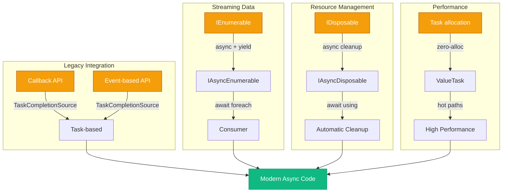

# Async — Просунуті Паттерни

## Навіщо Просунуті Паттерни?

У попередніх темах ми розглянули фундамент асинхронності: `async`/`await`, `Task`, `SynchronizationContext`, та базові сценарії використання. Проте реальні production системи стикаються з викликами, що виходять за межі простих HTTP-запитів чи читання файлів.

Розглянемо три типові проблеми, що вимагають просунутих паттернів:

**Проблема перша: Legacy API без async підтримки.** Ви інтегруєте стару бібліотеку, що використовує callback-based модель (APM — Asynchronous Programming Model) або event-based підхід. Код виглядає як `BeginRead(callback)` або `FileSystemWatcher.Changed += handler`. Як перетворити це на сучасний `await`-able код без переписування всієї бібліотеки?

**Проблема друга: Streaming великих наборів даних.** API повертає мільйони записів з бази даних або paginated REST endpoint з тисячами сторінок. Завантажити все в пам'ять через `List<T>` — це OOM (Out of Memory). Потрібен спосіб обробляти дані "по мірі надходження", асинхронно, з підтримкою `CancellationToken`.

**Проблема третя: Performance-critical hot paths.** Профайлер показує, що 80% часу витрачається на allocation `Task<T>` об'єктів у методах, що виконуються мільйони разів на секунду. Кожен `Task` — це heap allocation, GC pressure. Як оптимізувати без втрати async зручності?

Ця тема надає інструменти для вирішення всіх трьох проблем: `TaskCompletionSource<T>` для інтеграції legacy API, `IAsyncEnumerable<T>` для streaming, `ValueTask<T>` для zero-allocation scenarios, та набір best practices для уникнення типових пасток.

---

## TaskCompletionSource<T>: Міст між Світами

### Концепція: Ручне Керування Task

`TaskCompletionSource<T>` (скорочено TCS) — це "обіцянка" (promise) у термінах JavaScript, або "майбутнє" (future) у термінах Scala. Це об'єкт, що дозволяє **вручну** контролювати стан `Task<T>`: коли він завершиться, з яким результатом, чи з помилкою.

Стандартний `Task.Run()` або `async` метод автоматично керують станом Task — ви не можете "зупинити" Task ззовні або "вручну" встановити результат. TCS дає саме цю можливість.

**Анатомія TaskCompletionSource:**

```csharp
var tcs = new TaskCompletionSource<int>();

// Отримуємо Task, який "чекає" на результат
Task<int> task = tcs.Task;

// Пізніше, з іншого потоку або callback:
tcs.SetResult(42);           // Task завершується успішно з результатом 42
// або
tcs.SetException(new Exception("Помилка"));  // Task завершується з exception
// або
tcs.SetCanceled();           // Task переходить у стан Canceled
```

Ключова ідея: `tcs.Task` — це "читаємий" Task, а `tcs` сам — це "записуваний" контролер. Ви передаєте `tcs.Task` споживачу (який робить `await`), а `tcs` тримаєте у себе для встановлення результату.

### Перетворення Callback-Based API на Async

Найпоширеніший use case — обгортання старих API, що використовують callbacks. Розглянемо класичний приклад: `Timer`.

**Проблема:** `System.Threading.Timer` приймає callback, але не повертає `Task`. Як зробити "async delay" через Timer?

```csharp showLineNumbers [TimerAsTask.cs]
using System.Threading;

static Task DelayWithTimerAsync(int millisecondsDelay, CancellationToken ct = default)
{
    var tcs = new TaskCompletionSource<bool>();

    // Реєструємо cancellation ДО створення Timer
    ct.Register(() =>
    {
        tcs.TrySetCanceled(ct);
    });

    // Створюємо Timer, що спрацює один раз через millisecondsDelay
    Timer? timer = null;
    timer = new Timer(_ =>
    {
        timer?.Dispose();  // Звільняємо ресурси
        tcs.TrySetResult(true);  // Завершуємо Task
    }, null, millisecondsDelay, Timeout.Infinite);

    // Якщо cancellation вже запитано — одразу dispose
    if (ct.IsCancellationRequested)
    {
        timer.Dispose();
        tcs.TrySetCanceled(ct);
    }

    return tcs.Task;
}

// Використання — ідентично Task.Delay
await DelayWithTimerAsync(2000);
Console.WriteLine("2 секунди минуло через Timer!");
```

::note
**Чому `TrySetResult` замість `SetResult`?** Метод `TrySet*` повертає `bool` і не викидає exception, якщо Task вже завершено. Це важливо у race conditions: якщо cancellation та callback спрацюють одночасно, другий виклик просто поверне `false` замість падіння.
::

### Перетворення Event-Based API на Async

Другий поширений сценарій — обгортання подій. Приклад: `FileSystemWatcher` генерує події при зміні файлів, але не має async API.

**Завдання:** Дочекатися першої зміни файлу асинхронно.

```csharp showLineNumbers [FileWatcherAsync.cs]
using System.IO;

static Task<FileSystemEventArgs> WaitForFileChangeAsync(
    string path,
    CancellationToken ct = default)
{
    var tcs = new TaskCompletionSource<FileSystemEventArgs>();
    var watcher = new FileSystemWatcher(path)
    {
        EnableRaisingEvents = true
    };

    // Обробник події — спрацює при першій зміні
    void OnChanged(object sender, FileSystemEventArgs e)
    {
        watcher.EnableRaisingEvents = false;  // Зупиняємо спостереження
        watcher.Dispose();
        tcs.TrySetResult(e);
    }

    watcher.Changed += OnChanged;
    watcher.Created += OnChanged;
    watcher.Deleted += OnChanged;

    // Підтримка cancellation
    ct.Register(() =>
    {
        watcher.EnableRaisingEvents = false;
        watcher.Dispose();
        tcs.TrySetCanceled(ct);
    });

    return tcs.Task;
}

// Використання
using var cts = new CancellationTokenSource(TimeSpan.FromSeconds(30));
try
{
    var change = await WaitForFileChangeAsync(@"C:\Temp", cts.Token);
    Console.WriteLine($"Файл змінено: {change.FullPath}, тип: {change.ChangeType}");
}
catch (OperationCanceledException)
{
    Console.WriteLine("Таймаут — жодних змін за 30 секунд");
}
```

::warning
**Memory Leak Alert!** У коді вище є потенційна витік пам'яті: якщо `ct.Register()` виконується, але Task ніколи не завершується (наприклад, файл ніколи не змінюється), `FileSystemWatcher` залишається в пам'яті назавжди. Правильне рішення — зберігати `CancellationTokenRegistration` і викликати `Dispose()` після завершення Task.
::

### TaskCreationOptions для TCS

`TaskCompletionSource` приймає `TaskCreationOptions` у конструкторі, що впливає на поведінку створеного Task:

```csharp showLineNumbers [TCSOptions.cs]
// За замовчуванням — Task виконується на ThreadPool
var tcs1 = new TaskCompletionSource<int>();

// RunContinuationsAsynchronously — continuation НЕ виконується синхронно
// при SetResult (запобігає блокуванню потоку, що встановлює результат)
var tcs2 = new TaskCompletionSource<int>(TaskCreationOptions.RunContinuationsAsynchronously);

tcs2.Task.ContinueWith(t =>
{
    // Цей код виконається на ThreadPool, а НЕ на потоці, що викликав SetResult
    Console.WriteLine($"Результат: {t.Result}");
});

// Потік, що встановлює результат, НЕ блокується на виконанні continuation
tcs2.SetResult(42);
```

::tip
**Best Practice:** Завжди використовуйте `TaskCreationOptions.RunContinuationsAsynchronously` для TCS у бібліотечному коді. Це запобігає ситуації, коли continuation блокує потік, що встановлює результат (особливо критично для UI потоків або ASP.NET request threads).
::

---

## IAsyncEnumerable<T>: Async Streams

### Проблема: Streaming Великих Наборів Даних

Уявіть API, що повертає мільйон записів з бази даних:

```csharp
// ❌ ПОГАНО: Завантажує ВСЕ в пам'ять одразу
async Task<List<User>> GetAllUsersAsync()
{
    var users = new List<User>();
    // SELECT * FROM Users — 1,000,000 рядків
    // Споживання RAM: ~500 MB
    return users;
}

var allUsers = await GetAllUsersAsync();  // OOM на великих даних
foreach (var user in allUsers)
{
    ProcessUser(user);
}
```

Проблема: метод повертає `Task<List<T>>` — це означає, що **весь** результат має бути завантажений у пам'ять перед поверненням. Для мільйона записів це сотні мегабайт RAM.

**Рішення до C# 8:** Повертати `Task<IEnumerable<T>>` і використовувати `yield return` всередині синхронного ітератора. Але це не дозволяє робити `await` всередині ітератора.

**Рішення C# 8+:** `IAsyncEnumerable<T>` — асинхронний аналог `IEnumerable<T>`, що дозволяє `yield return` + `await` одночасно.

### Синтаксис: async + yield return

```csharp showLineNumbers [AsyncEnumerableBasics.cs]
using System.Collections.Generic;
using System.Threading;

// Метод повертає IAsyncEnumerable<T> і використовує yield return
async IAsyncEnumerable<int> GenerateNumbersAsync(int count)
{
    for (int i = 0; i < count; i++)
    {
        // Можемо робити await всередині ітератора!
        await Task.Delay(100);  // Імітація async операції
        yield return i;         // Повертаємо елемент "по мірі готовності"
    }
}

// Споживання через await foreach
await foreach (var number in GenerateNumbersAsync(10))
{
    Console.WriteLine($"Отримано: {number}");
    // Виводиться по одному числу кожні 100ms, а НЕ все одразу після 1 секунди
}
```

**Ключова різниця з `Task<List<T>>`:**

- `Task<List<T>>`: Метод завершується **після** генерації всіх елементів. Споживач чекає весь час.
- `IAsyncEnumerable<T>`: Метод повертає елементи **по мірі готовності**. Споживач обробляє кожен елемент одразу після отримання.

### Реальний Приклад: Paginated API

Типовий сценарій — REST API з пагінацією (GitHub, Twitter, будь-який CRUD API):

```csharp showLineNumbers [PaginatedAPI.cs]
using System.Net.Http;
using System.Text.Json;
using System.Collections.Generic;
using System.Threading;

record User(int Id, string Name);

async IAsyncEnumerable<User> FetchAllUsersAsync(
    HttpClient http,
    [EnumeratorCancellation] CancellationToken ct = default)
{
    int page = 1;
    bool hasMore = true;

    while (hasMore)
    {
        // Запит до API: GET /users?page=1&limit=100
        var response = await http.GetStringAsync(
            $"https://api.example.com/users?page={page}&limit=100", ct);

        var users = JsonSerializer.Deserialize<List<User>>(response);

        if (users == null || users.Count == 0)
        {
            hasMore = false;
            yield break;  // Завершуємо ітерацію
        }

        // Повертаємо кожного користувача окремо
        foreach (var user in users)
        {
            yield return user;
        }

        page++;
    }
}

// Споживання — обробка по мірі надходження
var http = new HttpClient();
await foreach (var user in FetchAllUsersAsync(http))
{
    Console.WriteLine($"Обробка: {user.Name}");
    // Кожна сторінка завантажується ТІЛЬКИ коли попередня оброблена
    // Споживання RAM: ~100 користувачів одночасно, а НЕ мільйон
}
```

::note
**`[EnumeratorCancellation]` атрибут** — це спеціальний атрибут, що автоматично передає `CancellationToken` з `await foreach` у метод-генератор. Без нього `ct` буде `default`, навіть якщо споживач передав токен через `WithCancellation()`.
::

### Підтримка CancellationToken у Споживача

Споживач може передати `CancellationToken` через extension method `WithCancellation()`:

```csharp showLineNumbers [CancellationSupport.cs]
using var cts = new CancellationTokenSource(TimeSpan.FromSeconds(10));

try
{
    await foreach (var user in FetchAllUsersAsync(http).WithCancellation(cts.Token))
    {
        Console.WriteLine(user.Name);
        // Якщо обробка займе > 10 секунд — OperationCanceledException
    }
}
catch (OperationCanceledException)
{
    Console.WriteLine("Обробка скасована через таймаут");
}
```

### ConfigureAwait для IAsyncEnumerable

Так само як `Task.ConfigureAwait(false)`, `IAsyncEnumerable` підтримує `ConfigureAwait`:

```csharp
await foreach (var item in GetItemsAsync().ConfigureAwait(false))
{
    // Continuation НЕ повертається на captured SynchronizationContext
    // Важливо для бібліотечного коду
}
```

---

## IAsyncDisposable та await using

### Проблема: Async Cleanup

Деякі ресурси вимагають асинхронного звільнення. Приклад: `DbConnection.CloseAsync()`, `Stream.FlushAsync()`, `HttpClient` з pending requests.

Стандартний `IDisposable.Dispose()` — синхронний метод. Якщо всередині `Dispose()` викликати `.Result` або `.Wait()` на async операції — це deadlock у UI/ASP.NET контекстах.

**Рішення:** `IAsyncDisposable` інтерфейс з методом `DisposeAsync()`:

```csharp
public interface IAsyncDisposable
{
    ValueTask DisposeAsync();
}
```

### Синтаксис: await using

```csharp showLineNumbers [AsyncDisposableBasics.cs]
// Клас, що реалізує IAsyncDisposable
class AsyncResource : IAsyncDisposable
{
    private readonly HttpClient _http = new();

    public async Task<string> FetchDataAsync()
    {
        return await _http.GetStringAsync("https://example.com");
    }

    public async ValueTask DisposeAsync()
    {
        Console.WriteLine("Async cleanup...");
        // Асинхронне звільнення ресурсів
        await Task.Delay(100);  // Імітація async операції (flush, close connection)
        _http.Dispose();
        Console.WriteLine("Cleanup завершено");
    }
}

// Використання через await using
await using (var resource = new AsyncResource())
{
    var data = await resource.FetchDataAsync();
    Console.WriteLine(data);
}  // DisposeAsync() викликається автоматично тут

// Або скорочений синтаксис
await using var resource2 = new AsyncResource();
// DisposeAsync() викликається в кінці scope
```

::tip
**Коли використовувати IAsyncDisposable?** Якщо ваш клас тримає ресурси, що мають async методи закриття (`CloseAsync`, `FlushAsync`), або якщо `Dispose()` має викликати async операції — реалізуйте `IAsyncDisposable`. Приклади: database connections, network streams, file handles з buffering.
::

### Реалізація Обох Інтерфейсів

Часто клас має реалізовувати **обидва** `IDisposable` та `IAsyncDisposable` для сумісності:

```csharp showLineNumbers [DualDisposable.cs]
class DatabaseConnection : IDisposable, IAsyncDisposable
{
    private bool _disposed;

    // Async dispose — рекомендований спосіб
    public async ValueTask DisposeAsync()
    {
        if (_disposed) return;

        // Async cleanup
        await FlushBuffersAsync();
        await CloseConnectionAsync();

        _disposed = true;
        GC.SuppressFinalize(this);  // Не потрібен finalizer
    }

    // Sync dispose — fallback для legacy коду
    public void Dispose()
    {
        if (_disposed) return;

        // Синхронне закриття (може бути менш ефективним)
        FlushBuffersAsync().GetAwaiter().GetResult();  // Блокуюче очікування
        CloseConnectionAsync().GetAwaiter().GetResult();

        _disposed = true;
        GC.SuppressFinalize(this);
    }

    private async Task FlushBuffersAsync()
    {
        await Task.Delay(50);  // Імітація flush
        Console.WriteLine("Buffers flushed");
    }

    private async Task CloseConnectionAsync()
    {
        await Task.Delay(50);  // Імітація close
        Console.WriteLine("Connection closed");
    }
}
```

::warning
**Deadlock Risk у Dispose()!** Виклик `.GetAwaiter().GetResult()` у `Dispose()` може призвести до deadlock у UI/ASP.NET контекстах. Якщо можливо, документуйте, що споживачі мають використовувати `await using` замість `using`.
::

---

## ValueTask та ValueTask<T>: Zero-Allocation Async

### Проблема: Task Allocation Overhead

Кожен `Task<T>` — це heap-allocated об'єкт. Для методів, що викликаються мільйони разів на секунду (hot paths у high-performance системах), це створює значний GC pressure.

**Benchmark сценарій:** Метод, що повертає кешоване значення (синхронне завершення):

```csharp
// ❌ Allocation: кожен виклик створює новий Task<int>
async Task<int> GetCachedValueAsync()
{
    return _cachedValue;  // Синхронне повернення, але Task все одно allocate
}

// Виклик 1,000,000 разів = 1,000,000 Task allocations
for (int i = 0; i < 1_000_000; i++)
{
    int value = await GetCachedValueAsync();
}
```

**Рішення:** `ValueTask<T>` — це `struct`, що може представляти як синхронне завершення (без allocation), так і асинхронне (з allocation `Task<T>` всередині).

### Анатомія ValueTask

```csharp
public readonly struct ValueTask<T>
{
    // Внутрішня реалізація (спрощено):
    private readonly T _result;           // Для синхронного завершення
    private readonly Task<T>? _task;      // Для асинхронного завершення
    private readonly bool _hasResult;     // Прапорець: синхронне чи async

    // Конструктор для синхронного результату (zero allocation)
    public ValueTask(T result) { ... }

    // Конструктор для асинхронного Task (fallback)
    public ValueTask(Task<T> task) { ... }
}
```

**Ключова ідея:** Якщо результат доступний синхронно — `ValueTask` тримає його у `_result` (struct field, stack allocation). Якщо потрібна асинхронність — всередині створюється `Task<T>`.

### Коли Використовувати ValueTask

::field-group

::field{name="✅ Використовуйте ValueTask" type="scenarios"}
- **Кешовані результати:** Метод часто повертає значення синхронно (cache hit).
- **Hot paths:** Метод викликається мільйони разів, і allocation критична.
- **Buffered I/O:** Читання з буфера — синхронне, з диска — async.
- **Pooled connections:** З'єднання доступне одразу — sync, інакше — async wait.
::

::field{name="❌ НЕ використовуйте ValueTask" type="scenarios"}
- **Завжди асинхронні операції:** HTTP запити, database queries — завжди async, немає сенсу у ValueTask.
- **Публічні API бібліотек:** `Task<T>` простіший для споживачів, ValueTask має обмеження.
- **Коли не вимірювали:** Передчасна оптимізація. Спочатку benchmark, потім ValueTask.
::

::

### Приклад: Кеш з ValueTask

```csharp showLineNumbers [ValueTaskCache.cs]
using System.Collections.Concurrent;

class AsyncCache<TKey, TValue> where TKey : notnull
{
    private readonly ConcurrentDictionary<TKey, TValue> _cache = new();
    private readonly Func<TKey, Task<TValue>> _valueFactory;

    public AsyncCache(Func<TKey, Task<TValue>> valueFactory)
    {
        _valueFactory = valueFactory;
    }

    // Повертає ValueTask — синхронно якщо в кеші, async якщо ні
    public async ValueTask<TValue> GetAsync(TKey key)
    {
        // Cache hit — синхронне повернення (zero allocation)
        if (_cache.TryGetValue(key, out var cached))
        {
            return cached;
        }

        // Cache miss — асинхронне завантаження
        var value = await _valueFactory(key);
        _cache[key] = value;
        return value;
    }
}

// Використання
var cache = new AsyncCache<int, string>(async id =>
{
    await Task.Delay(100);  // Імітація DB query
    return $"User_{id}";
});

// Перший виклик — async (cache miss)
string user1 = await cache.GetAsync(1);  // 100ms delay

// Другий виклик — sync (cache hit, zero allocation)
string user1Again = await cache.GetAsync(1);  // Instant, no Task allocation
```

### Обмеження ValueTask

::warning
**Критичні правила використання ValueTask:**

1. **Await тільки один раз.** Не можна `await` той самий `ValueTask` двічі:
   ```csharp
   ValueTask<int> vt = GetValueAsync();
   int result1 = await vt;  // ✅ OK
   int result2 = await vt;  // ❌ UNDEFINED BEHAVIOR!
   ```

2. **Не зберігайте у змінних.** Не присвоюйте `ValueTask` у поле класу або довгоживучу змінну:
   ```csharp
   private ValueTask<int> _task;  // ❌ ПОГАНО!
   ```

3. **Не викликайте .Result до завершення.** На відміну від `Task<T>`, `.Result` на незавершеному `ValueTask` — undefined behavior.

4. **Конвертуйте у Task якщо потрібна гнучкість:**
   ```csharp
   ValueTask<int> vt = GetValueAsync();
   Task<int> task = vt.AsTask();  // Тепер можна await кілька разів
   ```
::

### Benchmark: Task vs ValueTask

```csharp showLineNumbers [Benchmark.cs]
using BenchmarkDotNet.Attributes;
using BenchmarkDotNet.Running;

[MemoryDiagnoser]
public class TaskVsValueTaskBenchmark
{
    private int _cachedValue = 42;

    [Benchmark(Baseline = true)]
    public async Task<int> TaskBased()
    {
        return await GetWithTaskAsync();
    }

    [Benchmark]
    public async ValueTask<int> ValueTaskBased()
    {
        return await GetWithValueTaskAsync();
    }

    private Task<int> GetWithTaskAsync()
    {
        // Синхронне повернення, але Task все одно allocate
        return Task.FromResult(_cachedValue);
    }

    private ValueTask<int> GetWithValueTaskAsync()
    {
        // Синхронне повернення, zero allocation
        return new ValueTask<int>(_cachedValue);
    }
}

// Запуск: dotnet run -c Release
BenchmarkRunner.Run<TaskVsValueTaskBenchmark>();
```

::terminal-preview{title="Benchmark Results"}
<div class="line"><span class="opacity-40">|</span> Method          <span class="opacity-40">|</span> Mean      <span class="opacity-40">|</span> Allocated <span class="opacity-40">|</span></div>
<div class="line"><span class="opacity-40">|</span> --------------- <span class="opacity-40">|</span> --------- <span class="opacity-40">|</span> --------- <span class="opacity-40">|</span></div>
<div class="line"><span class="opacity-40">|</span> TaskBased       <span class="opacity-40">|</span> <span class="text-yellow-400">45.2 ns</span>   <span class="opacity-40">|</span> <span class="text-rose-400">32 B</span>      <span class="opacity-40">|</span></div>
<div class="line"><span class="opacity-40">|</span> ValueTaskBased  <span class="opacity-40">|</span> <span class="text-green-400">12.8 ns</span>   <span class="opacity-40">|</span> <span class="text-green-400 font-bold">0 B</span>       <span class="opacity-40">|</span></div>
::

**Висновок:** ValueTask у 3.5 рази швидший і не створює allocation для синхронних шляхів.

---

## Best Practices: Повний Список

### ❌ Async Void — Тільки для Event Handlers

```csharp
// ❌ ПОГАНО: async void у звичайному методі
async void ProcessDataAsync()  // Exceptions "втрачаються"!
{
    await Task.Delay(100);
    throw new Exception("Boom");  // Падіння всього процесу
}

// ✅ ДОБРЕ: async Task
async Task ProcessDataAsync()
{
    await Task.Delay(100);
    throw new Exception("Boom");  // Exception можна catch через await
}

// ✅ ВИНЯТОК: event handlers
button.Click += async (sender, e) =>  // async void OK тут
{
    await LoadDataAsync();
};
```

::caution
**Чому async void небезпечний?** Exception у `async void` методі не можна catch через `try/catch` навколо виклику. Exception потрапляє у `TaskScheduler.UnobservedTaskException` або падає весь процес.
::

### ❌ .Result / .Wait() — Deadlock Гарантовано

```csharp
// ❌ ПОГАНО: блокуюче очікування у UI/ASP.NET
public void ButtonClick()
{
    var result = GetDataAsync().Result;  // DEADLOCK у UI thread!
}

// ✅ ДОБРЕ: async all the way
public async void ButtonClick()  // async void OK для event handler
{
    var result = await GetDataAsync();
}
```

### ❌ Task.Run() у ASP.NET — Fake Async

```csharp
// ❌ ПОГАНО: "fake async" у ASP.NET
public async Task<IActionResult> GetUsers()
{
    return await Task.Run(() =>  // Марнує ThreadPool потік!
    {
        var users = _db.Users.ToList();  // Синхронний EF Core
        return Ok(users);
    });
}

// ✅ ДОБРЕ: справжній async
public async Task<IActionResult> GetUsers()
{
    var users = await _db.Users.ToListAsync();  // Async EF Core
    return Ok(users);
}
```

::note
**Чому Task.Run() погано у ASP.NET?** ASP.NET request вже виконується на ThreadPool потоці. `Task.Run()` бере **другий** потік з пулу, щоб виконати синхронну роботу — це марнування ресурсів. Використовуйте справжні async API (EF Core `*Async`, ADO.NET `*Async`).
::

### ✅ ConfigureAwait(false) у Бібліотеках

```csharp
// Бібліотечний код — НЕ потребує повернення на UI thread
public async Task<string> FetchDataAsync()
{
    var response = await _http.GetStringAsync(url).ConfigureAwait(false);
    var processed = await ProcessAsync(response).ConfigureAwait(false);
    return processed;
}

// UI код — потребує повернення на UI thread
private async void Button_Click(object sender, EventArgs e)
{
    var data = await FetchDataAsync();  // Без ConfigureAwait
    textBox.Text = data;  // Доступ до UI — потрібен UI thread
}
```

### ✅ CancellationToken Скрізь

```csharp
// ✅ ДОБРЕ: кожен async метод приймає CancellationToken
public async Task<List<User>> GetUsersAsync(CancellationToken ct = default)
{
    var response = await _http.GetAsync("/users", ct);
    var users = await response.Content.ReadFromJsonAsync<List<User>>(ct);
    return users;
}

// Споживач може скасувати операцію
using var cts = new CancellationTokenSource(TimeSpan.FromSeconds(5));
try
{
    var users = await GetUsersAsync(cts.Token);
}
catch (OperationCanceledException)
{
    Console.WriteLine("Запит скасовано через таймаут");
}
```

### ✅ Prefer ValueTask для Hot Paths

```csharp
// Метод викликається мільйони разів — використовуйте ValueTask
public ValueTask<int> GetCountAsync()
{
    if (_cache.TryGetValue("count", out int cached))
        return new ValueTask<int>(cached);  // Sync path, zero allocation

    return new ValueTask<int>(LoadCountFromDbAsync());  // Async path
}

async Task<int> LoadCountFromDbAsync()
{
    // Реальна async робота
    return await _db.QuerySingleAsync<int>("SELECT COUNT(*) FROM Users");
}
```

---

## Common Pitfalls: Типові Пастки

### Sync-over-Async: .Result та .GetAwaiter().GetResult()

**Проблема:** Блокуюче очікування async операції у синхронному контексті.

```csharp
// ❌ АНТИПАТЕРН: sync-over-async
public string GetData()
{
    // Deadlock у UI/ASP.NET, thread starvation у консолі
    return GetDataAsync().Result;
}

// ✅ РІШЕННЯ 1: Зробіть метод async
public async Task<string> GetDataAsync()
{
    return await FetchFromApiAsync();
}

// ✅ РІШЕННЯ 2: Якщо НЕМОЖЛИВО зробити async (legacy constraint)
public string GetData()
{
    // Використовуйте Task.Run + .GetAwaiter().GetResult() як останній варіант
    return Task.Run(async () => await GetDataAsync()).GetAwaiter().GetResult();
}
```

::warning
**Deadlock Mechanism:** У UI/ASP.NET контекстах `SynchronizationContext` гарантує, що continuation після `await` виконається на тому ж потоці. Якщо цей потік заблокований через `.Result` — continuation ніколи не виконається, бо потік чекає на Task, а Task чекає на потік.
::

### Fire-and-Forget: Забуті Task

**Проблема:** Запуск async операції без очікування результату — exceptions губляться.

```csharp
// ❌ ПОГАНО: exception у LogAsync губиться
public void ProcessRequest()
{
    LogAsync();  // Compiler warning CS4014: "Because this call is not awaited..."
    // Якщо LogAsync кине exception — ніхто не дізнається
}

// ✅ РІШЕННЯ 1: Await якщо можливо
public async Task ProcessRequestAsync()
{
    await LogAsync();
}

// ✅ РІШЕННЯ 2: Явний fire-and-forget з обробкою помилок
public void ProcessRequest()
{
    _ = LogAndForgetAsync();  // Явно ігноруємо Task
}

async Task LogAndForgetAsync()
{
    try
    {
        await LogAsync();
    }
    catch (Exception ex)
    {
        // Логуємо помилку у безпечне місце
        Console.Error.WriteLine($"Log failed: {ex}");
    }
}
```

### Lazy<Task<T>>: Lazy Async Initialization

**Проблема:** Потрібна ледача ініціалізація async ресурсу (виконується один раз при першому зверненні).

```csharp showLineNumbers [LazyAsyncInit.cs]
class ExpensiveResource
{
    // ❌ ПОГАНО: Lazy<T> не підтримує async
    private readonly Lazy<Task<string>> _data = new(() =>
    {
        // Не можемо використати await тут!
        return LoadDataAsync();
    });

    // ✅ ДОБРЕ: Lazy<Task<T>> pattern
    private readonly Lazy<Task<string>> _dataLazy = new(async () =>
    {
        await Task.Delay(1000);  // Імітація дорогої операції
        return "Expensive data";
    });

    public Task<string> GetDataAsync()
    {
        // Перший виклик — запускає async ініціалізацію
        // Наступні виклики — повертають той самий Task
        return _dataLazy.Value;
    }
}

// Використання
var resource = new ExpensiveResource();
string data1 = await resource.GetDataAsync();  // 1 секунда затримки
string data2 = await resource.GetDataAsync();  // Instant — той самий Task
```

::tip
**AsyncLazy<T> з Nito.AsyncEx:** Бібліотека `Nito.AsyncEx` надає `AsyncLazy<T>` — спеціалізовану реалізацію для async lazy initialization з правильною обробкою exceptions та cancellation.
::

### Retry Pattern з Async

**Проблема:** Потрібно повторити async операцію N разів при помилці.

```csharp showLineNumbers [RetryPattern.cs]
static async Task<T> RetryAsync<T>(
    Func<Task<T>> operation,
    int maxRetries = 3,
    TimeSpan? delay = null,
    CancellationToken ct = default)
{
    delay ??= TimeSpan.FromSeconds(1);

    for (int attempt = 1; attempt <= maxRetries; attempt++)
    {
        try
        {
            return await operation();
        }
        catch (Exception ex) when (attempt < maxRetries)
        {
            Console.WriteLine($"Спроба {attempt} невдала: {ex.Message}. Повтор через {delay}...");
            await Task.Delay(delay.Value, ct);
        }
    }

    // Останній attempt без catch — exception пробросується
    return await operation();
}

// Використання
var result = await RetryAsync(
    operation: async () =>
    {
        var response = await httpClient.GetAsync("https://flaky-api.com/data");
        response.EnsureSuccessStatusCode();
        return await response.Content.ReadAsStringAsync();
    },
    maxRetries: 5,
    delay: TimeSpan.FromSeconds(2)
);
```

### Async Constructor Antipattern

**Проблема:** Конструктори не можуть бути `async`.

```csharp
// ❌ НЕМОЖЛИВО: async constructor
class MyClass
{
    public async MyClass()  // Compiler error!
    {
        await InitializeAsync();
    }
}

// ✅ РІШЕННЯ 1: Factory Method
class MyClass
{
    private MyClass() { }  // Private constructor

    public static async Task<MyClass> CreateAsync()
    {
        var instance = new MyClass();
        await instance.InitializeAsync();
        return instance;
    }

    private async Task InitializeAsync()
    {
        await Task.Delay(100);
    }
}

// Використання
var obj = await MyClass.CreateAsync();

// ✅ РІШЕННЯ 2: Lazy initialization
class MyClass
{
    private Task? _initTask;

    public MyClass()
    {
        // Конструктор синхронний, ініціалізація відкладена
    }

    private async Task EnsureInitializedAsync()
    {
        if (_initTask == null)
        {
            _initTask = InitializeAsync();
        }
        await _initTask;
    }

    public async Task DoWorkAsync()
    {
        await EnsureInitializedAsync();
        // Робота...
    }

    private async Task InitializeAsync()
    {
        await Task.Delay(100);
    }
}
```

---

## Custom Awaitables: Для Допитливих

### GetAwaiter Pattern

Будь-який тип може стати "awaitable", якщо він реалізує pattern `GetAwaiter()`. Це дозволяє використовувати `await` з кастомними типами.

**Мінімальний контракт:**

```csharp showLineNumbers [CustomAwaitable.cs]
using System.Runtime.CompilerServices;

// Кастомний awaitable тип
class CustomTask
{
    private readonly Task _innerTask;

    public CustomTask(Task task) => _innerTask = task;

    // Pattern method — компілятор шукає саме цей метод
    public CustomAwaiter GetAwaiter() => new CustomAwaiter(_innerTask);
}

// Awaiter — виконує реальну роботу
class CustomAwaiter : INotifyCompletion
{
    private readonly TaskAwaiter _innerAwaiter;

    public CustomAwaiter(Task task) => _innerAwaiter = task.GetAwaiter();

    // Чи операція вже завершена?
    public bool IsCompleted => _innerAwaiter.IsCompleted;

    // Отримати результат (викликається після завершення)
    public void GetResult() => _innerAwaiter.GetResult();

    // Зареєструвати continuation (що виконати після завершення)
    public void OnCompleted(Action continuation) => _innerAwaiter.OnCompleted(continuation);
}

// Використання — await працює з CustomTask!
var customTask = new CustomTask(Task.Delay(1000));
await customTask;
Console.WriteLine("Custom await завершено!");
```

### Практичний Приклад: Timeout Awaitable

Створимо awaitable, що автоматично додає timeout до будь-якої операції:

```csharp showLineNumbers [TimeoutAwaitable.cs]
using System.Runtime.CompilerServices;

static class TaskExtensions
{
    public static TimeoutAwaitable<T> WithTimeout<T>(this Task<T> task, TimeSpan timeout)
    {
        return new TimeoutAwaitable<T>(task, timeout);
    }
}

class TimeoutAwaitable<T>
{
    private readonly Task<T> _task;
    private readonly TimeSpan _timeout;

    public TimeoutAwaitable(Task<T> task, TimeSpan timeout)
    {
        _task = task;
        _timeout = timeout;
    }

    public TaskAwaiter<T> GetAwaiter()
    {
        // Створюємо Task, що завершиться або при завершенні _task, або при timeout
        var timeoutTask = Task.Delay(_timeout).ContinueWith(_ =>
            throw new TimeoutException($"Операція не завершилась за {_timeout}"));

        var completedTask = Task.WhenAny(_task, timeoutTask)
            .ContinueWith(t => _task.Result);  // Повертаємо результат _task

        return completedTask.GetAwaiter();
    }
}

// Використання — елегантний синтаксис
var result = await FetchDataAsync().WithTimeout(TimeSpan.FromSeconds(5));
```

::note
**Навіщо кастомні awaitables?** У більшості випадків достатньо `Task` та `ValueTask`. Кастомні awaitables корисні для бібліотек, що надають специфічну семантику (timeout, retry, circuit breaker) або оптимізацій (zero-allocation для специфічних сценаріїв).
::

---

## Наскрізний Приклад: Async Producer-Consumer Pipeline

Побудуємо повноцінний async pipeline для обробки даних з використанням всіх вивчених паттернів.

::steps

### Крок 1: Структура проєкту

```bash
dotnet new console -n AsyncPipeline
cd AsyncPipeline
dotnet add package System.Threading.Channels
```

### Крок 2: Producer — IAsyncEnumerable

```csharp showLineNumbers [Producer.cs]
using System.Collections.Generic;
using System.Threading;

class DataProducer
{
    // Генеруємо дані асинхронно (імітація paginated API)
    public async IAsyncEnumerable<int> ProduceAsync(
        int totalItems,
        [EnumeratorCancellation] CancellationToken ct = default)
    {
        for (int i = 1; i <= totalItems; i++)
        {
            ct.ThrowIfCancellationRequested();

            // Імітація затримки мережі
            await Task.Delay(50, ct);

            yield return i;
        }
    }
}
```

### Крок 3: Processor — ValueTask для оптимізації

```csharp showLineNumbers [Processor.cs]
using System.Collections.Concurrent;

class DataProcessor
{
    private readonly ConcurrentDictionary<int, string> _cache = new();

    // ValueTask — синхронно для кешованих, async для нових
    public async ValueTask<string> ProcessAsync(int value, CancellationToken ct = default)
    {
        // Cache hit — синхронне повернення
        if (_cache.TryGetValue(value, out var cached))
        {
            return cached;
        }

        // Cache miss — обробка
        await Task.Delay(100, ct);  // Імітація обробки
        var result = $"Processed_{value}";

        _cache[value] = result;
        return result;
    }
}
```

### Крок 4: Consumer — await using для cleanup

```csharp showLineNumbers [Consumer.cs]
using System.IO;

class DataConsumer : IAsyncDisposable
{
    private readonly StreamWriter _writer;

    public DataConsumer(string outputPath)
    {
        _writer = new StreamWriter(outputPath, append: false);
    }

    public async Task ConsumeAsync(string data, CancellationToken ct = default)
    {
        await _writer.WriteLineAsync(data.AsMemory(), ct);
    }

    public async ValueTask DisposeAsync()
    {
        await _writer.FlushAsync();
        await _writer.DisposeAsync();
    }
}
```

### Крок 5: Pipeline Orchestrator

```csharp showLineNumbers [Pipeline.cs]
class AsyncPipeline
{
    private readonly DataProducer _producer = new();
    private readonly DataProcessor _processor = new();

    public async Task RunAsync(
        int itemCount,
        string outputPath,
        CancellationToken ct = default)
    {
        await using var consumer = new DataConsumer(outputPath);

        int processed = 0;
        var sw = System.Diagnostics.Stopwatch.StartNew();

        // IAsyncEnumerable — streaming без завантаження всього в пам'ять
        await foreach (var item in _producer.ProduceAsync(itemCount, ct))
        {
            // ValueTask — оптимізація для кешованих значень
            var result = await _processor.ProcessAsync(item, ct);

            // IAsyncDisposable — правильний async cleanup
            await consumer.ConsumeAsync(result, ct);

            processed++;

            if (processed % 10 == 0)
            {
                Console.WriteLine($"Оброблено: {processed}/{itemCount} " +
                    $"({sw.Elapsed.TotalSeconds:F1}s)");
            }
        }

        sw.Stop();
        Console.WriteLine($"\n✅ Pipeline завершено: {processed} елементів за {sw.Elapsed.TotalSeconds:F1}s");
    }
}
```

### Крок 6: Точка входу з CancellationToken

```csharp showLineNumbers [Program.cs]
using System;
using System.Threading;

var cts = new CancellationTokenSource();

// Ctrl+C для graceful shutdown
Console.CancelKeyPress += (_, e) =>
{
    e.Cancel = true;
    Console.WriteLine("\n⚠️ Скасування pipeline...");
    cts.Cancel();
};

var pipeline = new AsyncPipeline();

try
{
    await pipeline.RunAsync(
        itemCount: 100,
        outputPath: "output.txt",
        ct: cts.Token
    );
}
catch (OperationCanceledException)
{
    Console.WriteLine("Pipeline скасовано користувачем");
}
catch (Exception ex)
{
    Console.WriteLine($"❌ Помилка: {ex.Message}");
}
```

### Крок 7: Запуск

```bash
dotnet run
```

::

::terminal-preview{title="Async Pipeline Output"}
<div class="line"><span class="opacity-40">$</span> <strong class="font-bold">dotnet run</strong></div>
<div class="line">Оброблено: 10/100 (0.6s)</div>
<div class="line">Оброблено: 20/100 (1.1s)</div>
<div class="line">Оброблено: 30/100 (1.6s)</div>
<div class="line">Оброблено: 40/100 (2.1s)</div>
<div class="line">Оброблено: 50/100 (2.6s)</div>
<div class="line">Оброблено: 60/100 (3.1s)</div>
<div class="line">Оброблено: 70/100 (3.6s)</div>
<div class="line">Оброблено: 80/100 (4.1s)</div>
<div class="line">Оброблено: 90/100 (4.6s)</div>
<div class="line">Оброблено: 100/100 (5.1s)</div>
<div class="line"></div>
<div class="line"><span class="text-green-400 font-bold">✅ Pipeline завершено: 100 елементів за 5.1s</span></div>
::

---

## Діаграма: Async Patterns Ecosystem

::mermaid



::

---

## Підсумок

::card-group

::card{title="TaskCompletionSource<T>" icon="i-lucide-git-merge"}

- Ручне керування станом Task
- Перетворення callback/event API на async
- `TrySetResult/Exception/Canceled` для безпеки
- `RunContinuationsAsynchronously` для бібліотек

::

::card{title="IAsyncEnumerable<T>" icon="i-lucide-workflow"}

- Streaming великих наборів даних
- `async` + `yield return` одночасно
- `await foreach` для споживання
- `[EnumeratorCancellation]` для CancellationToken

::

::card{title="IAsyncDisposable" icon="i-lucide-trash-2"}

- Async cleanup ресурсів
- `await using` синтаксис
- Реалізуйте обидва IDisposable + IAsyncDisposable
- Уникайте `.GetAwaiter().GetResult()` у Dispose()

::

::card{title="ValueTask<T>" icon="i-lucide-zap"}

- Zero-allocation для синхронних шляхів
- Використовуйте у hot paths з кешуванням
- Await тільки один раз!
- `.AsTask()` для гнучкості

::

::

---

## Практичні Завдання

### Рівень 1: TaskCompletionSource Wrapper

Напишіть обгортку для `System.Threading.Timer`, що:
1. Повертає `Task`, що завершується після заданого часу
2. Підтримує `CancellationToken` (скасування таймера)
3. Правильно звільняє ресурси (Timer.Dispose)
4. Обробляє race condition між timeout та cancellation

**Тести:**
- Таймер на 1 секунду завершується успішно
- Cancellation через 500ms скасовує таймер
- Повторний виклик не створює memory leak

### Рівень 2: Async Producer-Consumer з IAsyncEnumerable

Реалізуйте систему обробки логів:
1. `LogProducer` читає файл по рядках через `IAsyncEnumerable<string>`
2. `LogParser` парсить рядки у structured logs (async, з кешуванням через ValueTask)
3. `LogAggregator` групує логи за рівнем (ERROR, WARN, INFO)
4. `LogWriter` записує результат у JSON файл (IAsyncDisposable)
5. Підтримка CancellationToken на всіх рівнях

**Вимоги:**
- Обробка файлів до 1 GB без OOM
- Graceful shutdown при Ctrl+C
- Progress reporting кожні 10,000 рядків

### Рівень 3: Custom AsyncLock

Реалізуйте власний `AsyncLock` через `TaskCompletionSource`:
1. `LockAsync()` повертає `Task<IDisposable>` (або `ValueTask<IAsyncDisposable>`)
2. Тільки один потік може тримати lock одночасно
3. Інші потоки чекають у черзі (FIFO)
4. Підтримка CancellationToken (скасування очікування)
5. Підтримка timeout

**Тести:**
- 10 потоків конкурують за lock — всі виконуються послідовно
- Cancellation звільняє місце у черзі
- Timeout викидає TimeoutException
- Dispose lock звільняє наступний waiter

**Benchmark:**
- Порівняйте з `SemaphoreSlim(1,1)` за швидкістю та allocation

---

::tip
**Наступна тема:** [Channels — System.Threading.Channels](/csharp/system-programming-windows/channels) — async-native producer/consumer patterns для high-performance pipelines.
::


