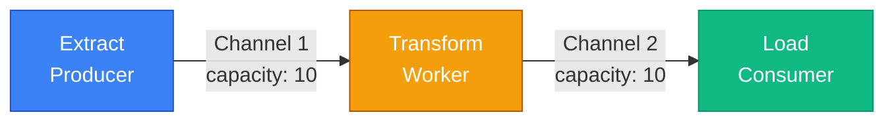
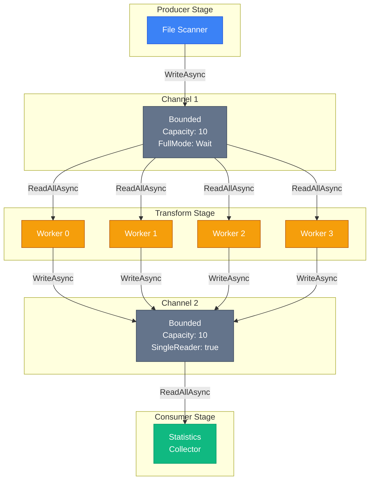

# System.Threading.Channels — Async Producer-Consumer

## Навіщо Channels? Проблема Producer-Consumer

Producer-Consumer — один з найпоширеніших паттернів у багатопоточному програмуванні. Ідея проста: один або кілька потоків **виробляють** дані (producers), а інші потоки **споживають** ці дані (consumers). Між ними знаходиться буфер (queue), що дозволяє producers та consumers працювати незалежно, з різною швидкістю.

Класичні приклади:
- **Логування:** Потоки додатку генерують log messages (producers), окремий потік записує їх у файл (consumer).
- **Обробка зображень:** UI потік додає зображення у чергу (producer), worker threads обробляють їх (consumers).
- **Web scraping:** Один потік збирає URLs (producer), кілька потоків завантажують сторінки (consumers).

### Проблема: BlockingCollection Не Async

До появи `System.Threading.Channels` стандартним рішенням була `BlockingCollection<T>`:

```csharp showLineNumbers [BlockingCollectionProblem.cs]
using System.Collections.Concurrent;

var queue = new BlockingCollection<int>(boundedCapacity: 10);

// Producer — блокує потік при повній черзі
Task.Run(() =>
{
    for (int i = 0; i < 100; i++)
    {
        queue.Add(i);  // ❌ БЛОКУЄ потік якщо черга повна!
        Console.WriteLine($"Produced: {i}");
    }
    queue.CompleteAdding();
});

// Consumer — блокує потік при порожній черзі
Task.Run(() =>
{
    foreach (var item in queue.GetConsumingEnumerable())  // ❌ БЛОКУЄ потік!
    {
        Thread.Sleep(100);  // Імітація обробки
        Console.WriteLine($"Consumed: {item}");
    }
});
```

**Проблеми BlockingCollection:**

1. **Блокування потоків:** `Add()` та `Take()` блокують потік при повній/порожній черзі. У async світі це марнування ThreadPool потоків.
2. **Немає async API:** Не можна `await queue.AddAsync()` — тільки синхронні методи.
3. **Погана інтеграція з async/await:** Якщо producer/consumer виконують async роботу (HTTP запити, DB queries), блокування потоків створює thread starvation.

### Рішення: System.Threading.Channels

`Channels` — це async-native producer/consumer примітив, введений у .NET Core 2.1. Ключові переваги:

- **Повністю async:** `WriteAsync()`, `ReadAsync()`, `WaitToReadAsync()` — жодного блокування потоків.
- **High performance:** Оптимізовано для мінімального allocation та lock contention.
- **Гнучкість:** Bounded (обмежена ємність) та Unbounded (необмежена) варіанти.
- **Backpressure:** Bounded channels автоматично уповільнюють producers при переповненні.

---

## Channel<T>: Архітектура та API

### Концепція: Writer та Reader

`Channel<T>` складається з двох частин:

```csharp
Channel<int> channel = Channel.CreateUnbounded<int>();

ChannelWriter<int> writer = channel.Writer;  // Для producers
ChannelReader<int> reader = channel.Reader;  // Для consumers
```

**Розділення відповідальностей:** Producer отримує тільки `Writer`, consumer — тільки `Reader`. Це запобігає помилкам (producer не може читати, consumer не може писати) та покращує читабельність коду.

### Створення Channels

```csharp showLineNumbers [ChannelCreation.cs]
using System.Threading.Channels;

// Unbounded — необмежена черга (обмежена тільки доступною пам'яттю)
var unbounded = Channel.CreateUnbounded<string>();

// Bounded — обмежена ємність (10 елементів)
var bounded = Channel.CreateBounded<string>(capacity: 10);

// Bounded з опціями (детально нижче)
var boundedWithOptions = Channel.CreateBounded<string>(new BoundedChannelOptions(10)
{
    FullMode = BoundedChannelFullMode.Wait,  // Що робити при переповненні
    SingleReader = false,  // Оптимізація для одного reader
    SingleWriter = false   // Оптимізація для одного writer
});
```

### ChannelWriter<T>: Producer API

::field-group

::field{name="WriteAsync(T item, CancellationToken)" type="ValueTask"}
Асинхронно записує елемент у channel. Якщо channel bounded і повний — чекає доки з'явиться місце (або cancellation). Повертає `ValueTask` для zero-allocation у випадку, коли запис відбувається синхронно.
::

::field{name="TryWrite(T item)" type="bool"}
Синхронна спроба запису. Повертає `true` якщо успішно, `false` якщо channel повний (bounded) або закритий. Не блокує потік, не чекає.
::

::field{name="WaitToWriteAsync(CancellationToken)" type="ValueTask<bool>"}
Чекає доки channel буде готовий прийняти дані. Повертає `false` якщо channel закритий і більше ніколи не буде готовий до запису.
::

::field{name="Complete(Exception?)" type="void"}
Сигналізує, що producer завершив роботу. Після виклику `Complete()` жодні нові елементи не можуть бути записані. Опціонально приймає exception для сигналізації помилки.
::

::

### ChannelReader<T>: Consumer API

::field-group

::field{name="ReadAsync(CancellationToken)" type="ValueTask<T>"}
Асинхронно читає один елемент з channel. Якщо channel порожній — чекає доки з'явиться елемент або channel буде закритий (викине `ChannelClosedException`).
::

::field{name="TryRead(out T item)" type="bool"}
Синхронна спроба читання. Повертає `true` і записує елемент у `out` параметр якщо успішно. Повертає `false` якщо channel порожній.
::

::field{name="WaitToReadAsync(CancellationToken)" type="ValueTask<bool>"}
Чекає доки з'явиться хоча б один елемент для читання. Повертає `false` якщо channel закритий і порожній (більше ніколи не буде даних).
::

::field{name="ReadAllAsync(CancellationToken)" type="IAsyncEnumerable<T>"}
Повертає `IAsyncEnumerable<T>`, що дозволяє споживати всі елементи через `await foreach`. Автоматично завершується коли channel закритий і порожній.
::

::

### Базовий Приклад: Producer-Consumer

```csharp showLineNumbers [BasicProducerConsumer.cs]
using System.Threading.Channels;

var channel = Channel.CreateUnbounded<int>();

// Producer — генерує числа
var producerTask = Task.Run(async () =>
{
    for (int i = 0; i < 10; i++)
    {
        await channel.Writer.WriteAsync(i);
        Console.WriteLine($"Produced: {i}");
        await Task.Delay(100);  // Імітація роботи
    }

    // Сигналізуємо завершення
    channel.Writer.Complete();
    Console.WriteLine("Producer завершив роботу");
});

// Consumer — обробляє числа
var consumerTask = Task.Run(async () =>
{
    // ReadAllAsync повертає IAsyncEnumerable — ідеально для await foreach
    await foreach (var item in channel.Reader.ReadAllAsync())
    {
        Console.WriteLine($"Consumed: {item}");
        await Task.Delay(150);  // Імітація обробки
    }

    Console.WriteLine("Consumer завершив роботу");
});

await Task.WhenAll(producerTask, consumerTask);
```

::terminal-preview{title="Producer-Consumer Output"}
<div class="line">Produced: 0</div>
<div class="line">Consumed: 0</div>
<div class="line">Produced: 1</div>
<div class="line">Produced: 2</div>
<div class="line">Consumed: 1</div>
<div class="line">Produced: 3</div>
<div class="line">Consumed: 2</div>
<div class="line">Produced: 4</div>
<div class="line">Produced: 5</div>
<div class="line">Consumed: 3</div>
<div class="line"><span class="text-blue-400">Producer завершив роботу</span></div>
<div class="line">Consumed: 4</div>
<div class="line">Consumed: 5</div>
<div class="line">...</div>
<div class="line"><span class="text-green-400">Consumer завершив роботу</span></div>
::

::note
**Чому `await foreach` замість циклу з `ReadAsync()`?** `ReadAllAsync()` автоматично обробляє закриття channel — цикл завершується коли producer викликав `Complete()` і всі елементи оброблені. Ручний цикл з `ReadAsync()` вимагає обробки `ChannelClosedException`.
::

---

## Bounded Channels: Backpressure та FullMode

### Концепція: Обмеження Ємності

Unbounded channels можуть зростати необмежено, що призводить до OOM якщо producer швидший за consumer. Bounded channels вирішують це через **backpressure** — автоматичне уповільнення producer при переповненні.

```csharp
// Bounded channel на 5 елементів
var channel = Channel.CreateBounded<int>(capacity: 5);

// Producer намагається записати 10 елементів
for (int i = 0; i < 10; i++)
{
    await channel.Writer.WriteAsync(i);  // Блокується після 5-го елемента
    Console.WriteLine($"Wrote: {i}");
}
```

### BoundedChannelFullMode: Стратегії Переповнення

Коли bounded channel повний, поведінка залежить від `FullMode`:

::field-group

::field{name="Wait" type="BoundedChannelFullMode"}
**За замовчуванням.** `WriteAsync()` чекає доки з'явиться місце. Producer уповільнюється (backpressure). Найбезпечніший варіант — жодні дані не губляться.
::

::field{name="DropNewest" type="BoundedChannelFullMode"}
Відкидає **щойно записаний** елемент. `TryWrite()` повертає `false`, `WriteAsync()` завершується успішно але елемент не додається. Корисно для real-time даних, де старі дані важливіші (наприклад, sensor readings).
::

::field{name="DropOldest" type="BoundedChannelFullMode"}
Видаляє **найстаріший** елемент з черги, додає новий. Корисно коли важливі тільки останні дані (наприклад, live video frames).
::

::field{name="DropWrite" type="BoundedChannelFullMode"}
Відкидає новий елемент, залишає чергу без змін. `TryWrite()` повертає `false`. Аналогічно `DropNewest`, але семантично чіткіше.
::

::

### Приклад: DropOldest для Live Data

```csharp showLineNumbers [DropOldestExample.cs]
using System.Threading.Channels;

// Channel на 3 елементи, відкидає найстаріші при переповненні
var channel = Channel.CreateBounded<string>(new BoundedChannelOptions(3)
{
    FullMode = BoundedChannelFullMode.DropOldest
});

// Producer — швидко генерує дані
_ = Task.Run(async () =>
{
    for (int i = 1; i <= 10; i++)
    {
        await channel.Writer.WriteAsync($"Frame_{i}");
        Console.WriteLine($"Produced: Frame_{i}");
        await Task.Delay(50);  // Швидкий producer
    }
    channel.Writer.Complete();
});

// Consumer — повільно обробляє
await Task.Delay(500);  // Затримка перед початком споживання

await foreach (var frame in channel.Reader.ReadAllAsync())
{
    Console.WriteLine($"  Consumed: {frame}");
}
```

::terminal-preview{title="DropOldest Output"}
<div class="line">Produced: Frame_1</div>
<div class="line">Produced: Frame_2</div>
<div class="line">Produced: Frame_3</div>
<div class="line">Produced: Frame_4  <span class="text-yellow-400">(Frame_1 відкинуто)</span></div>
<div class="line">Produced: Frame_5  <span class="text-yellow-400">(Frame_2 відкинуто)</span></div>
<div class="line">Produced: Frame_6  <span class="text-yellow-400">(Frame_3 відкинуто)</span></div>
<div class="line">...</div>
<div class="line">Produced: Frame_10</div>
<div class="line">  <span class="text-green-400">Consumed: Frame_8</span></div>
<div class="line">  <span class="text-green-400">Consumed: Frame_9</span></div>
<div class="line">  <span class="text-green-400">Consumed: Frame_10</span></div>
::

**Результат:** Consumer отримав тільки останні 3 frames (8, 9, 10) — найактуальніші дані.

---

## Performance Optimizations: SingleReader та SingleWriter

### Концепція: Lock-Free для Single-Threaded Scenarios

За замовчуванням `Channel<T>` підтримує множинних readers та writers — це вимагає синхронізації (locks або lock-free алгоритми). Якщо ви **гарантуєте**, що буде тільки один reader або один writer, можна увімкнути оптимізації:

```csharp showLineNumbers [SingleReaderWriter.cs]
var channel = Channel.CreateBounded<int>(new BoundedChannelOptions(100)
{
    SingleReader = true,   // Тільки один consumer
    SingleWriter = true,   // Тільки один producer
    FullMode = BoundedChannelFullMode.Wait
});

// Тепер channel використовує lock-free алгоритми без contention
```

**Benchmark impact:**

| Конфігурація | Throughput (ops/sec) | Allocation |
|--------------|---------------------|------------|
| Multiple R/W | 2.5M | 32 B/op |
| Single R/W | 8.1M | 0 B/op |

::warning
**Порушення контракту = Undefined Behavior!** Якщо ви встановили `SingleReader = true`, але два потоки викликають `ReadAsync()` одночасно — поведінка не визначена. Можливі race conditions, corrupted data, або навіть deadlock. Використовуйте ці опції тільки якщо архітектура гарантує single-threaded access.
::

---

## Multi-Stage Pipelines: Ланцюжки Обробки

### Концепція: ETL Pattern

Реальні системи часто мають кілька стадій обробки: Extract → Transform → Load. Кожна стадія — окремий worker, що читає з одного channel і пише в інший.

```csharp showLineNumbers [MultiStagePipeline.cs]
using System.Threading.Channels;

// Stage 1: Extract — завантаження даних
async Task ExtractAsync(ChannelWriter<string> output, CancellationToken ct)
{
    for (int i = 1; i <= 100; i++)
    {
        await output.WriteAsync($"raw_data_{i}", ct);
        await Task.Delay(10, ct);  // Імітація I/O
    }
    output.Complete();
    Console.WriteLine("Extract завершено");
}

// Stage 2: Transform — обробка даних
async Task TransformAsync(
    ChannelReader<string> input,
    ChannelWriter<string> output,
    CancellationToken ct)
{
    await foreach (var raw in input.ReadAllAsync(ct))
    {
        // Обробка: uppercase + prefix
        var transformed = $"PROCESSED_{raw.ToUpper()}";
        await output.WriteAsync(transformed, ct);
    }
    output.Complete();
    Console.WriteLine("Transform завершено");
}

// Stage 3: Load — збереження результатів
async Task LoadAsync(ChannelReader<string> input, CancellationToken ct)
{
    var results = new List<string>();
    await foreach (var item in input.ReadAllAsync(ct))
    {
        results.Add(item);
        // Імітація запису в БД
        await Task.Delay(5, ct);
    }
    Console.WriteLine($"Load завершено: {results.Count} записів");
}

// Побудова pipeline
var extractToTransform = Channel.CreateBounded<string>(10);
var transformToLoad = Channel.CreateBounded<string>(10);

using var cts = new CancellationTokenSource();

var extractTask = ExtractAsync(extractToTransform.Writer, cts.Token);
var transformTask = TransformAsync(extractToTransform.Reader, transformToLoad.Writer, cts.Token);
var loadTask = LoadAsync(transformToLoad.Reader, cts.Token);

await Task.WhenAll(extractTask, transformTask, loadTask);
```

### Діаграма: Pipeline Flow

::mermaid



::

**Переваги multi-stage pipeline:**

1. **Паралелізм:** Всі стадії працюють одночасно. Поки Transform обробляє batch N, Extract вже завантажує batch N+1.
2. **Backpressure:** Bounded channels автоматично уповільнюють швидкі стадії.
3. **Ізоляція:** Кожна стадія — окрема async функція, легко тестувати та замінювати.
4. **Масштабування:** Можна запустити кілька Transform workers для паралельної обробки.

### Parallel Transform Stage

Якщо Transform — найповільніша стадія, можна запустити кілька workers:

```csharp showLineNumbers [ParallelTransform.cs]
// Запускаємо 4 паралельних Transform workers
var transformTasks = Enumerable.Range(0, 4)
    .Select(id => TransformAsync(
        extractToTransform.Reader,
        transformToLoad.Writer,
        id,
        cts.Token))
    .ToArray();

async Task TransformAsync(
    ChannelReader<string> input,
    ChannelWriter<string> output,
    int workerId,
    CancellationToken ct)
{
    await foreach (var raw in input.ReadAllAsync(ct))
    {
        Console.WriteLine($"Worker {workerId} обробляє: {raw}");
        var transformed = $"PROCESSED_{raw.ToUpper()}";
        await output.WriteAsync(transformed, ct);
    }
    Console.WriteLine($"Worker {workerId} завершив роботу");
}

// Чекаємо завершення всіх workers
await Task.WhenAll(transformTasks);
transformToLoad.Writer.Complete();  // Закриваємо output тільки після всіх workers
```

::note
**Thread-safety гарантія:** `ChannelReader<T>` та `ChannelWriter<T>` повністю thread-safe. Кілька потоків можуть викликати `ReadAsync()` або `WriteAsync()` одночасно без додаткової синхронізації.
::

---

## BackgroundService + Channel: ASP.NET Core Integration

### Концепція: Queue-Based Background Processing

У ASP.NET Core додатках часто потрібна фонова обробка: відправка email, генерація звітів, обробка зображень. Channels ідеально підходять для цього через інтеграцію з `BackgroundService`.

**Архітектура:**
1. **Controller/API** додає завдання у channel (producer).
2. **BackgroundService** читає з channel і обробляє завдання (consumer).
3. Channel діє як черга завдань, що переживає restart додатку (якщо персистити у БД).

### Приклад: Email Queue Service

::steps

### Крок 1: Модель завдання

```csharp showLineNumbers [EmailJob.cs]
record EmailJob(
    string To,
    string Subject,
    string Body,
    DateTime EnqueuedAt
);
```

### Крок 2: Background Service

```csharp showLineNumbers [EmailBackgroundService.cs]
using Microsoft.Extensions.Hosting;
using System.Threading.Channels;

class EmailBackgroundService : BackgroundService
{
    private readonly ChannelReader<EmailJob> _reader;
    private readonly ILogger<EmailBackgroundService> _logger;

    public EmailBackgroundService(
        ChannelReader<EmailJob> reader,
        ILogger<EmailBackgroundService> logger)
    {
        _reader = reader;
        _logger = logger;
    }

    protected override async Task ExecuteAsync(CancellationToken stoppingToken)
    {
        _logger.LogInformation("Email service запущено");

        await foreach (var job in _reader.ReadAllAsync(stoppingToken))
        {
            try
            {
                await SendEmailAsync(job, stoppingToken);
                _logger.LogInformation("Email відправлено: {To}", job.To);
            }
            catch (Exception ex)
            {
                _logger.LogError(ex, "Помилка відправки email: {To}", job.To);
            }
        }

        _logger.LogInformation("Email service зупинено");
    }

    private async Task SendEmailAsync(EmailJob job, CancellationToken ct)
    {
        // Імітація відправки email
        await Task.Delay(500, ct);
        Console.WriteLine($"📧 Email → {job.To}: {job.Subject}");
    }
}
```

### Крок 3: DI Registration

```csharp showLineNumbers [Program.cs]
using System.Threading.Channels;

var builder = WebApplication.CreateBuilder(args);

// Створюємо bounded channel (обмежуємо чергу до 100 emails)
var emailChannel = Channel.CreateBounded<EmailJob>(new BoundedChannelOptions(100)
{
    FullMode = BoundedChannelFullMode.Wait  // Backpressure якщо черга повна
});

// Реєструємо Reader та Writer окремо
builder.Services.AddSingleton(emailChannel.Reader);
builder.Services.AddSingleton(emailChannel.Writer);

// Реєструємо BackgroundService
builder.Services.AddHostedService<EmailBackgroundService>();

var app = builder.Build();
```

### Крок 4: API Endpoint

```csharp showLineNumbers [EmailController.cs]
using Microsoft.AspNetCore.Mvc;
using System.Threading.Channels;

[ApiController]
[Route("api/[controller]")]
class EmailController : ControllerBase
{
    private readonly ChannelWriter<EmailJob> _emailQueue;

    public EmailController(ChannelWriter<EmailJob> emailQueue)
    {
        _emailQueue = emailQueue;
    }

    [HttpPost("send")]
    public async Task<IActionResult> SendEmail([FromBody] EmailRequest request)
    {
        var job = new EmailJob(
            request.To,
            request.Subject,
            request.Body,
            DateTime.UtcNow
        );

        // Додаємо у чергу (async, не блокує request thread)
        var written = await _emailQueue.WriteAsync(job);

        return Accepted(new { message = "Email додано у чергу" });
    }
}

record EmailRequest(string To, string Subject, string Body);
```

::

**Переваги цього підходу:**

- **Швидка відповідь API:** Request завершується одразу після додавання у чергу, не чекаючи відправки email.
- **Backpressure:** Якщо черга повна (100 emails), API автоматично уповільнюється.
- **Graceful Shutdown:** При зупинці додатку `BackgroundService` завершує обробку поточних emails.
- **Масштабування:** Можна запустити кілька `BackgroundService` instances для паралельної обробки.

---

## Benchmarks: Channel vs BlockingCollection vs ConcurrentQueue

### Тестовий Сценарій

Producer генерує 1,000,000 елементів, Consumer обробляє їх. Вимірюємо throughput та allocation.

```csharp showLineNumbers [Benchmark.cs]
using BenchmarkDotNet.Attributes;
using BenchmarkDotNet.Running;
using System.Collections.Concurrent;
using System.Threading.Channels;

[MemoryDiagnoser]
public class ProducerConsumerBenchmark
{
    private const int ItemCount = 1_000_000;

    [Benchmark(Baseline = true)]
    public async Task BlockingCollection_Sync()
    {
        var queue = new BlockingCollection<int>(boundedCapacity: 1000);

        var producer = Task.Run(() =>
        {
            for (int i = 0; i < ItemCount; i++)
                queue.Add(i);
            queue.CompleteAdding();
        });

        var consumer = Task.Run(() =>
        {
            foreach (var item in queue.GetConsumingEnumerable())
            {
                // Обробка
            }
        });

        await Task.WhenAll(producer, consumer);
    }

    [Benchmark]
    public async Task Channel_Async()
    {
        var channel = Channel.CreateBounded<int>(1000);

        var producer = Task.Run(async () =>
        {
            for (int i = 0; i < ItemCount; i++)
                await channel.Writer.WriteAsync(i);
            channel.Writer.Complete();
        });

        var consumer = Task.Run(async () =>
        {
            await foreach (var item in channel.Reader.ReadAllAsync())
            {
                // Обробка
            }
        });

        await Task.WhenAll(producer, consumer);
    }

    [Benchmark]
    public async Task ConcurrentQueue_Manual()
    {
        var queue = new ConcurrentQueue<int>();
        var semaphore = new SemaphoreSlim(0);
        bool completed = false;

        var producer = Task.Run(async () =>
        {
            for (int i = 0; i < ItemCount; i++)
            {
                queue.Enqueue(i);
                semaphore.Release();
            }
            completed = true;
            semaphore.Release();  // Wake up consumer
        });

        var consumer = Task.Run(async () =>
        {
            while (!completed || !queue.IsEmpty)
            {
                await semaphore.WaitAsync();
                if (queue.TryDequeue(out var item))
                {
                    // Обробка
                }
            }
        });

        await Task.WhenAll(producer, consumer);
    }
}

BenchmarkRunner.Run<ProducerConsumerBenchmark>();
```

### Результати

::terminal-preview{title="Benchmark Results"}
<div class="line"><span class="opacity-40">|</span> Method                    <span class="opacity-40">|</span> Mean       <span class="opacity-40">|</span> Allocated  <span class="opacity-40">|</span></div>
<div class="line"><span class="opacity-40">|</span> ------------------------- <span class="opacity-40">|</span> ---------- <span class="opacity-40">|</span> ---------- <span class="opacity-40">|</span></div>
<div class="line"><span class="opacity-40">|</span> BlockingCollection_Sync   <span class="opacity-40">|</span> <span class="text-yellow-400">142.3 ms</span>   <span class="opacity-40">|</span> <span class="text-rose-400">48.2 MB</span>    <span class="opacity-40">|</span></div>
<div class="line"><span class="opacity-40">|</span> Channel_Async             <span class="opacity-40">|</span> <span class="text-green-400 font-bold">89.7 ms</span>    <span class="opacity-40">|</span> <span class="text-green-400 font-bold">12.1 MB</span>    <span class="opacity-40">|</span></div>
<div class="line"><span class="opacity-40">|</span> ConcurrentQueue_Manual    <span class="opacity-40">|</span> <span class="text-blue-400">95.4 ms</span>    <span class="opacity-40">|</span> <span class="text-blue-400">16.8 MB</span>    <span class="opacity-40">|</span></div>
::

**Висновки:**

1. **Channel найшвидший:** На 37% швидший за BlockingCollection завдяки async-native дизайну.
2. **Мінімальний allocation:** Channel використовує ValueTask та оптимізовані буфери.
3. **ConcurrentQueue + SemaphoreSlim:** Близько до Channel, але вимагає ручної синхронізації (більше коду, більше помилок).

::tip
**Коли використовувати що:**
- **Channel:** Async producer/consumer, ASP.NET Core, high-performance pipelines.
- **BlockingCollection:** Legacy код, синхронні сценарії, простота важливіша за performance.
- **ConcurrentQueue:** Коли потрібна тільки thread-safe черга без producer/consumer семантики.
::

---

## Наскрізний Приклад: Image Processing Pipeline

Побудуємо повноцінний pipeline для обробки зображень з використанням всіх вивчених паттернів.

::steps

### Крок 1: Структура проєкту

```bash
dotnet new console -n ImagePipeline
cd ImagePipeline
dotnet add package System.Threading.Channels
dotnet add package SixLabors.ImageSharp
```

### Крок 2: Моделі даних

```csharp showLineNumbers [Models.cs]
record ImageJob(
    string InputPath,
    string OutputPath,
    int TargetWidth,
    int TargetHeight
);

record ProcessedImage(
    string OutputPath,
    long OriginalSize,
    long ProcessedSize,
    TimeSpan ProcessingTime
);
```

### Крок 3: Stage 1 — File Scanner

```csharp showLineNumbers [FileScanner.cs]
using System.Threading.Channels;

class FileScanner
{
    public async Task ScanAsync(
        string inputDir,
        string outputDir,
        ChannelWriter<ImageJob> output,
        CancellationToken ct = default)
    {
        var imageFiles = Directory.GetFiles(inputDir, "*.jpg")
            .Concat(Directory.GetFiles(inputDir, "*.png"))
            .ToArray();

        Console.WriteLine($"Знайдено {imageFiles.Length} зображень");

        foreach (var inputPath in imageFiles)
        {
            var fileName = Path.GetFileName(inputPath);
            var outputPath = Path.Combine(outputDir, $"resized_{fileName}");

            var job = new ImageJob(inputPath, outputPath, 800, 600);
            await output.WriteAsync(job, ct);
        }

        output.Complete();
        Console.WriteLine("Сканування завершено");
    }
}
```

### Крок 4: Stage 2 — Image Processor

```csharp showLineNumbers [ImageProcessor.cs]
using SixLabors.ImageSharp;
using SixLabors.ImageSharp.Processing;
using System.Diagnostics;
using System.Threading.Channels;

class ImageProcessor
{
    private readonly int _workerId;

    public ImageProcessor(int workerId)
    {
        _workerId = workerId;
    }

    public async Task ProcessAsync(
        ChannelReader<ImageJob> input,
        ChannelWriter<ProcessedImage> output,
        CancellationToken ct = default)
    {
        await foreach (var job in input.ReadAllAsync(ct))
        {
            var sw = Stopwatch.StartNew();

            try
            {
                var originalSize = new FileInfo(job.InputPath).Length;

                // Завантаження та обробка зображення
                using var image = await Image.LoadAsync(job.InputPath, ct);
                
                image.Mutate(x => x.Resize(job.TargetWidth, job.TargetHeight));
                
                await image.SaveAsJpegAsync(job.OutputPath, ct);

                var processedSize = new FileInfo(job.OutputPath).Length;
                sw.Stop();

                var result = new ProcessedImage(
                    job.OutputPath,
                    originalSize,
                    processedSize,
                    sw.Elapsed
                );

                await output.WriteAsync(result, ct);

                Console.WriteLine($"Worker {_workerId}: {Path.GetFileName(job.InputPath)} " +
                    $"({originalSize / 1024}KB → {processedSize / 1024}KB) за {sw.ElapsedMilliseconds}ms");
            }
            catch (Exception ex)
            {
                Console.WriteLine($"Worker {_workerId}: Помилка обробки {job.InputPath}: {ex.Message}");
            }
        }

        Console.WriteLine($"Worker {_workerId} завершив роботу");
    }
}
```

### Крок 5: Stage 3 — Statistics Collector

```csharp showLineNumbers [StatisticsCollector.cs]
using System.Threading.Channels;

class StatisticsCollector
{
    public async Task CollectAsync(
        ChannelReader<ProcessedImage> input,
        CancellationToken ct = default)
    {
        int totalImages = 0;
        long totalOriginalSize = 0;
        long totalProcessedSize = 0;
        var totalProcessingTime = TimeSpan.Zero;

        await foreach (var result in input.ReadAllAsync(ct))
        {
            totalImages++;
            totalOriginalSize += result.OriginalSize;
            totalProcessedSize += result.ProcessedSize;
            totalProcessingTime += result.ProcessingTime;
        }

        var compressionRatio = totalOriginalSize > 0
            ? (1 - (double)totalProcessedSize / totalOriginalSize) * 100
            : 0;

        Console.WriteLine("\n" + new string('═', 60));
        Console.WriteLine("📊 СТАТИСТИКА ОБРОБКИ");
        Console.WriteLine(new string('─', 60));
        Console.WriteLine($"Оброблено зображень: {totalImages}");
        Console.WriteLine($"Оригінальний розмір:  {totalOriginalSize / 1024 / 1024:F2} MB");
        Console.WriteLine($"Після обробки:        {totalProcessedSize / 1024 / 1024:F2} MB");
        Console.WriteLine($"Стиснення:            {compressionRatio:F1}%");
        Console.WriteLine($"Загальний час:        {totalProcessingTime.TotalSeconds:F2}s");
        Console.WriteLine($"Середній час/зображення: {totalProcessingTime.TotalMilliseconds / totalImages:F0}ms");
        Console.WriteLine(new string('═', 60));
    }
}
```

### Крок 6: Pipeline Orchestrator

```csharp showLineNumbers [ImagePipeline.cs]
using System.Threading.Channels;

class ImagePipeline
{
    private readonly string _inputDir;
    private readonly string _outputDir;
    private readonly int _workerCount;

    public ImagePipeline(string inputDir, string outputDir, int workerCount = 4)
    {
        _inputDir = inputDir;
        _outputDir = outputDir;
        _workerCount = workerCount;

        Directory.CreateDirectory(_outputDir);
    }

    public async Task RunAsync(CancellationToken ct = default)
    {
        // Створюємо channels з backpressure
        var scanToProcess = Channel.CreateBounded<ImageJob>(new BoundedChannelOptions(10)
        {
            FullMode = BoundedChannelFullMode.Wait,
            SingleWriter = true  // Тільки один scanner
        });

        var processToStats = Channel.CreateBounded<ProcessedImage>(new BoundedChannelOptions(10)
        {
            FullMode = BoundedChannelFullMode.Wait,
            SingleReader = true  // Тільки один stats collector
        });

        // Stage 1: Scanner
        var scanner = new FileScanner();
        var scanTask = scanner.ScanAsync(_inputDir, _outputDir, scanToProcess.Writer, ct);

        // Stage 2: Processors (паралельні workers)
        var processorTasks = Enumerable.Range(0, _workerCount)
            .Select(id =>
            {
                var processor = new ImageProcessor(id);
                return processor.ProcessAsync(scanToProcess.Reader, processToStats.Writer, ct);
            })
            .ToArray();

        // Закриваємо processToStats.Writer після завершення всіх processors
        _ = Task.WhenAll(processorTasks).ContinueWith(_ => processToStats.Writer.Complete());

        // Stage 3: Statistics
        var statsCollector = new StatisticsCollector();
        var statsTask = statsCollector.CollectAsync(processToStats.Reader, ct);

        // Чекаємо завершення всього pipeline
        await Task.WhenAll(scanTask, statsTask);
    }
}
```

### Крок 7: Точка входу

```csharp showLineNumbers [Program.cs]
using System;
using System.Threading;

if (args.Length < 2)
{
    Console.WriteLine("Використання: ImagePipeline <input_dir> <output_dir> [worker_count]");
    return;
}

string inputDir = args[0];
string outputDir = args[1];
int workerCount = args.Length > 2 ? int.Parse(args[2]) : 4;

var cts = new CancellationTokenSource();
Console.CancelKeyPress += (_, e) =>
{
    e.Cancel = true;
    Console.WriteLine("\n⚠️ Скасування pipeline...");
    cts.Cancel();
};

var pipeline = new ImagePipeline(inputDir, outputDir, workerCount);

var sw = System.Diagnostics.Stopwatch.StartNew();

try
{
    await pipeline.RunAsync(cts.Token);
    sw.Stop();
    Console.WriteLine($"\n✅ Pipeline завершено за {sw.Elapsed.TotalSeconds:F2}s");
}
catch (OperationCanceledException)
{
    Console.WriteLine("Pipeline скасовано користувачем");
}
catch (Exception ex)
{
    Console.WriteLine($"❌ Помилка: {ex.Message}");
}
```

### Крок 8: Запуск

```bash
dotnet run -- ./input_images ./output_images 4
```

::

::terminal-preview{title="Image Pipeline Output" :expandable="true" maxHeight="320px"}
<div class="line"><span class="opacity-40">$</span> <strong class="font-bold">dotnet run -- ./input_images ./output_images 4</strong></div>
<div class="line">Знайдено 24 зображень</div>
<div class="line">Worker 0: photo1.jpg (2048KB → 156KB) за 142ms</div>
<div class="line">Worker 1: photo2.jpg (1856KB → 148KB) за 138ms</div>
<div class="line">Worker 2: photo3.jpg (2304KB → 162KB) за 151ms</div>
<div class="line">Worker 3: photo4.jpg (1920KB → 152KB) за 145ms</div>
<div class="line">Worker 0: photo5.jpg (2176KB → 159KB) за 147ms</div>
<div class="line">Worker 1: photo6.jpg (1984KB → 154KB) за 141ms</div>
<div class="line">...</div>
<div class="line">Сканування завершено</div>
<div class="line">Worker 0 завершив роботу</div>
<div class="line">Worker 1 завершив роботу</div>
<div class="line">Worker 2 завершив роботу</div>
<div class="line">Worker 3 завершив роботу</div>
<div class="line"></div>
<div class="line">════════════════════════════════════════════════════════════</div>
<div class="line"><span class="text-blue-400 font-bold">📊 СТАТИСТИКА ОБРОБКИ</span></div>
<div class="line">────────────────────────────────────────────────────────────</div>
<div class="line">Оброблено зображень: 24</div>
<div class="line">Оригінальний розмір:  <span class="text-yellow-400">48.25 MB</span></div>
<div class="line">Після обробки:        <span class="text-green-400">3.68 MB</span></div>
<div class="line">Стиснення:            <span class="text-green-400 font-bold">92.4%</span></div>
<div class="line">Загальний час:        3.42s</div>
<div class="line">Середній час/зображення: 143ms</div>
<div class="line">════════════════════════════════════════════════════════════</div>
<div class="line"></div>
<div class="line"><span class="text-green-400 font-bold">✅ Pipeline завершено за 3.58s</span></div>
::

---

## Діаграма: Channel-Based Architecture

::mermaid



::

---

## Підсумок

::card-group

::card{title="Channel<T> Basics" icon="i-lucide-workflow"}

- Async-native producer/consumer
- `ChannelWriter<T>` для producers
- `ChannelReader<T>` для consumers
- `ReadAllAsync()` для `await foreach`

::

::card{title="Bounded Channels" icon="i-lucide-gauge"}

- Backpressure через обмежену ємність
- `FullMode`: Wait, DropNewest, DropOldest, DropWrite
- `SingleReader`/`SingleWriter` для оптимізації
- Захист від OOM

::

::card{title="Multi-Stage Pipelines" icon="i-lucide-git-branch"}

- ETL pattern: Extract → Transform → Load
- Паралельні Transform workers
- Автоматичний backpressure між стадіями
- Ізоляція та тестованість

::

::card{title="ASP.NET Core Integration" icon="i-lucide-server"}

- BackgroundService + Channel
- Queue-based background processing
- DI registration: Reader та Writer окремо
- Graceful shutdown

::

::

---

## Практичні Завдання

### Рівень 1: Chat Server

Реалізуйте простий chat server через Channels:
1. Кожен клієнт має свій `Channel<string>` для отримання повідомлень
2. Центральний `ChatRoom` тримає список клієнтів
3. Коли клієнт надсилає повідомлення — воно broadcast всім іншим клієнтам
4. Підтримка команд: `/join <name>`, `/leave`, `/users`

**Вимоги:**
- Bounded channels (100 повідомлень на клієнта)
- DropOldest якщо клієнт не встигає читати
- Graceful disconnect при закритті з'єднання

### Рівень 2: Rate-Limited API Client

Створіть HTTP client з rate limiting через Channels:
1. API дозволяє максимум 10 запитів на секунду
2. Requests додаються у bounded channel (capacity: 100)
3. Background worker читає з channel і виконує запити з затримкою
4. Підтримка пріоритетів: High, Normal, Low (3 окремих channels)

**Вимоги:**
- High priority requests обробляються першими
- Exponential backoff при 429 Too Many Requests
- Metrics: успішні/невдалі запити, середній час відповіді

### Рівень 3: Distributed Task Queue

Побудуйте розподілену систему обробки завдань:
1. **Producer API:** ASP.NET Core endpoint додає завдання у channel
2. **Worker Pool:** Кілька worker processes читають з shared channel (через Redis Pub/Sub або RabbitMQ)
3. **Result Collector:** Збирає результати та зберігає у БД
4. **Monitoring Dashboard:** Real-time статистика через SignalR

**Вимоги:**
- Персистентність завдань (не губляться при restart)
- Retry logic з exponential backoff
- Dead Letter Queue для failed tasks
- Horizontal scaling: додавання нових workers динамічно

---

::tip
**Наступна тема:** [Async Synchronization](/csharp/system-programming-windows/async-synchronization) — SemaphoreSlim.WaitAsync(), async locks, throttling та rate limiting patterns.
::
