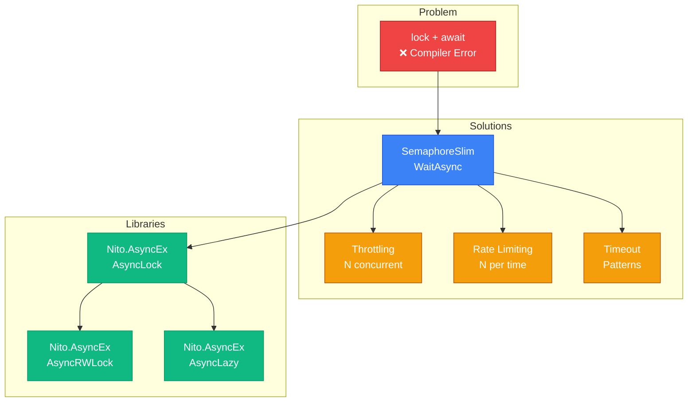

# Асинхронна Синхронізація

## Навіщо Async Synchronization?

У попередніх темах ми вивчили синхронізацію для багатопоточного коду: `lock`, `Monitor`, `Mutex`, `Semaphore`. Всі ці примітиви розроблені для **синхронного** коду — вони блокують потік до отримання доступу до ресурсу.

Проте в асинхронному світі блокування потоків — це антипатерн. Розглянемо три типові проблеми:

**Проблема перша: lock не працює з await.** Спроба використати `lock` всередині `async` методу з `await` призводить до compiler error:

```csharp
private readonly object _lock = new();

async Task ProcessAsync()
{
    lock (_lock)  // ✅ OK
    {
        await Task.Delay(100);  // ❌ CS1996: Cannot await in the body of a lock statement
    }
}
```

**Чому заборонено?** `lock` — це thread-affine примітив: він прив'язаний до конкретного потоку. Після `await` виконання може продовжитись на **іншому** потоці, що порушує семантику lock (один потік захопив lock, інший звільнив — undefined behavior).

**Проблема друга: Throttling async операцій.** API дозволяє максимум 10 одночасних HTTP запитів. Як обмежити кількість паралельних `async` операцій без блокування потоків?

**Проблема третя: Timeout для async операцій.** Як встановити таймаут для `await` без блокування потоку на чеканні?

Ця тема надає рішення для всіх трьох проблем: `SemaphoreSlim.WaitAsync()` для async mutual exclusion, throttling patterns, timeout strategies, та огляд бібліотеки `Nito.AsyncEx` з готовими async примітивами.

---

## Проблема: Чому lock Не Працює з await

### Анатомія lock Statement

Щоб зрозуміти проблему, розглянемо що компілятор генерує з `lock`:

```csharp
// Вихідний код
lock (_lock)
{
    // Critical section
}

// Компілятор генерує (спрощено)
bool lockTaken = false;
try
{
    Monitor.Enter(_lock, ref lockTaken);
    // Critical section
}
finally
{
    if (lockTaken)
        Monitor.Exit(_lock);
}
```

**Ключовий момент:** `Monitor.Enter()` запам'ятовує **ID потоку**, що захопив lock. `Monitor.Exit()` перевіряє, що звільнення відбувається на **тому ж** потоці. Це thread-affinity.

### Що Відбувається з await

```csharp
async Task ProcessAsync()
{
    lock (_lock)
    {
        Console.WriteLine($"Before await: Thread {Thread.CurrentThread.ManagedThreadId}");
        await Task.Delay(100);  // Suspension point
        Console.WriteLine($"After await: Thread {Thread.CurrentThread.ManagedThreadId}");
        // Потоки можуть бути різними!
    }
}
```

**Проблема:** Після `await` continuation може виконатись на іншому потоці ThreadPool. Якщо Thread 5 захопив lock, а Thread 8 намагається звільнити — `Monitor.Exit()` викине `SynchronizationLockException`.

::warning
**Deadlock Scenario:** Якщо після `await` continuation повертається на той самий потік (через `SynchronizationContext`), але цей потік вже зайнятий іншою роботою — deadlock. Lock тримається, потік чекає, continuation не виконується.
::

### Compiler Error: Захист від Помилок

Компілятор C# **забороняє** `await` всередині `lock` саме через ці проблеми:

```csharp
lock (_lock)
{
    await Task.Delay(100);  // CS1996: Cannot await in the body of a lock statement
}
```

Це не обмеження технічне — це захист від race conditions та deadlocks.

---

## SemaphoreSlim.WaitAsync(): Async Mutex

### Концепція: Async-Compatible Synchronization

`SemaphoreSlim` — це легковаговий semaphore, що підтримує **асинхронне** очікування через `WaitAsync()`. На відміну від `lock`, він не прив'язаний до потоку — можна захопити на одному потоці, звільнити на іншому.

**Ключова ідея:** `SemaphoreSlim(1, 1)` — це async-compatible mutex (mutual exclusion для одного потоку/task).

### Базовий Приклад: Async Lock

```csharp showLineNumbers [AsyncLockBasics.cs]
class AsyncCounter
{
    private int _count;
    private readonly SemaphoreSlim _lock = new(1, 1);  // initialCount: 1, maxCount: 1

    public async Task<int> IncrementAsync()
    {
        // Асинхронне очікування доступу (не блокує потік)
        await _lock.WaitAsync();
        try
        {
            // Critical section — тільки один task одночасно
            await Task.Delay(10);  // ✅ await всередині "lock" — OK!
            _count++;
            return _count;
        }
        finally
        {
            // Звільнення lock — ЗАВЖДИ у finally
            _lock.Release();
        }
    }
}

// Використання — 10 паралельних tasks
var counter = new AsyncCounter();
var tasks = Enumerable.Range(0, 10)
    .Select(_ => counter.IncrementAsync())
    .ToArray();

await Task.WhenAll(tasks);
Console.WriteLine($"Final count: {await counter.IncrementAsync()}");  // 11
```

::note
**Чому finally обов'язковий?** Якщо exception виникне всередині critical section, `Release()` має бути викликаний обов'язково. Інакше lock залишиться захопленим назавжди (deadlock для всіх наступних waiters).
::

### Pattern: IDisposable для Automatic Release

Щоб уникнути ручного `try/finally`, можна створити helper:

```csharp showLineNumbers [AsyncLockHelper.cs]
class AsyncLock
{
    private readonly SemaphoreSlim _semaphore = new(1, 1);

    public async Task<IDisposable> LockAsync()
    {
        await _semaphore.WaitAsync();
        return new ReleaseWrapper(_semaphore);
    }

    private class ReleaseWrapper : IDisposable
    {
        private readonly SemaphoreSlim _semaphore;

        public ReleaseWrapper(SemaphoreSlim semaphore) => _semaphore = semaphore;

        public void Dispose() => _semaphore.Release();
    }
}

// Використання — елегантний синтаксис
var asyncLock = new AsyncLock();

using (await asyncLock.LockAsync())
{
    // Critical section
    await Task.Delay(100);
}  // Автоматичний Release при виході з using
```

### Порівняння: lock vs SemaphoreSlim

| Аспект | `lock` (Monitor) | `SemaphoreSlim.WaitAsync()` |
|--------|------------------|----------------------------|
| **Async support** | ❌ Не можна `await` всередині | ✅ Повна підтримка `await` |
| **Thread affinity** | ✅ Прив'язаний до потоку | ❌ Thread-agnostic |
| **Performance** | ⚡ Найшвидший (user-mode) | 🐢 Повільніший (~2x) |
| **Cancellation** | ❌ Немає | ✅ `WaitAsync(CancellationToken)` |
| **Timeout** | ✅ `Monitor.TryEnter(timeout)` | ✅ `WaitAsync(timeout)` |
| **Use case** | Синхронний код | Async код |

::tip
**Коли використовувати що:**
- **lock:** Синхронний код, критичні секції без I/O, максимальна швидкість.
- **SemaphoreSlim:** Async код, критичні секції з `await`, cancellation support.
::

---

## Throttling та Rate Limiting

### Концепція: Обмеження Паралелізму

Throttling — це обмеження кількості **одночасних** операцій. Rate limiting — обмеження кількості операцій **за одиницю часу**.

**Приклад:** API дозволяє максимум 5 одночасних запитів та 100 запитів на хвилину.

### Throttling через SemaphoreSlim

`SemaphoreSlim(N, N)` дозволяє максимум N одночасних операцій:

```csharp showLineNumbers [ThrottlingExample.cs]
class ThrottledHttpClient
{
    private readonly HttpClient _http = new();
    private readonly SemaphoreSlim _throttle = new(5, 5);  // Максимум 5 одночасних запитів

    public async Task<string> GetAsync(string url, CancellationToken ct = default)
    {
        // Чекаємо доки з'явиться "слот" для запиту
        await _throttle.WaitAsync(ct);
        try
        {
            Console.WriteLine($"Запит до {url} (активних: {5 - _throttle.CurrentCount})");
            return await _http.GetStringAsync(url, ct);
        }
        finally
        {
            // Звільняємо слот
            _throttle.Release();
        }
    }
}

// Використання — 20 паралельних запитів, але максимум 5 одночасно
var client = new ThrottledHttpClient();
var urls = Enumerable.Range(1, 20)
    .Select(i => $"https://jsonplaceholder.typicode.com/posts/{i}")
    .ToArray();

var tasks = urls.Select(url => client.GetAsync(url)).ToArray();
var results = await Task.WhenAll(tasks);

Console.WriteLine($"Завантажено {results.Length} сторінок");
```

::terminal-preview{title="Throttling Output"}
<div class="line">Запит до https://jsonplaceholder.typicode.com/posts/1 (активних: 1)</div>
<div class="line">Запит до https://jsonplaceholder.typicode.com/posts/2 (активних: 2)</div>
<div class="line">Запит до https://jsonplaceholder.typicode.com/posts/3 (активних: 3)</div>
<div class="line">Запит до https://jsonplaceholder.typicode.com/posts/4 (активних: 4)</div>
<div class="line">Запит до https://jsonplaceholder.typicode.com/posts/5 (активних: 5)</div>
<div class="line"><span class="text-yellow-400">... чекаємо завершення одного з 5 запитів ...</span></div>
<div class="line">Запит до https://jsonplaceholder.typicode.com/posts/6 (активних: 5)</div>
<div class="line">Запит до https://jsonplaceholder.typicode.com/posts/7 (активних: 5)</div>
<div class="line">...</div>
<div class="line"><span class="text-green-400">Завантажено 20 сторінок</span></div>
::

### Rate Limiting: Sliding Window

Для обмеження кількості операцій за одиницю часу потрібен складніший алгоритм:

```csharp showLineNumbers [RateLimiter.cs]
class RateLimiter
{
    private readonly int _maxRequests;
    private readonly TimeSpan _timeWindow;
    private readonly Queue<DateTime> _requestTimestamps = new();
    private readonly SemaphoreSlim _lock = new(1, 1);

    public RateLimiter(int maxRequests, TimeSpan timeWindow)
    {
        _maxRequests = maxRequests;
        _timeWindow = timeWindow;
    }

    public async Task WaitAsync(CancellationToken ct = default)
    {
        await _lock.WaitAsync(ct);
        try
        {
            var now = DateTime.UtcNow;
            var windowStart = now - _timeWindow;

            // Видаляємо старі timestamps (поза вікном)
            while (_requestTimestamps.Count > 0 && _requestTimestamps.Peek() < windowStart)
            {
                _requestTimestamps.Dequeue();
            }

            // Якщо досягнуто ліміту — чекаємо
            if (_requestTimestamps.Count >= _maxRequests)
            {
                var oldestRequest = _requestTimestamps.Peek();
                var delay = oldestRequest + _timeWindow - now;

                if (delay > TimeSpan.Zero)
                {
                    Console.WriteLine($"Rate limit досягнуто. Чекаємо {delay.TotalSeconds:F1}s...");
                    await Task.Delay(delay, ct);
                }

                // Після затримки — видаляємо найстаріший
                _requestTimestamps.Dequeue();
            }

            // Реєструємо новий запит
            _requestTimestamps.Enqueue(now);
        }
        finally
        {
            _lock.Release();
        }
    }
}

// Використання — максимум 10 запитів на 5 секунд
var rateLimiter = new RateLimiter(maxRequests: 10, timeWindow: TimeSpan.FromSeconds(5));

for (int i = 0; i < 25; i++)
{
    await rateLimiter.WaitAsync();
    Console.WriteLine($"Запит {i + 1} виконано о {DateTime.Now:HH:mm:ss.fff}");
}
```

::note
**Sliding Window vs Fixed Window:** Sliding window рахує запити у рухомому вікні (останні N секунд). Fixed window скидає лічильник кожні N секунд (простіший, але може пропустити burst на межі вікон).
::

---

## Timeout та Cancellation Patterns

### Проблема: Як Встановити Timeout для Async Операції

Стандартний `await` не має вбудованого timeout. Якщо операція "зависла" — вона чекатиме нескінченно.

### Pattern 1: Task.WhenAny з Task.Delay

Найпростіший спосіб — змагання між операцією та таймером:

```csharp showLineNumbers [TimeoutPattern1.cs]
static async Task<T> WithTimeout<T>(Task<T> task, TimeSpan timeout)
{
    var delayTask = Task.Delay(timeout);
    var completedTask = await Task.WhenAny(task, delayTask);

    if (completedTask == delayTask)
    {
        throw new TimeoutException($"Операція не завершилась за {timeout}");
    }

    return await task;  // Повертаємо результат
}

// Використання
try
{
    var result = await WithTimeout(
        SlowOperationAsync(),
        TimeSpan.FromSeconds(5)
    );
    Console.WriteLine($"Результат: {result}");
}
catch (TimeoutException ex)
{
    Console.WriteLine($"Таймаут: {ex.Message}");
}

async Task<string> SlowOperationAsync()
{
    await Task.Delay(10_000);  // 10 секунд
    return "Completed";
}
```

::warning
**Важливо:** Якщо timeout спрацював, оригінальний `task` **продовжує виконуватись** у фоні! Він не скасовується автоматично. Це може призвести до витоку ресурсів (відкриті з'єднання, файли).
::

### Pattern 2: CancellationTokenSource.CancelAfter

Правильний спосіб — передати `CancellationToken` з автоматичним timeout:

```csharp showLineNumbers [TimeoutPattern2.cs]
static async Task<T> WithTimeoutAndCancellation<T>(
    Func<CancellationToken, Task<T>> operation,
    TimeSpan timeout)
{
    using var cts = new CancellationTokenSource(timeout);
    return await operation(cts.Token);
}

// Використання
try
{
    var result = await WithTimeoutAndCancellation(
        ct => SlowOperationAsync(ct),
        TimeSpan.FromSeconds(5)
    );
    Console.WriteLine($"Результат: {result}");
}
catch (OperationCanceledException)
{
    Console.WriteLine("Операція скасована через таймаут");
}

async Task<string> SlowOperationAsync(CancellationToken ct)
{
    // Операція перевіряє cancellation
    await Task.Delay(10_000, ct);
    return "Completed";
}
```

**Переваги:**
- Операція **справді скасовується** (якщо підтримує `CancellationToken`)
- Ресурси звільняються одразу
- Стандартна семантика через `OperationCanceledException`

### Pattern 3: Linked CancellationTokens

Коли потрібно об'єднати timeout та зовнішній cancellation:

```csharp showLineNumbers [LinkedTokens.cs]
async Task<string> FetchWithTimeoutAsync(string url, CancellationToken externalCt)
{
    // Створюємо токен з timeout
    using var timeoutCts = new CancellationTokenSource(TimeSpan.FromSeconds(10));
    
    // Об'єднуємо з зовнішнім токеном
    using var linkedCts = CancellationTokenSource.CreateLinkedTokenSource(
        externalCt,
        timeoutCts.Token
    );

    // Операція скасується або при timeout, або при зовнішньому cancellation
    var response = await _http.GetStringAsync(url, linkedCts.Token);
    return response;
}

// Використання
using var userCts = new CancellationTokenSource();

// Користувач може скасувати через Ctrl+C
Console.CancelKeyPress += (_, e) =>
{
    e.Cancel = true;
    userCts.Cancel();
};

try
{
    var data = await FetchWithTimeoutAsync("https://slow-api.com/data", userCts.Token);
    Console.WriteLine(data);
}
catch (OperationCanceledException)
{
    Console.WriteLine("Скасовано (timeout або користувач)");
}
```

### Pattern 4: Retry з Exponential Backoff

Комбінація timeout + retry для нестабільних операцій:

```csharp showLineNumbers [RetryWithTimeout.cs]
static async Task<T> RetryWithTimeoutAsync<T>(
    Func<CancellationToken, Task<T>> operation,
    int maxRetries = 3,
    TimeSpan? initialDelay = null,
    CancellationToken ct = default)
{
    initialDelay ??= TimeSpan.FromSeconds(1);
    var delay = initialDelay.Value;

    for (int attempt = 1; attempt <= maxRetries; attempt++)
    {
        using var attemptCts = CancellationTokenSource.CreateLinkedTokenSource(ct);
        attemptCts.CancelAfter(TimeSpan.FromSeconds(5));  // Timeout на спробу

        try
        {
            return await operation(attemptCts.Token);
        }
        catch (Exception ex) when (attempt < maxRetries && 
            (ex is OperationCanceledException || ex is HttpRequestException))
        {
            Console.WriteLine($"Спроба {attempt} невдала: {ex.Message}. Повтор через {delay.TotalSeconds}s...");
            await Task.Delay(delay, ct);
            delay *= 2;  // Exponential backoff
        }
    }

    // Остання спроба без catch
    using var finalCts = CancellationTokenSource.CreateLinkedTokenSource(ct);
    finalCts.CancelAfter(TimeSpan.FromSeconds(5));
    return await operation(finalCts.Token);
}

// Використання
var result = await RetryWithTimeoutAsync(
    async ct =>
    {
        var response = await _http.GetAsync("https://flaky-api.com/data", ct);
        response.EnsureSuccessStatusCode();
        return await response.Content.ReadAsStringAsync(ct);
    },
    maxRetries: 5,
    initialDelay: TimeSpan.FromSeconds(1)
);
```

---

## Nito.AsyncEx: Бібліотека Async Primitives

### Огляд Бібліотеки

`Nito.AsyncEx` — це community-driven бібліотека, що надає async-compatible версії стандартних синхронізаційних примітивів.

**Встановлення:**

```bash
dotnet add package Nito.AsyncEx
```

### AsyncLock: Async Mutex

Готова реалізація async lock з правильною семантикою:

```csharp showLineNumbers [NitoAsyncLock.cs]
using Nito.AsyncEx;

class SharedResource
{
    private readonly AsyncLock _lock = new();
    private int _value;

    public async Task<int> IncrementAsync()
    {
        // using + await — елегантний синтаксис
        using (await _lock.LockAsync())
        {
            await Task.Delay(10);
            return ++_value;
        }
    }
}
```

**Переваги над ручним `SemaphoreSlim`:**
- Правильна обробка cancellation
- Підтримка reentrancy detection (опціонально)
- Оптимізована реалізація

### AsyncAutoResetEvent та AsyncManualResetEvent

Async версії event primitives:

```csharp showLineNumbers [NitoAsyncEvents.cs]
using Nito.AsyncEx;

// Auto-reset: один waiter проходить, event скидається
var autoEvent = new AsyncAutoResetEvent(signaled: false);

// Producer
_ = Task.Run(async () =>
{
    await Task.Delay(1000);
    autoEvent.Set();  // Дозволяє одному waiter пройти
    Console.WriteLine("Event set");
});

// Consumer
await autoEvent.WaitAsync();
Console.WriteLine("Event received");

// Manual-reset: всі waiters проходять
var manualEvent = new AsyncManualResetEvent(signaled: false);

// Кілька consumers
var waiters = Enumerable.Range(0, 5)
    .Select(async i =>
    {
        await manualEvent.WaitAsync();
        Console.WriteLine($"Waiter {i} пройшов");
    })
    .ToArray();

await Task.Delay(1000);
manualEvent.Set();  // Всі 5 waiters проходять одночасно

await Task.WhenAll(waiters);
```

### AsyncCollection<T>: Async Producer-Consumer

Альтернатива `Channel<T>` з додатковими можливостями:

```csharp showLineNumbers [NitoAsyncCollection.cs]
using Nito.AsyncEx;

var collection = new AsyncCollection<int>();

// Producer
_ = Task.Run(async () =>
{
    for (int i = 0; i < 10; i++)
    {
        await collection.AddAsync(i);
        await Task.Delay(100);
    }
    collection.CompleteAdding();
});

// Consumer
await foreach (var item in collection.GetConsumingAsyncEnumerable())
{
    Console.WriteLine($"Consumed: {item}");
}
```

### AsyncLazy<T>: Lazy Async Initialization

Правильна реалізація lazy async initialization:

```csharp showLineNumbers [NitoAsyncLazy.cs]
using Nito.AsyncEx;

class ExpensiveService
{
    private readonly AsyncLazy<string> _data;

    public ExpensiveService()
    {
        _data = new AsyncLazy<string>(async () =>
        {
            Console.WriteLine("Ініціалізація...");
            await Task.Delay(2000);
            return "Expensive data";
        });
    }

    public Task<string> GetDataAsync() => _data.Task;
}

// Використання
var service = new ExpensiveService();

// Перший виклик — запускає ініціалізацію
var data1 = await service.GetDataAsync();  // 2 секунди

// Наступні виклики — повертають кешований результат
var data2 = await service.GetDataAsync();  // Instant
var data3 = await service.GetDataAsync();  // Instant
```

### AsyncReaderWriterLock: Async RW Lock

Async версія `ReaderWriterLockSlim`:

```csharp showLineNumbers [NitoAsyncRWLock.cs]
using Nito.AsyncEx;

class AsyncCache
{
    private readonly AsyncReaderWriterLock _lock = new();
    private readonly Dictionary<string, string> _cache = new();

    public async Task<string?> GetAsync(string key)
    {
        // Множинні readers можуть читати одночасно
        using (await _lock.ReaderLockAsync())
        {
            await Task.Delay(10);  // Імітація читання
            return _cache.TryGetValue(key, out var value) ? value : null;
        }
    }

    public async Task SetAsync(string key, string value)
    {
        // Тільки один writer одночасно
        using (await _lock.WriterLockAsync())
        {
            await Task.Delay(50);  // Імітація запису
            _cache[key] = value;
        }
    }
}
```

### Порівняння: Nito.AsyncEx vs Manual Implementation

| Примітив | Manual (SemaphoreSlim) | Nito.AsyncEx |
|----------|------------------------|--------------|
| **Async Lock** | ~20 рядків коду | `AsyncLock` — 1 рядок |
| **Cancellation** | Ручна обробка | Вбудована підтримка |
| **Reentrancy** | Немає | Опціональна підтримка |
| **Reader/Writer** | ~100 рядків | `AsyncReaderWriterLock` |
| **Lazy Init** | Складна логіка | `AsyncLazy<T>` |
| **Testing** | Потрібні власні тести | Протестовано community |

::tip
**Коли використовувати Nito.AsyncEx:**
- Складні async synchronization scenarios
- Потрібна підтримка cancellation out-of-the-box
- Немає часу писати та тестувати власні реалізації
- Проєкт вже використовує інші async patterns
::

---

## Наскрізний Приклад: Resilient HTTP Client

Побудуємо HTTP client з усіма вивченими паттернами: throttling, rate limiting, retry, timeout, cancellation.

::steps

### Крок 1: Структура проєкту

```bash
dotnet new console -n ResilientHttpClient
cd ResilientHttpClient
dotnet add package Nito.AsyncEx
```

### Крок 2: Rate Limiter

```csharp showLineNumbers [RateLimiter.cs]
using Nito.AsyncEx;

class RateLimiter
{
    private readonly int _maxRequests;
    private readonly TimeSpan _timeWindow;
    private readonly Queue<DateTime> _timestamps = new();
    private readonly AsyncLock _lock = new();

    public RateLimiter(int maxRequests, TimeSpan timeWindow)
    {
        _maxRequests = maxRequests;
        _timeWindow = timeWindow;
    }

    public async Task WaitAsync(CancellationToken ct = default)
    {
        using (await _lock.LockAsync(ct))
        {
            var now = DateTime.UtcNow;
            var windowStart = now - _timeWindow;

            while (_timestamps.Count > 0 && _timestamps.Peek() < windowStart)
                _timestamps.Dequeue();

            if (_timestamps.Count >= _maxRequests)
            {
                var delay = _timestamps.Peek() + _timeWindow - now;
                if (delay > TimeSpan.Zero)
                    await Task.Delay(delay, ct);

                _timestamps.Dequeue();
            }

            _timestamps.Enqueue(now);
        }
    }
}
```

### Крок 3: Resilient Client

```csharp showLineNumbers [ResilientHttpClient.cs]
class ResilientHttpClient : IDisposable
{
    private readonly HttpClient _http = new();
    private readonly SemaphoreSlim _throttle;
    private readonly RateLimiter _rateLimiter;
    private readonly int _maxRetries;
    private readonly TimeSpan _timeout;

    public ResilientHttpClient(
        int maxConcurrent = 5,
        int maxRequestsPerMinute = 60,
        int maxRetries = 3,
        TimeSpan? timeout = null)
    {
        _throttle = new SemaphoreSlim(maxConcurrent, maxConcurrent);
        _rateLimiter = new RateLimiter(maxRequestsPerMinute, TimeSpan.FromMinutes(1));
        _maxRetries = maxRetries;
        _timeout = timeout ?? TimeSpan.FromSeconds(30);
    }

    public async Task<string> GetAsync(string url, CancellationToken ct = default)
    {
        // Rate limiting
        await _rateLimiter.WaitAsync(ct);

        // Throttling
        await _throttle.WaitAsync(ct);
        try
        {
            return await RetryAsync(async attemptCt =>
            {
                using var linkedCts = CancellationTokenSource.CreateLinkedTokenSource(ct, attemptCt);
                linkedCts.CancelAfter(_timeout);

                var response = await _http.GetAsync(url, linkedCts.Token);
                response.EnsureSuccessStatusCode();
                return await response.Content.ReadAsStringAsync(linkedCts.Token);
            }, ct);
        }
        finally
        {
            _throttle.Release();
        }
    }

    private async Task<T> RetryAsync<T>(
        Func<CancellationToken, Task<T>> operation,
        CancellationToken ct)
    {
        var delay = TimeSpan.FromSeconds(1);

        for (int attempt = 1; attempt <= _maxRetries; attempt++)
        {
            using var attemptCts = CancellationTokenSource.CreateLinkedTokenSource(ct);

            try
            {
                return await operation(attemptCts.Token);
            }
            catch (Exception ex) when (attempt < _maxRetries &&
                (ex is HttpRequestException || ex is OperationCanceledException))
            {
                Console.WriteLine($"  Спроба {attempt} невдала. Повтор через {delay.TotalSeconds}s...");
                await Task.Delay(delay, ct);
                delay *= 2;
            }
        }

        return await operation(ct);
    }

    public void Dispose()
    {
        _http.Dispose();
        _throttle.Dispose();
    }
}
```

### Крок 4: Statistics Tracker

```csharp showLineNumbers [RequestStats.cs]
class RequestStats
{
    private int _totalRequests;
    private int _successfulRequests;
    private int _failedRequests;
    private readonly List<TimeSpan> _responseTimes = new();
    private readonly AsyncLock _lock = new();

    public async Task RecordSuccessAsync(TimeSpan responseTime)
    {
        using (await _lock.LockAsync())
        {
            _totalRequests++;
            _successfulRequests++;
            _responseTimes.Add(responseTime);
        }
    }

    public async Task RecordFailureAsync()
    {
        using (await _lock.LockAsync())
        {
            _totalRequests++;
            _failedRequests++;
        }
    }

    public async Task PrintStatsAsync()
    {
        using (await _lock.LockAsync())
        {
            Console.WriteLine("\n" + new string('═', 60));
            Console.WriteLine("📊 СТАТИСТИКА ЗАПИТІВ");
            Console.WriteLine(new string('─', 60));
            Console.WriteLine($"Всього запитів:       {_totalRequests}");
            Console.WriteLine($"Успішних:             {_successfulRequests}");
            Console.WriteLine($"Невдалих:             {_failedRequests}");
            
            if (_responseTimes.Count > 0)
            {
                var avg = TimeSpan.FromMilliseconds(_responseTimes.Average(t => t.TotalMilliseconds));
                var min = _responseTimes.Min();
                var max = _responseTimes.Max();
                
                Console.WriteLine($"Середній час відповіді: {avg.TotalMilliseconds:F0}ms");
                Console.WriteLine($"Мін/Макс:             {min.TotalMilliseconds:F0}ms / {max.TotalMilliseconds:F0}ms");
            }
            
            Console.WriteLine(new string('═', 60));
        }
    }
}
```

### Крок 5: Точка входу

```csharp showLineNumbers [Program.cs]
using System.Diagnostics;

var urls = new[]
{
    "https://jsonplaceholder.typicode.com/posts/1",
    "https://jsonplaceholder.typicode.com/posts/2",
    "https://jsonplaceholder.typicode.com/posts/3",
    "https://jsonplaceholder.typicode.com/posts/4",
    "https://jsonplaceholder.typicode.com/posts/5",
    "https://jsonplaceholder.typicode.com/users/1",
    "https://jsonplaceholder.typicode.com/users/2",
    "https://jsonplaceholder.typicode.com/comments/1",
    "https://jsonplaceholder.typicode.com/comments/2",
    "https://jsonplaceholder.typicode.com/albums/1"
};

using var client = new ResilientHttpClient(
    maxConcurrent: 3,
    maxRequestsPerMinute: 20,
    maxRetries: 3,
    timeout: TimeSpan.FromSeconds(10)
);

var stats = new RequestStats();
var cts = new CancellationTokenSource();

Console.CancelKeyPress += (_, e) =>
{
    e.Cancel = true;
    Console.WriteLine("\n⚠️ Скасування...");
    cts.Cancel();
};

Console.WriteLine("🚀 Початок завантаження...\n");

var tasks = urls.Select(async url =>
{
    var sw = Stopwatch.StartNew();
    try
    {
        var content = await client.GetAsync(url, cts.Token);
        sw.Stop();
        
        await stats.RecordSuccessAsync(sw.Elapsed);
        Console.WriteLine($"✅ {url} ({sw.ElapsedMilliseconds}ms)");
    }
    catch (OperationCanceledException)
    {
        Console.WriteLine($"⚠️ {url} — скасовано");
    }
    catch (Exception ex)
    {
        await stats.RecordFailureAsync();
        Console.WriteLine($"❌ {url} — {ex.Message}");
    }
}).ToArray();

await Task.WhenAll(tasks);
await stats.PrintStatsAsync();
```

### Крок 6: Запуск

```bash
dotnet run
```

::

::terminal-preview{title="Resilient HTTP Client Output"}
<div class="line"><span class="opacity-40">$</span> <strong class="font-bold">dotnet run</strong></div>
<div class="line">🚀 Початок завантаження...</div>
<div class="line"></div>
<div class="line"><span class="text-green-400">✅</span> https://jsonplaceholder.typicode.com/posts/1 (342ms)</div>
<div class="line"><span class="text-green-400">✅</span> https://jsonplaceholder.typicode.com/posts/2 (356ms)</div>
<div class="line"><span class="text-green-400">✅</span> https://jsonplaceholder.typicode.com/posts/3 (378ms)</div>
<div class="line"><span class="text-green-400">✅</span> https://jsonplaceholder.typicode.com/posts/4 (312ms)</div>
<div class="line"><span class="text-green-400">✅</span> https://jsonplaceholder.typicode.com/posts/5 (298ms)</div>
<div class="line"><span class="text-green-400">✅</span> https://jsonplaceholder.typicode.com/users/1 (287ms)</div>
<div class="line"><span class="text-green-400">✅</span> https://jsonplaceholder.typicode.com/users/2 (301ms)</div>
<div class="line"><span class="text-green-400">✅</span> https://jsonplaceholder.typicode.com/comments/1 (324ms)</div>
<div class="line"><span class="text-green-400">✅</span> https://jsonplaceholder.typicode.com/comments/2 (318ms)</div>
<div class="line"><span class="text-green-400">✅</span> https://jsonplaceholder.typicode.com/albums/1 (295ms)</div>
<div class="line"></div>
<div class="line">════════════════════════════════════════════════════════════</div>
<div class="line"><span class="text-blue-400 font-bold">📊 СТАТИСТИКА ЗАПИТІВ</span></div>
<div class="line">────────────────────────────────────────────────────────────</div>
<div class="line">Всього запитів:       10</div>
<div class="line">Успішних:             <span class="text-green-400 font-bold">10</span></div>
<div class="line">Невдалих:             <span class="text-gray-400">0</span></div>
<div class="line">Середній час відповіді: <span class="text-yellow-400">321ms</span></div>
<div class="line">Мін/Макс:             287ms / 378ms</div>
<div class="line">════════════════════════════════════════════════════════════</div>
::

---

## Діаграма: Async Synchronization Patterns

::mermaid



::

---

## Підсумок

::card-group

::card{title="SemaphoreSlim.WaitAsync()" icon="i-lucide-lock"}

- Async-compatible mutex
- `new SemaphoreSlim(1, 1)` для mutual exclusion
- Завжди `try/finally` для Release
- Підтримка CancellationToken та timeout

::

::card{title="Throttling" icon="i-lucide-gauge"}

- Обмеження одночасних операцій
- `SemaphoreSlim(N, N)` для N concurrent
- Backpressure для захисту від перевантаження
- Ідеально для HTTP clients, DB connections

::

::card{title="Rate Limiting" icon="i-lucide-timer"}

- Обмеження операцій за одиницю часу
- Sliding window algorithm
- Захист від API rate limits
- Exponential backoff для retry

::

::card{title="Nito.AsyncEx" icon="i-lucide-package"}

- AsyncLock, AsyncRWLock, AsyncLazy
- AsyncAutoResetEvent, AsyncManualResetEvent
- Протестовані community реалізації
- Економія часу розробки

::

::

---

## Практичні Завдання

### Рівень 1: Async Mutex для File Access

Реалізуйте async-safe file manager:
1. Клас `AsyncFileManager` з методами `ReadAsync()`, `WriteAsync()`, `AppendAsync()`
2. Використовуйте `SemaphoreSlim` для mutual exclusion
3. Підтримка CancellationToken
4. Правильна обробка exceptions (файл не існує, доступ заборонено)

**Тести:**
- 10 паралельних readers — всі читають одночасно
- 10 паралельних writers — виконуються послідовно
- Mix readers + writers — writers блокують readers

### Рівень 2: Throttled Web Scraper

Створіть web scraper з обмеженнями:
1. Максимум 5 одночасних запитів (throttling)
2. Максимум 20 запитів на хвилину (rate limiting)
3. Retry з exponential backoff (3 спроби)
4. Timeout 10 секунд на запит
5. Graceful shutdown при Ctrl+C

**Вимоги:**
- Збір всіх посилань з початкової сторінки
- Рекурсивне проходження до глибини 2
- Статистика: успішні/невдалі запити, середній час
- Збереження результатів у JSON

### Рівень 3: Resilient Service з Circuit Breaker

Побудуйте resilient HTTP service wrapper:
1. **Throttling:** Максимум N одночасних запитів
2. **Rate Limiting:** Максимум M запитів на хвилину
3. **Retry:** Exponential backoff з jitter
4. **Timeout:** Configurable per-request timeout
5. **Circuit Breaker:** Після X невдалих запитів — відкрити circuit на Y секунд

**Circuit Breaker States:**
- **Closed:** Нормальна робота
- **Open:** Всі запити одразу fail (circuit відкритий)
- **Half-Open:** Пробний запит для перевірки відновлення

**Вимоги:**
- Metrics: success rate, average latency, circuit state
- Health check endpoint
- Configurable через JSON
- Unit tests для всіх станів circuit breaker

---

::tip
**Наступна тема:** [Unsafe Code та Вказівники](/csharp/system-programming-windows/unsafe-code) — низькорівневе програмування в C#, pointer arithmetic, `stackalloc`, `Span<T>`, та function pointers.
::
