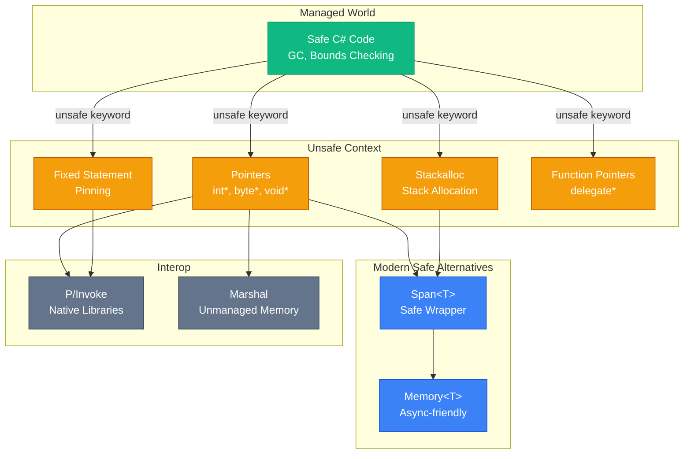

# Unsafe Code та Вказівники

## Навіщо Unsafe Code? Коли Безпека Заважає

C# — це managed мова з автоматичним управлінням пам'яттю через Garbage Collector. Це надає безпеку: немає dangling pointers, buffer overflows, memory leaks. Проте ця безпека має ціну — overhead на перевірки меж масивів, boxing/unboxing, indirection через references.

Для 99% додатків цей overhead непомітний. Але існують сценарії, де кожна мікросекунда та кожен байт allocation мають значення:

**Сценарій перший: Image Processing.** Обробка 4K зображення (3840×2160 пікселів, 4 байти на піксель) — це 33 мільйони байтів. Якщо застосувати фільтр через managed код з перевірками меж на кожен піксель, це мільйони непотрібних перевірок. Unsafe код з прямим доступом до пам'яті може бути у 5-10 разів швидшим.

**Сценарій другий: Interop з Native Libraries.** Ви інтегруєте C/C++ бібліотеку, що приймає `void*` вказівники на структури даних. Managed код не може передати адресу об'єкта напряму — потрібен unsafe контекст для отримання вказівника.

**Сценарій третій: Zero-Allocation Hot Paths.** Профайлер показує, що 80% GC pressure створюється у методі, що викликається мільйони разів на секунду. `stackalloc` дозволяє виділити пам'ять на стеку (zero heap allocation), але вимагає unsafe контексту.

**Сценарій четвертий: Custom Memory Management.** Ви будуєте memory pool або custom allocator для специфічних потреб (наприклад, real-time системи з детермінованою латентністю). Managed heap не підходить — потрібен прямий контроль над пам'яттю.

Unsafe код — це "escape hatch" з managed світу у світ прямого доступу до пам'яті, як у C/C++. Це потужний інструмент, але з великою відповідальністю: немає захисту від помилок, що призводять до crashes, corrupted data, або security vulnerabilities.

---

## Unsafe Context: Увімкнення та Правила

### Компіляція Unsafe Code

За замовчуванням C# компілятор **забороняє** unsafe код. Щоб увімкнути, потрібно додати у `.csproj`:

```xml showLineNumbers [Project.csproj]
<Project Sdk="Microsoft.NET.Sdk">
  <PropertyGroup>
    <OutputType>Exe</OutputType>
    <TargetFramework>net8.0</TargetFramework>
    <AllowUnsafeBlocks>true</AllowUnsafeBlocks>
  </PropertyGroup>
</Project>
```

Після цього можна використовувати `unsafe` keyword.

### Unsafe Keyword: Scope та Застосування

`unsafe` може застосовуватись на різних рівнях:

```csharp showLineNumbers [UnsafeScopes.cs]
// 1. Unsafe метод — весь метод unsafe
unsafe void ProcessData(byte* data, int length)
{
    for (int i = 0; i < length; i++)
    {
        data[i] = 0;  // Прямий доступ через вказівник
    }
}

// 2. Unsafe блок всередині safe методу
void SafeMethod()
{
    int value = 42;
    
    unsafe
    {
        int* ptr = &value;  // Отримуємо адресу
        *ptr = 100;         // Змінюємо через вказівник
    }
    
    Console.WriteLine(value);  // 100
}

// 3. Unsafe клас — всі члени unsafe за замовчуванням
unsafe class UnsafeBuffer
{
    private byte* _buffer;
    private int _size;

    public UnsafeBuffer(int size)
    {
        _size = size;
        _buffer = (byte*)Marshal.AllocHGlobal(size);  // Виділяємо unmanaged пам'ять
    }

    public void Write(int index, byte value)
    {
        if (index >= 0 && index < _size)
            _buffer[index] = value;
    }

    ~UnsafeBuffer()
    {
        Marshal.FreeHGlobal((IntPtr)_buffer);  // Звільняємо пам'ять
    }
}

// 4. Unsafe struct — може містити fixed buffers
unsafe struct ImagePixel
{
    public fixed byte Channels[4];  // Inline array (R, G, B, A)
}
```

::warning
**Безпека та Відповідальність:** Unsafe код обходить всі перевірки CLR. Помилки у unsafe коді можуть призвести до:
- **Access Violation:** Читання/запис за межами виділеної пам'яті → crash
- **Memory Corruption:** Перезапис чужої пам'яті → непередбачувана поведінка
- **Security Vulnerabilities:** Buffer overflow → можливість виконання довільного коду
- **GC Issues:** Неправильне pinning → corrupted heap

Використовуйте unsafe тільки коли **виміряли** bottleneck і **довели**, що managed альтернативи недостатньо.
::

---

## Pointer Types: Анатомія Вказівників

### Базові Типи Вказівників

У C# вказівники можуть вказувати тільки на **unmanaged types** — типи, що не містять references на managed об'єкти:

```csharp showLineNumbers [PointerTypes.cs]
unsafe void PointerBasics()
{
    // ✅ Дозволені типи для вказівників
    int* intPtr;           // Вказівник на int
    byte* bytePtr;         // Вказівник на byte
    double* doublePtr;     // Вказівник на double
    void* voidPtr;         // Вказівник на невідомий тип (як у C)
    
    // Вказівник на struct (якщо struct unmanaged)
    Point* pointPtr;       // Point має містити тільки value types
    
    // Вказівник на вказівник
    int** ptrToPtr;        // Вказівник на вказівник на int
    
    // ❌ ЗАБОРОНЕНІ типи
    // string* strPtr;     // string — managed type (reference)
    // object* objPtr;     // object — managed type
    // List<int>* listPtr; // Generic type — managed
}

struct Point  // Unmanaged struct
{
    public int X;
    public int Y;
}
```

### Оператори для Роботи з Вказівниками

::field-group

::field{name="& (address-of)" type="operator"}
Отримує адресу змінної. Повертає вказівник на цю змінну. Працює тільки з локальними змінними та параметрами (не з полями класів без `fixed`).
::

::field{name="* (dereference)" type="operator"}
Розіменовує вказівник — отримує значення за адресою. `*ptr` читає/записує значення, на яке вказує `ptr`.
::

::field{name="-> (member access)" type="operator"}
Доступ до члена структури через вказівник. `ptr->X` еквівалентно `(*ptr).X`.
::

::field{name="[] (indexer)" type="operator"}
Індексація вказівника як масиву. `ptr[i]` еквівалентно `*(ptr + i)`.
::

::

### Приклад: Базові Операції

```csharp showLineNumbers [PointerOperations.cs]
unsafe void PointerOperationsDemo()
{
    int value = 42;
    
    // 1. Отримання адреси
    int* ptr = &value;
    Console.WriteLine($"Адреса value: 0x{(long)ptr:X}");
    Console.WriteLine($"Значення через ptr: {*ptr}");
    
    // 2. Зміна значення через вказівник
    *ptr = 100;
    Console.WriteLine($"value після зміни: {value}");  // 100
    
    // 3. Робота зі структурами
    Point point = new Point { X = 10, Y = 20 };
    Point* pPoint = &point;
    
    // Доступ через ->
    Console.WriteLine($"X = {pPoint->X}, Y = {pPoint->Y}");
    
    pPoint->X = 50;
    Console.WriteLine($"point.X після зміни: {point.X}");  // 50
    
    // 4. void* — generic pointer
    void* voidPtr = ptr;
    int* intPtr2 = (int*)voidPtr;  // Cast назад до типізованого вказівника
    Console.WriteLine($"Значення через void*: {*intPtr2}");
}

struct Point
{
    public int X;
    public int Y;
}
```

::terminal-preview{title="Pointer Operations Output"}
<div class="line">Адреса value: 0x7FFE8C2A1234</div>
<div class="line">Значення через ptr: 42</div>
<div class="line">value після зміни: 100</div>
<div class="line">X = 10, Y = 20</div>
<div class="line">point.X після зміни: 50</div>
<div class="line">Значення через void*: 100</div>
::

---

## Pointer Arithmetic: Математика Адрес

### Концепція: Вказівники як Числа

Вказівник — це адреса у пам'яті, тобто число. Можна виконувати арифметичні операції:

```csharp showLineNumbers [PointerArithmetic.cs]
unsafe void PointerArithmeticDemo()
{
    int[] array = { 10, 20, 30, 40, 50 };
    
    fixed (int* ptr = array)  // Pinning (детально нижче)
    {
        // ptr вказує на array[0]
        Console.WriteLine($"ptr[0] = {*ptr}");           // 10
        Console.WriteLine($"ptr[1] = {*(ptr + 1)}");     // 20
        Console.WriteLine($"ptr[2] = {*(ptr + 2)}");     // 30
        
        // Інкремент вказівника
        int* current = ptr;
        for (int i = 0; i < 5; i++)
        {
            Console.WriteLine($"*current = {*current}");
            current++;  // Переміщуємо вказівник на наступний int (4 байти)
        }
        
        // Різниця вказівників
        int* start = ptr;
        int* end = ptr + 5;
        long distance = end - start;  // 5 (кількість елементів, не байтів!)
        Console.WriteLine($"Відстань: {distance} елементів");
    }
}
```

**Важливо:** Арифметика вказівників враховує розмір типу. `ptr + 1` для `int*` додає 4 байти (розмір `int`), а не 1 байт.

### Індексація як Синтаксичний Цукор

`ptr[i]` — це синтаксичний цукор для `*(ptr + i)`:

```csharp
int* ptr = ...;

// Ці два рядки еквівалентні:
int value1 = ptr[3];
int value2 = *(ptr + 3);
```

### Порівняння Вказівників

Вказівники можна порівнювати як числа:

```csharp showLineNumbers [PointerComparison.cs]
unsafe void PointerComparisonDemo()
{
    int[] array = { 1, 2, 3, 4, 5 };
    
    fixed (int* start = array)
    {
        int* end = start + array.Length;
        int* current = start;
        
        while (current < end)  // Порівняння вказівників
        {
            Console.WriteLine(*current);
            current++;
        }
    }
}
```

::note
**Pointer Arithmetic Safety:** Компілятор НЕ перевіряє межі при pointer arithmetic. `ptr + 1000` може вказувати на чужу пам'ять або навіть за межами процесу → Access Violation. Ви відповідальні за правильність обчислень.
::

---

## Fixed Statement: Pinning Managed Objects

### Проблема: Garbage Collector Переміщує Об'єкти

Managed об'єкти (масиви, strings, класи) знаходяться у managed heap. GC може **переміщувати** їх у пам'яті під час compaction (дефрагментації heap). Якщо ви отримали вказівник на об'єкт, а GC переміщує його — вказівник стає недійсним (dangling pointer).

**Рішення:** `fixed` statement **закріплює** (pins) об'єкт у пам'яті на час виконання блоку. GC не може переміщувати pinned об'єкти.

### Синтаксис Fixed

```csharp showLineNumbers [FixedStatement.cs]
unsafe void FixedDemo()
{
    int[] array = { 1, 2, 3, 4, 5 };
    
    // ❌ ПОМИЛКА: не можна отримати адресу managed об'єкта без fixed
    // int* ptr = &array[0];  // Compiler error
    
    // ✅ ПРАВИЛЬНО: fixed закріплює array у пам'яті
    fixed (int* ptr = array)
    {
        // Тепер ptr вказує на array[0] і залишається валідним
        for (int i = 0; i < array.Length; i++)
        {
            ptr[i] *= 2;  // Подвоюємо кожен елемент
        }
    }  // Після виходу з блоку — array unpinned
    
    Console.WriteLine(string.Join(", ", array));  // 2, 4, 6, 8, 10
}
```

### Fixed з Strings

Strings у C# — це immutable managed об'єкти. Можна отримати вказівник на їх внутрішній char buffer:

```csharp showLineNumbers [FixedString.cs]
unsafe void FixedStringDemo()
{
    string text = "Hello, World!";
    
    fixed (char* ptr = text)
    {
        // ptr вказує на перший char у string
        for (int i = 0; i < text.Length; i++)
        {
            Console.Write($"{ptr[i]} ");
        }
        Console.WriteLine();
        
        // ⚠️ НЕБЕЗПЕЧНО: зміна immutable string!
        // ptr[0] = 'h';  // Технічно можливо, але порушує immutability
    }
}
```

::warning
**Pinning та GC Performance:** Pinned об'єкти створюють "дірки" у heap, що ускладнюють compaction. Якщо багато об'єктів pinned одночасно — GC не може ефективно дефрагментувати heap, що призводить до фрагментації та зниження продуктивності. Використовуйте `fixed` тільки на короткий час.
::

### Fixed Buffers у Structs

`fixed` також дозволяє створювати inline arrays всередині structs:

```csharp showLineNumbers [FixedBuffers.cs]
unsafe struct Packet
{
    public int Id;
    public fixed byte Data[256];  // Inline array на 256 байтів
}

unsafe void FixedBufferDemo()
{
    Packet packet;
    packet.Id = 42;
    
    // Заповнюємо Data
    for (int i = 0; i < 256; i++)
    {
        packet.Data[i] = (byte)i;
    }
    
    // Читаємо Data
    fixed (byte* ptr = packet.Data)
    {
        for (int i = 0; i < 10; i++)
        {
            Console.Write($"{ptr[i]} ");
        }
    }
}
```

**Переваги fixed buffers:**
- Inline allocation — немає indirection через reference
- Cache-friendly — дані розташовані послідовно
- Zero overhead — немає додаткових об'єктів у heap

---

## Stackalloc та Span<T>: Zero-Allocation Arrays

### Проблема: Heap Allocation Overhead

Кожен `new T[]` створює об'єкт у managed heap, що вимагає GC для звільнення. Для короткоживучих масивів (існують тільки в межах методу) це марнування:

```csharp
void ProcessData()
{
    byte[] buffer = new byte[1024];  // Heap allocation
    // Використання buffer...
}  // buffer стає garbage, GC має його прибрати
```

**Рішення:** `stackalloc` виділяє пам'ять на **стеку** (stack), що автоматично звільняється при виході з методу. Zero heap allocation, zero GC pressure.

### Stackalloc: Базовий Синтаксис

```csharp showLineNumbers [StackallocBasics.cs]
unsafe void StackallocDemo()
{
    // Виділяємо 1024 байти на стеку
    byte* buffer = stackalloc byte[1024];
    
    // Заповнюємо buffer
    for (int i = 0; i < 1024; i++)
    {
        buffer[i] = (byte)(i % 256);
    }
    
    // Використання buffer...
    Console.WriteLine($"buffer[0] = {buffer[0]}");
    Console.WriteLine($"buffer[100] = {buffer[100]}");
}  // buffer автоматично звільняється (stack unwind)
```

::warning
**Stack Overflow Risk:** Стек має обмежений розмір (~1 MB на Windows за замовчуванням). `stackalloc byte[10_000_000]` призведе до `StackOverflowException`. Використовуйте `stackalloc` тільки для невеликих буферів (до ~1 KB). Для більших — heap allocation або custom allocator.
::

### Span<T>: Safe Stackalloc

C# 7.2+ дозволяє використовувати `stackalloc` з `Span<T>` **без unsafe контексту**:

```csharp showLineNumbers [SpanStackalloc.cs]
void SafeStackallocDemo()
{
    // ✅ Без unsafe! Span<T> надає safe wrapper
    Span<byte> buffer = stackalloc byte[1024];
    
    // Span має bounds checking
    buffer[0] = 42;
    buffer[1023] = 100;
    
    // buffer[1024] = 0;  // IndexOutOfRangeException
    
    // Можна передавати у методи
    ProcessBuffer(buffer);
}

void ProcessBuffer(Span<byte> buffer)
{
    for (int i = 0; i < buffer.Length; i++)
    {
        buffer[i] = (byte)(i % 256);
    }
}
```

**Переваги Span<T> над unsafe pointer:**
- Bounds checking — захист від buffer overflow
- Не вимагає unsafe контексту
- Працює з managed arrays, stackalloc, unmanaged memory
- Zero-cost abstraction (JIT оптимізує до прямого доступу)

### Span<T> vs Array: Performance Comparison

```csharp showLineNumbers [SpanBenchmark.cs]
using BenchmarkDotNet.Attributes;

[MemoryDiagnoser]
public class SpanVsArrayBenchmark
{
    [Benchmark(Baseline = true)]
    public int ArrayAllocation()
    {
        byte[] buffer = new byte[1024];
        int sum = 0;
        for (int i = 0; i < buffer.Length; i++)
            sum += buffer[i];
        return sum;
    }

    [Benchmark]
    public int SpanStackalloc()
    {
        Span<byte> buffer = stackalloc byte[1024];
        int sum = 0;
        for (int i = 0; i < buffer.Length; i++)
            sum += buffer[i];
        return sum;
    }
}
```

::terminal-preview{title="Benchmark Results"}
<div class="line"><span class="opacity-40">|</span> Method           <span class="opacity-40">|</span> Mean      <span class="opacity-40">|</span> Allocated <span class="opacity-40">|</span></div>
<div class="line"><span class="opacity-40">|</span> ---------------- <span class="opacity-40">|</span> --------- <span class="opacity-40">|</span> --------- <span class="opacity-40">|</span></div>
<div class="line"><span class="opacity-40">|</span> ArrayAllocation  <span class="opacity-40">|</span> <span class="text-yellow-400">285 ns</span>    <span class="opacity-40">|</span> <span class="text-rose-400">1024 B</span>    <span class="opacity-40">|</span></div>
<div class="line"><span class="opacity-40">|</span> SpanStackalloc   <span class="opacity-40">|</span> <span class="text-green-400 font-bold">142 ns</span>    <span class="opacity-40">|</span> <span class="text-green-400 font-bold">0 B</span>       <span class="opacity-40">|</span></div>
::

**Висновок:** Span + stackalloc у 2 рази швидший і не створює allocation.

### Span<T> Slicing

`Span<T>` дозволяє створювати "вікна" (slices) без копіювання даних:

```csharp showLineNumbers [SpanSlicing.cs]
void SpanSlicingDemo()
{
    Span<int> numbers = stackalloc int[10] { 0, 1, 2, 3, 4, 5, 6, 7, 8, 9 };
    
    // Створюємо slice — перші 5 елементів
    Span<int> firstHalf = numbers.Slice(0, 5);
    
    // Slice — останні 5 елементів
    Span<int> secondHalf = numbers.Slice(5, 5);
    
    // Зміна через slice змінює оригінальний Span
    firstHalf[0] = 100;
    Console.WriteLine(numbers[0]);  // 100
    
    // Slice можна передавати у методи
    ProcessSlice(secondHalf);
}

void ProcessSlice(Span<int> slice)
{
    for (int i = 0; i < slice.Length; i++)
    {
        slice[i] *= 2;
    }
}
```

---

## Sizeof та Marshal.SizeOf: Розмір Типів

### Sizeof Operator

`sizeof` повертає розмір типу у байтах. Працює тільки з unmanaged types:

```csharp showLineNumbers [SizeofDemo.cs]
unsafe void SizeofDemo()
{
    Console.WriteLine($"sizeof(byte)   = {sizeof(byte)}");    // 1
    Console.WriteLine($"sizeof(short)  = {sizeof(short)}");   // 2
    Console.WriteLine($"sizeof(int)    = {sizeof(int)}");     // 4
    Console.WriteLine($"sizeof(long)   = {sizeof(long)}");    // 8
    Console.WriteLine($"sizeof(float)  = {sizeof(float)}");   // 4
    Console.WriteLine($"sizeof(double) = {sizeof(double)}");  // 8
    Console.WriteLine($"sizeof(bool)   = {sizeof(bool)}");    // 1
    Console.WriteLine($"sizeof(char)   = {sizeof(char)}");    // 2 (Unicode)
    
    // Struct
    Console.WriteLine($"sizeof(Point)  = {sizeof(Point)}");   // 8 (два int)
    Console.WriteLine($"sizeof(Pixel)  = {sizeof(Pixel)}");   // 4 (чотири byte)
}

struct Point
{
    public int X;
    public int Y;
}

struct Pixel
{
    public byte R;
    public byte G;
    public byte B;
    public byte A;
}
```

### Struct Layout та Padding

Компілятор додає padding (вирівнювання) для оптимізації доступу до пам'яті:

```csharp showLineNumbers [StructPadding.cs]
using System.Runtime.InteropServices;

[StructLayout(LayoutKind.Auto)]  // За замовчуванням — компілятор оптимізує
struct AutoLayout
{
    public byte A;   // 1 байт
    public int B;    // 4 байти
    public byte C;   // 1 байт
}

[StructLayout(LayoutKind.Sequential)]  // Поля у порядку оголошення
struct SequentialLayout
{
    public byte A;   // 1 байт
    public int B;    // 4 байти (+ 3 байти padding перед B)
    public byte C;   // 1 байт
}

[StructLayout(LayoutKind.Explicit)]  // Явне вказування offset
struct ExplicitLayout
{
    [FieldOffset(0)]
    public byte A;
    
    [FieldOffset(4)]  // Явно вказуємо offset
    public int B;
    
    [FieldOffset(8)]
    public byte C;
}

unsafe void LayoutDemo()
{
    Console.WriteLine($"AutoLayout:       {sizeof(AutoLayout)}");       // Може бути 8 або 12
    Console.WriteLine($"SequentialLayout: {sizeof(SequentialLayout)}"); // 12 (1 + 3 padding + 4 + 1 + 3 padding)
    Console.WriteLine($"ExplicitLayout:   {sizeof(ExplicitLayout)}");   // 9
}
```

::note
**Чому Padding?** CPU ефективніше читає дані, вирівняні за межами слова (4 або 8 байтів). Якщо `int` починається з непарної адреси, CPU має виконати два read operations замість одного. Padding гарантує вирівнювання, жертвуючи пам'яттю заради швидкості.
::

### Marshal.SizeOf для Managed Types

`sizeof` не працює з managed types. Для них використовуйте `Marshal.SizeOf`:

```csharp showLineNumbers [MarshalSizeOf.cs]
using System.Runtime.InteropServices;

class ManagedClass
{
    public int Value;
    public string Name;  // Reference type
}

void MarshalSizeOfDemo()
{
    // sizeof(ManagedClass) — compiler error
    
    // Marshal.SizeOf повертає розмір для marshalling (interop)
    int size = Marshal.SizeOf<ManagedClass>();
    Console.WriteLine($"Marshal.SizeOf<ManagedClass> = {size}");
    
    // Для struct
    int pointSize = Marshal.SizeOf<Point>();
    Console.WriteLine($"Marshal.SizeOf<Point> = {pointSize}");
}

struct Point
{
    public int X;
    public int Y;
}
```

---

## Function Pointers: C# 9+ Feature

### Концепція: Вказівники на Функції

C# 9 додав підтримку function pointers — вказівників на методи, як у C/C++. Це дозволяє викликати методи через вказівники без overhead делегатів.

**Різниця з делегатами:**
- **Delegate:** Managed об'єкт у heap, має target, підтримує multicast, GC tracked
- **Function Pointer:** Просто адреса методу, zero overhead, не tracked GC

### Синтаксис Function Pointers

```csharp showLineNumbers [FunctionPointers.cs]
unsafe class FunctionPointerDemo
{
    // Оголошення function pointer type
    delegate*<int, int, int> addPtr;
    
    public void Demo()
    {
        // Отримуємо вказівник на статичний метод
        addPtr = &Add;
        
        // Виклик через function pointer
        int result = addPtr(10, 20);
        Console.WriteLine($"Result: {result}");  // 30
        
        // Можна змінити вказівник на інший метод
        addPtr = &Multiply;
        result = addPtr(10, 20);
        Console.WriteLine($"Result: {result}");  // 200
    }
    
    static int Add(int a, int b) => a + b;
    static int Multiply(int a, int b) => a * b;
}
```

**Синтаксис типу:** `delegate*<параметри, return_type>`
- `delegate*<int, int, int>` — функція, що приймає два `int` і повертає `int`
- `delegate*<string, void>` — функція, що приймає `string` і нічого не повертає

### Calling Conventions

Function pointers підтримують різні calling conventions (як передаються параметри):

```csharp showLineNumbers [CallingConventions.cs]
using System.Runtime.CompilerServices;

unsafe class CallingConventionDemo
{
    // Managed calling convention (за замовчуванням)
    delegate*<int, int, int> managedPtr;
    
    // Unmanaged calling convention (для interop з C/C++)
    delegate* unmanaged[Cdecl]<int, int, int> cdeclPtr;
    delegate* unmanaged[Stdcall]<int, int, int> stdcallPtr;
    
    public void Demo()
    {
        managedPtr = &Add;
        int result = managedPtr(5, 10);
        Console.WriteLine(result);
    }
    
    static int Add(int a, int b) => a + b;
}
```

**Calling conventions:**
- **Managed:** Стандартна .NET конвенція
- **Cdecl:** C calling convention (caller очищує стек)
- **Stdcall:** Windows API convention (callee очищує стек)
- **Thiscall:** C++ member functions
- **Fastcall:** Параметри через регістри

### Function Pointers vs Delegates: Benchmark

```csharp showLineNumbers [FunctionPointerBenchmark.cs]
using BenchmarkDotNet.Attributes;

[MemoryDiagnoser]
public unsafe class FunctionPointerVsDelegateBenchmark
{
    private Func<int, int, int> _delegate;
    private delegate*<int, int, int> _functionPtr;
    
    [GlobalSetup]
    public void Setup()
    {
        _delegate = Add;
        _functionPtr = &Add;
    }
    
    [Benchmark(Baseline = true)]
    public int DelegateCall()
    {
        int sum = 0;
        for (int i = 0; i < 1000; i++)
            sum += _delegate(i, i);
        return sum;
    }
    
    [Benchmark]
    public int FunctionPointerCall()
    {
        int sum = 0;
        for (int i = 0; i < 1000; i++)
            sum += _functionPtr(i, i);
        return sum;
    }
    
    static int Add(int a, int b) => a + b;
}
```

::terminal-preview{title="Benchmark Results"}
<div class="line"><span class="opacity-40">|</span> Method              <span class="opacity-40">|</span> Mean      <span class="opacity-40">|</span> Allocated <span class="opacity-40">|</span></div>
<div class="line"><span class="opacity-40">|</span> ------------------- <span class="opacity-40">|</span> --------- <span class="opacity-40">|</span> --------- <span class="opacity-40">|</span></div>
<div class="line"><span class="opacity-40">|</span> DelegateCall        <span class="opacity-40">|</span> <span class="text-yellow-400">1,245 ns</span>  <span class="opacity-40">|</span> <span class="text-gray-400">0 B</span>       <span class="opacity-40">|</span></div>
<div class="line"><span class="opacity-40">|</span> FunctionPointerCall <span class="opacity-40">|</span> <span class="text-green-400 font-bold">892 ns</span>    <span class="opacity-40">|</span> <span class="text-gray-400">0 B</span>       <span class="opacity-40">|</span></div>
::

**Висновок:** Function pointers на ~30% швидші за делегати завдяки відсутності indirection.

---

## Наскрізний Приклад: Fast Array Copy

Побудуємо high-performance утиліту для копіювання масивів з використанням unsafe коду.

::steps

### Крок 1: Структура проєкту

```csharp showLineNumbers [FastArrayCopy.csproj]
<Project Sdk="Microsoft.NET.Sdk">
  <PropertyGroup>
    <OutputType>Exe</OutputType>
    <TargetFramework>net8.0</TargetFramework>
    <AllowUnsafeBlocks>true</AllowUnsafeBlocks>
  </PropertyGroup>
  
  <ItemGroup>
    <PackageReference Include="BenchmarkDotNet" Version="0.13.12" />
  </ItemGroup>
</Project>
```

### Крок 2: Реалізації Copy

```csharp showLineNumbers [ArrayCopyImplementations.cs]
using System.Runtime.CompilerServices;

static class ArrayCopyUtils
{
    // 1. Managed Array.Copy (baseline)
    public static void ManagedCopy<T>(T[] source, T[] destination, int length)
    {
        Array.Copy(source, destination, length);
    }
    
    // 2. Unsafe pointer copy
    public static unsafe void UnsafeCopy<T>(T[] source, T[] destination, int length)
        where T : unmanaged
    {
        fixed (T* srcPtr = source)
        fixed (T* dstPtr = destination)
        {
            T* src = srcPtr;
            T* dst = dstPtr;
            
            for (int i = 0; i < length; i++)
            {
                *dst = *src;
                src++;
                dst++;
            }
        }
    }
    
    // 3. Unsafe memcpy-style (block copy)
    public static unsafe void UnsafeBlockCopy<T>(T[] source, T[] destination, int length)
        where T : unmanaged
    {
        fixed (T* srcPtr = source)
        fixed (T* dstPtr = destination)
        {
            int byteCount = length * sizeof(T);
            Buffer.MemoryCopy(srcPtr, dstPtr, byteCount, byteCount);
        }
    }
    
    // 4. Span-based (safe, modern)
    public static void SpanCopy<T>(T[] source, T[] destination, int length)
    {
        source.AsSpan(0, length).CopyTo(destination.AsSpan());
    }
}
```

### Крок 3: Benchmark

```csharp showLineNumbers [ArrayCopyBenchmark.cs]
using BenchmarkDotNet.Attributes;
using BenchmarkDotNet.Running;

[MemoryDiagnoser]
[SimpleJob(warmupCount: 3, iterationCount: 5)]
public class ArrayCopyBenchmark
{
    private int[] _source;
    private int[] _destination;
    
    [Params(100, 1_000, 10_000, 100_000)]
    public int Size { get; set; }
    
    [GlobalSetup]
    public void Setup()
    {
        _source = new int[Size];
        _destination = new int[Size];
        
        for (int i = 0; i < Size; i++)
            _source[i] = i;
    }
    
    [Benchmark(Baseline = true)]
    public void ManagedCopy()
    {
        ArrayCopyUtils.ManagedCopy(_source, _destination, Size);
    }
    
    [Benchmark]
    public void UnsafeCopy()
    {
        ArrayCopyUtils.UnsafeCopy(_source, _destination, Size);
    }
    
    [Benchmark]
    public void UnsafeBlockCopy()
    {
        ArrayCopyUtils.UnsafeBlockCopy(_source, _destination, Size);
    }
    
    [Benchmark]
    public void SpanCopy()
    {
        ArrayCopyUtils.SpanCopy(_source, _destination, Size);
    }
}

class Program
{
    static void Main(string[] args)
    {
        BenchmarkRunner.Run<ArrayCopyBenchmark>();
    }
}
```

### Крок 4: Запуск

```bash
dotnet run -c Release
```

::

::terminal-preview{title="Benchmark Results" :expandable="true" maxHeight="280px"}
<div class="line"><span class="opacity-40">|</span> Method           <span class="opacity-40">|</span> Size    <span class="opacity-40">|</span> Mean        <span class="opacity-40">|</span> Allocated <span class="opacity-40">|</span></div>
<div class="line"><span class="opacity-40">|</span> ---------------- <span class="opacity-40">|</span> ------- <span class="opacity-40">|</span> ----------- <span class="opacity-40">|</span> --------- <span class="opacity-40">|</span></div>
<div class="line"><span class="opacity-40">|</span> ManagedCopy      <span class="opacity-40">|</span> 100     <span class="opacity-40">|</span> <span class="text-yellow-400">42.3 ns</span>     <span class="opacity-40">|</span> <span class="text-gray-400">0 B</span>       <span class="opacity-40">|</span></div>
<div class="line"><span class="opacity-40">|</span> UnsafeCopy       <span class="opacity-40">|</span> 100     <span class="opacity-40">|</span> <span class="text-blue-400">38.1 ns</span>     <span class="opacity-40">|</span> <span class="text-gray-400">0 B</span>       <span class="opacity-40">|</span></div>
<div class="line"><span class="opacity-40">|</span> UnsafeBlockCopy  <span class="opacity-40">|</span> 100     <span class="opacity-40">|</span> <span class="text-green-400 font-bold">12.4 ns</span>     <span class="opacity-40">|</span> <span class="text-gray-400">0 B</span>       <span class="opacity-40">|</span></div>
<div class="line"><span class="opacity-40">|</span> SpanCopy         <span class="opacity-40">|</span> 100     <span class="opacity-40">|</span> <span class="text-green-400">14.2 ns</span>     <span class="opacity-40">|</span> <span class="text-gray-400">0 B</span>       <span class="opacity-40">|</span></div>
<div class="line"></div>
<div class="line"><span class="opacity-40">|</span> ManagedCopy      <span class="opacity-40">|</span> 10000   <span class="opacity-40">|</span> <span class="text-yellow-400">3,842 ns</span>    <span class="opacity-40">|</span> <span class="text-gray-400">0 B</span>       <span class="opacity-40">|</span></div>
<div class="line"><span class="opacity-40">|</span> UnsafeCopy       <span class="opacity-40">|</span> 10000   <span class="opacity-40">|</span> <span class="text-blue-400">3,124 ns</span>    <span class="opacity-40">|</span> <span class="text-gray-400">0 B</span>       <span class="opacity-40">|</span></div>
<div class="line"><span class="opacity-40">|</span> UnsafeBlockCopy  <span class="opacity-40">|</span> 10000   <span class="opacity-40">|</span> <span class="text-green-400 font-bold">892 ns</span>      <span class="opacity-40">|</span> <span class="text-gray-400">0 B</span>       <span class="opacity-40">|</span></div>
<div class="line"><span class="opacity-40">|</span> SpanCopy         <span class="opacity-40">|</span> 10000   <span class="opacity-40">|</span> <span class="text-green-400">924 ns</span>      <span class="opacity-40">|</span> <span class="text-gray-400">0 B</span>       <span class="opacity-40">|</span></div>
<div class="line"></div>
<div class="line"><span class="opacity-40">|</span> ManagedCopy      <span class="opacity-40">|</span> 100000  <span class="opacity-40">|</span> <span class="text-yellow-400">38,421 ns</span>   <span class="opacity-40">|</span> <span class="text-gray-400">0 B</span>       <span class="opacity-40">|</span></div>
<div class="line"><span class="opacity-40">|</span> UnsafeCopy       <span class="opacity-40">|</span> 100000  <span class="opacity-40">|</span> <span class="text-blue-400">31,245 ns</span>   <span class="opacity-40">|</span> <span class="text-gray-400">0 B</span>       <span class="opacity-40">|</span></div>
<div class="line"><span class="opacity-40">|</span> UnsafeBlockCopy  <span class="opacity-40">|</span> 100000  <span class="opacity-40">|</span> <span class="text-green-400 font-bold">8,912 ns</span>    <span class="opacity-40">|</span> <span class="text-gray-400">0 B</span>       <span class="opacity-40">|</span></div>
<div class="line"><span class="opacity-40">|</span> SpanCopy         <span class="opacity-40">|</span> 100000  <span class="opacity-40">|</span> <span class="text-green-400">9,124 ns</span>    <span class="opacity-40">|</span> <span class="text-gray-400">0 B</span>       <span class="opacity-40">|</span></div>
::

**Висновки:**
1. **UnsafeBlockCopy найшвидший** — використовує оптимізовані CPU інструкції (SIMD)
2. **SpanCopy майже так само швидкий** — JIT оптимізує до block copy, але safe
3. **UnsafeCopy повільніший** — element-by-element copy без SIMD
4. **ManagedCopy найповільніший** — додатковий overhead на перевірки

::tip
**Рекомендація:** Використовуйте `Span<T>.CopyTo()` замість unsafe коду. Він майже так само швидкий, але безпечний і не вимагає `AllowUnsafeBlocks`.
::

---

## Діаграма: Unsafe Code Ecosystem

::mermaid



::

---

## Підсумок

::card-group

::card{title="Unsafe Context" icon="i-lucide-alert-triangle"}

- `AllowUnsafeBlocks` у .csproj
- `unsafe` keyword для методів, блоків, класів
- Відповідальність за безпеку на розробнику
- Використовуйте тільки після benchmark

::

::card{title="Pointers" icon="i-lucide-pointer"}

- `int*`, `byte*`, `void*` — вказівники на unmanaged types
- `&` (address-of), `*` (dereference), `->` (member access)
- Pointer arithmetic: `ptr + 1`, `ptr[i]`
- Немає bounds checking — ризик Access Violation

::

::card{title="Fixed Statement" icon="i-lucide-pin"}

- Pinning managed objects у пам'яті
- `fixed (int* ptr = array) { ... }`
- GC не може переміщувати pinned об'єкти
- Використовуйте короткочасно (GC performance)

::

::card{title="Stackalloc + Span<T>" icon="i-lucide-layers"}

- `stackalloc` — виділення на стеку (zero heap allocation)
- `Span<T>` — safe wrapper з bounds checking
- Обмеження: ~1 KB (stack overflow risk)
- Ідеально для temporary buffers

::

::card{title="Function Pointers" icon="i-lucide-function-square"}

- `delegate*<int, int, int>` — вказівник на функцію
- Zero overhead порівняно з делегатами
- Calling conventions для interop
- C# 9+ feature

::

::card{title="Modern Alternatives" icon="i-lucide-shield-check"}

- `Span<T>` замість unsafe pointers
- `Memory<T>` для async scenarios
- `ArrayPool<T>` замість stackalloc для великих буферів
- Безпечні та майже так само швидкі

::

::

---

## Практичні Завдання

### Рівень 1: Fast Array Reverse

Реалізуйте метод для реверсу масиву через unsafe код:
1. `UnsafeReverse<T>(T[] array)` — in-place reverse через pointers
2. Порівняйте з `Array.Reverse()` через benchmark
3. Додайте версію через `Span<T>`

**Вимоги:**
- Працює з будь-яким unmanaged типом
- In-place (без додаткового масиву)
- Benchmark для масивів розміром 100, 1K, 10K, 100K

### Рівень 2: Image Pixel Manipulation

Створіть утиліту для обробки зображень:
1. Завантажте зображення у `byte[]` (RGBA формат)
2. Реалізуйте фільтри через unsafe код:
   - Grayscale (перетворення у відтінки сірого)
   - Brightness adjustment (зміна яскравості)
   - Horizontal flip (дзеркальне відображення)
3. Порівняйте з managed реалізацією

**Вимоги:**
- Використовуйте `fixed` для pinning
- Pointer arithmetic для навігації по пікселях
- Benchmark: обробка 1920×1080 зображення
- Збережіть результат у файл

### Рівень 3: Custom Memory Pool

Побудуйте власний memory pool через unsafe код:
1. `MemoryPool<T>` — виділяє великий блок unmanaged пам'яті
2. `Rent(int size)` — повертає `Span<T>` з pool
3. `Return(Span<T>)` — повертає пам'ять у pool
4. Підтримка множинних розмірів (bucketing: 16, 32, 64, 128, 256 байтів)

**Вимоги:**
- Використовуйте `Marshal.AllocHGlobal` / `FreeHGlobal`
- Thread-safe (lock або lock-free через `Interlocked`)
- Статистика: allocated, rented, returned, fragmentation
- Benchmark проти `ArrayPool<T>`
- Правильне звільнення при Dispose

---

::tip
**Наступна тема:** [P/Invoke та Windows API](/csharp/system-programming-windows/pinvoke-winapi) — виклик native функцій з C#, marshalling, SafeHandle, та інтеграція з Win32 API.
::
