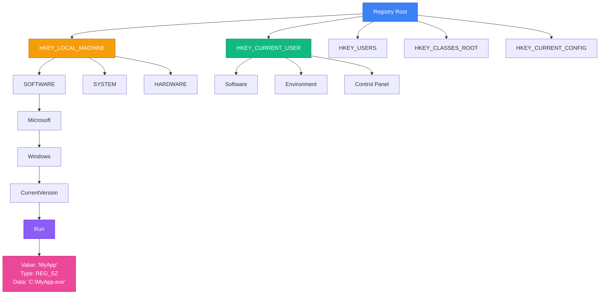

# Реєстр Windows — Центральна База Конфігурації Системи

## Навіщо Існує Реєстр?

У світі Unix/Linux конфігурація системи та програм зберігається у текстових файлах: `/etc/nginx/nginx.conf`, `~/.bashrc`, `/etc/fstab`. Кожна програма має свій формат, своє розташування, свої правила. Windows пішла іншим шляхом — створила **централізовану ієрархічну базу даних** для зберігання всіх налаштувань системи та застосунків. Ця база називається **Windows Registry** (Реєстр Windows).

Розглянемо три сценарії, що демонструють силу та важливість реєстру:

**Сценарій перший: Автозапуск програми при вході в систему.** Ви створили утиліту для моніторингу системи, що має запускатися автоматично при кожному вході користувача. Замість копіювання ярлика у папку `Startup` (що легко видалити), ви додаєте запис у `HKEY_CURRENT_USER\Software\Microsoft\Windows\CurrentVersion\Run`. Тепер програма запускається навіть якщо папка `Startup` порожня — це системний механізм, що використовують всі серйозні застосунки.

**Сценарій другий: Файлові асоціації.** Ви розробили текстовий редактор і хочете, щоб файли `.md` відкривалися вашою програмою при подвійному кліку. Реєстр містить всю інформацію про асоціації: який значок показувати, яку програму запускати, які команди контекстного меню додати. Один запис у `HKEY_CLASSES_ROOT` — і Windows "знає" про ваш редактор.

**Сценарій третій: Персоналізація системи.** Компанія має 500 комп'ютерів і хоче встановити єдині налаштування: вимкнути Windows Update, заборонити доступ до Command Prompt, встановити корпоративні обої. Замість ручного налаштування кожної машини, IT-відділ створює `.reg` файл або PowerShell скрипт, що змінює відповідні ключі реєстру. Одна команда — і всі машини налаштовані однаково.

Реєстр — це не просто "база налаштувань". Це **API операційної системи для конфігурації**. Розуміння реєстру дає контроль над Windows на рівні, недоступному через GUI.

---

## Детальна Архітектура Реєстру

Реєстр має п'ять кореневих розділів, кожен з яких відповідає за певну область:

::field-group

::field{name="HKEY_LOCAL_MACHINE (HKLM)" type="Системні налаштування"}
Конфігурація, спільна для всіх користувачів комп'ютера: встановлене обладнання, драйвери, системні служби, встановлені програми. Зміни тут вимагають прав адміністратора. Фізично зберігається у `C:\Windows\System32\config\`.

**Ключові підрозділи:**
- `HARDWARE` — інформація про обладнання (генерується при завантаженні, не зберігається на диску)
- `SAM` — Security Account Manager (паролі користувачів, групи)
- `SECURITY` — політики безпеки, права доступу
- `SOFTWARE` — налаштування програм для всіх користувачів
- `SYSTEM` — конфігурація служб, драйверів, параметри завантаження
::

::field{name="HKEY_CURRENT_USER (HKCU)" type="Налаштування поточного користувача"}
Персональні налаштування користувача, що зараз увійшов у систему: обої робочого столу, налаштування програм, змінні середовища. Фізично — це `NTUSER.DAT` у профілі користувача (`C:\Users\<Username>\`).

**Ключові підрозділи:**
- `Software` — налаштування програм для цього користувача
- `Environment` — змінні середовища користувача
- `Control Panel` — налаштування панелі керування (миша, клавіатура, регіон)
- `Keyboard Layout` — розкладки клавіатури
::

::field{name="HKEY_USERS (HKU)" type="Всі профілі користувачів"}
Містить підрозділи для кожного завантаженого профілю користувача. `HKEY_CURRENT_USER` — це просто посилання (symbolic link) на `HKEY_USERS\<SID>`, де `<SID>` — Security Identifier поточного користувача (наприклад, `S-1-5-21-123456789-...`).
::

::field{name="HKEY_CLASSES_ROOT (HKCR)" type="Файлові асоціації та COM"}
Об'єднання `HKLM\Software\Classes` та `HKCU\Software\Classes`. Містить інформацію про типи файлів, розширення, COM-класи, OLE об'єкти. Коли ви двічі клікаєте на `.txt` файл, Windows шукає тут, яку програму запустити.
::

::field{name="HKEY_CURRENT_CONFIG (HKCC)" type="Поточна конфігурація обладнання"}
Посилання на `HKLM\SYSTEM\CurrentControlSet\Hardware Profiles\Current`. Містить інформацію про поточний профіль обладнання (актуально для ноутбуків з док-станціями).
::

::

### Анатомія Ключа та Значення

Реєстр має три основні сутності:

**1. Key (Ключ)** — аналог папки у файловій системі. Може містити підключі (subkeys) та значення (values). Має ім'я та шлях.

```
HKEY_CURRENT_USER\Software\MyApp
                  └─ Software ← ключ
                     └─ MyApp ← підключ
```

**2. Value (Значення)** — аналог файлу. Має три компоненти:
- **Name** (ім'я) — рядок, що ідентифікує значення. Може бути порожнім (тоді це "default value")
- **Type** (тип) — визначає формат даних (REG_SZ, REG_DWORD, тощо)
- **Data** (дані) — власне значення

**3. Data Types** — реєстр підтримує кілька типів даних:

::field-group

::field{name="REG_SZ" type="String"}
Рядок Unicode (null-terminated). Найпоширеніший тип для текстових значень.

```
Name: "ApplicationPath"
Type: REG_SZ
Data: "C:\Program Files\MyApp\app.exe"
```
::

::field{name="REG_EXPAND_SZ" type="Expandable String"}
Рядок, що містить змінні середовища (`%USERPROFILE%`, `%TEMP%`). Windows автоматично розгортає їх при читанні.

```
Name: "LogPath"
Type: REG_EXPAND_SZ
Data: "%APPDATA%\MyApp\logs"
→ Розгортається у: "C:\Users\John\AppData\Roaming\MyApp\logs"
```
::

::field{name="REG_DWORD" type="32-bit Integer"}
Ціле число (4 байти). Використовується для прапорців, лічильників, налаштувань.

```
Name: "AutoStart"
Type: REG_DWORD
Data: 0x00000001 (1 = увімкнено, 0 = вимкнено)
```
::

::field{name="REG_QWORD" type="64-bit Integer"}
Ціле число (8 байт). Для великих значень або timestamp-ів.
::

::field{name="REG_BINARY" type="Binary Data"}
Довільні бінарні дані. Використовується для збереження структур, зображень, зашифрованих даних.
::

::field{name="REG_MULTI_SZ" type="Multi-String"}
Масив рядків, розділених null-символами. Використовується для списків.

```
Name: "SearchPaths"
Type: REG_MULTI_SZ
Data: "C:\Path1\0C:\Path2\0C:\Path3\0\0"
```
::

::

### Візуалізація: Дерево Реєстру

::mermaid

::

### Фізична Структура: Hive Files

Windows Registry — це **ієрархічна база даних**, що зберігається у кількох бінарних файлах на диску. Ці файли називаються **hive files** (файли вуликів). Кожен hive file містить дерево ключів та значень.

**Розташування hive files на диску:**

```
C:\Windows\System32\config\
├── SAM           → HKEY_LOCAL_MACHINE\SAM (Security Account Manager)
├── SECURITY      → HKEY_LOCAL_MACHINE\SECURITY
├── SOFTWARE      → HKEY_LOCAL_MACHINE\SOFTWARE
├── SYSTEM        → HKEY_LOCAL_MACHINE\SYSTEM
└── DEFAULT       → HKEY_USERS\.DEFAULT

C:\Users\<Username>\
├── NTUSER.DAT    → HKEY_CURRENT_USER (налаштування користувача)
└── AppData\Local\Microsoft\Windows\UsrClass.dat → HKEY_CURRENT_USER\Software\Classes
```

При завантаженні Windows, kernel завантажує ці файли у пам'ять та монтує їх як єдине дерево. Всі зміни спочатку відбуваються у пам'яті, потім періодично (або при shutdown) записуються на диск.

::note
**Чому "hive"?** Термін походить від структури бджолиного вулика (honeycomb) — багато комірок, організованих ієрархічно. Реєстр має аналогічну структуру: ключі містять підключі, що містять значення.
::

---

## Regedit: Графічний Інтерфейс Реєстру

Перш ніж працювати з реєстром програмно, важливо розуміти, як він виглядає та працює через GUI.

### Запуск Regedit

```bash
# Натисніть Win+R, введіть:
regedit
```

::warning
**Regedit — потужний інструмент.** Неправильні зміни можуть зробити систему незавантажуваною. Завжди створюйте резервну копію перед змінами: `File → Export` або `Right-click key → Export`.
::

### Навігація у Regedit

Інтерфейс схожий на Windows Explorer:
- **Ліва панель** — дерево ключів (як папки)
- **Права панель** — значення у вибраному ключі (як файли)
- **Адресний рядок** — шлях до поточного ключа

**Корисні функції:**

1. **Пошук** (Ctrl+F) — шукає ключі, значення та дані по всьому реєстру
2. **Закладки** (Favorites) — збережіть часто використовувані ключі
3. **Експорт/Імпорт** — збереження та відновлення частин реєстру
4. **Права доступу** (Permissions) — контроль доступу до ключів

### Приклад: Знайти Версію Windows

::steps

### Крок 1: Відкрийте Regedit

Натисніть `Win+R`, введіть `regedit`, натисніть Enter.

### Крок 2: Перейдіть до ключа

Розгорніть дерево:
```
HKEY_LOCAL_MACHINE
  └─ SOFTWARE
     └─ Microsoft
        └─ Windows NT
           └─ CurrentVersion
```

### Крок 3: Знайдіть значення

У правій панелі знайдіть:
- `ProductName` — назва версії (наприклад, "Windows 11 Pro")
- `CurrentBuild` — номер збірки (наприклад, "22631")
- `DisplayVersion` — версія для відображення (наприклад, "23H2")

::

---

## Microsoft.Win32.Registry API: Робота з Реєстром у C#

.NET надає managed API для роботи з реєстром через простір імен `Microsoft.Win32`. Це обгортка над Win32 API функціями `RegOpenKeyEx`, `RegQueryValueEx`, `RegSetValueEx`, тощо.

### Читання Значень: Базовий Приклад

```csharp showLineNumbers [ReadRegistryExample.cs]
using Microsoft.Win32;

class Program
{
    static void Main()
    {
        // Відкриваємо ключ (read-only)
        using RegistryKey? key = Registry.LocalMachine.OpenSubKey(
            @"SOFTWARE\Microsoft\Windows NT\CurrentVersion"
        );

        if (key == null)
        {
            Console.WriteLine("Ключ не знайдено");
            return;
        }

        // Читаємо значення
        string? productName = key.GetValue("ProductName") as string;
        string? currentBuild = key.GetValue("CurrentBuild") as string;
        string? displayVersion = key.GetValue("DisplayVersion") as string;

        Console.WriteLine("═══════════════════════════════════════");
        Console.WriteLine("       WINDOWS VERSION INFO");
        Console.WriteLine("═══════════════════════════════════════");
        Console.WriteLine($"Product:  {productName}");
        Console.WriteLine($"Version:  {displayVersion}");
        Console.WriteLine($"Build:    {currentBuild}");
        Console.WriteLine("═══════════════════════════════════════");
    }
}
```

::terminal-preview{title="ReadRegistryExample"}
<div class="line"><span class="opacity-40">$</span> <strong class="font-bold">dotnet run</strong></div>
<div class="line">═══════════════════════════════════════</div>
<div class="line">       <span class="text-blue-400 font-bold">WINDOWS VERSION INFO</span></div>
<div class="line">═══════════════════════════════════════</div>
<div class="line">Product:  <span class="text-green-400">Windows 11 Pro</span></div>
<div class="line">Version:  <span class="text-yellow-400">23H2</span></div>
<div class="line">Build:    <span class="text-yellow-400">22631</span></div>
<div class="line">═══════════════════════════════════════</div>
::

### Registry Class: Точки Входу

Клас `Registry` надає статичні властивості для доступу до кореневих розділів:

```csharp
RegistryKey hklm = Registry.LocalMachine;    // HKEY_LOCAL_MACHINE
RegistryKey hkcu = Registry.CurrentUser;     // HKEY_CURRENT_USER
RegistryKey hku  = Registry.Users;           // HKEY_USERS
RegistryKey hkcr = Registry.ClassesRoot;     // HKEY_CLASSES_ROOT
RegistryKey hkcc = Registry.CurrentConfig;   // HKEY_CURRENT_CONFIG
```

### RegistryKey: Основні Методи

::field-group

::field{name="OpenSubKey(string, bool)" type="RegistryKey?"}
Відкриває підключ. Другий параметр — `writable` (за замовчуванням `false`). Повертає `null` якщо ключ не існує.

```csharp
// Read-only
using var key = Registry.CurrentUser.OpenSubKey(@"Software\MyApp");

// Writable (для запису)
using var key = Registry.CurrentUser.OpenSubKey(@"Software\MyApp", writable: true);
```
::

::field{name="CreateSubKey(string)" type="RegistryKey"}
Створює новий підключ або відкриває існуючий (writable). Автоматично створює всі проміжні ключі у шляху.

```csharp
using var key = Registry.CurrentUser.CreateSubKey(@"Software\MyApp\Settings");
// Створить Software, MyApp, Settings якщо їх немає
```
::

::field{name="GetValue(string, object?)" type="object?"}
Читає значення. Другий параметр — значення за замовчуванням, якщо значення не існує.

```csharp
string path = key.GetValue("InstallPath", @"C:\Default") as string;
int timeout = (int)key.GetValue("Timeout", 30);
```
::

::field{name="SetValue(string, object, RegistryValueKind)" type="void"}
Записує значення. Третій параметр — тип даних (за замовчуванням визначається автоматично).

```csharp
key.SetValue("Version", "1.0.0");                          // REG_SZ
key.SetValue("Enabled", 1, RegistryValueKind.DWord);       // REG_DWORD
key.SetValue("Data", new byte[] {1,2,3}, RegistryValueKind.Binary); // REG_BINARY
```
::

::field{name="DeleteValue(string, bool)" type="void"}
Видаляє значення. Другий параметр — `throwOnMissingValue` (за замовчуванням `true`).

```csharp
key.DeleteValue("OldSetting", throwOnMissingValue: false);
```
::

::field{name="DeleteSubKey(string, bool)" type="void"}
Видаляє підключ. Ключ має бути порожнім (без підключів). Другий параметр — `throwOnMissingSubKey`.

```csharp
key.DeleteSubKey("TempSettings", throwOnMissingSubKey: false);
```
::

::field{name="DeleteSubKeyTree(string, bool)" type="void"}
Видаляє підключ разом з усіма вкладеними підключами та значеннями (рекурсивно).

```csharp
key.DeleteSubKeyTree("OldVersion", throwOnMissingSubKey: false);
```
::

::field{name="GetSubKeyNames()" type="string[]"}
Повертає масив імен усіх підключів.

```csharp
string[] subKeys = key.GetSubKeyNames();
foreach (string name in subKeys)
    Console.WriteLine($"SubKey: {name}");
```
::

::field{name="GetValueNames()" type="string[]"}
Повертає масив імен усіх значень у ключі.

```csharp
string[] valueNames = key.GetValueNames();
foreach (string name in valueNames)
{
    object? value = key.GetValue(name);
    Console.WriteLine($"{name} = {value}");
}
```
::

::

---

## Практичні Приклади з "Вау-Ефектом"

Тепер, коли ми розуміємо механізм реєстру, перейдемо до практичних прикладів, що демонструють реальну силу роботи з Registry API.

### Приклад 1: Автозапуск Програми при Вході в Систему

Один з найпопулярніших use case — додати програму до автозапуску. Існує кілька місць у реєстрі для цього:

**Для поточного користувача (не потрібні права адміністратора):**
```
HKEY_CURRENT_USER\Software\Microsoft\Windows\CurrentVersion\Run
```

**Для всіх користувачів (потрібні права адміністратора):**
```
HKEY_LOCAL_MACHINE\SOFTWARE\Microsoft\Windows\CurrentVersion\Run
```

```csharp showLineNumbers [AutoStartManager.cs]
using Microsoft.Win32;

class AutoStartManager
{
    public static void AddToAutoStart(string appName, string exePath)
    {
        try
        {
            using var key = Registry.CurrentUser.OpenSubKey(
                @"Software\Microsoft\Windows\CurrentVersion\Run", 
                writable: true
            );

            if (key == null)
            {
                Console.WriteLine("❌ Не вдалося відкрити ключ Run");
                return;
            }

            // Додаємо значення
            key.SetValue(appName, exePath);
            
            Console.ForegroundColor = ConsoleColor.Green;
            Console.WriteLine($"✓ Програму '{appName}' додано до автозапуску");
            Console.WriteLine($"  Шлях: {exePath}");
            Console.ResetColor();
        }
        catch (Exception ex)
        {
            Console.ForegroundColor = ConsoleColor.Red;
            Console.WriteLine($"❌ Помилка: {ex.Message}");
            Console.ResetColor();
        }
    }

    public static void RemoveFromAutoStart(string appName)
    {
        try
        {
            using var key = Registry.CurrentUser.OpenSubKey(
                @"Software\Microsoft\Windows\CurrentVersion\Run", 
                writable: true
            );

            if (key == null)
            {
                Console.WriteLine("❌ Не вдалося відкрити ключ Run");
                return;
            }

            // Перевіряємо чи існує значення
            if (key.GetValue(appName) != null)
            {
                key.DeleteValue(appName);
                Console.ForegroundColor = ConsoleColor.Green;
                Console.WriteLine($"✓ Програму '{appName}' видалено з автозапуску");
                Console.ResetColor();
            }
            else
            {
                Console.WriteLine($"⚠ Програма '{appName}' не знайдена в автозапуску");
            }
        }
        catch (Exception ex)
        {
            Console.ForegroundColor = ConsoleColor.Red;
            Console.WriteLine($"❌ Помилка: {ex.Message}");
            Console.ResetColor();
        }
    }

    public static void ListAutoStartPrograms()
    {
        Console.WriteLine("\n═══════════════════════════════════════════════════");
        Console.WriteLine("           ПРОГРАМИ В АВТОЗАПУСКУ");
        Console.WriteLine("═══════════════════════════════════════════════════\n");

        // Читаємо з HKCU
        Console.ForegroundColor = ConsoleColor.Cyan;
        Console.WriteLine("📁 Поточний користувач (HKCU):");
        Console.ResetColor();
        ListFromKey(Registry.CurrentUser, @"Software\Microsoft\Windows\CurrentVersion\Run");

        Console.WriteLine();

        // Читаємо з HKLM (може вимагати прав)
        Console.ForegroundColor = ConsoleColor.Cyan;
        Console.WriteLine("📁 Всі користувачі (HKLM):");
        Console.ResetColor();
        ListFromKey(Registry.LocalMachine, @"SOFTWARE\Microsoft\Windows\CurrentVersion\Run");

        Console.WriteLine("\n═══════════════════════════════════════════════════");
    }

    private static void ListFromKey(RegistryKey root, string subKeyPath)
    {
        try
        {
            using var key = root.OpenSubKey(subKeyPath);
            if (key == null)
            {
                Console.WriteLine("  (ключ не знайдено)");
                return;
            }

            string[] valueNames = key.GetValueNames();
            
            if (valueNames.Length == 0)
            {
                Console.WriteLine("  (порожньо)");
                return;
            }

            foreach (string name in valueNames)
            {
                string? value = key.GetValue(name) as string;
                Console.ForegroundColor = ConsoleColor.Yellow;
                Console.Write($"  • {name}");
                Console.ResetColor();
                Console.WriteLine($"\n    → {value}");
            }
        }
        catch (Exception ex)
        {
            Console.ForegroundColor = ConsoleColor.Red;
            Console.WriteLine($"  ❌ Помилка: {ex.Message}");
            Console.ResetColor();
        }
    }
}

// Використання
class Program
{
    static void Main(string[] args)
    {
        if (args.Length == 0)
        {
            Console.WriteLine("Використання:");
            Console.WriteLine("  dotnet run list                    - Показати всі програми в автозапуску");
            Console.WriteLine("  dotnet run add <name> <path>       - Додати програму");
            Console.WriteLine("  dotnet run remove <name>           - Видалити програму");
            return;
        }

        string command = args[0].ToLower();

        switch (command)
        {
            case "list":
                AutoStartManager.ListAutoStartPrograms();
                break;

            case "add":
                if (args.Length < 3)
                {
                    Console.WriteLine("❌ Вкажіть назву та шлях до програми");
                    return;
                }
                AutoStartManager.AddToAutoStart(args[1], args[2]);
                break;

            case "remove":
                if (args.Length < 2)
                {
                    Console.WriteLine("❌ Вкажіть назву програми");
                    return;
                }
                AutoStartManager.RemoveFromAutoStart(args[1]);
                break;

            default:
                Console.WriteLine($"❌ Невідома команда: {command}");
                break;
        }
    }
}
```

::terminal-preview{title="AutoStart Manager" :expandable="true" maxHeight="400px"}
<div class="line"><span class="opacity-40">$</span> <strong class="font-bold">dotnet run add "MyMonitor" "C:\Tools\monitor.exe"</strong></div>
<div class="line"><span class="text-green-400">✓</span> Програму 'MyMonitor' додано до автозапуску</div>
<div class="line">  Шлях: C:\Tools\monitor.exe</div>
<div class="line"></div>
<div class="line"><span class="opacity-40">$</span> <strong class="font-bold">dotnet run list</strong></div>
<div class="line"></div>
<div class="line">═══════════════════════════════════════════════════</div>
<div class="line">           <span class="text-blue-400 font-bold">ПРОГРАМИ В АВТОЗАПУСКУ</span></div>
<div class="line">═══════════════════════════════════════════════════</div>
<div class="line"></div>
<div class="line"><span class="text-blue-400">📁 Поточний користувач (HKCU):</span></div>
<div class="line">  <span class="text-yellow-400">• MyMonitor</span></div>
<div class="line">    → C:\Tools\monitor.exe</div>
<div class="line">  <span class="text-yellow-400">• OneDrive</span></div>
<div class="line">    → "C:\Program Files\Microsoft OneDrive\OneDrive.exe" /background</div>
<div class="line">  <span class="text-yellow-400">• Discord</span></div>
<div class="line">    → C:\Users\John\AppData\Local\Discord\Update.exe --processStart Discord.exe</div>
<div class="line"></div>
<div class="line"><span class="text-blue-400">📁 Всі користувачі (HKLM):</span></div>
<div class="line">  <span class="text-yellow-400">• SecurityHealth</span></div>
<div class="line">    → %windir%\system32\SecurityHealthSystray.exe</div>
<div class="line"></div>
<div class="line">═══════════════════════════════════════════════════</div>
<div class="line"></div>
<div class="line"><span class="opacity-40">$</span> <strong class="font-bold">dotnet run remove "MyMonitor"</strong></div>
<div class="line"><span class="text-green-400">✓</span> Програму 'MyMonitor' видалено з автозапуску</div>
::

::tip
**Вау-ефект:** Після виконання `add`, перезавантажте комп'ютер — ваша програма запуститься автоматично! Це той самий механізм, що використовують Skype, Discord, Steam та інші програми.
::

---

### Приклад 2: Персоналізація Windows Explorer

Windows зберігає багато налаштувань Explorer у реєстрі. Ось кілька цікавих твіків:

```csharp showLineNumbers [ExplorerTweaks.cs]
using Microsoft.Win32;

class ExplorerTweaks
{
    private const string ExplorerAdvancedKey = 
        @"Software\Microsoft\Windows\CurrentVersion\Explorer\Advanced";

    public static void ShowHiddenFiles(bool show)
    {
        try
        {
            using var key = Registry.CurrentUser.CreateSubKey(ExplorerAdvancedKey);
            
            // 1 = показувати, 2 = не показувати
            key.SetValue("Hidden", show ? 1 : 2, RegistryValueKind.DWord);
            
            Console.WriteLine($"✓ Приховані файли: {(show ? "ПОКАЗУВАТИ" : "ПРИХОВАТИ")}");
            Console.WriteLine("  ⚠ Перезапустіть Explorer для застосування змін");
            
            RefreshExplorer();
        }
        catch (Exception ex)
        {
            Console.WriteLine($"❌ Помилка: {ex.Message}");
        }
    }

    public static void ShowFileExtensions(bool show)
    {
        try
        {
            using var key = Registry.CurrentUser.CreateSubKey(ExplorerAdvancedKey);
            
            // 0 = показувати, 1 = приховати (інверсна логіка!)
            key.SetValue("HideFileExt", show ? 0 : 1, RegistryValueKind.DWord);
            
            Console.WriteLine($"✓ Розширення файлів: {(show ? "ПОКАЗУВАТИ" : "ПРИХОВАТИ")}");
            
            RefreshExplorer();
        }
        catch (Exception ex)
        {
            Console.WriteLine($"❌ Помилка: {ex.Message}");
        }
    }

    public static void ShowFullPathInTitleBar(bool show)
    {
        try
        {
            using var key = Registry.CurrentUser.CreateSubKey(
                @"Software\Microsoft\Windows\CurrentVersion\Explorer\CabinetState"
            );
            
            // 1 = показувати повний шлях, 0 = тільки назва папки
            key.SetValue("FullPath", show ? 1 : 0, RegistryValueKind.DWord);
            
            Console.WriteLine($"✓ Повний шлях у заголовку: {(show ? "УВІМКНЕНО" : "ВИМКНЕНО")}");
            
            RefreshExplorer();
        }
        catch (Exception ex)
        {
            Console.WriteLine($"❌ Помилка: {ex.Message}");
        }
    }

    public static void SetExplorerStartFolder(string folder)
    {
        try
        {
            using var key = Registry.CurrentUser.CreateSubKey(ExplorerAdvancedKey);
            
            // 1 = This PC, 2 = Quick Access
            int value = folder.ToLower() switch
            {
                "thispc" => 1,
                "quickaccess" => 2,
                _ => throw new ArgumentException("Використовуйте 'thispc' або 'quickaccess'")
            };
            
            key.SetValue("LaunchTo", value, RegistryValueKind.DWord);
            
            Console.WriteLine($"✓ Explorer відкривається на: {folder.ToUpper()}");
            
            RefreshExplorer();
        }
        catch (Exception ex)
        {
            Console.WriteLine($"❌ Помилка: {ex.Message}");
        }
    }

    public static void DisableAds(bool disable)
    {
        try
        {
            using var key = Registry.CurrentUser.CreateSubKey(ExplorerAdvancedKey);
            
            // 0 = вимкнути рекламу, 1 = увімкнути
            key.SetValue("ShowSyncProviderNotifications", disable ? 0 : 1, RegistryValueKind.DWord);
            
            Console.WriteLine($"✓ Реклама в Explorer: {(disable ? "ВИМКНЕНО" : "УВІМКНЕНО")}");
            
            RefreshExplorer();
        }
        catch (Exception ex)
        {
            Console.WriteLine($"❌ Помилка: {ex.Message}");
        }
    }

    private static void RefreshExplorer()
    {
        Console.ForegroundColor = ConsoleColor.Yellow;
        Console.WriteLine("\n💡 Порада: Для миттєвого застосування змін виконайте:");
        Console.WriteLine("   taskkill /f /im explorer.exe && start explorer.exe");
        Console.ResetColor();
    }

    public static void ShowCurrentSettings()
    {
        Console.WriteLine("\n═══════════════════════════════════════════════════");
        Console.WriteLine("       ПОТОЧНІ НАЛАШТУВАННЯ EXPLORER");
        Console.WriteLine("═══════════════════════════════════════════════════\n");

        try
        {
            using var key = Registry.CurrentUser.OpenSubKey(ExplorerAdvancedKey);
            if (key == null)
            {
                Console.WriteLine("❌ Ключ не знайдено");
                return;
            }

            int hidden = (int)(key.GetValue("Hidden") ?? 2);
            int hideExt = (int)(key.GetValue("HideFileExt") ?? 1);
            int launchTo = (int)(key.GetValue("LaunchTo") ?? 2);
            int showAds = (int)(key.GetValue("ShowSyncProviderNotifications") ?? 1);

            Console.WriteLine($"Приховані файли:        {(hidden == 1 ? "✓ Показувати" : "✗ Приховати")}");
            Console.WriteLine($"Розширення файлів:      {(hideExt == 0 ? "✓ Показувати" : "✗ Приховати")}");
            Console.WriteLine($"Стартова папка:         {(launchTo == 1 ? "This PC" : "Quick Access")}");
            Console.WriteLine($"Реклама:                {(showAds == 0 ? "✓ Вимкнено" : "✗ Увімкнено")}");

            using var cabinetKey = Registry.CurrentUser.OpenSubKey(
                @"Software\Microsoft\Windows\CurrentVersion\Explorer\CabinetState"
            );
            if (cabinetKey != null)
            {
                int fullPath = (int)(cabinetKey.GetValue("FullPath") ?? 0);
                Console.WriteLine($"Повний шлях у заголовку: {(fullPath == 1 ? "✓ Увімкнено" : "✗ Вимкнено")}");
            }
        }
        catch (Exception ex)
        {
            Console.WriteLine($"❌ Помилка: {ex.Message}");
        }

        Console.WriteLine("\n═══════════════════════════════════════════════════");
    }
}

// Використання
class Program
{
    static void Main(string[] args)
    {
        if (args.Length == 0)
        {
            Console.WriteLine("Windows Explorer Tweaks");
            Console.WriteLine("=======================\n");
            Console.WriteLine("Команди:");
            Console.WriteLine("  show-hidden <on|off>      - Показувати приховані файли");
            Console.WriteLine("  show-ext <on|off>         - Показувати розширення файлів");
            Console.WriteLine("  full-path <on|off>        - Повний шлях у заголовку");
            Console.WriteLine("  start-folder <thispc|quickaccess> - Стартова папка");
            Console.WriteLine("  disable-ads <on|off>      - Вимкнути рекламу");
            Console.WriteLine("  status                    - Показати поточні налаштування");
            return;
        }

        string command = args[0].ToLower();

        switch (command)
        {
            case "show-hidden":
                if (args.Length < 2) goto default;
                ExplorerTweaks.ShowHiddenFiles(args[1] == "on");
                break;

            case "show-ext":
                if (args.Length < 2) goto default;
                ExplorerTweaks.ShowFileExtensions(args[1] == "on");
                break;

            case "full-path":
                if (args.Length < 2) goto default;
                ExplorerTweaks.ShowFullPathInTitleBar(args[1] == "on");
                break;

            case "start-folder":
                if (args.Length < 2) goto default;
                ExplorerTweaks.SetExplorerStartFolder(args[1]);
                break;

            case "disable-ads":
                if (args.Length < 2) goto default;
                ExplorerTweaks.DisableAds(args[1] == "on");
                break;

            case "status":
                ExplorerTweaks.ShowCurrentSettings();
                break;

            default:
                Console.WriteLine("❌ Невірна команда або недостатньо параметрів");
                break;
        }
    }
}
```

::terminal-preview{title="Explorer Tweaks" :expandable="true" maxHeight="380px"}
<div class="line"><span class="opacity-40">$</span> <strong class="font-bold">dotnet run status</strong></div>
<div class="line"></div>
<div class="line">═══════════════════════════════════════════════════</div>
<div class="line">       <span class="text-blue-400 font-bold">ПОТОЧНІ НАЛАШТУВАННЯ EXPLORER</span></div>
<div class="line">═══════════════════════════════════════════════════</div>
<div class="line"></div>
<div class="line">Приховані файли:        <span class="text-red-400">✗ Приховати</span></div>
<div class="line">Розширення файлів:      <span class="text-red-400">✗ Приховати</span></div>
<div class="line">Стартова папка:         Quick Access</div>
<div class="line">Реклама:                <span class="text-red-400">✗ Увімкнено</span></div>
<div class="line">Повний шлях у заголовку: <span class="text-red-400">✗ Вимкнено</span></div>
<div class="line"></div>
<div class="line">═══════════════════════════════════════════════════</div>
<div class="line"></div>
<div class="line"><span class="opacity-40">$</span> <strong class="font-bold">dotnet run show-hidden on</strong></div>
<div class="line"><span class="text-green-400">✓</span> Приховані файли: ПОКАЗУВАТИ</div>
<div class="line">  ⚠ Перезапустіть Explorer для застосування змін</div>
<div class="line"></div>
<div class="line"><span class="text-yellow-400">💡 Порада: Для миттєвого застосування змін виконайте:</span></div>
<div class="line"><span class="text-yellow-400">   taskkill /f /im explorer.exe && start explorer.exe</span></div>
<div class="line"></div>
<div class="line"><span class="opacity-40">$</span> <strong class="font-bold">dotnet run show-ext on</strong></div>
<div class="line"><span class="text-green-400">✓</span> Розширення файлів: ПОКАЗУВАТИ</div>
<div class="line"></div>
<div class="line"><span class="opacity-40">$</span> <strong class="font-bold">dotnet run disable-ads on</strong></div>
<div class="line"><span class="text-green-400">✓</span> Реклама в Explorer: ВИМКНЕНО</div>
::

::tip
**Вау-ефект:** Після виконання команд та перезапуску Explorer (`taskkill /f /im explorer.exe && start explorer.exe`), ви побачите миттєві зміни: приховані файли стануть видимими, розширення з'являться, реклама зникне. Це ті самі налаштування, що доступні через GUI, але тепер ви можете автоматизувати їх!
::

---

### Приклад 3: Файлові Асоціації — Власний Обробник Файлів

Створимо повноцінну асоціацію для власного типу файлів `.mydata` з іконкою, контекстним меню та обробником.

```csharp showLineNumbers [FileAssociationManager.cs]
using Microsoft.Win32;
using System.Diagnostics;

class FileAssociationManager
{
    public static void RegisterFileType(
        string extension,           // ".mydata"
        string progId,              // "MyApp.DataFile"
        string description,         // "MyApp Data File"
        string exePath,             // Шлях до програми
        string? iconPath = null)    // Шлях до іконки (опціонально)
    {
        try
        {
            // Крок 1: Реєструємо розширення
            using (var extKey = Registry.ClassesRoot.CreateSubKey(extension))
            {
                extKey.SetValue("", progId); // Default value = ProgID
                Console.WriteLine($"✓ Зареєстровано розширення: {extension}");
            }

            // Крок 2: Створюємо ProgID
            using (var progIdKey = Registry.ClassesRoot.CreateSubKey(progId))
            {
                progIdKey.SetValue("", description);
                Console.WriteLine($"✓ Створено ProgID: {progId}");

                // Крок 3: Встановлюємо іконку
                if (!string.IsNullOrEmpty(iconPath))
                {
                    using var iconKey = progIdKey.CreateSubKey("DefaultIcon");
                    iconKey.SetValue("", iconPath);
                    Console.WriteLine($"✓ Встановлено іконку: {iconPath}");
                }

                // Крок 4: Команда відкриття (подвійний клік)
                using (var commandKey = progIdKey.CreateSubKey(@"shell\open\command"))
                {
                    commandKey.SetValue("", $"\"{exePath}\" \"%1\"");
                    Console.WriteLine($"✓ Команда відкриття: {exePath}");
                }

                // Крок 5: Додаткові команди контекстного меню
                using (var editKey = progIdKey.CreateSubKey(@"shell\edit"))
                {
                    editKey.SetValue("", "Редагувати в Notepad");
                    using var editCommandKey = editKey.CreateSubKey("command");
                    editCommandKey.SetValue("", $"notepad.exe \"%1\"");
                }

                using (var printKey = progIdKey.CreateSubKey(@"shell\print"))
                {
                    printKey.SetValue("", "Друкувати");
                    using var printCommandKey = printKey.CreateSubKey("command");
                    printCommandKey.SetValue("", $"\"{exePath}\" /print \"%1\"");
                }

                Console.WriteLine("✓ Додано команди контекстного меню");
            }

            Console.ForegroundColor = ConsoleColor.Green;
            Console.WriteLine($"\n🎉 Асоціацію для {extension} успішно створено!");
            Console.WriteLine("   Тепер файли цього типу відкриватимуться вашою програмою.");
            Console.ResetColor();

            // Оновлюємо кеш Explorer
            RefreshShellIcons();
        }
        catch (Exception ex)
        {
            Console.ForegroundColor = ConsoleColor.Red;
            Console.WriteLine($"❌ Помилка: {ex.Message}");
            Console.ResetColor();
        }
    }

    public static void UnregisterFileType(string extension, string progId)
    {
        try
        {
            // Видаляємо розширення
            Registry.ClassesRoot.DeleteSubKeyTree(extension, throwOnMissingSubKey: false);
            Console.WriteLine($"✓ Видалено розширення: {extension}");

            // Видаляємо ProgID
            Registry.ClassesRoot.DeleteSubKeyTree(progId, throwOnMissingSubKey: false);
            Console.WriteLine($"✓ Видалено ProgID: {progId}");

            Console.ForegroundColor = ConsoleColor.Green;
            Console.WriteLine($"\n✓ Асоціацію для {extension} видалено");
            Console.ResetColor();

            RefreshShellIcons();
        }
        catch (Exception ex)
        {
            Console.ForegroundColor = ConsoleColor.Red;
            Console.WriteLine($"❌ Помилка: {ex.Message}");
            Console.ResetColor();
        }
    }

    public static void ShowFileTypeInfo(string extension)
    {
        Console.WriteLine($"\n═══════════════════════════════════════════════════");
        Console.WriteLine($"       ІНФОРМАЦІЯ ПРО {extension.ToUpper()}");
        Console.WriteLine("═══════════════════════════════════════════════════\n");

        try
        {
            using var extKey = Registry.ClassesRoot.OpenSubKey(extension);
            if (extKey == null)
            {
                Console.WriteLine($"❌ Розширення {extension} не зареєстровано");
                return;
            }

            string? progId = extKey.GetValue("") as string;
            Console.WriteLine($"ProgID: {progId ?? "(не вказано)"}");

            if (!string.IsNullOrEmpty(progId))
            {
                using var progIdKey = Registry.ClassesRoot.OpenSubKey(progId);
                if (progIdKey != null)
                {
                    string? description = progIdKey.GetValue("") as string;
                    Console.WriteLine($"Опис: {description ?? "(не вказано)"}");

                    // Іконка
                    using var iconKey = progIdKey.OpenSubKey("DefaultIcon");
                    if (iconKey != null)
                    {
                        string? icon = iconKey.GetValue("") as string;
                        Console.WriteLine($"Іконка: {icon}");
                    }

                    // Команда відкриття
                    using var openKey = progIdKey.OpenSubKey(@"shell\open\command");
                    if (openKey != null)
                    {
                        string? command = openKey.GetValue("") as string;
                        Console.WriteLine($"Команда відкриття: {command}");
                    }

                    // Всі команди shell
                    using var shellKey = progIdKey.OpenSubKey("shell");
                    if (shellKey != null)
                    {
                        Console.WriteLine("\nКоманди контекстного меню:");
                        foreach (string verb in shellKey.GetSubKeyNames())
                        {
                            using var verbKey = shellKey.OpenSubKey(verb);
                            string? verbName = verbKey?.GetValue("") as string ?? verb;
                            Console.WriteLine($"  • {verbName} ({verb})");
                        }
                    }
                }
            }
        }
        catch (Exception ex)
        {
            Console.WriteLine($"❌ Помилка: {ex.Message}");
        }

        Console.WriteLine("\n═══════════════════════════════════════════════════");
    }

    private static void RefreshShellIcons()
    {
        // Оновлюємо кеш іконок Explorer через Win32 API
        // SHChangeNotify(SHCNE_ASSOCCHANGED, SHCNF_IDLIST, IntPtr.Zero, IntPtr.Zero);
        Console.ForegroundColor = ConsoleColor.Yellow;
        Console.WriteLine("\n💡 Порада: Перезапустіть Explorer для оновлення іконок:");
        Console.WriteLine("   taskkill /f /im explorer.exe && start explorer.exe");
        Console.ResetColor();
    }
}

// Використання
class Program
{
    static void Main(string[] args)
    {
        if (args.Length == 0)
        {
            Console.WriteLine("File Association Manager");
            Console.WriteLine("========================\n");
            Console.WriteLine("Команди:");
            Console.WriteLine("  register <ext> <progid> <desc> <exe> [icon]");
            Console.WriteLine("  unregister <ext> <progid>");
            Console.WriteLine("  info <ext>");
            Console.WriteLine("\nПриклад:");
            Console.WriteLine("  dotnet run register .mydata MyApp.DataFile \"MyApp Data\" C:\\MyApp.exe");
            return;
        }

        string command = args[0].ToLower();

        try
        {
            switch (command)
            {
                case "register":
                    if (args.Length < 5)
                    {
                        Console.WriteLine("❌ Недостатньо параметрів");
                        return;
                    }
                    string icon = args.Length > 5 ? args[5] : null;
                    FileAssociationManager.RegisterFileType(
                        args[1], args[2], args[3], args[4], icon
                    );
                    break;

                case "unregister":
                    if (args.Length < 3)
                    {
                        Console.WriteLine("❌ Недостатньо параметрів");
                        return;
                    }
                    FileAssociationManager.UnregisterFileType(args[1], args[2]);
                    break;

                case "info":
                    if (args.Length < 2)
                    {
                        Console.WriteLine("❌ Вкажіть розширення");
                        return;
                    }
                    FileAssociationManager.ShowFileTypeInfo(args[1]);
                    break;

                default:
                    Console.WriteLine($"❌ Невідома команда: {command}");
                    break;
            }
        }
        catch (UnauthorizedAccessException)
        {
            Console.ForegroundColor = ConsoleColor.Red;
            Console.WriteLine("\n❌ ПОМИЛКА: Недостатньо прав!");
            Console.WriteLine("   Запустіть програму від імені адміністратора.");
            Console.ResetColor();
        }
    }
}
```

::terminal-preview{title="File Association Manager" :expandable="true" maxHeight="420px"}
<div class="line"><span class="opacity-40">$</span> <strong class="font-bold">dotnet run register .mydata MyApp.DataFile "MyApp Data File" "C:\MyApp\app.exe" "C:\MyApp\icon.ico"</strong></div>
<div class="line"><span class="text-green-400">✓</span> Зареєстровано розширення: .mydata</div>
<div class="line"><span class="text-green-400">✓</span> Створено ProgID: MyApp.DataFile</div>
<div class="line"><span class="text-green-400">✓</span> Встановлено іконку: C:\MyApp\icon.ico</div>
<div class="line"><span class="text-green-400">✓</span> Команда відкриття: C:\MyApp\app.exe</div>
<div class="line"><span class="text-green-400">✓</span> Додано команди контекстного меню</div>
<div class="line"></div>
<div class="line"><span class="text-green-400 font-bold">🎉 Асоціацію для .mydata успішно створено!</span></div>
<div class="line">   Тепер файли цього типу відкриватимуться вашою програмою.</div>
<div class="line"></div>
<div class="line"><span class="text-yellow-400">💡 Порада: Перезапустіть Explorer для оновлення іконок:</span></div>
<div class="line"><span class="text-yellow-400">   taskkill /f /im explorer.exe && start explorer.exe</span></div>
<div class="line"></div>
<div class="line"><span class="opacity-40">$</span> <strong class="font-bold">dotnet run info .mydata</strong></div>
<div class="line"></div>
<div class="line">═══════════════════════════════════════════════════</div>
<div class="line">       <span class="text-blue-400 font-bold">ІНФОРМАЦІЯ ПРО .MYDATA</span></div>
<div class="line">═══════════════════════════════════════════════════</div>
<div class="line"></div>
<div class="line">ProgID: <span class="text-green-400">MyApp.DataFile</span></div>
<div class="line">Опис: <span class="text-green-400">MyApp Data File</span></div>
<div class="line">Іконка: C:\MyApp\icon.ico</div>
<div class="line">Команда відкриття: "C:\MyApp\app.exe" "%1"</div>
<div class="line"></div>
<div class="line">Команди контекстного меню:</div>
<div class="line">  <span class="text-yellow-400">• open (open)</span></div>
<div class="line">  <span class="text-yellow-400">• Редагувати в Notepad (edit)</span></div>
<div class="line">  <span class="text-yellow-400">• Друкувати (print)</span></div>
<div class="line"></div>
<div class="line">═══════════════════════════════════════════════════</div>
::

::tip
**Вау-ефект:** Після реєстрації створіть тестовий файл `test.mydata` — він матиме вашу іконку! Клацніть правою кнопкою — побачите власні команди контекстного меню. Подвійний клік — запустить вашу програму. Це той самий механізм, що використовують `.docx` (Word), `.psd` (Photoshop), `.blend` (Blender).
::

---

### Приклад 4: Контекстне Меню для Всіх Файлів

Додамо власну команду у контекстне меню для всіх файлів (наприклад, "Відкрити в моєму редакторі").

```csharp showLineNumbers [ContextMenuManager.cs]
using Microsoft.Win32;

class ContextMenuManager
{
    public static void AddContextMenuForAllFiles(
        string menuName,        // "Відкрити в MyEditor"
        string commandId,       // "MyEditor.OpenFile"
        string exePath,         // Шлях до програми
        string? iconPath = null)
    {
        try
        {
            // Додаємо для всіх файлів через "*"
            string keyPath = @"*\shell\" + commandId;
            
            using (var menuKey = Registry.ClassesRoot.CreateSubKey(keyPath))
            {
                menuKey.SetValue("", menuName);
                
                if (!string.IsNullOrEmpty(iconPath))
                {
                    menuKey.SetValue("Icon", iconPath);
                }

                using var commandKey = menuKey.CreateSubKey("command");
                commandKey.SetValue("", $"\"{exePath}\" \"%1\"");
            }

            Console.ForegroundColor = ConsoleColor.Green;
            Console.WriteLine($"✓ Додано команду '{menuName}' для всіх файлів");
            Console.ResetColor();
        }
        catch (Exception ex)
        {
            Console.ForegroundColor = ConsoleColor.Red;
            Console.WriteLine($"❌ Помилка: {ex.Message}");
            Console.ResetColor();
        }
    }

    public static void AddContextMenuForFolders(
        string menuName,
        string commandId,
        string exePath,
        string? iconPath = null)
    {
        try
        {
            // Додаємо для папок
            string keyPath = @"Directory\shell\" + commandId;
            
            using (var menuKey = Registry.ClassesRoot.CreateSubKey(keyPath))
            {
                menuKey.SetValue("", menuName);
                
                if (!string.IsNullOrEmpty(iconPath))
                {
                    menuKey.SetValue("Icon", iconPath);
                }

                using var commandKey = menuKey.CreateSubKey("command");
                commandKey.SetValue("", $"\"{exePath}\" \"%1\"");
            }

            Console.ForegroundColor = ConsoleColor.Green;
            Console.WriteLine($"✓ Додано команду '{menuName}' для папок");
            Console.ResetColor();
        }
        catch (Exception ex)
        {
            Console.ForegroundColor = ConsoleColor.Red;
            Console.WriteLine($"❌ Помилка: {ex.Message}");
            Console.ResetColor();
        }
    }

    public static void AddContextMenuForBackground(
        string menuName,
        string commandId,
        string exePath)
    {
        try
        {
            // Додаємо для фону папки (правий клік на порожньому місці)
            string keyPath = @"Directory\Background\shell\" + commandId;
            
            using (var menuKey = Registry.ClassesRoot.CreateSubKey(keyPath))
            {
                menuKey.SetValue("", menuName);

                using var commandKey = menuKey.CreateSubKey("command");
                commandKey.SetValue("", $"\"{exePath}\" \"%V\"");
            }

            Console.ForegroundColor = ConsoleColor.Green;
            Console.WriteLine($"✓ Додано команду '{menuName}' для фону папки");
            Console.ResetColor();
        }
        catch (Exception ex)
        {
            Console.ForegroundColor = ConsoleColor.Red;
            Console.WriteLine($"❌ Помилка: {ex.Message}");
            Console.ResetColor();
        }
    }

    public static void RemoveContextMenu(string commandId, string target)
    {
        try
        {
            string keyPath = target switch
            {
                "files" => @"*\shell\" + commandId,
                "folders" => @"Directory\shell\" + commandId,
                "background" => @"Directory\Background\shell\" + commandId,
                _ => throw new ArgumentException("Невідомий target")
            };

            Registry.ClassesRoot.DeleteSubKeyTree(keyPath, throwOnMissingSubKey: false);
            
            Console.ForegroundColor = ConsoleColor.Green;
            Console.WriteLine($"✓ Видалено команду '{commandId}' з контекстного меню");
            Console.ResetColor();
        }
        catch (Exception ex)
        {
            Console.ForegroundColor = ConsoleColor.Red;
            Console.WriteLine($"❌ Помилка: {ex.Message}");
            Console.ResetColor();
        }
    }
}

// Використання
class Program
{
    static void Main(string[] args)
    {
        if (args.Length == 0)
        {
            Console.WriteLine("Context Menu Manager");
            Console.WriteLine("====================\n");
            Console.WriteLine("Команди:");
            Console.WriteLine("  add-files <name> <id> <exe> [icon]    - Додати для всіх файлів");
            Console.WriteLine("  add-folders <name> <id> <exe> [icon]  - Додати для папок");
            Console.WriteLine("  add-background <name> <id> <exe>      - Додати для фону");
            Console.WriteLine("  remove <id> <files|folders|background> - Видалити");
            Console.WriteLine("\nПриклад:");
            Console.WriteLine("  dotnet run add-files \"Open in MyEditor\" MyEditor.Open C:\\MyEditor.exe");
            return;
        }

        string command = args[0].ToLower();

        try
        {
            switch (command)
            {
                case "add-files":
                    if (args.Length < 4) goto default;
                    string iconFiles = args.Length > 4 ? args[4] : null;
                    ContextMenuManager.AddContextMenuForAllFiles(args[1], args[2], args[3], iconFiles);
                    break;

                case "add-folders":
                    if (args.Length < 4) goto default;
                    string iconFolders = args.Length > 4 ? args[4] : null;
                    ContextMenuManager.AddContextMenuForFolders(args[1], args[2], args[3], iconFolders);
                    break;

                case "add-background":
                    if (args.Length < 4) goto default;
                    ContextMenuManager.AddContextMenuForBackground(args[1], args[2], args[3]);
                    break;

                case "remove":
                    if (args.Length < 3) goto default;
                    ContextMenuManager.RemoveContextMenu(args[1], args[2]);
                    break;

                default:
                    Console.WriteLine("❌ Невірна команда або недостатньо параметрів");
                    break;
            }
        }
        catch (UnauthorizedAccessException)
        {
            Console.ForegroundColor = ConsoleColor.Red;
            Console.WriteLine("\n❌ ПОМИЛКА: Недостатньо прав!");
            Console.WriteLine("   Запустіть програму від імені адміністратора.");
            Console.ResetColor();
        }
    }
}
```

::terminal-preview{title="Context Menu Manager"}
<div class="line"><span class="opacity-40">$</span> <strong class="font-bold">dotnet run add-files "Відкрити в MyEditor" MyEditor.Open "C:\MyEditor\editor.exe" "C:\MyEditor\icon.ico"</strong></div>
<div class="line"><span class="text-green-400">✓</span> Додано команду 'Відкрити в MyEditor' для всіх файлів</div>
<div class="line"></div>
<div class="line"><span class="opacity-40">$</span> <strong class="font-bold">dotnet run add-folders "Відкрити папку в MyEditor" MyEditor.OpenFolder "C:\MyEditor\editor.exe"</strong></div>
<div class="line"><span class="text-green-400">✓</span> Додано команду 'Відкрити папку в MyEditor' для папок</div>
<div class="line"></div>
<div class="line"><span class="opacity-40">$</span> <strong class="font-bold">dotnet run add-background "Відкрити термінал тут" MyTerminal.Open "C:\Windows\System32\cmd.exe"</strong></div>
<div class="line"><span class="text-green-400">✓</span> Додано команду 'Відкрити термінал тут' для фону папки</div>
::

::tip
**Вау-ефект:** Після виконання команд, клацніть правою кнопкою на будь-якому файлі — побачите нову команду "Відкрити в MyEditor"! Клацніть на папці — побачите "Відкрити папку в MyEditor". Клацніть на порожньому місці у папці — побачите "Відкрити термінал тут". Це той самий механізм, що використовують VS Code ("Open with Code"), Git ("Git Bash Here"), WinRAR ("Extract Here").
::

---

### Приклад 5: Персоналізація Системи — Масові Зміни

Створимо інструмент для швидкої персоналізації Windows з десятками налаштувань одночасно.

```csharp showLineNumbers [WindowsPersonalizer.cs]
using Microsoft.Win32;

class WindowsPersonalizer
{
    public static void ApplyDeveloperPreset()
    {
        Console.WriteLine("\n🚀 Застосування Developer Preset...\n");

        // 1. Вимкнути анімації (швидша робота)
        SetAnimations(false);

        // 2. Показати приховані файли та розширення
        SetExplorerAdvanced("Hidden", 1);
        SetExplorerAdvanced("HideFileExt", 0);

        // 3. Вимкнути групування у меню Пуск
        SetStartMenuGrouping(false);

        // 4. Темна тема
        SetDarkMode(true);

        // 5. Вимкнути підказки Windows
        SetWindowsTips(false);

        // 6. Вимкнути рекламу в Explorer
        SetExplorerAdvanced("ShowSyncProviderNotifications", 0);

        // 7. Показувати повний шлях у заголовку Explorer
        SetCabinetState("FullPath", 1);

        // 8. Вимкнути звуки системи
        SetSystemSounds(false);

        Console.ForegroundColor = ConsoleColor.Green;
        Console.WriteLine("\n✅ Developer Preset застосовано!");
        Console.WriteLine("   Перезапустіть Explorer для застосування всіх змін.");
        Console.ResetColor();
    }

    public static void ApplyGamingPreset()
    {
        Console.WriteLine("\n🎮 Застосування Gaming Preset...\n");

        // 1. Увімкнути Game Mode
        SetGameMode(true);

        // 2. Вимкнути Windows Update під час ігор
        SetActiveHours(8, 23); // Активні години 8:00 - 23:00

        // 3. Максимальна продуктивність
        SetPowerPlan("High Performance");

        // 4. Вимкнути фонові програми
        SetBackgroundApps(false);

        // 5. Вимкнути сповіщення
        SetNotifications(false);

        // 6. Вимкнути прозорість (більше FPS)
        SetTransparency(false);

        Console.ForegroundColor = ConsoleColor.Green;
        Console.WriteLine("\n✅ Gaming Preset застосовано!");
        Console.ResetColor();
    }

    public static void ApplyPrivacyPreset()
    {
        Console.WriteLine("\n🔒 Застосування Privacy Preset...\n");

        // 1. Вимкнути телеметрію
        SetTelemetry(false);

        // 2. Вимкнути рекламний ID
        SetAdvertisingId(false);

        // 3. Вимкнути відстеження розташування
        SetLocationTracking(false);

        // 4. Вимкнути Cortana
        SetCortana(false);

        // 5. Вимкнути діагностичні дані
        SetDiagnosticData(false);

        // 6. Вимкнути Activity History
        SetActivityHistory(false);

        Console.ForegroundColor = ConsoleColor.Green;
        Console.WriteLine("\n✅ Privacy Preset застосовано!");
        Console.ResetColor();
    }

    // Допоміжні методи
    private static void SetAnimations(bool enable)
    {
        try
        {
            using var key = Registry.CurrentUser.CreateSubKey(
                @"Control Panel\Desktop\WindowMetrics"
            );
            key.SetValue("MinAnimate", enable ? "1" : "0");
            Console.WriteLine($"  ✓ Анімації: {(enable ? "увімкнено" : "вимкнено")}");
        }
        catch (Exception ex)
        {
            Console.WriteLine($"  ❌ Анімації: {ex.Message}");
        }
    }

    private static void SetExplorerAdvanced(string valueName, int value)
    {
        try
        {
            using var key = Registry.CurrentUser.CreateSubKey(
                @"Software\Microsoft\Windows\CurrentVersion\Explorer\Advanced"
            );
            key.SetValue(valueName, value, RegistryValueKind.DWord);
            Console.WriteLine($"  ✓ Explorer/{valueName}: {value}");
        }
        catch (Exception ex)
        {
            Console.WriteLine($"  ❌ Explorer/{valueName}: {ex.Message}");
        }
    }

    private static void SetCabinetState(string valueName, int value)
    {
        try
        {
            using var key = Registry.CurrentUser.CreateSubKey(
                @"Software\Microsoft\Windows\CurrentVersion\Explorer\CabinetState"
            );
            key.SetValue(valueName, value, RegistryValueKind.DWord);
            Console.WriteLine($"  ✓ CabinetState/{valueName}: {value}");
        }
        catch (Exception ex)
        {
            Console.WriteLine($"  ❌ CabinetState/{valueName}: {ex.Message}");
        }
    }

    private static void SetStartMenuGrouping(bool enable)
    {
        try
        {
            using var key = Registry.CurrentUser.CreateSubKey(
                @"Software\Microsoft\Windows\CurrentVersion\Explorer\Advanced"
            );
            key.SetValue("Start_TrackProgs", enable ? 1 : 0, RegistryValueKind.DWord);
            Console.WriteLine($"  ✓ Групування в Start Menu: {(enable ? "увімкнено" : "вимкнено")}");
        }
        catch (Exception ex)
        {
            Console.WriteLine($"  ❌ Start Menu: {ex.Message}");
        }
    }

    private static void SetDarkMode(bool enable)
    {
        try
        {
            using var key = Registry.CurrentUser.CreateSubKey(
                @"Software\Microsoft\Windows\CurrentVersion\Themes\Personalize"
            );
            key.SetValue("AppsUseLightTheme", enable ? 0 : 1, RegistryValueKind.DWord);
            key.SetValue("SystemUsesLightTheme", enable ? 0 : 1, RegistryValueKind.DWord);
            Console.WriteLine($"  ✓ Темна тема: {(enable ? "увімкнено" : "вимкнено")}");
        }
        catch (Exception ex)
        {
            Console.WriteLine($"  ❌ Темна тема: {ex.Message}");
        }
    }

    private static void SetWindowsTips(bool enable)
    {
        try
        {
            using var key = Registry.CurrentUser.CreateSubKey(
                @"Software\Microsoft\Windows\CurrentVersion\ContentDeliveryManager"
            );
            key.SetValue("SubscribedContent-338389Enabled", enable ? 1 : 0, RegistryValueKind.DWord);
            Console.WriteLine($"  ✓ Підказки Windows: {(enable ? "увімкнено" : "вимкнено")}");
        }
        catch (Exception ex)
        {
            Console.WriteLine($"  ❌ Підказки: {ex.Message}");
        }
    }

    private static void SetSystemSounds(bool enable)
    {
        try
        {
            using var key = Registry.CurrentUser.CreateSubKey(
                @"AppEvents\Schemes"
            );
            key.SetValue("", enable ? ".Default" : ".None");
            Console.WriteLine($"  ✓ Системні звуки: {(enable ? "увімкнено" : "вимкнено")}");
        }
        catch (Exception ex)
        {
            Console.WriteLine($"  ❌ Звуки: {ex.Message}");
        }
    }

    private static void SetGameMode(bool enable)
    {
        try
        {
            using var key = Registry.CurrentUser.CreateSubKey(
                @"Software\Microsoft\GameBar"
            );
            key.SetValue("AutoGameModeEnabled", enable ? 1 : 0, RegistryValueKind.DWord);
            Console.WriteLine($"  ✓ Game Mode: {(enable ? "увімкнено" : "вимкнено")}");
        }
        catch (Exception ex)
        {
            Console.WriteLine($"  ❌ Game Mode: {ex.Message}");
        }
    }

    private static void SetActiveHours(int startHour, int endHour)
    {
        try
        {
            using var key = Registry.LocalMachine.CreateSubKey(
                @"SOFTWARE\Microsoft\WindowsUpdate\UX\Settings"
            );
            key.SetValue("ActiveHoursStart", startHour, RegistryValueKind.DWord);
            key.SetValue("ActiveHoursEnd", endHour, RegistryValueKind.DWord);
            Console.WriteLine($"  ✓ Активні години: {startHour}:00 - {endHour}:00");
        }
        catch (Exception ex)
        {
            Console.WriteLine($"  ❌ Активні години: {ex.Message}");
        }
    }

    private static void SetPowerPlan(string plan)
    {
        Console.WriteLine($"  ℹ Power Plan: використовуйте 'powercfg' для зміни");
    }

    private static void SetBackgroundApps(bool enable)
    {
        try
        {
            using var key = Registry.CurrentUser.CreateSubKey(
                @"Software\Microsoft\Windows\CurrentVersion\BackgroundAccessApplications"
            );
            key.SetValue("GlobalUserDisabled", enable ? 0 : 1, RegistryValueKind.DWord);
            Console.WriteLine($"  ✓ Фонові програми: {(enable ? "увімкнено" : "вимкнено")}");
        }
        catch (Exception ex)
        {
            Console.WriteLine($"  ❌ Фонові програми: {ex.Message}");
        }
    }

    private static void SetNotifications(bool enable)
    {
        try
        {
            using var key = Registry.CurrentUser.CreateSubKey(
                @"Software\Microsoft\Windows\CurrentVersion\PushNotifications"
            );
            key.SetValue("ToastEnabled", enable ? 1 : 0, RegistryValueKind.DWord);
            Console.WriteLine($"  ✓ Сповіщення: {(enable ? "увімкнено" : "вимкнено")}");
        }
        catch (Exception ex)
        {
            Console.WriteLine($"  ❌ Сповіщення: {ex.Message}");
        }
    }

    private static void SetTransparency(bool enable)
    {
        try
        {
            using var key = Registry.CurrentUser.CreateSubKey(
                @"Software\Microsoft\Windows\CurrentVersion\Themes\Personalize"
            );
            key.SetValue("EnableTransparency", enable ? 1 : 0, RegistryValueKind.DWord);
            Console.WriteLine($"  ✓ Прозорість: {(enable ? "увімкнено" : "вимкнено")}");
        }
        catch (Exception ex)
        {
            Console.WriteLine($"  ❌ Прозорість: {ex.Message}");
        }
    }

    private static void SetTelemetry(bool enable)
    {
        try
        {
            using var key = Registry.LocalMachine.CreateSubKey(
                @"SOFTWARE\Policies\Microsoft\Windows\DataCollection"
            );
            key.SetValue("AllowTelemetry", enable ? 1 : 0, RegistryValueKind.DWord);
            Console.WriteLine($"  ✓ Телеметрія: {(enable ? "увімкнено" : "вимкнено")}");
        }
        catch (Exception ex)
        {
            Console.WriteLine($"  ❌ Телеметрія: {ex.Message}");
        }
    }

    private static void SetAdvertisingId(bool enable)
    {
        try
        {
            using var key = Registry.CurrentUser.CreateSubKey(
                @"Software\Microsoft\Windows\CurrentVersion\AdvertisingInfo"
            );
            key.SetValue("Enabled", enable ? 1 : 0, RegistryValueKind.DWord);
            Console.WriteLine($"  ✓ Рекламний ID: {(enable ? "увімкнено" : "вимкнено")}");
        }
        catch (Exception ex)
        {
            Console.WriteLine($"  ❌ Рекламний ID: {ex.Message}");
        }
    }

    private static void SetLocationTracking(bool enable)
    {
        try
        {
            using var key = Registry.CurrentUser.CreateSubKey(
                @"Software\Microsoft\Windows\CurrentVersion\CapabilityAccessManager\ConsentStore\location"
            );
            key.SetValue("Value", enable ? "Allow" : "Deny");
            Console.WriteLine($"  ✓ Відстеження розташування: {(enable ? "увімкнено" : "вимкнено")}");
        }
        catch (Exception ex)
        {
            Console.WriteLine($"  ❌ Розташування: {ex.Message}");
        }
    }

    private static void SetCortana(bool enable)
    {
        try
        {
            using var key = Registry.LocalMachine.CreateSubKey(
                @"SOFTWARE\Policies\Microsoft\Windows\Windows Search"
            );
            key.SetValue("AllowCortana", enable ? 1 : 0, RegistryValueKind.DWord);
            Console.WriteLine($"  ✓ Cortana: {(enable ? "увімкнено" : "вимкнено")}");
        }
        catch (Exception ex)
        {
            Console.WriteLine($"  ❌ Cortana: {ex.Message}");
        }
    }

    private static void SetDiagnosticData(bool enable)
    {
        try
        {
            using var key = Registry.LocalMachine.CreateSubKey(
                @"SOFTWARE\Microsoft\Windows\CurrentVersion\Policies\DataCollection"
            );
            key.SetValue("AllowTelemetry", enable ? 3 : 0, RegistryValueKind.DWord);
            Console.WriteLine($"  ✓ Діагностичні дані: {(enable ? "увімкнено" : "вимкнено")}");
        }
        catch (Exception ex)
        {
            Console.WriteLine($"  ❌ Діагностика: {ex.Message}");
        }
    }

    private static void SetActivityHistory(bool enable)
    {
        try
        {
            using var key = Registry.LocalMachine.CreateSubKey(
                @"SOFTWARE\Policies\Microsoft\Windows\System"
            );
            key.SetValue("EnableActivityFeed", enable ? 1 : 0, RegistryValueKind.DWord);
            key.SetValue("PublishUserActivities", enable ? 1 : 0, RegistryValueKind.DWord);
            Console.WriteLine($"  ✓ Activity History: {(enable ? "увімкнено" : "вимкнено")}");
        }
        catch (Exception ex)
        {
            Console.WriteLine($"  ❌ Activity History: {ex.Message}");
        }
    }
}

// Використання
class Program
{
    static void Main(string[] args)
    {
        Console.WriteLine("═══════════════════════════════════════════════════");
        Console.WriteLine("       WINDOWS PERSONALIZER");
        Console.WriteLine("═══════════════════════════════════════════════════");

        if (args.Length == 0)
        {
            Console.WriteLine("\nДоступні пресети:");
            Console.WriteLine("  developer  - Налаштування для розробників");
            Console.WriteLine("  gaming     - Налаштування для геймерів");
            Console.WriteLine("  privacy    - Максимальна приватність");
            Console.WriteLine("\nВикористання:");
            Console.WriteLine("  dotnet run developer");
            return;
        }

        string preset = args[0].ToLower();

        try
        {
            switch (preset)
            {
                case "developer":
                    WindowsPersonalizer.ApplyDeveloperPreset();
                    break;

                case "gaming":
                    WindowsPersonalizer.ApplyGamingPreset();
                    break;

                case "privacy":
                    WindowsPersonalizer.ApplyPrivacyPreset();
                    break;

                default:
                    Console.WriteLine($"\n❌ Невідомий пресет: {preset}");
                    break;
            }
        }
        catch (UnauthorizedAccessException)
        {
            Console.ForegroundColor = ConsoleColor.Red;
            Console.WriteLine("\n❌ ПОМИЛКА: Недостатньо прав!");
            Console.WriteLine("   Запустіть програму від імені адміністратора.");
            Console.ResetColor();
        }
    }
}
```

::terminal-preview{title="Windows Personalizer" :expandable="true" maxHeight="450px"}
<div class="line"><span class="opacity-40">$</span> <strong class="font-bold">dotnet run developer</strong></div>
<div class="line"></div>
<div class="line">🚀 Застосування Developer Preset...</div>
<div class="line"></div>
<div class="line">  <span class="text-green-400">✓</span> Анімації: вимкнено</div>
<div class="line">  <span class="text-green-400">✓</span> Explorer/Hidden: 1</div>
<div class="line">  <span class="text-green-400">✓</span> Explorer/HideFileExt: 0</div>
<div class="line">  <span class="text-green-400">✓</span> Групування в Start Menu: вимкнено</div>
<div class="line">  <span class="text-green-400">✓</span> Темна тема: увімкнено</div>
<div class="line">  <span class="text-green-400">✓</span> Підказки Windows: вимкнено</div>
<div class="line">  <span class="text-green-400">✓</span> Explorer/ShowSyncProviderNotifications: 0</div>
<div class="line">  <span class="text-green-400">✓</span> CabinetState/FullPath: 1</div>
<div class="line">  <span class="text-green-400">✓</span> Системні звуки: вимкнено</div>
<div class="line"></div>
<div class="line"><span class="text-green-400 font-bold">✅ Developer Preset застосовано!</span></div>
<div class="line">   Перезапустіть Explorer для застосування всіх змін.</div>
<div class="line"></div>
<div class="line"><span class="opacity-40">$</span> <strong class="font-bold">dotnet run privacy</strong></div>
<div class="line"></div>
<div class="line">🔒 Застосування Privacy Preset...</div>
<div class="line"></div>
<div class="line">  <span class="text-green-400">✓</span> Телеметрія: вимкнено</div>
<div class="line">  <span class="text-green-400">✓</span> Рекламний ID: вимкнено</div>
<div class="line">  <span class="text-green-400">✓</span> Відстеження розташування: вимкнено</div>
<div class="line">  <span class="text-green-400">✓</span> Cortana: вимкнено</div>
<div class="line">  <span class="text-green-400">✓</span> Діагностичні дані: вимкнено</div>
<div class="line">  <span class="text-green-400">✓</span> Activity History: вимкнено</div>
<div class="line"></div>
<div class="line"><span class="text-green-400 font-bold">✅ Privacy Preset застосовано!</span></div>
::

::tip
**Вау-ефект:** Одна команда — і ваша Windows налаштована під ваші потреби! Developer preset робить систему швидшою та зручнішою для розробки. Privacy preset вимикає всю телеметрію та відстеження. Gaming preset максимізує продуктивність. Це той самий механізм, що використовують корпоративні IT-відділи для налаштування сотень комп'ютерів одночасно.
::

---

## WOW64: Робота з 32-бітним Реєстром на 64-бітній Windows

На 64-бітній Windows існує **два** реєстри: один для 64-бітних програм, інший для 32-бітних (для сумісності). Це називається **WOW64** (Windows 32-bit on Windows 64-bit).

### Віртуалізація Реєстру

Коли 32-бітна програма звертається до `HKLM\SOFTWARE`, Windows автоматично перенаправляє її до `HKLM\SOFTWARE\WOW6432Node`. Це дозволяє 32-бітним та 64-бітним програмам мати різні налаштування.

```
64-бітна програма читає:
HKLM\SOFTWARE\MyApp → HKLM\SOFTWARE\MyApp

32-бітна програма читає:
HKLM\SOFTWARE\MyApp → HKLM\SOFTWARE\WOW6432Node\MyApp (автоматично)
```

### Доступ до "Іншого" Реєстру

Іноді потрібно з 64-бітної програми прочитати 32-бітний реєстр (або навпаки). Для цього використовується `RegistryView`:

```csharp showLineNumbers [WOW64Example.cs]
using Microsoft.Win32;

class WOW64Example
{
    public static void ShowRegistryViews()
    {
        Console.WriteLine("═══════════════════════════════════════════════════");
        Console.WriteLine("       REGISTRY VIEWS (WOW64)");
        Console.WriteLine("═══════════════════════════════════════════════════\n");

        // Поточна архітектура процесу
        bool is64Bit = Environment.Is64BitProcess;
        Console.WriteLine($"Поточний процес: {(is64Bit ? "64-bit" : "32-bit")}");
        Console.WriteLine($"ОС: {(Environment.Is64BitOperatingSystem ? "64-bit" : "32-bit")}\n");

        // Читаємо з Default view (залежить від архітектури процесу)
        Console.WriteLine("📁 Default View (автоматичний вибір):");
        ReadInstalledPrograms(RegistryView.Default);

        Console.WriteLine("\n📁 Registry64 View (64-бітний реєстр):");
        ReadInstalledPrograms(RegistryView.Registry64);

        Console.WriteLine("\n📁 Registry32 View (32-бітний реєстр, WOW6432Node):");
        ReadInstalledPrograms(RegistryView.Registry32);

        Console.WriteLine("\n═══════════════════════════════════════════════════");
    }

    private static void ReadInstalledPrograms(RegistryView view)
    {
        try
        {
            using var hklm = RegistryKey.OpenBaseKey(RegistryHive.LocalMachine, view);
            using var key = hklm.OpenSubKey(@"SOFTWARE\Microsoft\Windows\CurrentVersion\Uninstall");

            if (key == null)
            {
                Console.WriteLine("  (ключ не знайдено)");
                return;
            }

            string[] subKeyNames = key.GetSubKeyNames();
            int count = 0;

            foreach (string subKeyName in subKeyNames.Take(5))
            {
                using var programKey = key.OpenSubKey(subKeyName);
                string? displayName = programKey?.GetValue("DisplayName") as string;

                if (!string.IsNullOrEmpty(displayName))
                {
                    string? version = programKey?.GetValue("DisplayVersion") as string;
                    Console.WriteLine($"  • {displayName} {version}");
                    count++;
                }
            }

            Console.WriteLine($"  ... та ще {subKeyNames.Length - count} програм");
        }
        catch (Exception ex)
        {
            Console.WriteLine($"  ❌ Помилка: {ex.Message}");
        }
    }
}
```

::terminal-preview{title="WOW64 Registry Views" :expandable="true" maxHeight="380px"}
<div class="line"><span class="opacity-40">$</span> <strong class="font-bold">dotnet run</strong></div>
<div class="line">═══════════════════════════════════════════════════</div>
<div class="line">       <span class="text-blue-400 font-bold">REGISTRY VIEWS (WOW64)</span></div>
<div class="line">═══════════════════════════════════════════════════</div>
<div class="line"></div>
<div class="line">Поточний процес: <span class="text-green-400">64-bit</span></div>
<div class="line">ОС: <span class="text-green-400">64-bit</span></div>
<div class="line"></div>
<div class="line"><span class="text-blue-400">📁 Default View (автоматичний вибір):</span></div>
<div class="line">  • Visual Studio Code 1.87.2</div>
<div class="line">  • Google Chrome 122.0.6261.112</div>
<div class="line">  • .NET SDK 8.0.202</div>
<div class="line">  • Docker Desktop 4.28.0</div>
<div class="line">  • Git 2.44.0</div>
<div class="line">  ... та ще 143 програм</div>
<div class="line"></div>
<div class="line"><span class="text-blue-400">📁 Registry64 View (64-бітний реєстр):</span></div>
<div class="line">  • Visual Studio Code 1.87.2</div>
<div class="line">  • Google Chrome 122.0.6261.112</div>
<div class="line">  • .NET SDK 8.0.202</div>
<div class="line">  ... та ще 143 програм</div>
<div class="line"></div>
<div class="line"><span class="text-blue-400">📁 Registry32 View (32-бітний реєстр, WOW6432Node):</span></div>
<div class="line">  • Notepad++ (32-bit) 8.6.2</div>
<div class="line">  • 7-Zip 23.01</div>
<div class="line">  • Adobe Reader DC 2024.001.20604</div>
<div class="line">  ... та ще 37 програм</div>
<div class="line"></div>
<div class="line">═══════════════════════════════════════════════════</div>
::

::note
**Чому це важливо:** Якщо ви пишете інсталятор або утиліту, що має працювати з обома архітектурами, завжди перевіряйте обидва реєстри. Наприклад, 64-бітна програма не побачить 32-бітний Notepad++ без явного використання `RegistryView.Registry32`.
::

---

## Моніторинг Змін Реєстру через P/Invoke

.NET API не надає вбудованого способу моніторингу змін у реєстрі в реальному часі. Для цього потрібно використовувати Win32 API функцію `RegNotifyChangeKeyValue`.

### RegNotifyChangeKeyValue: Нативний API

```csharp showLineNumbers [RegistryMonitor.cs]
using System.Runtime.InteropServices;
using Microsoft.Win32;
using Microsoft.Win32.SafeHandles;

class RegistryMonitor : IDisposable
{
    [DllImport("advapi32.dll", SetLastError = true)]
    private static extern int RegNotifyChangeKeyValue(
        SafeRegistryHandle hKey,
        bool bWatchSubtree,
        RegNotifyFilter dwNotifyFilter,
        SafeWaitHandle hEvent,
        bool fAsynchronous
    );

    [Flags]
    private enum RegNotifyFilter
    {
        Name = 0x1,           // Зміна імені ключа або значення
        Attributes = 0x2,     // Зміна атрибутів
        Value = 0x4,          // Зміна значення
        Security = 0x8        // Зміна дескриптора безпеки
    }

    private readonly RegistryKey _registryKey;
    private readonly bool _watchSubtree;
    private readonly RegNotifyFilter _filter;
    private readonly EventWaitHandle _eventHandle;
    private readonly Thread _monitorThread;
    private bool _disposed;

    public event Action<string>? Changed;

    public RegistryMonitor(
        RegistryKey registryKey,
        bool watchSubtree = true,
        bool watchName = true,
        bool watchValue = true)
    {
        _registryKey = registryKey ?? throw new ArgumentNullException(nameof(registryKey));
        _watchSubtree = watchSubtree;

        _filter = 0;
        if (watchName) _filter |= RegNotifyFilter.Name;
        if (watchValue) _filter |= RegNotifyFilter.Value;

        _eventHandle = new EventWaitHandle(false, EventResetMode.AutoReset);

        _monitorThread = new Thread(MonitorThread)
        {
            IsBackground = true,
            Name = "RegistryMonitor"
        };
        _monitorThread.Start();
    }

    private void MonitorThread()
    {
        try
        {
            var handle = _registryKey.Handle;

            while (!_disposed)
            {
                int result = RegNotifyChangeKeyValue(
                    handle,
                    _watchSubtree,
                    _filter,
                    _eventHandle.SafeWaitHandle,
                    true  // Асинхронний режим
                );

                if (result != 0)
                {
                    throw new System.ComponentModel.Win32Exception(result);
                }

                // Чекаємо на подію зміни
                _eventHandle.WaitOne();

                if (!_disposed)
                {
                    Changed?.Invoke(_registryKey.Name);
                }
            }
        }
        catch (Exception ex)
        {
            Console.WriteLine($"Registry monitor error: {ex.Message}");
        }
    }

    public void Dispose()
    {
        if (_disposed) return;

        _disposed = true;
        _eventHandle.Set(); // Розбудити потік
        _monitorThread.Join(1000);
        _eventHandle.Dispose();
        _registryKey.Dispose();

        GC.SuppressFinalize(this);
    }
}

// Використання
class Program
{
    static async Task Main(string[] args)
    {
        Console.WriteLine("═══════════════════════════════════════════════════");
        Console.WriteLine("       REGISTRY CHANGE MONITOR");
        Console.WriteLine("═══════════════════════════════════════════════════\n");

        if (args.Length == 0)
        {
            Console.WriteLine("Використання:");
            Console.WriteLine("  dotnet run <registry_path>");
            Console.WriteLine("\nПриклад:");
            Console.WriteLine("  dotnet run \"HKEY_CURRENT_USER\\Software\\MyApp\"");
            return;
        }

        string path = args[0];
        var (hive, subKey) = ParseRegistryPath(path);

        if (hive == null || subKey == null)
        {
            Console.WriteLine("❌ Невірний шлях до реєстру");
            return;
        }

        try
        {
            using var key = hive.OpenSubKey(subKey, writable: false);
            if (key == null)
            {
                Console.WriteLine($"❌ Ключ не знайдено: {path}");
                return;
            }

            Console.WriteLine($"🔍 Моніторинг змін у: {path}");
            Console.WriteLine("   Натисніть Ctrl+C для зупинки\n");

            using var monitor = new RegistryMonitor(key, watchSubtree: true);

            monitor.Changed += (changedPath) =>
            {
                var timestamp = DateTime.Now.ToString("HH:mm:ss.fff");
                Console.ForegroundColor = ConsoleColor.Yellow;
                Console.WriteLine($"[{timestamp}] 🔔 Зміна виявлена!");
                Console.ResetColor();
                Console.WriteLine($"   Шлях: {changedPath}");
                
                // Показуємо поточні значення
                ShowCurrentValues(key);
                Console.WriteLine();
            };

            // Чекаємо на Ctrl+C
            var cts = new CancellationTokenSource();
            Console.CancelKeyPress += (s, e) =>
            {
                e.Cancel = true;
                cts.Cancel();
            };

            await Task.Delay(Timeout.Infinite, cts.Token);
        }
        catch (OperationCanceledException)
        {
            Console.WriteLine("\n✓ Моніторинг зупинено");
        }
        catch (Exception ex)
        {
            Console.ForegroundColor = ConsoleColor.Red;
            Console.WriteLine($"❌ Помилка: {ex.Message}");
            Console.ResetColor();
        }
    }

    private static (RegistryKey? hive, string? subKey) ParseRegistryPath(string path)
    {
        var parts = path.Split('\\', 2);
        if (parts.Length < 2) return (null, null);

        RegistryKey? hive = parts[0].ToUpper() switch
        {
            "HKEY_CURRENT_USER" or "HKCU" => Registry.CurrentUser,
            "HKEY_LOCAL_MACHINE" or "HKLM" => Registry.LocalMachine,
            "HKEY_CLASSES_ROOT" or "HKCR" => Registry.ClassesRoot,
            "HKEY_USERS" or "HKU" => Registry.Users,
            "HKEY_CURRENT_CONFIG" or "HKCC" => Registry.CurrentConfig,
            _ => null
        };

        return (hive, parts[1]);
    }

    private static void ShowCurrentValues(RegistryKey key)
    {
        try
        {
            string[] valueNames = key.GetValueNames();
            
            if (valueNames.Length == 0)
            {
                Console.WriteLine("   (немає значень)");
                return;
            }

            foreach (string name in valueNames.Take(5))
            {
                object? value = key.GetValue(name);
                string displayName = string.IsNullOrEmpty(name) ? "(Default)" : name;
                Console.WriteLine($"   • {displayName} = {value}");
            }

            if (valueNames.Length > 5)
            {
                Console.WriteLine($"   ... та ще {valueNames.Length - 5} значень");
            }
        }
        catch (Exception ex)
        {
            Console.WriteLine($"   ❌ Помилка читання: {ex.Message}");
        }
    }
}
```

::terminal-preview{title="Registry Change Monitor" :expandable="true" maxHeight="400px"}
<div class="line"><span class="opacity-40">$</span> <strong class="font-bold">dotnet run "HKEY_CURRENT_USER\Software\MyApp"</strong></div>
<div class="line">═══════════════════════════════════════════════════</div>
<div class="line">       <span class="text-blue-400 font-bold">REGISTRY CHANGE MONITOR</span></div>
<div class="line">═══════════════════════════════════════════════════</div>
<div class="line"></div>
<div class="line">🔍 Моніторинг змін у: HKEY_CURRENT_USER\Software\MyApp</div>
<div class="line">   Натисніть Ctrl+C для зупинки</div>
<div class="line"></div>
<div class="line"><span class="text-yellow-400">[20:42:15.234] 🔔 Зміна виявлена!</span></div>
<div class="line">   Шлях: HKEY_CURRENT_USER\Software\MyApp</div>
<div class="line">   • Version = 1.0.1</div>
<div class="line">   • LastRun = 2026-03-31 20:42:15</div>
<div class="line">   • Enabled = 1</div>
<div class="line"></div>
<div class="line"><span class="text-yellow-400">[20:42:28.891] 🔔 Зміна виявлена!</span></div>
<div class="line">   Шлях: HKEY_CURRENT_USER\Software\MyApp</div>
<div class="line">   • Version = 1.0.1</div>
<div class="line">   • LastRun = 2026-03-31 20:42:28</div>
<div class="line">   • Enabled = 0</div>
<div class="line"></div>
<div class="line">^C</div>
<div class="line">✓ Моніторинг зупинено</div>
::

::tip
**Вау-ефект:** Запустіть монітор, потім відкрийте `regedit` та змініть будь-яке значення у відстежуваному ключі — ваша програма миттєво виявить зміну! Це той самий механізм, що використовують антивіруси для відстеження змін у критичних ключах реєстру (автозапуск, служби, драйвери).
::

---

## Експорт та Імпорт Реєстру: .REG Файли

Windows підтримує текстовий формат `.reg` для експорту та імпорту частин реєстру. Це зручно для резервного копіювання, міграції налаштувань або масового розгортання.

### Формат .REG Файлу

```reg
Windows Registry Editor Version 5.00

[HKEY_CURRENT_USER\Software\MyApp]
"Version"="1.0.0"
"InstallPath"="C:\\Program Files\\MyApp"
"Enabled"=dword:00000001
"LastRun"=hex(b):00,d0,8c,3d,d4,d6,da,01

[HKEY_CURRENT_USER\Software\MyApp\Settings]
"Theme"="Dark"
"Language"="uk-UA"
```

**Типи даних у .REG:**
- `"value"` — REG_SZ (рядок)
- `dword:00000001` — REG_DWORD (32-bit число)
- `hex:01,02,03` — REG_BINARY (бінарні дані)
- `hex(2):...` — REG_EXPAND_SZ (expandable string)
- `hex(7):...` — REG_MULTI_SZ (multi-string)

### Генерація .REG Файлів з C#

```csharp showLineNumbers [RegistryExporter.cs]
using Microsoft.Win32;
using System.Text;

class RegistryExporter
{
    public static void ExportToRegFile(RegistryKey key, string filePath, bool recursive = true)
    {
        var sb = new StringBuilder();
        sb.AppendLine("Windows Registry Editor Version 5.00");
        sb.AppendLine();

        ExportKey(key, sb, recursive);

        File.WriteAllText(filePath, sb.ToString(), Encoding.Unicode);
        
        Console.ForegroundColor = ConsoleColor.Green;
        Console.WriteLine($"✓ Експортовано до: {filePath}");
        Console.ResetColor();
    }

    private static void ExportKey(RegistryKey key, StringBuilder sb, bool recursive)
    {
        // Записуємо заголовок ключа
        sb.AppendLine($"[{key.Name}]");

        // Експортуємо всі значення
        foreach (string valueName in key.GetValueNames())
        {
            object? value = key.GetValue(valueName, null, RegistryValueOptions.DoNotExpandEnvironmentNames);
            RegistryValueKind kind = key.GetValueKind(valueName);

            string displayName = string.IsNullOrEmpty(valueName) ? "@" : $"\"{valueName}\"";

            switch (kind)
            {
                case RegistryValueKind.String:
                    sb.AppendLine($"{displayName}=\"{EscapeRegString(value?.ToString() ?? "")}\"");
                    break;

                case RegistryValueKind.DWord:
                    sb.AppendLine($"{displayName}=dword:{(int)(value ?? 0):x8}");
                    break;

                case RegistryValueKind.QWord:
                    long qwordValue = (long)(value ?? 0L);
                    sb.AppendLine($"{displayName}=hex(b):{FormatHexBytes(BitConverter.GetBytes(qwordValue))}");
                    break;

                case RegistryValueKind.Binary:
                    byte[] binaryData = (byte[])(value ?? Array.Empty<byte>());
                    sb.AppendLine($"{displayName}=hex:{FormatHexBytes(binaryData)}");
                    break;

                case RegistryValueKind.MultiString:
                    string[] multiString = (string[])(value ?? Array.Empty<string>());
                    byte[] multiStringBytes = EncodeMultiString(multiString);
                    sb.AppendLine($"{displayName}=hex(7):{FormatHexBytes(multiStringBytes)}");
                    break;

                case RegistryValueKind.ExpandString:
                    string expandString = value?.ToString() ?? "";
                    byte[] expandBytes = Encoding.Unicode.GetBytes(expandString + "\0");
                    sb.AppendLine($"{displayName}=hex(2):{FormatHexBytes(expandBytes)}");
                    break;
            }
        }

        sb.AppendLine();

        // Рекурсивно експортуємо підключі
        if (recursive)
        {
            foreach (string subKeyName in key.GetSubKeyNames())
            {
                using var subKey = key.OpenSubKey(subKeyName);
                if (subKey != null)
                {
                    ExportKey(subKey, sb, recursive);
                }
            }
        }
    }

    private static string EscapeRegString(string input)
    {
        return input.Replace("\\", "\\\\").Replace("\"", "\\\"");
    }

    private static string FormatHexBytes(byte[] bytes)
    {
        return string.Join(",", bytes.Select(b => b.ToString("x2")));
    }

    private static byte[] EncodeMultiString(string[] strings)
    {
        var result = new List<byte>();
        foreach (string str in strings)
        {
            result.AddRange(Encoding.Unicode.GetBytes(str));
            result.AddRange(new byte[] { 0, 0 }); // null terminator
        }
        result.AddRange(new byte[] { 0, 0 }); // final null terminator
        return result.ToArray();
    }

    public static void ImportFromRegFile(string filePath)
    {
        if (!File.Exists(filePath))
        {
            Console.WriteLine($"❌ Файл не знайдено: {filePath}");
            return;
        }

        Console.WriteLine($"⚠ Імпорт .reg файлів через C# складний.");
        Console.WriteLine($"   Рекомендується використовувати:");
        Console.WriteLine($"   regedit /s \"{filePath}\"");
        Console.WriteLine();
        Console.WriteLine($"   Або запустити файл через Process.Start()");
    }
}

// Використання
class Program
{
    static void Main(string[] args)
    {
        if (args.Length == 0)
        {
            Console.WriteLine("Registry Exporter");
            Console.WriteLine("=================\n");
            Console.WriteLine("Команди:");
            Console.WriteLine("  export <registry_path> <file.reg>  - Експорт у .reg файл");
            Console.WriteLine("  import <file.reg>                  - Імпорт з .reg файлу");
            Console.WriteLine("\nПриклад:");
            Console.WriteLine("  dotnet run export \"HKCU\\Software\\MyApp\" backup.reg");
            return;
        }

        string command = args[0].ToLower();

        try
        {
            switch (command)
            {
                case "export":
                    if (args.Length < 3)
                    {
                        Console.WriteLine("❌ Вкажіть шлях до реєстру та файл");
                        return;
                    }
                    ExportRegistry(args[1], args[2]);
                    break;

                case "import":
                    if (args.Length < 2)
                    {
                        Console.WriteLine("❌ Вкажіть файл для імпорту");
                        return;
                    }
                    RegistryExporter.ImportFromRegFile(args[1]);
                    break;

                default:
                    Console.WriteLine($"❌ Невідома команда: {command}");
                    break;
            }
        }
        catch (Exception ex)
        {
            Console.ForegroundColor = ConsoleColor.Red;
            Console.WriteLine($"❌ Помилка: {ex.Message}");
            Console.ResetColor();
        }
    }

    private static void ExportRegistry(string path, string outputFile)
    {
        var (hive, subKey) = ParseRegistryPath(path);

        if (hive == null || subKey == null)
        {
            Console.WriteLine("❌ Невірний шлях до реєстру");
            return;
        }

        using var key = hive.OpenSubKey(subKey);
        if (key == null)
        {
            Console.WriteLine($"❌ Ключ не знайдено: {path}");
            return;
        }

        RegistryExporter.ExportToRegFile(key, outputFile, recursive: true);
    }

    private static (RegistryKey? hive, string? subKey) ParseRegistryPath(string path)
    {
        var parts = path.Split('\\', 2);
        if (parts.Length < 2) return (null, null);

        RegistryKey? hive = parts[0].ToUpper() switch
        {
            "HKEY_CURRENT_USER" or "HKCU" => Registry.CurrentUser,
            "HKEY_LOCAL_MACHINE" or "HKLM" => Registry.LocalMachine,
            "HKEY_CLASSES_ROOT" or "HKCR" => Registry.ClassesRoot,
            "HKEY_USERS" or "HKU" => Registry.Users,
            "HKEY_CURRENT_CONFIG" or "HKCC" => Registry.CurrentConfig,
            _ => null
        };

        return (hive, parts[1]);
    }
}
```

::terminal-preview{title="Registry Exporter"}
<div class="line"><span class="opacity-40">$</span> <strong class="font-bold">dotnet run export "HKCU\Software\MyApp" backup.reg</strong></div>
<div class="line"><span class="text-green-400">✓</span> Експортовано до: backup.reg</div>
<div class="line"></div>
<div class="line"><span class="opacity-40">$</span> <strong class="font-bold">cat backup.reg</strong></div>
<div class="line"><span class="text-gray-400">Windows Registry Editor Version 5.00</span></div>
<div class="line"></div>
<div class="line"><span class="text-blue-400">[HKEY_CURRENT_USER\Software\MyApp]</span></div>
<div class="line">"Version"="1.0.0"</div>
<div class="line">"InstallPath"="C:\\Program Files\\MyApp"</div>
<div class="line">"Enabled"=dword:00000001</div>
<div class="line">"LastRun"=hex(b):00,d0,8c,3d,d4,d6,da,01</div>
<div class="line"></div>
<div class="line"><span class="text-blue-400">[HKEY_CURRENT_USER\Software\MyApp\Settings]</span></div>
<div class="line">"Theme"="Dark"</div>
<div class="line">"Language"="uk-UA"</div>
::

::tip
**Вау-ефект:** Експортуйте налаштування вашої програми у `.reg` файл, скопіюйте на інший комп'ютер та подвійний клік — всі налаштування миттєво застосуються! Це стандартний спосіб розповсюдження конфігурацій у корпоративному середовищі.
::

---

## Безпека та Best Practices

### Права Доступу до Реєстру

Не всі ключі реєстру доступні для читання та запису. Windows використовує ACL (Access Control Lists) для контролю доступу.

```csharp showLineNumbers [RegistrySecurity.cs]
using Microsoft.Win32;
using System.Security.AccessControl;
using System.Security.Principal;

class RegistrySecurity
{
    public static void ShowKeyPermissions(RegistryKey key)
    {
        try
        {
            RegistryAccessRule[] rules = key.GetAccessControl()
                .GetAccessRules(true, true, typeof(NTAccount))
                .Cast<RegistryAccessRule>()
                .ToArray();

            Console.WriteLine($"\n🔒 Права доступу для: {key.Name}\n");

            foreach (var rule in rules)
            {
                string identity = rule.IdentityReference.Value;
                string rights = rule.RegistryRights.ToString();
                string type = rule.AccessControlType.ToString();

                Console.ForegroundColor = type == "Allow" ? ConsoleColor.Green : ConsoleColor.Red;
                Console.Write($"  {type.PadRight(6)}");
                Console.ResetColor();
                Console.WriteLine($" {identity}");
                Console.WriteLine($"         → {rights}");
            }
        }
        catch (Exception ex)
        {
            Console.WriteLine($"❌ Помилка: {ex.Message}");
        }
    }

    public static bool CanWriteToKey(RegistryKey key)
    {
        try
        {
            // Спроба створити тимчасовий підключ
            using var testKey = key.CreateSubKey("__test_write_access__");
            if (testKey != null)
            {
                key.DeleteSubKey("__test_write_access__");
                return true;
            }
        }
        catch
        {
            return false;
        }

        return false;
    }
}
```

### Best Practices: Золоті Правила

::card-group

::card{title="✅ Завжди Використовуйте using" icon="i-lucide-check-circle"}

`RegistryKey` реалізує `IDisposable` — завжди використовуйте `using` для автоматичного звільнення ресурсів.

```csharp
// ✅ Правильно
using var key = Registry.CurrentUser.OpenSubKey(@"Software\MyApp");

// ❌ Неправильно
var key = Registry.CurrentUser.OpenSubKey(@"Software\MyApp");
// Забули Dispose() — handle leak
```
::

::card{title="⚠️ Перевіряйте null" icon="i-lucide-alert-triangle"}

`OpenSubKey()` повертає `null` якщо ключ не існує. Завжди перевіряйте перед використанням.

```csharp
using var key = Registry.CurrentUser.OpenSubKey(@"Software\MyApp");
if (key == null)
{
    Console.WriteLine("Ключ не знайдено");
    return;
}
```
::

::card{title="🔒 Мінімальні Права" icon="i-lucide-shield"}

Відкривайте ключі read-only якщо не потрібен запис. Це безпечніше та швидше.

```csharp
// Read-only (за замовчуванням)
using var key = Registry.CurrentUser.OpenSubKey(@"Software\MyApp");

// Writable (тільки якщо потрібен запис)
using var key = Registry.CurrentUser.OpenSubKey(@"Software\MyApp", writable: true);
```
::

::card{title="📁 Правильна Структура" icon="i-lucide-folder-tree"}

Зберігайте налаштування вашої програми у правильному місці:

- **HKCU\Software\YourCompany\YourApp** — налаштування користувача
- **HKLM\SOFTWARE\YourCompany\YourApp** — системні налаштування (потрібні права адміністратора)

Не створюйте ключі у корені `HKCU\Software` або `HKLM\SOFTWARE`.
::

::

### Обробка Помилок

```csharp showLineNumbers [ErrorHandling.cs]
using Microsoft.Win32;
using System.Security;

class SafeRegistryAccess
{
    public static T? ReadValue<T>(string keyPath, string valueName, T? defaultValue = default)
    {
        try
        {
            var (hive, subKey) = ParsePath(keyPath);
            if (hive == null || subKey == null)
                return defaultValue;

            using var key = hive.OpenSubKey(subKey);
            if (key == null)
                return defaultValue;

            object? value = key.GetValue(valueName);
            if (value == null)
                return defaultValue;

            return (T)Convert.ChangeType(value, typeof(T));
        }
        catch (UnauthorizedAccessException)
        {
            Console.WriteLine($"⚠ Недостатньо прав для читання: {keyPath}");
            return defaultValue;
        }
        catch (SecurityException)
        {
            Console.WriteLine($"⚠ Заборонено політикою безпеки: {keyPath}");
            return defaultValue;
        }
        catch (Exception ex)
        {
            Console.WriteLine($"❌ Помилка читання реєстру: {ex.Message}");
            return defaultValue;
        }
    }

    public static bool WriteValue<T>(string keyPath, string valueName, T value)
    {
        try
        {
            var (hive, subKey) = ParsePath(keyPath);
            if (hive == null || subKey == null)
                return false;

            using var key = hive.CreateSubKey(subKey);
            if (key == null)
                return false;

            key.SetValue(valueName, value);
            return true;
        }
        catch (UnauthorizedAccessException)
        {
            Console.WriteLine($"⚠ Недостатньо прав для запису: {keyPath}");
            Console.WriteLine("  Запустіть програму від імені адміністратора");
            return false;
        }
        catch (SecurityException)
        {
            Console.WriteLine($"⚠ Заборонено політикою безпеки: {keyPath}");
            return false;
        }
        catch (Exception ex)
        {
            Console.WriteLine($"❌ Помилка запису у реєстр: {ex.Message}");
            return false;
        }
    }

    private static (RegistryKey? hive, string? subKey) ParsePath(string path)
    {
        var parts = path.Split('\\', 2);
        if (parts.Length < 2) return (null, null);

        RegistryKey? hive = parts[0].ToUpper() switch
        {
            "HKEY_CURRENT_USER" or "HKCU" => Registry.CurrentUser,
            "HKEY_LOCAL_MACHINE" or "HKLM" => Registry.LocalMachine,
            "HKEY_CLASSES_ROOT" or "HKCR" => Registry.ClassesRoot,
            _ => null
        };

        return (hive, parts[1]);
    }
}
```

---

## Підсумок

::card-group

::card{title="Архітектура Реєстру" icon="i-lucide-database"}

- 5 кореневих розділів: HKLM, HKCU, HKU, HKCR, HKCC
- Hive files на диску: `C:\Windows\System32\config\`, `NTUSER.DAT`
- Ієрархічна структура: Keys → SubKeys → Values
- Типи даних: REG_SZ, REG_DWORD, REG_BINARY, REG_MULTI_SZ, тощо

::

::card{title="Microsoft.Win32.Registry API" icon="i-lucide-code"}

- `Registry.CurrentUser`, `Registry.LocalMachine` — точки входу
- `OpenSubKey()` — читання, `CreateSubKey()` — запис
- `GetValue()`, `SetValue()` — робота зі значеннями
- `GetSubKeyNames()`, `GetValueNames()` — перелік
- Завжди `using` для `RegistryKey`

::

::card{title="Практичні Застосування" icon="i-lucide-wrench"}

- Автозапуск програм (`Run` ключ)
- Файлові асоціації (`HKCR`)
- Контекстне меню Explorer
- Персоналізація системи (Explorer, темна тема, тощо)
- Моніторинг змін через P/Invoke

::

::card{title="WOW64 та Безпека" icon="i-lucide-shield-check"}

- `RegistryView.Registry64` vs `Registry32`
- Права доступу (ACL)
- Обробка `UnauthorizedAccessException`
- Експорт/імпорт через `.reg` файли

::

::

---

## Практичні Завдання

### Рівень 1: Settings Manager

Створіть клас `AppSettings` для зберігання налаштувань програми у реєстрі:
1. Властивості: `Theme` (string), `Language` (string), `AutoStart` (bool), `LastRun` (DateTime)
2. Методи: `Load()`, `Save()`, `Reset()`
3. Автоматичне створення ключа при першому запуску
4. Обробка помилок з fallback на значення за замовчуванням

### Рівень 2: Installed Programs Scanner

Напишіть утиліту для сканування встановленого ПЗ:
1. Читання з `HKLM\SOFTWARE\Microsoft\Windows\CurrentVersion\Uninstall`
2. Підтримка WOW64 (32-bit та 64-bit програми)
3. Вивід: назва, версія, видавець, дата встановлення, розмір
4. Експорт у CSV або JSON
5. Фільтрація за видавцем або датою

### Рівень 3: Registry Backup Tool

Реалізуйте повноцінний інструмент резервного копіювання:
1. Вибір ключів для бекапу (checkbox list)
2. Експорт у `.reg` файл з timestamp
3. Автоматичне створення бекапів перед змінами
4. Відновлення з бекапу (імпорт `.reg`)
5. Порівняння двох бекапів (diff)
6. Планувальник автоматичних бекапів (через Task Scheduler API або Windows Service)

### Рівень 4: System Tweaker GUI

Створіть GUI застосунок (WPF/WinForms/Avalonia) для персоналізації Windows:
1. Вкладки: Explorer, Performance, Privacy, Appearance
2. Кожна опція з описом та попередженням
3. Кнопка "Apply" застосовує всі зміни одночасно
4. Кнопка "Restore Defaults" повертає стандартні налаштування
5. Експорт/імпорт пресетів у JSON
6. Перевірка прав адміністратора при запуску
7. Автоматичний перезапуск Explorer після змін

::warning
**Важливо:** При роботі з реєстром завжди створюйте резервні копії перед внесенням змін. Неправильні зміни можуть зробити систему незавантажуваною. Тестуйте на віртуальній машині або створюйте точку відновлення системи.
::
