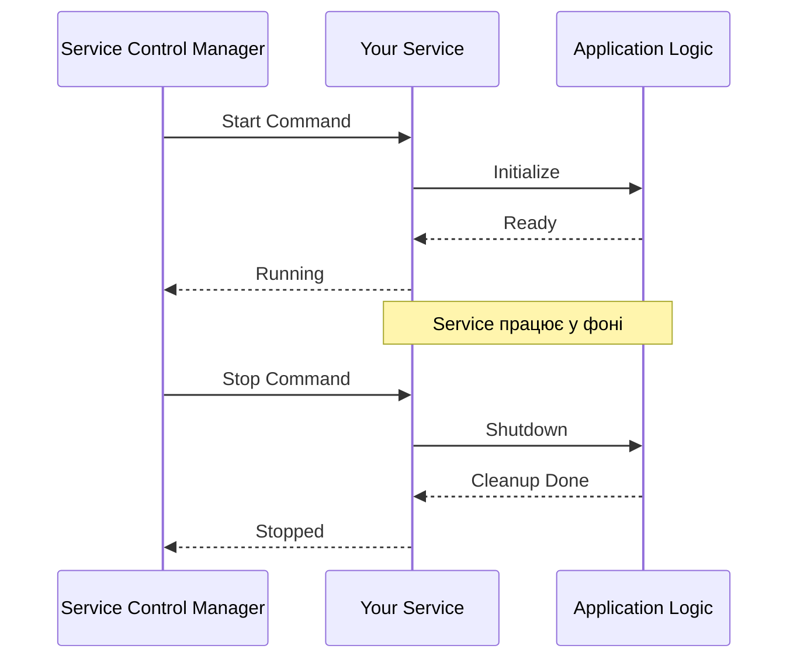

# Windows Hooks, Hotkeys та Services — Глибока Інтеграція з ОС

## Навіщо Потрібна Глибока Інтеграція?

Більшість застосунків працюють у власному "пісочнику" — вони отримують події тільки коли мають фокус, запускаються вручну користувачем, і завершуються при закритті вікна. Проте існує клас програм, що вимагають **глибшої інтеграції з операційною системою**: вони мають реагувати на події навіть без фокусу, запускатися автоматично при завантаженні системи, працювати у фоні без UI.

Розглянемо чотири сценарії, що демонструють необхідність таких можливостей:

**Сценарій перший: Глобальні гарячі клавіші.** Ви розробляєте утиліту для створення скріншотів. Користувач має натиснути `Ctrl+Shift+S` у будь-якому застосунку — і ваша програма має миттєво зробити знімок екрану, навіть якщо вона згорнута у трей. Звичайні події клавіатури не працюють без фокусу — потрібен **глобальний hotkey** через `RegisterHotKey()` або **keyboard hook** через `SetWindowsHookEx()`.

**Сценарій другий: Моніторинг активності користувача.** Компанія розробляє time-tracking застосунок для фрілансерів. Програма має відстежувати, в якому застосунку користувач працює, скільки часу проводить у кожному, коли робить паузи. Для цього потрібен **low-level mouse hook** та **keyboard hook**, що перехоплюють всі події миші та клавіатури у системі, незалежно від активного вікна.

**Сценарій третій: Фонова служба без UI.** Антивірус має постійно працювати у фоні, сканувати файли при їх відкритті, оновлювати бази даних, і все це без втручання користувача. Звичайний застосунок завершиться при виході користувача з системи — потрібна **Windows Service**, що запускається при завантаженні ОС, працює під системним акаунтом, і не залежить від сесії користувача.

**Сценарій четвертий: Tray-застосунок з контекстним меню.** Ви створили утиліту для управління буфером обміну. Вона має постійно працювати у фоні, відображатися як іконка у system tray (біля годинника), і при кліку правою кнопкою показувати меню з історією буфера. Це вимагає **NotifyIcon** та інтеграції з Windows Shell.

Ця тема — про інструменти, що дозволяють вашим програмам стати "громадянами першого класу" у Windows: реагувати на системні події, працювати у фоні, інтегруватися з Shell.

---

## Windows Hooks: Перехоплення Системних Подій

### Що Таке Hook?

**Hook** (гачок) — це механізм Windows, що дозволяє застосунку "підчепитися" до ланцюжка обробки системних подій. Коли відбувається подія (натискання клавіші, рух миші, створення вікна), Windows спочатку викликає всі зареєстровані hooks, і тільки потім передає подію цільовому застосунку.

Аналогія: уявіть конвеєр на заводі. Деталь (подія) рухається по конвеєру, і на кожному етапі (hook) робітник може її оглянути, змінити, або навіть зупинити конвеєр. Windows hooks працюють аналогічно — ваш код може "оглянути" кожну подію у системі.

### Типи Hooks

Windows підтримує 15 типів hooks, кожен для певного класу подій:

::field-group

::field{name="WH_KEYBOARD_LL" type="Low-Level Keyboard Hook"}
Перехоплює всі події клавіатури у системі **до** того, як вони потраплять до застосунку. "LL" означає "Low-Level" — hook працює у контексті вашого процесу, але отримує події з усієї системи. Найпопулярніший тип для keylogger-ів, глобальних hotkey-ів, блокування певних клавіш.

**Що можна робити:**
- Логувати всі натискання клавіш
- Блокувати певні комбінації (наприклад, `Win+L`)
- Перетворювати одні клавіші на інші
- Реагувати на події без фокусу
::

::field{name="WH_MOUSE_LL" type="Low-Level Mouse Hook"}
Перехоплює всі події миші: рух, кліки, прокрутка колеса. Працює аналогічно до keyboard hook — low-level, системний рівень.

**Що можна робити:**
- Відстежувати активність користувача
- Блокувати кліки у певних областях екрану
- Створювати власні жести мишею
- Записувати макроси
::

::field{name="WH_CALLWNDPROC" type="Window Procedure Hook"}
Перехоплює повідомлення, що надсилаються до віконних процедур (window procedures). Працює тільки для вікон у вашому процесі або у процесах, куди ви можете ін'єктувати DLL.
::

::field{name="WH_GETMESSAGE" type="Get Message Hook"}
Перехоплює повідомлення, що витягуються з черги повідомлень через `GetMessage()` або `PeekMessage()`. Дозволяє модифікувати або фільтрувати повідомлення до їх обробки.
::

::field{name="WH_CBT" type="Computer-Based Training Hook"}
Перехоплює події, пов'язані з вікнами: створення, активація, закриття. Використовується для навчальних програм, що мають реагувати на дії користувача з вікнами.
::

::field{name="WH_SHELL" type="Shell Hook"}
Перехоплює події Windows Shell: запуск застосунків, зміна активного вікна, створення/закриття вікон. Корисно для task manager-ів, window switcher-ів.
::

::

### Архітектура Hooks: Global vs Thread-Specific

Hooks можуть бути двох типів:

**Thread-Specific Hook** — працює тільки для конкретного потоку (зазвичай вашого). Події з інших потоків/процесів не перехоплюються. Простіший у реалізації, не вимагає DLL.

**Global Hook** — працює для всіх потоків у системі. Вимагає:
1. **DLL з hook procedure** — Windows автоматично ін'єктує вашу DLL у кожен процес, що має вікна
2. **Або Low-Level Hook** — `WH_KEYBOARD_LL` та `WH_MOUSE_LL` працюють у вашому процесі, але отримують події з усієї системи (не потрібна DLL)

::note
**Чому Low-Level hooks не потребують DLL?** Вони працюють інакше: замість ін'єкції DLL у кожен процес, Windows перенаправляє всі події клавіатури/миші у ваш процес через спеціальний механізм kernel-mode драйвера. Це швидше та безпечніше, але має обмеження: ваш hook має обробляти події **дуже швидко** (< 300ms), інакше Windows його відключить.
::

### SetWindowsHookEx: Встановлення Hook

```c
HHOOK SetWindowsHookEx(
  int       idHook,        // Тип hook (WH_KEYBOARD_LL, WH_MOUSE_LL, тощо)
  HOOKPROC  lpfn,          // Вказівник на hook procedure (callback)
  HINSTANCE hmod,          // Handle на DLL (NULL для LL hooks)
  DWORD     dwThreadId     // ID потоку (0 = global hook)
);
```

**Параметри:**
- `idHook` — константа типу hook (`WH_KEYBOARD_LL = 13`, `WH_MOUSE_LL = 14`)
- `lpfn` — вказівник на вашу функцію-callback, що оброблятиме події
- `hmod` — handle на DLL (для global hooks) або `NULL` (для LL hooks)
- `dwThreadId` — ID потоку для thread-specific hook, або `0` для global

**Повертає:** Handle на hook (`HHOOK`), або `NULL` при помилці.

### Hook Procedure: Callback Функція

Ваша hook procedure має сигнатуру:

```c
LRESULT CALLBACK HookProc(
  int    nCode,      // Код дії (HC_ACTION = обробити подію)
  WPARAM wParam,     // Додаткова інформація (залежить від типу hook)
  LPARAM lParam      // Вказівник на структуру з деталями події
);
```

**Правила:**
1. Якщо `nCode < 0` — **обов'язково** викликати `CallNextHookEx()` без обробки
2. Якщо ви обробили подію — можете повернути ненульове значення, щоб заблокувати її
3. Інакше — викликати `CallNextHookEx()` для передачі події наступному hook у ланцюжку

---

## Практичний Приклад 1: Global Keyboard Hook (Keylogger)

Створимо простий keylogger, що логує всі натискання клавіш у системі.

::warning
**Етичне застереження:** Keylogger — це інструмент, що може використовуватися для шкідливих цілей (крадіжка паролів, шпигунство). Використовуйте цей код **тільки** для легітимних цілей: тестування власних застосунків, accessibility tools, батьківський контроль з відома користувача. Несанкціоноване логування клавіатури — злочин у більшості країн.
::

```csharp showLineNumbers [KeyboardHook.cs]
using System.Runtime.InteropServices;
using System.Diagnostics;

class KeyboardHook : IDisposable
{
    // P/Invoke декларації
    [DllImport("user32.dll", SetLastError = true)]
    private static extern IntPtr SetWindowsHookEx(int idHook, HookProc lpfn, IntPtr hMod, uint dwThreadId);

    [DllImport("user32.dll", SetLastError = true)]
    [return: MarshalAs(UnmanagedType.Bool)]
    private static extern bool UnhookWindowsHookEx(IntPtr hhk);

    [DllImport("user32.dll")]
    private static extern IntPtr CallNextHookEx(IntPtr hhk, int nCode, IntPtr wParam, IntPtr lParam);

    [DllImport("kernel32.dll", CharSet = CharSet.Unicode)]
    private static extern IntPtr GetModuleHandle(string lpModuleName);

    [DllImport("user32.dll")]
    private static extern short GetAsyncKeyState(int vKey);

    // Константи
    private const int WH_KEYBOARD_LL = 13;
    private const int WM_KEYDOWN = 0x0100;
    private const int WM_SYSKEYDOWN = 0x0104;

    // Делегат для hook procedure
    private delegate IntPtr HookProc(int nCode, IntPtr wParam, IntPtr lParam);

    // Структура для low-level keyboard input
    [StructLayout(LayoutKind.Sequential)]
    private struct KBDLLHOOKSTRUCT
    {
        public uint vkCode;      // Virtual key code
        public uint scanCode;    // Scan code
        public uint flags;       // Flags
        public uint time;        // Timestamp
        public IntPtr dwExtraInfo;
    }

    private IntPtr _hookId = IntPtr.Zero;
    private HookProc _hookProc;  // Зберігаємо делегат, щоб GC не зібрав його

    public event Action<Keys, bool>? KeyPressed;  // bool = isShiftPressed

    public KeyboardHook()
    {
        _hookProc = HookCallback;  // Зберігаємо посилання
    }

    public void Install()
    {
        if (_hookId != IntPtr.Zero)
            return;  // Вже встановлено

        using var curProcess = Process.GetCurrentProcess();
        using var curModule = curProcess.MainModule;

        _hookId = SetWindowsHookEx(
            WH_KEYBOARD_LL,
            _hookProc,
            GetModuleHandle(curModule?.ModuleName ?? ""),
            0  // 0 = global hook
        );

        if (_hookId == IntPtr.Zero)
        {
            int error = Marshal.GetLastWin32Error();
            throw new System.ComponentModel.Win32Exception(error);
        }

        Console.WriteLine("✓ Keyboard hook встановлено");
    }

    public void Uninstall()
    {
        if (_hookId == IntPtr.Zero)
            return;

        UnhookWindowsHookEx(_hookId);
        _hookId = IntPtr.Zero;

        Console.WriteLine("✓ Keyboard hook видалено");
    }

    private IntPtr HookCallback(int nCode, IntPtr wParam, IntPtr lParam)
    {
        if (nCode >= 0 && (wParam == (IntPtr)WM_KEYDOWN || wParam == (IntPtr)WM_SYSKEYDOWN))
        {
            var hookStruct = Marshal.PtrToStructure<KBDLLHOOKSTRUCT>(lParam);
            var key = (Keys)hookStruct.vkCode;

            // Перевіряємо, чи натиснуто Shift
            bool isShiftPressed = (GetAsyncKeyState((int)Keys.ShiftKey) & 0x8000) != 0;

            KeyPressed?.Invoke(key, isShiftPressed);
        }

        // ОБОВ'ЯЗКОВО викликати CallNextHookEx
        return CallNextHookEx(_hookId, nCode, wParam, lParam);
    }

    public void Dispose()
    {
        Uninstall();
        GC.SuppressFinalize(this);
    }
}

// Використання
class Program
{
    static void Main()
    {
        Console.WriteLine("═══════════════════════════════════════════════════");
        Console.WriteLine("           KEYBOARD HOOK DEMO");
        Console.WriteLine("═══════════════════════════════════════════════════");
        Console.WriteLine("\nНатискайте клавіші (Ctrl+C для виходу)\n");

        using var hook = new KeyboardHook();

        hook.KeyPressed += (key, isShift) =>
        {
            var timestamp = DateTime.Now.ToString("HH:mm:ss.fff");
            var shiftIndicator = isShift ? " [SHIFT]" : "";
            
            Console.ForegroundColor = ConsoleColor.Yellow;
            Console.Write($"[{timestamp}] ");
            Console.ResetColor();
            Console.WriteLine($"{key}{shiftIndicator}");
        };

        hook.Install();

        // Message loop (обов'язковий для hooks)
        Console.WriteLine("Hook активний. Натисніть Ctrl+C для зупинки...\n");
        
        var cts = new CancellationTokenSource();
        Console.CancelKeyPress += (s, e) =>
        {
            e.Cancel = true;
            cts.Cancel();
        };

        // Простий message loop
        while (!cts.Token.IsCancellationRequested)
        {
            Thread.Sleep(100);
        }

        Console.WriteLine("\n✓ Завершення...");
    }
}
```

::terminal-preview{title="Keyboard Hook Demo" :expandable="true" maxHeight="400px"}
<div class="line"><span class="opacity-40">$</span> <strong class="font-bold">dotnet run</strong></div>
<div class="line">═══════════════════════════════════════════════════</div>
<div class="line">           <span class="text-blue-400 font-bold">KEYBOARD HOOK DEMO</span></div>
<div class="line">═══════════════════════════════════════════════════</div>
<div class="line"></div>
<div class="line">Натискайте клавіші (Ctrl+C для виходу)</div>
<div class="line"></div>
<div class="line"><span class="text-green-400">✓</span> Keyboard hook встановлено</div>
<div class="line">Hook активний. Натисніть Ctrl+C для зупинки...</div>
<div class="line"></div>
<div class="line"><span class="text-yellow-400">[21:15:23.145]</span> H</div>
<div class="line"><span class="text-yellow-400">[21:15:23.289]</span> E</div>
<div class="line"><span class="text-yellow-400">[21:15:23.412]</span> L</div>
<div class="line"><span class="text-yellow-400">[21:15:23.534]</span> L</div>
<div class="line"><span class="text-yellow-400">[21:15:23.678]</span> O</div>
<div class="line"><span class="text-yellow-400">[21:15:24.123]</span> Space</div>
<div class="line"><span class="text-yellow-400">[21:15:24.456]</span> W <span class="text-gray-400">[SHIFT]</span></div>
<div class="line"><span class="text-yellow-400">[21:15:24.589]</span> O <span class="text-gray-400">[SHIFT]</span></div>
<div class="line"><span class="text-yellow-400">[21:15:24.712]</span> R <span class="text-gray-400">[SHIFT]</span></div>
<div class="line"><span class="text-yellow-400">[21:15:24.834]</span> L <span class="text-gray-400">[SHIFT]</span></div>
<div class="line"><span class="text-yellow-400">[21:15:24.956]</span> D <span class="text-gray-400">[SHIFT]</span></div>
<div class="line"></div>
<div class="line">^C</div>
<div class="line">✓ Завершення...</div>
<div class="line"><span class="text-green-400">✓</span> Keyboard hook видалено</div>
::

::tip
**Вау-ефект:** Після запуску програми, перейдіть у будь-який інший застосунок (браузер, блокнот, тощо) та почніть друкувати — ваша консольна програма логуватиме **всі** натискання клавіш у системі, навіть без фокусу! Це демонструє силу global hooks.
::

---

## Практичний Приклад 2: Mouse Activity Tracker

Створимо утиліту для відстеження активності миші: рух, кліки, час простою.

```csharp showLineNumbers [MouseHook.cs]
using System.Runtime.InteropServices;
using System.Diagnostics;

class MouseHook : IDisposable
{
    [DllImport("user32.dll", SetLastError = true)]
    private static extern IntPtr SetWindowsHookEx(int idHook, HookProc lpfn, IntPtr hMod, uint dwThreadId);

    [DllImport("user32.dll", SetLastError = true)]
    [return: MarshalAs(UnmanagedType.Bool)]
    private static extern bool UnhookWindowsHookEx(IntPtr hhk);

    [DllImport("user32.dll")]
    private static extern IntPtr CallNextHookEx(IntPtr hhk, int nCode, IntPtr wParam, IntPtr lParam);

    [DllImport("kernel32.dll", CharSet = CharSet.Unicode)]
    private static extern IntPtr GetModuleHandle(string lpModuleName);

    private const int WH_MOUSE_LL = 14;
    private const int WM_MOUSEMOVE = 0x0200;
    private const int WM_LBUTTONDOWN = 0x0201;
    private const int WM_RBUTTONDOWN = 0x0204;
    private const int WM_MBUTTONDOWN = 0x0207;
    private const int WM_MOUSEWHEEL = 0x020A;

    private delegate IntPtr HookProc(int nCode, IntPtr wParam, IntPtr lParam);

    [StructLayout(LayoutKind.Sequential)]
    private struct MSLLHOOKSTRUCT
    {
        public POINT pt;
        public uint mouseData;
        public uint flags;
        public uint time;
        public IntPtr dwExtraInfo;
    }

    [StructLayout(LayoutKind.Sequential)]
    private struct POINT
    {
        public int X;
        public int Y;
    }

    private IntPtr _hookId = IntPtr.Zero;
    private HookProc _hookProc;

    public event Action<int, int>? MouseMoved;
    public event Action<int, int, string>? MouseClicked;
    public event Action<int>? MouseWheelScrolled;

    private DateTime _lastActivity = DateTime.Now;
    private long _totalMoves = 0;
    private long _totalClicks = 0;
    private double _totalDistance = 0;
    private POINT _lastPoint;

    public MouseHook()
    {
        _hookProc = HookCallback;
    }

    public void Install()
    {
        if (_hookId != IntPtr.Zero)
            return;

        using var curProcess = Process.GetCurrentProcess();
        using var curModule = curProcess.MainModule;

        _hookId = SetWindowsHookEx(
            WH_MOUSE_LL,
            _hookProc,
            GetModuleHandle(curModule?.ModuleName ?? ""),
            0
        );

        if (_hookId == IntPtr.Zero)
        {
            int error = Marshal.GetLastWin32Error();
            throw new System.ComponentModel.Win32Exception(error);
        }

        Console.WriteLine("✓ Mouse hook встановлено");
    }

    public void Uninstall()
    {
        if (_hookId == IntPtr.Zero)
            return;

        UnhookWindowsHookEx(_hookId);
        _hookId = IntPtr.Zero;

        Console.WriteLine("✓ Mouse hook видалено");
    }

    private IntPtr HookCallback(int nCode, IntPtr wParam, IntPtr lParam)
    {
        if (nCode >= 0)
        {
            var hookStruct = Marshal.PtrToStructure<MSLLHOOKSTRUCT>(lParam);
            _lastActivity = DateTime.Now;

            switch ((int)wParam)
            {
                case WM_MOUSEMOVE:
                    _totalMoves++;
                    
                    if (_lastPoint.X != 0 || _lastPoint.Y != 0)
                    {
                        double dx = hookStruct.pt.X - _lastPoint.X;
                        double dy = hookStruct.pt.Y - _lastPoint.Y;
                        _totalDistance += Math.Sqrt(dx * dx + dy * dy);
                    }
                    
                    _lastPoint = hookStruct.pt;
                    MouseMoved?.Invoke(hookStruct.pt.X, hookStruct.pt.Y);
                    break;

                case WM_LBUTTONDOWN:
                    _totalClicks++;
                    MouseClicked?.Invoke(hookStruct.pt.X, hookStruct.pt.Y, "Left");
                    break;

                case WM_RBUTTONDOWN:
                    _totalClicks++;
                    MouseClicked?.Invoke(hookStruct.pt.X, hookStruct.pt.Y, "Right");
                    break;

                case WM_MBUTTONDOWN:
                    _totalClicks++;
                    MouseClicked?.Invoke(hookStruct.pt.X, hookStruct.pt.Y, "Middle");
                    break;

                case WM_MOUSEWHEEL:
                    int delta = (short)((hookStruct.mouseData >> 16) & 0xFFFF);
                    MouseWheelScrolled?.Invoke(delta);
                    break;
            }
        }

        return CallNextHookEx(_hookId, nCode, wParam, lParam);
    }

    public TimeSpan GetIdleTime() => DateTime.Now - _lastActivity;
    public long GetTotalMoves() => _totalMoves;
    public long GetTotalClicks() => _totalClicks;
    public double GetTotalDistance() => _totalDistance;

    public void Dispose()
    {
        Uninstall();
        GC.SuppressFinalize(this);
    }
}

// Використання
class Program
{
    static async Task Main()
    {
        Console.WriteLine("═══════════════════════════════════════════════════");
        Console.WriteLine("        MOUSE ACTIVITY TRACKER");
        Console.WriteLine("═══════════════════════════════════════════════════\n");

        using var hook = new MouseHook();

        hook.MouseClicked += (x, y, button) =>
        {
            Console.ForegroundColor = ConsoleColor.Cyan;
            Console.WriteLine($"[{DateTime.Now:HH:mm:ss}] {button} Click at ({x}, {y})");
            Console.ResetColor();
        };

        hook.Install();

        var cts = new CancellationTokenSource();
        Console.CancelKeyPress += (s, e) =>
        {
            e.Cancel = true;
            cts.Cancel();
        };

        // Статистика кожні 5 секунд
        var timer = new PeriodicTimer(TimeSpan.FromSeconds(5));
        
        Console.WriteLine("Відстежування активності... (Ctrl+C для зупинки)\n");

        try
        {
            while (await timer.WaitForNextTickAsync(cts.Token))
            {
                var idle = hook.GetIdleTime();
                var moves = hook.GetTotalMoves();
                var clicks = hook.GetTotalClicks();
                var distance = hook.GetTotalDistance();

                Console.WriteLine($"\n📊 Статистика:");
                Console.WriteLine($"   Рухів миші: {moves:N0}");
                Console.WriteLine($"   Кліків: {clicks:N0}");
                Console.WriteLine($"   Пройдено: {distance / 1000:F1} метрів (на екрані)");
                Console.WriteLine($"   Час простою: {idle.TotalSeconds:F1}s");
            }
        }
        catch (OperationCanceledException)
        {
            Console.WriteLine("\n✓ Зупинено");
        }
    }
}
```

::terminal-preview{title="Mouse Activity Tracker" :expandable="true" maxHeight="380px"}
<div class="line"><span class="opacity-40">$</span> <strong class="font-bold">dotnet run</strong></div>
<div class="line">═══════════════════════════════════════════════════</div>
<div class="line">        <span class="text-blue-400 font-bold">MOUSE ACTIVITY TRACKER</span></div>
<div class="line">═══════════════════════════════════════════════════</div>
<div class="line"></div>
<div class="line"><span class="text-green-400">✓</span> Mouse hook встановлено</div>
<div class="line">Відстежування активності... (Ctrl+C для зупинки)</div>
<div class="line"></div>
<div class="line"><span class="text-cyan-400">[21:16:12] Left Click at (523, 341)</span></div>
<div class="line"><span class="text-cyan-400">[21:16:14] Right Click at (612, 289)</span></div>
<div class="line"><span class="text-cyan-400">[21:16:16] Left Click at (445, 512)</span></div>
<div class="line"></div>
<div class="line">📊 Статистика:</div>
<div class="line">   Рухів миші: <span class="text-yellow-400">2,847</span></div>
<div class="line">   Кліків: <span class="text-yellow-400">12</span></div>
<div class="line">   Пройдено: <span class="text-yellow-400">3.2</span> метрів (на екрані)</div>
<div class="line">   Час простою: <span class="text-yellow-400">1.2s</span></div>
::

---

## Global Hotkeys: RegisterHotKey

Альтернатива hooks для глобальних гарячих клавіш — функція `RegisterHotKey()`. Вона простіша у використанні, але менш гнучка.

### Переваги RegisterHotKey над Hooks

::card-group

::card{title="✅ Простота" icon="i-lucide-zap"}
Не потрібен message loop з `GetMessage()`, не потрібно обробляти кожну подію клавіатури. Просто реєструєте комбінацію — і отримуєте повідомлення `WM_HOTKEY`.
::

::card{title="✅ Продуктивність" icon="i-lucide-gauge"}
Hooks викликаються для **кожної** події клавіатури у системі. RegisterHotKey — тільки для зареєстрованих комбінацій. Менше overhead.
::

::card{title="✅ Системна Підтримка" icon="i-lucide-shield"}
Windows сама відстежує комбінації та вирішує конфлікти. Якщо дві програми реєструють один hotkey — друга отримає помилку.
::

::card{title="❌ Обмеження" icon="i-lucide-alert-triangle"}
Можна реєструвати тільки комбінації з модифікаторами (Ctrl, Alt, Shift, Win). Неможливо зареєструвати просто `A` або `F1` без модифікаторів. Hooks дозволяють будь-які комбінації.
::

::

### Приклад: Screenshot Tool з Hotkey

```csharp showLineNumbers [HotkeyManager.cs]
using System.Runtime.InteropServices;
using System.Drawing;
using System.Drawing.Imaging;

class HotkeyManager : IDisposable
{
    [DllImport("user32.dll", SetLastError = true)]
    [return: MarshalAs(UnmanagedType.Bool)]
    private static extern bool RegisterHotKey(IntPtr hWnd, int id, uint fsModifiers, uint vk);

    [DllImport("user32.dll", SetLastError = true)]
    [return: MarshalAs(UnmanagedType.Bool)]
    private static extern bool UnregisterHotKey(IntPtr hWnd, int id);

    // Модифікатори
    private const uint MOD_ALT = 0x0001;
    private const uint MOD_CONTROL = 0x0002;
    private const uint MOD_SHIFT = 0x0004;
    private const uint MOD_WIN = 0x0008;

    // Virtual key codes
    private const uint VK_S = 0x53;
    private const uint VK_F12 = 0x7B;

    private const int WM_HOTKEY = 0x0312;

    private readonly IntPtr _hwnd;
    private readonly Dictionary<int, Action> _hotkeys = new();
    private int _nextId = 1;

    public HotkeyManager(IntPtr hwnd)
    {
        _hwnd = hwnd;
    }

    public int Register(uint modifiers, uint key, Action callback)
    {
        int id = _nextId++;
        
        if (!RegisterHotKey(_hwnd, id, modifiers, key))
        {
            int error = Marshal.GetLastWin32Error();
            throw new System.ComponentModel.Win32Exception(error);
        }

        _hotkeys[id] = callback;
        return id;
    }

    public void Unregister(int id)
    {
        if (_hotkeys.ContainsKey(id))
        {
            UnregisterHotKey(_hwnd, id);
            _hotkeys.Remove(id);
        }
    }

    public void ProcessMessage(int msg, IntPtr wParam, IntPtr lParam)
    {
        if (msg == WM_HOTKEY)
        {
            int id = wParam.ToInt32();
            if (_hotkeys.TryGetValue(id, out var callback))
            {
                callback?.Invoke();
            }
        }
    }

    public void Dispose()
    {
        foreach (var id in _hotkeys.Keys.ToList())
        {
            UnregisterHotKey(_hwnd, id);
        }
        _hotkeys.Clear();
    }
}

// Screenshot утиліта
class ScreenshotTool
{
    public static void TakeScreenshot(string filename)
    {
        var bounds = Screen.PrimaryScreen.Bounds;
        using var bitmap = new Bitmap(bounds.Width, bounds.Height);
        using var graphics = Graphics.FromImage(bitmap);
        
        graphics.CopyFromScreen(Point.Empty, Point.Empty, bounds.Size);
        
        bitmap.Save(filename, ImageFormat.Png);
        
        Console.ForegroundColor = ConsoleColor.Green;
        Console.WriteLine($"✓ Screenshot збережено: {filename}");
        Console.ResetColor();
    }
}

// Message-only window для hotkeys
class HotkeyWindow : Form
{
    private HotkeyManager? _hotkeyManager;

    public HotkeyWindow()
    {
        // Створюємо невидиме вікно
        this.ShowInTaskbar = false;
        this.WindowState = FormWindowState.Minimized;
        this.FormBorderStyle = FormBorderStyle.None;
        this.Opacity = 0;
    }

    protected override void OnLoad(EventArgs e)
    {
        base.OnLoad(e);
        
        _hotkeyManager = new HotkeyManager(this.Handle);

        // Реєструємо Ctrl+Shift+S
        _hotkeyManager.Register(
            HotkeyManager.MOD_CONTROL | HotkeyManager.MOD_SHIFT,
            HotkeyManager.VK_S,
            () =>
            {
                string filename = $"screenshot_{DateTime.Now:yyyyMMdd_HHmmss}.png";
                ScreenshotTool.TakeScreenshot(filename);
            }
        );

        // Реєструємо Ctrl+Alt+F12
        _hotkeyManager.Register(
            HotkeyManager.MOD_CONTROL | HotkeyManager.MOD_ALT,
            HotkeyManager.VK_F12,
            () =>
            {
                Console.WriteLine("🔔 Hotkey Ctrl+Alt+F12 натиснуто!");
                Application.Exit();
            }
        );

        Console.WriteLine("✓ Hotkeys зареєстровано:");
        Console.WriteLine("  • Ctrl+Shift+S - Зробити скріншот");
        Console.WriteLine("  • Ctrl+Alt+F12 - Вийти");
    }

    protected override void WndProc(ref Message m)
    {
        _hotkeyManager?.ProcessMessage(m.Msg, m.WParam, m.LParam);
        base.WndProc(ref m);
    }

    protected override void Dispose(bool disposing)
    {
        if (disposing)
        {
            _hotkeyManager?.Dispose();
        }
        base.Dispose(disposing);
    }
}

// Точка входу
class Program
{
    [STAThread]
    static void Main()
    {
        Console.WriteLine("═══════════════════════════════════════════════════");
        Console.WriteLine("         SCREENSHOT TOOL");
        Console.WriteLine("═══════════════════════════════════════════════════\n");

        Application.EnableVisualStyles();
        Application.SetCompatibleTextRenderingDefault(false);
        Application.Run(new HotkeyWindow());
    }
}
```

::tip
**Вау-ефект:** Після запуску програми, згорніть консоль та працюйте у будь-якому застосунку. Натисніть `Ctrl+Shift+S` — миттєво створюється скріншот! Програма працює у фоні та реагує на hotkey з будь-якого місця. Це той самий механізм, що використовують Lightshot, ShareX, Greenshot.
::


---

## Windows Services: Фонові Служби

### Що Таке Windows Service?

**Windows Service** — це спеціальний тип застосунку, що:
- Запускається автоматично при завантаженні системи (до входу користувача)
- Працює у фоні без UI
- Може працювати під системним акаунтом (LocalSystem, NetworkService)
- Не залежить від сесії користувача (працює навіть після logout)
- Керується через Service Control Manager (SCM)

**Типові use cases:**
- Антивіруси та security software
- Веб-сервери (IIS, Apache)
- Бази даних (SQL Server, MongoDB)
- Backup та sync утиліти
- Моніторинг та logging системи

### Архітектура Windows Service

Windows Service складається з трьох компонентів:

1. **Service Executable** — ваш `.exe` файл з логікою служби
2. **Service Control Manager (SCM)** — системна служба Windows, що керує всіма службами
3. **Service Control Handler** — callback у вашому коді, що обробляє команди від SCM (Start, Stop, Pause)

::mermaid

::

### BackgroundService: Сучасний Підхід (.NET 6+)

.NET надає клас `BackgroundService` для створення служб. Це абстракція над старим `ServiceBase` API.

```csharp showLineNumbers [MyBackgroundService.cs]
using Microsoft.Extensions.Hosting;
using Microsoft.Extensions.Logging;

public class MyBackgroundService : BackgroundService
{
    private readonly ILogger<MyBackgroundService> _logger;

    public MyBackgroundService(ILogger<MyBackgroundService> logger)
    {
        _logger = logger;
    }

    protected override async Task ExecuteAsync(CancellationToken stoppingToken)
    {
        _logger.LogInformation("Service запущено о {time}", DateTimeOffset.Now);

        try
        {
            while (!stoppingToken.IsCancellationRequested)
            {
                // Ваша логіка тут
                _logger.LogInformation("Service працює о {time}", DateTimeOffset.Now);

                // Чекаємо 10 секунд або до cancellation
                await Task.Delay(TimeSpan.FromSeconds(10), stoppingToken);
            }
        }
        catch (OperationCanceledException)
        {
            // Нормальне завершення
            _logger.LogInformation("Service зупиняється...");
        }
        catch (Exception ex)
        {
            _logger.LogError(ex, "Критична помилка в service");
            throw;
        }
    }

    public override Task StopAsync(CancellationToken cancellationToken)
    {
        _logger.LogInformation("Service отримав команду Stop");
        return base.StopAsync(cancellationToken);
    }
}
```

### Створення Windows Service: Повний Приклад

::steps

### Крок 1: Створення проєкту

```bash
dotnet new worker -n MyWindowsService
cd MyWindowsService
dotnet add package Microsoft.Extensions.Hosting.WindowsServices
```

### Крок 2: Реалізація служби

```csharp showLineNumbers [FileMonitorService.cs]
using Microsoft.Extensions.Hosting;
using Microsoft.Extensions.Logging;

public class FileMonitorService : BackgroundService
{
    private readonly ILogger<FileMonitorService> _logger;
    private readonly string _watchPath;
    private FileSystemWatcher? _watcher;

    public FileMonitorService(ILogger<FileMonitorService> logger)
    {
        _logger = logger;
        _watchPath = @"C:\MonitoredFolder";
    }

    protected override Task ExecuteAsync(CancellationToken stoppingToken)
    {
        _logger.LogInformation("File Monitor Service запущено");

        // Створюємо папку якщо не існує
        if (!Directory.Exists(_watchPath))
        {
            Directory.CreateDirectory(_watchPath);
            _logger.LogInformation("Створено папку: {path}", _watchPath);
        }

        // Налаштовуємо FileSystemWatcher
        _watcher = new FileSystemWatcher(_watchPath)
        {
            NotifyFilter = NotifyFilters.FileName | NotifyFilters.LastWrite,
            Filter = "*.*",
            EnableRaisingEvents = true
        };

        _watcher.Created += OnFileCreated;
        _watcher.Changed += OnFileChanged;
        _watcher.Deleted += OnFileDeleted;

        _logger.LogInformation("Моніторинг папки: {path}", _watchPath);

        return Task.CompletedTask;
    }

    private void OnFileCreated(object sender, FileSystemEventArgs e)
    {
        _logger.LogInformation("Файл створено: {name}", e.Name);
    }

    private void OnFileChanged(object sender, FileSystemEventArgs e)
    {
        _logger.LogInformation("Файл змінено: {name}", e.Name);
    }

    private void OnFileDeleted(object sender, FileSystemEventArgs e)
    {
        _logger.LogInformation("Файл видалено: {name}", e.Name);
    }

    public override Task StopAsync(CancellationToken cancellationToken)
    {
        _logger.LogInformation("File Monitor Service зупиняється");
        _watcher?.Dispose();
        return base.StopAsync(cancellationToken);
    }
}
```

### Крок 3: Налаштування Program.cs

```csharp showLineNumbers [Program.cs]
using Microsoft.Extensions.DependencyInjection;
using Microsoft.Extensions.Hosting;
using Microsoft.Extensions.Logging;

var builder = Host.CreateApplicationBuilder(args);

// Додаємо підтримку Windows Services
builder.Services.AddWindowsService(options =>
{
    options.ServiceName = "File Monitor Service";
});

// Реєструємо нашу службу
builder.Services.AddHostedService<FileMonitorService>();

// Налаштовуємо логування
builder.Services.AddLogging(logging =>
{
    logging.AddEventLog(settings =>
    {
        settings.SourceName = "FileMonitorService";
    });
});

var host = builder.Build();
await host.RunAsync();
```

### Крок 4: Публікація

```bash
dotnet publish -c Release -r win-x64 --self-contained
```

### Крок 5: Встановлення служби

```powershell
# Запустіть PowerShell від імені адміністратора

# Встановлення
sc.exe create "FileMonitorService" binPath="C:\Path\To\MyWindowsService.exe"

# Налаштування автозапуску
sc.exe config "FileMonitorService" start=auto

# Запуск
sc.exe start "FileMonitorService"

# Перевірка статусу
sc.exe query "FileMonitorService"

# Зупинка
sc.exe stop "FileMonitorService"

# Видалення
sc.exe delete "FileMonitorService"
```

::

::terminal-preview{title="Service Management"}
<div class="line"><span class="opacity-40">PS C:\></span> <strong class="font-bold">sc.exe create "FileMonitorService" binPath="C:\Services\MyWindowsService.exe"</strong></div>
<div class="line"><span class="text-green-400">[SC] CreateService SUCCESS</span></div>
<div class="line"></div>
<div class="line"><span class="opacity-40">PS C:\></span> <strong class="font-bold">sc.exe start "FileMonitorService"</strong></div>
<div class="line"></div>
<div class="line">SERVICE_NAME: FileMonitorService</div>
<div class="line">        TYPE               : 10  WIN32_OWN_PROCESS</div>
<div class="line">        STATE              : 2  START_PENDING</div>
<div class="line">        WIN32_EXIT_CODE    : 0  (0x0)</div>
<div class="line">        SERVICE_EXIT_CODE  : 0  (0x0)</div>
<div class="line">        CHECKPOINT         : 0x0</div>
<div class="line">        WAIT_HINT          : 0x7d0</div>
<div class="line"></div>
<div class="line"><span class="opacity-40">PS C:\></span> <strong class="font-bold">sc.exe query "FileMonitorService"</strong></div>
<div class="line"></div>
<div class="line">SERVICE_NAME: FileMonitorService</div>
<div class="line">        TYPE               : 10  WIN32_OWN_PROCESS</div>
<div class="line">        STATE              : <span class="text-green-400 font-bold">4  RUNNING</span></div>
<div class="line">        WIN32_EXIT_CODE    : 0  (0x0)</div>
<div class="line">        SERVICE_EXIT_CODE  : 0  (0x0)</div>
<div class="line">        CHECKPOINT         : 0x0</div>
<div class="line">        WAIT_HINT          : 0x0</div>
::

::tip
**Вау-ефект:** Після встановлення служби, перезавантажте комп'ютер — служба запуститься автоматично **до** входу користувача! Створіть файл у `C:\MonitoredFolder` — подія з'явиться у Event Viewer (Windows Logs → Application). Служба працює навіть якщо ніхто не увійшов у систему.
::

---

## System Tray Applications: NotifyIcon

### Що Таке Tray Application?

**Tray Application** (або System Tray App) — це застосунок, що відображається як іконка у system tray (біля годинника). Він працює у фоні, не має головного вікна, і взаємодіє з користувачем через контекстне меню іконки.

**Приклади:** Dropbox, OneDrive, Spotify, Discord, антивіруси.

### NotifyIcon: Компонент для Tray

.NET надає клас `NotifyIcon` (у `System.Windows.Forms`) для створення tray застосунків.

```csharp showLineNumbers [TrayApp.cs]
using System.Windows.Forms;
using System.Drawing;

class TrayApp : ApplicationContext
{
    private NotifyIcon _notifyIcon;
    private ContextMenuStrip _contextMenu;

    public TrayApp()
    {
        // Створюємо контекстне меню
        _contextMenu = new ContextMenuStrip();
        _contextMenu.Items.Add("Показати повідомлення", null, ShowNotification);
        _contextMenu.Items.Add("Статистика", null, ShowStats);
        _contextMenu.Items.Add(new ToolStripSeparator());
        _contextMenu.Items.Add("Вийти", null, Exit);

        // Створюємо іконку у tray
        _notifyIcon = new NotifyIcon
        {
            Icon = SystemIcons.Application,  // Або завантажте власну іконку
            ContextMenuStrip = _contextMenu,
            Text = "My Tray App",
            Visible = true
        };

        // Подія подвійного кліку
        _notifyIcon.DoubleClick += (s, e) => ShowNotification(s, e);

        // Показуємо balloon tip при запуску
        _notifyIcon.ShowBalloonTip(
            3000,
            "Tray App",
            "Застосунок запущено у фоні",
            ToolTipIcon.Info
        );
    }

    private void ShowNotification(object? sender, EventArgs e)
    {
        _notifyIcon.ShowBalloonTip(
            5000,
            "Повідомлення",
            $"Поточний час: {DateTime.Now:HH:mm:ss}",
            ToolTipIcon.Info
        );
    }

    private void ShowStats(object? sender, EventArgs e)
    {
        var uptime = DateTime.Now - Process.GetCurrentProcess().StartTime;
        MessageBox.Show(
            $"Uptime: {uptime.TotalMinutes:F1} хвилин\n" +
            $"Memory: {Process.GetCurrentProcess().WorkingSet64 / 1024 / 1024} MB",
            "Статистика",
            MessageBoxButtons.OK,
            MessageBoxIcon.Information
        );
    }

    private void Exit(object? sender, EventArgs e)
    {
        _notifyIcon.Visible = false;
        _notifyIcon.Dispose();
        Application.Exit();
    }
}

class Program
{
    [STAThread]
    static void Main()
    {
        Application.EnableVisualStyles();
        Application.SetCompatibleTextRenderingDefault(false);
        Application.Run(new TrayApp());
    }
}
```

### Повноцінний Приклад: Clipboard Manager

Створимо tray-застосунок для управління історією буфера обміну.

```csharp showLineNumbers [ClipboardManager.cs]
using System.Windows.Forms;
using System.Drawing;
using System.Collections.Generic;

class ClipboardManager : ApplicationContext
{
    private NotifyIcon _notifyIcon;
    private ContextMenuStrip _contextMenu;
    private List<string> _clipboardHistory = new();
    private const int MaxHistorySize = 10;
    private System.Threading.Timer? _clipboardTimer;
    private string _lastClipboard = "";

    public ClipboardManager()
    {
        InitializeUI();
        StartClipboardMonitoring();
    }

    private void InitializeUI()
    {
        _contextMenu = new ContextMenuStrip();
        UpdateContextMenu();

        _notifyIcon = new NotifyIcon
        {
            Icon = SystemIcons.Application,
            ContextMenuStrip = _contextMenu,
            Text = "Clipboard Manager",
            Visible = true
        };

        _notifyIcon.ShowBalloonTip(
            2000,
            "Clipboard Manager",
            "Моніторинг буфера обміну активний",
            ToolTipIcon.Info
        );
    }

    private void StartClipboardMonitoring()
    {
        // Перевіряємо буфер кожні 500ms
        _clipboardTimer = new System.Threading.Timer(
            CheckClipboard,
            null,
            TimeSpan.Zero,
            TimeSpan.FromMilliseconds(500)
        );
    }

    private void CheckClipboard(object? state)
    {
        try
        {
            if (Clipboard.ContainsText())
            {
                string text = Clipboard.GetText();
                
                if (!string.IsNullOrWhiteSpace(text) && text != _lastClipboard)
                {
                    _lastClipboard = text;
                    AddToHistory(text);
                }
            }
        }
        catch
        {
            // Ігноруємо помилки доступу до буфера
        }
    }

    private void AddToHistory(string text)
    {
        // Обмежуємо довжину для відображення
        string displayText = text.Length > 50 
            ? text.Substring(0, 47) + "..." 
            : text;

        _clipboardHistory.Insert(0, text);

        if (_clipboardHistory.Count > MaxHistorySize)
        {
            _clipboardHistory.RemoveAt(_clipboardHistory.Count - 1);
        }

        // Оновлюємо меню у UI потоці
        _notifyIcon.ContextMenuStrip?.Invoke((Action)UpdateContextMenu);
    }

    private void UpdateContextMenu()
    {
        _contextMenu.Items.Clear();

        if (_clipboardHistory.Count == 0)
        {
            _contextMenu.Items.Add("(історія порожня)", null, null).Enabled = false;
        }
        else
        {
            for (int i = 0; i < _clipboardHistory.Count; i++)
            {
                string text = _clipboardHistory[i];
                string displayText = text.Length > 50 
                    ? text.Substring(0, 47) + "..." 
                    : text;

                var item = new ToolStripMenuItem(
                    $"{i + 1}. {displayText}",
                    null,
                    (s, e) => CopyToClipboard(text)
                );

                _contextMenu.Items.Add(item);
            }
        }

        _contextMenu.Items.Add(new ToolStripSeparator());
        _contextMenu.Items.Add("Очистити історію", null, ClearHistory);
        _contextMenu.Items.Add(new ToolStripSeparator());
        _contextMenu.Items.Add("Вийти", null, Exit);
    }

    private void CopyToClipboard(string text)
    {
        Clipboard.SetText(text);
        _notifyIcon.ShowBalloonTip(
            1000,
            "Скопійовано",
            "Текст скопійовано у буфер обміну",
            ToolTipIcon.Info
        );
    }

    private void ClearHistory(object? sender, EventArgs e)
    {
        _clipboardHistory.Clear();
        UpdateContextMenu();
        _notifyIcon.ShowBalloonTip(
            1000,
            "Очищено",
            "Історія буфера обміну очищена",
            ToolTipIcon.Info
        );
    }

    private void Exit(object? sender, EventArgs e)
    {
        _clipboardTimer?.Dispose();
        _notifyIcon.Visible = false;
        _notifyIcon.Dispose();
        Application.Exit();
    }
}

class Program
{
    [STAThread]
    static void Main()
    {
        Application.EnableVisualStyles();
        Application.SetCompatibleTextRenderingDefault(false);
        Application.Run(new ClipboardManager());
    }
}
```

::tip
**Вау-ефект:** Після запуску програми, вона зникає з панелі завдань і з'являється як іконка у tray. Скопіюйте кілька текстів (Ctrl+C) у різних застосунках. Клацніть правою кнопкою на іконці — побачите історію! Виберіть будь-який елемент — він миттєво копіюється у буфер. Це той самий механізм, що використовують Ditto, ClipX, Clipboard Master.
::


---

## Підсумок

::card-group

::card{title="Windows Hooks" icon="i-lucide-link"}

- `SetWindowsHookEx()` — встановлення hook
- `WH_KEYBOARD_LL`, `WH_MOUSE_LL` — low-level hooks без DLL
- Hook procedure — callback для обробки подій
- `CallNextHookEx()` — обов'язковий виклик для ланцюжка
- Використання: keylogger, activity tracking, макроси

::

::card{title="Global Hotkeys" icon="i-lucide-keyboard"}

- `RegisterHotKey()` — простіша альтернатива hooks
- Тільки комбінації з модифікаторами (Ctrl, Alt, Shift, Win)
- `WM_HOTKEY` — повідомлення при натисканні
- Message loop обов'язковий
- Використання: screenshot tools, launchers, utilities

::

::card{title="Windows Services" icon="i-lucide-server"}

- `BackgroundService` — сучасний підхід (.NET 6+)
- Автозапуск при завантаженні системи
- Робота без UI та сесії користувача
- `sc.exe` — управління службами
- Event Log — логування подій
- Використання: антивіруси, веб-сервери, backup

::

::card{title="Tray Applications" icon="i-lucide-minimize-2"}

- `NotifyIcon` — іконка у system tray
- `ContextMenuStrip` — контекстне меню
- `ShowBalloonTip()` — сповіщення
- `ApplicationContext` — застосунок без головного вікна
- Використання: Dropbox, Spotify, clipboard managers

::

::

---

## Практичні Завдання

### Рівень 1: Activity Logger

Створіть утиліту для логування активності користувача:
1. Keyboard hook для логування натискань клавіш
2. Mouse hook для логування кліків
3. Збереження логів у файл з timestamp
4. Статистика: кількість натискань за годину, найчастіші клавіші
5. Tray іконка з контекстним меню для перегляду статистики
6. Hotkey (Ctrl+Shift+L) для паузи/відновлення логування

### Рівень 2: Screenshot Tool Pro

Реалізуйте повноцінний інструмент для скріншотів:
1. Hotkeys:
   - `Ctrl+Shift+S` — скріншот всього екрану
   - `Ctrl+Shift+A` — скріншот активного вікна
   - `Ctrl+Shift+R` — скріншот області (selection)
2. Tray застосунок з історією скріншотів
3. Автоматичне збереження у папку з налаштуваним форматом імені
4. Копіювання у буфер обміну
5. Balloon notification після створення скріншоту
6. Налаштування: формат (PNG/JPG), якість, папка збереження

### Рівень 3: System Monitor Service

Створіть Windows Service для моніторингу системи:
1. Моніторинг:
   - CPU usage (кожні 10 секунд)
   - Memory usage
   - Disk space
   - Network activity
   - Running processes
2. Алерти:
   - Email при перевищенні порогів
   - Запис у Event Log
   - Створення dump файлів при критичних ситуаціях
3. Конфігурація через JSON файл
4. REST API для отримання метрик (ASP.NET Core Minimal API)
5. Веб-дашборд для перегляду статистики
6. Автоматичний restart при падінні

### Рівень 4: Macro Recorder

Реалізуйте повноцінний recorder макросів:
1. Запис:
   - Keyboard hook для клавіш
   - Mouse hook для рухів та кліків
   - Збереження у власний формат або JSON
2. Відтворення:
   - Програвання записаних макросів
   - Швидкість відтворення (0.5x, 1x, 2x)
   - Цикли (повторити N разів)
3. Редактор:
   - GUI для перегляду та редагування макросів
   - Додавання затримок, умов
   - Вставка тексту, натискань клавіш
4. Hotkeys для запису/зупинки/відтворення
5. Tray застосунок з бібліотекою макросів
6. Експорт/імпорт макросів

::warning
**Важливо:** При роботі з hooks та services завжди тестуйте на віртуальній машині або тестовому комп'ютері. Неправильна реалізація може призвести до зависання системи, втрати даних або проблем з безпекою. Hooks мають обробляти події швидко (< 300ms), інакше Windows їх відключить.
::

---

## Додаткові Ресурси

### Документація Microsoft

- [Windows Hooks Reference](https://learn.microsoft.com/en-us/windows/win32/winmsg/hooks)
- [RegisterHotKey function](https://learn.microsoft.com/en-us/windows/win32/api/winuser/nf-winuser-registerhotkey)
- [Windows Services](https://learn.microsoft.com/en-us/dotnet/core/extensions/windows-service)
- [NotifyIcon Class](https://learn.microsoft.com/en-us/dotnet/api/system.windows.forms.notifyicon)

### Best Practices

::card-group

::card{title="Hooks Performance" icon="i-lucide-zap"}

- Обробляйте події швидко (< 300ms)
- Не блокуйте hook procedure
- Використовуйте async/await обережно
- Завжди викликайте `CallNextHookEx()`

::

::card{title="Service Reliability" icon="i-lucide-shield-check"}

- Обробляйте всі exceptions
- Логуйте у Event Log
- Підтримуйте graceful shutdown
- Тестуйте restart scenarios

::

::card{title="Tray UX" icon="i-lucide-mouse-pointer"}

- Чітке контекстне меню
- Інформативні balloon tips
- Не спамте сповіщеннями
- Надайте спосіб вийти з програми

::

::card{title="Security" icon="i-lucide-lock"}

- Не логуйте паролі
- Шифруйте чутливі дані
- Перевіряйте права доступу
- Інформуйте користувача про моніторинг

::

::

