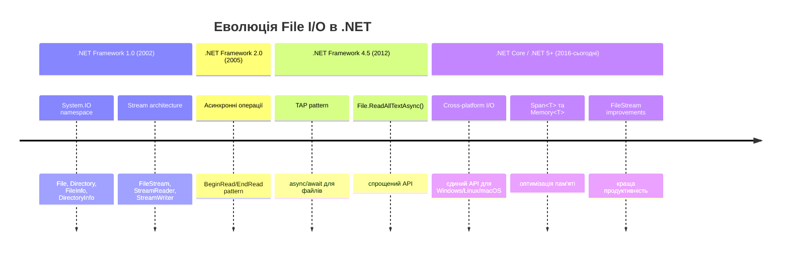
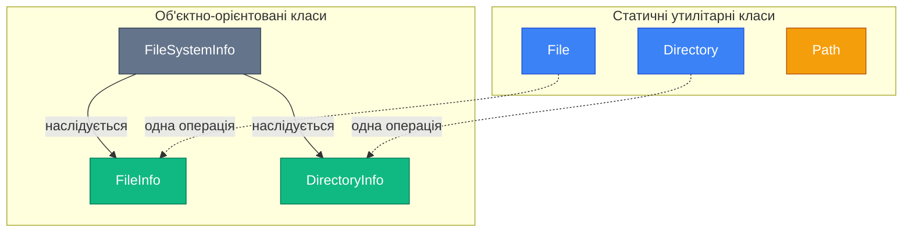

# 8.1.1. Основи роботи з файловою системою

## Вступ: Чому файлова система важлива?

Уявіть додаток, який не може зберігати дані. Налаштування втрачаються після кожного перезапуску, користувачі не можуть зберегти свою роботу, а логи помилок зникають безслідно. Звучить жахливо, чи не так? Саме тому робота з файловою системою (File System) є фундаментальною навичкою для будь-якого розробника.

**File I/O (Input/Output)** — це міст між вашим додатком та постійним сховищем даних. Це дозволяє:

- Зберігати конфігурації додатків
- Читати та записувати користувацькі дані
- Логувати події та помилки
- Обмінюватися даними між програмами
- Створювати резервні копії
- Обробляти великі набори даних

У цьому матеріалі ми розглянемо основи роботи з файловою системою в C#, від простих операцій до складних сценаріїв. Ви навчитеся не просто використовувати API, а розумітиму **чому** саме так, а не інакше.

::note
**Передумови**: Для комфортного засвоєння матеріалу рекомендується знання основ C# (змінні, методи, класи), exception handling та using statements. Базове розуміння концепції шляхів у файловій системі буде перевагою.
::

## Еволюція файлового I/O в .NET

Раніше розробники використовували низькорівневі бібліотеки та Win32 API для роботи з файлами — це було складно та схильно до помилок. З появою .NET Framework команда Microsoft створила потужний та інтуїтивний namespace **System.IO**, який абстрагує складність операційної системи.

::mermaid

::

## Фундаментальні концепції файлової системи

### Що таке файлова система?

**Файлова система (File System)** — це спосіб організації та зберігання файлів на носіях інформації (жорсткий диск, SSD, USB). Це як бібліотека: книги (файли) організовані по полицях (директоріях), а кожна книга має свою адресу (шлях).

### Шляхи: Абсолютні vs Відносні

**Абсолютний шлях (Absolute Path)** — повна адреса файлу від кореня файлової системи:

```
Windows:  C:\Users\John\Documents\report.txt
Linux:    /home/john/documents/report.txt
macOS:    /Users/john/Documents/report.txt
```

**Відносний шлях (Relative Path)** — адреса відносно поточної робочої директорії:

```
.\data\config.json          // у підпапці data
..\shared\library.dll       // на рівень вище, потім у shared
logs\app.log                // у підпапці logs (без ./)
```

::tip
**Best Practice**: Завжди використовуйте `Path.Combine()` замість конкатенації рядків для побудови шляхів. Це забезпечить крос-платформенність та правильну обробку роздільників (`\` на Windows, `/` на Unix).
::

### Архітектура класів System.IO

Namespace `System.IO` містить два типи класів для роботи з файловою системою:

::mermaid

::

**Коли використовувати що?**

| Сценарій | Рекомендація | Причина |
| :--- | :--- | :--- |
| Одна операція з файлом | `File` або `Directory` | Менше overhead, простіший код |
| Багато операцій з одним файлом | `FileInfo` або `DirectoryInfo` | Кешування метаданих, краща продуктивність |
| Маніпуляції зі шляхами | `Path` | Крос-платформенні методи |
| Перевірка існування | `File.Exists()` / `Directory.Exists()` | Швидко, без створення об'єктів |

---

## Клас File: Статичні операції з файлами

Клас `File` надає статичні методи для швидких операцій створення, копіювання, видалення, переміщення та читання/запису файлів.

### Основні методи класу File

::field-group
  ::field{name="File.Exists(path)" type="bool"}
  Перевіряє, чи існує файл за вказаним шляхом.
  ::
  
  ::field{name="File.Create(path)" type="FileStream"}
  Створює або перезаписує файл. **Увага**: повертає `FileStream`, який потрібно закрити!
  ::
  
  ::field{name="File.Delete(path)" type="void"}
  Видаляє файл. Якщо файл не існує, НЕ викидає виняток.
  ::
  
  ::field{name="File.Copy(source, dest, overwrite)" type="void"}
  Копіює файл. Параметр `overwrite` визначає, чи перезаписувати існуючий файл.
  ::
  
  ::field{name="File.Move(source, dest, overwrite)" type="void"}
  Переміщує або перейменовує файл.
  ::
  
  ::field{name="File.ReadAllText(path)" type="string"}
  Читає весь вміст файлу як рядок (text file).
  ::
  
  ::field{name="File.ReadAllLines(path)" type="string[]"}
  Читає всі рядки файлу у масив.
  ::
  
  ::field{name="File.ReadAllBytes(path)" type="byte[]"}
  Читає весь файл як масив байтів (для бінарних файлів).
  ::
  
  ::field{name="File.WriteAllText(path, content)" type="void"}
  Записує рядок у файл (створює або перезаписує).
  ::
  
  ::field{name="File.WriteAllLines(path, lines)" type="void"}
  Записує масив рядків у файл (кожен елемент — новий рядок).
  ::
  
  ::field{name="File.WriteAllBytes(path, bytes)" type="void"}
  Записує масив байтів у файл.
  ::
  
  ::field{name="File.AppendAllText(path, content)" type="void"}
  Додає текст у кінець файлу (не перезаписує).
  ::
::

### Приклад 1: Читання та запис текстових файлів

Уявімо, що ми створюємо додаток для зберігання замінок користувача.

```csharp showLineNumbers
using System;
using System.IO;

class NotesApp
{
    static void Main()
    {
        string filePath = "notes.txt";
        
        // Перевіряємо, чи існує файл
        if (!File.Exists(filePath))
        {
            Console.WriteLine("Файл нотаток не знайдено. Створюємо новий...");
            File.WriteAllText(filePath, "Мої нотатки:\n");
        }
        
        // Додаємо нову нотатку
        string newNote = $"[{DateTime.Now}] Вивчити File I/O в C#\n";
        File.AppendAllText(filePath, newNote);
        
        // Читаємо весь вміст
        string allNotes = File.ReadAllText(filePath);
        Console.WriteLine("=== ВСІ НОТАТКИ ===");
        Console.WriteLine(allNotes);
    }
}
```

**Розбір коду:**

- **Рядок 8**: Визначаємо відносний шлях до файлу. Файл буде створено у робочій директорії програми.
- **Рядки 11-15**: Перевіряємо існування файлу. Якщо файл не існує, створюємо його з заголовком за допомогою `File.WriteAllText()`.
- **Рядок 18**: Формуємо нотатку з поточною датою та часом.
- **Рядок 19**: Використовуємо `File.AppendAllText()` для додавання нового рядка **без перезапису** існуючого вмісту.
- **Рядок 22**: Зчитуємо весь файл у пам'ять за допомогою `File.ReadAllText()`.

::warning
**Обережно з великими файлами!** Методи `ReadAllText()` та `ReadAllBytes()` завантажують **весь файл у пам'ять**. Для файлів розміром понад 100 МБ використовуйте потокове читання (`StreamReader` або `FileStream`).
::

### Приклад 2: Робота з масивами рядків

Іноді потрібно обробляти файл порядково, наприклад, для аналізу логів.

```csharp showLineNumbers
using System;
using System.IO;
using System.Linq;

class LogAnalyzer
{
    static void Main()
    {
        string logPath = "app.log";
        
        // Створюємо демонстраційний лог
        string[] sampleLogs = 
        {
            "INFO: Application started",
            "WARNING: Low memory",
            "ERROR: Database connection failed",
            "INFO: Retrying connection",
            "INFO: Connection successful"
        };
        File.WriteAllLines(logPath, sampleLogs);
        
        // Читаємо та аналізуємо
        string[] logLines = File.ReadAllLines(logPath);
        
        int errorCount = logLines.Count(line => line.Contains("ERROR"));
        int warningCount = logLines.Count(line => line.Contains("WARNING"));
        
        Console.WriteLine($"Всього записів: {logLines.Length}");
        Console.WriteLine($"Помилки: {errorCount}");
        Console.WriteLine($"Попередження: {warningCount}");
        
        // Виводимо тільки помилки
        Console.WriteLine("\n=== КРИТИЧНІ ПОМИЛКИ ===");
        foreach (var line in logLines.Where(l => l.Contains("ERROR")))
        {
            Console.WriteLine(line);
        }
    }
}
```

**Розбір коду:**

- **Рядки 12-19**: Створюємо масив рядків для демонстрації.
- **Рядок 20**: `File.WriteAllLines()` записує кожен елемент масиву як окремий рядок у файл.
- **Рядок 23**: `File.ReadAllLines()` повертає масив рядків, де кожен елемент — це рядок з файлу.
- **Рядки 25-26**: Використовуємо LINQ для підрахунку записів з певними ключовими словами.
- **Рядки 34-37**: Фільтруємо та виводимо тільки рядки з помилками.

### Приклад 3: Копіювання та переміщення файлів

```csharp showLineNumbers
using System;
using System.IO;

class FileManager
{
    static void Main()
    {
        string sourceFile = "original.txt";
        string backupFile = "backup/original_backup.txt";
        string renamedFile = "renamed.txt";
        
        // Створюємо оригінальний файл
        File.WriteAllText(sourceFile, "Важливі дані!");
        
        // Створюємо директорію для бекапу, якщо не існує
        string backupDir = Path.GetDirectoryName(backupFile);
        if (!Directory.Exists(backupDir))
        {
            Directory.CreateDirectory(backupDir);
        }
        
        // Копіюємо файл
        File.Copy(sourceFile, backupFile, overwrite: true);
        Console.WriteLine($"Створено резервну копію: {backupFile}");
        
        // Переміщуємо (перейменовуємо) оригінал
        File.Move(sourceFile, renamedFile, overwrite: true);
        Console.WriteLine($"Файл перейменовано: {sourceFile} → {renamedFile}");
        
        // Перевіряємо результат
        Console.WriteLine($"\nІснує {sourceFile}? {File.Exists(sourceFile)}");
        Console.WriteLine($"Існує {renamedFile}? {File.Exists(renamedFile)}");
        Console.WriteLine($"Існує {backupFile}? {File.Exists(backupFile)}");
    }
}
```

**Розбір коду:**

- **Рядок 16**: `Path.GetDirectoryName()` витягує шлях директорії з повного шляху до файлу.
- **Рядок 19**: Створюємо директорію, якщо її не існує (інакше `File.Copy()` викине виняток).
- **Рядок 23**: `File.Copy()` створює копію файлу. Параметр `overwrite: true` дозволяє перезапис.
- **Рядок 27**: `File.Move()` переміщує файл (фактично перейменовує, якщо шлях у тій самій директорії).

::note
**Важливо**: `File.Move()` у .NET 5+ підтримує параметр `overwrite`. У старіших версіях потрібно спочатку видалити цільовий файл, якщо він існує, інакше виникне `IOException`.
::

---

## Клас Directory: Робота з директоріями

Клас `Directory` аналогічний до `File`, але працює з папками (директоріями).

### Основні методи класу Directory

::field-group
  ::field{name="Directory.Exists(path)" type="bool"}
  Перевіряє, чи існує директорія.
  ::
  
  ::field{name="Directory.CreateDirectory(path)" type="DirectoryInfo"}
  Створює директорію та всі батьківські директорії, якщо вони не існують (рекурсивно).
  ::
  
  ::field{name="Directory.Delete(path, recursive)" type="void"}
  Видаляє директорію. `recursive: true` видаляє всі вкладені файли та папки.
  ::
  
  ::field{name="Directory.Move(source, dest)" type="void"}
  Переміщує або перейменовує директорію.
  ::
  
  ::field{name="Directory.GetFiles(path)" type="string[]"}
  Повертає масив шляхів до всіх файлів у директорії.
  ::
  
  ::field{name="Directory.GetDirectories(path)" type="string[]"}
  Повертає масив шляхів до всіх піддиректорій.
  ::
  
  ::field{name="Directory.GetFileSystemEntries(path)" type="string[]"}
  Повертає масив шляхів до всіх файлів та директорій.
  ::
  
  ::field{name="Directory.EnumerateFiles(path)" type="IEnumerable<string>"}
  Ледаче перерахування файлів (не завантажує всі в пам'ять одразу).
  ::
  
  ::field{name="Directory.GetCurrentDirectory()" type="string"}
  Повертає поточну робочу директорію.
  ::
  
  ::field{name="Directory.SetCurrentDirectory(path)" type="void"}
  Встановлює поточну робочу директорію.
  ::
::

### Приклад 4: Створення та видалення директорій

```csharp showLineNumbers
using System;
using System.IO;

class DirectoryDemo
{
    static void Main()
    {
        string projectDir = "MyProject";
        string srcDir = Path.Combine(projectDir, "src");
        string testsDir = Path.Combine(projectDir, "tests");
        
        // Створюємо структуру проєкту
        Console.WriteLine("Створення структури проєкту...");
        Directory.CreateDirectory(srcDir);
        Directory.CreateDirectory(testsDir);
        
        // Створюємо файли
        File.WriteAllText(Path.Combine(srcDir, "Program.cs"), "// Main code");
        File.WriteAllText(Path.Combine(testsDir, "Tests.cs"), "// Unit tests");
        
        Console.WriteLine($"Створено: {srcDir}");
        Console.WriteLine($"Створено: {testsDir}");
        
        // Виводимо вміст кореневої директорії
        Console.WriteLine($"\n=== Вміст {projectDir} ===");
        string[] subdirs = Directory.GetDirectories(projectDir);
        foreach (var dir in subdirs)
        {
            Console.WriteLine($"📁 {Path.GetFileName(dir)}");
        }
        
        // Видалення (розкоментуйте для тесту)
        // Directory.Delete(projectDir, recursive: true);
        // Console.WriteLine($"\nПроєкт {projectDir} видалено.");
    }
}
```

**Розбір коду:**

- **Рядки 9-10**: Використовуємо `Path.Combine()` для побудови шляхів — це гарантує правильний роздільник на різних ОС.
- **Рядки 14-15**: `Directory.CreateDirectory()` створить **всю ієрархію** папок. Якщо `projectDir` не існує, він буде створений автоматично.
- **Рядки 18-19**: Створюємо файли всередині директорій.
- **Рядок 26**: `Directory.GetDirectories()` повертає масив шляхів до всіх піддиректорій.
- **Рядок 29**: `Path.GetFileName()` витягує тільки назву директорії з повного шляху.
- **Рядок 33**: `recursive: true` видалить директорію з усім вмістом.

::warning
**Небезпека `Directory.Delete(path, true)`!** Цей метод безповоротно видаляє всю директорію з усіма файлами та піддиректоріями. Немає "корзини" чи можливості відновлення. Використовуйте з обережністю!
::

### Приклад 5: Рекурсивний обхід директорій

Припустимо, ми хочемо знайти всі файли `.cs` у проєкті, включаючи вкладені папки.

```csharp showLineNumbers
using System;
using System.IO;

class DirectoryScanner
{
    static void Main()
    {
        string rootPath = @"C:\Projects\MyApp"; // Змініть на ваш шлях
        
        Console.WriteLine($"Пошук C# файлів у {rootPath}...\n");
        
        try
        {
            ScanDirectory(rootPath, "*.cs");
        }
        catch (UnauthorizedAccessException ex)
        {
            Console.WriteLine($"Доступ заборонено: {ex.Message}");
        }
    }
    
    static void ScanDirectory(string path, string searchPattern)
    {
        try
        {
            // Шукаємо файли в поточній директорії
            string[] files = Directory.GetFiles(path, searchPattern);
            foreach (var file in files)
            {
                Console.WriteLine($"📄 {file}");
            }
            
            // Рекурсивно обходимо піддиректорії
            string[] subdirs = Directory.GetDirectories(path);
            foreach (var dir in subdirs)
            {
                ScanDirectory(dir, searchPattern); // Рекурсія!
            }
        }
        catch (UnauthorizedAccessException)
        {
            Console.WriteLine($"⛔ Немає доступу до: {path}");
        }
    }
}
```

**Розбір коду:**

- **Рядок 27**: `Directory.GetFiles(path, pattern)` шукає файли з певним шаблоном (`*.cs` — всі файли з розширенням `.cs`).
- **Рядки 34-38**: Рекурсивний обхід: для кожної піддиректорії викликаємо `ScanDirectory()` знову.
- **Рядки 40-43**: Обробка `UnauthorizedAccessException` для системних папок (наприклад, `System Volume Information` на Windows).

::tip
**Оптимізація**: Для великих файлових систем використовуйте `Directory.EnumerateFiles()` замість `GetFiles()`. Це ледаче перерахування дозволяє обробляти файли по одному без завантаження всього списку в пам'ять.
::

---

## Клас Path: Маніпуляції зі шляхами

`Path` — це утилітарний клас, який НЕ працює з реальною файловою системою, а лише виконує **маніпуляції з рядками шляхів**. Це критично важливо для крос-платформенних додатків.

### Основні методи класу Path

::field-group
  ::field{name="Path.Combine(parts...)" type="string"}
  Об'єднує частини шляху з правильним роздільником для поточної ОС.
  ::
  
  ::field{name="Path.GetFileName(path)" type="string"}
  Витягує ім'я файлу з розширенням з шляху.
  ::
  
  ::field{name="Path.GetFileNameWithoutExtension(path)" type="string"}
  Витягує ім'я файлу без розширення.
  ::
  
  ::field{name="Path.GetExtension(path)" type="string"}
  Повертає розширення файлу (включаючи крапку, наприклад `.txt`).
  ::
  
  ::field{name="Path.GetDirectoryName(path)" type="string"}
  Витягує шлях директорії з повного шляху до файлу.
  ::
  
  ::field{name="Path.GetFullPath(path)" type="string"}
  Перетворює відносний шлях на абсолютний.
  ::
  
  ::field{name="Path.GetTempPath()" type="string"}
  Повертає шлях до тимчасової директорії системи.
  ::
  
  ::field{name="Path.GetTempFileName()" type="string"}
  Створює унікальний тимчасовий файл та повертає його шлях.
  ::
  
  ::field{name="Path.ChangeExtension(path, ext)" type="string"}
  Змінює розширення файлу.
  ::
  
  ::field{name="Path.HasExtension(path)" type="bool"}
  Перевіряє, чи має шлях розширення.
  ::
::

### Приклад 6: Розбір шляхів

```csharp showLineNumbers
using System;
using System.IO;

class PathDemo
{
    static void Main()
    {
        string filePath = @"C:\Users\John\Documents\report.docx";
        
        Console.WriteLine("=== АНАЛІЗ ШЛЯХУ ===");
        Console.WriteLine($"Повний шлях:        {filePath}");
        Console.WriteLine($"Директорія:         {Path.GetDirectoryName(filePath)}");
        Console.WriteLine($"Ім'я файлу:         {Path.GetFileName(filePath)}");
        Console.WriteLine($"Без розширення:     {Path.GetFileNameWithoutExtension(filePath)}");
        Console.WriteLine($"Розширення:         {Path.GetExtension(filePath)}");
        
        // Зміна розширення
        string pdfPath = Path.ChangeExtension(filePath, ".pdf");
        Console.WriteLine($"\nЗмінено на PDF:     {pdfPath}");
        
        // Побудова шляхів
        string projectRoot = @"C:\Projects\MyApp";
        string configPath = Path.Combine(projectRoot, "config", "appsettings.json");
        Console.WriteLine($"\nПобудований шлях:   {configPath}");
        
        // Системні шляхи
        Console.WriteLine($"\nТимчасова папка:    {Path.GetTempPath()}");
        Console.WriteLine($"Роздільник:         '{Path.DirectorySeparatorChar}'");
    }
}
```

**Вивід на Windows:**
```
=== АНАЛІЗ ШЛЯХУ ===
Повний шлях:        C:\Users\John\Documents\report.docx
Директорія:         C:\Users\John\Documents
Ім'я файлу:         report.docx
Без розширення:     report
Розширення:         .docx

Змінено на PDF:     C:\Users\John\Documents\report.pdf

Побудований шлях:   C:\Projects\MyApp\config\appsettings.json

Тимчасова папка:    C:\Users\John\AppData\Local\Temp\
Роздільник:         '\'
```

**Розбір коду:**

- **Рядок 12-15**: Використовуємо різні методи для витягування частин шляху.
- **Рядок 18**: `Path.ChangeExtension()` замінює існуюче розширення на нове.
- **Рядок 23**: `Path.Combine()` автоматично додає правильні роздільники (`\` на Windows, `/` на Linux).
- **Рядок 27-28**: Демонстрація системних шляхів та роздільників.

::note
**Крос-платформенність**: На Linux/macOS вивід буде відрізнятися (використовуватиметься `/` замість `\`), але код залишається однаковим. Це магія `Path.Combine()`!
::

---

## FileInfo та DirectoryInfo: Об'єктно-орієнтований підхід

Коли потрібно виконати **кілька операцій** з одним файлом або директорією, краще використовувати `FileInfo` та `DirectoryInfo`. Ці класи кешують метадані (розмір, дату створення, атрибути) та надають зручні властивості.

### FileInfo: Властивості та методи

```csharp showLineNumbers
using System;
using System.IO;

class FileInfoDemo
{
    static void Main()
    {
        string filePath = "sample.txt";
        
        // Створюємо файл для демонстрації
        File.WriteAllText(filePath, "Hello, FileInfo!");
        
        // Створюємо об'єкт FileInfo
        FileInfo fileInfo = new FileInfo(filePath);
        
        // Властивості
        Console.WriteLine("=== ІНФОРМАЦІЯ ПРО ФАЙЛ ===");
        Console.WriteLine($"Повний шлях:       {fileInfo.FullName}");
        Console.WriteLine($"Ім'я:              {fileInfo.Name}");
        Console.WriteLine($"Розмір:            {fileInfo.Length} байт");
        Console.WriteLine($"Створено:          {fileInfo.CreationTime}");
        Console.WriteLine($"Змінено:           {fileInfo.LastWriteTime}");
        Console.WriteLine($"Тільки читання:    {fileInfo.IsReadOnly}");
        Console.WriteLine($"Існує:             {fileInfo.Exists}");
        
        // Методи
        FileInfo backup = fileInfo.CopyTo("sample_backup.txt", overwrite: true);
        Console.WriteLine($"\nСтворено копію:    {backup.Name}");
        
        fileInfo.MoveTo("renamed_sample.txt", overwrite: true);
        Console.WriteLine($"Перейменовано на:  {fileInfo.Name}");
        
        // Після переміщення Exists поверне false для старого шляху
        fileInfo.Refresh(); // Оновлюємо кеш метаданих
        Console.WriteLine($"Існує (старий):    {new FileInfo(filePath).Exists}");
        Console.WriteLine($"Існує (новий):     {fileInfo.Exists}");
    }
}
```

**Розбір коду:**

- **Рядок 14**: Створюємо об'єкт `FileInfo`. Це НЕ створює файл, а лише зчитує його метадані.
- **Рядки 18-24**: Властивості `FileInfo` надають інформацію про файл (розмір, дати, атрибути).
- **Рядок 27**: `CopyTo()` повертає новий об'єкт `FileInfo` для копії.
- **Рядок 30**: `MoveTo()` переміщує файл. **Важливо**: об'єкт `fileInfo` тепер вказує на новий шлях!
- **Рядок 34**: `Refresh()` оновлює кеш метаданих. Без цього `Exists` може повернути застарілу інформацію.

::tip
**Коли використовувати FileInfo?** Якщо ви робите 3+ операції з одним файлом (перевірка існування, читання розміру, копіювання тощо), `FileInfo` буде ефективнішим за статичні методи `File`.
::

### DirectoryInfo: Робота з директоріями

```csharp showLineNumbers
using System;
using System.IO;
using System.Linq;

class DirectoryInfoDemo
{
    static void Main()
    {
        string dirPath = "ProjectFolder";
        
        // Створюємо директорію
        DirectoryInfo dirInfo = new DirectoryInfo(dirPath);
        if (!dirInfo.Exists)
        {
            dirInfo.Create();
            Console.WriteLine($"Створено: {dirInfo.FullName}");
        }
        
        // Створюємо піддиректорії та файли
        dirInfo.CreateSubdirectory("src");
        dirInfo.CreateSubdirectory("docs");
        File.WriteAllText(Path.Combine(dirPath, "README.md"), "# Project");
        
        // Отримуємо всі файли та директорії
        Console.WriteLine("\n=== ВМІСТ ===");
        FileInfo[] files = dirInfo.GetFiles();
        DirectoryInfo[] subdirs = dirInfo.GetDirectories();
        
        foreach (var dir in subdirs)
        {
            Console.WriteLine($"📁 {dir.Name} (створено {dir.CreationTime:yyyy-MM-dd})");
        }
        
        foreach (var file in files)
        {
            Console.WriteLine($"📄 {file.Name} ({file.Length} байт)");
        }
        
        // Рекурсивний пошук
        Console.WriteLine("\n=== ВСІ ФАЙЛИ (РЕКУРСИВНО) ===");
        FileInfo[] allFiles = dirInfo.GetFiles("*", SearchOption.AllDirectories);
        foreach (var file in allFiles)
        {
            Console.WriteLine($"  {file.FullName}");
        }
        
        // Статистика
        long totalSize = allFiles.Sum(f => f.Length);
        Console.WriteLine($"\nВсього файлів: {allFiles.Length}");
        Console.WriteLine($"Загальний розмір: {totalSize} байт");
    }
}
```

**Розбір коду:**

- **Рядки 12-16**: `DirectoryInfo` можна створити для неіснуючої директорії. Перевіряємо `Exists` та викликаємо `Create()`.
- **Рядок 20**: `CreateSubdirectory()` створює піддиректорію відносно поточної.
- **Рядки 26-27**: `GetFiles()` та `GetDirectories()` повертають масиви `FileInfo` та `DirectoryInfo`.
- **Рядок 41**: `SearchOption.AllDirectories` вмикає рекурсивний пошук (включно з вкладеними папками).
- **Рядок 47**: Використовуємо LINQ для підрахунку загального розміру всіх файлів.

---

## Порівняльна таблиця: File vs FileInfo, Directory vs DirectoryInfo

| Критерій | File / Directory | FileInfo / DirectoryInfo |
| :--- | :--- | :--- |
| **Коли використовувати** | Одна операція | Кілька операцій з одним файлом/директорією |
| **Продуктивність** | Менше overhead | Кращe для повторних операцій (кешування) |
| **Синтаксис** | Статичні методи | Об'єктно-орієнтований підхід |
| **Метадані** | Кожен виклик — новий запит | Кешуються (потрібен `Refresh()`) |
| **Приклад використання** | `File.Exists(path)` | `new FileInfo(path).Exists` |
| **Створення об'єкту** | Не потрібно | Необхідно створити екземпляр |

---

## Практичні завдання

::steps

### Завдання 1: Менеджер конфігурацій

Створіть програму, яка:
1. Перевіряє наявність файлу `config.json` у директорії `settings`.
2. Якщо файл не існує, створює його з дефолтним вмістом: `{"theme": "dark", "language": "uk"}`.
3. Зчитує вміст та виводить у консоль.
4. Створює резервну копію у `settings/backup/`.

### Завдання 2: Пошук дублікатів

Напишіть програму, яка знаходить файли з однаковими іменами (але в різних директоріях) всередині заданої папки. Використайте `DirectoryInfo` та рекурсивний пошук.

### Завдання 3: Очищення логів

Створіть утиліту, яка видаляє всі `.log` файли старше 7 днів у вказаній директорії. Використайте `FileInfo.LastWriteTime` для перевірки дати.

::

---

## Резюме: Що ми вивчили?

::card-group
  ::card{title="Клас File"}
  Статичні методи для швидких операцій читання, запису, копіювання та видалення файлів. Ідеальний для одноразових операцій.
  ::
  
  ::card{title="Клас Directory"}
  Робота з директоріями: створення, видалення, перерахування файлів. Підтримка рекурсивного обходу.
  ::
  
  ::card{title="Клас Path"}
  Маніпуляції зі шляхами (Combine, GetFileName, GetExtension). Забезпечує крос-платформенність.
  ::
  
  ::card{title="FileInfo та DirectoryInfo"}
  Об'єктно-орієнтований підхід з кешуванням метаданих. Оптимальний для множинних операцій.
  ::
::

### Ключові поняття

- **Абсолютний vs Відносний шлях**: Розумійте різницю та завжди використовуйте `Path.Combine()`.
- **Статичні vs Об'єктні методи**: Вибирайте підхід залежно від кількості операцій.
- **Безпека**: Завжди обробляйте `UnauthorizedAccessException` та `IOException`.
- **Продуктивність**: Для великих файлів використовуйте потокове читання (про це в наступному розділі).

::tip
**Наступний крок**: У наступному матеріалі ми розглянемо **Streams** — потужний механізм для роботи з потоками даних, який дозволяє ефективно обробляти великі файли, мережеві з'єднання та багато іншого.
::

---

## Посилання

- [Офіційна документація System.IO](https://learn.microsoft.com/en-us/dotnet/api/system.io)
- [Робота з файлами та директоріями (.NET Guide)](https://learn.microsoft.com/en-us/dotnet/standard/io/)
- [Best Practices для File I/O](https://learn.microsoft.com/en-us/dotnet/standard/io/best-practices)
