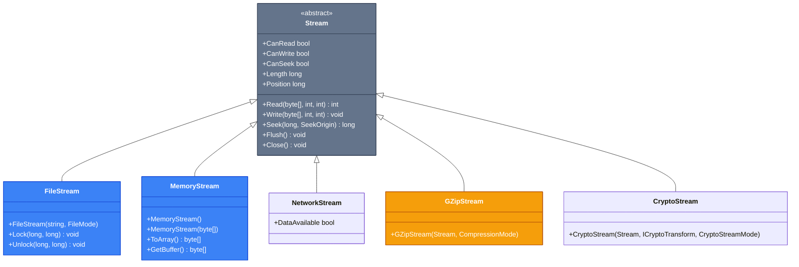
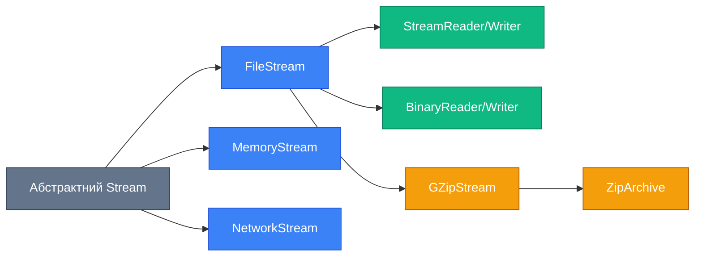

# 8.1.2. Потоки (Streams) та Серіалізація Даних

## Вступ: Від файлів до потоків

У попередньому розділі ми навчилися працювати з файлами за допомогою класів `File`, `Directory` та їхніх об'єктно-орієнтованих аналогів. Але що робити, коли файл занадто великий для завантаження у пам'ять? Як читати дані з мережі або писати у стиснутий архів? Відповідь — **Потоки (Streams)**.

**Stream** — це абстракція послідовності байтів. Уявіть потік води: ви можете черпати з нього воду порціями (читання), додавати нову воду (запис), або перекривати його (закриття). Аналогічно працюють потоки даних у C#.

### Навіщо потоки?

::card-group
::card{title="🎯 Ефективність пам'яті"}
Обробка файлів гігабайтного розміру без завантаження всього у RAM. Читаємо та обробляємо частинами (chunks).
::

::card{title="🌐 Універсальність"}
Єдиний API для роботи з файлами, мережею, пам'яттю, compressed данимиi будь-якими іншими джерелами байтів.
::

::card{title="⚡ Асинхронність"}
Підтримка async/await для неблокуючого I/O — критично для серверних додатків та UI.
::

::card{title="🔗 Композиція"}
Потоки можна "обгортати" один в одний: FileStream → GZipStream → CryptoStream для шифрування стиснутих файлів.
::
::

::note
**Передумови**: Для розуміння цього матеріалу потрібне знання основ роботи з файлами (попередній розділ), using statements, exception handling та базових концепцій async/await.
::

---

## Архітектура потоків: Клас Stream

У C# всі потоки наслідуються від абстрактного класу `System.IO.Stream`. Це базовий клас, який визначає загальний інтерфейс для читання та запису.

::mermaid



::

### Ключові властивості Stream

::field-group
::field{name="CanRead" type="bool"}
Чи підтримує потік читання? Наприклад, `FileStream` у режимі `FileMode.Create` не може читати.
::

::field{name="CanWrite" type="bool"}
Чи підтримує потік запис? Потік, відкритий тільки для читання, поверне `false`.
::

::field{name="CanSeek" type="bool"}
Чи можна переміщуватися по потоку? `NetworkStream` не підтримує seek, бо це послідовний потік.
::

::field{name="Length" type="long"}
Загальна довжина потоку у байтах. Недоступна для потоків, які не підтримують `CanSeek`.
::

::field{name="Position" type="long"}
Поточна позиція у потоці. Можна змінювати для переміщення (якщо `CanSeek == true`).
::
::

### Основні методи Stream

::field-group
::field{name="Read(byte[] buffer, int offset, int count)" type="int"}
Читає до `count` байтів у масив `buffer` починаючи з позиції `offset`. Повертає кількість фактично прочитаних байтів (може бути менше `count`!).
::

::field{name="Write(byte[] buffer, int offset, int count)" type="void"}
Записує `count` байтів з масиву `buffer` (починаючи з `offset`) у потік.
::

::field{name="Seek(long offset, SeekOrigin origin)" type="long"}
Переміщує позицію у потоці. `SeekOrigin` може бути: `Begin` (від початку), `Current` (від поточної позиції), `End` (від кінця).
::

::field{name="Flush()" type="void"}
Примусово записує всі буферизовані дані у базове сховище (диск, мережу).
::

::field{name="Close()" type="void"}
Закриває потік та звільняє ресурси. Після закриття потік більше не можна використовувати.
::

::field{name="CopyTo(Stream destination)" type="void"}
Копіює всі дані з поточного потоку до іншого.
::

::field{name="ReadAsync(byte[], int, int)" type="Task<int>"}
Асинхронна версія `Read()`.
::

::field{name="WriteAsync(byte[], int, int)" type="Task"}
Асинхронна версія `Write()`.
::
::

::warning
**Критично важливо!** Завжди закривайте потоки після використання за допомогою `using` statement. Незакриті потоки можуть заблокувати файли, витікати пам'ять або втратити дані через незаписаний буфер.
::

---

## FileStream: Нестримний доступ до файлів

`FileStream` — це найбільш низькорівневий спосіб роботи з файлами. На відміну від `File.ReadAllText()`, він дозволяє контролювати **як саме** читаються та записуються дані.

### Створення FileStream

```csharp
FileStream stream = new FileStream(
    path: "data.bin",
    mode: FileMode.OpenOrCreate,
    access: FileAccess.ReadWrite,
    share: FileShare.None,
    bufferSize: 4096,
    useAsync: true
);
```

### Параметри FileMode

| FileMode       | Опис                  | Якщо файл існує     | Якщо файл НЕ існує  |
| :------------- | :-------------------- | :------------------ | :------------------ |
| `CreateNew`    | Створює новий файл    | **Викидає виняток** | Створює             |
| `Create`       | Створює файл          | Перезаписує         | Створює             |
| `Open`         | Відкриває існуючий    | Відкриває           | **Викидає виняток** |
| `OpenOrCreate` | Відкриває або створює | Відкриває           | Створює             |
| `Truncate`     | Відкриває та очищає   | Очищає вміст        | **Викидає виняток** |
| `Append`       | Додає у кінець        | Позиція = кінець    | Створює             |

### Параметри FileAccess

- `FileAccess.Read` — тільки читання
- `FileAccess.Write` — тільки запис
- `FileAccess.ReadWrite` — читання та запис

### Параметри FileShare

- `FileShare.None` — ексклюзивний доступ (інші процеси не можуть відкрити файл)
- `FileShare.Read` — інші можуть читати
- `FileShare.Write` — інші можуть писати
- `FileShare.ReadWrite` — інші можуть читати та писати

### Приклад 1: Запис та читання бінарних даних

```csharp showLineNumbers
using System;
using System.IO;
using System.Text;

class FileStreamDemo
{
    static void Main()
    {
        string filePath = "message.bin";

        // ЗАПИС
        using (FileStream writeStream = new FileStream(
            filePath,
            FileMode.Create,
            FileAccess.Write))
        {
            string message = "Привіт, FileStream!";
            byte[] messageBytes = Encoding.UTF8.GetBytes(message);

            // Записуємо довжину повідомлення (4 байти)
            byte[] lengthBytes = BitConverter.GetBytes(messageBytes.Length);
            writeStream.Write(lengthBytes, 0, lengthBytes.Length);

            // Записуємо саме повідомлення
            writeStream.Write(messageBytes, 0, messageBytes.Length);

            Console.WriteLine($"Записано {messageBytes.Length} байт");
        } // using автоматично викликає Dispose() → Close()

        // ЧИТАННЯ
        using (FileStream readStream = new FileStream(
            filePath,
            FileMode.Open,
            FileAccess.Read))
        {
            // Читаємо довжину
            byte[] lengthBytes = new byte[4];
            readStream.Read(lengthBytes, 0, 4);
            int messageLength = BitConverter.ToInt32(lengthBytes, 0);

            // Читаємо повідомлення
            byte[] messageBytes = new byte[messageLength];
            readStream.Read(messageBytes, 0, messageLength);

            string message = Encoding.UTF8.GetString(messageBytes);
            Console.WriteLine($"Прочитано: {message}");
        }
    }
}
```

**Розбір коду:**

- **Рядки 12-15**: Створюємо `FileStream` для запису. `FileMode.Create` перезапише файл, якщо він існує.
- **Рядок 18**: Конвертуємо рядок у масив байтів за допомогою `Encoding.UTF8`.
- **Рядки 21-22**: Записуємо спочатку довжину повідомлення (4 байти int32), щоб знати, скільки байтів читати потім.
- **Рядок 25**: Записуємо саме повідомлення.
- **Рядок 28**: `using` statement автоматично викликає `Dispose()`, який закриває потік.
- **Рядки 37-38**: Читаємо 4 байти та конвертуємо їх у `int` за допомогою `BitConverter`.
- **Рядки 41-42**: Читаємо точну кількість байтів повідомлення.

::tip
**Чому спочатку довжина?** Для бінарних даних ми не знаємо, де закінчується одне повідомлення і починається інше. Записуючи довжину спочатку, ми вирішуємо цю проблему — це типовий паттерн у бінарних протоколах.
::

### Приклад 2: Потокове читання великого файлу

Уявімо, що маємо лог-файл розміром 2 ГБ. Завантажити його у пам'ять за допомогою `File.ReadAllText()` неможливо. Використаємо потокове читання.

```csharp showLineNumbers
using System;
using System.IO;

class LargeFileReader
{
    static void Main()
    {
        string logPath = "huge_log.txt";

        // Створюємо демонстраційний файл (багато рядків)
        CreateDemoLog(logPath, lines: 1_000_000);

        Console.WriteLine("Пошук помилок у великому файлі...\n");

        int errorCount = 0;
        int chunkSize = 4096; // 4 KB
        byte[] buffer = new byte[chunkSize];

        using (FileStream fs = new FileStream(logPath, FileMode.Open, FileAccess.Read))
        {
            int bytesRead;
            long totalBytes = 0;

            // Читаємо файл частинами
            while ((bytesRead = fs.Read(buffer, 0, buffer.Length)) > 0)
            {
                totalBytes += bytesRead;

                // Конвертуємо chunk у рядок
                string chunk = System.Text.Encoding.UTF8.GetString(buffer, 0, bytesRead);

                // Рахуємо помилки
                errorCount += CountOccurrences(chunk, "ERROR");

                // Прогрес (кожні 10 MB)
                if (totalBytes % (10 * 1024 * 1024) == 0)
                {
                    Console.WriteLine($"Оброблено: {totalBytes / 1024 / 1024} MB");
                }
            }
        }

        Console.WriteLine($"\n✅ Знайдено помилок: {errorCount}");
        Console.WriteLine($"Розмір файлу: {new FileInfo(logPath).Length / 1024 / 1024} MB");
    }

    static void CreateDemoLog(string path, int lines)
    {
        using (StreamWriter writer = new StreamWriter(path))
        {
            var random = new Random();
            for (int i = 0; i < lines; i++)
            {
                string level = random.Next(10) == 0 ? "ERROR" : "INFO";
                writer.WriteLine($"{DateTime.Now:yyyy-MM-dd HH:mm:ss} [{level}] Message #{i}");
            }
        }
    }

    static int CountOccurrences(string text, string substring)
    {
        int count = 0;
        int index = 0;
        while ((index = text.IndexOf(substring, index)) != -1)
        {
            count++;
            index += substring.Length;
        }
        return count;
    }
}
```

**Розбір коду:**

- **Рядок 16**: Визначаємо розмір буфера (chunk) — 4 KB. Це оптимальний розмір для більшості сценаріїв.
- **Рядки 25-40**: Читаємо файл у циклі частинами. `Read()` повертає кількість фактично прочитаних байтів.
- **Рядок 25**: `while ((bytesRead = fs.Read(...)) > 0)` — стандартний паттерн для потокового читання. Коли досягнемо кінця файлу, `Read()` поверне 0.
- **Рядок 30**: Конвертуємо тільки прочитану частину буфера у рядок (не весь масив!).
- **Рядки 36-39**: Виводимо прогрес кожні 10 MB для наочності.

::note
**Проблема меж рядків**: Цей приклад спрощений. Якщо слово "ERROR" розірветься між двома chunks, ми його не знайдемо. Для реального коду потрібна додаткова логіка для роботи з неповними рядками (buffer overlap).
::

---

## MemoryStream: Потік у пам'яті

`MemoryStream` зберігає дані у пам'яті (RAM) замість файлу. Це корисно для:

- Тестування (не створює файли на диску)
- Тимчасових буферів
- Конвертації між потоками та масивами байтів
- Роботи з даними перед записом на диск

### Приклад 3: Використання MemoryStream

```csharp showLineNumbers
using System;
using System.IO;
using System.Text;

class MemoryStreamDemo
{
    static void Main()
    {
        // Створюємо пустий MemoryStream
        using (MemoryStream ms = new MemoryStream())
        {
            // Записуємо дані
            string message = "Дані у пам'яті";
            byte[] messageBytes = Encoding.UTF8.GetBytes(message);
            ms.Write(messageBytes, 0, messageBytes.Length);

            Console.WriteLine($"Позиція після запису: {ms.Position}");
            Console.WriteLine($"Довжина потоку: {ms.Length}");

            // Повертаємося на початок для читання
            ms.Position = 0;

            // Читаємо дані
            byte[] buffer = new byte[ms.Length];
            ms.Read(buffer, 0, buffer.Length);

            string readMessage = Encoding.UTF8.GetString(buffer);
            Console.WriteLine($"Прочитано: {readMessage}");

            // Отримуємо масив байтів
            byte[] allData = ms.ToArray();
            Console.WriteLine($"ToArray() повернув {allData.Length} байт");
        }

        // Створюємо MemoryStream з існуючого масиву
        byte[] existingData = Encoding.UTF8.GetBytes("Попередні дані");
        using (MemoryStream ms2 = new MemoryStream(existingData))
        {
            ms2.Position = ms2.Length; // Переходимо в кінець

            // Додаємо нові дані
            byte[] newData = Encoding.UTF8.GetBytes(" + нові дані");
            ms2.Write(newData, 0, newData.Length);

            ms2.Position = 0; // Повертаємося на початок
            byte[] combined = ms2.ToArray();
            Console.WriteLine($"\nОб'єднані дані: {Encoding.UTF8.GetString(combined)}");
        }
    }
}
```

**Розбір коду:**

- **Рядок 10**: Створюємо порожній `MemoryStream`. Початкова ємність — 0, але автоматично зростає.
- **Рядок 21**: **Критично!** Після запису позиція у потоці — в кінці. Для читання потрібно повернути її на початок.
- **Рядок 31**: `ToArray()` створює **копію** внутрішнього буфера. Для великих даних це може бути неефективно.
- **Рядки 36-47**: Демонстрація ініціалізації `MemoryStream` існуючим масивом.

::tip
**GetBuffer() vs ToArray()**: `GetBuffer()` повертає внутрішній масив без копіювання, але він може містити невикористані байти. `ToArray()` повертає точну копію даних. Використовуйте `GetBuffer()` для продуктивності, якщо розумієте ризики.
::

---

## StreamReader та StreamWriter: Текстові потоки

Робота з байтами незручна для текстових даних. `StreamReader` та `StreamWriter` — це обгортки над `Stream`, які працюють з **рядками** та **символами** замість байтів.

### StreamReader: Читання тексту

```csharp showLineNumbers
using System;
using System.IO;

class StreamReaderDemo
{
    static void Main()
    {
        string filePath = "diary.txt";

        // Створюємо демонстраційний файл
        File.WriteAllLines(filePath, new[]
        {
            "2026-01-10: Вивчаю C# Streams",
            "2026-01-11: Практикую async I/O",
            "2026-01-12: Будую реальний проєкт"
        });

        // Читання всього файлу
        using (StreamReader reader = new StreamReader(filePath))
        {
            string content = reader.ReadToEnd();
            Console.WriteLine("=== ВЕСЬ ВМІСТ ===");
            Console.WriteLine(content);
        }

        // Читання по рядках
        Console.WriteLine("\n=== ПОРЯДКОВЕ ЧИТАННЯ ===");
        using (StreamReader reader = new StreamReader(filePath))
        {
            string line;
            int lineNumber = 1;
            while ((line = reader.ReadLine()) != null)
            {
                Console.WriteLine($"[{lineNumber}] {line}");
                lineNumber++;
            }
        }

        // Читання з кодуванням
        using (StreamReader reader = new StreamReader(filePath, System.Text.Encoding.UTF8))
        {
            Console.WriteLine($"\nПерший символ: '{(char)reader.Read()}'");
        }
    }
}
```

**Розбір коду:**

- **Рядок 21**: `ReadToEnd()` читає весь файл у єдиний рядок (аналог `File.ReadAllText()`).
- **Рядок 32**: `ReadLine()` читає один рядок (до символу `\n` або `\r\n`). Повертає `null` наприкінці файлу.
- **Рядок 40**: Можна вказати кодування (за замовчуванням — UTF-8).
- **Рядок 42**: `Read()` читає **один символ** (повертає `int`, потрібно привести до `char`).

### StreamWriter: Запис тексту

```csharp showLineNumbers
using System;
using System.IO;

class StreamWriterDemo
{
    static void Main()
    {
        string logPath = "application.log";

        // Запис з перезаписом
        using (StreamWriter writer = new StreamWriter(logPath))
        {
            writer.WriteLine($"[{DateTime.Now}] Application started");
            writer.WriteLine($"[{DateTime.Now}] Initializing components...");
            writer.Write("Progress: ");
            writer.Write("25%... ");
            writer.WriteLine("50%... Done!");
        }

        // Додавання до існуючого файлу
        using (StreamWriter writer = new StreamWriter(logPath, append: true))
        {
            writer.WriteLine($"[{DateTime.Now}] New log entry");
        }

        // Запис з кодуванням та буферизацією
        using (StreamWriter writer = new StreamWriter(
            path: logPath,
            append: true,
            encoding: System.Text.Encoding.UTF8,
            bufferSize: 65536)) // 64 KB buffer
        {
            for (int i = 0; i < 1000; i++)
            {
                writer.WriteLine($"[{DateTime.Now}] Iteration {i}");
            }
            // writer.Flush(); // Примусово скинути буфер (викликається автоматично при Dispose)
        }

        // Виводимо результат
        Console.WriteLine("=== ЛОГ ФАЙЛ ===");
        Console.WriteLine(File.ReadAllText(logPath));
    }
}
```

**Розбір коду:**

- **Рядок 13**: `WriteLine()` додає символ нового рядка (`\n` або `\r\n` залежно від ОС).
- **Рядки 15-17**: `Write()` не додає новий рядок — дозволяє писати частинами.
- **Рядок 21**: `append: true` додає текст у кінець файлу замість перезапису.
- **Рядки 27-31**: Вказуємо кодування та розмір буфера. За замовчуванням `StreamWriter` буферизує дані для продуктивності.
- **Рядок 37**: `Flush()` примусово записує буфер на диск. `Dispose()` викликає його автоматично.

::warning
**Буферизація**: `StreamWriter` не записує кожен `WriteLine()` одразу на диск — він накопичує дані у буфері. Якщо програма аварійно завершиться до `Dispose()`, останні записи можуть втратитися. Використовуйте `writer.AutoFlush = true` для критичних логів.
::

---

## BinaryReader та BinaryWriter: Структуровані бінарні дані

Для роботи з примітивними типами (int, float, bool) у бінарному форматі використовуйте `BinaryReader` та `BinaryWriter`. Вони автоматично обробляють конвертацію типів.

### Приклад 4: Зберігання структурованих даних

```csharp showLineNumbers
using System;
using System.IO;

// Модель даних
record PlayerData(string Name, int Level, float Health, bool IsOnline);

class BinaryDataDemo
{
    static void Main()
    {
        string savePath = "player_save.dat";

        // Створюємо дані гравця
        var player = new PlayerData("Aragorn", 42, 95.5f, true);

        // ЗАПИС у бінарний файл
        using (FileStream fs = new FileStream(savePath, FileMode.Create))
        using (BinaryWriter writer = new BinaryWriter(fs))
        {
            writer.Write(player.Name);    // string
            writer.Write(player.Level);   // int (4 bytes)
            writer.Write(player.Health);  // float (4 bytes)
            writer.Write(player.IsOnline);// bool (1 byte)

            Console.WriteLine("Дані збережено!");
        }

        // ЧИТАННЯ з бінарного файлу
        using (FileStream fs = new FileStream(savePath, FileMode.Open))
        using (BinaryReader reader = new BinaryReader(fs))
        {
            string name = reader.ReadString();
            int level = reader.ReadInt32();
            float health = reader.ReadSingle();
            bool isOnline = reader.ReadBoolean();

            var loadedPlayer = new PlayerData(name, level, health, isOnline);

            Console.WriteLine($"\nДані завантажено:");
            Console.WriteLine($"  Ім'я: {loadedPlayer.Name}");
            Console.WriteLine($"  Рівень: {loadedPlayer.Level}");
            Console.WriteLine($"  Здоров'я: {loadedPlayer.Health}");
            Console.WriteLine($"  Онлайн: {loadedPlayer.IsOnline}");
        }

        // Перевіряємо розмір файлу
        FileInfo fileInfo = new FileInfo(savePath);
        Console.WriteLine($"\nРозмір файлу: {fileInfo.Length} байт");
    }
}
```

**Розбір коду:**

- **Рядок 5**: Використовуємо `record` для компактного визначення моделі даних.
- **Рядки 20-23**: `BinaryWriter.Write()` має багато перевантажень для різних типів. Він автоматично конвертує їх у байти.
- **Рядки 32-35**: **Критично важливо**: читати дані у тому самому порядку, що і записували! `ReadInt32()`, `ReadSingle()`, `ReadBoolean()` — методи для конкретних типів.
- **Рядок 47**: Бінарний формат компактніший за текстовий (JSON/XML).

::note
**Версійність**: Якщо ви зміните структуру `PlayerData` (додасте поле), старі файли збережень не читатимуться. Для реальних проєктів потрібна система версійності форматів або використання JSON/XML/Protobuf.
::

### Порівняння: BinaryWriter vs StreamWriter

| Критерій          | BinaryWriter                 | StreamWriter            |
| :---------------- | :--------------------------- | :---------------------- |
| **Тип даних**     | Бінарні (int, float, byte[]) | Текст (string, char)    |
| **Розмір файлу**  | Компактний                   | Більший (текст)         |
| **Читабельність** | Не читабельний людиною       | Читабельний             |
| **Швидкість**     | Швидше                       | Повільніше              |
| **Використання**  | Протоколи, формати даних     | Логи, конфігурації, CSV |

---

## Compression: Стиснення даних

.NET надає вбудовані класи для стиснення та розпакування даних: `GZipStream`, `DeflateStream` та `ZipArchive`.

### GZipStream: Стиснення одного файлу

`GZipStream` використовує алгоритм GZIP (те саме, що HTTP compression).

```csharp showLineNumbers
using System;
using System.IO;
using System.IO.Compression;

class GZipDemo
{
    static void Main()
    {
        string sourceFile = "large_document.txt";
        string compressedFile = "large_document.txt.gz";
        string decompressedFile = "large_document_restored.txt";

        // Створюємо великий файл для демонстрації
        File.WriteAllText(sourceFile, new string('A', 1_000_000)); // 1 MB букв 'A'

        // СТИСНЕННЯ
        Console.WriteLine("Стискання...");
        using (FileStream sourceStream = new FileStream(sourceFile, FileMode.Open))
        using (FileStream compressedStream = new FileStream(compressedFile, FileMode.Create))
        using (GZipStream gzipStream = new GZipStream(compressedStream, CompressionMode.Compress))
        {
            sourceStream.CopyTo(gzipStream);
        }

        // РОЗПАКУВАННЯ
        Console.WriteLine("Розпакування...");
        using (FileStream compressedStream = new FileStream(compressedFile, FileMode.Open))
        using (GZipStream gzipStream = new GZipStream(compressedStream, CompressionMode.Decompress))
        using (FileStream decompressedStream = new FileStream(decompressedFile, FileMode.Create))
        {
            gzipStream.CopyTo(decompressedStream);
        }

        // Порівняння розмірів
        long originalSize = new FileInfo(sourceFile).Length;
        long compressedSize = new FileInfo(compressedFile).Length;
        long restoredSize = new FileInfo(decompressedFile).Length;

        Console.WriteLine($"\nРозміри:");
        Console.WriteLine($"  Оригінал:      {originalSize:N0} байт");
        Console.WriteLine($"  Стиснутий:     {compressedSize:N0} байт");
        Console.WriteLine($"  Відновлений:   {restoredSize:N0} байт");
        Console.WriteLine($"  Коефіцієнт:    {(double)compressedSize / originalSize:P2}");

        // Перевірка коректності
        string originalContent = File.ReadAllText(sourceFile);
        string restoredContent = File.ReadAllText(decompressedFile);
        Console.WriteLine($"\nДані ідентичні: {originalContent == restoredContent}");
    }
}
```

**Розбір коду:**

- **Рядок 14**: Створюємо файл з повторюваними даними — такі файли стискаються дуже ефективно.
- **Рядок 20**: **Ключовий момент**: `GZipStream` обгортає `FileStream`. Дані, записані у `gzipStream`, автоматично стискаються та записуються у `compressedStream`.
- **Рядок 22**: `CopyTo()` копіює всі дані з одного потоку в інший.
- **Рядок 28**: Для розпакування використовуємо `CompressionMode.Decompress`.
- **Рядок 43**: Розраховуємо коефіцієнт стиснення.

::tip
**Коли використовувати GZIP?** Для текстових файлів, логів, JSON, XML — стиснення може досягати 80-90%. Для вже стиснутих форматів (JPEG, PNG, MP4, ZIP) GZIP малоефективний.
::

### ZipArchive: Робота з ZIP-архівами

`ZipArchive` дозволяє створювати та читати ZIP-архіви з кількома файлами.

```csharp showLineNumbers
using System;
using System.IO;
using System.IO.Compression;

class ZipArchiveDemo
{
    static void Main()
    {
        string archivePath = "backup.zip";

        // Створюємо демонстраційні файли
        Directory.CreateDirectory("TempData");
        File.WriteAllText("TempData/file1.txt", "Вміст файлу 1");
        File.WriteAllText("TempData/file2.txt", "Вміст файлу 2");
        File.WriteAllText("TempData/file3.txt", "Вміст файлу 3");

        // СТВОРЕННЯ ZIP-АРХІВУ
        Console.WriteLine("Створення архіву...");
        using (FileStream zipToOpen = new FileStream(archivePath, FileMode.Create))
        using (ZipArchive archive = new ZipArchive(zipToOpen, ZipArchiveMode.Create))
        {
            // Додаємо файли
            foreach (string filePath in Directory.GetFiles("TempData"))
            {
                string entryName = Path.GetFileName(filePath);
                ZipArchiveEntry entry = archive.CreateEntry(entryName, CompressionLevel.Optimal);

                using (Stream entryStream = entry.Open())
                using (FileStream fileStream = new FileStream(filePath, FileMode.Open))
                {
                    fileStream.CopyTo(entryStream);
                }

                Console.WriteLine($"  Додано: {entryName}");
            }
        }

        // ЧИТАННЯ ZIP-АРХІВУ
        Console.WriteLine("\n=== ВМІСТ АРХІВУ ===");
        using (FileStream zipToOpen = new FileStream(archivePath, FileMode.Open))
        using (ZipArchive archive = new ZipArchive(zipToOpen, ZipArchiveMode.Read))
        {
            foreach (ZipArchiveEntry entry in archive.Entries)
            {
                Console.WriteLine($"📄 {entry.Name} ({entry.CompressedLength} / {entry.Length} байт)");
            }
        }

        // РОЗПАКУВАННЯ
        Console.WriteLine("\nРозпакування...");
        ZipFile.ExtractToDirectory(archivePath, "ExtractedData", overwriteFiles: true);

        Console.WriteLine("✅ Архів створено та розпаковано!");
    }
}
```

**Розбір коду:**

- **Рядок 20**: `ZipArchiveMode.Create` — режим створення нового архіву.
- **Рядок 26**: `CreateEntry()` додає елемент у архів. `CompressionLevel.Optimal` — баланс між швидкістю та ступенем стиснення.
- **Рядки 28-32**: Відкриваємо потік запису для entry та копіюємо туди дані з файлу.
- **Рядок 41**: `ZipArchiveMode.Read` — режим читання.
- **Рядок 45**: `CompressedLength` — розмір у архіві, `Length` — оригінальний розмір.
- **Рядок 51**: `ZipFile.ExtractToDirectory()` — helper-метод для швидкого розпакування всього архіву.

::note
**ZipFile vs ZipArchive**: `ZipFile` — статичний клас з утилітарними методами (`CreateFromDirectory`, `ExtractToDirectory`). `ZipArchive` — для тонкого контролю (вибіркове читання, модифікація існуючих архівів).
::

---

## Async I/O: Асинхронна робота з файлами

У сучасних додатках критично важливо не блокувати потоки під час I/O операцій. .NET підтримує async/await для всіх потокових операцій.

### Приклад 5: Асинхронне копіювання файлу

```csharp showLineNumbers
using System;
using System.IO;
using System.Threading.Tasks;
using System.Diagnostics;

class AsyncIODemo
{
    static async Task Main()
    {
        string sourceFile = "large_video.mp4";
        string destFile = "large_video_copy.mp4";

        // Створюємо великий файл (100 MB) для демонстрації
        Console.WriteLine("Створення демонстраційного файлу...");
        await CreateLargeFileAsync(sourceFile, sizeInMB: 100);

        // Синхронне копіювання
        Console.WriteLine("\n[SYNC] Копіювання...");
        Stopwatch sw = Stopwatch.StartNew();
        File.Copy(sourceFile, destFile, overwrite: true);
        sw.Stop();
        Console.WriteLine($"Час: {sw.ElapsedMilliseconds} мс");
        File.Delete(destFile);

        // Асинхронне копіювання
        Console.WriteLine("\n[ASYNC] Копіювання...");
        sw.Restart();
        await CopyFileAsync(sourceFile, destFile);
        sw.Stop();
        Console.WriteLine($"Час: {sw.ElapsedMilliseconds} мс");

        Console.WriteLine("\n✅ Завершено!");
    }

    static async Task CopyFileAsync(string sourcePath, string destPath)
    {
        const int bufferSize = 81920; // 80 KB

        using (FileStream sourceStream = new FileStream(
            sourcePath,
            FileMode.Open,
            FileAccess.Read,
            FileShare.Read,
            bufferSize,
            useAsync: true)) // Критично важливо!
        using (FileStream destStream = new FileStream(
            destPath,
            FileMode.Create,
            FileAccess.Write,
            FileShare.None,
            bufferSize,
            useAsync: true))
        {
            await sourceStream.CopyToAsync(destStream);
        }
    }

    static async Task CreateLargeFileAsync(string path, int sizeInMB)
    {
        byte[] buffer = new byte[1024 * 1024]; // 1 MB buffer
        new Random().NextBytes(buffer); // Випадкові дані

        using (FileStream fs = new FileStream(path, FileMode.Create, FileAccess.Write, FileShare.None, buffer.Length, useAsync: true))
        {
            for (int i = 0; i < sizeInMB; i++)
            {
                await fs.WriteAsync(buffer, 0, buffer.Length);
            }
        }
    }
}
```

**Розбір коду:**

- **Рядок 8**: `async Task Main()` — підтримується з C# 7.1+.
- **Рядок 45**: **useAsync: true** — критично важливий параметр! Він вмикає справжній асинхронний I/O на рівні ОС.
- **Рядок 54**: `CopyToAsync()` — асинхронна версія `CopyTo()`.
- **Рядок 68**: `WriteAsync()` — асинхронний запис. Не блокує потік під час запису на диск.

::warning
**Помилка новачків**: Використовувати async методи **без** `useAsync: true`. У такому разі операції все одно блокують потік! Завжди вказуйте `useAsync: true` у конструкторі `FileStream` для справжньої асинхронності.
::

---

## Best Practices та Performance

::card-group
::card{title="✅ Завжди використовуйте using"}
Незакриті потоки блокують файли та витікають ресурси. `using` statement гарантує виклик `Dispose()`.
::

::card{title="🎯 Вибирайте правильний розмір буфера"}
Для файлів: 4-80 KB. Для мережі: 8-16 KB. Більший буфер != швидше (context switching overhead).
::

::card{title="⚡ Async для I/O bound операцій"}
Використовуйте async/await для файлів понад 1 MB, мережі, бази даних. Не використовуйте для обчислень у пам'яті.
::

::card{title="🔒 Контролюйте FileShare"}
За замовчуванням файл блокується ексклюзивно. Використовуйте `FileShare.Read` для логів, які читають інші процеси.
::

::card{title="💾 Буферизація StreamWriter"}
`AutoFlush = false` (default) для продуктивності. `AutoFlush = true` тільки для критичних логів.
::

::card{title="🗜️ Стискайте великі файли"}
Для текстових даних GZIP може зменшити розмір на 80-90%. Для бінарних — тестуйте.
::
::

---

## Практичні завдання

::steps

### Завдання 1: Лог-аналізатор

Створіть програму, яка:

1. Читає великий лог-файл (100+ MB) порядково за допомогою `StreamReader`.
2. Фільтрує рядки з `[ERROR]` та записує їх у окремий файл `errors.log`.
3. Виводить статистику: кількість ERROR, WARNING, INFO.
4. Використовує async/await для неблокуючого I/O.

### Завдання 2: Система резервного копіювання

Напишіть утиліту, яка:

1. Приймає шлях до директорії на вхід.
2. Створює ZIP-архів всіх файлів з цієї директорії (рекурсивно).
3. Додає до назви архіву дату: `backup_2026-01-10.zip`.
4. Виводить коефіцієнт стиснення для кожного файлу.

### Завдання 3: Бінарний формат конфігурації

Створіть власний бінарний формат для збереження налаштувань додатку:

1. Визначте клас `AppSettings` з полями: `string Theme`, `int FontSize`, `bool Notifications`, `string[] RecentFiles`.
2. Реалізуйте `SaveSettings(AppSettings, string path)` за допомогою `BinaryWriter`.
3. Реалізуйте `LoadSettings(string path)` за допомогою `BinaryReader`.
4. Додайте версійність: перший байт файлу — версія формату (поки що `1`).

::

---

## Резюме: Потоки та серіалізація

Ми розглянули потужну та гнучку архітектуру потоків у .NET:

::mermaid



::

### Ключові поняття

- **Stream** — універсальна абстракція для послідовностей байтів
- **FileStream** — низькорівневий доступ до файлів з контролем буферизації
- **MemoryStream** — потік у пам'яті для тимчасових даних
- **StreamReader/Writer** — зручна робота з текстом
- **BinaryReader/Writer** — структуровані бінарні дані
- **GZipStream/ZipArchive** — стиснення та архівування
- **Async I/O** — неблокуюче I/O з `useAsync: true`

::tip
**Наступні кроки**: Тепер ви готові до:

- **Серіалізації об'єктів** (JSON, XML, Protobuf)
- **Роботи з мережевими потоками** (NetworkStream, HttpClient)
- **Криптографії** (CryptoStream для шифрування файлів)
- **Pipeline pattern** для високопродуктивних сценаріїв

::

---

## Посилання

- [Офіційна документація System.IO.Stream](https://learn.microsoft.com/en-us/dotnet/api/system.io.stream)
- [Асинхронна робота з файлами](https://learn.microsoft.com/en-us/dotnet/csharp/asynchronous-programming/using-async-for-file-access)
- [System.IO.Compression](https://learn.microsoft.com/en-us/dotnet/api/system.io.compression)
- [Best Practices для потоків](https://learn.microsoft.com/en-us/dotnet/standard/io/best-practices)
- [Pipelines для високої продуктивності](https://learn.microsoft.com/en-us/dotnet/standard/io/pipelines)
