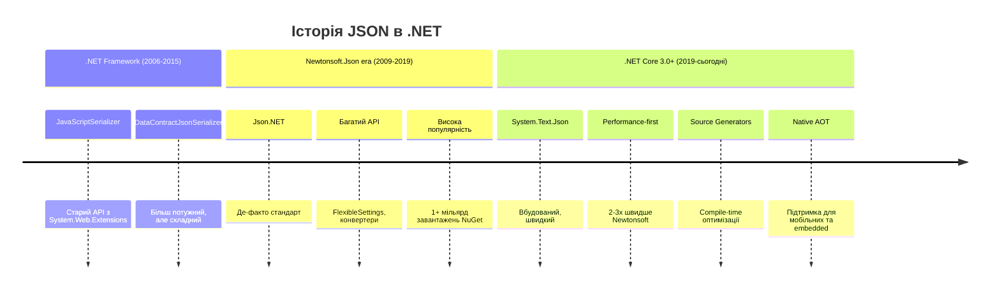

# 8.2.1. JSON Serialization з System.Text.Json

## Вступ: Світ обміну даними

Уявіть, що ваш додаток потребує відправити дані на сервер, зберегти налаштування користувача у файл, або отримати інформацію з REST API. Як передати складний об'єкт C# через мережу? Як зберегти його на диск так, щоб інші системи (можливо, написані на Python чи JavaScript) могли його прочитати? Відповідь — **серіалізація (Serialization)**.

**Серіалізація** — це процес перетворення об'єкта з пам'яті у формат, придатний для передачі або зберігання (наприклад, рядок, масив байтів). **Десеріалізація** — зворотний процес: відновлення об'єкта з серіалізованих даних.

### Навіщо потрібна серіалізація?

::card-group
::card{title="🌐 API та веб-сервіси"}
REST API обмінюються даними у JSON форматі. Серіалізація дозволяє перетворити C# об'єкти на JSON та назад.
::

::card{title="💾 Збереження стану"}
Конфігурації, налаштування, кеш, збереження ігор — все це зберігається через серіалізацію.
::

::card{title="📡 Міжпроцесна комунікація"}
Обмін даними між додатками, мікросервісами, або між клієнтом і сервером.
::

::card{title="📝 Логування"}
Structured logging (наприклад, у Elasticsearch) використовує JSON для зберігання логів з метаданими.
::
::

### JSON: Універсальний формат даних

**JSON (JavaScript Object Notation)** — це текстовий формат для представлення структурованих даних. Він:

- **Читабельний людиною** (на відміну від бінарних форматів)
- **Незалежний від мови** (підтримується всіма сучасними мовами програмування)
- **Компактний** (порівняно з XML)
- **Стандартизований** (RFC 8259)

**Приклад JSON:**

```json
{
    "name": "Артем",
    "age": 25,
    "isStudent": true,
    "skills": ["C#", "JavaScript", "SQL"],
    "address": {
        "city": "Київ",
        "zipCode": "01001"
    }
}
```

::note
**Передумови**: Для комфортного засвоєння матеріалу потрібне знання основ C# (класи, властивості, колекції), generics, async/await, та базовий досвід роботи з JSON.
::

---

## Еволюція JSON серіалізації в .NET

::mermaid



::

### System.Text.Json vs Newtonsoft.Json

| Критерій              | System.Text.Json        | Newtonsoft.Json (Json.NET) |
| :-------------------- | :---------------------- | :------------------------- |
| **Швидкість**         | ⚡ Швидше (2-3x)        | Повільніше                 |
| **Пам'ять**           | Менше алокацій          | Більше алокацій            |
| **Функціональність**  | Базова (зростає)        | Дуже багата                |
| **Вбудований**        | ✅ Так (.NET Core 3.0+) | ❌ Ні (NuGet)              |
| **Source Generators** | ✅ Так                  | ❌ Ні                      |
| **AOT Compilation**   | ✅ Підтримка            | ⚠️ Обмежена                |
| **Підтримка legacy**  | Тільки .NET Core 3.0+   | Всі версії .NET            |

::tip
**Рекомендація**: Для нових проєктів на .NET 5+ використовуйте `System.Text.Json`. Для legacy проєктів або якщо потрібні специфічні фічі (наприклад, LINQ to JSON) — `Newtonsoft.Json`.
::

---

## Основи JsonSerializer

`JsonSerializer` — це головний клас для роботи з JSON у .NET. Він надає статичні методи для серіалізації та десеріалізації.

### Базова серіалізація та десеріалізація

```csharp showLineNumbers
using System;
using System.Text.Json;

class Person
{
    public string Name { get; set; }
    public int Age { get; set; }
    public bool IsStudent { get; set; }
}

class JsonBasics
{
    static void Main()
    {
        // Створюємо об'єкт
        var person = new Person
        {
            Name = "Олена",
            Age = 28,
            IsStudent = false
        };

        // СЕРІАЛІЗАЦІЯ: Об'єкт → JSON рядок
        string jsonString = JsonSerializer.Serialize(person);
        Console.WriteLine("=== СЕРІАЛІЗАЦІЯ ===");
        Console.WriteLine(jsonString);
        // Вивід: {"Name":"Олена","Age":28,"IsStudent":false}

        // ДЕСЕРІАЛІЗАЦІЯ: JSON рядок → Об'єкт
        string jsonInput = "{\"Name\":\"Ігор\",\"Age\":35,\"IsStudent\":true}";
        Person deserializedPerson = JsonSerializer.Deserialize<Person>(jsonInput);

        Console.WriteLine("\n=== ДЕСЕРІАЛІЗАЦІЯ ===");
        Console.WriteLine($"Ім'я: {deserializedPerson.Name}");
        Console.WriteLine($"Вік: {deserializedPerson.Age}");
        Console.WriteLine($"Студент: {deserializedPerson.IsStudent}");
    }
}
```

**Розбір коду:**

- **Рядок 24**: `JsonSerializer.Serialize(object)` перетворює об'єкт у JSON рядок.
- **Рядок 31**: `JsonSerializer.Deserialize<T>(string)` створює об'єкт типу `T` з JSON рядка.
- **Важливо**: Назви властивостей в JSON мають відповідати назвам властивостей у класі (за замовчуванням case-sensitive!).

### Форматований вивід (Pretty Print)

За замовчуванням JSON генерується у компактному форматі. Для читабельності можна використати `JsonSerializerOptions`:

```csharp showLineNumbers
using System;
using System.Text.Json;

class PrettyPrintDemo
{
    static void Main()
    {
        var person = new Person { Name = "Марія", Age = 22, IsStudent = true };

        var options = new JsonSerializerOptions
        {
            WriteIndented = true  // Увімкнути форматування
        };

        string json = JsonSerializer.Serialize(person, options);
        Console.WriteLine(json);

        /* Вивід:
        {
          "Name": "Марія",
          "Age": 22,
          "IsStudent": true
        }
        */
    }
}
```

**Розбір коду:**

- **Рядок 12**: `WriteIndented = true` додає відступи та нові рядки для читабельності.
- **Використання**: Корисно для конфігураційних файлів, debugging, API responses для розробників.

::warning
**Продуктивність**: `WriteIndented = true` збільшує розмір JSON на 20-30% та трохи повільніше. Не використовуйте для production API responses, де кожен байт важливий.
::

---

## JsonSerializerOptions: Налаштування серіалізації

`JsonSerializerOptions` дозволяє тонко налаштувати поведінку серіалізації.

### Основні опції

::field-group
::field{name="PropertyNamingPolicy" type="JsonNamingPolicy"}
Політика найменування властивостей. Значення: `null` (як є), `JsonNamingPolicy.CamelCase`, `JsonNamingPolicy.SnakeCaseLower` (.NET 8+).
::

::field{name="PropertyNameCaseInsensitive" type="bool"}
Ігнорувати регістр при десеріалізації. За замовчуванням `false`.
::

::field{name="DefaultIgnoreCondition" type="JsonIgnoreCondition"}
Коли ігнорувати властивості: `Never`, `WhenWritingNull`, `WhenWritingDefault`, `Always`.
::

::field{name="WriteIndented" type="bool"}
Форматований вивід (pretty print). За замовчуванням `false`.
::

::field{name="NumberHandling" type="JsonNumberHandling"}
Обробка чисел: дозволити читання з рядків, писати як рядки тощо.
::

::field{name="ReferenceHandler" type="ReferenceHandler"}
Обробка циклічних посилань: `null`, `Preserve`, `IgnoreCycles`.
::

::field{name="Encoder" type="JavaScriptEncoder"}
Кодування спеціальних символів. За замовчуванням `JavaScriptEncoder.UnsafeRelaxedJsonEscaping`.
::

::field{name="Converters" type="IList<JsonConverter>"}
Список custom конвертерів для специфічних типів.
::
::

### Приклад: camelCase naming policy

У JavaScript прийнято використовувати `camelCase` для назв властивостей, а в C# — `PascalCase`. `JsonNamingPolicy.CamelCase` автоматично конвертує:

```csharp showLineNumbers
using System;
using System.Text.Json;

class Employee
{
    public string FirstName { get; set; }
    public string LastName { get; set; }
    public int EmployeeId { get; set; }
}

class NamingPolicyDemo
{
    static void Main()
    {
        var employee = new Employee
        {
            FirstName = "Андрій",
            LastName = "Коваленко",
            EmployeeId = 12345
        };

        var options = new JsonSerializerOptions
        {
            PropertyNamingPolicy = JsonNamingPolicy.CamelCase,
            WriteIndented = true
        };

        string json = JsonSerializer.Serialize(employee, options);
        Console.WriteLine(json);

        /* Вивід:
        {
          "firstName": "Андрій",
          "lastName": "Коваленко",
          "employeeId": 12345
        }
        */

        // Десеріалізація також працює з camelCase
        string jsonInput = "{\"firstName\":\"Олег\",\"lastName\":\"Шевченко\",\"employeeId\":54321}";
        var deserialized = JsonSerializer.Deserialize<Employee>(jsonInput, options);
        Console.WriteLine($"\nІм'я: {deserialized.FirstName} {deserialized.LastName}");
    }
}
```

**Розбір коду:**

- **Рядок 24**: `JsonNamingPolicy.CamelCase` автоматично перетворює `FirstName` → `firstName`.
- **Рядок 41**: При десеріалізації також потрібно передати `options`, щоб правильно mapped camelCase назви.

::tip
**.NET 8+ Snake Case**: У .NET 8 додали `JsonNamingPolicy.SnakeCaseLower` та `SnakeCaseUpper` для конвертації у `snake_case` (популярно у Python та базах даних).
::

### Приклад: Ігнорування null значень

```csharp showLineNumbers
using System;
using System.Text.Json;
using System.Text.Json.Serialization;

class Product
{
    public string Name { get; set; }
    public decimal Price { get; set; }
    public string Description { get; set; }  // Може бути null
    public string Category { get; set; }      // Може бути null
}

class IgnoreNullDemo
{
    static void Main()
    {
        var product = new Product
        {
            Name = "Ноутбук",
            Price = 25000,
            Description = null,  // null
            Category = null      // null
        };

        // За замовчуванням null серіалізується
        var defaultJson = JsonSerializer.Serialize(product, new JsonSerializerOptions { WriteIndented = true });
        Console.WriteLine("=== ЗА ЗАМОВЧУВАННЯМ ===");
        Console.WriteLine(defaultJson);
        // Вивід містить: "Description": null, "Category": null

        // Ігноруємо null значення
        var options = new JsonSerializerOptions
        {
            DefaultIgnoreCondition = JsonIgnoreCondition.WhenWritingNull,
            WriteIndented = true
        };

        var optimizedJson = JsonSerializer.Serialize(product, options);
        Console.WriteLine("\n=== БЕЗ NULL ===");
        Console.WriteLine(optimizedJson);
        // Вивід НЕ містить полів з null
    }
}
```

**Розбір коду:**

- **Рядок 34**: `JsonIgnoreCondition.WhenWritingNull` пропускає властивості з значенням `null`.
- **Переваги**: Менший розмір JSON (критично для мобільних додатків та API), чистіший вивід.
- **Альтернатива**: `WhenWritingDefault` ігнорує також дефолтні значення (`0`, `false`, порожню колекцію).

---

## Атрибути серіалізації

Атрибути дозволяють точно контролювати, як властивості класу серіалізуються, без зміни глобальних `JsonSerializerOptions`.

### [JsonPropertyName]: Перейменування властивостей

Використовується, коли назва властивості в C# не відповідає назві в JSON (наприклад, API використовує snake_case).

```csharp showLineNumbers
using System;
using System.Text.Json;
using System.Text.Json.Serialization;

class User
{
    [JsonPropertyName("user_id")]
    public int UserId { get; set; }

    [JsonPropertyName("full_name")]
    public string FullName { get; set; }

    [JsonPropertyName("email_address")]
    public string EmailAddress { get; set; }
}

class JsonPropertyNameDemo
{
    static void Main()
    {
        var user = new User
        {
            UserId = 101,
            FullName = "Катерина Бондаренко",
            EmailAddress = "kateryna@example.com"
        };

        string json = JsonSerializer.Serialize(user, new JsonSerializerOptions { WriteIndented = true });
        Console.WriteLine(json);

        /* Вивід:
        {
          "user_id": 101,
          "full_name": "Катерина Бондаренко",
          "email_address": "kateryna@example.com"
        }
        */

        // Десеріалізація з JSON з іншими назвами
        string jsonInput = @"
        {
            ""user_id"": 202,
            ""full_name"": ""Дмитро Петренко"",
            ""email_address"": ""dmytro@example.com""
        }";

        var deserialized = JsonSerializer.Deserialize<User>(jsonInput);
        Console.WriteLine($"\nUser ID: {deserialized.UserId}");
        Console.WriteLine($"Ім'я: {deserialized.FullName}");
    }
}
```

**Розбір коду:**

- **Рядки 7, 10, 13**: `[JsonPropertyName("...")]` вказує точну назву у JSON.
- **Використання**: Робота з legacy API, інтеграція з Python/Ruby (де прийнято snake_case).

::note
**Records та атрибути**: Для positional records використовуйте `[property: JsonPropertyName("...")]`:

```csharp
public record Person(
    [property: JsonPropertyName("first_name")] string FirstName,
    [property: JsonPropertyName("last_name")] string LastName
);
```

::

### [JsonIgnore]: Виключення властивостей

Деякі властивості не потрібно серіалізувати (наприклад, паролі, внутрішній стан, computed properties).

```csharp showLineNumbers
using System;
using System.Text.Json;
using System.Text.Json.Serialization;

class Account
{
    public string Username { get; set; }

    [JsonIgnore]
    public string Password { get; set; }  // НІКОЛИ не серіалізується!

    public string Email { get; set; }

    [JsonIgnore]
    public DateTime LastLoginTime { get; set; }  // Внутрішня метадата
}

class JsonIgnoreDemo
{
    static void Main()
    {
        var account = new Account
        {
            Username = "vasyl_ua",
            Password = "SuperSecret123!",
            Email = "vasyl@example.com",
            LastLoginTime = DateTime.Now
        };

        string json = JsonSerializer.Serialize(account, new JsonSerializerOptions { WriteIndented = true });
        Console.WriteLine(json);

        /* Вивід:
        {
          "Username": "vasyl_ua",
          "Email": "vasyl@example.com"
        }
        Password та LastLoginTime відсутні!
        */
    }
}
```

**Розбір коду:**

- **Рядки 9, 14**: `[JsonIgnore]` повністю виключає властивість з серіалізації та десеріалізації.
- **Security**: Критично важливо для паролів, токенів, приватних ключів.

::warning
**Безпека**: `[JsonIgnore]` НЕ шифрує дані! Якщо потрібно передавати конфіденційну інформацію, використовуйте HTTPS/TLS та додаткове шифрування.
::

### [JsonInclude]: Серіалізація приватних полів

За замовчуванням серіалізуються тільки public властивості. `[JsonInclude]` дозволяє серіалізувати приватні поля або властивості:

```csharp showLineNumbers
using System;
using System.Text.Json;
using System.Text.Json.Serialization;

class BankAccount
{
    public string AccountNumber { get; set; }

    [JsonInclude]
    private decimal _balance;  // Приватне поле

    public BankAccount(string accountNumber, decimal initialBalance)
    {
        AccountNumber = accountNumber;
        _balance = initialBalance;
    }

    public decimal GetBalance() => _balance;
}

class JsonIncludeDemo
{
    static void Main()
    {
        var account = new BankAccount("UA123456789", 1500.50m);

        var options = new JsonSerializerOptions
        {
            WriteIndented = true,
            IncludeFields = true  // Обов'язково для полів!
        };

        string json = JsonSerializer.Serialize(account, options);
        Console.WriteLine(json);

        /* Вивід:
        {
          "AccountNumber": "UA123456789",
          "_balance": 1500.5
        }
        */
    }
}
```

**Розбір коду:**

- **Рядок 9**: `[JsonInclude]` дозволяє серіалізувати приватне поле `_balance`.
- **Рядок 30**: `IncludeFields = true` **обов'язково** у `JsonSerializerOptions`!

::tip
**Use case**: Immutable об'єкти з `readonly` полями, де немає публічних setters.
::

### [JsonConstructor]: Вибір конструктора для десеріалізації

Якщо клас має кілька конструкторів, використовуйте `[JsonConstructor]` для вказівки правильного:

```csharp showLineNumbers
using System;
using System.Text.Json;
using System.Text.Json.Serialization;

class Rectangle
{
    public int Width { get; }
    public int Height { get; }

    // Конструктор за замовчуванням
    public Rectangle()
    {
        Width = 0;
        Height = 0;
    }

    // Конструктор для десеріалізації
    [JsonConstructor]
    public Rectangle(int width, int height)
    {
        Width = width;
        Height = height;
    }
}

class JsonConstructorDemo
{
    static void Main()
    {
        string json = "{\"Width\":100,\"Height\":50}";

        var rectangle = JsonSerializer.Deserialize<Rectangle>(json);
        Console.WriteLine($"Розміри: {rectangle.Width} x {rectangle.Height}");
        // Вивід: Розміри: 100 x 50
    }
}
```

**Розбір коду:**

- **Рядок 18**: `[JsonConstructor]` вказує, що цей конструктор використовується для десеріалізації.
- **Важливо**: Назви параметрів конструктора мають відповідати назвам властивостей (case-insensitive за замовчуванням).

### [JsonExtensionData]: Додаткові дані

Зберігає невідомі властивості з JSON у словник:

```csharp showLineNumbers
using System;
using System.Collections.Generic;
using System.Text.Json;
using System.Text.Json.Serialization;

class Config
{
    public string AppName { get; set; }
    public int Version { get; set; }

    [JsonExtensionData]
    public Dictionary<string, object> AdditionalData { get; set; }
}

class JsonExtensionDataDemo
{
    static void Main()
    {
        string json = @"
        {
            ""AppName"": ""MyApp"",
            ""Version"": 2,
            ""Theme"": ""dark"",
            ""Language"": ""uk"",
            ""CustomSetting"": 42
        }";

        var config = JsonSerializer.Deserialize<Config>(json);

        Console.WriteLine($"AppName: {config.AppName}");
        Console.WriteLine($"Version: {config.Version}");
        Console.WriteLine("\nДодаткові дані:");

        foreach (var kvp in config.AdditionalData)
        {
            Console.WriteLine($"  {kvp.Key}: {kvp.Value}");
        }

        // Серіалізація назад включить всі дані
        string serialized = JsonSerializer.Serialize(config, new JsonSerializerOptions { WriteIndented = true });
        Console.WriteLine("\n=== СЕРІАЛІЗОВАНО НАЗАД ===");
        Console.WriteLine(serialized);
    }
}
```

**Розбір коду:**

- **Рядок 11**: `[JsonExtensionData]` вказує словник для невідомих властивостей.
- **Рядки 23-25**: `Theme`, `Language`, `CustomSetting` не мають відповідних властивостей у класі.
- **Результат**: Ці властивості зберігаються у `AdditionalData` і серіалізуються назад.

**Використання:**版本ування API (нові поля не ламають старий код), плагінні системи, динамічні конфігурації.

---

## Custom Converters: Повний контроль

Іноді вбудованої логіки недостатньо. Наприклад, потрібно серіалізувати `DateTime` у спеціальному форматі, або конвертувати enum у custom рядки. Для цього використовуються **JsonConverter**.

### Базовий приклад: Custom DateTime формат

```csharp showLineNumbers
using System;
using System.Text.Json;
using System.Text.Json.Serialization;

// Custom конвертер для DateTime
class CustomDateTimeConverter : JsonConverter<DateTime>
{
    private const string DateFormat = "dd.MM.yyyy HH:mm";

    public override DateTime Read(ref Utf8JsonReader reader, Type typeToConvert, JsonSerializerOptions options)
    {
        string dateString = reader.GetString();
        return DateTime.ParseExact(dateString, DateFormat, null);
    }

    public override void Write(Utf8JsonWriter writer, DateTime value, JsonSerializerOptions options)
    {
        writer.WriteStringValue(value.ToString(DateFormat));
    }
}

class Event
{
    public string Title { get; set; }

    [JsonConverter(typeof(CustomDateTimeConverter))]
    public DateTime EventDate { get; set; }
}

class CustomConverterDemo
{
    static void Main()
    {
        var event1 = new Event
        {
            Title = "Конференція .NET",
            EventDate = new DateTime(2026, 3, 15, 10, 30, 0)
        };

        string json = JsonSerializer.Serialize(event1, new JsonSerializerOptions { WriteIndented = true });
        Console.WriteLine(json);

        /* Вивід:
        {
          "Title": "Конференція .NET",
          "EventDate": "15.03.2026 10:30"
        }
        */

        // Десеріалізація
        string jsonInput = @"{""Title"": ""Семінар C#"", ""EventDate"": ""20.04.2026 14:00""}";
        var event2 = JsonSerializer.Deserialize<Event>(jsonInput);
        Console.WriteLine($"\n{event2.Title} - {event2.EventDate}");
    }
}
```

**Розбір коду:**

- **Рядок 6**: Успадковуємо `JsonConverter<DateTime>`.
- **Рядок 10**: `Read()` — логіка десеріалізації (JSON → об'єкт).
- **Рядок 16**: `Write()` — логіка серіалізації (об'єкт → JSON).
- **Рядок 26**: `[JsonConverter(typeof(...))]` застосовує конвертер до властивості.

### Приклад: Enum з custom значеннями

```csharp showLineNumbers
using System;
using System.Text.Json;
using System.Text.Json.Serialization;

enum OrderStatus
{
    Pending,
    Processing,
    Shipped,
    Delivered,
    Cancelled
}

// Конвертер для OrderStatus
class OrderStatusConverter : JsonConverter<OrderStatus>
{
    public override OrderStatus Read(ref Utf8JsonReader reader, Type typeToConvert, JsonSerializerOptions options)
    {
        string value = reader.GetString();
        return value switch
        {
            "pending" => OrderStatus.Pending,
            "processing" => OrderStatus.Processing,
            "shipped" => OrderStatus.Shipped,
            "delivered" => OrderStatus.Delivered,
            "cancelled" => OrderStatus.Cancelled,
            _ => throw new JsonException($"Unknown status: {value}")
        };
    }

    public override void Write(Utf8JsonWriter writer, OrderStatus value, JsonSerializerOptions options)
    {
        string status = value switch
        {
            OrderStatus.Pending => "pending",
            OrderStatus.Processing => "processing",
            OrderStatus.Shipped => "shipped",
            OrderStatus.Delivered => "delivered",
            OrderStatus.Cancelled => "cancelled",
            _ => throw new JsonException($"Unknown enum: {value}")
        };
        writer.WriteStringValue(status);
    }
}

class Order
{
    public int OrderId { get; set; }

    [JsonConverter(typeof(OrderStatusConverter))]
    public OrderStatus Status { get; set; }
}

class EnumConverterDemo
{
    static void Main()
    {
        var order = new Order { OrderId = 12345, Status = OrderStatus.Shipped };

        string json = JsonSerializer.Serialize(order);
        Console.WriteLine(json);
        // Вивід: {"OrderId":12345,"Status":"shipped"}

        string jsonInput = @"{""OrderId"":67890,""Status"":""delivered""}";
        var deserialized = JsonSerializer.Deserialize<Order>(jsonInput);
        Console.WriteLine($"Замовлення #{deserialized.OrderId}: {deserialized.Status}");
    }
}
```

**Розбір коду:**

- **Рядок 20**: `switch` expression для mapping рядків на enum.
- **Рядок 33**: Зворотній mapping для серіалізації.
- **Переваги**: API отримує lowercase статуси замість `"Shipped"` (більш RESTful).

::tip
**Альтернатива**: Для простих enum використовуйте `JsonStringEnumConverter`:

```csharp
[JsonConverter(typeof(JsonStringEnumConverter))]
public OrderStatus Status { get; set; }
```

Це серіалізує enum як рядок (`"Shipped"`), але без кастомізації lowercase.
::

### JsonConverterFactory: Конвертер для generic типів

Для складних сценаріїв (наприклад, конвертер для всіх `List<T>`) використовуйте `JsonConverterFactory`.

```csharp showLineNumbers
using System;
using System.Collections.Generic;
using System.Text.Json;
using System.Text.Json.Serialization;

// Фабрика конвертерів для List<T>, яка серіалізує тільки перші 3 елементи
class TruncatedListConverterFactory : JsonConverterFactory
{
    public override bool CanConvert(Type typeToConvert)
    {
        return typeToConvert.IsGenericType &&
               typeToConvert.GetGenericTypeDefinition() == typeof(List<>);
    }

    public override JsonConverter CreateConverter(Type typeToConvert, JsonSerializerOptions options)
    {
        Type elementType = typeToConvert.GetGenericArguments()[0];
        Type converterType = typeof(TruncatedListConverter<>).MakeGenericType(elementType);
        return (JsonConverter)Activator.CreateInstance(converterType);
    }
}

class TruncatedListConverter<T> : JsonConverter<List<T>>
{
    public override List<T> Read(ref Utf8JsonReader reader, Type typeToConvert, JsonSerializerOptions options)
    {
        return JsonSerializer.Deserialize<List<T>>(ref reader, options);
    }

    public override void Write(Utf8JsonWriter writer, List<T> value, JsonSerializerOptions options)
    {
        writer.WriteStartArray();

        int count = Math.Min(3, value.Count);  // Тільки перші 3
        for (int i = 0; i < count; i++)
        {
            JsonSerializer.Serialize(writer, value[i], options);
        }

        if (value.Count > 3)
        {
            writer.WriteStringValue($"... та ще {value.Count - 3}");
        }

        writer.WriteEndArray();
    }
}

class Product
{
    public string Name { get; set; }

    [JsonConverter(typeof(TruncatedListConverterFactory))]
    public List<string> Tags { get; set; }
}

class FactoryDemo
{
    static void Main()
    {
        var product = new Product
        {
            Name = "Смартфон",
            Tags = new List<string> { "electronics", "mobile", "android", "5G", "camera" }
        };

        string json = JsonSerializer.Serialize(product, new JsonSerializerOptions { WriteIndented = true });
        Console.WriteLine(json);

        /* Вивід:
        {
          "Name": "Смартфон",
          "Tags": [
            "electronics",
            "mobile",
            "android",
            "... та ще 2"
          ]
        }
        */
    }
}
```

**Розбір коду:**

- **Рядок 9**: `CanConvert()` перевіряє, чи може фабрика обробити тип.
- **Рядок 15**: `CreateConverter()` створює конкретний конвертер для `List<T>`.
- **Рядок 30**: Логіка серіалізації тільки перших 3 елементів.
- **Використання**: Logging (скорочення великих масивів), preview у UI.

---

## Source Generators: Compile-Time оптимізація

**Source Generators** — це нова технологія .NET, яка генерує код серіалізації **під час компіляції** замість runtime reflection. Це дає:

- ⚡ **Швидкість**: 2-3x швидше через відсутність reflection
- 💾 **Менше пам'яті**: Менше алокацій
- 📱 **AOT Compilation**: Необхідно для Native AOT (iOS, Android, WebAssembly)
- 🔍 **Type Safety**: Помилки виявляються на етапі компіляції

### Базовий приклад

```csharp showLineNumbers
using System;
using System.Text.Json;
using System.Text.Json.Serialization;

// Модель даних
class WeatherForecast
{
    public DateTime Date { get; set; }
    public int TemperatureC { get; set; }
    public string Summary { get; set; }
}

// Контекст серіалізації (Source Generator)
[JsonSourceGenerationOptions(WriteIndented = true)]
[JsonSerializable(typeof(WeatherForecast))]
[JsonSerializable(typeof(WeatherForecast[]))]  // Для масивів
internal partial class AppJsonContext : JsonSerializerContext
{
}

class SourceGeneratorDemo
{
    static void Main()
    {
        var forecast = new WeatherForecast
        {
            Date = DateTime.Now,
            TemperatureC = 22,
            Summary = "Сонячно"
        };

        // Серіалізація з Source Generator контекстом
        string json = JsonSerializer.Serialize(forecast, AppJsonContext.Default.WeatherForecast);
        Console.WriteLine(json);

        // Десеріалізація
        var deserialized = JsonSerializer.Deserialize(json, AppJsonContext.Default.WeatherForecast);
        Console.WriteLine($"\nТемпература: {deserialized.TemperatureC}°C, {deserialized.Summary}");
    }
}
```

**Розбір коду:**

- **Рядок 14**: `[JsonSourceGenerationOptions]` задає параметри генерації.
- **Рядок 15-16**: `[JsonSerializable(typeof(...))]` вказує типи для генерації.
- **Рядок 17**: `partial class` дозволяє source generator додати код.
- **Рядок 33**: Використовуємо `AppJsonContext.Default.WeatherForecast` замість generics.

::note
**Як це працює?** Під час компіляції analyzer генерує C# код з конкретною логікою серіалізації для `WeatherForecast`, без reflection. Ви можете подивитися згенерований код у `obj/Debug/.../generated/`.
::

### Налаштування Source Generator

```csharp showLineNumbers
using System.Text.Json;
using System.Text.Json.Serialization;

[JsonSourceGenerationOptions(
    WriteIndented = true,
    PropertyNamingPolicy = JsonKnownNamingPolicy.CamelCase,
    DefaultIgnoreCondition = JsonIgnoreCondition.WhenWritingNull,
    GenerationMode = JsonSourceGenerationMode.Metadata | JsonSourceGenerationMode.Serialization
)]
[JsonSerializable(typeof(User))]
[JsonSerializable(typeof(Product))]
internal partial class MyAppContext : JsonSerializerContext
{
}

class User
{
    public int Id { get; set; }
    public string Name { get; set; }
}

class Product
{
    public string Title { get; set; }
    public decimal Price { get; set; }
}
```

**Опції:**

- **PropertyNamingPolicy**: `CamelCase`, `SnakeCaseLower` (С# class `UserName` → JSON `userName`)
- **GenerationMode**:
    - `Metadata` — тільки метадані (менший розмір)
    - `Serialization` — повна логіка серіалізації (швидше)
    - Обидва — універсальність

::tip
**Коли використовувати Source Generators?**

- Мобільні додатки (Xamarin, MAUI) — менший розмір APK/IPA
- AOT scenarios (iOS, WebAssembly)
- High-performance сервіси з мільйонами запитів
- Embedded systems з обмеженою пам'яттю

::

---

## Advanced Scenarios

### Polymorphic Serialization

Серіалізація ієрархії класів з визначенням типу:

```csharp showLineNumbers
using System;
using System.Text.Json;
using System.Text.Json.Serialization;

[JsonDerivedType(typeof(Dog), typeDiscriminator: "dog")]
[JsonDerivedType(typeof(Cat), typeDiscriminator: "cat")]
abstract class Animal
{
    public string Name { get; set; }
}

class Dog : Animal
{
    public string Breed { get; set; }
}

class Cat : Animal
{
    public int Lives { get; set; }
}

class PolymorphicDemo
{
    static void Main()
    {
        Animal[] animals = new Animal[]
        {
            new Dog { Name = "Рекс", Breed = "Німецька вівчарка" },
            new Cat { Name = "Мурчик", Lives = 9 }
        };

        var options = new JsonSerializerOptions { WriteIndented = true };
        string json = JsonSerializer.Serialize(animals, options);
        Console.WriteLine(json);

        /* Вивід:
        [
          {
            "$type": "dog",
            "Name": "Рекс",
            "Breed": "Німецька вівчарка"
          },
          {
            "$type": "cat",
            "Name": "Мурчик",
            "Lives": 9
          }
        ]
        */

        // Десеріалізація відновить правильні типи
        var deserialized = JsonSerializer.Deserialize<Animal[]>(json, options);
        foreach (var animal in deserialized)
        {
            Console.WriteLine($"{animal.GetType().Name}: {animal.Name}");
        }
    }
}
```

### Handling Циклічних Посилань

```csharp showLineNumbers
using System;
using System.Text.Json;
using System.Text.Json.Serialization;

class Person
{
    public string Name { get; set; }
    public Person BestFriend { get; set; }  // Може посилатися назад!
}

class CyclesDemo
{
    static void Main()
    {
        var alice = new Person { Name = "Alice" };
        var bob = new Person { Name = "Bob" };

        alice.BestFriend = bob;
        bob.BestFriend = alice;  // Циклічне посилання!

        var options = new JsonSerializerOptions
        {
            ReferenceHandler = ReferenceHandler.IgnoreCycles,  // Ігнорувати цикли
            WriteIndented = true
        };

        string json = JsonSerializer.Serialize(alice, options);
        Console.WriteLine(json);

        /* Вивід:
        {
          "Name": "Alice",
          "BestFriend": {
            "Name": "Bob",
            "BestFriend": null   ← Цикл перерваний
          }
        }
        */
    }
}
```

**Альтернатива**: `ReferenceHandler.Preserve` зберігає посилання через `$id` та `$ref` (JSON-LD стиль).

---

## Практичні завдання

::steps

### Завдання 1: API Client

Створіть клас `Book` з властивостями: `Title`, `Author`, `ISBN`, `PublishedDate`. Реалізуйте:

1. Серіалізацію у JSON з camelCase назвами.
2. Ігнорування `ISBN`, якщо воно null.
3. Custom конвертер для `PublishedDate` у форматі "YYYY-MM-DD".
4. Тест серіалізації/десеріалізації.

### Завдання 2: Configuration System

Створіть систему конфігурації додатку:

1. Клас `AppConfig` з вкладеними секціями (`DatabaseConfig`, `LoggingConfig`).
2. [JsonExtensionData] для невідомих налаштувань.
3. Збереження/завантаження з файлу `config.json`.
4. Обробка помилок десеріалізації (невалідний JSON).

### Завдання 3: Source Generator Performance Test

Створіть benchmark для порівняння:

1. Стандартна серіалізація (`JsonSerializer.Serialize<T>`).
2. Source generator (`AppJsonContext.Default.T`).
3. Виміряйте час для 10,000 об'єктів.
4. Виведіть різницю у швидкості.

::

---

## Резюме

::card-group
::card{title="JsonSerializer"}
Основний API для серіалізації/десеріалізації. `Serialize()` та `Deserialize<T>()` — ваші найкращі друзі.
::

::card{title="JsonSerializerOptions"}
Глобальні налаштування: naming policy, ignore conditions, formatування.
::

::card{title="Атрибути"}
`[JsonPropertyName]`, `[JsonIgnore]`, `[JsonInclude]`, `[JsonConstructor]` — точний контроль на рівні властивостей.
::

::card{title="Custom Converters"}
`JsonConverter<T>` для складної логіки. `JsonConverterFactory` для generic типів.
::

::card{title="Source Generators"}
Compile-time оптимізація для максимальної продуктивності та AOT сценаріїв.
::
::

::tip
**Наступний крок**: У наступному матеріалі розглянемо **XML Serialization** з `XmlSerializer` та **LINQ to XML** для роботи з XML документами.
::

---

## Посилання

- [System.Text.Json Overview](https://learn.microsoft.com/en-us/dotnet/standard/serialization/system-text-json/overview)
- [How to serialize and deserialize JSON](https://learn.microsoft.com/en-us/dotnet/standard/serialization/system-text-json/how-to)
- [Custom converters](https://learn.microsoft.com/en-us/dotnet/standard/serialization/system-text-json/converters-how-to)
- [Source generation](https://learn.microsoft.com/en-us/dotnet/standard/serialization/system-text-json/source-generation)
- [Migrate from Newtonsoft.Json](https://learn.microsoft.com/en-us/dotnet/standard/serialization/system-text-json/migrate-from-newtonsoft)
