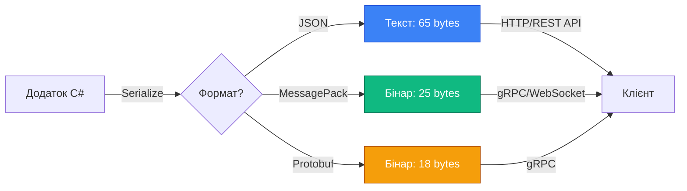
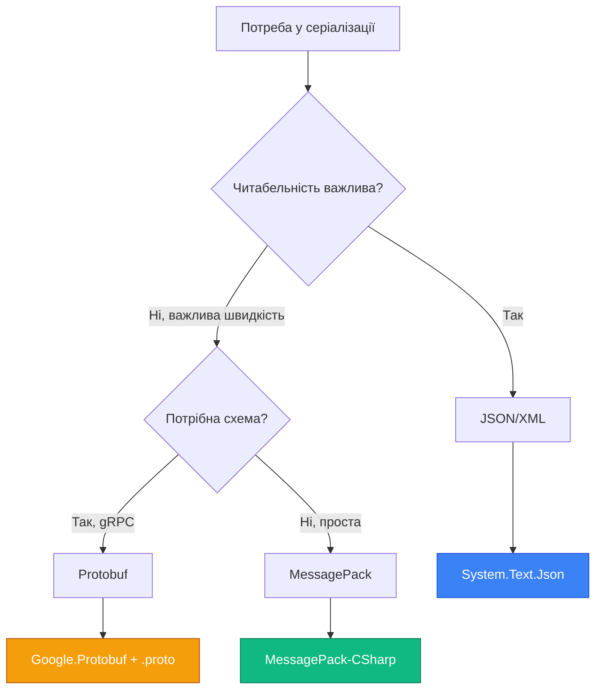

# 8.2.3. Binary Serialization: MessagePack та Protocol Buffers

## Вступ: Ефективність бінарних форматів

**JSON та XML** — це текстові формати, читабельні людиною. Але у високонавантажених системах (мікросервіси, IoT, ігри, фінансові системи) кожен байт та мілісекунда мають значення. **Бінарна серіалізація** вирішує ці проблеми:

::card-group
  ::card{title="📦 Компактність"}
  Розмір у 2-10 разів менший за JSON (критично для мобільних додатків, low-bandwidth мереж).
  ::
  
  ::card{title="⚡ Швидкість"}
  Парсинг у 3-5 разів швидший (менше CPU для серіалізації/десеріалізації).
  ::
  
  ::card{title="💾 Менше пам'яті"}
  Fewer allocations під час серіалізації (важливо для GC pressure у .NET).
  ::
  
  ::card{title="🔒 Версійність"}
  Protocol Buffers має вбудовану підтримку еволюції схем без breaking changes.
  ::
::

**Проблема BinaryFormatter:**

До .NET 5 існував `BinaryFormatter`, але він був **deprecated** через серйозні проблеми безпеки (deserializing untrusted data може виконати довільний код). Microsoft рекомендує сучасні альтернативи:

- **MessagePack** — швидкий, компактний, схожий на JSON
- **Protocol Buffers (Protobuf)** — схемний, строго типізований, від Google

::warning  
**BinaryFormatter заборонений!** Починаючи з .NET 5, `BinaryFormatter` видає попередження, а у .NET 8+ — викидає `PlatformNotSupportedException`. Не використовуйте його у новому коді!
::

::note
**Передумови**: Розуміння JSON серіалізації, NuGet пакетів, бінарних даних (`byte[]`), async/await.
::

---

## Порівняння форматів: JSON vs MessagePack vs Protobuf

Розглянемо приклад серіалізації об'єкта:

```csharp
class Person
{
    public int Id { get; set; } = 12345;
    public string Name { get; set; } = "Олександр";
    public int Age { get; set; } = 30;
    public bool IsActive { get; set; } = true;
}
```

| Формат | Розмір (байт) | Швидкість (відносна) | Читабельність |
| :--- | :---: | :---: | :---: |
| **JSON** | ~65 | 1x | ✅ Висока |
| **MessagePack** | ~25 | 3-4x швидше | ❌ Бінарний |
| **Protobuf** | ~18 | 4-5x швидше | ❌ Бінарний (але є .proto file) |
| **XML** | ~120 | 0.7x (повільніше) | ✅ Висока |

**Вивід:** Бінарні формати у 2-3 рази компактніші та у 3-5 разів швидші!

::mermaid

::

---

## MessagePack: Швидкий та простий

**MessagePack** — це ефективний бінарний формат, структурно схожий на JSON (підтримує об'єкти, масиви, примітиви), але у компактному binary вигляді.

### Встановлення

```bash
dotnet add package MessagePack
dotnet add package MessagePack.Annotations
```

### Базове використання

```csharp showLineNumbers
using System;
using MessagePack;

[MessagePackObject]  // Обов'язковий атрибут!
public class User
{
    [Key(0)]
    public int UserId { get; set; }
    
    [Key(1)]
    public string Username { get; set; }
    
    [Key(2)]
    public string Email { get; set; }
    
    [Key(3)]
    public bool IsVerified { get; set; }
}

class MessagePackBasics
{
    static void Main()
    {
        var user = new User
        {
            UserId = 42,
            Username = "vasyl_ua",
            Email = "vasyl@example.com",
            IsVerified = true
        };
        
        // СЕРІАЛІЗАЦІЯ
        byte[] bytes = MessagePackSerializer.Serialize(user);
        Console.WriteLine($"MessagePack size: {bytes.Length} bytes");
        
        // Для порівняння — JSON
        string json = System.Text.Json.JsonSerializer.Serialize(user);
        Console.WriteLine($"JSON size: {System.Text.Encoding.UTF8.GetByteCount(json)} bytes");
        
        // ДЕСЕРІАЛІЗАЦІЯ
        User deserialized = MessagePackSerializer.Deserialize<User>(bytes);
        Console.WriteLine($"\nUserId: {deserialized.UserId}");
        Console.WriteLine($"Username: {deserialized.Username}");
        Console.WriteLine($"Email: {deserialized.Email}");
        Console.WriteLine($"IsVerified: {deserialized.IsVerified}");
    }
}
```

**Вивід:**

```
MessagePack size: 52 bytes
JSON size: 86 bytes

UserId: 42
Username: vasyl_ua
Email: vasyl@example.com
IsVerified: True
```

**Розбір коду:**

- **Рядок 4**: `[MessagePackObject]` позначає клас для серіалізації.
- **Рядки 7, 10, 13, 16**: `[Key(N)]` вказує порядковий номер властивості (потрібно для ефективності).
- **Рядок 33**: `MessagePackSerializer.Serialize()` повертає `byte[]`.
- **Рядок 42**: `MessagePackSerializer.Deserialize<T>()` відновлює об'єкт з байтів.

::warning
**Обов'язкові атрибути!** Без `[Key(N)]` MessagePack викине виняток. Альтернатива — використати `[MessagePackObject(keyAsPropertyName: true)]` (повільніше, більший розмір).
::

### Key-as-PropertyName режим (без [Key])

```csharp showLineNumbers
[MessagePackObject(keyAsPropertyName: true)]
public class Product
{
    public int ProductId { get; set; }
    public string Name { get; set; }
    public decimal Price { get; set; }
}

// Використання АНАЛОГІЧНЕ
byte[] bytes = MessagePackSerializer.Serialize(product);
Product restored = MessagePackSerializer.Deserialize<Product>(bytes);
```

**Переваги:**
- ✅ Не потрібно вказувати `[Key(N)]`
- ✅ Зручніше для динамічних схем

**Недоліки:**
- ❌ Більший розмір (зберігаються назви властивостей)
- ❌ Повільніше (~10-15%)

::tip
**Рекомендація**: Для production використовуйте `[Key(N)]` режим. `keyAsPropertyName: true` — для прототипування.
::

---

## MessagePack: Advanced сценарії

### Ігнорування властивостей

```csharp showLineNumbers
[MessagePackObject]
public class Account
{
    [Key(0)]
    public string Username { get; set; }
    
    [IgnoreMember]  // НЕ серіалізується
    public string PasswordHash { get; set; }
    
    [Key(1)]
    public string Email { get; set; }
}
```

### Custom DateTime формат

```csharp showLineNumbers
using System;
using MessagePack;
using MessagePack.Formatters;

// Custom formatter для DateTime
public class CustomDateTimeFormatter : IMessagePackFormatter<DateTime>
{
    public void Serialize(ref MessagePackWriter writer, DateTime value, MessagePackSerializerOptions options)
    {
        // Зберігаємо як Unix timestamp (секунди з 1970-01-01)
        long unixTime = new DateTimeOffset(value).ToUnixTimeSeconds();
        writer.Write(unixTime);
    }
    
    public DateTime Deserialize(ref MessagePackReader reader, MessagePackSerializerOptions options)
    {
        long unixTime = reader.ReadInt64();
        return DateTimeOffset.FromUnixTimeSeconds(unixTime).DateTime;
    }
}

// Використання
var options = MessagePackSerializerOptions.Standard
    .WithResolver(MessagePack.Resolvers.CompositeResolver.Create(
        new IMessagePackFormatter[] { new CustomDateTimeFormatter() },
        new[] { MessagePack.Resolvers.StandardResolver.Instance }
    ));

byte[] bytes = MessagePackSerializer.Serialize(myObject, options);
```

### Збереження у файл

```csharp showLineNumbers
using System;
using System.IO;
using MessagePack;

class SaveToFileDemo
{
    static void Main()
    {
        var data = new UserList
        {
            Users = new[]
            {
                new User { UserId = 1, Username = "user1", Email = "user1@example.com", IsVerified = true },
                new User { UserId = 2, Username = "user2", Email = "user2@example.com", IsVerified = false }
            }
        };
        
        // Async серіалізація у файл
        await using (var file = File.Create("users.msgpack"))
        {
            await MessagePackSerializer.SerializeAsync(file, data);
        }
        
        // Async десеріалізація з файлу
        await using (var file = File.OpenRead("users.msgpack"))
        {
            var loaded = await MessagePackSerializer.DeserializeAsync<UserList>(file);
            Console.WriteLine($"Завантажено {loaded.Users.Length} користувачів");
        }
    }
}

[MessagePackObject]
public class UserList
{
    [Key(0)]
    public User[] Users { get; set; }
}
```

---

## Protocol Buffers (Protobuf): Схемна серіалізація

**Protocol Buffers** — це binary формат від Google, який використовується у gRPC. Головна відмінність від MessagePack — **обов'язкова схема (.proto файл)**.

### Чому Protobuf?

::card-group
  ::card{title="📋 Строга схема"}
  `.proto` файл визначає структуру даних — контракт між клієнтом та сервером.
  ::
  
  ::card{title="🔄 Backward/Forward compatibility"}
  Можна додавати нові поля без breaking changes (versioning).
  ::
  
  ::card{title="🌐 Кросплатформенність"}
  `.proto` → генерація коду для C#, Java, Python, Go, Rust тощо.
  ::
  
  ::card{title="🚀 gRPC"}
  Protobuf — стандарт для gRPC (високопродуктивні RPC виклики).
  ::
::

### Встановлення

```bash
dotnet add package Google.Protobuf
dotnet add package Grpc.Tools  # Для генерації C# коду з .proto
```

### Приклад: .proto схема

Створіть файл `person.proto`:

```protobuf
syntax = "proto3";

option csharp_namespace = "MyApp.Models";

message Person {
  int32 id = 1;
  string name = 2;
  int32 age = 3;
  bool is_active = 4;
  repeated string tags = 5;  // Масив рядків
}
```

**Пояснення:**

- `syntax = "proto3"` — версія Protobuf
- `csharp_namespace` — C# namespace для згенерованих класів
- `message Person` — визначення типу (аналог `class` у C#)
- `int32 id = 1` — поле типу int32 з номером 1 (номери важливі для backward compatibility!)
- `repeated string tags` — масив/колекція

### Генерація C# коду

Додайте у `.csproj`:

```xml
<ItemGroup>
  <Protobuf Include="Protos\person.proto" GrpcServices="None" />
</ItemGroup>
```

Під час build автоматично згенерується клас `Person` у `obj/Debug/.../Person.cs`.

### Використання

```csharp showLineNumbers
using System;
using System.IO;
using Google.Protobuf;
using MyApp.Models;  // Згенерований namespace

class ProtobufBasics
{
    static void Main()
    {
        // Створюємо об'єкт (згенерований клас)
        var person = new Person
        {
            Id = 12345,
            Name = "Андрій Коваленко",
            Age = 28,
            IsActive = true
        };
        person.Tags.Add("developer");
        person.Tags.Add("csharp");
        
        // СЕРІАЛІЗАЦІЯ у byte[]
        byte[] bytes = person.ToByteArray();
        Console.WriteLine($"Protobuf size: {bytes.Length} bytes");
        
        // ДЕСЕРІАЛІЗАЦІЯ з byte[]
        var deserialized = Person.Parser.ParseFrom(bytes);
        Console.WriteLine($"\nID: {deserialized.Id}");
        Console.WriteLine($"Name: {deserialized.Name}");
        Console.WriteLine($"Age: {deserialized.Age}");
        Console.WriteLine($"Tags: {string.Join(", ", deserialized.Tags)}");
        
        // Збереження у файл
        using (var output = File.Create("person.pb"))
        {
            person.WriteTo(output);
        }
        
        // Завантаження з файлу
        using (var input = File.OpenRead("person.pb"))
        {
            var loaded = Person.Parser.ParseFrom(input);
            Console.WriteLine($"\nЗавантажено: {loaded.Name}");
        }
    }
}
```

**Вивід:**

```
Protobuf size: 38 bytes

ID: 12345
Name: Андрій Коваленко
Age: 28
Tags: developer, csharp

Завантажено: Андрій Коваленко
```

**Розбір коду:**

- **Рядок 11**: Створюємо екземпляр згенерованого класу `Person`.
- **Рядок 22**: `ToByteArray()` — метод серіалізації (згенеровано автоматично).
- **Рядок 26**: `Person.Parser.ParseFrom()` — статичний parser для десеріалізації.
- **Рядок 33**: `WriteTo(Stream)` — запис у потік.

---

## Versioning у Protobuf

Головна перевага Protobuf — **еволюція схеми без breaking changes**.

### Початкова версія (v1)

```protobuf
message User {
  int32 id = 1;
  string name = 2;
}
```

### Нова версія (v2) — додаємо поле

```protobuf
message User {
  int32 id = 1;
  string name = 2;
  string email = 3;  // НОВЕ ПОЛЕ
}
```

**Що відбувається?**

- **Старий клієнт** (v1) десеріалізує v2 дані: він **ігнорує** поле `email` (бачить тільки `id` та `name`).
- **Новий клієнт** (v2) десеріалізує v1 дані: поле `email` буде порожнім рядком (дефолтне значення).

**Правила безпечної еволюції:**

1. ✅ **Додавання нових полів** — завжди безпечно
2. ✅ **Видалення полів** — позначте як `reserved` щоб номер не використовувався знову
3. ❌ **Зміна типу поля** — breaking change!
4. ❌ **Зміна номера поля** — breaking change!

**Приклад reserved:**

```protobuf
message User {
  reserved 4, 5;  // Номери більше не використовуються
  reserved "old_field_name";  // Назва зарезервована
  
  int32 id = 1;
  string name = 2;
  string email = 3;
}
```

---

## MessagePack vs Protobuf: Що вибрати?

| Критерій | MessagePack | Protocol Buffers |
| :--- | :--- | :--- |
| **Схема** | Опціональна (.cs класи) | Обов'язкова (.proto файли) |
| **Розмір** | Трохи більший | Найменший |
| **Швидкість** | Дуже швидко | Найшвидше |
| **Versioning** | Ручний контроль | Вбудована підтримка |
| **Кросплатформенність** | C#, JavaScript, Ruby, etc | Усі популярні мови |
| **Складність** | Низька | Середня (треба вчити .proto) |
| **gRPC** | Не підтримується | ✅ Стандарт |
| **Best for** | Внутрішні мікросервіси, cache | Public APIs, gRPC, IoT |

::tip
**Рекомендації:**
- **MessagePack**: Швидкий кеш, внутрішні мікросервіси .NET, ігрові сервери.
- **Protobuf**: gRPC APIs, кросплатформенна інтеграція, системи з строгою версійністю.
::

---

## Приклад з реального світу: Кешування

```csharp showLineNumbers
using System;
using System.IO;
using System.Threading.Tasks;
using MessagePack;

[MessagePackObject]
public class CacheEntry<T>
{
    [Key(0)]
    public T Data { get; set; }
    
    [Key(1)]
    public DateTime ExpiresAt { get; set; }
    
    [Key(2)]
    public string Version { get; set; }
}

public class MessagePackCache
{
    private readonly string _cacheDir = "cache";
    
    public MessagePackCache()
    {
        Directory.CreateDirectory(_cacheDir);
    }
    
    public async Task SetAsync<T>(string key, T value, TimeSpan ttl)
    {
        var entry = new CacheEntry<T>
        {
            Data = value,
            ExpiresAt = DateTime.UtcNow.Add(ttl),
            Version = "1.0"
        };
        
        string filePath = Path.Combine(_cacheDir, $"{key}.msgpack");
        await using var file = File.Create(filePath);
        await MessagePackSerializer.SerializeAsync(file, entry);
    }
    
    public async Task<T> GetAsync<T>(string key)
    {
        string filePath = Path.Combine(_cacheDir, $"{key}.msgpack");
        
        if (!File.Exists(filePath))
            return default;
        
        await using var file = File.OpenRead(filePath);
        var entry = await MessagePackSerializer.DeserializeAsync<CacheEntry<T>>(file);
        
        // Перевіряємо TTL
        if (entry.ExpiresAt < DateTime.UtcNow)
        {
            File.Delete(filePath);  // Видаляємо протермінований кеш
            return default;
        }
        
        return entry.Data;
    }
}

// Використання
class CacheDemo
{
    static async Task Main()
    {
        var cache = new MessagePackCache();
        
        // Зберігаємо дані
        var userData = new { UserId = 123, Name = "Олена", Role = "Admin" };
        await cache.SetAsync("user_123", userData, TimeSpan.FromMinutes(5));
        
        Console.WriteLine("Дані збережено у кеш");
        
        // Завантажуємо через 1 секунду
        await Task.Delay(1000);
        var cached = await cache.GetAsync<dynamic>("user_123");
        
        if (cached != null)
        {
            Console.WriteLine($"З кешу: {cached.Name}, Role: {cached.Role}");
        }
    }
}
```

**Переваги MessagePack для кешу:**

- 🚀 Швидка серіалізація/десеріалізація (критично для high-throughput)
- 💾 Малий розмір (економія диску/пам'яті)
- 🔧 Просто у використанні (не потрібні .proto файли)

---

## Практичні завдання

::steps

### Завдання 1: Performance Benchmark

Створіть benchmark для порівняння:
1. JSON (System.Text.Json)
2. MessagePack
3. Protobuf

Виміряйте для 10,000 об'єктів:
- Час серіалізації
- Час десеріалізації
- Розмір у байтах

Побудуйте таблицю з результатами.

### Завдання 2: gRPC Service з Protobuf

Створіть простий gRPC сервіс:
1. Визначте `.proto` схему для `UserService` з методом `GetUser(id)`.
2. Згенеруйте C# код.
3. Реалізуйте сервер та клієнт.
4. Протестуйте передачу даних через Protobuf.

### Завдання 3: Distributed Cache з MessagePack

Реалізуйте розподілений кеш:
1. Використайте Redis або власну in-memory реалізацію.
2. Серіалізуйте дані через MessagePack перед збереженням.
3. Додайте TTL (Time-To-Live).
4. Напишіть тести для перевірки швидкості.

::

---

## Резюме

::card-group
  ::card{title="MessagePack"}
  Швидкий бінарний формат без обов'язкової схеми. Ідеально для внутрішніх систем .NET.
  ::
  
  ::card{title="Protocol Buffers"}
  Схемний бінарний формат з вбудованою версійністю. Стандарт для gRPC та кросплатформенних APIs.
  ::
  
  ::card{title="Переваги"}
  2-10x менший розмір, 3-5x швидша серіалізація порівняно з JSON.
  ::
  
  ::card{title="Use Cases"}
  Мікросервіси, gRPC, IoT, ігрові сервери, high-performance кеші.
  ::
::

::mermaid

::

---

## Посилання

- [MessagePack for C#](https://github.com/MessagePack-CSharp/MessagePack-CSharp)
- [Protocol Buffers - Google](https://protobuf.dev/)
- [Google.Protobuf NuGet](https://www.nuget.org/packages/Google.Protobuf/)
- [gRPC for .NET](https://learn.microsoft.com/en-us/aspnet/core/grpc/)
- [BinaryFormatter Security Guide](https://learn.microsoft.com/en-us/dotnet/standard/serialization/binaryformatter-security-guide)
