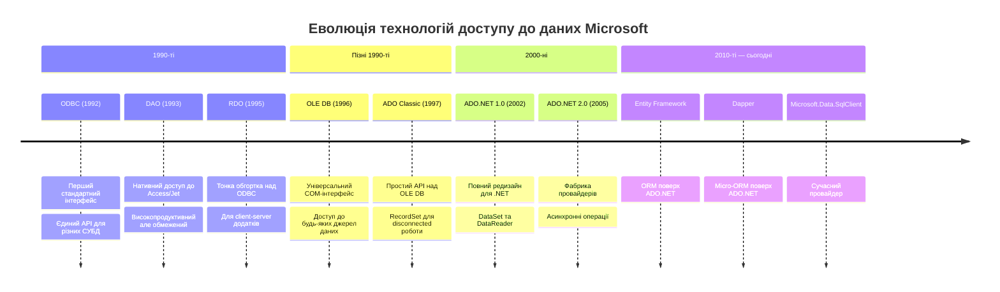
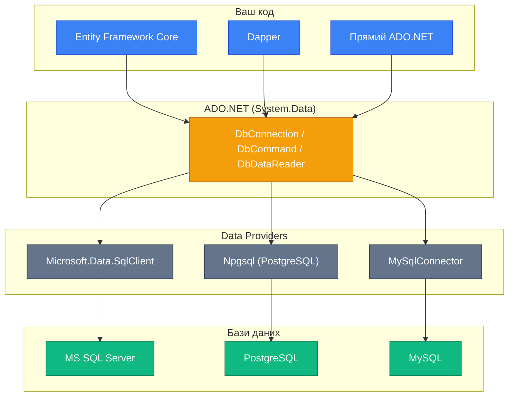
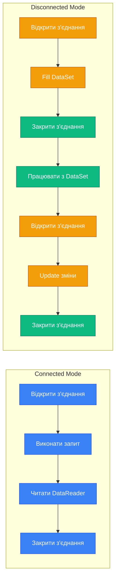
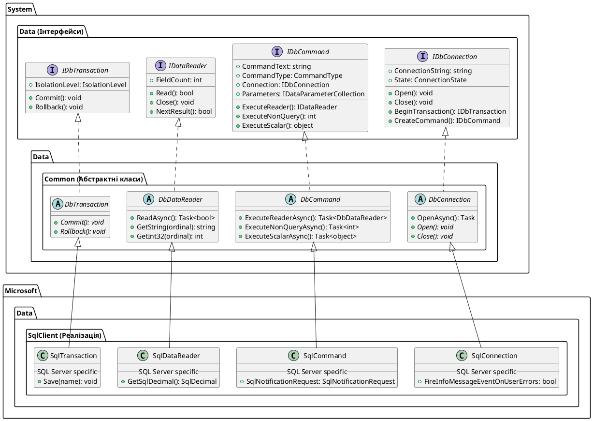
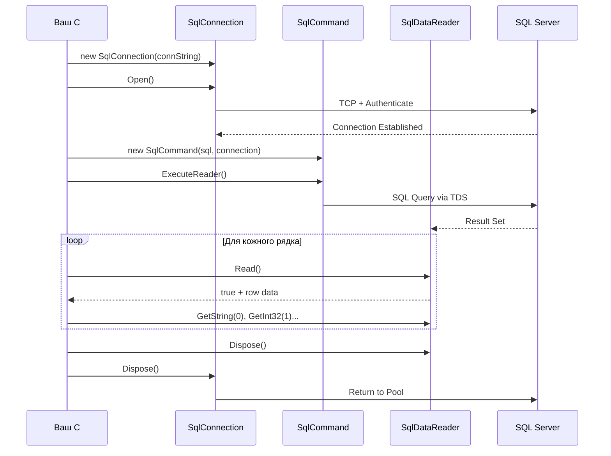

# 9.1. Введення в ADO.NET

## Вступ: Від List\<T> до справжньої бази даних

Уявіть, що ви створили чудовий консольний додаток для управління бібліотекою. Усі книги зберігаються у `List<Book>`, пошук працює миттєво, сортування — бездоганне. Ви задоволені. Але наступного дня ви перезапускаєте програму — і список порожній. Усі дані зникли. Чому? Тому що `List<T>` живе виключно в оперативній пам'яті (RAM), і коли процес завершується, пам'ять звільняється.

«Ну добре, — скажете ви, — тоді збережемо все у файл!» І це правильна думка. Ви вже знаєте, як працювати з файлами через `System.IO`. Але уявіть, що ваша бібліотечна система масштабується: 50 000 книг, 10 000 читачів, 200 одночасних користувачів. Збереження всього у JSON-файл стає кошмаром:

- **Продуктивність**: Щоб знайти одну книгу, потрібно прочитати весь файл у пам'ять і пройтися по ньому.
- **Конкурентність**: Два користувачі одночасно змінюють файл — дані пошкоджуються.
- **Цілісність**: Якщо програма «впаде» посеред запису, файл залишиться у непередбачуваному стані.
- **Запити**: Щоб знайти «усі книги автора X, видані після 2020 року, відсортовані за назвою», потрібно писати складну логіку фільтрації вручну.

Саме для вирішення цих проблем і існують **бази даних** (databases) — спеціалізоване програмне забезпечення, оптимізоване для зберігання, пошуку та маніпулювання структурованими даними. Але між вашим C#-додатком і базою даних існує «прірва» — вони говорять різними мовами. Ваш код — це об'єкти, класи, методи. База даних — це таблиці, рядки, SQL-запити.

**ADO.NET** — це міст через цю прірву. Це набір класів у .NET, який дозволяє вашому C#-коду «спілкуватися» з базами даних: підключатися, надсилати SQL-запити, отримувати результати та працювати з ними як зі звичайними об'єктами C#.

::note
**Передумови**: Для комфортного засвоєння матеріалу рекомендується знання основ C# (змінні, методи, класи, інтерфейси), обробки виключень (try/catch), `using`-інструкцій, а також базове розуміння SQL та реляційних баз даних. Рекомендується мати встановлений MS SQL Server (або SQL Server Express).
::

---

## Історична еволюція технологій доступу до даних

Щоб зрозуміти, чому ADO.NET виглядає саме так, а не інакше, варто простежити еволюцію технологій доступу до даних у світі Microsoft. Кожна нова технологія з'являлася як відповідь на обмеження попередньої.

::mermaid



::

Розглянемо кожну технологію детальніше, щоб зрозуміти, які проблеми вони вирішували і чому ADO.NET став таким, яким ми його знаємо.

### ODBC (Open Database Connectivity) — 1992

**ODBC** — це перша спроба створити **стандартний інтерфейс** для доступу до різних баз даних. До ODBC кожна СУБД мала свій власний, унікальний API. Якщо ви писали програму для Oracle, а потім клієнт захотів перейти на SQL Server, вам потрібно було переписувати весь код доступу до даних з нуля.

ODBC вирішив цю проблему через концепцію **драйвера** — спеціальної бібліотеки, яка «перекладає» стандартні виклики ODBC у команди, зрозумілі конкретній СУБД. Ваш додаток «говорить» з ODBC Manager, а ODBC Manager через відповідний драйвер — з базою даних.

**Аналогія**: ODBC — це як перекладач-синхроніст на міжнародній конференції. Ви говорите англійською (стандартний API), перекладач перекладає на японську (мова конкретної СУБД).

**Проблема ODBC**: Низькорівневий C-based API, складний у використанні, обмежений лише реляційними базами даних.

### DAO (Data Access Objects) — 1993

**DAO** з'явився як **нативний** спосіб доступу до баз даних Microsoft Access (двигун Jet). Замість того щоб працювати через «перекладача» ODBC, DAO звертався до бази даних напряму, що робило його значно швидшим для Access.

**Проблема DAO**: Працював ефективно лише з Access/Jet. Для інших СУБД доводилося використовувати ODBC-міст, що зводило нанівець усі переваги в продуктивності.

### OLE DB — 1996

**OLE DB** (Object Linking and Embedding, Database) — амбіційна спроба Microsoft створити **універсальний інтерфейс** для доступу не тільки до реляційних баз даних, але й до будь-яких джерел даних: електронних таблиць, поштових систем, файлових систем. OLE DB базувався на технології COM (Component Object Model).

Ідея була геніальна: один API для доступу до SQL Server, Oracle, Excel, Exchange Server та будь-чого іншого. Але реалізація виявилася надзвичайно складною — COM-інтерфейси OLE DB були заплутаними і важкими для програмістів.

### ADO Classic (ActiveX Data Objects) — 1997

**ADO** — це «дружня обгортка» над OLE DB. Microsoft зрозумів, що OLE DB занадто складний для більшості розробників, і створив простіший API з ключовими об'єктами: `Connection`, `Command`, `RecordSet`.

Саме в ADO Classic з'явилася концепція **RecordSet** — об'єкта, який міг завантажити дані з бази, від'єднатися від неї, дозволити клієнту працювати з даними локально, а потім синхронізувати зміни назад. Ця ідея стала основою для **від'єднаного режиму** (disconnected mode) в ADO.NET.

**Проблема ADO Classic**: Тісна прив'язка до COM, складність серіалізації для веб-додатків, RecordSet як «монолітний» об'єкт без гнучкості.

### ADO.NET — 2002: Повний редизайн

З появою .NET Framework Microsoft вирішив не просто «портувати» ADO в .NET, а **повністю переосмислити** архітектуру доступу до даних. Ось ключові зміни:

1. **Від COM до managed-коду**: ADO.NET — це чисті .NET-класи, без залежності від COM.
2. **Розділення відповідальності**: Замість одного монолітного `RecordSet` з'явилися окремі класи — `DataSet`, `DataTable`, `DataReader`, `DataAdapter` — кожен з чітко визначеною роллю.
3. **XML як формат обміну**: `DataSet` легко серіалізується в XML, що ідеально підходило для веб-сервісів ери SOAP.
4. **Провайдерна модель**: Кожна СУБД має свій .NET Data Provider (провайдер даних), який реалізує стандартний набір інтерфейсів.

---

## Драйвер vs Провайдер даних

Перш ніж рухатися далі, розберімося з двома ключовими термінами, які часто плутають: **драйвер** і **провайдер даних** (Data Provider).

**Драйвер** (Driver) — це низькорівневий компонент, зазвичай написаний на C/C++, який «знає», як фізично передавати байти до конкретної СУБД по мережі. Драйвер працює на рівні мережевих протоколів та бінарних форматів. Наприклад, ODBC-драйвер для SQL Server знає специфіку протоколу TDS (Tabular Data Stream).

**Провайдер даних .NET** (Data Provider) — це набір .NET-класів, які реалізують стандартні інтерфейси ADO.NET (`IDbConnection`, `IDbCommand`, `IDataReader` тощо) для конкретної СУБД. Провайдер може всередині використовувати драйвер або мати власну реалізацію мережевого протоколу.

| Характеристика | Драйвер (ODBC/OLE DB) | Провайдер даних (.NET) |
|:---|:---|:---|
| **Технологія** | Нативний C/C++ код | Managed .NET код |
| **Інтерфейс** | ODBC API або COM-інтерфейси | .NET-інтерфейси (IDbConnection тощо) |
| **Рівень абстракції** | Низький — передача байтів | Високий — об'єктна модель |
| **Продуктивність** | Додатковий маршалінг COM↔.NET | Нативна інтеграція з .NET |
| **Приклад** | SQL Server ODBC Driver | `Microsoft.Data.SqlClient` |

::tip
**Best Practice**: У сучасному .NET завжди надавайте перевагу **нативному .NET-провайдеру** для вашої СУБД замість ODBC або OLE DB. Нативні провайдери працюють швидше (немає маршалінгу між COM та .NET) і підтримують специфічні можливості СУБД.
::

---

## Що таке ADO.NET?

**ADO.NET** (ActiveX Data Objects for .NET) — це набір класів у .NET для доступу до джерел даних, переважно реляційних баз даних. Незважаючи на назву, ADO.NET не має майже нічого спільного зі старим ADO Classic — це повністю нова архітектура, яка лише успадкувала назву з маркетингових міркувань.

Формально ADO.NET — це частина Base Class Library (BCL) .NET, розташована у просторі імен `System.Data` та його підпросторах. ADO.NET надає:

::card-group

::card{title="🔌 Підключення" icon="i-heroicons-link"}
Встановлення та управління з'єднаннями з базами даних, включаючи пул підключень (Connection Pooling).
::

::card{title="📤 Виконання команд" icon="i-heroicons-command-line"}
Надсилання SQL-запитів та збережених процедур до СУБД, отримання результатів.
::

::card{title="📥 Читання даних" icon="i-heroicons-table-cells"}
Ефективне читання результатів запитів у потоковому (forward-only) або кешованому (DataSet) режимі.
::

::card{title="🔄 Офлайн-робота" icon="i-heroicons-cloud-arrow-down"}
Завантаження даних у пам'ять (DataSet), робота без з'єднання, синхронізація змін назад у БД.
::

::card{title="🔒 Безпека" icon="i-heroicons-shield-check"}
Параметризовані запити для захисту від SQL Injection, інтегрована аутентифікація Windows.
::

::card{title="⚡ Асинхронність" icon="i-heroicons-bolt"}
Повна підтримка async/await для неблокуючого доступу до даних.
::

::

### Де ADO.NET у сучасному .NET?

Може виникнути питання: «Чи не застарів ADO.NET? Усі використовують Entity Framework або Dapper!» Це поширена помилка. ADO.NET — це **фундамент**, на якому побудовані всі інші технології доступу до даних у .NET:

- **Entity Framework Core** — під капотом використовує `DbConnection`, `DbCommand` та `DbDataReader` з ADO.NET.
- **Dapper** — це бібліотека, яка додає extension-методи до `IDbConnection` з ADO.NET.
- **Будь-який ORM** для .NET зрештою працює через ADO.NET-провайдер.

Розуміння ADO.NET дає вам **повний контроль** над взаємодією з базою даних та допомагає зрозуміти, що відбувається «під капотом» ORM.

::mermaid



::

Зверніть увагу на архітектуру: ADO.NET займає **центральну позицію** між вашим кодом та базою даних. Entity Framework, Dapper та інші ORM — це лише зручніші «обгортки» над ADO.NET, які автоматизують рутинні операції (маппінг, генерація SQL тощо), але зрештою делегують усю роботу саме ADO.NET.

---

## Архітектура ADO.NET: Дві моделі роботи

ADO.NET пропонує дві принципово різні моделі роботи з даними: **присоединённий режим** (Connected Mode) та **від'єднаний режим** (Disconnected Mode). Розуміння різниці між ними — ключ до правильного вибору підходу для конкретної задачі.

### Присоединённый режим (Connected Mode)

У цьому режимі ваш додаток **утримує відкрите з'єднання** з базою даних протягом усього часу роботи з даними. Ви надсилаєте SQL-запит, отримуєте результати через `DataReader` і обробляєте їх «на льоту» — рядок за рядком. Після завершення обробки з'єднання закривається.

**Аналогія**: Присоединённый режим — це як **телефонний дзвінок**. Ви набираєте номер (відкриваєте з'єднання), ведете розмову (читаєте дані), кладете трубку (закриваєте з'єднання). Поки ви на лінії, лінія зайнята — ніхто інший не може використовувати це з'єднання.

**Ключові класи**: `DbConnection`, `DbCommand`, `DbDataReader`.

**Переваги**:
- Мінімальне споживання пам'яті — дані не кешуються цілком
- Найвища продуктивність для читання великих обсягів даних
- Актуальні дані — ви працюєте з «живою» базою

**Недоліки**:
- З'єднання зайняте протягом обробки — обмежена масштабованість
- Потрібна мережева зв'язність протягом усієї операції
- Не підходить для сценаріїв «завантажив — попрацював — зберіг»

### Від'єднаний режим (Disconnected Mode)

У цьому режимі ваш додаток **завантажує дані в пам'ять** у вигляді `DataSet` або `DataTable`, після чого **закриває з'єднання**. Усі маніпуляції з даними (фільтрація, сортування, зміни) відбуваються локально. Коли потрібно зберегти зміни, з'єднання відкривається знову, зміни синхронізуються з базою, з'єднання закривається.

**Аналогія**: Від'єднаний режим — це як **бібліотека**. Ви приходите (відкриваєте з'єднання), берете книжку (завантажуєте дані), йдете додому (закриваєте з'єднання), читаєте вдома (працюєте з DataSet), повертаєте книжку (синхронізуєте зміни).

**Ключові класи**: `DataSet`, `DataTable`, `DataAdapter`, `DataRow`, `DataColumn`.

**Переваги**:
- З'єднання займається мінімальний час — краща масштабованість
- Можна працювати офлайн (дані в пам'яті)
- Підтримка фільтрації, сортування та зміни даних без з'єднання
- Легка серіалізація в XML/JSON

**Недоліки**:
- Більше споживання пам'яті — всі дані в RAM
- Дані можуть «застаріти» (stale data)
- Можливі конфлікти при оновленні (optimistic concurrency)
- Складніша модель програмування

### Порівняння режимів

::mermaid



::

| Критерій | Connected Mode | Disconnected Mode |
|:---|:---|:---|
| **Час з'єднання** | Протягом усієї операції | Лише для fetch/update |
| **Пам'ять** | Мінімальна (один рядок) | Усі дані в RAM |
| **Актуальність** | Завжди актуальні | Можуть застаріти |
| **Масштабованість** | Обмежена кількістю з'єднань | Висока |
| **Офлайн-робота** | Неможлива | Підтримується |
| **Типовий клас** | `DbDataReader` | `DataSet` / `DataTable` |
| **Коли використовувати** | Читання великих обсягів, потокова обробка | CRUD-інтерфейси, робота з формами |

---

## Простори імен ADO.NET

ADO.NET організований у кілька просторів імен (namespaces), кожен з яких відповідає за окрему частину функціональності. Розуміння цієї структури допоможе вам знайти потрібний клас і зрозуміти його роль.

### Базові простори імен

::code-tree

```csharp [System.Data]
// Ядро ADO.NET: інтерфейси, DataSet, DataTable, DataRow, DataColumn
// Це "контракти" — визначення того, ЩО повинен уміти провайдер
```

```csharp [System.Data.Common]
// Абстрактні базові класи: DbConnection, DbCommand, DbDataReader
// Це "напівреалізації" — спільна логіка для всіх провайдерів
// DbProviderFactory — фабрика для створення провайдер-незалежного коду
```

```csharp [Microsoft.Data.SqlClient]
// Провайдер для MS SQL Server (сучасний, рекомендований)
// SqlConnection, SqlCommand, SqlDataReader, SqlParameter
// Встановлюється через NuGet: Microsoft.Data.SqlClient
```

```csharp [System.Data.SqlClient]
// Старий провайдер для MS SQL Server (ЗАСТАРІЛИЙ)
// Вбудований у .NET Framework, але не рекомендується для нових проєктів
```

```csharp [System.Data.OleDb]
// Провайдер для OLE DB джерел (Access, Excel, старі бази)
// Працює лише на Windows
```

```csharp [System.Data.Odbc]
// Провайдер для ODBC-драйверів
// Крос-платформенний, але повільніший за нативні провайдери
```

::

::warning
**Важливо**: `System.Data.SqlClient` — це **застарілий** провайдер для SQL Server, який більше не отримує нових функцій. Для нових проєктів завжди використовуйте `Microsoft.Data.SqlClient`, який встановлюється через NuGet. Він підтримує найновіші можливості SQL Server, включаючи Always Encrypted, Azure AD аутентифікацію тощо.
::

### Провайдери для інших СУБД

Окрім стандартних провайдерів, існують провайдери від сторонніх розробників для різних СУБД. Усі вони реалізують ті самі абстрактні класи з `System.Data.Common`, тому ваші знання ADO.NET працюватимуть з будь-якою базою даних:

| СУБД | NuGet-пакет | Простір імен | Класи |
|:---|:---|:---|:---|
| **MS SQL Server** | `Microsoft.Data.SqlClient` | `Microsoft.Data.SqlClient` | `SqlConnection`, `SqlCommand` |
| **PostgreSQL** | `Npgsql` | `Npgsql` | `NpgsqlConnection`, `NpgsqlCommand` |
| **MySQL** | `MySqlConnector` | `MySqlConnector` | `MySqlConnection`, `MySqlCommand` |
| **SQLite** | `Microsoft.Data.Sqlite` | `Microsoft.Data.Sqlite` | `SqliteConnection`, `SqliteCommand` |
| **Oracle** | `Oracle.ManagedDataAccess.Core` | `Oracle.ManagedDataAccess.Client` | `OracleConnection`, `OracleCommand` |

Зверніть увагу на **консистентність іменування**: кожен провайдер має свій `XxxConnection`, `XxxCommand`, `XxxDataReader` — і всі вони наслідують від одних і тих самих базових класів (`DbConnection`, `DbCommand`, `DbDataReader`). Це не випадковість, а продуманий архітектурний дизайн.

---

## Концепція інтерфейсів та базових класів ADO.NET

Одна з найважливіших архітектурних ідей ADO.NET — це **провайдерна модель** (Provider Model). Суть її в тому, що ADO.NET визначає **набір інтерфейсів та абстрактних класів**, які описують «контракт» — що повинен уміти будь-який провайдер даних. А конкретні провайдери (для SQL Server, PostgreSQL тощо) **реалізують** ці контракти.

Це класичний приклад патерну **Стратегія** (Strategy Pattern) та принципу **Інверсії Залежностей** (Dependency Inversion Principle, DIP) — ваш код залежить від абстракцій, а не від конкретних реалізацій.

**Аналогія**: Уявіть розетку на стіні (інтерфейс `IDbConnection`). Ви знаєте, що в неї можна вставити вилку (викликати `Open()`). Вам не потрібно знати, як електростанція генерує електрику (внутрішня реалізація `SqlConnection`). Вам достатньо знати **контракт** — форма вилки та напруга. Якщо завтра електростанція зміниться з вугільної на сонячну, ваш чайник працюватиме так само — розетка не змінилася.

### Ієрархія інтерфейсів

ADO.NET визначає наступні ключові інтерфейси у просторі імен `System.Data`:

::field-group

::field{name="IDbConnection" type="interface"}
Контракт для з'єднання з базою даних. Визначає методи `Open()`, `Close()`, властивість `ConnectionString`, а також `BeginTransaction()` для управління транзакціями.
::

::field{name="IDbCommand" type="interface"}
Контракт для SQL-команди. Визначає `CommandText` (SQL-запит), `CommandType`, `Parameters`, а також методи виконання: `ExecuteReader()`, `ExecuteNonQuery()`, `ExecuteScalar()`.
::

::field{name="IDataReader / IDataRecord" type="interface"}
Контракт для потокового читання результатів запиту. `IDataReader` визначає `Read()` для переходу до наступного рядка, `IDataRecord` — методи доступу до полів (`GetString()`, `GetInt32()` тощо).
::

::field{name="IDataAdapter / IDbDataAdapter" type="interface"}
Контракт для «мосту» між DataSet та джерелом даних. Визначає `Fill()` для завантаження та `Update()` для збереження змін.
::

::field{name="IDataParameter / IDbDataParameter" type="interface"}
Контракт для параметра SQL-запиту. Визначає `ParameterName`, `Value`, `DbType`, `Direction`.
::

::field{name="IDbTransaction" type="interface"}
Контракт для транзакції. Визначає `Commit()` та `Rollback()`.
::

::

### Ієрархія абстрактних класів

Окрім інтерфейсів, ADO.NET містить **абстрактні базові класи** у просторі імен `System.Data.Common`. Ці класи реалізують спільну логіку, яка однакова для всіх провайдерів, залишаючи специфічні деталі для конкретних реалізацій:

::plant-uml



::

Ця тришарова архітектура **інтерфейс → абстрактний клас → конкретна реалізація** забезпечує:

1. **Полімерфізм**: Ваш код може працювати з `DbConnection` замість `SqlConnection`, і він буде працювати з будь-якою СУБД.
2. **Розширюваність**: Для підтримки нової СУБД достатньо створити нові класи, що наслідують від `DbConnection`, `DbCommand` тощо.
3. **Спільна логіка**: Абстрактні класи містять реалізацію async-методів (`OpenAsync()`, `ExecuteReaderAsync()`), яка автоматично доступна всім провайдерам.

::note
**Чому існують і інтерфейси, і абстрактні класи?** Історично спочатку були визначені лише інтерфейси (`IDbConnection`). Абстрактні класи (`DbConnection`) з'явилися пізніше, у .NET 2.0, коли Microsoft додав підтримку асинхронності та фабрики провайдерів. У сучасному коді рекомендується використовувати **абстрактні класи** (`DbConnection`, `DbCommand` тощо) замість інтерфейсів, оскільки вони містять більше функціональності (зокрема async-методи).
::

---

## Підключення NuGet-пакету Microsoft.Data.SqlClient

Перш ніж писати код, потрібно встановити провайдер для вашої СУБД. У нашому випадку це `Microsoft.Data.SqlClient` — сучасний провайдер для MS SQL Server.

::steps

### Крок 1: Створіть консольний проєкт

Відкрийте термінал і виконайте команду:

```bash
dotnet new console -n AdoNetDemo
cd AdoNetDemo
```

### Крок 2: Встановіть NuGet-пакет

```bash
dotnet add package Microsoft.Data.SqlClient
```

Ця команда додасть залежність у файл проєкту (`.csproj`). Ви побачите щось на кшталт:

```xml [AdoNetDemo.csproj]
<ItemGroup>
  <PackageReference Include="Microsoft.Data.SqlClient" Version="5.2.*" />
</ItemGroup>
```

### Крок 3: Перевірте встановлення

Відкрийте `Program.cs` і додайте:

```csharp [Program.cs]
using Microsoft.Data.SqlClient;

Console.WriteLine("Microsoft.Data.SqlClient встановлено успішно!");
Console.WriteLine($"Версія збірки: {typeof(SqlConnection).Assembly.GetName().Version}");
```

Запустіть проєкт:

```bash
dotnet run
```

Якщо ви бачите версію збірки — все готово для роботи з ADO.NET.

::

::note
**Чому `Microsoft.Data.SqlClient`, а не `System.Data.SqlClient`?**

`System.Data.SqlClient` — це вбудований провайдер, який був частиною .NET Framework. З переходом на .NET Core / .NET 5+ Microsoft виніс провайдер у окремий NuGet-пакет `Microsoft.Data.SqlClient`. Це дозволяє:

- **Оновлювати провайдер незалежно від .NET Runtime** — нові фічі виходять частіше
- **Підтримувати нові можливості SQL Server** — Always Encrypted, Azure AD auth, Idle Connection Resiliency
- **Виправляти безпекові вразливості** — без очікування наступної версії .NET

`System.Data.SqlClient` більше **не отримує нових функцій** і підтримується лише в режимі безпекових патчів. Для нових проєктів завжди використовуйте `Microsoft.Data.SqlClient`.
::

---

## Перший приклад: Підключення та читання даних

Тепер, коли ми розуміємо архітектуру, давайте напишемо наш перший реальний приклад. Ми підключимося до SQL Server, виконаємо простий `SELECT`-запит та виведемо результати.

Для цього прикладу ми будемо використовувати базу даних, що містить таблицю `Products`:

```sql [Підготовка: створення тестової таблиці]
CREATE DATABASE ShopDb;
GO

USE ShopDb;
GO

CREATE TABLE Products (
    Id       INT IDENTITY(1,1) PRIMARY KEY,
    Name     NVARCHAR(100)  NOT NULL,
    Price    DECIMAL(10, 2) NOT NULL,
    Quantity INT            NOT NULL DEFAULT 0
);

INSERT INTO Products (Name, Price, Quantity) VALUES
    (N'Ноутбук',       25999.99, 15),
    (N'Клавіатура',      1299.00, 50),
    (N'Мишка',            499.50, 100),
    (N'Монітор 27"',   12499.00, 20),
    (N'Навушники',       2199.99, 35);
```

А тепер — C#-код:

```csharp [Program.cs] showLineNumbers
using System;
using Microsoft.Data.SqlClient;

// 1. Визначаємо рядок підключення (Connection String)
string connectionString =
    "Server=localhost;Database=ShopDb;Trusted_Connection=True;TrustServerCertificate=True;";

// 2. Створюємо і відкриваємо з'єднання
using SqlConnection connection = new SqlConnection(connectionString);
connection.Open();
Console.WriteLine($"З'єднання встановлено! Стан: {connection.State}");

// 3. Створюємо SQL-команду
string sql = "SELECT Id, Name, Price, Quantity FROM Products WHERE Price > 1000";
using SqlCommand command = new SqlCommand(sql, connection);

// 4. Виконуємо команду та отримуємо DataReader
using SqlDataReader reader = command.ExecuteReader();

// 5. Читаємо результати рядок за рядком
Console.WriteLine("\n{0,-5} {1,-20} {2,12} {3,10}", "ID", "Назва", "Ціна", "Кількість");
Console.WriteLine(new string('-', 50));

while (reader.Read())
{
    int id = reader.GetInt32(0);
    string name = reader.GetString(1);
    decimal price = reader.GetDecimal(2);
    int quantity = reader.GetInt32(3);

    Console.WriteLine($"{id,-5} {name,-20} {price,12:C} {quantity,10}");
}

Console.WriteLine($"\nОброблено рядків: {reader.RecordsAffected}");
Console.WriteLine($"Стан з'єднання після завершення: {connection.State}");
```

### Декомпозиція коду

Давайте детально розберемо, що відбувається у кожній частині цього коду:

**Рядок 5-6: Рядок підключення (Connection String)**

```csharp
string connectionString =
    "Server=localhost;Database=ShopDb;Trusted_Connection=True;TrustServerCertificate=True;";
```

Connection String — це спеціальний рядок у форматі `ключ=значення;ключ=значення;`, який містить усю інформацію для підключення до бази даних:
- `Server=localhost` — адреса SQL Server (може бути IP, hostname або `(localdb)\MSSQLLocalDB` для LocalDB)
- `Database=ShopDb` — назва бази даних
- `Trusted_Connection=True` — використовувати Windows Authentication (поточний користувач Windows)
- `TrustServerCertificate=True` — довіряти SSL-сертифікату сервера (для розробки)

::warning
`TrustServerCertificate=True` підходить лише для **локальної розробки**. У production-середовищі завжди перевіряйте SSL-сертифікат сервера для захисту від атак «людина посередині» (Man-in-the-Middle, MITM).
::

**Рядок 9-11: Створення та відкриття з'єднання**

```csharp
using SqlConnection connection = new SqlConnection(connectionString);
connection.Open();
```

`SqlConnection` — це конкретна реалізація `DbConnection` для MS SQL Server. Зверніть увагу на `using`-декларацію (C# 8.0+): коли змінна `connection` вийде із області видимості (scope), автоматично викличеться `connection.Dispose()`, який закриє з'єднання та поверне його у пул. Це критично важливо — забуте відкрите з'єднання «витікає» з пулу і може вичерпати ліміт підключень.

Метод `Open()` встановлює TCP-з'єднання з SQL Server, виконує аутентифікацію та обирає базу даних. Якщо сервер недоступний, буде кинуто `SqlException`.

**Рядок 15-16: Створення SQL-команди**

```csharp
string sql = "SELECT Id, Name, Price, Quantity FROM Products WHERE Price > 1000";
using SqlCommand command = new SqlCommand(sql, connection);
```

`SqlCommand` приймає два аргументи: SQL-запит і з'єднання, через яке запит буде виконано. Зверніть увагу, що SQL тут написаний як звичайний рядок C# — ADO.NET не перевіряє його синтаксис, це зробить SQL Server при виконанні.

::caution
**Ніколи** не формуйте SQL-запити через конкатенацію рядків з даними користувача! Наприклад, `$"SELECT * FROM Products WHERE Name = '{userInput}'"` — це **вразливість SQL Injection**. У наступних статтях ми детально розглянемо параметризовані запити, які вирішують цю проблему.
::

**Рядок 19: Виконання запиту**

```csharp
using SqlDataReader reader = command.ExecuteReader();
```

`ExecuteReader()` надсилає SQL-запит на SQL Server, вирішує, як його виконати (план запиту), виконує його та повертає `SqlDataReader` — об'єкт для потокового читання результатів. Дані **ще не завантажені в пам'ять** — `DataReader` лише «готовий» до читання.

**Рядки 25-33: Читання результатів**

```csharp
while (reader.Read())
{
    int id = reader.GetInt32(0);
    string name = reader.GetString(1);
    // ...
}
```

`reader.Read()` переміщує внутрішній курсор на наступний рядок результатів і повертає `true`, якщо рядок існує, або `false`, якщо рядки закінчилися. Це класичний патерн **Iterator** — ви обробляєте рядки по одному, не завантажуючи всі в пам'ять одночасно.

Методи `GetInt32(0)`, `GetString(1)` читають значення конкретного стовпця за його **порядковим номером** (ordinal, 0-indexed). Це трохи тендітний код, бо залежить від порядку стовпців у `SELECT`. Альтернативно можна використовувати `reader["Name"]` або `reader.GetOrdinal("Name")`, що ми розглянемо у статті про DataReader.

### Очікуваний результат

```
З'єднання встановлено! Стан: Open

ID    Назва                       Ціна  Кількість
--------------------------------------------------
1     Ноутбук               ₴25 999,99         15
2     Клавіатура              ₴1 299,00         50
4     Монітор 27"            ₴12 499,00         20
5     Навушники               ₴2 199,99         35

Оброблено рядків: -1
Стан з'єднання після завершення: Open
```

::note
`RecordsAffected` повертає `-1` для SELECT-запитів. Це властивість повертає кількість змінених рядків тільки для INSERT, UPDATE, DELETE. Для SELECT вона завжди повертає `-1` — це не помилка, а задумана поведінка.
::

---

## Повна картина: Як компоненти працюють разом

Тепер, коли ми побачили перший приклад, давайте подивимося на загальну картину взаємодії компонентів ADO.NET:

::mermaid



::

Ця послідовність повторюється в кожному ADO.NET-додатку:

1. **Створити з'єднання** → `new SqlConnection(connectionString)`
2. **Відкрити з'єднання** → `connection.Open()`
3. **Створити команду** → `new SqlCommand(sql, connection)`
4. **Виконати команду** → `ExecuteReader()` / `ExecuteNonQuery()` / `ExecuteScalar()`
5. **Обробити результати** → `while (reader.Read()) { ... }`
6. **Звільнити ресурси** → `Dispose()` (автоматично через `using`)

Це фундаментальний шаблон, який ви будете використовувати знову і знову. У наступних статтях ми детально розглянемо кожен з цих компонентів.

---

## Практичні завдання

### Рівень 1: Базовий

::steps

### Завдання 1.1: Перевірка з'єднання

Створіть програму, яка:
1. Приймає рядок підключення до бази даних.
2. Намагається відкрити з'єднання.
3. Виводить повідомлення про успішне підключення та версію SQL Server (`SELECT @@VERSION`). Використайте `ExecuteScalar()`.
4. У разі помилки виводить повідомлення з деталями (`SqlException.Message`, `SqlException.Number`).

### Завдання 1.2: Виведення системної інформації

Створіть програму, яка підключається до SQL Server та виводить:
- Назву сервера (`SELECT @@SERVERNAME`)
- Назву поточної бази даних (`SELECT DB_NAME()`)
- Поточного користувача (`SELECT SUSER_SNAME()`)
- Час на сервері (`SELECT GETDATE()`)

Використайте окремий `SqlCommand` з `ExecuteScalar()` для кожного запиту.

::

### Рівень 2: Логіка та обробка даних

::steps

### Завдання 2.1: Каталог товарів

Створіть базу даних `CatalogDb` з таблицею `Categories` (Id, Name, Description) та `Products` (Id, Name, Price, CategoryId). Заповніть тестовими даними (мінімум 10 продуктів у 3 категоріях). Напишіть програму, яка:
1. Виводить список усіх категорій.
2. Для обраної користувачем категорії виводить усі продукти з цінами.
3. Виводить середню ціну товарів у обраній категорії.

### Завдання 2.2: Список баз даних

Напишіть програму, яка підключається до SQL Server і виводить список усіх баз даних на сервері (використайте запит `SELECT name FROM sys.databases`). Для кожної бази виведіть її назву та розмір (підказка: використайте системну процедуру `sp_databases` або запит до `sys.master_files`).

::

### Рівень 3: Архітектура

::steps

### Завдання 3.1: Універсальний SQL-клієнт

Створіть консольний додаток — простий SQL-клієнт:
1. При запуску запитує рядок підключення (або зберігає останній використаний).
2. Після підключення виводить інформацію про сервер та базу даних.
3. Входить у цикл, де очікує SQL-запити від користувача.
4. Для SELECT-запитів виводить результати у форматі таблиці з заголовками стовпців.
5. Для INSERT/UPDATE/DELETE виводить кількість змінених рядків.
6. Команда `exit` завершує програму.

Зверніть увагу на обробку помилок — невалідний SQL не повинен «роняти» програму.

### Завдання 3.2: Дослідження провайдерної архітектури

Створіть проєкт, в якому ви:
1. Напишете метод `PrintDatabaseInfo(DbConnection connection)`, який приймає **абстрактний** `DbConnection` (не конкретний `SqlConnection`).
2. Метод повинен відкривати з'єднання, виводити тип з'єднання (`connection.GetType().Name`), версію сервера (`connection.ServerVersion`) та стан.
3. Продемонструйте виклик цього методу з `SqlConnection`.
4. Поясніть у коментарях, чому використання абстракції `DbConnection` замість `SqlConnection` є кращою практикою.

::

---

## Резюме

::card-group

::card{title="ADO.NET — фундамент" icon="i-heroicons-building-library"}
ADO.NET — це набір класів .NET для доступу до баз даних. Він є фундаментом, на якому побудовані Entity Framework Core, Dapper та інші ORM.
::

::card{title="Провайдерна модель" icon="i-heroicons-puzzle-piece"}
Архітектура «інтерфейс → абстрактний клас → реалізація» дозволяє писати код, який працює з будь-якою СУБД через єдиний API.
::

::card{title="Connected vs Disconnected" icon="i-heroicons-arrows-right-left"}
Два режими роботи: Connected (DataReader — потокове читання) та Disconnected (DataSet — робота в пам'яті). Вибір залежить від сценарію.
::

::card{title="Microsoft.Data.SqlClient" icon="i-heroicons-server"}
Сучасний провайдер для SQL Server, який встановлюється через NuGet. Замінює застарілий System.Data.SqlClient.
::

::

### Ключові поняття

- **ADO.NET** — технологія доступу до даних у .NET, набір класів у `System.Data`
- **Data Provider (провайдер даних)** — реалізація інтерфейсів ADO.NET для конкретної СУБД
- **Connection String** — рядок з параметрами підключення до бази даних
- **Connected Mode** — робота з утриманням відкритого з'єднання (DataReader)
- **Disconnected Mode** — завантаження даних у пам'ять та робота без з'єднання (DataSet)
- **DbConnection, DbCommand, DbDataReader** — абстрактні базові класи ADO.NET

::tip
**Наступний крок**: У наступному матеріалі ми детально розглянемо клас `DbConnection` — рядок підключення, пул з'єднань (Connection Pooling), обробку помилок та best practices управління з'єднаннями.
::
