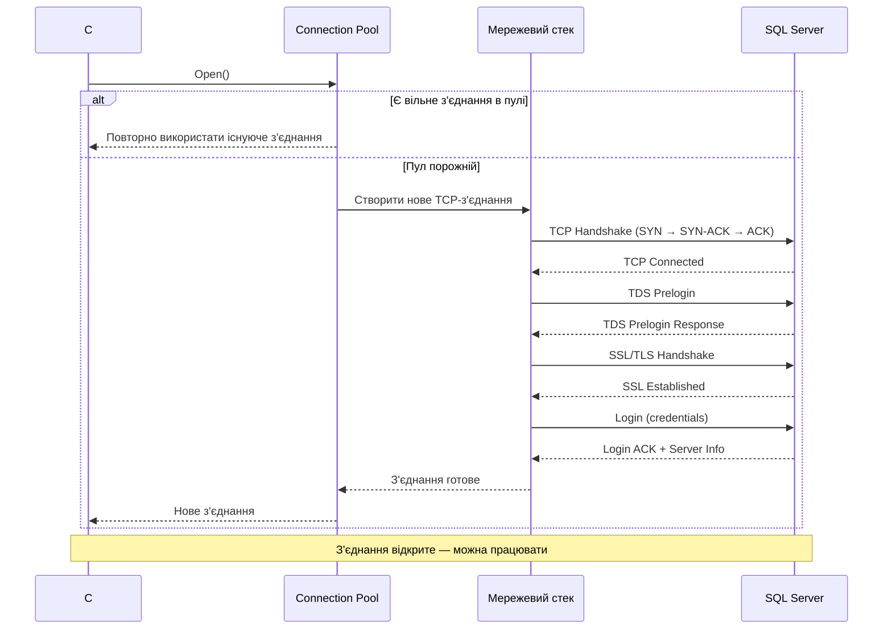
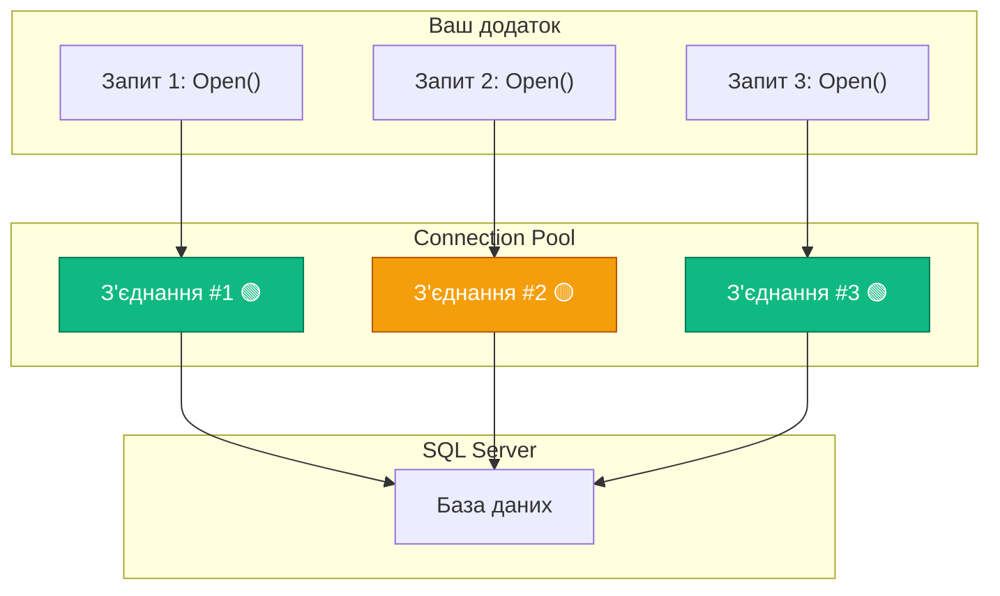

# 9.2. Клас DbConnection — з'єднання з базою даних

## Вступ: Чому підключення — це не просто «відкрити файл»?

У попередній статті ми написали перший ADO.NET-приклад і побачили, що все починається з `SqlConnection`. Ви могли подумати, що підключення до бази даних — це щось на кшталт `File.Open()`: відкрив, попрацював, закрив. Але реальність значно цікавіша та складніша.

Коли ви пишете `connection.Open()`, за лаштунками відбувається ціла серія подій: встановлення TCP-з'єднання, обмін SSL-сертифікатами, аутентифікація, вибір бази даних, перевірка прав доступу. І все це — по мережі, навіть якщо SQL Server працює на тій самій машині. Ваш додаток і СУБД — це два **окремих процеси**, які спілкуються через мережевий протокол.

Тому з'єднання з базою даних — це **дорогий ресурс**. Відкриття нового з'єднання займає 50–200 мілісекунд (залежно від мережі та конфігурації), що може здатися незначним для одного запиту, але стає критичним, коли ваш веб-додаток обробляє 1000 запитів на секунду. Саме тому ADO.NET має вбудований механізм **пулу підключень** (Connection Pooling), який ми детально розглянемо у цій статті.

Управління з'єднаннями — це один з тих аспектів, де помилки не завжди видно одразу. Додаток може працювати ідеально на вашій машині та «падати» під навантаженням у production. Розуміння того, як працюють з'єднання, допоможе вам уникнути цих проблем.

::note
**Передумови**: Матеріал зі статті [9.1. Введення в ADO.NET](/1.csharp/09.ado-net/01.introduction-to-adonet), встановлений NuGet-пакет `Microsoft.Data.SqlClient`, базове розуміння мережевих протоколів (TCP/IP).
::

---

## Як відбувається підключення: погляд зсередини

Перш ніж вивчати API класу `SqlConnection`, давайте розберемося, що **фізично** відбувається, коли ваш код викликає `connection.Open()`. Це не магія — це конкретна послідовність мережевих операцій.

::mermaid



::

Розглянемо кожен крок:

1. **Connection Pool Check**: ADO.NET спочатку перевіряє, чи є у пулі вже створене, але вільне з'єднання з таким самим Connection String. Якщо є — з'єднання використовується повторно, і кроки 2–6 пропускаються.

2. **TCP Handshake**: Встановлюється TCP-з'єднання з SQL Server (за замовчуванням порт 1433). Це класичний тристоронній рукостискання (SYN → SYN-ACK → ACK).

3. **TDS Prelogin**: Клієнт і сервер обмінюються початковою інформацією через протокол **TDS** (Tabular Data Stream) — це пропрієтарний протокол Microsoft для SQL Server. Вони узгоджують версію TDS, параметри шифрування тощо.

4. **SSL/TLS Handshake**: Якщо шифрування увімкнено (а з SQL Server 2022+ воно за замовчуванням обов'язкове), виконується SSL/TLS-рукостискання для захисту трафіку.

5. **Аутентифікація**: Клієнт надсилає облікові дані (login/password або Windows token). SQL Server перевіряє їх та повертає підтвердження.

6. **З'єднання готове**: SQL Server повертає інформацію про сервер (версія, ім'я інстансу, идентифікатор процесу), і з'єднання стає доступним для використання.

Вся ця процедура може займати **50–500 мс** залежно від мережі та конфігурації. Тепер ви розумієте, чому пул підключень — це **не оптимізація, а необхідність**.

---

## Connection String: Рядок підключення

**Connection String** (рядок підключення) — це спеціально відформатований рядок, який містить усі параметри для встановлення з'єднання з базою даних. Це перше, що ви передаєте у конструктор `SqlConnection`.

### Формат

Connection String має формат `ключ=значення;ключ=значення;`. Ключі регістро-незалежні (case-insensitive), значення можуть бути в лапках, якщо містять спеціальні символи:

```
Server=myserver;Database=mydb;User Id=myuser;Password=mypassword;
```

Деякі ключі мають **альтернативні назви** (aliases), наприклад, `Server` і `Data Source` — це одне й те саме, `Database` і `Initial Catalog` — теж. Microsoft зберігає ці aliases для зворотної сумісності зі старими версіями ADO.

### Основні параметри

::field-group

::field{name="Server / Data Source" type="string" required}
Адреса SQL Server. Може бути:
- `localhost` або `.` — локальний сервер
- `192.168.1.100` — IP-адреса
- `myserver.company.com` — DNS-ім'я
- `myserver\SQLEXPRESS` — іменований інстанс
- `(localdb)\MSSQLLocalDB` — LocalDB
- `myserver,1434` — нестандартний порт (через кому!)
::

::field{name="Database / Initial Catalog" type="string" required}
Назва бази даних, до якої підключатися. Еквівалент команди `USE [DatabaseName]` в T-SQL.
::

::field{name="Integrated Security / Trusted_Connection" type="bool" default="false"}
Якщо `true`, використовується **Windows Authentication** — облікові дані поточного користувача Windows. Якщо `false`, потрібно вказати `User Id` та `Password`.
::

::field{name="User Id" type="string"}
Логін для SQL Server Authentication. Ігнорується, якщо `Integrated Security=true`.
::

::field{name="Password / Pwd" type="string"}
Пароль для SQL Server Authentication.
::

::field{name="Encrypt" type="string" default="true (.NET 6+)"}
Шифрування з'єднання: `true`, `false`, `strict`. Починаючи з `Microsoft.Data.SqlClient` 4.0, за замовчуванням `true`.
::

::field{name="TrustServerCertificate" type="bool" default="false"}
Якщо `true`, клієнт не перевіряє SSL-сертифікат сервера. Використовуйте лише для розробки!
::

::field{name="Connection Timeout / Connect Timeout" type="int" default="15"}
Максимальний час очікування підключення у секундах. Якщо за цей час з'єднання не встановлено — `SqlException`.
::

::field{name="Command Timeout" type="int" default="30"}
Час очікування за замовчуванням для команд (можна перевизначити у `SqlCommand.CommandTimeout`).
::

::field{name="MultipleActiveResultSets / MARS" type="bool" default="false"}
Дозволяє виконувати кілька `DataReader` одночасно на одному з'єднанні.
::

::field{name="Application Name" type="string" default=".Net SqlClient Data Provider"}
Ім'я вашого додатка — відображається в SQL Server Management Studio (Activity Monitor). Дуже корисно для діагностики!
::

::field{name="Max Pool Size" type="int" default="100"}
Максимальна кількість з'єднань у пулі.
::

::field{name="Min Pool Size" type="int" default="0"}
Мінімальна кількість з'єднань, які підтримуються в пулі навіть коли не використовуються.
::

::field{name="Pooling" type="bool" default="true"}
Вмикає/вимикає пул з'єднань. Вимикайте лише для діагностики!
::

::

### Два режими аутентифікації

SQL Server підтримує два способи аутентифікації, і ваш Connection String буде відрізнятися залежно від обраного способу:

::tabs

::tabs-item{label="Windows Authentication"}

```csharp
// Windows Authentication (Integrated Security)
// Використовує обліковий запис Windows поточного користувача
string connectionString =
    "Server=localhost;" +
    "Database=ShopDb;" +
    "Integrated Security=True;" +   // ← ключовий параметр
    "TrustServerCertificate=True;";
```

**Переваги**: Не потрібно зберігати паролі в коді або конфігурації. Пароль ніколи не передається по мережі (використовується Kerberos або NTLM token). Це **рекомендований спосіб** для внутрішніх корпоративних додатків.

**Недоліки**: Працює лише в середовищі Windows Active Directory. Додаток запускається від імені конкретного Windows-користувача, якому потрібні права у SQL Server.

::

::tabs-item{label="SQL Server Authentication"}

```csharp
// SQL Server Authentication
// Використовує логін і пароль SQL Server
string connectionString =
    "Server=localhost;" +
    "Database=ShopDb;" +
    "User Id=appUser;" +            // ← логін SQL Server
    "Password=SecureP@ss123!;" +    // ← пароль
    "Encrypt=True;" +
    "TrustServerCertificate=True;";
```

**Переваги**: Працює на будь-якій платформі (Windows, Linux, macOS). Не залежить від Active Directory. Підходить для хмарних середовищ (Azure SQL Database).

**Недоліки**: Пароль потрібно десь зберігати — ризик витоку. Пароль передається по мережі (тому шифрування SSL/TLS критичне).

::

::

### Безпека Connection String

::caution
**Ніколи** не зберігайте Connection String з паролем у вихідному коді! Це одна з найпоширеніших помилок безпеки. Рядок підключення з паролем, закомітований у Git, — це **вразливість**, яка може призвести до злому бази даних.
::

Де зберігати Connection String безпечно:

::card-group

::card{title="🔧 appsettings.json" icon="i-heroicons-cog-6-tooth"}
Для розробки. Файл не комітиться в Git (додайте `appsettings.Development.json` до `.gitignore`). Використовуйте `IConfiguration` для читання.
::

::card{title="🌍 Змінні середовища" icon="i-heroicons-globe-alt"}
Для production. Задаються на рівні ОС або контейнера. Читаються через `Environment.GetEnvironmentVariable()`.
::

::card{title="🔐 Azure Key Vault / AWS Secrets Manager" icon="i-heroicons-key"}
Для хмарних додатків. Секрети зберігаються у зашифрованому сховищі та доступні через API.
::

::card{title="🛡️ User Secrets" icon="i-heroicons-shield-check"}
Для локальної розробки в .NET. Команда `dotnet user-secrets set "ConnectionString" "..."` зберігає секрет поза проєктом.
::

::

Приклад читання з конфігураційного файлу:

```json [appsettings.json]
{
  "ConnectionStrings": {
    "ShopDb": "Server=localhost;Database=ShopDb;Trusted_Connection=True;TrustServerCertificate=True;"
  }
}
```

```csharp [Program.cs] showLineNumbers
using Microsoft.Extensions.Configuration;

// Побудова конфігурації
IConfiguration configuration = new ConfigurationBuilder()
    .SetBasePath(Directory.GetCurrentDirectory())
    .AddJsonFile("appsettings.json")
    .AddEnvironmentVariables()    // перевизначення через env variables
    .Build();

// Отримання Connection String
string connectionString = configuration.GetConnectionString("ShopDb")
    ?? throw new InvalidOperationException("Connection string 'ShopDb' not found.");
```

::note
Для використання `ConfigurationBuilder` потрібно встановити NuGet-пакети `Microsoft.Extensions.Configuration` та `Microsoft.Extensions.Configuration.Json`.
::

---

## Клас SqlConnection: API

`SqlConnection` — це конкретна реалізація абстрактного класу `DbConnection` для MS SQL Server. Цей клас є «вхідною точкою» для будь-якої взаємодії з SQL Server.

### Конструктори

```csharp
// Конструктор без параметрів — потрібно задати ConnectionString пізніше
var connection = new SqlConnection();
connection.ConnectionString = "Server=...;Database=...;";

// Конструктор з рядком підключення — найпоширеніший спосіб
var connection = new SqlConnection("Server=...;Database=...;");
```

### Основні властивості

::field-group

::field{name="ConnectionString" type="string"}
Рядок підключення. Може бути задана лише **до виклику** `Open()`. Після відкриття з'єднання зміна `ConnectionString` кине `InvalidOperationException`.
::

::field{name="State" type="ConnectionState"}
Поточний стан з'єднання. Enum `ConnectionState` має значення: `Closed`, `Open`, `Connecting`, `Executing`, `Fetching`, `Broken`. На практиці ви найчастіше перевірятимете `Closed` та `Open`.
::

::field{name="Database" type="string"}
Назва поточної бази даних. Може змінитися після виклику `ChangeDatabase()`.
::

::field{name="DataSource" type="string"}
Ім'я або адреса SQL Server (зчитується з Connection String).
::

::field{name="ServerVersion" type="string"}
Версія SQL Server (наприклад, `"16.00.4135"`). Доступна лише **після** виклику `Open()`.
::

::field{name="ConnectionTimeout" type="int"}
Час очікування підключення у секундах (зчитується з Connection String).
::

::field{name="ClientConnectionId" type="Guid"}
Унікальний ідентифікатор з'єднання на стороні клієнта. Корисний для діагностики та кореляції з серверними логами.
::

::

### Основні методи

::field-group

::field{name="Open()" type="void"}
Відкриває з'єднання з базою даних. Кидає `SqlException`, якщо підключення неможливе (сервер недоступний, невірні облікові дані, база не існує тощо). Якщо з'єднання **вже відкрите**, кидає `InvalidOperationException`.
::

::field{name="OpenAsync(CancellationToken)" type="Task"}
Асинхронна версія `Open()`. **Рекомендується** для ASP.NET Core та UI-додатків — не блокує потік під час очікування TCP-з'єднання.
::

::field{name="Close()" type="void"}
Закриває з'єднання та повертає його у пул. **Не кидає виняток**, якщо з'єднання вже закрите. Після виклику `Close()` можна знову викликати `Open()` (з тим самим Connection String).
::

::field{name="Dispose()" type="void"}
Еквівалент `Close()`. Реалізує `IDisposable`, що дозволяє використовувати `using`-інструкцію для автоматичного закриття.
::

::field{name="ChangeDatabase(string)" type="void"}
Змінює поточну базу даних (еквівалент `USE [DatabaseName]` в T-SQL). З'єднання повинно бути відкритим.
::

::field{name="BeginTransaction()" type="SqlTransaction"}
Починає транзакцію. Детально розглянемо у статті про транзакції.
::

::field{name="CreateCommand()" type="SqlCommand"}
Створює `SqlCommand`, автоматично прив'язаний до цього з'єднання.
::

::

### Подія InfoMessage

`SqlConnection` має подію `InfoMessage`, яка дозволяє перехоплювати повідомлення від SQL Server, які зазвичай «мовчки» ігноруються. Це повідомлення, що надсилаються командою `PRINT` в T-SQL, а також попередження (severity < 10):

```csharp showLineNumbers
using Microsoft.Data.SqlClient;

string connectionString = "Server=localhost;Database=ShopDb;Trusted_Connection=True;TrustServerCertificate=True;";
using SqlConnection connection = new SqlConnection(connectionString);

// Підписуємося на подію InfoMessage
connection.InfoMessage += (sender, e) =>
{
    Console.WriteLine($"[SQL Message] {e.Message}");
    foreach (SqlError error in e.Errors)
    {
        Console.WriteLine($"  Source: {error.Source}, Number: {error.Number}, State: {error.State}");
    }
};

connection.Open();

// Виконуємо запит з PRINT
using SqlCommand command = new SqlCommand(
    "PRINT N'Привіт з SQL Server!'; SELECT 1;",
    connection);
command.ExecuteNonQuery();
```

**Розбір коду:**

- **Рядки 7-13**: Підписуємось на подію `InfoMessage` через делегат. Аргумент `e` типу `SqlInfoMessageEventArgs` містить властивість `Message` та колекцію `Errors` з деталями.
- **Рядок 19-21**: Виконуємо запит, що містить `PRINT` — це T-SQL-команда, яка надсилає повідомлення клієнту.
- Без підписки на `InfoMessage` повідомлення `PRINT` просто «зникає» і ніколи не досягає вашого коду.

---

## Шаблони використання: using та IDisposable

`SqlConnection` реалізує інтерфейс `IDisposable`, що означає, що він утримує неуправлені ресурси (TCP-сокет), які **потрібно звільнити**. Якщо ви забудете закрити з'єднання, воно «витече» з пулу і не буде доступне для інших запитів. При досягненні ліміту пулу (за замовчуванням 100 з'єднань) нові спроби підключення будуть **зависати** і зрештою кинуть `SqlException` з таймаутом.

Це одна з найпідступніших помилок в ADO.NET — ваш код працює чудово під час розробки (один користувач, мало запитів), але «падає» під навантаженням у production.

### Правильно: using-декларація (C# 8.0+)

```csharp showLineNumbers
using Microsoft.Data.SqlClient;

string connectionString = "Server=localhost;Database=ShopDb;Trusted_Connection=True;TrustServerCertificate=True;";

// using-декларація: з'єднання автоматично закриється
// при виході зі scope (кінець методу)
using SqlConnection connection = new SqlConnection(connectionString);
connection.Open();

// ... працюємо з даними ...

// connection.Dispose() викличеться автоматично тут
```

Цей підхід — **рекомендований** для більшості сценаріїв. `using`-декларація гарантує, що `Dispose()` (і відповідно `Close()`) буде викликано навіть якщо виникне виняток. З'єднання закриється при виході зі scope — зазвичай в кінці методу.

### Правильно: using-блок (класичний)

```csharp showLineNumbers
using Microsoft.Data.SqlClient;

string connectionString = "Server=localhost;Database=ShopDb;Trusted_Connection=True;TrustServerCertificate=True;";

// using-блок: з'єднання закриється в кінці блоку { }
using (SqlConnection connection = new SqlConnection(connectionString))
{
    connection.Open();

    // ... працюємо з даними ...

} // ← connection.Dispose() тут
```

Класичний `using`-блок дає **більш точний контроль** над часом життя з'єднання — воно закриється рівно в кінці блоку, а не в кінці методу. Це може бути важливо, якщо після роботи з базою у вас є довга обробка результатів:

```csharp showLineNumbers
List<Product> products;

// З'єднання відкрите мінімально необхідний час
using (SqlConnection connection = new SqlConnection(connectionString))
{
    connection.Open();
    products = LoadProducts(connection);
} // ← з'єднання вже закрите!

// Довга обробка — з'єднання вже повернуте в пул
foreach (var product in products)
{
    ProcessProduct(product); // може зайняти 10 секунд
}
```

### Неправильно: без using

```csharp showLineNumbers
// ❌ НІКОЛИ НЕ РОБІТЬ ТАК!
SqlConnection connection = new SqlConnection(connectionString);
connection.Open();

// ... працюємо з даними ...

// Якщо тут виникне виняток — з'єднання НІКОЛИ не закриється!
// Воно "витече" з пулу, і зрештою пул переповниться.
connection.Close(); // ← може не виконатися при винятку
```

::caution
**Золоте правило ADO.NET**: Кожен `SqlConnection` **завжди** повинен бути обгорнутий у `using`. Без винятків. Навіть якщо ви «впевнені», що виняток не виникне. Навіть у тестовому коді. Це як ремінь безпеки — завжди.
::

### Аналогія: з'єднання як готельний номер

Уявіть, що з'єднання з базою даних — це **готельний номер**:

- Пул з'єднань — це готель з обмеженою кількістю номерів (за замовчуванням 100).
- `Open()` — ви заселяєтесь (отримуєте ключ від номера).
- Робота з даними — ви перебуваєте в номері.
- `Close()` / `Dispose()` — ви виписуєтесь (здаєте ключ).

Якщо ви «забудете виписатися» (не закриєте з'єднання), номер буде зайнятий, навіть якщо ви вже поїхали. Коли всі 100 номерів зайняті забудькуватими гостями — нові гості не можуть заселитися і чекають у лобі (timeout exception).

---

## Connection Pooling: Пул підключень

**Connection Pooling** (пул підключень) — це один з найважливіших механізмів ADO.NET, який драматично покращує продуктивність. Він автоматично **перевикористовує** раніше створені з'єднання замість створення нових.

### Навіщо потрібен пул?

Без пулу кожен запит до бази вимагав би:
1. Створити TCP-з'єднання (~50-200 мс)
2. Виконати аутентифікацію (~20-50 мс)
3. Виконати запит (~1-10 мс для простого SELECT)
4. Закрити з'єднання

Бачите проблему? **Накладні витрати** на створення з'єднання (кроки 1-2) у десятки разів перевищують час самого запиту (крок 3). Для веб-додатка, що обробляє 1000 запитів на секунду, це катастрофа.

Пул вирішує цю проблему: створені з'єднання не знищуються, а **повертаються в пул** і доступні для повторного використання. Наступний `Open()` просто «дістає» готове з'єднання з пулу за ~0.01 мс замість 200 мс.

### Як працює пул?

::mermaid



::

Ось повний життєвий цикл з'єднання з пулом:

1. **Перший `Open()`**: Пул порожній → створюється нове TCP-з'єднання із SQL Server.
2. **`Close()` / `Dispose()`**: З'єднання **не закривається** фізично, а повертається в пул зі статусом «вільне».
3. **Другий `Open()` (з тим самим Connection String)**: Пул знаходить вільне з'єднання → повертає його за мілісекунди без TCP-рукостискання.
4. **Якщо всі з'єднання зайняті**: Новий `Open()` **чекає**, поки одне з них звільниться, або кидає `SqlException` після таймауту.

### Ключові правила пулу

Пули групуються за **Connection String**: два різних Connection String — два різних пулу. Причому порівняння **символ-за-символом** (case-sensitive, включаючи пробіли!):

```csharp
// Це ДВА РІЗНИХ пули (різний регістр "database" vs "Database"):
"Server=localhost;database=ShopDb;..."  // Пул 1
"Server=localhost;Database=ShopDb;..."  // Пул 2

// Це теж ДВА РІЗНИХ пули (додатковий пробіл!):
"Server=localhost;Database=ShopDb;..."    // Пул 3
"Server=localhost; Database=ShopDb;..."   // Пул 4 (пробіл перед Database)
```

::warning
**Уникайте «розмноження» пулів**! Використовуйте **одну й ту саму змінну** або конфігурацію для Connection String у всьому додатку. Якщо кожен метод формує свій Connection String з трохи різним форматуванням, ви отримаєте десятки пулів замість одного.
::

### Параметри пулу

Параметри пулу задаються прямо у Connection String:

```csharp
string connectionString =
    "Server=localhost;" +
    "Database=ShopDb;" +
    "Trusted_Connection=True;" +
    "TrustServerCertificate=True;" +
    "Min Pool Size=5;" +        // Мінімум 5 з'єднань завжди готові
    "Max Pool Size=100;" +      // Максимум 100 з'єднань у пулі
    "Connection Lifetime=300;" + // З'єднання живе максимум 5 хвилин
    "Pooling=True;";            // Пул увімкнений (true за замовчуванням)
```

| Параметр | За замовчуванням | Опис |
|:---|:---|:---|
| `Pooling` | `true` | Вмикає/вимикає пул |
| `Min Pool Size` | `0` | Мінімальна кількість «живих» з'єднань |
| `Max Pool Size` | `100` | Максимальний розмір пулу |
| `Connection Lifetime` | `0` (безмежно) | Максимальний час життя з'єднання (секунди) |
| `Connection Idle Timeout` | `300` | Час очікування, після якого неактивне з'єднання закриється |

::tip
**Для більшості додатків** параметри за замовчуванням працюють чудово. Змінюйте їх лише якщо ви точно розумієте, що робите і маєте дані профілювання, які підтверджують необхідність. Типова помилка — збільшити `Max Pool Size`, замість того щоб знайти витік з'єднань.
::

### Діагностика пулу

Якщо ви підозрюєте проблеми з пулом (витік з'єднань), ось як діагностувати:

```csharp showLineNumbers
using Microsoft.Data.SqlClient;

string connectionString = "Server=localhost;Database=ShopDb;Trusted_Connection=True;TrustServerCertificate=True;";

// Отримуємо статистику пулу
Console.WriteLine("=== Перед Open() ===");

using (SqlConnection connection = new SqlConnection(connectionString))
{
    connection.Open();

    // Використовуємо DMV (Dynamic Management View) SQL Server
    using SqlCommand command = new SqlCommand(
        @"SELECT
            DB_NAME(database_id) AS DatabaseName,
            COUNT(*) AS ActiveConnections
        FROM sys.dm_exec_sessions
        WHERE program_name = '.Net SqlClient Data Provider'
        GROUP BY database_id",
        connection);

    using SqlDataReader reader = command.ExecuteReader();
    while (reader.Read())
    {
        Console.WriteLine($"  БД: {reader["DatabaseName"]}, Активних з'єднань: {reader["ActiveConnections"]}");
    }
}
```

**Розбір коду:**

- **Рядки 13-20**: Використовуємо системне представлення `sys.dm_exec_sessions` — це «вікно» у внутрішній стан SQL Server, яке показує всі активні сесії.
- **Рядок 18**: Фільтруємо за `program_name`, щоб бачити лише з'єднання від .NET-клієнтів. Зверніть увагу: якщо ви задали `Application Name` у Connection String, тут буде саме ця назва.

::tip
**Рекомендація**: Завжди вказуйте `Application Name` у Connection String:
```csharp
"...;Application Name=ShopWebApp;"
```
Це дозволить легко ідентифікувати ваші з'єднання серед десятків інших у SQL Server Management Studio → Activity Monitor.
::

---

## Обробка помилок з'єднання

З'єднання з базою даних — це мережева операція, і вона може не вдатися з багатьох причин: сервер вимкнений, мережа недоступна, невірний пароль, база не існує тощо. Правильна обробка цих помилок — ознака професійного коду.

### SqlException: анатомія

Клас `SqlException` містить детальну інформацію про помилку:

::field-group

::field{name="Message" type="string"}
Текст повідомлення про помилку від SQL Server.
::

::field{name="Number" type="int"}
Числовий код помилки SQL Server. Це основний спосіб програмно визначити **тип** помилки.
::

::field{name="State" type="byte"}
Стан помилки — додатковий код для уточнення причини.
::

::field{name="Class" type="byte"}
Рівень серйозності (severity): 1-10 — інформаційні, 11-16 — помилки користувача, 17-25 — системні помилки.
::

::field{name="Server" type="string"}
Ім'я сервера, на якому виникла помилка.
::

::field{name="Errors" type="SqlErrorCollection"}
Колекція всіх помилок (одна операція може генерувати кілька помилок).
::

::field{name="ClientConnectionId" type="Guid"}
ID з'єднання на стороні клієнта — для кореляції з серверними логами.
::

::

### Типові коди помилок

Знання найпоширеніших кодів помилок дозволяє реагувати на них програмно:

| Код | Причина | Типове рішення |
|:---|:---|:---|
| **2** | Сервер недоступний | Перевірити мережу, ім'я сервера, порт |
| **4060** | База даних не існує | Перевірити назву бази в Connection String |
| **18456** | Невірний логін/пароль | Перевірити облікові дані |
| **18452** | Логін не вказано | Додати `User Id` або `Integrated Security=True` |
| **233** | З'єднання розірвано | Retry (повторна спроба) |
| **-2** | Таймаут з'єднання | Збільшити `Connection Timeout` або перевірити мережу |
| **10054** | З'єднання скинуте сервером | Retry, перевірити навантаження на сервер |
| **40613** | Azure SQL: БД недоступна | Retry з exponential backoff |

### Приклад: Надійне підключення з обробкою помилок

```csharp showLineNumbers
using System;
using Microsoft.Data.SqlClient;

string connectionString = "Server=localhost;Database=ShopDb;Trusted_Connection=True;TrustServerCertificate=True;";

try
{
    using SqlConnection connection = new SqlConnection(connectionString);
    connection.Open();

    Console.WriteLine("✅ Підключення успішне!");
    Console.WriteLine($"   Сервер: {connection.DataSource}");
    Console.WriteLine($"   База: {connection.Database}");
    Console.WriteLine($"   Версія: {connection.ServerVersion}");
    Console.WriteLine($"   Connection ID: {connection.ClientConnectionId}");

    // ... робота з даними ...
}
catch (SqlException ex) when (ex.Number == 2 || ex.Number == -1)
{
    Console.WriteLine($"❌ SQL Server недоступний: {ex.Message}");
    Console.WriteLine("   → Перевірте, чи запущено SQL Server та чи вірна адреса.");
}
catch (SqlException ex) when (ex.Number == 4060)
{
    Console.WriteLine($"❌ База даних не знайдена: {ex.Message}");
    Console.WriteLine("   → Перевірте назву бази даних у Connection String.");
}
catch (SqlException ex) when (ex.Number == 18456)
{
    Console.WriteLine($"❌ Помилка аутентифікації: {ex.Message}");
    Console.WriteLine("   → Перевірте логін та пароль.");
}
catch (SqlException ex)
{
    Console.WriteLine($"❌ Помилка SQL Server (код {ex.Number}): {ex.Message}");
    Console.WriteLine($"   Severity: {ex.Class}, State: {ex.State}");

    // Виводимо всі помилки з колекції
    foreach (SqlError error in ex.Errors)
    {
        Console.WriteLine($"   [{error.Number}] {error.Message} (Line: {error.LineNumber})");
    }
}
catch (InvalidOperationException ex)
{
    Console.WriteLine($"❌ Помилка стану з'єднання: {ex.Message}");
    Console.WriteLine("   → Можливо, з'єднання вже відкрите або Connection String пусте.");
}
```

**Розбір коду:**

- **Рядок 19**: Використовуємо **фільтрований catch** (`when`) — це C# 6.0+ feature, яка дозволяє перехоплювати лише `SqlException` з конкретним номером помилки.
- **Рядки 19-33**: Кожен блок `catch` обробляє **конкретний тип** помилки і надає користувачу **дієву рекомендацію** (не просто «щось зламалось», а «перевірте X»).
- **Рядки 34-44**: Загальний `catch` для решти `SqlException` — виводить повну інформацію, включаючи колекцію `Errors`.
- **Рядки 45-49**: `InvalidOperationException` виникає при спробі відкрити вже відкрите з'єднання або якщо `ConnectionString` пусте.

---

## Retry-логіка: повторні спроби підключення

У реальних додатках, особливо в хмарних середовищах (Azure, AWS), мережеві збої — це **норма**, а не виняток. З'єднання може «впасти» через тимчасову недоступність мережі, перезавантаження SQL Server, або балансування навантаження. Правильна стратегія — **повторна спроба** (retry) з **експоненційним відступом** (exponential backoff).

Ідея експоненційного відступу проста: якщо перша спроба не вдалася, чекаємо 1 секунду. Якщо друга — чекаємо 2 секунди. Третя — 4 секунди. І так далі. Це запобігає «завалюванню» сервера повторними спробами від тисяч клієнтів одночасно.

```csharp showLineNumbers
using System;
using System.Threading.Tasks;
using Microsoft.Data.SqlClient;

async Task<SqlConnection> OpenConnectionWithRetryAsync(
    string connectionString,
    int maxRetries = 3)
{
    SqlConnection? connection = null;

    for (int attempt = 1; attempt <= maxRetries; attempt++)
    {
        try
        {
            connection = new SqlConnection(connectionString);
            await connection.OpenAsync();
            Console.WriteLine($"✅ Підключення успішне (спроба {attempt})");
            return connection;
        }
        catch (SqlException ex) when (IsTransientError(ex) && attempt < maxRetries)
        {
            // Transient error — має сенс повторити
            connection?.Dispose();

            int delayMs = (int)Math.Pow(2, attempt) * 1000; // 2s, 4s, 8s
            Console.WriteLine($"⚠️ Спроба {attempt} не вдалась (код {ex.Number}). " +
                              $"Повтор через {delayMs / 1000} сек...");
            await Task.Delay(delayMs);
        }
        catch (SqlException ex)
        {
            // Non-transient error або остання спроба — кидаємо далі
            connection?.Dispose();
            throw new InvalidOperationException(
                $"Не вдалося підключитися після {attempt} спроб.", ex);
        }
    }

    throw new InvalidOperationException("Не вдалося підключитися до бази даних.");
}

bool IsTransientError(SqlException ex)
{
    // Transient errors — ті, що можуть самостійно вирішитися
    int[] transientErrors = { -2, 233, 10053, 10054, 10060, 40197, 40501, 40613, 49918, 49919, 49920 };
    foreach (SqlError error in ex.Errors)
    {
        if (Array.IndexOf(transientErrors, error.Number) >= 0)
            return true;
    }
    return false;
}
```

**Розбір коду:**

- **Рядки 11-38**: Цикл `for` з `maxRetries` спроб. Кожна невдала спроба збільшує затримку експоненційно (2, 4, 8 секунд).
- **Рядок 20**: Використовуємо `when` фільтр для перехоплення лише **transient** (тимчасових) помилок. Якщо помилка не тимчасова (наприклад, невірний пароль), повторні спроби безглузді.
- **Рядок 23**: `connection?.Dispose()` — звільняємо ресурси невдалого з'єднання (null-conditional, на випадок, якщо конструктор пройшов, але `OpenAsync()` впав).
- **Рядок 25**: `Math.Pow(2, attempt) * 1000` — експоненційний відступ: 2000 мс, 4000 мс, 8000 мс.
- **Рядки 43-52**: Метод `IsTransientError()` визначає, чи є помилка тимчасовою. Ці коди помилок рекомендовані Microsoft для retry-логіки.

::note
**У production-додатках** рекомендується використовувати бібліотеку [Polly](https://github.com/App-vNext/Polly) для retry-логіки замість ручної реалізації. Polly надає гнучкі політики повторних спроб, circuit breaker, timeout та інші паттерни стійкості. Для Entity Framework Core є вбудований `EnableRetryOnFailure()`.
::

---

## SqlConnectionStringBuilder: Програмна побудова Connection String

Замість конкатенації рядків для побудови Connection String, можна використовувати клас `SqlConnectionStringBuilder`. Він забезпечує **type-safe** доступ до параметрів і автоматичне екранування спеціальних символів:

```csharp showLineNumbers
using Microsoft.Data.SqlClient;

// Побудова через builder — типобезпечно, без друкарських помилок
var builder = new SqlConnectionStringBuilder
{
    DataSource = "localhost",
    InitialCatalog = "ShopDb",
    IntegratedSecurity = true,
    TrustServerCertificate = true,
    ConnectTimeout = 30,
    ApplicationName = "MyShopApp",
    MinPoolSize = 5,
    MaxPoolSize = 50
};

Console.WriteLine($"Connection String: {builder.ConnectionString}");
// Вивід: Data Source=localhost;Initial Catalog=ShopDb;Integrated Security=True;...

// Можна також розібрати існуючий Connection String
var parser = new SqlConnectionStringBuilder(
    "Server=myserver;Database=mydb;User Id=admin;Password=secret123;");

Console.WriteLine($"Сервер: {parser.DataSource}");
Console.WriteLine($"База: {parser.InitialCatalog}");
Console.WriteLine($"Користувач: {parser.UserID}");
// Password доступний, але за замовчуванням не включається у ToString()
// (для безпеки)
```

**Розбір коду:**

- **Рядки 4-14**: `SqlConnectionStringBuilder` надає властивості для кожного параметра Connection String. Якщо ви допустите друкарську помилку (наприклад, `DataSourse`), компілятор повідомить про це — на відміну від формування рядка вручну.
- **Рядок 16**: Властивість `ConnectionString` повертає сформований рядок, готовий для передачі в `SqlConnection`.
- **Рядки 20-21**: `SqlConnectionStringBuilder` може також **розбирати** існуючий Connection String — корисно для читання конфігурації.

::tip
`SqlConnectionStringBuilder` особливо корисний, коли Connection String формується **динамічно** — наприклад, частина параметрів береться з конфігурації, а частина — з UI. Це безпечніше за конкатенацію рядків.
::

---

## Повний приклад: Утиліта перевірки підключення

Об'єднаємо все вивчене в одну корисну утиліту:

```csharp showLineNumbers
using System;
using System.Diagnostics;
using Microsoft.Data.SqlClient;

string connectionString = "Server=localhost;Database=ShopDb;Trusted_Connection=True;TrustServerCertificate=True;Application Name=ConnectionTester;";

Console.WriteLine("╔════════════════════════════════════════╗");
Console.WriteLine("║   🔌 Утиліта перевірки підключення     ║");
Console.WriteLine("╚════════════════════════════════════════╝");
Console.WriteLine();

// Вимірюємо час підключення
Stopwatch sw = Stopwatch.StartNew();

try
{
    using SqlConnection connection = new SqlConnection(connectionString);

    // Підписуємось на InfoMessage
    connection.InfoMessage += (s, e) =>
        Console.WriteLine($"  📨 SQL Message: {e.Message}");

    // Вимірюємо час Open()
    Stopwatch openSw = Stopwatch.StartNew();
    connection.Open();
    openSw.Stop();

    Console.WriteLine("✅ З'єднання встановлено!");
    Console.WriteLine($"  ⏱️ Час підключення: {openSw.ElapsedMilliseconds} мс");
    Console.WriteLine();

    // Інформація про з'єднання
    Console.WriteLine("📋 Інформація про з'єднання:");
    Console.WriteLine($"  Сервер:       {connection.DataSource}");
    Console.WriteLine($"  База даних:   {connection.Database}");
    Console.WriteLine($"  Версія:       {connection.ServerVersion}");
    Console.WriteLine($"  Стан:         {connection.State}");
    Console.WriteLine($"  Client ID:    {connection.ClientConnectionId}");
    Console.WriteLine($"  Таймаут:      {connection.ConnectionTimeout} сек");
    Console.WriteLine();

    // Інформація від SQL Server
    Console.WriteLine("📊 Інформація від SQL Server:");

    using SqlCommand cmd = connection.CreateCommand();

    cmd.CommandText = "SELECT @@SERVERNAME";
    Console.WriteLine($"  Ім'я сервера:   {cmd.ExecuteScalar()}");

    cmd.CommandText = "SELECT @@VERSION";
    string version = cmd.ExecuteScalar()?.ToString() ?? "N/A";
    Console.WriteLine($"  Повна версія:   {version.Split('\n')[0]}"); // Тільки перший рядок

    cmd.CommandText = "SELECT SUSER_SNAME()";
    Console.WriteLine($"  Поточний логін: {cmd.ExecuteScalar()}");

    cmd.CommandText = "SELECT GETDATE()";
    Console.WriteLine($"  Час на сервері: {cmd.ExecuteScalar()}");

    cmd.CommandText = "SELECT COUNT(*) FROM sys.databases";
    Console.WriteLine($"  Баз даних:      {cmd.ExecuteScalar()}");

    // Повторне підключення — демонстрація пулу
    Console.WriteLine();
    Console.WriteLine("🔄 Повторне підключення (демонстрація пулу):");

    connection.Close();
    Stopwatch reopenSw = Stopwatch.StartNew();
    connection.Open();
    reopenSw.Stop();

    Console.WriteLine($"  ⏱️ Час повторного підключення: {reopenSw.ElapsedMilliseconds} мс");
    Console.WriteLine("  💡 Зверніть увагу: повторне підключення значно швидше завдяки пулу!");
}
catch (SqlException ex)
{
    Console.WriteLine($"❌ Помилка підключення (код {ex.Number}):");
    Console.WriteLine($"  {ex.Message}");
    Console.WriteLine($"  Severity: {ex.Class}, State: {ex.State}");
}

sw.Stop();
Console.WriteLine();
Console.WriteLine($"⏱️ Загальний час: {sw.ElapsedMilliseconds} мс");
```

**Розбір коду:**

- **Рядки 13, 24-26**: Використовуємо `Stopwatch` для точного вимірювання часу підключення.
- **Рядок 45**: `connection.CreateCommand()` — альтернативний спосіб створити `SqlCommand`, автоматично прив'язаний до з'єднання.
- **Рядок 47**: Повторно використовуємо `cmd`, змінюючи лише `CommandText`. Це безпечно і ефективно.
- **Рядки 66-70**: Демонстрація пулу: після `Close()` + `Open()` повторне підключення займе ~0-1 мс замість 50-200 мс, тому що з'єднання повертається з пулу.

---

## Практичні завдання

### Рівень 1: Базовий

::steps

### Завдання 1.1: Connection String Explorer

Створіть програму, яка:
1. Приймає Connection String від користувача (через `Console.ReadLine()`).
2. Використовує `SqlConnectionStringBuilder` для розбору рядка.
3. Виводить усі параметри: сервер, базу, тип аутентифікації, таймаут, розмір пулу.
4. Намагається підключитися та виводить результат (успіх або деталі помилки).

### Завдання 1.2: Стан з'єднання

Напишіть програму, яка демонструє життєвий цикл з'єднання:
1. Створіть `SqlConnection` і виведіть `State` → очікується `Closed`.
2. Викличте `Open()` і виведіть `State` → очікується `Open`.
3. Викличте `Close()` і виведіть `State` → очікується `Closed`.
4. Викличте `Open()` знову і виведіть `State` → очікується `Open`.
5. Демонструє, що після `Close()` можна знову `Open()`.

::

### Рівень 2: Логіка та обробка даних

::steps

### Завдання 2.1: Тестер множинних підключень

Створіть програму, яка:
1. Приймає список Connection String (мінімум 3 — одне робоче, одне з невірним паролем, одне з неіснуючим сервером).
2. Для кожного Connection String спробує підключитися.
3. Для успішних підключень виведе інформацію про сервер.
4. Для невдалих — виведе код помилки та причину.
5. В кінці — зведену таблицю: скільки підключень успішних, скільки невдалих.

### Завдання 2.2: Демонстрація Connection Pooling

Напишіть програму, яка наочно демонструє роботу пулу:
1. Виконайте 10 послідовних циклів: Open → simple SELECT → Close.
2. Вимірюйте час кожного `Open()` за допомогою `Stopwatch`.
3. Виведіть таблицю з часом кожного підключення.
4. Поясніть у коментарях, чому перше підключення найповільніше.

::

### Рівень 3: Архітектура

::steps

### Завдання 3.1: Фабрика з'єднань

Створіть клас `ConnectionFactory`, який:
1. Приймає Connection String у конструкторі.
2. Має метод `CreateConnection()` → повертає відкритий `SqlConnection`.
3. Має метод `CreateConnectionAsync()` → асинхронна версія.
4. Має метод `TestConnection()` → повертає `bool` (вдалося/не вдалося підключитися).
5. Реалізує retry-логіку з 3 спробами для `CreateConnection()`.
6. Логує кожну спробу підключення (час, результат).

### Завдання 3.2: Менеджер з'єднань до кількох баз

Створіть клас `MultiDatabaseManager`, який:
1. Зберігає словник `Dictionary<string, string>` (ім'я → Connection String).
2. Має метод `AddDatabase(name, connectionString)`.
3. Має метод `GetConnection(name)` → повертає відкритий `SqlConnection`.
4. Має метод `TestAllConnections()` → перевіряє всі збережені з'єднання і виводить зведену таблицю.
5. Має метод `GetServerInfo(name)` → повертає версію сервера, кількість баз, поточного користувача.

::

---

## Резюме

::card-group

::card{title="Connection String" icon="i-heroicons-link"}
Рядок з параметрами підключення. Визначає сервер, базу, аутентифікацію, таймаути. Ніколи не зберігайте паролі в коді — використовуйте конфігурацію.
::

::card{title="SqlConnection + using" icon="i-heroicons-shield-check"}
Завжди використовуйте `using` для SqlConnection. Забуте з'єднання «витікає» з пулу і може вичерпати ліміт підключень.
::

::card{title="Connection Pooling" icon="i-heroicons-arrows-pointing-in"}
Вбудований механізм перевикористання з'єднань. Перше підключення ~100 мс, повторне з пулу ~0.01 мс. Пули групуються за Connection String.
::

::card{title="Обробка помилок" icon="i-heroicons-exclamation-triangle"}
`SqlException.Number` визначає тип помилки. Для transient-помилок використовуйте retry з exponential backoff.
::

::

### Ключові поняття

- **Connection String** — рядок з параметрами підключення (`Server`, `Database`, `Trusted_Connection`)
- **Connection Pooling** — автоматичне перевикористання з'єднань для продуктивності
- **SqlException.Number** — код помилки для програмної обробки різних типів збоїв
- **Transient errors** — тимчасові помилки, для яких має сенс retry
- **SqlConnectionStringBuilder** — type-safe спосіб побудови Connection String
- **IDisposable** — контракт, що вимагає `Dispose()` (або `using`) для звільнення ресурсів

::tip
**Наступний крок**: У наступному матеріалі ми розглянемо клас `DbCommand` — як надсилати SQL-запити на сервер, виконувати INSERT, UPDATE, DELETE та отримувати результати через `ExecuteReader()`, `ExecuteNonQuery()` та `ExecuteScalar()`.
::
