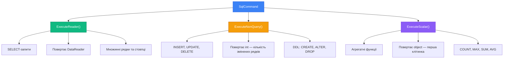

# 9.3. Клас DbCommand — виконання SQL-запитів

## Вступ: Як «говорити» з базою даних?

У попередній статті ми навчилися встановлювати з'єднання з SQL Server — по суті, «підняли телефонну трубку». Але сам по собі відкритий канал зв'язку нічого не дає. Щоб отримати дані або змінити їх, потрібно **надіслати команду** — SQL-запит.

Уявіть ресторан. `SqlConnection` — це те, що ви сіли за столик і вам дали меню. Але щоб отримати їжу, потрібно **зробити замовлення**. `SqlCommand` — це саме замовлення: ви формулюєте, що хочете («SELECT всі десерти WHERE ціна < 100»), передаєте офіціанту (SQL Server), і він приносить результат.

Клас `DbCommand` (і його конкретна реалізація `SqlCommand`) — це центральний компонент ADO.NET для виконання будь-яких SQL-операцій: від простих `SELECT`-запитів до складних збережених процедур. У цій статті ми детально розглянемо, як створювати, налаштовувати та виконувати команди, а також розберемо три основних методи виконання: `ExecuteReader()`, `ExecuteNonQuery()` та `ExecuteScalar()`.

::note
**Передумови**: Матеріал зі статей [9.1. Введення в ADO.NET](/1.csharp/09.ado-net/01.introduction-to-adonet) та [9.2. DbConnection](/1.csharp/09.ado-net/02.connection). Базове знання SQL (SELECT, INSERT, UPDATE, DELETE).

::

---

## Клас SqlCommand: Створення та налаштування

`SqlCommand` — це конкретна реалізація абстрактного класу `DbCommand` для MS SQL Server. Цей клас інкапсулює SQL-запит (або ім'я збереженої процедури) та параметри його виконання.

### Конструктори

Є кілька способів створити `SqlCommand`:

```csharp showLineNumbers
using Microsoft.Data.SqlClient;

string connectionString = "Server=localhost;Database=ShopDb;Trusted_Connection=True;TrustServerCertificate=True;";
using SqlConnection connection = new SqlConnection(connectionString);
connection.Open();

// Спосіб 1: Конструктор без параметрів
SqlCommand cmd1 = new SqlCommand();
cmd1.CommandText = "SELECT * FROM Products";
cmd1.Connection = connection;

// Спосіб 2: Конструктор з SQL-запитом та з'єднанням (найпоширеніший)
SqlCommand cmd2 = new SqlCommand("SELECT * FROM Products", connection);

// Спосіб 3: Через метод CreateCommand() з'єднання
SqlCommand cmd3 = connection.CreateCommand();
cmd3.CommandText = "SELECT * FROM Products";

// Спосіб 4: З транзакцією (розглянемо у статті про транзакції)
// SqlCommand cmd4 = new SqlCommand("...", connection, transaction);
```

**Який спосіб обрати?** У 90% випадків — **Спосіб 2**: він найкоротший і одразу прив'язує команду до з'єднання. Спосіб 3 (`CreateCommand()`) корисний, коли ви працюєте з абстрактним `DbConnection` і не знаєте конкретний тип провайдера.

### Основні властивості

::field-group

::field{name="CommandText" type="string" required}
SQL-запит або ім'я збереженої процедури для виконання. Це обов'язкова властивість — без неї команда не має сенсу.

::

::field{name="Connection" type="SqlConnection" required}
З'єднання, через яке буде виконано команду. З'єднання **мусить бути відкритим** на момент виклику Execute-методу.

::

::field{name="CommandType" type="CommandType" default="CommandType.Text"}
Тип команди. Визначає, як SQL Server інтерпретуватиме `CommandText`. Можливі значення:
- `Text` — звичайний SQL-запит (за замовчуванням)
- `StoredProcedure` — ім'я збереженої процедури
- `TableDirect` — ім'я таблиці (рідко використовується, не підтримується SqlClient)

::

::field{name="CommandTimeout" type="int" default="30"}
Час очікування виконання команди у секундах. Якщо запит не завершиться за цей час, буде кинуто `SqlException`. Значення `0` означає нескінченне очікування.

::

::field{name="Parameters" type="SqlParameterCollection"}
Колекція параметрів запиту. Детально розглянемо у [статті про параметри](/1.csharp/09.ado-net/05.parameters-and-sql-injection).

::

::field{name="Transaction" type="SqlTransaction"}
Транзакція, в рамках якої виконується команда. Детально — у [статті про транзакції](/1.csharp/09.ado-net/06.transactions).

::

::field{name="UpdatedRowSource" type="UpdateRowSource"}
Визначає, як результати команди застосовуються до `DataRow` при використанні `DataAdapter`. Використовується рідко при прямому ADO.NET.

::

::

### CommandType: Три типи команд

Властивість `CommandType` визначає, як SQL Server «розуміє» текст у `CommandText`:

::tabs

::tabs-item{label="Text (SQL-запит)"}

```csharp showLineNumbers
// CommandType.Text — за замовчуванням
// CommandText містить SQL-запит у вигляді рядка
using SqlCommand command = new SqlCommand(
    "SELECT Id, Name, Price FROM Products WHERE Price > 1000",
    connection);
// command.CommandType = CommandType.Text; // не потрібно — це значення за замовчуванням
```

Це найпоширеніший режим. SQL-запит надсилається на сервер «як є», SQL Server розбирає його (parsing), будує план виконання та повертає результати.

::

::tabs-item{label="StoredProcedure"}

```csharp showLineNumbers
// CommandType.StoredProcedure
// CommandText містить ЛИШЕ ім'я процедури (без EXEC, без дужок)
using SqlCommand command = new SqlCommand("GetProductsByCategory", connection);
command.CommandType = CommandType.StoredProcedure;

// Параметри процедури додаються через Parameters
command.Parameters.AddWithValue("@CategoryId", 5);
```

При `CommandType.StoredProcedure` ADO.NET автоматично формує правильний виклик процедури через протокол TDS RPC (Remote Procedure Call). Це **ефективніше**, ніж писати `EXEC GetProductsByCategory @CategoryId = 5` у CommandText з `CommandType.Text`, оскільки RPC-виклик дозволяє SQL Server пропустити етап розбору SQL-тексту.

::

::tabs-item{label="TableDirect"}

```csharp showLineNumbers
// CommandType.TableDirect
// Повертає ВСІ рядки з таблиці (еквівалент SELECT * FROM ...)
// ⚠️ НЕ підтримується SqlClient для SQL Server!
// Працює лише з деякими OLE DB провайдерами
using SqlCommand command = new SqlCommand("Products", connection);
command.CommandType = CommandType.TableDirect; // SqlException!
```

`TableDirect` — це історичний артефакт з ери OLE DB. У `Microsoft.Data.SqlClient` він **не підтримується** і кине виняток. Ви будете зустрічати його лише в документації — ніколи не використовуйте.

::

::

---

## Три методи виконання: Головна тріада

`SqlCommand` має три основних методи виконання, кожен призначений для конкретного типу SQL-операції. Вибір правильного методу — це ключова навичка при роботі з ADO.NET.

::mermaid



::

::card-group

::card{title="ExecuteReader()" icon="i-heroicons-table-cells"}
**Коли**: SELECT-запити, що повертають **набір рядків**.
**Повертає**: `SqlDataReader` — потоковий курсор для читання рядків.
**Приклад**: `SELECT * FROM Products WHERE Price > 100`

::

::card{title="ExecuteNonQuery()" icon="i-heroicons-pencil-square"}
**Коли**: INSERT, UPDATE, DELETE, або DDL-операції (CREATE TABLE, DROP, ALTER).
**Повертає**: `int` — кількість рядків, змінених запитом.
**Приклад**: `DELETE FROM Products WHERE Id = 5`

::

::card{title="ExecuteScalar()" icon="i-heroicons-calculator"}
**Коли**: Запит повертає **одне значення** (перший стовпець першого рядка).
**Повертає**: `object?` — значення першої клітинки результату.
**Приклад**: `SELECT COUNT(*) FROM Products`

::

::

Давайте розглянемо кожен метод детально з повними прикладами.

---

## ExecuteNonQuery(): INSERT, UPDATE, DELETE

`ExecuteNonQuery()` використовується для SQL-команд, які **змінюють** дані або структуру бази: INSERT, UPDATE, DELETE, CREATE TABLE, ALTER TABLE, DROP TABLE тощо. Метод повертає `int` — **кількість рядків, які були змінені** (affected rows).

### INSERT: Додавання нових даних

```csharp showLineNumbers
using System;
using Microsoft.Data.SqlClient;

string connectionString = "Server=localhost;Database=ShopDb;Trusted_Connection=True;TrustServerCertificate=True;";
using SqlConnection connection = new SqlConnection(connectionString);
connection.Open();

// Створюємо INSERT-команду
string insertSql = @"
    INSERT INTO Products (Name, Price, Quantity)
    VALUES (N'Монітор 32""', 18999.99, 10)";

using SqlCommand command = new SqlCommand(insertSql, connection);

// Виконуємо та перевіряємо результат
int rowsAffected = command.ExecuteNonQuery();
Console.WriteLine($"Вставлено рядків: {rowsAffected}"); // Вивід: 1
```

**Розбір коду:**

- **Рядки 9-11**: SQL-запит `INSERT INTO` додає новий рядок у таблицю `Products`. Зверніть увагу на `N'...'` — це літерал Unicode-рядка в T-SQL, що важливо для коректного збереження українських символів.
- **Рядок 13**: Створюємо `SqlCommand` з SQL-текстом та відкритим з'єднанням.
- **Рядок 16**: `ExecuteNonQuery()` надсилає запит на SQL Server і повертає `1` — тому що було вставлено один рядок.

::warning
**Увага!** У цьому прикладі значення вставлені **напряму** у SQL-рядок. Це **небезпечно** і вразливо до SQL Injection. У [статті про параметри](/1.csharp/09.ado-net/05.parameters-and-sql-injection) ми покажемо правильний підхід — параметризовані запити. Тут ми використовуємо конкатенацію лише для простоти демонстрації `ExecuteNonQuery()`.

::

### UPDATE: Оновлення існуючих даних

```csharp showLineNumbers
using Microsoft.Data.SqlClient;

string connectionString = "Server=localhost;Database=ShopDb;Trusted_Connection=True;TrustServerCertificate=True;";
using SqlConnection connection = new SqlConnection(connectionString);
connection.Open();

// Підвищуємо ціну на 10% для всіх товарів з ціною менше 1000
string updateSql = "UPDATE Products SET Price = Price * 1.10 WHERE Price < 1000";

using SqlCommand command = new SqlCommand(updateSql, connection);
int rowsAffected = command.ExecuteNonQuery();

Console.WriteLine($"Оновлено рядків: {rowsAffected}");

if (rowsAffected == 0)
{
    Console.WriteLine("⚠️ Жоден рядок не відповідає умові WHERE.");
}
else
{
    Console.WriteLine($"✅ Ціну підвищено для {rowsAffected} товарів.");
}
```

**Розбір коду:**

- **Рядок 8**: `UPDATE ... SET ... WHERE` змінює ціну для рядків, що відповідають умові.
- **Рядок 11**: `ExecuteNonQuery()` повертає **кількість змінених рядків**. Якщо жоден рядок не відповідає `WHERE`, повернеться `0` — це **не помилка**, а валідний результат.
- **Рядки 15-22**: Перевіряємо `rowsAffected` — гарна практика, що дозволяє зрозуміти, чи дійсно операція вплинула на дані.

### DELETE: Видалення даних

```csharp showLineNumbers
using Microsoft.Data.SqlClient;

string connectionString = "Server=localhost;Database=ShopDb;Trusted_Connection=True;TrustServerCertificate=True;";
using SqlConnection connection = new SqlConnection(connectionString);
connection.Open();

// Видаляємо товари з кількістю 0
string deleteSql = "DELETE FROM Products WHERE Quantity = 0";

using SqlCommand command = new SqlCommand(deleteSql, connection);
int rowsAffected = command.ExecuteNonQuery();

Console.WriteLine($"Видалено рядків: {rowsAffected}");
```

### DDL-операції: CREATE, ALTER, DROP

`ExecuteNonQuery()` також використовується для DDL (Data Definition Language) — операцій зі структурою бази:

```csharp showLineNumbers
using Microsoft.Data.SqlClient;

string connectionString = "Server=localhost;Database=ShopDb;Trusted_Connection=True;TrustServerCertificate=True;";
using SqlConnection connection = new SqlConnection(connectionString);
connection.Open();

// Створення таблиці
string createTableSql = @"
    IF NOT EXISTS (SELECT * FROM sys.tables WHERE name = 'Logs')
    BEGIN
        CREATE TABLE Logs (
            Id       INT IDENTITY(1,1) PRIMARY KEY,
            Message  NVARCHAR(500) NOT NULL,
            Level    NVARCHAR(20) NOT NULL DEFAULT 'INFO',
            Created  DATETIME2 NOT NULL DEFAULT GETDATE()
        );
    END";

using SqlCommand command = new SqlCommand(createTableSql, connection);
int result = command.ExecuteNonQuery();

Console.WriteLine($"Результат DDL: {result}");
// Для DDL ExecuteNonQuery() повертає -1 (немає "affected rows")
```

**Розбір коду:**

- **Рядки 8-17**: SQL-запит спочатку перевіряє, чи таблиця вже існує (`IF NOT EXISTS`), і створює її лише за потреби. Це ідемпотентний (idempotent) підхід — безпечний для повторного виконання.
- **Рядок 22**: Для DDL-операцій `ExecuteNonQuery()` повертає `-1`, оскільки DDL не змінює рядки даних у традиційному розумінні.

---

## ExecuteScalar(): Одне значення

`ExecuteScalar()` — це спеціалізований метод для запитів, які повертають **одне значення** — перший стовпець першого рядка результату. Все інше ігнорується. Метод повертає `object?`, який потрібно привести до потрібного типу.

**Коли використовувати?** Для агрегатних функцій (`COUNT`, `SUM`, `AVG`, `MAX`, `MIN`), отримання `SCOPE_IDENTITY()` після INSERT, перевірки існування або будь-якого запиту, який за логікою повертає одне значення.

```csharp showLineNumbers
using System;
using Microsoft.Data.SqlClient;

string connectionString = "Server=localhost;Database=ShopDb;Trusted_Connection=True;TrustServerCertificate=True;";
using SqlConnection connection = new SqlConnection(connectionString);
connection.Open();

// Кількість товарів
using SqlCommand countCmd = new SqlCommand("SELECT COUNT(*) FROM Products", connection);
object? countResult = countCmd.ExecuteScalar();
int totalProducts = Convert.ToInt32(countResult);
Console.WriteLine($"Кількість товарів: {totalProducts}");

// Середня ціна
using SqlCommand avgCmd = new SqlCommand("SELECT AVG(Price) FROM Products", connection);
decimal avgPrice = Convert.ToDecimal(avgCmd.ExecuteScalar());
Console.WriteLine($"Середня ціна: {avgPrice:C}");

// Максимальна ціна
using SqlCommand maxCmd = new SqlCommand("SELECT MAX(Price) FROM Products", connection);
decimal maxPrice = Convert.ToDecimal(maxCmd.ExecuteScalar());
Console.WriteLine($"Найдорожчий товар: {maxPrice:C}");

// Загальна вартість складу
using SqlCommand totalCmd = new SqlCommand(
    "SELECT SUM(Price * Quantity) FROM Products", connection);
decimal totalValue = Convert.ToDecimal(totalCmd.ExecuteScalar());
Console.WriteLine($"Загальна вартість: {totalValue:C}");
```

**Розбір коду:**

- **Рядок 10**: `ExecuteScalar()` повертає `object?` — це може бути `int`, `decimal`, `string`, `DateTime` або `DBNull.Value` (якщо результат SQL — `NULL`).
- **Рядок 11**: Використовуємо `Convert.ToInt32()` замість прямого `(int)` cast, тому що SQL Server може повернути `long` для `COUNT(*)` на великих таблицях, і `Convert` коректно обробляє це.
- **Рядок 16**: Для грошових обчислень завжди використовуйте `decimal`, а не `double` — `decimal` забезпечує точність до 28-29 знаків, що критично для фінансових операцій.

### Обробка NULL-результатів

Якщо результат SQL-запиту — це `NULL` (наприклад, `SELECT AVG(Price) FROM Products WHERE 1=0` — порожня таблиця), `ExecuteScalar()` поверне `DBNull.Value`, а не C# `null`:

```csharp showLineNumbers
using SqlCommand cmd = new SqlCommand(
    "SELECT AVG(Price) FROM Products WHERE 1 = 0", // Порожній результат
    connection);

object? result = cmd.ExecuteScalar();

// ❌ Неправильно — кине InvalidCastException!
// decimal price = (decimal)result;

// ✅ Правильно — перевіряємо на DBNull
if (result != null && result != DBNull.Value)
{
    decimal price = Convert.ToDecimal(result);
    Console.WriteLine($"Середня ціна: {price:C}");
}
else
{
    Console.WriteLine("Немає даних для обчислення.");
}

// ✅ Або компактніше через is-pattern
decimal? nullablePrice = result is DBNull or null ? null : Convert.ToDecimal(result);
Console.WriteLine($"Ціна: {nullablePrice?.ToString("C") ?? "N/A"}");
```

**Розбір коду:**

- **Рядок 8**: Прямий cast `(decimal)result` впаде з `InvalidCastException`, якщо `result` — це `DBNull.Value`.
- **Рядок 11**: Перевіряємо на **обидва** стани: `null` (якщо запит не повернув жодного рядка) та `DBNull.Value` (якщо значення стовпця — SQL NULL).
- **Рядок 22**: Компактний спосіб через C# pattern matching.

::tip
**Порада**: `ExecuteScalar()` повертає `null`, якщо результат **порожній** (жодного рядка), і `DBNull.Value`, якщо значення першого стовпця — SQL `NULL`. Це тонка, але важлива різниця!

::

### INSERT + SCOPE_IDENTITY: Отримання ID нового рядка

Дуже поширений сценарій: вставити рядок і одразу отримати його автоматично згенерований `Id`:

```csharp showLineNumbers
using Microsoft.Data.SqlClient;

string connectionString = "Server=localhost;Database=ShopDb;Trusted_Connection=True;TrustServerCertificate=True;";
using SqlConnection connection = new SqlConnection(connectionString);
connection.Open();

// INSERT + SELECT SCOPE_IDENTITY() — в одному batch
string insertSql = @"
    INSERT INTO Products (Name, Price, Quantity)
    VALUES (N'Вебкамера', 1599.00, 25);

    SELECT CAST(SCOPE_IDENTITY() AS INT);";

using SqlCommand command = new SqlCommand(insertSql, connection);
object? result = command.ExecuteScalar();

int newId = Convert.ToInt32(result);
Console.WriteLine($"Новий товар створено з Id = {newId}");
```

**Розбір коду:**

- **Рядки 8-12**: Два SQL-запити в одному batch (розділені `;`). Перший — INSERT, другий — `SELECT SCOPE_IDENTITY()`, який повертає останній згенерований IDENTITY-код у поточному scope.
- **Рядок 12**: `CAST(SCOPE_IDENTITY() AS INT)` — `SCOPE_IDENTITY()` повертає `decimal`(38,0), тому краще одразу привести до потрібного типу.
- **Рядок 15**: `ExecuteScalar()` виконує **весь batch**, але повертає результат **першого SELECT** — тобто наш новий Id.

::warning
**Чому `SCOPE_IDENTITY()`, а не `@@IDENTITY`?** `@@IDENTITY` повертає останній IDENTITY **у будь-якому scope**, включно з тригерами. Якщо на таблиці Products є тригер, який вставляє рядок в іншу таблицю з IDENTITY, `@@IDENTITY` поверне ID з **іншої** таблиці! `SCOPE_IDENTITY()` повертає IDENTITY лише в поточному scope — це **завжди** правильний вибір.

::

---

## ExecuteReader(): Читання множинних результатів

`ExecuteReader()` — це найпотужніший метод, який використовується для SELECT-запитів, що повертають **набір рядків**. Метод повертає `SqlDataReader` — об'єкт для потокового читання результатів. Ми детально розглянемо `DataReader` у [наступній статті](/1.csharp/09.ado-net/04.datareader), а тут познайомимося з базовим використанням.

```csharp showLineNumbers
using System;
using Microsoft.Data.SqlClient;

string connectionString = "Server=localhost;Database=ShopDb;Trusted_Connection=True;TrustServerCertificate=True;";
using SqlConnection connection = new SqlConnection(connectionString);
connection.Open();

string sql = "SELECT Id, Name, Price, Quantity FROM Products ORDER BY Price DESC";

using SqlCommand command = new SqlCommand(sql, connection);
using SqlDataReader reader = command.ExecuteReader();

// Заголовок таблиці
Console.WriteLine($"{"ID",-5} {"Назва",-25} {"Ціна",12} {"К-ть",8} {"Вартість",14}");
Console.WriteLine(new string('═', 66));

// Читаємо рядки по одному
int rowCount = 0;
decimal grandTotal = 0;

while (reader.Read())
{
    int id = reader.GetInt32(0);          // Стовпець "Id"
    string name = reader.GetString(1);     // Стовпець "Name"
    decimal price = reader.GetDecimal(2);  // Стовпець "Price"
    int quantity = reader.GetInt32(3);     // Стовпець "Quantity"

    decimal lineTotal = price * quantity;
    grandTotal += lineTotal;
    rowCount++;

    Console.WriteLine($"{id,-5} {name,-25} {price,12:C} {quantity,8} {lineTotal,14:C}");
}

Console.WriteLine(new string('═', 66));
Console.WriteLine($"{"Разом:",-44} {rowCount,8} {grandTotal,14:C}");
```

**Розбір коду:**

- **Рядок 11**: `ExecuteReader()` надсилає SELECT-запит і повертає `SqlDataReader`. На цьому етапі дані ще **не завантажені** — вони «чекають» на сервері.
- **Рядок 21**: `reader.Read()` завантажує **наступний рядок** з результатів. Повертає `true`, якщо рядок є, `false` — якщо рядки закінчилися. Перший виклик `Read()` завантажує **перший** рядок (а не другий!).
- **Рядки 23-26**: Типізовані методи `GetInt32()`, `GetString()`, `GetDecimal()` читають значення стовпків за **порядковим номером** (0-indexed). Ці методи ефективніші за `reader["Name"]`, але вразливіші до зміни порядку стовпців у SELECT.
- Зверніть увагу: `SqlDataReader` також обгорнутий у `using`, бо він утримує з'єднання та мережеві ресурси.

---

## Повторне використання SqlCommand

`SqlCommand` можна використовувати повторно, змінюючи `CommandText` між виконаннями. Це безпечно і іноді зручно:

```csharp showLineNumbers
using Microsoft.Data.SqlClient;

string connectionString = "Server=localhost;Database=ShopDb;Trusted_Connection=True;TrustServerCertificate=True;";
using SqlConnection connection = new SqlConnection(connectionString);
connection.Open();

using SqlCommand command = connection.CreateCommand();

// Запит 1: кількість товарів
command.CommandText = "SELECT COUNT(*) FROM Products";
int count = Convert.ToInt32(command.ExecuteScalar());
Console.WriteLine($"Товарів: {count}");

// Запит 2: середня ціна (той самий об'єкт command)
command.CommandText = "SELECT AVG(Price) FROM Products";
decimal avg = Convert.ToDecimal(command.ExecuteScalar());
Console.WriteLine($"Середня ціна: {avg:C}");

// Запит 3: вставка нового товару
command.CommandText = @"
    INSERT INTO Products (Name, Price, Quantity)
    VALUES (N'USB-хаб', 599.00, 40)";
int inserted = command.ExecuteNonQuery();
Console.WriteLine($"Вставлено: {inserted}");
```

Однак будьте обережні: якщо ви додавали параметри (`command.Parameters`), вони **залишаться** після зміни `CommandText`. Завжди очищуйте параметри, якщо повторно використовуєте команду з іншим запитом:

```csharp
command.Parameters.Clear(); // Очистити параметри перед новим запитом
```

---

## Batch-виконання: Кілька запитів в одній команді

SQL Server підтримує виконання кількох SQL-інструкцій в одній команді (batch). Інструкції розділяються символом `;`:

```csharp showLineNumbers
using System;
using Microsoft.Data.SqlClient;

string connectionString = "Server=localhost;Database=ShopDb;Trusted_Connection=True;TrustServerCertificate=True;";
using SqlConnection connection = new SqlConnection(connectionString);
connection.Open();

// Batch: кілька команд в одному запиті
string batchSql = @"
    UPDATE Products SET Quantity = Quantity - 1 WHERE Name = N'Ноутбук';
    UPDATE Products SET Quantity = Quantity + 5 WHERE Name = N'Клавіатура';
    DELETE FROM Products WHERE Quantity <= 0;";

using SqlCommand command = new SqlCommand(batchSql, connection);
int totalAffected = command.ExecuteNonQuery();

Console.WriteLine($"Загалом змінено рядків: {totalAffected}");
// totalAffected = сума affected rows від УСІХ запитів у batch
```

**Розбір коду:**

- **Рядки 9-12**: Три SQL-інструкції в одному batch, розділені `;`.
- **Рядок 15**: `ExecuteNonQuery()` для batch повертає **суму** affected rows від усіх інструкцій. Наприклад, якщо перший UPDATE змінив 1 рядок, другий — 1 рядок, DELETE — 0 рядків, результат буде `2`.

::note
**Batch vs Transaction**: Batch — це просто кілька SQL-команд, відправлених разом. Це **не транзакція** — якщо другий запит впаде, перший **вже буде виконаний** і не відкотиться. Для атомарності використовуйте транзакції (наступна стаття).

::

---

## CommandTimeout: Управління часом очікування

За замовчуванням SQL Server дає команді **30 секунд** на виконання. Якщо запит складніший (наприклад, обробка мільйонів рядків), 30 секунд може бути недостатньо:

```csharp showLineNumbers
using Microsoft.Data.SqlClient;

string connectionString = "Server=localhost;Database=ShopDb;Trusted_Connection=True;TrustServerCertificate=True;";
using SqlConnection connection = new SqlConnection(connectionString);
connection.Open();

using SqlCommand command = new SqlCommand(
    "SELECT * FROM VeryLargeTable WHERE ComplexCondition = 1",
    connection);

// Збільшуємо таймаут для довгих запитів
command.CommandTimeout = 120; // 120 секунд (2 хвилини)

// Або вимикаємо таймаут повністю (обережно!)
// command.CommandTimeout = 0; // Нескінченне очікування

try
{
    using SqlDataReader reader = command.ExecuteReader();
    // ... обробка результатів ...
}
catch (SqlException ex) when (ex.Number == -2) // Timeout
{
    Console.WriteLine("⏱️ Запит перевищив таймаут!");
    Console.WriteLine("   Рекомендації:");
    Console.WriteLine("   1. Оптимізуйте SQL-запит (додайте індекси)");
    Console.WriteLine("   2. Зменшіть обсяг даних (WHERE, TOP)");
    Console.WriteLine("   3. Збільшіть CommandTimeout як останній варіант");
}
```

**Розбір коду:**

- **Рядок 12**: `CommandTimeout` задається **для кожної команди окремо** (на відміну від `ConnectionTimeout`, який задається у Connection String).
- **Рядок 22**: Код помилки `-2` — це таймаут виконання SQL-запиту. Обробляємо його окремо.

::caution
**Не встановлюйте `CommandTimeout = 0`** (нескінченне очікування) без вагомої причини! Якщо запит «зависне» (наприклад, через deadlock), ваш додаток теж «зависне» назавжди. Краще збільшити таймаут до розумного значення (наприклад, 300 секунд) і обробити виняток.

::

---

## SQL-запит з форматуванням: Читабельність

Коли SQL-запити стають довгими, їх важко читати як однорядкові рядки C#. Використовуйте verbatim-рядки (`@"..."`) або raw string literals (C# 11+) для читабельного форматування:

```csharp showLineNumbers
// ✅ Добре: verbatim string з форматуванням
string sql = @"
    SELECT
        p.Id,
        p.Name,
        p.Price,
        c.Name AS CategoryName
    FROM Products p
    INNER JOIN Categories c ON p.CategoryId = c.Id
    WHERE p.Price BETWEEN 500 AND 5000
      AND p.Quantity > 0
    ORDER BY p.Price DESC";

// ✅ Ще краще: raw string literal (C# 11+)
string sqlRaw = """
    SELECT
        p.Id,
        p.Name,
        p.Price,
        c.Name AS CategoryName
    FROM Products p
    INNER JOIN Categories c ON p.CategoryId = c.Id
    WHERE p.Price BETWEEN 500 AND 5000
      AND p.Quantity > 0
    ORDER BY p.Price DESC
    """;

// ❌ Погано: конкатенація рядків
string sqlBad = "SELECT p.Id, p.Name, p.Price, c.Name AS CategoryName " +
                "FROM Products p " +
                "INNER JOIN Categories c ON p.CategoryId = c.Id " +
                "WHERE p.Price BETWEEN 500 AND 5000 " +
                "AND p.Quantity > 0 " +
                "ORDER BY p.Price DESC";
```

---

## Обробка помилок SQL-запитів

Помилки при виконанні SQL-запитів — це повсякденна реальність. SQL Server повертає помилки через `SqlException`, яка містить детальну інформацію про причину збою:

```csharp showLineNumbers
using System;
using Microsoft.Data.SqlClient;

string connectionString = "Server=localhost;Database=ShopDb;Trusted_Connection=True;TrustServerCertificate=True;";
using SqlConnection connection = new SqlConnection(connectionString);
connection.Open();

try
{
    // Запит з помилкою: таблиця не існує
    using SqlCommand command = new SqlCommand(
        "SELECT * FROM NonExistentTable", connection);
    using SqlDataReader reader = command.ExecuteReader();
}
catch (SqlException ex)
{
    Console.WriteLine($"❌ SQL Error #{ex.Number}: {ex.Message}");
    Console.WriteLine($"   Severity: {ex.Class}");
    Console.WriteLine($"   State: {ex.State}");
    Console.WriteLine($"   Server: {ex.Server}");
    Console.WriteLine($"   Procedure: {ex.Procedure}");
    Console.WriteLine($"   Line: {ex.LineNumber}");

    // Колекція всіх помилок
    Console.WriteLine($"\n   Усі помилки ({ex.Errors.Count}):");
    foreach (SqlError error in ex.Errors)
    {
        Console.WriteLine($"   [{error.Number}] {error.Message}");
    }
}
```

### Типові коди помилок SQL-запитів

| Код | Причина | Приклад |
|:---|:---|:---|
| **208** | Таблиця не існує | `SELECT * FROM NonExistentTable` |
| **207** | Стовпець не існує | `SELECT NonExistentColumn FROM Products` |
| **547** | Порушення FK | DELETE батьківського рядка, на який є посилання |
| **2627** | Порушення UNIQUE | INSERT дублікату |
| **2601** | Порушення UNIQUE INDEX | Дублікат у унікальному індексі |
| **515** | NULL у NOT NULL стовпець | INSERT без обов'язкового поля |
| **8152** | Рядок занадто довгий | VARCHAR(10) отримує рядок з 20 символів |
| **1205** | Deadlock | Взаємне блокування транзакцій |
| **-2** | Таймаут | Запит не завершився за CommandTimeout |

---

## Anti-patterns: SQL Injection

Перед тим як перейти до наступної теми, необхідно звернути увагу на **найнебезпечніший anti-pattern** в ADO.NET — **конкатенацію користувацьких даних у SQL-запит**:

::caution
**SQL Injection** — це одна з найбільш поширених та найнебезпечніших вразливостей у веб-додатках. Вона входить до [OWASP Top 10](https://owasp.org/www-project-top-ten/).

::

```csharp showLineNumbers
// ❌ НІКОЛИ НЕ РОБІТЬ ТАК!
Console.Write("Введіть назву товару: ");
string userInput = Console.ReadLine()!; // Що введе користувач?

// Якщо userInput = "Ноутбук' OR '1'='1" — ОТРИМАЄМО ВСІ рядки!
// Якщо userInput = "'; DROP TABLE Products; --" — ВТРАТИМО ТАБЛИЦЮ!

string dangerousSql = $"SELECT * FROM Products WHERE Name = '{userInput}'";
using SqlCommand command = new SqlCommand(dangerousSql, connection);
```

Якщо зловмисний користувач введе `'; DROP TABLE Products; --`, ваш SQL-запит стане:

```sql
SELECT * FROM Products WHERE Name = ''; DROP TABLE Products; --'
```

SQL Server виконає **два** запити: порожній SELECT та `DROP TABLE Products`. Ваша таблиця зникне.

**Рішення**: Завжди використовуйте **параметризовані запити**, які ми детально розглянемо у [статті 9.5](/1.csharp/09.ado-net/05.parameters-and-sql-injection). Ось як виглядає безпечний код:

```csharp showLineNumbers
// ✅ ПРАВИЛЬНО: параметризований запит
string safeSql = "SELECT * FROM Products WHERE Name = @Name";
using SqlCommand command = new SqlCommand(safeSql, connection);
command.Parameters.AddWithValue("@Name", userInput);
// Тепер userInput — це просто ЗНАЧЕННЯ, а не частина SQL-коду
```

У безпечному варіанті `userInput` передається як **параметр** і ніколи не стає частиною SQL-коду. SQL Server чітко розрізняє «код» (SQL-запит) та «дані» (значення параметра).

---

## Повний приклад: CRUD-операції

Об'єднаємо все вивчене в одну програму, яка виконує всі чотири CRUD-операції:

```csharp showLineNumbers
using System;
using Microsoft.Data.SqlClient;

string connectionString = "Server=localhost;Database=ShopDb;Trusted_Connection=True;TrustServerCertificate=True;";
using SqlConnection connection = new SqlConnection(connectionString);
connection.Open();

Console.WriteLine("╔═══════════════════════════════════╗");
Console.WriteLine("║   📦 CRUD Demo: Products Table     ║");
Console.WriteLine("╚═══════════════════════════════════╝\n");

using SqlCommand command = connection.CreateCommand();

// === CREATE (INSERT) ===
Console.WriteLine("📝 CREATE: Додаємо новий товар...");
command.CommandText = @"
    INSERT INTO Products (Name, Price, Quantity)
    VALUES (N'Зарядний пристрій', 899.99, 60);
    SELECT CAST(SCOPE_IDENTITY() AS INT);";
int newId = Convert.ToInt32(command.ExecuteScalar());
Console.WriteLine($"   ✅ Створено товар з Id = {newId}");

// === READ (SELECT) ===
Console.WriteLine("\n📖 READ: Читаємо всі товари...");
command.CommandText = "SELECT Id, Name, Price, Quantity FROM Products ORDER BY Id";
using (SqlDataReader reader = command.ExecuteReader())
{
    Console.WriteLine($"   {"ID",-5} {"Назва",-25} {"Ціна",10} {"К-ть",6}");
    Console.WriteLine($"   {new string('-', 48)}");
    while (reader.Read())
    {
        Console.WriteLine(
            $"   {reader.GetInt32(0),-5} " +
            $"{reader.GetString(1),-25} " +
            $"{reader.GetDecimal(2),10:N2} " +
            $"{reader.GetInt32(3),6}");
    }
}

// === UPDATE ===
Console.WriteLine($"\n✏️ UPDATE: Змінюємо ціну товару Id={newId}...");
command.CommandText = $"UPDATE Products SET Price = 749.99 WHERE Id = {newId}";
int updated = command.ExecuteNonQuery();
Console.WriteLine($"   ✅ Оновлено рядків: {updated}");

// === DELETE ===
Console.WriteLine($"\n🗑️ DELETE: Видаляємо товар Id={newId}...");
command.CommandText = $"DELETE FROM Products WHERE Id = {newId}";
int deleted = command.ExecuteNonQuery();
Console.WriteLine($"   ✅ Видалено рядків: {deleted}");

// === Перевірка ===
Console.WriteLine("\n📊 Фінальний стан:");
command.CommandText = "SELECT COUNT(*) FROM Products";
Console.WriteLine($"   Товарів у базі: {command.ExecuteScalar()}");
```

**Розбір коду:**

- **Рядок 12**: Використовуємо `connection.CreateCommand()` і повторно використовуємо один і той самий `command` для всіх операцій, змінюючи `CommandText`.
- **Рядок 20**: INSERT + SCOPE_IDENTITY через `ExecuteScalar()` — отримуємо Id нового рядка.
- **Рядок 26-39**: SELECT через `ExecuteReader()`, обгорнутий у `using`-блок. Зверніть увагу: ми використовуємо **блок** `using (...)` замість декларації `using`, тому що після закриття reader ми хочемо повторно використовувати `command`.
- **Рядки 43, 49**: UPDATE та DELETE через `ExecuteNonQuery()`.

::warning
У цьому прикладі `newId` підставляється через інтерполяцію рядка (`$"...{newId}..."`). Це безпечно **лише тому**, що `newId` — це `int`, згенерований нашим кодом, а не введений користувачем. Для будь-яких даних від користувача завжди використовуйте параметризовані запити!

::

---

## Практичні завдання

### Рівень 1: Базовий

::steps

### Завдання 1.1: Статистика бази даних

Створіть програму, яка підключається до SQL Server і за допомогою `ExecuteScalar()` виводить:
1. Кількість таблиць у базі даних (`SELECT COUNT(*) FROM sys.tables`)
2. Кількість збережених процедур (`SELECT COUNT(*) FROM sys.procedures`)
3. Загальний розмір бази даних (використайте `sp_spaceused`)

### Завдання 1.2: Перевірка існування

Напишіть метод `bool TableExists(SqlConnection connection, string tableName)`, який за допомогою `ExecuteScalar()` перевіряє, чи існує таблиця з заданою назвою в базі. Використайте запит до `sys.tables` або `INFORMATION_SCHEMA.TABLES`.

::

### Рівень 2: Логіка та обробка даних

::steps

### Завдання 2.1: Звіт по товарах

Створіть базу даних з таблицями `Categories` та `Products` (з FK). Напишіть програму, яка:
1. Виводить кількість товарів у кожній категорії (підказка: `GROUP BY` + `ExecuteReader()`).
2. Виводить сумарну вартість товарів (ціна × кількість) по кожній категорії.
3. Знаходить категорію з найбільшою кількістю товарів.
4. Форматує результат у красиву таблицю з ASCII-графікою.

### Завдання 2.2: Журнал подій

Створіть таблицю `EventLog` (Id, EventType, Message, CreatedAt) і напишіть клас `EventLogger`:
1. Метод `Log(string eventType, string message)` — вставляє запис і повертає ID.
2. Метод `GetEventCount(string eventType)` — повертає кількість подій заданого типу.
3. Метод `GetLatestEvents(int count)` — повертає останні N подій (SELECT TOP).
4. Метод `ClearOldEvents(int daysOld)` — видаляє події старші за N днів.

::

### Рівень 3: Архітектура

::steps

### Завдання 3.1: Інтерактивний менеджер товарів

Створіть консольний додаток з меню:
1. **Переглянути** всі товари (SELECT + ExecuteReader)
2. **Додати** товар (INSERT + ExecuteScalar для SCOPE_IDENTITY)
3. **Оновити** ціну товару за Id (UPDATE + ExecuteNonQuery)
4. **Видалити** товар за Id (DELETE + ExecuteNonQuery)
5. **Пошук** за назвою (SELECT з LIKE)
6. **Статистика** (COUNT, AVG, MAX, MIN через ExecuteScalar)

Забезпечте обробку помилок (SqlException) та валідацію введення.

### Завдання 3.2: Клас SqlQueryExecutor

Створіть утилітарний клас `SqlQueryExecutor`, який інкапсулює типові операції:
1. Конструктор приймає Connection String.
2. `T? ExecuteScalar<T>(string sql)` — виконує запит і повертає типізований результат.
3. `int ExecuteCommand(string sql)` — повертає affected rows.
4. `List<Dictionary<string, object>> ExecuteQuery(string sql)` — повертає список рядків як словники.
5. Усі методи обробляють `SqlException` та `DBNull`.
6. Кожен метод самостійно відкриває/закриває з'єднання (щоб не утримувати його зайво).

::

---

## Резюме

::card-group

::card{title="Три методи Execute" icon="i-heroicons-play-circle"}
`ExecuteReader()` для SELECT, `ExecuteNonQuery()` для INSERT/UPDATE/DELETE, `ExecuteScalar()` для одного значення. Вибір методу визначається типом SQL-операції.

::

::card{title="CommandType" icon="i-heroicons-adjustments-horizontal"}
`Text` для SQL-запитів (за замовчуванням), `StoredProcedure` для збережених процедур. `TableDirect` не підтримується SqlClient.

::

::card{title="CommandTimeout" icon="i-heroicons-clock"}
30 секунд за замовчуванням. Збільшуйте свідомо для довгих запитів. `0` = нескінченне очікування (небезпечно).

::

::card{title="SQL Injection" icon="i-heroicons-shield-exclamation"}
Ніколи не конкатенуйте дані користувача в SQL! Завжди використовуйте параметризовані запити. Це критична вразливість безпеки.

::

::

### Ключові поняття

- **SqlCommand** — об'єкт, що інкапсулює SQL-запит та параметри його виконання
- **ExecuteReader()** — потокове читання результатів SELECT (повертає `SqlDataReader`)
- **ExecuteNonQuery()** — виконання INSERT/UPDATE/DELETE (повертає кількість змінених рядків)
- **ExecuteScalar()** — отримання одного значення (повертає `object?`)
- **SCOPE_IDENTITY()** — отримання ID останнього вставленого рядка
- **CommandTimeout** — максимальний час виконання запиту в секундах
- **Batch** — виконання кількох SQL-команд в одному запиті

::tip
**Наступний крок**: У наступній статті ми детально розглянемо `SqlDataReader` — ефективний потоковий курсор для читання результатів SELECT. Дізнаємося про типізовані методи, обробку NULL, маппінг на POCO-об'єкти та Multiple Result Sets.

::
