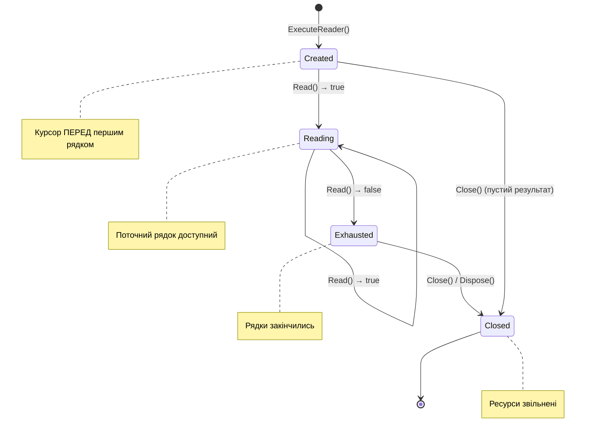

# 9.4. Клас DbDataReader — ефективне читання даних

## Вступ: Що повертає ExecuteReader()?

У попередній статті ми дізнались, що `ExecuteReader()` повертає загадковий об'єкт `SqlDataReader`. Ми навіть використали його для виведення даних. Але що це за об'єкт? Чому він «потоковий»? Чим він відрізняється від простого `List<T>`? І як ефективно працювати з ним, щоб не наступити на типові підводні камені?

**DataReader** — це об'єкт, який дозволяє читати результати SQL-запиту **рядок за рядком**, як **курсор** у текстовому файлі. Ви не завантажуєте всі 10 000 рядків у пам'ять одразу — ви обробляєте їх по одному. Це робить DataReader неймовірно **ефективним** за використанням пам'яті, але також накладає обмеження: ви можете рухатися лише **вперед** (forward-only), і кожен рядок доступний лише для **читання** (read-only).

**Аналогія**: DataReader — це як **стрічка конвеєра** на заводі. Деталі (рядки даних) проїжджають повз вас одна за одною. Ви можете взяти деталь, оглянути її, покласти в коробку — але повернути конвеєр назад або зупинити його ви не можете. Якщо пропустили деталь — вона поїхала далі.

Інша аналогія — це **потокове відео** (streaming). Коли ви дивитесь фільм на Netflix, він не завантажується цілком — кадри надходять послідовно. DataReader працює так само: дані «течуть» з SQL Server до вашого додатку.

::note
**Передумови**: Матеріал зі статей [9.1. Введення в ADO.NET](/1.csharp/09.ado-net/01.introduction-to-adonet), [9.2. DbConnection](/1.csharp/09.ado-net/02.connection) та [9.3. DbCommand](/1.csharp/09.ado-net/03.command-and-queries).

::

---

## Концепція: Forward-Only, Read-Only курсор

`SqlDataReader` реалізує дві важливі інтерфейси: `IDataReader` (навігація) та `IDataRecord` (доступ до полів). Давайте розберемося, що означає «forward-only, read-only» і чому це так.

### Чому forward-only?

Коли SQL Server виконує SELECT-запит, він не «збирає» всі рядки в один масив, а починає **надсилати їх потоком** через мережу протоколом TDS. DataReader отримує ці рядки один за одним і робить поточний рядок доступним для читання. Після виклику `Read()` попередній рядок **зникає** — він більше не зберігається в пам'яті.

Це принципова відмінність від `DataSet`, який завантажує **всі** дані в оперативну пам'ять. DataReader зберігає в пам'яті лише **один рядок** — поточний. Для запиту, що повертає 1 мільйон рядків, DataReader використає кілька кілобайт пам'яті, тоді як DataSet — сотні мегабайт.

### Чому read-only?

DataReader — це «вікно» в результати запиту, що надходять з сервера. Ви не можете змінити ці дані «на місці» в DataReader і надіслати їх назад — для цього потрібно створювати окремі UPDATE-команди. DataReader лише **читає**.

### Життєвий цикл DataReader

::mermaid



::

Зверніть увагу на важливу деталь: **після створення** DataReader курсор стоїть **перед** першим рядком, а не на ньому. Тому перший виклик `Read()` переміщує курсор на перший рядок. Це частий джерело плутанини для початківців.

---

## Клас SqlDataReader: API

`SqlDataReader` — це конкретна реалізація `DbDataReader` для MS SQL Server. Він надає багатий набір методів для типобезпечного доступу до даних.

### Основні властивості

::field-group

::field{name="FieldCount" type="int"}
Кількість стовпців у поточному наборі результатів. Корисно для динамічної обробки результатів, коли ви не знаєте структуру заздалегідь.

::

::field{name="HasRows" type="bool"}
Чи має результат хоча б один рядок. Дозволяє перевірити, чи є дані, **до** виклику `Read()`. Зверніть увагу: ця властивість не «споживає» рядки — після її перевірки ви все ще можете читати дані.

::

::field{name="IsClosed" type="bool"}
Чи закритий DataReader. Після `Close()` або `Dispose()` стає `true`.

::

::field{name="RecordsAffected" type="int"}
Кількість рядків, змінених SQL-операціями в batch. Для SELECT повертає `-1`.

::

::field{name="Depth" type="int"}
Рівень вкладеності для вкладених запитів. Завжди `0` для SQL Server.

::

::

### Методи навігації

::field-group

::field{name="Read()" type="bool"}
Переміщує курсор на наступний рядок. Повертає `true`, якщо рядок існує, `false` — якщо рядки закінчилися. **Перший** виклик переміщує на перший рядок.

::

::field{name="ReadAsync(CancellationToken)" type="Task<bool>"}
Асинхронна версія `Read()`. Рекомендується для ASP.NET та UI-додатків.

::

::field{name="NextResult()" type="bool"}
Переходить до наступного набору результатів (якщо запит повертав кілька SELECT). Повертає `true`, якщо наступний набір існує.

::

::field{name="NextResultAsync(CancellationToken)" type="Task<bool>"}
Асинхронна версія `NextResult()`.

::

::field{name="Close()" type="void"}
Закриває DataReader та звільняє з'єднання. Після виклику дані недоступні.

::

::

### Типізовані методи доступу до даних

Ці методи читають значення конкретного стовпця за його **порядковим номером** (ordinal, 0-indexed) та повертають значення потрібного C#-типу:

::field-group

::field{name="GetInt32(ordinal)" type="int"}
Читає значення як 32-бітне ціле число. Відповідає SQL Server типам `int`.

::

::field{name="GetInt64(ordinal)" type="long"}
Читає як 64-бітне ціле. Відповідає `bigint`.

::

::field{name="GetInt16(ordinal)" type="short"}
Читає як 16-бітне ціле. Відповідає `smallint`.

::

::field{name="GetByte(ordinal)" type="byte"}
Відповідає `tinyint`.

::

::field{name="GetBoolean(ordinal)" type="bool"}
Відповідає `bit`.

::

::field{name="GetString(ordinal)" type="string"}
Читає як рядок. Відповідає `varchar`, `nvarchar`, `char`, `nchar`.

::

::field{name="GetDecimal(ordinal)" type="decimal"}
Відповідає `decimal`, `numeric`, `money`, `smallmoney`.

::

::field{name="GetDouble(ordinal)" type="double"}
Відповідає `float`.

::

::field{name="GetFloat(ordinal)" type="float"}
Відповідає `real`.

::

::field{name="GetDateTime(ordinal)" type="DateTime"}
Відповідає `datetime`, `datetime2`, `date`, `smalldatetime`.

::

::field{name="GetGuid(ordinal)" type="Guid"}
Відповідає `uniqueidentifier`.

::

::field{name="GetValue(ordinal)" type="object"}
Повертає значення як `object` — корисно, коли тип невідомий заздалегідь.

::

::field{name="IsDBNull(ordinal)" type="bool"}
Перевіряє, чи є значення стовпця SQL `NULL`. **Завжди** викликайте перед типізованим методом, якщо стовпець допускає NULL!

::

::

### Нетипізований доступ: Індексатор

Окрім типізованих методів, `SqlDataReader` підтримує доступ через індексатор за **ім'ям стовпця** або **порядковим номером**:

```csharp showLineNumbers
// Доступ за порядковим номером — повертає object
object value = reader[0];

// Доступ за ім'ям стовпця — повертає object
object value = reader["Name"];

// Отримання ordinal за ім'ям (для подальшого використання типізованих методів)
int nameOrdinal = reader.GetOrdinal("Name");
string name = reader.GetString(nameOrdinal);
```

**Що обрати?** Типізовані методи з ordinal (`GetInt32(0)`) — найшвидші, бо уникають boxing та пошуку за ім'ям. Індексатор за ім'ям (`reader["Name"]`) — найчитабільніший, але повільніший через пошук стовпця та boxing. Оптимальний підхід — **кешувати ordinal** через `GetOrdinal()` на початку і використовувати типізовані методи:

```csharp showLineNumbers
using SqlDataReader reader = command.ExecuteReader();

// Кешуємо ordinal-и один раз
int idOrdinal = reader.GetOrdinal("Id");
int nameOrdinal = reader.GetOrdinal("Name");
int priceOrdinal = reader.GetOrdinal("Price");

while (reader.Read())
{
    int id = reader.GetInt32(idOrdinal);
    string name = reader.GetString(nameOrdinal);
    decimal price = reader.GetDecimal(priceOrdinal);
    // ... використовуємо дані ...
}
```

Цей підхід поєднує **читабельність** (в коді видно ім'я стовпця) з **продуктивністю** (lookup за ім'ям виконується лише один раз).

---

## Базовий шаблон використання

Ось «золотий стандарт» читання даних через DataReader:

```csharp showLineNumbers
using System;
using Microsoft.Data.SqlClient;

string connectionString = "Server=localhost;Database=ShopDb;Trusted_Connection=True;TrustServerCertificate=True;";
using SqlConnection connection = new SqlConnection(connectionString);
connection.Open();

string sql = "SELECT Id, Name, Price, Quantity FROM Products WHERE Price > 500 ORDER BY Name";
using SqlCommand command = new SqlCommand(sql, connection);
using SqlDataReader reader = command.ExecuteReader();

// Перевіряємо, чи є дані
if (!reader.HasRows)
{
    Console.WriteLine("Товари не знайдені.");
    return;
}

// Кешуємо ordinal-и
int idOrd = reader.GetOrdinal("Id");
int nameOrd = reader.GetOrdinal("Name");
int priceOrd = reader.GetOrdinal("Price");
int qtyOrd = reader.GetOrdinal("Quantity");

// Читаємо рядок за рядком
while (reader.Read())
{
    int id = reader.GetInt32(idOrd);
    string name = reader.GetString(nameOrd);
    decimal price = reader.GetDecimal(priceOrd);
    int quantity = reader.GetInt32(qtyOrd);

    Console.WriteLine($"[{id}] {name}: {price:C} x {quantity}");
}
```

**Розбір коду:**

- **Рядок 10**: `using` — DataReader **обов'язково** закривається. Відкритий DataReader **блокує з'єднання** (ви не можете виконати інші команди на тому ж з'єднанні, поки DataReader відкритий).
- **Рядки 13-17**: `HasRows` дозволяє перевірити наявність даних до початку циклу. Це зручно для виведення повідомлення «нічого не знайдено».
- **Рядки 20-23**: Кешуємо ordinal-и один раз **до** циклу.
- **Рядок 26**: `while (reader.Read())` — ідіоматичний паттерн ітерації по DataReader.

---

## Обробка NULL-значень

Стовпці в базі даних можуть містити `NULL` — спеціальне значення, яке означає «невідомо» або «відсутнє». Якщо ви спробуєте прочитати NULL-значення через типізований метод (наприклад, `GetString()`), ADO.NET кине `InvalidCastException`. Тому **перед** читанням потенційно NULL-стовпця завжди перевіряйте через `IsDBNull()`.

Уявімо, що в таблиці Products є необов'язковий стовпець `Description`:

```sql
ALTER TABLE Products ADD Description NVARCHAR(500) NULL;
```

```csharp showLineNumbers
using Microsoft.Data.SqlClient;

string connectionString = "Server=localhost;Database=ShopDb;Trusted_Connection=True;TrustServerCertificate=True;";
using SqlConnection connection = new SqlConnection(connectionString);
connection.Open();

using SqlCommand command = new SqlCommand(
    "SELECT Id, Name, Description FROM Products", connection);
using SqlDataReader reader = command.ExecuteReader();

int descOrd = reader.GetOrdinal("Description");

while (reader.Read())
{
    int id = reader.GetInt32(0);
    string name = reader.GetString(1);

    // ✅ Перевіряємо на NULL перед читанням
    string? description = reader.IsDBNull(descOrd)
        ? null
        : reader.GetString(descOrd);

    // Або через метод GetValue() + перевірка DBNull
    // object rawValue = reader.GetValue(descOrd);
    // string? description = rawValue == DBNull.Value ? null : (string)rawValue;

    Console.WriteLine($"[{id}] {name}");
    Console.WriteLine($"    Опис: {description ?? "(не вказано)"}");
}
```

**Розбір коду:**

- **Рядки 19-21**: Тернарний оператор з `IsDBNull()` — найчистіший спосіб обробки NULL. Якщо значення NULL, присвоюємо C# `null`, інакше — читаємо рядок.
- **Рядки 24-25**: Альтернативний підхід через `GetValue()`, який повертає `object`. Якщо значення SQL NULL, повернеться `DBNull.Value` (не C# `null`!).

### Хелпер-метод для зручності

Оскільки перевірка на NULL потрібна часто, зручно створити extension-метод:

```csharp showLineNumbers
using System;
using System.Data;
using Microsoft.Data.SqlClient;

// Extension-методи для SqlDataReader
public static class DataReaderExtensions
{
    // Читає рядок або повертає null
    public static string? GetNullableString(this SqlDataReader reader, int ordinal)
    {
        return reader.IsDBNull(ordinal) ? null : reader.GetString(ordinal);
    }

    // Читає int або повертає null
    public static int? GetNullableInt32(this SqlDataReader reader, int ordinal)
    {
        return reader.IsDBNull(ordinal) ? null : reader.GetInt32(ordinal);
    }

    // Читає decimal або повертає null
    public static decimal? GetNullableDecimal(this SqlDataReader reader, int ordinal)
    {
        return reader.IsDBNull(ordinal) ? null : reader.GetDecimal(ordinal);
    }

    // Читає DateTime або повертає null
    public static DateTime? GetNullableDateTime(this SqlDataReader reader, int ordinal)
    {
        return reader.IsDBNull(ordinal) ? null : reader.GetDateTime(ordinal);
    }

    // Універсальний метод через GetFieldValue<T>
    public static T? GetNullableValue<T>(this SqlDataReader reader, int ordinal) where T : struct
    {
        return reader.IsDBNull(ordinal) ? null : reader.GetFieldValue<T>(ordinal);
    }
}
```

Тепер код читання стає значно чистіший:

```csharp showLineNumbers
while (reader.Read())
{
    int id = reader.GetInt32(0);
    string name = reader.GetString(1);
    string? description = reader.GetNullableString(2);
    decimal? discountPrice = reader.GetNullableDecimal(3);
    DateTime? expiryDate = reader.GetNullableDateTime(4);
}
```

---

## Маппінг DataReader → POCO-об'єкти

У реальних додатках ви рідко працюєте з «сирими» даними з DataReader. Замість цього ви **маппите** (відображаєте) рядки результатів на об'єкти ваших класів (POCO — Plain Old CLR Objects). Це базовий паттерн, який використовують усі ORM (Object-Relational Mapping) під капотом.

### Крок 1: Визначаємо клас-модель

```csharp showLineNumbers
// Модель товару — POCO-клас
public class Product
{
    public int Id { get; set; }
    public string Name { get; set; } = string.Empty;
    public decimal Price { get; set; }
    public int Quantity { get; set; }
    public string? Description { get; set; }

    public override string ToString()
    {
        return $"[{Id}] {Name} — {Price:C} (x{Quantity})";
    }
}
```

### Крок 2: Базовий маппінг

```csharp showLineNumbers
using System;
using System.Collections.Generic;
using Microsoft.Data.SqlClient;

string connectionString = "Server=localhost;Database=ShopDb;Trusted_Connection=True;TrustServerCertificate=True;";

List<Product> LoadProducts()
{
    List<Product> products = new List<Product>();

    using SqlConnection connection = new SqlConnection(connectionString);
    connection.Open();

    using SqlCommand command = new SqlCommand(
        "SELECT Id, Name, Price, Quantity, Description FROM Products ORDER BY Name",
        connection);
    using SqlDataReader reader = command.ExecuteReader();

    // Кешуємо ordinal-и
    int idOrd = reader.GetOrdinal("Id");
    int nameOrd = reader.GetOrdinal("Name");
    int priceOrd = reader.GetOrdinal("Price");
    int qtyOrd = reader.GetOrdinal("Quantity");
    int descOrd = reader.GetOrdinal("Description");

    while (reader.Read())
    {
        Product product = new Product
        {
            Id = reader.GetInt32(idOrd),
            Name = reader.GetString(nameOrd),
            Price = reader.GetDecimal(priceOrd),
            Quantity = reader.GetInt32(qtyOrd),
            Description = reader.IsDBNull(descOrd) ? null : reader.GetString(descOrd)
        };
        products.Add(product);
    }

    return products;
}

// Використання
List<Product> products = LoadProducts();
foreach (var p in products)
{
    Console.WriteLine(p);
}
```

**Розбір коду:**

- **Рядки 7-39**: Метод `LoadProducts()` повністю інкапсулює роботу з ADO.NET. Він відкриває з'єднання, виконує запит, маппить рядки на об'єкти та повертає `List<Product>`. Зверніть увагу: з'єднання закривається **автоматично** завдяки `using`, навіть якщо маппінг кине виняток.
- **Рядки 28-36**: Маппінг одного рядка DataReader на один об'єкт `Product` через ініціалізатор об'єкта.

### Крок 3: Хелпер-метод MapToProduct

Для чистішого коду виділимо маппінг в окремий метод:

```csharp showLineNumbers
// Маппінг одного рядка на Product
static Product MapToProduct(SqlDataReader reader)
{
    return new Product
    {
        Id = reader.GetInt32(reader.GetOrdinal("Id")),
        Name = reader.GetString(reader.GetOrdinal("Name")),
        Price = reader.GetDecimal(reader.GetOrdinal("Price")),
        Quantity = reader.GetInt32(reader.GetOrdinal("Quantity")),
        Description = reader.GetNullableString(reader.GetOrdinal("Description"))
    };
}

// Використання стає набагато чистішим
List<Product> LoadProducts()
{
    List<Product> products = new();

    using SqlConnection connection = new(connectionString);
    connection.Open();

    using SqlCommand cmd = new("SELECT * FROM Products ORDER BY Name", connection);
    using SqlDataReader reader = cmd.ExecuteReader();

    while (reader.Read())
    {
        products.Add(MapToProduct(reader));
    }

    return products;
}
```

::tip
**Це саме те, що роблять ORM!** Entity Framework Core та Dapper під капотом виконують **точно такий самий маппінг** — вони читають DataReader і створюють ваші об'єкти. Різниця лише в тому, що вони роблять це **автоматично** через рефлексію або генерацію коду, а ви — вручну. Розуміння цього ручного процесу допоможе вам зрозуміти, як працюють ORM і коли вони можуть бути неефективними.

::

---

## Multiple Result Sets: Кілька наборів результатів

SQL Server дозволяє повернути **кілька наборів результатів** (result sets) в одному запиті. Це корисно для зменшення кількості мережевих звернень:

```csharp showLineNumbers
using System;
using Microsoft.Data.SqlClient;

string connectionString = "Server=localhost;Database=ShopDb;Trusted_Connection=True;TrustServerCertificate=True;";
using SqlConnection connection = new SqlConnection(connectionString);
connection.Open();

// Один запит — три набори результатів
string multiSql = @"
    SELECT Id, Name, Price FROM Products WHERE Price < 1000;
    SELECT Id, Name, Price FROM Products WHERE Price BETWEEN 1000 AND 10000;
    SELECT Id, Name, Price FROM Products WHERE Price > 10000;";

using SqlCommand command = new SqlCommand(multiSql, connection);
using SqlDataReader reader = command.ExecuteReader();

// Набір 1: Дешеві товари
Console.WriteLine("=== Бюджетні (< 1000 ₴) ===");
while (reader.Read())
{
    Console.WriteLine($"  {reader.GetString(1)}: {reader.GetDecimal(2):C}");
}

// Переходимо до наступного набору результатів
if (reader.NextResult())
{
    Console.WriteLine("\n=== Середній діапазон (1000-10000 ₴) ===");
    while (reader.Read())
    {
        Console.WriteLine($"  {reader.GetString(1)}: {reader.GetDecimal(2):C}");
    }
}

// Третій набір
if (reader.NextResult())
{
    Console.WriteLine("\n=== Преміум (> 10000 ₴) ===");
    while (reader.Read())
    {
        Console.WriteLine($"  {reader.GetString(1)}: {reader.GetDecimal(2):C}");
    }
}
```

**Розбір коду:**

- **Рядки 9-12**: Три SELECT-запити в одному batch. SQL Server виконає їх послідовно і поверне три набори результатів.
- **Рядки 18-22**: Перший цикл `while (reader.Read())` читає результати **першого** SELECT.
- **Рядок 25**: `reader.NextResult()` переміщує курсор до **наступного** набору результатів. Повертає `true`, якщо набір існує.
- **Рядки 27-42**: Читаємо другий і третій набори аналогічно.

::warning
**Важливо**: Після `NextResult()` ordinal-и стовпців **можуть змінитися**, якщо структура наступного SELECT відрізняється від попереднього. Завжди використовуйте `GetOrdinal()` після переходу до нового набору, якщо стовпці можуть бути різними.

::

---

## DataReader і з'єднання: Важливі обмеження

DataReader має кілька важливих обмежень, які потрібно знати:

### Обмеження 1: DataReader блокує з'єднання

Поки `SqlDataReader` відкритий, з'єднання, через яке він працює, **зайняте** — ви не можете виконувати інші команди на цьому з'єднанні:

```csharp showLineNumbers
using SqlConnection connection = new SqlConnection(connectionString);
connection.Open();

using SqlCommand cmd1 = new SqlCommand("SELECT * FROM Products", connection);
using SqlDataReader reader = cmd1.ExecuteReader();

// ❌ Це кине InvalidOperationException!
// "There is already an open DataReader associated with this Connection"
using SqlCommand cmd2 = new SqlCommand("SELECT COUNT(*) FROM Products", connection);
// object count = cmd2.ExecuteScalar(); // ПОМИЛКА!

// Рішення 1: Закрити DataReader перед новою командою
reader.Close();
object count = cmd2.ExecuteScalar(); // ✅ Тепер працює
```

### Рішення: MARS (Multiple Active Result Sets)

Якщо вам потрібно виконувати кілька команд одночасно на одному з'єднанні, увімкніть **MARS** у Connection String:

```csharp showLineNumbers
string connectionString =
    "Server=localhost;Database=ShopDb;Trusted_Connection=True;" +
    "TrustServerCertificate=True;" +
    "MultipleActiveResultSets=True;"; // ← Увімкнення MARS

using SqlConnection connection = new SqlConnection(connectionString);
connection.Open();

using SqlCommand cmd1 = new SqlCommand("SELECT * FROM Products", connection);
using SqlDataReader reader = cmd1.ExecuteReader();

while (reader.Read())
{
    int categoryId = reader.GetInt32(reader.GetOrdinal("CategoryId"));

    // ✅ З MARS — можна виконувати інші команди на тому ж з'єднанні
    using SqlCommand cmd2 = new SqlCommand(
        $"SELECT Name FROM Categories WHERE Id = {categoryId}", connection);
    string? categoryName = cmd2.ExecuteScalar()?.ToString();

    Console.WriteLine($"{reader.GetString(1)} — Категорія: {categoryName}");
}
```

::caution
**MARS має обмеження**: Він збільшує складність управління з'єднанням і може вплинути на продуктивність. У більшості випадків краще використовувати **JOIN** у SQL-запиті або **окреме з'єднання** замість MARS.

::

### Обмеження 2: Не забувайте Dispose

DataReader утримує мережеві ресурси. Якщо ви не закриєте його (через `using` або `Close()`), з'єднання залишиться заблокованим, навіть якщо ви вже не використовуєте DataReader:

```csharp
// ❌ Витік ресурсів!
SqlDataReader reader = command.ExecuteReader();
// Забули reader.Close() — з'єднання заблоковане!

// ✅ Завжди через using
using SqlDataReader reader = command.ExecuteReader();
```

---

## Порівняння: DataReader vs DataSet

::card-group

::card{title="📖 DataReader (Connected)" icon="i-heroicons-arrow-right-circle"}

- Forward-only, read-only
- Мінімальне споживання пам'яті
- Блокує з'єднання
- Найвища продуктивність для читання
- Дані обробляються «на льоту»
- Ідеальний для: звіти, завантаження великих наборів

::

::card{title="📦 DataSet (Disconnected)" icon="i-heroicons-archive-box"}

- Двонаправлена навігація
- Підтримка редагування та збереження
- Звільняє з'єднання після завантаження
- Більше споживання пам'яті
- Підтримка зв'язків між таблицями
- Ідеальний для: CRUD-форми, офлайн-робота

::

::

| Критерій | DataReader | DataSet |
|:---|:---|:---|
| **Навігація** | Тільки вперед (forward-only) | Будь-яка (random access) |
| **Пам'ять** | ~1 рядок в пам'яті | Усі рядки в пам'яті |
| **З'єднання** | Блокує до закриття | Звільняє після Fill() |
| **Зміна даних** | Read-only | Read/Write |
| **Серіалізація** | Ні | XML, JSON |
| **Продуктивність** | Найвища | Нижча (завантаження всіх даних) |
| **Зв'язки таблиць** | Ні | DataRelation |
| **Найкраще для** | Потокова обробка, звіти | Форми, офлайн, DataGrid |

---

## Метадані результатів: GetSchemaTable

`SqlDataReader` надає метод `GetSchemaTable()`, який повертає `DataTable` з інформацією про **структуру** результатів — назви стовпців, типи даних, допустимість NULL тощо. Це корисно для динамічної обробки запитів, коли структура заздалегідь невідома:

```csharp showLineNumbers
using System;
using System.Data;
using Microsoft.Data.SqlClient;

string connectionString = "Server=localhost;Database=ShopDb;Trusted_Connection=True;TrustServerCertificate=True;";
using SqlConnection connection = new SqlConnection(connectionString);
connection.Open();

using SqlCommand command = new SqlCommand("SELECT * FROM Products", connection);
using SqlDataReader reader = command.ExecuteReader();

// Отримуємо метадані стовпців
DataTable? schema = reader.GetSchemaTable();

if (schema != null)
{
    Console.WriteLine($"{"Стовпець",-20} {"Тип SQL",-15} {"Тип .NET",-15} {"NULL?",6} {"Розмір",8}");
    Console.WriteLine(new string('═', 66));

    foreach (DataRow row in schema.Rows)
    {
        string colName = row["ColumnName"].ToString()!;
        string sqlType = row["DataTypeName"].ToString()!;
        Type netType = (Type)row["DataType"];
        bool allowNull = (bool)row["AllowDBNull"];
        int size = (int)row["ColumnSize"];

        Console.WriteLine($"{colName,-20} {sqlType,-15} {netType.Name,-15} {(allowNull ? "✅" : "❌"),6} {size,8}");
    }
}
```

---

## Повний приклад: Універсальний Table Viewer

Об'єднаємо все вивчене в утиліту, яка може вивести будь-яку таблицю у форматованому вигляді:

```csharp showLineNumbers
using System;
using System.Data;
using System.Text;
using Microsoft.Data.SqlClient;

string connectionString = "Server=localhost;Database=ShopDb;Trusted_Connection=True;TrustServerCertificate=True;";

void PrintQueryResults(string sql)
{
    using SqlConnection connection = new SqlConnection(connectionString);
    connection.Open();

    using SqlCommand command = new SqlCommand(sql, connection);
    using SqlDataReader reader = command.ExecuteReader();

    if (!reader.HasRows)
    {
        Console.WriteLine("(порожній результат)");
        return;
    }

    // Визначаємо ширину стовпців
    int fieldCount = reader.FieldCount;
    int[] widths = new int[fieldCount];
    string[] headers = new string[fieldCount];

    for (int i = 0; i < fieldCount; i++)
    {
        headers[i] = reader.GetName(i);
        widths[i] = Math.Max(headers[i].Length, 12);
    }

    // Заголовки
    StringBuilder headerLine = new();
    StringBuilder separator = new();

    for (int i = 0; i < fieldCount; i++)
    {
        headerLine.Append(headers[i].PadRight(widths[i] + 2));
        separator.Append(new string('─', widths[i] + 2));
    }

    Console.WriteLine(headerLine);
    Console.WriteLine(separator);

    // Дані
    int rowCount = 0;
    while (reader.Read())
    {
        StringBuilder line = new();
        for (int i = 0; i < fieldCount; i++)
        {
            string value = reader.IsDBNull(i) ? "NULL" : reader.GetValue(i).ToString()!;
            if (value.Length > widths[i])
                value = value[..(widths[i] - 2)] + "..";
            line.Append(value.PadRight(widths[i] + 2));
        }
        Console.WriteLine(line);
        rowCount++;
    }

    Console.WriteLine($"\n({rowCount} рядків)");
}

// Використання
PrintQueryResults("SELECT Id, Name, Price, Quantity FROM Products");
```

**Розбір коду:**

- **Рядок 14**: Метод приймає **будь-який** SQL-запит і виводить результати у форматі таблиці.
- **Рядки 27-31**: `reader.GetName(i)` повертає назву стовпця за ordinal. Використовуємо для формування заголовків.
- **Рядки 49-58**: Для кожного стовпця перевіряємо `IsDBNull`, потім `GetValue()` → `ToString()`. Це **універсальний** підхід, який працює з будь-яким типом.
- **Рядки 53-54**: Обрізаємо занадто довгі значення, щоб таблиця виглядала акуратно.

---

## Практичні завдання

### Рівень 1: Базовий

::steps

### Завдання 1.1: Типізоване читання

Створіть таблицю `Students` (Id, FirstName, LastName, BirthDate, GPA). Заповніть 5 рядками. Напишіть програму, яка читає всіх студентів через `SqlDataReader`, маппить на клас `Student` та виводить у форматі:
```
1. Іванов Іван (1999-05-15) — GPA: 3.85
```
Використовуйте типізовані методи та `GetOrdinal()`.

### Завдання 1.2: Обробка NULL

Додайте nullable стовпці `Phone` та `Email` до таблиці `Students`. Деякі записи залиште з NULL. Модифікуйте програму, щоб коректно обробляти NULL (використовуйте `IsDBNull()` або extension-методи). Виводіть `"(не вказано)"` замість NULL.

::

### Рівень 2: Логіка та обробка даних

::steps

### Завдання 2.1: Звіт з Multiple Result Sets

Створіть SQL-запит, який повертає три набори результатів:
1. Товари з ціною < 500 ₴
2. Товари з ціною 500–5000 ₴
3. Товари з ціною > 5000 ₴

Зчитайте всі три набори через `NextResult()` та виведіть як окремі секції звіту. В кінці підведіть підсумок: кількість товарів у кожній ціновій категорії.

### Завдання 2.2: CSV-експорт

Напишіть метод `ExportToCsv(string sql, string filePath)`, який:
1. Виконує будь-який SQL-запит.
2. Читає результати через DataReader.
3. Записує у CSV-файл (перший рядок — заголовки з `GetName()`, далі — дані).
4. Коректно обробляє NULL, DateTime та decimal значення.
5. Повертає кількість експортованих рядків.

::

### Рівень 3: Архітектура

::steps

### Завдання 3.1: Generic Repository з DataReader

Створіть generic-клас `Repository<T>` де `T` — POCO-клас. Клас повинен:
1. Приймати `Func<SqlDataReader, T> mapper` у конструкторі — функцію маппінгу.
2. Мати метод `List<T> GetAll(string sql)` — повертає всі рядки.
3. Мати метод `T? GetById(string sql, int id)` — повертає один рядок або null.
4. Мати метод `int Count(string tableName)` — кількість рядків.
Продемонструйте використання з класами `Product` та `Category`.

### Завдання 3.2: Пагінація результатів

Реалізуйте метод `PagedResult<T> GetPage<T>(string sql, int pageNumber, int pageSize, Func<SqlDataReader, T> mapper)`, який:
1. Додає до SQL-запиту `OFFSET @skip ROWS FETCH NEXT @take ROWS ONLY`.
2. Також виконує `SELECT COUNT(*)` для підрахунку загальової кількості.
3. Повертає об'єкт `PagedResult<T>` з властивостями: `Items`, `TotalCount`, `PageNumber`, `PageSize`, `TotalPages`.
4. Використовує Multiple Result Sets для виконання обох запитів в одному зверненні до бази.

::

---

## Резюме

::card-group

::card{title="Forward-Only курсор" icon="i-heroicons-arrow-right"}
DataReader читає рядки послідовно, використовуючи мінімум пам'яті. Ідеальний для читання великих наборів даних.

::

::card{title="Типізований доступ" icon="i-heroicons-shield-check"}
`GetInt32()`, `GetString()`, `GetDecimal()` забезпечують типобезпеку. Завжди перевіряйте `IsDBNull()` перед читанням nullable-стовпців.

::

::card{title="Маппінг на об'єкти" icon="i-heroicons-arrows-right-left"}
DataReader → POCO — базовий паттерн, який використовують всі ORM. Кешуйте ordinal-и через `GetOrdinal()` для продуктивності.

::

::card{title="NextResult()" icon="i-heroicons-queue-list"}
Multiple Result Sets дозволяють отримати кілька наборів даних в одному запиті, зменшуючи кількість мережевих звернень.

::

::

### Ключові поняття

- **DataReader** — forward-only, read-only курсор для потокового читання результатів
- **Ordinal** — порядковий номер стовпця (0-indexed), швидший за доступ за ім'ям
- **IsDBNull()** — обов'язкова перевірка перед читанням nullable-стовпців
- **NextResult()** — перехід до наступного набору результатів (Multiple Result Sets)
- **MARS** — Multiple Active Result Sets, дозволяє кілька відкритих DataReader на одному з'єднанні

::tip
**Наступний крок**: У наступній статті ми детально розглянемо **параметризовані запити** — безпечний та ефективний спосіб передачі даних у SQL-запити. Дізнаємось про `SqlParameter`, захист від SQL Injection та виклик збережених процедур.

::
