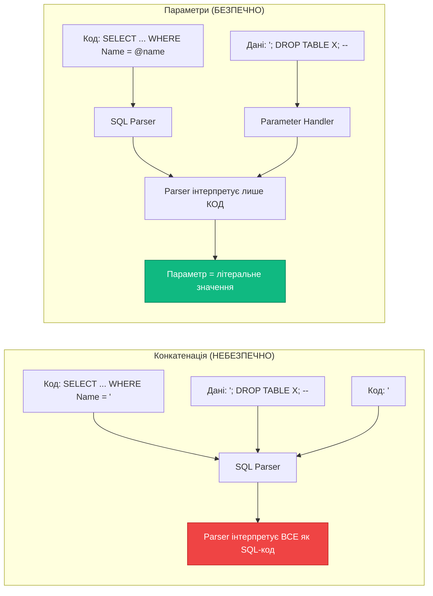

# 9.5. Параметризовані запити та захист від SQL Injection

## Вступ: Найнебезпечніша помилка у вебі

У попередніх статтях ми навчилися виконувати SQL-запити через `SqlCommand`, але при цьому припускалися **критичної помилки** — вставляли дані безпосередньо у SQL-рядок. Ми попереджали про це, і тепер час розібратися, чому це небезпечно і як зробити правильно.

**SQL Injection** (впровадження SQL) — це атака, при якій зловмисник маніпулює вхідними даними так, щоб змінити **логіку** SQL-запиту. Ця вразливість стабільно входить у [OWASP Top 10](https://owasp.org/www-project-top-ten/) — список найкритичніших ризиків безпеки веб-додатків. За даними різних звітів, SQL Injection залишається причиною понад 30% усіх зломів баз даних.

Уявіть, що ваш додаток — це будинок, а SQL-запит — це інструкція для робітника. Якщо ви кажете робітнику «Принеси коробку з полиці **X**», де X — те, що ввів користувач, зловмисник може ввести: «X, а потім знеси всі полиці і підпали будинок». Без параметризації ваш робітник виконає **все**, що йому сказали, тому що не відрізняє інструкції від даних.

У цій статті ми детально розберемо механіку SQL Injection, навчимося використовувати **параметризовані запити** як надійний захист, а також розглянемо виклик збережених процедур із передачею параметрів.

::note
**Передумови**: Статті [9.3. DbCommand](/1.csharp/09.ado-net/03.command-and-queries) та [9.4. DbDataReader](/1.csharp/09.ado-net/04.datareader). Базове розуміння SQL-синтаксису.
::

---

## Анатомія SQL Injection

### Вразливий код

Подивимось на типовий «наївний» код, який дозволяє SQL Injection:

```csharp showLineNumbers
// ❌ ВРАЗЛИВИЙ КОД — ніколи не робіть так!
Console.Write("Введіть назву товару для пошуку: ");
string userInput = Console.ReadLine()!;

string sql = $"SELECT Id, Name, Price FROM Products WHERE Name = '{userInput}'";
using SqlCommand command = new SqlCommand(sql, connection);
using SqlDataReader reader = command.ExecuteReader();
```

Якщо користувач введе `Ноутбук`, SQL-запит буде правильним:

```sql
SELECT Id, Name, Price FROM Products WHERE Name = 'Ноутбук'
```

Але що якщо введе щось інше?

### Класична атака: Обхід автентифікації

Уявімо форму логіну з таким «наївним» кодом:

```csharp showLineNumbers
// ❌ ВРАЗЛИВИЙ КОД ЛОГІНУ
string username = "admin";
string password = "' OR '1'='1";  // ← введення зловмисника

string sql = $"SELECT * FROM Users WHERE Username = '{username}' AND Password = '{password}'";
// Результат:
// SELECT * FROM Users WHERE Username = 'admin' AND Password = '' OR '1'='1'
```

Зловмисник ввів `' OR '1'='1` як пароль. SQL-запит тепер має умову `OR '1'='1'`, яка **завжди істинна**. Результат: зловмисник отримує доступ до облікового запису `admin` без знання пароля.

### Деструктивна атака: DROP TABLE

```csharp showLineNumbers
// Зловмисник вводить:
string userInput = "'; DROP TABLE Products; --";

string sql = $"SELECT * FROM Products WHERE Name = '{userInput}'";
// Результат:
// SELECT * FROM Products WHERE Name = ''; DROP TABLE Products; --'
```

Цей запит складається з **трьох** частин:
1. `SELECT * FROM Products WHERE Name = ''` — порожній результат
2. `DROP TABLE Products` — **видалення таблиці**
3. `--'` — коментар, який «нейтралізує» залишок вихідного запиту

::caution
Після виконання цього запиту таблиця `Products` **зникне безповоротно**. Якщо у вас немає актуальної резервної копії — дані втрачені назавжди.
::

### Union-based атака: Крадіжка даних

Ще підступніший варіант — зловмисник не руйнує базу, а **читає** дані, до яких не повинен мати доступу:

```csharp showLineNumbers
// Зловмисник вводить:
string userInput = "' UNION SELECT Id, Username, Password FROM Users --";

string sql = $"SELECT Id, Name, Price FROM Products WHERE Name = '{userInput}'";
// Результат:
// SELECT Id, Name, Price FROM Products WHERE Name = ''
// UNION SELECT Id, Username, Password FROM Users --'
```

`UNION` об'єднує результати двох SELECT. Зловмисник отримує **всі логіни та паролі** з таблиці Users, які відображаються замість товарів. Якщо паролі зберігаються в нехешованому вигляді — це повна компрометація системи.

### Як SQL Server «бачить» ін'єкцію

Проблема в тому, що SQL Server **не розрізняє** код (SQL-інструкції) та дані (значення параметрів), коли вони приходять як один рядок:

::mermaid



::

---

## Рішення: Параметризовані запити

**Параметризовані запити** (Parameterized Queries) — це **єдиний надійний** спосіб захисту від SQL Injection в ADO.NET. Ідея проста: SQL-код та дані передаються на сервер **окремо**. SQL Server знає, що `@name` — це **параметр**, а не частина SQL-коду, і ніколи не інтерпретуватиме його значення як SQL-інструкцію.

Ось як виглядає безпечний код:

```csharp showLineNumbers
// ✅ БЕЗПЕЧНИЙ КОД — параметризований запит
Console.Write("Введіть назву товару для пошуку: ");
string userInput = Console.ReadLine()!;

string sql = "SELECT Id, Name, Price FROM Products WHERE Name = @ProductName";
using SqlCommand command = new SqlCommand(sql, connection);

// Додаємо параметр — значення передається ОКРЕМО від SQL-коду
command.Parameters.AddWithValue("@ProductName", userInput);

using SqlDataReader reader = command.ExecuteReader();
```

Навіть якщо `userInput` містить `'; DROP TABLE Products; --`, SQL Server інтерпретує це як **літеральне значення** для порівняння, а не як SQL-код. Запит просто не знайде товар з такою «дивною» назвою і поверне порожній результат.

### Чому це працює?

При використанні параметрів ADO.NET надсилає запит через протокол TDS за механізмом **RPC** (Remote Procedure Call) від`sp_executesql`. SQL Server отримує:

1. **SQL-шаблон**: `SELECT Id, Name, Price FROM Products WHERE Name = @ProductName`
2. **Оголошення параметрів**: `@ProductName NVARCHAR(4000)`
3. **Значення параметрів**: `'; DROP TABLE Products; --`

SQL Server **спочатку** компілює SQL-шаблон (крок 1), а **потім** підставляє значення (крок 3). Значення ніколи не стає частиною SQL-коду — воно завжди залишається **даними**.

---

## Клас SqlParameter: Детальний API

`SqlParameter` — це клас, що інкапсулює один параметр SQL-запиту. Колекція параметрів доступна через `command.Parameters`.

### Основні властивості

::field-group

::field{name="ParameterName" type="string" required}
Ім'я параметра. Повинно починатися з `@` (наприклад, `@ProductName`). В SQL-запиті використовується як placeholder.
::

::field{name="Value" type="object" required}
Значення параметра. Може бути будь-якого .NET-типу; ADO.NET автоматично конвертує його у відповідний SQL-тип.
::

::field{name="SqlDbType" type="SqlDbType"}
Явний тип даних SQL Server (наприклад, `SqlDbType.NVarChar`, `SqlDbType.Int`, `SqlDbType.Decimal`). Якщо не вказано, визначається автоматично з `Value`.
::

::field{name="Size" type="int"}
Розмір параметра (для рядкових та бінарних типів). Наприклад, для `NVARCHAR(100)` — `Size = 100`.
::

::field{name="Direction" type="ParameterDirection" default="Input"}
Напрямок параметра:
- `Input` — вхідний (за замовчуванням)
- `Output` — вихідний (значення повертається від процедури)
- `InputOutput` — двонаправлений
- `ReturnValue` — значення `RETURN` збереженої процедури
::

::field{name="Precision" type="byte"}
Кількість цифр для `decimal`/`numeric` типів.
::

::field{name="Scale" type="byte"}
Кількість знаків після коми для `decimal`/`numeric`.
::

::field{name="IsNullable" type="bool"}
Чи допускає параметр NULL-значення.
::

::

### Способи додавання параметрів

ADO.NET надає кілька способів додати параметри до команди. Кожен має свої переваги та підводні камені:

::tabs

::tabs-item{label="AddWithValue()"}

```csharp showLineNumbers
// Найпростіший спосіб — ADO.NET автоматично визначає тип
command.Parameters.AddWithValue("@Name", "Ноутбук");
command.Parameters.AddWithValue("@Price", 25999.99m);
command.Parameters.AddWithValue("@Quantity", 15);
command.Parameters.AddWithValue("@CreatedAt", DateTime.Now);

// Для NULL-значень використовуйте DBNull.Value
command.Parameters.AddWithValue("@Description", (object?)description ?? DBNull.Value);
```

**Переваги**: Мінімум коду, зручний для швидкої розробки.

**Недоліки**: ADO.NET **вгадує** SQL-тип з .NET-типу, і це не завжди оптимально. Наприклад, C# `string` завжди стає `NVARCHAR(MAX)`, навіть якщо стовпець — `VARCHAR(50)`. Це може призвести до **implicit conversion** і **погіршення продуктивності** (SQL Server не зможе використати індекс).

::

::tabs-item{label="Add() з явним типом"}

```csharp showLineNumbers
// Явний тип — повний контроль, найкраща продуктивність
command.Parameters.Add("@Name", SqlDbType.NVarChar, 100).Value = "Ноутбук";

command.Parameters.Add("@Price", SqlDbType.Decimal);
command.Parameters["@Price"].Precision = 10;
command.Parameters["@Price"].Scale = 2;
command.Parameters["@Price"].Value = 25999.99m;

command.Parameters.Add("@Quantity", SqlDbType.Int).Value = 15;

// Для NULL
command.Parameters.Add("@Description", SqlDbType.NVarChar, 500).Value =
    (object?)description ?? DBNull.Value;
```

**Переваги**: Точний контроль типу та розміру. SQL Server отримує параметр точно того типу, що й стовпець таблиці — ніяких implicit conversion, оптимальне використання індексів.

**Недоліки**: Більше коду, потрібно знати SQL-типи стовпців.

::

::tabs-item{label="new SqlParameter()"}

```csharp showLineNumbers
// Створення параметра окремо, потім додавання
SqlParameter nameParam = new SqlParameter
{
    ParameterName = "@Name",
    SqlDbType = SqlDbType.NVarChar,
    Size = 100,
    Value = "Ноутбук"
};
command.Parameters.Add(nameParam);

// Або коротшим конструктором
command.Parameters.Add(
    new SqlParameter("@Price", SqlDbType.Decimal) { Value = 25999.99m });
```

**Переваги**: Максимальна гнучкість, зручно для складних сценаріїв (OUTPUT-параметри).

::

::

### Проблеми AddWithValue(): Чому це важливо?

::warning
`AddWithValue()` — це **зручний, але потенційно небезпечний** метод щодо продуктивності. Ось чому:
::

Коли ви пишете:
```csharp
command.Parameters.AddWithValue("@Name", "Ноутбук");
```

ADO.NET бачить, що `"Ноутбук"` — це `string` (C#), і перетворює його у `NVARCHAR(7)` (SQL). Але стовпець у таблиці може бути `VARCHAR(100)`. SQL Server повинен виконати **неявну конвертацію** (implicit conversion) при порівнянні — це може призвести до:

1. **Index scan замість index seek** — SQL Server не зможе ефективно використати індекс, і замість пошуку одного рядка просканує всю таблицю.
2. **Різні плани кешування** — `NVARCHAR(7)` і `NVARCHAR(8)` — це різні типи, тому для кожної довжини рядка буде окремий план запиту у кеші.

**Рекомендація**: Для production-коду використовуйте `Add()` з явним типом. Для прототипів та навчального коду `AddWithValue()` прийнятний.

---

## Повний приклад: Безпечний CRUD

```csharp showLineNumbers
using System;
using Microsoft.Data.SqlClient;

string connectionString = "Server=localhost;Database=ShopDb;Trusted_Connection=True;TrustServerCertificate=True;";
using SqlConnection connection = new SqlConnection(connectionString);
connection.Open();

// === CREATE (INSERT з параметрами) ===
int InsertProduct(string name, decimal price, int quantity, string? description)
{
    string sql = @"
        INSERT INTO Products (Name, Price, Quantity, Description)
        VALUES (@Name, @Price, @Quantity, @Description);
        SELECT CAST(SCOPE_IDENTITY() AS INT);";

    using SqlCommand cmd = new SqlCommand(sql, connection);
    cmd.Parameters.Add("@Name", SqlDbType.NVarChar, 100).Value = name;
    cmd.Parameters.Add("@Price", SqlDbType.Decimal).Value = price;
    cmd.Parameters.Add("@Quantity", SqlDbType.Int).Value = quantity;
    cmd.Parameters.Add("@Description", SqlDbType.NVarChar, 500).Value =
        (object?)description ?? DBNull.Value;

    return Convert.ToInt32(cmd.ExecuteScalar());
}

// === READ (SELECT з параметрами) ===
void SearchProducts(string searchTerm, decimal? minPrice, decimal? maxPrice)
{
    string sql = @"
        SELECT Id, Name, Price, Quantity
        FROM Products
        WHERE Name LIKE @Search
          AND (@MinPrice IS NULL OR Price >= @MinPrice)
          AND (@MaxPrice IS NULL OR Price <= @MaxPrice)
        ORDER BY Price";

    using SqlCommand cmd = new SqlCommand(sql, connection);
    cmd.Parameters.Add("@Search", SqlDbType.NVarChar, 100).Value = $"%{searchTerm}%";
    cmd.Parameters.Add("@MinPrice", SqlDbType.Decimal).Value =
        (object?)minPrice ?? DBNull.Value;
    cmd.Parameters.Add("@MaxPrice", SqlDbType.Decimal).Value =
        (object?)maxPrice ?? DBNull.Value;

    using SqlDataReader reader = cmd.ExecuteReader();
    while (reader.Read())
    {
        Console.WriteLine($"  [{reader.GetInt32(0)}] {reader.GetString(1)}: {reader.GetDecimal(2):C}");
    }
}

// === UPDATE (з параметрами) ===
int UpdatePrice(int productId, decimal newPrice)
{
    string sql = "UPDATE Products SET Price = @Price WHERE Id = @Id";

    using SqlCommand cmd = new SqlCommand(sql, connection);
    cmd.Parameters.Add("@Price", SqlDbType.Decimal).Value = newPrice;
    cmd.Parameters.Add("@Id", SqlDbType.Int).Value = productId;

    return cmd.ExecuteNonQuery();
}

// === DELETE (з параметрами) ===
int DeleteProduct(int productId)
{
    string sql = "DELETE FROM Products WHERE Id = @Id";

    using SqlCommand cmd = new SqlCommand(sql, connection);
    cmd.Parameters.Add("@Id", SqlDbType.Int).Value = productId;

    return cmd.ExecuteNonQuery();
}

// Використання
int id = InsertProduct("Монітор 4K", 18999.99m, 10, "32 дюйми, IPS");
Console.WriteLine($"Створено товар Id={id}");

Console.WriteLine("\nПошук 'Монітор':");
SearchProducts("Монітор", null, null);

UpdatePrice(id, 16999.99m);
Console.WriteLine($"\nОновлено ціну для Id={id}");

DeleteProduct(id);
Console.WriteLine($"Видалено товар Id={id}");
```

**Розбір коду:**

- **Рядки 32-33**: Складний фільтр з optional-параметрами. Конструкція `@MinPrice IS NULL OR Price >= @MinPrice` дозволяє параметру бути «необов'язковим» — якщо він NULL, умова ігнорується.
- **Рядок 38**: `$"%{searchTerm}%"` — додаємо wildcard-символи для `LIKE` на стороні C#, а не в SQL. Сам `searchTerm` залишається безпечним параметром.
- **Рядки 20-21, 40-42**: Для NULL-значень використовуємо `(object?)value ?? DBNull.Value` — це стандартний паттерн в ADO.NET, бо `SqlParameter.Value` очікує `DBNull.Value`, а не C# `null`.

---

## Виклик збережених процедур

Збережені процедури (Stored Procedures) — це іменовані набори SQL-інструкцій, що зберігаються в базі даних. Вони мають кілька переваг: попередньо скомпільований план виконання, інкапсуляція логіки, управління правами доступу та природний захист від SQL Injection.

### Підготовка: створюємо процедури

```sql [Stored Procedures]
-- Процедура пошуку товарів
CREATE PROCEDURE sp_SearchProducts
    @SearchTerm NVARCHAR(100),
    @MinPrice DECIMAL(10,2) = NULL,
    @MaxPrice DECIMAL(10,2) = NULL
AS
BEGIN
    SELECT Id, Name, Price, Quantity
    FROM Products
    WHERE Name LIKE '%' + @SearchTerm + '%'
      AND (@MinPrice IS NULL OR Price >= @MinPrice)
      AND (@MaxPrice IS NULL OR Price <= @MaxPrice)
    ORDER BY Price;
END;
GO

-- Процедура вставки з OUTPUT-параметром
CREATE PROCEDURE sp_InsertProduct
    @Name NVARCHAR(100),
    @Price DECIMAL(10,2),
    @Quantity INT,
    @NewId INT OUTPUT
AS
BEGIN
    INSERT INTO Products (Name, Price, Quantity)
    VALUES (@Name, @Price, @Quantity);

    SET @NewId = SCOPE_IDENTITY();
END;
GO

-- Процедура з RETURN VALUE
CREATE PROCEDURE sp_GetProductCount
    @MinPrice DECIMAL(10,2) = 0
AS
BEGIN
    DECLARE @Count INT;
    SELECT @Count = COUNT(*) FROM Products WHERE Price >= @MinPrice;
    RETURN @Count;
END;
GO
```

### Виклик процедури з вхідними параметрами

```csharp showLineNumbers
using Microsoft.Data.SqlClient;

string connectionString = "Server=localhost;Database=ShopDb;Trusted_Connection=True;TrustServerCertificate=True;";
using SqlConnection connection = new SqlConnection(connectionString);
connection.Open();

// Налаштування команди для виклику процедури
using SqlCommand command = new SqlCommand("sp_SearchProducts", connection);
command.CommandType = CommandType.StoredProcedure; // ← Обов'язково!

// Додаємо вхідні параметри
command.Parameters.Add("@SearchTerm", SqlDbType.NVarChar, 100).Value = "Ноутбук";
command.Parameters.Add("@MinPrice", SqlDbType.Decimal).Value = 1000m;
// @MaxPrice — не додаємо, використовується DEFAULT (NULL)

using SqlDataReader reader = command.ExecuteReader();
while (reader.Read())
{
    Console.WriteLine($"  [{reader.GetInt32(0)}] {reader.GetString(1)}: {reader.GetDecimal(2):C}");
}
```

**Розбір коду:**

- **Рядок 8**: `CommandText` містить лише **ім'я** процедури, без `EXEC`, без дужок, без параметрів.
- **Рядок 9**: `CommandType.StoredProcedure` — обов'язково! Без цього ADO.NET спробує виконати `"sp_SearchProducts"` як SQL-запит і отримає помилку.
- **Рядок 14**: Параметр `@MaxPrice` не додано — процедура використає значення за замовчуванням (`NULL`), визначене в `CREATE PROCEDURE`.

### Виклик процедури з OUTPUT-параметром

OUTPUT-параметри дозволяють процедурі **повертати значення** назад у ваш C#-код:

```csharp showLineNumbers
using Microsoft.Data.SqlClient;

string connectionString = "Server=localhost;Database=ShopDb;Trusted_Connection=True;TrustServerCertificate=True;";
using SqlConnection connection = new SqlConnection(connectionString);
connection.Open();

using SqlCommand command = new SqlCommand("sp_InsertProduct", connection);
command.CommandType = CommandType.StoredProcedure;

// Вхідні параметри
command.Parameters.Add("@Name", SqlDbType.NVarChar, 100).Value = "Навушники TWS";
command.Parameters.Add("@Price", SqlDbType.Decimal).Value = 3499.99m;
command.Parameters.Add("@Quantity", SqlDbType.Int).Value = 50;

// OUTPUT-параметр — Direction = Output!
SqlParameter outputId = command.Parameters.Add("@NewId", SqlDbType.Int);
outputId.Direction = ParameterDirection.Output;

// Виконуємо процедуру
command.ExecuteNonQuery();

// Читаємо значення OUTPUT-параметра ПІСЛЯ виконання
int newProductId = (int)outputId.Value;
Console.WriteLine($"Новий товар створено з Id = {newProductId}");
```

**Розбір коду:**

- **Рядок 16**: Створюємо `SqlParameter` для OUTPUT.
- **Рядок 17**: `Direction = ParameterDirection.Output` — ключова відмінність від вхідних параметрів. Ми **не задаємо** `Value` — його встановить процедура.
- **Рядок 23**: **Після** `ExecuteNonQuery()` значення OUTPUT-параметра доступне через `outputId.Value`. Зверніть увагу: значення можна прочитати лише **після** виконання команди.

### Виклик процедури з RETURN VALUE

Кожна SQL-процедура може повертати ціле число через `RETURN`:

```csharp showLineNumbers
using SqlCommand command = new SqlCommand("sp_GetProductCount", connection);
command.CommandType = CommandType.StoredProcedure;

// Вхідний параметр
command.Parameters.Add("@MinPrice", SqlDbType.Decimal).Value = 500m;

// Параметр для RETURN VALUE
SqlParameter returnParam = command.Parameters.Add("@ReturnValue", SqlDbType.Int);
returnParam.Direction = ParameterDirection.ReturnValue;

command.ExecuteNonQuery();

int productCount = (int)returnParam.Value;
Console.WriteLine($"Товарів з ціною >= 500: {productCount}");
```

**Розбір коду:**

- **Рядок 8**: Параметр з `Direction = ParameterDirection.ReturnValue` перехоплює значення `RETURN` з процедури.
- **Рядок 8**: Ім'я параметра (`@ReturnValue`) може бути **будь-яким** — воно не відповідає жодному параметру процедури, а слугує лише як «контейнер» для значення RETURN.

---

## Порівняння: Конкатенація vs Параметри

::tabs

::tabs-item{label="❌ Конкатенація (НЕБЕЗПЕЧНО)"}

```csharp showLineNumbers
// Вразливий до SQL Injection
// Повільний (немає кешування плану)
// Проблеми з форматуванням дат, decimal
string sql = $@"
    INSERT INTO Products (Name, Price, CreatedAt)
    VALUES ('{name}', {price}, '{createdAt:yyyy-MM-dd}')";
```

::

::tabs-item{label="✅ Параметри (БЕЗПЕЧНО)"}

```csharp showLineNumbers
// Захищений від SQL Injection
// Швидший (кешування плану запиту)
// Автоматична конвертація типів
string sql = @"
    INSERT INTO Products (Name, Price, CreatedAt)
    VALUES (@Name, @Price, @CreatedAt)";

cmd.Parameters.Add("@Name", SqlDbType.NVarChar, 100).Value = name;
cmd.Parameters.Add("@Price", SqlDbType.Decimal).Value = price;
cmd.Parameters.Add("@CreatedAt", SqlDbType.DateTime2).Value = createdAt;
```

::

::

::card-group

::card{title="🔒 Безпека" icon="i-heroicons-shield-check"}
Параметри **повністю** захищають від SQL Injection. Значення ніколи не стає частиною SQL-коду.
::

::card{title="⚡ Продуктивність" icon="i-heroicons-bolt"}
SQL Server кешує план виконання для параметризованих запитів. При конкатенації кожна «нова» комбінація значень = новий план.
::

::card{title="🎯 Типобезпека" icon="i-heroicons-check-circle"}
Параметри автоматично конвертують .NET-типи у SQL-типи: `DateTime` → `datetime2`, `decimal` → `decimal`. Немає проблем з локалями (кома vs крапка для decimal).
::

::card{title="📖 Читабельність" icon="i-heroicons-document-text"}
SQL-запит з `@параметрами` читається краще, ніж рядок з конкатенацією `'` + змінна + `'`.
::

::

---

## Додаткові техніки

### Параметри IN-списку

Поширена задача — передати список значень у `WHERE IN (...)`. ADO.NET **не підтримує** масиви як параметри напряму, тому потрібні обхідні шляхи:

```csharp showLineNumbers
// Спосіб: Динамічна генерація параметрів для IN
int[] ids = { 1, 3, 5, 7 };

// Генеруємо @p0, @p1, @p2, @p3
string[] paramNames = ids.Select((_, i) => $"@p{i}").ToArray();
string sql = $"SELECT * FROM Products WHERE Id IN ({string.Join(", ", paramNames)})";
// Результат: SELECT * FROM Products WHERE Id IN (@p0, @p1, @p2, @p3)

using SqlCommand command = new SqlCommand(sql, connection);
for (int i = 0; i < ids.Length; i++)
{
    command.Parameters.Add(paramNames[i], SqlDbType.Int).Value = ids[i];
}

using SqlDataReader reader = command.ExecuteReader();
```

**Розбір коду:**

- **Рядок 4**: Генеруємо масив імен параметрів `@p0`, `@p1`, `@p2`, `@p3`.
- **Рядок 5**: Формуємо SQL-запит з параметрами (не зі значеннями!) у `IN (...)`.
- **Рядки 9-12**: Додаємо кожне значення як окремий параметр. SQL Server отримує 4 окремих параметри, а не рядок "1,3,5,7".

### Передача NULL через параметри

```csharp showLineNumbers
// Правильна передача NULL
string? description = null;

// ❌ НЕПРАВИЛЬНО — кине помилку, бо SqlParameter.Value не приймає null
// command.Parameters.Add("@Desc", SqlDbType.NVarChar, 500).Value = description;

// ✅ ПРАВИЛЬНО — використовуємо DBNull.Value
command.Parameters.Add("@Desc", SqlDbType.NVarChar, 500).Value =
    (object?)description ?? DBNull.Value;

// ✅ Або хелпер-метод
static object ToDbValue(object? value) => value ?? DBNull.Value;
command.Parameters.Add("@Desc", SqlDbType.NVarChar, 500).Value =
    ToDbValue(description);
```

---

## Практичні завдання

### Рівень 1: Базовий

::steps

### Завдання 1.1: Безпечний пошук

Перепишіть наступний вразливий код з використанням параметрів:
```csharp
string sql = $"SELECT * FROM Products WHERE Name LIKE '%{searchTerm}%' AND Price < {maxPrice}";
```
Забезпечте коректну обробку випадку, коли `maxPrice` може бути null (показати всі ціни).

### Завдання 1.2: Безпечний INSERT

Створіть метод `int AddStudent(string firstName, string lastName, DateTime birthDate, decimal? gpa)`, який:
1. Вставляє новий рядок у таблицю `Students`.
2. Використовує параметризований запит з явними типами (`Add()`, не `AddWithValue()`).
3. Коректно обробляє nullable `gpa` (може бути NULL).
4. Повертає Id нового студента через `SCOPE_IDENTITY()`.

::

### Рівень 2: Логіка та обробка даних

::steps

### Завдання 2.1: Збережені процедури CRUD

Створіть 4 збережених процедури (`sp_Insert`, `sp_GetById`, `sp_Update`, `sp_Delete`) для таблиці Products. Напишіть C#-клас `ProductRepository`, який викликає ці процедури з правильними параметрами. Процедура `sp_Insert` повинна повертати Id через OUTPUT-параметр.

### Завдання 2.2: Динамічний фільтр

Створіть метод `List<Product> FilterProducts(string? name, decimal? minPrice, decimal? maxPrice, int? minQuantity)`, де кожен параметр необов'язковий. SQL-запит повинен:
1. Використовувати параметри для всіх значень.
2. Ігнорувати умови, де параметр = NULL (конструкція `@Param IS NULL OR ...`).
3. Повертати список Product (маппінг через DataReader).

::

### Рівень 3: Архітектура

::steps

### Завдання 3.1: SQL Injection Lab

Створіть демонстраційний проєкт, який показує:
1. Вразливий код (пошук товару через конкатенацію).
2. Демонстрацію атаки (введення `' OR '1'='1` для обходу фільтра).
3. Захищений код (той самий функціонал з параметрами).
4. Порівняння планів виконання (покажіть `SET SHOWPLAN_TEXT ON` для обох варіантів).

### Завдання 3.2: Генератор параметрів

Створіть утилітарний клас `ParameterBuilder` з fluent API:
```csharp
var parameters = new ParameterBuilder()
    .Add("@Name", SqlDbType.NVarChar, 100, "Ноутбук")
    .AddNullable("@Desc", SqlDbType.NVarChar, 500, description)
    .AddOutput("@NewId", SqlDbType.Int)
    .Build(); // повертає SqlParameter[]
```
Реалізуйте обробку NULL, OUTPUT, RETURN VALUE.

::

---

## Резюме

::card-group

::card{title="SQL Injection" icon="i-heroicons-shield-exclamation"}
Найнебезпечніша вразливість — дані користувача стають частиною SQL-коду. Може призвести до крадіжки або знищення даних.
::

::card{title="Параметризовані запити" icon="i-heroicons-shield-check"}
Єдиний надійний захист. SQL та дані передаються окремо — SQL Server ніколи не інтерпретує значення параметрів як код.
::

::card{title="SqlParameter" icon="i-heroicons-adjustments-horizontal"}
Клас для параметрів: ParameterName, Value, SqlDbType, Direction. Використовуйте `Add()` з явним типом для production-коду.
::

::card{title="Stored Procedures" icon="i-heroicons-server-stack"}
Іменовані SQL-програми в базі. Підтримують INPUT, OUTPUT та RETURN VALUE параметри. Природний захист від SQL Injection.
::

::

### Ключові поняття

- **SQL Injection** — атака через маніпуляцію вхідних даних для зміни логіки SQL-запиту
- **Параметризовані запити** — SQL з placeholder-ами (`@param`), значення передаються окремо
- **SqlParameter** — клас для інкапсуляції параметра (ім'я, значення, тип, напрямок)
- **AddWithValue()** — простий, але може спричинити implicit conversion (погіршення продуктивності)
- **Add() з SqlDbType** — явний тип, оптимальна продуктивність, рекомендується для production
- **OUTPUT / ReturnValue** — напрямки параметрів для отримання значень від процедури
- **DBNull.Value** — спеціальне значення для передачі SQL NULL через параметр

::tip
**Наступний крок**: У наступній статті ми розглянемо **транзакції** — механізм забезпечення атомарності та цілісності операцій з базою даних. Дізнаємося про ACID, рівні ізоляції та savepoints.
::
