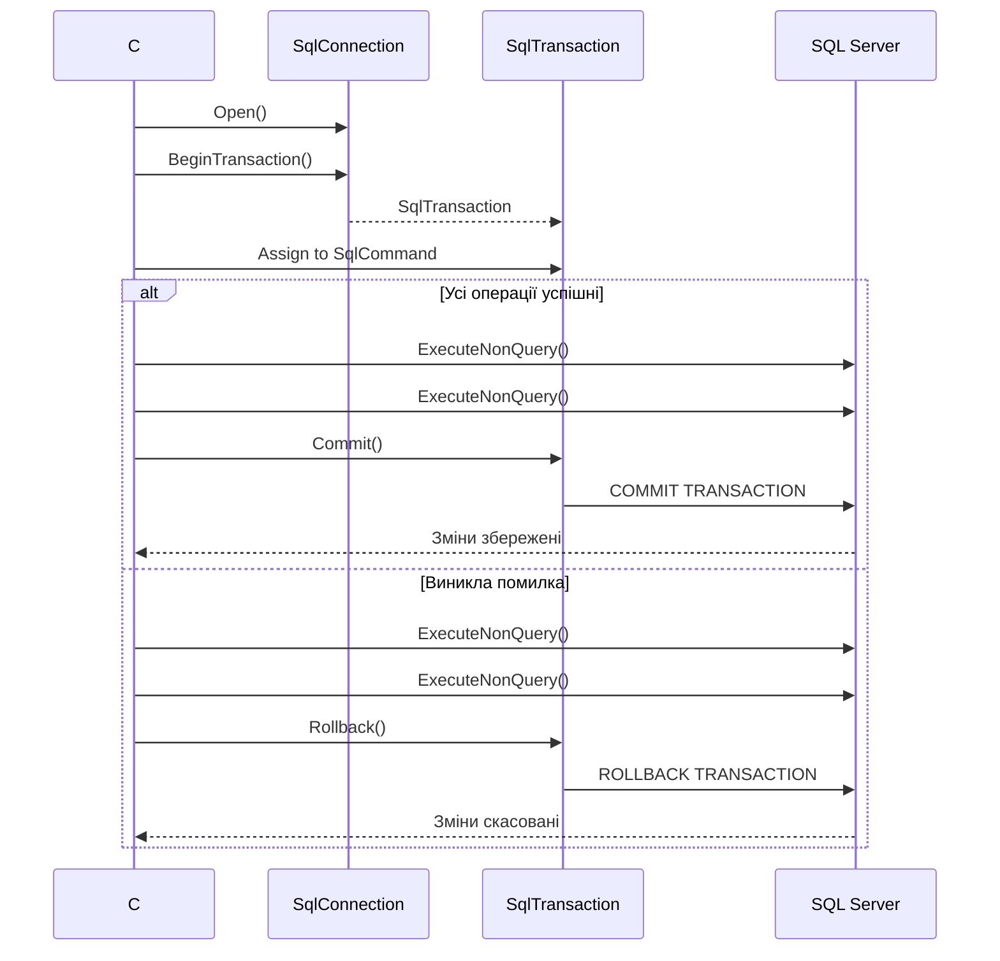
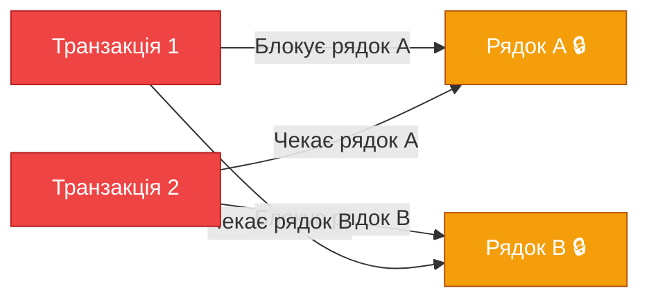

# 9.6. Транзакції в ADO.NET

## Вступ: Коли одна помилка може зруйнувати все

Уявіть систему переказу грошей між банківськими рахунками. Операція складається з двох кроків: списати 1000 ₴ з рахунку А та зарахувати 1000 ₴ на рахунок Б. Що станеться, якщо після першого кроку (списання) програма «впаде» — наприклад, з мережі пропаде з'єднання? Гроші списані з А, але не зараховані на Б. Вони «зникли».

Або інший сценарій: інтернет-магазин. Користувач оформлює замовлення — потрібно: (1) створити запис замовлення, (2) зменшити кількість товарів на складі, (3) списати кошти з рахунку клієнта. Якщо крок 2 пройшов, а крок 3 впав (недостатньо коштів), товар «зник» зі складу, але оплата не пройшла.

Ці проблеми вирішуються за допомогою **транзакцій** (transactions) — механізму, який гарантує, що група операцій виконається **повністю** або **не виконається взагалі** (атомарність). Транзакція — це як перемикач «все або нічого».

**Аналогія**: Уявіть, що ви робите бутерброд — хліб, масло, ковбаса. Транзакція — це обіцянка: або ви зробите **повний** бутерброд (усі три інгредієнти), або не зробите нічого (поверне інгредієнти назад). Якщо ковбаса зіпсована, ви не залишите хліб з маслом — ви повернете все на місце.

::note
**Передумови**: Статті [9.3. DbCommand](/1.csharp/09.ado-net/03.command-and-queries) та [9.5. Параметри](/1.csharp/09.ado-net/05.parameters-and-sql-injection). Базове розуміння SQL DML (INSERT/UPDATE/DELETE).
::

---

## Принципи ACID

Транзакції в реляційних базах даних дотримуються чотирьох фундаментальних принципів, відомих як **ACID**:

::card-group

::card{title="🔒 Atomicity (Атомарність)" icon="i-heroicons-shield-check"}
Всі операції в транзакції виконуються як **одна неподільна** одиниця. Або всі успішні, або всі відкочуються. Немає «часткового виконання».
::

::card{title="✅ Consistency (Узгодженість)" icon="i-heroicons-check-circle"}
Транзакція переводить базу з одного **валідного** стану в інший. Усі обмеження (constraints), тригери та правила залишаються дотриманими.
::

::card{title="🔐 Isolation (Ізоляція)" icon="i-heroicons-lock-closed"}
Паралельні транзакції не «бачать» проміжні результати одна одної. Кожна транзакція працює так, ніби вона **єдина** в системі.
::

::card{title="💾 Durability (Довговічність)" icon="i-heroicons-server-stack"}
Після підтвердження (COMMIT) транзакції результати **гарантовано збережені** на диску, навіть якщо сервер «впаде» через мілісекунду.
::

::

Розглянемо кожен принцип детальніше на прикладі переказу грошей.

### Atomicity — Атомарність

```
Транзакція: Переказ 1000 ₴ з рахунку А на рахунок Б

Крок 1: UPDATE Accounts SET Balance = Balance - 1000 WHERE Id = 'A'
Крок 2: UPDATE Accounts SET Balance = Balance + 1000 WHERE Id = 'B'

Без транзакції:
  ✅ Крок 1 виконано (Balance_A = 4000)
  ❌ Крок 2 не виконано (помилка мережі)
  Результат: 1000 ₴ зникло! Balance_A = 4000, Balance_B = 2000 (було 5000 + 2000 = 7000, стало 6000)

З транзакцією:
  ✅ Крок 1 виконано (у тимчасовому стані)
  ❌ Крок 2 не виконано → ROLLBACK
  Результат: Balance_A = 5000, Balance_B = 2000 (все як було)
```

### Consistency — Узгодженість

Якщо є обмеження `CHECK (Balance >= 0)` на стовпці `Balance`, транзакція не дозволить списати 6000 ₴ з рахунку, де лише 5000 ₴ — вся транзакція буде відхилена.

### Isolation — Ізоляція

Під час виконання транзакції переказу інший користувач, який перевіряє баланс рахунку А, не побачить проміжний стан (Balance = 4000 після кроку 1, але до кроку 2). Він побачить або старий баланс (5000), або новий (4000 після завершення обох кроків).

### Durability — Довговічність

Після COMMIT сервер записує результат у **журнал транзакцій** (transaction log) на диску. Навіть якщо сервер втратить живлення через мілісекунду після COMMIT, при наступному запуску SQL Server відновить стан з журналу.

---

## Транзакції в ADO.NET: Базовий паттерн

ADO.NET надає клас `SqlTransaction` для управління транзакціями. Ось базовий паттерн:

::mermaid



::

### Перший приклад: Переказ коштів

```csharp showLineNumbers
using System;
using Microsoft.Data.SqlClient;

string connectionString = "Server=localhost;Database=BankDb;Trusted_Connection=True;TrustServerCertificate=True;";
using SqlConnection connection = new SqlConnection(connectionString);
connection.Open();

// 1. Починаємо транзакцію
SqlTransaction transaction = connection.BeginTransaction();

try
{
    // 2. Прив'язуємо команди до транзакції
    using SqlCommand debitCmd = new SqlCommand(
        "UPDATE Accounts SET Balance = Balance - @Amount WHERE Id = @AccountId",
        connection,
        transaction); // ← третій параметр — транзакція!

    debitCmd.Parameters.Add("@Amount", SqlDbType.Decimal).Value = 1000m;
    debitCmd.Parameters.Add("@AccountId", SqlDbType.Int).Value = 1;

    int debitRows = debitCmd.ExecuteNonQuery();
    if (debitRows == 0)
        throw new InvalidOperationException("Рахунок відправника не знайдено.");

    // 3. Друга операція — зарахування
    using SqlCommand creditCmd = new SqlCommand(
        "UPDATE Accounts SET Balance = Balance + @Amount WHERE Id = @AccountId",
        connection,
        transaction);

    creditCmd.Parameters.Add("@Amount", SqlDbType.Decimal).Value = 1000m;
    creditCmd.Parameters.Add("@AccountId", SqlDbType.Int).Value = 2;

    int creditRows = creditCmd.ExecuteNonQuery();
    if (creditRows == 0)
        throw new InvalidOperationException("Рахунок отримувача не знайдено.");

    // 4. Все OK — фіксуємо транзакцію
    transaction.Commit();
    Console.WriteLine("✅ Переказ успішно завершено!");
}
catch (Exception ex)
{
    // 5. Помилка — відкочуємо ВСЕ
    Console.WriteLine($"❌ Помилка: {ex.Message}");

    try
    {
        transaction.Rollback();
        Console.WriteLine("↩️ Транзакцію відкочено.");
    }
    catch (Exception rollbackEx)
    {
        // Rollback теж може впасти (наприклад, з'єднання розірвано)
        Console.WriteLine($"⚠️ Помилка при rollback: {rollbackEx.Message}");
    }
}
```

**Розбір коду:**

- **Рядок 9**: `connection.BeginTransaction()` починає транзакцію. Повертає об'єкт `SqlTransaction`, який потрібно передати в кожну команду.
- **Рядки 14-17**: `SqlCommand` приймає транзакцію як **третій параметр** конструктора. Якщо забути передати транзакцію — команда виконається **поза** транзакцією, і rollback її не відкотить!
- **Рядки 22-24**: Перевіряємо `debitRows == 0` — якщо рахунок не знайдено, кидаємо виняток. Це бізнес-логіка, яка заслуговує rollback.
- **Рядок 40**: `transaction.Commit()` — фіксує **всі** зміни, зроблені в рамках транзакції. Після commit відкотити неможливо.
- **Рядок 49**: `transaction.Rollback()` — скасовує **всі** зміни. Навіть якщо перший UPDATE вже «виконаний», rollback поверне стан бази як було.
- **Рядки 48-56**: Rollback обгорнутий у окремий try-catch, тому що він теж може впасти (наприклад, якщо з'єднання вже розірвано).

::warning
**Критично важливо**: Кожна `SqlCommand`, що є частиною транзакції, **обов'язково** повинна отримати `SqlTransaction` через конструктор або властивість `cmd.Transaction = transaction`. Без цього команда виконається **поза** транзакцією!
::

---

## Покращений паттерн з using

Наведений вище паттерн з explicit try-catch-rollback є «класичним», але багатослівним. Починаючи з .NET 8+, `SqlTransaction` реалізує `IDisposable`, і якщо транзакція не була committed при Dispose — вона **автоматично** відкочується:

```csharp showLineNumbers
using System;
using Microsoft.Data.SqlClient;

string connectionString = "Server=localhost;Database=BankDb;Trusted_Connection=True;TrustServerCertificate=True;";
using SqlConnection connection = new SqlConnection(connectionString);
connection.Open();

// using автоматично rollback-нє, якщо не було Commit()
using SqlTransaction transaction = connection.BeginTransaction();

using SqlCommand debitCmd = new SqlCommand(
    "UPDATE Accounts SET Balance = Balance - @Amount WHERE Id = @AccountId",
    connection, transaction);
debitCmd.Parameters.Add("@Amount", SqlDbType.Decimal).Value = 1000m;
debitCmd.Parameters.Add("@AccountId", SqlDbType.Int).Value = 1;
debitCmd.ExecuteNonQuery();

using SqlCommand creditCmd = new SqlCommand(
    "UPDATE Accounts SET Balance = Balance + @Amount WHERE Id = @AccountId",
    connection, transaction);
creditCmd.Parameters.Add("@Amount", SqlDbType.Decimal).Value = 1000m;
creditCmd.Parameters.Add("@AccountId", SqlDbType.Int).Value = 2;
creditCmd.ExecuteNonQuery();

// Якщо дійшли сюди без винятків — фіксуємо
transaction.Commit();
Console.WriteLine("✅ Переказ завершено!");
// Якщо виникне виняток ДО Commit(), using викличе Dispose(),
// який автоматично виконає Rollback()
```

Цей паттерн значно чистіший. Якщо виняток виникне на будь-якому рядку до `Commit()`, `using`-декларація гарантує виклик `transaction.Dispose()`, який виконає `Rollback()`.

---

## Рівні ізоляції (Isolation Levels)

Пам'ятаєте принцип **Isolation** з ACID? Він говорить, що паралельні транзакції не повинні «заважати» одна одній. Але в реальності повна ізоляція — це **дорого** для продуктивності. Тому SQL Server надає кілька **рівнів ізоляції** — від мінімального до максимального.

Рівень ізоляції визначає, які **аномалії** допускаються при паралельному доступі:

### Аномалії паралельного доступу

::field-group

::field{name="Dirty Read (Брудне читання)" type="аномалія"}
Транзакція A читає рядок, який транзакція B **змінила, але ще не зафіксувала** (не зробила COMMIT). Якщо B виконає ROLLBACK, транзакція A працювала з **фантомними** даними, які ніколи не існували.
::

::field{name="Non-Repeatable Read (Неповторювальне читання)" type="аномалія"}
Транзакція A читає рядок, потім транзакція B **змінює або видаляє** цей рядок і робить COMMIT. Коли A читає рядок повторно, вона отримує **інший** результат.
::

::field{name="Phantom Read (Фантомне читання)" type="аномалія"}
Транзакція A виконує SELECT з WHERE і отримує N рядків. Потім транзакція B **вставляє** новий рядок, що відповідає WHERE. Коли A виконує той самий SELECT повторно, вона отримує N+1 рядків — «фантомний» рядок.
::

::

### Рівні ізоляції SQL Server

| Рівень | Dirty Read | Non-Repeatable Read | Phantom Read | Блокування |
|:---|:---|:---|:---|:---|
| **Read Uncommitted** | ✅ Можливо | ✅ Можливо | ✅ Можливо | Мінімальне |
| **Read Committed** ⭐ | ❌ Захищено | ✅ Можливо | ✅ Можливо | Помірне |
| **Repeatable Read** | ❌ Захищено | ❌ Захищено | ✅ Можливо | Значне |
| **Serializable** | ❌ Захищено | ❌ Захищено | ❌ Захищено | Максимальне |
| **Snapshot** | ❌ Захищено | ❌ Захищено | ❌ Захищено | Через версронність |

⭐ **Read Committed** — рівень за замовчуванням у SQL Server.

### Встановлення рівня ізоляції в ADO.NET

```csharp showLineNumbers
using Microsoft.Data.SqlClient;
using System.Data;

string connectionString = "Server=localhost;Database=ShopDb;Trusted_Connection=True;TrustServerCertificate=True;";
using SqlConnection connection = new SqlConnection(connectionString);
connection.Open();

// Рівень ізоляції задається при створенні транзакції
using SqlTransaction transaction = connection.BeginTransaction(IsolationLevel.Serializable);

using SqlCommand command = new SqlCommand(
    "SELECT Quantity FROM Products WHERE Id = @Id",
    connection, transaction);
command.Parameters.Add("@Id", SqlDbType.Int).Value = 1;

int quantity = Convert.ToInt32(command.ExecuteScalar());

if (quantity >= 5)
{
    using SqlCommand updateCmd = new SqlCommand(
        "UPDATE Products SET Quantity = Quantity - 5 WHERE Id = @Id",
        connection, transaction);
    updateCmd.Parameters.Add("@Id", SqlDbType.Int).Value = 1;
    updateCmd.ExecuteNonQuery();

    transaction.Commit();
    Console.WriteLine("✅ Товар зарезервовано.");
}
else
{
    transaction.Rollback();
    Console.WriteLine("❌ Недостатньо товару на складі.");
}
```

**Розбір коду:**

- **Рядок 9**: `IsolationLevel.Serializable` — найвищий рівень ізоляції. Гарантує, що між SELECT (рядок 14) та UPDATE (рядок 22) **жодна інша транзакція** не зможе змінити кількість товару. Без цього можлива **race condition**: два клієнти одночасно бачать `Quantity = 5`, обидва вирішують купити 5 штук, і обидва виконують UPDATE. Результат: `Quantity = -5` (якщо немає CHECK-обмеження).

### Вибір рівня ізоляції

::tabs

::tabs-item{label="Read Uncommitted"}

```csharp
// Найшвидший. Допускає Dirty Read.
// Використовуйте ЛИШЕ для звітів, де точність не критична
var tx = connection.BeginTransaction(IsolationLevel.ReadUncommitted);
```

Еквівалент `SELECT ... WITH (NOLOCK)` у T-SQL. Зр видки читання — немає блокувань. Але ви можете прочитати дані, які пізніше будуть відкочені.

**Коли використовувати**: Приблизна статистика, дашборди, звіти за «великою картинкою», де помилка в кілька відсотків не критична.

::

::tabs-item{label="Read Committed (за замовчуванням)"}

```csharp
// Баланс швидкості та консистентності
// За замовчуванням — не потрібно вказувати
var tx = connection.BeginTransaction(IsolationLevel.ReadCommitted);
// або просто:
// var tx = connection.BeginTransaction();
```

Читаються лише **зафіксовані** дані. Але між двома SELECT-запитами дані можуть змінитися.

**Коли використовувати**: Більшість OLTP-сценаріїв (онлайн-обробка транзакцій). Це розумний вибір за замовчуванням.

::

::tabs-item{label="Serializable"}

```csharp
// Найповільніший, максимальна ізоляція.
// Захищає від усіх аномалій, але може спричинити deadlock
var tx = connection.BeginTransaction(IsolationLevel.Serializable);
```

Повна серіалізація — транзакції виконуються «як ніби послідовно». Ніяких аномалій, але можливі **deadlock** та значне зниження продуктивності.

**Коли використовувати**: Фінансові операції, де точність критична (банківські перекази, розрахунки).

::

::tabs-item{label="Snapshot"}

```csharp
// Версійність замість блокувань — кожна транзакція бачить "знімок" бази
// Потрібно увімкнути на рівні бази: ALTER DATABASE mydb SET ALLOW_SNAPSHOT_ISOLATION ON
var tx = connection.BeginTransaction(IsolationLevel.Snapshot);
```

Кожна транзакція працює з **версією** даних на момент свого старту. Використовує тимчасову базу tempdb для зберігання версій.

**Коли використовувати**: Додатки з частим читанням та рідким записом. Великі запити-звіти, що не повинні блокувати INSERT/UPDATE.

::

::

---

## Save Points: Часткове відкочування

SQL Server підтримує **savepoints** — іменовані точки збереження всередині транзакції. Вони дозволяють відкотити лише **частину** операцій, не відкочуючи всю транзакцію. Це корисно, коли деякі помилки «нефатальні».

```csharp showLineNumbers
using System;
using Microsoft.Data.SqlClient;

string connectionString = "Server=localhost;Database=ShopDb;Trusted_Connection=True;TrustServerCertificate=True;";
using SqlConnection connection = new SqlConnection(connectionString);
connection.Open();

using SqlTransaction transaction = connection.BeginTransaction();

try
{
    // Крок 1: Створити замовлення (обов'язково)
    using SqlCommand orderCmd = new SqlCommand(
        @"INSERT INTO Orders (CustomerId, TotalAmount, CreatedAt)
          VALUES (@CustomerId, @Total, GETDATE());
          SELECT CAST(SCOPE_IDENTITY() AS INT);",
        connection, transaction);
    orderCmd.Parameters.Add("@CustomerId", SqlDbType.Int).Value = 1;
    orderCmd.Parameters.Add("@Total", SqlDbType.Decimal).Value = 5000m;
    int orderId = Convert.ToInt32(orderCmd.ExecuteScalar());
    Console.WriteLine($"Замовлення #{orderId} створено.");

    // Крок 2: Спробувати застосувати знижку (необов'язково)
    transaction.Save("BeforeDiscount"); // ← SAVEPOINT

    try
    {
        using SqlCommand discountCmd = new SqlCommand(
            @"UPDATE Orders SET TotalAmount = TotalAmount * 0.9
              WHERE Id = @OrderId AND TotalAmount > 3000",
            connection, transaction);
        discountCmd.Parameters.Add("@OrderId", SqlDbType.Int).Value = orderId;
        discountCmd.ExecuteNonQuery();

        // Перевіряємо, що знижка не зробила суму від'ємною (бізнес-правило)
        using SqlCommand checkCmd = new SqlCommand(
            "SELECT TotalAmount FROM Orders WHERE Id = @OrderId",
            connection, transaction);
        checkCmd.Parameters.Add("@OrderId", SqlDbType.Int).Value = orderId;
        decimal total = Convert.ToDecimal(checkCmd.ExecuteScalar());

        if (total < 100)
            throw new InvalidOperationException("Знижка занадто велика!");

        Console.WriteLine($"Знижку 10% застосовано. Нова сума: {total:C}");
    }
    catch (Exception ex)
    {
        // Відкочуємо ЛИШЕ знижку, замовлення залишається!
        Console.WriteLine($"⚠️ Не вдалося застосувати знижку: {ex.Message}");
        transaction.Rollback("BeforeDiscount"); // ← rollback до savepoint
    }

    // Крок 3: Зменшити кількість на складі (обов'язково)
    using SqlCommand stockCmd = new SqlCommand(
        "UPDATE Products SET Quantity = Quantity - 1 WHERE Id = @ProductId",
        connection, transaction);
    stockCmd.Parameters.Add("@ProductId", SqlDbType.Int).Value = 1;
    stockCmd.ExecuteNonQuery();

    // Фіксуємо всю транзакцію
    transaction.Commit();
    Console.WriteLine("✅ Замовлення оформлено!");
}
catch (Exception ex)
{
    Console.WriteLine($"❌ Критична помилка: {ex.Message}");
    transaction.Rollback(); // Повний rollback
}
```

**Розбір коду:**

- **Рядок 24**: `transaction.Save("BeforeDiscount")` — створює іменовану точку збереження. SQL Server запам'ятовує стан на цьому етапі.
- **Рядок 50**: `transaction.Rollback("BeforeDiscount")` — відкочує зміни **тільки після** savepoint. Замовлення (крок 1) залишається valid.
- Зверніть увагу: savepoint **не рівень транзакції** — це лише «мітка» всередині однієї транзакції. Після rollback до savepoint транзакція **все ще активна**.

---

## Deadlocks: Взаємні блокування

**Deadlock** (взаємне блокування) — це ситуація, коли дві (або більше) транзакції **блокують одна одну** і не можуть продовжити:

::mermaid



::

SQL Server автоматично **виявляє** deadlock і «вбиває» одну з транзакцій (жертву, victim), кидаючи `SqlException` з кодом **1205**. Друга транзакція продовжує роботу.

### Обробка deadlock в C#

```csharp showLineNumbers
async Task ExecuteWithDeadlockRetryAsync(
    SqlConnection connection,
    Func<SqlTransaction, Task> operation,
    int maxRetries = 3)
{
    for (int attempt = 1; attempt <= maxRetries; attempt++)
    {
        using SqlTransaction transaction = connection.BeginTransaction();

        try
        {
            await operation(transaction);
            transaction.Commit();
            return; // Успіх — виходимо
        }
        catch (SqlException ex) when (ex.Number == 1205 && attempt < maxRetries)
        {
            // Deadlock — повторна спроба
            Console.WriteLine($"⚠️ Deadlock (спроба {attempt}/{maxRetries}). Повтор...");
            await Task.Delay(Random.Shared.Next(50, 200)); // Random delay
        }
        // Інші SqlException не перехоплюються — летять далі
    }

    throw new InvalidOperationException($"Операція не вдалася після {maxRetries} deadlock-ів.");
}

// Використання
await ExecuteWithDeadlockRetryAsync(connection, async (transaction) =>
{
    using SqlCommand cmd = new SqlCommand(
        "UPDATE Accounts SET Balance = Balance - 1000 WHERE Id = 1",
        connection, transaction);
    await cmd.ExecuteNonQueryAsync();

    using SqlCommand cmd2 = new SqlCommand(
        "UPDATE Accounts SET Balance = Balance + 1000 WHERE Id = 2",
        connection, transaction);
    await cmd2.ExecuteNonQueryAsync();
});
```

**Розбір коду:**

- **Рядок 16**: `ex.Number == 1205` — код deadlock. Перехоплюємо лише его, решта помилок пролітають далі.
- **Рядок 20**: Random delay перед повторною спробою — запобігає «синхронному» повтору, який може знову призвести до deadlock.
- **Рядок 2**: Операція передається як `Func<SqlTransaction, Task>` — це дозволяє повторно виконати **всю** логіку транзакції, а не лише останню команду.

### Як зменшити ризик deadlock

::tip
1. **Єдиний порядок доступу**: Якщо дві транзакції працюють з таблицями A та B, обидві повинні звертатися до них у **одному порядку** (спочатку A, потім B).
2. **Короткі транзакції**: Чим менше часу транзакція утримує блокування, тим менше шанс deadlock.
3. **Мінімальний рівень ізоляції**: Не використовуйте Serializable без вагомої причини.
4. **Правильні індекси**: Індекси зменшують кількість рядків, які потрібно блокувати.
::

---

## TransactionScope: Розподілені транзакції

`TransactionScope` — це альтернативний механізм управління транзакціями, який працює на рівні **ambient transaction** (фонова транзакція). Він автоматично «підхоплює» всі ADO.NET-з'єднання, відкриті всередині scope:

```csharp showLineNumbers
using System.Transactions;
using Microsoft.Data.SqlClient;

string cs1 = "Server=localhost;Database=BankDb;Trusted_Connection=True;TrustServerCertificate=True;";
string cs2 = "Server=localhost;Database=AuditDb;Trusted_Connection=True;TrustServerCertificate=True;";

// TransactionScope автоматично керує транзакціями
using (TransactionScope scope = new TransactionScope())
{
    // Операція 1: Переказ грошей (BankDb)
    using (SqlConnection conn1 = new SqlConnection(cs1))
    {
        conn1.Open();
        using SqlCommand cmd = new SqlCommand(
            "UPDATE Accounts SET Balance = Balance - 1000 WHERE Id = 1",
            conn1);
        cmd.ExecuteNonQuery();
    }

    // Операція 2: Запис в аудит (AuditDb) — ІНША база!
    using (SqlConnection conn2 = new SqlConnection(cs2))
    {
        conn2.Open();
        using SqlCommand cmd = new SqlCommand(
            "INSERT INTO AuditLog (Action, Details, CreatedAt) VALUES (@Act, @Det, GETDATE())",
            conn2);
        cmd.Parameters.AddWithValue("@Act", "Transfer");
        cmd.Parameters.AddWithValue("@Det", "1000 UAH from Account 1");
        cmd.ExecuteNonQuery();
    }

    // Фіксуємо ОБІ операції атомарно
    scope.Complete();
    Console.WriteLine("✅ Переказ та аудит завершені!");
}
// Якщо Complete() не викликано (виняток) — обидві операції rollback
```

**Розбір коду:**

- **Рядок 8**: `TransactionScope` створює «фонову» транзакцію. Усі `SqlConnection`, відкриті всередині scope, автоматично приєднуються до неї.
- **Рядки 11-29**: Дві операції на **різних** базах включені в одну атомарну транзакцію. Якщо аудит-запис не вдасться — переказ теж відкотиться.
- **Рядок 33**: `scope.Complete()` — «голосування» за commit. Фактичний commit відбувається при виході з using-блоку.

::warning
**Розподілені транзакції** (distributed transactions) потребують **Microsoft Distributed Transaction Coordinator** (MSDTC). На Linux MSDTC не підтримується. Для крос-платформенних додатків розподілені транзакції слід уникати.
::

### TransactionScope з async

Для асинхронного коду потрібно використовувати `TransactionScopeAsyncFlowOption`:

```csharp showLineNumbers
using (var scope = new TransactionScope(
    TransactionScopeAsyncFlowOption.Enabled)) // ← Обов'язково для async
{
    using SqlConnection connection = new SqlConnection(connectionString);
    await connection.OpenAsync();

    using SqlCommand cmd = new SqlCommand("UPDATE ...", connection);
    await cmd.ExecuteNonQueryAsync();

    scope.Complete();
}
```

---

## Практичні завдання

### Рівень 1: Базовий

::steps

### Завдання 1.1: Безпечний переказ

Створіть базу `BankDb` з таблицею `Accounts` (Id, OwnerName, Balance). Реалізуйте метод `Transfer(int fromId, int toId, decimal amount)`:
1. Перевірте, що обидва рахунки існують.
2. Перевірте, що на рахунку відправника достатньо коштів.
3. Якщо все ОК — виконайте переказ у транзакції.
4. Якщо щось не так — rollback з поясненням причини.
5. Додайте запис у таблицю `TransactionLog` (FromId, ToId, Amount, CreatedAt).

### Завдання 1.2: Batch-вставка в транзакції

Напишіть метод `int BulkInsertProducts(List<Product> products)`, який:
1. Вставляє всі товари в одній транзакції.
2. Якщо будь-яка вставка впаде (наприклад, дублікат назви) — всі відкочуються.
3. Повертає кількість вставлених рядків.

::

### Рівень 2: Логіка та обробка даних

::steps

### Завдання 2.1: Оформлення замовлення

Реалізуйте метод `PlaceOrder(int customerId, List<(int ProductId, int Qty)> items)`:
1. Створіть запис у таблиці `Orders`.
2. Для кожного товару: зменшіть `Quantity` в `Products`, створіть запис у `OrderItems`.
3. Якщо якогось товару недостатньо — rollback всього замовлення.
4. Використайте savepoint: спробуйте застосувати знижку. Якщо не вийде — збережіть замовлення без знижки.

### Завдання 2.2: Демонстрація рівнів ізоляції

Створіть програму, яка демонструє різницю між `Read Committed` та `Read Uncommitted`:
1. Транзакція A: UPDATE → WAITFOR DELAY '00:00:05' → ROLLBACK.
2. Транзакція B (паралельна): SELECT того ж рядка.
3. При `Read Committed`: транзакція B чекає 5 секунд.
4. При `Read Uncommitted`: транзакція B одразу бачить «брудні» дані.

::

### Рівень 3: Архітектура

::steps

### Завдання 3.1: Unit of Work

Реалізуйте патерн **Unit of Work** для ADO.NET:
1. Клас `UnitOfWork`: містить `SqlConnection` та `SqlTransaction`.
2. Метод `Begin()` → починає транзакцію.
3. Метод `Commit()` → фіксує.
4. Метод `Rollback()` → відкочує.
5. Реалізує `IDisposable` з автоматичним rollback.
6. Repositories (`ProductRepository`, `OrderRepository`) отримують `UnitOfWork` і використовують його з'єднання та транзакцію.

### Завдання 3.2: Deadlock Simulator

Створіть програму, яка **навмисно** створює deadlock:
1. Два потоки: один оновлює рядки A→B, інший B→A.
2. Обробіть `SqlException` з кодом `1205`.
3. Реалізуйте retry з exponential backoff.
4. Виведіть статистику: скільки deadlock-ів виникло, скільки ретраїв знадобилося.

::

---

## Резюме

::card-group

::card{title="ACID" icon="i-heroicons-shield-check"}
Транзакції гарантують Atomicity (все або нічого), Consistency (валідний стан), Isolation (паралельні транзакції не заважають), Durability (результат зберігається надійно).
::

::card{title="Commit / Rollback" icon="i-heroicons-arrows-right-left"}
`Commit()` фіксує всі зміни. `Rollback()` скасовує все. Використовуйте `using SqlTransaction` для автоматичного rollback при помилках.
::

::card{title="Рівні ізоляції" icon="i-heroicons-adjustments-horizontal"}
Read Committed (за замовчуванням) для більшості задач. Serializable для критичних фінансових операцій. Snapshot для read-heavy навантажень.
::

::card{title="Deadlock" icon="i-heroicons-exclamation-triangle"}
Взаємне блокування транзакцій. SQL Server автоматично виявляє (код 1205). Обробляйте через retry з random delay.
::

::

### Ключові поняття

- **Транзакція** — атомарна одиниця роботи: все або нічого
- **ACID** — Atomicity, Consistency, Isolation, Durability
- **Isolation Level** — рівень ізоляції паралельних транзакцій
- **Savepoint** — іменована точка для часткового rollback
- **Deadlock** — взаємне блокування, код помилки 1205
- **TransactionScope** — ambient-транзакція для розподілених сценаріїв

::tip
**Наступний крок**: У наступній статті ми розглянемо **DbProviderFactory** — механізм для створення провайдер-незалежного коду, який може працювати з будь-якою СУБД без зміни логіки.
::
